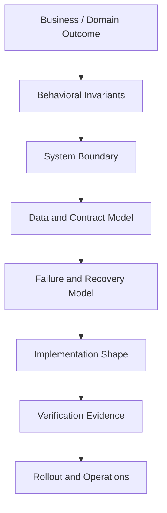
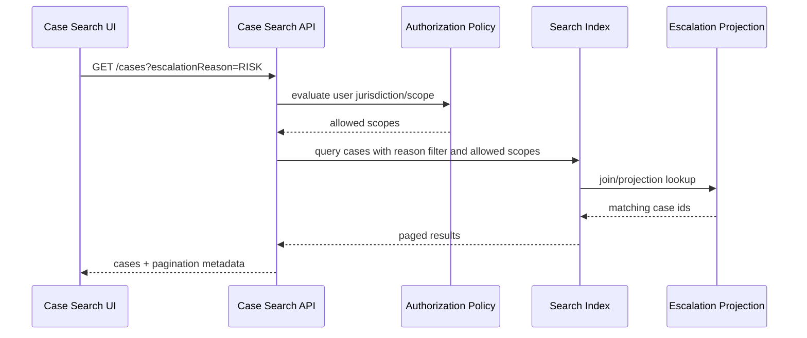
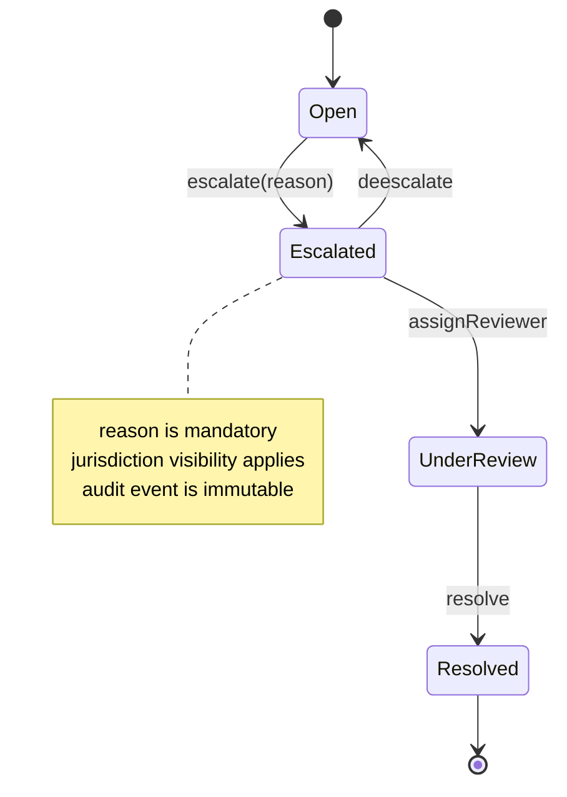
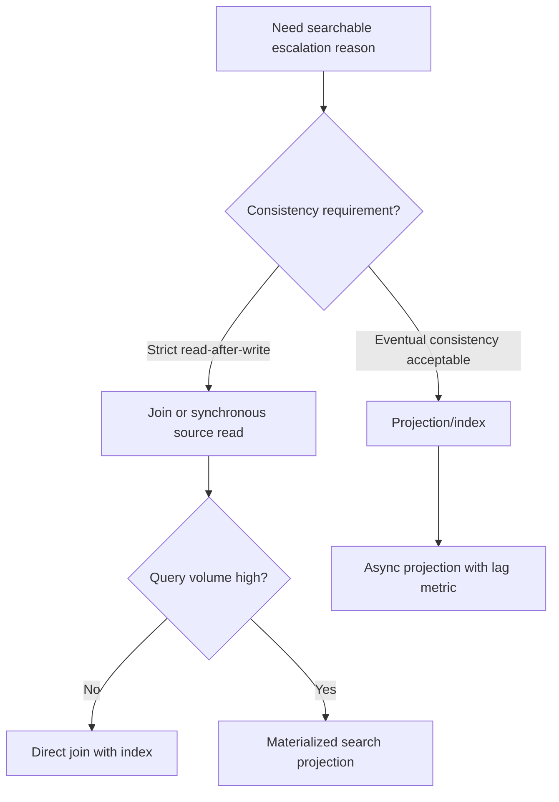

------
title: Learn AI Development Driven Implementation and Usage - Part 009
description: AI-assisted technical design: how to use AI to explore design options, make trade-offs explicit, model failure paths, produce diagrams, and convert design decisions into implementation-ready evidence.
series: learn-ai-development-driven-implementation-usage
seriesTitle: Learn AI Development Driven Implementation and Usage
order: 9
partTitle: AI-Assisted Technical Design
tags:
- ai
- technical-design
- architecture
- software-engineering
- decision-records
- failure-modeling
- series
date: 2026-06-30
---

# Part 009 — AI-Assisted Technical Design

> Goal: setelah bagian ini, kamu mampu memakai AI untuk mempercepat **technical design** tanpa menyerahkan judgement arsitektural kepada AI. Output akhirnya bukan “jawaban AI”, melainkan design evidence: option, trade-off, invariant, risk, diagram, migration plan, dan decision record yang bisa dipertanggungjawabkan.

AI coding agent bisa menulis kode, memperbaiki bug, dan membuka PR. Namun untuk pekerjaan staff-level, bagian paling mahal sering bukan mengetik kode, melainkan memilih desain yang benar di bawah constraint yang tidak lengkap.

Technical design adalah proses menjawab:

```text
What should we build, where should it live, how should it behave,
what can go wrong, how do we verify it, and why is this option better
than the alternatives under our current constraints?
```

AI sangat berguna untuk memperluas ruang opsi, menemukan blind spot, membuat diagram, membandingkan konsekuensi, dan menyiapkan review artifact. AI berbahaya ketika dipakai sebagai oracle yang “memutuskan desain” tanpa konteks domain, constraint operasional, dan ownership manusia.

---

## 1. Kaufman Skill Deconstruction

Dalam kerangka Josh Kaufman, skill besar harus dipecah menjadi sub-skill yang bisa dilatih secara terpisah. Untuk AI-assisted technical design, sub-skill-nya adalah:

| Sub-skill | Tujuan | Bukti mastery |
|---|---|---|
| Problem framing | Mengunci masalah yang benar | Problem statement tidak tercampur solusi |
| Constraint extraction | Menemukan batas desain | Constraint eksplisit: latency, security, audit, compatibility |
| Option generation | Membuat beberapa desain masuk akal | Minimal 3 opsi dengan trade-off |
| Option elimination | Membuang opsi yang buruk | Rejection reason berbasis constraint |
| Failure modeling | Mencari failure path sebelum coding | Failure matrix dan mitigation |
| Interface design | Menentukan boundary sistem | API/event/schema contract jelas |
| Migration design | Membuat perubahan bisa dirilis aman | Rollout, rollback, backfill, compatibility plan |
| Review artifact writing | Membuat keputusan bisa diaudit | ADR, diagram, checklist, test plan |
| Self-correction | Menguji kelemahan desain sendiri | Red-team prompt dan unresolved question log |

Kaufman juga menekankan “learn enough to self-correct”. Dalam konteks ini, self-correction berarti kamu mampu membaca output desain AI dan langsung mendeteksi:

- asumsi yang tidak disebutkan,
- solusi yang terlalu generik,
- boundary yang kabur,
- data migration yang dilupakan,
- security/audit path yang tidak diuji,
- backward compatibility yang tidak dipikirkan,
- diagram yang indah tetapi tidak executable,
- desain yang cocok untuk blog post tetapi tidak cocok untuk sistem produksi.

---

## 2. AI-Assisted Design Is Not AI-Owned Design

Ada perbedaan besar antara:

```text
Ask AI to design the solution.
```

Dan:

```text
Use AI to pressure-test, structure, compare, and document a design
that remains owned by engineers.
```

Model mental yang aman:

| Peran | AI boleh melakukan | Engineer wajib melakukan |
|---|---|---|
| Research assistant | Menyusun opsi, pattern, checklist | Memvalidasi relevansi terhadap sistem nyata |
| Design sparring partner | Menyerang asumsi, mencari edge case | Memilih trade-off akhir |
| Diagram assistant | Membuat sequence/component/state diagram | Memastikan diagram sesuai code reality |
| Risk enumerator | Menemukan failure mode umum | Menentukan mitigation dan severity aktual |
| Documentation drafter | Membuat ADR/design doc draft | Menandatangani decision record |
| Implementation planner | Mengusulkan task breakdown | Menentukan slice, owner, rollout, stop condition |

Prinsip utamanya:

```text
AI may expand the design space.
AI must not silently narrow the accountability space.
```

---

## 3. The Technical Design Input Contract

AI tidak bisa membuat design yang baik dari input yang kabur. Sebelum meminta bantuan AI, siapkan **Technical Design Input Contract**.

```yaml
problem:
  statement: "What problem are we solving?"
  user_or_system_impact: "Who is affected and how?"
  non_goals:
    - "What are we explicitly not solving?"

current_system:
  modules:
    - "Relevant modules/services"
  data_model:
    - "Relevant entities/tables/events"
  integration_points:
    - "APIs, queues, jobs, external services"
  known_constraints:
    - "Operational or legacy constraints"

requirements:
  functional:
    - "Expected behavior"
  non_functional:
    - "Latency, throughput, security, audit, privacy, cost"
  compatibility:
    - "Backward/forward compatibility requirements"

risk_context:
  data_sensitivity: "public/internal/confidential/regulated"
  blast_radius: "single tenant/multi tenant/global"
  rollback_tolerance: "easy/hard/impossible"

verification:
  expected_tests:
    - "Unit/integration/contract/migration/performance/security"
  evidence_required:
    - "What must be shown in PR"
```

Kalau input ini belum ada, minta AI membantu menyusunnya dulu, bukan langsung mendesain solusi.

---

## 4. Design Framing Stack

Technical design harus dimulai dari layer paling stabil, bukan dari class, endpoint, atau framework.



AI sering langsung melompat ke implementation shape. Staff-level engineer menarik desain kembali ke atas:

```text
Before proposing classes or endpoints, identify the behavioral invariant,
system boundary, data ownership, failure mode, and verification evidence.
```

---

## 5. Six-Pass AI Design Workflow

Jangan meminta AI “buatkan desain” sekali jalan. Gunakan multi-pass workflow.

### Pass 1 — Problem Compression

Tujuan: memaksa AI merangkum masalah tanpa solusi.

```text
Summarize the problem in 5 bullets.
Do not propose a solution yet.
Separate confirmed facts, assumptions, and unknowns.
```

Output yang diharapkan:

| Category | Example |
|---|---|
| Confirmed fact | Escalation case already has reason_code in audit table |
| Assumption | Search API can access escalation metadata synchronously |
| Unknown | Whether reason_code is tenant-specific taxonomy |

Kalau AI tidak bisa memisahkan fact vs assumption, jangan lanjut ke desain.

### Pass 2 — Constraint Extraction

Tujuan: menemukan batas desain.

```text
Extract constraints from the requirement and code context.
Group them into domain, data, API, security, performance, compatibility,
operation, and rollout constraints.
For each constraint, explain what kind of solution it rules out.
```

Contoh:

| Constraint | Rules out |
|---|---|
| Existing API consumers depend on current pagination semantics | Any design that changes default ordering or total count semantics |
| Escalation reason is jurisdiction-sensitive | Any cache key that ignores jurisdiction |
| Audit history must be immutable | Any update-in-place migration against historical audit rows |

### Pass 3 — Option Generation

Tujuan: mendapatkan beberapa desain, bukan satu jawaban.

```text
Propose 3 viable designs.
For each design, include data changes, API changes, migration needs,
performance impact, operational risk, and test strategy.
Do not choose a winner yet.
```

Format output:

| Option | Summary | When it fits | Main risk |
|---|---|---|---|
| A | Join search query to escalation table | Small dataset, strict consistency | Query cost |
| B | Denormalize searchable reason into case index | High-read system | Index drift |
| C | Async projection table | Complex filters, audit separation | Eventual consistency |

### Pass 4 — Trade-Off Pressure Test

Tujuan: menguji opsi dengan constraint nyata.

```text
Evaluate the options against these criteria:
correctness, latency, consistency, migration risk, backward compatibility,
auditability, operability, implementation complexity, and rollback safety.
Use a score only after giving qualitative reasoning.
```

Jangan percaya angka skor jika alasan kualitatif lemah. Skor hanya shorthand, bukan kebenaran.

### Pass 5 — Failure Modeling

Tujuan: mencari apa yang rusak sebelum implementasi.

```text
For the leading design, enumerate failure modes.
Include trigger, symptom, detection, blast radius, mitigation, and test.
Focus on realistic production failures, not generic warnings.
```

Contoh failure matrix:

| Failure mode | Trigger | Symptom | Detection | Mitigation | Test |
|---|---|---|---|---|---|
| Projection lag | Event consumer delayed | Search misses latest reason | Lag metric, reconciliation job | Fallback read or user-visible consistency note | Integration test with delayed event |
| Incorrect jurisdiction filter | Cache key misses jurisdiction | User sees invalid reason | Authorization test, audit log anomaly | Include jurisdiction in key, deny by default | Multi-jurisdiction contract test |
| Backfill partial failure | Batch job stops mid-run | Mixed search results | Backfill progress table | Idempotent backfill, resume token | Restartable migration test |

### Pass 6 — Decision Record Draft

Tujuan: menghasilkan artifact yang bisa direview.

```text
Draft an ADR with context, decision, alternatives considered,
consequences, rollout plan, rollback plan, and verification plan.
Use only facts and assumptions from this conversation.
Mark unresolved questions explicitly.
```

---

## 6. Design Modes

AI-assisted technical design tidak selalu berarti architecture design besar. Ada beberapa mode.

### 6.1 Exploration Mode

Dipakai ketika masalah belum jelas.

Output:

- problem summary,
- unknown list,
- possible solution families,
- required discovery tasks,
- decision criteria.

Prompt:

```text
Act as a senior engineer helping frame the problem.
Do not design implementation yet.
Identify what must be discovered before a safe design can be chosen.
```

### 6.2 Option Comparison Mode

Dipakai ketika ada beberapa solusi.

Output:

- option matrix,
- trade-off narrative,
- rejected options,
- recommendation with caveats.

Prompt:

```text
Compare these options under the given constraints.
Avoid generic pros/cons.
Explain which constraints dominate the decision.
```

### 6.3 Failure-Mode Mode

Dipakai untuk sistem produksi, migration, security, atau regulated workflows.

Output:

- failure matrix,
- detection strategy,
- rollback boundary,
- blast-radius analysis,
- operational runbook sketch.

Prompt:

```text
Red-team this design.
Find failure modes that would survive normal unit tests.
Prioritize failures that affect data integrity, authorization, auditability,
or irreversible state transition.
```

### 6.4 Interface Boundary Mode

Dipakai saat membuat API, event, schema, module boundary.

Output:

- contract shape,
- compatibility rule,
- error behavior,
- versioning/migration strategy,
- consumer impact.

Prompt:

```text
Review this interface boundary.
Identify ambiguity, compatibility risks, invalid states,
idempotency concerns, and contract tests required.
```

### 6.5 Migration Mode

Dipakai untuk schema/data/behavior changes.

Output:

- expand-contract plan,
- backfill strategy,
- dual-read/dual-write if needed,
- observability,
- rollback plan,
- cleanup criteria.

Prompt:

```text
Design a safe migration plan.
Use expand-contract where possible.
Assume deployment can fail between any two steps.
Explain rollback behavior for each step.
```

---

## 7. Design Artifact Types

AI bisa membantu membuat beberapa artifact. Jangan semua artifact dipakai untuk semua masalah. Pilih yang sesuai risk.

| Artifact | Kapan dipakai | Output minimal |
|---|---|---|
| One-page design brief | Small feature, medium risk | Problem, option, decision, tests |
| ADR | Decision has long-term consequence | Context, decision, alternatives, consequences |
| Sequence diagram | Cross-service behavior | Request/event flow and failure branch |
| State diagram | Lifecycle workflow | States, transitions, guards, terminal states |
| Data flow diagram | Sensitive data movement | Source, sink, transformation, access boundary |
| Migration plan | Schema/data behavior change | Expand, backfill, switch, contract, rollback |
| Threat model sketch | Security-sensitive change | Assets, actors, trust boundary, abuse cases |
| Test strategy | Complex behavior | Test levels and confidence rationale |

---

## 8. Mermaid Diagrams as Design Compression

Diagram bukan dekorasi. Diagram adalah cara memaksa boundary dan sequence menjadi eksplisit.

### 8.1 Sequence Diagram



Gunakan sequence diagram untuk bertanya:

- boundary authorization ada sebelum atau sesudah query?
- data reason berasal dari source of truth atau projection?
- pagination dihitung sebelum atau sesudah filter?
- apakah failure projection mengubah response?

### 8.2 State Diagram



Gunakan state diagram ketika AI mulai mengusulkan field baru tanpa memahami lifecycle.

### 8.3 Decision Flow



Decision flow berguna untuk menghindari “one-size-fits-all architecture”.

---

## 9. The Option Matrix Pattern

AI sering memberi pros/cons yang generik. Pakai matrix berbasis criteria yang relevan.

```md
| Criteria | Option A: Direct Join | Option B: Denormalized Index | Option C: Projection Table |
|---|---|---|---|
| Correctness | Strong consistency | Risk of index drift | Eventual consistency |
| Latency | May degrade under filter | Fast reads | Fast reads if projection indexed |
| Migration | Small schema/query change | Requires reindex | Requires projection build/backfill |
| Rollback | Easy if query guarded | Medium, index cleanup | Medium, consumer/job cleanup |
| Auditability | Reads from source | Requires source trace | Projection must retain source pointer |
| Complexity | Low | Medium | High |
```

Lalu minta AI menulis reasoning:

```text
For each row, explain the consequence in this system.
Do not use generic phrases like "more scalable" unless you define the workload.
```

---

## 10. Technical Design Prompt Template

Gunakan template ini untuk design work yang medium-to-high risk.

```text
You are assisting with technical design, not final decision-making.

Context:
- System: <system/module>
- Current behavior: <summary>
- Desired behavior: <summary>
- Constraints: <domain/security/performance/compatibility/rollout>
- Non-goals: <what must not be changed>
- Known unknowns: <questions>

Task:
1. Restate the problem without proposing a solution.
2. Extract constraints and explain what each constraint rules out.
3. Propose 3 viable designs.
4. Compare them using correctness, compatibility, operability, testability,
   rollback safety, complexity, and cost.
5. Identify failure modes for the leading design.
6. Draft an ADR.

Rules:
- Mark assumptions explicitly.
- Do not invent existing APIs/classes/tables unless provided.
- Prefer small, reversible changes.
- Include tests and rollout plan.
- Include unresolved questions.
```

---

## 11. Red-Team Prompt Template

Setelah AI menghasilkan desain, jangan langsung percaya. Jalankan red-team pass.

```text
Red-team this design as a staff engineer reviewing a production change.
Find issues in:
- domain invariant preservation
- authorization and data visibility
- transaction boundaries
- idempotency
- backward compatibility
- migration safety
- observability
- rollback
- test gaps
- operational ownership

For each issue, include severity, why it matters, and the minimal design change
that would reduce the risk.
```

Output ideal:

| Issue | Severity | Why it matters | Minimal fix |
|---|---|---|---|
| Reason filter applied before jurisdiction filter | High | Could expose cases across jurisdictions | Apply authorization scope before search filter or include scope in query predicate |
| Backfill not idempotent | Medium | Failed job can corrupt derived index | Use checkpoint table and deterministic upsert |
| No contract test for invalid reason | Medium | API behavior may diverge across clients | Add invalid enum/error-shape contract test |

---

## 12. Assumption Ledger

Setiap design doc yang dibantu AI harus memiliki assumption ledger.

```md
## Assumptions

| ID | Assumption | Confidence | Impact if wrong | How to validate |
|---|---:|---:|---|---|
| A1 | escalation_reason already exists in audit event payload | Medium | Requires producer change | Inspect event schema and sample payload |
| A2 | search API owns filtering logic | High | Implementation location may change | Confirm module boundary |
| A3 | eventual consistency under 30s is acceptable | Low | Projection design may be invalid | Ask product/compliance owner |
```

Aturan:

```text
An assumption without validation path is not an engineering assumption.
It is a hidden risk.
```

---

## 13. Design for Reviewability

AI-assisted design harus menghasilkan keputusan yang reviewer bisa cek cepat.

Reviewer biasanya ingin tahu:

- apa yang berubah,
- mengapa desain ini dipilih,
- alternatif apa yang ditolak,
- invariant apa yang dilindungi,
- risiko apa yang tersisa,
- test apa yang membuktikan perubahan,
- bagaimana rollback dilakukan,
- apakah ada data/security/compatibility impact.

Minimal reviewable design format:

```md
# Design: <title>

## Problem
<one paragraph>

## Decision
<chosen design>

## Why this design
<constraint-based reasoning>

## Alternatives considered
<option matrix summary>

## Invariants
<rules that must not break>

## Failure modes
<top realistic failures>

## Migration / rollout
<steps>

## Verification
<tests, commands, evidence>

## Unresolved questions
<explicit list>
```

---

## 14. Example: AI-Assisted Design for Escalation Reason Search

### 14.1 Raw requirement

```text
Users need to filter cases by escalation reason.
```

### 14.2 Framed problem

```text
Enable case search users to filter case results by escalation reason while preserving
jurisdiction visibility, pagination semantics, audit immutability, and backward-compatible
API behavior.
```

### 14.3 Constraints

| Constraint | Design impact |
|---|---|
| Escalation reason is part of audit history | Do not mutate historical audit records |
| Search is paginated | Filtering must happen before total count calculation |
| Users have jurisdiction-limited visibility | Authorization predicate must be applied in query/projection |
| Existing clients do not send reason filter | Default response must remain unchanged |
| Reason values are controlled taxonomy | Invalid value must return existing validation error shape |

### 14.4 Options

| Option | Description | Fit |
|---|---|---|
| A | Join case search query with latest escalation reason table | Good for strict consistency and moderate volume |
| B | Add escalation reason to search index | Good for high read volume but requires reindex/drift monitoring |
| C | Build async projection table keyed by case id and jurisdiction | Good for complex filter and audit separation, higher complexity |

### 14.5 Leading decision

```text
Choose Option A first if query volume and schema support it.
Guard with explain-plan review and add index on latest_escalation(case_id, reason_code, jurisdiction_id).
If query cost exceeds threshold, evolve to projection/index in a later slice.
```

### 14.6 Failure mode

| Failure | Detection | Mitigation |
|---|---|---|
| Query becomes slow for reason filter | Slow query log, latency metric by filter | Add composite index, feature flag, fallback path |
| Invalid reason behavior inconsistent | Contract test | Centralize validation through existing enum validator |
| Authorization predicate missed | Security test | Compose query from authorized scope first |

---

## 15. When AI Design Output Is Dangerous

Be skeptical when AI output has these signals:

| Signal | Why dangerous |
|---|---|
| “Use microservices” without workload reason | Architecture theater |
| “Add cache” without invalidation model | Hidden correctness risk |
| “Make it event-driven” without consistency model | Eventual consistency surprise |
| “Use CQRS” for simple read path | Complexity inflation |
| “Add abstraction layer” without multiple concrete variants | Indirection debt |
| No rollback plan | Production naivety |
| No data migration plan | Incomplete implementation |
| No test evidence | Unreviewable design |
| Assumes non-existent code structure | Hallucinated repository model |

A good AI-assisted design should feel less like magic and more like a well-structured engineering memo.

---

## 16. Design Granularity Rules

AI can help at multiple granularity levels. Choose the right one.

| Change type | Design granularity |
|---|---|
| Small bug fix | Mini design note in issue/PR |
| API behavior change | Contract-focused design brief |
| Database migration | Migration plan + rollback table |
| Cross-service workflow | Sequence diagram + failure model |
| Lifecycle/state change | State machine + transition guard table |
| Security-sensitive change | Threat model + authorization matrix |
| Platform-level change | ADR + rollout plan + operational ownership |

Rule:

```text
Design depth should scale with blast radius, not with developer excitement.
```

---

## 17. Non-Functional Requirement Extraction

AI is useful for finding NFRs the requirement omitted. Ask explicitly.

```text
Given this feature, identify likely non-functional requirements.
Separate must-have, should-have, and questions to confirm.
```

Common NFR categories:

| Category | Questions |
|---|---|
| Latency | Does new filter affect p95/p99 response? |
| Throughput | Does query path scale under common workload? |
| Consistency | Must new data be visible immediately? |
| Security | Can data visibility change by user/tenant/jurisdiction? |
| Privacy | Is sensitive data copied into logs/indexes/prompts? |
| Audit | Must decisions be reconstructable later? |
| Operability | Can support diagnose failures? |
| Cost | Does solution add expensive model/tool/cloud calls? |
| Compatibility | Do old clients keep working? |
| Maintainability | Can future teams understand ownership? |

---

## 18. Design Review Checklist

Before implementation, use this checklist.

```md
## AI-Assisted Design Review Checklist

- [ ] Problem statement is solution-neutral.
- [ ] Functional behavior is explicit.
- [ ] Non-goals are explicit.
- [ ] Constraints are extracted and tied to design consequences.
- [ ] At least 2 alternatives were considered.
- [ ] Rejected alternatives have concrete reasons.
- [ ] Domain invariants are listed.
- [ ] Security/privacy/authorization impact is reviewed.
- [ ] Data migration/backfill/cleanup are considered.
- [ ] Backward compatibility is addressed.
- [ ] Failure modes are realistic and testable.
- [ ] Rollout and rollback plan exist.
- [ ] Verification evidence is defined.
- [ ] Unresolved questions are not hidden.
- [ ] AI assumptions were validated against code/docs/owner input.
```

---

## 19. Practice Drills for the First 20 Hours

### Drill 1 — Option Generation

Pick one feature request. Ask AI for 3 designs. Reject generic options. Force constraint-based comparison.

Timebox: 45 minutes.

Output:

- option matrix,
- rejected option note,
- recommended option with caveats.

### Drill 2 — Red-Team Existing Design

Take an existing design doc or PR description. Ask AI to red-team it. Then manually classify findings into valid, invalid, unknown.

Timebox: 60 minutes.

Output:

- issue table,
- false-positive list,
- missing issue list.

### Drill 3 — Diagram Compression

Convert a written design into Mermaid sequence and state diagrams. Use the diagram to find ambiguity.

Timebox: 45 minutes.

Output:

- diagram,
- ambiguity list,
- updated design note.

### Drill 4 — ADR Drafting

Use AI to draft an ADR from issue context. Then edit until every assumption is explicit.

Timebox: 60 minutes.

Output:

- ADR,
- assumption ledger,
- verification plan.

### Drill 5 — Migration Plan

Give AI a schema or data behavior change. Ask for expand-contract rollout and failure handling.

Timebox: 75 minutes.

Output:

- migration step table,
- rollback table,
- test plan.

---

## 20. Mastery Rubric

| Level | Behavior |
|---|---|
| Beginner | Asks AI for one design and accepts it |
| Intermediate | Asks for options and trade-offs |
| Advanced | Forces constraints, failure modes, migration, and verification |
| Staff-level | Uses AI to accelerate design evidence while preserving human accountability |
| Top 1% trajectory | Builds reusable design prompts, review templates, and repo-specific decision playbooks |

---

## 21. Key Takeaways

- AI-assisted design is strongest when used to expand, compare, and pressure-test options.
- The engineer owns the decision, not the model.
- Good design starts from domain outcome and invariants, not classes or framework choices.
- Always separate facts, assumptions, unknowns, and decisions.
- Use multiple passes: compress problem, extract constraints, generate options, compare, red-team, draft ADR.
- Diagramming is not decoration; it reveals missing boundary and sequence information.
- A design is not ready until it includes verification and rollout evidence.

---

## References

- OpenAI, “Introducing Codex” — cloud-based software engineering agent and PR-oriented workflow: https://openai.com/index/introducing-codex/
- GitHub Docs, “About GitHub Copilot cloud agent” — research, implementation plan, branch changes, reviewable diff, PR workflow: https://docs.github.com/copilot/concepts/agents/coding-agent/about-coding-agent
- GitHub Docs, “Starting GitHub Copilot sessions” — assigning issues, base branches, background work, session logs, PR creation: https://docs.github.com/en/copilot/how-tos/use-copilot-agents/cloud-agent/start-copilot-sessions
- Anthropic Docs, “Claude Code Best Practices” — planning, codebase exploration, test-driven workflows, and safe agent usage: https://www.anthropic.com/engineering/claude-code-best-practices
- Model Context Protocol, “Tools” — exposing callable tools to AI clients: https://modelcontextprotocol.io/specification/2025-06-18/server/tools
