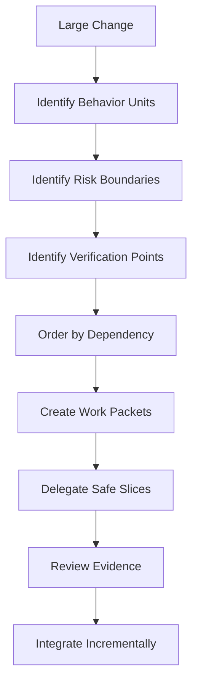
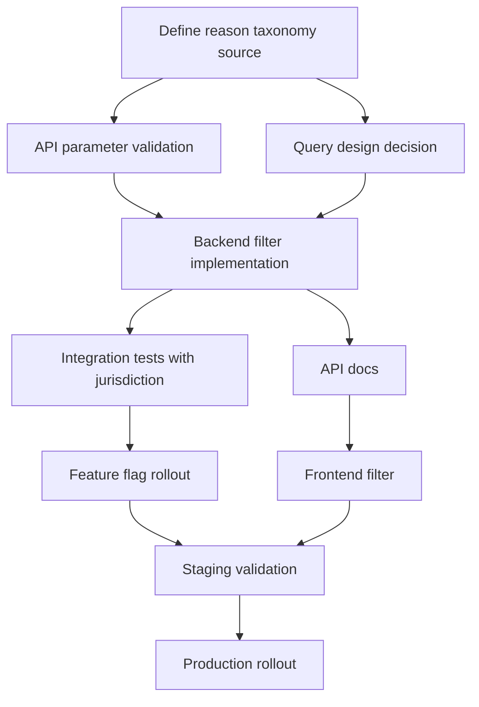
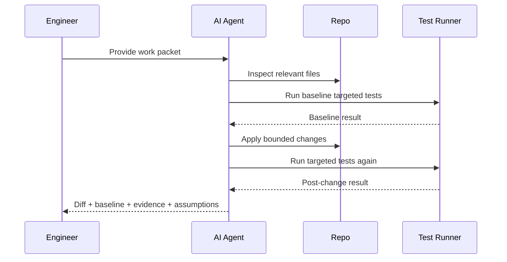
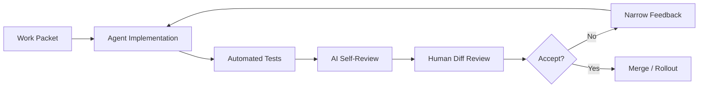

------
title: Learn AI Development Driven Implementation and Usage - Part 010
description: Task slicing and agent delegation: how to decompose implementation work into reviewable, bounded, low-blast-radius tasks that AI coding agents can execute safely.
series: learn-ai-development-driven-implementation-usage
seriesTitle: Learn AI Development Driven Implementation and Usage
order: 10
partTitle: Task Slicing and Agent Delegation
tags:
- ai
- task-slicing
- agent-delegation
- software-delivery
- pull-requests
- workflow
- series
date: 2026-06-30
---

# Part 010 — Task Slicing and Agent Delegation

> Goal: setelah bagian ini, kamu mampu memecah pekerjaan implementation menjadi slice kecil, bounded, testable, dan reviewable sehingga AI coding agent bisa membantu tanpa menciptakan diff liar, regression tersembunyi, atau ownership kabur.

AI agent modern bisa bekerja di branch, membaca repo, menjalankan command, membuat perubahan, dan mengusulkan PR. Tetapi hasilnya sangat bergantung pada kualitas delegasi. Delegasi yang buruk menghasilkan PR besar, scope creep, test palsu, refactor tidak perlu, dan review fatigue.

Staff-level engineer tidak bertanya:

```text
Can AI implement this feature?
```

Pertanyaan yang lebih tepat:

```text
Which part of this work can be delegated safely, with clear acceptance criteria,
limited blast radius, and objective verification evidence?
```

---

## 1. Kaufman Skill Deconstruction

Berdasarkan Kaufman, skill “AI task slicing and delegation” dipecah menjadi sub-skill berikut:

| Sub-skill | Tujuan | Output yang terlihat |
|---|---|---|
| Work decomposition | Memecah pekerjaan besar | Task graph dan dependency order |
| Slice design | Membuat perubahan kecil dan atomic | PR-per-intent |
| Delegability scoring | Menilai cocok/tidaknya task untuk AI | Delegation scorecard |
| Work packet writing | Membuat instruksi executable | Task contract lengkap |
| Boundary setting | Mencegah scope creep | Allowed/disallowed files, non-goals |
| Verification design | Membuat hasil bisa dibuktikan | Test command dan acceptance evidence |
| Agent routing | Memilih mode AI yang tepat | Pair, local agent, cloud agent, reviewer |
| Review orchestration | Menjaga kualitas diff | Review loop dan escalation path |
| Failure recovery | Mengatasi agent drift | Abort, reset, narrow, re-run, manual takeover |

Self-correction dalam skill ini berarti kamu bisa melihat task dan berkata:

```text
This task is not safe to delegate yet.
It is too broad, under-specified, hard to verify, or has high irreversible risk.
```

---

## 2. The Core Principle: PR-per-Intent

AI agent cenderung mengoptimalkan penyelesaian task berdasarkan instruksi. Jika task terlalu luas, diff akan terlalu luas. Karena itu gunakan prinsip:

```text
One PR should express one intent.
One intent should have one primary verification story.
```

Contoh buruk:

```text
Improve case search.
```

Masalah:

- tidak jelas behavior apa yang berubah,
- bisa menyentuh UI, API, query, database, tests, docs sekaligus,
- reviewer sulit tahu mana perubahan yang perlu,
- AI bebas “membersihkan” kode yang tidak relevan.

Contoh lebih baik:

```text
Add backend validation for escalationReason query parameter in CaseSearch API.
Do not change query execution yet.
Return the existing validation error shape for unknown reason values.
Add unit tests for valid, invalid, missing, and repeated parameter cases.
```

Task ini kecil, punya negative scope, dan bisa diverifikasi.

---

## 3. Task Slicing Mental Model

Slicing bukan memecah berdasarkan layer teknis secara buta. Slicing harus mempertimbangkan risiko, dependency, dan reviewability.



Slice yang baik punya lima properti:

| Property | Meaning |
|---|---|
| Bounded | Area perubahan jelas |
| Reversible | Bisa di-rollback atau di-revert dengan aman |
| Testable | Ada bukti objektif bahwa behavior benar |
| Reviewable | Diff cukup kecil untuk dipahami reviewer |
| Composable | Bisa digabung menjadi feature lebih besar tanpa konflik besar |

---

## 4. Slice by Risk, Not Just by Layer

Kesalahan umum adalah memecah feature menjadi:

1. database,
2. backend,
3. frontend,
4. tests.

Kadang benar. Tapi untuk AI delegation, lebih baik memecah berdasarkan **risk boundary**.

| Slice type | Example | Why useful |
|---|---|---|
| Validation slice | Add request validation only | Low risk, easy test |
| Read-only slice | Add query support behind feature flag | No state mutation |
| Schema expand slice | Add nullable column/table | Safe migration step |
| Backfill slice | Populate derived data idempotently | Operationally isolated |
| Contract slice | Add API field without changing behavior | Compatibility check |
| Behavior switch slice | Enable new behavior behind flag | Controlled rollout |
| Cleanup slice | Remove old path after confidence | Separate irreversible work |
| Observability slice | Add metrics/logs/tracing | Improves later rollout safety |

Rule:

```text
A good slice reduces uncertainty without increasing blast radius too much.
```

---

## 5. Delegability Scorecard

Tidak semua task cocok untuk AI agent. Gunakan scorecard sebelum delegasi.

| Dimension | Low risk / good for AI | High risk / poor for AI |
|---|---|---|
| Scope clarity | Clear files/modules | “Improve architecture” |
| Verification | Tests/commands available | Manual judgment only |
| Blast radius | Local module | Cross-system behavior |
| Reversibility | Easy revert | Irreversible data mutation |
| Domain ambiguity | Well-specified behavior | Policy/legal/business ambiguity |
| Dependency | Few dependencies | Requires coordination across teams |
| Security sensitivity | No sensitive data boundary | Auth, secrets, privacy, compliance |
| Runtime risk | Compile/test-time detectable | Production-only failure |
| Context size | Fits in repo docs and task | Requires tribal knowledge |

Scoring sederhana:

```text
0 = poor fit
1 = possible with tight supervision
2 = good fit
```

Interpretation:

| Score | Delegation decision |
|---:|---|
| 0–6 | Do manually or design first |
| 7–11 | Pair with AI, keep human in loop |
| 12–16 | Delegate to local/cloud agent with review gate |

---

## 6. The Work Packet

AI agent butuh work packet, bukan instruksi vague.

```yaml
title: "Add validation for escalationReason query parameter"
intent: "Reject unknown escalation reason values before search execution"
context:
  current_behavior: "CaseSearch API accepts query params and validates status/date filters"
  desired_behavior: "Known reason values pass; unknown values use existing validation error shape"
allowed_scope:
  files:
    - "case-search-api/src/main/..."
    - "case-search-api/src/test/..."
  operations:
    - "modify validation logic"
    - "add unit tests"
disallowed_scope:
  - "do not change database schema"
  - "do not change search query execution"
  - "do not modify frontend"
  - "do not introduce new validation framework"
acceptance_criteria:
  - "missing escalationReason keeps current behavior"
  - "valid reason values pass validation"
  - "unknown value returns existing validation error format"
  - "tests cover missing, valid, invalid, repeated parameter"
verification:
  commands:
    - "./gradlew :case-search-api:test"
review_notes:
  - "summarize changed files"
  - "include test command output"
  - "call out assumptions"
stop_conditions:
  - "if reason taxonomy location is unclear, stop and ask"
  - "if existing error shape cannot be found, stop and report options"
```

Work packet harus menjawab:

- apa intent-nya,
- file mana yang boleh disentuh,
- file mana yang tidak boleh disentuh,
- behavior apa yang wajib terbukti,
- command apa yang harus dijalankan,
- kapan agent harus berhenti.

---

## 7. Agent Delegation Modes

Pilih mode AI berdasarkan risiko dan feedback loop.

| Mode | Kapan dipakai | Control level |
|---|---|---|
| Chat planning | Requirement/design belum matang | Very high human control |
| Pair programming | Perubahan kecil, kamu melihat diff langsung | High control |
| Local agent | Repo task jelas, butuh edit/run tests lokal | Medium-high control |
| Cloud agent | Task bounded, bisa jalan di branch terisolasi | Medium control |
| AI reviewer | Setelah diff ada | Advisory control |
| Batch automation | Repetitive low-risk transformation | Requires strict guardrails |

Rule praktis:

```text
Use the least autonomous mode that still removes meaningful friction.
```

Jangan memakai cloud agent untuk task yang belum bisa kamu jelaskan sebagai work packet.

---

## 8. Good vs Bad Delegation Examples

### 8.1 Bad Delegation

```text
Implement escalation reason search end-to-end.
```

Risiko:

- menyentuh terlalu banyak layer,
- agent bisa membuat schema tanpa migration strategy,
- authorization bisa dilupakan,
- UI behavior bisa berubah tanpa product review,
- tests mungkin hanya happy path,
- PR terlalu besar.

### 8.2 Better Delegation Set

```text
Task 1: Add backend validation for escalationReason query parameter.
Task 2: Add repository/query support for reason filtering behind feature flag.
Task 3: Add integration tests for reason filter with jurisdiction scope.
Task 4: Add API documentation and example response.
Task 5: Add UI filter using existing search parameter pattern.
Task 6: Enable feature flag in staging only.
```

Setiap task punya boundary dan verification sendiri.

---

## 9. Task Graph Before Agent Execution

Untuk feature medium/large, buat task graph dulu.



Task graph membantu menentukan:

- task mana bisa parallel,
- task mana harus menunggu keputusan,
- task mana cocok untuk AI,
- task mana harus dikerjakan manual,
- task mana butuh approval domain/security.

---

## 10. Parallel Delegation Without Chaos

AI membuat parallelism murah, tetapi merge conflict dan design drift tetap mahal.

Gunakan aturan berikut:

| Rule | Reason |
|---|---|
| Satu agent per branch | Isolasi diff |
| Satu branch per intent | Review jelas |
| Jangan parallel-kan task yang menyentuh file yang sama | Conflict tinggi |
| Jangan parallel-kan task yang belum punya contract stabil | Rework tinggi |
| Merge dependency order dari task graph | Menghindari broken intermediate state |
| Gunakan feature flag untuk behavior incomplete | Main branch tetap stabil |

Contoh aman:

```text
Agent A: add validation tests and validation logic.
Agent B: draft API docs from accepted contract.
Agent C: add observability metrics for existing search filters.
```

Contoh tidak aman:

```text
Agent A: refactor search service.
Agent B: add reason filter to same search service.
Agent C: optimize query builder in same module.
```

---

## 11. Delegation Contract for Cloud Agents

Cloud agent cocok untuk task bounded yang tidak perlu percakapan terus-menerus. Work packet harus lebih ketat karena feedback loop lebih jauh.

Checklist cloud-agent work packet:

```md
- [ ] Base branch specified.
- [ ] Target module specified.
- [ ] Allowed files/directories specified.
- [ ] Non-goals specified.
- [ ] Acceptance criteria objective.
- [ ] Test commands included.
- [ ] Expected PR summary format included.
- [ ] Stop conditions included.
- [ ] No secret, credential, or sensitive data required.
- [ ] No destructive migration required.
```

Prompt example:

```text
Work only on backend validation for CaseSearch API.
Base your changes on the existing validation style in this module.
Do not change database schema, query execution, frontend, or public docs.
Add tests for missing, valid, invalid, and repeated escalationReason parameter.
Run the module test command if available.
If the reason taxonomy or error shape cannot be located, stop and report findings
instead of inventing a new enum or error format.
```

---

## 12. Stop Conditions

Stop condition adalah guardrail penting. Tanpa stop condition, agent akan cenderung melanjutkan dengan tebakan.

Contoh stop conditions:

| Stop condition | Why |
|---|---|
| Existing error shape cannot be found | Prevent invented API behavior |
| Required taxonomy source is unclear | Prevent duplicate enum |
| Test command fails before changes | Need baseline separation |
| Task requires schema change not in scope | Prevent scope escalation |
| Authorization rule is ambiguous | Prevent security bug |
| More than N files need modification | Scope is larger than expected |
| Generated diff touches disallowed directory | Agent drift |

Gunakan kalimat eksplisit:

```text
If you encounter X, stop and report options. Do not proceed by guessing.
```

---

## 13. Baseline Before Change

Untuk task non-trivial, agent harus membedakan:

- test yang sudah gagal sebelum perubahan,
- test yang gagal karena perubahan agent,
- test yang tidak bisa dijalankan karena environment.

Workflow:



Baseline evidence mencegah agent mengklaim “tests fail” tanpa membedakan akar masalah.

---

## 14. Evidence-Driven Delegation

Delegasi berhasil hanya jika output agent memiliki evidence.

Minimal PR evidence:

```md
## Summary
- Added validation for escalationReason query parameter.
- Reused existing CaseSearch validation error shape.
- Added unit tests for missing, valid, invalid, and repeated values.

## Verification
- ./gradlew :case-search-api:test — passed

## Scope control
- No database changes.
- No query execution changes.
- No frontend changes.

## Assumptions
- Existing EscalationReason enum is the canonical taxonomy.
```

Reviewer tidak boleh menerima AI PR hanya karena “kelihatannya benar”. Reviewer perlu evidence.

---

## 15. Delegating Refactors

Refactor adalah kategori berbahaya untuk AI karena sering melebar. Gunakan refactor slices.

| Refactor slice | Good instruction |
|---|---|
| Rename | Rename this class/method and update references only |
| Extract method | Extract method without changing behavior |
| Move class | Move class to package X and update imports only |
| Remove duplicate logic | Consolidate these two duplicate functions only |
| Introduce interface | Add interface for these two implementations only |
| Replace library call | Replace deprecated API usage in this module only |

Selalu sertakan:

```text
Preserve behavior. Do not optimize, redesign, or change public contracts.
```

Untuk refactor besar, mulai dari characterization tests.

---

## 16. Delegating Bug Fixes

Bug fix cocok untuk AI jika ada reproduction path.

Bug-fix work packet:

```yaml
bug:
  observed: "Invalid escalationReason returns 500"
  expected: "Invalid escalationReason returns 400 validation error"
  reproduction:
    command: "curl ..."
    test_case: "CaseSearchValidationTest.invalidReason"
constraints:
  - "reuse existing validation error format"
  - "do not catch generic Exception"
  - "do not change successful search behavior"
verification:
  - "add failing test first"
  - "make test pass"
  - "run targeted test class"
```

Prompt:

```text
First identify the minimal failing path.
Add or update a test that fails for the current bug.
Then implement the smallest fix.
Do not refactor unrelated code.
```

---

## 17. Delegating Test Generation

Test generation adalah good fit, tetapi raw AI tests sering lemah. Gunakan test intent.

Bad:

```text
Add tests.
```

Good:

```text
Add tests for these behaviors:
1. missing escalationReason preserves existing result behavior
2. valid escalationReason filters results
3. invalid escalationReason returns existing validation error shape
4. user cannot see cases outside jurisdiction even when reason matches
5. repeated escalationReason parameter uses existing multi-value parameter behavior
Do not assert implementation details.
```

Review generated tests untuk:

- apakah assert benar-benar membuktikan behavior,
- apakah test hanya menguji mock interaction,
- apakah fixture realistis,
- apakah negative case ada,
- apakah authorization boundary diuji,
- apakah test bisa gagal jika bug muncul.

---

## 18. Delegating Documentation

Documentation adalah good fit jika source-of-truth jelas.

Work packet:

```text
Update API documentation for escalationReason filter.
Use behavior from tests and controller validation.
Do not invent product behavior.
Include valid/invalid examples and backward compatibility note.
```

Good documentation delegation requires:

- accepted contract,
- behavior tests,
- examples,
- non-goals,
- known limitations.

AI-generated docs harus dicek terhadap code, bukan sebaliknya.

---

## 19. Agent Drift Detection

Agent drift terjadi ketika agent mulai mengerjakan hal yang tidak diminta.

Signals:

| Signal | Meaning |
|---|---|
| Banyak file tidak relevan berubah | Scope creep |
| Formatting besar-besaran | Noise hiding behavior change |
| New framework introduced | Over-engineering |
| Public API berubah tanpa diminta | Contract risk |
| Tests diubah agar pass, bukan behavior diperbaiki | False confidence |
| Existing failing tests diabaikan | Baseline confusion |
| Security checks dihapus | Dangerous shortcut |

Response pattern:

```text
Stop. Revert unrelated changes.
Keep only changes necessary for <intent>.
Do not modify formatting or unrelated tests.
```

Jika drift berulang, task terlalu luas atau context terlalu kabur.

---

## 20. Human Review Loop

AI delegation bukan pengganti review. Review loop harus eksplisit.



Feedback ke agent harus sempit:

Bad:

```text
Fix the review comments.
```

Good:

```text
Address only these two issues:
1. validation should reuse ExistingValidationException
2. repeated escalationReason should follow existing status parameter behavior
Do not modify query execution or tests unrelated to CaseSearchValidationTest.
```

---

## 21. Task Slicing Patterns

### 21.1 Spike Slice

Dipakai untuk eksplorasi tanpa production change.

```text
Investigate where escalation reason is stored and how search filters are implemented.
Do not modify production code.
Return findings, relevant files, and recommended implementation slices.
```

### 21.2 Guardrail Slice

Tambahkan test, validation, logging, or metrics sebelum behavior besar.

```text
Add tests that capture current search behavior before implementing reason filtering.
```

### 21.3 Expand Slice

Tambahkan schema/contract tanpa mengaktifkan behavior.

```text
Add nullable field and migration only. Do not read or write it yet.
```

### 21.4 Behavior Slice

Aktifkan behavior kecil.

```text
Use existing field to filter backend results behind feature flag.
```

### 21.5 Rollout Slice

Konfigurasi deploy/flag/monitoring.

```text
Enable flag for staging and add dashboard metric for reason-filter latency.
```

### 21.6 Cleanup Slice

Hapus compatibility path setelah aman.

```text
Remove old fallback path after production flag has been stable for 14 days.
```

---

## 22. Example Full Slicing Plan

Feature: `Search cases by escalation reason`.

| Slice | Delegation mode | Why |
|---|---|---|
| 1. Discovery spike | AI local/cloud read-only | Finds files and design options |
| 2. Validation only | AI implementation | Small, testable |
| 3. Contract tests | AI + human review | Good for behavior specification |
| 4. Query implementation behind flag | Pair/local agent | Higher risk, needs careful review |
| 5. Jurisdiction integration test | AI test generation + human audit | Security-sensitive |
| 6. Docs update | AI | Source-of-truth available |
| 7. Rollout config | Human/pair | Environment-sensitive |
| 8. Cleanup | Later AI/human | Only after production confidence |

This plan is better than one end-to-end agent task because each step has independent evidence.

---

## 23. Delegation Anti-Patterns

| Anti-pattern | Consequence | Better approach |
|---|---|---|
| “Implement this feature end-to-end” | Huge diff, hidden assumptions | Task graph + work packets |
| “Fix all tests” | Agent may weaken tests | Identify failing tests and expected behavior |
| “Refactor this module” | Architecture drift | One refactor intent at a time |
| “Make it scalable” | Generic over-engineering | Define workload and bottleneck |
| “Use best practices” | Style hallucination | Point to repo conventions |
| “Update docs” without source | Invented behavior | Docs from tests/contracts only |
| “Improve performance” | Unmeasured change | Baseline benchmark + target |
| Parallel agents on same files | Merge conflict | Dependency-aware task graph |

---

## 24. Delegation Prompt Template

```text
You are implementing one bounded software change.

Intent:
<one-sentence intent>

Context:
<relevant module, current behavior, desired behavior>

Allowed scope:
- <directories/files allowed>
- <types of changes allowed>

Disallowed scope:
- <directories/files not allowed>
- <behaviors not allowed>
- <frameworks/libraries not allowed>

Acceptance criteria:
1. <objective behavior>
2. <objective behavior>
3. <objective behavior>

Verification:
- Run: <command>
- Add/update tests: <test intent>

Stop conditions:
- If <unknown/risk>, stop and report.
- If the change requires <out-of-scope>, stop and report.

Output expected:
- Summary of changed files
- Test results
- Assumptions
- Remaining risks
```

---

## 25. Review Prompt Template

Use AI as reviewer after diff exists.

```text
Review this diff against the original work packet.
Focus on:
- whether the diff stays within allowed scope
- whether acceptance criteria are actually met
- whether tests prove behavior rather than implementation details
- whether unrelated changes were introduced
- whether security/compatibility risks were introduced
- whether stop conditions were violated

Return findings as:
severity, file/area, issue, reasoning, suggested fix.
```

Human reviewer still makes the final call.

---

## 26. Practice Drills for the First 20 Hours

### Drill 1 — Slice a Feature

Take one medium feature. Build a task graph and split it into 5–8 work packets.

Timebox: 60 minutes.

Output:

- task graph,
- work packet list,
- delegability score for each packet.

### Drill 2 — Rewrite Bad Prompts

Take 10 vague task prompts and rewrite them as bounded work packets.

Timebox: 45 minutes.

Output:

- before/after prompts,
- added constraints,
- added stop conditions.

### Drill 3 — Delegability Scoring

Score 10 tasks from your backlog. Decide mode: manual, pair, local agent, cloud agent, reviewer.

Timebox: 45 minutes.

Output:

- scorecard,
- rationale,
- risk notes.

### Drill 4 — Agent Drift Review

Review an AI-generated diff. Mark each changed file as in-scope, questionable, or out-of-scope.

Timebox: 45 minutes.

Output:

- drift report,
- narrow feedback prompt.

### Drill 5 — Evidence-First PR Summary

Take one PR and rewrite the summary to include scope control, verification, and assumptions.

Timebox: 30 minutes.

Output:

- PR summary,
- review checklist.

---

## 27. Mastery Rubric

| Level | Behavior |
|---|---|
| Beginner | Delegates whole features directly to AI |
| Intermediate | Adds acceptance criteria and test commands |
| Advanced | Slices by risk, boundary, and verification point |
| Staff-level | Designs task graph, routes work by delegability, and controls review evidence |
| Top 1% trajectory | Builds team-level delegation playbooks, work packet templates, and agent-safe repository conventions |

---

## 28. Key Takeaways

- AI delegation quality is mostly determined before the agent starts coding.
- Slice by risk and verification, not only by technical layer.
- A good delegated task is bounded, reversible, testable, reviewable, and composable.
- Cloud agents need stricter work packets than interactive pair programming.
- Stop conditions prevent agent guessing.
- Baseline tests distinguish existing failures from agent-introduced failures.
- Review evidence matters more than confidence language.
- PR-per-intent is the simplest rule for keeping AI-generated work reviewable.

---

## References

- GitHub Docs, “About GitHub Copilot cloud agent” — autonomous work in GitHub Actions-powered environment, branch changes, reviewable diff, pull request workflow: https://docs.github.com/copilot/concepts/agents/coding-agent/about-coding-agent
- GitHub Docs, “Starting GitHub Copilot sessions” — assigning issues, choosing base branches, background sessions, logs, and PR creation: https://docs.github.com/en/copilot/how-tos/use-copilot-agents/cloud-agent/start-copilot-sessions
- OpenAI, “Introducing Codex” — cloud-based software engineering agent running tasks in separate cloud sandbox environments: https://openai.com/index/introducing-codex/
- Anthropic, “Claude Code Best Practices” — codebase exploration, planning, test-driven workflows, and agent usage patterns: https://www.anthropic.com/engineering/claude-code-best-practices
- Model Context Protocol, “Tools” — standardized tool invocation surface for AI clients: https://modelcontextprotocol.io/specification/2025-06-18/server/tools
