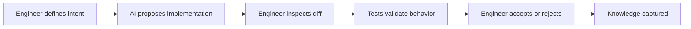
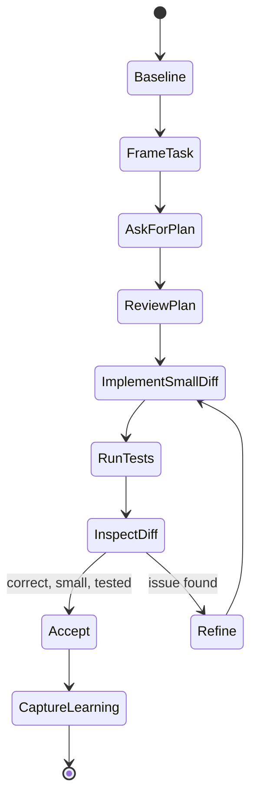
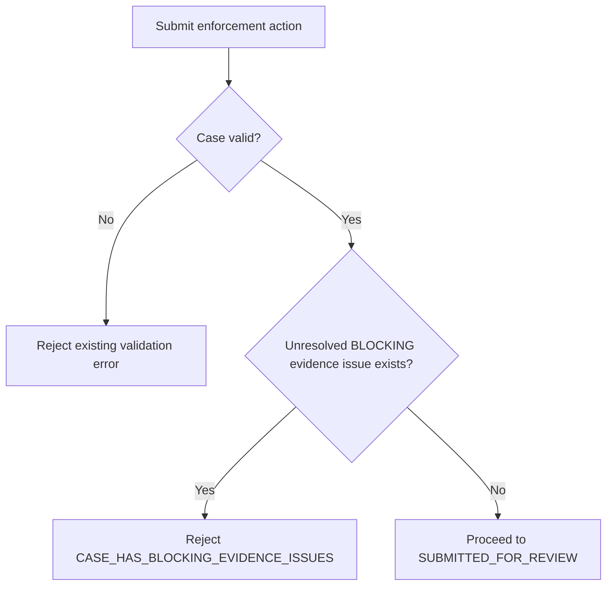

# Part 011 — Implementation with AI Pair Programming

AI pair programming adalah **inner-loop implementation workflow**: engineer tetap memegang intent, boundary, correctness, dan final accountability; AI membantu mempercepat exploration, code drafting, test drafting, refactoring kecil, debugging, dan review awal.

Kegagalan umum bukan karena AI “kurang pintar”, tetapi karena engineer menyerahkan terlalu banyak kontrol pada output yang belum diverifikasi. Dalam sistem production, hasil AI harus diperlakukan seperti kontribusi dari developer junior yang sangat cepat: berguna, tetapi harus diberi konteks, batasan, test, dan review.

Part ini membahas cara memakai AI sebagai pair programmer secara disiplin.

---

## 1. Kaufman Framing: Apa Skill yang Sedang Dilatih?

Dalam kerangka Josh Kaufman, skill besar harus dipecah menjadi sub-skill kecil yang bisa dilatih dan dikoreksi cepat. Untuk AI pair programming, skill utamanya bukan “menulis prompt bagus”. Skill sebenarnya adalah:

> Mampu mengarahkan AI untuk menghasilkan perubahan kode kecil, benar, teruji, mudah direview, dan selaras dengan desain sistem.

Skill ini dapat didekomposisi menjadi beberapa sub-skill.

| Sub-skill | Output yang terlihat | Anti-pattern |
|---|---|---|
| Task framing | AI tahu file mana, perilaku mana, batas mana | Prompt terlalu luas: “fix this feature” |
| Context selection | AI melihat constraint yang relevan saja | Mengirim seluruh konteks tanpa prioritas |
| Incremental implementation | Diff kecil dan reversible | Sekali jalan menghasilkan rewrite besar |
| Verification steering | AI menambah/menjalankan test relevan | Percaya pada “looks good” |
| Review discipline | Engineer membaca diff dengan checklist | Blind accept autocomplete/agent output |
| Failure recovery | Bisa rollback, isolate bug, refine task | Patch menumpuk tanpa baseline |
| Learning loop | Prompt/workflow membaik setiap iterasi | Mengulang kegagalan yang sama |

Target 20 jam Kaufman untuk bagian ini bukan “menguasai semua AI tool”, tetapi mencapai ambang ini:

1. Bisa menyelesaikan task kecil sampai medium dengan bantuan AI tanpa menurunkan kualitas.
2. Bisa menjelaskan setiap baris perubahan yang diterima.
3. Bisa membuat AI menghasilkan test yang relevan, bukan sekadar coverage kosmetik.
4. Bisa menghentikan AI ketika scope drift muncul.
5. Bisa membedakan kapan AI dipakai sebagai autocomplete, pair, reviewer, atau tidak dipakai sama sekali.

---

## 2. Mental Model: AI Pair Programmer Bukan Compiler, Bukan Architect

AI pair programmer adalah **probabilistic implementation collaborator**. Ia bagus untuk pattern recognition, code generation, summarization, transformation, dan hypothesis generation. Ia lemah ketika konteks domain tersembunyi, invariant tidak eksplisit, test oracle tidak jelas, atau perubahan membutuhkan judgment organisasi.

Model kerja yang aman:



Perhatikan arah accountability: AI tidak “memutuskan selesai”. Engineer yang menentukan selesai berdasarkan acceptance criteria, tests, review, dan risk boundary.

---

## 3. Kapan AI Pair Programming Cocok?

Gunakan AI pair programming ketika task memiliki **scope lokal**, acceptance criteria cukup jelas, dan ada feedback loop cepat.

### Cocok

| Task | Mengapa cocok |
|---|---|
| Menambahkan validator kecil | Scope sempit, mudah dites |
| Membuat adapter/mapping DTO | Pattern jelas, banyak boilerplate |
| Menulis unit test untuk logic existing | AI bisa eksplorasi branch behavior |
| Refactor kecil tanpa perubahan behavior | Bisa dikunci dengan characterization test |
| Debug error dengan stack trace jelas | AI bisa menyusun hypothesis tree |
| Mengubah API handler sederhana | Bisa diverifikasi dengan integration/contract test |
| Membuat migration script non-destruktif | Bisa ditinjau dengan checklist safety |

### Tidak cocok tanpa persiapan tambahan

| Task | Risiko |
|---|---|
| Rewrite core domain engine | Scope luas, invariant tersembunyi |
| Security-sensitive auth change | Dampak kecil bisa fatal |
| Data deletion/backfill besar | Irreversible failure |
| Complex distributed consistency | Banyak edge case temporal |
| Regulatory decision logic | Harus defensible dan auditable |
| Performance tuning tanpa profiling | AI cenderung menebak bottleneck |

Bukan berarti AI tidak boleh dipakai pada task berisiko, tetapi perannya berubah: AI dipakai untuk **analysis, checklist, test plan, threat modeling, dan alternative design**, bukan langsung menulis patch production.

---

## 4. The Pair Programming Control Loop

Workflow dasar untuk coding dengan AI:



### Step 1 — Establish Baseline

Sebelum AI mengubah kode, engineer harus tahu kondisi awal.

Minimal baseline:

```bash
# Example only; adapt to repo
 git status --short
 ./gradlew test
 ./gradlew check
```

Aturan:

- Jangan mulai dari working tree kotor kecuali sengaja.
- Jangan biarkan AI memperbaiki test yang sejak awal sudah gagal tanpa memisahkan baseline failure.
- Catat failing test existing sebagai `known baseline`, bukan akibat patch.

### Step 2 — Frame Task

Prompt awal harus seperti mini work order.

Template:

```text
You are my implementation pair for a small, reviewable change.

Goal:
- <desired behavior>

Current behavior:
- <observed current behavior>

Scope:
- You may change: <files/modules>
- Do not change: <files/modules/contracts>

Constraints:
- Preserve backward compatibility.
- Keep the diff minimal.
- Do not introduce new dependencies unless necessary and explain why.

Acceptance criteria:
- <criteria 1>
- <criteria 2>

Verification:
- Add/update tests for <behavior>.
- Run <commands>.

Before editing:
- Summarize your understanding.
- Identify the smallest implementation plan.
- Ask only if a blocker exists.
```

### Step 3 — Ask for Plan Before Patch

Untuk task kecil sekalipun, minta AI menjelaskan plan sebelum edit ketika risk moderate.

Good plan should include:

1. Files likely affected.
2. Behavior change.
3. Test strategy.
4. Risk/edge case.
5. Stop condition.

Bad plan indicators:

- “I will refactor the service layer” tanpa alasan.
- “I will update all usages” tanpa daftar usage.
- “This should work” tanpa test.
- Menambah dependency untuk masalah sederhana.
- Mengubah public contract tanpa menyebut compatibility.

### Step 4 — Let AI Implement One Slice

Satu slice harus menghasilkan diff yang bisa dibaca dalam satu review pass.

Rule of thumb:

| Risk | Target diff |
|---|---|
| Low | < 100 LOC |
| Medium | < 250 LOC |
| High | Split into multiple PRs |

Diff besar bukan selalu salah, tetapi jika AI membuat diff besar, engineer harus meminta decomposition.

Prompt correction:

```text
This diff is too broad for a safe review. Revert the broad refactor and implement only the validator behavior. Keep existing public APIs unchanged. Add one focused test class for the new edge cases.
```

### Step 5 — Run Tests and Inspect Failure

Jangan hanya minta AI “fix tests”. Minta ia menjelaskan failure dahulu.

```text
The test failed. Do not patch immediately.
Explain:
1. What failed?
2. Is this a product bug, test bug, or setup issue?
3. What is the smallest fix?
4. Which behavior will be protected after the fix?
```

### Step 6 — Review the Diff as Owner

Checklist minimum:

- Apakah perubahan benar-benar memenuhi acceptance criteria?
- Apakah ada hidden behavior change?
- Apakah test menguji behavior, bukan implementasi internal?
- Apakah error handling sesuai domain semantics?
- Apakah naming mengikuti ubiquitous language repo?
- Apakah ada dependency baru?
- Apakah ada concurrency/performance/security implication?
- Apakah diff bisa dijelaskan dalam 2 menit?

---

## 5. Pair Programming Modes

Tidak semua interaksi AI sama. Engineer perlu memilih mode.

### 5.1 Ask Mode

AI hanya menjawab, tidak mengubah file.

Cocok untuk:

- memahami code path;
- meminta daftar edge case;
- menyusun test plan;
- membandingkan alternative design;
- mencari kemungkinan bug.

Prompt:

```text
Read this code path and explain the behavior. Do not propose changes yet. Focus on invariants, edge cases, and hidden coupling.
```

### 5.2 Suggest Mode

AI memberi patch proposal, engineer copy/apply manual.

Cocok untuk:

- code snippet kecil;
- refactor lokal;
- naming improvement;
- test case tambahan.

Prompt:

```text
Propose the smallest code change as a patch-like explanation. Do not rewrite unrelated methods.
```

### 5.3 Edit Mode

AI mengubah file langsung di IDE/CLI.

Cocok jika:

- repo clean;
- file scope jelas;
- test command jelas;
- engineer siap review diff.

Prompt:

```text
Edit only these files: <file list>. Implement <behavior>. Add tests in <test file>. Stop after running <command> and summarize the diff.
```

### 5.4 Agent Mode

AI bisa membaca repo, edit banyak file, menjalankan command, dan iterasi.

Cocok untuk:

- task multi-file tetapi bounded;
- test generation;
- migration kecil;
- CI failure repair;
- mechanical refactor.

Prompt harus lebih ketat:

```text
Work as an implementation agent.

Hard boundaries:
- Do not modify public API signatures.
- Do not add dependencies.
- Do not change database schema.
- Do not alter security configuration.

Allowed actions:
- Search codebase.
- Modify implementation and tests under <module>.
- Run <test command>.

Stop and ask if:
- You need to change public API.
- Tests require external service.
- The task affects more than 5 files.
```

---

## 6. Prompt Patterns for Implementation

### 6.1 Minimal Patch Prompt

```text
Implement the smallest patch that changes only <behavior>.
Avoid refactoring unrelated code.
After editing, summarize:
- files changed
- behavior changed
- tests added/updated
- risks remaining
```

### 6.2 Test-First Prompt

```text
Before changing production code, add a failing test that captures the desired behavior.
Run the relevant test and confirm it fails for the expected reason.
Then implement the minimal production change to make it pass.
```

### 6.3 Characterization Prompt

```text
Before refactoring, write characterization tests for the current behavior.
Do not change behavior.
The goal is to make the current behavior observable and protected.
```

### 6.4 Edge-Case Expansion Prompt

```text
Review the acceptance criteria and list edge cases grouped by:
- invalid input
- boundary value
- state transition
- concurrency/timing
- backward compatibility
- security/privacy
Then recommend which cases deserve automated tests.
```

### 6.5 Invariant Guard Prompt

```text
During implementation, preserve these invariants:
- <invariant 1>
- <invariant 2>
- <invariant 3>
If any invariant conflicts with the requested change, stop and explain the conflict.
```

### 6.6 No-Dependency Prompt

```text
Do not introduce a new dependency. Use existing project utilities unless they are insufficient. If you think a dependency is necessary, stop and explain the trade-off before editing.
```

### 6.7 Diff Review Prompt

```text
Review this diff as a senior engineer.
Classify findings into:
- correctness
- missing test
- compatibility
- security
- performance
- maintainability
- style
Do not nitpick formatting unless it affects readability or conventions.
```

---

## 7. Implementation Example: Validation Rule Change

### Raw requirement

> Users should not be able to submit enforcement action if the case has unresolved blocking evidence issues.

This is too vague for AI implementation.

### Translated task contract

```text
Goal:
Prevent submission of enforcement action when a case has unresolved evidence issues with severity BLOCKING.

Current behavior:
Submission validates case status and assignee, but does not check evidence issue severity.

Scope:
- Module: enforcement-action-service
- Allowed files:
  - EnforcementActionSubmissionValidator
  - EvidenceIssueRepository or existing query adapter
  - validator test class
- Do not change database schema.
- Do not change API response envelope.

Domain invariant:
A case cannot enter SUBMITTED_FOR_REVIEW while any linked evidence issue has severity BLOCKING and resolutionStatus != RESOLVED.

Acceptance criteria:
- If zero unresolved blocking evidence issues, submission proceeds.
- If one or more unresolved blocking evidence issues exist, submission is rejected.
- Error code must be CASE_HAS_BLOCKING_EVIDENCE_ISSUES.
- Error message must not expose sensitive evidence content.

Verification:
- Add unit tests for validator.
- Add integration test if repository query behavior is new.
```

### Mermaid view



### Why this works

AI is given:

- domain invariant;
- allowed files;
- error contract;
- sensitive-data constraint;
- verification path;
- explicit negative scope.

This converts a fuzzy product sentence into a bounded implementation task.

---

## 8. The “Explain Before Accept” Rule

Every accepted AI-generated diff must be explainable by the engineer.

Use this prompt after AI edits:

```text
Explain the diff file by file.
For each change, state:
1. Why it was necessary.
2. What behavior it changes.
3. What test protects it.
4. What risk remains.
```

If the explanation is vague, reject or inspect deeper.

Bad explanation:

> Updated validation logic and tests.

Good explanation:

> `EnforcementActionSubmissionValidator` now queries unresolved evidence issues before transition. It rejects only when severity is `BLOCKING` and resolution status is not `RESOLVED`. `SubmissionValidatorTest` adds allowed/no-issue, non-blocking issue, resolved blocking issue, and unresolved blocking issue cases. Remaining risk: repository query is mocked in unit tests; integration coverage is needed if query semantics are non-trivial.

---

## 9. Managing Hallucinated APIs and Nonexistent Utilities

AI often invents methods that look plausible:

```java
caseRepository.findBlockingEvidenceIssues(caseId)
```

Maybe this method does not exist. The fix is not “try random method names”. Use an inventory prompt.

```text
Before coding, search for existing repository/query methods related to evidence issues. List actual methods and file paths. Use only methods that exist, or propose a new method with exact interface and implementation changes.
```

For statically typed languages, compiler feedback catches many hallucinations. For dynamic languages, add stronger runtime tests and import checks.

---

## 10. Avoiding “AI Refactor Gravity”

AI tends to improve nearby code opportunistically. This causes diff growth.

Common drift patterns:

| Drift | Example | Correction |
|---|---|---|
| Style drift | Reformat entire file | “Revert formatting-only changes.” |
| Architecture drift | Introduces new abstraction | “Keep existing pattern.” |
| Dependency drift | Adds new library | “Use current utility.” |
| Test drift | Rewrites test suite | “Add focused tests only.” |
| Naming drift | Renames domain concepts | “Preserve ubiquitous language.” |
| Contract drift | Changes API response shape | “Do not change public contract.” |

Prompt:

```text
Your previous diff changed unrelated code. Re-scope to the original behavior only. Preserve existing formatting, names, public contracts, and architecture patterns unless the change is required by the acceptance criteria.
```

---

## 11. Working with Type Systems

AI pair programming is safer when the type system creates fast feedback.

### Java/.NET/Go

Use compiler and tests as strict feedback:

```text
After editing, run compilation and the focused test suite. Fix only compile/test failures caused by this change.
```

### TypeScript

Guard against `any` escape hatches:

```text
Do not introduce `any`, `unknown` casts, or non-null assertions unless justified. Prefer explicit domain types and narrow at boundaries.
```

### Python

Guard with tests and static analysis where available:

```text
Do not rely on untested dynamic behavior. Add tests for runtime branches and run type/lint checks if configured.
```

---

## 12. Pair Programming for Different Work Types

### 12.1 New Feature Slice

Workflow:

1. Translate requirement into task contract.
2. Ask AI for implementation plan.
3. Add failing tests first.
4. Implement minimal path.
5. Run focused tests.
6. Review diff.
7. Ask AI to produce PR summary.

### 12.2 Bug Fix

Workflow:

1. Provide symptom, logs, stack trace, reproduction steps.
2. Ask AI for hypothesis tree, not patch.
3. Create failing regression test.
4. Patch smallest root cause.
5. Verify regression test and adjacent tests.

Prompt:

```text
Analyze this bug using a hypothesis tree. Do not patch yet. Identify the most likely root cause and the smallest regression test that proves it.
```

### 12.3 Refactoring

Workflow:

1. Characterize behavior.
2. Define refactor goal.
3. Freeze public behavior.
4. Refactor one step.
5. Run tests after each step.

Prompt:

```text
This is a behavior-preserving refactor. Do not change public behavior. First add characterization tests for current behavior. Then perform one mechanical refactor step only.
```

### 12.4 Test Generation

Workflow:

1. Ask AI to read behavior.
2. Ask for test matrix.
3. Select tests with real signal.
4. Generate tests.
5. Review assertions.
6. Remove brittle implementation-coupled tests.

### 12.5 Documentation Update

Workflow:

1. Give AI the diff.
2. Ask for docs impacted.
3. Update README/ADR/runbook.
4. Verify docs do not overpromise.

---

## 13. Review Checklist for AI-Generated Code

### Correctness

- Does the code satisfy exact acceptance criteria?
- Are edge cases handled explicitly?
- Are state transitions valid?
- Is error handling domain-correct?
- Does the code preserve existing behavior outside scope?

### Tests

- Is there at least one test that would fail without the production change?
- Are assertions meaningful?
- Are negative cases covered?
- Are mocks hiding important integration behavior?
- Are flaky timing assumptions introduced?

### Maintainability

- Does naming match existing domain language?
- Is complexity lower or higher?
- Did AI introduce unnecessary abstraction?
- Does the code fit existing module boundaries?
- Is the diff small enough to review?

### Security

- Are secrets, tokens, or sensitive data logged?
- Is user input validated at the right boundary?
- Are authorization checks preserved?
- Is generated output treated as untrusted where relevant?
- Are dependencies pinned and trusted?

### Performance

- Did AI introduce N+1 queries?
- Did it add unbounded loops?
- Did it move expensive work into hot paths?
- Did it change caching semantics?
- Did it introduce synchronous remote calls?

### Compatibility

- Are public APIs stable?
- Are serialized field names unchanged unless intentional?
- Are DB migrations backward compatible?
- Are event schemas compatible?
- Are old clients still supported?

---

## 14. AI Pair Programming Anti-Patterns

### 14.1 Blind Accept

Symptom:

- Engineer accepts suggestions because tests pass.

Why dangerous:

- Tests may not cover domain invariants.
- AI may add plausible but wrong behavior.
- Security or compatibility risk may be invisible.

Correction:

- Require diff explanation.
- Review against acceptance criteria.
- Add missing tests.

### 14.2 Prompt Dumping

Symptom:

- Engineer pastes massive context and asks AI to “figure it out”.

Why dangerous:

- AI prioritizes wrong details.
- Important constraints get buried.
- Output becomes broad and unfocused.

Correction:

- Provide compact task contract.
- Include only relevant files/invariants.
- Ask AI to restate understanding.

### 14.3 Patch Chasing

Symptom:

- AI fixes one failure, creates another, repeatedly.

Why dangerous:

- The task loses causal grounding.
- Diff becomes incoherent.

Correction:

- Stop.
- Revert to last passing state.
- Ask for root cause analysis before patch.

### 14.4 Test Theater

Symptom:

- AI adds tests that assert implementation details or mock everything.

Why dangerous:

- Coverage rises but confidence does not.

Correction:

- Require tests that fail without production change.
- Prefer behavior assertions.
- Add integration/contract tests for boundary behavior.

### 14.5 Architecture Erosion

Symptom:

- AI bypasses existing layers to solve locally.

Why dangerous:

- Short-term patch creates long-term coupling.

Correction:

- Include architecture boundaries in prompt.
- Review imports and dependencies.
- Reject cross-layer shortcuts.

---

## 15. Pair Programming with Multiple AI Tools

A mature engineer may use multiple AI roles:

| Role | Tool interaction | Output |
|---|---|---|
| Planner | Ask mode | Implementation plan |
| Implementer | Edit/agent mode | Patch + tests |
| Reviewer | Separate model/session | Review findings |
| Debugger | Ask/agent mode | Root cause + fix |
| Documenter | Ask mode | PR summary/docs |

Important rule:

> Do not let the same AI session that wrote the patch be the only reviewer of the patch.

A separate review pass reduces self-confirmation bias.

---

## 16. Example End-to-End Inner-Loop Session

### Initial prompt

```text
We need a small bug fix.

Bug:
When a case has an unresolved BLOCKING evidence issue, enforcement action submission should be rejected. Currently it is allowed.

Scope:
- enforcement-action-service only
- do not change API envelope
- do not change DB schema
- keep diff minimal

Acceptance criteria:
1. unresolved BLOCKING issue rejects submission
2. resolved BLOCKING issue allows submission
3. unresolved NON_BLOCKING issue allows submission
4. error code: CASE_HAS_BLOCKING_EVIDENCE_ISSUES
5. error message must not expose evidence details

Verification:
- add/update validator unit tests
- run focused test command

Before editing, summarize plan and identify files to inspect.
```

### AI expected response

Good AI response should say:

- inspect validator;
- inspect evidence issue model/repository;
- add unit test cases;
- implement minimal query/condition;
- avoid API/DB change;
- run focused tests.

### Engineer review checkpoint

If AI proposes schema migration, new service, or broad refactor, reject.

### After patch prompt

```text
Explain the diff file by file and map each acceptance criterion to a test. Identify any remaining risk.
```

### Final acceptance

Only accept if:

- diff is small;
- behavior matches invariant;
- tests fail before patch and pass after patch;
- no sensitive data leaks;
- no unrelated refactor.

---

## 17. Practice Plan: 20 Hours to Competence

### Hour 0–2: Setup and Baseline

Practice:

- Choose one repo.
- Ensure test commands work.
- Create `AI_WORKFLOW.md` with allowed commands and review checklist.
- Run one AI-assisted explanation session without code changes.

Deliverable:

- Repo-specific AI context file.
- Baseline command list.

### Hour 2–5: Low-Risk Test Generation

Practice:

- Ask AI to generate test matrix for existing pure functions/services.
- Add 5–10 tests.
- Reject weak assertions.

Deliverable:

- Behavior-focused test additions.

### Hour 5–8: Small Bug Fixes

Practice:

- Pick 2 small bugs.
- Require hypothesis tree before patch.
- Add regression test first.

Deliverable:

- Two reviewed bug-fix commits.

### Hour 8–12: Feature Slices

Practice:

- Implement 2 small feature slices.
- Use task contract template.
- Enforce scope and negative scope.

Deliverable:

- Two feature PRs with AI-assisted implementation and human review notes.

### Hour 12–15: Refactoring

Practice:

- Pick one messy class/module.
- Add characterization tests.
- Perform behavior-preserving refactor.

Deliverable:

- Refactor PR with before/after complexity note.

### Hour 15–18: Debugging and CI Repair

Practice:

- Feed failing logs to AI.
- Ask for root cause before fix.
- Fix only causal issue.

Deliverable:

- Debugging notes and regression test.

### Hour 18–20: Meta-Review

Practice:

- Review all AI-assisted diffs.
- Identify where AI helped and where it caused risk.
- Update prompt templates and repo instructions.

Deliverable:

- Team-ready AI pair programming playbook.

---

## 18. Team-Level Working Agreement

A team adopting AI pair programming should agree on these rules:

1. AI-generated code has the same review standard as human code.
2. No blind acceptance of security, auth, payment, regulatory, or data-loss changes.
3. Every AI-assisted PR must include verification evidence.
4. Large AI-generated diffs must be split.
5. AI may draft tests, but engineer owns test quality.
6. AI may summarize, but engineer verifies correctness.
7. Sensitive data must not be pasted into unauthorized AI tools.
8. Repo instructions must be versioned and reviewed.
9. Generated dependencies require explicit justification.
10. The person merging owns the change.

---

## 19. Practical Templates

### 19.1 Implementation Task Template

```md
## Goal

## Current Behavior

## Desired Behavior

## Scope
Allowed:
Not allowed:

## Domain Invariants

## Acceptance Criteria

## Test Plan

## Commands

## Stop Conditions

## Review Checklist
```

### 19.2 AI Pair Session Log

```md
## Session Goal

## Prompt Used

## AI Plan Summary

## Files Changed

## Tests Run

## Human Review Findings

## Accepted Changes

## Rejected Changes

## Lessons for Future Prompts
```

### 19.3 Diff Risk Classification

```md
Risk: Low / Medium / High

Why:
- Scope:
- Public contract impact:
- Data impact:
- Security impact:
- Test confidence:

Required review:
- Author review
- Peer review
- Security review
- Architecture review
- DBA review
```

---

## 20. Key Takeaways

AI pair programming is powerful when used as a controlled feedback loop:

- small task;
- explicit context;
- clear acceptance criteria;
- test-first or test-aware implementation;
- diff review;
- human ownership.

The core senior-engineering skill is not producing code faster. It is **controlling change quality while accelerating the safe parts of implementation**.

If the AI output is not explainable, testable, reviewable, and reversible, it is not ready.

---

## References

- OpenAI Codex documentation and best practices.
- GitHub Copilot coding agent and cloud agent documentation.
- Anthropic Claude Code documentation.
- Model Context Protocol specification.
- OWASP Top 10 for LLM Applications.
- NIST AI Risk Management Framework and Generative AI Profile.
