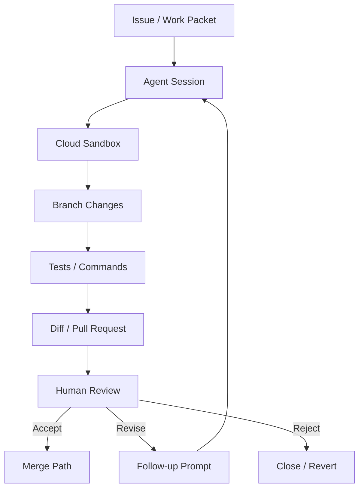
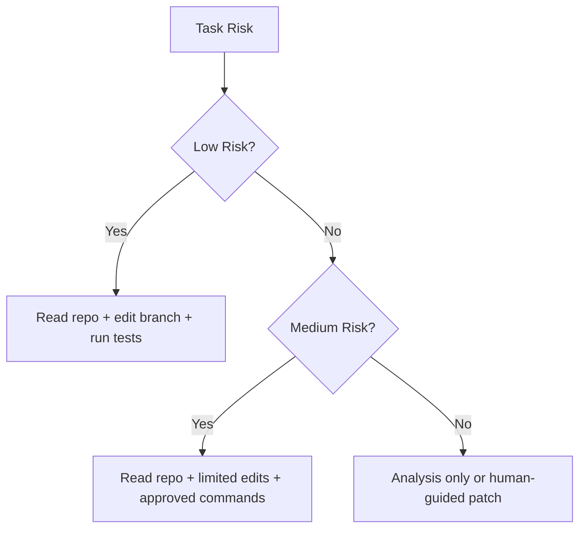
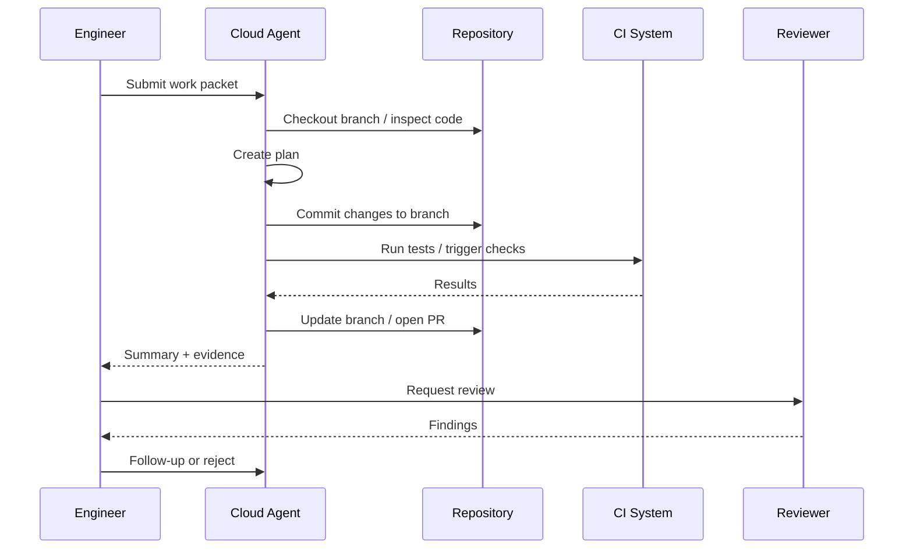
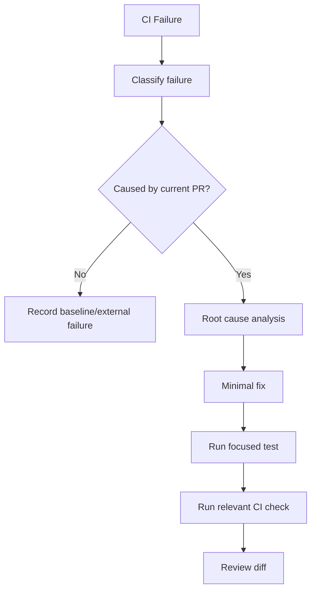
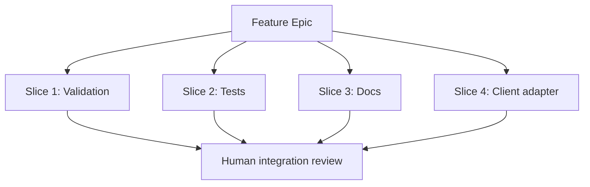

# Part 012 — Cloud Agent and Background Implementation

Cloud/background coding agent adalah AI development workflow di mana agent menjalankan task di environment terpisah, membaca repository, membuat plan, mengubah branch, menjalankan command/test, dan menghasilkan diff atau pull request untuk direview.

Ini berbeda dari AI pair programming lokal:

- pair programming membantu engineer di inner loop;
- cloud agent mengambil work packet dan bekerja relatif mandiri;
- engineer berperan sebagai task designer, reviewer, risk controller, dan integrator.

Cloud agent bukan “developer pengganti”. Ia adalah **execution worker** yang harus diberi bounded task, sandbox, permission, stop condition, dan review gate.

---

## 1. Kaufman Framing: Skill yang Harus Dibangun

Dalam kerangka Kaufman, cloud-agent competence bukan sekadar tahu cara klik “assign to agent”. Skill sebenarnya adalah:

> Mampu mendelegasikan pekerjaan software ke agent secara aman sehingga output-nya kecil, benar, bisa diverifikasi, dan tidak merusak delivery flow.

Sub-skill utama:

| Sub-skill | Output | Kegagalan umum |
|---|---|---|
| Work packet design | Task lengkap, bounded, verifiable | Agent diberi issue ambigu |
| Delegability assessment | Tahu task cocok/tidak cocok untuk agent | Semua task dilempar ke agent |
| Environment control | Sandbox dan branch isolated | Agent jalan di context salah |
| Permission design | Tools/command sesuai risiko | Agent terlalu bebas atau terlalu terbatas |
| Progress steering | Bisa memberi follow-up tanpa scope creep | Agent dibiarkan drift |
| Review integration | PR/diff direview dengan checklist | PR agent langsung merge |
| CI repair control | Agent memperbaiki failure secara kausal | Patch chasing di CI |
| Governance evidence | Ada audit trail dan verification log | Tidak ada bukti keputusan |

Target competence setelah latihan:

1. Bisa memilih task yang cocok untuk cloud agent.
2. Bisa membuat work packet yang tidak membutuhkan banyak klarifikasi.
3. Bisa mengatur branch, tests, permissions, dan stop conditions.
4. Bisa mereview hasil agent secara cepat tapi ketat.
5. Bisa mengukur apakah agent benar-benar meningkatkan delivery, bukan hanya menghasilkan activity.

---

## 2. Mental Model: Agent as Remote Execution Branch

Cloud agent sebaiknya dipikirkan seperti developer eksternal yang bekerja pada branch sementara.



Konsekuensi model ini:

- Agent tidak bekerja di main branch.
- Agent tidak boleh memiliki akses rahasia yang tidak diperlukan.
- Agent output harus berupa diff yang bisa direview.
- Agent session harus memiliki log cukup untuk audit.
- Merge tetap keputusan manusia atau policy-controlled automation.

---

## 3. Cloud Agent vs Local Agent vs Pair Programming

| Dimension | Pair Programming | Local Agent | Cloud Agent |
|---|---|---|---|
| Execution | Synchronous dengan engineer | Lokal di mesin engineer | Remote/background |
| Best for | Small edits, thinking together | Repo edits with tight feedback | Bounded tasks in parallel |
| Risk | Engineer melihat langsung | Medium | Higher due to async autonomy |
| Context | Current IDE/session | Local repo + commands | Remote checkout + configured context |
| Output | Code suggestion/diff | Local diff | Branch/PR/session logs |
| Review | Immediate | Immediate/batch | PR-style review |
| Failure mode | Blind accept | Local drift | Async scope drift, stale branch, wrong assumptions |

Cloud agent paling bernilai saat engineer ingin mem-parallel-kan pekerjaan yang bisa didefinisikan jelas.

---

## 4. Task Delegability Scorecard

Sebelum memberi task ke cloud agent, nilai apakah task cocok.

| Factor | Low risk | Medium risk | High risk |
|---|---|---|---|
| Scope | 1 module | 2–3 modules | Cross-system |
| Requirement clarity | Acceptance criteria jelas | Ada ambiguity kecil | Ambiguous product decision |
| Testability | Focused tests available | Some setup needed | Hard to reproduce |
| Contract impact | Internal only | Public API minor | Breaking change |
| Data impact | No persistent data | Read/query changes | Writes, migration, deletion |
| Security impact | None | Input handling | Auth, secrets, permissions |
| Domain criticality | Low | Business workflow | Regulatory/legal/financial decision |
| Reversibility | Easy revert | Moderate | Irreversible side effect |

Scoring rule:

- Mostly low: good cloud-agent candidate.
- Mixed low/medium: candidate with strong work packet and review.
- Any high in data/security/regulatory: use cloud agent only for analysis/test plan, not autonomous patch.

---

## 5. Ideal Cloud-Agent Task Types

### 5.1 Good Candidates

| Task | Why |
|---|---|
| Add missing tests for known behavior | Clear verification target |
| Fix small bug with stack trace | Reproduction likely available |
| Update docs based on diff | Low risk, bounded |
| Mechanical API client rename | Repetitive, testable |
| Dependency upgrade patch version | Can run tests, small blast radius |
| CI failure investigation | Agent can inspect logs and patch branch |
| Add validation rule with explicit invariant | Clear acceptance criteria |
| Generate migration dry-run checks | Useful but must be reviewed |

### 5.2 Poor Candidates

| Task | Why |
|---|---|
| “Improve architecture” | No clear done condition |
| “Make system faster” | Needs profiling and workload context |
| “Implement new billing logic” | Business correctness risk |
| “Rewrite auth module” | Security-critical |
| “Clean up the whole repo” | Unbounded diff |
| “Migrate database schema and data” | Data-loss risk |
| “Resolve all TODOs” | Contextless and broad |

---

## 6. Work Packet Anatomy

A cloud agent needs a complete task packet.

```md
# Agent Work Packet

## Objective
What should be true after this task?

## Background
Why is this needed? What current behavior exists?

## Scope
Allowed files/modules:
Forbidden files/modules:

## Constraints
Compatibility, dependencies, security, performance, data, style.

## Acceptance Criteria
Concrete observable outcomes.

## Verification
Commands to run, tests to add, evidence to provide.

## Stop Conditions
When the agent must stop instead of guessing.

## Output Expected
Branch, PR, summary, test results, risk notes.
```

A work packet is not a prompt. It is a **delegation contract**.

---

## 7. Cloud Agent Prompt Template

```text
You are working as a cloud implementation agent on a separate branch.

Objective:
<one-sentence objective>

Context:
<relevant business/domain background>

Scope:
Allowed:
- <module/file/path>

Not allowed:
- <module/file/path>
- public API changes
- database schema changes
- dependency additions

Acceptance criteria:
1. <criterion>
2. <criterion>
3. <criterion>

Implementation rules:
- Keep the diff minimal and reviewable.
- Follow existing code style and patterns.
- Prefer existing utilities.
- Do not perform broad refactors.
- Do not change behavior outside the criteria.

Verification:
- Add or update tests proving the behavior.
- Run: <commands>
- If a command cannot run, explain why and provide the closest verification.

Stop and report if:
- The task requires changing public contracts.
- The change affects more than <N> files.
- Tests need unavailable external services.
- Requirements are contradictory.

Final response:
- Summary of changes.
- Files changed.
- Tests run and results.
- Acceptance criteria mapping.
- Risks and follow-up suggestions.
```

---

## 8. Branch and Environment Isolation

Cloud agent work must be isolated.

### Branch policy

Recommended branch naming:

```text
agent/<ticket-id>-<short-slug>
```

Examples:

```text
agent/ENF-241-blocking-evidence-validation
agent/PLAT-912-fix-ci-timezone-test
agent/API-177-add-contract-test-for-null-status
```

### Environment rules

| Rule | Reason |
|---|---|
| Dedicated branch per task | Avoid mixed intent diff |
| Ephemeral sandbox | Reduce local machine/security risk |
| No production credentials | Prevent data exposure/damage |
| Least-privilege repo access | Reduce blast radius |
| Reproducible setup command | Agent can verify work |
| Explicit network policy | Prevent unexpected calls |
| Logs preserved | Audit and debugging |

---

## 9. Permission Model

Agent permissions should match task risk.



### Permission levels

| Level | Allowed | Example task |
|---|---|---|
| L0 Read-only | Search/read/summarize | Architecture analysis |
| L1 Draft only | Suggest patch, no write | Security-sensitive recommendation |
| L2 Branch edit | Modify branch, run safe tests | Validation rule |
| L3 Branch + PR | Push branch/open PR | Docs/test/bug fix |
| L4 Automation | Triggered by issue/CI event | Low-risk CI repair |

Avoid granting L4 to tasks that affect data, auth, regulatory decisions, deployment, or secrets.

---

## 10. Cloud Agent Execution Lifecycle



Every lifecycle stage can fail.

| Stage | Failure | Control |
|---|---|---|
| Work packet | Ambiguous task | Strong template |
| Checkout | Wrong base branch | Explicit branch/base |
| Plan | Overbroad approach | Require plan review for medium risk |
| Edit | Scope drift | Stop condition + diff review |
| Test | Flaky/partial verification | Test evidence requirement |
| PR | Poor summary | Required acceptance mapping |
| Review | Human blind trust | Checklist and reviewer ownership |
| Follow-up | Patch chasing | Root cause before additional edits |

---

## 11. Steering an Active Cloud Agent

A background agent may need steering. Follow-up prompts should be surgical.

### Good follow-up

```text
The diff changes the API response envelope, which is out of scope. Revert that part. Preserve the existing envelope and implement only the validator behavior. Keep the added tests for blocking evidence issue behavior.
```

### Bad follow-up

```text
Looks wrong, fix it.
```

### Steering categories

| Category | Prompt pattern |
|---|---|
| Scope correction | “Revert changes outside X. Keep only Y.” |
| Test correction | “This test mocks the behavior under test. Replace with assertion against real validator output.” |
| Contract correction | “Do not change public schema. Use existing error envelope.” |
| Dependency correction | “Remove new dependency and use existing utility.” |
| Investigation | “Stop editing. Explain why test X fails.” |

---

## 12. PR Review for Cloud-Agent Output

Cloud agent output should be reviewed like a human PR, with additional AI-specific checks.

### Required PR sections

```md
## Summary

## Acceptance Criteria Mapping
- [ ] Criterion 1 -> test / code path
- [ ] Criterion 2 -> test / code path

## Files Changed

## Tests Run

## Known Limitations

## Out-of-Scope Items Not Changed

## Risk Notes
```

### AI-specific review checklist

- Did the agent modify files outside allowed scope?
- Did it create a new abstraction unnecessarily?
- Did it invent non-existing assumptions?
- Did it silence tests instead of fixing behavior?
- Did it loosen assertions?
- Did it change public contract without instruction?
- Did it add dependency/config without approval?
- Did it expose sensitive data in logs/errors?
- Did it pass CI by skipping checks?
- Did it leave TODOs or uncertain comments?

---

## 13. Handling CI Failure Repair

Cloud agents are useful for CI failures because they can inspect logs, identify likely root cause, and push fixes to branch. But CI repair can easily become patch chasing.

### Safe CI repair workflow



### Prompt

```text
Investigate this CI failure.
Do not patch immediately.
First classify:
1. Compile failure
2. Test assertion failure
3. Flaky/timing failure
4. Environment/setup failure
5. Dependency/network failure
6. Lint/format failure

Then determine whether it was caused by this branch.
Only propose a minimal fix if the branch caused the failure.
Do not skip or loosen tests unless the test is provably wrong; explain evidence.
```

### Red flags

- Agent deletes failing test.
- Agent relaxes assertion without product rationale.
- Agent increases timeout repeatedly.
- Agent disables linter rule.
- Agent changes unrelated code to satisfy compile.
- Agent updates snapshots without explaining behavior change.

---

## 14. Preventing Scope Drift in Background Work

Scope drift is more dangerous in background mode because engineer is not watching every edit.

### Controls

1. Narrow work packet.
2. Allowed/forbidden file list.
3. Max file count threshold.
4. No dependency additions without stop.
5. No public contract changes without stop.
6. Required final acceptance mapping.
7. Branch-level diff review.
8. CI gating.
9. Human reviewer ownership.

### Stop condition examples

```text
Stop if the task requires touching more than 5 production files.
```

```text
Stop if an API schema change appears necessary.
```

```text
Stop if tests require credentials or external services unavailable in sandbox.
```

```text
Stop if existing code contradicts the issue description.
```

---

## 15. Agent Output Quality Rubric

Score every cloud-agent PR.

| Score | Meaning |
|---|---|
| 5 | Correct, small, tested, well summarized, no drift |
| 4 | Correct, minor review comments |
| 3 | Useful but needs human repair |
| 2 | Directionally useful but too risky/broad |
| 1 | Mostly wrong or unreviewable |
| 0 | Dangerous, destructive, or misleading |

Track this per task type. Over time, use data to decide what to delegate.

Example tracking table:

| Task type | Avg score | Delegate? | Notes |
|---|---:|---|---|
| Docs update | 4.7 | Yes | Low risk |
| Unit test generation | 4.1 | Yes with review | Watch weak assertions |
| CI lint fix | 4.3 | Yes | Good automation candidate |
| Domain validation | 3.5 | Yes with strong packet | Need invariant context |
| DB migration | 2.1 | Analysis only | Too much risk |
| Auth logic | 1.8 | No autonomous patch | Security review required |

---

## 16. Integration with Issue Trackers

Cloud-agent work improves when issue templates become agent-readable.

### Bad issue

```md
Fix evidence submission bug.
```

### Good issue

```md
## Problem
Cases with unresolved BLOCKING evidence issues can currently be submitted for enforcement review.

## Expected behavior
Submission must be rejected if any linked evidence issue has severity BLOCKING and resolutionStatus != RESOLVED.

## Error contract
Use existing error envelope with code CASE_HAS_BLOCKING_EVIDENCE_ISSUES.
Do not expose evidence details in the message.

## Scope
Module: enforcement-action-service.
Do not change DB schema or public API envelope.

## Acceptance criteria
- unresolved BLOCKING issue rejects
- resolved BLOCKING issue allows
- unresolved NON_BLOCKING issue allows
- validator tests cover all cases

## Verification
Run focused validator tests and service check command.
```

Agent-readable issue quality directly affects output quality.

---

## 17. Cloud Agent for Parallel Delivery

The advantage of background agents is parallelism. But parallelism increases integration risk.

### Safe parallelization pattern



Rules:

- Use one branch per slice.
- Avoid two agents editing same files.
- Merge low-risk independent slices first.
- Rebase/refresh agent branches after merges.
- Maintain an integration owner.

### Anti-pattern: agent swarm without integration owner

Symptoms:

- Multiple PRs touch same module.
- Conflicting abstractions appear.
- Tests pass individually but fail together.
- No one owns final design coherence.

Correction:

- Assign a human integrator.
- Create slice dependency graph.
- Limit concurrent agent sessions per module.

---

## 18. Data, Secrets, and Compliance Boundaries

Cloud agents often operate outside the developer’s local environment. Treat them as separate execution contexts.

### Never provide unless explicitly approved

- production credentials;
- raw customer data;
- sensitive regulatory case content;
- private keys;
- tokens;
- incident data with personal information;
- proprietary data outside approved tool policy.

### Safer alternatives

| Need | Safer input |
|---|---|
| Debug customer issue | Redacted log + synthetic reproduction |
| Test data | Generated fixture |
| Production query | Query shape + anonymized result |
| Secret-dependent flow | Mocked/stubbed boundary |
| Regulatory case | Domain invariant + anonymized scenario |

---

## 19. Governance Evidence

For enterprise environments, especially regulated systems, cloud-agent workflow must leave evidence.

Minimum evidence:

1. Work packet.
2. Agent session summary.
3. Files changed.
4. Tests run.
5. Human review record.
6. Risk classification.
7. Approval gate result.
8. Merge commit/PR link.
9. Rollback note for non-trivial changes.

Example PR footer:

```md
## AI Assistance Disclosure
This PR was drafted with a cloud coding agent.
Human owner reviewed the diff, verified tests, and accepts responsibility for the change.

## Verification Evidence
- Focused tests: passed
- Full module checks: passed
- Manual review checklist: completed

## Risk Classification
Medium: domain validation change, no API/DB/security boundary changes.
```

---

## 20. Cloud Agent Playbooks

### 20.1 Documentation Update Playbook

Task:

- Update README/runbook based on recent code change.

Prompt:

```text
Read the diff and update only documentation affected by the behavior change.
Do not invent behavior not present in code.
If the code is unclear, state uncertainty instead of documenting assumptions.
```

Review:

- Docs match code.
- No overclaiming.
- Examples compile or are clearly illustrative.

### 20.2 Test Gap Playbook

Task:

- Add missing tests for existing logic.

Prompt:

```text
Inspect <class/module> and produce a test matrix for observable behavior.
Then add focused tests for missing high-value cases.
Do not change production code unless a bug is found; if found, stop and report first.
```

Review:

- Tests assert behavior.
- Tests would fail on real regression.
- No excessive mocks.

### 20.3 Small Bug Fix Playbook

Task:

- Fix known reproducible bug.

Prompt:

```text
Use the reproduction steps and failing behavior to identify root cause.
Add a failing regression test first.
Implement the smallest fix.
Run focused tests.
```

Review:

- Regression test fails without fix.
- Fix addresses root cause, not symptom.
- No unrelated changes.

### 20.4 CI Failure Playbook

Task:

- Investigate failing CI on branch.

Prompt:

```text
Investigate the failing CI job. Classify the failure and determine whether this branch caused it. Do not skip tests. If patching, make the minimal change and explain why it fixes the failure.
```

Review:

- No test skipping.
- No assertion weakening.
- Failure classification is credible.

### 20.5 Mechanical Refactor Playbook

Task:

- Rename or move code mechanically.

Prompt:

```text
Perform only the mechanical rename/move described below.
Do not change behavior.
Run compile and focused tests.
If behavior change appears necessary, stop.
```

Review:

- Diff is mechanical.
- Public compatibility considered.
- Tests/compile pass.

---

## 21. Measuring Cloud Agent Productivity

Do not measure agent productivity by number of PRs. Measure delivery value and review burden.

### Useful metrics

| Metric | Why it matters |
|---|---|
| Acceptance rate | How often agent output is usable |
| Rework time | Hidden cost of bad output |
| Review time | Whether PRs are easier or harder |
| Defect escape | Quality impact |
| CI pass rate | Basic implementation quality |
| Diff size | Reviewability |
| Scope drift count | Delegation quality |
| Task cycle time | Delivery speed |
| Human interruption count | Work packet clarity |
| Risk-adjusted throughput | Value after controls |

### Bad metrics

| Metric | Problem |
|---|---|
| Lines generated | Rewards bloat |
| Number of sessions | Measures activity |
| Number of PRs | Ignores quality |
| Token usage alone | Ignores outcome |
| “Time saved” guesses | Often inflated |

---

## 22. Failure Modes and Recovery

### 22.1 Agent Opens Unreviewable PR

Symptoms:

- huge diff;
- many unrelated files;
- unclear summary;
- mixed refactor and feature.

Recovery:

1. Do not review line-by-line immediately.
2. Ask agent to split or revert unrelated changes.
3. If too broad, close branch and create smaller work packet.

Prompt:

```text
This PR is too broad. Split the work into independent slices. Keep only the minimal slice for <objective>. Revert unrelated refactors and produce a smaller diff.
```

### 22.2 Agent Misunderstands Domain

Symptoms:

- wrong state transition;
- wrong error code;
- wrong policy interpretation.

Recovery:

1. Provide invariant.
2. Provide example scenario.
3. Ask for revised plan before patch.

### 22.3 Agent Cannot Run Tests

Symptoms:

- environment missing;
- credentials unavailable;
- dependency not installed.

Recovery:

- require explanation;
- run locally/human CI;
- improve sandbox setup docs;
- avoid accepting unverified change.

### 22.4 Agent Loosens Tests

Symptoms:

- assertions removed;
- snapshots updated without rationale;
- failing tests skipped.

Recovery:

- reject patch;
- ask for root cause;
- restore tests;
- require behavior explanation.

---

## 23. Designing Agent-Ready Repositories

Cloud agents work better when repositories are self-describing.

Recommended files:

```text
AGENTS.md
CONTRIBUTING.md
README.md
adr/
docs/architecture/
docs/domain-glossary.md
docs/testing.md
docs/release.md
scripts/test-focused.sh
scripts/check.sh
.github/pull_request_template.md
```

### `AGENTS.md` example

```md
# Agent Instructions

## Project Overview
This service manages enforcement action lifecycle.

## Important Commands
- ./gradlew test
- ./gradlew :enforcement-action-service:test
- ./gradlew check

## Architecture Rules
- Controllers do not access repositories directly.
- Domain validation belongs in validators or domain services.
- Public API envelope must remain stable.

## Safety Rules
- Do not change DB schema unless explicitly requested.
- Do not add dependencies without approval.
- Do not log case evidence details.

## Testing Rules
- Prefer behavior tests over implementation tests.
- Add regression tests for bug fixes.
- Do not skip failing tests.
```

---

## 24. Enterprise Rollout Pattern

### Phase 1 — Read-only agents

Use agents for:

- codebase explanation;
- issue summarization;
- test gap analysis;
- PR summary drafting.

Goal:

- establish trust and data policy.

### Phase 2 — Low-risk branch agents

Use agents for:

- docs;
- tests;
- small bug fixes;
- mechanical changes.

Goal:

- measure acceptance and review burden.

### Phase 3 — Controlled implementation agents

Use agents for:

- bounded feature slices;
- CI repair;
- internal APIs;
- refactors with characterization tests.

Goal:

- scale delivery without quality loss.

### Phase 4 — Event-triggered automation

Use agents for:

- scheduled dependency checks;
- CI failure triage;
- issue template enrichment;
- low-risk maintenance PRs.

Goal:

- automate routine work with governance.

---

## 25. 20-Hour Practice Plan

### Hour 0–2: Environment Setup

- Configure repo instructions.
- Define safe commands.
- Create branch naming convention.
- Run one read-only analysis session.

### Hour 2–5: Documentation and Test Tasks

- Delegate docs update.
- Delegate test gap task.
- Score PR quality.

### Hour 5–8: Small Bug Fix

- Create work packet for reproducible bug.
- Require regression test.
- Review agent PR.

### Hour 8–11: CI Repair

- Use agent to inspect failing CI.
- Require classification before patch.
- Reject any test-skipping behavior.

### Hour 11–15: Feature Slice

- Delegate one bounded feature slice.
- Use stop conditions and acceptance mapping.
- Run human review checklist.

### Hour 15–18: Parallel Agent Sessions

- Run two independent low-risk tasks.
- Manage branch isolation.
- Resolve integration order.

### Hour 18–20: Metrics and Playbook

- Score all agent outputs.
- Identify best/worst task categories.
- Update team work packet template.
- Define delegation policy.

---

## 26. Senior Engineer Heuristics

1. Delegate execution, not judgment.
2. Use cloud agents for bounded slices, not vague ownership.
3. Make stop conditions explicit.
4. Prefer small PRs over impressive diffs.
5. Require tests that prove behavior.
6. Never let agent fix CI by weakening signal.
7. Treat sandbox output as untrusted until reviewed.
8. Track review burden, not just time saved.
9. Keep an integration owner for parallel work.
10. In regulated systems, preserve evidence and accountability.

---

## 27. Key Takeaways

Cloud agents are valuable when the work is:

- bounded;
- isolated;
- testable;
- reversible;
- reviewable;
- governed.

They are dangerous when used as vague autonomous developers.

The top-tier skill is not “using many agents”. It is designing a software delivery system where agents can safely perform execution work while humans retain control over architecture, domain correctness, risk, and accountability.

---

## References

- OpenAI Codex and Codex cloud documentation.
- GitHub Copilot cloud agent documentation.
- Anthropic Claude Code documentation.
- Model Context Protocol specification.
- OWASP Top 10 for LLM Applications.
- NIST AI Risk Management Framework and Generative AI Profile.
