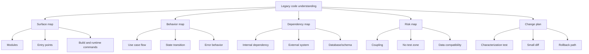
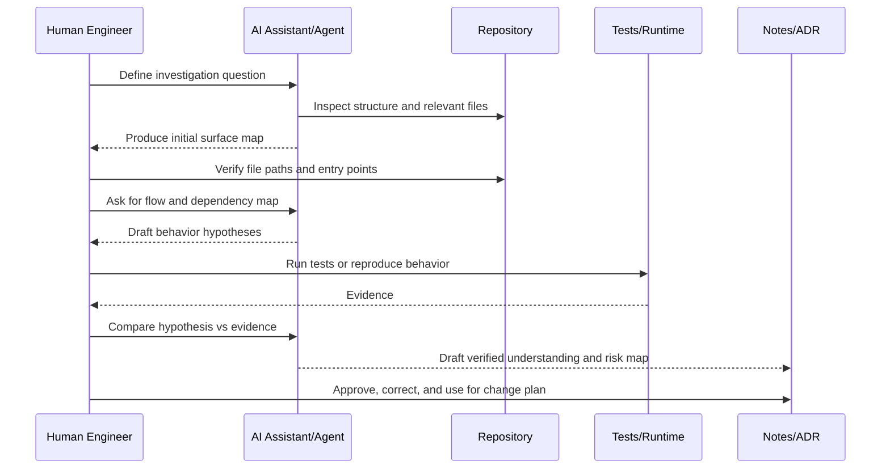
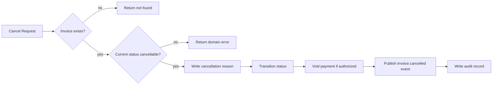
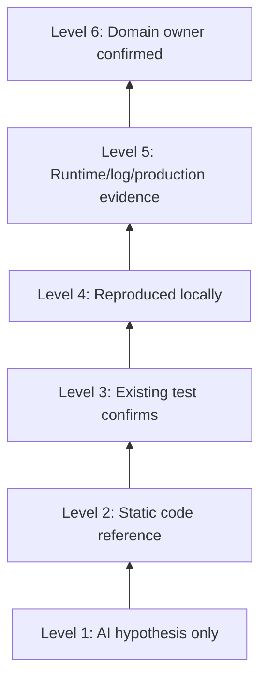
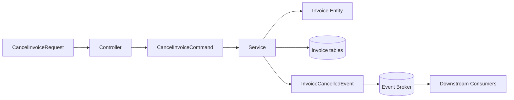

------
title: Learn AI Development Driven Implementation and Usage - Part 013
description: AI for legacy code understanding: membaca codebase tua, memetakan behavior, menemukan coupling tersembunyi, dan membuat safe change plan tanpa jatuh ke ilusi pemahaman AI.
series: learn-ai-development-driven-implementation-usage
seriesTitle: Learn AI Development Driven Implementation and Usage
order: 13
partTitle: AI for Legacy Code Understanding
tags:
- ai
- software-engineering
- legacy-code
- codebase-understanding
- maintainability
- series
date: 2026-06-30
---

# Part 013 — AI for Legacy Code Understanding

Legacy code bukan berarti kode lama. Dalam engineering practice, legacy code adalah kode yang sulit diubah dengan percaya diri karena behavior-nya tidak sepenuhnya terlihat, test-nya tidak cukup melindungi, ownership-nya kabur, dan dependency-nya menyimpan banyak aturan implisit.

AI dapat mempercepat pemahaman legacy code, tetapi tidak boleh diperlakukan sebagai sumber kebenaran. AI adalah **accelerator untuk membaca, menghubungkan, dan menyusun hipotesis**. Sumber kebenaran tetap kombinasi dari kode aktual, test, runtime behavior, data, log, schema, dan keputusan domain yang masih berlaku.

Target part ini adalah membuat kamu mampu memakai AI untuk masuk ke codebase yang tidak kamu kuasai, menemukan peta perubahan yang aman, dan menghasilkan evidence sebelum menyentuh implementasi.

---

## 1. Kaufman Framing

Dalam kerangka Josh Kaufman, skill ini perlu dipecah menjadi sub-skill kecil yang bisa dilatih langsung. Kita tidak sedang belajar "memahami semua legacy code". Itu terlalu besar dan tidak operasional. Kita sedang belajar melakukan **legacy code reconnaissance** secara sistematis.

### Target Performance

Setelah latihan, kamu harus mampu:

1. Mengambil satu area legacy code yang belum dikenal.
2. Mengidentifikasi entry point, data flow, control flow, dan state transition penting.
3. Membedakan behavior eksplisit, behavior implisit, dan behavior yang hanya diasumsikan AI.
4. Membuat change map: file yang harus diubah, file yang tidak boleh disentuh, test yang harus dibuat, dan risiko integrasi.
5. Menghasilkan summary yang bisa direview engineer lain tanpa harus membaca seluruh codebase dari nol.

### Deconstruction



### Self-Correction Loop

AI akan sering memberi penjelasan yang terdengar benar. Self-correction wajib dilakukan dengan pola:

```text
Ask AI -> Verify in code -> Verify with tests/runtime -> Ask for contradiction -> Update map
```

Jangan berhenti pada summary pertama. Summary pertama biasanya masih terlalu bersih dibanding realita codebase.

---

## 2. Mental Model: AI Is a Reconnaissance Partner, Not a Maintainer of Truth

Saat membaca legacy code, AI berguna untuk:

- Menemukan file yang relevan.
- Menjelaskan flow antar function/class/module.
- Membuat diagram awal.
- Menyusun pertanyaan untuk engineer/domain expert.
- Membuat test characterization.
- Menemukan kemungkinan edge case.
- Menyusun impact analysis.

AI tidak aman untuk:

- Menyatakan behavior produksi tanpa evidence.
- Menganggap nama method sama dengan behavior aktual.
- Menghapus kode "tidak dipakai" hanya karena static search tidak menemukannya.
- Mengubah migration/data logic tanpa runtime proof.
- Menyimpulkan rule domain dari satu branch kode.

Legacy code punya banyak behavior yang tidak muncul dari local reading:

1. Behavior dipicu konfigurasi environment.
2. Behavior dipicu data historis.
3. Behavior dipicu scheduler.
4. Behavior dipicu downstream contract.
5. Behavior dipicu side effect library/framework.
6. Behavior dipicu retry, timeout, dan concurrency.
7. Behavior dipicu migration lama yang tidak terdokumentasi.

AI bisa membaca file. AI belum tentu memahami sejarah sistem.

---

## 3. Legacy Reconnaissance Workflow

Gunakan workflow berikut setiap kali masuk ke area codebase asing.



### Step 1 — Frame the Investigation Question

Jangan mulai dengan prompt seperti:

```text
Explain this codebase.
```

Itu terlalu luas. AI akan membuat narasi umum yang sulit diverifikasi.

Gunakan pertanyaan investigasi:

```text
I need to understand how invoice cancellation works from API request to database update.
Focus on entry points, state transitions, validation, side effects, and tests.
Do not propose changes yet. Mark every claim as verified from code or hypothesis.
```

Investigation question yang baik punya:

- Domain object.
- Trigger/entry point.
- Boundary akhir.
- Concern utama.
- Larangan membuat perubahan.
- Requirement evidence.

### Step 2 — Build a Surface Map

Surface map menjawab: "Apa saja bagian sistem yang tampak relevan?"

Output minimal:

```mdx
## Surface Map

### Entry Points
- `InvoiceController.cancel(...)` — HTTP cancellation entry point.
- `CancelInvoiceConsumer.handle(...)` — event-driven cancellation entry point.
- `InvoiceAdminJob.run(...)` — batch cancellation for expired invoices.

### Core Services
- `InvoiceCancellationService`
- `InvoiceStateMachine`
- `InvoiceRepository`

### Persistence
- `invoice.status`
- `invoice_cancel_reason`
- `invoice_event_log`

### External Effects
- Payment gateway void/refund call
- Notification event
- Audit log writer

### Existing Tests
- `InvoiceCancellationServiceTest`
- `InvoiceControllerIT`
- No test found for batch cancellation path
```

Surface map harus berdasarkan file nyata. Kalau AI menyebut file yang tidak ada, hentikan dan koreksi.

### Step 3 — Build a Behavior Map

Behavior map menjawab: "Apa yang benar-benar terjadi?"

Untuk legacy code, behavior map lebih penting dari class diagram.



Minta AI membedakan:

- Happy path.
- Validation failure.
- Idempotent retry.
- Partial failure.
- Compensating behavior.
- Transaction boundary.
- External side effects.

### Step 4 — Build a Dependency Map

Dependency map menjawab: "Apa yang bisa ikut rusak jika bagian ini berubah?"

Dependency bukan hanya import statement. Dalam legacy system, dependency sering tersembunyi dalam:

- Database table yang dipakai service lain.
- Event topic yang dikonsumsi downstream.
- Enum/string status yang dipakai report.
- Scheduled job yang membaca flag lama.
- Stored procedure.
- Configuration property.
- Feature flag.
- UI assumption.
- Batch export.
- Data warehouse pipeline.

Prompt:

```text
Map all dependencies of this cancellation flow.
Separate direct code dependencies, database dependencies, event/API dependencies, configuration dependencies, and inferred dependencies.
For each dependency, include evidence location and risk if changed.
```

Output yang diharapkan:

```mdx
| Dependency | Type | Evidence | Risk |
|---|---|---|---|
| `invoice.status = CANCELLED` | Database contract | `InvoiceStatus.java`, report SQL | Report/backfill may break if value changes |
| `invoice.cancelled.v1` | Event contract | `InvoiceEventPublisher` | Downstream billing reconciliation depends on payload |
| `payment.void.enabled` | Config | `PaymentConfig` | Different behavior between staging/prod |
```

---

## 4. The Evidence Ladder

Saat AI menjelaskan legacy code, setiap klaim harus diberi level evidence.



### Evidence Levels

| Level | Meaning | Use |
|---:|---|---|
| 1 | AI hypothesis only | Brainstorming only, not decision basis |
| 2 | Static code reference | Candidate understanding |
| 3 | Existing test confirms | Good but may not cover production variation |
| 4 | Locally reproduced | Strong for implementation planning |
| 5 | Runtime/log/production evidence | Strongest technical evidence |
| 6 | Domain owner confirmed | Needed when code behavior may be historical workaround |

Rule praktis:

- Jangan menghapus logic berdasarkan Level 1–2.
- Jangan mengubah data migration berdasarkan Level 1–3.
- Jangan mengubah domain invariant tanpa Level 5 atau Level 6.
- Jangan mengubah public contract tanpa consumer impact analysis.

---

## 5. Prompt Patterns for Legacy Code Understanding

### 5.1 Repository Recon Prompt

```text
You are helping me understand a legacy codebase.
Goal: understand the flow for <feature/use case>.
Do not edit files.
First, inspect likely entry points, tests, config, schema, and docs.
Return:
1. Candidate entry points
2. Core modules/classes/functions
3. Data stores touched
4. External systems touched
5. Existing tests
6. Unknowns and assumptions
For every claim, include file path and symbol name.
```

### 5.2 Flow Reconstruction Prompt

```text
Reconstruct the runtime flow for <use case>.
Separate:
- HTTP/API path
- Event/consumer path
- Scheduled/batch path
- Admin/manual path
For each path, list validation, state changes, external calls, transaction boundaries, and error behavior.
Mark each point as verified or inferred.
```

### 5.3 Hidden Coupling Prompt

```text
Find hidden coupling around <domain object/status/table/event>.
Search for string constants, enum values, SQL references, config keys, event topic names, JSON field names, and migration scripts.
Group the results by coupling type and explain what would break if the value or behavior changes.
```

### 5.4 Characterization Test Prompt

```text
Before changing this behavior, propose characterization tests.
Do not optimize or redesign.
Each test should capture current behavior, including strange edge cases.
Include:
- Test name
- Given/When/Then
- Fixtures needed
- Why this behavior matters
- Whether it protects a public contract, data contract, or internal behavior
```

### 5.5 Change Plan Prompt

```text
Based on the verified behavior map, propose a minimal safe change plan.
Constraints:
- Keep diff small
- Preserve existing public behavior unless explicitly changed
- Add characterization tests first
- Avoid broad refactor
- List files to change and files to avoid
- Include rollback strategy
- Include verification commands
```

---

## 6. Reading Strategies by Codebase Type

Legacy code varies. Jangan pakai strategi yang sama untuk semua repo.

### 6.1 Monolith

Risiko utama:

- Shared database.
- Shared transaction boundary.
- Global config.
- Utility class dipakai semua module.
- Service layer terlalu besar.
- UI/API/reporting membaca model yang sama.

AI workflow:

1. Map module/package boundary.
2. Trace entry point ke service utama.
3. Cari semua repository/DAO access.
4. Cari transaction annotation.
5. Cari shared enum/status/string.
6. Cari integration test.
7. Buat characterization tests sebelum refactor.

Prompt tambahan:

```text
Identify which parts of this monolith are truly local to the target feature and which are shared platform mechanisms.
Do not recommend changes to shared mechanisms unless necessary.
```

### 6.2 Microservices

Risiko utama:

- Distributed contract.
- Eventual consistency.
- Retry semantics.
- Idempotency.
- Backward compatibility.
- Observability gap.

AI workflow:

1. Map inbound API/event.
2. Map outbound API/event.
3. Map idempotency key/correlation id.
4. Map state ownership.
5. Map retry/dead-letter behavior.
6. Compare schema and implementation.
7. Validate with integration/contract test.

Prompt tambahan:

```text
Map this feature across service boundaries.
Focus on ownership of state, idempotency, retries, event ordering, and backward compatibility.
```

### 6.3 Data-Heavy System

Risiko utama:

- Historical data shape.
- Migration order.
- Backfill semantics.
- Report dependency.
- Data warehouse pipeline.
- Soft delete / archival logic.

AI workflow:

1. Inspect schema migration history.
2. Inspect ORM/entity mapping.
3. Inspect raw SQL/stored procedure.
4. Inspect batch/report query.
5. Inspect data cleanup jobs.
6. Identify invariant that data may violate.
7. Design read-compatible migration.

Prompt tambahan:

```text
Analyze data compatibility risk for changing <table/column/status>.
Consider old rows, nullability, migration order, backfill, report queries, and downstream consumers.
```

### 6.4 Framework-Heavy Code

Risiko utama:

- Behavior hidden in annotations.
- Runtime proxy.
- Reflection.
- Dependency injection lifecycle.
- Auto-configuration.
- Interceptor/filter/aspect.

AI workflow:

1. Map annotations and generated behavior.
2. Identify lifecycle hook.
3. Trace interceptors/filters/aspects.
4. Check framework config.
5. Inspect generated code if applicable.
6. Run focused tests.

Prompt tambahan:

```text
Explain framework-provided behavior in this flow.
List annotations, proxies, interceptors, filters, lifecycle hooks, generated code, and configuration that affect runtime behavior.
```

---

## 7. The Legacy Understanding Document

Setiap investigasi legacy code harus menghasilkan artifact kecil. Jangan biarkan pengetahuan hanya tinggal di chat.

Template:

```mdx
# Legacy Understanding: <Feature/Flow>

## Investigation Question
What are we trying to understand?

## Scope
In scope:
- ...

Out of scope:
- ...

## Entry Points
| Entry | Type | Evidence |
|---|---|---|

## Behavior Map
Describe happy path, failure path, idempotency, partial failure, and transaction boundary.

## State Model
List states, transitions, guards, side effects.

## Data Model
Tables/entities/columns touched.

## External Contracts
APIs, events, files, reports, integrations.

## Hidden Coupling
Known coupling and why it matters.

## Existing Tests
What protects the behavior today?

## Gaps
What is unknown or unverified?

## Risk Map
What can break?

## Safe Change Plan
Minimal change sequence.

## Verification Plan
Commands, tests, manual checks, logs.
```

AI bisa membuat draft, tetapi human harus mengubah status klaim dari inferred menjadi verified.

---

## 8. Characterization Before Modification

Michael Feathers mempopulerkan ide bahwa legacy code perlu dilindungi dengan test sebelum diubah. Dalam AI-driven workflow, ini menjadi lebih penting karena AI dapat membuat perubahan besar dengan sangat cepat.

Characterization test bukan test ideal. Ia menangkap behavior saat ini, termasuk behavior yang aneh.

### Example

Requirement:

```text
Fix invoice cancellation so already-cancelled invoices return success instead of error.
```

AI mungkin langsung mengubah service. Lebih aman:

1. Pahami current behavior.
2. Tambahkan characterization test untuk behavior existing.
3. Tambahkan desired behavior test.
4. Ubah logic minimal.
5. Jalankan test.
6. Review downstream effect.

```java
@Test
void cancelAlreadyCancelledInvoice_currentBehavior_returnsDomainError() {
    // Given existing behavior before change.
    // This test may be temporary if new behavior intentionally replaces it.
}

@Test
void cancelAlreadyCancelledInvoice_newBehavior_returnsSuccessWithoutSideEffect() {
    // Given idempotent cancellation requirement.
}
```

AI prompt:

```text
Add characterization tests for the current cancellation behavior before changing it.
Do not modify production code yet.
Keep tests narrow and name them so reviewers can see which current behavior is being captured.
```

### Rule

Jika AI tidak bisa menulis test karena dependency terlalu sulit, itu bukan alasan untuk skip test. Itu sinyal bahwa codebase punya seam problem.

Gunakan teknik:

- Golden master test.
- Approval test.
- Integration slice test.
- Contract test.
- Log/output snapshot.
- Test container for infrastructure dependency.
- Fake adapter around external service.
- Extract seam kecil sebelum behavior change.

---

## 9. Hidden Coupling Detection

AI sangat baik untuk mencari pattern, tetapi harus diarahkan.

### Coupling Search Checklist

| Coupling Type | Search Target |
|---|---|
| Status coupling | Enum values, string literals, database values |
| Field coupling | JSON field names, DTO mapping, SQL columns |
| Event coupling | Topic name, event type, schema version |
| Config coupling | Feature flags, environment variables, property keys |
| Time coupling | Scheduler cron, TTL, timeout, grace period |
| Transaction coupling | `@Transactional`, unit-of-work, commit hook |
| Retry coupling | idempotency key, retry policy, DLQ consumer |
| UI coupling | frontend labels, disabled states, routes |
| Report coupling | SQL view, export job, dashboard query |
| Data migration coupling | Flyway/Liquibase migration, backfill job |

### Prompt

```text
Search for all usages of status value "PENDING_APPROVAL".
Include enum declarations, string literals, SQL migrations, tests, JSON payloads, frontend code, reports, and documentation.
Group by whether the usage is a reader, writer, validator, display-only, or migration artifact.
```

### Interpretation

Tidak semua usage punya risiko sama.

| Usage | Risk |
|---|---|
| Display label | Low if value unchanged |
| Validation rule | Medium/high |
| Writer | High |
| Migration artifact | High if old data exists |
| Report query | Medium/high depending business impact |
| External schema | Very high |

---

## 10. AI-Assisted Call Graph and Data Flow

AI dapat membantu membuat call graph konseptual, tetapi jangan menganggapnya lengkap. Static call graph sering gagal pada reflection, framework DI, dynamic dispatch, event bus, annotation processor, generated code, dan runtime configuration.

### Practical Call Graph Prompt

```text
Create a practical call graph for <use case>, not a complete static call graph.
Include only calls that affect behavior, state, persistence, external effects, or errors.
Mark dynamic/framework calls separately.
```

### Output Format

```mdx
## Practical Call Graph

1. `InvoiceController.cancelInvoice(...)`
   - validates request shape
   - calls `InvoiceCancellationService.cancel(...)`
2. `InvoiceCancellationService.cancel(...)`
   - loads invoice
   - checks state transition
   - persists cancellation
   - emits event
3. `InvoiceEventPublisher.publishCancelled(...)`
   - serializes event
   - publishes to topic

## Framework/Dynamic Behavior
- `@Transactional` wraps service method.
- `@Retryable` may retry gateway call.
- Event listener may run asynchronously.
```

### Data Flow Diagram



---

## 11. Legacy Code Smells That Confuse AI

AI cenderung terlihat percaya diri ketika menghadapi smell ini. Kamu harus meningkatkan skepticism.

### 11.1 Misleading Names

Method bernama `validate()` mungkin melakukan mutation. Service bernama `Helper` mungkin menyimpan domain rule penting.

Prompt:

```text
Do not infer behavior from names alone. Inspect method bodies and side effects.
List cases where the name and behavior may not match.
```

### 11.2 Boolean Flags

Boolean lama sering menyembunyikan state machine.

```java
if (active && approved && !suspended && manualOverride) {
    // real domain state hidden here
}
```

Prompt:

```text
Infer the implicit state model from these boolean flags.
List all combinations that are meaningful, invalid, or unreachable based on code evidence.
```

### 11.3 Temporal Logic

Legacy systems sering punya rule berbasis waktu:

- grace period,
- settlement window,
- cooling-off period,
- retry delay,
- SLA cutoff,
- end-of-day processing.

Prompt:

```text
Find all time-based rules in this flow: date comparisons, clock usage, cron schedules, TTL, timeout, grace period, and timezone assumptions.
```

### 11.4 Error Swallowing

```java
try {
    notifyCustomer(invoice);
} catch (Exception ignored) {
}
```

AI mungkin melewatkan dampaknya. Human harus tanya:

- Apakah ini intentional?
- Apakah retry terjadi di tempat lain?
- Apakah error masuk log?
- Apakah side effect boleh gagal diam-diam?

### 11.5 Shared Mutable State

AI sering kurang waspada terhadap shared mutable state, cache global, static holder, dan singleton dengan lifecycle kabur.

Prompt:

```text
Identify shared mutable state in this area.
Include static fields, caches, singleton services, mutable config, thread-local values, and global registries.
Explain concurrency and test isolation risks.
```

---

## 12. Using AI to Ask Better Questions

Engineer top-tier tidak hanya meminta AI menjawab. Mereka memakai AI untuk menemukan pertanyaan yang harus ditanyakan.

Prompt:

```text
Based on this code and the current uncertainty, generate the 10 most important questions for the original maintainers/domain owners.
Group by behavior, data, integration, security, operations, and product intent.
For each question, explain what risk remains unanswered.
```

Contoh output:

| Question | Why It Matters |
|---|---|
| Are cancellations after settlement supposed to trigger refund or void? | Payment side effect differs by settlement state. |
| Can the same invoice be cancelled from API and batch job concurrently? | Race condition/idempotency risk. |
| Is `CANCELLED_MANUAL` still used by reports? | Removing state may break compliance report. |

---

## 13. Legacy Change Readiness Score

Sebelum implementasi, beri score kesiapan perubahan.

| Dimension | 0 | 1 | 2 |
|---|---|---|---|
| Entry point known | Unknown | Some known | All relevant entry points known |
| Behavior mapped | Mostly guessed | Main path mapped | Happy/failure/side effect mapped |
| Tests available | None | Partial | Meaningful tests exist/new tests added |
| Dependencies mapped | Unknown | Internal only | Internal + external + data mapped |
| Runtime evidence | None | Local only | Logs/prod/domain confirmation available |
| Rollback path | None | Manual | Clear and tested |

Interpretasi:

- 0–4: Jangan ubah production behavior.
- 5–8: Boleh buat spike atau characterization tests.
- 9–12: Boleh implementasi small diff dengan review ketat.

Prompt:

```text
Score this planned legacy change using the readiness scorecard.
Be conservative. For every score, cite evidence and list what would increase confidence.
```

---

## 14. Anti-Patterns

### 14.1 Summary-Driven Development

Bahaya:

```text
AI summarized the module, so I changed it.
```

Masalah:

- Summary bisa salah.
- Summary bisa mengabaikan dynamic behavior.
- Summary tidak sama dengan evidence.

Perbaikan:

```text
AI produced a hypothesis. I verified it through code, tests, and runtime evidence before changing behavior.
```

### 14.2 Big Bang Cleanup

AI sering mampu melakukan refactor besar. Itu bukan berarti harus dilakukan.

Legacy change aman biasanya:

1. Characterize.
2. Add seam.
3. Small behavior change.
4. Verify.
5. Optional cleanup.

### 14.3 AI Deletes "Dead" Code

Dead code dalam legacy system bisa dipanggil oleh:

- reflection,
- config,
- script,
- scheduler,
- external plugin,
- migration,
- data export,
- admin tool.

Jangan hapus tanpa runtime evidence.

### 14.4 Test Theater

AI bisa membuat test yang hanya menguji mock interaction atau implementation detail.

Test yang baik untuk legacy change harus melindungi behavior yang akan rusak jika perubahan salah.

### 14.5 Mixing Understanding and Refactoring

Saat investigasi, larang AI edit file. Pisahkan fase:

1. Investigate.
2. Characterize.
3. Plan.
4. Implement.
5. Review.

---

## 15. Practical Exercise: 90-Minute Legacy Recon Drill

Gunakan repo nyata atau sample codebase.

### 0–10 min — Define Investigation

Tulis:

```text
I need to understand <feature> from <entry> to <effect>.
```

### 10–25 min — Surface Map

Minta AI cari entry points, services, persistence, tests, config.

### 25–45 min — Behavior Map

Minta AI reconstruct happy path, failure path, side effect, transaction boundary.

### 45–60 min — Hidden Coupling

Cari status/string/schema/event/config usage.

### 60–75 min — Characterization Plan

Minta AI propose tests dan pilih 2–3 test paling penting.

### 75–90 min — Change Readiness Score

Score perubahan. Tentukan apakah boleh implementasi atau perlu evidence tambahan.

Deliverable:

```mdx
# Legacy Recon Result
- Investigation question
- Surface map
- Behavior map
- Hidden coupling
- Test plan
- Readiness score
- Decision: implement/spike/wait
```

---

## 16. Senior Engineer Review Checklist

Sebelum menerima output AI tentang legacy code, cek:

- Apakah semua file path nyata?
- Apakah entry point lengkap?
- Apakah AI membedakan verified vs inferred?
- Apakah ada path async/batch/admin yang terlewat?
- Apakah transaction boundary jelas?
- Apakah external side effect jelas?
- Apakah state transition jelas?
- Apakah old data/migration dipertimbangkan?
- Apakah downstream contract dipertimbangkan?
- Apakah ada characterization test?
- Apakah planned diff kecil?
- Apakah rollback path masuk akal?

---

## 17. What Top 1% Engineers Do Differently

Engineer rata-rata memakai AI untuk menjelaskan file. Engineer top-tier memakai AI untuk membangun **evidence-based change confidence**.

Perbedaannya:

| Average Usage | Top-Tier Usage |
|---|---|
| "Explain this code" | "Reconstruct this flow and mark verified vs inferred" |
| Trust summary | Demand evidence ladder |
| Change first | Characterize first |
| Search imports | Search contracts, data, configs, reports |
| Refactor broadly | Slice change narrowly |
| Review code only | Review behavior, risk, and rollback |
| Stop after AI answer | Ask AI for contradictions and missing paths |

Top-tier engineer tidak lebih cepat karena asal percaya AI. Mereka lebih cepat karena punya workflow yang membuat AI bekerja di dalam pagar evidence.

---

## 18. Part Summary

Legacy code understanding dengan AI bukan aktivitas membaca pasif. Ini adalah investigasi terstruktur.

Prinsip utama:

1. AI menghasilkan hipotesis, bukan kebenaran.
2. Setiap klaim perlu evidence level.
3. Behavior map lebih penting dari class diagram.
4. Hidden coupling harus dicari secara eksplisit.
5. Characterization test datang sebelum behavior change.
6. Small diff lebih aman daripada big cleanup.
7. Knowledge harus disimpan sebagai artifact, bukan hilang di chat.

Jika Part 011–012 mengajarkan cara implementasi dengan AI, Part 013 mengajarkan kapan kamu **belum boleh implementasi** karena belum cukup memahami legacy surface area.

---

## 19. References

- Michael Feathers, *Working Effectively with Legacy Code*.
- Martin Fowler, *Refactoring* and characterization testing discussions.
- OpenAI Codex documentation: custom instructions and agent workflows.
- Anthropic Claude Code documentation: agentic codebase reading, editing, command execution, and permissions.
- GitHub Copilot documentation: coding agent and repository workflow.
- OpenTelemetry documentation: logs, traces, metrics, and observability concepts.
