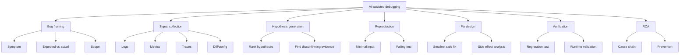
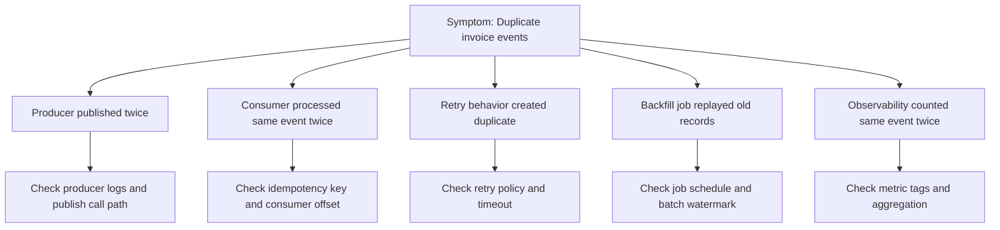
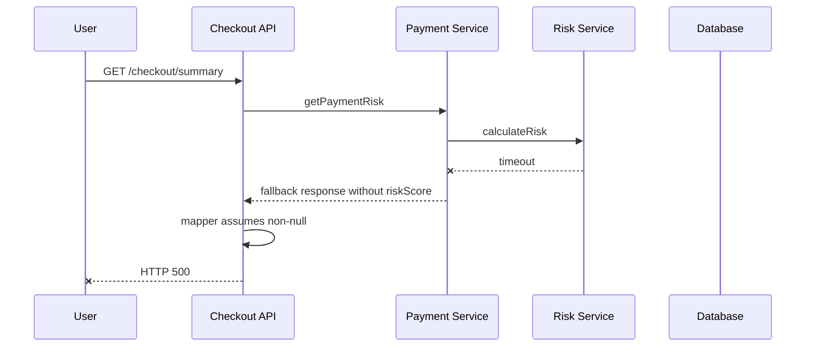
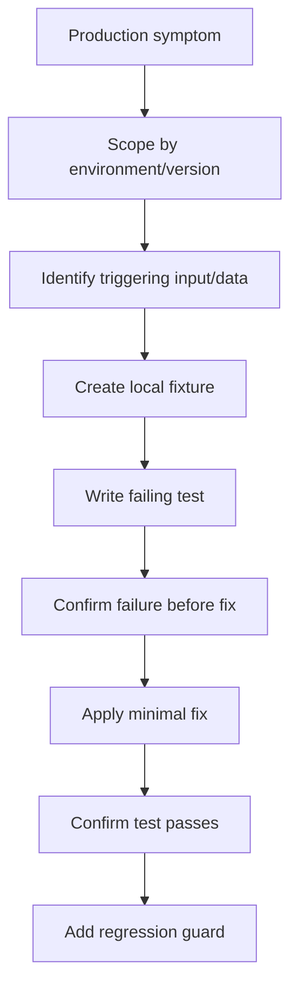
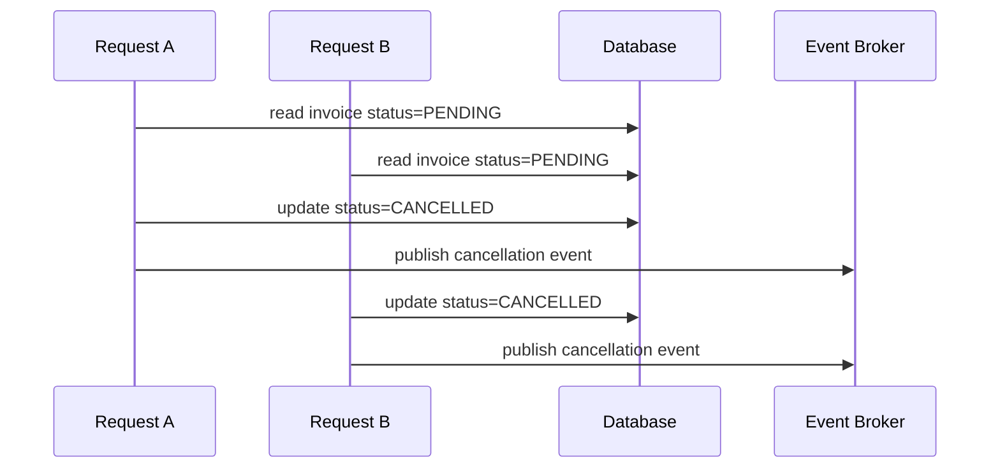

------
title: Learn AI Development Driven Implementation and Usage - Part 014
description: AI for debugging and root cause analysis: membangun hypothesis tree, reproduksi, observability-assisted investigation, minimal failing test, fix verification, dan incident-grade evidence.
series: learn-ai-development-driven-implementation-usage
seriesTitle: Learn AI Development Driven Implementation and Usage
order: 14
partTitle: AI for Debugging and Root Cause Analysis
tags:
- ai
- software-engineering
- debugging
- root-cause-analysis
- observability
- incident-response
- series
date: 2026-06-30
---

# Part 014 — AI for Debugging and Root Cause Analysis

Debugging bukan sekadar menemukan baris kode yang salah. Dalam sistem production-grade, debugging adalah proses mengubah gejala menjadi hipotesis, hipotesis menjadi reproduksi, reproduksi menjadi minimal failing case, lalu fix menjadi evidence bahwa masalah benar-benar hilang tanpa membuat regresi baru.

AI sangat kuat untuk mempercepat debugging karena ia bisa membaca stack trace, membandingkan diff, menyusun kemungkinan penyebab, menulis test reproduksi, dan merangkum log. Tetapi AI juga mudah membuat narasi penyebab yang terlihat masuk akal padahal belum terbukti.

Target part ini adalah memakai AI sebagai **debugging amplifier** tanpa kehilangan disiplin ilmiah: observe, hypothesize, test, falsify, fix, verify.

---

## 1. Kaufman Framing

### Target Performance

Setelah mempelajari part ini, kamu harus mampu:

1. Mengubah bug report kabur menjadi debugging brief yang actionable.
2. Memakai AI untuk membangun hypothesis tree, bukan single guess.
3. Menentukan evidence yang dibutuhkan untuk membuktikan atau menolak hipotesis.
4. Membuat minimal reproduction dan failing test.
5. Memakai log, metric, trace, diff, dan config sebagai sumber evidence.
6. Memverifikasi fix dengan test dan observability.
7. Membuat RCA yang jujur, tidak menyalahkan individu, dan berguna untuk mencegah regresi.

### Deconstruction



---

## 2. The Debugging Contract

Sebelum meminta AI menganalisis bug, buat debugging contract.

```text
We are debugging <symptom>.
Expected behavior: <expected>.
Actual behavior: <actual>.
Scope: <service/module/version/environment>.
Known changes: <recent commits/config/deployments>.
Available evidence: <logs/stacktrace/test failure/trace/metrics>.
Do not propose a fix until you produce at least 3 hypotheses and the evidence needed to validate/falsify each.
```

Tanpa contract, AI cenderung langsung menebak fix. Itu berbahaya karena:

- Bug bisa berasal dari config, bukan code.
- Bug bisa berasal dari data lama.
- Bug bisa hanya muncul di concurrency tertentu.
- Bug bisa berasal dari upstream/downstream contract.
- Bug bisa sudah diperbaiki di branch lain.

Debugging yang baik menunda solusi sampai evidence cukup.

---

## 3. Symptom Is Not Root Cause

Gejala adalah apa yang terlihat. Root cause adalah alasan sistem sampai menghasilkan gejala itu. Dalam distributed system, gejala sering muncul jauh dari sumber masalah.

Contoh:

```text
Symptom: API checkout returns HTTP 500.
Local cause: NullPointerException in CheckoutSummaryMapper.
Deeper cause: Payment service returned response without riskScore.
Deeper cause: Feature flag enabled new payment response shape for 5% traffic.
Root contributing cause: Contract test did not include missing optional field case.
Prevention: Add backward-compatible mapper behavior and contract test.
```

AI harus diarahkan untuk mencari cause chain, bukan hanya exception line.

Prompt:

```text
Analyze this failure as a cause chain.
Separate immediate failure, triggering condition, contributing factors, missing guardrail, and prevention opportunity.
Do not stop at the stack trace line.
```

---

## 4. Hypothesis Tree

Top-tier debugging memakai hypothesis tree. AI sangat berguna untuk membuat pohon awal, tetapi human harus mengontrol ranking dan evidence.



Prompt:

```text
Build a hypothesis tree for this bug.
For each hypothesis include:
- Why it could explain the symptom
- Evidence that would support it
- Evidence that would falsify it
- Where to inspect in code/logs/config/data
- Risk of fixing the wrong layer
Rank hypotheses by likelihood and blast radius.
```

### Why Falsification Matters

AI often optimizes for plausible answers. Debugging needs disconfirmation.

Bad prompt:

```text
Why is this bug happening?
```

Better prompt:

```text
What hypotheses explain this bug, and what evidence would disprove each one?
```

---

## 5. Evidence Sources

AI debugging should use all available evidence, not only code.

| Evidence | What It Answers | Risk |
|---|---|---|
| Stack trace | Where failure surfaced | May not be root cause |
| Logs | What happened around failure | Missing context/correlation |
| Metrics | Rate, scope, timing | Aggregation can hide detail |
| Traces | Cross-service path | Sampling may omit case |
| Recent diff | What changed | Correlation not causation |
| Config/feature flag | Runtime behavior | Environment drift |
| Database sample | Data shape | Privacy/PII risk |
| Queue/DLQ | Async failure | Replay semantics unclear |
| Test failure | Reproducible condition | Test may be too narrow |
| User report | Real impact | Often incomplete |

OpenTelemetry treats telemetry as signals emitted by a system, commonly logs, metrics, and traces. For debugging, AI should be asked to correlate these signals rather than interpret one in isolation.

---

## 6. Stack Trace Analysis with AI

Stack trace is useful but noisy. The top frame is not always the meaningful frame.

Prompt:

```text
Analyze this stack trace.
Return:
1. Failure type
2. Immediate failing line
3. First application-owned frame
4. Framework/proxy frames to ignore
5. Likely input/state that caused failure
6. Code locations to inspect next
7. Hypotheses and falsification evidence
Do not propose a patch yet.
```

### Example Interpretation

```text
java.lang.NullPointerException: Cannot invoke "RiskScore.value()" because "riskScore" is null
    at CheckoutSummaryMapper.toSummary(CheckoutSummaryMapper.java:42)
    at CheckoutService.buildSummary(CheckoutService.java:118)
    at CheckoutController.getSummary(CheckoutController.java:61)
```

Possible AI-assisted analysis:

```mdx
## Immediate Failure
`CheckoutSummaryMapper.toSummary` assumes `riskScore` is non-null.

## First Application-Owned Frame
`CheckoutSummaryMapper.java:42`.

## Candidate Causes
1. Upstream response omitted `riskScore`.
2. Mapper lost field during conversion.
3. Test fixture does not represent production response.
4. Feature flag enabled a response variant without risk score.

## Evidence Needed
- Inspect `PaymentRiskClient` response contract.
- Search recent changes around risk scoring.
- Check logs for response payload shape, redacted.
- Add test with missing optional `riskScore`.
```

Notice: belum ada fix. Baru investigasi.

---

## 7. Log Analysis with AI

Logs sering panjang dan repetitive. AI bisa merangkum, tetapi harus diberi struktur.

Prompt:

```text
Analyze these logs for incident <id>.
Preserve timestamps, correlation IDs, service names, and error codes.
Build a chronological timeline.
Separate facts from interpretation.
Identify gaps where logs are insufficient.
```

### Timeline Output

```mdx
## Timeline

| Time | Service | Event | Evidence |
|---|---|---|---|
| 10:14:02 | checkout-api | request accepted | correlationId=abc |
| 10:14:03 | payment-service | timeout calling risk-service | traceId=... |
| 10:14:05 | checkout-api | retry succeeded without riskScore | response variant B |
| 10:14:05 | checkout-api | NPE mapping summary | stack trace |

## Interpretation
The checkout failure is likely triggered by a fallback payment response that omits `riskScore`.

## Missing Evidence
No log shows feature flag state for this request.
```

### Log Handling Rules

- Redact PII/secrets before giving logs to AI.
- Keep correlation IDs.
- Keep timestamps and timezone.
- Keep service/version/build metadata.
- Do not paste massive logs without scoping.
- Ask AI to identify missing signals.

---

## 8. Metrics and Traces

Metrics answer "how much" and "when". Traces answer "where across boundaries". Logs answer "what happened here".

### Debugging Prompt for Metrics

```text
Given these metrics around the incident window, identify anomalies.
Compare error rate, latency, traffic volume, dependency latency, retry rate, queue lag, and saturation.
List which hypothesis each anomaly supports or contradicts.
```

### Debugging Prompt for Traces

```text
Analyze these trace spans.
Identify slow spans, failed spans, retry patterns, missing spans, service boundary where behavior changes, and correlation with logs.
Do not assume unsampled spans behaved the same.
```

### Trace-Based RCA Diagram



---

## 9. Recent Change Analysis

Bugs often appear after deployment, config change, data migration, or traffic shift. AI can compare diffs, but must not assume "latest diff caused bug" automatically.

Prompt:

```text
Compare recent changes against this symptom.
For each change, explain:
- Mechanism by which it could cause the bug
- Evidence supporting correlation
- Evidence needed for causation
- How to test or falsify
- Safe rollback or mitigation option
```

### Change Types

| Change Type | Debugging Concern |
|---|---|
| Code deploy | Logic regression, dependency version, generated code |
| Config change | Feature flag, timeout, retry, endpoint, batch size |
| Schema migration | Nullability, index, compatibility, data shape |
| Data backfill | Unexpected historical data, duplicate processing |
| Traffic routing | Region-specific, canary-specific behavior |
| Dependency update | API behavior, serialization, timeout defaults |
| Infrastructure change | CPU/memory/network/DNS/cert |

### Safe Reasoning

Correlation:

```text
Error rate increased after deployment 2026.06.30-12.
```

Causation:

```text
The deployment introduced mapper code that dereferences nullable `riskScore`; traces show fallback response missing this field; local reproduction with same payload triggers the same exception.
```

AI should help move from correlation to causation.

---

## 10. Reproduction Strategy

A bug is much easier to fix when reproducible. AI can help shrink a production symptom into a minimal case.

### Reproduction Funnel



Prompt:

```text
Design a minimal reproduction for this bug.
Inputs:
- stack trace
- relevant code
- logs
- expected behavior
Return:
1. Minimal data fixture
2. Minimal request/event
3. Test type to use
4. Expected failing assertion before fix
5. What dependencies to fake or keep real
6. What not to include because it is irrelevant
```

### Minimality Principle

A minimal reproduction removes everything that is not needed to trigger the bug.

Bad:

- Full end-to-end environment with all services.
- 300-line fixture copied from production.
- Test that passes only with current timing.

Better:

- One unit/integration slice that captures the failing contract.
- Small fixture with only relevant missing/invalid field.
- Assertion on behavior, not implementation detail.

---

## 11. Minimal Failing Test

AI-generated fixes without failing test are suspicious. The test proves the bug exists and protects against regression.

### Prompt

```text
Write a minimal failing test for this bug before fixing production code.
The test should fail for the current implementation and pass after the intended fix.
Avoid over-mocking. Assert observable behavior.
Name the test after the bug condition.
```

### Example

```java
@Test
void summaryHandlesPaymentFallbackWithoutRiskScore() {
    PaymentRiskResponse response = new PaymentRiskResponse(null, FALLBACK);

    CheckoutSummary summary = mapper.toSummary(response);

    assertThat(summary.riskStatus()).isEqualTo(RiskStatus.UNKNOWN);
}
```

This test encodes the desired behavior: missing risk score is handled as unknown, not 500.

### Test Quality Checklist

- Fails before fix.
- Passes after fix.
- Tests observable behavior.
- Uses minimal fixture.
- Covers the actual trigger.
- Not coupled to irrelevant implementation detail.
- Would fail if bug returns.

---

## 12. Fix Design with AI

Only after evidence and reproduction should you ask AI for a fix.

Prompt:

```text
Now propose the smallest safe fix.
Constraints:
- The failing test must pass
- Preserve existing behavior for non-bug cases
- Avoid broad refactor
- Do not change public contract unless necessary
- Identify side effects
- Include verification commands
```

### Fix Options Matrix

AI should propose options, not one patch blindly.

| Option | Description | Pros | Cons | When to Use |
|---|---|---|---|---|
| Null guard | Handle missing field locally | Small diff | May hide upstream issue | Optional field is valid contract |
| Contract enforcement | Reject invalid response | Clear failure | Still user-visible error | Missing field is invalid upstream bug |
| Fallback default | Use safe default | Improves resilience | Business semantics risk | Domain owner approves default |
| Upstream fix | Ensure field always present | Correct at source | Slower, cross-team dependency | Upstream owns invariant |
| Feature flag rollback | Disable new response variant | Fast mitigation | Not permanent | Active incident |

Top-tier engineer asks:

- Is this bug caused by invalid input or valid variant?
- Should this layer tolerate the condition?
- Does the fix preserve domain invariant?
- Should we add contract test upstream/downstream?
- Is mitigation different from permanent fix?

---

## 13. Debugging Concurrency Bugs with AI

Concurrency bugs are especially dangerous for AI because reproduction is hard and explanations are often speculative.

### Common Concurrency Symptoms

- Duplicate processing.
- Lost update.
- Race condition.
- Deadlock.
- Timeout under load.
- Stale cache read.
- Non-idempotent retry.
- Ordering-dependent failure.

Prompt:

```text
Analyze this as a possible concurrency bug.
Identify shared mutable state, transaction boundaries, locking, idempotency keys, retry behavior, async handlers, ordering assumptions, and cache invalidation.
For each hypothesis, explain how to reproduce or stress-test it.
```

### Example Race Diagram



Possible guardrails:

- Unique constraint.
- Optimistic locking/version column.
- Idempotency table.
- Compare-and-set update.
- Distributed lock only when necessary.
- Consumer-side deduplication.
- Transactional outbox.

AI can suggest guardrails, but human must choose based on consistency requirement.

---

## 14. Debugging Data Bugs

Data bugs often look like code bugs.

Symptoms:

- Null pointer only for old users.
- Report mismatch.
- Duplicate records.
- Impossible state.
- Migration failed partially.
- API returns inconsistent status.

Prompt:

```text
Analyze this bug as a possible data-shape or historical-data issue.
Inspect schema migrations, nullable fields, default values, old enum states, backfill scripts, report queries, and code assumptions.
Suggest safe SQL queries to measure scope without modifying data.
```

### Safe Data Investigation

Use read-only queries first:

```sql
SELECT status, COUNT(*)
FROM invoice
GROUP BY status;
```

```sql
SELECT COUNT(*)
FROM invoice
WHERE cancelled_at IS NULL
  AND status = 'CANCELLED';
```

Ask AI to generate queries, but review them before running. Never run AI-generated destructive SQL without human review, backup, and rollout plan.

---

## 15. Debugging Integration Bugs

Integration bugs occur at boundaries: API schema, event schema, auth, timeout, retry, idempotency, serialization.

Prompt:

```text
Analyze this as an integration boundary bug.
Compare producer contract, consumer expectation, schema version, serialization behavior, timeout/retry policy, auth scope, and backward compatibility.
List contract tests that would have caught it.
```

### Boundary Failure Modes

| Failure | Example |
|---|---|
| Field missing | Consumer assumes non-null optional field |
| Field renamed | JSON mapping silently ignores new name |
| Enum expanded | Consumer crashes on unknown enum value |
| Timeout changed | Retry storm |
| Auth scope changed | 403 only in production |
| Version mismatch | Producer emits v2, consumer expects v1 |
| Ordering assumption | Consumer receives update before create |

AI should be asked to reason from both sides of the boundary.

---

## 16. Incident RCA with AI

RCA is not blame assignment. It is a learning artifact. AI can draft RCA, but human must verify facts and remove unsupported certainty.

### RCA Template

```mdx
# Root Cause Analysis: <Incident>

## Summary
Short description of what happened and impact.

## Impact
Users/systems affected, duration, severity.

## Timeline
Chronological facts with timestamps.

## Detection
How we detected the issue.

## What Happened
Mechanism of failure.

## Root Cause and Contributing Factors
Root cause chain, not one-line blame.

## Resolution
Mitigation and permanent fix.

## What Went Well
Useful detection, response, tooling.

## What Went Wrong
Missing guardrails, gaps, confusing signals.

## Action Items
Owner, due date, validation method.

## Evidence
Links to logs, traces, PRs, dashboards, tests.
```

### RCA Prompt

```text
Draft a blameless RCA from the verified evidence below.
Use only facts provided.
Mark uncertain points explicitly.
Separate immediate cause, contributing factors, detection gap, and prevention actions.
Do not invent metrics, owners, or timeline entries.
```

### Bad RCA

```text
Developer forgot to handle null.
```

### Better RCA

```text
The checkout mapper assumed `riskScore` was always present. A newly enabled payment fallback path returned a valid response variant without `riskScore`. Existing contract tests did not include fallback responses, and logs did not record feature flag state, delaying diagnosis.
```

---

## 17. Verification After Fix

A fix is not done when tests pass locally. It is done when the failure mechanism is blocked and the prevention evidence exists.

### Verification Matrix

| Verification | Purpose |
|---|---|
| Failing test now passes | Confirms specific bug path fixed |
| Existing regression suite passes | Confirms no obvious breakage |
| Contract test added | Protects integration boundary |
| Log/metric added if needed | Improves future detection |
| Canary monitored | Confirms runtime behavior |
| Rollback plan exists | Limits blast radius |
| RCA/action item created | Prevents repeat |

Prompt:

```text
Create a verification plan for this bug fix.
Include local tests, integration/contract tests, CI commands, runtime validation, metrics/logs to monitor, and rollback trigger.
```

---

## 18. Debugging Anti-Patterns

### 18.1 Patch Without Reproduction

```text
AI suggested the fix, so I applied it.
```

Problem: you may fix a symptom, not the cause.

Better:

```text
Reproduce first. Add failing test. Then fix.
```

### 18.2 Stack Trace Tunnel Vision

The exception line may be downstream of the actual bug.

Better:

```text
Trace upstream input and runtime condition that made the exception possible.
```

### 18.3 One-Hypothesis Debugging

AI gives one plausible cause. You follow it. Hours wasted.

Better:

```text
Generate multiple hypotheses and falsify aggressively.
```

### 18.4 Fixing the Loudest Error

The loudest log is not always root cause. Sometimes it is the first component with good logging.

Better:

```text
Build timeline across services.
```

### 18.5 Over-Broad AI Refactor During Bug Fix

Bug fix PR should not become cleanup PR.

Better:

```text
Fix first. Refactor later if justified.
```

---

## 19. Debugging Work Packet for AI Agent

When delegating debugging to an AI agent, give it a constrained packet.

```mdx
# Debugging Work Packet

## Symptom
<exact symptom>

## Expected Behavior
<expected>

## Actual Behavior
<actual>

## Scope
Service/module/env/version.

## Evidence
- Stack trace
- Logs
- Metrics
- Trace ID
- Recent diff/config

## Constraints
- Do not make code changes initially.
- First produce hypothesis tree.
- Then propose minimal reproduction.
- Add failing test before production code change.
- Keep diff small.

## Stop Conditions
Stop and ask for human review if:
- Fix requires schema migration.
- Fix changes public API/event contract.
- Fix changes retry/idempotency behavior.
- Reproduction cannot be created.
- Evidence contradicts initial hypothesis.

## Required Output
- Hypothesis tree
- Evidence table
- Minimal failing test
- Proposed fix
- Verification plan
```

This work packet prevents the agent from jumping straight into patch generation.

---

## 20. 20-Hour Practice Plan

### Hour 1–3: Stack Trace Discipline

Practice with 5 real stack traces. For each:

- Identify immediate failure.
- Identify first application frame.
- Generate 3 hypotheses.
- Define falsification evidence.

### Hour 4–6: Log Timeline

Take incident logs and build timeline.

- Keep timestamps.
- Preserve correlation IDs.
- Identify missing signals.

### Hour 7–9: Minimal Reproduction

Convert 3 bugs into failing tests.

- One mapper/data bug.
- One integration bug.
- One concurrency/idempotency bug.

### Hour 10–12: Recent Diff Analysis

Compare bug symptoms against recent changes.

- Distinguish correlation from causation.
- Propose rollback/mitigation.

### Hour 13–15: Fix Verification

For each fix, create verification matrix.

- Local test.
- Contract/integration test.
- Runtime signal.
- Rollback trigger.

### Hour 16–18: RCA Drafting

Write 2 RCA drafts from evidence.

- Blameless.
- Timeline-based.
- Actionable.

### Hour 19–20: Full Debugging Drill

Run complete workflow:

```text
Bug report -> hypothesis tree -> evidence -> reproduction -> failing test -> fix -> verification -> RCA
```

---

## 21. Senior Engineer Debugging Checklist

Before merging an AI-assisted bug fix:

- Is the symptom clearly defined?
- Is expected vs actual behavior explicit?
- Did we build multiple hypotheses?
- Did we falsify alternatives?
- Is there a minimal reproduction?
- Does a test fail before the fix?
- Does the fix address the cause, not only symptom?
- Does the diff avoid unrelated refactor?
- Are boundary contracts considered?
- Are data/config/environment causes considered?
- Is concurrency/idempotency considered where relevant?
- Is verification broader than local happy path?
- Is rollback/mitigation clear?
- Is the RCA factual and blameless if incident-level?

---

## 22. What Top 1% Engineers Do Differently

Average AI debugging:

```text
Paste error -> accept explanation -> apply patch.
```

Top-tier AI debugging:

```text
Frame bug -> build hypothesis tree -> gather evidence -> reproduce -> write failing test -> apply minimal fix -> verify -> document cause.
```

The difference is not tool access. The difference is debugging discipline.

AI should make debugging faster, but never less scientific.

---

## 23. Part Summary

AI-assisted debugging is powerful when it is constrained by evidence.

Core principles:

1. Symptom is not root cause.
2. Stack trace is a clue, not a complete explanation.
3. Ask for hypothesis tree, not one answer.
4. Require falsification evidence.
5. Reproduce before fixing.
6. Add minimal failing test.
7. Keep fix small.
8. Verify with tests and runtime signals.
9. RCA should explain systems, not blame people.

Part 013 taught how to understand legacy code before changing it. Part 014 adds the incident/debugging loop needed when behavior is already broken. Together, they form the maintenance core of AI-driven implementation.

---

## 24. References

- OpenTelemetry documentation: observability, logs, metrics, traces.
- Google SRE practices: incident analysis and blameless postmortems.
- GitHub Copilot coding agent documentation: repository investigation, branch work, and pull request workflows.
- OpenAI Codex documentation: codebase context, agent instructions, and cloud execution patterns.
- Anthropic Claude Code documentation: commands, permissions, hooks, and MCP integration.
- Michael Nygard, *Release It!* for failure analysis and production resilience patterns.
