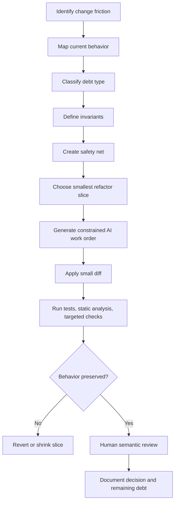
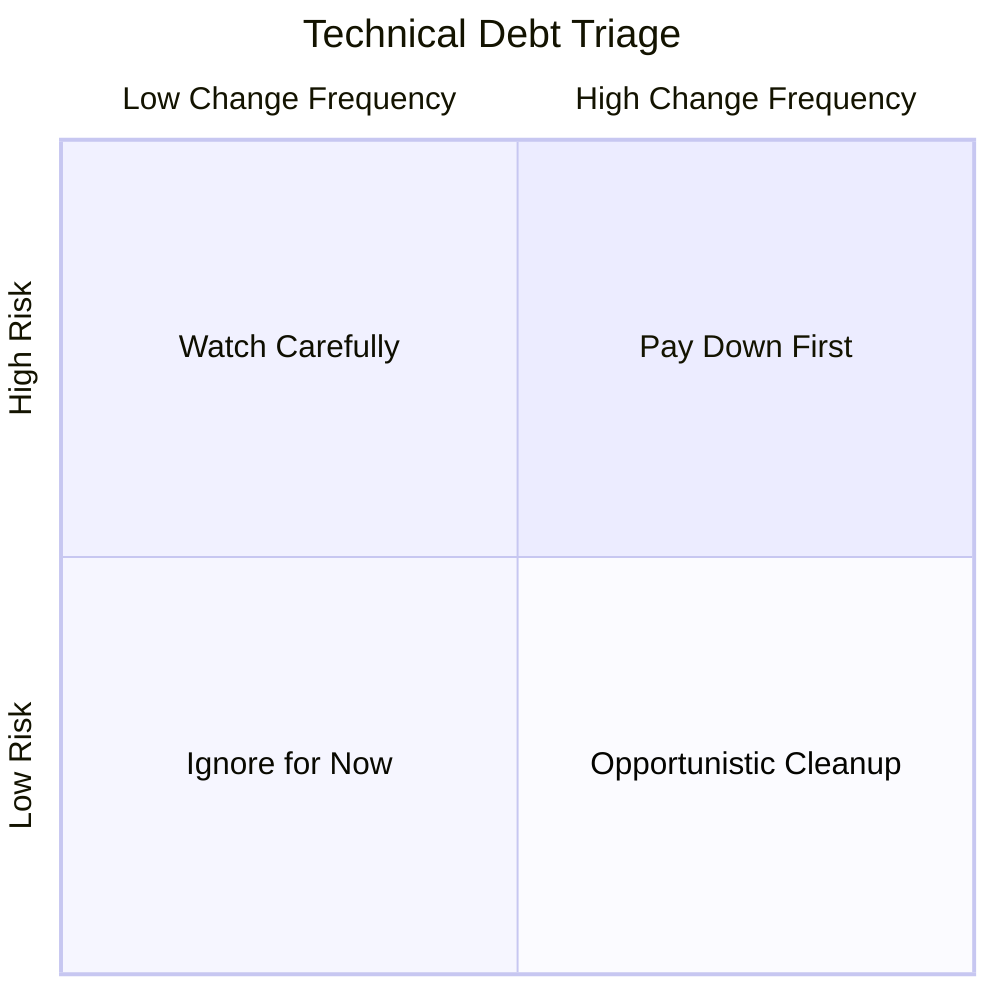

------
title: Learn AI Development Driven Implementation and Usage - Part 015
description: AI for refactoring and technical debt: menggunakan AI untuk memahami, mengiris, mengeksekusi, dan memverifikasi refactoring tanpa mengubah perilaku sistem secara tidak sengaja.
series: learn-ai-development-driven-implementation-usage
seriesTitle: Learn AI Development Driven Implementation and Usage
order: 15
partTitle: AI for Refactoring and Technical Debt
tags:
- ai
- software-engineering
- refactoring
- technical-debt
- legacy-code
- code-quality
- testing
- series
date: 2026-06-30
---

# Part 015 — AI for Refactoring and Technical Debt

Refactoring dengan AI bukan aktivitas “minta AI rapikan kode”. Itu terlalu dangkal dan berbahaya.

Dalam engineering nyata, refactoring adalah perubahan struktur internal yang bertujuan menaikkan kemampuan sistem untuk berubah, sambil menjaga perilaku eksternal tetap sama. Technical debt adalah beban perubahan masa depan yang muncul karena desain, implementasi, test, dokumentasi, proses, atau batas operasional tidak lagi mendukung kebutuhan bisnis dan engineering dengan biaya wajar.

AI mempercepat refactoring, tetapi juga mempercepat kerusakan jika dipakai tanpa guardrail. AI sangat baik untuk membaca kode, menemukan pola, membuat kandidat perubahan, menulis test karakterisasi, dan mengusulkan urutan refactor. Tetapi AI juga mudah membuat abstraksi palsu, menyederhanakan invariant domain, mengubah behavior secara halus, atau menghapus “kode aneh” yang sebenarnya melindungi edge case produksi.

Target part ini: kamu mampu memakai AI sebagai refactoring amplifier, bukan sebagai automated beautifier.

---

## 1. Kaufman Framing: Skill yang Sedang Dipelajari

Dalam kerangka Josh Kaufman, kita tidak belajar “semua refactoring”. Kita mendekomposisi skill menjadi sub-skill kecil yang bisa dilatih cepat.

### 1.1 Target Performance

Setelah menyelesaikan part ini, kamu harus bisa:

1. mengidentifikasi jenis technical debt yang benar-benar menghambat delivery;
2. membedakan refactoring aman, redesign, rewrite, dan behavior change;
3. menggunakan AI untuk membaca kode lama tanpa percaya buta pada ringkasannya;
4. membuat characterization test sebelum perubahan struktural;
5. mengiris refactoring menjadi diff kecil yang bisa direview;
6. menulis prompt refactoring yang memiliki scope, invariant, stop condition, dan verification plan;
7. menilai output AI dengan behavioral evidence, bukan rasa “kode ini lebih bersih”.

### 1.2 Deconstruct the Skill

Skill refactoring dengan AI terdiri dari delapan sub-skill:

| Sub-skill | Fungsi | Failure jika lemah |
|---|---|---|
| Debt recognition | Menemukan beban perubahan yang nyata | Menghabiskan waktu merapikan kode yang tidak penting |
| Behavior mapping | Memahami perilaku existing | Refactor mengubah behavior diam-diam |
| Safety net design | Menentukan test/verification | Perubahan tidak punya bukti aman |
| Slice design | Memecah perubahan | PR terlalu besar dan tidak bisa direview |
| Prompt control | Mengarahkan AI dengan constraint | AI melakukan rewrite liar |
| Diff review | Membaca perubahan semantik | Bug lolos karena diff terlihat rapi |
| Rollout planning | Mengurangi blast radius | Perubahan struktural langsung merusak produksi |
| Debt accounting | Mengukur payoff | Refactor tidak menghasilkan kemampuan delivery lebih baik |

### 1.3 Learn Enough to Self-Correct

Kamu hanya perlu cukup teori untuk menjawab lima pertanyaan ini setiap kali refactoring:

1. **Apa behavior yang wajib tetap sama?**
2. **Apa friction yang ingin dikurangi?**
3. **Apa smallest reversible change?**
4. **Apa evidence bahwa behavior tidak berubah?**
5. **Apa risiko jika refactor ini gagal?**

Jika lima pertanyaan ini tidak bisa dijawab, jangan mulai refactoring dengan AI agent. Mulai dari understanding atau testing dulu.

---

## 2. Refactoring, Redesign, Rewrite, dan Repair

Banyak engineer mencampur empat aktivitas berbeda.

| Aktivitas | Tujuan | Behavior berubah? | Risiko utama | Cocok untuk AI? |
|---|---|---:|---|---|
| Refactoring | Mengubah struktur internal | Tidak | Behavior drift | Sangat cocok jika ada test |
| Repair | Memperbaiki bug | Ya, untuk kasus bug | Fix terlalu lokal | Cocok dengan failing test |
| Redesign | Mengubah struktur konsep/domain | Bisa | Migrasi tidak lengkap | Cocok untuk planning, perlu review manusia kuat |
| Rewrite | Mengganti implementasi besar | Bisa | Loss of implicit behavior | Cocok hanya sebagai eksperimen, bukan default |

Refactoring yang sehat memiliki invariant utama:

```text
External observable behavior remains unchanged, unless the change is explicitly declared as behavior change and verified as such.
```

Dalam sistem bisnis/regulasi, “observable behavior” tidak hanya response API. Ia juga meliputi:

- state transition;
- audit trail;
- event yang dipublish;
- ordering event;
- idempotency behavior;
- permission check;
- error code;
- retry behavior;
- database side effect;
- SLA/latency envelope;
- reporting output;
- compliance evidence.

AI cenderung melihat behavior dari kode yang terlihat. Engineer senior harus melihat behavior dari kontrak sistem.

---

## 3. Technical Debt sebagai Cost of Change

Technical debt bukan sinonim untuk kode jelek. Technical debt adalah kondisi yang membuat perubahan masa depan lebih mahal, lebih lambat, atau lebih berisiko.

### 3.1 Debt Taxonomy

| Debt Type | Gejala | Dampak | AI bisa membantu dengan |
|---|---|---|---|
| Code structure debt | Method panjang, duplikasi, conditional kusut | Sulit dipahami dan diubah | Extract, rename, simplify, split |
| Design debt | Boundary lemah, coupling tinggi | Perubahan kecil menyebar | Dependency map, boundary proposal |
| Domain model debt | Istilah domain tidak konsisten | Bug bisnis dan miskomunikasi | Glossary extraction, invariant mapping |
| Test debt | Coverage rendah, test rapuh | Takut refactor | Characterization test, gap analysis |
| Data debt | Schema ambigu, migration lama | Risiko data corruption | Migration planning, query review |
| Operational debt | Logging buruk, config kacau | Debug lambat | Observability gap map |
| Security debt | Validasi tersebar, secret handling buruk | Vulnerability | Secure review checklist |
| Knowledge debt | Aturan hanya ada di kepala orang | Bus factor tinggi | Documentation reconstruction |
| Process debt | PR besar, CI lambat, release manual | Lead time tinggi | Workflow analysis, automation suggestions |

### 3.2 Debt yang Layak Dibayar

Tidak semua debt harus dibayar sekarang. Debt layak dibayar jika memenuhi satu atau lebih kondisi:

1. sering disentuh oleh perubahan roadmap;
2. menjadi sumber defect berulang;
3. membuat review terlalu lama;
4. membuat onboarding lambat;
5. menghalangi testability;
6. menghalangi observability;
7. menghalangi compliance/auditability;
8. menaikkan risiko security;
9. berada di jalur migrasi penting;
10. membuat rollback sulit.

Debt yang tidak disentuh, tidak menjadi bottleneck, dan tidak memperbesar risiko biasanya bukan prioritas. AI membuat refactoring murah secara lokal, tetapi biaya review dan risiko behavior drift tetap nyata.

---

## 4. AI Refactoring Operating Model

Refactoring dengan AI harus berbentuk pipeline evidence-driven.



Pipeline ini memaksa AI bekerja dalam boundary. AI boleh mempercepat, tetapi tidak boleh menentukan sendiri apa yang aman.

---

## 5. Refactoring Readiness Score

Sebelum meminta AI mengubah kode, nilai readiness.

| Dimension | 0 | 1 | 2 |
|---|---|---|---|
| Behavior understood | Tidak jelas | Sebagian jelas | Behavior utama dan edge case jelas |
| Test safety | Tidak ada test | Ada test parsial | Ada targeted safety net |
| Scope boundary | Tidak jelas | Ada file/module target | Scope kecil dan eksplisit |
| Contract risk | Tidak diketahui | Ada dugaan risiko | API/event/db contract diketahui |
| Rollback | Sulit | Bisa revert PR | Bisa revert slice kecil |
| Domain invariant | Tidak terdokumentasi | Diketahui informal | Ditulis dalam task contract |
| Reviewability | Diff besar | Diff sedang | Diff kecil, mechanical, jelas |
| Observability | Tidak ada sinyal | Ada log/test | Ada evidence pre/post |

Interpretasi:

| Total | Meaning | Action |
|---:|---|---|
| 0–5 | Dangerous | Jangan refactor; lakukan understanding dan test dulu |
| 6–10 | Risky | Refactor hanya slice kecil dengan human review ketat |
| 11–14 | Good | AI-assisted refactor layak dilakukan |
| 15–16 | Excellent | Bisa delegasi lebih banyak ke agent dengan guardrail |

---

## 6. AI-Assisted Debt Discovery

AI bisa membantu menemukan area debt, tetapi jangan minta AI “find all code smells” secara generik. Itu akan menghasilkan daftar kosmetik.

Gunakan pertanyaan berbasis friction.

### 6.1 Prompt: Debt Discovery from Change Pain

```text
You are analyzing this module for change friction, not aesthetics.

Goal:
Identify structural issues that make the following change harder:
<describe upcoming feature/change>

Context:
- Domain: <domain>
- Critical invariants: <invariants>
- Files in scope: <files>
- Tests available: <tests>

Do not propose broad rewrites.
Return:
1. top 5 change-friction points;
2. why each point affects the requested change;
3. concrete evidence from code;
4. smallest safe refactoring slice;
5. required safety test before changing it;
6. risks if your analysis is wrong.
```

### 6.2 Output yang Baik

Output AI yang baik memiliki ciri:

- menunjuk file, method, branch logic, dan dependency konkret;
- menghubungkan debt dengan perubahan yang akan datang;
- membedakan smell kosmetik dan risk-bearing debt;
- memberi urutan kecil;
- menyebut test yang perlu ditambahkan;
- mengakui ketidakpastian.

Output yang buruk biasanya:

- memakai istilah generik seperti “improve readability” tanpa evidence;
- menyarankan pattern tanpa alasan;
- menyarankan rewrite;
- tidak menyebut behavior yang harus tetap sama;
- tidak menyebut test.

---

## 7. Behavior Mapping Before Refactoring

Legacy code sering menyimpan business rule implisit. Sebelum refactor, minta AI membuat behavior map.

### 7.1 Behavior Map Template

```text
Analyze the selected code and produce a behavior map.

Return:
1. public entry points;
2. inputs and validation rules;
3. state transitions;
4. database reads/writes;
5. emitted events/messages;
6. external calls;
7. error paths;
8. authorization assumptions;
9. time/concurrency assumptions;
10. edge cases visible in code;
11. behavior that appears intentional but undocumented;
12. behavior that appears accidental or suspicious.

Do not suggest changes yet.
```

### 7.2 Behavior Map Example

Untuk method `approveCase(caseId, reviewerId)`, behavior map harus menjawab:

| Area | Example |
|---|---|
| Input | `caseId` required, reviewer must exist |
| Permission | reviewer must have `CASE_APPROVER` |
| State | only `PENDING_REVIEW` can become `APPROVED` |
| Side effect | insert audit row, publish `CaseApproved` |
| Error | invalid state returns domain error, not 500 |
| Idempotency | second approval returns current state or error? |
| Ordering | audit before event or event before audit? |
| Transaction | state update and audit in same transaction? |

Tanpa behavior map, AI akan refactor berdasarkan bentuk kode, bukan makna sistem.

---

## 8. Characterization Test: Safety Net untuk Legacy Refactor

Characterization test adalah test yang mengunci perilaku existing sebelum refactor. Ia tidak selalu menyatakan behavior ideal. Ia menyatakan: “inilah behavior saat ini”.

### 8.1 Kapan Dibutuhkan

Gunakan characterization test jika:

- kode legacy tidak punya test cukup;
- behavior tidak terdokumentasi;
- refactor menyentuh branching logic;
- refactor menyentuh persistence/event;
- refactor menyentuh permission;
- refactor menyentuh time, retry, concurrency, atau idempotency.

### 8.2 Prompt: Generate Characterization Tests

```text
Generate characterization tests for the current behavior of this code.

Rules:
- Do not improve behavior.
- Do not assume intended behavior beyond the code.
- Capture existing observable outputs and side effects.
- Include edge cases from conditionals and error paths.
- Prefer small deterministic tests.
- Mark suspicious behavior as "captured current behavior" in test names/comments.

Return:
1. test cases grouped by behavior area;
2. required fixtures/mocks;
3. expected outputs/side effects;
4. test data table;
5. any behavior that cannot be tested without refactoring seams.
```

### 8.3 Golden Rule

Jangan izinkan AI refactor sekaligus menulis ulang test untuk mengikuti implementasi baru. Itu menghapus safety net.

Urutan aman:

```text
capture current behavior -> run tests red/green sanity -> refactor -> rerun same tests -> add new behavior tests separately
```

---

## 9. Refactoring Slice Patterns

AI agent bekerja paling baik pada slice kecil. Berikut taxonomy slice yang relatif aman.

### 9.1 Rename for Domain Clarity

**Goal:** mengganti nama agar sesuai ubiquitous language.

Aman jika:

- rename dilakukan via IDE/refactoring tool;
- public API compatibility diperiksa;
- serialized names tidak berubah tanpa migration;
- DB column/event field tidak berubah kecuali eksplisit.

Prompt:

```text
Rename internal symbols only to align with the domain glossary.
Do not rename public API fields, database columns, serialized JSON properties, event fields, or log fields unless explicitly listed.
Return a diff summary separating internal rename from contract-impacting rename.
```

### 9.2 Extract Function

**Goal:** memberi nama pada sub-behavior dan mengurangi cognitive load.

Aman jika:

- extracted function tidak mengubah order side effect;
- tidak mengubah exception behavior;
- tidak mengubah mutable state aliasing;
- function name menyatakan domain behavior, bukan mekanik generik.

Bad extraction:

```text
processData()
handleStuff()
doValidation()
```

Better extraction:

```text
ensureCaseCanBeEscalated()
calculatePenaltyWindow()
recordApprovalAuditTrail()
```

### 9.3 Extract Class / Service

**Goal:** memisahkan responsibility yang berubah dengan alasan berbeda.

Risiko:

- menciptakan service kecil tanpa boundary nyata;
- memindahkan state tanpa memahami lifecycle;
- membuat dependency injection berlebihan;
- menyembunyikan transaction boundary.

Gunakan hanya jika responsibility benar-benar terpisah.

### 9.4 Replace Conditional with Strategy/Policy

Cocok ketika conditional merepresentasikan policy yang bertambah secara independen.

Tidak cocok jika conditional kecil, stabil, dan lebih mudah dibaca inline.

AI sering terlalu cepat memperkenalkan pattern. Minta justification.

```text
Before proposing Strategy/Policy extraction, prove that the conditional represents independently changing business policies. If not, prefer simpler branch cleanup.
```

### 9.5 Introduce Adapter / Anti-Corruption Layer

Cocok untuk integrasi external atau legacy boundary.

Gunakan ketika:

- external API berubah independen;
- field mapping tersebar;
- domain model tercemar DTO/vendor model;
- test sulit karena dependency external langsung.

### 9.6 Strangler Slice

Cocok untuk migrasi besar tanpa rewrite total.

Prinsip:

- pilih satu route/use case;
- route traffic secara eksplisit;
- pertahankan fallback;
- bandingkan output lama vs baru;
- rollout bertahap.

---

## 10. Diff Taxonomy untuk Review

Saat AI menghasilkan perubahan, klasifikasikan diff.

| Diff Type | Contoh | Review Strategy |
|---|---|---|
| Mechanical | rename, formatting, move file | Verify tool-assisted, scan contract impact |
| Structural | extract method/class, split module | Check behavior order and state sharing |
| Semantic | condition change, error handling | Require targeted tests and domain review |
| Contractual | API/event/db field change | Require compatibility/migration plan |
| Operational | logging/config/retry | Require deployment and observability review |
| Security | auth/validation/secret handling | Require security review |

PR yang mencampur semua jenis diff sulit direview. Instruksikan AI memisahkan mechanical diff dari semantic diff.

```text
Separate this work into two commits:
1. mechanical refactor only, behavior-preserving;
2. semantic change, if any.
Do not mix formatting with logic changes.
```

---

## 11. Technical Debt Triage Matrix

Gunakan matrix berikut untuk memilih debt yang akan dibayar.



Interpretasi:

| Quadrant | Meaning | Action |
|---|---|---|
| High frequency + high risk | Area sering berubah dan mudah rusak | Prioritas refactor |
| High frequency + low risk | Mengganggu produktivitas | Cleanup oportunistik |
| Low frequency + high risk | Jarang disentuh tapi kritis | Dokumentasikan, tambahkan safety net |
| Low frequency + low risk | Tidak penting | Jangan sentuh |

---

## 12. AI Refactoring Work Order

Gunakan work order ketat, bukan prompt bebas.

```text
Task: Perform a behavior-preserving refactor for <module/use case>.

Intent:
Reduce <specific friction> so that <future change> becomes easier.

Scope:
- Allowed files: <list>
- Forbidden files: <list>
- Do not modify public API/event schema/database schema.

Current behavior to preserve:
- <behavior 1>
- <behavior 2>
- <edge case>

Required safety net:
- Run existing tests: <commands>
- Add characterization tests for: <cases>
- Do not update assertions to match new implementation unless behavior change is explicitly approved.

Allowed refactor types:
- extract method
- rename internal variables
- split pure calculation from side effects
- introduce private helper

Forbidden refactor types:
- broad rewrite
- change transaction boundary
- change exception types
- change serialized field names
- change retry/idempotency behavior

Output required:
1. summary of behavior-preserving changes;
2. files changed;
3. tests added/updated;
4. risks remaining;
5. commands run and results;
6. any uncertainty or assumptions.

Stop condition:
Stop and ask for review if you need to change public contract, persistence schema, event schema, or authorization behavior.
```

---

## 13. Common AI Refactoring Failure Modes

### 13.1 Aesthetic Refactor

AI membuat kode terlihat modern tetapi tidak mengurangi cost of change.

Signal:

- banyak rename tanpa domain benefit;
- formatting dominan;
- abstraction bertambah tapi use case tidak lebih jelas;
- tidak ada test baru.

Countermeasure:

```text
Reject changes that do not reduce a named change friction or risk.
```

### 13.2 Abstraction Laundering

AI membungkus logic buruk ke interface/service baru, sehingga terlihat bersih tetapi behavior tetap kusut.

Signal:

- `Manager`, `Handler`, `Processor`, `Helper` bertambah;
- dependency graph makin dalam;
- branch logic hanya pindah tempat;
- test makin sulit.

Countermeasure:

```text
Ask AI to show how the proposed abstraction reduces coupling, isolates volatility, or improves testability. If it cannot prove one, do not introduce it.
```

### 13.3 Behavior Drift

AI mengubah edge case karena dianggap bug.

Contoh:

- mengubah `null` handling;
- mengubah order validation;
- mengubah exception type;
- mengubah rounding;
- mengubah timezone;
- mengubah sorting stability;
- mengubah retry count;
- mengubah default status.

Countermeasure:

```text
Require characterization tests before refactoring conditional-heavy logic.
```

### 13.4 Test Theater

AI menulis test yang hanya memverifikasi implementation detail atau mock interaction yang tidak bermakna.

Countermeasure:

- test observable behavior;
- hindari snapshot besar tanpa semantic assertion;
- gunakan mutation thinking;
- review test seperti production code.

### 13.5 Big-Bang “Clean Architecture” Rewrite

AI mengusulkan struktur layer lengkap untuk masalah kecil.

Countermeasure:

```text
Prefer minimal structural change that enables the next concrete requirement.
```

---

## 14. Refactoring dalam Sistem Enterprise

Refactoring enterprise tidak cukup “unit tests green”. Pertimbangkan boundary berikut.

### 14.1 API Boundary

Periksa:

- URL/path;
- method;
- request/response field;
- status code;
- error body;
- pagination;
- sorting;
- backward compatibility;
- generated client impact.

### 14.2 Event Boundary

Periksa:

- event type;
- schema version;
- field optionality;
- field semantic;
- ordering;
- idempotency key;
- consumer compatibility.

### 14.3 Persistence Boundary

Periksa:

- schema change;
- index usage;
- transaction boundary;
- lazy/eager loading;
- query cardinality;
- locking;
- migration/backfill;
- rollback.

### 14.4 Operational Boundary

Periksa:

- logging field;
- metric name;
- dashboard query;
- alert rule;
- tracing span;
- runbook;
- feature flag;
- rollout plan.

AI tidak selalu tahu bahwa log field adalah contract bagi dashboard atau SIEM. Masukkan ini ke prompt.

---

## 15. Refactoring State Machine Code

Untuk sistem enforcement, case management, workflow, atau approval, refactor state machine dengan hati-hati.

### 15.1 Risiko

- transition guard berubah;
- invalid transition menjadi allowed;
- audit trail hilang;
- event tidak publish;
- actor permission berubah;
- concurrent transition race;
- terminal state bisa keluar lagi;
- idempotency berubah.

### 15.2 Safe State Machine Refactor Prompt

```text
Refactor this state transition code without changing behavior.

Preserve:
- all allowed transitions;
- all rejected transitions and error types;
- guard evaluation order;
- actor permission checks;
- audit record creation;
- emitted event type and payload;
- idempotency behavior;
- transaction boundary.

Before changing code:
1. produce a transition table from current code;
2. identify terminal states;
3. identify invalid transitions;
4. propose characterization tests for each transition class.

Only after the table is reviewed, propose a small refactor.
```

### 15.3 Transition Table Format

| From | Event/Command | Guard | To | Side Effect | Error if Invalid |
|---|---|---|---|---|---|
| Draft | Submit | complete form | Submitted | audit + event | ValidationError |
| Submitted | Approve | approver role | Approved | audit + event | PermissionError |
| Approved | Reopen | admin role | Reopened | audit + event | InvalidTransition |

AI harus menghasilkan table dulu. Jangan langsung minta kode.

---

## 16. Dependency Breaking with AI

Legacy code sering sulit dites karena dependency keras.

### 16.1 Seams

Seam adalah titik tempat behavior bisa diubah/test tanpa mengubah banyak kode.

Jenis seam:

| Seam | Example | Use |
|---|---|---|
| Interface seam | Extract interface for gateway | Mock external dependency |
| Constructor seam | Inject dependency | Remove global singleton |
| Parameter seam | Pass clock/user/context | Test time/user behavior |
| Adapter seam | Wrap external API | Isolate vendor model |
| Transaction seam | Separate pure calc from write | Test calculation without DB |

### 16.2 Prompt: Find Minimal Test Seam

```text
This code is hard to test. Find the smallest seam that allows characterization testing.

Constraints:
- Do not redesign the module.
- Do not introduce framework-wide changes.
- Preserve public API.
- Prefer injecting Clock, Gateway, Repository, or Policy only if directly needed.

Return:
1. why the code is hard to test;
2. smallest seam candidate;
3. files affected;
4. risk of introducing the seam;
5. characterization tests enabled by the seam.
```

---

## 17. Measuring Refactoring Payoff

Refactoring harus punya payoff. Ukur sebelum dan sesudah.

| Metric | Before | After | Meaning |
|---|---:|---:|---|
| Time to locate change point | 45 min | 10 min | Better navigability |
| Files touched per feature | 12 | 5 | Lower coupling |
| Test runtime for target area | 20 min | 4 min | Faster feedback |
| Review comments per PR | 35 | 12 | Lower confusion |
| Bug recurrence | 4/month | 1/month | Better correctness |
| Onboarding explanation time | 2 hours | 30 min | Lower knowledge debt |
| Cyclomatic/cognitive complexity | High | Lower | Easier reasoning |
| Rollback complexity | manual | revert PR | Safer delivery |

Jangan hanya memakai “lines of code reduced”. LOC bisa turun tetapi coupling naik.

---

## 18. AI Review Checklist for Refactoring PR

Gunakan checklist ini sebelum merge:

### 18.1 Behavior Preservation

- [ ] Apakah public behavior tetap sama?
- [ ] Apakah error type/status tetap sama?
- [ ] Apakah ordering side effect tetap sama?
- [ ] Apakah transaction boundary tetap sama?
- [ ] Apakah idempotency tetap sama?
- [ ] Apakah authorization check tetap sama?
- [ ] Apakah time/rounding/sorting behavior tetap sama?

### 18.2 Contract Safety

- [ ] Tidak ada API schema berubah tanpa migration.
- [ ] Tidak ada event schema berubah tanpa compatibility check.
- [ ] Tidak ada DB schema berubah tanpa migration plan.
- [ ] Tidak ada log/metric field penting berubah tanpa observability update.

### 18.3 Reviewability

- [ ] Mechanical changes dipisah dari semantic changes.
- [ ] Diff cukup kecil.
- [ ] Commit message menjelaskan intent.
- [ ] PR summary menyebut tests run.
- [ ] AI-generated assumptions terlihat.

### 18.4 Test Quality

- [ ] Ada characterization test untuk behavior risk-bearing.
- [ ] Test tidak hanya mengikuti implementation detail.
- [ ] Test lama tidak dilonggarkan tanpa alasan.
- [ ] Static analysis/security scan tidak memburuk.

---

## 19. Practice Drills: 20 Jam

### Hour 1–2: Debt Recognition

Ambil satu module lama. Minta AI membuat daftar debt berbasis friction untuk satu upcoming change. Review dan buang semua saran kosmetik.

Deliverable:

```text
Top 5 debt items linked to specific future change friction.
```

### Hour 3–4: Behavior Map

Minta AI membuat behavior map untuk satu use case. Verifikasi manual dengan membaca kode.

Deliverable:

```text
Behavior map + uncertainty list.
```

### Hour 5–6: Characterization Tests

Tulis test untuk behavior existing. Jangan refactor dulu.

Deliverable:

```text
Tests that fail if current behavior changes.
```

### Hour 7–9: Small Mechanical Refactor

Lakukan rename/extract method kecil. Pastikan diff mudah direview.

Deliverable:

```text
PR-sized diff with tests green.
```

### Hour 10–12: Dependency Seam

Temukan seam terkecil untuk meningkatkan testability.

Deliverable:

```text
Minimal seam + one new meaningful test.
```

### Hour 13–15: Conditional Refactor

Refactor branching logic menjadi clearer structure tanpa mengubah behavior.

Deliverable:

```text
Transition/decision table + refactored code.
```

### Hour 16–18: Refactoring PR Review

Gunakan AI sebagai reviewer terhadap diff kamu. Tolak komentar kosmetik, ambil komentar risk-bearing.

Deliverable:

```text
Risk-classified review notes.
```

### Hour 19–20: Payoff Retrospective

Ukur apakah refactor mengurangi cost of change.

Deliverable:

```text
Before/after scorecard + remaining debt register.
```

---

## 20. Part Summary

AI sangat berguna untuk refactoring jika diposisikan sebagai accelerator untuk:

- behavior mapping;
- debt discovery berbasis friction;
- characterization test;
- slice proposal;
- mechanical transformation;
- diff review;
- documentation update.

Tetapi AI tidak boleh diberi mandat “bersihkan kode ini” tanpa context. Refactoring aman harus menjaga invariant: behavior eksternal tetap sama, kecuali behavior change dideklarasikan eksplisit dan diverifikasi.

Rule of thumb:

```text
No safety net, no refactor.
No named friction, no debt payoff.
No small slice, no AI delegation.
No human semantic review, no merge.
```

---

## References

- Martin Fowler, *Code Smell* — https://martinfowler.com/bliki/CodeSmell.html
- Martin Fowler, *Technical Debt tag collection* — https://martinfowler.com/tags/technical%20debt.html
- GitHub Docs, *Writing tests with GitHub Copilot* — https://docs.github.com/en/copilot/tutorials/write-tests
- OWASP, *Top 10 for Large Language Model Applications* — https://owasp.org/www-project-top-10-for-large-language-model-applications/
- OpenAI Developers, *Codex AGENTS.md guide* — https://developers.openai.com/codex/guides/agents-md

---

## Next Part

Part 016 akan membahas **AI for Testing Strategy**: bagaimana merancang testing sebagai risk model, bukan sekadar coverage number, dan bagaimana AI membantu menemukan test gap, oracle, scenario matrix, serta verification plan.
