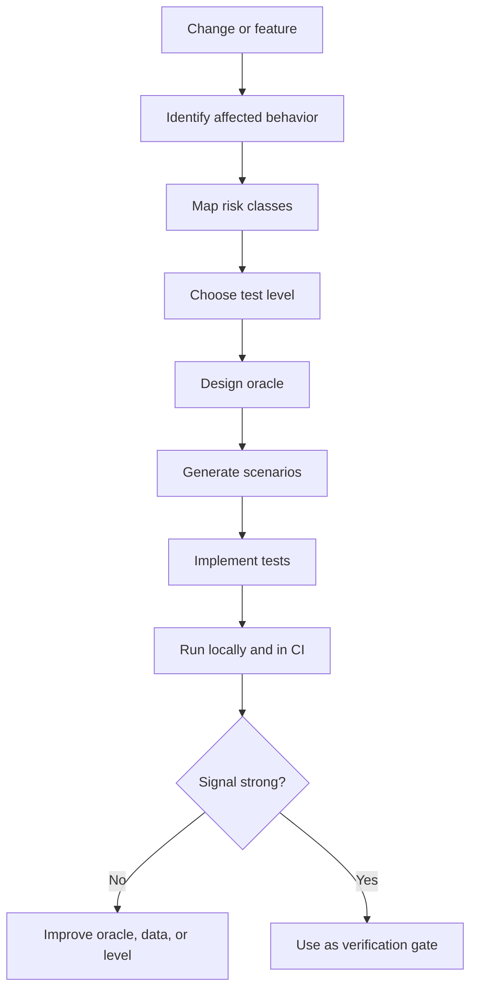
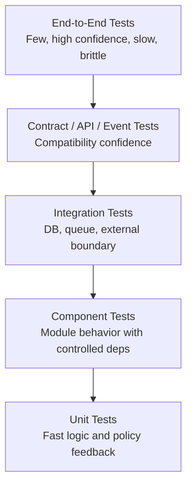
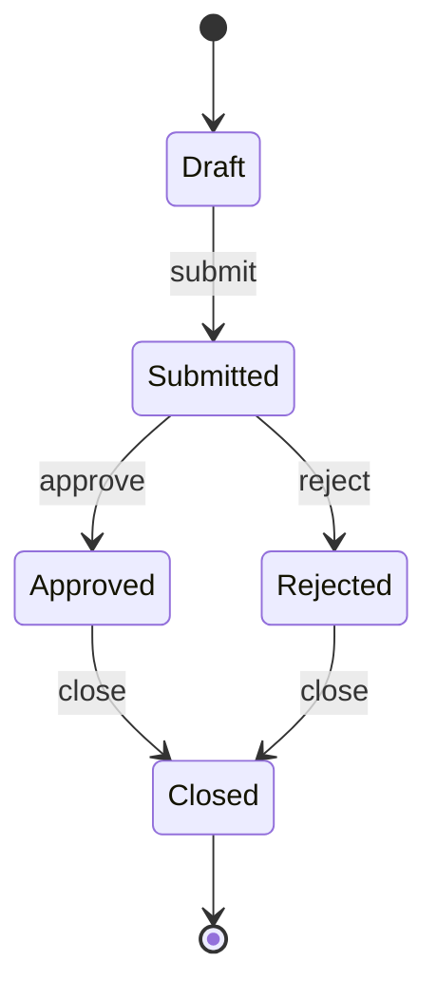
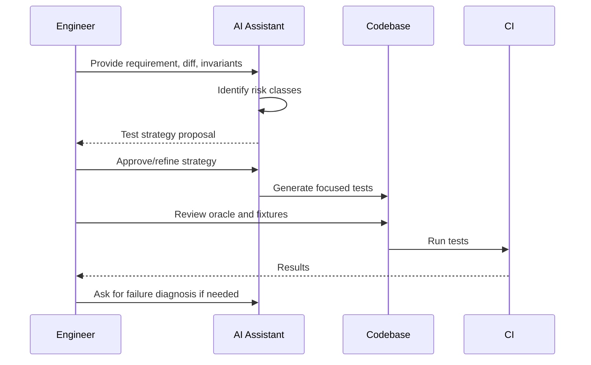

------
title: Learn AI Development Driven Implementation and Usage - Part 016
description: AI for testing strategy: merancang test sebagai risk model, menggunakan AI untuk scenario discovery, oracle design, test gap analysis, dan verification strategy yang efektif.
series: learn-ai-development-driven-implementation-usage
seriesTitle: Learn AI Development Driven Implementation and Usage
order: 16
partTitle: AI for Testing Strategy
tags:
- ai
- software-engineering
- testing
- test-strategy
- quality-engineering
- verification
- ci-cd
- series
date: 2026-06-30
---

# Part 016 — AI for Testing Strategy

Testing strategy bukan target coverage. Testing strategy adalah model risiko.

Coverage menjawab: “baris mana yang pernah dieksekusi test?”

Testing strategy yang baik menjawab:

1. behavior apa yang harus dipercaya;
2. risiko mana yang paling mahal jika lolos;
3. jenis test apa yang paling murah untuk menangkap risiko itu;
4. test mana yang memberi feedback cepat;
5. test mana yang memberi confidence tinggi sebelum release;
6. bagaimana AI membantu menemukan gap tanpa membuat test theater.

AI sangat berguna untuk testing, tetapi juga sering menghasilkan test yang terlihat banyak namun miskin sinyal. Part ini mengajarkan cara memakai AI untuk merancang strategi test yang efektif, bukan sekadar menghasilkan file test.

---

## 1. Kaufman Framing: Skill yang Sedang Dipelajari

Kita tidak belajar semua teknik testing sekaligus. Kita mempelajari sub-skill yang paling mempercepat kemampuan implementasi dengan AI.

### 1.1 Target Performance

Setelah part ini, kamu harus bisa:

1. memetakan risiko perubahan menjadi test strategy;
2. memilih level test yang tepat: unit, component, integration, contract, end-to-end, property-based, golden master, atau manual exploratory;
3. memakai AI untuk menemukan scenario, edge case, invariant, dan oracle;
4. membedakan coverage, confidence, dan correctness;
5. menulis prompt test strategy yang mencegah test kosong;
6. mengevaluasi kualitas test yang dibuat AI;
7. mengintegrasikan test strategy dengan CI, PR review, dan refactoring workflow.

### 1.2 Deconstruct the Skill

| Sub-skill | Fungsi | Failure jika lemah |
|---|---|---|
| Risk mapping | Menghubungkan perubahan dengan risiko | Test banyak tapi tidak menangkap bug penting |
| Test level selection | Memilih unit/integration/contract/e2e | Feedback lambat atau confidence rendah |
| Oracle design | Menentukan expected result | Test hanya mengecek implementation detail |
| Scenario discovery | Menemukan edge case | Bug lolos di boundary condition |
| Test data design | Membuat fixture bermakna | Test brittle dan sulit dibaca |
| Flakiness control | Menjaga determinism | CI tidak dipercaya |
| AI prompt control | Mengarahkan test generation | AI menulis test theater |
| Test review | Menilai nilai test | Test buruk masuk codebase |

### 1.3 Learn Enough to Self-Correct

Gunakan lima pertanyaan ini:

1. **Bug apa yang paling ingin dicegah test ini?**
2. **Apakah test memverifikasi behavior atau implementation detail?**
3. **Apakah failure test mudah didiagnosis?**
4. **Apakah test deterministic?**
5. **Apakah level test ini paling murah untuk confidence yang dibutuhkan?**

Jika test tidak bisa menjawab bug yang dicegah, test itu kemungkinan noise.

---

## 2. Testing sebagai Risk Model

Testing strategy dimulai dari perubahan dan risiko, bukan dari framework.



### 2.1 Risk Classes

| Risk Class | Example | Test Strategy |
|---|---|---|
| Pure logic risk | calculation, eligibility, classification | Unit/property-based tests |
| State transition risk | workflow, approval, lifecycle | Table-driven tests, state machine tests |
| API contract risk | request/response compatibility | Contract tests, schema tests |
| Integration risk | DB, queue, external service | Integration tests with controlled dependency |
| Data migration risk | schema/backfill | Migration tests, shadow read, reconciliation |
| Authorization risk | permission, tenant boundary | Negative tests, access matrix tests |
| Time risk | timezone, expiration, SLA | Clock-injected tests, boundary tests |
| Concurrency risk | race, idempotency, locking | Stress tests, deterministic concurrency tests |
| Operational risk | logging, metrics, alerting | Observability assertions/smoke tests |
| Regression risk | old behavior accidentally changes | Golden master/characterization tests |

---

## 3. Test Pyramid, Test Trophy, dan Realitas Enterprise

Test pyramid memberi heuristik: banyak unit test, lebih sedikit integration test, lebih sedikit end-to-end test. Google pernah menyarankan baseline 70% unit, 20% integration, 10% end-to-end sebagai first guess, bukan hukum universal.



### 3.1 Mengapa Pyramid Sering Rusak

Pyramid rusak ketika:

- business logic hanya bisa dites lewat UI/API;
- domain logic bercampur dengan database/external calls;
- dependency injection buruk;
- test data terlalu mahal dibuat;
- tidak ada contract testing;
- team mengejar coverage, bukan risk confidence;
- AI menulis test level tinggi karena lebih mudah meniru user journey.

### 3.2 Prinsip Pemilihan Level Test

Pilih level test terendah yang masih bisa membuktikan behavior penting.

| Pertanyaan | Jika Ya | Level yang Cenderung Tepat |
|---|---|---|
| Apakah logic pure dan deterministic? | Ya | Unit/property-based |
| Apakah behavior butuh DB transaction? | Ya | Integration/component |
| Apakah risiko ada di schema compatibility? | Ya | Contract/schema |
| Apakah risiko ada di wiring antar service? | Ya | Integration/e2e terbatas |
| Apakah risiko ada di full user journey? | Ya | E2E smoke |
| Apakah behavior existing tidak terdokumentasi? | Ya | Characterization/golden master |

---

## 4. AI Roles dalam Testing Strategy

AI bisa membantu di banyak titik, tetapi peran harus jelas.

| Role | Apa yang AI lakukan | Human harus memvalidasi |
|---|---|---|
| Risk analyst | Mengidentifikasi risk class dari diff/requirement | Apakah risk sesuai domain |
| Scenario generator | Membuat matrix positive/negative/boundary | Apakah scenario relevan dan lengkap |
| Oracle assistant | Mengusulkan expected outcome | Apakah expected benar |
| Test data designer | Membuat fixture minimal | Apakah data merepresentasikan domain |
| Test implementer | Menulis test code | Apakah test meaningful dan deterministic |
| Gap reviewer | Membaca existing tests dan mencari missing risk | Apakah gap bukan noise |
| Flakiness investigator | Menganalisis flaky behavior | Apakah hypothesis didukung evidence |

AI tidak boleh menjadi final authority untuk expected behavior. Expected behavior adalah domain contract.

---

## 5. Test Oracle Design

Test oracle adalah mekanisme yang menentukan apakah output benar.

Tanpa oracle yang kuat, test hanya menjalankan kode.

### 5.1 Oracle Types

| Oracle Type | Example | Strength | Risk |
|---|---|---|---|
| Exact value | `total == 12500` | Sangat jelas | Bisa brittle jika format tidak penting |
| Property | `total >= 0`, order stable | General dan kuat | Perlu invariant benar |
| State transition | `Pending -> Approved` | Cocok workflow | Harus cover invalid transition |
| Side effect | audit row/event emitted | Enterprise-relevant | Butuh fixture/spy yang tepat |
| Contract schema | response matches schema | Compatibility | Tidak membuktikan semantic penuh |
| Snapshot/golden master | output sama seperti baseline | Regression kuat | Bisa mengunci bug lama |
| Metamorphic | perubahan input memberi relasi output | Bagus untuk domain kompleks | Sulit dirancang |
| Differential | compare old vs new implementation | Bagus untuk migration | Old implementation mungkin salah |

### 5.2 Prompt: Oracle Discovery

```text
Given this requirement and code path, propose test oracles.

Do not write tests yet.
Return:
1. observable behaviors that should be verified;
2. strongest oracle for each behavior;
3. weaker but cheaper oracle alternative;
4. data required;
5. risks not covered by each oracle;
6. whether the oracle depends on implementation details.
```

### 5.3 Oracle Smell

Test oracle lemah jika:

- hanya assert “not null”;
- hanya verify method dipanggil tanpa output penting;
- snapshot terlalu besar dan tidak dijelaskan;
- expected value dibuat dari function yang sedang dites;
- test mengikuti mock interaction internal;
- test tetap pass jika bug utama dimasukkan.

---

## 6. Scenario Discovery dengan AI

AI sangat baik untuk membuat scenario matrix jika diberi domain invariant dan risk class.

### 6.1 Scenario Matrix Template

```text
Create a scenario matrix for this behavior.

Behavior:
<describe behavior>

Domain invariants:
<list invariants>

Known states:
<states>

Inputs:
<input fields>

Risk classes to cover:
- positive path
- negative path
- boundary values
- invalid state transitions
- authorization failures
- idempotency
- concurrency/time edge cases
- external dependency failure

Return a table:
Scenario | Given | When | Then | Test level | Oracle | Priority | Notes
```

### 6.2 Example: Case Escalation

| Scenario | Given | When | Then | Test Level | Oracle | Priority |
|---|---|---|---|---|---|---|
| Eligible escalation | Case open, SLA breached | Escalate | Status `Escalated`, audit written, event emitted | Component | State + side effect | High |
| Not breached | Case open, SLA not breached | Escalate | Domain error, no state change | Unit/component | Error + no side effect | High |
| Already closed | Case closed | Escalate | Invalid transition | Unit | State transition oracle | High |
| Unauthorized actor | User lacks permission | Escalate | Permission error, no audit/event | Component | Error + side effect absence | High |
| Duplicate request | Same idempotency key | Escalate twice | Single transition/event | Integration | Idempotency oracle | High |
| External queue down | Event publish fails | Escalate | Transaction behavior as specified | Integration | Transaction oracle | Medium |

AI dapat menghasilkan matrix. Engineer harus memastikan matrix sesuai policy bisnis.

---

## 7. Testing State Machines

State machine harus dites sebagai transition system, bukan hanya method call.

### 7.1 Transition Coverage

Minimal coverage:

1. all valid transitions;
2. invalid transitions from each state;
3. guard failure;
4. permission failure;
5. terminal state behavior;
6. idempotency behavior;
7. side effects per transition;
8. concurrency boundary jika relevan.

### 7.2 Mermaid Model



### 7.3 Prompt: Generate Transition Test Plan

```text
Generate a state machine test plan from this transition table.

Return:
1. valid transition tests;
2. invalid transition tests;
3. guard failure tests;
4. permission tests;
5. side effect assertions;
6. idempotency tests;
7. concurrency tests if needed;
8. suggested level for each test.

Do not generate code until the test plan is reviewed.
```

---

## 8. Property-Based Testing dengan AI

Property-based testing berguna ketika input space besar dan invariant jelas.

### 8.1 Cocok untuk

- calculation;
- parser/serializer;
- normalization;
- sorting;
- allocation;
- validation;
- date/time rules;
- idempotency;
- state transition invariant.

### 8.2 Contoh Properties

| Domain | Property |
|---|---|
| Money allocation | Sum of allocated amounts equals original amount |
| Sorting | Output contains same elements and is ordered |
| Normalization | Applying normalization twice gives same result |
| Authorization | User without permission never reaches protected transition |
| Idempotency | Same command key produces at most one side effect |
| Date range | End date must not precede start date |

### 8.3 Prompt: Property Discovery

```text
Identify property-based tests for this function/module.

Return:
1. candidate invariants;
2. generated input domains;
3. shrinking considerations;
4. invalid input classes;
5. examples of bugs each property would catch;
6. cases where property-based testing is not appropriate.
```

### 8.4 Warning

AI bisa mengusulkan property yang salah karena tidak memahami domain. Property harus divalidasi oleh domain knowledge.

---

## 9. Contract Testing untuk API dan Event

Dalam sistem terdistribusi, banyak bug bukan bug logic internal, tetapi contract mismatch.

### 9.1 API Contract Tests

Verifikasi:

- required/optional field;
- type;
- enum value;
- status code;
- error format;
- backward compatibility;
- pagination/sorting;
- authentication/authorization semantics.

### 9.2 Event Contract Tests

Verifikasi:

- event name/type;
- schema version;
- required field;
- semantic field meaning;
- idempotency/correlation key;
- ordering assumption;
- compatibility dengan consumer lama.

### 9.3 Prompt: Contract Risk from Diff

```text
Review this diff for API/event contract risk.

Return:
1. changed request/response/event fields;
2. required vs optional changes;
3. enum/status/error changes;
4. consumer compatibility risks;
5. contract tests needed;
6. migration/versioning recommendation.
```

---

## 10. Integration Testing Without Pain

Integration test sering lambat dan flaky jika boundary tidak dikontrol.

### 10.1 Good Integration Test

Integration test yang baik:

- menguji boundary nyata yang berisiko;
- deterministic;
- isolated data;
- tidak bergantung pada urutan test;
- tidak bergantung pada waktu real tanpa control;
- menggunakan test container/local dependency bila perlu;
- memiliki failure message jelas;
- tidak menguji semua skenario kecil yang bisa ditangkap unit test.

### 10.2 Boundary yang Layak Integration Test

| Boundary | Why |
|---|---|
| ORM mapping/query | Bug sering terjadi di mapping, lazy loading, transaction |
| Message publish/consume | Serialization, routing, retry, idempotency |
| External service adapter | Request mapping, error handling, timeout |
| Auth middleware | Permission enforcement |
| Migration | Data transformation correctness |
| Cache | Expiration, invalidation, consistency |

### 10.3 Prompt: Integration Test Minimality

```text
Propose the minimal integration tests required for this change.

Do not duplicate unit-testable logic.
Return:
1. integration risks;
2. required real dependencies;
3. dependencies that can be faked;
4. test data setup;
5. cleanup strategy;
6. flakiness risks;
7. why each test cannot be a unit test.
```

---

## 11. Flakiness Control

Flaky test mengurangi trust pada CI. AI-generated tests sering flaky jika tidak diberi constraint.

### 11.1 Flakiness Sources

| Source | Example | Fix |
|---|---|---|
| Time | `now()` langsung | Inject clock |
| Randomness | random data tanpa seed | Fixed seed / explicit data |
| Ordering | assume DB order tanpa sort | Explicit sort |
| Concurrency | sleep-based wait | Deterministic synchronization |
| External dependency | real network call | Stub/test container/contract fake |
| Shared state | global/static mutation | Isolated fixture |
| Async | immediate assert after publish | Await condition with timeout |
| Environment | path/timezone/locale | Pin environment |

### 11.2 Prompt: Flaky Test Review

```text
Review these tests for flakiness risk.

Check for:
- real time usage;
- sleeps;
- random data;
- unordered collections;
- shared mutable state;
- external calls;
- async race;
- environment assumptions.

Return a risk table and deterministic rewrite suggestions.
```

---

## 12. AI Test Generation Workflow

Jangan mulai dari “write unit tests”. Mulai dari strategy.



### 12.1 Step 1 — Ask for Risk Map

```text
Analyze this requirement/diff and produce a testing risk map.
Do not write test code yet.
```

### 12.2 Step 2 — Ask for Test Plan

```text
Convert the risk map into a test plan.
Include test level, oracle, data, priority, and reason.
```

### 12.3 Step 3 — Generate Tests Incrementally

```text
Implement only the high-priority unit/component tests from the approved test plan.
Do not add broad snapshots.
Do not modify production code unless a testability seam is explicitly required.
```

### 12.4 Step 4 — Review Tests

```text
Review these tests for meaningful assertions, determinism, and implementation-detail coupling.
Suggest improvements but do not change code automatically.
```

---

## 13. Test Quality Rubric

Score each generated test from 0–2.

| Dimension | 0 | 1 | 2 |
|---|---|---|---|
| Behavior relevance | Tidak jelas | Terkait sebagian | Langsung cover behavior penting |
| Oracle strength | Weak assert | Medium | Strong semantic oracle |
| Determinism | Flaky risk | Minor risk | Deterministic |
| Diagnosis | Failure membingungkan | Cukup jelas | Failure langsung mengarah ke bug |
| Scope | Terlalu luas | Medium | Minimal dan fokus |
| Independence | Shared state | Sebagian isolated | Fully isolated |
| Maintainability | Sulit dibaca | Cukup | Jelas dan domain-oriented |
| Risk coverage | Tidak cover risk penting | Cover satu risk | Cover risk prioritas tinggi |

Interpretasi:

| Score | Meaning | Action |
|---:|---|---|
| 0–6 | Poor | Rewrite or delete |
| 7–11 | Acceptable with review | Improve oracle/determinism |
| 12–16 | Strong | Keep |

---

## 14. Testing Strategy by Change Type

### 14.1 Pure Function Change

Use:

- unit tests;
- table-driven tests;
- boundary values;
- property-based tests if invariant exists.

Avoid:

- e2e tests for every branch;
- mock-heavy tests.

### 14.2 Workflow/State Change

Use:

- transition table tests;
- invalid transition tests;
- permission matrix tests;
- side effect assertion;
- idempotency test.

### 14.3 API Change

Use:

- contract tests;
- backward compatibility tests;
- error shape tests;
- generated client compatibility if applicable.

### 14.4 Database Migration

Use:

- migration up/down test;
- fixture before/after test;
- reconciliation query;
- performance sample if table large;
- rollback simulation.

### 14.5 Refactoring

Use:

- characterization tests;
- existing regression suite;
- targeted invariants;
- static analysis;
- diff review.

### 14.6 Bug Fix

Use:

- failing regression test first;
- minimal reproduction;
- adjacent scenario tests;
- negative test for false positive.

### 14.7 Security Fix

Use:

- negative tests;
- abuse-case tests;
- permission boundary tests;
- input validation tests;
- security scan/static analysis.

---

## 15. Avoiding AI Test Theater

AI test theater terjadi ketika test terlihat banyak, tetapi tidak menambah confidence.

### 15.1 Smells

- tests assert only non-null;
- tests mirror implementation logic;
- mocks verify every private collaborator call;
- snapshots besar tanpa semantic assertion;
- test names tidak menyebut behavior;
- test data acak tanpa makna;
- generated tests pass even when production logic is obviously broken;
- tests added only to raise coverage.

### 15.2 Counter-Prompt

```text
Evaluate these tests for test theater.
For each test, answer:
1. what bug would this catch?
2. would it fail if the main business rule is broken?
3. does it assert behavior or implementation detail?
4. is the fixture minimal and meaningful?
5. should this test be deleted, rewritten, or kept?
```

---

## 16. Mutation Thinking

Mutation testing tools intentionally change code to see whether tests fail. Even if you do not run a mutation testing tool, think mutationally.

Ask:

- if `>` becomes `>=`, will test fail?
- if permission check is removed, will test fail?
- if event is not emitted, will test fail?
- if wrong state is saved, will test fail?
- if timezone changes, will test fail?
- if duplicate command is processed twice, will test fail?

Prompt:

```text
Perform mutation-thinking review of this test suite.
List plausible code mutations and whether existing tests would catch them.
Prioritize mutations related to business risk, not syntax trivia.
```

---

## 17. Test Data Design

Test data should communicate domain meaning.

### 17.1 Bad Test Data

```text
user1, user2, itemA, itemB, status=1, amount=100
```

### 17.2 Better Test Data

```text
caseOwnerWithoutApprovalRole
seniorReviewerWithEscalationPermission
caseSubmittedBeforeSlaDeadline
caseSubmittedAfterSlaDeadline
penaltyAmountAtUpperBoundary
```

### 17.3 Fixture Principles

- create only what the test needs;
- name data by role in scenario;
- avoid magical defaults;
- centralize builders only when they reduce noise;
- do not hide important field values in builders;
- avoid production-like giant fixture unless doing golden master.

Prompt:

```text
Improve this test data for readability and domain intent.
Do not change tested behavior.
Make fixture names reveal scenario roles and boundary values.
```

---

## 18. CI Strategy

Testing strategy harus terhubung ke feedback loop.

| Stage | Tests | Purpose |
|---|---|---|
| Local pre-commit | fast unit, lint, typecheck | immediate feedback |
| PR fast lane | unit + component + contract | review confidence |
| PR extended | integration + selected e2e | release confidence |
| Nightly | full e2e, mutation subset, performance sample | deeper risk scan |
| Pre-release | migration, smoke, rollback, compatibility | deployment safety |
| Post-release | synthetic checks, canary, observability | production verification |

AI can help generate commands and triage CI failures, but the strategy must be owned by the team.

---

## 19. Testing in Regulated or High-Stakes Workflows

Untuk sistem enforcement, compliance, finance, healthcare, telecom, atau audit-heavy workflow, test harus membuktikan lebih dari “response benar”.

Verifikasi juga:

- decision trace;
- audit event;
- actor identity;
- timestamp source;
- rule version;
- evidence reference;
- reason code;
- notification requirement;
- retention behavior;
- appeal/reopen behavior;
- escalation timer;
- immutable log.

AI prompt harus memasukkan auditability sebagai first-class behavior.

```text
Generate a test strategy for this regulated workflow.
Include audit evidence, reason codes, actor identity, rule version, state transition, and downstream event assertions.
Do not treat HTTP response as the only observable behavior.
```

---

## 20. 20-Hour Practice Plan

### Hour 1–2: Risk Map

Ambil satu feature kecil. Buat risk map dengan AI. Review dan koreksi manual.

Deliverable:

```text
Risk map grouped by logic, state, contract, integration, security, and operational risk.
```

### Hour 3–4: Test Level Selection

Ubah risk map menjadi test plan. Pilih level test termurah untuk tiap risk.

Deliverable:

```text
Test plan with level, oracle, data, priority.
```

### Hour 5–6: Oracle Design

Ambil lima scenario. Minta AI mengusulkan oracle, lalu perkuat assertion.

Deliverable:

```text
Strong oracle table.
```

### Hour 7–9: Unit/Component Tests

Generate dan review test cepat untuk pure/domain logic.

Deliverable:

```text
Focused tests with meaningful names and deterministic data.
```

### Hour 10–12: State/Workflow Tests

Buat transition table dan tests untuk valid/invalid transitions.

Deliverable:

```text
Transition coverage test suite.
```

### Hour 13–14: Contract Tests

Review satu API/event diff. Buat contract tests.

Deliverable:

```text
Schema/compatibility tests.
```

### Hour 15–16: Flakiness Review

Minta AI review flaky risks di test suite.

Deliverable:

```text
Flakiness risk table + fixes.
```

### Hour 17–18: Mutation Thinking

Minta AI membuat mutation-thinking review.

Deliverable:

```text
List of plausible mutations and tests that catch them.
```

### Hour 19–20: CI Gate Design

Susun test stage untuk local, PR, nightly, pre-release, post-release.

Deliverable:

```text
CI test gate proposal.
```

---

## 21. Part Summary

Testing dengan AI harus dimulai dari strategy, bukan generation.

Core principles:

```text
Risk first.
Oracle before code.
Smallest useful test level.
Deterministic by design.
Behavior over implementation detail.
Confidence over coverage.
Human owns expected behavior.
```

AI membantu memperluas scenario awareness, menemukan edge case, mempercepat test code, dan meninjau test quality. Tetapi AI juga bisa menghasilkan test theater yang menaikkan coverage tanpa menaikkan confidence.

Testing strategy yang kuat membuat Part 017 lebih efektif, karena test generation dan repair hanya aman jika strategi, oracle, dan risk model sudah benar.

---

## References

- Google Testing Blog, *Just Say No to More End-to-End Tests* — https://testing.googleblog.com/2015/04/just-say-no-to-more-end-to-end-tests.html
- GitHub Docs, *Writing tests with GitHub Copilot* — https://docs.github.com/en/copilot/tutorials/write-tests
- Martin Fowler, *Test Pyramid* — https://martinfowler.com/bliki/TestPyramid.html
- OpenTelemetry, *Observability concepts* — https://opentelemetry.io/docs/concepts/observability-primer/
- OWASP, *Top 10 for Large Language Model Applications* — https://owasp.org/www-project-top-10-for-large-language-model-applications/

---

## Next Part

Part 017 akan membahas **AI for Test Generation and Repair**: bagaimana mengubah test strategy menjadi test code, memperbaiki flaky/failing tests, mengevaluasi assertion quality, dan menghindari generated-test debt.
