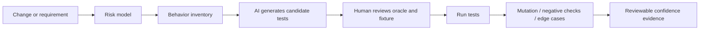
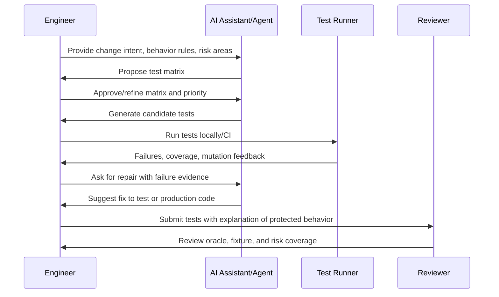
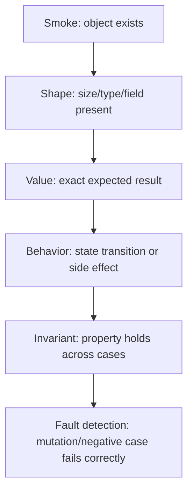
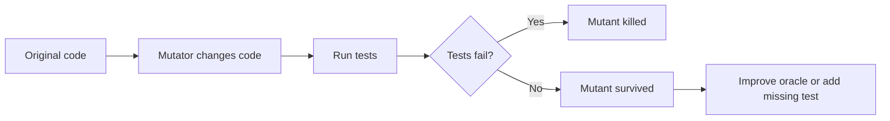
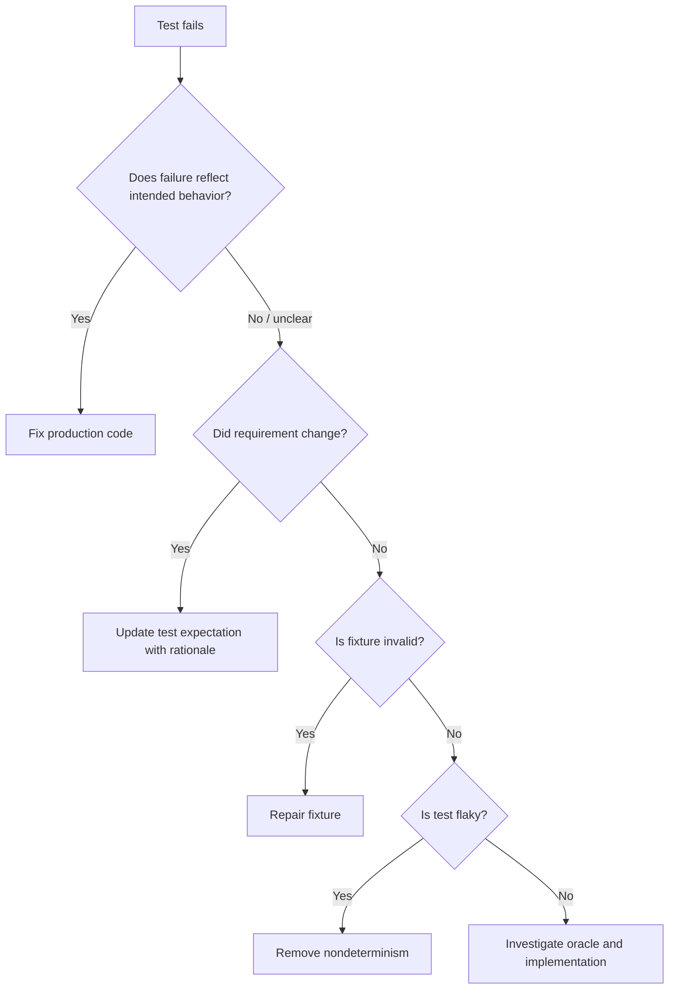

------
title: Learn AI Development Driven Implementation and Usage - Part 017
description: AI-assisted test generation and repair as a disciplined engineering workflow, covering oracle design, gap discovery, mutation feedback, flaky test repair, and reviewable test evidence.
series: learn-ai-development-driven-implementation-usage
seriesTitle: Learn AI Development Driven Implementation and Usage
order: 17
partTitle: AI for Test Generation and Repair
tags:
- ai
- software-engineering
- testing
- test-generation
- test-repair
- quality-engineering
- java
- series
date: 2026-06-30
---

# AI for Test Generation and Repair

AI test generation is useful only when it increases confidence in behavior that matters.

The weak version of this skill is asking an AI tool to “write tests” and accepting the result because coverage increased.
The strong version is using AI to expose missing behavior, sharpen test oracles, generate risk-targeted cases, repair broken tests without hiding defects, and produce evidence that a reviewer can trust.

This part builds on Part 016. Testing strategy decides **what risk deserves evidence**. Test generation and repair decide **how to produce that evidence efficiently**.

The mental model is simple:

> AI can generate many candidate tests, but only an engineer can decide whether those tests prove the right behavior.

---

## 1. Kaufman Framing: What Are We Actually Learning?

Josh Kaufman’s framework is not “consume more tutorials.” It is skill acquisition through deconstruction, fast feedback, barrier removal, and focused practice.

For AI-assisted test generation, the target skill is:

> Given a change, use AI to generate, improve, repair, and review tests that increase confidence in the intended behavior without creating false confidence, brittle fixtures, or test theater.

### 1.1 Sub-skills

Break the skill into these sub-skills:

| Sub-skill | What you must become good at | Common failure |
|---|---|---|
| Behavior extraction | Identify what behavior needs protection | Testing implementation detail |
| Oracle design | Decide what result proves correctness | Weak assertions like `notNull` |
| Test gap discovery | Find important missing cases | Adding redundant happy-path tests |
| Candidate generation | Ask AI for useful tests | Asking vague “write unit tests” prompts |
| Fixture design | Create readable, stable setup | Overmocking or giant fixtures |
| Assertion hardening | Make failures meaningful | Assertion only proves code executed |
| Test repair | Fix broken tests safely | Updating tests to match a bug |
| Flake diagnosis | Separate nondeterminism from defect | Retrying everything blindly |
| Mutation feedback | Check whether tests detect faults | Treating line coverage as confidence |
| Review discipline | Evaluate AI-generated tests before merge | Trusting green CI too early |

### 1.2 The performance standard

You are competent when you can look at an AI-generated test and answer:

1. What behavior does this test protect?
2. What defect would this test catch?
3. What defect would it fail to catch?
4. Is the assertion an oracle or just a sanity check?
5. Is the fixture realistic enough without becoming fragile?
6. Would this test survive refactoring?
7. Could this test pass while the feature is broken?

The last question is the most important one.

---

## 2. Core Mental Model: Generated Test ≠ Verified Evidence

A generated test is a **candidate artifact**, not evidence.



The danger is that AI makes test creation feel cheap. Cheap creation can produce expensive maintenance if the tests are low-signal.

A good AI testing workflow therefore optimizes for:

- high behavioral signal,
- low maintenance cost,
- readable failure messages,
- realistic edge-case coverage,
- minimal coupling to implementation details,
- repeatability in CI,
- reviewable evidence.

---

## 3. Test Generation Taxonomy

Do not ask for “tests” generically. Ask for the specific class of evidence you need.

### 3.1 Example-based tests

These validate concrete scenarios.

Use them when:

- the business rule is scenario-driven,
- inputs and outputs are clear,
- edge cases are known,
- the reviewer needs readable examples.

Example:

```java
@Test
void calculatesPenaltyWhenPaymentIsLateButWithinGracePeriod() {
    var policy = new PenaltyPolicy(Duration.ofDays(3), BigDecimal.valueOf("10.00"));

    var penalty = policy.calculate(
        dueDate("2026-06-01"),
        paidAt("2026-06-03T10:00:00+07:00"),
        Money.idr("500000")
    );

    assertThat(penalty.amount()).isEqualByComparingTo("0.00");
    assertThat(penalty.reason()).isEqualTo(PenaltyReason.WITHIN_GRACE_PERIOD);
}
```

A weak AI-generated version often asserts only that `penalty` is not null. That proves almost nothing.

### 3.2 Edge-case tests

These validate boundary behavior.

Ask AI to identify:

- inclusive vs exclusive boundary,
- empty input,
- single item,
- maximum allowed input,
- nullability boundary,
- time-zone boundary,
- rounding boundary,
- duplicated data,
- out-of-order events,
- stale version,
- concurrent update.

### 3.3 Negative tests

These validate rejection, failure mode, or invalid path.

Examples:

- invalid state transition is rejected,
- unauthorized access fails,
- duplicate request is idempotent,
- malformed payload is rejected,
- forbidden field update is ignored or rejected,
- downstream timeout produces retryable failure.

Negative tests are where AI often underperforms because it tends to produce agreeable happy paths.

### 3.4 Regression tests

These encode a previously observed bug.

A good regression test includes:

- bug trigger,
- minimal reproduction,
- expected correct behavior,
- comment with bug context,
- no dependency on the previous broken implementation.

```java
@Test
void doesNotReopenClosedCaseWhenDuplicateEventArrivesAfterClosure() {
    var caseFile = closedCase("CASE-123");
    var duplicateOpenEvent = event("CASE_OPENED", "evt-001");

    var result = handler.handle(caseFile, duplicateOpenEvent);

    assertThat(result.state()).isEqualTo(CaseState.CLOSED);
    assertThat(result.auditTrail())
        .extracting(AuditEntry::reason)
        .contains("Ignored duplicate event after terminal state");
}
```

### 3.5 Characterization tests

These capture existing behavior before refactoring.

Use them when:

- legacy code is poorly understood,
- refactoring must preserve behavior,
- documentation is missing,
- production behavior is the source of truth.

A characterization test is not always a statement that current behavior is ideal. It says: “this is what the system currently does; do not accidentally change it.”

### 3.6 Property-based tests

These validate invariants over generated input.

Use them when:

- many inputs should satisfy the same rule,
- examples are insufficient,
- boundary combinations are hard to enumerate,
- the domain has algebraic or state invariants.

Example using jqwik-style property testing:

```java
@Property
void idempotentRequestsProduceSameResult(@ForAll("validRequests") PaymentRequest request) {
    var first = service.process(request);
    var second = service.process(request);

    assertThat(second.transactionId()).isEqualTo(first.transactionId());
    assertThat(second.status()).isEqualTo(first.status());
}
```

AI is useful for proposing properties, but the engineer must validate whether the property is true in the domain.

### 3.7 Contract tests

These validate producer-consumer compatibility.

Use them when:

- multiple services exchange API/event contracts,
- schema evolution is risky,
- backward compatibility matters,
- consumers depend on exact field semantics.

AI can help generate candidate contract scenarios, but schema compatibility must be checked with deterministic tooling.

### 3.8 Golden master tests

These compare current output with approved output.

Use them carefully for:

- complex generated documents,
- serialized payloads,
- reports,
- legacy output where exact behavior matters.

Risk: golden files can normalize bad behavior and create noisy diffs.

---

## 4. The AI Test Generation Workflow

Use this sequence.



The important step is not generation. It is **matrix before code**.

### 4.1 Step 1: Write the behavior inventory

Before asking AI to generate code, list the behaviors.

Example:

```mdx
Feature: Case escalation assignment

Behavior inventory:
1. A case with HIGH severity and no owner is assigned to Tier 2.
2. A case with CRITICAL severity is assigned to Tier 3 regardless of current queue.
3. A closed case is never reassigned.
4. A case already owned by a human is not overwritten unless reassignment is explicit.
5. Duplicate escalation events are idempotent.
6. Assignment emits exactly one audit entry.
7. Assignment fails safely if the target queue is disabled.
```

This gives AI a behavioral target.

### 4.2 Step 2: Ask for a test matrix, not tests

Prompt:

```text
You are helping design tests, not writing code yet.

Context:
- Domain: enforcement case escalation
- Method under test: EscalationAssignmentService.assign(caseFile, escalationEvent)
- Important invariants:
  1. Closed cases are terminal.
  2. Human owner must not be overwritten unless explicit reassignment is true.
  3. Duplicate eventId must be idempotent.

Task:
Create a test matrix with:
- scenario name,
- setup,
- input,
- expected output,
- assertion oracle,
- why the test matters,
- priority P0/P1/P2.

Do not write Java code yet.
```

This prevents the model from jumping into code before understanding risk.

### 4.3 Step 3: Review the test matrix

Review each scenario.

Reject scenarios that are:

- duplicate of another scenario,
- too implementation-specific,
- impossible in the domain,
- missing expected output,
- vague about assertion,
- focused on code coverage rather than risk.

### 4.4 Step 4: Generate tests in small batches

Prompt:

```text
Generate only the P0 tests from the approved matrix.

Constraints:
- Use JUnit 5 and AssertJ.
- Prefer domain builders over mocks.
- Mock only external dependencies.
- Assertions must verify behavior, not just object existence.
- Each test name must describe the business rule.
- Keep one behavior per test.
- Do not modify production code.

Return only the test class.
```

Small batches are easier to review.

### 4.5 Step 5: Run tests and collect evidence

Evidence includes:

- command run,
- pass/fail result,
- failure stack trace,
- failing assertion,
- changed files,
- generated test names,
- remaining test gaps.

AI can help interpret evidence, but it must not invent execution results.

### 4.6 Step 6: Strengthen assertions

Ask:

```text
Review these tests for weak assertions.

Classify each assertion as:
- strong behavioral oracle,
- partial oracle,
- smoke assertion,
- implementation-coupled assertion,
- redundant assertion.

For each weak assertion, propose a stronger assertion and explain what defect it would catch.
```

A strong test fails when the behavior is wrong. A weak test passes as long as code runs.

---

## 5. Oracle Design: The Center of the Skill

The oracle is the part of the test that decides pass/fail.

AI-generated tests often fail here.

### 5.1 Weak oracle examples

| Weak assertion | Why weak | Better assertion |
|---|---|---|
| `assertNotNull(result)` | Only proves object exists | Assert state, fields, side effects, emitted events |
| `assertTrue(result.isSuccess())` | Does not verify actual business outcome | Assert assigned queue, audit entry, idempotency key |
| `verify(repo).save(any())` | Implementation detail | Assert persisted entity values or observable output |
| `assertEquals(1, list.size())` | Size alone is insufficient | Assert exact element identity and semantics |
| Snapshot only | Can approve wrong output | Combine with semantic assertions |

### 5.2 Oracle ladder

Use this ladder to rank assertion strength.



Aim for behavior, invariant, and fault detection.

### 5.3 Ask AI to explain defect detection

A powerful review prompt:

```text
For each generated test, answer:
1. What production defect would this test catch?
2. What defect would still pass?
3. Which assertion is the oracle?
4. Is the oracle tied to business behavior or implementation detail?
5. How would you strengthen it without making the test brittle?
```

If the answer is vague, the test probably has low value.

---

## 6. Test Data and Fixture Design

AI often generates noisy fixtures.

Bad fixture:

```java
var user = new User(null, "John", "Doe", null, true, false, null, List.of(), Map.of());
```

Better fixture:

```java
var owner = userBuilder()
    .active()
    .withRole(Role.CASE_MANAGER)
    .build();
```

### 6.1 Fixture principles

Good fixtures are:

- domain-readable,
- minimal for the behavior,
- explicit about important values,
- defaulted for irrelevant values,
- not dependent on test order,
- not coupled to persistence unless persistence is the behavior.

### 6.2 Builder pattern for tests

```java
final class CaseFileBuilder {
    private CaseState state = CaseState.OPEN;
    private Severity severity = Severity.MEDIUM;
    private User owner;
    private String id = "CASE-001";

    CaseFileBuilder closed() {
        this.state = CaseState.CLOSED;
        return this;
    }

    CaseFileBuilder critical() {
        this.severity = Severity.CRITICAL;
        return this;
    }

    CaseFileBuilder ownedBy(User owner) {
        this.owner = owner;
        return this;
    }

    CaseFile build() {
        return new CaseFile(id, state, severity, owner);
    }
}
```

Ask AI to refactor generated test setup into readable builders after behavior is correct.

### 6.3 Avoid overmocking

Overmocking produces tests that know implementation internals.

Use mocks for:

- external APIs,
- message brokers,
- clocks,
- UUID/randomness,
- payment gateways,
- email/SMS gateways,
- object storage,
- expensive infrastructure.

Avoid mocks for:

- simple domain objects,
- value objects,
- pure functions,
- in-memory policy evaluation,
- collections,
- internal collaborators when integration behavior matters.

---

## 7. AI for Test Gap Discovery

Test gap discovery is often more valuable than direct generation.

Prompt:

```text
Analyze this production change and existing tests.

Task:
Identify missing tests by risk category:
- boundary cases,
- invalid inputs,
- state transitions,
- authorization,
- idempotency,
- concurrency,
- persistence behavior,
- integration failures,
- backward compatibility,
- observability/audit behavior.

For each missing test, include:
- why it matters,
- suggested test level,
- expected oracle,
- priority.

Do not generate code yet.
```

### 7.1 Gap categories

| Category | What to ask AI to inspect |
|---|---|
| Branch gaps | Untested conditional paths |
| Boundary gaps | Off-by-one, empty, maximum, timezone, precision |
| State gaps | Invalid transition, terminal state, retry state |
| Data gaps | null, duplicate, stale, inconsistent, missing foreign key |
| Security gaps | unauthorized, forbidden, privilege escalation |
| Concurrency gaps | race, duplicate request, lost update |
| Integration gaps | timeout, retry, partial failure, schema mismatch |
| Observability gaps | audit entry, metric, event emission |

### 7.2 Coverage is input, not conclusion

Coverage helps find unexecuted code.
It does not prove behavior.

Mutation testing, negative testing, and property testing help reveal whether assertions detect faults.

---

## 8. AI for Mutation Feedback

Mutation testing changes production code in small ways and checks whether tests fail.

If the mutated code survives, the test suite may not detect the defect.



For Java/JVM projects, PIT is a common mutation testing tool. The official PIT site describes it as a mutation testing system for Java and the JVM that integrates with modern test and build tooling.

### 8.1 How to use AI with mutation output

Do not ask AI to “fix mutation score.”

Ask:

```text
This mutation survived:
- Class: EscalationPolicy
- Method: shouldEscalate
- Mutation: changed conditional boundary from >= to >
- Existing tests: [paste relevant tests]

Task:
1. Explain what behavior is insufficiently tested.
2. Propose the minimal additional test that kills this mutant.
3. Identify the assertion oracle.
4. Avoid testing implementation details.
```

### 8.2 Mutation output interpretation

| Mutation result | Meaning | Action |
|---|---|---|
| Killed | Test detected changed behavior | Good signal |
| Survived | Test did not detect changed behavior | Add/strengthen test |
| No coverage | Mutated code was not executed | Add scenario or remove dead code |
| Timed out | Test may be slow or infinite loop | Investigate separately |
| Equivalent mutant | Mutation does not change semantics | Suppress or ignore with rationale |

### 8.3 Do not chase 100% mutation score blindly

Mutation score is useful feedback, not a religion.

High-value mutation work focuses on:

- domain rules,
- money movement,
- authorization,
- state transitions,
- data deletion,
- retry/idempotency,
- compatibility logic,
- security-sensitive paths.

Low-value mutation work includes generated boilerplate, simple DTOs, trivial getters, and framework glue.

---

## 9. AI for Property-Based Test Design

Property-based testing is powerful because it tests classes of behavior.

AI can help propose properties, generators, and shrinking cases. But property quality is a domain decision.

### 9.1 Property prompt

```text
Given this domain rule, propose property-based tests.

Domain:
- A case escalation decision must be deterministic.
- Closed cases are terminal.
- Duplicate events are idempotent.
- Severity ordering is LOW < MEDIUM < HIGH < CRITICAL.

Return:
- property name,
- generated input domain,
- invariant,
- examples that should satisfy it,
- counterexamples that should fail,
- risks of overgeneralizing the property.
```

### 9.2 Good properties

| Property | Example |
|---|---|
| Idempotency | Processing same event twice produces one effect |
| Determinism | Same input produces same output |
| Monotonicity | Higher severity never reduces escalation level |
| Round-trip | serialize/deserialize preserves value |
| Conservation | debit + credit remains balanced |
| Ordering | sorted output respects comparator rules |
| State invariant | terminal state cannot transition to active |

### 9.3 Dangerous properties

A property is dangerous when it sounds plausible but is false.

Example:

> “Increasing severity always increases assigned tier.”

This may be false if closed cases are terminal or if manual owner assignment overrides routing.

AI will often generate elegant but wrong properties. Review them against domain invariants.

---

## 10. AI for Test Repair

Test repair is more dangerous than test generation.

A failing test can mean:

1. production code is broken,
2. test expectation is obsolete,
3. test fixture is unrealistic,
4. test is flaky,
5. environment is broken,
6. the test is coupled to implementation detail,
7. the requirement changed,
8. the AI-generated test was wrong.

Do not automatically update the test to match current output.

### 10.1 Safe test repair decision tree



### 10.2 Repair prompt

```text
A test is failing. Do not assume the test should be changed.

Inputs:
- Test code: ...
- Production code: ...
- Failure output: ...
- Intended behavior: ...

Task:
Classify the failure as one of:
1. production defect,
2. invalid test expectation,
3. invalid fixture,
4. flaky/nondeterministic test,
5. environment issue,
6. ambiguous requirement.

Then propose the safest repair.
Do not change assertions unless you explain why the previous oracle was wrong.
```

### 10.3 Common repair traps

| Trap | Symptom | Better move |
|---|---|---|
| Blessing broken output | AI updates expected value to match actual | Re-check requirement and defect history |
| Removing assertion | Test passes after deleting meaningful check | Strengthen or fix behavior |
| Overbroad matcher | `any()` everywhere | Verify meaningful arguments |
| Sleeping for flake | `Thread.sleep(5000)` | Control clock, await condition, remove race |
| Mocking away failure | External dependency mock hides integration contract | Use contract/integration test where needed |
| Snapshot update | Golden file updated without semantic review | Review diff and add semantic assertions |

### 10.4 Legitimate test repair examples

Legitimate repairs include:

- replacing wall-clock time with injected `Clock`,
- fixing test data that violates new validation,
- updating expected field after approved contract change,
- removing reliance on iteration order when order is not part of contract,
- replacing brittle string comparison with semantic JSON assertion,
- splitting one oversized test into focused tests,
- updating fixture builder defaults after domain model evolution.

---

## 11. AI for Flaky Test Diagnosis

Flaky tests are expensive because they destroy trust in CI.

AI can help classify likely causes from failure history, logs, and code.

### 11.1 Flake taxonomy

| Flake cause | Signal | Fix direction |
|---|---|---|
| Time dependency | Fails around midnight/timezone/DST | Inject clock |
| Randomness | Rare input combinations fail | Seed random or property shrink |
| Async race | Passes locally, fails in CI | Await condition, deterministic synchronization |
| Shared state | Depends on test order | Isolate DB/files/static state |
| External dependency | Network/API instability | Mock or contract boundary |
| Resource contention | Port/file collision | Allocate unique resource |
| Parallel execution | Only fails under parallel tests | Remove shared mutable state |
| Environment drift | Fails in specific CI image | Pin version/config |

### 11.2 Flake prompt

```text
Analyze this flaky test.

Evidence:
- Test code: ...
- Failure logs from 3 runs: ...
- CI environment: ...
- Local behavior: ...

Task:
1. Identify likely flake category.
2. Explain the nondeterministic dependency.
3. Propose a deterministic fix.
4. Avoid sleeps and broad retries unless justified.
5. Suggest a verification command.
```

### 11.3 Retry is a containment strategy, not a fix

Retries can reduce noise temporarily.
They do not remove the cause.

Use retries only with:

- clear issue link,
- owner,
- expiration plan,
- flake classification,
- metric tracking.

---

## 12. AI for Test Maintenance

AI helps maintain tests when code evolves.

Useful tasks:

- update imports after package move,
- migrate JUnit 4 to JUnit 5,
- replace deprecated assertions,
- simplify fixtures,
- remove duplicate tests,
- group tests by behavior,
- rename tests to match domain language,
- extract builders,
- identify tests that no longer map to behavior.

But maintenance must preserve intent.

### 12.1 Test intent comments

For complex tests, add concise intent comments.

```java
@Test
void preservesManualOwnerDuringAutomaticEscalation() {
    // Regression: automatic escalation must not overwrite human ownership.
    var owner = activeCaseManager("u-123");
    var caseFile = openCase().ownedBy(owner).highSeverity().build();

    var result = service.assign(caseFile, automaticEscalation("evt-1"));

    assertThat(result.owner()).isEqualTo(owner);
    assertThat(result.auditTrail())
        .extracting(AuditEntry::type)
        .contains(AuditType.ESCALATION_SKIPPED_OWNER_LOCKED);
}
```

A future AI agent is less likely to “simplify” away the important behavior.

---

## 13. Test Generation for Different Code Shapes

### 13.1 Pure function

Best AI task:

- generate boundary examples,
- generate property tests,
- verify algebraic invariants,
- identify invalid inputs.

Prompt:

```text
Generate tests for this pure function.
Focus on boundaries, invalid input, and invariants.
Do not use mocks.
```

### 13.2 Domain service

Best AI task:

- generate scenario matrix,
- verify state transitions,
- verify domain events/audit records,
- use builders.

### 13.3 Application service

Best AI task:

- mock external dependencies,
- verify orchestration behavior,
- verify transaction boundaries where possible,
- verify error mapping.

### 13.4 Repository/data access

Best AI task:

- use integration test with real database container,
- verify query semantics,
- verify constraints and indexes,
- avoid mocking ORM behavior.

### 13.5 Controller/API layer

Best AI task:

- request/response contract tests,
- validation error tests,
- authorization tests,
- content type and error mapping.

### 13.6 Event handler

Best AI task:

- idempotency,
- duplicate event,
- out-of-order event,
- poison event,
- retry behavior,
- emitted side effects.

---

## 14. Prompt Library

### 14.1 Generate behavior matrix

```text
You are a senior test engineer.

Given this feature/change:
[paste change]

Create a behavior-oriented test matrix.
Columns:
- behavior,
- scenario,
- setup,
- input,
- expected output,
- assertion oracle,
- risk covered,
- test level,
- priority.

Do not write test code yet.
```

### 14.2 Generate tests from approved matrix

```text
Generate tests for the approved P0 scenarios only.

Tech stack:
- Java 21
- JUnit 5
- AssertJ
- Mockito only for external dependencies

Rules:
- One behavior per test.
- Test names must explain business behavior.
- Avoid implementation detail assertions.
- Use builders for domain setup.
- Include strong assertions for output and side effects.
- Do not modify production code.
```

### 14.3 Review generated tests

```text
Review these tests.

For each test, report:
- protected behavior,
- oracle assertion,
- defect it would catch,
- defect it would miss,
- fixture quality,
- brittleness risk,
- duplicate overlap with other tests,
- suggested improvement.
```

### 14.4 Repair failing test

```text
A test failed after a code change.
Do not automatically update expected values.

Classify the failure:
- production bug,
- obsolete expectation,
- bad fixture,
- flaky test,
- environment issue,
- ambiguous requirement.

Then propose the safest repair with reasoning.
```

### 14.5 Mutation feedback

```text
Analyze this survived mutant.

Inputs:
- mutation description,
- affected method,
- existing tests,
- domain rule.

Return:
- missing behavior,
- minimal test to kill mutant,
- assertion oracle,
- risk of overfitting to implementation.
```

---

## 15. Review Checklist for AI-Generated Tests

Before merging generated tests, check:

- Does each test map to a named behavior?
- Is the assertion a real oracle?
- Could the test pass if the feature is broken?
- Is setup minimal and readable?
- Are mocks limited to true external dependencies?
- Are boundary and negative cases included?
- Are test names domain-readable?
- Does the test avoid sleeping, randomness, and order dependency?
- Does the test fail for the right reason?
- Does the PR explain why these tests were added?

### 15.1 Red flags

Reject or revise tests with:

- `assertNotNull` as main assertion,
- no negative cases,
- excessive mocking,
- exact private method behavior,
- broad argument matchers,
- copied production logic in assertions,
- brittle snapshots without semantic checks,
- hidden dependency on current date/time,
- test code more complex than production code,
- vague names like `testProcessSuccess`.

---

## 16. AI Test Generation in CI and Agent Workflows

AI can run as:

- local assistant,
- IDE agent,
- terminal agent,
- cloud coding agent,
- PR test suggestion bot,
- mutation feedback assistant,
- flaky test triage assistant.

### 16.1 Safe agent boundary

For autonomous test generation:

Allow:

- adding test files,
- editing test builders,
- updating test documentation,
- running test commands,
- proposing production fix only with explicit approval.

Restrict:

- deleting tests,
- weakening assertions,
- changing production behavior to satisfy generated tests,
- updating snapshots without review,
- disabling tests,
- adding broad retries,
- modifying CI gates.

### 16.2 Agent work packet

```mdx
## Test Generation Work Packet

Change: [link or summary]
Risk areas:
- authorization
- state transition
- idempotency

Allowed files:
- src/test/**
- test-support/**

Not allowed:
- production code changes
- disabling existing tests
- snapshot updates without explanation

Required output:
- test matrix
- generated tests
- command results
- remaining gaps
- reviewer notes
```

---

## 17. Practical Java Example: From Requirement to Tests

Requirement:

> When a case is escalated automatically, the system must not overwrite an existing human owner unless the escalation event explicitly requests reassignment. Closed cases must never be reassigned. Duplicate events must be idempotent.

### 17.1 Test matrix

| Scenario | Expected behavior | Oracle |
|---|---|---|
| Open unowned high severity case | Assign to Tier 2 | owner queue + audit entry |
| Open manually owned case | Keep owner | owner unchanged + skipped audit |
| Explicit reassignment true | Reassign owner | new owner + reassignment audit |
| Closed case | No reassignment | state/owner unchanged + ignored audit |
| Duplicate event | No duplicate side effect | one assignment + one audit entry |

### 17.2 Generated test skeleton

```java
class EscalationAssignmentServiceTest {

    private final QueueDirectory queueDirectory = new InMemoryQueueDirectory()
        .withEnabledQueue("TIER_2")
        .withEnabledQueue("TIER_3");

    private final EscalationAssignmentService service =
        new EscalationAssignmentService(queueDirectory, Clock.fixed(
            Instant.parse("2026-06-30T01:00:00Z"), ZoneOffset.UTC));

    @Test
    void keepsHumanOwnerWhenAutomaticEscalationDoesNotRequestReassignment() {
        var owner = user("u-123", Role.CASE_MANAGER);
        var caseFile = caseFile()
            .open()
            .highSeverity()
            .ownedBy(owner)
            .build();

        var result = service.assign(caseFile, escalationEvent("evt-1")
            .automatic()
            .withoutExplicitReassignment());

        assertThat(result.owner()).isEqualTo(owner);
        assertThat(result.auditTrail())
            .extracting(AuditEntry::type)
            .containsExactly(AuditType.ESCALATION_SKIPPED_OWNER_LOCKED);
    }

    @Test
    void ignoresEscalationForClosedCase() {
        var owner = user("u-123", Role.CASE_MANAGER);
        var caseFile = caseFile()
            .closed()
            .criticalSeverity()
            .ownedBy(owner)
            .build();

        var result = service.assign(caseFile, escalationEvent("evt-2")
            .automatic()
            .withExplicitReassignment());

        assertThat(result.state()).isEqualTo(CaseState.CLOSED);
        assertThat(result.owner()).isEqualTo(owner);
        assertThat(result.auditTrail())
            .extracting(AuditEntry::type)
            .containsExactly(AuditType.ESCALATION_IGNORED_TERMINAL_STATE);
    }
}
```

### 17.3 Why this is better than naive AI tests

The tests assert:

- state,
- ownership,
- audit behavior,
- explicit business rule,
- terminal state protection.

They do not merely assert that a service returns something.

---

## 18. Common Anti-Patterns

### 18.1 Coverage inflation

AI adds tests that execute code but do not verify behavior.

Fix: require oracle explanation.

### 18.2 Mock mirror

AI mocks every collaborator and verifies the implementation path.

Fix: test domain behavior with real domain objects; mock only external boundaries.

### 18.3 Snapshot dumping

AI snapshots a huge JSON response.

Fix: add semantic assertions and keep snapshot only if exact output is contractually relevant.

### 18.4 Test rewriting to green

AI changes test expectations to match current broken output.

Fix: classify failure before repair.

### 18.5 Property overclaiming

AI invents a property that sounds elegant but is false in the domain.

Fix: validate properties against invariants and counterexamples.

### 18.6 Fixture obscurity

AI creates giant setup blocks.

Fix: use builders and name important values.

---

## 19. 20-Hour Practice Plan

### Hour 1-2: Behavior matrix practice

Take 3 recent PRs. For each, create a test matrix before writing tests.

### Hour 3-5: Oracle strengthening

Review existing tests. Classify assertions as smoke, shape, value, behavior, invariant, or fault detection.

### Hour 6-8: AI-generated example tests

Generate tests for a small domain service. Rewrite weak assertions.

### Hour 9-11: Negative and boundary testing

Ask AI to find missing negative cases. Add the highest-risk ones.

### Hour 12-14: Test repair practice

Take failing tests and classify the failure before fixing anything.

### Hour 15-17: Mutation feedback

Run mutation testing on one critical module. Use AI to interpret survived mutants and add targeted tests.

### Hour 18-19: Flaky test diagnosis

Pick one flaky test or simulate nondeterminism. Remove the root cause.

### Hour 20: Review and scorecard

Create a test evidence summary for one PR:

- risk covered,
- tests added,
- oracles used,
- mutation/gap feedback,
- remaining risk.

---

## 20. Engineering Scorecard

Use this scorecard for AI-generated tests.

| Dimension | 1 - Weak | 3 - Acceptable | 5 - Strong |
|---|---|---|---|
| Behavior mapping | Unknown | Mostly mapped | Every test maps to named behavior |
| Oracle strength | Smoke assertions | Value assertions | Behavioral/invariant/fault-detecting assertions |
| Fixture quality | Noisy/brittle | Readable | Domain-builder based and minimal |
| Negative coverage | Missing | Some invalid cases | High-risk invalid paths covered |
| Boundary coverage | Missing | Basic boundaries | Domain-specific boundaries covered |
| Flake resistance | Time/random/shared state | Mostly stable | Deterministic and isolated |
| Maintenance cost | High | Moderate | Low and intention-revealing |
| Reviewability | Hard to understand | Some explanation | Clear evidence summary |

Target: average 4+ for critical code.

---

## 21. Key Takeaways

AI-assisted test generation is not about producing more tests.
It is about producing better evidence faster.

The workflow is:

1. Identify behavior.
2. Build a test matrix.
3. Generate candidate tests.
4. Review oracle strength.
5. Run and inspect evidence.
6. Use mutation/gap feedback.
7. Repair tests carefully.
8. Submit reviewable confidence evidence.

A top-level engineer uses AI to accelerate testing without delegating judgment.

---

## References

- PIT Mutation Testing official site: mutation testing for Java/JVM and integration with modern build tooling.
- jqwik official documentation: property-based testing for the JVM and JUnit Platform.
- Google Testing Blog, “Just Say No to More End-to-End Tests”: practical framing of test pyramid trade-offs.
- Martin Fowler, “Mocks Aren't Stubs”: distinction between state verification and behavior verification.
- JUnit 5 User Guide: modern Java test engine and extension model.
- AssertJ documentation: fluent assertions for readable Java test oracles.
