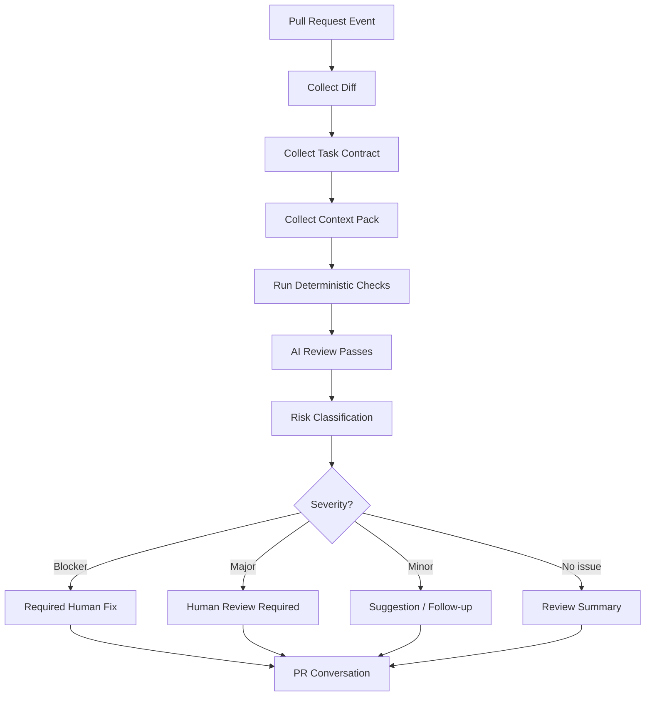
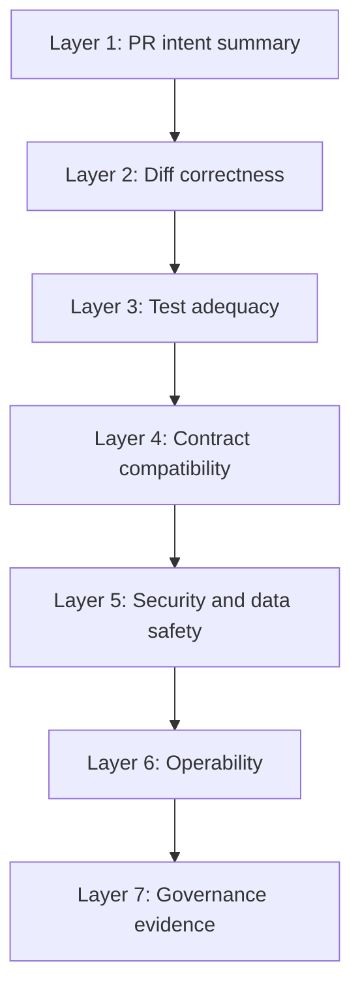
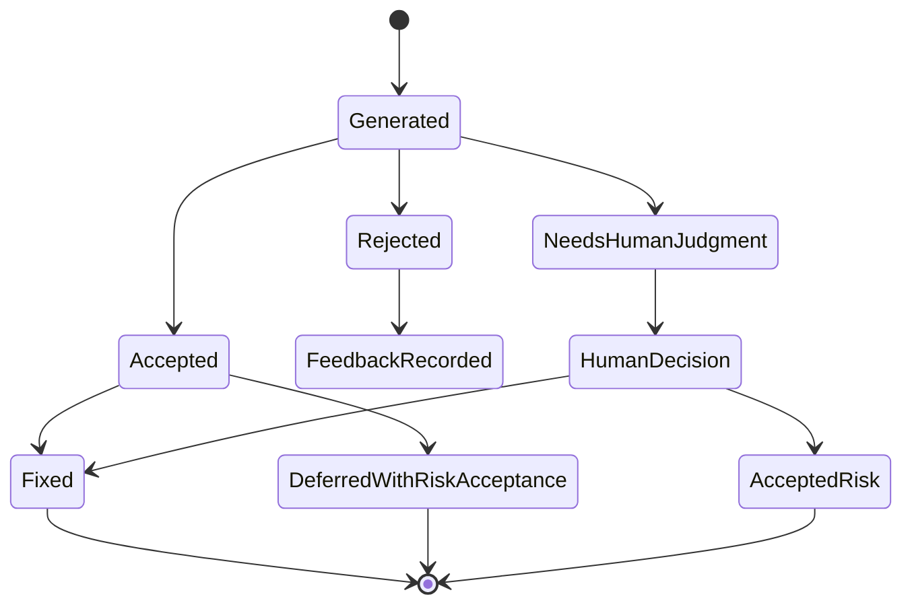

------
title: Learn AI Development Driven Implementation and Usage - Part 018
description: AI code review systems as a risk-classification and evidence-generation layer for pull requests, covering review architecture, context packaging, prompts, gates, limitations, and human escalation.
series: learn-ai-development-driven-implementation-usage
seriesTitle: Learn AI Development Driven Implementation and Usage
order: 18
partTitle: AI Code Review Systems
tags:
- ai
- software-engineering
- code-review
- pull-request
- governance
- quality-engineering
- secure-code-review
- series
date: 2026-06-30
---

# AI Code Review Systems

AI code review is not a replacement for human review.

The useful mental model is:

> AI review is a scalable risk-detection layer that prepares, focuses, and augments human review.

A good AI review system does not merely comment on style. It classifies risk, checks the diff against the task contract, detects missing tests, highlights suspicious behavior changes, and produces evidence for the human reviewer.

This part focuses on building and using AI review systems as part of an engineering delivery workflow.

---

## 1. Kaufman Framing: What Skill Are We Acquiring?

The skill is not “turn on an AI reviewer.”

The skill is:

> Given a pull request, use AI to produce a structured, high-signal review that improves correctness, safety, test quality, maintainability, and operational readiness without creating false confidence or noisy comments.

### 1.1 Sub-skills

| Sub-skill | What it means | Failure mode |
|---|---|---|
| Diff understanding | Understand what changed and why | Reviewing lines without intent |
| Risk classification | Identify what kind of risk the PR introduces | Treating all PRs equally |
| Context packaging | Give AI enough context but not noise | Full repo dump or diff-only blindness |
| Review policy design | Encode what the reviewer should care about | Generic style comments |
| Evidence checking | Verify claims with tests, commands, docs | AI hallucinated “tested” claim |
| Comment quality | Make comments actionable and specific | Vague “consider improving” comments |
| Human escalation | Decide when expert review is required | Merging risky code because AI was quiet |
| Feedback loop | Learn from false positives/negatives | Same noisy review forever |

### 1.2 Performance standard

You are competent when your AI review workflow can answer:

1. What is the PR trying to accomplish?
2. What behavior changed?
3. What risk category does the diff belong to?
4. What tests prove the changed behavior?
5. What important tests are missing?
6. What failure modes are introduced?
7. What requires human expert review?
8. What should block merge vs become follow-up?

---

## 2. Why AI Code Review Needs a System

One-off AI review prompts degrade quickly.

Without a system, AI reviewers tend to:

- nitpick style,
- miss cross-file behavior,
- over-trust green tests,
- suggest unnecessary refactors,
- misunderstand domain constraints,
- hallucinate project conventions,
- produce duplicated comments,
- miss security-sensitive flows,
- fail to distinguish blocker from suggestion.

A system solves this by defining:

- review context,
- review roles,
- risk taxonomy,
- severity rules,
- output format,
- merge gates,
- escalation criteria,
- feedback loop.

---

## 3. Code Review Goals

AI review should serve engineering goals.

### 3.1 Primary goals

| Goal | Question |
|---|---|
| Correctness | Does the code implement the intended behavior? |
| Safety | Could this create data loss, security exposure, or bad state? |
| Test quality | Do tests prove the risky behavior? |
| Maintainability | Is the change understandable and local? |
| Compatibility | Does it break API/event/database contracts? |
| Operability | Can it be deployed, observed, rolled back? |
| Governance | Is the decision/review evidence auditable? |

### 3.2 What AI is good at

AI is useful for:

- summarizing large diffs,
- spotting inconsistent changes,
- comparing diff to requirement,
- identifying missing tests,
- checking naming and convention drift,
- generating review checklists,
- suggesting edge cases,
- detecting suspicious null/error handling,
- explaining unfamiliar code to reviewer,
- preparing focused human review.

### 3.3 What AI is weak at

AI remains weak at:

- deep domain judgment,
- hidden production context,
- organizational risk appetite,
- subtle concurrency bugs,
- security assurance,
- ambiguous product trade-offs,
- knowing whether tests were really run unless logs are provided,
- knowing whether external contracts are correct unless schemas are provided.

Treat AI silence as **absence of detected issue**, not proof of safety.

---

## 4. AI Review Architecture

A robust review system looks like this:



The key insight: AI review should not operate alone. It should sit beside deterministic checks.

Deterministic checks include:

- compiler,
- formatter,
- linter,
- unit tests,
- integration tests,
- contract tests,
- static analysis,
- dependency scan,
- secret scan,
- migration validation,
- policy-as-code.

AI comments should be informed by those outputs, not replace them.

---

## 5. Review Layers

Think of AI review as layered analysis.



### 5.1 Intent summary

Purpose:

- explain what changed,
- identify modules touched,
- identify behavior altered,
- compare diff to issue/task.

Good AI output:

```mdx
This PR changes automatic escalation assignment for case files.
Main behavior change:
- manually owned cases are no longer reassigned by automatic escalation unless explicit reassignment is requested.
Touched areas:
- EscalationAssignmentService
- CaseAssignmentPolicy
- assignment audit event mapping
- unit tests for owner lock behavior
Risk category:
- state transition and ownership preservation
```

Bad AI output:

```mdx
This PR improves the assignment service and adds tests.
```

### 5.2 Diff correctness

Questions:

- Does implementation match the stated requirement?
- Are all branches handled?
- Is the new logic reachable?
- Are existing invariants preserved?
- Is there accidental behavior change?

### 5.3 Test adequacy

Questions:

- Are tests added or updated?
- Do tests cover happy, negative, and boundary paths?
- Are assertions meaningful?
- Are tests too coupled to implementation?
- Does a test fail before the fix?

### 5.4 Contract compatibility

Questions:

- Did API response shape change?
- Did event schema change?
- Did database schema change?
- Is backward compatibility preserved?
- Are consumers affected?

### 5.5 Security and data safety

Questions:

- Are authorization checks preserved?
- Are inputs validated?
- Are secrets/logs handled safely?
- Could data be deleted or exposed incorrectly?
- Does generated code introduce injection risk?

### 5.6 Operability

Questions:

- Are metrics/logs/audit events updated?
- Can failure be diagnosed?
- Is rollback safe?
- Is the migration deployable?
- Are feature flags needed?

### 5.7 Governance evidence

Questions:

- Is the decision documented?
- Are assumptions explicit?
- Are tests and commands listed?
- Are open risks named?
- Is reviewer accountability clear?

---

## 6. Risk Classification Model

Use a simple severity model.

| Severity | Meaning | Merge rule |
|---|---|---|
| P0 Blocker | Likely correctness/security/data loss issue | Must fix before merge |
| P1 Major | Real risk or missing evidence in important path | Human review required; usually fix |
| P2 Minor | Maintainability/readability/test improvement | May fix or track |
| P3 Note | Informational observation | No merge block |

### 6.1 Risk categories

| Category | Examples |
|---|---|
| Behavior mismatch | Code does not match requirement |
| Missing test | Critical path lacks evidence |
| Weak test oracle | Test runs but does not prove behavior |
| State machine risk | Invalid transition or terminal state violation |
| Data safety | destructive update, migration, backfill, constraint risk |
| Security | auth bypass, injection, secret exposure |
| Compatibility | API/event/schema breaking change |
| Concurrency | race, duplicate processing, lost update |
| Observability | no audit/log/metric for critical action |
| Maintainability | unclear abstraction, excessive coupling |

### 6.2 Severity calibration

AI reviewers become noisy when severity is not calibrated.

Example calibration:

| Finding | Severity |
|---|---|
| Missing authorization check on endpoint | P0 |
| Migration drops column without backfill plan | P0 |
| Critical state transition lacks negative test | P1 |
| Public API field renamed without compatibility note | P1 |
| Test name unclear | P2 |
| Could simplify local variable | P3 |

A top-level team teaches the reviewer what counts as severe.

---

## 7. Context Packaging for AI Review

More context is not automatically better.

A strong review context pack contains:

1. PR title and description,
2. linked issue or requirement,
3. diff,
4. changed files with nearby context,
5. relevant tests,
6. architecture/invariant notes,
7. commands run and results,
8. known constraints,
9. review policy,
10. risk labels.

### 7.1 Minimal context pack template

```mdx
## PR Review Context Pack

PR intent:
[summary]

Requirement / issue:
[paste relevant requirement]

Changed files:
- src/main/java/.../EscalationAssignmentService.java
- src/test/java/.../EscalationAssignmentServiceTest.java

Domain invariants:
- Closed cases are terminal.
- Manual owner must not be overwritten unless explicit reassignment is true.
- Duplicate event IDs must be idempotent.

Commands run:
- ./mvnw test -Dtest=EscalationAssignmentServiceTest ✅
- ./mvnw verify ✅

Review focus:
- behavior correctness,
- missing tests,
- idempotency,
- audit trail,
- compatibility.
```

### 7.2 Context anti-patterns

| Anti-pattern | Problem |
|---|---|
| Diff only | AI misses domain invariants and hidden coupling |
| Full repository dump | Attention dilution and noisy review |
| No task contract | AI cannot compare code to intent |
| No test output | AI cannot know what ran |
| No review policy | AI defaults to generic suggestions |
| No severity model | Comments are hard to prioritize |

---

## 8. Review Policy File

For repo-level AI review, create a review policy.

Example: `.ai/review-policy.md`

```mdx
# AI Review Policy

## Review priorities
1. Correctness against task contract.
2. Data safety and security.
3. Test adequacy.
4. Compatibility.
5. Operability.
6. Maintainability.

## Blocker examples
- Missing authorization for protected action.
- Destructive migration without rollback/backfill plan.
- State transition that violates terminal state invariant.
- Public contract breaking change without versioning.
- Test changed to match broken behavior without rationale.

## Comment rules
- Each comment must identify concrete risk.
- Prefer line-specific comments when possible.
- Do not comment on formatting handled by formatter.
- Do not request subjective refactor unless risk is clear.
- Include severity: P0/P1/P2/P3.
- Include suggested verification where relevant.

## Required output
- PR summary.
- Risk classification.
- Findings by severity.
- Missing tests.
- Suggested human reviewers.
```

This makes the AI reviewer behave less like a generic assistant and more like a team reviewer.

---

## 9. Prompt Patterns for AI Code Review

### 9.1 Full PR review prompt

```text
You are reviewing a pull request as a senior software engineer.

Inputs:
- PR intent: ...
- Requirement: ...
- Diff: ...
- Relevant existing code: ...
- Tests changed: ...
- Commands run: ...
- Domain invariants: ...

Review priorities:
1. Correctness against requirement.
2. Data safety and security.
3. Test adequacy.
4. Compatibility.
5. Operability.
6. Maintainability.

Output format:
- Summary
- Risk classification
- Blocking findings P0/P1
- Non-blocking suggestions P2/P3
- Missing tests
- Questions for human reviewer

Rules:
- Do not comment on formatting handled by tooling.
- Do not invent test results.
- If evidence is missing, say what evidence is missing.
- Every finding must cite the relevant file/function and explain impact.
```

### 9.2 Test review prompt

```text
Review only the tests in this PR.

For each test:
- identify protected behavior,
- identify oracle assertion,
- classify oracle strength,
- identify missing negative/boundary cases,
- flag brittle fixtures or overmocking,
- state whether the test would fail before the production change.
```

### 9.3 Security-focused review prompt

```text
Perform a security-focused review of this diff.

Focus on:
- authorization bypass,
- input validation,
- injection risk,
- unsafe deserialization,
- secret handling,
- logging sensitive data,
- dependency risk,
- privilege escalation,
- insecure defaults.

Return only concrete findings.
If security cannot be assessed from the provided context, state what context is missing.
```

### 9.4 Migration review prompt

```text
Review this database migration and related code.

Check:
- backward compatibility,
- deploy order,
- rollback plan,
- data backfill,
- locks and large-table risk,
- default values,
- nullability,
- index creation strategy,
- application code compatibility across versions.

Classify findings as P0/P1/P2/P3.
```

### 9.5 “Quiet reviewer” prompt

Use when noise is a problem.

```text
Only report issues that are likely to affect correctness, safety, security, compatibility, or production operation.
Do not report style, naming, or subjective refactor suggestions unless they create real risk.
Return at most 5 findings.
For each finding, include why it matters and how to verify it.
```

---

## 10. AI Review Output Format

A high-quality AI review is structured.

```mdx
## AI Review Summary

Intent understood:
This PR changes case escalation assignment so automatic escalation no longer overwrites a manual owner unless explicit reassignment is requested.

Risk classification:
P1 - state transition / ownership preservation behavior.

Blocking findings:
None found from provided context.

Major findings:
1. P1 Missing duplicate event test
   File: EscalationAssignmentServiceTest.java
   Impact: idempotency invariant is part of the requirement but not verified.
   Suggested test: process the same escalation event twice and assert one assignment/audit entry.

Minor findings:
1. P2 Test fixture hides owner type
   The builder default creates a system owner, but the test name says human owner.
   Make owner explicit in the test setup.

Missing evidence:
- No integration test confirms audit event persistence.
- No command output provided for full module verification.

Suggested human review focus:
- owner preservation invariant,
- idempotency handling,
- audit side effect.
```

This is reviewable. A vague essay is not.

---

## 11. Human-AI Review Division of Labor

### 11.1 AI reviewer responsibilities

AI should help with:

- summarizing diff,
- identifying missing evidence,
- checking consistency,
- generating edge-case questions,
- validating against explicit invariants,
- comparing tests to behavior,
- preparing focused reviewer notes.

### 11.2 Human reviewer responsibilities

Humans remain accountable for:

- business correctness,
- security acceptance,
- domain trade-offs,
- architecture direction,
- operational risk acceptance,
- merge decision,
- coaching and team standards,
- final accountability.

### 11.3 Escalation rules

Require human expert review when PR touches:

- authentication/authorization,
- payment/money movement,
- personally identifiable information,
- destructive database migration,
- event schema consumed by other services,
- state machine transition,
- concurrency control,
- retry/idempotency behavior,
- production incident fix,
- compliance/audit trail.

---

## 12. AI Review for Different PR Types

### 12.1 Feature PR

Focus:

- requirement match,
- behavior completeness,
- edge cases,
- tests,
- observability.

### 12.2 Bug fix PR

Focus:

- reproduction test,
- root cause alignment,
- regression protection,
- narrow fix,
- no unrelated refactor.

### 12.3 Refactoring PR

Focus:

- behavior preservation,
- characterization tests,
- no contract change,
- diff locality,
- performance risk.

### 12.4 Migration PR

Focus:

- deploy order,
- rollback,
- backfill,
- locks,
- compatibility across app versions.

### 12.5 Dependency upgrade PR

Focus:

- breaking changes,
- transitive dependency risk,
- security notes,
- runtime behavior,
- test coverage.

### 12.6 Generated code PR

Focus:

- generated-code boundary,
- reproducibility,
- source-of-truth schema,
- manual edits to generated files,
- regeneration command.

---

## 13. AI Review + Deterministic Tools

AI should consume tool output.

| Tool output | How AI uses it |
|---|---|
| Compiler failure | Explain likely cause and fix area |
| Unit test failure | Classify production vs test issue |
| Static analysis | Prioritize high-risk warnings |
| Dependency scan | Explain exploitability and upgrade path |
| Contract test result | Identify producer/consumer impact |
| Mutation report | Identify weak tests |
| Coverage report | Find unexecuted risky code |
| Logs/traces | Understand runtime failure |

### 13.1 CI review comment example

```mdx
P1 - Missing verification for failure path

The diff adds retry handling for downstream timeout, but tests only cover success after first attempt.
Given the new retry branch, add a test for exhausted retries that verifies:
- final error classification,
- no duplicate audit event,
- metric increment,
- retry count.

Suggested command:
./mvnw test -Dtest=PaymentRetryServiceTest
```

The comment is actionable because it names risk, expected behavior, and verification.

---

## 14. Building an Internal AI Review Bot

A minimal internal AI review bot has these components:

```mermaid
flowchart LR
    A[PR Webhook] --> B[Diff Collector]
    B --> C[Context Builder]
    C --> D[Policy Loader]
    D --> E[Tool Result Collector]
    E --> F[LLM Review Engine]
    F --> G[Finding Normalizer]
    G --> H[Deduper]
    H --> I[Severity Gate]
    I --> J[PR Comments / Check Run]
    J --> K[Feedback Store]
```



### 14.1 Components

| Component | Responsibility |
|---|---|
| Diff collector | Fetch changed files and hunks |
| Context builder | Add task, invariants, tests, relevant code |
| Policy loader | Load repo/team review rules |
| Tool result collector | Include CI/lint/security/test output |
| LLM review engine | Produce structured findings |
| Finding normalizer | Convert output to machine-readable format |
| Deduper | Merge repeated comments |
| Severity gate | Decide status check result |
| Feedback store | Track accepted/rejected findings |

### 14.2 Finding schema

```json
{
  "severity": "P1",
  "category": "missing-test",
  "file": "src/test/java/.../EscalationAssignmentServiceTest.java",
  "line": 84,
  "title": "Missing duplicate-event idempotency test",
  "impact": "Requirement states duplicate event IDs must be idempotent, but the PR has no regression test for duplicate processing.",
  "suggestion": "Add a test that processes the same event ID twice and asserts one assignment and one audit entry.",
  "verification": "Run ./mvnw test -Dtest=EscalationAssignmentServiceTest"
}
```

Structured findings are easier to dedupe, measure, and route.

---

## 15. Reducing AI Review Noise

Noise kills adoption.

### 15.1 Noise sources

| Noise source | Fix |
|---|---|
| Generic prompt | Use repo policy |
| Too much context | Use targeted context pack |
| No severity model | Force P0/P1/P2/P3 |
| Style comments | Delegate style to formatter/linter |
| Duplicate comments | Deduplicate by file/category/risk |
| Subjective refactor suggestions | Require concrete risk |
| No team feedback loop | Track accepted/rejected findings |

### 15.2 Comment budget

For most PRs, enforce a comment budget:

- max 0-3 comments for low-risk PR,
- max 5 comments for medium-risk PR,
- unlimited only for high-risk/security review.

A quiet high-signal reviewer is better than a verbose reviewer.

---

## 16. Measuring AI Review Quality

Do not measure AI review by number of comments.

Measure:

- accepted finding rate,
- false positive rate,
- false negative incidents,
- review latency,
- rework reduction,
- defect escape rate,
- missing-test detection rate,
- security finding usefulness,
- reviewer satisfaction,
- merge delay caused by noise,
- time saved in PR understanding.

### 16.1 Review finding lifecycle



### 16.2 Feedback labels

Ask reviewers to label AI findings:

- correct blocker,
- correct non-blocker,
- useful but noisy,
- incorrect,
- duplicate,
- style-only,
- missing context,
- hallucinated,
- already covered by tests.

This allows continuous improvement.

---

## 17. Limitations and Current Evidence

AI review is improving, but current evidence supports caution.

Recent benchmark work such as SWE-PRBench has reported that frontier models still detect only a minority of human-flagged pull request issues in evaluated settings. This does not mean AI review is useless. It means AI review should be treated as additional coverage, not authoritative approval.

Security-specific research has also found gaps in AI code review’s ability to detect serious vulnerabilities. Therefore, AI review must not replace secure code review, SAST/DAST, dependency scanning, threat modeling, or expert review for sensitive code.

Practical implication:

> Use AI review to increase the chance of catching issues, not to justify reducing accountability.

---

## 18. AI Review Anti-Patterns

### 18.1 Merge because AI found nothing

AI silence is not approval.

Fix: require human owner and deterministic checks.

### 18.2 AI style police

The reviewer comments on formatting, naming, and subjective preferences.

Fix: put style in formatter/linter; AI focuses on risk.

### 18.3 Diff-only review for domain-heavy change

The AI sees code but not invariants.

Fix: provide task contract and domain invariants.

### 18.4 Full-context dumping

The AI gets too much context and loses signal.

Fix: provide curated context pack.

### 18.5 Auto-applying review suggestions

AI suggestions are applied without understanding.

Fix: require local test run and human review for non-trivial changes.

### 18.6 No feedback loop

The bot repeats bad comments forever.

Fix: collect accepted/rejected finding labels.

### 18.7 Security theater

The AI review says “no security issues found” without threat model or security tooling.

Fix: make security review evidence-based and layered.

---

## 19. Example: Reviewing a Risky PR

PR intent:

> Add automatic reassignment of escalated cases to specialized queues.

Changed files:

- `EscalationAssignmentService.java`
- `CaseAssignmentPolicy.java`
- `CaseAssignmentRepository.java`
- `EscalationAssignmentServiceTest.java`

### 19.1 AI review summary

```mdx
## AI Review Summary

Risk: P1 - state transition and ownership preservation.

The PR adds automatic case reassignment for escalated cases.
The main risk is accidental overwrite of manual ownership and duplicate side effects from repeated escalation events.

Findings:

1. P1 Missing idempotency test
   The requirement mentions duplicate escalation events, but tests do not process the same event ID twice.
   Add a test verifying one assignment and one audit entry.

2. P1 Closed-case invariant not enforced in repository update
   Service checks `caseFile.isClosed()`, but repository update method does not include state predicate.
   Concurrent closure between read and update may still reassign a closed case.
   Consider conditional update: `where id = ? and state != CLOSED` or optimistic locking.

3. P2 Audit assertion too weak
   Test verifies audit entry count but not audit type/reason.
   Strengthen assertion to verify `ESCALATION_SKIPPED_OWNER_LOCKED`.

Human review focus:
- race between read and assignment update,
- terminal state invariant,
- duplicate event idempotency.
```

This review is useful because it finds risk beyond simple line comments.

---

## 20. PR Author Workflow with AI Review

As PR author, use AI before requesting human review.

### 20.1 Author self-review prompt

```text
Act as a strict reviewer before I open this PR.

Inputs:
- requirement,
- diff,
- tests,
- commands run.

Find:
- behavior mismatch,
- missing tests,
- weak assertions,
- compatibility risks,
- migration risks,
- security risks,
- unclear PR description.

Prioritize only P0/P1/P2 issues.
```

### 20.2 Pre-review checklist

Before assigning human reviewers:

- AI summary matches your intent,
- no P0/P1 AI finding is ignored without explanation,
- tests have clear behavior mapping,
- commands were actually run,
- PR description lists risks and evidence,
- generated code was manually reviewed,
- follow-up items are explicit.

---

## 21. Reviewer Workflow with AI

As human reviewer, use AI to accelerate understanding.

### 21.1 Reviewer questions

Ask AI:

- “What behavior changed?”
- “What files deserve most attention?”
- “What tests prove the main behavior?”
- “What edge cases are missing?”
- “What could break in production?”
- “What should I ask the author?”

### 21.2 Do not outsource judgment

Use AI review as preparation.
Then read the critical code yourself.

Especially inspect:

- branch conditions,
- state changes,
- authorization checks,
- persistence updates,
- retries,
- transaction boundaries,
- public contracts,
- test assertions.

---

## 22. Organization-Level Rollout

### 22.1 Start with low-risk assistive mode

Phase 1:

- AI produces PR summaries,
- identifies missing tests,
- no blocking gate.

Phase 2:

- AI posts comments with severity,
- team labels accepted/rejected findings,
- policy tuned.

Phase 3:

- AI can fail check for narrow P0 categories,
- human override required with rationale.

Phase 4:

- AI review integrated with architecture/security/testing evidence,
- metrics used for process improvement.

### 22.2 Do not start with auto-blocking everything

Auto-blocking too early creates distrust.

Start by measuring signal quality.

---

## 23. Governance and Audit

In regulated or high-risk systems, AI review must be auditable.

Record:

- model/tool used,
- timestamp,
- PR/diff version,
- context pack hash if possible,
- findings,
- accepted/rejected labels,
- human override rationale,
- final merge approver,
- test evidence.

Do not record secrets or unnecessary private data in prompts/logs.

### 23.1 Risk acceptance comment

```mdx
AI reviewer flagged missing integration test for audit persistence.
Decision: accepted as follow-up because this PR changes only domain policy and existing integration suite covers audit persistence path.
Follow-up issue: ENG-1234.
Approver: @senior-reviewer.
```

This is much better than silently ignoring the finding.

---

## 24. 20-Hour Practice Plan

### Hour 1-2: Review taxonomy

Take 5 old PRs. Classify each by risk category and severity.

### Hour 3-5: PR summarization

Use AI to summarize PRs. Correct inaccuracies. Learn what context it needs.

### Hour 6-8: Missing test review

Ask AI to find missing tests. Compare with your own review.

### Hour 9-11: Review policy design

Create `.ai/review-policy.md` for one repo.

### Hour 12-14: Structured prompt practice

Run review prompts on real or sample diffs. Tune output format and severity.

### Hour 15-16: Security-focused review

Apply AI review to auth/input/data-handling diffs. Compare with security checklist.

### Hour 17-18: Noise reduction

Label AI findings as accepted/rejected/noisy. Adjust policy.

### Hour 19: Human reviewer workflow

Use AI to prepare your review, then manually review critical code.

### Hour 20: Create team playbook

Document:

- when to use AI review,
- severity definitions,
- escalation rules,
- ignored-finding policy,
- measurement plan.

---

## 25. Engineering Scorecard

| Dimension | 1 - Weak | 3 - Acceptable | 5 - Strong |
|---|---|---|---|
| Intent understanding | Generic summary | Mostly correct | Exact behavior and modules identified |
| Risk classification | Missing | Basic severity | Accurate risk taxonomy and escalation |
| Test review | Counts tests | Notes gaps | Evaluates oracle quality and missing cases |
| Context use | Diff-only or dump | Some context | Curated context pack |
| Comment quality | Vague/noisy | Some actionable comments | Specific risk + impact + verification |
| Security posture | Generic security claim | Basic checks | Evidence-based with escalation |
| Human integration | Replaces reviewer | Assists reviewer | Focuses expert attention |
| Feedback loop | None | Manual tuning | Measured accepted/rejected findings |
| Governance | Not recorded | Basic comments | Auditable decisions and overrides |

Target: 4+ before using AI review as a meaningful PR gate.

---

## 26. Key Takeaways

AI code review is valuable when it is systematic.

The strong pattern is:

1. collect task intent,
2. build a curated context pack,
3. run deterministic checks,
4. perform AI review with policy and severity,
5. dedupe and prioritize findings,
6. route critical risks to humans,
7. measure accepted/rejected findings,
8. improve review policy over time.

Do not ask: “Can AI review code?”

Ask:

> Which risks can AI reliably surface, with what context, under what review policy, and with what human escalation?

That is the difference between AI review as novelty and AI review as engineering system.

---

## References

- GitHub Docs, “Using GitHub Copilot code review”: Copilot review usage and PR review workflow.
- GitHub Docs, “About GitHub Copilot code review”: overview of Copilot reviewing pull requests and suggesting fixes.
- OpenAI Developers, “Codex code review for GitHub pull requests”: Codex review setup, automatic reviews, and review customization.
- OpenAI Cookbook, “Build Code Review with the Codex SDK”: structured code review comments with Codex SDK.
- SWE-PRBench, 2026: benchmark on AI code review quality against human pull request feedback.
- OWASP Top 10 for Large Language Model Applications: LLM application risks relevant to AI-assisted development and review.
- NIST AI Risk Management Framework and Generative AI Profile: governance and risk management framing for AI systems.
