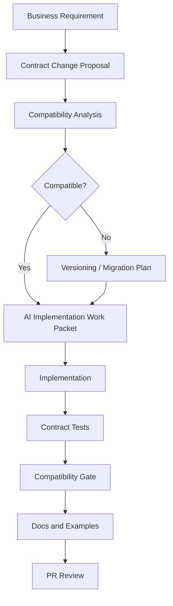
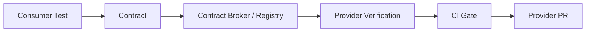
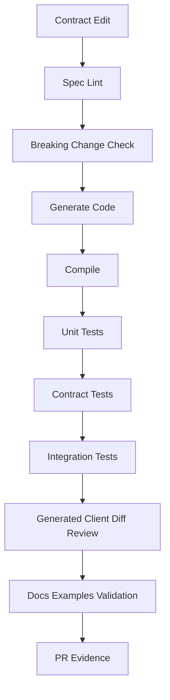

------
title: Learn AI Development Driven Implementation and Usage - Part 022
description: AI-assisted API and contract implementation across REST, gRPC, events, schema compatibility, consumer-driven contracts, idempotency, versioning, verification, and safe evolution.
series: learn-ai-development-driven-implementation-usage
seriesTitle: Learn AI Development Driven Implementation and Usage
order: 22
partTitle: AI-Assisted API and Contract Implementation
tags:
- ai
- software-engineering
- api
- contracts
- openapi
- asyncapi
- grpc
- protobuf
- contract-testing
- schema-governance
- series
date: 2026-06-30
---

# AI-Assisted API and Contract Implementation

AI can implement APIs quickly.

That is useful.

It is also dangerous.

API changes are not isolated code edits. They are promises to consumers. A small generated DTO change can break a mobile app, partner integration, downstream service, batch job, reporting pipeline, or regulatory workflow.

The central rule of this part is:

> AI should implement APIs from explicit contracts, not infer contracts from vague prose or nearby code.

This part does not repeat deep API contract engineering theory. The focus is narrower and more operational:

> How do we use AI to implement, evolve, test, and review API contracts safely?

---

## 1. Kaufman Frame

We deconstruct AI-assisted API implementation into sub-skills:

1. Identify the contract surface.
2. Separate business intent from wire-level compatibility.
3. Express the desired change as a contract diff.
4. Ask AI to implement from the diff, not invent the shape.
5. Verify compatibility with deterministic tools.
6. Generate tests from consumer-visible behavior.
7. Review semantic compatibility, not only syntax.
8. Document migration and rollout behavior.
9. Preserve idempotency, error semantics, and observability.
10. Route high-risk changes to human review.

Target performance:

> Given a requested API change, you can produce a scoped AI work packet that updates the contract, implementation, tests, docs, and compatibility evidence without accidentally breaking consumers.

---

## 2. API Contracts Are Externalized Invariants

A method signature inside a service can be refactored.

An API contract cannot be treated the same way.

Once consumers depend on it, it becomes an externalized invariant.

Examples:

- endpoint path;
- HTTP method;
- request fields;
- response fields;
- status codes;
- error code taxonomy;
- pagination behavior;
- authentication scheme;
- authorization semantics;
- idempotency behavior;
- retry behavior;
- event topic/channel;
- event schema;
- gRPC service and method names;
- protobuf field numbers;
- enum values;
- required vs optional fields;
- ordering guarantees;
- delivery semantics;
- versioning rules.

AI often works by pattern completion. API compatibility requires promise preservation.

Those are different mental models.

---

## 3. Contract Surfaces

### 3.1 HTTP / REST / JSON APIs

Common contract artifacts:

- OpenAPI spec;
- JSON Schema;
- example requests/responses;
- generated server stubs;
- generated clients;
- API docs;
- contract tests;
- gateway config;
- error model documentation.

AI risks:

- invents endpoint names;
- changes status codes;
- makes optional fields required;
- changes nullability;
- changes enum spelling;
- returns implementation exception messages;
- ignores pagination/sorting/filtering invariants;
- omits authz checks;
- creates inconsistent error bodies.

### 3.2 gRPC / Protobuf APIs

Common contract artifacts:

- `.proto` files;
- generated server/client code;
- Buf lint/breaking checks;
- service compatibility rules;
- protobuf field reservation rules;
- generated documentation.

AI risks:

- reuses field numbers incorrectly;
- renames fields without compatibility thinking;
- deletes fields instead of deprecating/reserving;
- changes enum numeric values;
- changes package/service names;
- ignores unknown-field compatibility;
- changes streaming semantics.

### 3.3 Event-driven APIs

Common contract artifacts:

- AsyncAPI spec;
- event schema registry;
- topic/channel naming rules;
- event envelope standard;
- event versioning policy;
- producer contract tests;
- consumer compatibility tests;
- sample events;
- replay/backfill documentation.

AI risks:

- changes event name or topic;
- changes event meaning while preserving schema shape;
- adds fields with misleading defaults;
- removes fields used by consumers;
- changes ordering or deduplication assumptions;
- ignores idempotency and replay behavior;
- treats commands and events as interchangeable.

### 3.4 GraphQL APIs

Common contract artifacts:

- schema definition language;
- resolver contracts;
- deprecation metadata;
- persisted queries;
- client fragments;
- schema registry;
- federation/subgraph contracts.

AI risks:

- removes fields still used by clients;
- changes resolver performance characteristics;
- introduces N+1 problems;
- changes nullability;
- changes authorization semantics;
- adds fields without ownership or cost controls.

---

## 4. Contract-First AI Workflow

The safe workflow is contract-first, not code-first.



The agent should not begin with controller/service code.

It should begin with:

- current contract;
- desired contract diff;
- compatibility constraints;
- implementation scope;
- test obligations;
- non-goals.

---

## 5. API Change Taxonomy

Classify changes before implementation.

### 5.1 Usually backward-compatible changes

Often compatible if implemented carefully:

- add optional response field;
- add optional request field with default behavior;
- add new endpoint;
- add new enum value if consumers tolerate unknown values;
- add new event type;
- add new protobuf field with new field number;
- add GraphQL field;
- add response metadata;
- add new error code only when clients handle unknown codes.

But "usually" is not "always".

Adding an enum value can break consumers that use exhaustive switches.

Adding a response field can break strict JSON decoders.

Adding an optional request field can be incompatible if validation treats unknown fields differently across clients.

### 5.2 Usually breaking changes

Usually breaking:

- remove endpoint;
- rename endpoint;
- change HTTP method;
- remove request or response field;
- make optional field required;
- change field type;
- change nullability;
- change status code semantics;
- change error body shape;
- remove enum value;
- change enum value meaning;
- reuse protobuf field number;
- delete protobuf field without reserving;
- change event topic/name;
- change event meaning;
- change pagination contract;
- change auth/authz requirements;
- change idempotency behavior.

### 5.3 Semantically breaking changes

The hardest category is semantic breakage.

The contract file may look compatible, but behavior changes.

Examples:

- endpoint still returns `200`, but now filters out cases in `ESCALATED` state;
- field still exists, but its timezone interpretation changes;
- error code still exists, but retryability changes;
- event schema is unchanged, but event is emitted before transaction commit instead of after;
- pagination token format changes and invalidates active clients;
- idempotency key window changes from 24 hours to 15 minutes;
- status transition endpoint now silently ignores invalid transitions instead of rejecting them.

AI is especially likely to miss semantic compatibility unless you state it explicitly.

---

## 6. Contract Diff Template

Before asking AI to implement, create a contract diff.

```mdx
## Contract Change Proposal

### API surface

- Type: REST / gRPC / Event / GraphQL
- Contract file: <path>
- Implementation module: <path>
- Consumers: <known consumers>

### Current behavior

<Current API behavior from contract + tests + implementation>

### Desired behavior

<New behavior>

### Contract diff

- Add: <fields/endpoints/methods/events>
- Change: <fields/endpoints/methods/events>
- Deprecate: <fields/endpoints/methods/events>
- Remove: <only if versioned/migrated>

### Compatibility classification

- Backward compatible: yes/no/conditional
- Consumer action required: yes/no
- Migration path: <if needed>

### Non-goals

- <what must not change>

### Verification

- Contract validation command
- Unit tests
- Integration tests
- Consumer/provider contract tests
- Generated client diff
- Manual scenario
```

This becomes the input to the AI agent.

---

## 7. AI Work Packet for API Implementation

Example:

```text
Implement the API change described below.

Contract source of truth:
- openapi/enforcement-case-api.yaml

Implementation scope:
- case-service/src/main/java/com/example/caseapi/**
- case-service/src/test/java/com/example/caseapi/**

Do not modify:
- auth/**
- migrations/**
- billing/**
- .github/workflows/**
- generated clients unless explicitly required by the generator command

Contract diff:
- Add optional response field `escalationReasonCode` to GET /cases/{caseId}
- Field is nullable and absent when no escalation exists
- Do not change existing fields, status codes, or error shape

Compatibility rules:
- Existing clients must continue working
- Do not make any request field required
- Do not change enum values
- Do not change authorization behavior

Implementation rules:
- Map from existing escalation reason source if available
- If source is missing, return null or omit according to existing serialization convention
- Preserve existing behavior for CLOSED and CANCELLED cases

Tests required:
- Existing contract tests must pass
- Add test for escalated case with reason
- Add test for non-escalated case
- Add regression test proving existing response fields are unchanged

Stop and ask before:
- changing OpenAPI path structure
- editing auth
- adding DB migration
- adding dependency
- changing error model
```

This is much safer than:

```text
Add escalation reason to case API.
```

---

## 8. REST Implementation With AI

### 8.1 Controller is not the contract

Many teams let controller annotations become the effective contract.

That is risky with AI because the agent may change annotations to make tests pass.

Prefer this chain:

```text
OpenAPI spec -> generated types / validation -> controller adapter -> service use case -> tests
```

Even when not using generated stubs, keep the spec as the source of truth.

### 8.2 REST checklist

When AI changes a REST API, review:

| Area | Questions |
|---|---|
| Path | Did endpoint path remain stable? |
| Method | Did method semantics remain stable? |
| Request | Did required/optional fields change? |
| Response | Did existing fields/types/nullability change? |
| Status codes | Did success/error status codes change? |
| Error model | Did code/message/details shape change? |
| AuthN/AuthZ | Did access semantics change? |
| Idempotency | Are retries safe? |
| Pagination | Are tokens, ordering, limits stable? |
| Filtering | Are default filters unchanged? |
| Serialization | Are naming/null/unknown-field rules unchanged? |
| Observability | Are logs/metrics/traces updated without leaking sensitive data? |

### 8.3 Error contract

AI often treats errors as local exceptions.

APIs need stable error contracts.

Example error model:

```json
{
  "code": "CASE_NOT_FOUND",
  "message": "Case was not found.",
  "correlationId": "c8b21c2c-3b77-4f89-9a2c-4d9fbbca5f8e",
  "details": []
}
```

Rules:

- `code` is for machines;
- `message` is for humans;
- `correlationId` is for support/debugging;
- `details` must have stable structure;
- do not expose stack traces;
- do not leak internal IDs unless intended;
- do not change retryability silently.

Prompt addition:

```text
Preserve the existing error contract. Do not return raw exception messages. Use existing error codes where applicable. If a new error code is required, stop and propose it before implementing.
```

### 8.4 Idempotency

For mutation endpoints, AI must understand retry behavior.

Example:

```http
POST /cases/{caseId}/escalations
Idempotency-Key: 4b42f5d1-55f0-4f7e-a030-13090d5e879a
```

Questions:

- What happens if the same request is retried?
- What happens if request body differs for the same idempotency key?
- How long is idempotency stored?
- Is response replayed or recomputed?
- Are side effects emitted once?
- Are events deduplicated?

AI-generated implementation must not "just call service.create()" unless idempotency is intentionally not required.

---

## 9. gRPC / Protobuf Implementation With AI

For protobuf, wire compatibility is strict.

### 9.1 Safe field addition

A safe additive change usually looks like:

```proto
message EnforcementCase {
  string case_id = 1;
  CaseStatus status = 2;
  string assignee_id = 3;

  // Optional. Present only when the case has been escalated.
  optional string escalation_reason_code = 4;
}
```

Rules:

- use a new field number;
- do not reuse removed field numbers;
- do not change existing field numbers;
- do not change existing field types casually;
- document semantic meaning;
- consider optional presence semantics;
- update generated code via standard generator.

### 9.2 Deprecating fields

Bad:

```proto
message EnforcementCase {
  string case_id = 1;
  CaseStatus status = 2;
  // deleted field 3
  string escalation_reason_code = 3;
}
```

Better:

```proto
message EnforcementCase {
  string case_id = 1;
  CaseStatus status = 2;

  reserved 3;
  reserved "assignee_id";

  optional string escalation_reason_code = 4;
}
```

AI must be told not to reuse field numbers.

### 9.3 Protobuf AI prompt rule

```text
When editing .proto files:
- Never reuse field numbers.
- Never change existing field numbers.
- Never change enum numeric values.
- Use reserved numbers/names for removed fields.
- Prefer additive optional fields.
- Run protobuf lint and breaking-change checks.
- Update generated code only using the documented generator command.
```

### 9.4 gRPC behavior checklist

| Area | Review Question |
|---|---|
| service name | unchanged unless versioned |
| method name | unchanged unless versioned |
| request message | additive and compatible? |
| response message | additive and compatible? |
| field numbers | never reused? |
| enum numbers | unchanged? |
| streaming | semantics unchanged? |
| deadlines | preserved? |
| error status | stable canonical codes? |
| metadata | auth/correlation preserved? |

---

## 10. Event Contract Implementation With AI

Events are contracts with time.

A request/response API has a live caller.

An event may be stored, replayed, consumed by unknown services, audited, and interpreted months later.

### 10.1 Event envelope

Use a stable envelope.

```json
{
  "eventId": "36d2457d-e72f-4f8e-9083-8ffcf15f53db",
  "eventType": "CaseEscalated",
  "eventVersion": "1.0",
  "occurredAt": "2026-06-30T08:15:30Z",
  "aggregateType": "EnforcementCase",
  "aggregateId": "CASE-123",
  "correlationId": "REQ-789",
  "causationId": "CMD-456",
  "producer": "case-service",
  "payload": {
    "caseId": "CASE-123",
    "reasonCode": "HIGH_RISK_ENTITY",
    "escalatedBy": "user-456"
  }
}
```

AI must not invent a new envelope shape for each event.

### 10.2 Event semantics

For each event, define:

- what happened;
- when it happened;
- who/what caused it;
- aggregate identity;
- version;
- ordering assumptions;
- idempotency key;
- replay semantics;
- privacy classification;
- retention/audit requirements.

### 10.3 Event change classification

| Change | Risk |
|---|---|
| add optional payload field | often compatible |
| add new event type | often compatible |
| remove payload field | breaking |
| rename event type | breaking |
| change event meaning | breaking even if schema unchanged |
| change emission timing | semantically risky |
| change ordering | semantically risky |
| change deduplication key | semantically risky |
| include sensitive data | security/compliance risk |

### 10.4 AI work packet for event change

```text
Add a new optional field `riskScoreBand` to CaseEscalated event payload.

Contract source:
- asyncapi/case-events.yaml
- schemas/events/case-escalated.schema.json

Rules:
- Do not rename eventType.
- Do not change eventVersion unless compatibility review requires it.
- Do not remove or rename existing fields.
- Field must be optional.
- Do not include raw numeric risk score; only LOW/MEDIUM/HIGH band.
- Preserve event emission timing: after transaction commit.
- Preserve idempotency key and eventId generation.

Tests:
- producer contract test includes field when available;
- producer contract test omits field when unavailable;
- existing consumer sample remains valid;
- schema compatibility check passes.
```

---

## 11. Consumer-Driven Contract Testing

Contract testing is one of the best ways to constrain AI.

In consumer-driven contract testing, consumers define expectations and providers verify they satisfy them.

This matters because provider teams often do not know every assumption consumers rely on.



AI can help generate and maintain contract tests, but it must not invent consumer expectations.

### 11.1 Good AI use

- summarize current consumer expectations;
- generate provider verification scaffolding;
- identify missing provider states;
- propose test data builders;
- explain why a provider verification failed;
- update tests for intentional compatible additions.

### 11.2 Bad AI use

- changing consumer contract to match provider implementation without consumer approval;
- weakening matchers until tests pass;
- deleting provider state setup;
- broadening assertions until they prove nothing;
- ignoring provider verification failures.

### 11.3 Contract test review rule

> A contract test is not valid because it passes. It is valid because it represents a real consumer expectation.

---

## 12. Generated Code and AI

Many API stacks generate code:

- OpenAPI server stubs;
- OpenAPI clients;
- protobuf/gRPC classes;
- GraphQL types;
- SDKs;
- schema validators;
- documentation.

AI should usually not manually edit generated code.

Instead:

1. modify source contract;
2. run generator;
3. inspect generated diff;
4. implement adapter/business logic;
5. run tests.

Prompt rule:

```text
Do not manually edit generated files. If generated files must change, update the source contract and run the documented generator command. Include the generator command and output summary in PR evidence.
```

---

## 13. Versioning Strategy

AI must know your versioning model.

### 13.1 URI versioning

Example:

```http
GET /v1/cases/{caseId}
GET /v2/cases/{caseId}
```

Pros:

- explicit;
- easy to route;
- easy for consumers to understand.

Cons:

- can duplicate endpoints;
- encourages large version jumps;
- lifecycle management required.

### 13.2 Header/media type versioning

Example:

```http
Accept: application/vnd.example.case.v2+json
```

Pros:

- keeps URI stable;
- supports content negotiation.

Cons:

- harder to test manually;
- less visible;
- gateway/client complexity.

### 13.3 Event versioning

Example:

```json
{
  "eventType": "CaseEscalated",
  "eventVersion": "2.0"
}
```

Rules:

- prefer additive compatible changes without version bump if policy allows;
- version when semantic meaning changes;
- keep old consumers alive during migration;
- document deprecation period;
- support replay if needed.

### 13.4 Protobuf versioning

Prefer additive evolution and package-level versioning when needed.

Rules:

- never reuse numbers;
- reserve removed fields;
- deprecate before remove;
- use breaking-change detection;
- generate clients consistently.

---

## 14. AI Compatibility Review Matrix

Use this matrix in PR review.

| Dimension | AI must prove |
|---|---|
| Structural compatibility | contract diff is compatible or versioned |
| Semantic compatibility | behavior meaning is preserved or migration documented |
| Consumer compatibility | known consumers still pass contract tests |
| Error compatibility | errors remain stable or documented |
| Auth compatibility | permissions are not loosened or tightened unintentionally |
| Data compatibility | field meaning, nullability, and units remain stable |
| Idempotency | retries remain safe where expected |
| Observability | logs/metrics/traces reflect new behavior safely |
| Documentation | examples and docs match implementation |
| Generated artifacts | regenerated from source of truth |

---

## 15. Common AI Failure Modes in API Work

### 15.1 Hallucinated endpoint

AI invents:

```http
GET /case/{id}/details
```

when the real convention is:

```http
GET /cases/{caseId}
```

Prevention:

- provide current OpenAPI spec;
- require contract-first changes;
- prohibit new paths unless listed in contract diff.

### 15.2 Silent status-code change

AI changes `404 CASE_NOT_FOUND` to `200 null` to simplify client handling.

Prevention:

- error contract tests;
- explicit status-code invariants;
- snapshot/golden tests for error responses.

### 15.3 Optional becomes required

AI adds validation annotation that makes existing clients fail.

Prevention:

- compatibility matrix;
- test old request payload;
- contract validation;
- explicit optional/default behavior.

### 15.4 Enum breakage

AI adds `AUTO_ESCALATED` without considering old consumers.

Prevention:

- check consumer tolerance for unknown enum values;
- document default/unknown handling;
- use compatibility tests.

### 15.5 Auth bypass

AI adds endpoint but forgets authorization.

Prevention:

- auth test required for every endpoint;
- controller policy conventions;
- path owner review for auth-sensitive areas.

### 15.6 Event emitted at wrong time

AI emits event before transaction commit.

Prevention:

- event emission invariant;
- outbox pattern tests;
- transaction boundary review.

### 15.7 Generated code edited manually

AI modifies generated client class to make compile pass.

Prevention:

- generated path policy;
- generator command documentation;
- CI check that generated artifacts match source.

---

## 16. Implementation Example: Adding a REST Response Field

### 16.1 Requirement

"Expose escalation reason on case detail API."

This is incomplete.

### 16.2 Translate to contract task

```mdx
## Contract Change

Endpoint:
GET /cases/{caseId}

Add optional response field:
- name: escalationReasonCode
- type: string
- nullable: true
- required: false
- description: Machine-readable reason code for current escalation, if any.

Do not change:
- endpoint path;
- status codes;
- error model;
- existing response fields;
- auth behavior;
- database schema.

Compatibility:
Backward compatible for clients that ignore unknown fields. Verify known strict clients before rollout.
```

### 16.3 OpenAPI patch

```yaml
components:
  schemas:
    CaseDetailResponse:
      type: object
      properties:
        caseId:
          type: string
        status:
          $ref: '#/components/schemas/CaseStatus'
        assigneeId:
          type: string
          nullable: true
        escalationReasonCode:
          type: string
          nullable: true
          description: Machine-readable reason code for current escalation, if any.
      required:
        - caseId
        - status
```

### 16.4 AI implementation instruction

```text
Implement the OpenAPI change exactly. Do not add the new field to required. Do not change serialization settings. Use existing mapper patterns. Add tests for escalated and non-escalated cases. Add a regression test that existing required fields remain present.
```

### 16.5 Review focus

- Is field optional?
- Is null/absent behavior consistent with existing API style?
- Did mapper load extra data efficiently?
- Did this create N+1 queries?
- Did auth behavior remain unchanged?
- Did tests cover old response shape?

---

## 17. Implementation Example: Adding a Protobuf Field

### 17.1 Requirement

"Add risk band to case summary gRPC response."

### 17.2 Contract patch

```proto
message CaseSummary {
  string case_id = 1;
  CaseStatus status = 2;
  string owner_team = 3;

  // Optional risk band for triage display. May be absent for legacy cases.
  optional RiskBand risk_band = 4;
}

enum RiskBand {
  RISK_BAND_UNSPECIFIED = 0;
  RISK_BAND_LOW = 1;
  RISK_BAND_MEDIUM = 2;
  RISK_BAND_HIGH = 3;
}
```

### 17.3 AI instruction

```text
Update the protobuf contract by adding field number 4 only. Do not renumber existing fields. Do not change existing enum numeric values. Regenerate code using ./scripts/proto-generate.sh. Implement mapping from existing risk service. If risk is unknown, leave field absent or UNSPECIFIED according to existing project convention. Run buf lint/breaking checks and gRPC service tests.
```

### 17.4 Review focus

- field number not reused;
- generated code updated through generator;
- compatibility check passed;
- mapping handles unknown risk;
- no blocking call added to hot path;
- deadlines and error status preserved.

---

## 18. Implementation Example: Adding Event Payload Field

### 18.1 Requirement

"Consumers need to know whether escalation was automatic."

### 18.2 Contract patch

```json
{
  "$id": "https://schemas.example.com/events/case-escalated.v1.json",
  "type": "object",
  "properties": {
    "caseId": { "type": "string" },
    "reasonCode": { "type": "string" },
    "escalatedBy": { "type": "string" },
    "automatic": {
      "type": "boolean",
      "description": "True when escalation was triggered by system rule evaluation."
    }
  },
  "required": ["caseId", "reasonCode", "escalatedBy"]
}
```

`automatic` is intentionally not required to preserve compatibility.

### 18.3 AI instruction

```text
Add optional `automatic` boolean to CaseEscalated event payload. Do not change eventType, eventVersion, topic, envelope, idempotency key, or emission timing. Producer should include the field only when known. Existing sample event without the field must remain valid. Add producer contract test for both with-field and without-field cases.
```

### 18.4 Review focus

- field is optional;
- event type unchanged;
- topic unchanged;
- emission timing unchanged;
- no sensitive rule details leaked;
- old sample still validates;
- replay behavior unchanged.

---

## 19. Contract Verification Pipeline

A good AI-assisted API PR should pass more than unit tests.



Example gates:

- OpenAPI lint;
- schema validation;
- protobuf lint;
- protobuf breaking-change detection;
- AsyncAPI validation;
- generated code up-to-date check;
- consumer-driven contract verification;
- snapshot/golden response tests;
- API compatibility diff;
- security checks for auth-sensitive endpoints.

---

## 20. Prompt Pattern: API Contract Review

Use this before merging an AI-generated API change.

```text
Review this API change as a compatibility reviewer.

Inputs:
- Contract diff
- Implementation diff
- Test diff
- Known consumers

Check:
1. Did any existing endpoint/method/event behavior change?
2. Did required/optional/nullability/type semantics change?
3. Did status codes or error model change?
4. Did auth/authz behavior change?
5. Did idempotency/retry behavior change?
6. Did pagination/filtering/sorting behavior change?
7. Did event topic, event type, version, envelope, or emission timing change?
8. Did protobuf field numbers or enum numeric values change?
9. Were generated files changed manually?
10. Are tests proving consumer-visible behavior?

Return:
- Safe changes
- Potential breaking changes
- Missing tests
- Required human review areas
```

---

## 21. Prompt Pattern: Provider Verification Failure

```text
A provider contract verification failed.

Do not change the consumer contract.

Analyze:
- failing interaction;
- expected request;
- expected response;
- actual provider behavior;
- provider state setup;
- whether this is a provider bug, stale consumer expectation, or intentional breaking change.

Then propose the smallest provider-side fix or the required compatibility discussion.
```

This prevents the agent from doing the worst thing: changing the contract to match broken implementation.

---

## 22. Prompt Pattern: API Documentation Sync

```text
Update API documentation to match the contract and implementation.

Rules:
- Contract is source of truth.
- Do not invent undocumented fields.
- Include request example, success response example, error response example, and compatibility note.
- Mark deprecated fields clearly.
- Keep examples valid against schema.
- Do not expose internal exception names or stack traces.
```

Docs are part of the contract surface.

Incorrect docs can break consumers almost as effectively as incorrect code.

---

## 23. AI Review Rubric for API PRs

Score each from 0 to 2.

| Area | 0 | 1 | 2 |
|---|---|---|---|
| Contract source | unclear | partially updated | explicit source-of-truth updated |
| Compatibility | not analyzed | mentioned | proven with diff/gate/tests |
| Tests | implementation-only | some API tests | consumer-visible contract tests |
| Error behavior | changed/unclear | partially covered | stable and tested |
| Auth behavior | unclear | manually inspected | tested/reviewed |
| Generated code | manual/unclear | generated but not verified | generated via documented command |
| Docs/examples | stale | partly updated | schema-valid examples updated |
| Rollout | absent | informal | migration/version/deprecation plan |
| Evidence | missing | basic | structured PR evidence |
| Scope control | broad | moderate | minimal reviewable diff |

Interpretation:

- `0-8`: reject or rework.
- `9-15`: human review required before merge.
- `16-20`: strong candidate, still needs owner review.

---

## 24. Staff-Level API Questions

Ask these during design and review:

1. Is this a new promise or a changed promise?
2. Which consumers rely on current behavior?
3. Is the change structurally compatible but semantically breaking?
4. What happens to old clients?
5. What happens during retry?
6. What happens during partial failure?
7. What happens during replay/backfill?
8. Are errors stable and machine-readable?
9. Are auth rules preserved?
10. Is the contract source of truth updated?
11. Are generated artifacts reproducible?
12. Is there a migration/deprecation path?
13. Can this be rolled out safely?
14. What evidence proves compatibility?

AI can help answer these, but the engineer owns the conclusion.

---

## 25. 20-Hour Practice Plan

### Hours 1-2: Inventory contract surfaces

Pick a service.

List REST, gRPC, event, GraphQL, SDK, generated, and documentation contracts.

### Hours 3-4: Build compatibility taxonomy

Classify recent API changes as compatible, breaking, or semantically risky.

### Hours 5-6: Create contract diff template

Write a reusable contract change proposal template.

Use it for one real or sample API change.

### Hours 7-8: Practice REST additive change

Use AI to add an optional REST response field.

Require spec update, implementation, tests, and docs.

Review for accidental required/nullability/status-code changes.

### Hours 9-10: Practice error contract preservation

Ask AI to implement a validation error path.

Ensure it uses existing error model, not raw exceptions.

### Hours 11-12: Practice protobuf evolution

Add a protobuf field safely.

Run lint/generation/breaking checks.

Verify no field number reuse.

### Hours 13-14: Practice event evolution

Add optional event payload field.

Verify old sample remains valid.

Check emission timing and idempotency semantics.

### Hours 15-16: Practice contract test failure analysis

Feed AI a provider verification failure.

Require it to explain expected vs actual behavior without editing the consumer contract.

### Hours 17-18: Create API PR review prompt

Use AI to review a real API diff.

Compare its findings with human review.

### Hours 19-20: Add one deterministic gate

Add or simulate one compatibility gate:

- OpenAPI lint;
- protobuf breaking check;
- AsyncAPI validation;
- contract test verification;
- generated code up-to-date check.

---

## 26. What Top Engineers Internalize

Top engineers do not ask AI to "make an endpoint."

They ask AI to implement a specific contract change under compatibility constraints.

They understand that API development has two layers:

1. internal implementation;
2. external promise.

AI is good at generating internal implementation.

The engineer must define and protect the external promise.

---

## 27. Key Takeaways

- AI-assisted API work should be contract-first.
- API contracts are externalized invariants, not internal code details.
- Structural compatibility is not enough; semantic compatibility matters.
- REST, gRPC, events, and GraphQL have different compatibility traps.
- AI must be constrained by contract diff, non-goals, compatibility rules, and verification gates.
- Generated code should be regenerated from source contracts, not manually edited.
- Consumer-driven contract tests are powerful guardrails against provider-centric AI changes.
- Every AI-generated API PR should include evidence: contract diff, compatibility analysis, tests, generated artifacts, and review risks.

---

## References

- OpenAPI Specification and OpenAPI Initiative documentation.
- AsyncAPI Specification documentation.
- Pact documentation for consumer-driven contract testing.
- Buf documentation for protobuf/gRPC linting, generation, and breaking-change checks.
- Google API Improvement Proposals for API design and compatibility guidance.
- OWASP API Security Top 10 and OWASP LLM guidance for AI-assisted implementation risk.
