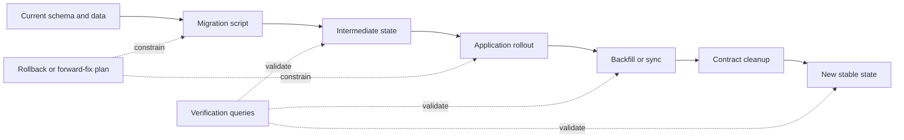
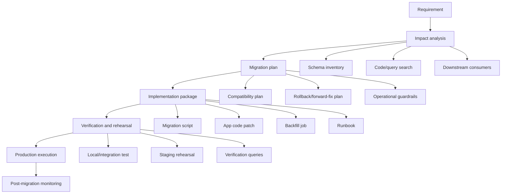
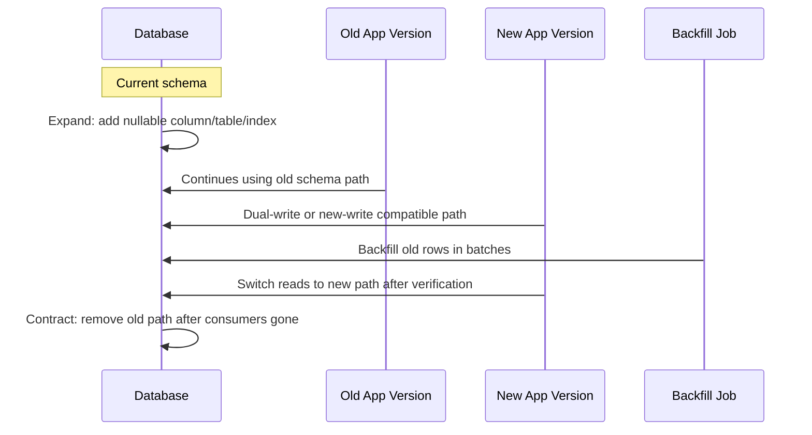
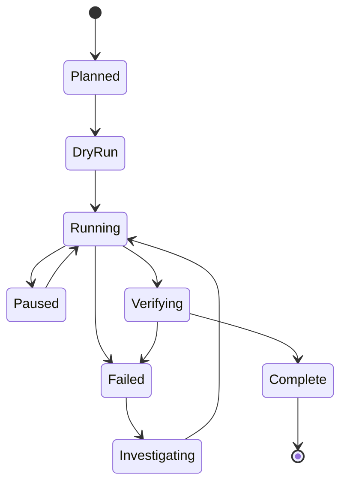
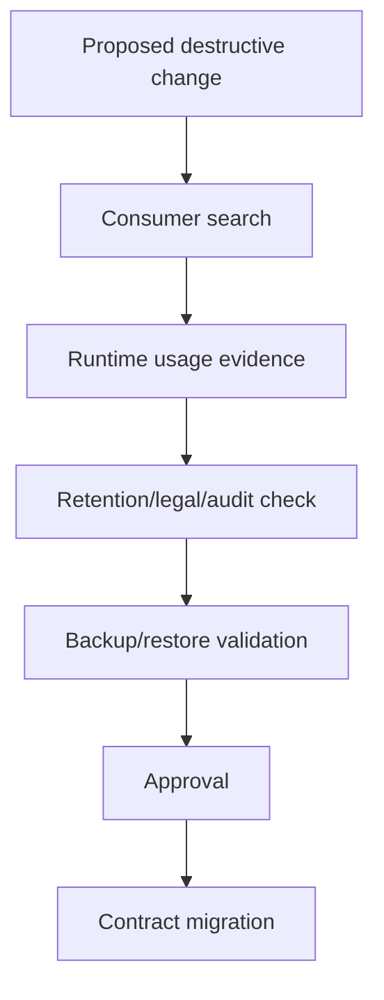

------
title: Learn AI Development Driven Implementation and Usage - Part 023
description: AI-assisted database and migration workflows for safe schema change, data backfill, rollback planning, and production-grade database delivery.
series: learn-ai-development-driven-implementation-usage
seriesTitle: Learn AI Development Driven Implementation and Usage
order: 23
partTitle: AI-Assisted Database and Migration Workflows
tags:
- ai
- software-engineering
- database
- migration
- devops
- governance
date: 2026-06-30
---

# Part 023 — AI-Assisted Database and Migration Workflows

Database work is where AI-assisted implementation becomes dangerous if treated like ordinary code generation.

A normal code patch can often be reverted by redeploying the previous artifact. A database migration can mutate durable state, lock hot tables, break old application versions, corrupt derived data, or create irreversible ambiguity. The database remembers mistakes.

The goal of this part is not to teach SQL from scratch. The goal is to teach how a senior engineer should use AI to design, implement, verify, and govern database changes without turning AI into an unreviewed production mutation engine.

By the end of this part, you should be able to:

- translate product or engineering requirements into safe schema/data migration plans;
- use AI to discover database impact without trusting its conclusions blindly;
- design expand-migrate-contract rollouts for backward-compatible deployment;
- generate migration scripts with verification queries, rollback strategy, and blast-radius limits;
- review AI-generated database code as high-risk infrastructure;
- create evidence that a database change is production-safe.

---

## 1. Kaufman Skill Deconstruction

Following Josh Kaufman's approach, we deconstruct the skill into small sub-skills that can be practiced deliberately.

| Sub-skill | What you must learn | Why it matters |
|---|---|---|
| Schema impact analysis | Identify tables, columns, indexes, constraints, triggers, views, queries, reports, jobs, and downstream consumers affected by a change. | AI frequently misses hidden consumers and operational consequences. |
| Migration taxonomy | Distinguish additive, compatible, destructive, data-corrective, backfill, index, constraint, and semantic migrations. | Different migration types require different risk controls. |
| Expand-migrate-contract | Deploy changes in safe stages so old and new app versions can coexist. | Required for zero-downtime or low-risk rollouts. |
| Data backfill design | Batch mutation, resume safely, verify counts/checksums, and avoid long locks. | Data migrations are often where production incidents happen. |
| Rollback/forward-fix planning | Decide whether rollback is possible, useful, or dangerous. | Many database changes are not cleanly reversible. |
| Verification query design | Create deterministic checks that prove migration behavior. | AI-generated migration scripts without verification are incomplete. |
| Lock and performance reasoning | Understand how DDL/DML can block, scan, or amplify load. | A syntactically valid migration can still be operationally unsafe. |
| Governance evidence | Document decision, risk, approval, validation, and rollback strategy. | Required for regulated or high-change-control environments. |

The minimum useful capability is not "AI can write migration SQL". The minimum useful capability is:

> Given a requirement, you can ask AI to produce a migration plan, then independently evaluate whether the plan preserves compatibility, data correctness, operational safety, and auditability.

---

## 2. The Core Mental Model: Database Change Is State Evolution

Code is behavior. Database is durable state. A migration is a state transition.



A safe AI-assisted database workflow treats every database change as a controlled state transition with:

1. a known source state;
2. a target state;
3. one or more intermediate states;
4. compatibility constraints across application versions;
5. validation criteria;
6. rollback or forward-fix strategy;
7. operational guardrails.

If the AI produces SQL but cannot explain these elements, the output is not production-ready.

---

## 3. What AI Is Good At in Database Work

AI is useful for database workflows when the task has enough context and a clear verification boundary.

Good uses:

- summarizing existing schema and migration history;
- identifying candidate affected queries and repositories;
- generating first-pass migration scripts;
- converting requirement into expand-migrate-contract phases;
- proposing indexes and explaining query plans;
- writing verification queries;
- generating data backfill jobs with batch/resume logic;
- creating rollback notes and operator runbooks;
- reviewing migrations for obvious hazards;
- generating test fixtures for database integration tests.

Weak or dangerous uses:

- choosing a destructive migration without domain review;
- guessing production cardinality, lock behavior, or data distribution;
- assuming rollback is easy;
- changing schema and application code in one unreviewable diff;
- generating data correction scripts without idempotency;
- inferring business meaning from column names alone;
- modifying retention, audit, financial, legal, enforcement, or identity data without explicit policy.

A strong engineer uses AI to accelerate thinking and drafting. They do not delegate ownership of durable state.

---

## 4. Database Change Taxonomy

Before prompting AI, classify the change.

| Type | Example | Risk level | Typical rollout |
|---|---|---:|---|
| Additive schema | Add nullable column, add table, add non-enforced field. | Low to medium | One migration, app reads/writes later. |
| Compatible constraint | Add check constraint not validated yet. | Medium | Add as not-valid where supported, validate later. |
| Index change | Add index for hot query. | Medium to high | Concurrent/online index where possible; monitor locks. |
| Semantic field change | Change meaning of status, enum, amount, ownership. | High | Design review, compatibility layer, backfill, audit. |
| Column rename | Rename `customer_id` to `party_id`. | High | Add new column, dual-write, backfill, switch reads, remove old later. |
| Type change | `int` to `bigint`, `varchar` to enum. | High | Add new column or online migration; verify casts. |
| Destructive schema | Drop column/table, delete constraint. | High | Contract phase only after consumers removed and retention checked. |
| Data backfill | Populate normalized table from existing records. | High | Batch job, resume, checksums, progress tracking. |
| Data correction | Fix incorrect production values. | Critical | Approval, exact selection query, dry run, audit trail. |
| Partitioning/sharding | Split table, add partition key. | Critical | Dedicated migration project. |

This taxonomy should be part of the AI prompt. AI cannot choose the correct safety model if the change type is hidden.

---

## 5. The AI-Assisted Migration Workflow

A safe workflow has six phases.



### Phase 1 — Requirement

Bad requirement:

> Add customer status to orders.

Better requirement:

> Orders must store the customer's risk status at the time of order creation for later audit. The value must be immutable once captured. Existing orders should have `UNKNOWN` unless an auditable historical status snapshot exists. Current order reads must not join to customer status for past orders.

The better requirement includes:

- business meaning;
- temporal semantics;
- immutability rule;
- existing data rule;
- read behavior;
- audit concern.

### Phase 2 — Impact Analysis

Ask AI to inspect, not to mutate.

Example work order:

```md
You are doing database impact analysis only. Do not propose code changes yet.

Requirement:
- Orders must store customer risk status at order creation time.
- The stored value must represent the historical snapshot, not current customer state.

Repository context:
- Backend service: Java/Spring
- DB migration tool: Flyway
- DB: PostgreSQL

Analyze:
1. Tables likely affected.
2. Entity/model classes likely affected.
3. Read/write paths likely affected.
4. Batch jobs/reporting likely affected.
5. Compatibility risks.
6. Questions that must be answered before implementation.

Output:
- Evidence-backed findings with file paths and symbols.
- Unknowns separately.
- No SQL yet.
```

The important instruction is **"No SQL yet"**. Do not let AI jump into implementation before impact is understood.

### Phase 3 — Migration Plan

Ask for phases, not a single script.

```md
Create a migration plan using expand-migrate-contract.

Include:
1. Expand phase: additive schema only.
2. Application write/read changes.
3. Backfill approach for existing rows.
4. Verification queries.
5. Contract phase cleanup.
6. Rollback or forward-fix strategy for each phase.
7. Operational risks: locks, table scans, index build, deploy ordering.

Assumptions:
- PostgreSQL production table has approximately 50M rows.
- Zero-downtime deployment required.
- Multiple app versions may run during rollout.
- Flyway is used for versioned migrations.
```

### Phase 4 — Implementation Package

A complete package is more than SQL.

It includes:

- migration script;
- application code patch;
- tests;
- backfill job if needed;
- verification queries;
- runbook;
- rollback/forward-fix plan;
- monitoring notes;
- PR description.

### Phase 5 — Verification and Rehearsal

The AI should generate checks, but humans must verify they match real invariants.

Verification dimensions:

| Dimension | Example check |
|---|---|
| Schema | Column exists, nullable as expected, constraint state correct. |
| Data | Count of migrated rows equals expected candidate rows. |
| Semantics | Historical status remains stable after customer status changes. |
| Compatibility | Old app version still reads/writes without error. |
| Performance | Migration does not scan or lock beyond acceptable threshold. |
| Observability | Metrics/logs expose progress and failure. |

### Phase 6 — Production Execution

AI can draft a runbook. AI should not be the only control deciding whether to execute.

Runbook must include:

- pre-checks;
- deployment order;
- expected duration;
- pause/stop condition;
- verification queries;
- alert thresholds;
- rollback/forward-fix steps;
- owner and escalation path.

---

## 6. Expand-Migrate-Contract Pattern

The safest default for non-trivial database changes is expand-migrate-contract.



### 6.1 Expand

Add new structures in a way that does not break old code.

Examples:

- add nullable column;
- add new table;
- add index concurrently/online where supported;
- add optional foreign key later;
- add enum value before application emits it;
- add new event field as optional.

Avoid:

- renaming columns directly;
- adding non-null column with no default on a large table without plan;
- dropping columns used by old app versions;
- changing meaning of existing values in place.

### 6.2 Migrate

Move writes and data gradually.

Strategies:

- dual-write old and new columns;
- write new column, read old fallback;
- backfill in batches;
- verify counts/checksums;
- shadow-read and compare;
- expose progress metrics.

### 6.3 Contract

Remove old structures only after confidence.

Preconditions:

- all app versions no longer use old field;
- downstream consumers updated;
- data retention obligations checked;
- backup/restore window understood;
- monitoring shows no old-path reads/writes;
- contract migration approved.

Contract is the phase AI is most likely to make unsafe if asked to "clean up". Treat cleanup as a separate PR.

---

## 7. Prompt Pattern: Migration Design Review

Use this prompt before code generation.

```md
Act as a database migration reviewer, not an implementer.

Context:
- DB: PostgreSQL
- Migration tool: Flyway
- Table: enforcement_case
- Approx row count: 80M
- Deployment model: rolling deploy, multiple app versions can coexist
- Requirement: add immutable `case_priority_snapshot` captured at case creation

Review the proposed migration plan below.

Evaluate:
1. Backward compatibility with old application versions.
2. Forward compatibility with new application versions.
3. Locking and long-running transaction risks.
4. Data backfill risks.
5. Rollback or forward-fix feasibility.
6. Verification query completeness.
7. Missing business or regulatory assumptions.
8. Whether the change should be split into multiple PRs.

Return:
- Critical blockers.
- Major risks.
- Minor improvements.
- Required evidence before approval.
- Revised migration phases.
```

This prompt forces AI to review the plan as a system, not to produce pretty SQL.

---

## 8. Prompt Pattern: Generate Migration Package

Once the plan is approved, generate the package.

```md
Generate a production-ready migration package.

Constraints:
- Use Flyway versioned migration naming.
- SQL must be idempotency-aware where possible.
- Avoid destructive changes.
- Do not add NOT NULL until backfill is complete and verified.
- Do not drop old columns in this PR.
- Include verification queries.
- Include rollback/forward-fix notes.
- Include PR description.

Output sections:
1. Migration file name.
2. SQL migration.
3. Application code change summary.
4. Tests to add.
5. Verification queries.
6. Operational runbook.
7. Risks and assumptions.
```

Notice that the prompt explicitly forbids common unsafe shortcuts.

---

## 9. Example: Safe Column Introduction

Requirement:

> Add `risk_status_snapshot` to `orders` so every new order stores the customer risk status at creation time.

### 9.1 Unsafe AI Output

```sql
ALTER TABLE orders ADD COLUMN risk_status_snapshot VARCHAR(20) NOT NULL DEFAULT 'UNKNOWN';
UPDATE orders o
SET risk_status_snapshot = c.risk_status
FROM customers c
WHERE o.customer_id = c.id;
```

Problems:

- may lock or rewrite a large table depending on DB/version/operation;
- uses current customer status, not historical status;
- makes `UNKNOWN` indistinguishable from intentionally unknown;
- runs one huge update;
- no batching;
- no verification;
- no rollback plan;
- no application compatibility plan.

### 9.2 Safer Expand Phase

```sql
-- V20260630_001__add_order_risk_status_snapshot.sql
ALTER TABLE orders
    ADD COLUMN risk_status_snapshot VARCHAR(32);

COMMENT ON COLUMN orders.risk_status_snapshot IS
    'Risk status snapshot captured at order creation time. Nullable during migration.';
```

Why nullable first?

Because existing rows need a deliberate historical policy. `NOT NULL` is a contract, not an aspiration.

### 9.3 Application Write Change

New order creation writes:

```java
order.setRiskStatusSnapshot(customerRiskSnapshot.statusAtCreation());
```

Read logic during migration:

```java
RiskStatus status = order.getRiskStatusSnapshot() != null
    ? RiskStatus.valueOf(order.getRiskStatusSnapshot())
    : RiskStatus.UNKNOWN;
```

This keeps reads compatible while old rows are being migrated.

### 9.4 Backfill Decision

There are two business choices:

1. If historical customer status exists, backfill using the historical snapshot table.
2. If historical status does not exist, backfill `UNKNOWN_BACKFILLED` or keep null and handle as unknown.

AI must not invent historical truth. Missing history is a domain decision.

### 9.5 Verification Queries

```sql
-- Count rows missing snapshot
SELECT COUNT(*) AS missing_snapshot
FROM orders
WHERE risk_status_snapshot IS NULL;

-- Distribution check
SELECT risk_status_snapshot, COUNT(*)
FROM orders
GROUP BY risk_status_snapshot
ORDER BY COUNT(*) DESC;

-- New writes after deployment should not be null
SELECT COUNT(*) AS recent_missing_snapshot
FROM orders
WHERE created_at >= :deployment_time
  AND risk_status_snapshot IS NULL;
```

### 9.6 Contract Phase

Only after verification:

```sql
-- Later migration, not same PR
ALTER TABLE orders
    ALTER COLUMN risk_status_snapshot SET NOT NULL;
```

Even this may need DB-specific online strategy, validation window, and lock analysis.

---

## 10. Data Backfill Design

A backfill is production code. Treat it like a resumable distributed process, not a one-off script.

### 10.1 Backfill Requirements

A safe backfill should be:

- idempotent;
- resumable;
- batch-limited;
- observable;
- interruptible;
- rate-limited;
- verified;
- auditable.

### 10.2 Backfill State Machine



### 10.3 Prompt Pattern: Backfill Job

```md
Design a resumable backfill job.

Context:
- Table: orders
- Primary key: id
- Target column: risk_status_snapshot
- Source: customer_risk_history based on order.created_at
- Approx rows: 80M
- DB: PostgreSQL
- App stack: Java/Spring Batch

Requirements:
1. Process in batches by primary key range.
2. Never update rows already populated.
3. Support dry-run mode.
4. Persist progress.
5. Emit metrics: processed, updated, skipped, failed, lag, batch duration.
6. Rate-limit writes.
7. Include verification queries.
8. Include stop conditions.
9. Do not use one transaction for entire backfill.

Output:
- Algorithm.
- Pseudocode.
- SQL snippets.
- Failure handling.
- Test cases.
- Operational runbook.
```

### 10.4 Batch Update Pattern

Conceptual SQL:

```sql
UPDATE orders o
SET risk_status_snapshot = h.status
FROM customer_risk_history h
WHERE o.id BETWEEN :start_id AND :end_id
  AND o.risk_status_snapshot IS NULL
  AND h.customer_id = o.customer_id
  AND h.valid_from <= o.created_at
  AND (h.valid_to IS NULL OR h.valid_to > o.created_at);
```

This is not automatically safe. You still need:

- indexes on join/filter columns;
- bounded batch size;
- execution plan review;
- deadlock strategy;
- timeout settings;
- progress tracking;
- verification.

---

## 11. Schema Migration Review Checklist

Use this checklist before approving AI-generated migrations.

### 11.1 Compatibility

- Can old app version run after the migration?
- Can new app version run before the migration?
- Can old and new app versions run together?
- Are event consumers or reports affected?
- Are generated clients or ORM mappings affected?
- Are optional fields handled consistently?

### 11.2 Data Correctness

- Does migration preserve business meaning?
- Are default values semantically valid?
- Are unknown, missing, not-applicable, and legacy values distinguishable?
- Are historical facts inferred safely?
- Are time zones, currency, precision, and rounding handled?
- Are audit fields preserved?

### 11.3 Operational Safety

- Could migration lock a hot table?
- Could it scan a large table?
- Could it rewrite all rows?
- Could it block writes?
- Could it exceed statement timeout?
- Is index creation online/concurrent where needed?
- Is transaction scope bounded?

### 11.4 Rollback and Forward-Fix

- Is rollback technically possible?
- Would rollback lose data?
- Is forward-fix safer than rollback?
- Are old and new app versions compatible during rollback?
- Is backup/restore required?
- Is there a manual correction path?

### 11.5 Evidence

- Are verification queries included?
- Are test cases included?
- Is migration rehearsed on realistic data volume?
- Are expected row counts documented?
- Are monitoring and alerting defined?
- Is approval recorded for destructive or semantic changes?

---

## 12. AI Review Prompt for Migration SQL

```md
Review this database migration SQL as if it will run on production.

Context:
- DB: PostgreSQL
- Migration tool: Flyway
- Deployment: rolling deploy
- Table sizes: include approximate row count if available
- Availability requirement: zero downtime preferred

Check for:
1. Locking risks.
2. Table rewrite risks.
3. Long-running transaction risks.
4. Backward/forward compatibility risks.
5. Data loss or semantic corruption.
6. Missing indexes.
7. Unsafe defaults.
8. Rollback limitations.
9. Missing verification queries.
10. Need to split into expand/migrate/contract phases.

Output format:
- Verdict: approve / approve with changes / block.
- Critical blockers.
- Required changes.
- Suggested safer migration plan.
- Verification queries.
```

This is one of the highest-leverage prompts in this series.

---

## 13. Rollback Is Not Always the Right Model

Application rollback often means redeploying an older artifact. Database rollback is more complicated.

Types of rollback:

| Type | Meaning | Risk |
|---|---|---|
| Schema rollback | Undo DDL. | May fail if new data exists. |
| Data rollback | Revert data mutations. | May lose legitimate writes. |
| Application rollback | Deploy old app version. | Requires schema compatibility. |
| Forward-fix | Apply a new corrective migration. | Often safer for durable state. |
| Restore from backup | Restore database snapshot. | High blast radius and data loss risk. |

For many production migrations, the best rollback strategy is actually **forward compatibility plus forward-fix**.

Example:

- Add nullable column: rollback not needed; old app ignores it.
- Backfill wrong subset: forward-fix with audited correction may be safer than blind rollback.
- Drop column: rollback may be impossible without backup.

Ask AI to produce both rollback and forward-fix options, then choose deliberately.

---

## 14. Migration Tools: What AI Must Respect

### 14.1 Flyway

Flyway-style migrations are usually versioned SQL scripts applied in order. AI must respect naming, ordering, repeatability, and immutability conventions.

Good instruction:

```md
Use Flyway versioned migration naming. Do not edit existing applied migration files. Create a new migration file. Include comments explaining operational assumptions.
```

Bad instruction:

```md
Fix the migration history.
```

Editing applied migrations can break environments that already ran them.

### 14.2 Liquibase

Liquibase changesets can include rollback metadata and support structured changelogs. AI must not treat rollback blocks as proof that rollback is semantically safe.

Good instruction:

```md
For each changeset, include rollback only if semantically safe. If rollback would lose data or break compatibility, state that rollback is not safe and provide forward-fix guidance.
```

### 14.3 ORM Auto-DDL

For production systems, AI should not rely on ORM auto-DDL as the primary migration mechanism.

Bad:

```properties
spring.jpa.hibernate.ddl-auto=update
```

Better:

- explicit migration files;
- reviewed schema diff;
- reproducible deployment order;
- version-controlled scripts;
- CI validation.

---

## 15. AI-Assisted Index Design

Indexes are not free. AI can suggest indexes, but it often lacks production cardinality and workload distribution.

Index design requires:

- query pattern;
- filter selectivity;
- join pattern;
- sort/group requirement;
- write amplification cost;
- storage cost;
- lock/build method;
- maintenance overhead.

Prompt:

```md
Analyze whether this query needs a new index.

Provide:
1. Existing indexes that may already help.
2. Candidate indexes.
3. Why each candidate helps.
4. Write amplification cost.
5. Whether the index should be partial/composite/covering.
6. How to validate with EXPLAIN.
7. Safe rollout strategy.

Do not assume production cardinality. List data distribution questions separately.
```

Review AI output against actual `EXPLAIN` output and production metrics.

---

## 16. Destructive Changes Require a Contract Gate

AI should not be allowed to drop columns, tables, indexes, constraints, events, topics, or history without explicit contract approval.

Destructive change gate:



Required evidence:

- code search shows no usage;
- query logs show no runtime usage;
- downstream/reporting owners approve;
- retention policy allows deletion;
- backup strategy is known;
- rollback/forward-fix plan exists;
- migration is isolated in its own PR.

---

## 17. Database Migration PR Template

Use this template for AI-assisted database PRs.

```md
## Change Type
- [ ] Additive schema
- [ ] Index
- [ ] Constraint
- [ ] Data backfill
- [ ] Data correction
- [ ] Destructive contract cleanup
- [ ] Other

## Purpose
Explain the business/system reason.

## Compatibility
- Old app with new schema:
- New app with old schema:
- Rolling deploy safe: yes/no

## Migration Phases
1. Expand:
2. Migrate:
3. Contract:

## Data Impact
- Tables affected:
- Approx row count:
- Expected rows changed:
- Default/unknown semantics:

## Operational Risk
- Lock risk:
- Table scan risk:
- Index build risk:
- Runtime duration expectation:

## Verification Queries
Paste queries and expected results.

## Rollback / Forward-Fix
State exact approach.

## Evidence
- Local test:
- Staging rehearsal:
- EXPLAIN output:
- Metrics/alerts:

## AI Assistance Disclosure
Describe AI-generated parts and human review performed.
```

---

## 18. Common Anti-Patterns

### 18.1 One PR for Schema, App, Backfill, and Cleanup

This destroys reviewability and rollback clarity.

Better:

1. PR 1: expand schema;
2. PR 2: app compatibility and new writes;
3. PR 3: backfill;
4. PR 4: switch reads;
5. PR 5: contract cleanup.

### 18.2 Defaulting Unknown Values Without Semantics

`DEFAULT 'UNKNOWN'` may hide three different states:

- truly unknown;
- not applicable;
- legacy value not migrated;
- error during migration.

Different states may need different values.

### 18.3 Backfill Without Progress Tracking

If a job fails after 20 million rows, can you resume safely? If not, the design is weak.

### 18.4 Dropping Columns Because Code Search Is Clean

Code search misses:

- ad-hoc queries;
- BI dashboards;
- exports;
- external consumers;
- stored procedures;
- old branches;
- support scripts;
- data science notebooks.

### 18.5 AI-Generated Rollback That Loses Data

Rollback SQL can be syntactically valid and semantically catastrophic.

Example:

```sql
ALTER TABLE orders DROP COLUMN risk_status_snapshot;
```

This is a rollback only if the data is disposable. Often it is not.

---

## 19. Engineering Invariants for AI-Assisted Database Work

Use these as non-negotiable rules.

1. AI-generated migration output is untrusted until reviewed.
2. Durable state changes require explicit verification queries.
3. Destructive changes require separate contract approval.
4. Backfills must be resumable and observable.
5. Defaults must have business semantics.
6. Rollback must be evaluated semantically, not syntactically.
7. Large-table DDL requires lock/performance analysis.
8. Migration scripts must be version-controlled and immutable once applied.
9. Application rollback must remain possible during expand phases.
10. Contract cleanup comes last, never first.

---

## 20. 20-Hour Deliberate Practice Plan

### Hours 1–3 — Migration Taxonomy

Take 10 historical migration PRs and classify them:

- additive;
- constraint;
- index;
- data backfill;
- data correction;
- destructive;
- semantic.

For each, identify what evidence was missing.

### Hours 4–6 — AI Impact Analysis

Use AI to inspect a repository and identify affected database paths for three hypothetical requirements. Compare AI findings with manual search.

Practice prompt:

```md
Perform database impact analysis only. Separate evidence from speculation.
```

### Hours 7–10 — Expand-Migrate-Contract Design

For five unsafe migrations, rewrite them as phased rollouts.

Deliverables:

- phase diagram;
- migration files;
- app compatibility strategy;
- verification queries.

### Hours 11–14 — Backfill Engineering

Design and implement a resumable backfill on a local dataset.

Practice:

- failure after N batches;
- resume;
- dry run;
- metrics;
- verification.

### Hours 15–17 — Migration Review

Ask AI to generate migration SQL. Review it using the checklist. Record every flaw.

Goal:

- become faster at spotting unsafe defaults, locks, missing verification, and fake rollback.

### Hours 18–20 — Capstone

Take one realistic requirement and produce:

- impact analysis;
- migration plan;
- SQL;
- backfill job design;
- tests;
- verification queries;
- runbook;
- PR description;
- risk decision.

This is the minimum standard for real production use.

---

## 21. Senior Engineer Review Rubric

A database PR is strong when:

| Area | Strong signal | Weak signal |
|---|---|---|
| Scope | One clear migration phase. | Mixed schema/app/backfill/drop cleanup. |
| Compatibility | Old/new app coexistence shown. | Assumes single deploy instant. |
| Data semantics | Unknown/default states explained. | Uses arbitrary defaults. |
| Verification | Queries with expected results. | "Tests pass" only. |
| Operations | Lock, scan, duration, monitoring considered. | No production risk notes. |
| Rollback | Forward-fix/rollback trade-off explicit. | Generic down migration. |
| AI usage | AI output reviewed and bounded. | AI-generated SQL pasted directly. |

---

## 22. Key Takeaways

AI can make database work faster, but unsafe database automation scales damage faster too.

The correct model is:

> AI drafts and analyzes; engineers own durable state transitions.

For every AI-assisted database change, demand:

- classification;
- compatibility plan;
- verification queries;
- operational guardrails;
- rollback/forward-fix reasoning;
- evidence.

The best AI-driven engineer is not the one who generates SQL fastest. It is the one who can turn ambiguous state evolution into a controlled, reviewable, reversible or forward-fixable production transition.

---

## References

- Redgate Flyway Documentation — Migrations
- Liquibase Documentation — Rollback
- PostgreSQL Documentation — Explicit Locking, DDL, Indexes
- Martin Fowler — Evolutionary Database Design
- GitHub Docs — GitHub Actions and deployment workflows
- NIST AI RMF — AI risk management framing
