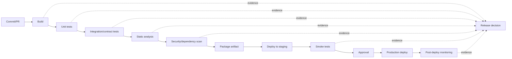
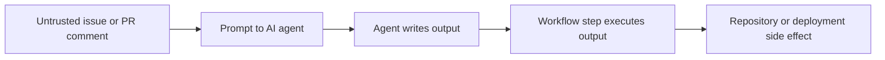
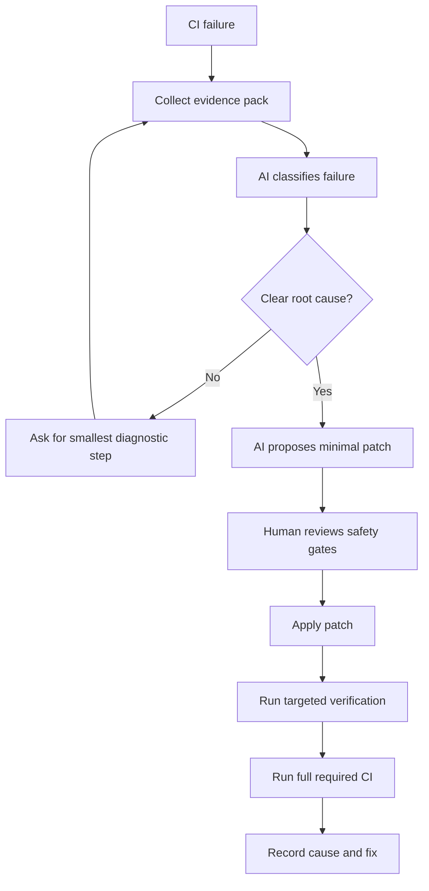

------
title: Learn AI Development Driven Implementation and Usage - Part 024
description: AI-assisted DevOps and CI/CD workflows for pipeline repair, deployment safety, release evidence, rollback planning, and workflow governance.
series: learn-ai-development-driven-implementation-usage
seriesTitle: Learn AI Development Driven Implementation and Usage
order: 24
partTitle: AI-Assisted DevOps and CI/CD
tags:
- ai
- software-engineering
- devops
- ci-cd
- release-engineering
- governance
date: 2026-06-30
---

# Part 024 — AI-Assisted DevOps and CI/CD

AI-assisted DevOps is not "ask AI to fix the pipeline".

CI/CD is production control infrastructure. It decides what gets built, tested, scanned, packaged, deployed, promoted, rolled back, and audited. If AI modifies CI/CD carelessly, it can bypass safety gates, leak secrets, weaken permissions, introduce supply-chain risk, or produce false confidence.

The senior-engineer model is:

> CI/CD is an evidence factory. AI can help produce, inspect, and repair evidence, but it must not silently weaken the gates that make delivery safe.

This part teaches how to use AI for CI/CD and DevOps workflows while preserving correctness, security, observability, and governance.

---

## 1. Kaufman Skill Deconstruction

Break the skill into practiceable sub-skills.

| Sub-skill | What you must learn | Why it matters |
|---|---|---|
| Pipeline mental model | Understand triggers, jobs, steps, artifacts, caches, secrets, environments, approvals, and deployments. | AI often fixes symptoms by weakening gates. |
| Failure triage | Classify failures: test, dependency, environment, permission, flaky, resource, config, security, deployment. | Different failure classes require different remedies. |
| Log compression | Extract the smallest evidence needed from long logs. | AI can drown in noisy logs. |
| Safe pipeline repair | Repair CI without disabling meaningful checks. | Fast fixes can reduce delivery safety. |
| Deployment strategy | Understand rolling, blue/green, canary, feature flags, shadow traffic, and rollback. | AI-generated deployment config can create downtime. |
| Secrets and permissions | Apply least privilege to tokens, workflow permissions, and environment credentials. | CI/CD is a common privilege boundary. |
| Release evidence | Generate changelog, risk summary, test evidence, deployment notes, rollback plan. | Required for serious engineering and regulated systems. |
| Agentic workflow security | Prevent prompt injection or untrusted event data from controlling agents. | AI-enabled workflows create new attack surfaces. |

The minimum useful capability is:

> Given a failed or unsafe pipeline, you can use AI to locate the cause, propose a minimal repair, and verify that the repair improves reliability without reducing safety.

---

## 2. CI/CD as an Evidence Factory

A pipeline is not just automation. It is a structured chain of evidence.



Every gate answers a question:

| Gate | Question |
|---|---|
| Build | Can the artifact be produced reproducibly? |
| Unit tests | Do local invariants hold? |
| Integration tests | Do components still cooperate? |
| Contract tests | Are external promises preserved? |
| Static analysis | Are structural/code-quality rules preserved? |
| Security scan | Are known risk classes introduced? |
| Artifact signing/provenance | Can we trust what we deploy? |
| Staging deploy | Can the artifact run in a production-like environment? |
| Smoke test | Is the critical path alive? |
| Approval | Has human/system policy accepted the risk? |
| Monitoring | Did production behave as expected? |

AI may help with any gate. It must not remove gates to make the build green.

---

## 3. Where AI Helps in DevOps

Good uses:

- summarize failing logs;
- identify likely root cause of CI failure;
- propose minimal workflow syntax fixes;
- generate missing cache or matrix configuration;
- explain dependency resolution failures;
- draft Dockerfile or build script improvements;
- suggest test isolation for flaky tests;
- generate release notes from PRs;
- produce deployment runbooks;
- create rollback checklists;
- review workflow permissions;
- compare pipeline behavior before/after changes.

Dangerous uses:

- disabling tests to make CI pass;
- broadening token permissions;
- printing secrets for debugging;
- executing untrusted PR content with privileged tokens;
- changing deployment strategy without release review;
- bypassing manual approvals;
- replacing deterministic scanners with AI judgment;
- auto-deploying model-generated infrastructure changes.

---

## 4. Failure Triage Taxonomy

Before asking AI to repair, classify the failure.

| Failure class | Symptoms | Safe AI task |
|---|---|---|
| Compile/build | Compiler errors, missing imports, broken packaging. | Map error to changed files and propose minimal fix. |
| Unit test | Deterministic test failure. | Explain expected vs actual; propose code or test fix. |
| Integration | Service/container/DB dependency failure. | Inspect environment setup and contract assumptions. |
| Dependency | Version conflict, missing package, registry outage. | Suggest lockfile or version correction. |
| Flaky test | Intermittent timing/order/network failure. | Identify nondeterminism; do not delete test. |
| Workflow syntax | Invalid YAML/action field/expression. | Generate corrected workflow snippet. |
| Permission | Token, environment, artifact, deployment access denied. | Propose least-privilege permission change. |
| Secret/config | Missing env var, wrong secret name. | Identify config boundary without exposing secret. |
| Resource | Timeout, memory, disk, rate limit. | Suggest resource/profile/parallelization change. |
| Security gate | SAST/dependency/container scan failure. | Explain finding; propose remediation, not bypass. |
| Deployment | Health check, migration, rollout, image pull, config drift. | Build rollback/diagnostic plan. |

Prompt AI with the suspected class. If unknown, ask it to classify first.

---

## 5. Prompt Pattern: CI Failure Triage

```md
You are triaging a CI failure. Do not propose changes yet.

Context:
- Repo type: Java/Spring service
- CI: GitHub Actions
- Failure occurred on PR branch
- Changed files: <paste paths>
- Failing job: <job name>
- Relevant logs: <paste last 200-400 useful lines>

Task:
1. Classify the failure type.
2. Identify the earliest meaningful error, not the final cascade.
3. Link the error to changed files or environment if possible.
4. Separate evidence from speculation.
5. List 2-3 likely root causes.
6. Recommend the smallest next diagnostic step.

Rules:
- Do not suggest disabling tests.
- Do not broaden permissions unless evidence shows permission failure.
- Do not expose or request secrets.
- Do not rewrite the entire workflow.
```

This prompt keeps AI in diagnosis mode before repair mode.

---

## 6. Prompt Pattern: Minimal CI Repair

```md
Now propose a minimal CI repair.

Constraints:
- Preserve existing safety gates.
- Do not remove tests, scans, approvals, or deployment protections.
- Prefer the smallest workflow/code change.
- Explain why the change addresses the root cause.
- Include how to verify locally or in CI.
- Include risks if this diagnosis is wrong.

Output:
1. Proposed patch summary.
2. Files to change.
3. Diff or code block.
4. Verification plan.
5. Rollback plan.
```

A good AI repair narrows scope. A bad AI repair rewrites the pipeline.

---

## 7. CI Log Compression

Most CI logs are noisy. The quality of AI analysis depends on the quality of log evidence.

### 7.1 Useful Log Pack

Include:

- job name;
- step name;
- command that failed;
- exit code;
- first error;
- relevant stack trace;
- changed files;
- environment differences;
- recent dependency/toolchain changes;
- whether failure is reproducible.

Avoid:

- thousands of unrelated download lines;
- secrets;
- full logs with no markers;
- only the final "process completed with exit code 1" line.

### 7.2 Compression Template

```md
CI Failure Evidence Pack

PR/commit:
Changed files:
Workflow:
Job:
Step:
Command:
Exit code:
First meaningful error:
Relevant stack trace:
Recent related changes:
Reproducible locally: yes/no/unknown
Suspected class:
```

This template turns CI from log swamp into evidence.

---

## 8. AI-Assisted GitHub Actions Repair

GitHub Actions workflows are YAML programs with security implications.

AI can help with:

- event triggers;
- job dependencies;
- matrix builds;
- cache keys;
- artifact upload/download;
- permissions;
- environment approvals;
- service containers;
- concurrency groups;
- reusable workflows.

But review for:

- overbroad `permissions: write-all`;
- unpinned or untrusted third-party actions;
- running untrusted PR code with privileged tokens;
- secrets available to unsafe events;
- shell injection through untrusted inputs;
- missing `timeout-minutes`;
- missing concurrency cancellation;
- skipped required jobs;
- broad deploy triggers.

### 8.1 Safer Workflow Review Prompt

```md
Review this GitHub Actions workflow for safety and maintainability.

Check:
1. Token permissions and least privilege.
2. Secret exposure risk.
3. Untrusted event input usage.
4. Third-party action pinning/version risk.
5. Cache poisoning risk.
6. Shell injection risk.
7. Deployment trigger safety.
8. Missing timeouts/concurrency.
9. Whether required gates can be bypassed.
10. Whether the workflow is too complex and should be split.

Output:
- Critical blockers.
- Major risks.
- Minor improvements.
- Suggested minimal patch.
```

### 8.2 Example: Permissions

Weak:

```yaml
permissions: write-all
```

Better default:

```yaml
permissions:
  contents: read
```

Job-specific elevation:

```yaml
permissions:
  contents: read
  packages: write
```

Only elevate permissions for the job that needs them.

---

## 9. Agentic Workflow Injection

AI-enabled CI/CD creates a new class of risk: untrusted workflow event data can influence agent prompts, and agent output can influence scripts.

Example risk path:



Dangerous pattern:

```yaml
- name: Ask agent what to run
  run: |
    COMMAND=$(ai-agent "${{ github.event.comment.body }}")
    eval "$COMMAND"
```

This turns untrusted text into executable behavior.

Safer pattern:

- never execute raw agent output;
- constrain agent output to structured schema;
- validate output against allowlist;
- require human approval for privileged actions;
- run untrusted PR analysis with read-only token;
- separate analysis workflow from write/deploy workflow;
- record audit logs.

---

## 10. Deployment Strategy with AI Assistance

AI can help design deployment workflows, but deployment safety depends on runtime behavior.

| Strategy | Description | AI assistance |
|---|---|---|
| Rolling deploy | Replace instances gradually. | Check backward compatibility and health checks. |
| Blue/green | Run old and new environments, switch traffic. | Draft cutover/rollback runbook. |
| Canary | Send small traffic percentage first. | Define metrics and abort thresholds. |
| Feature flag | Deploy code disabled, enable gradually. | Draft flag rollout and cleanup plan. |
| Shadow traffic | Send duplicate traffic to new path without user impact. | Design comparison metrics. |
| Dark launch | Run new capability internally. | Define observability and activation criteria. |

AI must not choose a strategy without context:

- database migration compatibility;
- user impact tolerance;
- stateful/session behavior;
- external dependencies;
- rollback ability;
- monitoring maturity;
- regulatory or audit constraints.

---

## 11. Prompt Pattern: Deployment Runbook

```md
Create a deployment runbook for this change.

Context:
- Service: enforcement-case-api
- Change type: API behavior + database expand migration
- Deployment strategy: rolling deploy
- Feature flag: enabled after deploy
- Risk: new validation path may reject legitimate cases

Runbook must include:
1. Pre-deploy checks.
2. Migration ordering.
3. Deployment steps.
4. Feature flag activation plan.
5. Smoke tests.
6. Metrics to watch.
7. Abort thresholds.
8. Rollback/forward-fix plan.
9. Communication notes.
10. Post-deploy verification.

Do not assume instant rollback is safe. Consider database compatibility.
```

This forces AI to consider state, rollout, and monitoring together.

---

## 12. Release Notes as Engineering Evidence

AI-generated release notes are useful only if they summarize risk, not just features.

Weak release note:

> Added risk status snapshot.

Strong release note:

```md
## Change Summary
Adds `risk_status_snapshot` to order creation so historical order records preserve customer risk state at creation time.

## User Impact
No UI change. Audit/reporting behavior becomes more accurate for newly created orders.

## Technical Impact
- Adds nullable DB column in expand phase.
- New writes populate snapshot.
- Existing rows remain null until approved backfill.
- Reads fall back to UNKNOWN during transition.

## Risk
- Incorrect snapshot capture could affect audit reports.
- Backfill is not included in this release.

## Verification
- Unit tests for order creation snapshot.
- Integration test for read fallback.
- DB migration applied in staging.

## Rollback
Application rollback is safe because schema change is additive. Column should not be dropped during rollback.
```

AI can draft this from PR diff, but the engineer must verify risk and rollback claims.

---

## 13. AI-Assisted Pipeline Optimization

AI can suggest faster pipelines. The danger is optimizing away signal.

Safe optimization targets:

- cache dependencies;
- parallelize independent jobs;
- split fast feedback from full verification;
- use test selection with fallback full test;
- reduce duplicate setup;
- use build artifacts instead of rebuilding;
- add concurrency cancellation for superseded PR runs.

Unsafe optimization targets:

- skipping integration tests on risky changes;
- running security scan only manually;
- removing slow but high-value tests;
- caching mutable or untrusted artifacts;
- sharing cache across trust boundaries;
- deploying from unverified build artifact.

Prompt:

```md
Suggest CI pipeline optimizations without reducing safety.

For each suggestion, include:
1. Expected time saved.
2. Signal preserved.
3. New risk introduced.
4. Rollback plan.
5. Whether this should be measured before adoption.

Do not suggest removing required tests or security checks.
```

---

## 14. Infrastructure-as-Code with AI

AI is strong at drafting Terraform/Kubernetes/Docker/YAML. It is weak at knowing your production blast radius unless you provide context.

Review AI-generated IaC for:

- privilege escalation;
- public exposure;
- missing encryption;
- missing backups;
- insecure network policy;
- mutable tags like `latest`;
- resource limits;
- health checks;
- autoscaling thresholds;
- dependency ordering;
- drift with existing environment;
- irreversible resource replacement.

Prompt:

```md
Review this infrastructure change as a production risk review.

Check:
1. Resources created/changed/destroyed.
2. Public exposure changes.
3. IAM/permission changes.
4. Secret handling.
5. Data persistence and backup impact.
6. Availability impact.
7. Cost impact.
8. Drift or replacement risk.
9. Rollback plan.
10. Required approvals.

Separate deterministic findings from assumptions.
```

Never approve AI-generated IaC without plan output from the IaC tool itself.

---

## 15. Secrets Hygiene

AI should never need raw secrets.

Rules:

1. Do not paste secrets into chat.
2. Do not ask AI to decode or print secrets.
3. Use secret names and access patterns, not values.
4. Redact logs before sending to AI.
5. Prefer short-lived credentials.
6. Scope CI secrets by environment.
7. Prevent secrets from being available to untrusted PR workflows.
8. Rotate credentials if exposed.

Safe prompt:

```md
The workflow fails because `DB_PASSWORD` is unavailable in the staging deploy job.
Do not ask for or print the secret value.
Analyze possible configuration causes and propose least-privilege fixes.
```

Unsafe prompt:

```md
Here is the secret value. Tell me why deployment fails.
```

---

## 16. Deterministic Gates vs AI Judgment

AI review is not a replacement for deterministic checks.

| Need | Prefer deterministic tool | AI role |
|---|---|---|
| Compile correctness | Compiler/build tool | Explain failures. |
| Unit tests | Test framework | Suggest missing tests. |
| Formatting | Formatter | Explain style policy. |
| Static analysis | Linter/SAST | Triage findings. |
| Dependency vulnerabilities | Scanner/SBOM tool | Explain remediation options. |
| Container policy | Image scanner/policy engine | Summarize risk. |
| IaC drift | Terraform/plan/diff tool | Review plan implications. |
| Deployment health | Metrics/logs/traces | Summarize anomalies. |

Use AI to interpret evidence, not to replace evidence.

---

## 17. AI-Driven CI Repair Workflow



This loop prevents the common failure mode: patching randomly until green.

---

## 18. DevOps PR Review Checklist

### 18.1 Workflow Safety

- Are triggers appropriate?
- Are permissions least-privilege?
- Are secrets scoped correctly?
- Are untrusted inputs sanitized?
- Are third-party actions pinned or trusted?
- Are deployment environments protected?
- Are manual approvals preserved?
- Are timeouts configured?
- Are concurrent deploys prevented?

### 18.2 Build Integrity

- Is artifact built once and promoted?
- Is artifact identity traceable to commit?
- Are generated files reproducible?
- Are caches safe and scoped?
- Are dependencies locked?
- Are SBOM/signing/provenance requirements satisfied where applicable?

### 18.3 Test Signal

- Were tests removed or weakened?
- Are failures fixed at root cause?
- Are flaky tests isolated and tracked?
- Are integration/contract tests preserved for risky changes?
- Are smoke tests meaningful?

### 18.4 Deployment Safety

- Is deployment order correct?
- Are migrations compatible?
- Is rollback/forward-fix realistic?
- Are metrics and alerts defined?
- Are abort thresholds explicit?
- Is customer/regulatory impact considered?

---

## 19. Common Anti-Patterns

### 19.1 Make CI Green by Removing Signal

Bad AI patch:

```yaml
# Removed failing integration tests because they were unstable
```

Better:

- quarantine flaky test with tracking issue if truly flaky;
- preserve required gate if failure is deterministic;
- fix root cause;
- add timeout/retry only when semantically valid.

### 19.2 Broad Token Permissions

Bad:

```yaml
permissions: write-all
```

Better:

```yaml
permissions:
  contents: read
  checks: write
```

Only for the job that needs it.

### 19.3 AI Executes Its Own Output

Never let AI text become shell commands without validation.

### 19.4 Pipeline Rewrite for Small Failure

If one Maven cache key is wrong, do not let AI redesign the full CI/CD system.

### 19.5 Deployment Without Observability

A deployment is incomplete if you cannot answer:

- did error rate change?
- did latency change?
- did business invariant break?
- did rollback complete?
- did customer impact occur?

---

## 20. Agent Work Packet for CI/CD Tasks

When delegating to a coding/cloud agent, provide a strict packet.

```md
Task: Fix CI failure in `integration-tests` job.

Scope:
- You may modify test setup, workflow config, or application config only if directly related.
- Do not remove tests.
- Do not weaken security scans.
- Do not broaden workflow permissions without evidence.
- Do not touch deployment jobs.

Evidence:
- Failing job:
- Step:
- First error:
- Changed files:
- Recent dependency changes:

Expected output:
1. Root cause summary.
2. Minimal patch.
3. Verification commands.
4. Explanation of why safety gates are preserved.
5. Risks/assumptions.

Stop condition:
- Stop and ask for review if fix requires changing secrets, permissions, deployment jobs, or disabling checks.
```

This packet lets an AI agent work productively while preserving blast-radius control.

---

## 21. Metrics for AI-Assisted DevOps

Measure whether AI improves delivery without weakening quality.

| Metric | Good trend | Bad interpretation to avoid |
|---|---|---|
| CI repair time | Faster root-cause-to-fix. | Faster by skipping gates. |
| Rerun count | Fewer random reruns. | Hiding flaky tests. |
| Pipeline duration | Lower cycle time. | Removing slow critical checks. |
| Failure classification accuracy | More failures tagged correctly. | Overtrusting AI labels. |
| Deployment rollback rate | Lower or stable. | Deploying less often. |
| Change failure rate | Lower. | Counting only detected failures. |
| Review comments on CI PRs | Fewer security/safety issues. | Reviewers stopped looking. |
| Permission drift | Fewer overbroad tokens. | No one audits permissions. |

The key question is not "did AI make CI faster?". The key question is:

> Did AI reduce delivery friction while preserving or improving release evidence?

---

## 22. 20-Hour Deliberate Practice Plan

### Hours 1–3 — Pipeline Mapping

Take one real repository and map:

- triggers;
- jobs;
- required gates;
- deployment environments;
- secrets;
- permissions;
- artifacts;
- manual approvals.

Create a Mermaid pipeline diagram.

### Hours 4–6 — CI Failure Classification

Collect 10 CI failures and classify them using the taxonomy.

For each:

- first meaningful error;
- root cause;
- safe repair;
- unsafe shortcut to avoid.

### Hours 7–9 — AI Log Triage

Feed compressed evidence packs to AI and compare output to your manual diagnosis.

Practice separating:

- evidence;
- speculation;
- next diagnostic step;
- minimal patch.

### Hours 10–12 — Workflow Security Review

Review three CI workflows for:

- permissions;
- secrets;
- untrusted input;
- deployment triggers;
- third-party actions;
- missing timeouts.

Ask AI to review independently, then compare.

### Hours 13–15 — Minimal Repair Practice

Intentionally break CI in small ways:

- wrong cache key;
- missing service container;
- wrong env var;
- dependency conflict;
- failing test.

Use AI to propose minimal fixes. Reject broad rewrites.

### Hours 16–18 — Deployment Runbook

Take one feature change and generate:

- runbook;
- metrics;
- abort threshold;
- rollback plan;
- smoke tests;
- release notes.

Review for realism.

### Hours 19–20 — Capstone

Take a failed PR from build to release evidence:

1. triage failure;
2. repair CI safely;
3. verify test signal;
4. update release note;
5. produce deployment runbook;
6. document rollback/forward-fix.

---

## 23. Senior Engineer Review Rubric

A strong AI-assisted DevOps change has these properties:

| Area | Strong signal | Weak signal |
|---|---|---|
| Diagnosis | Earliest meaningful error identified. | Fix targets final cascade error. |
| Scope | Minimal patch. | Full pipeline rewrite. |
| Safety | Gates preserved or strengthened. | Tests/scans disabled. |
| Permissions | Least privilege. | Broad write-all permissions. |
| Secrets | Values never exposed. | Secrets pasted into prompts/logs. |
| Deployment | Runbook and rollback realistic. | "Redeploy previous version" without DB/state analysis. |
| Evidence | Verification commands and expected results. | "CI passed" only. |
| AI governance | AI output reviewed and bounded. | Agent changed workflow without policy review. |

---

## 24. Key Takeaways

AI can make DevOps faster, but CI/CD is not just automation. It is the delivery control plane.

Use AI for:

- diagnosis;
- explanation;
- minimal repair;
- runbook drafting;
- release evidence;
- workflow review.

Do not use AI to silently:

- weaken gates;
- broaden permissions;
- bypass approvals;
- expose secrets;
- execute untrusted outputs;
- deploy without observability.

The operating principle is:

> AI may accelerate the path to green, but engineering must preserve the meaning of green.

A green pipeline that no longer proves safety is worse than a red pipeline with honest evidence.

---

## References

- GitHub Docs — Workflow syntax for GitHub Actions
- GitHub Docs — Security hardening for GitHub Actions
- OpenAI Codex Docs — Cloud tasks and pull request workflow
- NIST Secure Software Development Framework
- SLSA — Supply-chain Levels for Software Artifacts
- OWASP Top 10 for LLM Applications
- DORA/Accelerate metrics for delivery performance
