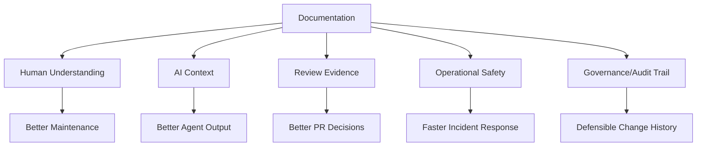
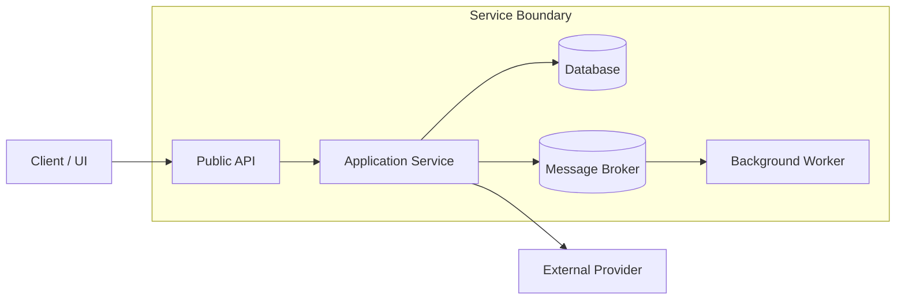
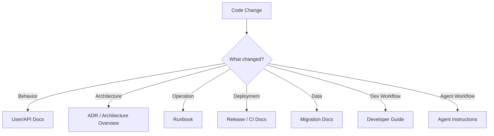
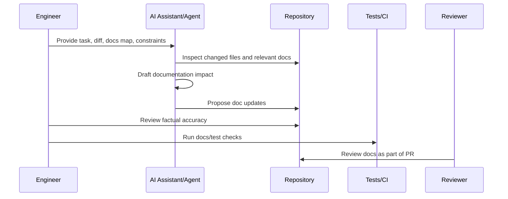
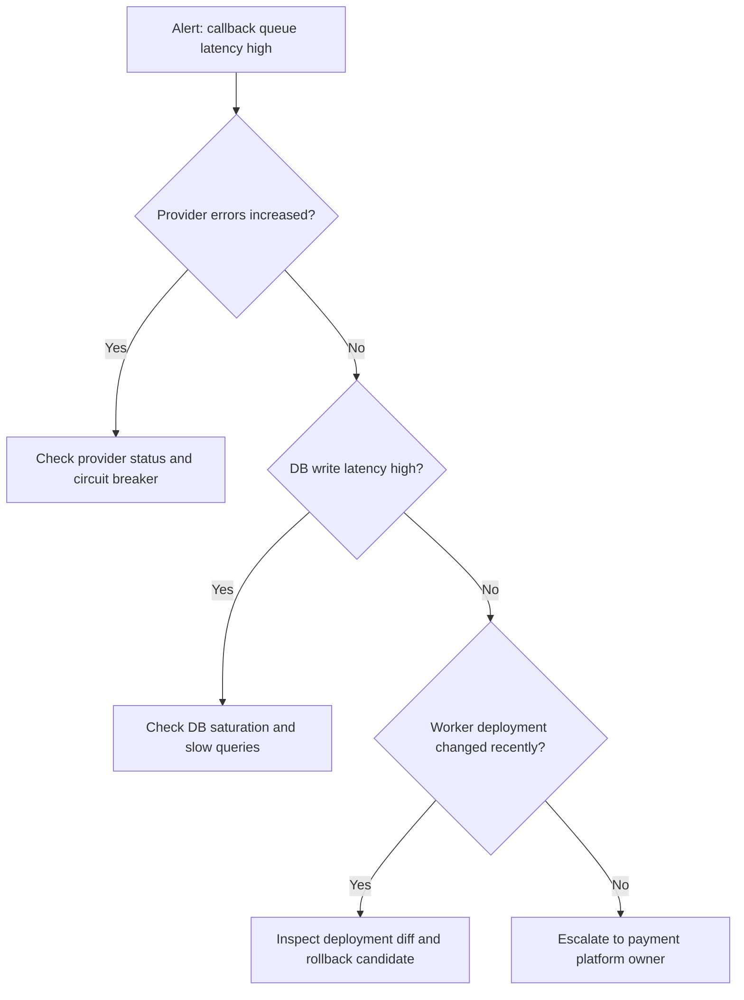
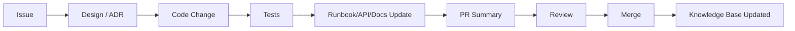
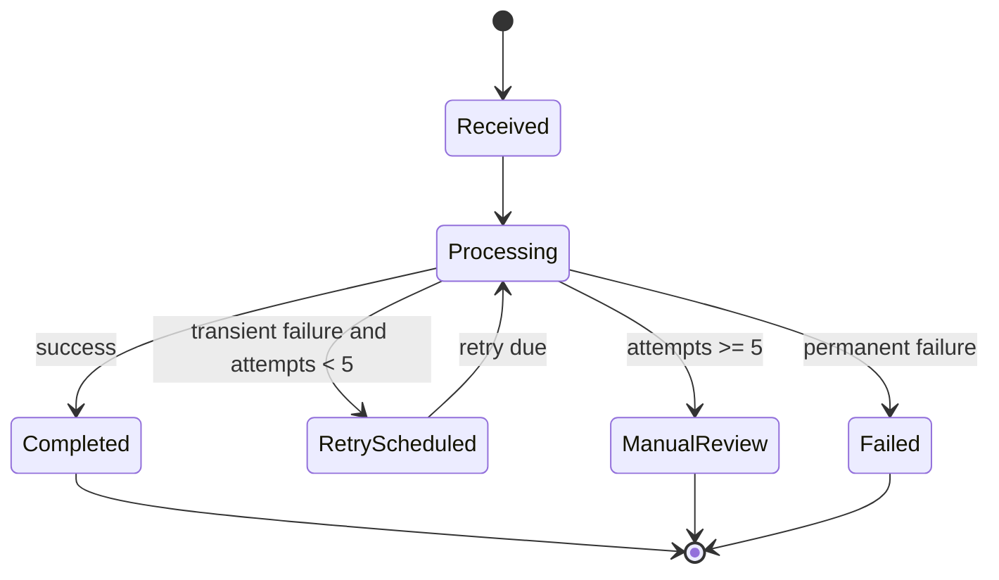

------
title: Learn AI Development Driven Implementation and Usage - Part 025
description: Documentation and knowledge synchronization for AI-assisted software delivery: docs-as-evidence, ADR hygiene, PR summaries, runbooks, onboarding knowledge, and stale-documentation control.
series: learn-ai-development-driven-implementation-usage
seriesTitle: Learn AI Development Driven Implementation and Usage
order: 25
partTitle: Documentation and Knowledge Synchronization
tags:
- ai
- software-engineering
- documentation
- knowledge-management
- adr
- runbook
- mdx
- series
date: 2026-06-30
---

# Part 025 — Documentation and Knowledge Synchronization

> Tujuan bagian ini: membuat dokumentasi menjadi bagian dari delivery system, bukan pekerjaan tambahan setelah implementasi selesai.

Dalam AI-driven development, dokumentasi bukan hanya artefak untuk manusia. Dokumentasi adalah **context substrate** untuk AI agent, reviewer, onboarding engineer, incident responder, auditor, dan future maintainer.

Jika dokumentasi salah, AI akan membawa kesalahan itu ke implementasi. Jika dokumentasi tersebar tanpa kepemilikan, agent akan mengambil konteks yang keliru. Jika PR tidak memperbarui knowledge base, organisasi akan kehilangan alasan desain tepat pada saat perubahan dilakukan.

Bagian ini mengajarkan cara memakai AI untuk:

1. memperbarui dokumentasi tanpa membuat dokumentasi palsu,
2. menjaga sinkronisasi antara code, tests, ADR, runbook, dan issue,
3. menghasilkan knowledge evidence untuk review dan governance,
4. membuat repo lebih mudah dipahami oleh manusia dan AI,
5. mencegah stale documentation menjadi sumber defect.

---

## 1. Kaufman Framing: Skill yang Sebenarnya Dipelajari

Dalam framework Josh Kaufman, kita mulai dengan memecah skill menjadi sub-skill kecil yang bisa dilatih secara sengaja.

Skill utama bagian ini bukan “menulis dokumentasi”. Skill utamanya adalah:

> **Membuat knowledge system yang selalu cukup benar untuk membantu delivery berikutnya.**

Sub-skill-nya:

| Sub-skill | Output yang bisa dinilai |
|---|---|
| Knowledge classification | Bisa membedakan README, ADR, runbook, API doc, decision note, dan onboarding doc |
| Change impact documentation | Bisa menentukan dokumen mana yang harus berubah untuk sebuah PR |
| AI-assisted summarization | Bisa meminta AI membuat ringkasan tanpa mengarang fakta |
| Documentation verification | Bisa mengecek apakah dokumentasi selaras dengan code/test/config |
| ADR hygiene | Bisa mencatat keputusan, alternatif, trade-off, dan konsekuensi |
| Runbook maintenance | Bisa memperbarui operational procedure berdasarkan perubahan sistem |
| Knowledge compression | Bisa meringkas konteks besar menjadi instruction file yang berguna untuk AI |
| Staleness control | Bisa mendeteksi dokumentasi yang sudah tidak cocok dengan sistem |

### 1.1 Target Performa Setelah 20 Jam

Setelah latihan 20 jam, Anda harus bisa:

1. melihat PR dan menentukan dokumentasi apa yang wajib diperbarui,
2. membuat prompt AI untuk menghasilkan PR summary yang faktual dan reviewable,
3. memperbarui ADR tanpa menjadikannya blog post panjang,
4. memperbarui runbook dengan precondition, action, expected signal, rollback, dan escalation,
5. membuat `docs-impact.md` untuk perubahan kompleks,
6. membuat AI-readable knowledge pack untuk repo,
7. membuat checklist CI/review untuk mencegah knowledge drift.

---

## 2. Prinsip Inti: Documentation Is Delivery Evidence

Dokumentasi yang baik bukan dokumentasi yang panjang. Dokumentasi yang baik menjawab pertanyaan yang akan muncul saat sistem berubah, gagal, atau diaudit.

Dalam AI-driven implementation, dokumentasi punya lima fungsi:



Kegagalan dokumentasi biasanya bukan karena tidak ada dokumen. Kegagalan terjadi karena dokumen tidak punya hubungan jelas dengan perubahan.

Contoh buruk:

> “Update docs if needed.”

Contoh baik:

> “Because this PR changes retry behavior for payment callback processing, update the runbook section `payment-callback-retry`, the ADR that explains retry policy, and the API behavior note for duplicate callback handling.”

---

## 3. Knowledge Artifact Taxonomy

AI sering menghasilkan dokumentasi yang terlihat rapi tetapi salah tempat. Untuk menghindari itu, setiap artefak harus punya fungsi yang jelas.

### 3.1 README

README menjawab:

1. repo ini apa,
2. siapa owner-nya,
3. cara menjalankan lokal,
4. command penting,
5. struktur high-level,
6. link ke dokumentasi yang lebih detail.

README bukan tempat untuk seluruh keputusan desain.

### 3.2 Architecture Overview

Architecture overview menjawab:

1. bounded context,
2. komponen utama,
3. dependency eksternal,
4. data flow,
5. failure boundary,
6. security boundary.

Gunakan diagram secukupnya.



### 3.3 ADR

ADR menjawab:

1. keputusan apa yang dibuat,
2. konteksnya apa,
3. alternatif apa yang dipertimbangkan,
4. trade-off apa yang diterima,
5. konsekuensi operasional dan evolusinya.

ADR bukan tempat menulis ulang seluruh design document.

### 3.4 Runbook

Runbook menjawab:

1. kapan dipakai,
2. gejala apa yang dicari,
3. query/log/metric apa yang harus diperiksa,
4. action apa yang boleh dilakukan,
5. action apa yang tidak boleh dilakukan,
6. rollback/forward-fix apa yang aman,
7. kapan escalate.

### 3.5 API Contract Documentation

API doc menjawab:

1. request/response,
2. error model,
3. compatibility rule,
4. idempotency,
5. rate limit,
6. retry semantics,
7. example valid dan invalid.

### 3.6 Developer Guide

Developer guide menjawab:

1. pattern implementasi,
2. convention,
3. local workflow,
4. testing workflow,
5. migration workflow,
6. code review expectation.

### 3.7 Agent Instruction File

Agent instruction file seperti `AGENTS.md`, `CLAUDE.md`, atau repository custom instructions menjawab:

1. cara agent harus bekerja di repo,
2. command yang harus dipakai,
3. path yang harus dihindari,
4. test yang wajib dijalankan,
5. style dan architecture constraints,
6. stop condition dan approval rule.

Ini adalah dokumentasi operasional untuk AI agent, bukan tempat knowledge dump.

---

## 4. Documentation Impact Model

Setiap perubahan software punya blast radius ke dokumentasi.



### 4.1 Change Type to Documentation Mapping

| Change type | Documentation that must be checked |
|---|---|
| New API endpoint | OpenAPI/API doc, README link, contract test note |
| API response changes | API doc, consumer migration note, compatibility ADR |
| New state transition | Domain model doc, state machine diagram, test matrix |
| New background job | Runbook, operational metric, failure handling doc |
| New external integration | Architecture overview, secret/config doc, runbook, ADR |
| DB migration | Migration note, rollback/forward-fix doc, data ownership doc |
| New permission rule | Security doc, policy matrix, audit doc |
| CI/CD workflow change | Developer guide, release runbook, environment doc |
| Refactor only | Usually PR summary; ADR only if boundary or design decision changes |
| Test-only change | Testing guide if it changes testing policy or pattern |

### 4.2 Documentation Impact Statement

Setiap PR kompleks sebaiknya punya bagian:

```md
## Documentation Impact

Updated:
- docs/runbooks/payment-callbacks.md
- docs/architecture/payment-processing.md
- docs/adr/0021-callback-idempotency.md

Not updated:
- public API docs: no request/response contract change
- deployment runbook: no deployment procedure change

Evidence:
- retry behavior changed in `PaymentCallbackProcessor`
- duplicate callback behavior verified by `PaymentCallbackProcessorTest#deduplicatesRepeatedProviderEvent`
```

AI bisa membantu membuat draft ini, tetapi manusia harus memverifikasi evidence-nya.

---

## 5. AI-Assisted Documentation Workflow

Workflow aman untuk dokumentasi AI-driven:



### 5.1 Safe Prompt: PR Documentation Update

```md
You are updating documentation for this repository.

Goal:
- Identify documentation impacted by the current diff.
- Propose minimal, factual updates only.

Rules:
- Do not invent behavior not supported by code, tests, config, or issue text.
- Cite file paths and symbols that support each documentation change.
- Prefer concise updates over broad rewrites.
- Mark uncertainty explicitly.
- If no documentation update is needed, explain why.

Inputs:
- Current git diff
- Relevant README/docs/ADR/runbooks
- Issue acceptance criteria
- Test names added/changed

Output:
1. Documentation impact summary
2. Files that should be updated
3. Proposed edits
4. Evidence per edit
5. Open questions
```

### 5.2 Unsafe Prompt

```md
Update the docs for this change.
```

Masalah:

1. tidak ada scope,
2. tidak ada evidence requirement,
3. tidak ada larangan mengarang,
4. tidak ada target docs,
5. tidak ada stop condition.

---

## 6. PR Summary as Knowledge Compression

PR summary adalah salah satu artefak paling penting dalam AI-driven delivery. Summary yang baik mempercepat review, membantu future archaeology, dan memberi konteks untuk agent berikutnya.

### 6.1 PR Summary Structure

```md
## Summary
- What changed?
- Why did it change?
- What behavior is now different?

## Implementation Notes
- Key files/classes/modules changed
- Important design decisions
- Important non-decisions

## Verification
- Tests run
- Manual checks
- Contract/migration/security checks

## Risk
- Backward compatibility
- Operational impact
- Data impact
- Rollback/forward-fix plan

## Documentation Impact
- Updated docs
- Docs intentionally not updated
```

### 6.2 AI Prompt for PR Summary

```md
Generate a PR summary from the diff.

Constraints:
- Be factual and concise.
- Do not claim tests were run unless logs show they were run.
- Separate code changes from behavior changes.
- Mention compatibility risk explicitly.
- Mention documentation impact explicitly.
- Include uncertainty if evidence is incomplete.

Use this format:
- Summary
- Implementation Notes
- Verification
- Risk
- Documentation Impact
```

### 6.3 Review Smell in AI-Generated PR Summary

| Smell | Why dangerous |
|---|---|
| “Improves robustness” without specifics | Hides actual behavior change |
| “Adds tests” without test names | Weak evidence |
| “No risk” | Usually false for non-trivial changes |
| “Refactors code” when behavior changed | Misleads reviewer |
| “Updates documentation” without file paths | Not auditable |
| “Fixes edge cases” without naming cases | Vague and not reviewable |

---

## 7. ADR with AI

AI sangat berguna untuk membuat draft ADR, tetapi sangat berbahaya jika dibiarkan menulis alasan desain tanpa evidence.

### 7.1 ADR Minimal Template

```md
# ADR-00XX: <Decision Title>

Date: YYYY-MM-DD
Status: Proposed | Accepted | Superseded
Owners: <team/person>

## Context
What problem are we solving?
What constraints matter?
What facts are known?

## Decision
What did we choose?

## Alternatives Considered
1. Option A
2. Option B
3. Option C

## Consequences
Positive:
- ...

Negative / trade-offs:
- ...

Operational impact:
- ...

Security/compliance impact:
- ...

## Validation
How will we know this decision is working?

## Links
- Issue:
- PR:
- Related docs:
```

### 7.2 AI Prompt for ADR Draft

```md
Draft an ADR for this change.

Rules:
- Use only the issue, diff, existing architecture docs, and review comments as evidence.
- Separate facts from assumptions.
- Include at least two rejected alternatives if they are supported by discussion or code context.
- Do not invent business priorities.
- Keep the ADR concise.
- Add open questions if evidence is insufficient.

Decision being documented:
<decision>

Context:
<issue summary + relevant docs + diff summary>
```

### 7.3 ADR Anti-Patterns

| Anti-pattern | Better approach |
|---|---|
| ADR written after months as historical fiction | Write during PR/design review |
| ADR says only “we chose X” | Include rejected alternatives and consequences |
| ADR duplicates code | Link to code, document reasoning |
| ADR has no owner | Add owner/team |
| ADR never superseded | Add status lifecycle |
| AI writes business rationale from imagination | Require evidence and uncertainty markers |

---

## 8. Runbook Synchronization

Runbook is where documentation becomes operational safety.

AI can help draft runbooks by reading code, logs, alerts, and deployment config. But runbooks must be validated against reality.

### 8.1 Runbook Structure

```md
# Runbook: <System / Failure Mode>

## When to Use
Symptoms and alerts that indicate this runbook applies.

## Preconditions
Required access, permissions, environment, and safety checks.

## Signals to Check
Metrics:
- ...

Logs:
- ...

Traces:
- ...

Database / queue checks:
- ...

## Diagnosis Flow
Step-by-step decision tree.

## Remediation
Safe actions.

## Do Not Do
Actions that are unsafe.

## Rollback / Forward Fix
How to recover.

## Escalation
Who to contact and when.

## Post-Incident Documentation
What to update after incident.
```

### 8.2 Runbook Decision Tree Example



### 8.3 AI Prompt for Runbook Update

```md
Update the runbook for this operational behavior change.

Rules:
- Include only actions that are safe for on-call engineers.
- Every remediation step must include expected signal after action.
- Mention required permissions.
- Mention actions that must not be performed.
- Include escalation conditions.
- Do not invent metric names. Use only metrics/log fields present in code/config/docs.

Inputs:
- Diff
- Existing runbook
- Alert rules
- Dashboard links/names
- Relevant logs/metrics names
```

---

## 9. Documentation as AI Context: Knowledge Pack Design

AI agent tidak butuh semua dokumentasi. AI agent butuh dokumentasi yang:

1. ringkas,
2. benar,
3. dekat dengan task,
4. berisi constraints,
5. menunjukkan command yang bisa dijalankan,
6. memiliki path dan symbol yang jelas.

### 9.1 Repository Knowledge Pack

Contoh struktur:

```text
/AGENTS.md
/docs/
  architecture/
    overview.md
    module-boundaries.md
    data-flow.md
  adr/
    0001-use-outbox-for-domain-events.md
    0002-payment-callback-idempotency.md
  runbooks/
    payment-callback-failures.md
    queue-latency.md
  development/
    local-setup.md
    testing.md
    migration-workflow.md
  domain/
    glossary.md
    state-machines.md
```

### 9.2 `AGENTS.md` Should Be Small

A useful agent instruction file should contain:

1. repository purpose,
2. build/test/lint commands,
3. architecture constraints,
4. coding conventions,
5. protected paths,
6. review expectations,
7. links to deeper docs.

It should not contain:

1. full architecture history,
2. massive pasted style guide,
3. outdated known issues,
4. secrets,
5. broad motivational text,
6. ambiguous instruction like “be careful”.

### 9.3 Example Agent Instruction Snippet

```md
# Agent Instructions

## Work Style
- Prefer small, reviewable diffs.
- Do not rewrite unrelated modules.
- Do not modify generated files directly.
- If behavior changes, add or update tests.

## Commands
- Unit tests: `./gradlew test`
- Integration tests: `./gradlew integrationTest`
- Lint: `./gradlew check`

## Architecture Constraints
- Application services must not depend on web controllers.
- Domain objects must not call external services.
- Database migrations must be backward compatible during rolling deploys.

## Protected Paths
- `infra/prod/**`: requires explicit human approval.
- `migrations/**`: requires migration plan in PR.
- `security/**`: requires security reviewer.

## Documentation
- Behavior changes require docs impact statement.
- Architecture decisions require ADR update.
- Operational behavior changes require runbook update.
```

---

## 10. Stale Documentation Detection

Stale docs are worse than missing docs because they create false confidence.

### 10.1 Staleness Signals

| Signal | Possible meaning |
|---|---|
| Docs mention class that no longer exists | Code moved or docs stale |
| README command fails | Local setup docs stale |
| ADR says “temporary” but change remains years later | Decision needs review |
| Runbook references removed metric | Operational docs stale |
| API doc example fails contract test | Public docs stale |
| Diagram omits critical dependency | Architecture doc stale |
| Agent instruction mentions old test command | AI output quality will degrade |

### 10.2 AI Prompt for Staleness Scan

```md
Scan documentation for staleness against the current repository.

Scope:
- README.md
- docs/**/*.md
- AGENTS.md
- .github/copilot-instructions.md

Check for:
- referenced files/classes that do not exist
- commands that look outdated
- links to removed docs
- behavior claims contradicted by tests/code
- diagrams that omit obvious dependencies
- runbook metrics/log fields not found in code/config

Output:
1. Finding
2. Evidence from doc
3. Evidence from code/config/tests
4. Severity
5. Proposed fix
6. Confidence
```

### 10.3 CI Checks for Documentation

Not all documentation can be verified automatically, but some can:

1. link check,
2. markdown lint,
3. code snippet compilation,
4. OpenAPI example validation,
5. Mermaid syntax validation,
6. spell check for domain terms,
7. docs path ownership check,
8. command smoke test for README.

Example CI job concept:

```yaml
name: docs-check

on:
  pull_request:
    paths:
      - 'docs/**'
      - 'README.md'
      - 'AGENTS.md'
      - '.github/copilot-instructions.md'

jobs:
  docs:
    runs-on: ubuntu-latest
    steps:
      - uses: actions/checkout@v4
      - name: Check markdown links
        run: ./scripts/check-doc-links.sh
      - name: Validate mermaid diagrams
        run: ./scripts/check-mermaid.sh
      - name: Validate OpenAPI examples
        run: ./scripts/check-openapi-examples.sh
```

---

## 11. Knowledge Synchronization in the PR Lifecycle

Documentation should not be delayed until after merge.



### 11.1 Before Implementation

Ask:

1. What knowledge already exists?
2. Which docs constrain this implementation?
3. Which ADRs must not be violated?
4. Which runbook will be affected?
5. Which instruction file guides the agent?

### 11.2 During Implementation

Ask:

1. Did behavior change?
2. Did operational behavior change?
3. Did API compatibility change?
4. Did deployment process change?
5. Did local dev workflow change?

### 11.3 Before Review

Ask:

1. Does PR summary match diff?
2. Does documentation impact statement mention all relevant docs?
3. Are docs updated with evidence?
4. Are diagrams still accurate?
5. Are examples tested or plausibly verified?

### 11.4 After Merge

Ask:

1. Did release notes capture user-facing change?
2. Did onboarding docs need update?
3. Did operational dashboards/runbooks need update?
4. Did an ADR need status change?
5. Did agent instructions need update because workflow changed?

---

## 12. AI Documentation Failure Modes

### 12.1 Hallucinated Capability

AI writes:

> “The service retries failed payments three times with exponential backoff.”

But code retries indefinitely or does not retry at all.

Prevention:

1. require file/symbol evidence,
2. ask AI to separate confirmed behavior from inferred behavior,
3. verify against tests/config.

### 12.2 Overgeneralized Architecture

AI writes a generic microservice explanation that does not match the repo.

Prevention:

1. include architecture docs,
2. ask for path-specific references,
3. reject generic claims.

### 12.3 Fake Operational Safety

AI adds remediation steps that sound plausible but are unsafe.

Prevention:

1. runbook remediation requires owner review,
2. include permission requirements,
3. list forbidden actions,
4. link to dashboards/alerts.

### 12.4 Documentation Inflation

AI turns a small change into a long, repetitive document.

Prevention:

1. ask for minimal edits,
2. require diff-based documentation,
3. keep docs close to actual change.

### 12.5 Stale Context Propagation

AI reads old docs and applies outdated rule to new code.

Prevention:

1. docs ownership,
2. staleness scans,
3. issue-specific context packet,
4. timestamps/status in ADR.

---

## 13. Templates You Can Reuse

### 13.1 Documentation Impact Checklist

```md
## Documentation Impact Checklist

Behavior:
- [ ] User-visible behavior changed
- [ ] API behavior changed
- [ ] Error behavior changed
- [ ] State transition changed

Operations:
- [ ] Alerting changed
- [ ] Metrics/logs/traces changed
- [ ] Runbook changed
- [ ] Deployment procedure changed

Data:
- [ ] Schema changed
- [ ] Migration/backfill changed
- [ ] Data retention changed
- [ ] Data ownership changed

Architecture:
- [ ] Boundary changed
- [ ] Dependency changed
- [ ] ADR needed or updated
- [ ] Diagram changed

Developer workflow:
- [ ] Local command changed
- [ ] Test command changed
- [ ] CI/CD workflow changed
- [ ] Agent instructions changed

Evidence:
- [ ] File paths cited
- [ ] Test evidence cited
- [ ] Uncertainty noted
```

### 13.2 Documentation Review Comment Prompt

```md
Review this documentation update as part of a PR.

Check:
- Is every behavior claim supported by code, tests, config, or issue text?
- Are compatibility and operational impacts described accurately?
- Are examples realistic?
- Are commands current?
- Are links valid?
- Is the doc too broad for the change?
- Does the PR summary match the actual diff?

Output only actionable findings.
Use severity: blocker, high, medium, low, nit.
```

### 13.3 Release Note Prompt

```md
Create release notes for this PR.

Rules:
- Focus on user-visible and operator-visible changes.
- Do not include internal refactor unless it changes behavior or risk.
- Mention migration actions if required.
- Mention compatibility impact.
- Mention rollback or forward-fix note if relevant.
- Keep it concise.

Inputs:
- PR summary
- Diff summary
- Documentation impact statement
- Migration notes
```

---

## 14. Documentation Quality Rubric

| Dimension | Weak | Strong |
|---|---|---|
| Accuracy | Sounds plausible | Supported by code/test/config evidence |
| Scope | Broad rewrite | Minimal update tied to change |
| Traceability | No paths/links | Links to issue, PR, files, ADR |
| Operational usefulness | Describes concept | Gives symptoms, checks, actions, escalation |
| AI usefulness | Long prose | Clear constraints, commands, boundaries |
| Maintainability | No owner/status | Owner/status/date/lifecycle present |
| Reviewability | Hard to diff | Small, structured, easy to review |
| Defensibility | Explains result only | Explains rationale and trade-offs |

---

## 15. Worked Example: Payment Callback Retry Change

### 15.1 Change

Requirement:

> Payment callback processing should retry transient provider failures up to five times, then move the callback to manual review.

### 15.2 Documentation Impact

Affected docs:

1. `docs/domain/payment-callback-state-machine.md`
2. `docs/runbooks/payment-callback-failures.md`
3. `docs/adr/0021-payment-callback-retry-policy.md`
4. `AGENTS.md` if new test command or protected migration path is introduced

Not affected:

1. public API docs, if callback endpoint request/response contract does not change,
2. deployment guide, if no new deployment step exists.

### 15.3 State Diagram Update



### 15.4 PR Summary Snippet

```md
## Summary
- Adds bounded retry behavior for transient payment provider callback failures.
- Moves callbacks to manual review after five failed attempts.

## Verification
- Added unit tests for transient retry, max attempts, and permanent failure handling.
- Ran `./gradlew test`.

## Risk
- Operational: callback backlog may increase if provider failure rate spikes.
- Data: no schema migration in this PR.
- Compatibility: public callback API contract unchanged.

## Documentation Impact
- Updated payment callback state machine doc.
- Updated runbook for callback failure triage.
- Updated ADR for retry policy rationale.
```

---

## 16. 20-Hour Practice Plan

### Hour 1–3: Artifact Classification

Take three past PRs. For each PR, classify which docs should have changed.

Output:

1. documentation impact statement,
2. missing docs list,
3. stale docs list.

### Hour 4–6: PR Summary Practice

Use AI to draft PR summaries from diffs. Manually score:

1. factual accuracy,
2. missing risk,
3. vague claims,
4. unsupported test claims.

### Hour 7–9: ADR Practice

Pick two design decisions from past work. Draft ADRs using AI, then reduce them to one page.

Focus:

1. alternatives,
2. trade-offs,
3. operational consequences.

### Hour 10–12: Runbook Practice

Pick one operational failure mode. Ask AI to draft runbook, then validate each command, metric, and remediation step.

### Hour 13–15: Staleness Scan

Run AI-assisted staleness scan over README, docs, and agent instructions. Fix at least five findings.

### Hour 16–18: Knowledge Pack Creation

Create or improve:

1. `AGENTS.md`,
2. architecture overview,
3. testing guide,
4. runbook index,
5. ADR index.

### Hour 19–20: End-to-End PR

Make a small behavior change and include:

1. tests,
2. PR summary,
3. docs impact statement,
4. relevant doc update,
5. review checklist.

---

## 17. Senior Engineer Heuristics

1. A PR without documentation impact analysis is incomplete if behavior, operation, API, data, or architecture changed.
2. AI documentation must cite evidence; otherwise it is polished speculation.
3. README is for entry, ADR is for decision, runbook is for operation, API doc is for contract.
4. Long documentation is not automatically better; dense, traceable documentation is better.
5. Agent instruction files should be curated, not dumped.
6. Stale docs are production risk.
7. Documentation review is code review for organizational memory.
8. The best documentation update is small, timely, and tied to the diff.

---

## 18. Completion Checklist

You understand this part when you can:

- [ ] classify documentation types correctly,
- [ ] decide which docs are impacted by a PR,
- [ ] use AI to draft PR summaries with evidence,
- [ ] update ADRs without hallucinating decisions,
- [ ] update runbooks with safe operational steps,
- [ ] design an AI-readable repository knowledge pack,
- [ ] detect stale documentation,
- [ ] add documentation gates to PR review,
- [ ] prevent AI from turning docs into generic prose.

---

## References

- Diátaxis documentation framework: https://diataxis.fr/
- Architecture Decision Records overview by Michael Nygard: https://cognitect.com/blog/2011/11/15/documenting-architecture-decisions
- GitHub Copilot repository custom instructions: https://docs.github.com/copilot/customizing-copilot/adding-repository-custom-instructions-for-github-copilot
- OpenAI Codex AGENTS.md guide: https://developers.openai.com/codex/guides/agents-md
- Model Context Protocol introduction: https://modelcontextprotocol.io/docs/getting-started/intro
- Google Engineering Practices: code review developer guide: https://google.github.io/eng-practices/review/

---

Part 025 selesai. Seri belum selesai. Lanjut ke Part 026: Human-AI Collaboration Patterns.
