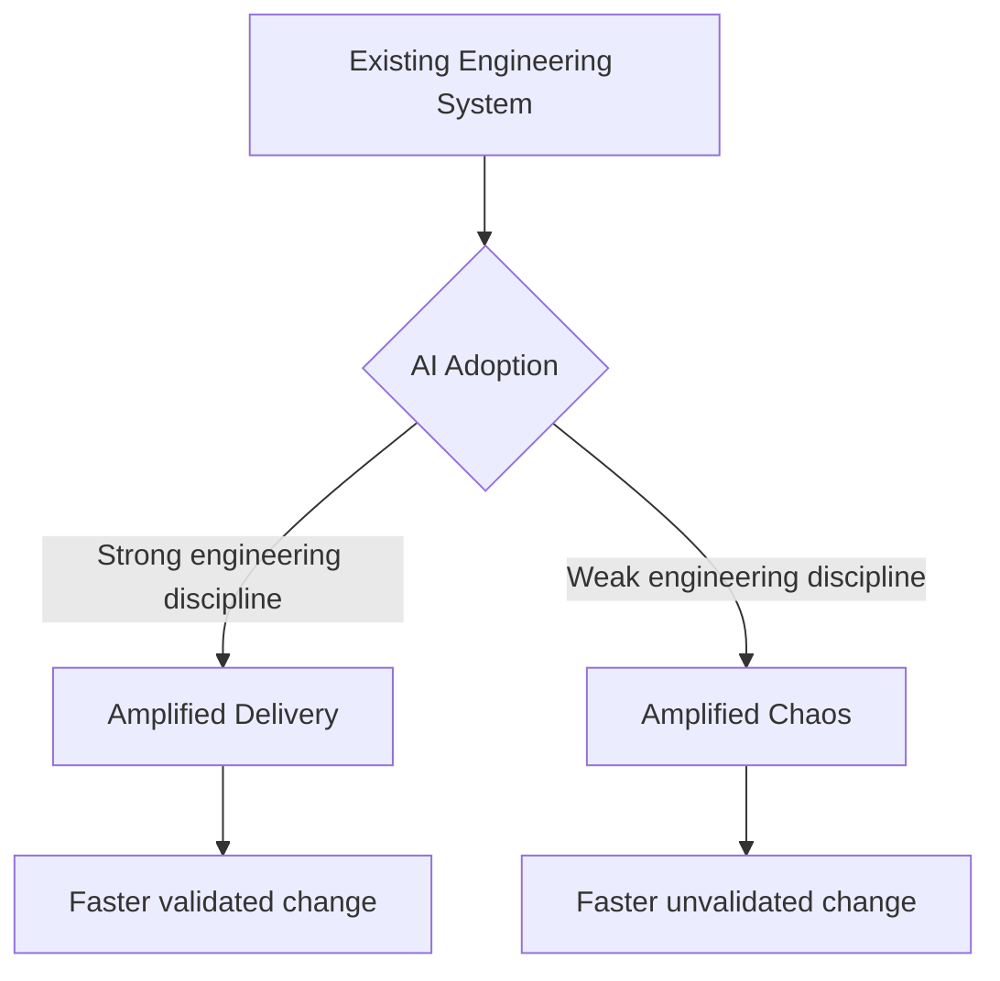
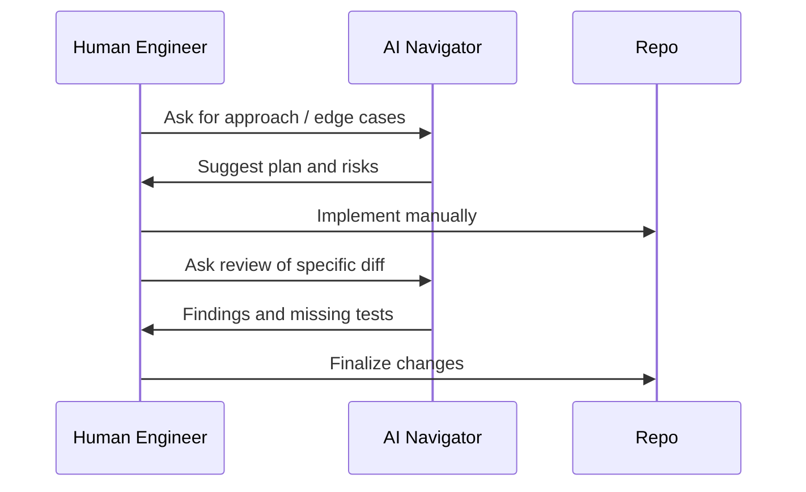
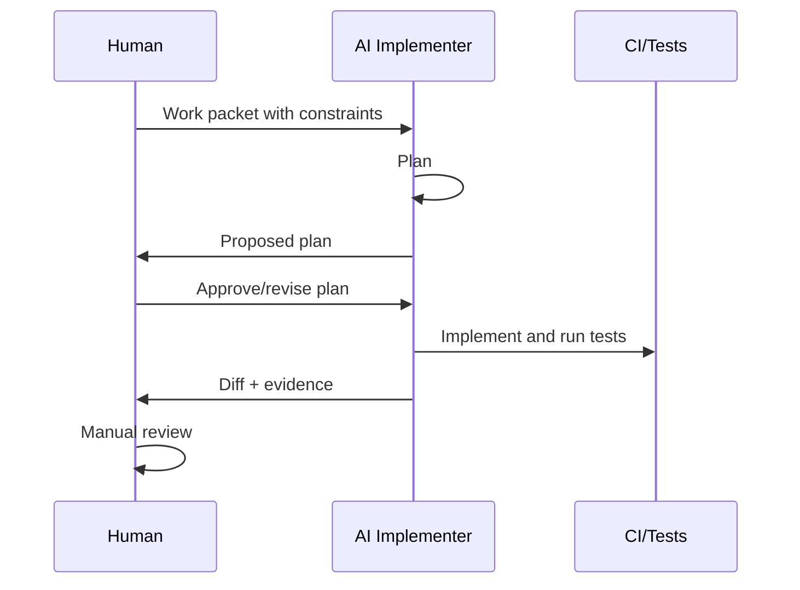
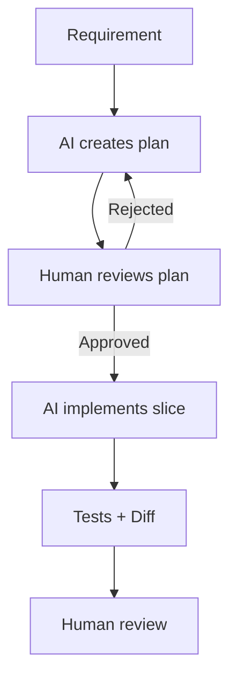
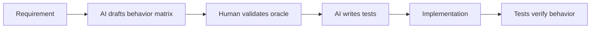
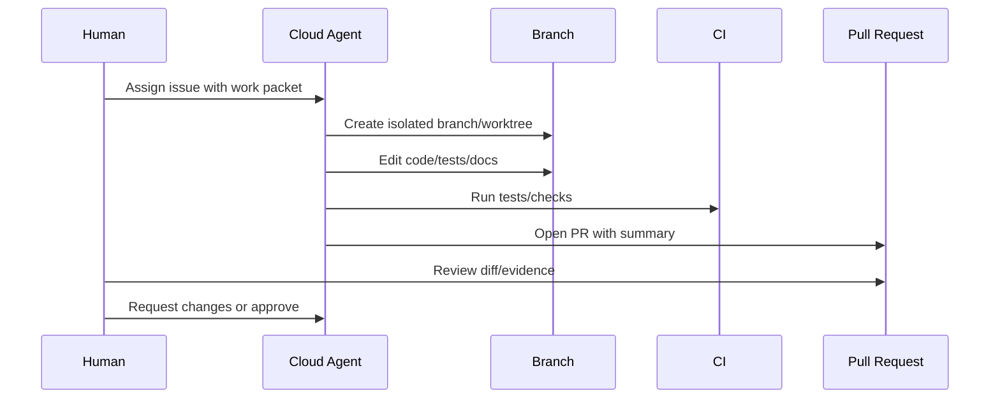
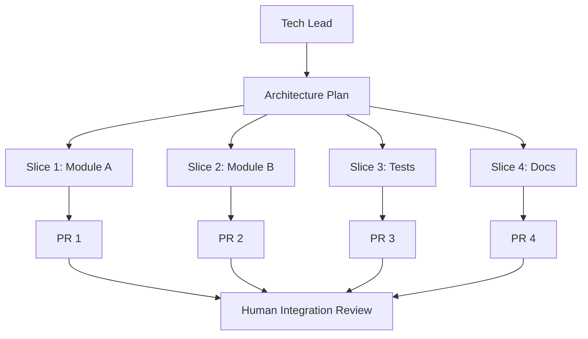
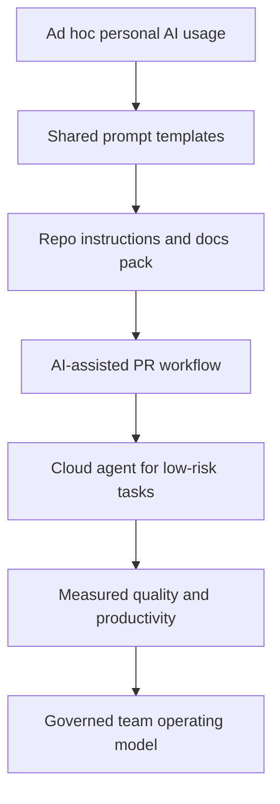

------
title: Learn AI Development Driven Implementation and Usage - Part 026
description: Human-AI collaboration patterns for advanced software engineers: role design, delegation, supervisory engineering, review loops, team operating models, and anti-patterns.
series: learn-ai-development-driven-implementation-usage
seriesTitle: Learn AI Development Driven Implementation and Usage
order: 26
partTitle: Human-AI Collaboration Patterns
tags:
- ai
- software-engineering
- collaboration
- engineering-leadership
- agentic-coding
- code-review
- delivery
- series
date: 2026-06-30
---

# Part 026 — Human-AI Collaboration Patterns

> Tujuan bagian ini: memahami pola kerja manusia + AI yang efektif untuk delivery software nyata, bukan sekadar “pakai AI biar cepat”.

AI-assisted development mengubah pekerjaan engineer. Bukan hanya dari menulis code menjadi “meminta AI menulis code”, tetapi dari **creation-heavy engineering** menjadi **supervisory engineering**: mengarahkan, membatasi, mengevaluasi, mengoreksi, dan mengintegrasikan output AI.

Senior engineer tidak dinilai dari seberapa banyak prompt yang ditulis. Senior engineer dinilai dari apakah sistem yang dikirim:

1. benar secara behavior,
2. aman secara operasional,
3. defensible secara review,
4. bisa dipelihara,
5. tidak merusak ownership tim,
6. memperbaiki learning loop organisasi.

Bagian ini membahas pola kolaborasi manusia-AI yang bisa dipakai oleh engineer individu, tech lead, dan team lead.

---

## 1. Kaufman Framing: Skill yang Sebenarnya Dipelajari

Skill utama bagian ini adalah:

> **Mengorkestrasi AI sebagai collaborator yang terkendali, bukan mengganti engineering judgment.**

Sub-skill-nya:

| Sub-skill | Output yang bisa dinilai |
|---|---|
| Role assignment | Bisa menentukan kapan AI menjadi researcher, planner, implementer, reviewer, atau tester |
| Delegation design | Bisa membuat work packet yang aman untuk agent |
| Review control | Bisa mengevaluasi output AI secara sistematis |
| Collaboration loop | Bisa memilih loop kerja yang cocok dengan risiko task |
| Human accountability | Bisa menentukan keputusan yang tetap wajib dipegang manusia |
| Team operating model | Bisa membuat rule tim untuk penggunaan AI |
| Escalation pattern | Bisa tahu kapan AI harus berhenti dan manusia harus ambil alih |
| Learning preservation | Bisa mencegah skill atrophy dan cognitive offloading |

### 1.1 Target Performa Setelah 20 Jam

Setelah latihan 20 jam, Anda harus bisa:

1. memilih collaboration pattern untuk sebuah task,
2. membuat delegation packet untuk AI agent,
3. membatasi autonomy berdasarkan risk level,
4. menjalankan AI pair programming tanpa blind acceptance,
5. menjalankan cloud-agent task tanpa kehilangan review control,
6. memakai AI sebagai reviewer tanpa menjadikannya final authority,
7. membuat team working agreement untuk AI usage,
8. mendeteksi anti-pattern seperti vibe coding, review theater, dan agent sprawl.

---

## 2. Core Mental Model: AI Is a Force Multiplier, Not a Responsibility Sink

AI dapat memperbesar kemampuan tim. Tetapi AI juga memperbesar kelemahan tim.

Tim yang sudah punya:

1. requirement jelas,
2. test kuat,
3. architecture boundary jelas,
4. code review disiplin,
5. CI/CD sehat,
6. ownership jelas,

akan mendapatkan leverage besar.

Tim yang punya:

1. requirement kabur,
2. test rapuh,
3. architecture spaghetti,
4. review asal merge,
5. deployment manual,
6. ownership tidak jelas,

akan mendapatkan output yang lebih cepat tetapi lebih berisiko.



Prinsip dasar:

> AI boleh mempercepat pekerjaan. AI tidak boleh menghapus accountability.

---

## 3. Collaboration Role Taxonomy

AI bisa memainkan beberapa peran. Kesalahan umum adalah memakai satu mode untuk semua task.

### 3.1 AI as Researcher

Tugas:

1. membaca repo,
2. mencari file relevan,
3. menjelaskan behavior saat ini,
4. membandingkan opsi,
5. menemukan precedent.

Baik untuk:

1. legacy exploration,
2. onboarding,
3. impact analysis,
4. unknown codebase.

Risiko:

1. salah memahami behavior,
2. melewatkan hidden coupling,
3. menyimpulkan dari nama file tanpa evidence.

Human control:

1. minta path/symbol evidence,
2. validasi dengan test/log,
3. jangan langsung implementasi dari hasil riset.

### 3.2 AI as Planner

Tugas:

1. memecah requirement,
2. membuat implementation plan,
3. membuat test plan,
4. menentukan docs impact,
5. mengidentifikasi risk.

Baik untuk:

1. non-trivial feature,
2. refactor,
3. migration,
4. debugging.

Risiko:

1. plan terlihat rapi tapi tidak cocok repo,
2. lupa constraint non-functional,
3. membuat scope terlalu besar.

Human control:

1. review plan sebelum coding,
2. paksa slice kecil,
3. tambahkan negative scope.

### 3.3 AI as Implementer

Tugas:

1. mengubah code,
2. menambahkan tests,
3. memperbarui docs,
4. memperbaiki compile/test failure.

Baik untuk:

1. small feature,
2. repetitive changes,
3. test generation,
4. mechanical refactor,
5. migration boilerplate.

Risiko:

1. over-edit,
2. invented abstraction,
3. weak tests,
4. silent behavior change,
5. generated complexity.

Human control:

1. diff kecil,
2. test evidence,
3. code review manual,
4. explicit stop condition.

### 3.4 AI as Reviewer

Tugas:

1. membaca diff,
2. menemukan risk,
3. mengecek consistency,
4. mencari missing tests,
5. melihat documentation gap.

Baik untuk:

1. second-pass review,
2. checklist enforcement,
3. broad scan,
4. security smell detection.

Risiko:

1. false positive noise,
2. false negative confidence,
3. style nit over substance,
4. missed domain invariant.

Human control:

1. AI reviewer bukan final approver,
2. severity model harus jelas,
3. actionability harus wajib.

### 3.5 AI as Tester

Tugas:

1. menghasilkan test scenarios,
2. membuat unit tests,
3. mencari edge cases,
4. memperbaiki flaky tests,
5. menjalankan mutation-style thinking.

Baik untuk:

1. behavior matrix,
2. boundary condition,
3. regression cases,
4. property-based ideas.

Risiko:

1. test mirrors implementation,
2. assertion lemah,
3. mocks berlebihan,
4. test theater.

Human control:

1. review oracle,
2. pastikan test gagal sebelum fix bila memungkinkan,
3. cek negative cases.

### 3.6 AI as Operator Assistant

Tugas:

1. menganalisis logs,
2. merangkum incident,
3. menyusun runbook update,
4. mengecek deployment diff,
5. menulis rollback note.

Baik untuk:

1. incident support,
2. CI/CD failure analysis,
3. release preparation.

Risiko:

1. salah memberi remediation,
2. mengakses data sensitif,
3. menyederhanakan failure mode kompleks.

Human control:

1. read-only mode default,
2. no production mutation without approval,
3. audit logging.

---

## 4. Collaboration Pattern Catalog

### Pattern 1: Human Driver, AI Navigator

Manusia menulis code. AI memberi saran, mencari edge case, dan menjelaskan trade-off.



Cocok untuk:

1. domain logic kritis,
2. security-sensitive code,
3. unfamiliar high-risk area,
4. production incident fix.

Kelebihan:

1. manusia tetap memahami detail,
2. risiko blind acceptance rendah,
3. baik untuk learning.

Kekurangan:

1. lebih lambat,
2. tidak memanfaatkan autonomy penuh.

Gunakan ketika correctness lebih penting dari speed.

---

### Pattern 2: AI Driver, Human Reviewer

AI membuat patch. Manusia mengarahkan dan mereview.



Cocok untuk:

1. low-to-medium risk feature,
2. repetitive code,
3. test scaffolding,
4. documentation update,
5. mechanical migration.

Kelebihan:

1. cepat,
2. mengurangi boilerplate,
3. output reviewable bila scope kecil.

Kekurangan:

1. mudah over-edit,
2. reviewer bisa menjadi bottleneck,
3. pemahaman manusia bisa menurun jika tidak membaca diff.

Rule:

> AI boleh menjadi driver hanya jika work packet jelas dan review gate kuat.

---

### Pattern 3: Planner-Implementer Split

Satu interaksi AI digunakan untuk planning. Interaksi lain untuk implementasi berdasarkan plan yang sudah disetujui.



Cocok untuk:

1. feature dengan banyak file,
2. refactor,
3. migration,
4. complex bug fix.

Kenapa efektif:

1. memisahkan reasoning dari editing,
2. mengurangi agent drift,
3. memudahkan stop condition,
4. reviewer bisa menangkap scope creep lebih awal.

Prompt planning:

```md
Create an implementation plan only. Do not edit files.

Include:
- Current behavior evidence
- Proposed behavior
- Files likely to change
- Tests to add/update
- Documentation impact
- Risks
- Open questions
- Suggested slice order

Stop after the plan.
```

Prompt implementation:

```md
Implement only Slice 1 from the approved plan.

Rules:
- Do not implement later slices.
- Keep diff minimal.
- Add/update tests for this slice.
- Run relevant tests.
- Report changed files and evidence.
- Stop if you discover the plan is wrong.
```

---

### Pattern 4: Reviewer-First Development

AI mereview design atau planned diff sebelum implementasi.

Cocok untuk:

1. risky design,
2. API compatibility,
3. database migration,
4. security-sensitive change.

Workflow:

1. manusia menulis plan,
2. AI mencari missing risk,
3. manusia memperbaiki plan,
4. implementasi baru dimulai.

Prompt:

```md
Review this implementation plan before any code is written.

Look for:
- Hidden compatibility risk
- Missing tests
- Missing rollback/forward-fix plan
- Data migration risk
- Operational impact
- Security risk
- Ambiguous assumptions
- Scope too large for one PR

Return only actionable findings.
```

Kelebihan:

1. murah menemukan masalah sebelum code ditulis,
2. mengurangi rework,
3. membuat reviewer manusia lebih cepat.

---

### Pattern 5: Test-Oracle First

AI digunakan untuk membuat test matrix dan oracle sebelum implementasi.

Cocok untuk:

1. business rules,
2. state machine,
3. calculation logic,
4. policy enforcement,
5. regulatory workflows.

Workflow:



Prompt:

```md
Before implementation, derive a behavior matrix.

For each scenario include:
- Preconditions
- Input/event
- Expected state/output
- Negative cases
- Invariants
- Suggested test name

Do not write implementation yet.
```

Kelebihan:

1. mencegah AI menulis test yang hanya mengikuti implementation,
2. membuat expectation eksplisit,
3. sangat cocok untuk workflow/stateful domain.

---

### Pattern 6: Cloud Agent with Human Gate

AI cloud agent bekerja di branch/sandbox terpisah dan mengirim PR.

Cocok untuk:

1. well-scoped issue,
2. docs update,
3. low-risk feature,
4. CI fix,
5. dependency update,
6. repetitive migration.

Workflow:



Human gate wajib untuk:

1. production config,
2. database migration,
3. security-sensitive paths,
4. public API contract,
5. access control logic,
6. domain-critical workflows.

---

### Pattern 7: Dual-Agent Cross Check

Satu AI membuat patch. AI lain mereview patch dengan instruksi berbeda.

Cocok untuk:

1. complex changes,
2. security review,
3. migration plan,
4. architecture decision.

Workflow:

1. Agent A implements.
2. Agent B reviews as skeptic.
3. Human reviews both diff and findings.

Prompt untuk reviewer:

```md
Review this diff as a skeptical senior engineer.

Assume the implementation may be subtly wrong.
Look for:
- Behavior mismatch with requirement
- Missing tests
- Hidden compatibility breaks
- Overbroad changes
- Security risk
- Operational risk
- Documentation gap

Do not praise. Return actionable issues only.
```

Caveat:

AI reviewer tidak independen sepenuhnya jika menggunakan konteks dan bias yang sama. Tetap butuh human review.

---

### Pattern 8: Human Architect, AI Workstream Executors

Tech lead membuat architecture plan dan memecah task. Beberapa AI agent mengerjakan slice terpisah.

Cocok untuk:

1. large mechanical migration,
2. modular refactor,
3. docs modernization,
4. test backfill,
5. dependency upgrade.



Risiko:

1. duplicated abstractions,
2. inconsistent implementation style,
3. merge conflicts,
4. architectural drift,
5. review overload.

Mitigation:

1. shared design doc,
2. strict slice boundaries,
3. PR order,
4. integration owner,
5. common test suite,
6. common review rubric.

---

## 5. Autonomy Levels

AI collaboration harus punya level autonomy yang eksplisit.

| Level | AI can | Human must |
|---|---|---|
| L0 Assist | Explain, suggest, summarize | Implement and decide |
| L1 Draft | Draft code/docs/tests | Edit and apply manually |
| L2 Patch | Modify local files | Review diff before commit |
| L3 Branch | Commit to isolated branch | Review PR before merge |
| L4 Agent PR | Create PR with tests/docs | Approve/reject merge |
| L5 Controlled merge | Merge low-risk changes under policy | Define policy and audit |

Untuk banyak organisasi, L3/L4 adalah batas praktis yang sehat. L5 hanya masuk akal untuk perubahan low-risk dengan deterministic gates kuat.

### 5.1 Autonomy Decision Matrix

| Risk dimension | Low autonomy required when... |
|---|---|
| Security | auth, permission, secrets, crypto, injection handling |
| Data | migration, deletion, retention, financial/legal records |
| API | public contract, compatibility, event schema |
| Operations | deployment, infra, alerting, rollback |
| Domain | regulatory decision, enforcement action, monetary state |
| Scale | high-throughput/concurrency-sensitive path |
| Uncertainty | unclear requirement or unknown code ownership |

Rule:

> Autonomy should decrease as reversibility decreases.

---

## 6. Delegation Packet

AI delegation gagal ketika task diberikan seperti pesan chat biasa.

Delegation packet yang baik punya struktur:

```md
# AI Work Packet

## Goal
What outcome is required?

## Scope
Files/modules likely in scope.

## Out of Scope
What must not be changed.

## Current Behavior
Evidence from code/tests/docs.

## Desired Behavior
Acceptance criteria.

## Constraints
Architecture, security, compatibility, performance.

## Tests
Required test additions/updates and commands.

## Documentation
Docs impact expectation.

## Risk
Known risk and review focus.

## Stop Conditions
When the agent must stop and ask for human review.

## Output Required
Plan, diff summary, test evidence, open questions.
```

### 6.1 Stop Conditions

AI must stop when:

1. requirement conflicts with existing tests,
2. implementation needs schema migration not mentioned in task,
3. protected path needs change,
4. public API compatibility may break,
5. test cannot be run,
6. dependency upgrade is required,
7. secret/config is missing,
8. ambiguity affects behavior,
9. diff grows beyond expected scope.

---

## 7. Human Responsibilities That Should Not Be Delegated Blindly

AI can propose. Human must own:

1. product/domain decision,
2. legal/regulatory interpretation,
3. security exception,
4. production risk acceptance,
5. architecture boundary change,
6. destructive data migration,
7. public API breaking change,
8. incident remediation in production,
9. final merge accountability.

A useful rule:

> AI can produce evidence. Humans accept risk.

---

## 8. Team Operating Model for AI Usage

Individual skill is not enough. Team rules matter.

### 8.1 AI Working Agreement

```md
# Team AI Working Agreement

## Allowed
- Use AI for exploration, test generation, refactoring proposals, documentation drafts, and low-risk implementation.
- Use cloud agents only on isolated branches.
- Use AI review as a second reviewer, not final approval.

## Requires Human Review
- API contract changes
- Database migrations
- Auth/permission/security logic
- Production infrastructure
- Regulatory/business rule changes
- Public documentation

## Not Allowed
- Paste secrets into AI tools
- Let AI modify production config without approval
- Merge AI-generated changes without reading diff
- Claim tests passed unless logs prove it
- Accept generated tests without reviewing assertions

## Required Evidence
- PR summary
- Test commands and results
- Documentation impact statement
- Risk note for non-trivial changes
```

### 8.2 Team AI Usage Rubric

| Question | Good answer |
|---|---|
| What task types can AI handle independently? | Low-risk, reversible, well-tested tasks |
| What requires human approval? | High-risk, irreversible, domain-sensitive tasks |
| How are AI changes labeled? | PR template or label |
| What evidence is required? | tests, summary, docs impact, risk |
| How is quality measured? | defect escape, rework, review time, CI failure |
| How is learning preserved? | engineers explain accepted AI changes |

---

## 9. Collaboration Anti-Patterns

### 9.1 Vibe Coding

Symptom:

1. prompt vague,
2. diff large,
3. engineer cannot explain change,
4. tests weak,
5. “it seems to work”.

Fix:

1. use work packet,
2. reduce slice size,
3. require explanation and evidence,
4. review behavior before style.

### 9.2 Review Theater

Symptom:

1. AI-generated PR gets superficial human approval,
2. reviewer reads summary only,
3. tests pass but assertions are weak,
4. no one owns risk.

Fix:

1. require reviewer to inspect core diff,
2. require test oracle review,
3. add high-risk path owners,
4. add docs impact review.

### 9.3 Agent Sprawl

Symptom:

1. many agents/tools with overlapping permissions,
2. no central policy,
3. inconsistent instructions,
4. audit trail missing.

Fix:

1. define approved tools,
2. centralize instruction files,
3. permission profiles,
4. audit events,
5. periodic review.

### 9.4 Cognitive Offloading

Symptom:

1. engineer accepts code without understanding,
2. skill declines,
3. debugging becomes harder,
4. architecture knowledge disappears.

Fix:

1. require explanation of accepted changes,
2. pair review,
3. rotate manual implementation,
4. practice without AI periodically,
5. use AI as tutor, not crutch.

### 9.5 AI as Manager

Symptom:

1. AI decides priority,
2. AI decides risk acceptance,
3. AI decides architecture direction,
4. human follows tool output.

Fix:

1. human owns prioritization,
2. AI provides options and evidence,
3. decision log requires human owner.

---

## 10. Collaboration by Task Type

| Task type | Recommended pattern | Autonomy |
|---|---|---|
| Unknown legacy behavior | AI researcher + human driver | L0-L1 |
| Simple bug fix with strong test | AI driver + human reviewer | L2-L3 |
| Security-sensitive fix | Human driver + AI navigator | L0-L1 |
| Documentation update | AI driver + human reviewer | L2-L4 |
| Mechanical refactor | Planner-implementer split | L2-L4 |
| Database migration | Reviewer-first + human driver | L0-L2 |
| Test backfill | Test-oracle first | L1-L3 |
| CI failure repair | AI implementer with evidence | L2-L4 |
| API compatibility change | Reviewer-first + contract tests | L1-L2 |
| Incident response | AI operator assistant, read-only | L0-L1 |

---

## 11. Staff/Tech Lead Pattern: AI as Throughput Multiplier

A tech lead should not simply tell everyone “use AI”. The tech lead should design a delivery system where AI improves throughput without reducing quality.

### 11.1 Lead Responsibilities

1. define approved AI workflows,
2. create repo instructions,
3. define protected paths,
4. define review rubrics,
5. improve tests/CI to support AI safely,
6. create prompt/work packet templates,
7. measure outcomes,
8. coach engineers on supervisory work.

### 11.2 AI Adoption Ladder



Do not jump from A to E. Without C and D, cloud agents amplify inconsistency.

---

## 12. Review Loop Design

AI collaboration quality depends on feedback loops.

### 12.1 Fast Loop

Used for:

1. small local edits,
2. syntax fixes,
3. test generation,
4. explanation.

Loop:

```text
prompt -> patch -> run focused test -> inspect diff -> adjust
```

### 12.2 Slow Loop

Used for:

1. architecture changes,
2. migration,
3. security-sensitive code,
4. API changes.

Loop:

```text
requirement -> plan -> review -> slice -> implement -> test -> docs -> review -> merge
```

### 12.3 Escalation Loop

Used when AI gets stuck.

Stop signs:

1. repeated failed patches,
2. growing diff,
3. contradictory explanation,
4. test failures unrelated to task,
5. invented dependencies,
6. workaround without root cause.

Action:

1. stop generation,
2. reset context,
3. inspect manually,
4. create smaller work packet,
5. resume only after hypothesis is clear.

---

## 13. Prompt Patterns for Collaboration

### 13.1 Ask AI to Be a Skeptic

```md
Act as a skeptical senior engineer.
Do not implement.
Review this plan for hidden risk.
Return only concrete issues with evidence and suggested correction.
```

### 13.2 Ask AI to Stay Within Slice

```md
Implement only the requested slice.
Do not refactor unrelated code.
Do not rename public symbols unless required.
Stop if additional architectural changes appear necessary.
```

### 13.3 Ask AI to Teach While Working

```md
Explain each non-obvious change in terms of:
- current behavior
- desired behavior
- why this file is the right place
- test that proves it
```

### 13.4 Ask AI to Separate Facts from Assumptions

```md
Classify each statement as:
- Confirmed by code/test/config
- Inferred from naming or structure
- Assumption requiring human confirmation
```

### 13.5 Ask AI to Produce Reviewer Evidence

```md
After implementation, report:
- changed files
- behavior changed
- tests added/updated
- commands run
- failures encountered
- docs updated
- remaining risk
```

---

## 14. Measuring Collaboration Quality

Do not measure only “lines of code generated”. That creates bad incentives.

Better metrics:

| Metric | What it reveals |
|---|---|
| PR lead time | Delivery speed |
| Review cycle count | Clarity and quality |
| Defect escape rate | Real quality |
| Rework rate | Prompt/task quality |
| CI failure after AI patch | Verification quality |
| Test assertion quality | Confidence, not just coverage |
| Documentation impact completeness | Knowledge synchronization |
| Engineer explanation quality | Learning preservation |
| Cost per accepted PR | Economic viability |

### 14.1 Qualitative Review Questions

After an AI-assisted PR, ask:

1. Could the engineer explain the change?
2. Did AI reduce toil or introduce review burden?
3. Were tests meaningful?
4. Was the diff smaller or larger than necessary?
5. Did the task need better slicing?
6. Did docs stay synchronized?
7. Did the team learn reusable knowledge?

---

## 15. Human-AI Collaboration in Regulated or High-Risk Systems

For regulated systems, AI collaboration must preserve defensibility.

### 15.1 Required Evidence

1. issue / requirement source,
2. decision owner,
3. implementation diff,
4. test evidence,
5. risk assessment,
6. review approval,
7. documentation update,
8. audit trail for AI-generated changes if required by policy.

### 15.2 What AI Can Safely Help With

1. summarizing requirement,
2. generating test scenarios,
3. identifying edge cases,
4. drafting docs,
5. comparing design options,
6. scanning for missing evidence,
7. generating non-authoritative review comments.

### 15.3 What Needs Human Decision

1. enforcement policy interpretation,
2. exception handling,
3. risk acceptance,
4. legal meaning,
5. production rollout timing,
6. customer/regulator communication.

---

## 16. Worked Example: Enforcement Case Escalation Rule

### 16.1 Requirement

> If a case remains unresolved after 14 calendar days and has two failed contact attempts, escalate to supervisor review unless the case is already under legal hold.

### 16.2 Collaboration Pattern

Recommended pattern:

1. Test-oracle first,
2. Planner-implementer split,
3. Human driver for domain decision,
4. AI reviewer for edge case scan.

### 16.3 AI Behavior Matrix Prompt

```md
Create a behavior matrix for this escalation rule.

Include:
- Case age boundary: 13, 14, 15 days
- Failed contact attempts: 0, 1, 2, 3
- Legal hold true/false
- Existing supervisor review true/false
- Expected state transition
- Invariants
- Suggested test names

Do not implement.
```

### 16.4 Human Review Focus

1. Does “14 calendar days” use local time, UTC, or case jurisdiction time?
2. Does failed contact include bounced email or only phone attempts?
3. What if legal hold starts after escalation is scheduled?
4. Is escalation idempotent?
5. What audit event is required?

### 16.5 Implementation Delegation Packet

```md
Implement the escalation rule only after the behavior matrix is accepted.

Scope:
- Case escalation policy module
- Existing scheduler/job if already present
- Tests for boundary conditions

Out of scope:
- UI changes
- Notification redesign
- Legal hold model redesign
- Database schema changes unless already required by existing model

Required tests:
- 13 days + 2 failed attempts -> no escalation
- 14 days + 2 failed attempts -> escalation
- 15 days + legal hold -> no escalation
- existing supervisor review -> no duplicate escalation
- audit event emitted once

Stop if:
- timezone semantics are not represented in current code
- failed contact definition is ambiguous
- schema change is needed
```

---

## 17. 20-Hour Practice Plan

### Hour 1–2: Role Classification

Take ten past tasks. Classify which AI role would be safe:

1. researcher,
2. planner,
3. implementer,
4. reviewer,
5. tester,
6. operator assistant.

### Hour 3–5: Work Packet Practice

Write five AI work packets for real or sample tasks. Score them on:

1. clarity,
2. scope,
3. negative scope,
4. tests,
5. stop conditions.

### Hour 6–8: Planner-Implementer Split

Use AI to plan a small change. Review the plan. Then ask AI to implement only one slice.

Measure:

1. diff size,
2. plan adherence,
3. test quality,
4. review effort.

### Hour 9–11: Test-Oracle First

Pick business logic. Ask AI for behavior matrix. Manually correct it. Then generate tests.

Focus:

1. boundary cases,
2. negative cases,
3. invariants,
4. assertion quality.

### Hour 12–14: AI Review Practice

Give AI a diff and ask for skeptical review. Compare findings to your own review.

Track:

1. true positives,
2. false positives,
3. false negatives,
4. useful prompts.

### Hour 15–17: Cloud Agent Simulation

Create a small isolated branch task. Treat AI as cloud agent:

1. work packet,
2. branch,
3. implementation,
4. test evidence,
5. PR summary,
6. human review.

### Hour 18–20: Team Operating Model

Draft team AI working agreement:

1. allowed use,
2. disallowed use,
3. required review,
4. protected paths,
5. metrics,
6. escalation.

Review it with at least one engineer.

---

## 18. Senior Engineer Heuristics

1. Use AI to increase leverage, not to outsource judgment.
2. The more irreversible the change, the less autonomy AI should have.
3. Make AI explain evidence, not confidence.
4. Split planning and implementation for non-trivial work.
5. Require stop conditions before giving an agent write access.
6. Treat AI review as additional signal, not approval authority.
7. Protect learning: engineers must understand accepted changes.
8. AI adoption without test/CI discipline increases risk.
9. The best prompt is often a better issue, not more clever wording.
10. Team-level AI usage needs policy, metrics, and shared templates.

---

## 19. Completion Checklist

You understand this part when you can:

- [ ] choose the right AI role for a task,
- [ ] decide autonomy level based on reversibility and risk,
- [ ] write an AI delegation packet,
- [ ] define stop conditions,
- [ ] use planner-implementer split,
- [ ] apply test-oracle-first collaboration,
- [ ] use AI review without overtrusting it,
- [ ] design a team AI working agreement,
- [ ] identify collaboration anti-patterns,
- [ ] preserve human accountability in AI-assisted delivery.

---

## References

- OpenAI Codex: https://openai.com/codex/
- OpenAI Codex cloud tasks: https://developers.openai.com/codex/cloud
- GitHub Copilot coding agent documentation: https://docs.github.com/copilot/using-github-copilot/coding-agent
- Anthropic Claude Code overview: https://code.claude.com/docs/en/overview
- Anthropic Claude Code best practices: https://code.claude.com/docs/en/best-practices
- Model Context Protocol introduction: https://modelcontextprotocol.io/docs/getting-started/intro
- DORA State of AI-assisted Software Development 2025: https://dora.dev/dora-report-2025/
- Google Engineering Practices: code review developer guide: https://google.github.io/eng-practices/review/

---

Part 026 selesai. Seri belum selesai. Lanjut ke Part 027: Quality Metrics and Productivity Measurement.
