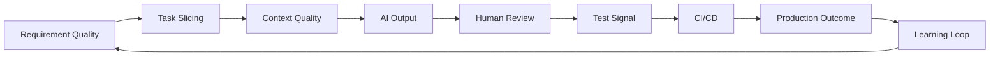
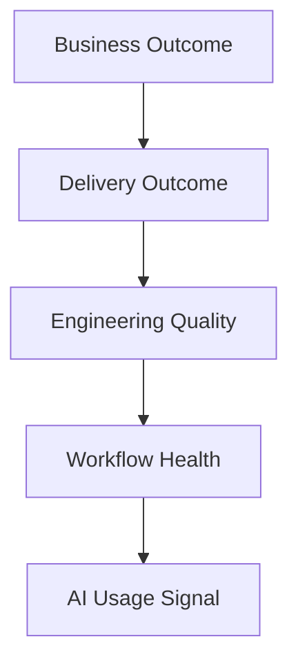
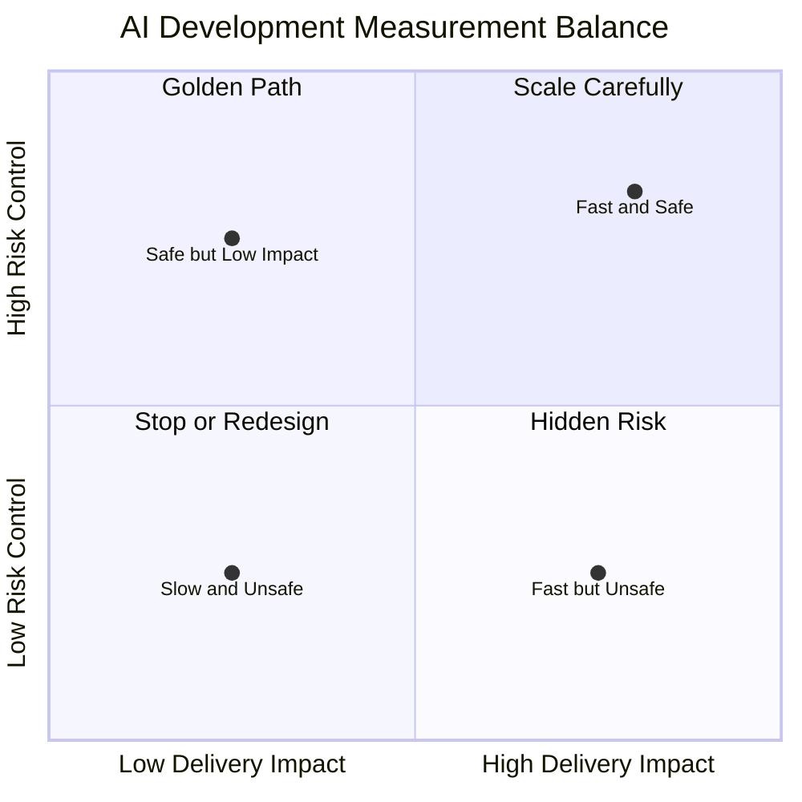
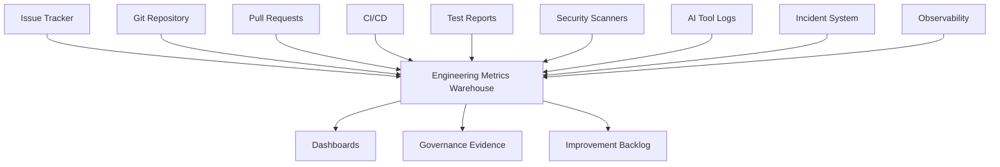
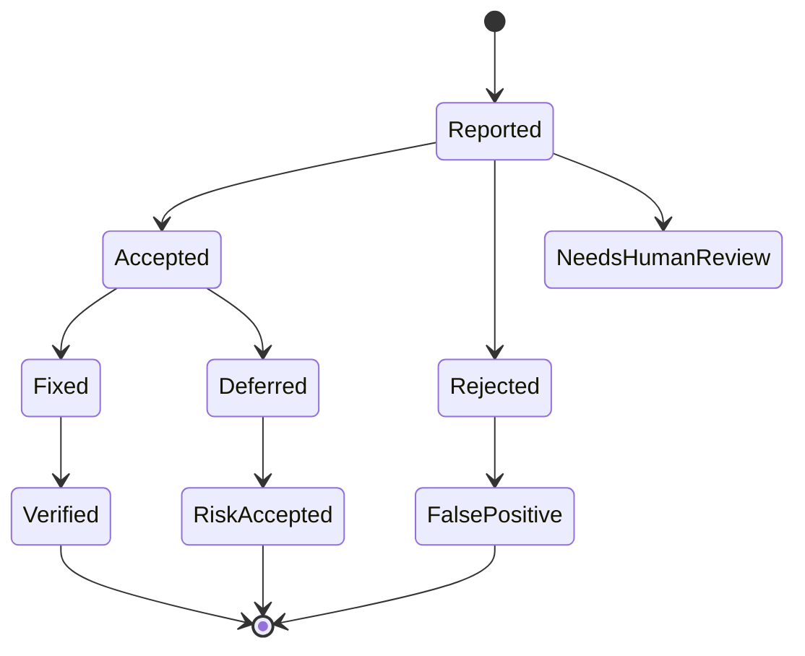

------
title: Learn AI Development Driven Implementation and Usage - Part 027
description: Quality metrics and productivity measurement for AI-driven software development: delivery, quality, reliability, review burden, risk, cost, and governance evidence.
series: learn-ai-development-driven-implementation-usage
seriesTitle: Learn AI Development Driven Implementation and Usage
order: 27
partTitle: Quality Metrics and Productivity Measurement
tags:
- ai
- software-engineering
- productivity
- metrics
- dora
- code-quality
- delivery
- governance
- series
date: 2026-06-30
---

# Part 027 — Quality Metrics and Productivity Measurement

> Tujuan bagian ini: membangun sistem pengukuran yang bisa menjawab pertanyaan penting: **apakah AI benar-benar meningkatkan delivery engineering tanpa menurunkan kualitas, keamanan, maintainability, dan learning organisasi?**

AI-driven development sering dijual dengan narasi kecepatan: lebih cepat membuat code, lebih cepat membuat test, lebih cepat menyelesaikan ticket. Narasi itu belum cukup.

Dalam software engineering serius, productivity bukan jumlah baris code. Productivity adalah kemampuan organisasi untuk mengubah intent menjadi software yang benar, aman, reliable, mudah diubah, dan bernilai bisnis dengan cycle time yang baik.

AI bisa mempercepat delivery. AI juga bisa mempercepat pembuatan defect, memperbesar review burden, menambah noise, membuat engineer menerima perubahan tanpa memahami sistem, dan menciptakan audit gap. Maka pengukuran AI development harus **multi-dimensional**.

Bagian ini membahas cara mengukur AI-driven implementation seperti engineering system, bukan seperti campaign tooling.

---

## 1. Kaufman Framing: Skill yang Sebenarnya Dipelajari

Skill utama bagian ini adalah:

> **Mengukur efek AI terhadap software delivery secara objektif, seimbang, dan actionable.**

Sub-skill-nya:

| Sub-skill | Output yang bisa dinilai |
|---|---|
| Metric design | Bisa memilih metrik yang sesuai dengan tujuan dan risiko |
| Baseline thinking | Bisa membandingkan sebelum/sesudah AI secara fair |
| Signal vs noise | Bisa membedakan metrik yang actionable dari vanity metric |
| Quality measurement | Bisa mengukur defect, rework, test signal, review burden, dan incident |
| Productivity measurement | Bisa mengukur flow, throughput, cycle time, dan cost tanpa menyalahgunakan metrik individu |
| AI attribution | Bisa mengukur kontribusi AI tanpa menganggap semua improvement berasal dari AI |
| Governance evidence | Bisa menghasilkan bukti audit bahwa AI digunakan dengan kontrol memadai |
| Feedback loop | Bisa mengubah metrik menjadi improvement backlog |

### 1.1 Target Performa Setelah 20 Jam

Setelah latihan 20 jam, Anda harus bisa:

1. membuat balanced scorecard untuk AI-assisted engineering,
2. memilih baseline sebelum rollout AI,
3. mengukur lead time, review burden, rework, defect escape, CI health, dan cost,
4. membedakan output metric dan outcome metric,
5. membuat dashboard yang tidak mendorong perilaku buruk,
6. membuat AI usage evidence untuk review dan audit,
7. menjalankan experiment kecil untuk membandingkan workflow AI vs non-AI,
8. membuat improvement backlog berdasarkan data.

---

## 2. Core Mental Model: AI Productivity Is a System Property

Produktivitas AI bukan properti individu, tool, atau model saja. Produktivitas adalah properti sistem kerja.



Jika requirement buruk, AI akan mempercepat implementasi yang salah.

Jika test lemah, AI akan membuat patch yang tampak benar tetapi tidak terbukti.

Jika review tidak disiplin, AI akan menjadi defect multiplier.

Jika observability buruk, tim tidak tahu apakah improvement benar-benar terjadi.

Maka pertanyaan yang tepat bukan:

> “Berapa persen code ditulis AI?”

Pertanyaan yang tepat:

> “Apakah sistem delivery kita menghasilkan perubahan bernilai lebih cepat, dengan kualitas sama atau lebih baik, risiko terkendali, cost masuk akal, dan learning tetap terjaga?”

---

## 3. Anti-Metrics: Metrik yang Tampak Menarik tapi Menyesatkan

Sebelum memilih metrik bagus, buang metrik buruk.

| Anti-metric | Kenapa berbahaya | Pengganti yang lebih baik |
|---|---|---|
| Lines of code generated by AI | Mendorong code bloat dan low-quality generation | Accepted behavior-changing PR with passing evidence |
| Prompt count | Mengukur aktivitas, bukan hasil | Successful task completion with review quality |
| AI acceptance rate | Acceptance tinggi bisa berarti blind acceptance | Accepted diff after tests + review findings |
| Number of AI-created PRs | Bisa memperbesar review queue | Merged PRs with low rework and low defect escape |
| Developer velocity individual | Mudah disalahgunakan untuk surveillance | Team-level flow and outcome metrics |
| Story points completed | Tidak stabil lintas tim | Cycle time, delivery throughput, customer impact |
| Test coverage only | Coverage tinggi bisa tanpa assertion bermakna | Mutation score, assertion quality, defect detection |
| Number of comments from AI reviewer | Banyak komentar bisa berarti noise | Actionable finding precision and false-positive rate |
| Token spend only | Cost rendah bisa berarti context miskin | Cost per accepted, verified change |

Prinsipnya:

> Metrik AI harus mengukur **verified outcome**, bukan generative activity.

---

## 4. Measurement Pyramid

Gunakan pyramid agar metrik tidak terjebak pada satu level.



### 4.1 AI Usage Signal

Contoh:

1. jumlah task yang memakai AI,
2. kategori penggunaan AI,
3. model/tool yang dipakai,
4. prompt/template yang dipakai,
5. agent runtime,
6. token/cost,
7. command/tool invocation,
8. approval events.

Ini hanya telemetry dasar. Jangan berhenti di sini.

### 4.2 Workflow Health

Contoh:

1. PR cycle time,
2. review waiting time,
3. rework count,
4. CI failure count,
5. PR size,
6. number of review iterations,
7. time from first review to merge.

Ini menunjukkan apakah AI memperlancar flow atau hanya memindahkan bottleneck ke reviewer.

### 4.3 Engineering Quality

Contoh:

1. escaped defect,
2. incident caused by change,
3. security finding,
4. test flakiness,
5. mutation score,
6. static analysis issue,
7. dependency vulnerability,
8. rollback/forward-fix rate.

Ini menjawab apakah AI output aman.

### 4.4 Delivery Outcome

Contoh:

1. lead time for changes,
2. deployment frequency,
3. failed deployment recovery time,
4. change failure rate,
5. throughput of valuable changes,
6. release predictability.

Ini menyambungkan AI ke delivery capability.

### 4.5 Business Outcome

Contoh:

1. feature adoption,
2. operational cost reduction,
3. support ticket reduction,
4. customer-facing defect reduction,
5. compliance evidence completeness,
6. faster regulatory response.

Ini paling penting, tapi paling sulit diatribusikan langsung ke AI.

---

## 5. DORA Metrics sebagai Baseline Delivery

DORA metrics berguna karena mengukur delivery performance dari sistem engineering, bukan hanya aktivitas individu.

Empat kategori utama yang perlu dipakai sebagai baseline:

| Metric | Pertanyaan yang dijawab | AI-specific interpretation |
|---|---|---|
| Change lead time | Seberapa cepat perubahan dari commit sampai production? | Apakah AI mempercepat flow end-to-end atau hanya coding lokal? |
| Deployment frequency | Seberapa sering tim deploy? | Apakah AI membuat perubahan lebih kecil dan lebih sering? |
| Change failure rate | Berapa proporsi deploy yang menyebabkan masalah? | Apakah AI menaikkan defect/incident? |
| Failed deployment recovery time | Berapa lama recover dari deploy gagal? | Apakah AI membantu diagnosis/rollback atau memperburuk operability? |

Catatan penting:

1. DORA tidak cukup untuk menilai AI.
2. DORA perlu dilengkapi dengan quality, review, security, dan cost metric.
3. Jangan pakai DORA untuk menghukum individu.
4. DORA idealnya dilihat per tim, per service, dan per risk class.

---

## 6. AI Development Balanced Scorecard

Gunakan scorecard empat dimensi.



### 6.1 Dimensi 1: Flow

Metrik:

1. task cycle time,
2. PR cycle time,
3. review waiting time,
4. time to first green CI,
5. merge latency,
6. release latency.

Interpretasi:

- AI baik jika menurunkan waktu pada bottleneck nyata.
- AI buruk jika mempercepat coding tetapi menaikkan review waiting time.

### 6.2 Dimensi 2: Quality

Metrik:

1. escaped defect rate,
2. rework rate,
3. PR revert rate,
4. incident caused by change,
5. static analysis issue trend,
6. test failure after merge,
7. bug reopen rate.

Interpretasi:

- AI baik jika tidak menaikkan defect escape.
- AI sangat baik jika membantu menurunkan rework dan meningkatkan test signal.

### 6.3 Dimensi 3: Review Load

Metrik:

1. reviewer time per PR,
2. number of review rounds,
3. reviewer comment density,
4. AI reviewer false positive rate,
5. human override rate,
6. average PR diff size.

Interpretasi:

- AI baik jika membuat PR lebih jelas, kecil, dan terbukti.
- AI buruk jika membuat reviewer memvalidasi diff besar yang tidak dipahami author.

### 6.4 Dimensi 4: Risk and Governance

Metrik:

1. secret exposure event,
2. unauthorized context usage,
3. protected path modification without approval,
4. dependency risk introduced,
5. audit evidence completeness,
6. policy exception count,
7. high-risk AI task approval ratio.

Interpretasi:

- AI baik jika menghasilkan evidence otomatis dan memperbaiki kontrol.
- AI buruk jika membuat perubahan tidak traceable.

### 6.5 Dimensi 5: Cost and ROI

Metrik:

1. AI spend per accepted PR,
2. AI spend per successful task,
3. cost per reviewable diff,
4. token burn by workflow type,
5. rework cost,
6. reviewer time saved or added,
7. incident cost avoided or created.

Interpretasi:

- AI murah tapi menyebabkan rework mahal bukan improvement.
- AI mahal tapi mengurangi incident pada sistem kritikal bisa sangat bernilai.

---

## 7. Metric Catalog untuk AI-Driven Development

### 7.1 Flow Metrics

| Metric | Definition | Useful breakdown |
|---|---|---|
| Task cycle time | Dari task ready sampai merged/released | task type, risk class, AI mode |
| Coding time | Dari branch dibuat sampai PR opened | repo, language, complexity |
| PR review latency | Dari PR opened sampai first human review | team, reviewer pool |
| Review cycle time | Dari first review sampai approval | PR size, AI usage, risk |
| Time to green CI | Dari PR opened sampai CI passing | failure type, test type |
| Merge latency | Dari approval sampai merge | release gate, branch protection |
| Release latency | Dari merge sampai production | service, environment |

#### Interpretasi senior

Jika coding time turun 50% tetapi PR review latency naik 80%, AI tidak mempercepat delivery. AI hanya memindahkan kerja dari author ke reviewer.

Jika time to green CI turun karena AI membantu debugging pipeline, itu sinyal bagus.

Jika merge latency naik karena PR besar, berarti task slicing buruk.

### 7.2 Review Metrics

| Metric | Definition | Warning sign |
|---|---|---|
| PR size | Lines/files changed | PR AI-generated terlalu besar |
| Review rounds | Jumlah iterasi review | AI patch tidak matang |
| Actionable comment ratio | Komentar yang menghasilkan perubahan valid | AI reviewer noisy |
| Human override rate | Temuan AI ditolak oleh manusia | Review prompt buruk atau model kurang tepat |
| Author explanation quality | PR menjelaskan intent, risk, tests | AI summary terlalu generik |
| Reviewer confidence score | Reviewer yakin patch dipahami | Author cognitive offloading |

#### Simple rubric: Reviewability Score

| Score | Meaning |
|---:|---|
| 1 | Diff besar, behavior tidak jelas, test lemah |
| 2 | Intent jelas tetapi risk/test kurang |
| 3 | Reviewable, test cukup, beberapa ambiguity |
| 4 | Diff kecil, evidence kuat, risk jelas |
| 5 | Sangat mudah direview, invariant dan rollback jelas |

Formula sederhana:

```text
reviewability_score = average(
  intent_clarity,
  diff_smallness,
  test_evidence,
  risk_statement,
  rollback_clarity
)
```

### 7.3 Quality Metrics

| Metric | Definition | AI-related question |
|---|---|---|
| Escaped defect | Bug ditemukan setelah merge/release | Apakah AI memperbesar bug leakage? |
| Rework rate | PR perlu perubahan besar setelah review | Apakah AI patch rendah kualitas? |
| Reopen rate | Bug ticket dibuka ulang | Apakah AI memperbaiki symptom saja? |
| Regression count | Behavior lama rusak | Apakah characterization test cukup? |
| Flaky test rate | Test gagal tidak deterministik | Apakah AI membuat test rapuh? |
| Mutation survival | Mutasi code lolos test | Apakah assertion AI lemah? |
| Security finding | SAST/DAST/dependency issue | Apakah AI memperkenalkan insecure pattern? |

### 7.4 Test Signal Metrics

| Metric | Good sign | Bad sign |
|---|---|---|
| Assertion density meaningful | Assertion membuktikan behavior penting | Assertion hanya not-null/status code |
| Branch/scenario coverage | Critical path dan edge case tercakup | Happy path only |
| Mutation score | Test gagal saat logic dirusak | Mutasi banyak survive |
| Flake rate | Stabil di CI | Fails/retries sering |
| Test runtime | Cepat enough untuk feedback | Lambat tanpa value |
| Failure diagnosis quality | Error mudah dipahami | Error generik dan noisy |

Jangan ukur coverage saja. Coverage menjawab “code dieksekusi?”, bukan “behavior terbukti?”.

### 7.5 Security Metrics

| Metric | Definition |
|---|---|
| AI-introduced vulnerability count | Temuan security pada PR yang memakai AI |
| Secret leakage event | Secret ikut masuk prompt/log/diff |
| Dependency risk introduced | Dependency baru dengan CVE/license issue |
| Unsafe output handling | AI-generated code tidak validasi output eksternal |
| Prompt injection exposure | Tool/agent bisa dipengaruhi input tidak terpercaya |
| Excessive agency event | Agent menjalankan command/akses di luar izin |
| Policy exception count | Kasus penggunaan AI di luar policy |

Security metric harus dilihat dengan severity. Satu critical vulnerability lebih penting dari 100 style issue.

### 7.6 Cost Metrics

| Metric | Formula sederhana |
|---|---|
| AI cost per task | total AI spend / completed AI-assisted task |
| AI cost per merged PR | total AI spend / merged AI-assisted PR |
| AI cost per accepted diff | total AI spend / accepted generated diff |
| Rework-adjusted cost | AI cost + human rework time cost |
| Review-adjusted cost | AI cost + reviewer time cost |
| Incident-adjusted cost | AI cost + incident caused/avoided cost |

Cost metric harus memasukkan human time. Tool murah tapi membuat reviewer bekerja dua kali lebih lama itu mahal.

### 7.7 Learning Metrics

Ini sering diabaikan.

| Metric | Purpose |
|---|---|
| Author explanation quality | Apakah engineer memahami patch? |
| Post-review learning notes | Apakah review menghasilkan pembelajaran? |
| Prompt/template improvement count | Apakah workflow membaik? |
| Repeated issue rate | Apakah AI mengulang kesalahan sama? |
| Pairing session reflection | Apakah engineer bisa menjelaskan design? |
| New engineer onboarding time | Apakah AI-readable repo membantu onboarding? |

AI adoption yang bagus mempercepat learning. AI adoption yang buruk membuat engineer makin pasif.

---

## 8. AI Attribution: Jangan Salah Mengklaim Improvement

Masalah umum:

> Setelah AI rollout, cycle time turun. Maka AI dianggap penyebab.

Belum tentu.

Cycle time bisa turun karena:

1. scope task lebih kecil,
2. reviewer lebih tersedia,
3. CI lebih cepat,
4. incident menurun,
5. requirement lebih jelas,
6. release process berubah,
7. tim menghindari task sulit,
8. measurement window bias.

### 8.1 Minimum Attribution Model

Untuk setiap perubahan yang mengklaim AI impact, catat:

| Field | Contoh |
|---|---|
| Task type | bugfix, refactor, test, migration, docs, API |
| Risk class | low, medium, high, critical |
| AI mode | chat, IDE pair, terminal agent, cloud agent, AI review |
| Human role | author, reviewer, approver |
| Baseline comparable | previous similar tasks |
| Outcome | merged, reverted, defect, rework |
| Evidence | tests, CI, review, logs, docs |

### 8.2 Difference-in-Differences Sederhana

Jika ingin lebih serius:

```text
AI_effect =
  (AI_team_after - AI_team_before)
  -
  (control_team_after - control_team_before)
```

Ini tidak sempurna, tetapi lebih baik daripada before/after mentah.

### 8.3 Matched Task Comparison

Bandingkan task yang sejenis:

| Dimension | Match by |
|---|---|
| Domain | service/module yang sama |
| Type | bugfix vs bugfix, test vs test |
| Size | estimasi kompleksitas mirip |
| Risk | low/medium/high |
| Baseline | historical tasks yang sebanding |
| Team | skill/team yang sama atau mirip |

Jangan bandingkan AI-assisted docs update dengan non-AI database migration.

---

## 9. Measurement Architecture

Untuk mengukur AI development, data datang dari beberapa sumber.



### 9.1 Issue Tracker Data

Ambil:

1. task type,
2. priority,
3. component,
4. assignee team,
5. created date,
6. ready date,
7. start date,
8. done date,
9. risk label,
10. AI-assisted label.

Praktik:

```text
labels:
- ai-assisted
- ai-mode:pair
- ai-mode:cloud-agent
- risk:medium
- task-type:bugfix
```

### 9.2 Git Data

Ambil:

1. commits,
2. branch lifetime,
3. file count,
4. diff size,
5. churn,
6. module touched,
7. protected path touched.

Hati-hati: diff size bukan productivity. Diff size adalah review/risk signal.

### 9.3 Pull Request Data

Ambil:

1. opened time,
2. first review time,
3. approval time,
4. merge time,
5. review comments,
6. requested changes,
7. PR description quality,
8. linked issue,
9. checklist completion,
10. AI disclosure.

### 9.4 CI/CD Data

Ambil:

1. build duration,
2. test duration,
3. failed job,
4. rerun count,
5. flaky indicator,
6. deployment result,
7. rollback/forward-fix,
8. environment.

### 9.5 Security Data

Ambil:

1. SAST findings,
2. dependency findings,
3. secret scanning,
4. license findings,
5. container findings,
6. IaC findings,
7. severity,
8. fix time.

### 9.6 AI Tool Logs

Ambil hanya yang boleh dikumpulkan sesuai privacy/security policy:

1. tool name,
2. AI mode,
3. task id,
4. token/cost,
5. model class,
6. approval event,
7. command class,
8. protected path attempt,
9. outcome.

Jangan menyimpan prompt mentah berisi secret, customer data, atau sensitive source jika policy melarang.

---

## 10. AI Usage Taxonomy untuk Measurement

Metrik harus tahu AI dipakai untuk apa.

| AI usage category | Contoh | Risk level default |
|---|---|---|
| Search/explanation | memahami code, menjelaskan error | low-medium |
| Documentation | PR summary, runbook, ADR draft | low-medium |
| Test generation | unit/integration test | medium |
| Code implementation | feature/bugfix/refactor | medium-high |
| Security review | review vulnerability | medium-high |
| Database migration | schema/data migration | high |
| DevOps/IaC | workflow/deployment/infra | high |
| Production operation | diagnosis/action pada prod | critical |

Jika semua AI usage digabung, data menjadi tidak berguna.

Contoh insight yang benar:

> AI pair programming menurunkan coding time untuk low-risk test generation sebesar 35%, tetapi cloud-agent implementation untuk medium-risk API change menaikkan review rounds 20% karena task slicing terlalu besar.

Contoh insight yang buruk:

> AI meningkatkan productivity 40%.

---

## 11. Designing a Dashboard that Does Not Create Bad Behavior

Dashboard buruk membuat orang mengoptimalkan angka, bukan sistem.

### 11.1 Rules

1. Gunakan metrik tim, bukan ranking individu.
2. Tampilkan quality bersama speed.
3. Tampilkan review burden bersama throughput.
4. Tampilkan confidence interval/trend, bukan angka absolut palsu.
5. Pisahkan task type dan risk class.
6. Jangan jadikan AI acceptance rate sebagai KPI.
7. Gunakan dashboard untuk improvement, bukan punishment.

### 11.2 Dashboard Sections

#### Section A: Delivery Flow

| Metric | View |
|---|---|
| Lead time | trend by team/service |
| PR cycle time | p50/p75/p90 |
| Review wait time | by reviewer pool |
| Time to green CI | by repo |
| Deployment frequency | by service |

#### Section B: Quality and Safety

| Metric | View |
|---|---|
| Change failure rate | by service/risk |
| Escaped defects | by task type |
| Rework rate | by AI mode |
| Security findings | by severity |
| Test flakiness | by pipeline |

#### Section C: AI Usage

| Metric | View |
|---|---|
| AI-assisted task count | by category |
| AI mode distribution | chat/pair/agent/review |
| Cost per completed task | by mode |
| Approval events | by risk class |
| Policy exceptions | by team/service |

#### Section D: Review Health

| Metric | View |
|---|---|
| Review rounds | by PR size/risk |
| Actionable AI review finding ratio | by prompt/model |
| Human override rate | by reviewer |
| PR size distribution | by AI mode |
| Reviewer load | by week |

#### Section E: Governance Evidence

| Metric | View |
|---|---|
| AI disclosure completeness | by PR |
| Protected path approval | by PR |
| Security gate pass/fail | by repo |
| Documentation impact statement | by PR |
| Audit trail completeness | by use case |

---

## 12. AI ROI Model

ROI AI development tidak bisa hanya dihitung dari subscription cost.

### 12.1 Cost Components

| Cost | Example |
|---|---|
| Tool subscription | seat/license |
| API/token | model usage |
| Infra | cloud sandbox, CI minutes |
| Human review | reviewer time |
| Rework | fixing AI output |
| Governance | audit, policy, approval |
| Security | scanning, incident response |
| Training | enablement time |

### 12.2 Benefit Components

| Benefit | Example |
|---|---|
| Reduced cycle time | faster bugfix/feature delivery |
| Reduced toil | docs/runbook/test automation |
| Improved quality | fewer repeated defects |
| Faster onboarding | AI-readable repo and knowledge pack |
| Better review | risk checklist and summary |
| Faster diagnosis | log/error hypothesis generation |
| Compliance evidence | generated traceability |

### 12.3 Simple Formula

```text
net_value =
  delivery_time_saved_value
+ toil_reduction_value
+ defect_cost_avoided
+ incident_cost_avoided
+ onboarding_time_saved
+ audit_effort_reduced
- ai_tool_cost
- added_review_cost
- rework_cost
- governance_cost
- incident_cost_caused
```

Jangan memaksa presisi palsu. Gunakan model ini untuk berpikir, bukan accounting sempurna.

---

## 13. Quality Gate untuk AI Metrics

Sebelum AI workflow dianggap berhasil, minimal harus lolos quality gate.

| Gate | Required evidence |
|---|---|
| Behavior gate | Test membuktikan acceptance criteria |
| Review gate | Human reviewer memahami diff |
| Security gate | Tidak ada high/critical unresolved finding |
| Compatibility gate | Contract/backward compatibility aman |
| Operational gate | Logging/metrics/rollback cukup |
| Documentation gate | Docs/ADR/runbook update jika terdampak |
| Governance gate | AI usage disclosure dan approvals lengkap |

### 13.1 Go/No-Go Example

| Condition | Decision |
|---|---|
| Cycle time turun, defect naik | no-go atau restrict use case |
| Cycle time turun, review burden naik tinggi | redesign task slicing |
| Review burden turun, quality stabil | scale carefully |
| Quality naik, cycle time stabil | still valuable |
| Cost naik, incident turun | evaluate risk-adjusted value |
| AI reviewer noisy | tune/restrict reviewer |

---

## 14. Measurement of AI Code Review

AI code review perlu metrik sendiri.

### 14.1 Precision and Recall Thinking

| Term | Meaning in AI review |
|---|---|
| True positive | AI menemukan issue valid |
| False positive | AI melaporkan issue tidak valid |
| False negative | AI melewatkan issue yang ditemukan human/production |
| True negative | AI benar tidak melaporkan issue |

Dalam praktik, recall sulit diukur karena kita tidak tahu semua issue yang hilang. Tetapi precision bisa diukur dari human disposition.

### 14.2 Review Finding Lifecycle



### 14.3 AI Reviewer Metrics

| Metric | Use |
|---|---|
| Finding precision | Kurangi noise |
| Accepted finding count | Value indicator |
| Severity distribution | Apakah AI hanya style comment? |
| Duplicate finding rate | Prompt/model noise |
| Reviewer override rate | Trust calibration |
| Fix verification rate | Issue benar-benar selesai |
| Time added/removed | Apakah review jadi lebih cepat? |

### 14.4 AI Reviewer Policy

AI reviewer boleh:

1. memberi checklist,
2. menemukan issue potensial,
3. meminta evidence,
4. membandingkan dengan convention,
5. menandai risk.

AI reviewer tidak boleh:

1. menjadi final approver,
2. override human reviewer,
3. menyetujui high-risk change tanpa evidence,
4. mengubah code otomatis tanpa author review,
5. membuat blocking comment untuk style noise.

---

## 15. AI-Assisted Testing Metrics

AI sering terlihat sangat produktif saat membuat test. Tetapi test bisa palsu.

### 15.1 Test Quality Dimensions

| Dimension | Question |
|---|---|
| Relevance | Apakah test terkait requirement? |
| Oracle strength | Apakah assertion membuktikan behavior? |
| Edge coverage | Apakah edge case penting tercakup? |
| Regression power | Apakah test akan gagal jika bug kembali? |
| Maintainability | Apakah fixture jelas dan tidak rapuh? |
| Determinism | Apakah test stabil di CI? |
| Runtime | Apakah feedback loop masih cepat? |

### 15.2 AI Test Score

```text
ai_test_score = average(
  relevance,
  oracle_strength,
  edge_case_coverage,
  regression_power,
  maintainability,
  determinism
)
```

Gunakan score ini saat review generated tests.

### 15.3 Common AI Test Failure

| Failure | Symptom | Metric signal |
|---|---|---|
| Weak oracle | Test pass walau logic salah | mutation survival tinggi |
| Implementation mirroring | Test copy logic produksi | escaped defect tetap tinggi |
| Happy path only | Edge bug lolos | scenario coverage rendah |
| Over-mocking | Integration issue lolos | prod defect pada boundary |
| Fragile fixture | Test sering gagal karena setup | flake rate tinggi |
| Slow test bloat | CI makin lambat | test runtime naik |

---

## 16. AI Implementation Metrics by Risk Class

Jangan gunakan threshold sama untuk semua task.

| Risk class | AI usage allowed | Measurement priority |
|---|---|---|
| Low | docs, tests, small refactor, UI copy | speed, reviewability |
| Medium | bugfix, endpoint, non-critical workflow | quality, rework, CI |
| High | auth, payment, database, compliance | security, review evidence, rollback |
| Critical | production operation, destructive migration | approval, audit, incident readiness |

### 16.1 Example Thresholds

| Metric | Low risk | Medium risk | High risk |
|---|---:|---:|---:|
| Max PR size | 400 LOC | 250 LOC | 150 LOC |
| Required human reviewers | 1 | 1-2 | 2+ |
| Required tests | unit | unit + integration | unit + integration + contract/regression |
| AI disclosure | yes | yes | yes + approval note |
| Security scan | standard | standard | blocking high/critical |
| Rollback plan | optional | required if behavior | required |

Angka di atas bukan universal. Pakai sebagai starting point.

---

## 17. Data Quality Problems

Metrik engineering mudah rusak.

### 17.1 Common Problems

| Problem | Impact | Mitigation |
|---|---|---|
| Missing labels | AI impact tidak terbaca | PR template + automation |
| Inconsistent task type | Comparison salah | controlled taxonomy |
| PR unrelated changes | Cycle/quality bias | PR-per-intent |
| Squashed history loses signal | Attribution sulit | keep PR metadata |
| Manual AI usage undisclosed | Under-reporting | team agreement, not punitive |
| Tool logs incomplete | Cost/approval unknown | standardized logging |
| Individual ranking | Gaming metrics | team-level dashboard |

### 17.2 AI Disclosure Template

Tambahkan ke PR:

```md
## AI Usage

- AI used: yes/no
- Mode: chat / IDE pair / terminal agent / cloud agent / AI review
- Scope: explanation / test generation / implementation / refactor / docs / CI repair
- Human validation performed:
  - [ ] I reviewed the diff manually
  - [ ] I understand the behavior change
  - [ ] I ran relevant tests
  - [ ] I checked security-sensitive paths
- Risk class: low / medium / high / critical
- Notes:
```

Disclosure bukan untuk mempermalukan. Disclosure untuk observability dan governance.

---

## 18. Experiment Design for AI Rollout

Jangan rollout AI ke semua workflow lalu bingung membaca dampaknya.

### 18.1 Start with Use Case

Contoh use case yang bagus untuk experiment:

1. generate unit tests untuk existing service,
2. fix flaky tests,
3. summarize PR + docs impact,
4. debug CI failure,
5. implement low-risk endpoint,
6. refactor small module with characterization tests.

Contoh use case buruk untuk experiment pertama:

1. production database migration,
2. auth redesign,
3. payment flow change,
4. multi-service architecture rewrite,
5. compliance-critical workflow without test baseline.

### 18.2 Experiment Template

```md
# AI Workflow Experiment

## Hypothesis
Using AI for <workflow> will improve <metric> without degrading <quality metric>.

## Scope
- Repo/service:
- Task type:
- Risk class:
- AI mode:
- Human gate:

## Baseline
- Historical period:
- Comparable tasks:
- Baseline metrics:

## Success Criteria
- Flow:
- Quality:
- Review:
- Cost:
- Governance:

## Guardrails
- Stop condition:
- Protected paths:
- Required tests:
- Required approvals:

## Data Collection
- Issue labels:
- PR template:
- CI logs:
- Security scans:
- AI usage logs:

## Review Cadence
- Weekly review:
- Final decision:
```

### 18.3 Stop Conditions

Hentikan atau batasi experiment jika:

1. escaped defect naik signifikan,
2. reviewer burden naik tanpa value,
3. AI-generated PR sering butuh rewrite,
4. security findings naik,
5. policy exception berulang,
6. engineer tidak bisa menjelaskan patch,
7. cost tidak sebanding dengan outcome,
8. prompt/tool behavior tidak bisa diaudit.

---

## 19. AI Productivity Review Meeting

Lakukan review berkala, misalnya dua mingguan atau bulanan.

Agenda:

1. Apa workflow AI yang paling bernilai?
2. Apa workflow yang paling noisy?
3. Apakah lead time turun?
4. Apakah review burden naik/turun?
5. Apakah defect/rework berubah?
6. Apakah cost masuk akal?
7. Apakah ada security/governance incident?
8. Prompt/template apa yang perlu distandardisasi?
9. Repo mana yang perlu dibuat lebih AI-readable?
10. Use case mana yang perlu dibatasi?

### 19.1 Output Meeting

Output bukan slide. Output harus menjadi backlog:

| Finding | Action |
|---|---|
| AI PR terlalu besar | update task slicing policy |
| Generated tests weak | add mutation review checklist |
| Cloud agent sering gagal setup | improve repo bootstrap script |
| AI reviewer noisy | tune prompt and restrict severity |
| Cost tinggi pada debugging | improve log context pack |
| Docs summary useful | standardize PR docs impact template |

---

## 20. Scorecard Templates

### 20.1 Team AI Delivery Scorecard

```md
# Team AI Delivery Scorecard

Period: <YYYY-MM>
Team: <team>
Services: <services>

## AI Usage Mix
- AI-assisted tasks:
- AI modes:
- Top workflows:

## Flow
- Lead time p50/p75/p90:
- PR cycle time p50/p75/p90:
- Review wait time:
- Time to green CI:

## Quality
- Escaped defects:
- Rework rate:
- Reverts:
- Security findings:
- Flaky tests:

## Review Health
- Average PR size:
- Review rounds:
- AI reviewer precision:
- Reviewer burden trend:

## Cost
- Tool/API spend:
- Cost per accepted PR:
- Review-adjusted cost:

## Governance
- AI disclosure completeness:
- Approval exceptions:
- Protected path violations:

## Decisions
- Scale:
- Restrict:
- Improve:
```

### 20.2 PR-Level AI Evidence Scorecard

```md
# AI Evidence Scorecard

PR: <link>
Task: <link>
Risk: low/medium/high/critical
AI mode: <mode>

## Evidence
- Acceptance criteria mapped: yes/no
- Tests added/updated: yes/no
- CI passed: yes/no
- Security scan passed: yes/no
- Docs updated: yes/no
- Rollback plan included: yes/no

## Review
- Human reviewer understands diff: yes/no
- AI review findings dispositioned: yes/no
- Rework needed: none/minor/major

## Outcome
- Merged:
- Reverted:
- Incident:
- Follow-up required:
```

---

## 21. Interpreting Common Metric Patterns

### 21.1 Pattern: Coding Faster, Review Slower

Signal:

1. branch lifetime turun,
2. PR review cycle naik,
3. review rounds naik,
4. reviewer comment density naik.

Diagnosis:

1. AI membuat diff terlalu besar,
2. author tidak memahami patch,
3. PR summary generik,
4. test evidence lemah.

Action:

1. enforce PR-per-intent,
2. add AI usage disclosure,
3. require author explanation,
4. improve task slicing.

### 21.2 Pattern: More Tests, Same Defects

Signal:

1. test count naik,
2. coverage naik,
3. escaped defect tetap atau naik,
4. mutation score rendah.

Diagnosis:

1. weak oracle,
2. happy path only,
3. over-mocking,
4. tests mirror implementation.

Action:

1. add behavior matrix,
2. require assertion review,
3. add mutation testing for critical modules,
4. review fixture quality.

### 21.3 Pattern: AI Reviewer Finds Many Issues, Few Accepted

Signal:

1. AI comments tinggi,
2. accepted findings rendah,
3. reviewer dismisses often,
4. review latency naik.

Diagnosis:

1. prompt terlalu generic,
2. AI tidak punya repo convention,
3. severity tidak dikalibrasi,
4. style noise.

Action:

1. restrict AI reviewer scope,
2. add severity policy,
3. provide repo-specific checklist,
4. measure precision.

### 21.4 Pattern: Delivery Faster, Incidents Higher

Signal:

1. lead time turun,
2. deployment frequency naik,
3. change failure rate naik,
4. incident count naik.

Diagnosis:

1. quality gate terlalu longgar,
2. risky AI task tidak dibedakan,
3. test coverage tidak cukup,
4. rollout/rollback lemah.

Action:

1. add risk class,
2. require extra gate for high-risk task,
3. strengthen observability,
4. slow down unsafe workflows.

---

## 22. Practical SQL/Data Model Sketch

Untuk tim yang ingin membangun warehouse sederhana:

```sql
CREATE TABLE ai_assisted_prs (
  pr_id TEXT PRIMARY KEY,
  repo TEXT NOT NULL,
  service TEXT,
  team TEXT,
  task_type TEXT,
  risk_class TEXT,
  ai_mode TEXT,
  opened_at TIMESTAMP,
  first_review_at TIMESTAMP,
  approved_at TIMESTAMP,
  merged_at TIMESTAMP,
  lines_added INT,
  lines_deleted INT,
  files_changed INT,
  ci_failures INT,
  review_rounds INT,
  ai_review_findings INT,
  accepted_ai_findings INT,
  human_requested_changes INT,
  security_findings_high INT,
  escaped_defect BOOLEAN DEFAULT FALSE,
  reverted BOOLEAN DEFAULT FALSE,
  ai_cost_usd NUMERIC,
  disclosure_complete BOOLEAN
);
```

Example derived metrics:

```sql
SELECT
  team,
  ai_mode,
  percentile_cont(0.5) WITHIN GROUP (
    ORDER BY EXTRACT(EPOCH FROM (merged_at - opened_at)) / 3600
  ) AS pr_cycle_time_p50_hours,
  AVG(review_rounds) AS avg_review_rounds,
  AVG(CASE WHEN escaped_defect THEN 1 ELSE 0 END) AS escaped_defect_rate,
  AVG(CASE WHEN disclosure_complete THEN 1 ELSE 0 END) AS disclosure_rate
FROM ai_assisted_prs
WHERE merged_at IS NOT NULL
GROUP BY team, ai_mode;
```

---

## 23. Minimum Viable Measurement Setup

Jika tim belum punya data platform, mulai sederhana.

### Week 1

1. Tambahkan AI usage section di PR template.
2. Tambahkan labels untuk AI mode dan risk class.
3. Catat PR cycle time dan review rounds.
4. Catat CI pass/fail.
5. Catat rework major/minor.

### Week 2

1. Tambahkan dashboard sederhana dari GitHub/GitLab data.
2. Review 10 AI-assisted PR secara manual.
3. Hitung false positive AI review.
4. Bandingkan PR size AI vs non-AI.
5. Identifikasi satu workflow yang perlu diperbaiki.

### Week 3

1. Tambahkan cost tracking.
2. Tambahkan security findings tracking.
3. Tambahkan task type breakdown.
4. Buat improvement backlog.

### Week 4

1. Putuskan workflow mana yang diskalakan.
2. Putuskan workflow mana yang dibatasi.
3. Update context/prompt/template.
4. Buat team AI working agreement revision.

---

## 24. Failure Modes in Measurement

### 24.1 Goodhart's Law

Saat metrik menjadi target, metrik bisa rusak.

Contoh:

- Jika targetnya PR count, orang membuat PR kecil tidak bernilai.
- Jika targetnya AI usage, orang memakai AI saat tidak perlu.
- Jika targetnya review speed, reviewer asal approve.
- Jika targetnya test count, orang membuat test lemah.

Mitigasi:

1. gunakan metric set seimbang,
2. review qualitative examples,
3. hindari individual ranking,
4. pakai metric sebagai diagnosis, bukan hukuman.

### 24.2 Survivorship Bias

Tim hanya melihat PR yang berhasil merge. Padahal AI task yang gagal juga penting.

Catat:

1. abandoned AI branches,
2. failed agent tasks,
3. rewritten AI output,
4. discarded generated tests,
5. prompts that produced unsafe output.

### 24.3 Automation Bias

Jika AI dashboard terlihat rapi, orang percaya tanpa audit.

Mitigasi:

1. sampling manual,
2. audit raw PR,
3. compare against incidents,
4. qualitative reviewer feedback.

### 24.4 Local Optimization

AI mempercepat coding lokal tetapi memperburuk system flow.

Mitigasi:

1. measure end-to-end,
2. include review/CI/release,
3. use DORA + quality + cost.

---

## 25. What Top 1% Engineers Watch

Engineer kuat tidak hanya bertanya “berapa cepat?”. Mereka bertanya:

1. Apakah AI memperbaiki bottleneck nyata?
2. Apakah PR lebih kecil atau lebih besar?
3. Apakah reviewer lebih percaya atau lebih lelah?
4. Apakah defect escape berubah?
5. Apakah AI-generated tests benar-benar menangkap bug?
6. Apakah security posture membaik atau melemah?
7. Apakah high-risk task punya approval dan evidence?
8. Apakah cost masih sebanding dengan outcome?
9. Apakah engineer masih memahami code yang mereka merge?
10. Apakah context/prompt/template membaik dari waktu ke waktu?

---

## 26. 20-Hour Deliberate Practice Plan

### Hour 1-2: Baseline

Ambil 20 PR terakhir dari satu repo.

Catat:

1. PR cycle time,
2. review rounds,
3. PR size,
4. CI failures,
5. rework,
6. defect follow-up.

### Hour 3-4: AI Disclosure Template

Tambahkan PR template AI usage.

Simulasikan pada 5 PR lama.

### Hour 5-6: Task Taxonomy

Klasifikasi task:

1. docs,
2. test,
3. bugfix,
4. feature,
5. refactor,
6. migration,
7. DevOps,
8. security.

### Hour 7-8: Risk Class

Tambahkan risk class:

1. low,
2. medium,
3. high,
4. critical.

### Hour 9-10: Reviewability Score

Score 10 PR berdasarkan:

1. intent clarity,
2. diff size,
3. test evidence,
4. risk statement,
5. rollback clarity.

### Hour 11-12: AI Reviewer Evaluation

Jalankan AI review pada 5 PR.

Catat:

1. valid findings,
2. false positives,
3. missed issues,
4. severity quality.

### Hour 13-14: Test Quality Evaluation

Ambil 5 AI-generated tests.

Score:

1. relevance,
2. oracle strength,
3. edge coverage,
4. determinism,
5. maintainability.

### Hour 15-16: Dashboard Sketch

Buat dashboard sederhana:

1. flow,
2. quality,
3. review,
4. cost,
5. governance.

### Hour 17-18: Experiment Design

Tulis satu AI workflow experiment:

1. hypothesis,
2. scope,
3. baseline,
4. success criteria,
5. stop condition.

### Hour 19-20: Improvement Backlog

Buat backlog 10 item untuk meningkatkan AI development system.

Prioritaskan berdasarkan:

1. impact,
2. risk reduction,
3. effort,
4. evidence quality.

---

## 27. Checklist: AI Development Metrics Readiness

Gunakan checklist ini sebelum mengklaim AI adoption berhasil.

```md
## Metrics Readiness Checklist

### Baseline
- [ ] Baseline pre-AI tersedia
- [ ] Task type taxonomy tersedia
- [ ] Risk class taxonomy tersedia
- [ ] Comparable task set tersedia

### Flow
- [ ] PR cycle time diukur
- [ ] Review wait time diukur
- [ ] Time to green CI diukur
- [ ] Release latency diukur

### Quality
- [ ] Rework rate diukur
- [ ] Escaped defect diukur
- [ ] Flaky test rate diukur
- [ ] Security finding diukur

### Review
- [ ] PR size diukur
- [ ] Review rounds diukur
- [ ] AI reviewer finding disposition diukur
- [ ] Reviewer feedback dikumpulkan

### AI Usage
- [ ] AI mode dicatat
- [ ] AI usage disclosure di PR
- [ ] Cost dicatat
- [ ] Approval event dicatat

### Governance
- [ ] Policy exception dicatat
- [ ] Protected path modification dicatat
- [ ] Audit evidence tersimpan
- [ ] High-risk workflow punya gate

### Improvement
- [ ] Metrics review cadence ada
- [ ] Improvement backlog dibuat
- [ ] Prompt/context updates tracked
- [ ] Unsafe workflow bisa dihentikan
```

---

## 28. Ringkasan

AI development measurement harus menjawab outcome, bukan aktivitas.

Prinsip utama:

1. Ukur productivity sebagai system property.
2. Gunakan DORA sebagai baseline delivery, bukan satu-satunya ukuran.
3. Gabungkan flow, quality, review, risk, cost, learning, dan governance.
4. Jangan mengukur developer individu dengan AI metrics.
5. Jangan memakai LOC, prompt count, atau acceptance rate sebagai KPI utama.
6. Pisahkan task type dan risk class.
7. Ukur review burden karena AI sering memindahkan bottleneck ke reviewer.
8. Ukur generated test quality, bukan hanya test count.
9. Buat AI usage disclosure sebagai observability, bukan surveillance.
10. Jadikan metrik sebagai feedback loop untuk memperbaiki context, prompt, repo readiness, test strategy, dan governance.

AI yang baik bukan yang paling banyak menghasilkan code.

AI yang baik adalah AI yang membantu tim mengirim perubahan bernilai dengan evidence lebih kuat, risiko lebih kecil, dan learning loop lebih cepat.

---

## 29. Referensi Praktis

- DORA Metrics — https://dora.dev/guides/dora-metrics/
- Accelerate / DORA research sebagai dasar software delivery performance measurement
- SPACE framework untuk developer productivity discussion
- OWASP Top 10 for Large Language Model Applications — https://owasp.org/www-project-top-10-for-large-language-model-applications/
- NIST AI Risk Management Framework — https://www.nist.gov/itl/ai-risk-management-framework
- NIST AI 600-1 Generative AI Profile — https://nvlpubs.nist.gov/nistpubs/ai/NIST.AI.600-1.pdf
