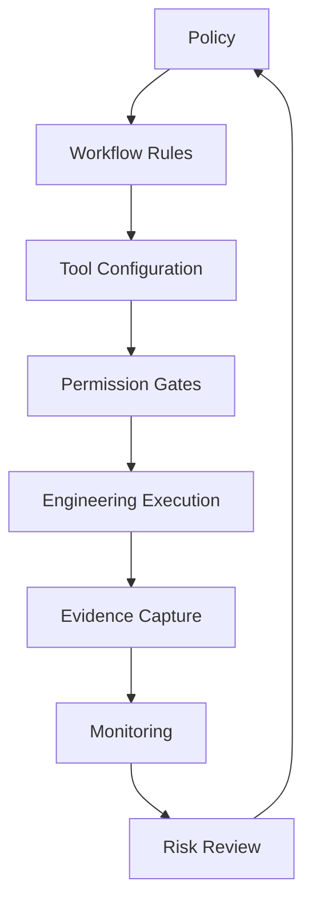
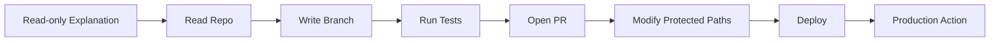
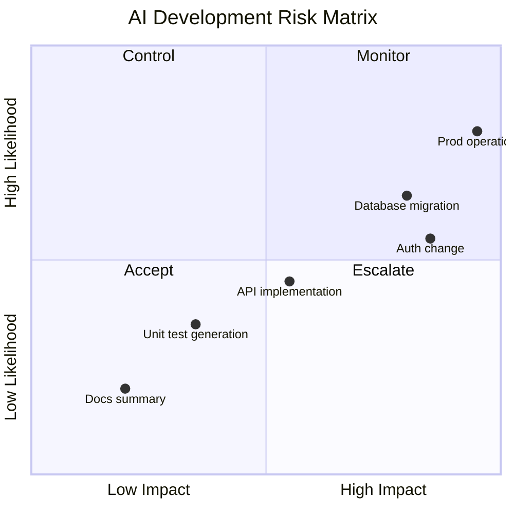
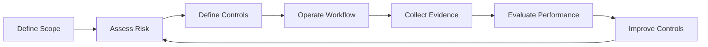
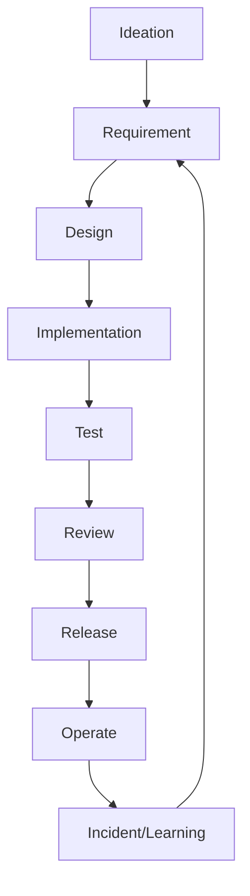
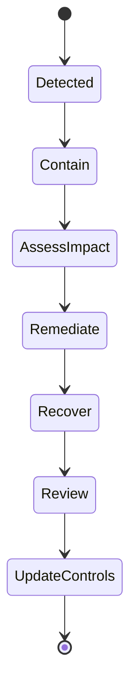

------
title: Learn AI Development Driven Implementation and Usage - Part 028
description: Enterprise governance and risk management for AI-driven development: policy, risk taxonomy, access control, audit evidence, model/tool governance, and secure delivery operating model.
series: learn-ai-development-driven-implementation-usage
seriesTitle: Learn AI Development Driven Implementation and Usage
order: 28
partTitle: Enterprise Governance and Risk Management
tags:
- ai
- governance
- risk-management
- security
- compliance
- enterprise-architecture
- software-engineering
- nist-ai-rmf
- series
date: 2026-06-30
---

# Part 028 — Enterprise Governance and Risk Management

> Tujuan bagian ini: membangun governance AI development yang membuat engineer bisa bergerak cepat **tanpa kehilangan kontrol risiko, auditability, security, privacy, IP safety, dan accountability**.

Governance sering dianggap penghambat. Dalam AI-driven software development, governance yang buruk memang menghambat. Tetapi governance yang baik adalah **enabling constraint**: batas yang membuat tim berani menggunakan AI pada skala enterprise karena risikonya terdefinisi, kontrolnya jelas, dan evidencenya otomatis.

AI development tidak cukup hanya dengan policy “boleh/tidak boleh pakai AI”. Realitasnya lebih kompleks:

1. AI bisa membaca context sensitif.
2. AI bisa menghasilkan code yang insecure.
3. AI agent bisa menjalankan command.
4. Tool bisa mengakses repository, ticket, CI, secrets, docs, dan environment.
5. Output AI bisa memengaruhi production behavior.
6. Vendor/model bisa berubah.
7. Audit trail bisa hilang jika workflow tidak didesain.
8. Human accountability bisa kabur jika semua orang berkata “AI yang membuat”.

Maka governance harus menjadi bagian dari engineering operating model.

---

## 1. Kaufman Framing: Skill yang Sebenarnya Dipelajari

Skill utama bagian ini:

> **Mendesain governance AI development yang risk-based, operational, dan bisa dijalankan tim engineering tanpa memperlambat delivery secara tidak perlu.**

Sub-skill-nya:

| Sub-skill | Output yang bisa dinilai |
|---|---|
| Risk taxonomy | Bisa mengelompokkan risiko AI development secara jelas |
| Use-case governance | Bisa menentukan workflow AI mana yang allowed, restricted, atau prohibited |
| Data governance | Bisa menentukan context apa yang boleh masuk AI tool |
| Model/tool governance | Bisa mengatur model, vendor, agent, MCP server, dan permission |
| Human accountability | Bisa menetapkan keputusan yang wajib manusia pegang |
| Evidence design | Bisa membuat audit trail otomatis dari PR, CI, approval, dan logs |
| Policy-as-workflow | Bisa menerjemahkan policy menjadi checklist/gate di repo |
| Incident readiness | Bisa menangani AI-related incident secara sistematis |

### 1.1 Target Performa Setelah 20 Jam

Setelah latihan 20 jam, Anda harus bisa:

1. membuat AI development policy ringkas untuk engineering team,
2. membuat risk matrix untuk penggunaan AI di SDLC,
3. mendesain approval gate untuk high-risk AI task,
4. membuat AI use-case registry,
5. membuat data classification rule untuk prompt/context,
6. menentukan permission profile untuk AI agent,
7. membuat audit evidence pack untuk PR AI-assisted,
8. membuat incident response flow untuk AI-related security atau compliance issue.

---

## 2. Core Mental Model: Governance Is a Control System

Governance bukan dokumen. Governance adalah control system.



Jika policy tidak menjadi workflow, policy akan diabaikan.

Jika workflow tidak menghasilkan evidence, audit akan sulit.

Jika evidence tidak direview, governance menjadi ritual.

Jika risk review tidak memperbaiki policy, sistem tidak belajar.

---

## 3. Governance Principle

### 3.1 Risk-Based, Not Tool-Based

Jangan membuat aturan seperti:

> “Tool X boleh, tool Y tidak boleh.”

Itu terlalu dangkal.

Aturan yang lebih baik:

> “AI boleh digunakan untuk low-risk test generation dengan repo context non-sensitive, tetapi high-risk database migration membutuhkan human approval, rollback plan, migration test, dan audit evidence.”

Risk ditentukan oleh:

1. data yang diakses,
2. sistem yang diubah,
3. izin agent,
4. impact production,
5. reversibility,
6. regulatory exposure,
7. security sensitivity,
8. human review depth.

### 3.2 Human Accountable, AI Assistive

AI boleh membantu membuat code, test, docs, analysis, dan review.

Tetapi accountable owner tetap manusia:

1. author bertanggung jawab atas diff,
2. reviewer bertanggung jawab atas approval,
3. tech lead bertanggung jawab atas design/risk acceptance,
4. organization bertanggung jawab atas policy/tooling,
5. AI tidak menjadi accountable legal entity.

### 3.3 Least Privilege for Agents

Agent harus punya izin minimum untuk task.



Semakin ke kanan, semakin tinggi approval dan evidence yang diperlukan.

### 3.4 Evidence by Default

Setiap high-risk AI workflow harus menghasilkan bukti:

1. intent,
2. AI mode,
3. context boundary,
4. files changed,
5. tests run,
6. security scans,
7. human approvals,
8. rollback/forward-fix plan,
9. residual risk acceptance.

### 3.5 Guardrails Should Be Close to the Work

Policy yang hanya ada di Confluence mudah dilupakan.

Guardrail harus muncul di:

1. PR template,
2. branch protection,
3. CI gate,
4. CODEOWNERS,
5. repo instructions,
6. agent permissions,
7. MCP server config,
8. secret scanning,
9. deployment approval.

---

## 4. Risk Taxonomy for AI-Driven Development

### 4.1 Data Risk

| Risk | Example | Control |
|---|---|---|
| Sensitive source exposure | proprietary algorithm masuk external model | approved tool, no training, data boundary |
| Secret leakage | API key/log token masuk prompt | secret scanning, prompt hygiene |
| Customer data leakage | PII dalam log/debug prompt | redaction, data minimization |
| Regulated data exposure | financial/health/legal data | restricted workflow, approval |
| Confidential document exposure | internal strategy docs | classification and access control |

### 4.2 Code Risk

| Risk | Example | Control |
|---|---|---|
| Insecure generated code | SQL injection, auth bypass | SAST, secure coding review |
| Incorrect behavior | AI misreads requirement | acceptance tests, human review |
| Weak tests | coverage without oracle | test quality review, mutation thinking |
| Dependency risk | hallucinated/unsafe dependency | dependency policy, SBOM scan |
| License/IP issue | generated snippet resembles restricted code | legal policy, provenance checks |
| Maintainability debt | over-engineered generated abstraction | architecture review |

### 4.3 Agentic Risk

| Risk | Example | Control |
|---|---|---|
| Excessive agency | agent modifies unrelated files | scope limit, protected paths |
| Tool misuse | agent calls destructive command | approval gates, command allowlist |
| Prompt injection | malicious issue text manipulates agent | context trust boundary |
| Confused deputy | AI uses authorized tool for unauthorized intent | policy-aware tool mediation |
| Environment damage | agent deletes files/data | sandbox, isolated branch |
| Unauthorized deployment | agent triggers production action | deployment approval separation |

### 4.4 Operational Risk

| Risk | Example | Control |
|---|---|---|
| CI bypass | AI patch merged without tests | branch protection |
| Rollback gap | generated migration not reversible | rollback/forward-fix plan |
| Observability gap | AI code lacks logs/metrics | operational checklist |
| Incident amplification | AI suggests unsafe mitigation | human incident commander |
| Change volume spike | too many AI PRs overwhelm review | WIP limits |

### 4.5 Organizational Risk

| Risk | Example | Control |
|---|---|---|
| Skill atrophy | engineers merge code they do not understand | explanation requirement |
| Shadow AI | unapproved tools used privately | approved golden path |
| Metric gaming | AI usage optimized for KPI | balanced metrics |
| Accountability diffusion | “AI did it” | explicit human ownership |
| Governance theater | policy exists but no evidence | audit sampling and gates |

---

## 5. Risk Matrix

Gunakan matrix sederhana.



### 5.1 Risk Class Definition

| Class | Description | Example | Minimum control |
|---|---|---|---|
| Low | Low impact, reversible | docs, simple unit test | disclosure + review |
| Medium | Behavior change, bounded impact | endpoint bugfix | tests + review + CI |
| High | Security/data/compatibility impact | auth, payment, migration | senior review + security gate + rollback |
| Critical | Production/destructive/regulatory impact | prod data operation | formal approval + audit + change process |

---

## 6. AI Use-Case Registry

Enterprise governance butuh daftar penggunaan AI yang jelas.

### 6.1 Registry Fields

```md
# AI Use Case Registry Entry

## Identity
- Use case name:
- Owner:
- Team:
- Tool/model:
- Status: proposed / approved / restricted / retired

## Workflow
- SDLC stage:
- AI mode:
- Human role:
- Systems accessed:
- Data classification:

## Risk
- Risk class:
- Key risks:
- Impacted controls:
- Regulatory exposure:

## Controls
- Allowed context:
- Prohibited context:
- Permissions:
- Required approvals:
- Required tests/scans:
- Audit evidence:

## Monitoring
- Metrics:
- Review cadence:
- Incident contact:

## Decision
- Approved by:
- Approval date:
- Conditions:
```

### 6.2 Example Entry

```md
# Use Case: AI-Assisted Unit Test Generation

Owner: Platform Engineering
Status: approved
AI mode: IDE pair / chat
Risk class: low-medium
Allowed context: source files, public test fixtures, non-sensitive requirements
Prohibited context: production logs containing PII, secrets, customer exports
Controls:
- human review required
- generated tests must have meaningful assertions
- CI must pass
- no new dependency without review
Metrics:
- test quality score
- mutation survival on critical modules
- flake rate
```

---

## 7. Data Classification for AI Context

AI governance harus tegas tentang context.

| Data class | Example | Default AI use |
|---|---|---|
| Public | public docs, OSS docs | allowed |
| Internal | architecture notes, internal APIs | approved enterprise tools only |
| Confidential | proprietary algorithms, business strategy | restricted, need approval |
| Restricted | secrets, credentials, private keys | prohibited |
| Regulated | PII, financial, health, legal case data | restricted/prohibited depending policy |
| Production-sensitive | incident logs with identifiers | redacted + approved workflow only |

### 7.1 Prompt/Context Rule

```text
Never include secrets, credentials, private keys, access tokens, unredacted PII, or regulated data in AI prompts unless an approved, governed workflow explicitly permits it.
```

### 7.2 Context Minimization

Berikan AI context minimum yang cukup:

1. relevant files,
2. acceptance criteria,
3. constraints,
4. test command,
5. convention,
6. risk boundary.

Jangan memberi seluruh repo, logs, docs, dan database dump jika task hanya butuh satu module.

### 7.3 Trusted vs Untrusted Context

AI agent harus membedakan sumber context.

| Context source | Trust level | Example control |
|---|---|---|
| Repository instructions | high | reviewed by maintainers |
| Codebase | high-medium | protected branch source |
| Issue body from user | medium-low | prompt injection risk |
| External webpage | low | verify before using |
| User-submitted content | low | treat as untrusted |
| Logs | medium | redaction required |
| Model output | low | verify before execution |

Prompt injection pada AI development sering terjadi lewat issue, PR comment, README, docs, atau generated content yang kemudian dibaca agent.

---

## 8. Model and Tool Governance

### 8.1 Model Registry

Catat model/tool yang boleh digunakan.

```md
# AI Model/Tool Registry

- Tool name:
- Vendor:
- Model class:
- Approved use cases:
- Prohibited use cases:
- Data handling terms:
- Training/data retention setting:
- Region/data residency:
- Access control:
- Logging capability:
- Admin controls:
- Security review date:
- Renewal review date:
```

### 8.2 Evaluation Before Approval

Sebelum tool/model disetujui:

1. legal review,
2. security review,
3. privacy review,
4. data retention review,
5. access control review,
6. logging/audit review,
7. model behavior evaluation,
8. integration risk review,
9. incident support review,
10. exit plan.

### 8.3 Tool Capability Levels

| Level | Capability | Example | Governance |
|---|---|---|---|
| L0 | No repo access | generic chat | low risk, no sensitive data |
| L1 | Read-only repo | code explanation | approved context only |
| L2 | Write local files | IDE pair | human review required |
| L3 | Run commands/tests | terminal agent | sandbox + command policy |
| L4 | Open PR | cloud agent | branch isolation + PR evidence |
| L5 | Modify protected paths | migration/auth/security | senior approval |
| L6 | Deploy/change prod | operational agent | formal change control |

Governance harus menempel pada capability, bukan brand tool.

---

## 9. Permission Profiles

### 9.1 Read-Only Analyst

Allowed:

1. read selected files,
2. summarize code,
3. explain errors,
4. propose plan.

Denied:

1. write files,
2. run commands,
3. access secrets,
4. open PR,
5. deploy.

Use case:

1. onboarding,
2. legacy understanding,
3. design review.

### 9.2 Local Pair Programmer

Allowed:

1. edit working tree,
2. generate tests,
3. suggest commands.

Requires human action:

1. run command,
2. commit,
3. push,
4. open PR.

Use case:

1. implementation,
2. refactor,
3. test generation.

### 9.3 Sandboxed Agent

Allowed:

1. isolated branch,
2. run allowlisted commands,
3. update files within scope,
4. produce summary.

Requires approval:

1. dependency addition,
2. protected path change,
3. network access,
4. destructive command.

Use case:

1. bugfix,
2. CI repair,
3. low-medium feature.

### 9.4 Cloud PR Agent

Allowed:

1. create branch,
2. modify scoped files,
3. run tests,
4. open draft PR.

Requires human:

1. PR approval,
2. merge,
3. release,
4. risk acceptance.

Use case:

1. delegated implementation,
2. docs sync,
3. test repair.

### 9.5 Restricted High-Risk Agent

Allowed only with approval:

1. database migration,
2. auth/security path,
3. payment path,
4. compliance workflow,
5. infrastructure path.

Requires:

1. senior reviewer,
2. rollback plan,
3. security scan,
4. compatibility test,
5. audit trail.

---

## 10. Policy-as-Code and Workflow Controls

Policy harus otomatis sejauh mungkin.

### 10.1 Controls in Repository

| Control | Implementation |
|---|---|
| Ownership | CODEOWNERS |
| Protected paths | path-based review rules |
| Required tests | branch protection |
| AI disclosure | PR template |
| Security gate | SAST/dependency/secret scanning |
| Migration gate | migration linter + DBA review |
| Contract gate | OpenAPI/AsyncAPI/Protobuf compatibility check |
| Docs gate | docs impact checklist |
| Agent instruction | AGENTS.md / repo instruction file |

### 10.2 Example Path Policy

```yaml
protected_paths:
  - path: "infra/**"
    required_reviewers: ["platform-team"]
    ai_agent_write: restricted
    required_evidence:
      - terraform_plan
      - rollback_plan
  - path: "db/migration/**"
    required_reviewers: ["backend-lead", "database-owner"]
    ai_agent_write: restricted
    required_evidence:
      - migration_test
      - backfill_plan
      - rollback_or_forward_fix_plan
  - path: "auth/**"
    required_reviewers: ["security-team"]
    ai_agent_write: restricted
    required_evidence:
      - security_review
      - negative_tests
```

### 10.3 Example Agent Policy

```yaml
agent_policy:
  default_mode: sandboxed
  network_access: disabled_by_default
  secrets_access: denied
  destructive_commands:
    - "rm -rf"
    - "drop database"
    - "kubectl delete"
    - "terraform apply"
  require_approval_for:
    - dependency_addition
    - protected_path_change
    - migration_change
    - infrastructure_change
    - auth_security_change
  allowed_commands:
    - "./gradlew test"
    - "mvn test"
    - "npm test"
    - "go test ./..."
    - "pytest"
```

---

## 11. AI-Assisted PR Governance

### 11.1 PR Disclosure

Setiap AI-assisted PR harus menjawab:

1. AI dipakai untuk apa?
2. File mana yang diubah AI?
3. Bagian mana yang direview manusia?
4. Test apa yang dijalankan?
5. Risiko apa yang diketahui?
6. Apakah ada protected path?
7. Apakah output AI diterima, diedit, atau ditolak?

### 11.2 PR Template

```md
## AI Usage Disclosure

- AI used: yes/no
- Tool/mode: chat / IDE pair / terminal agent / cloud PR agent / AI review
- AI contribution:
  - [ ] explanation only
  - [ ] tests
  - [ ] implementation
  - [ ] refactor
  - [ ] docs
  - [ ] CI repair
- Human validation:
  - [ ] I understand the behavior change
  - [ ] I reviewed the full diff
  - [ ] I ran relevant tests
  - [ ] I checked security-sensitive changes
  - [ ] I checked compatibility impact

## Risk

- Risk class: low / medium / high / critical
- Protected paths touched: yes/no
- Data/security impact:
- Rollback/forward-fix plan:

## Evidence

- Tests:
- CI:
- Security scans:
- Contract checks:
- Docs/ADR:
```

### 11.3 High-Risk AI PR Additional Requirements

High-risk AI-assisted PR harus punya:

1. linked issue with acceptance criteria,
2. design note or ADR,
3. risk assessment,
4. test evidence,
5. rollback/forward-fix plan,
6. second human reviewer,
7. owner approval,
8. security/compliance review if relevant.

---

## 12. Mapping to NIST AI RMF

NIST AI RMF memakai fungsi seperti Govern, Map, Measure, dan Manage. Untuk AI-driven development, mapping praktisnya:

| NIST-like function | Engineering interpretation |
|---|---|
| Govern | Policy, ownership, accountability, role, approval, training |
| Map | Identify AI use case, data, system impact, stakeholders, risk |
| Measure | Evaluate model/tool behavior, quality, security, productivity, incidents |
| Manage | Apply controls, monitor, respond, improve, retire unsafe workflows |

### 12.1 Govern

Engineering actions:

1. define approved AI tools,
2. define AI usage policy,
3. assign owners,
4. train engineers,
5. define review gates,
6. define prohibited use cases,
7. create escalation path.

Evidence:

1. policy document,
2. tool registry,
3. use-case registry,
4. training completion,
5. audit logs,
6. governance review minutes.

### 12.2 Map

Engineering actions:

1. classify AI workflow,
2. identify data class,
3. identify affected systems,
4. classify risk,
5. define human role,
6. identify legal/security implications.

Evidence:

1. use-case assessment,
2. PR risk class,
3. data classification,
4. architecture impact note.

### 12.3 Measure

Engineering actions:

1. run evals,
2. measure quality,
3. measure security findings,
4. measure delivery effect,
5. measure false positives,
6. measure policy exceptions.

Evidence:

1. eval result,
2. metrics dashboard,
3. security scan,
4. AI reviewer disposition,
5. incident report.

### 12.4 Manage

Engineering actions:

1. restrict unsafe workflow,
2. update prompt/context,
3. adjust permissions,
4. require stronger gate,
5. revoke tool access,
6. respond to incident,
7. improve policy.

Evidence:

1. control changes,
2. exception approvals,
3. incident closure,
4. risk acceptance records.

---

## 13. Mapping to ISO/IEC 42001 Thinking

ISO/IEC 42001 is about AI management system discipline: establish, implement, maintain, and improve controls for responsible AI use.

Untuk engineering organization, interpretasinya:

| Management system concept | Engineering implementation |
|---|---|
| Scope | Which teams/tools/use cases are covered |
| Policy | AI development policy and acceptable use |
| Risk assessment | AI SDLC risk matrix |
| Objectives | Quality, speed, safety, auditability targets |
| Resources | Approved tools, training, support |
| Competence | Engineer AI usage training |
| Operation | Workflow controls, PR gates, agent permissions |
| Performance evaluation | Metrics dashboard and audit sampling |
| Improvement | Policy/tool/process updates |

Governance matang bukan hanya melarang. Governance matang memiliki closed loop.



---

## 14. OWASP LLM Risk Mapping for AI Development

OWASP LLM Top 10 sangat relevan untuk AI-assisted engineering.

| OWASP risk family | AI development example | Control |
|---|---|---|
| Prompt injection | issue text tells agent to ignore instructions | trusted context hierarchy |
| Sensitive information disclosure | secret/log/customer data in prompt | redaction, DLP, approved tools |
| Supply chain | AI adds malicious dependency | dependency allowlist, SCA |
| Insecure output handling | generated code executes untrusted output | secure coding review |
| Excessive agency | agent runs destructive command | sandbox, approval, least privilege |
| Overreliance | engineer merges without understanding | human explanation gate |
| Model theft / leakage | proprietary code to unapproved model | tool approval and data policy |
| Unbounded consumption | runaway agent cost/CI usage | quotas, timeouts, budget alerts |

Governance harus mengubah risk ini menjadi controls di workflow.

---

## 15. Secure SDLC Integration

AI governance harus masuk ke SDLC.



### 15.1 Requirement Stage

Controls:

1. identify AI usage possibility,
2. classify risk,
3. define data sensitivity,
4. define acceptance criteria,
5. define prohibited automation.

### 15.2 Design Stage

Controls:

1. AI-assisted design allowed but reviewed,
2. record assumptions,
3. ADR for significant change,
4. security/privacy review for high-risk,
5. compatibility analysis.

### 15.3 Implementation Stage

Controls:

1. approved tools only,
2. context minimization,
3. branch isolation,
4. protected path policy,
5. dependency review.

### 15.4 Test Stage

Controls:

1. generated tests reviewed,
2. oracle quality checked,
3. critical paths require negative tests,
4. CI must pass,
5. flaky test not ignored.

### 15.5 Review Stage

Controls:

1. AI disclosure,
2. human review,
3. AI review disposition,
4. security findings resolved,
5. reviewer can request explanation.

### 15.6 Release Stage

Controls:

1. deployment approval for high-risk,
2. rollout plan,
3. rollback/forward-fix plan,
4. observability check,
5. release note.

### 15.7 Operate Stage

Controls:

1. monitor incidents,
2. track AI-caused defects,
3. incident postmortem includes AI usage,
4. update policy/prompt/templates.

---

## 16. Human Accountability Model

### 16.1 RACI Example

| Activity | Engineer | Reviewer | Tech Lead | Security | Governance |
|---|---|---|---|---|---|
| Use AI for low-risk code | R | C | I | I | I |
| Approve AI-assisted PR | C | A/R | I | C if needed | I |
| High-risk AI task approval | R | C | A | C | I |
| Tool approval | C | I | C | R | A |
| Policy exception | R | C | A | C | A/C |
| Incident response | R | C | A | R if security | C |

Legend:

- R = responsible
- A = accountable
- C = consulted
- I = informed

### 16.2 Non-Delegable Human Decisions

AI tidak boleh menjadi final authority untuk:

1. merge approval,
2. production deployment,
3. destructive database operation,
4. risk acceptance,
5. legal/compliance interpretation,
6. security exception approval,
7. incident command,
8. architecture direction for high-impact systems.

AI bisa memberi recommendation, tetapi manusia memutuskan.

---

## 17. Exception Management

Policy tanpa exception process akan memicu shadow AI.

### 17.1 Exception Request Template

```md
# AI Policy Exception Request

## Request
- Team:
- Requester:
- Tool/model:
- Use case:
- Duration:

## Reason
- Why existing approved workflow is insufficient:
- Expected value:

## Risk
- Data involved:
- System involved:
- Risk class:
- Failure impact:

## Controls
- Mitigations:
- Human review:
- Logging/evidence:
- Rollback/exit plan:

## Decision
- Approved/Denied:
- Conditions:
- Expiry date:
- Approver:
```

### 17.2 Exception Rules

1. Exception harus punya expiry.
2. Exception harus punya owner.
3. Exception harus punya compensating control.
4. Exception harus direview.
5. Exception berulang berarti policy/golden path perlu diperbaiki.

---

## 18. Audit Evidence Pack

Untuk enterprise/regulatory environment, setiap AI-assisted high-risk change harus bisa diaudit.

### 18.1 Evidence Pack Content

| Evidence | Source |
|---|---|
| Requirement/issue | issue tracker |
| AI usage disclosure | PR template |
| Risk classification | issue/PR label |
| Context boundary | work packet/prompt summary |
| Diff | Git |
| Test evidence | CI |
| Security evidence | scanners |
| Approval evidence | PR reviews |
| Deployment evidence | release system |
| Incident/rollback evidence | incident/change system |
| Residual risk acceptance | approval record |

### 18.2 Evidence Pack Structure

```md
# AI-Assisted Change Evidence Pack

## Change Identity
- Issue:
- PR:
- Service:
- Owner:
- Risk class:

## AI Usage
- Tool/mode:
- Scope:
- Context boundary:
- Human validation:

## Verification
- Tests:
- CI:
- Security scans:
- Contract checks:
- Migration checks:

## Review and Approval
- Reviewers:
- Required owners:
- AI findings disposition:
- Residual risk:

## Release
- Deployment:
- Rollback/forward-fix:
- Monitoring:

## Post-Release
- Incident:
- Follow-up:
- Lessons:
```

---

## 19. AI Incident Response

AI-related incident adalah incident di mana penggunaan AI menjadi salah satu faktor penyebab atau amplifier.

### 19.1 Examples

1. AI-generated code introduced vulnerability.
2. AI agent modified wrong file.
3. Secret pasted into unapproved tool.
4. Prompt injection caused agent to ignore instruction.
5. AI suggested unsafe production mitigation.
6. AI-generated migration caused data issue.
7. License/IP issue from generated output.
8. Runaway agent consumed excessive cloud/CI cost.

### 19.2 Incident Flow



### 19.3 AI Incident Questions

Postmortem harus bertanya:

1. AI dipakai di tahap mana?
2. Context apa yang diberikan?
3. Tool/model apa yang digunakan?
4. Permission apa yang dimiliki agent?
5. Human review apa yang dilakukan?
6. Gate apa yang gagal?
7. Test/security evidence apa yang kurang?
8. Apakah policy jelas?
9. Apakah engineer tahu batasan workflow?
10. Control apa yang perlu diubah?

### 19.4 Blameless but Accountable

Blameless bukan berarti tanpa accountability.

Blameless berarti fokus pada sistem:

1. policy gap,
2. workflow gap,
3. test gap,
4. review gap,
5. tooling gap,
6. training gap,
7. permission gap.

Accountable berarti owner harus memperbaiki control.

---

## 20. Enterprise Rollout Model

### 20.1 Phase 0: Discovery

Output:

1. current AI usage inventory,
2. shadow AI risk assessment,
3. approved tool list,
4. high-value use case candidates,
5. data sensitivity map.

### 20.2 Phase 1: Controlled Pilot

Scope:

1. low-medium risk tasks,
2. selected teams,
3. approved tools,
4. PR disclosure,
5. metrics baseline.

Controls:

1. human review,
2. no sensitive data,
3. no protected paths,
4. CI required,
5. weekly review.

### 20.3 Phase 2: Golden Path

Build:

1. standard prompt templates,
2. repo instructions,
3. PR template,
4. AI usage labels,
5. metrics dashboard,
6. approval gate,
7. training material.

### 20.4 Phase 3: Risk-Based Expansion

Allow higher risk use cases with controls:

1. database migration with migration gate,
2. API contracts with compatibility check,
3. security review with senior approval,
4. DevOps changes with plan/apply separation.

### 20.5 Phase 4: Continuous Governance

Operate:

1. quarterly risk review,
2. tool/model review,
3. incident review,
4. metrics review,
5. policy update,
6. training refresh,
7. exception cleanup.

---

## 21. AI Governance Operating Committee

Untuk organisasi besar, buat forum kecil yang praktis.

### 21.1 Members

1. engineering lead,
2. security representative,
3. platform/tooling owner,
4. legal/privacy representative,
5. compliance/risk representative,
6. developer experience owner.

### 21.2 Responsibilities

1. approve AI tools,
2. maintain policy,
3. review high-risk use cases,
4. review metrics,
5. handle exceptions,
6. review incidents,
7. improve golden path.

### 21.3 Anti-Pattern

Jangan membuat committee yang hanya berkata no.

Committee harus menghasilkan:

1. approved path,
2. reusable templates,
3. faster review,
4. clear boundaries,
5. working controls.

---

## 22. Governance Artifacts

Minimum artifact set:

| Artifact | Purpose |
|---|---|
| AI Development Policy | Defines allowed/restricted/prohibited usage |
| Tool/Model Registry | Tracks approved tools/models |
| Use-Case Registry | Tracks approved workflows |
| Data Classification Guide | Defines context rules |
| Permission Profiles | Defines agent capability levels |
| PR Disclosure Template | Captures change-level evidence |
| Risk Matrix | Classifies AI workflow risk |
| Exception Process | Handles non-standard usage |
| Incident Playbook | Handles AI-related incident |
| Metrics Dashboard | Monitors effectiveness and risk |
| Training Guide | Enables consistent usage |

---

## 23. Example AI Development Policy

```md
# AI Development Policy

## Purpose
Enable safe, effective, and accountable use of AI tools in software delivery.

## Principles
1. Human owners remain accountable for all changes.
2. AI output must be reviewed as untrusted until verified.
3. Sensitive data must not be shared with unapproved tools.
4. Agent permissions must follow least privilege.
5. High-risk changes require stronger evidence and approval.
6. AI usage must be disclosed for review and measurement.

## Allowed by Default
- Explaining non-sensitive code
- Drafting documentation
- Generating low-risk unit tests
- Summarizing PRs
- Debugging with redacted logs

## Restricted
- Production incident mitigation suggestions
- Security-sensitive code changes
- Database migrations
- Infrastructure changes
- Regulated workflow implementation
- Use of confidential context

## Prohibited
- Sharing secrets or credentials
- Sharing unredacted PII/regulated data with unapproved tools
- Allowing AI to approve/merge its own PR
- Allowing AI to deploy to production without human approval
- Using unapproved tools for proprietary code

## Required Controls
- PR AI disclosure
- Human review
- CI evidence
- Security scan for relevant changes
- Approval for protected paths
- Audit evidence for high-risk changes
```

---

## 24. Common Governance Failure Modes

| Failure | Symptom | Fix |
|---|---|---|
| Policy too vague | everyone interprets differently | turn policy into workflows/examples |
| Policy too strict | shadow AI grows | create approved golden paths |
| No data classification | sensitive data leakage risk | define context classes |
| No tool registry | vendor/model chaos | maintain approved tool list |
| No permission model | agents overpowered | capability levels |
| No evidence | audit impossible | PR template + logs |
| No metrics | cannot prove value/risk | dashboard |
| No exception process | teams bypass policy | time-bound exceptions |
| No incident playbook | slow response | AI incident flow |
| No training | misuse continues | role-based enablement |

---

## 25. What Top 1% Engineers Do Differently

Top engineers do not treat governance as paperwork. They translate governance into engineering mechanics.

They ask:

1. What data can this AI workflow see?
2. What can the agent do?
3. What is the blast radius if it is wrong?
4. What evidence proves the output is correct?
5. What human decision cannot be delegated?
6. What controls are automatic?
7. What controls depend on memory or discipline?
8. What happens if prompt injection occurs?
9. What happens if the model/vendor behavior changes?
10. Can we audit this decision six months later?

---

## 26. 20-Hour Deliberate Practice Plan

### Hour 1-2: Inventory

List AI tools/workflows currently used by your team.

For each:

1. tool,
2. use case,
3. data accessed,
4. permission,
5. output type,
6. human review.

### Hour 3-4: Risk Classification

Classify each use case:

1. low,
2. medium,
3. high,
4. critical.

Write why.

### Hour 5-6: Data Classification

Create context policy:

1. allowed,
2. restricted,
3. prohibited.

Apply to 5 real prompts/tasks.

### Hour 7-8: Permission Profiles

Define 3 profiles:

1. read-only analyst,
2. local pair programmer,
3. cloud PR agent.

Define allowed/denied actions.

### Hour 9-10: PR Governance

Create AI disclosure template.

Apply to 3 existing PRs.

### Hour 11-12: Protected Path Policy

Pick 5 high-risk paths:

1. auth,
2. database migration,
3. infra,
4. payment,
5. compliance workflow.

Define review/evidence requirements.

### Hour 13-14: Use-Case Registry

Create 3 registry entries:

1. test generation,
2. CI debugging,
3. API implementation.

### Hour 15-16: Audit Evidence Pack

Build one evidence pack for a real or simulated AI-assisted PR.

### Hour 17-18: Incident Drill

Simulate one incident:

1. secret pasted into AI,
2. AI-generated insecure code,
3. agent modified wrong files.

Run response flow.

### Hour 19-20: Governance Improvement Backlog

Create backlog:

1. quick wins,
2. policy gaps,
3. tooling gaps,
4. training needs,
5. metrics needs.

---

## 27. Checklist: AI Governance Readiness

```md
## Enterprise AI Development Governance Checklist

### Policy
- [ ] AI development policy exists
- [ ] Allowed/restricted/prohibited workflows defined
- [ ] Human accountability defined
- [ ] Exception process defined

### Data
- [ ] Data classification for AI context defined
- [ ] Secrets/PII rules defined
- [ ] Redaction guidance available
- [ ] Approved data paths documented

### Tools and Models
- [ ] Tool/model registry exists
- [ ] Approved tools listed
- [ ] Vendor data handling reviewed
- [ ] Access control configured
- [ ] Logging/audit available

### Agents and Permissions
- [ ] Permission profiles defined
- [ ] Sandbox policy defined
- [ ] Network access controlled
- [ ] Destructive command approval required
- [ ] Protected paths configured

### SDLC Controls
- [ ] PR AI disclosure template exists
- [ ] CI/security gates enforced
- [ ] CODEOWNERS configured
- [ ] High-risk approval required
- [ ] Rollback/forward-fix required where needed

### Evidence
- [ ] AI usage captured
- [ ] Tests/scans captured
- [ ] Human approvals captured
- [ ] Exceptions captured
- [ ] Audit pack can be generated

### Monitoring
- [ ] AI metrics dashboard exists
- [ ] Incidents tracked
- [ ] Security findings tracked
- [ ] Review burden tracked
- [ ] Policy exceptions reviewed

### Improvement
- [ ] Governance review cadence exists
- [ ] Training exists
- [ ] Prompt/context templates maintained
- [ ] Unsafe workflows can be restricted
```

---

## 28. Ringkasan

Enterprise AI governance bukan sekadar izin pakai tool. Governance yang benar adalah operating system untuk penggunaan AI yang aman dan efektif.

Prinsip utama:

1. Governance harus risk-based, bukan tool-based.
2. AI output harus diperlakukan sebagai untrusted sampai diverifikasi.
3. Human owner tetap accountable untuk diff, approval, deployment, dan risk acceptance.
4. Agent permissions harus least privilege.
5. Sensitive data harus dikontrol melalui classification dan context minimization.
6. High-risk workflow butuh evidence lebih kuat.
7. Policy harus menjadi workflow: PR template, CI gate, CODEOWNERS, sandbox, approval.
8. Governance harus menghasilkan audit trail otomatis.
9. Exception process diperlukan agar tim tidak membuat shadow AI.
10. Incident response harus memasukkan AI sebagai possible contributing factor.

Governance yang buruk memperlambat engineering.

Governance yang baik membuat engineering lebih cepat karena batasnya jelas, tool-nya approved, workflow-nya repeatable, evidence-nya otomatis, dan risiko tidak disembunyikan sampai menjadi incident.

---

## 29. Referensi Praktis

- NIST AI Risk Management Framework — https://www.nist.gov/itl/ai-risk-management-framework
- NIST AI 600-1 Generative AI Profile — https://nvlpubs.nist.gov/nistpubs/ai/NIST.AI.600-1.pdf
- ISO/IEC 42001:2023 Artificial intelligence management system — https://www.iso.org/standard/42001
- OWASP Top 10 for Large Language Model Applications — https://owasp.org/www-project-top-10-for-large-language-model-applications/
- Model Context Protocol documentation — https://modelcontextprotocol.io/docs/getting-started/intro
- GitHub branch protection and CODEOWNERS documentation
- Secure SDLC and supply-chain security practices such as SAST, SCA, secret scanning, SBOM, and protected release workflows
