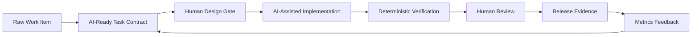
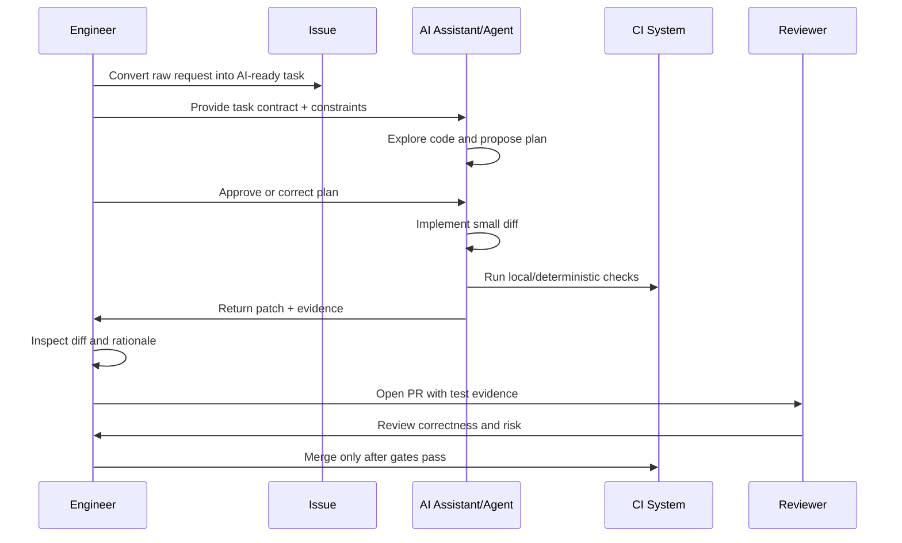
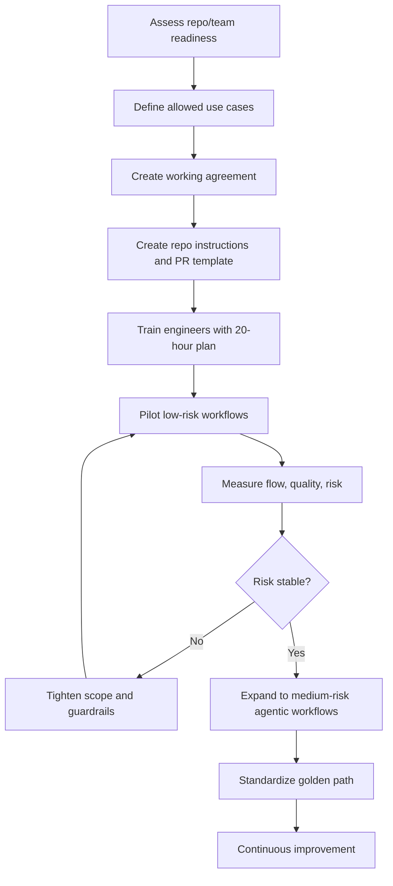

# Part 029 — Adoption Playbook for Engineering Teams

AI development adoption yang matang bukan dimulai dari pertanyaan “tool apa yang paling pintar?”, melainkan dari pertanyaan: **workflow engineering mana yang bisa dibuat lebih cepat tanpa menurunkan correctness, maintainability, security, dan accountability?**

Di level team, AI tidak boleh diperlakukan sebagai eksperimen individual yang tersebar tanpa standar. Untuk engineer senior/staff, tujuan adopsi adalah membangun **operating system**: policy ringan, workflow jelas, repo siap dibaca AI, review gate, evidence, measurement, dan feedback loop.

Part ini adalah playbook implementasi tim. Fokusnya bukan teori AI, melainkan cara membuat AI development menjadi kemampuan organisasi yang repeatable.

---

## 1. Mental Model: AI Adoption Is Workflow Redesign

Banyak organisasi gagal mengadopsi AI karena memperlakukannya seperti “install plugin lalu produktivitas naik”. Itu salah framing.

AI coding assistant/agent mengubah alur kerja pada beberapa titik:

1. **Requirement clarification** menjadi lebih eksplisit.
2. **Design exploration** menjadi lebih murah, tetapi risk of plausible nonsense naik.
3. **Implementation** menjadi lebih cepat, tetapi review burden dapat naik.
4. **Testing** menjadi lebih luas, tetapi test oracle bisa melemah.
5. **Documentation** lebih mudah dibuat, tetapi stale docs bisa menyebar lebih cepat.
6. **Governance** butuh evidence otomatis, bukan approval manual berlebihan.

Jadi adoption playbook harus mengatur **flow of work**, bukan hanya “cara prompt”.



Prinsip utama:

> AI boleh mempercepat produksi perubahan, tetapi tidak boleh mengaburkan siapa yang memahami, menyetujui, dan bertanggung jawab atas perubahan itu.

---

## 2. Adoption Goals: Jangan Mulai dari Tool, Mulai dari Outcome

Sebelum memilih tool, definisikan outcome yang ingin diperbaiki.

Contoh outcome yang valid:

| Outcome | Contoh Target | Kenapa Penting |
|---|---:|---|
| Reduce issue-to-PR latency | 20–40% lebih cepat untuk low/medium risk task | Mengurangi waiting time dan context switching |
| Improve test evidence | Setiap PR punya explicit test rationale | Menghindari AI-generated changes tanpa bukti |
| Reduce review churn | Lebih sedikit round-trip review untuk masalah trivial | Reviewer fokus ke correctness dan design |
| Improve documentation freshness | Docs impact statement di setiap PR relevan | Knowledge base tidak tertinggal dari code |
| Improve incident repair speed | RCA dan fix hypothesis lebih cepat | Mengurangi mean recovery time |
| Reduce onboarding friction | Engineer baru lebih cepat memahami repo | AI-readable repo juga human-readable repo |

Outcome yang lemah:

- “Meningkatkan jumlah code yang ditulis AI.”
- “Memakai tool X di semua repo.”
- “Semua engineer wajib pakai AI setiap hari.”
- “Mengurangi headcount engineering.”

Output adoption yang benar adalah **better delivery system**, bukan demo AI yang terlihat impresif.

---

## 3. Adoption Maturity Model

Gunakan maturity model untuk mengetahui posisi team.

| Level | Nama | Ciri | Risiko Utama | Target Naik Level |
|---:|---|---|---|---|
| 0 | Unmanaged | Engineer pakai AI secara pribadi tanpa standar | Secret leakage, inconsistent quality, no audit | Basic policy + allowed use |
| 1 | Assisted | AI dipakai untuk snippet, explanation, test draft | Blind accept, context salah | Prompt template + review checklist |
| 2 | Workflow-Aware | AI dipakai dalam issue/design/test/review flow | Review burden naik | AI-ready task + deterministic gates |
| 3 | Team-Standardized | Repo punya instructions, test scripts, PR template, docs policy | Over-standardization | Measurement + exception handling |
| 4 | Agentic-Controlled | Background/cloud agent dipakai dengan sandbox dan approval | Excessive agency, tool risk | Permission profiles + audit evidence |
| 5 | Governed Continuous Improvement | Adoption dimonitor dengan delivery, quality, risk metrics | Gaming metrics | Feedback loop + governance review |

Jangan lompat langsung ke Level 4 kalau Level 2 belum stabil. Cloud/background agent hanya aman jika task slicing, context engineering, test gates, dan review discipline sudah matang.

---

## 4. Team Readiness Checklist

AI development adoption paling sering gagal bukan karena model buruk, tetapi karena repo dan workflow tidak siap.

### 4.1 Repository Readiness

Sebuah repo disebut AI-ready jika agent dapat menjawab pertanyaan berikut tanpa tebak-tebakan:

- Apa tujuan sistem ini?
- Bagaimana menjalankan test utama?
- Bagaimana menjalankan subset test untuk module tertentu?
- Di mana boundary module/domain?
- File mana yang tidak boleh disentuh sembarangan?
- Bagaimana convention error handling, logging, validation, dan dependency injection?
- Apa invariant domain yang tidak boleh dilanggar?
- Bagaimana membuat PR yang acceptable?

Minimal file yang disarankan:

```text
repo/
├── README.md
├── AGENTS.md              # instructions untuk coding agent
├── docs/
│   ├── architecture.md
│   ├── domain-glossary.md
│   ├── runbook.md
│   └── adr/
├── .github/
│   ├── pull_request_template.md
│   └── workflows/
├── scripts/
│   ├── test-unit.sh
│   ├── test-integration.sh
│   ├── lint.sh
│   └── verify-pr.sh
└── modules/
```

### 4.2 Workflow Readiness

Sebelum AI agent menulis code, team harus punya:

- issue template yang memaksa acceptance criteria;
- PR template dengan test evidence;
- branch protection;
- CI yang reliable;
- deterministic checks untuk lint/test/security;
- code ownership atau reviewer routing;
- known flaky test list;
- deployment rollback/runbook.

Jika CI flaky, AI adoption sering menjadi noise amplifier. Agent akan menghabiskan waktu “memperbaiki” failure yang tidak berkaitan dengan patch.

---

## 5. AI Use-Case Portfolio

Tidak semua pekerjaan cocok untuk level autonomy yang sama. Buat portfolio berdasarkan risk dan repeatability.

| Use Case | Risk | Repeatability | AI Mode | Human Gate |
|---|---:|---:|---|---|
| Explain unfamiliar code | Low | High | Chat/repo Q&A | Tidak perlu formal |
| Draft unit tests | Low-Medium | High | Pair assistant | Engineer reviews oracle |
| Refactor naming/local structure | Medium | High | IDE/CLI agent | Diff review + tests |
| Fix simple bug with reproduction | Medium | Medium | Agent branch | Failing test must pass |
| API contract change | High | Medium | Assisted design + implementation | Contract review required |
| Database migration | High | Medium | Assisted only | DBA/senior review + rollout plan |
| Security-sensitive code | High | Low-Medium | Assisted review, not autonomous | Security review |
| Incident hotfix | High | Low | AI for hypothesis/logs | Human command |
| CI failure triage | Medium | High | Background agent | Human approves workflow changes |
| Documentation sync | Low | High | Automation/agent | PR review |

Golden rule:

> Start adoption from high-repeatability, low-to-medium-risk workflows. Expand autonomy only after measurement proves review burden and defect risk remain controlled.

---

## 6. The AI Working Agreement

Team perlu working agreement yang eksplisit. Ini bukan birokrasi; ini cara mengurangi ambiguity.

Contoh:

```md
# Team AI Working Agreement

## Allowed
- Use AI to understand code, generate test ideas, draft refactors, summarize PRs, and diagnose CI failures.
- Use AI-generated code only after engineer review.
- Use repo-approved agent instructions and scripts.

## Restricted
- Do not paste production secrets, customer data, credentials, private keys, or regulated data into external tools.
- Do not let agent modify migration, auth, payment, encryption, permission, or deployment workflow files without explicit review.
- Do not merge PRs authored by AI without test evidence and human owner approval.

## Required Evidence
- State what AI was used for when material to the change.
- Include tests run and why they are sufficient.
- Include docs/ADR impact when behavior, API, or architecture changes.

## Stop Conditions
- Agent edits unrelated files.
- Agent changes public contract without request.
- Agent disables tests or weakens assertions.
- Agent asks for secrets or elevated permissions.
- Agent cannot explain the reason for a change.
```

Working agreement harus pendek, spesifik, dan actionable. Jika terlalu panjang, engineer tidak akan membacanya dan agent akan kehilangan sinyal.

---

## 7. Role Design: Who Does What?

Adopsi AI gagal ketika ownership kabur.

### 7.1 Individual Contributor

Engineer tetap bertanggung jawab atas:

- problem framing;
- code ownership;
- correctness;
- review of generated changes;
- test sufficiency;
- production impact.

AI membantu, tetapi tidak menjadi accountable party.

### 7.2 Tech Lead

Tech lead bertanggung jawab atas:

- memilih use case awal;
- membuat prompt/task templates;
- menentukan repo instructions;
- menyusun review rubric;
- menjaga metrics agar tidak digaming;
- mengelola exception.

### 7.3 Staff/Principal Engineer

Staff/principal engineer bertanggung jawab atas:

- cross-repo patterns;
- governance architecture;
- risk taxonomy;
- platform enablement;
- architectural guardrails;
- rollout strategy lintas team.

### 7.4 Engineering Manager

Engineering manager bertanggung jawab atas:

- adoption goals;
- training time;
- psychological safety;
- review capacity;
- measurement interpretation;
- avoiding productivity theater.

---

## 8. Pilot Design: 4-Week Adoption Experiment

Jangan roll out ke seluruh organisasi sekaligus. Mulai dari pilot yang punya measurement.

### Week 1 — Baseline and Guardrails

Deliverables:

- select 1–2 repositories;
- define allowed AI tools;
- define restricted data/classes of code;
- document baseline metrics;
- create `AGENTS.md` or equivalent repo instruction;
- create PR evidence template.

Baseline yang diambil:

- median issue-to-PR time;
- median PR review round trips;
- test failure rate;
- rework rate;
- escaped defect count;
- reviewer sentiment;
- CI reliability.

### Week 2 — Low-Risk Workflow Adoption

Use cases:

- code explanation;
- test idea generation;
- PR summary;
- documentation sync;
- local refactor with tests.

Rules:

- no autonomous DB/security/auth/deployment changes;
- every AI-generated patch must pass deterministic checks;
- reviewer marks AI-related quality issues.

### Week 3 — Medium-Risk Agentic Tasks

Use cases:

- bug fix with reproduction;
- CI failure triage;
- isolated module refactor;
- test gap repair;
- small API implementation behind existing contract.

Rules:

- task packet required;
- stop condition required;
- PR-per-intent;
- human design gate for behavior change.

### Week 4 — Evaluate and Standardize

Outputs:

- adoption report;
- updated working agreement;
- reusable prompt library;
- repo readiness gaps;
- decision: expand, hold, or rollback.

Pilot success is not “engineers liked it”. Success is measurable improvement without risk regression.

---

## 9. Golden Path Workflow

A golden path adalah workflow default yang paling aman dan paling mudah diikuti.



Golden path harus menjawab:

- kapan AI boleh mulai coding;
- kapan AI hanya boleh menjelaskan;
- kapan human design gate wajib;
- apa bukti minimal sebelum PR;
- apa yang membuat pekerjaan harus dihentikan.

---

## 10. Prompt and Task Template Library

Team perlu prompt library, tetapi jangan menjadikannya ritual. Template harus membantu engineer berpikir lebih baik.

### 10.1 Codebase Exploration

```md
You are helping me understand this repository before making a change.

Goal:
- Explain the execution path for <feature/behavior>.

Constraints:
- Do not propose changes yet.
- Cite file paths and functions/classes.
- Separate confirmed facts from hypotheses.

Output:
1. Entry points
2. Core flow
3. Data model involved
4. External dependencies
5. Tests that cover the behavior
6. Unknowns that require verification
```

### 10.2 Implementation Work Packet

```md
Implement this change as a small, reviewable diff.

Intent:
- <business/technical intent>

Current behavior:
- <observed behavior>

Target behavior:
- <desired behavior>

Scope:
- In scope: <files/modules/features>
- Out of scope: <explicit exclusions>

Constraints:
- Preserve public API compatibility unless stated.
- Do not modify migrations/auth/security/deployment files.
- Do not weaken tests.

Verification:
- Add or update tests proving the behavior.
- Run <commands>.
- Report failures without hiding them.

Stop conditions:
- If required change spans more than <N> files.
- If public contract needs to change.
- If tests fail for unrelated reasons.
```

### 10.3 Review Prompt

```md
Review this diff as a senior engineer.

Focus on:
- correctness;
- edge cases;
- backward compatibility;
- test sufficiency;
- security;
- maintainability;
- unintended scope expansion.

Do not comment on style unless it affects maintainability.
Classify each issue as blocker, major, minor, or suggestion.
```

---

## 11. Training Plan Using Kaufman’s First 20 Hours

Kaufman-style learning means we do not try to master everything upfront. We deconstruct the skill, learn enough to self-correct, remove barriers, and practice deliberately.

### 11.1 Target Performance

After 20 hours, each engineer should be able to:

- create AI-ready task contracts;
- use AI to explore code without accepting hallucinations;
- implement small changes with AI while preserving ownership;
- evaluate generated tests;
- review AI-generated PRs;
- detect common AI failure modes;
- produce evidence for risk-sensitive changes.

### 11.2 20-Hour Team Curriculum

| Hours | Focus | Practice |
|---:|---|---|
| 1–2 | AI workflow mental model | Compare chat, IDE assistant, CLI agent, cloud agent |
| 3–4 | Context engineering | Create repo instruction and task context pack |
| 5–6 | Requirement slicing | Convert 3 vague tickets into AI-ready tasks |
| 7–8 | Pair implementation | Implement small diff with AI, review line by line |
| 9–10 | Test generation | Generate tests, strengthen assertions, remove weak tests |
| 11–12 | Debugging/RCA | Use AI to build hypothesis tree from logs/failing tests |
| 13–14 | Refactoring safety | Add characterization tests before refactor |
| 15–16 | AI code review | Review AI-generated PR with severity rubric |
| 17–18 | Sandbox/permission | Define tool permission and stop conditions |
| 19–20 | Capstone | Issue → design → implementation → tests → PR evidence |

### 11.3 Practice Rule

Every practice session should produce an artifact:

- task contract;
- diff;
- test evidence;
- review notes;
- runbook update;
- metric observation.

No artifact means no learning trace.

---

## 12. Measurement System

Measurement harus menjawab tiga pertanyaan:

1. Apakah delivery lebih cepat?
2. Apakah quality tetap atau membaik?
3. Apakah risk dan review burden tetap terkendali?

### 12.1 Balanced Metrics

| Dimension | Metric | Good Signal | Bad Signal |
|---|---|---|---|
| Flow | Issue-to-PR time | Turun untuk safe tasks | Turun tetapi defects naik |
| Review | Review round trips | Turun karena PR lebih jelas | Turun karena reviewer rubber-stamp |
| Quality | Change failure rate | Stabil/turun | Naik setelah AI adoption |
| Testing | Test evidence quality | Assertions membaik | Coverage naik tapi oracle lemah |
| Maintainability | Rework rate | Turun | PR kecil tapi banyak follow-up fix |
| Security | Policy violations | Turun/stabil | Secret/data leaks atau unsafe dependency |
| Cost | AI cost per accepted PR | Terkendali | Banyak token untuk low-value tasks |
| Human Load | Reviewer burden | Turun | Reviewer harus memperbaiki AI output |

### 12.2 Avoid Vanity Metrics

Hindari:

- number of prompts;
- lines generated by AI;
- number of AI PRs;
- percent of engineers using AI;
- subjective excitement only.

Metrik ini mudah naik tanpa membuktikan business value.

---

## 13. Review System for AI-Generated Work

Reviewer perlu tahu mana yang harus diperiksa lebih keras.

### 13.1 Risk Labels

Tambahkan label PR:

- `ai-assisted-low-risk`
- `ai-assisted-medium-risk`
- `ai-assisted-high-risk`
- `ai-generated-tests`
- `ai-generated-docs`
- `agentic-background-task`
- `requires-security-review`
- `requires-db-review`

Label bukan untuk stigma. Label adalah routing signal.

### 13.2 Reviewer Checklist

Reviewer harus menanyakan:

- Apakah PR menyelesaikan requirement yang benar?
- Apakah ada scope expansion?
- Apakah test membuktikan behavior, bukan implementation detail rapuh?
- Apakah error handling sesuai convention?
- Apakah public contract berubah?
- Apakah generated code memperkenalkan dependency baru?
- Apakah AI melemahkan lint/test/security gate?
- Apakah docs/ADR/runbook perlu update?

---

## 14. Governance Without Blocking Delivery

Governance yang buruk berbentuk approval berlapis tanpa konteks. Governance yang baik berbentuk guardrail yang membuat jalur aman lebih mudah daripada jalur berisiko.

### 14.1 Policy as Defaults

Contoh default:

- AI boleh digunakan untuk code understanding dan test ideation.
- AI boleh membuat patch pada branch terisolasi.
- AI tidak boleh merge.
- AI tidak boleh membaca secrets.
- AI tidak boleh mengubah protected path tanpa approval.
- AI-generated patch harus lewat CI dan human review.

### 14.2 Exception Process

Exception harus jelas:

```md
## AI Policy Exception Request

Requested exception:
- <what permission/tool/data is needed>

Reason:
- <why default policy is insufficient>

Scope:
- Repo/module/task/timebox

Risk:
- Data exposure
- Command execution
- Contract change
- Production impact

Mitigation:
- Sandbox
- Logging
- Human approval
- Test gate
- Rollback plan

Expiry:
- <date or condition>
```

Exception tanpa expiry cenderung menjadi policy baru yang tidak disadari.

---

## 15. Adoption Anti-Patterns

### 15.1 Vibe Coding as Team Process

Vibe coding bisa berguna untuk prototype kecil, tetapi buruk sebagai engineering process jika:

- requirement tidak jelas;
- test tidak kuat;
- reviewer tidak memahami diff;
- PR besar dan sulit direview;
- production risk tidak dikontrol.

### 15.2 AI Everywhere

Tidak semua workflow butuh AI. Memaksa AI pada task sederhana bisa memperlambat pekerjaan.

### 15.3 Prompt Library Theater

Prompt library tidak berguna jika tidak dikaitkan dengan:

- repo context;
- task type;
- verification command;
- review rubric;
- stop condition.

### 15.4 Rubber-Stamp Review

Jika reviewer berpikir “AI pasti benar” atau “CI pass berarti aman”, adoption sudah berbahaya.

### 15.5 Agent Sprawl

Terlalu banyak agent dengan permission berbeda tanpa registry membuat risk tidak terlihat.

### 15.6 Metrics Gaming

Jika engineer diberi target “gunakan AI lebih banyak”, mereka akan mengoptimalkan penggunaan, bukan value.

---

## 16. Rollout Strategy by Organization Size

### 16.1 Small Team

Mulai dengan:

- one working agreement;
- one repo instruction file;
- one PR template;
- one weekly review of AI-assisted PRs;
- simple metrics.

### 16.2 Mid-Size Engineering Org

Tambahkan:

- tool registry;
- training curriculum;
- risk labels;
- golden path docs;
- repo readiness score;
- champion group.

### 16.3 Enterprise / Regulated Environment

Tambahkan:

- data classification;
- model/tool approval;
- audit trail;
- legal/IP review;
- security review;
- centralized policy with team-level extension;
- evidence retention.

---

## 17. Repo Readiness Scorecard

Gunakan scorecard 0–3.

| Area | 0 | 1 | 2 | 3 |
|---|---|---|---|---|
| Setup | Tidak jelas | README basic | Script setup ada | Setup deterministic |
| Test | Manual/fragile | Unit test partial | Test commands jelas | Fast/reliable targeted tests |
| Architecture | Tacit knowledge | Diagram usang | Docs cukup | AI-readable architecture map |
| Domain | Tidak terdokumentasi | Glossary partial | Invariant ada | Decision table + examples |
| PR Process | Informal | Template basic | Evidence required | Risk-based routing |
| Security | Tidak ada policy | General warning | Protected paths | Guardrail + audit |
| Agent Instructions | Tidak ada | Generic | Repo-specific | Layered + maintained |

Interpretation:

- 0–7: do not use background agent yet;
- 8–14: safe for assistant/pair mode;
- 15–20: safe for bounded agent tasks;
- 21: ready for controlled agentic workflow.

---

## 18. Implementation Roadmap



---

## 19. Definition of Done for AI Adoption

A team has adopted AI development well when:

- engineer can explain every AI-assisted change;
- PRs remain small and reviewable;
- tests prove behavior, not just coverage;
- review burden does not increase materially;
- security/data policies are understood;
- tool permissions are explicit;
- docs and runbooks stay synchronized;
- delivery metrics improve without stability regression;
- governance evidence is produced as part of normal workflow.

If adoption only produces faster typing, the team has captured the least valuable benefit.

---

## 20. Practical Exercises

### Exercise 1 — Create a Team Working Agreement

Take one real repository and write a one-page AI working agreement.

Include:

- allowed use;
- restricted use;
- required evidence;
- stop conditions;
- protected paths.

### Exercise 2 — Score Repo Readiness

Use the scorecard and identify top 5 improvements.

Typical high-leverage fixes:

- add `scripts/verify-pr.sh`;
- document test commands;
- add domain glossary;
- add PR evidence template;
- mark protected paths.

### Exercise 3 — Run a Low-Risk Pilot

Pick three issues:

- one test improvement;
- one docs sync;
- one local refactor.

Measure:

- time spent;
- review comments;
- test quality;
- unexpected changes.

### Exercise 4 — Review an AI-Generated PR

Use severity rubric:

- blocker: unsafe/wrong behavior;
- major: likely defect or maintainability risk;
- minor: local quality issue;
- suggestion: optional improvement.

---

## 21. Summary

AI development adoption is not a tool rollout. It is a delivery-system change.

The effective path is:

1. define outcomes;
2. prepare repo and workflow;
3. start with low-risk repeatable tasks;
4. use task contracts and review gates;
5. measure flow, quality, risk, and cost;
6. expand autonomy only after evidence;
7. keep human accountability explicit.

The top-tier engineer does not merely “use AI”. They design the socio-technical system in which AI output becomes safe, useful, measurable, and maintainable.

---

## References

- OpenAI Codex documentation: https://developers.openai.com/codex/
- OpenAI Codex AGENTS.md guide: https://developers.openai.com/codex/guides/agents-md
- GitHub Copilot cloud agent documentation: https://docs.github.com/en/copilot/how-tos/use-copilot-agents/cloud-agent/start-copilot-sessions
- Claude Code documentation: https://code.claude.com/docs/en/overview
- Claude Code permissions: https://code.claude.com/docs/en/permissions
- Model Context Protocol documentation: https://modelcontextprotocol.io/docs/getting-started/intro
- DORA metrics: https://dora.dev/guides/dora-metrics/
- OWASP Top 10 for LLM Applications: https://genai.owasp.org/llm-top-10/
- NIST AI Risk Management Framework: https://www.nist.gov/itl/ai-risk-management-framework
