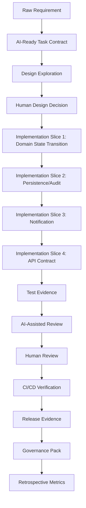
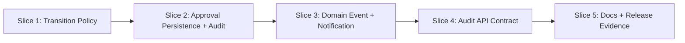
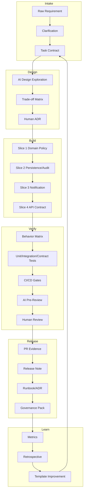

# Part 030 — Capstone: AI-Driven Delivery System

Ini adalah bagian terakhir seri **Learn AI Development Driven Implementation and Usage**.

Capstone ini menggabungkan semua skill dari Part 001–029 menjadi satu workflow utuh:

> raw issue → task contract → design → implementation → test evidence → review → CI repair → PR → release note → governance evidence → retrospective.

Tujuannya bukan membuat demo AI yang terlihat canggih. Tujuannya adalah membuktikan bahwa engineer dapat memakai AI untuk delivery nyata dengan standar top-tier: **jelas, kecil, aman, terukur, dan defensible**.

---

## 1. Capstone Scenario

Bayangkan kita punya sistem case management internal untuk regulatory enforcement lifecycle. Ada requirement baru:

> “When a case is escalated to Formal Investigation, the system should require a supervisor approval record, preserve the escalation reason, notify the assigned investigation team, and expose the escalation timestamp in the case audit API.”

Requirement ini terlihat sederhana, tetapi sebenarnya menyentuh banyak boundary:

- state machine;
- authorization;
- audit trail;
- notification;
- API contract;
- persistence;
- test strategy;
- documentation;
- rollout.

Ini cocok untuk capstone karena memaksa kita memakai AI sebagai collaborator, bukan sekadar code generator.

---

## 2. Target Architecture of the Workflow



Workflow ini sengaja memecah pekerjaan agar:

- AI tidak membuat patch terlalu besar;
- reviewer bisa memahami intent per slice;
- regression lebih mudah dideteksi;
- rollback/forward-fix lebih realistis;
- audit evidence tidak dibuat belakangan.

---

## 3. Step 1 — Convert Raw Requirement into AI-Ready Task Contract

Jangan langsung meminta AI “implement feature ini”. Itu cara tercepat menuju diff besar yang sulit direview.

Buat task contract.

```md
# Task Contract: Formal Investigation Escalation Approval

## Intent
When a case moves from Preliminary Review to Formal Investigation, the system must capture supervisor approval evidence and expose the escalation timestamp in audit-facing APIs.

## Current Behavior
- Cases can be escalated through the existing case state transition service.
- Escalation reason may exist as free-text transition metadata.
- Audit API currently exposes case status history but not escalation timestamp for Formal Investigation specifically.
- Notification behavior exists for some assignment changes but not confirmed for investigation team escalation.

## Target Behavior
- Formal Investigation transition requires supervisor approval record.
- Escalation reason must be preserved.
- Assigned investigation team must be notified.
- Case audit API must expose Formal Investigation escalation timestamp.

## In Scope
- Domain transition validation.
- Approval record persistence or association.
- Audit event creation.
- Notification trigger.
- API response field addition if backward-compatible.
- Unit/integration/contract tests.

## Out of Scope
- New UI workflow.
- Bulk migration of historical cases unless required by API contract.
- Changing unrelated case states.
- Replacing notification infrastructure.
- Rewriting state machine framework.

## Invariants
- A case cannot enter Formal Investigation without supervisor approval.
- Escalation reason must be immutable after transition.
- Audit event must be generated exactly once per successful transition.
- Failed transition must not send notification.
- API addition must be backward-compatible.

## Verification
- Unit tests for transition guard.
- Integration test for approval persistence + audit event.
- Test notification is emitted after successful transition only.
- Contract/API test for audit timestamp field.
- Regression test for other transitions.

## Stop Conditions
- Public API requires breaking change.
- Historical data migration is needed.
- Authorization model is unclear.
- Notification side effect cannot be made idempotent.
- Change touches more than expected bounded modules.
```

This task contract is the first control surface. It turns vague intent into verifiable work.

---

## 4. Step 2 — Ask AI for Design Exploration, Not Code

Use AI first to explore design options.

```md
Analyze the task contract and propose implementation options.

Do not write code yet.

For each option, include:
1. Files/modules likely affected.
2. Domain model changes.
3. Persistence changes.
4. API compatibility impact.
5. Notification behavior.
6. Test strategy.
7. Failure modes.
8. Rollback/forward-fix implications.
9. Recommendation.

Separate confirmed facts from assumptions.
Ask questions only if the implementation would be unsafe without the answer.
```

Expected design output should look like this.

| Option | Description | Pros | Cons | When to Choose |
|---|---|---|---|---|
| A | Add approval requirement inside existing transition service | Centralized invariant | May make transition service heavier | Best if all state transition rules already live there |
| B | Add separate escalation policy component | Clear policy boundary | More indirection | Best if rules vary by case type/jurisdiction |
| C | Add workflow orchestration layer | Explicit side-effect ordering | Larger change | Best if many side effects and retries are needed |

For capstone, assume Option B is selected:

> Add a dedicated `FormalInvestigationEscalationPolicy` used by the transition service, persist approval evidence, publish a domain event after transaction commit, and extend audit API with a backward-compatible timestamp field.

---

## 5. Step 3 — Create an ADR

AI can draft the ADR, but human must own the decision.

```md
# ADR: Formal Investigation Escalation Approval Policy

## Status
Accepted

## Context
Formal Investigation escalation is a regulatory-sensitive transition. The system must preserve supervisor approval evidence, escalation reason, audit timestamp, and notification behavior.

## Decision
Implement a dedicated FormalInvestigationEscalationPolicy invoked by the case transition service. On successful transition, persist approval evidence and escalation metadata in the transition/audit model. Publish a domain event after commit to notify the assigned investigation team. Extend the audit API with a backward-compatible field for formal investigation escalation timestamp.

## Consequences
- Transition invariants remain centralized through the transition service.
- Formal Investigation-specific rules are isolated in a policy component.
- Notification happens after successful persistence, reducing false notification risk.
- API consumers receive additional field without breaking existing clients.
- Future jurisdiction-specific escalation rules can be added behind the policy boundary.

## Alternatives Considered
- Put all logic directly inside transition service.
- Build a new orchestration workflow.
- Store approval only as free-text transition metadata.
```

ADR memastikan future maintainer tahu mengapa desain ini dipilih.

---

## 6. Step 4 — Slice the Implementation

Jangan minta AI mengerjakan seluruh feature sekaligus. Pecah menjadi 4–5 slice.



### Slice 1 — Domain Transition Policy

Goal:

- Formal Investigation transition requires supervisor approval.
- Transition fails before persistence if approval missing.

AI work packet:

```md
Implement Slice 1 only.

Goal:
- Add FormalInvestigationEscalationPolicy.
- Enforce supervisor approval presence for transition into Formal Investigation.

Constraints:
- Do not change persistence schema.
- Do not send notifications.
- Do not change API responses.
- Keep diff small.

Tests:
- Missing approval rejects transition.
- Valid approval allows transition.
- Other transitions remain unaffected.

Stop:
- If transition service design requires broader rewrite.
```

### Slice 2 — Approval Persistence and Audit

Goal:

- Preserve approval ID/user/time.
- Preserve escalation reason.
- Generate audit event exactly once.

### Slice 3 — Notification Event

Goal:

- Publish event after successful transaction.
- Notify assigned investigation team.
- Ensure failed transition does not notify.

### Slice 4 — Audit API Contract

Goal:

- Expose `formalInvestigationEscalatedAt` or equivalent field.
- Preserve backward compatibility.
- Add API/contract test.

### Slice 5 — Documentation and Release Evidence

Goal:

- Update ADR/runbook/API docs.
- Add release note.
- Add governance evidence.

---

## 7. Step 5 — Implementation Prompt Pattern

For each slice, use this prompt structure.

```md
You are implementing one bounded slice.

Task:
- <slice goal>

Relevant context:
- <files/classes/modules>

Constraints:
- Keep diff minimal.
- Preserve existing conventions.
- Do not alter unrelated behavior.
- Do not weaken tests.
- Do not disable checks.

Expected output:
1. Brief plan.
2. Files changed.
3. Implementation diff.
4. Tests added/updated.
5. Commands run.
6. Known limitations.

Stop if:
- You need to change public API outside the requested slice.
- You find conflicting domain behavior.
- The change spans unrelated modules.
```

This makes AI behave closer to a disciplined junior/mid engineer working under senior review.

---

## 8. Step 6 — Test Strategy

Testing must prove behavior, not merely increase coverage.

### 8.1 Test Matrix

| Scenario | Expected Result | Test Type |
|---|---|---|
| Escalate without approval | Reject transition | Unit |
| Escalate with valid approval | Transition succeeds | Unit/integration |
| Escalation reason provided | Reason persisted | Integration |
| Successful transition | Audit event generated once | Integration |
| Failed transition | No audit event, no notification | Integration |
| Assigned team exists | Notification emitted | Integration/contract |
| API fetch audit | Timestamp exposed | API/contract |
| Other transition | Behavior unchanged | Regression |
| Duplicate command/retry | Idempotent behavior | Unit/integration |

### 8.2 AI Test Generation Prompt

```md
Generate tests for the behavior matrix below.

Rules:
- Tests must assert externally observable behavior.
- Avoid brittle assertions on private implementation details.
- Include negative tests.
- Include regression tests for unrelated transitions.
- Do not add weak tests that only verify mocks were called unless the mock represents an external boundary.

Behavior matrix:
<paste matrix>
```

### 8.3 Test Oracle Quality

A good assertion says:

- what behavior changed;
- what invariant is protected;
- what side effect happened or did not happen.

Weak assertion:

```java
assertNotNull(result);
```

Better assertion:

```java
assertThat(result.status()).isEqualTo(CaseStatus.FORMAL_INVESTIGATION);
assertThat(result.escalationReason()).isEqualTo("Evidence threshold met");
assertThat(auditEvents).containsExactlyOnce(eventMatching("FORMAL_INVESTIGATION_ESCALATED"));
```

---

## 9. Step 7 — AI-Assisted Review

Before human review, ask AI to review the diff.

```md
Review this diff as a senior engineer.

Focus:
- domain invariants;
- transaction boundary;
- idempotency;
- notification ordering;
- API backward compatibility;
- audit evidence;
- test sufficiency;
- unintended scope expansion;
- security/authorization risk.

Classify each finding:
- blocker;
- major;
- minor;
- suggestion.

Do not invent facts. If context is missing, say what needs inspection.
```

AI review is not the final authority. It is a second-pass checklist generator.

### 9.1 Human Review Checklist

Reviewer should verify:

- transition cannot bypass approval;
- approval actor is authorized;
- audit event is tied to durable state change;
- notification cannot fire on failed transaction;
- retry behavior is safe;
- API change is backward-compatible;
- tests cover negative and side-effect behavior;
- generated code follows repository conventions;
- no unrelated files changed.

---

## 10. Step 8 — CI Failure Repair Workflow

If CI fails, do not ask AI “fix CI” generically.

Use structured failure triage.

```md
Analyze this CI failure.

Inputs:
- Branch diff summary: <summary>
- Failed command: <command>
- Error log: <log>
- Relevant tests: <test files>

Tasks:
1. Classify failure as related, unrelated, flaky, environment, or unknown.
2. Identify minimal failing behavior.
3. Propose smallest fix.
4. State whether test or implementation should change.
5. Do not weaken assertions or skip tests.
```

Failure categories:

| Category | Meaning | Action |
|---|---|---|
| Related implementation failure | Patch is wrong | Fix implementation |
| Related test failure | Test oracle wrong or fixture incomplete | Fix test carefully |
| Flaky test | Existing nondeterminism | Re-run + isolate; do not hide |
| Environment failure | Infra/dependency issue | Document and rerun |
| Unrelated failure | Baseline failure | Attach evidence |
| Unknown | Not enough data | Investigate more |

---

## 11. Step 9 — PR Template

PR must be evidence-rich.

```md
## Summary
Adds supervisor approval enforcement for Formal Investigation escalation, persists escalation evidence, emits notification after successful transition, and exposes escalation timestamp in audit API.

## Scope
- Formal Investigation transition policy
- Approval persistence/audit metadata
- Notification event after commit
- Audit API timestamp field
- Tests and documentation

## Out of Scope
- UI workflow
- Historical case migration
- State machine rewrite
- New notification provider

## Design Decision
See ADR: Formal Investigation Escalation Approval Policy.

## Test Evidence
- Unit: transition rejects missing approval
- Unit: other transitions unaffected
- Integration: approval + reason persisted
- Integration: audit event generated exactly once
- Integration: failed transition does not notify
- Contract/API: audit timestamp exposed backward-compatibly

Commands run:
- ./scripts/test-unit.sh
- ./scripts/test-integration.sh --module case-management
- ./scripts/verify-pr.sh

## Risk
Medium-high. Touches state transition, audit, notification, and API output.

## Rollout
Backward-compatible API addition. No destructive migration. Monitor escalation errors and notification failures.

## AI Assistance Disclosure
AI was used for design option exploration, test matrix drafting, implementation assistance for bounded slices, and pre-review checklist generation. Human author reviewed and accepted all changes.
```

Disclosure style depends on company policy. The important part is not performative disclosure; it is clear ownership and evidence.

---

## 12. Step 10 — Release Note and Runbook Update

### 12.1 Release Note

```md
Formal Investigation escalation now requires supervisor approval evidence. The system preserves the escalation reason, records the escalation timestamp for audit consumers, and notifies the assigned investigation team after successful escalation.
```

### 12.2 Runbook Update

```md
## Formal Investigation Escalation Failures

### Symptoms
- Case escalation request rejected.
- No notification sent to investigation team.
- Audit API missing Formal Investigation timestamp.

### Common Causes
- Supervisor approval missing.
- Supervisor approval actor lacks permission.
- Case not in a state eligible for Formal Investigation.
- Notification provider unavailable after successful transition.

### Checks
1. Verify case transition history.
2. Verify approval record exists.
3. Verify audit event was created.
4. Verify notification event was published.
5. Check retry/dead-letter queue for notification failure.

### Recovery
- Do not manually edit case status.
- If transition failed, resubmit with valid approval.
- If notification failed after successful transition, replay notification event if idempotency key is present.
```

---

## 13. Step 11 — Governance Evidence Pack

For regulated or high-risk environments, create evidence as part of delivery.

```md
# Governance Evidence Pack

## Change
Formal Investigation escalation approval enforcement.

## Risk Classification
Medium-high.

## Data Impact
No new customer data class introduced. Approval metadata stored as regulatory audit evidence.

## Security Impact
Requires supervisor approval. Authorization verified through existing approval/identity model.

## API Impact
Backward-compatible audit API field addition.

## Migration Impact
No destructive migration. Historical data behavior documented.

## Test Evidence
See PR test evidence.

## Rollback/Forward-Fix
Feature can be disabled only if policy is behind configuration. Otherwise forward-fix required because persisted audit behavior must remain consistent.

## Human Accountability
Author: <engineer>
Reviewer: <reviewer>
Approver: <approver>

## AI Usage
AI assisted design exploration, implementation drafting, test matrix, and pre-review checklist. Human engineer reviewed all outputs.
```

Governance evidence should not be written after the fact from memory. It should be produced from the same workflow that produced the code.

---

## 14. Step 12 — Retrospective and Metrics

After merge, measure the workflow.

| Metric | Question |
|---|---|
| Lead time | Did AI reduce time from issue to PR? |
| Review rounds | Did reviewer churn decrease or increase? |
| Defects | Were issues found after merge? |
| Test quality | Did tests catch meaningful behavior? |
| Scope control | Did AI keep diff bounded? |
| Cost | Was token/tool cost reasonable for value? |
| Cognitive load | Did engineer understand the final patch? |
| Documentation freshness | Were ADR/runbook/API docs updated? |

Retrospective prompt:

```md
Analyze this AI-assisted delivery workflow.

Inputs:
- Task contract
- PR diff summary
- Review comments
- CI failures
- Test evidence
- Time spent

Output:
1. What AI accelerated.
2. What AI made worse.
3. Where context was missing.
4. Which prompt/template should be improved.
5. Which guardrail should be added.
6. Whether this task type is safe for future agentic delegation.
```

---

## 15. Capstone Quality Rubric

Score each area 0–3.

| Area | 0 | 1 | 2 | 3 |
|---|---|---|---|---|
| Task Contract | Vague | Basic | Clear | Clear with invariants/stop conditions |
| Design | None | Single option | Options considered | ADR-quality reasoning |
| Slicing | Big bang | Partial | Reviewable slices | PR-per-intent with evidence |
| Implementation | Uncontrolled | Works locally | Follows conventions | Minimal, robust, maintainable |
| Tests | Weak | Happy path | Negative + integration | Behavior matrix + strong oracle |
| Review | Rubber stamp | Manual only | AI + human checklist | Risk-based, evidence-driven |
| CI/CD | Ignored | Tests run | Failures triaged | Deterministic gate + repair workflow |
| Security | Not considered | Generic check | Specific risks | Authorization/data/tool risks addressed |
| Docs | Missing | PR summary only | Docs updated | ADR/runbook/release/governance pack |
| Metrics | None | Anecdotal | Basic timing | Flow/quality/risk measured |

Interpretation:

- 0–10: AI usage is unsafe or superficial.
- 11–20: useful assistant workflow, not yet team standard.
- 21–25: production-capable AI-assisted delivery.
- 26–30: high-quality AI-driven delivery system.

---

## 16. Common Capstone Failure Modes

### 16.1 The Diff Is Too Large

Cause:

- task not sliced;
- prompt allowed broad refactor;
- agent followed incidental context.

Fix:

- split by domain, persistence, side effect, API, docs;
- enforce file budget;
- require plan approval.

### 16.2 Tests Pass but Behavior Is Wrong

Cause:

- weak oracle;
- tests assert implementation details;
- negative cases missing.

Fix:

- use behavior matrix;
- ask AI to find missing counterexamples;
- add regression test from requirement.

### 16.3 Notification Fires on Failed Transition

Cause:

- side effect executed before transaction commit;
- missing event outbox or after-commit hook;
- exception path untested.

Fix:

- move side effect after durable state change;
- add failed-transition test;
- use idempotency key.

### 16.4 API Change Breaks Consumers

Cause:

- field rename/removal;
- schema incompatible change;
- generated model changed unexpectedly.

Fix:

- additive field only;
- contract test;
- compatibility review.

### 16.5 AI Invents Architecture

Cause:

- missing repo context;
- stale docs;
- prompt asks for confident answer.

Fix:

- require file-path evidence;
- separate facts from assumptions;
- validate against code.

---

## 17. Final Integrated Mermaid Diagram



---

## 18. Final 20-Hour Mastery Loop

To internalize the whole series, repeat this loop on 3 real tasks.

### Task 1 — Low Risk

Example:

- documentation sync;
- test improvement;
- local refactor.

Goal:

- practice context engineering and review discipline.

### Task 2 — Medium Risk

Example:

- bug fix with reproduction;
- API addition;
- workflow validation change.

Goal:

- practice design options, behavior matrix, and CI repair.

### Task 3 — High Risk Controlled

Example:

- state transition change;
- migration with non-destructive schema change;
- audit/security-sensitive behavior.

Goal:

- practice governance evidence, rollout, and risk-based review.

For each task, produce:

- task contract;
- design notes or ADR;
- AI prompt/work packet;
- diff;
- tests;
- review notes;
- release/governance evidence;
- retrospective.

---

## 19. What “Top 1%” Looks Like Here

A top-tier engineer using AI does not merely produce code faster. They show superior judgment in five dimensions.

### 19.1 Framing

They convert ambiguous requests into precise, testable, bounded work.

### 19.2 Delegation

They know which tasks are safe for AI, which require pair mode, and which require human-only decision-making.

### 19.3 Verification

They design evidence before trusting output.

### 19.4 Governance

They make compliance and auditability part of normal delivery, not an afterthought.

### 19.5 Learning System

They improve prompts, repo instructions, tests, and team workflow after each task.

That is the difference between “AI user” and “AI-driven engineering leader”.

---

## 20. Series Completion Summary

This series covered the full path:

1. Kaufman skill map.
2. AI development operating model.
3. Workflow taxonomy.
4. Toolchain selection.
5. Context engineering.
6. Prompting as control surface.
7. AI-readable repositories.
8. Requirement-to-implementation translation.
9. AI-assisted design.
10. Task slicing and agent delegation.
11. Pair programming with AI.
12. Cloud/background agent workflow.
13. Legacy code understanding.
14. Debugging and RCA.
15. Refactoring and technical debt.
16. Testing strategy.
17. Test generation and repair.
18. AI code review systems.
19. Security for AI-generated code.
20. MCP/tools/capability expansion.
21. Sandboxing, permissions, guardrails.
22. API and contract implementation.
23. Database and migration workflows.
24. DevOps and CI/CD.
25. Documentation and knowledge synchronization.
26. Human-AI collaboration patterns.
27. Quality metrics and productivity measurement.
28. Enterprise governance and risk management.
29. Adoption playbook.
30. Capstone delivery system.

**Seri selesai di Part 030.**

---

## 21. Final Principle

AI changes the economics of producing software artifacts. It does not remove the need for engineering judgment.

The strongest engineers will not be those who blindly generate the most code. They will be those who can build systems where AI-generated work is:

- correctly framed;
- safely delegated;
- empirically verified;
- easy to review;
- compatible with architecture;
- secure by default;
- measurable in delivery outcomes;
- defensible under audit;
- continuously improved.

That is the practical end state of AI Development Driven Implementation and Usage.

---

## References

- OpenAI Codex documentation: https://developers.openai.com/codex/
- OpenAI Codex AGENTS.md guide: https://developers.openai.com/codex/guides/agents-md
- GitHub Copilot cloud agent documentation: https://docs.github.com/en/copilot/how-tos/use-copilot-agents/cloud-agent/start-copilot-sessions
- Claude Code documentation: https://code.claude.com/docs/en/overview
- Claude Code memory and instructions: https://code.claude.com/docs/en/memory
- Claude Code hooks: https://code.claude.com/docs/en/hooks
- Claude Code permissions: https://code.claude.com/docs/en/permissions
- Model Context Protocol documentation: https://modelcontextprotocol.io/docs/getting-started/intro
- DORA metrics: https://dora.dev/guides/dora-metrics/
- OWASP Top 10 for LLM Applications: https://genai.owasp.org/llm-top-10/
- NIST AI Risk Management Framework: https://www.nist.gov/itl/ai-risk-management-framework
