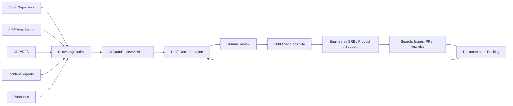

------
title: Learn AI-Driven Documentation and Technical Writing Implementation and Usage - Part 001
description: Skill map berbasis The First 20 Hours untuk menguasai AI-driven documentation sebagai engineering capability, bukan sekadar aktivitas menulis dokumen.
series: learn-ai-driven-documentation
seriesTitle: Learn AI-Driven Documentation and Technical Writing Implementation and Usage
order: 1
partTitle: Kaufman Skill Map
tags:
- ai
- documentation
- technical-writing
- docs-as-code
- kaufman
- engineering-handbook
date: 2026-06-30
---

# Part 001 — Kaufman Skill Map for AI-Driven Documentation

## 1. Target Pembelajaran

Tujuan part ini adalah membuat **peta skill** yang jelas sebelum masuk ke implementasi teknis. Kita tidak sedang belajar “cara memakai AI untuk menulis README”. Itu terlalu sempit.

Target seri ini adalah kemampuan untuk:

1. Mendesain sistem dokumentasi yang bisa dipercaya oleh engineer, reviewer, auditor, SRE, product team, dan AI assistant.
2. Menggunakan AI untuk mempercepat drafting, refactoring, summarization, review, dan maintenance dokumentasi tanpa mengorbankan kebenaran teknis.
3. Membangun workflow docs-as-code yang punya source of truth, version control, review, validation, publishing, observability, dan ownership.
4. Mengubah knowledge engineering yang tersebar di code, API spec, issue, PR, incident report, architecture decision record, dan conversation log menjadi dokumentasi yang usable.
5. Menilai kualitas dokumentasi secara objektif: akurat, task-oriented, maintainable, discoverable, searchable, secure, dan tidak overclaiming.

Setelah menyelesaikan part ini, kita ingin punya mental model yang cukup untuk menjawab pertanyaan berikut:

- Skill apa saja yang harus dipelajari agar AI-driven documentation tidak berubah menjadi generator halusinasi?
- Apa batas antara pekerjaan yang boleh diberikan ke AI dan pekerjaan yang tetap harus dimiliki manusia?
- Bagaimana mengukur apakah dokumentasi membantu engineering execution, bukan hanya terlihat rapi?
- Bagaimana merancang latihan 20 jam pertama agar cepat mencapai kemampuan operasional?

---

## 2. Prinsip Dasar Kaufman yang Kita Pakai

Josh Kaufman dalam *The First 20 Hours* menekankan rapid skill acquisition: pilih target performa yang spesifik, pecah skill menjadi sub-skill kecil, pelajari secukupnya untuk bisa mengoreksi diri, singkirkan friction, lalu komit pada praktik terstruktur selama minimal 20 jam.

Untuk konteks kita, interpretasinya seperti ini:

| Prinsip Kaufman | Adaptasi untuk AI-Driven Documentation |
|---|---|
| Decide exactly what you want to be able to do | Definisikan kemampuan akhir: membuat sistem dokumentasi AI-assisted yang akurat, reviewable, dan maintainable. |
| Deconstruct the skill | Pecah menjadi technical writing, information architecture, docs-as-code, AI prompting, retrieval, source verification, governance, dan metrics. |
| Learn enough to self-correct | Bangun rubric kualitas dan failure checklist agar tahu kapan output AI salah, dangkal, tidak lengkap, atau misleading. |
| Remove practice barriers | Siapkan template, repo structure, style guide, prompt library, review checklist, dan automation. |
| Practice at least 20 hours | Latihan membuat, mereview, memperbaiki, dan mengotomasi dokumentasi dari artefak engineering nyata. |

Yang penting: Kaufman bukan menyarankan “belajar dangkal”. Ia menyarankan **mengurangi delay menuju praktik**. Untuk engineer senior, ini sangat relevan: skill dokumentasi tidak akan tajam hanya dengan membaca style guide. Ia tajam ketika kita berulang kali mengubah sistem kompleks menjadi pengetahuan yang bisa dipakai orang lain.

---

## 3. Definisi Kerja: Apa Itu AI-Driven Documentation?

Dalam seri ini, **AI-driven documentation** berarti sistem dokumentasi yang menggunakan AI di dalam lifecycle dokumentasi, tetapi tetap memiliki kontrol engineering yang jelas.

AI dapat membantu pada aktivitas berikut:

- Mengubah code diff menjadi draft release notes.
- Mengubah PR discussion menjadi architecture decision summary.
- Mengubah OpenAPI/AsyncAPI spec menjadi explanation docs.
- Mengubah incident timeline menjadi postmortem draft.
- Mengidentifikasi bagian dokumentasi yang stale terhadap source of truth.
- Mengusulkan struktur information architecture.
- Melakukan review gaya bahasa, konsistensi istilah, dan missing sections.
- Menjawab pertanyaan pengguna berdasarkan dokumen yang sudah terindeks.

Namun AI tidak boleh menjadi pemilik kebenaran. Dalam sistem yang sehat:

> AI boleh mempercepat produksi pengetahuan, tetapi source of truth, judgment, accountability, dan approval tetap berada pada sistem engineering dan manusia yang bertanggung jawab.

Kita akan memakai istilah berikut sepanjang seri:

| Istilah | Definisi |
|---|---|
| Source of truth | Artefak yang dianggap otoritatif, misalnya code, API spec, schema, ADR, runbook approved, atau policy resmi. |
| Draft | Konten awal yang belum dianggap benar sampai diverifikasi. |
| Verified documentation | Dokumentasi yang sudah dicek terhadap source of truth dan disetujui owner. |
| Generated documentation | Dokumentasi yang dibuat otomatis dari artefak terstruktur seperti OpenAPI, schema, atau code metadata. |
| AI-assisted documentation | Dokumentasi yang dibuat/diperbaiki dengan bantuan AI tetapi tetap direview manusia. |
| AI-consumable documentation | Dokumentasi yang ditulis agar mudah dipakai AI/RAG/agent, bukan hanya manusia. |
| Documentation control plane | Layer proses, metadata, automation, dan policy yang mengatur lifecycle dokumentasi. |

---

## 4. Target “Top 1%” untuk Software Engineer

Top 1% di sini bukan berarti menjadi technical writer profesional penuh waktu. Untuk software engineer, targetnya adalah menjadi orang yang mampu membuat pengetahuan teknis menjadi **operationally usable**.

Engineer dengan kemampuan dokumentasi kelas atas biasanya punya ciri berikut:

1. Bisa membedakan antara tutorial, how-to, reference, dan explanation.
2. Tidak mencampur motivasi, langkah operasional, detail API, dan opini arsitektur dalam satu dokumen yang sama.
3. Menulis dokumen dari perspektif pembaca yang sedang menyelesaikan tugas, bukan dari perspektif penulis yang ingin menunjukkan semua yang ia tahu.
4. Selalu menautkan dokumentasi ke source of truth.
5. Bisa mendeteksi dokumen yang tampak bagus tetapi sebenarnya tidak aman digunakan.
6. Mendesain dokumentasi sebagai workflow, bukan sebagai file Markdown statis.
7. Menggunakan AI sebagai accelerator, bukan sebagai otoritas.
8. Membangun quality gate untuk mencegah broken links, stale examples, inconsistent terminology, leaking secrets, dan hallucinated claims.
9. Menjadikan dokumentasi sebagai bagian dari delivery lifecycle: design, implementation, release, operation, incident, dan deprecation.
10. Memahami bahwa dokumentasi yang baik mengurangi coordination cost, onboarding time, operational risk, dan dependency pada tribal knowledge.

Sasaran kita bukan “dokumen panjang”. Sasaran kita adalah **dokumen yang mengubah perilaku engineering**: orang lebih cepat memahami, lebih jarang salah implementasi, lebih mudah debugging, dan lebih percaya pada sistem.

---

## 5. Skill Decomposition

AI-driven documentation terdiri dari beberapa sub-skill. Jika salah satu lemah, hasilnya sering gagal.

```mermaid
graph TD
    A[AI-Driven Documentation Mastery] --> B[Technical Writing]
    A --> C[Information Architecture]
    A --> D[Docs-as-Code]
    A --> E[AI Usage]
    A --> F[AI Implementation]
    A --> G[Source Verification]
    A --> H[Governance]
    A --> I[Metrics and Feedback]

    B --> B1[Audience and Task Analysis]
    B --> B2[Clarity and Structure]
    B --> B3[Examples and Procedures]

    C --> C1[Diataxis]
    C --> C2[Navigation]
    C --> C3[Content Modeling]

    D --> D1[Git Workflow]
    D --> D2[MDX]
    D --> D3[CI Quality Gates]

    E --> E1[Prompting]
    E --> E2[Context Engineering]
    E --> E3[Human Review]

    F --> F1[RAG]
    F --> F2[Generation Pipelines]
    F --> F3[Docs Agents]

    G --> G1[Traceability]
    G --> G2[Citation]
    G --> G3[Freshness]

    H --> H1[Ownership]
    H --> H2[Policy]
    H --> H3[Security]

    I --> I1[Health Score]
    I --> I2[Search Analytics]
    I --> I3[Doc Debt]
```



### 5.1 Technical Writing

Technical writing bukan “bahasa bagus”. Untuk engineer, technical writing adalah kemampuan membuat pengetahuan teknis menjadi **usable under constraints**.

Constraint nyata:

- Pembaca tidak punya konteks penuh.
- Pembaca sedang buru-buru.
- Pembaca mungkin sedang incident.
- Pembaca bisa salah menafsirkan istilah.
- Sistem berubah lebih cepat daripada dokumentasi.
- AI bisa membuat draft yang meyakinkan tetapi salah.

Technical writing yang baik punya beberapa invariant:

| Invariant | Maksud |
|---|---|
| One document, one primary job | Setiap dokumen harus punya pekerjaan utama yang jelas. |
| Reader-first ordering | Urutan informasi mengikuti kebutuhan pembaca, bukan urutan pikiran penulis. |
| Explicit assumptions | Prasyarat, environment, permission, version, dan scope harus ditulis. |
| Actionable steps | Untuk how-to/runbook, langkah harus bisa dijalankan tanpa menebak. |
| Verifiable claims | Klaim teknis harus bisa dicek terhadap source. |
| Failure-aware | Jelaskan error path, rollback, known limitations, dan troubleshooting. |

### 5.2 Information Architecture

Information architecture adalah cara menata pengetahuan agar pembaca bisa menemukan, memahami, dan menggunakan informasi dengan effort minimal.

Framework penting yang akan kita pakai adalah Diátaxis:

| Tipe Dokumentasi | Pertanyaan Pembaca | Karakter |
|---|---|---|
| Tutorial | “Bantu saya belajar dari awal.” | Learning-oriented, guided, success path. |
| How-to guide | “Bantu saya menyelesaikan tugas spesifik.” | Task-oriented, procedural. |
| Reference | “Apa detail teknis yang benar?” | Accurate, complete, structured. |
| Explanation | “Kenapa sistem ini seperti ini?” | Conceptual, causal, trade-off oriented. |

Banyak dokumentasi internal gagal karena mencampur empat tipe ini. Contoh buruk:

- README berisi onboarding, design rationale, API reference, troubleshooting, dan changelog sekaligus.
- Runbook menjelaskan sejarah arsitektur tetapi tidak memberi langkah mitigasi.
- ADR berubah menjadi tutorial.
- API reference berisi opini produk yang tidak bisa diverifikasi.

### 5.3 Docs-as-Code

Docs-as-code berarti dokumentasi diperlakukan seperti artefak engineering:

- Ditulis dalam plain text markup seperti Markdown/MDX.
- Disimpan di version control.
- Direview lewat pull request.
- Divalidasi dengan automated tests.
- Dipublikasikan lewat pipeline.
- Diobservasi dengan metrics.

Mental modelnya sederhana:

> Jika dokumentasi memengaruhi keputusan engineering, maka dokumentasi harus punya lifecycle engineering.

### 5.4 AI Usage

AI usage adalah kemampuan menggunakan model sebagai partner kerja tanpa menyerahkan judgment.

Skill yang dibutuhkan:

- Menulis prompt yang jelas.
- Memberikan konteks yang cukup tetapi tidak berlebihan.
- Meminta output dalam struktur yang bisa direview.
- Memaksa AI membedakan fakta, inferensi, asumsi, dan gap.
- Melakukan verification loop.
- Menghindari prompt yang mengundang halusinasi.

Contoh prompt buruk:

```text
Buat dokumentasi service ini.
```

Contoh prompt lebih baik:

```text
Anda membantu membuat draft internal engineering documentation untuk service pembayaran.
Gunakan hanya konteks yang saya berikan.
Pisahkan fakta yang tersedia, inferensi, dan gap.
Output harus berbentuk how-to guide untuk engineer on-call.
Jangan menambahkan endpoint, command, atau environment variable yang tidak muncul di konteks.
Jika informasi tidak cukup, tulis bagian "Unknowns".
```

### 5.5 AI Implementation

AI implementation berbeda dari AI usage. Di sini kita membangun sistem:

- Source ingestion.
- Chunking.
- Embedding/indexing.
- Retrieval.
- Prompt assembly.
- Generation.
- Validation.
- Review workflow.
- Publishing.
- Feedback loop.

Kita tidak akan terjebak pada satu vendor atau framework. Yang penting adalah arsitektur, invariant, dan failure mode.

### 5.6 Source Verification

AI-generated documentation hanya berguna jika bisa diverifikasi.

Kita akan memakai prinsip:

1. Setiap klaim teknis penting harus punya sumber.
2. Source harus punya tingkat otoritas.
3. Source yang stale harus kalah dari source yang lebih baru dan lebih dekat ke runtime.
4. Jika source bertentangan, dokumentasi harus menyatakan konflik, bukan memilih diam-diam.

Contoh hierarchy source:

| Rank | Source | Contoh |
|---:|---|---|
| 1 | Runtime/config actual | Production config, deployed version, generated schema. |
| 2 | Contract/spec | OpenAPI, AsyncAPI, protobuf, database migration. |
| 3 | Code | Implementation, tests, typed interfaces. |
| 4 | Approved decision docs | ADR, RFC, architecture review. |
| 5 | Operational record | Incident report, postmortem, runbook history. |
| 6 | Informal conversation | Slack, email, meeting notes. |

### 5.7 Governance

Tanpa governance, AI documentation berubah menjadi knowledge landfill.

Governance menjawab:

- Siapa owner dokumen?
- Dokumen mana yang authoritative?
- Kapan dokumen dianggap stale?
- Siapa yang boleh approve AI-generated docs?
- Apa yang tidak boleh dimasukkan ke prompt?
- Apa yang tidak boleh dipublish?
- Bagaimana menangani conflict antara source?
- Bagaimana mengaudit perubahan dokumentasi?

### 5.8 Metrics and Feedback

Dokumentasi yang baik harus punya feedback loop.

Metrics yang berguna:

- Freshness: kapan terakhir diverifikasi terhadap source.
- Coverage: area sistem yang sudah terdokumentasi.
- Findability: apakah pembaca menemukan dokumen lewat search/nav.
- Task success: apakah pembaca berhasil menyelesaikan tugas.
- Review latency: berapa lama dokumen menunggu approval.
- Broken links: link internal/eksternal rusak.
- Stale examples: snippet tidak lagi valid.
- Search zero-result rate: query yang gagal menemukan jawaban.
- Incident recurrence: insiden berulang karena knowledge gap.

---

## 6. Maturity Model

Kita akan memakai maturity model berikut untuk menilai organisasi atau project.

| Level | Nama | Karakteristik | Risiko Utama |
|---:|---|---|---|
| 0 | Tribal Knowledge | Pengetahuan ada di kepala orang, chat, atau meeting. | Bottleneck, onboarding lambat, bus factor tinggi. |
| 1 | Static Docs | Ada README/wiki, tetapi tidak punya lifecycle. | Stale docs, duplikasi, tidak dipercaya. |
| 2 | Docs-as-Code | Docs di Git, PR review, basic linting. | Kualitas tergantung disiplin manual. |
| 3 | Validated Docs | Link check, snippet test, generated API docs, owner metadata. | Coverage dan freshness belum menyeluruh. |
| 4 | AI-Assisted Docs | AI membantu draft/review/update dengan human-in-loop. | Hallucination, source leakage, overconfidence. |
| 5 | Documentation Control Plane | Docs, source, review, metrics, AI, dan governance menjadi satu sistem. | Kompleksitas platform dan policy overhead. |

Tujuan seri ini adalah membawa kita minimal ke Level 4 secara praktis, lalu memahami blueprint Level 5.

---

## 7. Documentation Control Plane

Dalam organisasi besar, dokumentasi bukan hanya halaman web. Ia adalah control plane untuk pengetahuan engineering.



Elemen penting:

1. **Inputs**: code, specs, ADR, incidents, runbooks, issues.
2. **Transformations**: generation, summarization, normalization, validation.
3. **Controls**: style guide, ownership, security policy, review gate.
4. **Outputs**: docs site, handbook, runbook, release notes, API portal.
5. **Feedback**: usage analytics, broken links, reader feedback, incident learnings.

AI bekerja di transformation layer, bukan sebagai replacement untuk control layer.

---

## 8. Batas AI: Drafting vs Ownership

Salah satu kesalahan umum adalah memperlakukan AI sebagai “penulis final”. Untuk sistem engineering, ini berbahaya.

Gunakan matriks berikut:

| Aktivitas | AI Boleh? | Manusia Wajib? | Catatan |
|---|---:|---:|---|
| Membuat draft dari source yang diberikan | Ya | Review | AI mempercepat first draft. |
| Mengubah tone/style | Ya | Sampling review | Risiko rendah jika tidak mengubah fakta. |
| Menyusun outline | Ya | Review | Bagus untuk information architecture awal. |
| Menyimpulkan PR/incident | Ya | Verify | Wajib cek terhadap log/source. |
| Menambah fakta baru tanpa source | Tidak | Ya | Ini sumber halusinasi. |
| Menentukan policy organisasi | Tidak | Ya | AI bisa bantu draft, bukan memutuskan. |
| Approve dokumentasi regulated | Tidak | Ya | Harus ada accountable owner. |
| Menulis runbook otomatis lalu publish | Tidak langsung | Ya | Harus diuji dan disetujui. |
| Menjawab pertanyaan internal dari RAG | Ya | Escalate jika tidak yakin | Harus ada citation dan confidence boundary. |

Rule of thumb:

> Semakin tinggi dampak kesalahan dokumen, semakin kuat verification dan approval gate yang dibutuhkan.

---

## 9. Failure Modes Awal

Sebelum membangun skill, kita harus tahu bentuk kegagalannya.

| Failure Mode | Gejala | Dampak | Pencegahan |
|---|---|---|---|
| Hallucinated docs | AI menulis command, endpoint, config, atau behavior yang tidak ada. | Engineer menjalankan langkah salah. | Source-bound prompting, citation, review. |
| Stale docs | Dokumen tidak cocok dengan sistem terbaru. | Keputusan berdasarkan fakta lama. | Freshness metadata, CI, owner review. |
| Content dumping | Semua informasi dimasukkan tanpa struktur. | Pembaca tidak menemukan jawaban. | Diátaxis, IA review. |
| No ownership | Tidak ada yang bertanggung jawab memperbarui docs. | Docs mati perlahan. | CODEOWNERS, owner metadata. |
| Over-automation | AI publish otomatis tanpa review. | Risiko production/regulatory/security. | Human-in-loop gates. |
| Secret leakage | Prompt atau docs mengandung token/PII. | Security incident. | Redaction, scanning, access control. |
| Unverifiable claims | Banyak klaim tanpa source. | Tidak bisa dipercaya. | Traceability requirements. |
| Metrics vanity | Mengukur page views saja. | Salah menilai kualitas. | Task success dan freshness metrics. |

---

## 10. Rubric Self-Correction

Kaufman menekankan belajar cukup untuk bisa mengoreksi diri. Ini rubric awal kita.

Gunakan skor 0–3.

| Dimensi | 0 | 1 | 2 | 3 |
|---|---|---|---|---|
| Purpose | Tidak jelas | Ada tetapi kabur | Jelas | Sangat jelas dan measurable |
| Audience | Tidak disebut | Tersirat | Jelas | Jelas + role/context/prasyarat |
| Structure | Acak | Ada heading | Terstruktur | Terstruktur sesuai task/type |
| Accuracy | Tidak diverifikasi | Berdasarkan ingatan | Ada source | Source jelas dan konflik ditangani |
| Completeness | Banyak gap | Menjawab sebagian | Cukup | Termasuk edge cases dan failure path |
| Actionability | Tidak bisa dieksekusi | Perlu menebak | Bisa diikuti | Bisa diikuti + validasi hasil |
| Maintainability | Tidak ada owner | Owner informal | Owner jelas | Owner + lifecycle + tests |
| AI Safety | Tidak ada kontrol | Prompt manual | Review manual | Source-bound + policy + audit |

Target minimal untuk dokumen yang masuk repository engineering: rata-rata 2, tidak ada dimensi kritikal bernilai 0.

Dimensi kritikal:

- Accuracy.
- Source traceability.
- Security.
- Ownership.
- Actionability untuk runbook/how-to.

---

## 11. 20-Hour Practice Plan

Ini adalah rencana latihan awal, bukan seluruh seri.

### Hour 1–2 — Skill Setup and Baseline

Output:

- Pilih satu service/project nyata.
- Kumpulkan artefak: README, API spec, ADR, incident/runbook, PR terakhir.
- Audit dokumentasi saat ini memakai rubric.
- Catat 10 masalah paling mahal.

Latihan:

```text
Ambil satu README internal.
Nilai dengan rubric 0–3.
Tulis gap berdasarkan audience: new engineer, on-call engineer, API consumer, reviewer.
```

### Hour 3–5 — Information Architecture

Output:

- Pisahkan konten menjadi tutorial, how-to, reference, dan explanation.
- Buat navigation map.
- Tandai duplikasi dan stale sections.

Latihan:

```text
Ambil README yang campur aduk.
Pecah menjadi 4 dokumen:
1. Getting started tutorial
2. Local development how-to
3. Configuration reference
4. Architecture explanation
```

### Hour 6–8 — AI-Assisted Drafting

Output:

- Buat prompt template untuk rewrite docs.
- Buat draft how-to guide dari source yang diberikan.
- Tandai fakta, asumsi, unknowns.

Latihan:

```text
Berikan AI hanya source terbatas: README + config sample.
Minta AI membuat runbook.
Validasi setiap command dan environment variable.
```

### Hour 9–11 — Source Verification

Output:

- Buat source hierarchy.
- Tambahkan citation/source links.
- Identifikasi konflik antara docs dan code/spec.

Latihan:

```text
Bandingkan dokumen API dengan OpenAPI spec.
Tandai endpoint, status code, field, dan contoh response yang berbeda.
```

### Hour 12–14 — Docs-as-Code Quality Gate

Output:

- Tambahkan markdown lint.
- Tambahkan link checker.
- Tambahkan style checklist.
- Tambahkan CODEOWNERS atau owner metadata.

Latihan:

```text
Buat pipeline minimal:
- lint markdown
- check links
- validate frontmatter
- fail CI jika owner kosong
```

### Hour 15–17 — AI Review Workflow

Output:

- Buat AI reviewer prompt.
- Buat review checklist untuk manusia.
- Bandingkan hasil review AI dan reviewer manusia.

Latihan:

```text
Minta AI mereview dokumen berdasarkan rubric.
Tolak semua komentar AI yang tidak punya bukti.
Ubah komentar valid menjadi issue/PR task.
```

### Hour 18–20 — Capstone Mini

Output:

- Satu documentation improvement PR end-to-end.
- Before/after diff.
- Quality score sebelum/sesudah.
- Dokumentasi publishable.

Latihan:

```text
Pilih satu area dokumentasi yang paling mahal jika salah.
Refactor ke struktur Diátaxis.
Tambahkan source verification.
Tambahkan quality gate.
Buat changelog dan reviewer checklist.
```

---

## 12. Working Agreement untuk Seri Ini

Agar seri tetap efisien dan tidak mengulang materi lain, kita pakai batasan berikut:

1. Kita tidak membahas ulang Java internals, API design, event governance, persistence, atau security implementation kecuali dari sisi dokumentasi.
2. Kita tidak menganggap AI output benar tanpa source.
3. Kita tidak membuat template kosong tanpa mental model.
4. Kita tidak mengejar “dokumen lengkap” jika dokumen tidak usable.
5. Kita memprioritaskan workflow yang bisa diterapkan di engineering team nyata.
6. Kita menulis seperti internal handbook: jelas, tegas, operasional, dan bisa direview.
7. Setiap part akan punya checklist, latihan, dan failure modes bila relevan.

---

## 13. Minimal Toolchain yang Akan Dipakai Sepanjang Seri

Toolchain dapat berubah sesuai organisasi, tetapi mental modelnya stabil.

| Kebutuhan | Contoh Tool |
|---|---|
| Authoring | Markdown, MDX, AsciiDoc, reStructuredText |
| Site generation | Docusaurus, MkDocs Material, Read the Docs, custom static site |
| Style linting | Vale, markdownlint |
| Link checking | lychee, markdown-link-check, custom crawler |
| API docs | OpenAPI, Redocly, Swagger UI, Stoplight |
| Event docs | AsyncAPI Generator, event catalog |
| Diagrams | Mermaid, PlantUML, C4 tooling |
| Search | Lunr, Algolia, OpenSearch, vector search |
| AI workflow | Prompt templates, RAG, evals, review bots |
| Governance | CODEOWNERS, metadata, policy docs, approval workflow |
| Observability | Search analytics, docs health dashboard, issue tracker |

Tool tidak penting jika prinsipnya salah. Tool yang bagus di atas proses yang buruk hanya menghasilkan dokumentasi buruk lebih cepat.

---

## 14. Checklist Part 001

Sebelum lanjut ke Part 002, pastikan Anda bisa menjawab:

- [ ] Apa perbedaan AI-assisted documentation dan AI-owned documentation?
- [ ] Apa source of truth untuk dokumentasi teknis?
- [ ] Apa empat kategori Diátaxis dan kapan dipakai?
- [ ] Apa maturity level dokumentasi project Anda sekarang?
- [ ] Apa tiga failure mode paling berbahaya untuk dokumentasi AI di organisasi Anda?
- [ ] Apa rubric minimum untuk menilai dokumen engineering?
- [ ] Apa output konkret dari 20 jam latihan pertama?

---

## 15. Latihan Praktis

Pilih satu repository atau service nyata. Jangan pilih project mainan.

Buat tabel berikut:

| Dokumen | Audience | Type | Source of Truth | Owner | Freshness | Risk if Wrong |
|---|---|---|---|---|---|---|
| README | New engineer | Tutorial/How-to mix | Repo | Unknown | Unknown | Medium |
| API docs | API consumer | Reference | OpenAPI | Platform team | 3 months | High |
| Runbook | On-call | How-to | Incident history/config | SRE | 1 year | Critical |

Kemudian lakukan:

1. Nilai setiap dokumen dengan rubric 0–3.
2. Tandai dokumen yang AI boleh bantu draft.
3. Tandai dokumen yang wajib human approval.
4. Pilih satu dokumen untuk diperbaiki pada latihan Part 002.

---

## 16. Ringkasan

AI-driven documentation adalah engineering capability, bukan sekadar kemampuan menulis prompt. Skill ini menggabungkan technical writing, information architecture, docs-as-code, AI usage, source verification, governance, dan metrics.

Framework Kaufman membantu kita menghindari over-researching. Kita pecah skill, buat rubric self-correction, hilangkan friction, lalu mulai praktik dari artefak engineering nyata.

Prinsip inti part ini:

> Dokumentasi yang baik bukan hanya menjelaskan sistem. Dokumentasi yang baik mengurangi risiko, mempercepat keputusan, dan membuat knowledge bisa dipakai ulang oleh manusia maupun AI dengan aman.

---

## References

1. Josh Kaufman, *The First 20 Hours: How to Learn Anything... Fast*; ringkasan metode rapid skill acquisition juga dijelaskan dalam WIRED UK, “How to learn a new skill in 20 hours”.
2. Diátaxis documentation framework: https://diataxis.fr/
3. Write the Docs, “Docs as Code”: https://www.writethedocs.org/guide/docs-as-code/
4. OpenAI, “Prompt engineering”: https://developers.openai.com/api/docs/guides/prompt-engineering
