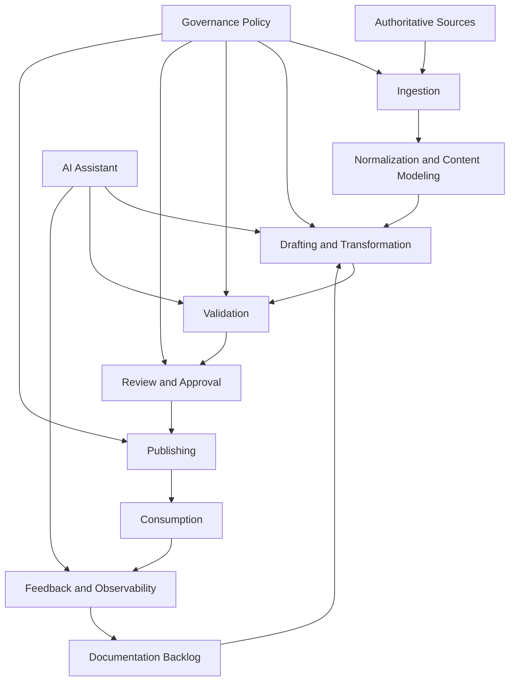
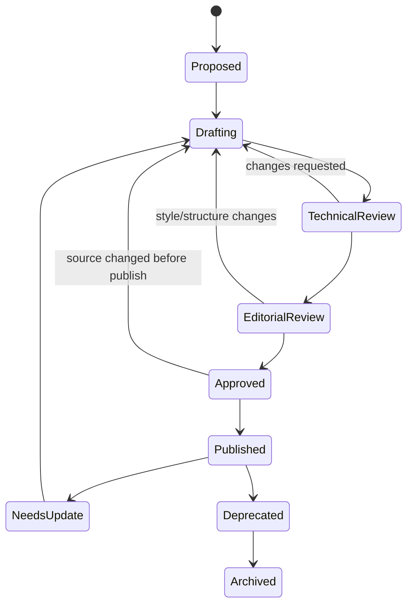
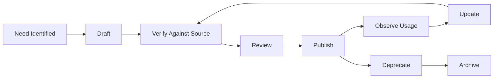
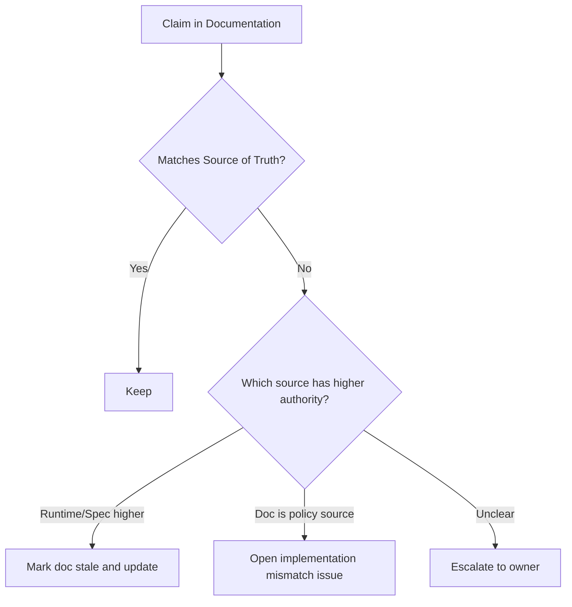
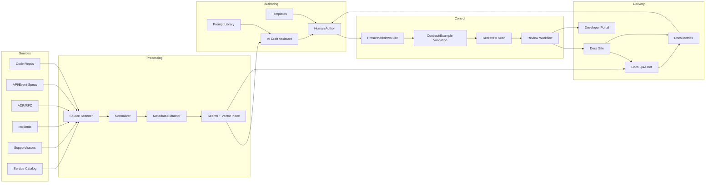
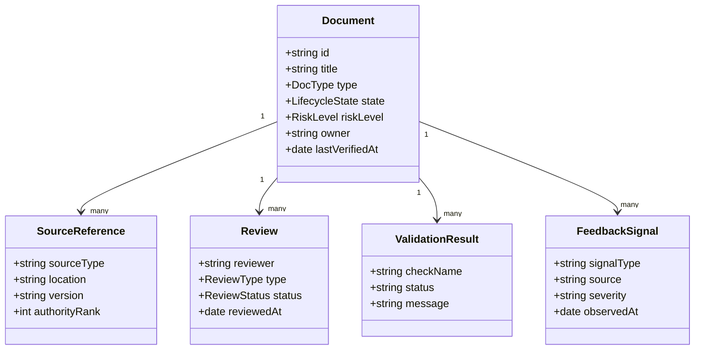
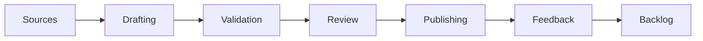

------
title: Learn AI-Driven Documentation and Technical Writing Implementation and Usage - Part 002
description: Membangun mental model dokumentasi sebagai engineering system dengan lifecycle, source of truth, feedback loop, quality gates, dan AI-assisted workflow.
series: learn-ai-driven-documentation
seriesTitle: Learn AI-Driven Documentation and Technical Writing Implementation and Usage
order: 2
partTitle: Documentation as an Engineering System
tags:
- ai
- documentation
- technical-writing
- docs-as-code
- engineering-system
- knowledge-management
date: 2026-06-30
---

# Part 002 — Documentation as an Engineering System

## 1. Target Pembelajaran

Pada Part 001, kita membuat skill map. Sekarang kita naik satu level: melihat dokumentasi sebagai **engineering system**.

Core question:

> Jika dokumentasi memengaruhi implementasi, operasi, onboarding, audit, dan keputusan arsitektur, mengapa ia sering diperlakukan seperti catatan informal?

Di part ini, kita akan membangun model bahwa dokumentasi adalah sistem dengan:

- Input.
- Transformation.
- Output.
- State.
- Ownership.
- Controls.
- Failure modes.
- Feedback loop.
- Observability.

Setelah part ini, Anda harus bisa mendesain lifecycle dokumentasi untuk satu service atau platform internal, termasuk bagaimana AI masuk ke workflow tanpa merusak trust.

---

## 2. Masalah Utama: Dokumentasi Sering Dianggap Konten, Bukan Sistem

Banyak organisasi memperlakukan dokumentasi sebagai kumpulan halaman:

- README.
- Wiki.
- Google Docs.
- Confluence pages.
- API reference.
- Runbook.
- Architecture diagram.
- Meeting notes.

Masalahnya bukan format. Masalahnya adalah **tidak ada sistem yang mengatur kebenaran, perubahan, distribusi, dan feedback**.

Gejala klasik:

| Gejala | Penyebab Sistemik |
|---|---|
| README terlihat rapi tetapi salah | Tidak ada validation terhadap code/config. |
| API docs berbeda dari implementation | Spec tidak dijadikan source of truth. |
| Runbook gagal saat incident | Tidak pernah diuji setelah perubahan infra. |
| Onboarding butuh banyak tanya senior | Knowledge tersebar di kepala orang. |
| AI assistant memberi jawaban salah | Retrieval mengambil dokumen stale atau informal. |
| Banyak dokumen duplikat | Tidak ada information architecture. |
| Tidak ada yang mau update docs | Ownership dan incentives tidak jelas. |

Solusi bukan “tulis lebih banyak docs”. Solusinya adalah membangun **documentation system**.

---

## 3. Definisi: Documentation as an Engineering System

Dokumentasi sebagai engineering system berarti dokumentasi diperlakukan seperti artefak yang punya lifecycle dan reliability requirement.

Definisi kerja:

> Documentation system adalah kombinasi repository, content model, metadata, workflow, validation, publishing, access control, AI assistance, dan feedback loop yang menjaga pengetahuan teknis tetap benar, dapat ditemukan, dan dapat digunakan.

Kita bisa modelkan seperti ini:



AI bisa membantu ingestion, drafting, review, summarization, dan feedback analysis. Tetapi AI tidak menggantikan governance policy, source authority, atau approval.

---

## 4. Elemen Sistem Dokumentasi

### 4.1 Authoritative Sources

Dokumentasi yang baik selalu tahu dari mana kebenarannya berasal.

Contoh authoritative sources:

| Source | Digunakan untuk | Risiko jika tidak dijadikan source |
|---|---|---|
| Code | Behavior aktual, interface internal, default value. | Docs menjelaskan behavior lama. |
| Tests | Expected behavior dan edge cases. | Examples tidak sesuai real behavior. |
| OpenAPI/AsyncAPI | API/event contract. | Consumer salah integrasi. |
| Database migration | Struktur data dan perubahan skema. | Data docs obsolete. |
| IaC/config | Deployment, environment, runtime topology. | Runbook salah environment. |
| ADR/RFC | Rationale dan trade-off. | Keputusan diulang tanpa konteks. |
| Incident reports | Failure pattern dan mitigasi. | Insiden berulang. |
| Support tickets | Pain points pengguna. | Docs tidak menjawab masalah nyata. |

Dalam sistem AI-driven, source authority lebih penting lagi. Model yang mengambil konteks dari sumber salah akan menghasilkan jawaban salah dengan confidence tinggi.

### 4.2 Content Model

Content model menjawab:

- Jenis dokumen apa yang ada?
- Metadata apa yang wajib?
- Bagaimana hubungan antar dokumen?
- Apa lifecycle state setiap dokumen?

Contoh content model:

```yaml
document:
  id: payment-runbook-timeout-recovery
  title: Recover Payment Timeout Incidents
  type: runbook
  owner: payments-platform
  reviewers:
    - sre
    - payments-tech-lead
  source_of_truth:
    - repo: services/payment-gateway
    - dashboard: grafana/payment-timeouts
    - incident: INC-2026-0412
  lifecycle_state: verified
  risk_level: critical
  last_verified_at: 2026-06-21
  ai_assistance_allowed: draft_and_review_only
```

Tanpa metadata, dokumentasi sulit diotomasi. AI juga tidak tahu konteks penting: apakah dokumen ini critical, siapa owner, kapan terakhir diverifikasi, dan apa source of truth-nya.

### 4.3 Workflow

Workflow menentukan bagaimana dokumen berubah.

Minimal workflow:



Untuk dokumen low-risk, workflow bisa lebih ringan. Untuk dokumen high-risk seperti runbook production, compliance docs, security procedure, dan customer-facing API docs, workflow harus lebih ketat.

### 4.4 Validation

Validation adalah alasan dokumentasi bisa dipercaya.

Jenis validation:

| Validation | Contoh |
|---|---|
| Syntax validation | Markdown/MDX parse, frontmatter schema valid. |
| Link validation | Internal/external links tidak rusak. |
| Style validation | Vale rules, terminology, forbidden words. |
| Structure validation | Heading wajib ada, section wajib lengkap. |
| Example validation | Code samples compile/run. |
| Contract validation | API docs cocok dengan OpenAPI/AsyncAPI. |
| Freshness validation | Last verified date tidak melewati SLA. |
| Security validation | Tidak ada secrets, PII, internal-only data di public docs. |

AI bisa membantu memberi sinyal, tetapi validation yang deterministic harus tetap dilakukan oleh tool deterministic jika memungkinkan.

### 4.5 Publishing

Publishing bukan sekadar deploy static site. Publishing adalah proses membuat dokumen tersedia untuk consumer yang tepat.

Pertanyaan desain:

- Apakah dokumen internal atau external?
- Apakah butuh versioning?
- Apakah butuh access control?
- Apakah butuh approval sebelum publish?
- Apakah AI index ikut diperbarui setelah publish?
- Apakah search index tahu metadata owner/risk/freshness?
- Apakah dokumen yang deprecated masih bisa ditemukan?

### 4.6 Consumption

Consumer dokumentasi tidak hanya manusia.

| Consumer | Kebutuhan |
|---|---|
| New engineer | Onboarding, local setup, conceptual map. |
| Feature engineer | How-to, integration examples, constraints. |
| Tech lead | Architecture, trade-offs, ownership, risk. |
| SRE/on-call | Runbook, diagnosis, rollback, dashboards. |
| Security reviewer | Threat model, data handling, controls. |
| Auditor/compliance | Evidence, traceability, approval history. |
| Product/support | User behavior, known limitations, troubleshooting. |
| AI assistant/agent | Structured, source-linked, chunkable, current content. |

Dokumen yang bagus untuk manusia belum tentu bagus untuk AI retrieval. AI butuh struktur, metadata, stable headings, explicit terminology, dan source references.

### 4.7 Feedback and Observability

Dokumentasi tanpa observability akan memburuk diam-diam.

Feedback signal:

- Search query yang gagal.
- Page dengan exit rate tinggi.
- Issue/PR untuk docs.
- Incident yang menyebut “docs wrong”.
- Slack questions yang berulang.
- AI assistant low-confidence answers.
- Broken links.
- Stale verification date.
- Review latency.
- Unowned docs.

Sistem yang matang mengubah feedback menjadi backlog.

---

## 5. Lifecycle Dokumentasi

Dokumentasi punya lifecycle. Jika lifecycle tidak eksplisit, dokumen akan menjadi stale.



### 5.1 Need Identified

Sumber kebutuhan dokumentasi:

- Feature baru.
- API/event baru.
- Incident.
- Support ticket berulang.
- Onboarding friction.
- Architecture decision.
- Compliance request.
- Migration/deprecation.
- Search zero-result.

AI bisa membantu mendeteksi pattern: misalnya menganalisis Slack/support tickets untuk menemukan pertanyaan yang sering berulang. Namun untuk privacy dan security, data source harus dibatasi dan diproses sesuai policy.

### 5.2 Draft

Draft dapat dibuat oleh:

- Engineer.
- Technical writer.
- AI assistant.
- Generator dari spec.
- Kombinasi semuanya.

Draft AI harus diberi label mental: **belum benar**.

Draft yang baik harus menyertakan:

- Audience.
- Type dokumen.
- Source yang digunakan.
- Unknowns.
- Assumptions.
- Required reviewer.

### 5.3 Verify

Verification adalah proses mencocokkan isi dokumen dengan source of truth.

Contoh verification checklist untuk runbook:

- [ ] Command masih valid.
- [ ] Dashboard link benar.
- [ ] Alert name benar.
- [ ] Permission/role benar.
- [ ] Rollback step diuji.
- [ ] Expected output ditulis.
- [ ] Failure path ditulis.
- [ ] Escalation contact valid.

### 5.4 Review

Review punya beberapa jenis:

| Review | Fokus |
|---|---|
| Technical review | Apakah benar secara teknis? |
| Editorial review | Apakah jelas, ringkas, dan konsisten? |
| Security review | Apakah ada data sensitif atau instruksi berisiko? |
| Operational review | Apakah bisa dipakai saat tekanan tinggi? |
| Compliance review | Apakah traceability dan approval cukup? |
| AI review | Apakah ada missing section, inconsistency, ambiguity? |

AI review berguna sebagai reviewer tambahan, bukan reviewer final.

### 5.5 Publish

Dokumen publishable harus memenuhi quality gate.

Contoh gate:

```yaml
quality_gates:
  required:
    - frontmatter_schema_valid
    - owner_exists
    - source_of_truth_exists
    - markdown_lint_passed
    - link_check_passed
    - no_secrets_detected
  conditional:
    runbook:
      - rollback_section_exists
      - escalation_section_exists
      - last_verified_at_within_90_days
    api_reference:
      - openapi_spec_valid
      - examples_validated
    regulated_doc:
      - approval_record_exists
      - audit_metadata_exists
```

### 5.6 Observe

Setelah publish, kita harus tahu apakah dokumen bekerja.

Pertanyaan observability:

- Apakah dokumen ditemukan?
- Apakah dokumen menyelesaikan tugas pembaca?
- Bagian mana yang sering dibuka?
- Query apa yang tidak menemukan hasil?
- Apakah AI assistant memakai dokumen ini sebagai sumber?
- Apakah jawaban AI berdasarkan dokumen ini benar?
- Apakah ada insiden karena dokumen salah?

### 5.7 Update, Deprecate, Archive

Tidak semua dokumen harus hidup selamanya.

Lifecycle state yang disarankan:

| State | Makna |
|---|---|
| draft | Belum selesai dan belum boleh dianggap benar. |
| review | Sedang direview. |
| verified | Sudah cocok dengan source dan disetujui. |
| published | Tersedia untuk consumer. |
| needs-update | Diketahui stale atau incomplete. |
| deprecated | Masih ada untuk transisi, tidak disarankan dipakai. |
| archived | Disimpan untuk histori, bukan guidance aktif. |

AI assistant harus memperlakukan state ini secara eksplisit. Misalnya, dokumen `archived` tidak boleh dipakai sebagai sumber jawaban operasional kecuali user meminta histori.

---

## 6. Source-of-Truth Strategy

Salah satu keputusan paling penting: **dokumen mana yang menjadi source of truth untuk apa?**

Anti-pattern:

> “Confluence page X adalah source of truth untuk semua hal.”

Ini hampir selalu salah. Source of truth tergantung jenis informasi.

| Informasi | Source of Truth yang Lebih Tepat |
|---|---|
| Endpoint, status code, schema | OpenAPI spec, tests, implementation. |
| Event channel dan payload | AsyncAPI spec, schema registry, consumer contracts. |
| Runtime config | Deployment config, IaC, environment manager. |
| Architecture rationale | ADR/RFC approved. |
| Production mitigation | Tested runbook dan incident record. |
| Ownership | Service catalog, CODEOWNERS, team registry. |
| Product behavior | Product spec + implementation + release note. |
| Compliance rule | Approved policy/legal source. |

### 6.1 Source Authority Conflict

Apa yang terjadi jika README bilang timeout 30s, tetapi config production 10s?

Sistem harus punya aturan conflict:



Rule praktis:

- Jika klaim behavioral berbeda dari runtime/code/spec, dokumentasi kemungkinan stale.
- Jika klaim policy berbeda dari implementation, implementation mungkin non-compliant.
- Jika source informal berbeda dari source approved, source informal tidak boleh menang tanpa review.

---

## 7. AI Placement in the Documentation System

AI dapat diletakkan di beberapa titik.

| Stage | AI Usage | Risk | Control |
|---|---|---|---|
| Need detection | Menganalisis repeated questions. | Privacy leak. | Data minimization, access control. |
| Drafting | Membuat first draft dari source. | Hallucination. | Source-bound prompt, unknowns section. |
| Refactoring | Memecah dokumen sesuai Diátaxis. | Kehilangan detail. | Diff review. |
| Review | Menemukan ambiguity/gap. | False positive/negative. | Reviewer judgment. |
| Verification | Membandingkan docs vs specs/code. | Tooling gap. | Deterministic checks first. |
| Search/RAG | Menjawab pertanyaan dari docs. | Stale retrieval. | Metadata, freshness, citation. |
| Metrics | Merangkum feedback. | Misclassification. | Sampling and audit. |

AI paling aman digunakan ketika:

- Source eksplisit.
- Output berupa draft/recommendation.
- Ada reviewer manusia.
- Ada deterministic validation untuk hal yang bisa dites.
- Ada audit trail.

AI paling berbahaya digunakan ketika:

- Diminta mengisi gap tanpa source.
- Diberi akses ke data sensitif tanpa policy.
- Langsung publish.
- Dipakai untuk runbook high-risk tanpa testing.
- Jawaban RAG tidak menampilkan source dan freshness.

---

## 8. Documentation System Architecture Pattern

Berikut reference architecture konseptual.



Komponen penting:

1. **Source Scanner**: membaca artefak yang diizinkan.
2. **Normalizer**: mengubah source heterogen menjadi format seragam.
3. **Metadata Extractor**: owner, service, version, date, doc type, source links.
4. **Index**: keyword search dan semantic retrieval.
5. **Prompt Library**: prompt versioned untuk drafting/review.
6. **Validation**: deterministic checks.
7. **Review Workflow**: human approval.
8. **Delivery**: docs site, portal, bot, API docs.
9. **Metrics**: feedback dan health.

---

## 9. State and Invariants

Dokumentasi punya state. Sistem yang sehat menjaga invariant.

### 9.1 Core Invariants

| Invariant | Penjelasan |
|---|---|
| Every published doc has an owner | Tanpa owner, update tidak bisa ditagih. |
| Every high-risk doc has source references | Tanpa source, klaim tidak bisa diverifikasi. |
| Every runbook has validation and rollback guidance | Runbook tanpa rollback berbahaya. |
| Every generated doc is reproducible | Generated output harus bisa dibuat ulang dari source. |
| Every AI-assisted doc is reviewable as diff | Reviewer harus bisa melihat perubahan. |
| Archived docs are excluded from operational search | Agar AI tidak mengambil informasi lama. |
| Public docs pass security scanning | Mencegah leakage. |
| Deprecated docs show replacement path | Pembaca harus tahu pindah ke mana. |

### 9.2 Invariant Violation Examples

| Violation | Dampak |
|---|---|
| Published doc without owner | Tidak ada yang update saat source berubah. |
| AI draft merged without technical review | Halusinasi masuk ke handbook. |
| Runbook references old dashboard | Incident response melambat. |
| API example not validated | Consumer integration gagal. |
| Deprecated doc still indexed as active | AI memberi instruksi lama. |
| Public docs include internal hostname | Security exposure. |

---

## 10. Documentation Domain Model

Untuk membangun automation, kita butuh domain model.



### 10.1 DocType

Contoh enum:

```text
DocType = tutorial | how_to | reference | explanation | runbook | adr | release_note | migration_guide | policy | troubleshooting
```

### 10.2 LifecycleState

```text
LifecycleState = draft | review | verified | published | needs_update | deprecated | archived
```

### 10.3 RiskLevel

```text
RiskLevel = low | medium | high | critical
```

Risk level memengaruhi quality gate.

Contoh:

| Risk | Contoh | Gate |
|---|---|---|
| Low | Team convention doc | Owner + review ringan. |
| Medium | Local setup guide | Link check + technical review. |
| High | API integration docs | Contract validation + reviewer. |
| Critical | Production rollback runbook | Tested steps + SRE approval + freshness SLA. |

---

## 11. Documentation SLAs

Tidak semua dokumen perlu SLA yang sama.

Contoh SLA:

| Doc Type | Verification Interval | Owner | Gate |
|---|---:|---|---|
| Runbook critical | 30–90 hari | SRE/service owner | Technical + operational review. |
| API reference | Setiap spec change | API owner | Contract validation. |
| Onboarding guide | 90–180 hari | Team lead/dev experience | New joiner feedback. |
| ADR | Immutable setelah accepted | Architecture owner | Append superseded link jika berubah. |
| Troubleshooting | Setelah incident atau support pattern | Service owner | Verify symptoms and fixes. |
| Product docs | Setiap release | Product/engineering | Release checklist. |

SLA dokumentasi bukan birokrasi. Ia adalah cara mencegah knowledge decay.

---

## 12. AI-Friendly Documentation Design

Jika dokumentasi akan digunakan oleh AI assistant atau RAG, desainnya harus memperhatikan retrievability.

Prinsip:

1. Gunakan heading yang spesifik.
2. Hindari pronoun ambigu seperti “ini”, “itu”, “komponen tersebut” tanpa referensi jelas.
3. Tulis prasyarat eksplisit.
4. Pisahkan konsep, prosedur, dan reference.
5. Gunakan metadata yang machine-readable.
6. Sertakan source links dan version.
7. Tandai dokumen deprecated/archived.
8. Hindari membuat satu halaman terlalu panjang tanpa struktur.
9. Gunakan glossary untuk istilah domain.
10. Tulis known limitations.

Contoh buruk:

```md
## Setup
Jalankan command ini lalu cek dashboard. Kalau error, restart service.
```

Contoh lebih baik:

```md
## Local Setup for Payment Gateway on macOS

### Prerequisites

- Docker Desktop 4.x or later
- Java 21
- Access to the `dev-payment` namespace

### Steps

1. Start dependencies:

```bash
docker compose up -d postgres redis
```

2. Run the service:

```bash
./gradlew bootRun --args='--spring.profiles.active=local'
```

### Expected Result

The service exposes health check at `http://localhost:8080/actuator/health` with status `UP`.

### Troubleshooting

If Redis connection fails, verify that port `6379` is not already used.
```

Struktur kedua lebih mudah dipahami manusia dan lebih mudah diambil sebagai chunk oleh AI.

---

## 13. Documentation Backlog

Dokumentasi harus punya backlog seperti product/engineering work.

Backlog item yang baik:

```yaml
id: DOC-142
summary: Split payment README into Diataxis-aligned docs
type: refactor
risk: medium
owner: payments-platform
source:
  - services/payment-gateway/README.md
  - services/payment-gateway/openapi.yaml
reason: README mixes onboarding, API reference, and operational troubleshooting.
acceptance_criteria:
  - getting-started tutorial exists
  - local development how-to exists
  - configuration reference exists
  - architecture explanation links to ADR-009
  - stale troubleshooting section removed or moved
```

Jenis backlog:

| Type | Contoh |
|---|---|
| Create | Buat runbook baru untuk alert baru. |
| Update | Perbarui API example setelah schema berubah. |
| Refactor | Pecah README menjadi struktur Diátaxis. |
| Verify | Uji ulang rollback steps. |
| Deprecate | Tandai docs lama dan link ke versi baru. |
| Delete/Archive | Hapus docs obsolete dari active navigation. |
| Automate | Tambahkan validation untuk snippets. |
| Govern | Tambahkan owner dan risk metadata. |

AI bisa membantu mengubah feedback menjadi backlog item, tetapi prioritas tetap harus ditentukan oleh dampak engineering.

---

## 14. Operating Model

Sistem dokumentasi butuh peran.

| Role | Tanggung Jawab |
|---|---|
| Document owner | Menjaga kebenaran dan freshness. |
| Technical reviewer | Memastikan akurasi teknis. |
| Editorial reviewer | Memastikan clarity, structure, style. |
| Platform/docs engineer | Menjaga toolchain, CI, site, automation. |
| Security reviewer | Mencegah leakage dan risky guidance. |
| AI workflow owner | Mengelola prompt, retrieval, eval, dan safety. |
| Consumer | Memberi feedback dan melaporkan gap. |

Pada tim kecil, satu orang bisa memegang beberapa role. Namun role tetap harus eksplisit.

### 14.1 RACI Sederhana

| Activity | Owner | Reviewer | AI | Consumer |
|---|---|---|---|---|
| Draft docs | Responsible | Consulted | Assist | Consulted |
| Verify technical claims | Accountable | Responsible | Assist | - |
| Approve publish | Accountable | Responsible | No | - |
| Detect stale docs | Responsible | - | Assist | Assist |
| Answer docs questions | Responsible | - | Assist | Uses |
| Change policy | Accountable | Responsible | Draft only | - |

---

## 15. Anti-Patterns

### 15.1 AI Writes, Nobody Verifies

Gejala:

- AI membuat dokumen panjang.
- Reviewer hanya membaca sekilas.
- Tidak ada source reference.
- Dokumen terlihat professional tetapi salah.

Perbaikan:

- Wajibkan source list.
- Wajibkan unknowns section.
- Review per klaim kritikal.
- Gunakan deterministic checks jika memungkinkan.

### 15.2 Wiki as Graveyard

Gejala:

- Semua orang menulis di wiki.
- Tidak ada owner.
- Search menemukan banyak halaman lama.
- Tidak jelas dokumen mana yang valid.

Perbaikan:

- Tambahkan lifecycle state.
- Arsipkan dokumen stale.
- Buat docs index authoritative.
- Gunakan owner metadata.

### 15.3 README as Everything

Gejala:

- README terlalu panjang.
- Setup, architecture, runbook, API docs, dan changelog bercampur.
- New engineer bingung.

Perbaikan:

- README menjadi entrypoint.
- Pindahkan content ke dokumen berdasarkan job: tutorial/how-to/reference/explanation.

### 15.4 Generated Docs Without Curation

Gejala:

- API docs digenerate otomatis tetapi tidak punya examples yang berguna.
- Schema benar tetapi usage tidak jelas.
- Error behavior tidak dijelaskan.

Perbaikan:

- Generated reference + curated guide.
- Tambahkan examples validated.
- Tambahkan explanation dan troubleshooting.

### 15.5 Documentation Metrics Vanity

Gejala:

- Mengukur page views tetapi tidak tahu apakah pembaca berhasil.
- Menganggap banyak halaman berarti maturity tinggi.

Perbaikan:

- Ukur task success, search zero-result, freshness, broken links, incident recurrence, dan support deflection.

---

## 16. Implementation Slice Pertama

Untuk latihan awal, jangan membangun platform besar. Bangun slice kecil yang lengkap.

Target slice:

```text
Satu service → satu docs folder → metadata → quality gates → AI-assisted draft/review → publishable output.
```

Struktur repository minimal:

```text
payment-gateway/
  docs/
    index.mdx
    getting-started.mdx
    local-development.mdx
    configuration-reference.mdx
    architecture-explanation.mdx
    runbooks/
      payment-timeout-recovery.mdx
    adr/
      0009-payment-routing-strategy.mdx
  docs.config.yaml
  .vale.ini
  .markdownlint.yaml
  CODEOWNERS
```

Contoh `docs.config.yaml`:

```yaml
series: payment-gateway-docs
required_metadata:
  - title
  - description
  - owner
  - docType
  - lifecycleState
  - riskLevel
  - lastVerifiedAt
quality_gates:
  markdownlint: required
  vale: required
  link_check: required
  secret_scan: required
  source_reference: required_for_high_and_critical
```

Prompt AI untuk slice pertama:

```text
You are assisting with internal engineering documentation.
Use only the provided source files.
Create a draft MDX document of type: how-to guide.
Audience: backend engineer maintaining payment-gateway.
Do not invent commands, endpoints, environment variables, or dashboards.
For every technical claim, include the source file path.
If information is missing, add it under "Unknowns".
Output sections:
1. Purpose
2. Audience
3. Prerequisites
4. Steps
5. Expected Result
6. Troubleshooting
7. Source References
8. Unknowns
```

---

## 17. Checklist Part 002

Pastikan Anda bisa menjawab:

- [ ] Apa bedanya dokumentasi sebagai konten dan dokumentasi sebagai sistem?
- [ ] Apa input, transformation, output, control, dan feedback dalam documentation system?
- [ ] Apa authoritative source untuk behavior, API, config, architecture, dan runbook?
- [ ] Apa lifecycle state yang perlu dimiliki dokumen?
- [ ] Di tahap mana AI aman digunakan?
- [ ] Apa invariant minimum untuk published docs?
- [ ] Bagaimana mengubah feedback pembaca menjadi documentation backlog?
- [ ] Apa implementation slice terkecil yang bisa dibuat minggu ini?

---

## 18. Latihan Praktis

Gunakan repository/service yang sama dari Part 001.

### Latihan 1 — Map the System

Buat diagram sederhana:



Isi setiap node dengan kondisi nyata project Anda.

### Latihan 2 — Define Metadata

Buat metadata untuk tiga dokumen:

1. README.
2. API reference.
3. Runbook.

Gunakan field:

```yaml
title:
docType:
owner:
lifecycleState:
riskLevel:
sourceOfTruth:
lastVerifiedAt:
aiAssistanceAllowed:
```

### Latihan 3 — Detect Invariant Violations

Cari minimal lima pelanggaran:

- Dokumen tanpa owner.
- Dokumen high-risk tanpa source.
- Runbook tanpa rollback.
- Link dashboard mati.
- API example tidak cocok dengan spec.
- Deprecated doc masih muncul di navigation.

### Latihan 4 — Build the First Gate

Tambahkan minimal satu quality gate:

- Markdown lint.
- Frontmatter validation.
- Link check.
- Secret scan.
- Owner required check.

---

## 19. Ringkasan

Dokumentasi yang matang bukan kumpulan file. Ia adalah engineering system yang mengubah source of truth menjadi knowledge yang usable, reviewable, publishable, searchable, dan maintainable.

AI mempercepat transformation layer: drafting, rewriting, summarizing, reviewing, dan analyzing feedback. Tetapi trust berasal dari control layer: source authority, validation, review, ownership, security, lifecycle, dan metrics.

Prinsip inti part ini:

> Dokumentasi menjadi reliable ketika diperlakukan seperti sistem produksi: punya input yang jelas, transformasi yang terkontrol, output yang divalidasi, owner yang accountable, dan feedback loop yang aktif.

---

## References

1. Write the Docs, “Docs as Code”: https://www.writethedocs.org/guide/docs-as-code/
2. Diátaxis documentation framework: https://diataxis.fr/
3. OpenAI, “Prompt engineering”: https://developers.openai.com/api/docs/guides/prompt-engineering
