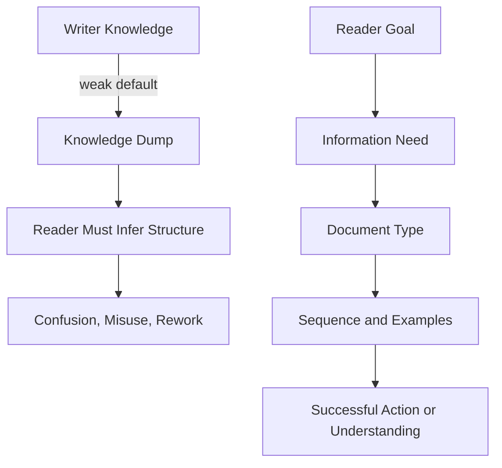
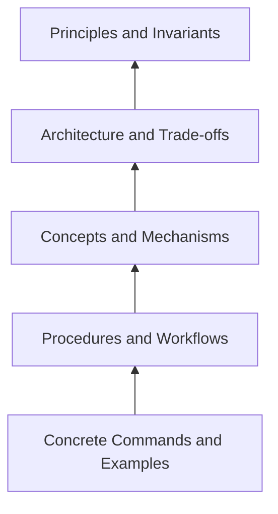
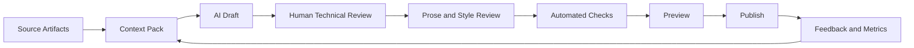

------
title: Learn AI-Driven Documentation and Technical Writing Implementation and Usage - Part 003
description: Technical writing mental models for software engineers: audience, task, context, cognitive load, information scent, progressive disclosure, verification, and AI-assisted writing boundaries.
series: learn-ai-driven-documentation
seriesTitle: Learn AI-Driven Documentation and Technical Writing Implementation and Usage
order: 3
partTitle: Technical Writing Mental Models for Software Engineers
tags:
- ai
- documentation
- technical-writing
- docs-as-code
- software-engineering
- series
date: 2026-06-30
---

# Part 003 — Technical Writing Mental Models for Software Engineers

## 1. Why This Part Exists

A senior engineer does not write documentation by simply explaining everything they know.
They write documentation by shaping knowledge into a usable system for a reader who is trying to do something.

That difference is the boundary between ordinary documentation and engineering-grade documentation.

AI makes this boundary more important, not less. A language model can quickly produce fluent text, but fluent text is not the same as correct, useful, maintainable, or safe documentation. In an engineering organization, documentation must support decisions, implementation, debugging, review, onboarding, operations, audit, and long-term system change.

This part focuses on the mental models behind strong technical writing. We are not yet optimizing tools, pipelines, RAG, agents, or publishing systems. We are building the thinking model that lets you judge whether any documentation output is good enough.

The goal is simple:

> You should be able to look at a page of documentation and quickly identify what reader problem it solves, what context it assumes, what truth it depends on, where it will fail, and how AI can assist without becoming the authority.

## 2. Kaufman Framing

Josh Kaufman's approach begins by deconstructing a skill into smaller sub-skills, practicing the highest-leverage components, learning just enough to self-correct, and reducing friction so practice actually happens.

For technical writing, the mistake is to treat the skill as “be good at writing”. That is too broad and not operational.

The useful skill target is narrower:

> Given a technical subject, produce documentation that helps a specific reader complete a specific task or build a specific understanding, with enough accuracy, structure, examples, and verification that the document can survive engineering review.

That target decomposes into these sub-skills:

1. Identify the reader and their current state.
2. Identify the job the document must perform.
3. Select the correct documentation type.
4. Choose the right abstraction level.
5. Sequence information in the order the reader needs it.
6. Make prerequisites explicit.
7. Separate facts, decisions, assumptions, opinions, and examples.
8. Use examples that are realistic and testable.
9. Detect ambiguity, overclaiming, and missing failure cases.
10. Verify generated or rewritten content against source-of-truth artifacts.

AI helps accelerate drafting and transformation, but these sub-skills remain human-owned. A weak engineer with AI often produces faster confusion. A strong engineer with AI produces faster clarity.

## 3. The Core Shift: From Knowledge Dump to Reader System

Most bad engineering docs fail because the writer starts from the wrong object.

They start from:

- “What do I know?”
- “What did we build?”
- “What should I put in the README?”
- “What can the AI summarize from this code?”

Better docs start from:

- “Who is reading this?”
- “What are they trying to do?”
- “What do they already know?”
- “What decision or action must this document enable?”
- “What would cause the reader to fail?”
- “What truth source can verify each claim?”

This gives us the first mental model.



A document is not a container for information. It is an interface for a reader's task.

That means documentation has usability. It can be easy or hard to use. It can have poor affordances. It can hide preconditions. It can create false confidence. It can fail under stress.

Treat documentation like an internal product.

## 4. Reader State Model

A reader arrives with a state. Good documentation changes that state in a deliberate way.

The reader state includes:

| Dimension | Question | Example |
|---|---|---|
| Role | Who are they? | Backend engineer, platform engineer, SRE, architect, auditor, product manager |
| Intent | Why are they here? | Learn, implement, debug, operate, decide, review, verify |
| Context | What situation triggered the need? | New service onboarding, incident, migration, API integration, design review |
| Prior knowledge | What can they safely be assumed to know? | Java basics, HTTP, Kafka, OAuth, internal deployment process |
| Time pressure | How much time do they have? | Incident response has lower tolerance for long explanation than onboarding |
| Risk | What happens if they misunderstand? | Production outage, data corruption, regulatory breach, wasted engineering time |
| Tooling | What can they access? | Repo, logs, tracing, CLI, portal, sandbox, staging environment |

When using AI, include this reader state explicitly. Do not ask:

```text
Write documentation for this service.
```

Ask:

```text
Write a task-oriented troubleshooting guide for an on-call backend engineer who already understands Kubernetes basics but has never operated this service. The goal is to diagnose elevated payment callback latency within 15 minutes. Use only the supplied runbook, alert definitions, dashboards, and recent incident notes. Mark unsupported assumptions explicitly.
```

The second prompt is not merely longer. It defines the reader state, task, constraints, and verification boundary.

## 5. Reader Modes

A single engineer may read documentation in different modes. Each mode needs a different shape of information.

| Reader Mode | Primary Need | Best Documentation Shape | Common Failure |
|---|---|---|---|
| Learning | Build basic capability | Tutorial, explanation, guided examples | Too much reference detail too early |
| Working | Complete a task | How-to guide, checklist, command sequence | Missing prerequisites or branching conditions |
| Debugging | Restore expected behavior | Troubleshooting guide, runbook, decision tree | No symptoms, no diagnostics, no escalation path |
| Deciding | Choose between options | Explanation, ADR, trade-off matrix | Presents solution without alternatives |
| Reviewing | Validate correctness | Reference, design doc, checklist, test evidence | Narrative hides invariants and assumptions |
| Auditing | Prove control/evidence | Policy, traceability matrix, approval history | Claims lack source, owner, or timestamp |
| Integrating | Use an interface correctly | API/event reference, examples, error docs | Examples are unrealistic or incomplete |
| Migrating | Move from old to new state | Migration guide, compatibility matrix | No rollback, no breaking-change inventory |

This matters because AI often produces a generic middle-ground document. Generic docs feel comprehensive but fail the user's actual mode.

A top-tier engineer learns to ask:

> Which reader mode is this document optimized for?

If the answer is “all of them,” the document probably needs to be split.

## 6. Task-Context-Output Model

A practical writing model:

```text
Document = Task + Context + Output + Verification
```

Where:

- **Task** is what the reader must accomplish.
- **Context** is the situation and constraints.
- **Output** is what the reader should produce, decide, configure, understand, or verify.
- **Verification** is how the reader knows they succeeded.

Example:

| Weak Topic | Strong Task-Context-Output Framing |
|---|---|
| Payment service docs | Configure a new merchant callback endpoint in staging and verify that signed callbacks are accepted |
| Kafka consumer docs | Add a new consumer group for the settlement event stream without breaking replay semantics |
| Deployment docs | Roll back the service to the previous production image when the canary error rate exceeds threshold |
| Architecture docs | Decide whether a new workflow should use orchestration or event choreography based on consistency and audit constraints |

A document without verification is incomplete. It may tell the reader what to do, but not how to know whether it worked.

For AI-assisted writing, add verification fields to every generation prompt:

```text
For each procedure, include:
- expected preconditions
- commands or actions
- expected observable result
- failure signal
- rollback or escalation path
- source artifact supporting the instruction
```

## 7. Cognitive Load Model

Technical writing is not about making complex things simplistic. It is about managing the reader's working memory.

A reader can handle complexity when it is structured. They struggle when unrelated concepts, steps, caveats, and abstractions are mixed together.

There are three useful forms of cognitive load:

| Load Type | Meaning | Documentation Strategy |
|---|---|---|
| Intrinsic load | The complexity inherent in the topic | Do not hide it; break it into meaningful concepts |
| Extraneous load | Complexity caused by poor presentation | Remove ambiguity, repetition, and navigation friction |
| Germane load | Productive effort used to build understanding | Provide diagrams, examples, contrasts, and mental models |

Bad documentation increases extraneous load.

Examples:

- Long paragraphs that hide sequence.
- Steps that contain multiple actions.
- Concepts introduced after they are used.
- Warnings far away from the relevant action.
- Screenshots without labels.
- Config examples without context.
- Generated prose that sounds confident but does not identify constraints.

Good documentation uses structure to protect working memory.

### 7.1 Write for Scan, Then Read

Most engineers scan before they read. They look for signs that the page matches their problem.

Strong documentation supports this pattern:

- Descriptive titles.
- Purpose statement near the top.
- Prerequisites before actions.
- Headings that describe tasks or concepts, not vague categories.
- Tables for comparison.
- Code blocks for exact commands.
- Warnings close to dangerous actions.
- Summary of success criteria.

Weak headings:

```text
Overview
Details
Usage
Advanced
Notes
```

Strong headings:

```text
Verify Callback Signature Validation
Configure Retry Backoff for Non-2xx Responses
Rollback a Failed Merchant Callback Migration
Why Callback Delivery Uses At-Least-Once Semantics
```

AI can help rewrite headings, but you must judge whether the headings expose the reader's path.

## 8. Information Scent Model

Information scent is the set of signals that tells the reader, “this page is likely to answer my question.”

In developer documentation, information scent comes from:

- Page title.
- First paragraph.
- Navigation label.
- Tags and metadata.
- Code identifiers.
- Error messages.
- API names.
- Version labels.
- Prerequisites.
- Search snippets.
- Cross-links.

If a page is accurate but hard to find, it has low operational value.

### 8.1 Search-First Writing

Many readers do not enter documentation through the homepage. They enter through search.

So each important page should answer:

1. What queries should find this page?
2. What error messages should point here?
3. What related service, API, event, or command names should appear naturally?
4. What outdated or synonym terms should redirect here?
5. What page should the reader visit next?

AI usage pattern:

```text
Given this draft, generate:
1. likely search queries a developer would use to find it
2. missing keywords or aliases that should be included naturally
3. pages that should link to it
4. pages it should link to
5. ambiguous terms that need glossary entries
```

This is a high-value AI use case because it does not ask AI to invent truth. It asks AI to inspect discoverability.

## 9. Progressive Disclosure Model

Progressive disclosure means revealing information at the level and timing the reader needs.

It avoids two common failures:

1. Dumping all details upfront.
2. Hiding important constraints until too late.

A useful pattern for engineering docs:

```text
1. What this page helps you do
2. When to use it
3. Preconditions
4. Safe path
5. Verification
6. Failure handling
7. Deeper explanation
8. Related reference
```

This order helps the reader act without forcing them through excessive theory, while still providing deeper context when needed.

### 9.1 Do Not Mix Reader Speeds

During an incident, a reader needs a fast operational path.
During onboarding, a reader needs conceptual grounding.
During architecture review, a reader needs trade-offs and invariants.

If one page tries to support all three equally, it becomes noisy.

Better:

- A runbook for incident response.
- An explanation page for system behavior.
- A reference page for metrics, alerts, and thresholds.
- An ADR for why the design exists.

This will become more formal in Part 004 when we cover Diátaxis.

## 10. Abstraction Ladder Model

Engineers often fail at documentation because they stay at one abstraction level.

A good document moves between levels intentionally.



Each level answers a different question:

| Level | Reader Question | Example |
|---|---|---|
| Command/example | What exactly do I type or call? | `curl`, CLI, config snippet, request body |
| Procedure/workflow | What sequence should I follow? | Deploy, rollback, onboard, migrate |
| Concept/mechanism | How does it work? | Retry semantics, idempotency, caching behavior |
| Architecture/trade-off | Why is it designed this way? | Why orchestration is centralized |
| Principle/invariant | What must remain true? | Events are immutable; approvals require traceability |

AI-generated docs often over-index on the middle: generic explanation and generic procedure. A human reviewer must check whether the page has the right abstraction for the reader's task.

## 11. The Truth Model

Documentation can be beautifully written and still dangerous if it is not anchored to truth.

In engineering, truth is distributed. It lives in code, tests, configuration, schemas, deployment manifests, ADRs, dashboards, issue history, incident notes, and human memory.

A documentation system needs a hierarchy of truth.

Example hierarchy:

| Truth Source | Strength | Risk |
|---|---:|---|
| Executable tests | Very high | May not cover operational reality |
| Code and configuration | Very high | May not express intent |
| API/event schemas | High | May omit behavior and edge cases |
| Deployment manifests | High | Environment-specific |
| ADRs | Medium-high | Can become stale if decisions change informally |
| Runbooks | Medium | Often manually updated after incidents |
| Tickets and PR comments | Medium | Fragmented and context-heavy |
| Chat messages | Low-medium | Easy to misread and hard to verify |
| Human memory | Low | Useful for discovery, not final authority |
| AI output | Not a truth source | Must be verified against other artifacts |

This is a non-negotiable rule:

> AI output is not a source of truth. It is a transformation layer over source material.

When reviewing AI-generated docs, ask:

- What claim is being made?
- What artifact supports it?
- Is that artifact current?
- Does the claim apply globally or only in one environment/version?
- Are there exceptions?
- Is the language stronger than the evidence?

## 12. Claim Discipline

Every technical document contains claims.

Examples:

- “This endpoint is idempotent.”
- “The job retries three times.”
- “The migration is backward compatible.”
- “The service emits an event when approval succeeds.”
- “This command is safe to run in production.”

Claims need discipline.

Classify claims into categories:

| Claim Type | Example | Verification Method |
|---|---|---|
| Fact | The endpoint path is `/v1/callbacks` | OpenAPI spec, router code |
| Behavior | The service retries on timeout | Code, test, runbook, config |
| Constraint | Amount must be positive | Validation code, schema, tests |
| Decision | We chose async processing to reduce coupling | ADR, design doc |
| Assumption | Merchants can handle duplicate callbacks | Explicit assumption, integration contract |
| Recommendation | Use exponential backoff | Standard, design decision, production evidence |
| Warning | Do not replay events before checkpoint validation | Incident evidence, operational invariant |

AI tends to blur these categories. It may phrase assumptions as facts or recommendations as rules.

A strong documentation review separates them.

## 13. Invariants and Failure Conditions

Top-tier engineering docs do not only describe the happy path. They describe what must not break.

An invariant is a statement that should remain true across normal system changes.

Examples:

- A settlement event must not be emitted before the transaction is committed.
- A retry must not create a duplicate external charge.
- A manual approval override must be traceable to an authenticated user.
- A rollback must preserve database compatibility.
- A replay job must be idempotent.

Documentation that includes invariants helps future engineers modify the system safely.

A useful doc pattern:

```mdx
## Invariants

- The event payload is immutable after publication.
- Consumers must tolerate duplicate events.
- The producer must not publish before database commit.

## Failure Modes

| Failure | Signal | Impact | Mitigation |
|---|---|---|---|
| Consumer lag grows | Lag dashboard > threshold | Delayed downstream settlement | Scale consumers or pause producer |
| Duplicate event received | Same event ID appears twice | Potential duplicate processing | Idempotency key prevents repeated action |
```

AI usage pattern:

```text
Given this architecture description and incident history, extract candidate invariants and failure modes. Mark each item as confirmed, inferred, or unsupported. Do not present inferred items as facts.
```

## 14. Example Quality Model

Examples are often the highest-value part of developer documentation. They are also one of the easiest places to create subtle errors.

A good example is:

- Realistic enough to transfer to production thinking.
- Minimal enough to understand quickly.
- Complete enough to run or adapt.
- Annotated enough to explain important choices.
- Version-aware.
- Safe by default.
- Tested or at least mechanically checked.

Weak example:

```json
{
  "id": "123",
  "amount": 100
}
```

Better example:

```json
{
  "merchantId": "mrc_9f21",
  "callbackId": "cbk_20260630_000182",
  "eventType": "payment.settled",
  "occurredAt": "2026-06-30T08:14:21Z",
  "amount": {
    "currency": "IDR",
    "value": "125000.00"
  },
  "idempotencyKey": "payment_7h3k_settlement_v1"
}
```

The better example reveals domain shape, time format, event type, money representation, and idempotency.

However, examples must not leak production secrets, internal customer data, tokens, or operationally dangerous commands.

## 15. Procedural Writing Model

Procedural documentation helps a reader complete an action.

A procedure should usually contain:

1. Purpose.
2. When to use it.
3. Preconditions.
4. Required permissions/tools.
5. Steps.
6. Expected result after each critical step.
7. Verification.
8. Troubleshooting.
9. Rollback or escalation.

Bad procedure:

```mdx
Run the migration and verify it works.
```

Better procedure:

```mdx
## Run the Staging Migration

Use this procedure when validating schema changes before production deployment.

### Preconditions

- You have deployment access to staging.
- The service version is at least `2026.06.30-rc1`.
- The migration has passed CI.

### Steps

1. Start the migration in dry-run mode.

   ```bash
   ./ops/migrate.sh --env staging --dry-run
   ```

   Expected result: the command reports the planned DDL changes and exits with status `0`.

2. Run the migration.

   ```bash
   ./ops/migrate.sh --env staging --apply
   ```

3. Verify the schema version.

   ```bash
   ./ops/schema-version.sh --env staging
   ```

   Expected result: the reported version matches the release notes.

### Rollback

Do not run rollback manually if the migration has reached the irreversible step. Escalate to the database owner.
```

Strong procedures reduce ambiguity under pressure.

## 16. Explanation Writing Model

Explanations help readers understand why something works the way it does.

They are not step-by-step tasks. They are mental models.

A good explanation:

- Starts with the problem or tension.
- Identifies constraints.
- Explains the mechanism.
- Shows trade-offs.
- Connects to operational consequences.
- Avoids pretending every design choice is obvious.

Example explanation skeleton:

```mdx
# Why Callback Delivery Uses At-Least-Once Semantics

## Problem

External merchant systems are not always reachable when payment settlement completes.

## Constraint

The platform must not lose settlement notifications, but it cannot guarantee that external systems process each callback exactly once.

## Mechanism

The callback dispatcher persists delivery attempts and retries failed deliveries with backoff.

## Consequence

Merchants may receive duplicate callbacks and must deduplicate by callback ID or idempotency key.

## Trade-off

At-least-once delivery favors reliability over consumer simplicity.
```

AI is good at producing first drafts of explanations from design notes, but it must not invent constraints or trade-offs that are not recorded.

## 17. Reference Writing Model

Reference documentation is not a tutorial. It should be accurate, complete, and predictable.

A reference page should optimize for lookup, not storytelling.

Common reference content:

- API endpoints.
- Event schemas.
- CLI commands.
- Configuration keys.
- Environment variables.
- Error codes.
- Permissions.
- Metrics.
- Alert definitions.

Reference pages need consistency more than charm.

For example, every configuration key should use the same fields:

| Field | Meaning |
|---|---|
| Name | Exact key |
| Type | String, number, boolean, enum, duration |
| Default | Default value if omitted |
| Required | Whether the key is mandatory |
| Scope | Service, environment, tenant, request |
| Valid values | Allowed range or enum |
| Example | Safe sample value |
| Effect | What behavior changes |
| Risk | What can break if misconfigured |
| Source | Config file, schema, code reference |

AI can generate reference tables, but final verification should come from schemas, source code, or config definitions.

## 18. Troubleshooting Model

Troubleshooting documentation is different from general explanation. It starts from symptoms.

A useful troubleshooting page is organized by observable signals:

| Symptom | Likely Cause | Diagnostic | Fix | Escalate When |
|---|---|---|---|---|
| Callback latency increases | Worker backlog | Check queue depth dashboard | Scale callback workers | Queue depth does not drop after scaling |
| Signature validation fails | Wrong shared secret | Compare secret version metadata | Rotate or sync secret | Multiple merchants affected |
| Duplicate event processing | Missing idempotency check | Search by event ID | Rebuild idempotency record | External action already repeated |

Troubleshooting docs should avoid vague language like:

- “Check the logs.”
- “Restart the service.”
- “Investigate the issue.”
- “Contact the team.”

Better:

- Which logs?
- Which query?
- Which dashboard?
- Which metric threshold?
- Which restart command?
- Which team/channel?
- What information should be included when escalating?

AI usage pattern:

```text
Convert this incident postmortem into a troubleshooting table organized by symptom, cause, diagnostic, mitigation, and escalation criteria. Only include mitigations that appear in the source. Mark gaps explicitly.
```

## 19. Decision Documentation Model

Decision docs are not marketing narratives for a chosen solution. They are records of constrained trade-offs.

A good decision document contains:

- Context.
- Problem.
- Constraints.
- Options considered.
- Decision.
- Consequences.
- Reversibility.
- Impacted systems.
- Risk and mitigation.
- Open questions.

AI can help extract decision records from design documents, meeting notes, PR discussion, and issue history. But the resulting ADR must be reviewed by decision owners.

Critical rule:

> A decision document should preserve the reasoning, not just the conclusion.

Without reasoning, future engineers cannot know whether the decision still applies.

## 20. The Documentation Contract

Each page should make an implicit contract explicit.

A documentation contract answers:

1. Who is this page for?
2. What does it help them do or understand?
3. What does it not cover?
4. What prerequisites are assumed?
5. What version/environment does it apply to?
6. What source-of-truth artifacts back it?
7. Who owns it?
8. How should it be updated?

Template:

```mdx
## Documentation Contract

- Audience: Backend engineers operating the callback delivery service.
- Purpose: Diagnose and mitigate callback latency incidents.
- Scope: Production and staging environments.
- Out of scope: Merchant-side callback implementation.
- Prerequisites: Access to service dashboards, logs, and deployment console.
- Source of truth: Alert rules, runbook repository, callback dispatcher code.
- Owner: Payments Platform team.
- Review cadence: After every related incident or at least quarterly.
```

This is especially useful for AI-assisted documentation because it gives the model boundaries.

## 21. Ambiguity Detection

Ambiguity is not a writing problem only. It is an engineering risk.

Common ambiguous phrases:

| Ambiguous Phrase | Problem | Better Alternative |
|---|---|---|
| recently | No exact time | Since version `2026.06.30` |
| should work | No success condition | Succeeds when the command exits with code `0` and metric X drops below Y |
| usually | Hides exception | Works for retries caused by network timeout, not validation failure |
| some services | Unclear scope | Applies to callback-dispatcher and settlement-worker |
| high latency | No threshold | p95 latency above 2 seconds for 10 minutes |
| contact the team | Unclear escalation | Escalate to `#payments-oncall` with incident ID, dashboard link, and last failed command |

AI can be used as an ambiguity scanner:

```text
Review this documentation for ambiguous phrases. For each ambiguity, explain why it is risky and propose a precise replacement. Do not change technical meaning unless the source supports it.
```

## 22. Freshness and Staleness Model

Documentation decays when the system changes faster than the docs.

High-risk stale content:

- Deployment steps.
- API examples.
- Configuration keys.
- Ownership and escalation paths.
- Screenshots.
- Security controls.
- Incident response procedures.
- Compatibility matrices.
- Generated reference docs not regenerated from current specs.

A documentation page should include freshness signals:

```yaml
lastReviewed: 2026-06-30
reviewCadence: quarterly
owner: payments-platform
sourceArtifacts:
  - /services/callback-dispatcher/openapi.yaml
  - /ops/runbooks/callback-latency.md
  - /alerts/callback-latency.yaml
```

AI can help identify likely stale docs by comparing the document against current code, specs, or commit history. But freshness detection must be evidence-based.

## 23. Technical Writing as Failure Modeling

A strong engineer asks how a document can fail.

Failure modes include:

| Failure Mode | Example | Prevention |
|---|---|---|
| Wrong audience | A beginner tutorial assumes deep internal knowledge | Add audience and prerequisites |
| Wrong type | A reference page tries to teach concepts | Split explanation from reference |
| Missing precondition | Procedure assumes access or environment setup | Add precondition checklist |
| Unsafe instruction | Command can affect production data | Add warning, dry-run, permission boundary |
| No verification | Reader cannot know success | Add expected output and validation step |
| No rollback | Migration guide omits recovery | Add rollback and escalation path |
| Stale claim | Owner/team changed | Add owner metadata and review cadence |
| AI hallucination | Generated content invents behavior | Source-grounded review and citations |
| Over-generalization | Statement applies only to one environment | Add scope and version constraints |
| Hidden trade-off | Design doc sells only one option | Add alternatives and consequences |

This model turns writing into engineering.

## 24. AI-Assisted Technical Writing Workflow

Use AI where it provides leverage, not where it creates unmanaged authority.

High-leverage AI tasks:

- Turn rough notes into structured drafts.
- Classify content by reader mode.
- Rewrite dense prose into clearer steps.
- Extract prerequisites and assumptions.
- Generate search queries and metadata.
- Find ambiguity and missing verification.
- Produce first-pass troubleshooting tables from incident notes.
- Compare old and new docs for semantic drift.
- Generate review checklists.

Risky AI tasks:

- Inventing behavior from code without verification.
- Writing security guidance without source constraints.
- Summarizing long architectural history without citations.
- Generating production commands without human review.
- Creating compliance language without policy review.
- Producing API examples not checked against schema.

Recommended workflow:



## 25. Context Pack Pattern

Before asking AI to write, create a context pack.

A context pack is a compact, curated input bundle that defines what the AI is allowed to use.

Example:

```mdx
# Context Pack: Callback Latency Runbook

## Goal

Create a troubleshooting guide for on-call backend engineers.

## Audience

Engineers with Kubernetes and observability basics, but no deep callback service knowledge.

## Allowed Sources

- Current alert rule: `alerts/callback-latency.yaml`
- Current dashboards: `observability/callback-dashboard.md`
- Incident notes: `incidents/2026-06-callback-latency.md`
- Runbook draft: `runbooks/callback-latency-rough.md`

## Do Not Use

- Unverified Slack comments.
- Assumptions about merchant behavior.
- Production secrets or customer identifiers.

## Output Required

- Purpose
- Symptoms
- Preconditions
- Diagnostic decision tree
- Mitigation steps
- Escalation criteria
- Verification
- Open gaps
```

This pattern improves AI output quality because the task, boundary, and structure are explicit.

## 26. Source-Grounded Drafting Prompt

Use prompts that force evidence separation.

```text
You are helping produce internal engineering documentation.

Task:
Draft a troubleshooting guide for callback latency incidents.

Audience:
On-call backend engineers who understand Kubernetes and basic observability but are new to this service.

Allowed sources:
Use only the provided alert rules, dashboard descriptions, runbook notes, and incident timeline.

Rules:
- Do not invent thresholds, commands, ownership, or rollback steps.
- If a required detail is missing, write "Documentation gap".
- Separate confirmed facts from inferred recommendations.
- Include verification after each critical action.
- Use concise procedural language.

Output structure:
1. Purpose
2. When to use this guide
3. Preconditions
4. Symptoms
5. Diagnostic decision tree
6. Mitigation steps
7. Verification
8. Escalation
9. Documentation gaps
```

This is not magic. It is a control surface.

## 27. Review Checklist for AI-Generated Docs

Use this checklist before accepting any AI-generated technical documentation.

### 27.1 Reader Fit

- Is the audience explicit?
- Is the reader mode clear?
- Does the document solve one primary problem?
- Are prerequisites stated?
- Is the first paragraph useful for search and orientation?

### 27.2 Technical Accuracy

- Are claims supported by source artifacts?
- Are assumptions marked?
- Are version/environment constraints stated?
- Are examples valid?
- Are dangerous commands reviewed?
- Are failure cases included?

### 27.3 Structure

- Does the document type match the reader need?
- Are headings descriptive?
- Are steps ordered correctly?
- Are warnings near relevant actions?
- Are tables used where comparison or lookup matters?

### 27.4 Verification

- Does each procedure include success criteria?
- Are expected outputs shown?
- Are rollback or escalation paths documented?
- Are code/config examples testable?
- Are links and references current?

### 27.5 Maintainability

- Is the owner defined?
- Is the source of truth listed?
- Is review cadence defined?
- Is generated content clearly bounded?
- Can CI validate part of the content?

## 28. Practical Rewrite Example

Weak draft:

```mdx
The payment callback service sends callbacks to merchants. If callbacks are delayed, check logs and restart the worker if needed. The service retries failed callbacks. Make sure everything is configured properly.
```

Problems:

- No audience.
- No threshold.
- No diagnostic path.
- “Check logs” is vague.
- “Restart if needed” is unsafe.
- No verification.
- No source of truth.
- No distinction between delayed and failed callbacks.

Improved draft:

```mdx
# Troubleshoot Elevated Callback Delivery Latency

Use this guide when the callback delivery latency alert fires for the production callback dispatcher.

## Preconditions

- You are the active payments on-call engineer.
- You have access to the callback dispatcher dashboard, worker logs, and deployment console.
- You know the incident ID or alert timestamp.

## Confirm the Symptom

1. Open the callback dispatcher latency dashboard.
2. Check p95 delivery latency for the affected environment.
3. Compare latency against the active alert threshold.

Expected result: the dashboard confirms elevated latency in the same time window as the alert.

## Diagnose Worker Backlog

1. Check queue depth for callback delivery jobs.
2. Check worker error rate.
3. Check whether failed deliveries are concentrated on one merchant or across all merchants.

## Mitigate

If queue depth is increasing and worker error rate is normal, scale callback workers according to the runbook limit.

Do not restart all workers at once unless the on-call lead confirms that worker processes are unhealthy.

## Verify Recovery

Latency should trend down and queue depth should stop increasing.

## Escalate

Escalate to the payments platform owner if latency does not improve after the documented scaling action or if failures affect multiple merchants.
```

The improved version is still not final because thresholds, dashboard names, and scaling limits must be source-verified. But it has a usable structure.

## 29. Documentation Rubric

Use this rubric to score a document from 1 to 5.

| Dimension | 1 — Weak | 3 — Acceptable | 5 — Strong |
|---|---|---|---|
| Reader fit | Audience unclear | Audience implied | Audience and reader mode explicit |
| Purpose | Topic-focused | Task or concept partly clear | Clear job-to-be-done |
| Accuracy | Unsupported claims | Mostly source-aligned | Claims traceable to source artifacts |
| Structure | Dumped information | Reasonable sections | Optimized sequence for reader mode |
| Examples | Toy or missing | Some usable examples | Realistic, safe, version-aware examples |
| Verification | None | Partial success criteria | Clear observable success and failure signals |
| Failure handling | Happy path only | Some caveats | Failure modes, rollback, escalation included |
| Maintainability | No owner | Owner or date present | Owner, source, review cadence, lifecycle metadata |
| AI safety | Unreviewed generated text | Human reviewed | Source-grounded, checked, and bounded |

A page scoring below 3 in accuracy or verification should not be published for operational use.

## 30. Practice Drills

The goal is not passive reading. Use these drills to build skill.

### Drill 1 — Reader Mode Classification

Take five existing docs from your organization or an open-source project. For each one, identify:

- Primary reader mode.
- Intended audience.
- Actual structure.
- Mismatch between mode and structure.
- One improvement.

### Drill 2 — Ambiguity Removal

Find a doc with vague phrases like “usually”, “recently”, “check logs”, or “make sure”. Rewrite the sentences with precise conditions and observable criteria.

### Drill 3 — Procedure Hardening

Take a procedure and add:

- Preconditions.
- Expected output.
- Verification.
- Failure handling.
- Rollback or escalation.

### Drill 4 — AI Review, Not AI Drafting

Ask AI to review a document for:

- Ambiguity.
- Missing prerequisites.
- Unsupported claims.
- Missing verification.
- Wrong reader mode.

Then compare the AI review with your own review. Identify where the model found useful gaps and where it overreached.

### Drill 5 — Claim Classification

Take a design document and classify 20 statements as:

- Fact.
- Behavior.
- Constraint.
- Decision.
- Assumption.
- Recommendation.
- Warning.

Then identify what source would verify each claim.

## 31. Completion Criteria

You have completed this part when you can:

1. Explain why documentation is a reader system, not a knowledge dump.
2. Identify reader mode and reader state for a document.
3. Rewrite vague documentation into task-oriented, verifiable documentation.
4. Separate facts, assumptions, decisions, and recommendations.
5. Design a documentation contract for a page.
6. Use AI to improve structure and detect gaps without treating AI output as truth.
7. Review AI-generated documentation using a clear rubric.

## 32. Key Takeaways

- Strong technical writing starts from the reader's job, not the writer's knowledge.
- Documentation should be optimized for a reader mode: learning, working, debugging, deciding, reviewing, auditing, integrating, or migrating.
- A useful document includes task, context, output, and verification.
- AI can accelerate drafting, restructuring, and review, but it is not a source of truth.
- Engineering-grade documentation includes claims discipline, invariants, examples, failure modes, ownership, and freshness signals.
- The best documentation reduces extraneous cognitive load while preserving necessary technical complexity.

## References

- Google Developer Documentation Style Guide — https://developers.google.com/style
- Microsoft Writing Style Guide — https://learn.microsoft.com/en-us/style-guide/welcome/
- Microsoft Style Guide: Writing step-by-step instructions — https://learn.microsoft.com/en-us/style-guide/procedures-instructions/writing-step-by-step-instructions
- Diátaxis Framework — https://diataxis.fr/
- Write the Docs: Documentation Guide — https://www.writethedocs.org/guide/
