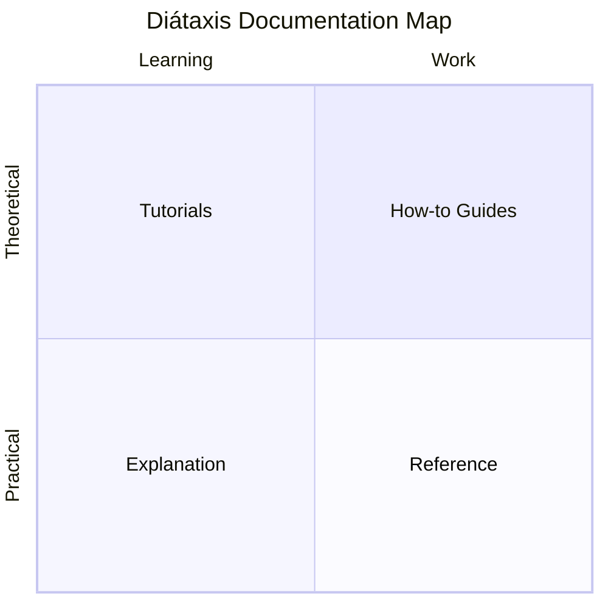
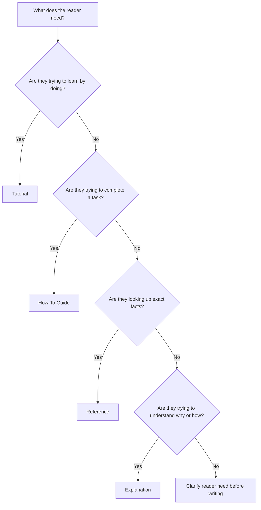
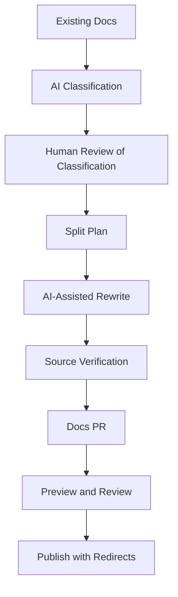

------
title: Learn AI-Driven Documentation and Technical Writing Implementation and Usage - Part 004
description: Diátaxis and information architecture for AI-driven documentation systems: tutorials, how-to guides, reference, explanation, navigation, metadata, migration, and AI routing.
series: learn-ai-driven-documentation
seriesTitle: Learn AI-Driven Documentation and Technical Writing Implementation and Usage
order: 4
partTitle: Diátaxis and Information Architecture
tags:
- ai
- documentation
- technical-writing
- diataxis
- information-architecture
- docs-as-code
- series
date: 2026-06-30
---

# Part 004 — Diátaxis and Information Architecture

## 1. Why This Part Exists

Part 003 established that documentation is a reader system. This part turns that idea into an architecture.

A documentation set fails when every page tries to be everything:

- Tutorial plus reference plus troubleshooting plus architecture explanation.
- README plus onboarding guide plus production runbook.
- API reference plus conceptual product guide.
- ADR plus implementation guide plus release notes.

The result feels comprehensive, but it is difficult to use. Readers cannot tell where to go, what kind of help a page provides, or whether the page is meant for learning, working, lookup, or understanding.

Diátaxis gives us a practical classification system for documentation. It separates documentation into four forms:

1. Tutorials.
2. How-to guides.
3. Reference.
4. Explanation.

The value is not academic taxonomy. The value is operational clarity.

When we apply Diátaxis to AI-driven documentation, it becomes a routing system:

- What kind of document should AI generate?
- What context should it receive?
- What quality gate should apply?
- What reviewer should approve it?
- Where should the page live?
- How should readers find it?

This part focuses on building that architecture.

## 2. Kaufman Framing

Using Kaufman's skill acquisition method, the target performance for this part is:

> Given a messy documentation problem, classify the reader need, select the correct Diátaxis form, design the page structure, place it in an information architecture, and define how AI can assist without mixing document types.

The sub-skills are:

1. Distinguish learning, task, lookup, and understanding needs.
2. Classify a page into tutorial, how-to, reference, or explanation.
3. Detect mixed-mode documentation.
4. Split mixed pages into better pages.
5. Design navigation around reader intent.
6. Create metadata that supports search, ownership, review, and AI retrieval.
7. Use AI to classify, restructure, and migrate docs safely.

This is a high-leverage skill because many documentation problems are not writing problems. They are architecture problems.

## 3. The Diátaxis Map

Diátaxis organizes documentation around two axes:

- Practical vs theoretical.
- Learning-oriented vs work-oriented.



A simpler view:

| Form | Reader Need | Orientation | Example |
|---|---|---|---|
| Tutorial | Learn by doing | Practical + learning | Build your first callback integration |
| How-to guide | Complete a real task | Practical + work | Rotate a merchant callback secret |
| Reference | Look up facts | Theoretical + work | Callback API fields and error codes |
| Explanation | Understand why/how | Theoretical + learning | Why callback delivery is at-least-once |

The core rule:

> Do not choose documentation type based on what you want to say. Choose it based on what the reader needs to do or understand.

## 4. Tutorials

A tutorial teaches by guiding the reader through a successful learning experience.

The goal is not completeness. The goal is capability transfer.

A tutorial should:

- Start from a controlled setup.
- Guide the reader step by step.
- Avoid unnecessary branches.
- Use a safe learning environment.
- Explain only enough to keep the learner oriented.
- Produce a visible result.
- Build confidence.

A tutorial should not:

- Cover every option.
- Become a reference manual.
- Include production-only hazards unless necessary.
- Assume the reader can fill in missing steps.
- Introduce many alternatives too early.

### 4.1 Tutorial Structure

```mdx
# Build Your First Callback Integration

## What You Will Build

A minimal staging callback receiver that validates signed payment callbacks.

## Prerequisites

- Access to the staging merchant portal.
- Local runtime installed.
- Basic HTTP knowledge.

## Step 1: Create a Callback Receiver

...

## Step 2: Register the Callback URL

...

## Step 3: Send a Test Callback

...

## Step 4: Verify the Signature

...

## What You Learned

- How callback registration works.
- How signature validation protects delivery.
- Where to look next for production configuration.
```

### 4.2 AI Use Cases for Tutorials

AI is useful for:

- Turning expert notes into a guided learning path.
- Detecting missing learner prerequisites.
- Simplifying setup steps.
- Generating a “what you learned” section.
- Finding places where too much reference detail interrupts learning.

AI is risky for:

- Inventing setup commands.
- Producing examples not tested in a clean environment.
- Hiding important safety constraints for the sake of simplicity.

Prompt pattern:

```text
Convert the supplied rough notes into a tutorial for a first-time internal engineer. Keep the path linear. Do not include every option. Include prerequisites, expected results after each major step, and a final summary of what the learner has achieved. Mark any missing command or environment detail as a documentation gap.
```

## 5. How-To Guides

A how-to guide helps a reader complete a specific real-world task.

The reader is not primarily studying. They are working.

A how-to guide should:

- Start with a concrete task.
- State when to use it.
- Include prerequisites.
- Provide steps in operational order.
- Include expected outcomes.
- Include failure handling when relevant.
- Link to reference and explanation, but not duplicate them.

A how-to guide should not:

- Teach broad concepts in the middle of the procedure.
- Include unrelated alternatives.
- Assume happy path only.
- Hide verification.
- Become a dumping ground for every related command.

### 5.1 How-To Structure

```mdx
# Rotate a Merchant Callback Secret

## When to Use This Guide

Use this guide when a merchant callback secret is compromised, expired, or being rotated as part of scheduled maintenance.

## Preconditions

- You have permission to update merchant integration settings.
- The merchant has confirmed the rotation window.
- The current callback endpoint is healthy.

## Steps

1. Generate the new secret.
2. Register the new secret in staging.
3. Send a signed test callback.
4. Promote the new secret to production.
5. Monitor callback failures.

## Verify Success

Callback signature validation succeeds with the new secret, and no increase in callback failure rate is observed.

## Rollback

If validation fails during the rotation window, restore the previous active secret and notify the merchant.
```

### 5.2 AI Use Cases for How-To Guides

AI is useful for:

- Extracting steps from PRs, tickets, and runbooks.
- Reordering actions into a safer sequence.
- Adding expected result placeholders.
- Detecting missing preconditions.
- Converting long explanations into concise procedures.

AI is risky for:

- Generating production actions without source verification.
- Omitting rollback.
- Treating inferred behavior as confirmed.
- Combining multiple tasks into one confusing guide.

Prompt pattern:

```text
Create a how-to guide from the supplied source material. Optimize for an engineer completing the task, not learning the system from scratch. Include preconditions, steps, expected results, verification, rollback, and escalation. Do not include conceptual explanation except where it prevents misuse. Link conceptual gaps as "See explanation" placeholders.
```

## 6. Reference

Reference documentation provides factual lookup.

The reader needs accurate, complete, predictable information.

Reference should:

- Be structured consistently.
- Be easy to scan.
- Avoid narrative unless needed for clarity.
- Include exact names, fields, types, defaults, constraints, and examples.
- Be generated from source of truth where possible.
- Clearly state version and scope.

Reference should not:

- Teach concepts extensively.
- Tell a story.
- Hide required fields in paragraphs.
- Include unsupported examples.
- Mix unstable operational advice with stable facts.

### 6.1 Reference Structure

Example for a configuration reference:

```mdx
# Callback Dispatcher Configuration Reference

## `callback.retry.maxAttempts`

| Field | Value |
|---|---|
| Type | Integer |
| Required | No |
| Default | `3` |
| Scope | Service instance |
| Valid range | `1` to `10` |
| Applies to | Failed callback delivery attempts |
| Source | `CallbackRetryProperties` |

## `callback.retry.initialDelayMs`

...
```

Example for an API reference:

```mdx
# Create Callback Endpoint

## Request

`POST /v1/callback-endpoints`

## Fields

| Field | Type | Required | Description |
|---|---|---:|---|
| `url` | string | Yes | HTTPS endpoint that receives callbacks |
| `eventTypes` | array | Yes | Callback event types to deliver |
| `description` | string | No | Human-readable label |

## Responses

| Status | Meaning |
|---:|---|
| 201 | Callback endpoint created |
| 400 | Request validation failed |
| 409 | Endpoint already exists |
```

### 6.2 AI Use Cases for Reference

AI is useful for:

- Formatting extracted schema data into readable tables.
- Generating short descriptions from source names and comments.
- Detecting inconsistent reference formatting.
- Suggesting missing fields in a reference template.

AI is risky for:

- Inventing default values.
- Inventing status codes.
- Inventing enum values.
- Rewriting precise terminology into vague prose.

Reference docs should prefer generation from structured artifacts such as OpenAPI, AsyncAPI, protobuf, JSON Schema, configuration schemas, or source-code metadata.

## 7. Explanation

Explanation documentation builds understanding.

It answers “why” and “how does this work?”

Explanation should:

- Reveal concepts, mechanisms, and trade-offs.
- Explain constraints and design forces.
- Connect behavior to consequences.
- Help readers form a mental model.
- Link to tutorials, how-to guides, and reference.

Explanation should not:

- Become a step-by-step procedure.
- Try to include every exact field or option.
- Hide uncertainty.
- Rewrite history as if every decision was obvious.

### 7.1 Explanation Structure

```mdx
# Why Callback Delivery Uses At-Least-Once Semantics

## Problem

External merchant systems may be unavailable when a payment settles.

## Design Pressure

The platform must avoid losing callback notifications, but cannot control external merchant processing.

## Mechanism

The dispatcher persists delivery attempts and retries failed callbacks.

## Consequence

A merchant may receive the same callback more than once.

## Required Consumer Behavior

Consumers must deduplicate by callback ID or idempotency key.

## Trade-Off

The system favors delivery reliability over consumer simplicity.
```

### 7.2 AI Use Cases for Explanation

AI is useful for:

- Turning ADRs into explanatory pages.
- Extracting design forces and consequences.
- Producing analogies for internal training.
- Finding conceptual gaps between procedures and reference.

AI is risky for:

- Inventing historical motivations.
- Over-smoothing trade-offs.
- Removing nuance from architecture decisions.
- Presenting inferred reasoning as recorded decision history.

Prompt pattern:

```text
Write an explanation page from the supplied ADR and design notes. Preserve trade-offs and constraints. Do not add motivations that are not present in the source. Separate recorded decisions from inferred explanations. Link to how-to and reference pages rather than duplicating steps or field tables.
```

## 8. The Most Important Distinction: Tutorial vs How-To

Tutorials and how-to guides are both practical, but they serve different reader states.

| Dimension | Tutorial | How-To Guide |
|---|---|---|
| Reader state | Learning | Working |
| Goal | Build capability | Complete a task |
| Path | Controlled and safe | Real-world and conditional |
| Completeness | Selective | Task-complete |
| Error handling | Minimal, enough to keep learning | Important, sometimes mandatory |
| Environment | Sandbox/staging preferred | Actual target environment |
| Success | Learner understands and completes exercise | Task is done correctly |

Bad pattern:

```mdx
# Getting Started with Production Secret Rotation
```

This mixes a beginner learning phrase with a risky production task.

Better split:

- Tutorial: `Create and Validate a Callback Secret in Staging`
- How-to: `Rotate a Production Callback Secret`
- Explanation: `How Callback Signature Validation Works`
- Reference: `Callback Secret Configuration Reference`

## 9. The Second Important Distinction: Reference vs Explanation

Reference and explanation are both theoretical, but they serve different reader needs.

| Dimension | Reference | Explanation |
|---|---|---|
| Reader state | Looking up facts | Building understanding |
| Shape | Structured and predictable | Narrative and conceptual |
| Content | Fields, types, commands, errors, schemas | Mechanisms, reasoning, trade-offs |
| Change driver | Source-of-truth artifact changes | Design or conceptual model changes |
| Success | Reader finds exact information | Reader understands why/how |

Bad pattern:

```mdx
# Retry Configuration Reference

The retry system exists because distributed systems are unreliable...
```

The opening explanation may be useful, but it should not dominate a reference page.

Better:

- Reference: `Retry Configuration Reference`
- Explanation: `How Callback Retry and Backoff Work`

## 10. Classification Algorithm

Use this decision path when creating or reviewing docs.



Quick heuristic:

| User Says | Likely Type |
|---|---|
| “Teach me…” | Tutorial |
| “How do I…” | How-to guide |
| “What is the field/default/error code…” | Reference |
| “Why does it behave this way…” | Explanation |
| “What changed in this release…” | Release notes or migration guide, often linked to how-to/reference |
| “What should I do when this alert fires…” | Runbook/troubleshooting guide, a specialized how-to |

## 11. Mixed-Mode Documentation Smells

Mixed-mode docs are common. They are not always wrong, but they must be intentional.

Common smells:

| Smell | Symptom | Fix |
|---|---|---|
| README gravity | README contains setup, architecture, API reference, runbook, and roadmap | Split into landing page plus targeted docs |
| Tutorial overload | Beginner tutorial includes every production option | Move options to reference |
| Reference storytelling | Reference page has long design essays | Move theory to explanation |
| How-to without verification | Steps end without expected result | Add verification section |
| Explanation with hidden steps | Concept page contains operational commands | Move commands to how-to |
| Runbook as tribal memory | Incident knowledge appears as scattered notes | Convert to symptom-based troubleshooting guide |
| Generated docs dump | AI output creates one long “complete guide” | Classify and split by reader need |

AI is useful for detecting these smells:

```text
Classify each section of this document as tutorial, how-to, reference, explanation, troubleshooting, or decision record. Identify mixed-mode sections and suggest a split plan. Do not rewrite yet.
```

## 12. Information Architecture for Engineering Docs

Information architecture is how documentation is organized so readers can find and use it.

A mature engineering documentation system usually needs several layers.

```mermaid
flowchart TD
    A[Documentation Home] --> B[Getting Started]
    A --> C[How-To Guides]
    A --> D[Reference]
    A --> E[Architecture and Explanation]
    A --> F[Operations]
    A --> G[Decisions]
    A --> H[Governance]

    B --> B1[Onboarding Tutorials]
    B --> B2[Local Setup]
    B --> B3[First Contribution]

    C --> C1[Development Tasks]
    C --> C2[Deployment Tasks]
    C --> C3[Migration Tasks]

    D --> D1[API Reference]
    D --> D2[Event Reference]
    D --> D3[Configuration Reference]
    D --> D4[Error Codes]

    E --> E1[System Concepts]
    E --> E2[Architecture Overviews]
    E --> E3[Trade-Offs]

    F --> F1[Runbooks]
    F --> F2[Troubleshooting]
    F --> F3[Incident Response]

    G --> G1[ADRs]
    G --> G2[Design Docs]

    H --> H1[Policies]
    H --> H2[Review Process]
    H --> H3[Audit Evidence]
```



This structure should not be copied blindly. It is a baseline. The right architecture depends on your organization, product, and operational risk.

## 13. Landing Pages

A landing page is not a dumping ground. It is a routing page.

A good landing page answers:

- What is this area?
- Who is it for?
- Where should I start?
- What are the most common tasks?
- Where is the reference?
- Where are operational procedures?
- Who owns this area?

Example:

```mdx
# Callback Delivery Documentation

Callback delivery sends payment lifecycle notifications to merchant systems.

## Start Here

- New to callback delivery? Start with `Build Your First Callback Integration`.
- Need to complete a task? See `Callback How-To Guides`.
- Looking for exact fields? See `Callback API Reference`.
- On call for an incident? See `Callback Runbooks`.

## Common Tasks

- Register a callback endpoint.
- Rotate a callback secret.
- Diagnose callback latency.
- Replay failed callbacks.

## Ownership

Owned by Payments Platform.
```

AI can generate a first-pass landing page from a directory tree, but humans should check whether the routing reflects real user journeys.

## 14. Navigation Design

Navigation should map to reader intent, not org chart alone.

Poor navigation:

```text
Team A
Team B
Team C
Misc
Old Docs
```

Better navigation:

```text
Start
Build
Operate
Integrate
Reference
Architecture
Decisions
Governance
```

Org charts change. Reader tasks remain more stable.

However, ownership must still be visible through metadata and page headers.

## 15. Metadata and Frontmatter

AI-driven documentation needs metadata because tools need structure.

Useful frontmatter fields:

```yaml
title: Rotate a Merchant Callback Secret
description: Step-by-step guide for rotating callback secrets safely in staging and production.
series: callback-delivery
docType: how-to
audience:
  - backend-engineer
  - platform-engineer
readerMode: working
owner: payments-platform
sourceArtifacts:
  - services/callback-dispatcher/config/schema.yaml
  - runbooks/callback-secret-rotation.md
lastReviewed: 2026-06-30
reviewCadence: quarterly
riskLevel: high
environments:
  - staging
  - production
tags:
  - callback
  - security
  - merchant-integration
```

Metadata supports:

- Search.
- Ownership.
- Review scheduling.
- AI retrieval.
- Quality gates.
- Risk-based approval.
- Staleness detection.
- Navigation generation.

For this series, we use a simpler frontmatter shape, but enterprise documentation systems should evolve toward richer metadata.

## 16. AI Routing by Document Type

AI workflows should be document-type aware.

Do not use one generic “write docs” prompt.

Use different prompts, validators, and reviewers per doc type.

| Doc Type | AI Input | AI Output | Required Review |
|---|---|---|---|
| Tutorial | Learning goal, setup, source notes | Guided path | Engineer + technical writer if external |
| How-to | Task notes, runbook, code/config references | Procedure | Owner engineer + operator if operational |
| Reference | Schema, source metadata, generated artifacts | Tables/structured reference | Automated validation + owner review |
| Explanation | ADRs, design docs, incident learnings | Conceptual narrative | Architect/decision owner |
| Runbook | Alerts, dashboards, incidents, commands | Diagnostic workflow | SRE/on-call owner |
| Release notes | PRs, commits, issue labels | Change summary | Release owner |
| Migration guide | Breaking changes, compatibility matrix | Migration steps | System owner + affected consumers |

This helps prevent AI from producing a single smooth but structurally wrong document.

## 17. Document Type Quality Gates

Each document type needs different quality checks.

### 17.1 Tutorial Gate

- Can a new reader complete it in a clean environment?
- Are prerequisites realistic?
- Does the tutorial avoid unnecessary branches?
- Does it produce a visible result?
- Does it link to next steps?

### 17.2 How-To Gate

- Is the task specific?
- Are preconditions clear?
- Are steps ordered safely?
- Are expected results included?
- Are rollback/escalation paths present when risk is non-trivial?

### 17.3 Reference Gate

- Is information generated from or verified against source of truth?
- Are fields, types, defaults, constraints, and examples accurate?
- Is formatting consistent?
- Is version/scope clear?

### 17.4 Explanation Gate

- Does it answer a real “why” or “how” question?
- Are trade-offs explicit?
- Are assumptions and constraints visible?
- Does it avoid becoming a procedure?
- Are decisions linked to ADRs where available?

## 18. Splitting a Mixed README

A common enterprise problem: a service README grows until no one knows how to use it.

Example current README sections:

```text
# Payment Callback Service
- Overview
- Local Setup
- Architecture
- API Endpoints
- Configuration
- Deployment
- Troubleshooting
- Alerts
- ADR Notes
- FAQ
```

Split plan:

| Current Section | New Location | Type |
|---|---|---|
| Overview | Landing page | Routing/explanation |
| Local Setup | Getting started tutorial | Tutorial |
| Architecture | Architecture overview | Explanation |
| API Endpoints | API reference | Reference |
| Configuration | Configuration reference | Reference |
| Deployment | Deployment how-to | How-to |
| Troubleshooting | Runbook/troubleshooting | How-to/runbook |
| Alerts | Alert reference | Reference |
| ADR Notes | ADR folder | Decision record |
| FAQ | Split into how-to/explanation/reference | Mixed |

The README should become a routing layer:

```mdx
# Payment Callback Service

This repository contains the callback dispatcher and delivery worker.

## Common Links

- Local development tutorial: `docs/tutorials/local-development.mdx`
- Deployment guide: `docs/how-to/deploy-callback-service.mdx`
- Configuration reference: `docs/reference/configuration.mdx`
- Callback architecture: `docs/explanation/callback-architecture.mdx`
- Production runbook: `docs/operations/callback-runbook.mdx`
```

## 19. Information Architecture for Internal Engineering Handbook

An internal engineering handbook must serve multiple contexts:

- New engineer onboarding.
- Daily development.
- Code review.
- Production operations.
- Architecture decision-making.
- Incident response.
- Governance and audit.

A scalable IA could be:

```text
engineering-handbook/
  start-here/
    onboarding.mdx
    local-development.mdx
    contribution-workflow.mdx
  practices/
    code-review.mdx
    testing.mdx
    documentation.mdx
    release-management.mdx
  systems/
    payment-platform/
      index.mdx
      tutorials/
      how-to/
      reference/
      explanation/
      operations/
      decisions/
  platform/
    ci-cd/
    observability/
    secrets/
    identity-access/
  operations/
    incident-response/
    runbooks/
    postmortems/
  governance/
    policies/
    standards/
    audit-evidence/
```

The key is consistency. Once readers learn the pattern for one system, they can navigate another system faster.

## 20. Search Architecture

Navigation is not enough. Engineers search.

Search quality depends on:

- Page titles.
- Descriptions.
- Headings.
- Tags.
- Aliases.
- Error messages.
- Code identifiers.
- Version labels.
- Redirects from old names.

For each page, define search metadata:

```yaml
searchAliases:
  - callback latency
  - delayed merchant callbacks
  - callback queue depth
  - payment callback backlog
relatedErrors:
  - CALLBACK_DELIVERY_TIMEOUT
  - CALLBACK_SIGNATURE_INVALID
relatedServices:
  - callback-dispatcher
  - callback-worker
```

AI can help generate candidate search aliases, but actual search logs should validate them.

## 21. AI Retrieval Architecture and Diátaxis

AI documentation assistants work better when content type is explicit.

For retrieval-augmented generation, chunking and ranking should consider `docType`.

Example behavior:

| User Question | Preferred Retrieval |
|---|---|
| “How do I rotate a callback secret?” | How-to guide first, reference second |
| “What does `CALLBACK_SIGNATURE_INVALID` mean?” | Error reference first, troubleshooting second |
| “Why do callbacks duplicate?” | Explanation first, API/event reference second |
| “Teach me callback integration from scratch” | Tutorial first |
| “What should I do when latency alert fires?” | Runbook/troubleshooting first |

Without metadata, AI may retrieve a conceptual explanation when the user needs an operational procedure, or a reference table when the user needs learning support.

## 22. Content Lifecycle by Type

Different document types decay differently.

| Type | Typical Decay Trigger | Review Strategy |
|---|---|---|
| Tutorial | Setup changes, dependency changes | Test periodically in clean environment |
| How-to | Process/tooling changes | Review after workflow changes |
| Reference | Schema/config/code changes | Generate or validate from source |
| Explanation | Architecture/design changes | Review after major decisions |
| Runbook | Incident learnings, alert changes | Review after incidents and alert changes |
| ADR | Superseding decision | Mark superseded; do not rewrite history |
| Policy | Governance or legal changes | Formal review cycle |

This affects AI automation. A reference page can often be regenerated. An ADR should usually not be rewritten; it may be superseded by a new decision.

## 23. Migration Strategy for Existing Docs

Most organizations do not start with clean Diátaxis. They start with accumulated docs.

Migration should be incremental.

### Step 1 — Inventory

Collect pages and metadata:

- URL/path.
- Owner.
- Last updated.
- Topic.
- Current reader mode.
- Current doc type.
- Risk level.
- Traffic/search data if available.

### Step 2 — Classify

Classify each page:

- Tutorial.
- How-to.
- Reference.
- Explanation.
- Runbook.
- ADR.
- Release note.
- Policy.
- Mixed.
- Deprecated.

### Step 3 — Identify High-Value Fixes

Prioritize pages that are:

- Frequently visited.
- Operationally risky.
- Frequently linked in incidents.
- Onboarding blockers.
- Required for integration.
- Stale but still used.

### Step 4 — Split and Redirect

Do not rewrite everything at once. Split the worst mixed pages first.

### Step 5 — Add Metadata and Ownership

A page without an owner will decay.

### Step 6 — Add Quality Gates

Introduce linting, link checks, review rules, and generated reference validation.

## 24. AI-Assisted Migration Workflow

AI is very useful for documentation migration because the work is classification-heavy.

Workflow:



Prompt for classification:

```text
Analyze this document and classify each section as tutorial, how-to, reference, explanation, runbook, decision record, policy, or mixed. For each section, explain the reader need it appears to serve. Identify sections that should be split into separate pages. Do not rewrite content yet.
```

Prompt for split plan:

```text
Create a migration plan for this mixed document. Preserve technical meaning. Propose target pages, document type, audience, owner, and links between pages. Identify claims that require source verification before publishing.
```

Prompt for rewrite:

```text
Rewrite only the selected section as a how-to guide. Use the supplied source artifacts only. Include preconditions, steps, expected results, verification, rollback, and documentation gaps. Do not include conceptual explanation except as a short note with a link placeholder.
```

## 25. Avoiding Diátaxis Dogmatism

Diátaxis is a tool, not a religion.

Some pages legitimately combine small amounts of different forms.

Examples:

- A how-to guide may include a short explanation note.
- A reference page may include minimal examples.
- A tutorial may link to reference for optional fields.
- A runbook may include a small concept section explaining why a mitigation works.

The rule is not “never mix”.

The rule is:

> The primary reader need must remain obvious.

If the page's primary job becomes unclear, split it.

## 26. Enterprise Documentation Map

For an enterprise-grade AI documentation system, Diátaxis should combine with domain boundaries.

Example matrix:

| Domain | Tutorials | How-To | Reference | Explanation | Operations | Decisions |
|---|---|---|---|---|---|---|
| Payment Platform | First integration | Rotate callback secret | API fields | Callback semantics | Latency runbook | Delivery ADRs |
| Identity | Local auth setup | Add service account | Permission matrix | Token model | Login outage runbook | Auth design ADRs |
| Data Platform | Query sandbox | Add dataset | Schema catalog | Data lineage model | Pipeline failure runbook | Storage ADRs |
| CI/CD | First deployment | Rollback service | Pipeline variables | Release strategy | Failed deploy runbook | Release ADRs |

This structure supports both human navigation and AI retrieval.

## 27. Documentation Boundaries with Existing Series

This series intentionally avoids repeating deep implementation details from other engineering series.

For example:

- API design details belong in API contract engineering.
- Event semantics belong in event contract and schema governance.
- Java persistence internals belong in persistence and ORM series.
- Java security implementation belongs in security and cryptography series.

Here, those topics appear only as documentation targets.

The question is not:

> How do we design an API?

The question is:

> How do we document, validate, generate, review, publish, and maintain API documentation using AI and docs-as-code workflows?

This boundary keeps the series efficient.

## 28. Example: Full Docs Set for One Capability

Capability: merchant callback delivery.

A complete docs set might include:

| Page | Type | Reader Need |
|---|---|---|
| `callback-delivery/index.mdx` | Landing | Route readers |
| `tutorials/first-callback-integration.mdx` | Tutorial | Learn by building first integration |
| `how-to/register-callback-endpoint.mdx` | How-to | Complete setup task |
| `how-to/rotate-callback-secret.mdx` | How-to | Perform security maintenance |
| `reference/callback-api.mdx` | Reference | Look up endpoint fields |
| `reference/callback-errors.mdx` | Reference | Look up error codes |
| `reference/callback-events.mdx` | Reference | Look up event payloads |
| `explanation/at-least-once-delivery.mdx` | Explanation | Understand duplicate delivery |
| `operations/callback-latency-runbook.mdx` | Runbook | Respond to alert |
| `decisions/adr-004-callback-retry-strategy.mdx` | ADR | Understand decision history |

This is much better than one huge `callbacks.md` file.

## 29. Review Questions for Any Documentation Set

Ask these during documentation design review:

1. Can a new engineer find the first learning path?
2. Can an experienced engineer find the exact task guide?
3. Can an operator find the runbook under pressure?
4. Can an integrator find exact API/event fields?
5. Can an architect find the reasoning behind the design?
6. Can an auditor find ownership, approval, and evidence?
7. Can AI retrieve the right document type for a user question?
8. Can stale pages be detected?
9. Can generated reference docs be validated?
10. Can readers distinguish current guidance from historical decisions?

## 30. Practice Drills

### Drill 1 — Classify 20 Pages

Take 20 pages from an existing documentation set. Classify each as:

- Tutorial.
- How-to.
- Reference.
- Explanation.
- Runbook.
- ADR.
- Mixed.
- Deprecated.

Then identify the top five pages that should be split.

### Drill 2 — README Decomposition

Take a large README and produce:

- Landing page.
- Tutorial.
- How-to guide.
- Reference page.
- Explanation page.
- Operations page.

Do not rewrite everything. Create a split plan first.

### Drill 3 — AI Classification Comparison

Ask AI to classify the same pages. Compare its classification with yours.

For each disagreement, decide:

- Did the AI misunderstand the reader need?
- Did you miss a mixed-mode section?
- Is the document itself unclear?

### Drill 4 — Metadata Design

Design frontmatter for five document types:

- Tutorial.
- How-to.
- Reference.
- Explanation.
- Runbook.

Include owner, reader mode, source artifacts, risk level, and review cadence.

### Drill 5 — Search Intent Mapping

For one capability, list 20 likely search queries. Map each query to the best document type.

Example:

| Query | Target Page |
|---|---|
| callback duplicate | Explanation: at-least-once delivery |
| rotate callback secret | How-to: rotate callback secret |
| CALLBACK_SIGNATURE_INVALID | Reference: callback errors |
| callback latency alert | Runbook: callback latency |
| first callback integration | Tutorial: first integration |

## 31. Completion Criteria

You have completed this part when you can:

1. Explain the four Diátaxis forms without confusing them.
2. Classify existing docs by reader need.
3. Detect mixed-mode documentation smells.
4. Split a large README into a maintainable documentation set.
5. Design an information architecture for engineering documentation.
6. Add metadata that helps search, review, ownership, and AI retrieval.
7. Use AI for classification and migration without letting it invent truth.

## 32. Key Takeaways

- Diátaxis separates documentation by reader need: learning, task completion, factual lookup, and understanding.
- Tutorials teach by guided success; how-to guides help readers complete real tasks.
- Reference is for accurate lookup; explanation is for conceptual understanding.
- Mixed-mode documentation is one of the most common causes of documentation failure.
- Information architecture should route readers by intent, not merely mirror org structure.
- AI-driven documentation systems need explicit document types, metadata, routing, and type-specific quality gates.
- A strong docs system is both human-navigable and machine-retrievable.

## References

- Diátaxis Framework — https://diataxis.fr/
- Diátaxis: Tutorials and How-To Guides — https://diataxis.fr/tutorials-how-to/
- Diátaxis: Reference — https://diataxis.fr/reference/
- Diátaxis: Explanation — https://diataxis.fr/explanation/
- Google Developer Documentation Style Guide — https://developers.google.com/style
- Microsoft Writing Style Guide — https://learn.microsoft.com/en-us/style-guide/welcome/
