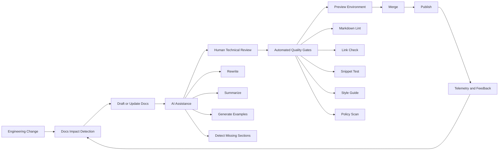

------
title: Learn AI-Driven Documentation and Technical Writing Implementation and Usage - Part 005
description: Fondasi docs-as-code untuk membangun dokumentasi engineering yang versioned, reviewable, testable, publishable, dan siap diintegrasikan dengan workflow AI.
series: learn-ai-driven-documentation
seriesTitle: Learn AI-Driven Documentation and Technical Writing Implementation and Usage
order: 5
partTitle: Docs-as-Code Foundation
tags:
- ai
- documentation
- technical-writing
- docs-as-code
- ci-cd
- engineering-handbook
date: 2026-06-30
---

# Part 005 — Docs-as-Code Foundation

## 1. Target Pembelajaran

Part ini menjawab pertanyaan inti:

> Bagaimana membuat dokumentasi diperlakukan seperti software artifact, bukan file sampingan yang cepat basi?

Docs-as-code adalah fondasi sebelum kita membangun AI-driven documentation yang serius. Tanpa fondasi ini, AI hanya mempercepat pembuatan teks, tetapi tidak memperbaiki trust, reviewability, ownership, dan maintainability.

Setelah part ini, Anda harus bisa:

1. Mendesain workflow dokumentasi berbasis Git, pull request, CI, dan preview environment.
2. Memisahkan source-of-truth, generated docs, dan human-authored docs.
3. Menentukan quality gate dokumentasi sebelum merge atau release.
4. Menghubungkan dokumentasi dengan engineering lifecycle: design, implementation, review, release, incident, dan deprecation.
5. Menentukan posisi AI dalam workflow tanpa membuat dokumentasi menjadi tidak bisa dipercaya.

---

## 2. Mengapa Docs-as-Code Penting untuk AI-Driven Documentation

AI-driven documentation sering gagal bukan karena modelnya buruk, tetapi karena workflow-nya tidak punya kontrol.

Contoh failure:

- AI membuat README yang terdengar benar, tetapi tidak punya sumber yang bisa diverifikasi.
- AI menyimpulkan behavior sistem dari kode lama yang sudah deprecated.
- AI memperbarui docs tanpa menjalankan link check, snippet test, atau review teknis.
- AI membuat dokumentasi yang bagus secara bahasa tetapi salah secara operasional.
- AI menulis ulang bagian penting dan menghapus caveat, constraint, atau warning.

Docs-as-code menyelesaikan masalah ini dengan memaksa dokumentasi masuk ke jalur engineering biasa:

| Problem | Docs-as-Code Control |
|---|---|
| Tidak tahu siapa mengubah docs | Git history dan pull request. |
| Docs tidak direview | Review wajib seperti code review. |
| Link/example rusak | CI checks. |
| AI menulis tanpa bukti | Source citation dan review checklist. |
| Docs tidak sinkron dengan release | Branching, versioning, dan release workflow. |
| Format inkonsisten | Linting dan template. |
| Tidak ada ownership | CODEOWNERS dan metadata. |

Prinsipnya sederhana:

> Documentation must be versioned with the system it describes, reviewed by people who own the truth, and tested before publication.

---

## 3. Definisi Praktis Docs-as-Code

Dalam konteks seri ini, docs-as-code berarti:

1. Dokumentasi ditulis dalam plain text format seperti Markdown, MDX, AsciiDoc, atau reStructuredText.
2. Dokumentasi disimpan di version control.
3. Perubahan dokumentasi dilakukan melalui branch dan pull request.
4. Dokumentasi direview oleh technical owner dan/atau editorial owner.
5. Dokumentasi divalidasi dengan automated checks.
6. Dokumentasi dipublish melalui pipeline, bukan manual copy-paste.
7. Dokumentasi memiliki lifecycle state: draft, reviewed, published, stale, deprecated, archived.
8. Dokumentasi dapat diobservasi: freshness, broken links, ownership, coverage, usage.

Write the Docs mendefinisikan docs-as-code sebagai pendekatan yang memakai tool yang sama dengan code: issue tracker, version control, plain text markup, code review, dan automated tests.

Untuk AI-driven documentation, definisinya kita perluas:

> AI may assist transformation, summarization, generation, and review, but Git + CI + human ownership remain the trust boundary.

---

## 4. Mental Model: Documentation Delivery Pipeline

Dokumentasi yang matang punya pipeline seperti software delivery.



Hal penting:

- AI berada di tengah workflow, bukan di akhir tanpa kontrol.
- Source-of-truth tetap berada pada code, spec, ADR, runbook, release note, incident report, dan reviewer domain.
- Publishing hanya boleh terjadi setelah checks dan review.
- Feedback pengguna harus masuk kembali ke backlog dokumentasi.

---

## 5. Komponen Minimum Docs-as-Code

Untuk membangun fondasi yang praktis, jangan mulai dari platform mahal. Mulai dari komponen minimum.

### 5.1 Repository

Minimal:

```text
repo/
  docs/
    index.mdx
    getting-started/
    how-to/
    reference/
    explanation/
  .github/
    workflows/
      docs-ci.yml
  CODEOWNERS
  README.md
```

Untuk sistem lebih besar:

```text
repo/
  docs/
    handbook/
    architecture/
    operations/
    api/
    decisions/
    onboarding/
    troubleshooting/
  specs/
    openapi/
    asyncapi/
  scripts/
    docs/
      validate-links.sh
      validate-frontmatter.ts
      extract-code-snippets.ts
  .vale.ini
  .markdownlint.yml
  CODEOWNERS
```

### 5.2 Authoring Format

Pilih format yang mendukung automation.

| Format | Kapan Cocok | Catatan |
|---|---|---|
| Markdown | Docs sederhana, README, runbook, handbook | Paling mudah, paling portable. |
| MDX | Docs site interaktif, komponen UI, tabs, admonitions | Cocok untuk Docusaurus dan React-based docs. |
| AsciiDoc | Dokumentasi enterprise/technical book | Kuat untuk struktur formal. |
| reStructuredText | Python ecosystem, Sphinx | Banyak dipakai di proyek Python lama. |

Untuk seri ini, kita memakai MDX karena:

- Tetap readable sebagai text.
- Bisa diberi frontmatter.
- Bisa dipakai static site generator modern.
- Bisa menyisipkan komponen interaktif.
- Cocok untuk struktur series seperti materi ini.

### 5.3 Pull Request Workflow

Setiap perubahan docs harus punya alasan.

Contoh PR template:

```md
## What changed?

- [ ] New documentation
- [ ] Updated existing documentation
- [ ] Removed deprecated documentation
- [ ] Generated or AI-assisted documentation

## Source of truth

Link the authoritative source:

- Code PR:
- ADR:
- API spec:
- Incident report:
- Product requirement:

## Review required

- [ ] Technical accuracy
- [ ] Editorial clarity
- [ ] Security / sensitive information
- [ ] Examples tested
- [ ] Links checked

## AI assistance

Was AI used?

- [ ] No
- [ ] Yes, for drafting
- [ ] Yes, for summarization
- [ ] Yes, for rewrite
- [ ] Yes, for review/checklist

If yes, describe what was verified manually:
```

### 5.4 Automated Checks

Minimum checks:

```text
- Markdown/MDX parses successfully.
- Internal links resolve.
- External links are reachable or explicitly ignored.
- Frontmatter matches schema.
- Headings are unique and hierarchical.
- Code fences have language tags.
- Generated docs are not manually edited.
- Forbidden terms and sensitive data are blocked.
```

Stronger checks:

```text
- Code snippets compile or run.
- API examples match OpenAPI/AsyncAPI schemas.
- CLI examples are tested in container.
- Screenshots are checked for drift.
- Docs changed when public interface changed.
- Owners approved domain-sensitive docs.
```

---

## 6. Workflow Dasar: From Change to Published Docs

### 6.1 Step 1 — Detect Documentation Impact

Setiap engineering change harus menjawab:

> Apakah perubahan ini mengubah apa yang perlu diketahui pengguna, operator, integrator, atau engineer lain?

Gunakan checklist:

| Change Type | Docs Impact |
|---|---|
| New API endpoint | Reference docs, examples, auth, errors, changelog. |
| New configuration | Config reference, deployment guide, troubleshooting. |
| Behavior change | Migration guide, release note, known limitation. |
| New service | Architecture overview, onboarding, runbook. |
| New failure mode | Troubleshooting, alert docs, runbook. |
| Deprecated feature | Deprecation notice, migration path, timeline. |
| Incident fix | Postmortem, runbook update, alert tuning docs. |

AI dapat membantu mendeteksi dampak ini dari PR diff, tetapi keputusan akhirnya tetap pada reviewer.

### 6.2 Step 2 — Create or Update the Right Doc Type

Jangan asal update README. Pilih jenis dokumen berdasarkan kebutuhan pembaca.

| Reader Need | Doc Type |
|---|---|
| Saya ingin belajar dari nol | Tutorial. |
| Saya ingin menyelesaikan task spesifik | How-to guide. |
| Saya ingin mencari fakta pasti | Reference. |
| Saya ingin memahami reasoning | Explanation. |
| Saya ingin menjalankan operasi aman | Runbook. |
| Saya ingin tahu keputusan arsitektur | ADR. |
| Saya ingin migrate | Migration guide. |

### 6.3 Step 3 — Draft with AI, Verify with Source

Prompt AI harus diberi:

- Target reader.
- Type of doc.
- Source-of-truth.
- Constraints.
- Style guide.
- Output structure.
- Explicit unknown-handling instruction.

Contoh prompt ringkas:

```text
You are assisting with internal engineering documentation.
Create a how-to guide for configuring retry policy in Service X.
Use only the provided source snippets.
Do not invent defaults.
If a behavior is not present in the source, mark it as Unknown.
Output MDX with headings, prerequisites, steps, validation, rollback, and troubleshooting.
```

### 6.4 Step 4 — Review for Truth, Not Just Wording

Review dokumentasi berbeda dari proofreading.

Reviewer harus memeriksa:

- Apakah behavior yang dijelaskan benar?
- Apakah contoh bisa dijalankan?
- Apakah constraint disebutkan?
- Apakah failure mode disebutkan?
- Apakah ada misleading promise?
- Apakah dokumentasi menyebut versi yang tepat?
- Apakah pembaca bisa menyelesaikan task tanpa membaca source code?

### 6.5 Step 5 — Publish and Observe

Publishing bukan akhir. Dokumentasi perlu feedback loop.

Minimal telemetry:

```text
- Page views.
- Search queries.
- Zero-result searches.
- Broken-link reports.
- Feedback thumbs up/down.
- Git history freshness.
- Owner mapping.
- Last verified date.
```

---

## 7. Branching and Versioning Model

Ada tiga model umum.

### 7.1 Single Version Docs

Cocok untuk:

- Internal platform yang selalu latest.
- Tools tanpa backward compatibility panjang.
- Early-stage product.

Risiko:

- User versi lama bisa tersesat.
- Breaking change sulit ditelusuri.

### 7.2 Versioned Docs per Release

Cocok untuk:

- SDK.
- Public API.
- Platform dengan long-term support.
- Enterprise customers.

Contoh struktur:

```text
docs/
  current/
  versions/
    v1.8/
    v1.9/
    v2.0/
```

Aturan:

- `current` adalah versi aktif.
- Versi lama hanya menerima critical fix.
- Breaking change harus punya migration guide.
- AI tidak boleh mengambil context dari versi salah tanpa metadata version.

### 7.3 Docs Versioned with Code Branch

Cocok untuk:

- Monorepo.
- Service docs yang sangat dekat dengan implementasi.
- Internal engineering docs.

Aturan:

- Docs update berada dalam PR yang sama dengan code change.
- Generated docs berasal dari branch yang sama.
- Preview docs dibuat per PR.

---

## 8. Docs Quality Gates

Quality gate adalah perbedaan antara “AI-generated text” dan “engineering documentation”.

### 8.1 Gate 1 — Build Gate

Docs site harus bisa dibuild.

```yaml
name: docs-ci
on:
  pull_request:
    paths:
      - 'docs/**'
      - 'specs/**'
      - '.github/workflows/docs-ci.yml'

jobs:
  docs:
    runs-on: ubuntu-latest
    steps:
      - uses: actions/checkout@v4
      - uses: actions/setup-node@v4
        with:
          node-version: 22
      - run: npm ci
      - run: npm run docs:build
```

### 8.2 Gate 2 — Link Gate

Broken links merusak trust cepat. Internal link sebaiknya fail-fast. External link bisa diberi retry/allowlist.

```text
Internal link broken -> fail CI.
External link transient -> warn first, fail if repeated.
Link to private resource -> require auth-aware check.
```

### 8.3 Gate 3 — Style Gate

Style gate memastikan konsistensi.

Contoh aturan:

```text
- Use active voice.
- Avoid unexplained acronyms.
- Use sentence case headings.
- Do not use “simply”, “obviously”, or “easy”.
- Use “select” for UI, “run” for commands, “enter” for text.
```

### 8.4 Gate 4 — Security Gate

Docs sering menjadi tempat bocornya rahasia.

Check:

```text
- Secret patterns.
- Internal hostnames.
- Customer identifiers.
- Access tokens.
- Private incident details.
- Screenshots with personal data.
- Prompt content containing confidential sources.
```

### 8.5 Gate 5 — Truth Gate

Truth gate tidak bisa sepenuhnya otomatis, tetapi bisa dibantu.

Contoh:

```text
- Does the doc cite source-of-truth PR/spec/ADR?
- Does the reviewer own the domain?
- Are generated examples validated?
- Is the version explicit?
- Are limitations present?
```

---

## 9. AI in the Docs-as-Code Workflow

AI boleh masuk ke beberapa titik.

| Workflow Stage | AI Usage | Risk | Control |
|---|---|---|---|
| Impact detection | Membaca PR diff dan menyarankan docs affected | Missed impact | Reviewer confirms. |
| Drafting | Membuat first draft dari source | Hallucination | Source-bounded prompt. |
| Rewrite | Memperbaiki clarity dan style | Meaning drift | Diff review. |
| Summarization | Membuat release note/changelog | Missing caveat | Link to source PRs. |
| Review | Mendeteksi ambiguity, missing steps, broken structure | False confidence | Treat as reviewer assistant, not approver. |
| Migration | Mengubah legacy docs ke IA baru | Lost nuance | Content inventory + sampling. |
| Indexing | Membuat searchable knowledge base | Stale retrieval | Metadata freshness. |

Prinsip operasional:

> AI output is untrusted until verified against authoritative sources.

Ini bukan anti-AI. Ini cara membuat AI berguna di lingkungan engineering serius.

---

## 10. Documentation Ownership Model

Docs tanpa owner akan membusuk.

Gunakan kombinasi:

1. **Technical owner** — memastikan kebenaran sistem.
2. **Editorial owner** — memastikan clarity, style, structure.
3. **Product owner** — memastikan user-facing behavior dan positioning.
4. **Operational owner** — memastikan runbook dan incident docs benar.
5. **Security owner** — memastikan tidak ada sensitive disclosure.

Contoh `CODEOWNERS`:

```text
/docs/architecture/ @platform-architecture
/docs/operations/ @sre-team
/docs/api/ @api-platform @developer-experience
/docs/onboarding/ @engineering-enablement
/specs/openapi/ @api-platform
/specs/asyncapi/ @event-platform
```

Ownership harus granular. Jika semua docs dimiliki satu team “docs”, review akan bottleneck dan truth ownership hilang.

---

## 11. Minimum Viable Docs-as-Code Stack

Untuk tim kecil:

```text
- Git repository.
- Markdown/MDX.
- Static site generator.
- Pull request template.
- CODEOWNERS.
- Markdown lint.
- Link checker.
- Preview deployment.
- Basic style guide.
```

Untuk enterprise platform:

```text
- Versioned docs site.
- Content metadata schema.
- Search analytics.
- RAG-ready index.
- API/event docs generation.
- Snippet tests.
- Secret scanning.
- Docs health dashboard.
- Ownership matrix.
- AI usage policy.
- Review workflow with required approvals.
```

---

## 12. Anti-Patterns

### 12.1 README as a Dumping Ground

README berisi semua hal: install, architecture, FAQ, incident notes, API reference, release notes, historical decisions.

Dampaknya:

- Tidak ada information architecture.
- Sulit dicari.
- AI retrieval mengambil konteks campur aduk.
- Pembaca tidak tahu mana current dan mana obsolete.

Solusi:

- README sebagai entry point.
- Pindahkan detail ke docs terstruktur.
- Gunakan links dan navigation.

### 12.2 Generated Docs Edited Manually

Generated docs yang diedit manual akan diverge.

Solusi:

```text
Generated file must contain banner:

<!-- GENERATED FILE. DO NOT EDIT DIRECTLY. -->
<!-- Source: specs/openapi/payment.yaml -->
```

### 12.3 AI Draft Merged Without Source Review

AI draft tampak rapi, tetapi bisa salah.

Solusi:

- Wajib link source-of-truth.
- Reviewer domain wajib approve.
- Unknown harus ditandai, bukan diisi asumsi.

### 12.4 Docs as Release Afterthought

Dokumentasi baru dibuat setelah release.

Solusi:

- Docs impact checklist di PR.
- Release blocked jika docs untuk breaking/public changes belum siap.

### 12.5 No Staleness Policy

Docs lama tetap publish tanpa warning.

Solusi:

- `lastVerified` metadata.
- Stale docs dashboard.
- Auto issue untuk docs yang melewati SLA.

---

## 13. Implementation Checklist

Gunakan checklist ini untuk memulai docs-as-code dalam satu repository.

```text
Repository
[ ] Create /docs folder.
[ ] Choose Markdown or MDX.
[ ] Add frontmatter schema.
[ ] Add CODEOWNERS.
[ ] Add PR template with docs impact section.

Build
[ ] Add static site generator.
[ ] Add docs:build command.
[ ] Add preview deployment.

Quality
[ ] Add markdown lint.
[ ] Add link checker.
[ ] Add style guide lint.
[ ] Add secret scanning.
[ ] Add generated-file detection.

Workflow
[ ] Require docs review for docs paths.
[ ] Require technical owner review for domain docs.
[ ] Add docs issue labels.
[ ] Define stale docs SLA.

AI
[ ] Define allowed AI use.
[ ] Require source-of-truth links for AI-assisted docs.
[ ] Add prompt templates.
[ ] Add AI output review checklist.
```

---

## 14. Mini Practice: 90-Minute Docs-as-Code Setup

Untuk menerapkan prinsip Kaufman, kita mulai dengan praktik kecil.

### Goal

Dalam 90 menit, buat fondasi docs-as-code untuk satu service.

### Exercise

1. Pilih satu service nyata.
2. Buat folder `docs/`.
3. Buat empat dokumen awal:
   - `index.mdx`
   - `how-to/local-setup.mdx`
   - `reference/configuration.mdx`
   - `operations/runbook.mdx`
4. Tambahkan frontmatter.
5. Tambahkan PR template.
6. Tambahkan CODEOWNERS.
7. Tambahkan minimal docs CI.
8. Gunakan AI untuk draft salah satu dokumen.
9. Review output AI dengan source code atau config aktual.
10. Catat 5 kesalahan atau missing detail dari output AI.

### Success Criteria

Anda berhasil jika:

- Docs bisa dibuild.
- Ada owner.
- Ada review checklist.
- Ada minimal quality gate.
- AI output tidak langsung dipercaya tanpa verifikasi.

---

## 15. Ringkasan

Docs-as-code adalah lapisan kontrol untuk AI-driven documentation.

Tanpa docs-as-code:

- AI mempercepat pembuatan teks.
- Review sulit.
- Traceability rendah.
- Staleness tidak kelihatan.
- Publishing rawan manual error.

Dengan docs-as-code:

- Dokumentasi menjadi artifact engineering.
- Perubahan bisa direview.
- Kualitas bisa diuji.
- Publishing bisa diotomasi.
- AI bisa dipakai dengan guardrails.

Mental model paling penting:

> Treat documentation changes as production changes to engineering knowledge.

Part berikutnya akan membahas struktur repository dokumentasi yang scalable: kapan docs berada di monorepo, kapan dipisah, bagaimana memisahkan authored docs dan generated docs, serta bagaimana menata folder agar AI retrieval dan human navigation sama-sama bekerja.

---

## 16. Referensi Pembanding

- Write the Docs — Docs as Code.
- Docusaurus documentation.
- MkDocs and Material for MkDocs documentation.
- GitHub Docs — Pull request workflow.
