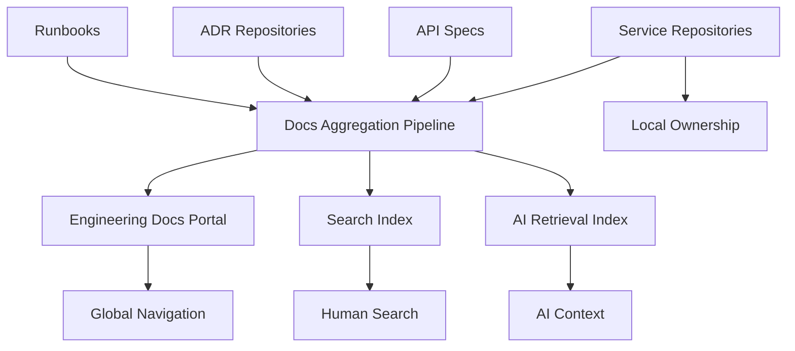
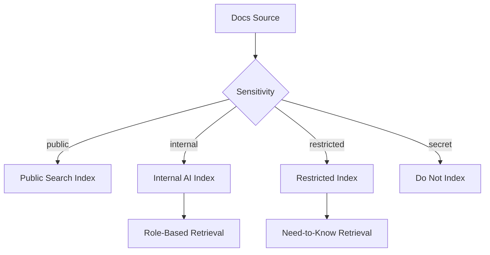
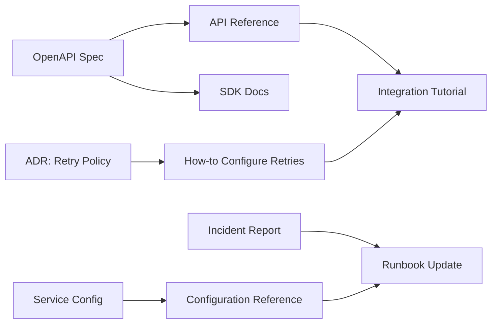
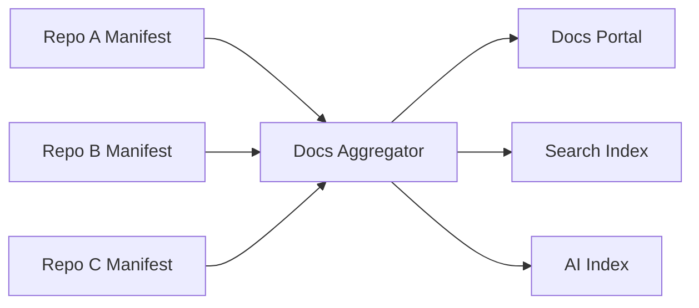

------
title: Learn AI-Driven Documentation and Technical Writing Implementation and Usage - Part 006
description: Arsitektur repository dokumentasi untuk monorepo, polyrepo, generated docs, versioned docs, AI retrieval, ownership, dan enterprise-scale documentation governance.
series: learn-ai-driven-documentation
seriesTitle: Learn AI-Driven Documentation and Technical Writing Implementation and Usage
order: 6
partTitle: Repository Architecture for Documentation
tags:
- ai
- documentation
- technical-writing
- repository-architecture
- docs-as-code
- information-architecture
date: 2026-06-30
---

# Part 006 — Repository Architecture for Documentation

## 1. Target Pembelajaran

Part sebelumnya membahas docs-as-code sebagai workflow. Sekarang kita masuk ke pertanyaan yang lebih struktural:

> Di mana dokumentasi harus diletakkan, bagaimana strukturnya, dan bagaimana repository architecture memengaruhi kualitas dokumentasi, review, search, dan AI retrieval?

Repository architecture adalah keputusan penting. Struktur yang salah membuat dokumentasi cepat menjadi:

- Sulit ditemukan.
- Sulit dimiliki.
- Sulit direview.
- Sulit dipublish.
- Sulit di-versioning.
- Sulit digunakan sebagai context AI.

Setelah part ini, Anda harus bisa:

1. Memilih model repository dokumentasi: co-located, centralized, hybrid, atau generated.
2. Mendesain struktur folder untuk service, platform, API, event, runbook, ADR, dan handbook.
3. Membedakan authored docs, generated docs, derived docs, dan indexed knowledge.
4. Menentukan metadata yang diperlukan untuk search, ownership, freshness, dan AI retrieval.
5. Menghindari anti-pattern repository yang membuat docs membusuk.

---

## 2. Prinsip Dasar Repository Architecture

Repository docs yang baik harus mengoptimalkan dua hal sekaligus:

1. **Human navigation** — manusia bisa menemukan, membaca, dan memperbaiki docs.
2. **Machine retrieval** — AI/search/indexer bisa mengambil context yang tepat, versi yang tepat, dan scope yang tepat.

Prinsipnya:

```text
Structure is not cosmetic.
Structure defines ownership, review path, retrieval boundary, and lifecycle.
```

Jika dokumentasi disimpan sembarangan, AI akan mengambil context sembarangan. Jika folder tidak merepresentasikan domain, owner, versi, dan doc type, retrieval akan campur aduk.

---

## 3. Empat Model Repository Documentation

### 3.1 Co-Located Docs

Dokumentasi berada dekat dengan kode.

```text
services/payment-service/
  src/
  docs/
    index.mdx
    operations/runbook.mdx
    reference/configuration.mdx
  specs/
    openapi.yaml
```

Cocok untuk:

- Service-specific documentation.
- Runbook yang dekat dengan deployment.
- Config reference.
- Developer onboarding untuk service tertentu.
- Docs yang harus berubah bersama code.

Keunggulan:

- Ownership jelas.
- Docs update mudah dimasukkan ke PR code.
- Versioning mengikuti code.
- Context AI lebih dekat ke source.

Kelemahan:

- Navigation lintas service bisa tersebar.
- Search dan publishing perlu aggregator.
- Style bisa inkonsisten antar repo jika governance lemah.

Gunakan co-located docs untuk truth yang sangat dekat dengan implementasi.

---

### 3.2 Centralized Docs Repository

Semua dokumentasi dipusatkan di satu repository.

```text
engineering-docs/
  docs/
    platforms/
    services/
    architecture/
    operations/
    onboarding/
    product/
```

Cocok untuk:

- Engineering handbook.
- Platform docs.
- Cross-service architecture.
- Onboarding.
- Governance docs.
- Public documentation site.

Keunggulan:

- Navigation konsisten.
- Publishing sederhana.
- Editorial governance lebih mudah.
- Search experience lebih terkontrol.

Kelemahan:

- Drift dari code lebih mudah terjadi.
- Engineer harus pindah repo untuk update docs.
- Review domain bisa bottleneck.
- AI perlu link eksplisit ke source repo.

Gunakan centralized docs untuk narrative, handbook, cross-domain explanation, dan docs yang tidak berubah di setiap PR code.

---

### 3.3 Hybrid Docs Architecture

Model paling umum untuk enterprise.

```text
service-repo/
  docs/
    runbook.mdx
    config-reference.mdx
  specs/
    openapi.yaml

engineering-docs/
  docs/
    services/payment-service/index.mdx
    architecture/payment-platform.mdx
    onboarding/payment-domain.mdx
```

Co-located docs menjadi source lokal. Central docs menjadi portal/aggregator.



Cocok untuk:

- Platform besar.
- Banyak teams.
- Banyak services.
- Butuh local ownership dan global discoverability.

Trade-off:

- Pipeline lebih kompleks.
- Metadata harus disiplin.
- Perlu aturan conflict resolution.

---

### 3.4 Generated Docs Repository

Repository khusus untuk hasil generate.

```text
generated-docs/
  api/
    payment-service/
  events/
    billing-events/
  code-reference/
```

Cocok untuk:

- OpenAPI reference.
- AsyncAPI reference.
- SDK docs.
- Large generated content.
- Versioned generated output.

Aturan keras:

```text
Generated docs should not be manually edited.
Generated source must be explicit.
Generated docs must include generation timestamp and source commit.
Generated docs should be reproducible.
```

---

## 4. Decision Matrix

Gunakan matrix berikut.

| Requirement | Recommended Model |
|---|---|
| Docs harus berubah bersama code | Co-located. |
| Docs perlu global navigation | Centralized atau hybrid. |
| Banyak service dan banyak team | Hybrid. |
| Docs berasal dari OpenAPI/AsyncAPI | Generated plus aggregator. |
| Butuh review domain kuat | Co-located with CODEOWNERS. |
| Butuh polished public docs | Centralized with editorial workflow. |
| Butuh AI retrieval akurat | Hybrid with metadata and source links. |
| Butuh audit traceability | Co-located source + central evidence index. |

Rule of thumb:

> Keep implementation truth close to implementation. Keep learning journeys and cross-domain explanations close to the documentation portal.

---

## 5. Folder Taxonomy untuk Engineering Docs

Struktur folder harus merepresentasikan kebutuhan pembaca, bukan struktur organisasi internal semata.

### 5.1 Recommended Top-Level Structure

```text
docs/
  index.mdx
  tutorials/
  how-to/
  reference/
  explanation/
  architecture/
  operations/
  api/
  events/
  onboarding/
  decisions/
  releases/
  troubleshooting/
  governance/
```

Namun untuk internal engineering handbook, struktur berikut sering lebih praktis:

```text
docs/
  handbook/
    engineering-principles.mdx
    coding-standards.mdx
    review-guidelines.mdx
  domains/
    payments/
    compliance/
    identity/
  platforms/
    developer-platform/
    data-platform/
    event-platform/
  services/
    payment-service/
    case-service/
    notification-service/
  architecture/
    system-overview.mdx
    integration-map.mdx
    non-functional-requirements.mdx
  operations/
    incident-response.mdx
    runbooks/
    alerts/
  api/
    rest/
    graphql/
  events/
    catalog/
    schemas/
  decisions/
    adr/
  onboarding/
    new-engineer.mdx
    domain-learning-paths/
  releases/
    changelog.mdx
    migration-guides/
```

### 5.2 Why Not Organize Only by Team?

Team structure changes. Domain and system responsibilities survive longer.

Anti-pattern:

```text
docs/
  team-alpha/
  team-beta/
  team-gamma/
```

Masalah:

- Pembaca tidak tahu team mana memiliki fitur tertentu.
- Reorg membuat docs obsolete.
- AI retrieval mencampur domain dengan org chart.

Lebih baik:

```text
docs/
  domains/payments/
  platforms/event-platform/
  services/payment-service/
```

Owner team tetap disimpan di metadata, bukan menjadi satu-satunya struktur folder.

---

## 6. Metadata as Architecture

AI-driven documentation membutuhkan metadata. Tanpa metadata, retrieval hanya menebak dari teks.

Contoh frontmatter:

```yaml
---
title: Payment Service Runbook
description: Operational runbook for Payment Service production incidents.
docType: runbook
domain: payments
service: payment-service
owner: payments-platform
reviewers:
  - sre
  - payments-platform
sourceOfTruth:
  - type: repository
    path: services/payment-service
  - type: dashboard
    name: payment-service-prod
lifecycle: published
lastVerified: 2026-06-30
version: current
audience:
  - sre
  - backend-engineer
aiUsage:
  allowedForRetrieval: true
  allowedForGeneration: false
sensitivity: internal
---
```

Metadata penting:

| Metadata | Fungsi |
|---|---|
| `docType` | Routing: tutorial, how-to, reference, runbook, ADR. |
| `domain` | Grouping dan retrieval scope. |
| `service` | Mengikat docs ke sistem. |
| `owner` | Review dan stale alert. |
| `lastVerified` | Freshness. |
| `sourceOfTruth` | Verifikasi dan audit. |
| `version` | Mencegah cross-version hallucination. |
| `audience` | Personalization dan search ranking. |
| `sensitivity` | Access control dan AI policy. |
| `aiUsage` | Menentukan apakah dokumen boleh masuk index AI. |

Prinsip:

> Metadata is the contract between documentation, humans, search, CI, and AI systems.

---

## 7. Authored, Generated, Derived, and Indexed Docs

Jangan campur semua jenis dokumentasi.

### 7.1 Authored Docs

Ditulis manusia, boleh dibantu AI, direview manual.

Contoh:

```text
architecture/payment-platform.mdx
operations/payment-failure-runbook.mdx
onboarding/payment-domain.mdx
```

### 7.2 Generated Docs

Dihasilkan dari source machine-readable.

Contoh:

```text
api/rest/payment-service/reference.mdx
sdk/java/payment-client/index.mdx
```

Source:

```text
specs/openapi/payment-service.yaml
```

### 7.3 Derived Docs

Dibuat dari kombinasi sumber, misalnya release notes dari PR dan issue.

Contoh:

```text
releases/2026-06.mdx
migration-guides/v2-to-v3.mdx
```

Derived docs harus menyimpan provenance.

### 7.4 Indexed Knowledge

Bukan dokumen untuk dibaca langsung. Ini hasil indexing untuk search/AI.

Contoh:

```text
.build/search-index.json
.build/ai-context-index.jsonl
```

Aturan:

```text
- Do not review index manually.
- Rebuild from source.
- Attach source path, commit, version, sensitivity, owner.
```

---

## 8. Recommended Repository Layout for AI-Ready Docs

Berikut layout yang cukup kuat untuk enterprise-scale internal docs.

```text
engineering-docs/
  docs/
    index.mdx
    handbook/
    domains/
      payments/
        index.mdx
        concepts/
        workflows/
        glossary.mdx
    platforms/
      event-platform/
        index.mdx
        how-to/
        reference/
        operations/
    services/
      payment-service/
        index.mdx
        overview.mdx
        runbook.mdx
        configuration.mdx
        troubleshooting.mdx
    architecture/
      c4/
      diagrams/
      decisions/
    api/
      rest/
      graphql/
    events/
      catalog/
      schemas/
    onboarding/
    releases/
    governance/
  specs/
    openapi/
    asyncapi/
    json-schema/
  prompts/
    documentation/
      draft-howto.prompt.md
      review-doc.prompt.md
      generate-release-note.prompt.md
  style-guide/
    terminology.yml
    vale/
  scripts/
    docs/
      validate-frontmatter.ts
      build-ai-index.ts
      check-stale-docs.ts
      detect-doc-impact.ts
  generated/
    api/
    events/
  .github/
    workflows/
      docs-ci.yml
  CODEOWNERS
  README.md
```

Catatan:

- `docs/` adalah source utama yang dibaca manusia.
- `specs/` menyimpan kontrak machine-readable.
- `prompts/` menyimpan prompt sebagai artifact yang direview.
- `style-guide/` menyimpan aturan editorial dan terminology.
- `scripts/docs/` menyimpan automation.
- `generated/` menyimpan output yang reproducible.

---

## 9. AI Retrieval Boundary Design

AI index tidak boleh mengindeks semua hal secara buta.

### 9.1 Retrieval Boundary by Sensitivity



### 9.2 Retrieval Boundary by Version

Index harus tahu versi.

```text
chunk.metadata = {
  path: "docs/api/payment/v2/reference.mdx",
  version: "v2",
  domain: "payments",
  docType: "reference",
  owner: "api-platform",
  lastVerified: "2026-06-30",
  sourceCommit: "abc123"
}
```

Tanpa metadata version, AI bisa menjawab dengan campuran v1, v2, dan draft.

### 9.3 Retrieval Boundary by Lifecycle

Jangan index semua lifecycle.

| Lifecycle | Index Policy |
|---|---|
| draft | Tidak untuk general retrieval. |
| review | Hanya untuk reviewer. |
| published | Boleh masuk search/AI sesuai sensitivity. |
| stale | Boleh, tetapi ranking turun dan warning muncul. |
| deprecated | Boleh jika query versi lama atau migration. |
| archived | Tidak untuk default retrieval. |

---

## 10. CODEOWNERS and Review Architecture

Repository architecture harus mendukung review architecture.

Contoh:

```text
/docs/domains/payments/ @payments-domain-owners
/docs/platforms/event-platform/ @event-platform-team
/docs/services/payment-service/ @payment-service-team @sre-team
/docs/operations/ @sre-team
/docs/governance/ @engineering-leadership @security-team
/specs/openapi/payment-service.yaml @api-platform @payment-service-team
/prompts/documentation/ @developer-experience @security-team
/style-guide/ @technical-writing @developer-experience
```

Aturan:

- Domain docs harus direview domain owner.
- Runbook harus direview SRE/ops owner.
- Public/API docs harus direview API owner.
- Prompt yang memengaruhi AI output harus direview seperti code.
- Generated docs tidak direview manual; source generator dan input spec yang direview.

---

## 11. Versioning Repository Docs

### 11.1 Version by Folder

```text
docs/api/payment/
  v1/
  v2/
  current/
```

Kelebihan:

- Mudah dipublish bersama site.
- Human navigation jelas.

Kelemahan:

- Duplication tinggi.
- Update cross-version sulit.

### 11.2 Version by Branch

```text
main
release/v1
release/v2
```

Kelebihan:

- Cocok jika docs mengikuti code branch.
- Generated docs konsisten dengan release branch.

Kelemahan:

- Search dan portal perlu multi-branch indexing.
- Cross-version comparison lebih rumit.

### 11.3 Version by Metadata

```yaml
version: v2
productVersion: 2.3.0
status: current
```

Kelebihan:

- Flexible untuk search dan AI.

Kelemahan:

- Butuh enforcement kuat.
- Human navigation bisa kurang jelas jika tidak didukung UI.

Rekomendasi enterprise:

```text
Use folder or branch for hard version boundaries.
Use metadata for search, lifecycle, and AI retrieval.
```

---

## 12. Documentation Dependency Graph

Dalam sistem besar, docs saling bergantung.

Contoh:



Dependency graph penting untuk:

- Impact analysis.
- Stale detection.
- Release readiness.
- AI source prioritization.
- Audit trail.

Contoh dependency metadata:

```yaml
dependsOn:
  - type: openapi
    path: specs/openapi/payment-service.yaml
  - type: adr
    path: docs/architecture/decisions/adr-004-retry-policy.mdx
  - type: code
    path: services/payment-service/src/main/java/.../RetryConfig.java
```

---

## 13. Monorepo Strategy

Untuk monorepo, struktur harus memisahkan local docs dan global docs.

```text
monorepo/
  services/
    payment-service/
      src/
      docs/
        runbook.mdx
        configuration.mdx
      specs/
        openapi.yaml
  packages/
    payment-client/
      docs/
  docs/
    index.mdx
    architecture/
    domains/
    onboarding/
  tools/
    docs/
      aggregate-docs.ts
      validate-docs.ts
```

Aturan:

- Service docs dekat dengan service.
- Cross-service docs di root `docs/`.
- Aggregator membangun portal dari semua source.
- CODEOWNERS mengikuti path domain.
- CI hanya menjalankan checks yang relevan terhadap changed paths.

Contoh changed-path strategy:

```text
If services/payment-service/** changed:
  - Build payment-service docs.
  - Validate related OpenAPI spec.
  - Check runbook freshness.
  - Notify payment-service owners.

If docs/architecture/** changed:
  - Require architecture owner review.
  - Build full docs site.
```

---

## 14. Polyrepo Strategy

Untuk banyak repo, butuh aggregation contract.

Setiap service repo menyediakan manifest:

```yaml
service: payment-service
domain: payments
owner: payments-platform
docs:
  - path: docs/index.mdx
    type: overview
  - path: docs/runbook.mdx
    type: runbook
  - path: docs/configuration.mdx
    type: reference
specs:
  openapi: specs/openapi.yaml
  asyncapi: specs/events.yaml
publish:
  target: services/payment-service
sensitivity: internal
```

Central portal membaca manifest dari semua repo.



Aturan:

- Manifest adalah kontrak publishing.
- Repo owner tetap memiliki source docs.
- Portal tidak mengubah source docs.
- Aggregation failure harus terlihat di CI/dashboard.

---

## 15. Repository Smells

### 15.1 Orphan Docs

Dokumen tidak punya owner.

Detection:

```text
frontmatter.owner missing
no CODEOWNERS match
lastVerified older than SLA
```

Fix:

- Assign owner.
- Mark stale.
- Archive jika tidak ada owner.

### 15.2 Duplicate Truth

Informasi yang sama ditulis di banyak tempat.

Contoh:

```text
Timeout default disebut di README, API docs, runbook, dan onboarding.
```

Fix:

- Jadikan config reference sebagai source.
- Link dari docs lain.
- Gunakan generated include jika perlu.

### 15.3 Mixed Lifecycle Folder

Draft, published, deprecated, dan archived dicampur.

Fix:

```text
docs/
  published/
  drafts/
  deprecated/
  archived/
```

Atau gunakan metadata lifecycle dengan CI enforcement.

### 15.4 AI Indexes Private Drafts

Draft sensitif masuk retrieval index.

Fix:

- Default deny indexing.
- Require `aiUsage.allowedForRetrieval: true`.
- Respect sensitivity metadata.

### 15.5 Generated Docs without Source Commit

Generated docs tidak bisa direproduksi.

Fix:

Tambahkan header:

```md
<!-- GENERATED FILE. DO NOT EDIT. -->
<!-- Source: specs/openapi/payment-service.yaml -->
<!-- Source commit: abc123 -->
<!-- Generated at: 2026-06-30T10:00:00+07:00 -->
```

---

## 16. Repository Architecture Checklist

Gunakan checklist ini saat mendesain repository docs.

```text
Placement
[ ] Service-specific docs are close to service source.
[ ] Cross-domain docs are in central portal or root docs.
[ ] Generated docs are separated from authored docs.
[ ] Specs are stored as machine-readable source-of-truth.

Ownership
[ ] Every docs path has CODEOWNERS.
[ ] Every doc has owner metadata.
[ ] Operational docs have SRE/ops review.
[ ] API/event docs have platform/domain review.

Versioning
[ ] Version boundary is explicit.
[ ] Deprecated docs are marked.
[ ] Archived docs are not default searchable.
[ ] AI index includes version metadata.

Quality
[ ] Frontmatter schema is enforced.
[ ] Links are checked.
[ ] Generated docs are reproducible.
[ ] Sensitive docs are excluded from unsafe indexes.

AI readiness
[ ] Retrieval metadata exists.
[ ] Source-of-truth links exist.
[ ] Lifecycle state exists.
[ ] Index policy respects sensitivity.
[ ] Prompt templates are versioned and reviewed.
```

---

## 17. Mini Practice: Design a Docs Repository

### Goal

Dalam 90 menit, desain repository architecture untuk satu domain engineering.

### Scenario

Anda punya domain `case-management` dengan:

- 5 services.
- 2 public REST APIs.
- 1 internal event stream.
- Several runbooks.
- ADRs.
- New engineer onboarding.
- Regulated audit requirements.
- AI assistant yang akan menggunakan docs sebagai retrieval context.

### Exercise

Buat:

1. Folder structure.
2. CODEOWNERS mapping.
3. Metadata schema.
4. Generated docs policy.
5. AI indexing policy.
6. Versioning strategy.
7. Stale docs policy.

### Expected Output

Minimal:

```text
case-management-docs/
  docs/
  specs/
  generated/
  prompts/
  scripts/
  style-guide/
  CODEOWNERS
```

Tambahkan decision notes:

```text
- Why this doc is co-located or centralized.
- Who owns the truth.
- How docs are published.
- How AI is allowed to retrieve it.
- How stale docs are detected.
```

---

## 18. Ringkasan

Repository architecture menentukan apakah dokumentasi bisa scale.

Keputusan penting:

- Co-located untuk implementation truth.
- Centralized untuk handbook, portal, dan cross-domain docs.
- Hybrid untuk enterprise multi-team.
- Generated docs harus dipisah dan reproducible.
- Metadata adalah kontrak antara docs, CI, search, dan AI.
- AI retrieval harus dibatasi oleh version, lifecycle, sensitivity, dan source-of-truth.

Mental model utama:

> A documentation repository is not a folder of pages. It is a knowledge architecture with ownership, lifecycle, dependency, and retrieval boundaries.

Part berikutnya akan membahas Markdown, MDX, dan content modeling: bagaimana menulis struktur konten yang readable untuk manusia, parseable untuk tooling, dan aman untuk AI-assisted transformation.
