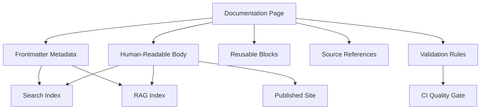
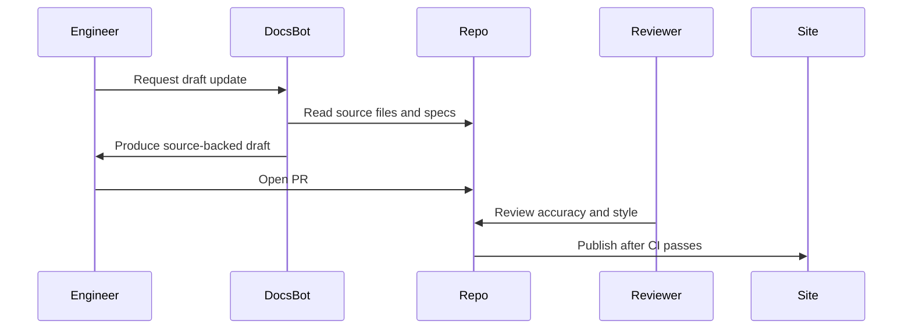
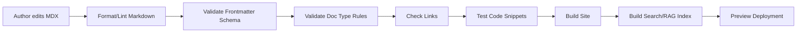

------
title: Learn AI-Driven Documentation and Technical Writing Implementation and Usage - Part 007
description: Markdown, MDX, content modeling, metadata, components, reusable blocks, AI retrieval boundaries, and maintainable documentation authoring for engineering-grade documentation systems.
series: learn-ai-driven-documentation
seriesTitle: Learn AI-Driven Documentation and Technical Writing Implementation and Usage
order: 7
partTitle: Markdown, MDX, and Content Modeling
tags:
- ai
- documentation
- technical-writing
- markdown
- mdx
- content-modeling
- docs-as-code
date: 2026-06-30
---

# Part 007 — Markdown, MDX, and Content Modeling

## 1. Target Pembelajaran

Part sebelumnya membahas repository architecture. Sekarang kita turun ke layer yang lebih kecil tetapi sangat menentukan kualitas sistem dokumentasi: **content model**.

Dalam dokumentasi berbasis AI, file Markdown/MDX bukan hanya teks. Ia adalah unit pengetahuan yang akan:

1. Dibaca manusia.
2. Direview dalam pull request.
3. Dipublish ke documentation site.
4. Diindeks oleh search engine.
5. Diambil oleh RAG pipeline.
6. Dipakai sebagai context oleh AI assistant.
7. Divalidasi oleh CI.
8. Dilacak freshness, ownership, dan lifecycle-nya.

Target part ini:

- Memahami perbedaan Markdown sebagai format authoring dan MDX sebagai format komponen.
- Mendesain frontmatter metadata yang berguna untuk publishing, search, analytics, dan AI retrieval.
- Membuat content model yang stabil untuk tutorial, how-to, reference, explanation, runbook, ADR, dan release docs.
- Menghindari anti-pattern Markdown/MDX yang membuat dokumentasi sulit dirawat.
- Mendesain reusable documentation blocks tanpa membuat pembaca dan AI retrieval bingung.
- Membuat aturan authoring yang bisa dilint, direview, dan dipakai lintas tim.

Prinsip utamanya:

```text
Good documentation is not only well-written.
It is well-structured, well-scoped, well-labeled, and machine-retrievable.
```

---

## 2. Kenapa Markdown/MDX Perlu Dipikirkan Serius

Banyak engineer menganggap Markdown hanya format ringan untuk menulis README. Itu cukup untuk project kecil, tetapi tidak cukup untuk enterprise documentation system.

Masalah muncul saat dokumentasi tumbuh:

- Judul tidak konsisten.
- Halaman tidak punya owner.
- Tidak jelas berlaku untuk versi mana.
- Generated docs bercampur dengan authored docs.
- Halaman lama tetap muncul di search.
- AI mengambil halaman usang sebagai context.
- Komponen MDX membuat build gagal.
- Reusable snippet berubah dan memengaruhi banyak halaman tanpa review domain.
- Referensi API, runbook, dan konsep domain bercampur di satu halaman.

Markdown/MDX yang tidak dimodelkan akan berubah menjadi **unstructured knowledge swamp**.

Content model adalah cara kita membuat teks menjadi aset engineering yang bisa diproses.

---

## 3. Markdown, MDX, dan Content Model

### 3.1 Markdown

Markdown adalah format teks ringan untuk menulis konten terstruktur: heading, paragraph, list, table, code block, link, image.

Kekuatan Markdown:

- Mudah dibaca dalam raw form.
- Mudah direview di Git diff.
- Tooling luas.
- Cocok untuk docs-as-code.
- Mudah diindeks.

Kelemahannya:

- Semantik terbatas.
- Metadata tidak built-in.
- Komponen interaktif tidak native.
- Reusable content perlu convention/tool tambahan.
- Validasi struktur butuh linting tambahan.

### 3.2 MDX

MDX memperluas Markdown dengan kemampuan memakai JSX/component di dalam konten. Dengan MDX, dokumentasi bisa memakai komponen seperti tab, alert, API explorer, diagram wrapper, interactive example, atau generated metadata card.

Contoh:

```mdx
import ApiStatus from '@site/src/components/ApiStatus';

# Payment API

<ApiStatus stability="stable" owner="payments-platform" />

Gunakan endpoint ini untuk membuat payment intent.
```

Kekuatan MDX:

- Komponen reusable.
- Dokumentasi bisa lebih interaktif.
- Cocok untuk design system internal.
- Bisa menyisipkan metadata visual.
- Bisa menghubungkan docs dengan runtime data tertentu.

Risikonya:

- Lebih sulit direview dibanding Markdown murni.
- JSX syntax error bisa menggagalkan build.
- Konten bisa terlalu UI-driven.
- AI retrieval bisa menangkap markup yang tidak relevan.
- Komponen bisa menyembunyikan informasi penting dari raw text.

### 3.3 Content Model

Content model adalah kontrak struktur untuk halaman dokumentasi.

Ia menjawab:

- Halaman ini jenis apa?
- Siapa pembacanya?
- Apa tugas pembaca setelah membaca halaman ini?
- Apa status lifecycle-nya?
- Versi apa yang berlaku?
- Siapa owner-nya?
- Apa sumber kebenarannya?
- Apakah konten ini boleh dipakai AI sebagai context?
- Bagian mana yang generated?
- Bagian mana yang perlu manual review?

Markdown/MDX adalah format. Content model adalah governance.

---

## 4. Mental Model: Page as a Knowledge Object

Jangan lihat halaman dokumentasi sebagai file teks. Lihat sebagai **knowledge object**.



Implikasinya:

- Metadata bukan dekorasi.
- Heading bukan sekadar styling.
- Link bukan sekadar hyperlink.
- Code block bukan sekadar contoh.
- Admonition bukan sekadar warna box.
- Snippet bukan sekadar reuse.

Semua elemen itu memengaruhi bagaimana manusia dan mesin memahami konten.

---

## 5. Prinsip Content Modeling untuk AI-Driven Docs

### 5.1 One Page, One Primary Intent

Satu halaman harus punya satu intent utama.

Buruk:

```text
payment-service.md
- Penjelasan domain payment
- Cara setup lokal
- Daftar endpoint
- Runbook incident
- Roadmap Q3
- Catatan migrasi database
```

Baik:

```text
payment-service/
  overview.mdx
  local-setup.mdx
  api-reference.mdx
  operations/runbook.mdx
  migrations/2026-06-ledger-split.mdx
```

Alasannya:

- Pembaca menemukan informasi lebih cepat.
- Reviewer tahu domain review.
- Search result lebih presisi.
- RAG retrieval tidak mengambil context campur aduk.
- Staleness bisa dilacak per halaman.

### 5.2 Explicit Audience

Halaman harus menyebut atau memodelkan audience.

Contoh audience:

- Backend engineer.
- Frontend engineer.
- SRE/on-call engineer.
- Platform engineer.
- Security reviewer.
- Product manager.
- Support engineer.
- External API consumer.
- Internal AI agent.

Audience memengaruhi:

- Terminologi.
- Kedalaman teknis.
- Prasyarat.
- Contoh.
- Risiko.
- Struktur navigasi.

### 5.3 Explicit Task Outcome

Setiap halaman harus menjawab:

> Setelah membaca halaman ini, pembaca bisa melakukan apa?

Contoh:

```yaml
learningOutcome: "Engineer can configure payment-service locally and verify it can call sandbox ledger."
```

Task outcome membantu AI menghasilkan ringkasan dan membantu reviewer mengecek apakah konten terlalu melebar.

### 5.4 Source-of-Truth Hierarchy

AI-generated docs harus tahu sumber kebenaran.

Contoh:

```yaml
sourceOfTruth:
  - type: openapi
    path: specs/payment/openapi.yaml
  - type: code
    path: services/payment-service/src/main/java/com/acme/payment
  - type: adr
    path: docs/adr/0032-payment-ledger-split.mdx
```

Jika halaman bertentangan dengan source of truth, halaman harus dianggap salah, bukan sebaliknya.

### 5.5 Retrieval Boundary

Tidak semua halaman boleh dipakai sebagai context AI.

Contoh:

```yaml
ai:
  retrievable: true
  sensitivity: internal
  freshness: high
  retrievalScope:
    - payment
    - ledger
    - settlement
```

Halaman yang berisi informasi sensitif, draft, atau historical-only harus dibatasi.

---

## 6. Frontmatter sebagai Contract

Frontmatter adalah metadata terstruktur di awal file.

Contoh minimal untuk seri ini:

```yaml
------
title: Payment Service Local Setup
description: Cara menjalankan payment-service secara lokal untuk development dan debugging.
series: platform-services
seriesTitle: Platform Services Handbook
order: 12
partTitle: Payment Service Local Setup
tags:
- payment
- local-development
- backend
date: 2026-06-30
---
```

Namun untuk enterprise docs, metadata perlu lebih kaya.

---

## 7. Recommended Frontmatter Schema

Berikut schema yang lebih kuat untuk internal engineering handbook.

```yaml
------
title: Payment Service Local Setup
description: Cara menjalankan payment-service secara lokal dan memverifikasi koneksi ke sandbox ledger.
status: active
lifecycle: maintained
docType: how-to
audience:
- backend-engineer
- platform-engineer
owner:
  team: payments-platform
  slack: '#team-payments-platform'
  email: payments-platform@example.com
review:
  technicalOwner: payments-platform
  editorialOwner: docs-platform
  lastReviewed: 2026-06-30
  reviewCadenceDays: 90
applicability:
  environment:
  - local
  - sandbox
  productVersion:
  - '>=2026.06'
sourceOfTruth:
- type: code
  path: services/payment-service
- type: config
  path: services/payment-service/config/local.yaml
ai:
  retrievable: true
  sensitivity: internal
  allowedUse:
  - answer-engineering-questions
  - generate-onboarding-summary
  - suggest-doc-updates
  disallowedUse:
  - external-customer-answer
  - compliance-representation
tags:
- payment
- local-development
- backend
date: 2026-06-30
---
```

Tidak semua proyek perlu metadata sebanyak ini di semua halaman. Tetapi enterprise documentation system perlu setidaknya:

- `title`
- `description`
- `docType`
- `status`
- `owner`
- `lastReviewed`
- `sourceOfTruth`
- `ai.retrievable`
- `ai.sensitivity`

---

## 8. Metadata Field Semantics

### 8.1 `docType`

Gunakan taxonomy yang stabil.

```yaml
docType: tutorial | how-to | reference | explanation | runbook | adr | release-note | migration-guide | troubleshooting | faq
```

Jangan biarkan tim membuat doc type bebas tanpa governance.

Buruk:

```yaml
docType: guide
docType: docs
docType: info
docType: misc
docType: dev notes
```

Masalahnya: search, analytics, dan AI routing akan lemah.

### 8.2 `status`

Status menyatakan keadaan publikasi.

```yaml
status: draft | active | deprecated | archived | historical
```

Makna:

- `draft`: belum boleh dijadikan jawaban resmi.
- `active`: boleh dipakai.
- `deprecated`: masih ada untuk transisi, tetapi harus ada replacement.
- `archived`: tidak untuk workflow aktif.
- `historical`: hanya untuk catatan keputusan/riwayat.

### 8.3 `lifecycle`

Lifecycle menyatakan maintenance expectation.

```yaml
lifecycle: maintained | generated | frozen | ownerless | needs-review
```

`status` dan `lifecycle` berbeda.

Contoh:

```yaml
status: active
lifecycle: needs-review
```

Artinya halaman masih aktif tetapi harus diperiksa.

### 8.4 `audience`

Audience bukan label kosmetik. Audience menentukan struktur halaman.

```yaml
audience:
- backend-engineer
- sre
```

Jika audience terlalu banyak, halaman mungkin terlalu melebar.

### 8.5 `sourceOfTruth`

Ini penting untuk AI docs.

Tanpa source-of-truth, AI hanya bisa memperbaiki gaya bahasa, bukan akurasi.

Contoh:

```yaml
sourceOfTruth:
- type: openapi
  path: specs/public-api/openapi.yaml
- type: runbook
  path: docs/operations/payment-timeout-runbook.mdx
- type: dashboard
  url: https://grafana.example.com/d/payment-latency
```

### 8.6 `ai`

Metadata AI harus eksplisit.

```yaml
ai:
  retrievable: true
  sensitivity: internal
  freshness: high
  confidencePolicy: source-backed-only
```

Contoh sensitivity:

```yaml
sensitivity: public | internal | confidential | restricted
```

Contoh confidence policy:

```yaml
confidencePolicy: source-backed-only | draft-ok | human-reviewed-only
```

---

## 9. Page Template Berdasarkan Doc Type

### 9.1 Tutorial Template

Tutorial mengajarkan pembaca melalui pengalaman belajar.

```mdx
# Build Your First Payment Sandbox Flow

## Goal

Di akhir tutorial ini, Anda akan menjalankan payment flow dari request sampai settlement sandbox.

## Prerequisites

- Docker aktif.
- Akses ke sandbox credentials.
- Node.js 22 atau Java 21, sesuai stack service.

## What You Will Build

Diagram singkat.

## Step 1 — Clone and Prepare

...

## Step 2 — Run Dependencies

...

## Step 3 — Send Test Request

...

## Verify

Expected output.

## Troubleshooting

Common errors.

## What You Learned

Ringkasan konsep.

## Next Steps
```

Aturan:

- Jangan terlalu banyak cabang.
- Jangan bahas semua variasi production.
- Fokus pada learning path.

### 9.2 How-To Template

How-to membantu menyelesaikan tugas spesifik.

```mdx
# Rotate Payment API Sandbox Key

## When to Use This

Gunakan prosedur ini saat sandbox key expired atau perlu diganti.

## Before You Start

- Anda punya role `payment-admin`.
- Tidak ada active sandbox test run.

## Steps

1. Buka secret manager.
2. Buat secret version baru.
3. Update service config.
4. Restart sandbox deployment.
5. Jalankan verification command.

## Verify

```bash
curl -f https://sandbox.example.com/health/payment-key
```

## Rollback

...

## Related Docs
```

Aturan:

- Gunakan imperative style.
- Jangan terlalu banyak teori.
- Selalu sediakan verification.
- Untuk operational action, sediakan rollback.

### 9.3 Reference Template

Reference harus akurat, lengkap, dan predictable.

```mdx
# Payment API Error Codes

## Error Object

| Field | Type | Required | Description |
|---|---|---:|---|
| code | string | yes | Stable machine-readable code. |
| message | string | yes | Human-readable message. |
| traceId | string | yes | Correlation ID for support. |

## Error Codes

| Code | HTTP Status | Meaning | Retryable |
|---|---:|---|---:|
| PAYMENT_TIMEOUT | 504 | Downstream timeout | yes |
| INVALID_ACCOUNT | 400 | Account identifier invalid | no |

## Stability Contract

...
```

Aturan:

- Jangan menyembunyikan detail penting dalam narasi panjang.
- Gunakan tabel untuk lookup.
- Jangan mencampur tutorial dengan reference.

### 9.4 Explanation Template

Explanation membangun pemahaman.

```mdx
# Why Payment Authorization Is Separate from Capture

## Context

...

## Core Idea

...

## Trade-Offs

...

## Failure Modes

...

## Design Consequences

...

## Related Decisions
```

Aturan:

- Boleh lebih naratif.
- Jelaskan sebab-akibat.
- Fokus pada mental model, bukan prosedur.

### 9.5 Runbook Template

Runbook harus actionable saat tekanan tinggi.

```mdx
# Payment Timeout Spike Runbook

## Severity

SEV-2 if timeout rate > 5% for 10 minutes.

## Symptoms

- Alert: `payment_downstream_timeout_rate_high`
- Dashboard: Payment Gateway / Timeout Rate

## Immediate Actions

1. Check downstream ledger health.
2. Check recent deploys.
3. Enable circuit breaker if timeout exceeds threshold.

## Diagnosis

...

## Mitigation

...

## Rollback

...

## Escalation

...

## Post-Incident Documentation
```

Aturan:

- Jangan menulis runbook seperti essay.
- Gunakan decision tree.
- Selalu ada escalation.
- Selalu ada expected signal.

### 9.6 ADR Template

ADR menyimpan keputusan, bukan dokumentasi operasional harian.

```mdx
# ADR-0032: Split Payment Ledger from Payment Orchestration

## Status

Accepted

## Context

...

## Decision

...

## Consequences

...

## Alternatives Considered

...

## Follow-Up
```

Aturan:

- Jangan mengubah ADR lama untuk menyembunyikan sejarah.
- Buat ADR baru untuk supersede.
- Link ke implementation docs.

---

## 10. Heading Architecture

Heading adalah API untuk pembaca dan mesin.

### 10.1 Heading Harus Predictable

Buruk:

```md
# Payment Setup
## Let's Begin
## Some Notes
## More Details
## Important Stuff
```

Baik:

```md
# Payment Service Local Setup
## Goal
## Prerequisites
## Steps
## Verify
## Troubleshooting
## Rollback
## Related Docs
```

Heading yang predictable membantu:

- Pembaca scan cepat.
- Table of contents otomatis.
- Deep link stabil.
- Chunking RAG lebih presisi.
- AI menjawab berdasarkan bagian relevan.

### 10.2 Jangan Skip Heading Level

Buruk:

```md
# Title
### Step 1
##### Details
```

Baik:

```md
# Title
## Step 1
### Details
```

### 10.3 Gunakan Heading untuk Struktur, Bukan Emphasis

Buruk:

```md
## WARNING: DO NOT RUN THIS IN PROD
```

Lebih baik:

```mdx
:::warning
Do not run this command in production.
:::
```

Atau dengan komponen:

```mdx
<Warning title="Production risk">
Do not run this command in production.
</Warning>
```

---

## 11. Stable Anchors and Links

Link internal adalah kontrak.

Saat heading berubah, anchor bisa berubah. Jika banyak link menuju heading tersebut, perubahan kecil bisa merusak navigasi.

Praktik baik:

- Gunakan heading yang stabil.
- Hindari emoji di heading.
- Hindari heading terlalu panjang.
- Untuk halaman penting, gunakan explicit slug jika platform mendukung.
- Jalankan broken link checker di CI.

Contoh frontmatter:

```yaml
slug: /platform/payment/local-setup
```

Link yang baik:

```md
See [Payment Timeout Runbook](../operations/payment-timeout-runbook.mdx).
```

Link yang buruk:

```md
See [here](../operations/payment-timeout-runbook.mdx).
```

Kenapa buruk? Karena anchor text `here` tidak memberi information scent bagi pembaca atau search index.

---

## 12. Code Blocks sebagai Executable Knowledge

Code block di docs harus diperlakukan serius.

Buruk:

```md
Run this:

```
command here
```
```

Baik:

```md
Run the local dependency stack:

```bash
docker compose up -d postgres redis localstack
```

Expected output:

```text
Container payment-postgres Started
Container payment-redis Started
Container payment-localstack Started
```
```

Aturan code block:

1. Selalu beri language identifier.
2. Jangan pakai placeholder yang ambigu.
3. Bedakan command, config, response, dan log.
4. Beri expected output untuk step penting.
5. Jangan tampilkan secret asli.
6. Test snippet bila memungkinkan.

Contoh placeholder yang jelas:

```bash
export PAYMENT_API_KEY="<sandbox-api-key>"
```

Bukan:

```bash
export PAYMENT_API_KEY=abc123
```

---

## 13. Tables: Powerful but Dangerous

Tabel cocok untuk reference dan comparison. Tetapi tabel besar sulit dibaca di mobile, raw diff, dan AI chunking.

Gunakan tabel untuk:

- Field reference.
- Error codes.
- Decision matrix.
- Configuration options.
- Compatibility matrix.

Hindari tabel untuk:

- Prosedur panjang.
- Penjelasan konseptual.
- Nested condition kompleks.
- Data yang berubah sangat sering.

Contoh tabel baik:

```md
| Field | Type | Required | Description |
|---|---|---:|---|
| id | string | yes | Stable payment identifier. |
| amount | integer | yes | Minor currency unit. |
| currency | string | yes | ISO 4217 currency code. |
```

Tabel buruk:

```md
| Step | Command | Why | Risk | Rollback | Owner | Dashboard | Expected Output | Edge Case |
|---|---|---|---|---|---|---|---|---|
```

Jika tabel terlalu lebar, pecah menjadi section.

---

## 14. Admonitions and Callouts

Callout berguna untuk menandai risiko, prasyarat, dan context penting.

Jenis umum:

- `note`: informasi tambahan.
- `tip`: saran praktis.
- `warning`: risiko yang harus diperhatikan.
- `danger`: tindakan berisiko tinggi.
- `info`: background singkat.

Contoh:

```mdx
:::warning
Do not rotate the production key during settlement window unless incident commander approves it.
:::
```

Aturan:

- Jangan terlalu banyak callout.
- Jangan jadikan callout sebagai tempat menyembunyikan instruksi utama.
- Untuk risk-critical docs, callout harus masuk ke review checklist.

Anti-pattern:

```mdx
:::note
Actually, the whole system only works if you first migrate the ledger schema manually.
:::
```

Masalahnya: prasyarat kritis disembunyikan sebagai note.

---

## 15. MDX Components

MDX components harus diperlakukan seperti public API untuk documentation system.

Contoh komponen:

```mdx
<ServiceCard
  name="payment-service"
  owner="payments-platform"
  tier="tier-1"
  repo="services/payment-service"
/>
```

Komponen ini bisa render:

- Service owner.
- Pager rotation.
- Repository link.
- Runtime status.
- Runbook link.
- API catalog link.

### 15.1 Kapan Memakai Komponen

Pakai komponen jika:

- Informasi perlu konsisten di banyak halaman.
- Konten butuh struktur visual.
- Metadata berasal dari system of record.
- Ada interaction yang membantu pembaca.
- Komponen bisa dites.

Jangan pakai komponen jika:

- Markdown biasa cukup.
- Komponen menyembunyikan informasi penting dari raw content.
- Komponen membuat docs bergantung pada runtime yang rapuh.
- Komponen terlalu domain-specific tanpa ownership jelas.

### 15.2 Component Contract

Setiap component docs harus punya contract.

```ts
type ServiceCardProps = {
  name: string;
  owner: string;
  tier: 'tier-0' | 'tier-1' | 'tier-2' | 'tier-3';
  repo: string;
  runbook?: string;
};
```

Jangan biarkan prop bebas.

Buruk:

```mdx
<ServiceCard data="anything" />
```

### 15.3 Component Failure Mode

Pertanyaan review:

- Apa yang terjadi jika metadata tidak ditemukan?
- Apakah build gagal atau fallback?
- Apakah informasi penting tetap tersedia di raw Markdown?
- Apakah search index melihat konten hasil render?
- Apakah AI retrieval melihat markup mentah atau HTML hasil render?

---

## 16. Reusable Blocks and Transclusion

Reusable block menghindari copy-paste, tetapi menambah coupling.

Contoh:

```mdx
import SandboxWarning from '../_shared/sandbox-warning.mdx';

<SandboxWarning />
```

Cocok untuk:

- Legal disclaimer.
- Shared environment warning.
- Reusable setup snippet.
- Standard escalation path.
- Repeated glossary definition.

Risiko:

- Perubahan satu snippet memengaruhi banyak halaman.
- Reviewer tidak sadar dampak lintas halaman.
- AI retrieval mungkin tidak melihat expanded content.
- Pembaca raw Markdown tidak melihat isi lengkap.

Praktik baik:

1. Simpan shared block di folder khusus.
2. Beri owner dan changelog.
3. Batasi shared block untuk konten stabil.
4. Jangan transclude langkah operasional kritis tanpa preview/test.
5. CI harus bisa menghasilkan expanded output untuk search/RAG.

Struktur:

```text
docs/
  _shared/
    warnings/
      sandbox-only.mdx
      production-change-window.mdx
    snippets/
      docker-compose-localstack.mdx
  services/
    payment-service/
      local-setup.mdx
```

---

## 17. Content Fragment Strategy for AI Retrieval

AI retrieval sering bekerja dengan chunk. Jika dokumen tidak tersusun baik, chunk bisa kehilangan konteks.

Contoh buruk:

```md
## Steps

1. Update it.
2. Restart it.
3. Verify it.
```

Chunk ini tidak menjelaskan “it” apa.

Contoh lebih baik:

```md
## Steps

1. Update the `PAYMENT_LEDGER_ENDPOINT` value in `payment-service` configuration.
2. Restart the `payment-service` sandbox deployment.
3. Verify payment-service can call ledger sandbox using the health check command.
```

Aturan untuk AI-readable docs:

- Jangan terlalu banyak pronoun tanpa referent.
- Ulangi nama entitas penting pada section-level.
- Gunakan heading yang membawa context.
- Beri metadata owner/domain/version.
- Hindari “as above”, “same as before”, “obvious”, “etc.” pada instruksi kritis.
- Jangan menulis informasi penting hanya dalam gambar.

---

## 18. Diagram dalam Markdown/MDX

Diagram harus membantu reasoning, bukan sekadar dekorasi.

Mermaid cocok untuk:

- Flowchart.
- Sequence diagram.
- State machine.
- Entity relationship sederhana.
- Architecture overview.

Contoh:



Aturan diagram:

1. Diagram harus punya narasi sebelum atau sesudahnya.
2. Jangan membuat diagram terlalu besar.
3. Jangan jadikan diagram satu-satunya sumber informasi.
4. Simpan diagram source sebagai text jika memungkinkan.
5. Pastikan diagram bisa dirender di platform target.

---

## 19. Images and Screenshots

Screenshot sering cepat usang. Gunakan dengan disiplin.

Gunakan screenshot jika:

- UI sulit dijelaskan dengan teks.
- Pembaca perlu mengenali layout.
- Error state visual penting.

Hindari screenshot jika:

- Konten UI sering berubah.
- Informasi bisa dijelaskan dengan langkah teks.
- Screenshot berisi data sensitif.
- Screenshot tidak punya alt text.

Metadata image:

```mdx
<Figure
  src="/img/payment-dashboard-timeout-panel.png"
  alt="Payment dashboard timeout panel showing timeout rate and downstream latency."
  caption="Use this panel to correlate payment timeout rate with downstream ledger latency."
/>
```

Aturan:

- Jangan embed secret/token/customer data.
- Gunakan redaction.
- Beri tanggal jika screenshot mudah usang.
- Tambahkan alt text.
- Review screenshot dalam PR.

---

## 20. Naming Convention

Nama file harus stabil, deskriptif, lowercase, dan hyphenated.

Baik:

```text
payment-service-local-setup.mdx
payment-timeout-runbook.mdx
ledger-split-adr.mdx
create-payment-api-reference.mdx
```

Buruk:

```text
notes.mdx
new-doc.mdx
payment stuff.mdx
setup_final_v3.mdx
README-copy.mdx
```

Aturan:

- Gunakan noun phrase untuk reference/explanation.
- Gunakan verb phrase untuk how-to.
- Gunakan domain prefix bila folder tidak cukup jelas.
- Jangan pakai tanggal kecuali dokumen historical/release/migration.

Contoh release/migration:

```text
2026-06-payment-ledger-split-migration.mdx
release-notes-2026-06-30.mdx
```

---

## 21. Content Status Banner

Untuk halaman deprecated atau high-risk, tampilkan status jelas.

```mdx
<DocStatus
  status="deprecated"
  replacement="/platform/payment/new-ledger-integration"
  removalDate="2026-09-30"
/>
```

Jangan hanya mengandalkan frontmatter. Pembaca harus melihat status di halaman.

Contoh Markdown sederhana:

```mdx
:::warning Deprecated
This page describes the legacy payment ledger integration. Use [New Ledger Integration](./new-ledger-integration.mdx) for new work.
:::
```

---

## 22. Generated Content Boundary

AI dan generator bisa membuat dokumentasi cepat, tetapi harus diberi batas.

Contoh:

```mdx
<!-- GENERATED:START source=specs/payment/openapi.yaml generator=openapi-docgen version=2.1.0 -->

## POST /payments

...

<!-- GENERATED:END -->
```

Aturan:

- Jangan edit manual generated block.
- Generated block harus punya source.
- CI harus bisa mengecek drift.
- Human-authored explanation harus berada di luar generated block.
- AI boleh menyarankan perubahan source, bukan mengedit generated output langsung.

Pattern:

```text
source spec -> generator -> generated docs -> human context wrapper -> published docs
```

---

## 23. AI Authoring Contract

Untuk konten yang dibuat atau dibantu AI, simpan contract.

Contoh:

```yaml
ai:
  assisted: true
  generationMode: draft-from-sources
  modelPolicy: internal-approved
  humanReviewed: true
  sourceBacked: true
  reviewer:
    - payments-platform
    - docs-platform
```

Ini bukan untuk “menyalahkan AI”. Ini untuk traceability.

AI authoring contract menjawab:

- Apakah AI hanya membantu rewrite atau membuat draft substantif?
- Apakah draft dibuat dari sumber yang diketahui?
- Apakah human reviewer sudah memverifikasi fakta?
- Apakah halaman boleh dipakai untuk jawaban customer?

---

## 24. Content Linting Rules

Content model harus bisa ditegakkan.

Contoh aturan lint:

- Setiap halaman harus punya `title`, `description`, `docType`, `status`, `owner`.
- `docType: runbook` harus punya section `Symptoms`, `Immediate Actions`, `Escalation`.
- `status: deprecated` harus punya `replacement` atau `reason`.
- Code block harus punya language identifier.
- Heading tidak boleh skip level.
- Link internal harus valid.
- Kata tertentu harus sesuai style guide.
- Halaman dengan `ai.retrievable: true` tidak boleh punya `sensitivity: restricted` kecuali approved.

Contoh pseudo-rule:

```yaml
rules:
  required-frontmatter:
    fields:
      - title
      - description
      - docType
      - status
      - owner.team
      - review.lastReviewed
  runbook-required-headings:
    when:
      docType: runbook
    requireHeadings:
      - Symptoms
      - Immediate Actions
      - Diagnosis
      - Mitigation
      - Escalation
```

---

## 25. Content Model Validation Pipeline



Quality gate harus gagal cepat untuk error struktural.

Urutan yang baik:

1. Format/lint Markdown.
2. Validate frontmatter schema.
3. Validate doc type rules.
4. Check links.
5. Test snippets.
6. Build MDX.
7. Build search index.
8. Build RAG index preview.
9. Publish preview.

---

## 26. Anti-Pattern Markdown/MDX

### 26.1 Kitchen Sink Page

Satu halaman memuat semua hal.

Dampak:

- Sulit review.
- Sulit chunking.
- Search result tidak presisi.
- AI answer mudah mencampur konteks.

Solusi:

- Pecah berdasarkan doc type dan task.

### 26.2 Hidden Critical Information

Informasi penting hanya ada dalam callout, screenshot, atau komponen.

Dampak:

- Pembaca melewatkan.
- AI retrieval tidak menangkap.
- Raw Markdown tidak cukup.

Solusi:

- Tuliskan instruksi kritis dalam body utama.

### 26.3 Over-Componentization

Semua hal dibuat component.

Dampak:

- Raw docs tidak readable.
- Build lebih rapuh.
- Review lebih susah.

Solusi:

- Pakai Markdown default kecuali component memberi nilai nyata.

### 26.4 Metadata Theater

Frontmatter banyak tetapi tidak dipakai.

Dampak:

- Author menganggap metadata sebagai beban.
- Data cepat busuk.
- Governance palsu.

Solusi:

- Setiap metadata harus punya consumer: site, lint, search, RAG, analytics, atau review.

### 26.5 AI-Friendly but Human-Hostile

Dokumentasi dioptimalkan untuk retrieval tetapi tidak enak dibaca manusia.

Dampak:

- Docs tidak dipakai.
- Engineer kembali bertanya di chat.
- Knowledge tidak terserap.

Solusi:

- Prioritaskan human task success, lalu struktur agar machine-readable.

---

## 27. Example: Complete MDX Page

```mdx
------
title: Payment Service Local Setup
description: Cara menjalankan payment-service secara lokal dan memverifikasi koneksi ke sandbox ledger.
status: active
lifecycle: maintained
docType: how-to
audience:
- backend-engineer
- platform-engineer
owner:
  team: payments-platform
review:
  lastReviewed: 2026-06-30
  reviewCadenceDays: 90
sourceOfTruth:
- type: code
  path: services/payment-service
- type: config
  path: services/payment-service/config/local.yaml
ai:
  retrievable: true
  sensitivity: internal
  confidencePolicy: source-backed-only
tags:
- payment
- local-development
- backend
date: 2026-06-30
---

# Payment Service Local Setup

## Goal

Use this guide to run `payment-service` locally and verify it can call the sandbox ledger.

## Before You Start

- Docker is running.
- You have access to sandbox credentials.
- You have cloned the monorepo.

:::warning Sandbox only
This guide is for local and sandbox environments. Do not use these commands against production resources.
:::

## Steps

### Step 1 — Start Dependencies

```bash
docker compose up -d postgres redis localstack
```

### Step 2 — Configure Sandbox Credentials

```bash
export PAYMENT_API_KEY="<sandbox-api-key>"
export LEDGER_ENDPOINT="https://ledger.sandbox.example.com"
```

### Step 3 — Run the Service

```bash
./gradlew :services:payment-service:bootRun
```

## Verify

```bash
curl -f http://localhost:8080/health
```

Expected output:

```json
{
  "status": "UP"
}
```

## Troubleshooting

### `LEDGER_CONNECTION_FAILED`

Check that `LEDGER_ENDPOINT` points to the sandbox endpoint and that VPN is connected.

## Related Docs

- [Payment Timeout Runbook](../operations/payment-timeout-runbook.mdx)
- [Payment Service Overview](./overview.mdx)
```

---

## 28. AI Usage Pattern for Markdown/MDX Authoring

AI bisa membantu, tetapi harus dikunci dengan source dan output constraints.

### 28.1 Good Prompt Pattern

```text
You are helping draft an internal engineering how-to page.

Use only the provided source context.
Do not invent commands, endpoints, owners, or behavior.
If a detail is missing, mark it as TODO.

Target doc type: how-to
Audience: backend engineers
Required sections:
- Goal
- Before You Start
- Steps
- Verify
- Troubleshooting
- Related Docs

Style:
- Direct, concise, engineering handbook style
- Imperative steps
- Include expected outputs where source provides them

Return valid MDX with frontmatter.
```

### 28.2 Bad Prompt Pattern

```text
Write complete docs for payment service.
```

Masalah:

- Tidak ada source boundary.
- Tidak ada doc type.
- Tidak ada audience.
- Tidak ada required sections.
- Tidak ada hallucination control.

---

## 29. Review Checklist

Gunakan checklist ini saat review MDX/Markdown:

### Content Model

- Apakah halaman punya satu intent utama?
- Apakah `docType` benar?
- Apakah audience jelas?
- Apakah status dan lifecycle jelas?
- Apakah owner ada?

### Structure

- Apakah heading predictable?
- Apakah heading level tidak lompat?
- Apakah section penting tidak tersembunyi?
- Apakah page terlalu panjang dan perlu dipecah?

### Accuracy

- Apakah klaim teknis punya source?
- Apakah command bisa dijalankan?
- Apakah output realistis?
- Apakah environment jelas?

### AI Readiness

- Apakah halaman boleh dipakai retrieval?
- Apakah sensitivity benar?
- Apakah stale context risk rendah?
- Apakah generated content boundary jelas?

### Maintainability

- Apakah reusable block dipakai secara wajar?
- Apakah component punya contract?
- Apakah link internal stabil?
- Apakah metadata dipakai oleh tooling?

---

## 30. Deliberate Practice

Latihan 90 menit:

1. Ambil README service yang panjang.
2. Identifikasi doc type yang bercampur.
3. Pecah menjadi minimal 4 halaman: overview, setup, reference, runbook.
4. Tambahkan frontmatter lengkap.
5. Tambahkan source-of-truth metadata.
6. Tambahkan AI retrieval policy.
7. Jalankan self-review menggunakan checklist di atas.

Output latihan:

```text
services/payment-service/docs/
  overview.mdx
  local-setup.mdx
  configuration-reference.mdx
  operations/payment-timeout-runbook.mdx
```

Kriteria sukses:

- Setiap halaman punya satu intent.
- Setiap halaman bisa berdiri sendiri.
- Search result akan lebih presisi.
- AI retrieval tidak perlu mengambil seluruh README.
- Reviewer bisa memahami scope perubahan.

---

## 31. Ringkasan

Markdown/MDX adalah fondasi content layer dalam AI-driven documentation system. Tetapi format saja tidak cukup. Yang membuatnya enterprise-grade adalah content model:

- Metadata yang punya fungsi nyata.
- Heading yang stabil.
- Page template berdasarkan doc type.
- Source-of-truth hierarchy.
- AI retrieval boundary.
- Generated content boundary.
- Review dan validation rules.
- Component governance.

Prinsip paling penting:

```text
Write docs so humans can act correctly and machines can retrieve safely.
```

Jika content model kuat, dokumentasi tidak hanya enak dibaca, tetapi juga bisa dipublish, dites, diindeks, direview, dan dipakai AI tanpa kehilangan konteks.

---

## 32. Referensi

- MDX: Markdown for the component era — https://mdxjs.com/
- Docusaurus Markdown Features — https://docusaurus.io/docs/markdown-features
- Docusaurus MDX and React — https://docusaurus.io/docs/markdown-features/react
- MkDocs — https://www.mkdocs.org/
- Material for MkDocs — https://squidfunk.github.io/mkdocs-material/
- Read the Docs Platform Documentation — https://docs.readthedocs.com/
