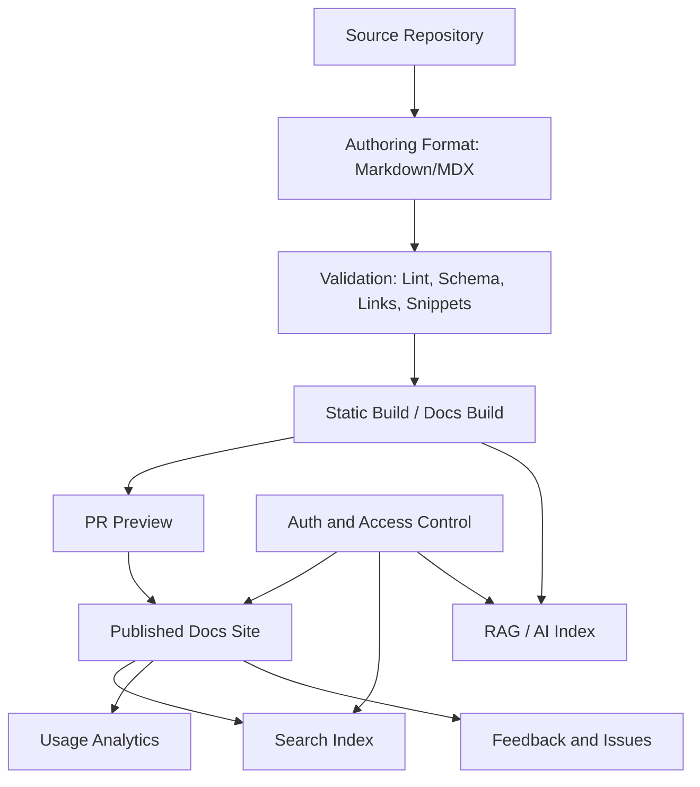
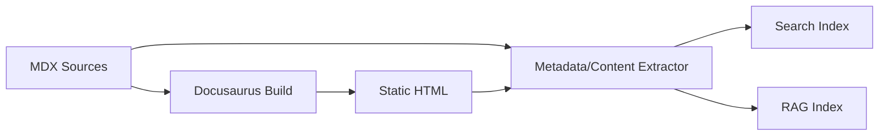
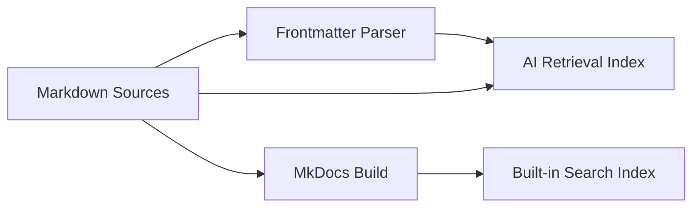
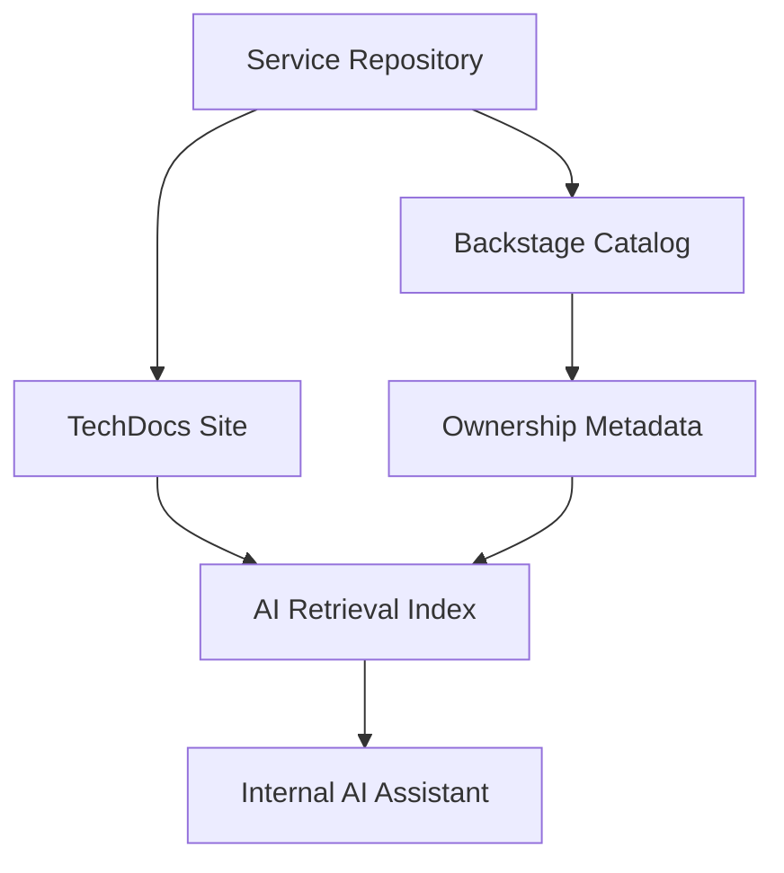
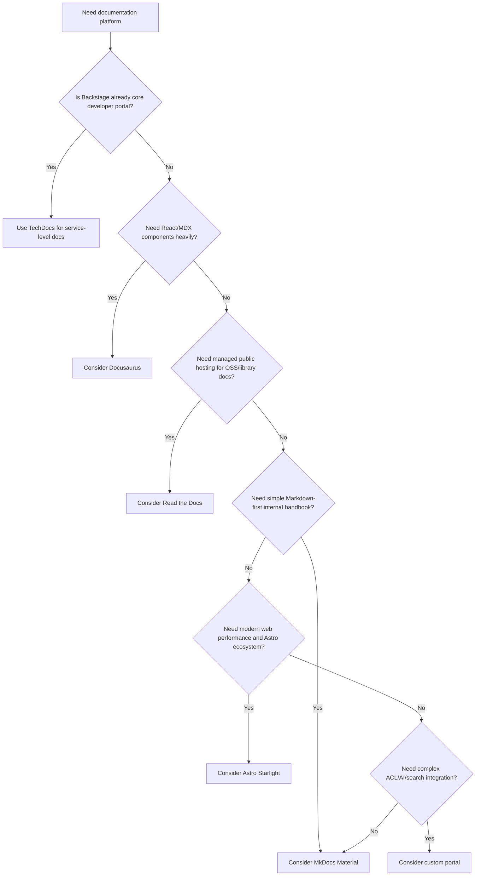
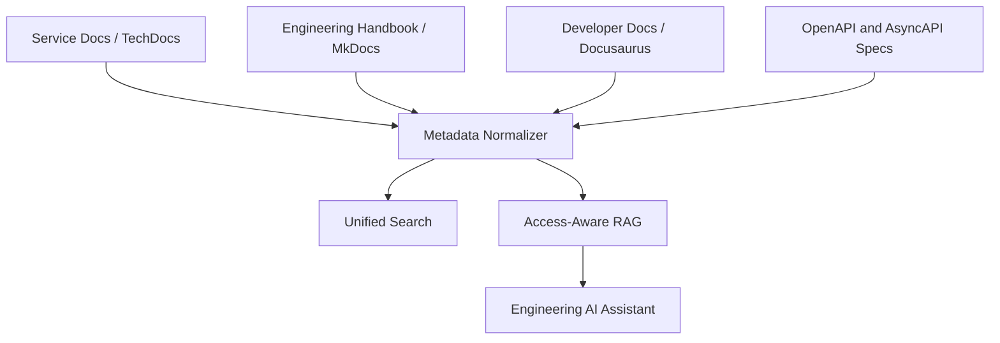
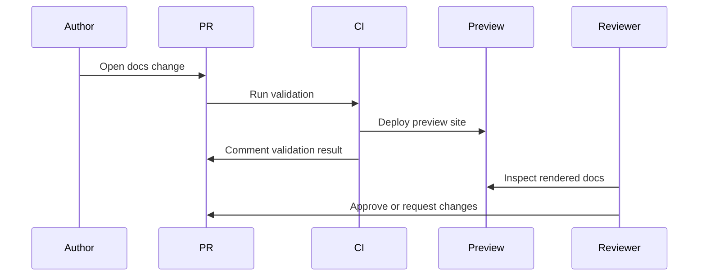
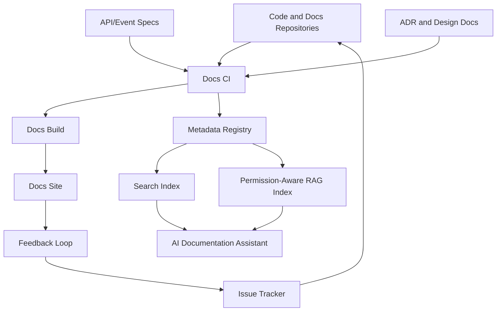

------
title: Learn AI-Driven Documentation and Technical Writing Implementation and Usage - Part 008
description: Platform dokumentasi untuk engineering handbook: Docusaurus, MkDocs Material, Read the Docs, Backstage TechDocs, Astro Starlight, custom docs portal, selection matrix, architecture, CI/CD, search, versioning, and AI integration.
series: learn-ai-driven-documentation
seriesTitle: Learn AI-Driven Documentation and Technical Writing Implementation and Usage
order: 8
partTitle: Documentation Site Platforms
tags:
- ai
- documentation
- technical-writing
- documentation-platform
- docusaurus
- mkdocs
- read-the-docs
- backstage
- docs-as-code
date: 2026-06-30
---

# Part 008 — Documentation Site Platforms

## 1. Target Pembelajaran

Part sebelumnya membahas Markdown, MDX, dan content model. Sekarang kita masuk ke platform: tempat dokumentasi dibangun, dipublish, dicari, dan digunakan oleh engineer.

Tujuan part ini:

- Memahami kriteria pemilihan documentation site platform.
- Membandingkan Docusaurus, MkDocs Material, Read the Docs, Backstage TechDocs, Astro Starlight, dan custom portal.
- Mendesain architecture platform dokumentasi untuk internal engineering handbook.
- Memahami versioning, search, access control, preview, CI/CD, analytics, dan AI indexing.
- Menghindari platform decision yang terlihat nyaman di awal tetapi mahal saat skala membesar.

Pertanyaan utamanya:

> Platform dokumentasi bukan sekadar renderer Markdown. Ia adalah delivery system untuk engineering knowledge.

---

## 2. Documentation Platform sebagai Product Surface

Platform dokumentasi adalah UI dan runtime untuk knowledge system.

Ia harus menjawab kebutuhan:

1. **Discovery** — engineer bisa menemukan informasi.
2. **Navigation** — engineer bisa memahami struktur domain.
3. **Reading** — konten mudah dibaca.
4. **Action** — engineer bisa menyelesaikan tugas.
5. **Trust** — pembaca tahu status, owner, versi, dan freshness.
6. **Contribution** — engineer bisa memperbaiki docs.
7. **Validation** — docs bisa dites sebelum publish.
8. **Search** — hasil pencarian relevan dan tidak menyesatkan.
9. **AI integration** — platform bisa menjadi source untuk retrieval dan answer assistant.
10. **Governance** — sensitive docs tidak bocor dan stale docs tidak dijadikan jawaban resmi.

Platform yang baik tidak hanya membuat docs “cantik”. Ia menurunkan biaya menemukan, memperbaiki, dan mempercayai informasi.

---

## 3. Mental Model: Docs Platform Stack



Platform decision harus dilihat di seluruh stack, bukan hanya build tool.

---

## 4. Evaluation Criteria

Gunakan kriteria berikut saat memilih platform.

### 4.1 Authoring Experience

Pertanyaan:

- Apakah formatnya Markdown, MDX, reStructuredText, atau campuran?
- Apakah engineer nyaman menulisnya?
- Apakah raw file readable di PR?
- Apakah komponen/custom block mudah dibuat?
- Apakah diagram, tabs, admonitions, dan code blocks didukung?

### 4.2 Information Architecture

Pertanyaan:

- Apakah sidebar/navigasi mudah dikontrol?
- Apakah multi-section docs didukung?
- Apakah bisa memisahkan tutorial, how-to, reference, explanation?
- Apakah bisa membuat domain-specific landing page?
- Apakah navigasi bisa generated dari metadata?

### 4.3 Search

Pertanyaan:

- Search built-in atau external?
- Bisa search private docs?
- Bisa search code block?
- Bisa filter berdasarkan product/version/domain?
- Bisa mengirim signal ke analytics?
- Bisa dipakai sebagai retrieval layer untuk AI?

### 4.4 Versioning

Pertanyaan:

- Apakah docs versioning didukung native?
- Apakah versi mengikuti product release?
- Apakah versi mengikuti service lifecycle?
- Apakah multiple docs set bisa punya lifecycle berbeda?
- Apakah stale version jelas bagi pembaca?

### 4.5 Access Control

Pertanyaan:

- Public, internal, confidential, restricted?
- Apakah platform mendukung SSO?
- Apakah access control per site, section, atau page?
- Apakah search menghormati permission?
- Apakah AI index menghormati permission?

### 4.6 Build and CI/CD

Pertanyaan:

- Apakah mudah dibuat PR preview?
- Apakah build cepat?
- Apakah build deterministic?
- Apakah plugin ecosystem stabil?
- Apakah broken link bisa menggagalkan build?
- Apakah snippet test bisa digabung?

### 4.7 Extensibility

Pertanyaan:

- Bisa membuat custom React component?
- Bisa membuat plugin?
- Bisa inject metadata?
- Bisa integrasi dengan service catalog?
- Bisa export rendered content untuk AI index?

### 4.8 Operating Cost

Pertanyaan:

- Siapa yang maintain platform?
- Apakah dependency upgrade sering breaking?
- Apakah tim docs platform punya kapasitas?
- Apakah troubleshooting build mudah?
- Apakah contributor perlu belajar framework terlalu banyak?

---

## 5. Platform Overview

Kita bahas enam opsi utama:

1. Docusaurus.
2. MkDocs Material.
3. Read the Docs.
4. Backstage TechDocs.
5. Astro Starlight.
6. Custom documentation portal.

Tidak ada satu jawaban untuk semua organisasi. Pilihan terbaik tergantung pada authoring skill, engineering stack, governance, access control, scale, dan AI integration requirement.

---

## 6. Docusaurus

Docusaurus adalah static site generator yang populer untuk documentation site berbasis Markdown/MDX dan React ecosystem.

### 6.1 Cocok untuk

- Developer docs dengan banyak MDX component.
- Product/API docs yang butuh UI interaktif.
- Internal handbook yang ingin reusable React components.
- Dokumentasi yang butuh versioning.
- Tim yang nyaman dengan Node.js/React ecosystem.

### 6.2 Kekuatan

- MDX support kuat.
- React component integration natural.
- Sidebar, docs plugin, blog, pages.
- Versioning support.
- Theming dan customization luas.
- Cocok untuk docs yang perlu interactive components.

### 6.3 Risiko

- Contributor yang tidak familiar React/MDX bisa kesulitan.
- MDX syntax lebih strict dibanding Markdown biasa.
- Over-customization mudah terjadi.
- Build dependency mengikuti JavaScript ecosystem.
- Component-heavy docs bisa merusak portability.

### 6.4 Architecture Pattern

```text
docs-site/
  docs/
    platform/
    services/
    runbooks/
    adr/
  src/
    components/
      ServiceCard.tsx
      DocStatus.tsx
      ApiLifecycleBadge.tsx
  sidebars.ts
  docusaurus.config.ts
  package.json
```

### 6.5 AI Integration Pattern

Docusaurus cocok jika ingin membuat rendered docs + structured metadata pipeline.



Perhatian penting:

- Tentukan apakah RAG index mengambil raw MDX atau rendered HTML.
- Jika raw MDX, pastikan komponen tidak menyembunyikan informasi penting.
- Jika rendered HTML, pastikan build output tidak berisi data yang user tidak boleh akses.

### 6.6 Good Fit Example

Docusaurus cocok untuk:

```text
public-developer-platform-docs/
  API docs
  SDK docs
  Interactive examples
  Multi-version docs
  Custom components
```

### 6.7 Poor Fit Example

Kurang cocok jika:

- Semua docs internal sangat sederhana.
- Tim ingin Markdown murni tanpa React.
- Access control per page sangat kompleks tetapi tidak ingin membangun custom layer.

---

## 7. MkDocs Material

MkDocs adalah static site generator yang berorientasi project documentation dengan Markdown dan konfigurasi YAML. Material for MkDocs adalah theme/framework populer yang menambahkan UX dokumentasi modern seperti search, navigation, tabs, admonitions, dan banyak fitur docs-ready.

### 7.1 Cocok untuk

- Internal engineering docs yang ingin Markdown-first.
- Tim Python/platform/SRE.
- Runbook, handbook, service docs.
- Dokumentasi yang ingin setup cepat tetapi tetap polished.
- Backstage TechDocs karena TechDocs memakai pendekatan MkDocs.

### 7.2 Kekuatan

- Markdown-first dan mudah dipelajari.
- Konfigurasi relatif sederhana.
- Built-in search di Material.
- Navigation dan admonitions kuat.
- Plugin ecosystem matang.
- Contributor friction rendah.

### 7.3 Risiko

- Interaktivitas komponen tidak senatural MDX/React.
- Custom UI kompleks bisa lebih sulit.
- Versioning butuh plugin/strategy tambahan.
- Untuk docs product yang sangat interaktif, mungkin kurang fleksibel dibanding Docusaurus.

### 7.4 Architecture Pattern

```text
engineering-docs/
  docs/
    index.md
    platform/
    services/
    runbooks/
    adr/
  mkdocs.yml
  requirements.txt
```

Contoh `mkdocs.yml`:

```yaml
site_name: Engineering Handbook
site_description: Internal engineering documentation
repo_url: https://github.com/acme/engineering-docs

theme:
  name: material
  features:
    - navigation.tabs
    - navigation.sections
    - search.highlight
    - search.suggest

nav:
  - Home: index.md
  - Platform:
      - Overview: platform/index.md
      - Local Development: platform/local-development.md
  - Runbooks:
      - Payment Timeout: runbooks/payment-timeout.md
```

### 7.5 AI Integration Pattern

MkDocs Material cocok untuk Markdown-first RAG.



Perhatian:

- Jika banyak plugin Markdown extension, pastikan RAG parser memahami syntax tersebut.
- Jangan mengandalkan rendered-only content untuk informasi kritis.

### 7.6 Good Fit Example

```text
internal-engineering-handbook/
  service docs
  runbooks
  onboarding
  architecture notes
  platform operations
```

### 7.7 Poor Fit Example

Kurang cocok jika:

- Docs memerlukan banyak React widgets.
- Ada kebutuhan interactive API console yang deeply custom.
- Tim ingin satu framework web app untuk docs dan product UI.

---

## 8. Read the Docs

Read the Docs adalah platform untuk build dan hosting dokumentasi yang terintegrasi dengan Git workflow. Ia sering dipakai untuk open-source dan software docs berbasis Sphinx, MkDocs, atau Jupyter Book.

### 8.1 Cocok untuk

- Open-source documentation.
- Library/framework docs.
- Python ecosystem docs.
- Multi-version documentation hosting.
- Tim yang ingin managed build/hosting documentation.

### 8.2 Kekuatan

- Build dan hosting terkelola.
- Integrasi Git workflow.
- Versioning umum untuk software docs.
- Cocok untuk Sphinx/MkDocs/Jupyter Book.
- Familiar di open-source ecosystem.

### 8.3 Risiko

- Untuk internal enterprise docs, akses dan governance perlu dievaluasi serius.
- Custom product experience lebih terbatas dibanding custom static site.
- Enterprise integration bergantung pada plan dan kebutuhan organisasi.
- Jika docs perlu integrasi deep dengan internal service catalog, mungkin perlu platform tambahan.

### 8.4 Architecture Pattern

```text
library-docs/
  docs/
    conf.py
    index.rst
    usage.rst
    api.rst
  .readthedocs.yaml
```

Atau MkDocs:

```text
project-docs/
  docs/
    index.md
    installation.md
    usage.md
  mkdocs.yml
  .readthedocs.yaml
```

### 8.5 Good Fit Example

```text
open-source-sdk-docs/
  install guide
  API reference
  tutorials
  versioned docs
```

### 8.6 Poor Fit Example

Kurang cocok jika:

- Docs sangat internal dan butuh integrasi kuat dengan internal identity, service catalog, dan fine-grained access policy.
- Docs platform harus menjadi developer portal utama.

---

## 9. Backstage TechDocs

Backstage TechDocs adalah docs-like-code solution yang terintegrasi dengan Backstage software catalog. Engineer menulis docs dalam Markdown dekat dengan kode, lalu docs muncul dalam developer portal.

### 9.1 Cocok untuk

- Organisasi yang sudah memakai Backstage.
- Internal developer portal.
- Service documentation dekat dengan service catalog.
- Platform engineering environment.
- Dokumentasi yang owner-nya mengikuti component/service ownership.

### 9.2 Kekuatan

- Terintegrasi dengan software catalog.
- Docs dekat dengan kode.
- Ownership bisa mengikuti catalog metadata.
- Cocok untuk service-level docs.
- Mendukung developer experience terpusat.

### 9.3 Risiko

- Jika belum memakai Backstage, adoption cost besar.
- UI/IA mengikuti model developer portal.
- Tidak semua jenis product documentation cocok diletakkan di TechDocs.
- Butuh governance agar setiap service docs tidak menjadi mini-site kacau.

### 9.4 Architecture Pattern

```text
services/payment-service/
  catalog-info.yaml
  mkdocs.yml
  docs/
    index.md
    local-setup.md
    runbook.md
```

`catalog-info.yaml` menghubungkan service dengan owner dan metadata catalog.

### 9.5 AI Integration Pattern

Backstage menarik untuk AI docs karena service catalog bisa menjadi metadata source.



Perhatian:

- AI retrieval harus menghormati access control.
- Service ownership dari catalog harus dipakai untuk freshness/review routing.
- Docs yang terlalu service-local bisa kehilangan cross-domain narrative.

### 9.6 Good Fit Example

```text
internal-developer-portal/
  service catalog
  ownership
  runbooks
  service onboarding
  operational docs
```

### 9.7 Poor Fit Example

Kurang cocok jika:

- Anda membutuhkan public-facing product docs.
- Organisasi belum punya platform engineering maturity.
- Docs lebih domain/product-centric daripada service-centric.

---

## 10. Astro Starlight

Astro Starlight adalah documentation theme di atas Astro yang menyediakan fitur dokumentasi seperti navigation, search, i18n, SEO, typography, code highlighting, dark mode, dan dukungan Markdown/MDX/Markdoc.

### 10.1 Cocok untuk

- Documentation site modern dengan performance tinggi.
- Tim yang nyaman dengan Astro ecosystem.
- Docs yang ingin fleksibilitas web modern tetapi tetap docs-focused.
- Public developer docs atau handbook ringan.

### 10.2 Kekuatan

- Cepat dan modern.
- Mendukung Markdown/MDX.
- UX dokumentasi siap pakai.
- Integrasi Astro luas.
- Cocok untuk content site yang butuh performance.

### 10.3 Risiko

- Ecosystem docs enterprise mungkin tidak sebesar Docusaurus/MkDocs.
- Untuk organisasi besar, perlu validasi maturity plugin, versioning, access control, dan governance.
- Custom internal portal integration perlu desain tambahan.

### 10.4 Good Fit Example

```text
public-docs/
  product guides
  examples
  changelog
  lightweight API docs
```

### 10.5 Poor Fit Example

Kurang cocok jika:

- Anda butuh Backstage-like service catalog.
- Anda butuh documentation versioning model yang sudah deeply established.
- Tim belum familiar Astro dan tidak ingin menambah ecosystem baru.

---

## 11. Custom Documentation Portal

Custom portal berarti organisasi membangun platform sendiri di atas framework seperti Next.js, Remix, Astro, atau internal platform.

### 11.1 Cocok untuk

- Kebutuhan access control sangat kompleks.
- Docs harus menyatu dengan internal systems.
- AI assistant, search, service catalog, metrics, dan docs UX harus unified.
- Ada tim platform yang bisa maintain.

### 11.2 Kekuatan

- Kontrol penuh.
- Integrasi SSO/ACL custom.
- Bisa membuat personalized docs experience.
- Bisa menggabungkan generated docs, live metadata, API explorer, dan AI assistant.
- Bisa menyesuaikan analytics dan governance.

### 11.3 Risiko

- Biaya maintenance tinggi.
- Mudah menjadi platform project yang tidak selesai.
- Contributor experience bisa buruk jika authoring tidak sederhana.
- Build pipeline dan plugin harus dibuat sendiri.
- Docs team bisa berubah menjadi web platform team.

### 11.4 Rule of Thumb

Jangan bangun custom portal hanya karena ingin tampilan unik.

Bangun custom portal jika Anda benar-benar butuh:

- Fine-grained permission.
- Deep integration dengan internal systems.
- AI assistant embedded dengan security policy.
- Complex workflow/approval.
- Multi-source knowledge graph.

---

## 12. Platform Selection Matrix

| Need | Best Candidate | Why |
|---|---|---|
| Markdown-first internal handbook | MkDocs Material | Simple, fast, low contributor friction. |
| MDX + React interactive docs | Docusaurus | Strong MDX and React component support. |
| Open-source/library docs hosting | Read the Docs | Managed docs build/hosting and versioning workflow. |
| Service docs inside developer portal | Backstage TechDocs | Catalog and ownership integration. |
| Fast modern public docs | Astro Starlight | Modern docs UX and Astro performance. |
| Complex internal governance + AI portal | Custom portal | Full control over access, search, RAG, and workflow. |

---

## 13. Decision Tree



---

## 14. Enterprise Hybrid Pattern

Di organisasi besar, satu platform jarang cukup.

Pattern yang sering lebih realistis:

```text
1. Backstage TechDocs
   - service docs
   - runbooks
   - ownership-linked documentation

2. Docusaurus or Starlight
   - public developer docs
   - product/API docs
   - interactive guides

3. MkDocs Material
   - internal handbook
   - platform guides
   - onboarding

4. Central search and AI index
   - normalized metadata
   - access-aware retrieval
   - stale docs filtering
```

Architecture:



Kunci hybrid platform bukan menyatukan semua UI. Kuncinya adalah menyatukan:

- Metadata.
- Ownership.
- Search.
- Access control.
- Freshness.
- AI retrieval policy.

---

## 15. Versioning Strategy

Versioning adalah salah satu keputusan tersulit.

### 15.1 Kapan Perlu Versioning

Perlu jika:

- User memakai banyak versi produk/API.
- External customers butuh docs sesuai versi yang mereka pakai.
- SDK/library punya release yang hidup bersamaan.
- Breaking change sering terjadi.

Tidak selalu perlu jika:

- Docs internal mengikuti trunk/main.
- Service hanya support current state.
- Historical context cukup disimpan di ADR/release notes.

### 15.2 Versioning Anti-Pattern

Buruk:

```text
Duplicate all docs for every release.
```

Dampak:

- Maintenance meledak.
- Bug docs harus diperbaiki di banyak versi.
- Search menampilkan versi lama.
- AI retrieval mengambil versi salah.

Lebih baik:

- Version hanya docs yang benar-benar perlu.
- Tandai version metadata.
- Search default ke latest stable.
- AI retrieval wajib version-aware.

### 15.3 Version Metadata

```yaml
versioning:
  strategy: product-release
  version: '2026.06'
  status: current
  supportedUntil: 2027-06-30
```

Untuk API:

```yaml
api:
  name: payment-api
  version: v2
  lifecycle: stable
```

---

## 16. Search Architecture

Search harus dianggap core feature.

Search yang buruk membuat dokumentasi tidak dipakai.

### 16.1 Search Requirements

- Fast.
- Typo tolerant jika memungkinkan.
- Filterable by domain/docType/version/status.
- Respect access control.
- Exclude deprecated docs by default.
- Promote owner-approved docs.
- Track zero-result queries.

### 16.2 Search Metadata

```json
{
  "title": "Payment Timeout Runbook",
  "url": "/runbooks/payment-timeout",
  "docType": "runbook",
  "domain": "payment",
  "owner": "payments-platform",
  "status": "active",
  "lastReviewed": "2026-06-30",
  "sensitivity": "internal",
  "version": "current"
}
```

### 16.3 Search and AI Are Related but Not Identical

Search returns documents.
AI retrieval returns context.

Search can tolerate broad results. AI retrieval cannot. Wrong context can produce wrong answer.

Therefore:

```text
Search index may be broad.
RAG index must be filtered, source-backed, version-aware, and permission-aware.
```

---

## 17. Access Control

Documentation platform must enforce access at three layers:

1. Site/page access.
2. Search result access.
3. AI retrieval access.

If page access is restricted but AI index includes it without permission checks, you have a data leak.

### 17.1 Sensitivity Model

```yaml
sensitivity: public | internal | confidential | restricted
```

### 17.2 Access Control Matrix

| Sensitivity | Example | Search | AI Retrieval |
|---|---|---|---|
| public | External API docs | public | allowed for public assistant |
| internal | Engineering handbook | SSO only | internal users only |
| confidential | Security architecture | restricted group | restricted group only |
| restricted | Secrets/process details | usually excluded | excluded unless explicit approval |

### 17.3 Common Failure

```text
Docs site is protected by SSO,
but generated search/RAG index is stored in public bucket.
```

This is a serious architecture bug.

---

## 18. Preview Environments

PR preview is essential.

Without preview:

- Reviewer cannot see rendered MDX.
- Broken layout is missed.
- Mermaid errors are missed.
- Component rendering issues appear after merge.
- Generated docs drift is hard to inspect.

Preview should show:

- Rendered page.
- Navigation impact.
- Broken links.
- Search/index impact if possible.
- Metadata validation.
- AI retrieval preview for high-impact docs.

Pipeline:



---

## 19. Platform CI/CD Blueprint

Minimum CI for documentation platform:

```yaml
name: docs-ci

on:
  pull_request:
    paths:
      - 'docs/**'
      - 'mkdocs.yml'
      - 'docusaurus.config.ts'
      - 'sidebars.ts'
      - 'src/components/**'

jobs:
  validate-docs:
    runs-on: ubuntu-latest
    steps:
      - uses: actions/checkout@v4
      - name: Lint prose
        run: vale docs
      - name: Lint markdown
        run: markdownlint docs
      - name: Validate frontmatter
        run: node scripts/validate-frontmatter.mjs
      - name: Check links
        run: node scripts/check-links.mjs
      - name: Build docs
        run: npm run build
      - name: Build AI index preview
        run: npm run docs:index:preview
```

Pipeline nyata bisa berbeda, tetapi quality gates harus ada.

---

## 20. Platform Governance

Platform harus punya operating model.

### 20.1 Roles

| Role | Responsibility |
|---|---|
| Docs platform owner | Platform build, theme, CI, search, publishing. |
| Domain doc owner | Technical accuracy and freshness. |
| Editorial owner | Style guide, templates, readability. |
| Security reviewer | Sensitive docs and AI retrieval policy. |
| AI platform owner | RAG index, assistant behavior, permission model. |

### 20.2 Lifecycle

```text
draft -> active -> needs-review -> deprecated -> archived
```

### 20.3 Platform Policy

Policy should define:

- Required metadata.
- Allowed doc types.
- Required review by doc type.
- Publishing rules.
- Versioning rules.
- AI indexing rules.
- Sensitive content handling.

---

## 21. Documentation Platform Smells

### 21.1 Beautiful Site, Bad Docs

Tanda:

- UI bagus tetapi konten stale.
- Search buruk.
- Tidak ada owner.
- Tidak ada review cadence.

Solusi:

- Prioritaskan content quality system sebelum theme customization.

### 21.2 Everything in One Platform

Tanda:

- Runbook, product docs, ADR, generated API reference, and onboarding dipaksa ke struktur sama.

Solusi:

- Pisahkan doc type dan lifecycle. Satukan metadata/search, bukan memaksa satu IA.

### 21.3 No Permission-Aware AI Index

Tanda:

- AI assistant bisa menjawab dari docs yang user tidak boleh baca.

Solusi:

- Access control harus diterapkan saat indexing dan retrieval.

### 21.4 No Preview

Tanda:

- Build error baru terlihat setelah merge.
- Reviewer hanya melihat raw Markdown.

Solusi:

- PR preview wajib.

### 21.5 Version Graveyard

Tanda:

- Banyak versi docs lama masih searchable.
- Tidak jelas versi mana current.
- AI menjawab berdasarkan versi lama.

Solusi:

- Version-aware search/RAG dan lifecycle metadata.

---

## 22. Recommendation by Scenario

### 22.1 Small Engineering Team

Rekomendasi:

- MkDocs Material.
- Markdown-first.
- Simple CI.
- Required frontmatter minimal.
- Local search.

Kenapa:

- Low friction.
- Cepat jalan.
- Tidak butuh banyak platform engineering.

### 22.2 Product/API Developer Docs

Rekomendasi:

- Docusaurus atau Astro Starlight.
- OpenAPI-generated reference.
- MDX examples.
- Versioning jika API versions hidup bersamaan.

Kenapa:

- UX dan component model lebih kuat.

### 22.3 Large Internal Platform Organization

Rekomendasi:

- Backstage TechDocs untuk service docs.
- MkDocs/Docusaurus untuk handbook/domain docs.
- Unified metadata/search/RAG layer.

Kenapa:

- Service ownership penting.
- Developer portal central membantu discoverability.

### 22.4 Regulated Enterprise

Rekomendasi:

- Platform dengan audit trail, SSO, access control, approval workflow.
- Custom layer mungkin diperlukan.
- AI retrieval harus permission-aware dan source-backed.

Kenapa:

- Governance lebih penting dari theme.

---

## 23. AI-Driven Documentation Platform Blueprint



Minimum capability:

- Build docs from Git.
- Validate metadata.
- Publish preview.
- Publish production site.
- Build search index.
- Build permission-aware AI index.
- Capture feedback.
- Route stale docs to owner.

---

## 24. Platform Decision Record Template

Gunakan ADR untuk memilih platform.

```mdx
# ADR-0041: Adopt MkDocs Material for Internal Engineering Handbook

## Status

Accepted

## Context

Engineering docs are spread across service READMEs, wiki pages, and onboarding documents. Search is poor and ownership is unclear.

## Decision

Adopt MkDocs Material for the internal engineering handbook. Service-level docs remain co-located with services and can be surfaced through Backstage TechDocs later.

## Rationale

- Markdown-first authoring.
- Low contributor friction.
- Built-in search.
- Simple CI/CD.
- Good fit for internal handbook and runbooks.

## Alternatives Considered

- Docusaurus: stronger MDX/React support but higher contributor complexity.
- Custom portal: too expensive for current maturity.
- Wiki: lower review and validation discipline.

## Consequences

- Custom interactive docs will be limited.
- Versioning strategy must be defined separately.
- Frontmatter validation and AI index generation will be implemented in CI.

## Follow-Up

- Define frontmatter schema.
- Implement docs CI.
- Build search analytics.
- Define AI retrieval policy.
```

---

## 25. Deliberate Practice

Latihan 2 jam:

1. Ambil satu organisasi hipotetis dengan 30 service, 5 platform teams, dan 3 product APIs.
2. Tentukan platform docs yang dipakai.
3. Buat selection matrix.
4. Buat architecture diagram.
5. Tentukan search strategy.
6. Tentukan versioning strategy.
7. Tentukan AI retrieval policy.
8. Tulis ADR platform decision.

Kriteria sukses:

- Pilihan platform sesuai constraint.
- Tidak over-engineered.
- Search dan AI permission dipikirkan sejak awal.
- Ownership dan lifecycle jelas.
- Ada migration path dari docs lama.

---

## 26. Ringkasan

Documentation site platform adalah delivery system untuk engineering knowledge.

Pilihan platform harus mempertimbangkan:

- Authoring experience.
- Information architecture.
- Search.
- Versioning.
- Access control.
- CI/CD.
- Extensibility.
- AI integration.
- Operating cost.

Rule of thumb:

```text
Choose the simplest platform that can enforce your documentation lifecycle, search, ownership, and AI retrieval requirements.
```

Docusaurus kuat untuk MDX/React docs. MkDocs Material kuat untuk Markdown-first internal handbook. Read the Docs kuat untuk managed open-source/library docs. Backstage TechDocs kuat untuk service docs dalam developer portal. Astro Starlight menarik untuk modern docs site berbasis Astro. Custom portal hanya masuk akal jika governance, access control, dan AI integration benar-benar membutuhkan kontrol penuh.

---

## 27. Referensi

- Docusaurus Markdown Features — https://docusaurus.io/docs/markdown-features
- Docusaurus Versioning — https://docusaurus.io/docs/versioning
- MkDocs — https://www.mkdocs.org/
- Material for MkDocs — https://squidfunk.github.io/mkdocs-material/
- Read the Docs Platform Documentation — https://docs.readthedocs.com/platform/stable/
- Backstage TechDocs — https://backstage.io/docs/features/techdocs/
- Astro Starlight — https://starlight.astro.build/
