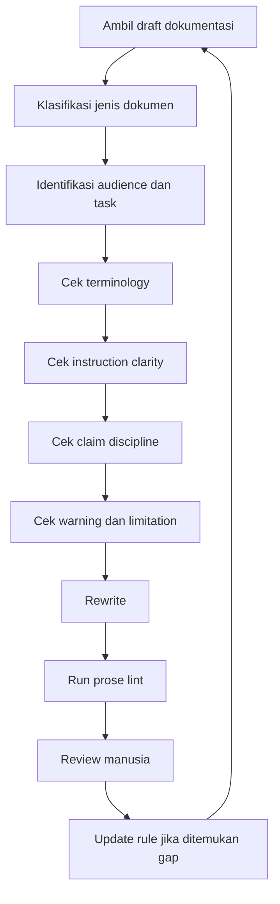
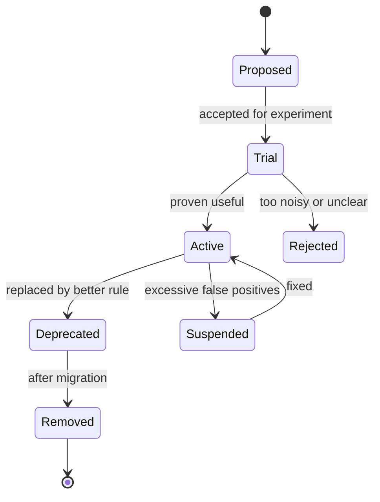

------
title: Learn AI-Driven Documentation and Technical Writing Implementation and Usage - Part 009
description: Engineering style guide design for AI-assisted technical documentation, including voice, terminology, claim discipline, procedures, review policy, and executable documentation standards.
series: learn-ai-driven-documentation
seriesTitle: Learn AI-Driven Documentation and Technical Writing Implementation and Usage
order: 9
partTitle: Engineering Style Guide Design
tags:
- ai
- documentation
- technical-writing
- style-guide
- docs-as-code
- governance
- engineering-handbook
date: 2026-06-30
---

# Part 009 — Engineering Style Guide Design

## 1. Target Pembelajaran

Part sebelumnya membahas documentation site platforms. Sekarang kita masuk ke hal yang sering diremehkan, tetapi menentukan apakah dokumentasi enterprise bisa scale: **engineering style guide**.

Style guide bukan dokumen editorial kosmetik. Dalam sistem dokumentasi modern, terutama yang dibantu AI, style guide adalah **contract** antara:

- penulis dokumentasi,
- reviewer teknis,
- reviewer editorial,
- AI assistant,
- documentation linter,
- search system,
- documentation site,
- pembaca manusia,
- dan organisasi yang harus mempertanggungjawabkan informasi teknisnya.

Target part ini:

- Memahami style guide sebagai sistem engineering, bukan preferensi bahasa.
- Mendesain aturan penulisan yang bisa diajarkan ke manusia dan AI.
- Membuat style guide yang bisa dilint, direview, dan diukur.
- Mengontrol voice, tone, terminology, claim, instruction, warning, error, dan example.
- Mencegah AI menghasilkan dokumentasi yang terlihat bagus tetapi salah, overclaiming, tidak konsisten, atau tidak defensible.
- Menyusun style guide internal yang cocok untuk engineering handbook level enterprise.

Prinsip utama:

```text
A style guide is not a writing decoration.
It is a reliability layer for technical communication.
```

---

## 2. Kenapa Style Guide Menjadi Lebih Penting di Era AI

Sebelum AI, style inconsistency biasanya berasal dari manusia:

- satu tim menulis “service”, tim lain menulis “microservice”, “module”, atau “component” untuk hal yang sama;
- beberapa dokumen terlalu informal;
- beberapa instruksi tidak step-by-step;
- warning dan limitation tidak konsisten;
- error message tidak dijelaskan dengan pola yang sama;
- istilah domain berubah tanpa migration;
- dokumen lama tetap memakai nama fitur yang sudah diganti.

Setelah AI masuk, masalahnya bertambah:

- AI bisa meniru tone yang salah dari dokumen lama.
- AI bisa mencampur istilah dari banyak sumber.
- AI bisa membuat kalimat terdengar meyakinkan walau klaimnya tidak terverifikasi.
- AI bisa membuat prosedur terlalu generik.
- AI bisa menghapus caveat penting karena ingin membuat teks lebih ringkas.
- AI bisa mengubah bahasa normatif seperti `must`, `should`, `may` tanpa memahami konsekuensi governance.
- AI bisa membuat contoh kode terlihat valid tetapi tidak runnable.

Karena itu, style guide harus menjadi bagian dari **AI operating boundary**.

```text
Without a style guide, AI optimizes for plausible writing.
With a style guide, AI can be constrained toward usable, reviewable, and consistent writing.
```

---

## 3. Mental Model: Style Guide sebagai Contract

Style guide yang matang menjawab enam pertanyaan:

| Pertanyaan | Kenapa penting |
|---|---|
| Apa yang boleh diklaim? | Mencegah overclaiming dan hallucination. |
| Istilah mana yang resmi? | Menghindari fragmentasi bahasa domain. |
| Bagaimana instruksi ditulis? | Membuat pembaca bisa menyelesaikan task. |
| Bagaimana risiko dikomunikasikan? | Membuat warning, limitation, dan failure mode jelas. |
| Bagaimana AI harus menulis? | Memberi constraint eksplisit untuk generated draft. |
| Apa yang bisa divalidasi otomatis? | Mengubah style guide dari dokumen pasif menjadi quality gate. |

Style guide bukan hanya “gunakan kalimat pendek”. Itu terlalu dangkal. Style guide yang berguna harus punya tiga layer:

```text
Principles  ->  Rules  ->  Checks
```

Contoh:

```text
Principle:
  Readers should know whether a statement is fact, recommendation, or limitation.

Rule:
  Do not use absolute claims such as "always", "never", or "guaranteed" unless sourced or enforced by code/policy.

Check:
  Vale rule flags forbidden absolute terms unless they appear in an allowlist context.
```

---

## 4. Kaufman Deconstruction untuk Style Guide Skill

Mengikuti pendekatan Josh Kaufman, kita pecah skill “mendesain style guide” menjadi sub-skill yang bisa dilatih cepat.

### 4.1 Sub-Skill Utama

| Sub-skill | Output praktik |
|---|---|
| Audience modeling | Menentukan siapa pembaca dan task utama. |
| Terminology control | Membuat daftar istilah approved, deprecated, dan forbidden. |
| Instruction design | Menulis prosedur yang bisa dijalankan tanpa interpretasi berlebihan. |
| Claim discipline | Membedakan fact, assumption, guarantee, recommendation, dan warning. |
| Pattern library | Membuat pola reusable untuk how-to, troubleshooting, API notes, release notes. |
| AI constraint design | Mengubah style guide menjadi prompt, checklist, dan lint rule. |
| Review governance | Menentukan siapa approve apa dan kapan dokumen boleh publish. |
| Automation mapping | Menentukan aturan mana yang bisa dicek otomatis. |

### 4.2 Self-Correction Loop

Skill ini tidak dilatih dengan membaca style guide panjang. Skill ini dilatih dengan membandingkan draft terhadap aturan.



Target belajarnya bukan hafal aturan, tetapi mampu menjawab:

```text
Why is this wording unsafe, unclear, hard to review, or hard to automate?
```

---

## 5. Apa yang Membedakan Style Guide Biasa dan Engineering Style Guide

Style guide biasa sering fokus pada grammar, tone, capitalization, punctuation, dan pilihan kata.

Engineering style guide lebih luas:

| Area | Style guide biasa | Engineering style guide |
|---|---|---|
| Voice | Friendly, concise | Friendly, concise, operationally safe |
| Terminology | Preferred words | Domain vocabulary with ownership |
| Procedures | Clear steps | Preconditions, effects, rollback, verification |
| Examples | Helpful examples | Tested, versioned, executable where possible |
| Claims | Avoid exaggeration | Tie claim to source of truth or runtime behavior |
| Review | Editorial review | Technical + editorial + governance review |
| Automation | Optional | Required quality gates |
| AI | Not considered | Prompt constraints, risk controls, verification steps |

Dalam engineering context, kalimat tidak hanya dinilai bagus secara bahasa. Kalimat dinilai berdasarkan apakah ia:

- benar secara teknis,
- aman untuk diikuti,
- jelas batasannya,
- bisa direview,
- bisa diuji,
- bisa dicari,
- bisa diterjemahkan,
- bisa diindeks oleh AI,
- dan bisa dipertanggungjawabkan.

---

## 6. Prinsip Desain Style Guide

### 6.1 Minimal but Enforceable

Style guide yang terlalu panjang sering tidak dipakai. Style guide yang terlalu pendek tidak cukup mengarahkan.

Gunakan prinsip:

```text
Every rule must either reduce reader confusion, reduce operational risk, improve consistency, or enable automation.
```

Jika aturan hanya preferensi pribadi, jangan jadikan aturan global.

Contoh aturan lemah:

```text
Avoid long paragraphs because they feel bad.
```

Contoh aturan kuat:

```text
Keep procedural paragraphs under 120 words. Long procedural paragraphs hide actions, conditions, and expected results.
```

### 6.2 Example-First

Setiap aturan penting harus punya:

- bad example,
- good example,
- reason,
- lintability status,
- exception rule.

Contoh:

```mdx
## Use direct verbs in task titles

Bad:
- User creation
- Configuration of retry policy

Good:
- Create a user
- Configure retry policy

Reason:
Task titles should help readers recognize the action they need to perform.

Lintability:
Partially lintable through heading pattern checks.

Exception:
Concept pages may use noun phrases.
```

### 6.3 Source-of-Truth Aware

Style guide harus menjelaskan hirarki kebenaran.

Contoh:

```text
Truth hierarchy:
1. Runtime behavior and tested code
2. Published API/event schema
3. Versioned architecture decision record
4. Approved product requirement
5. Reviewed runbook
6. Existing explanatory documentation
7. AI-generated draft
```

AI-generated draft selalu berada di paling bawah. Ia boleh membantu, tetapi tidak boleh menjadi sumber kebenaran.

### 6.4 Reviewable

Aturan harus membuat review lebih objektif.

Daripada reviewer menulis:

```text
This feels unclear.
```

Reviewer bisa menulis:

```text
This violates the procedure rule: each step must include one action and one expected result when the result is observable.
```

### 6.5 Localizable

Dokumentasi enterprise sering perlu diterjemahkan, bahkan jika awalnya hanya internal.

Style guide harus menghindari:

- idiom,
- jokes,
- slang,
- cultural references,
- nested clauses,
- ambiguous pronouns,
- metaphor berlebihan.

Kalimat yang mudah diterjemahkan biasanya juga lebih mudah dipahami oleh non-native reader dan AI retrieval.

### 6.6 AI-Consumable

Style guide harus bisa dipakai AI sebagai context.

Artinya:

- aturan eksplisit,
- format stabil,
- contoh cukup,
- tidak terlalu banyak exception implisit,
- terminology bisa diparse,
- output constraints jelas,
- review checklist bisa diubah menjadi prompt.

---

## 7. Struktur Style Guide Internal

Struktur yang direkomendasikan:

```text
docs/
  style-guide/
    index.mdx
    principles.mdx
    audience-and-personas.mdx
    voice-and-tone.mdx
    terminology.mdx
    procedures.mdx
    headings-and-navigation.mdx
    code-and-cli-examples.mdx
    api-and-event-docs.mdx
    runbooks-and-incidents.mdx
    warnings-notes-and-limitations.mdx
    accessibility-and-inclusive-language.mdx
    ai-assisted-writing.mdx
    review-checklists.mdx
    vale-rules-map.mdx
    exceptions.mdx
```

Untuk enterprise handbook, jangan membuat semua aturan dalam satu halaman besar. Pisahkan berdasarkan mode kerja pembaca.

### 7.1 `index.mdx`

Isi:

- tujuan style guide,
- siapa yang wajib mengikuti,
- kapan aturan berlaku,
- rule severity,
- cara mengajukan exception,
- cara menambah aturan.

### 7.2 `principles.mdx`

Isi prinsip yang stabil:

- correctness over fluency,
- task completion over completeness,
- explicit constraints over hidden assumptions,
- source-backed claims over plausible claims,
- reviewability over clever writing,
- consistency over personal preference.

### 7.3 `terminology.mdx`

Isi vocabulary resmi:

| Term | Status | Meaning | Avoid | Owner |
|---|---|---|---|---|
| workspace | approved | Logical area where users manage resources. | space, environment | Platform Docs |
| tenant | restricted | Legal/customer boundary. Use only in multi-tenant architecture docs. | customer, org | Architecture |
| blacklist | forbidden | Use denylist. | blacklist | Security Docs |
| whitelist | forbidden | Use allowlist. | whitelist | Security Docs |

### 7.4 `ai-assisted-writing.mdx`

Isi aturan khusus untuk AI:

- AI may draft, summarize, restructure, and rewrite.
- AI must not invent source behavior.
- AI output must include uncertainty where source is incomplete.
- AI-generated code examples must be tested or marked as illustrative.
- AI must not remove warnings, limitations, or prerequisites without explicit reviewer decision.
- AI must not convert `may` to `must` or `should` to `will` without source proof.

---

## 8. Voice dan Tone

Voice adalah karakter konsisten dokumentasi. Tone adalah penyesuaian berdasarkan konteks.

Untuk engineering handbook, voice yang disarankan:

```text
Clear, direct, calm, precise, and operationally useful.
```

Bukan:

```text
Marketing-heavy, overly enthusiastic, clever, vague, or apologetic.
```

### 8.1 Voice Rules

| Rule | Reason |
|---|---|
| Use direct language. | Pembaca biasanya sedang menyelesaikan task. |
| Prefer active voice. | Memperjelas actor dan responsibility. |
| Avoid hype. | Dokumentasi bukan sales copy. |
| Be specific about limits. | Mengurangi misuse dan salah ekspektasi. |
| Prefer concrete nouns. | Mengurangi ambiguity. |
| Use consistent terms. | Membantu search, onboarding, dan AI retrieval. |

### 8.2 Tone by Document Type

| Document type | Tone |
|---|---|
| Tutorial | Encouraging, guided, explicit |
| How-to | Direct, procedural, result-oriented |
| Reference | Neutral, precise, complete |
| Explanation | Analytical, causal, trade-off aware |
| Runbook | Calm, imperative, safety-focused |
| Incident report | Factual, chronological, blame-aware |
| ADR | Deliberate, comparative, constraint-aware |
| Release notes | Brief, impact-oriented, user-facing |
| Policy docs | Normative, unambiguous, defensible |

### 8.3 Bad vs Good

Bad:

```mdx
Our amazing retry engine magically handles all failures for you.
```

Good:

```mdx
The retry engine retries transient failures that match the configured retry policy. It does not retry validation errors or authorization failures.
```

Kenapa versi kedua lebih baik:

- tidak hype,
- actor jelas,
- scope jelas,
- limitation eksplisit,
- mudah diuji,
- aman untuk pembaca.

---

## 9. Terminology Control

Terminology adalah salah satu area paling penting untuk AI-driven documentation.

Jika istilah tidak dikontrol, AI akan mencampur:

- istilah lama,
- istilah baru,
- istilah dari vendor,
- istilah internal,
- istilah product,
- istilah architecture,
- istilah legal/compliance.

### 9.1 Kategori Istilah

| Category | Meaning | Action |
|---|---|---|
| Approved | Istilah resmi. | Gunakan. |
| Deprecated | Istilah lama, masih muncul di legacy docs. | Hindari di docs baru. |
| Forbidden | Istilah tidak boleh dipakai. | Lint sebagai error. |
| Restricted | Boleh hanya di konteks tertentu. | Review manual. |
| Ambiguous | Istilah punya banyak arti. | Definisikan atau ganti. |
| External | Istilah vendor/standard. | Ikuti sumber eksternal. |

### 9.2 Contoh Terminology Policy

```mdx
## Terminology policy

Use one official term for one concept.

Do not introduce synonyms unless the synonym is needed for migration, search, or external compatibility.

When a term changes:

1. Update the glossary.
2. Add the old term as deprecated.
3. Add a migration note.
4. Update Vale vocabulary.
5. Update search synonyms.
6. Update AI context pack.
7. Update release notes if user-facing.
```

### 9.3 Term Entry Template

```mdx
## <Term>

Status: approved | deprecated | forbidden | restricted
Owner: <team>
Scope: <where this term applies>
Definition: <precise definition>
Use when: <valid context>
Do not use when: <invalid context>
Avoid: <synonyms or deprecated terms>
Examples:
- Good: ...
- Bad: ...
Related terms:
- ...
```

### 9.4 AI-Specific Terminology Rule

Saat menggunakan AI untuk rewrite atau generate docs, selalu berikan vocabulary constraint:

```text
Use only approved terms from the glossary.
Do not introduce synonyms.
If the source uses a deprecated term, preserve it only when explaining migration or legacy behavior.
```

---

## 10. Claim Discipline

Dokumentasi teknis sering gagal bukan karena grammar, tetapi karena klaim tidak disiplin.

Contoh klaim berbahaya:

```mdx
The system automatically prevents duplicate submissions.
```

Pertanyaan review:

- Sistem mana?
- Pada boundary apa?
- Duplicate berdasarkan key apa?
- Apakah prevention atau detection?
- Apakah guaranteed atau best effort?
- Apakah berlaku untuk semua clients?
- Apakah berlaku saat retry, timeout, race condition, dan eventual consistency?

Versi lebih aman:

```mdx
The API rejects a second submission when the request uses the same idempotency key within the configured retention window. Requests without an idempotency key can still create duplicate work.
```

### 10.1 Claim Taxonomy

| Claim type | Example | Required support |
|---|---|---|
| Runtime fact | “The API returns 409.” | Code, test, or spec. |
| Behavioral guarantee | “The job runs exactly once.” | Strong proof; avoid unless true. |
| Recommendation | “Use exponential backoff.” | Rationale or standard practice. |
| Limitation | “This does not support partial rollback.” | Source or owner confirmation. |
| Future claim | “This will support SSO.” | Roadmap approval; usually avoid. |
| Comparative claim | “This is faster.” | Benchmark or remove. |
| Security claim | “Encrypted at rest.” | Security owner/source. |
| Compliance claim | “Audit-ready.” | Policy/legal approval. |

### 10.2 Banned or Restricted Claim Words

Treat these as dangerous unless sourced:

- always,
- never,
- guaranteed,
- secure,
- safe,
- automatic,
- seamless,
- simple,
- easy,
- real-time,
- instant,
- lossless,
- exactly-once,
- production-ready,
- audit-ready.

Bukan berarti kata ini tidak pernah boleh dipakai. Artinya kata ini harus **dibuktikan atau dipersempit**.

### 10.3 Good Claim Pattern

```text
<Subject> <behavior> when <condition>. It does not <limitation>. To verify <verification step>.
```

Contoh:

```mdx
The scheduler retries failed jobs when the failure is marked transient. It does not retry validation failures. To verify retry behavior, check the `job_attempts` table and the `scheduler.retry.count` metric.
```

---

## 11. Procedure Writing Rules

Procedure adalah jenis dokumentasi paling rawan gagal, karena pembaca sedang melakukan task.

Procedure yang baik harus menjawab:

- Apa tujuan task?
- Kapan task ini digunakan?
- Siapa yang boleh melakukan?
- Apa precondition-nya?
- Apa input yang dibutuhkan?
- Apa langkahnya?
- Apa expected result-nya?
- Bagaimana verifikasinya?
- Apa rollback atau recovery-nya?
- Apa failure mode umum?

### 11.1 Procedure Template

```mdx
# <Task title as verb phrase>

## When to use this

Use this procedure when ...

## Before you begin

- Required access: ...
- Required version: ...
- Required input: ...
- Risk: ...

## Steps

1. <Action>.

   Expected result: <observable result>.

2. <Action>.

   Expected result: <observable result>.

## Verify the result

Run/check ...

## Roll back

To roll back ...

## Troubleshooting

| Symptom | Cause | Fix |
|---|---|---|
| ... | ... | ... |
```

### 11.2 Step Rules

| Rule | Good |
|---|---|
| Start steps with verbs. | “Create a branch.” |
| One main action per step. | Avoid combining unrelated actions. |
| Include expected result when observable. | “The service returns HTTP 200.” |
| Avoid vague verbs. | Replace “handle” with “retry”, “reject”, “store”, or “publish”. |
| Put explanations outside step list. | Steps are for actions. |
| Mark optional steps clearly. | “Optional: Enable debug logging.” |

Bad:

```mdx
1. Configure everything correctly and run the service.
```

Good:

```mdx
1. Set `DOCS_ENV=local` in `.env`.
2. Run `npm run docs:dev`.

   Expected result: The local documentation site is available at `http://localhost:3000`.
```

---

## 12. Warning, Note, and Limitation Rules

Admonitions harus digunakan dengan konsisten. Jika semua hal disebut warning, pembaca akan mengabaikan warning.

| Type | Use for | Example |
|---|---|---|
| Note | Helpful context that does not affect safety. | “The preview URL expires after 7 days.” |
| Tip | Optional improvement. | “Use the search index locally to test metadata changes.” |
| Important | Required condition. | “The page must include an owner before publication.” |
| Warning | Risk of data loss, outage, security exposure, or irreversible change. | “Do not publish generated docs without technical review.” |
| Limitation | Supported boundary. | “This workflow does not validate screenshots.” |

### 12.1 Warning Pattern

```mdx
:::warning
Do not <dangerous action>. This can <impact>. Use <safe alternative> instead.
:::
```

Example:

```mdx
:::warning
Do not paste production secrets into an AI prompt. This can expose credentials outside the approved secret boundary. Use redacted logs or synthetic examples instead.
:::
```

### 12.2 Limitation Pattern

```mdx
:::note Limitation
This workflow validates Markdown structure, links, and terminology. It does not verify whether generated code examples compile.
:::
```

Limitation harus eksplisit karena AI sering menghapus batasan demi membuat teks terlihat lebih lancar.

---

## 13. Headings and Navigation Rules

Heading adalah interface. Heading dipakai oleh:

- pembaca manusia untuk scan,
- search engine,
- table of contents,
- AI chunking,
- link anchors,
- review comments,
- analytics.

### 13.1 Heading Rules

| Rule | Reason |
|---|---|
| Use one H1 per page. | Stabil untuk title dan search. |
| Use H2 for major sections. | Memudahkan chunking. |
| Avoid clever headings. | Search dan AI retrieval butuh explicit terms. |
| Prefer task headings as verb phrases. | Membantu task completion. |
| Prefer concept headings as noun phrases. | Membantu reference dan explanation. |
| Do not skip heading levels. | Aksesibilitas dan parseability. |

Bad:

```mdx
## Magic happens here
```

Good:

```mdx
## Generate release notes from merged pull requests
```

### 13.2 Heading Prefix Anti-Pattern

Hindari heading seperti:

```mdx
## Overview
## Details
## More information
## Miscellaneous
```

Heading seperti ini tidak memberi information scent. Gunakan:

```mdx
## How the documentation pipeline validates generated pages
## Required metadata for published engineering docs
## Failure modes in AI-assisted documentation review
```

---

## 14. Code, CLI, and Configuration Examples

Code examples dalam dokumentasi harus punya status yang jelas.

| Status | Meaning |
|---|---|
| Tested | Contoh diuji otomatis. |
| Verified manually | Contoh diuji manual. |
| Illustrative | Contoh menjelaskan konsep, bukan siap copy-paste. |
| Pseudocode | Bukan kode valid. |
| Generated | Dibuat dari source/spec. |

### 14.1 Example Metadata

Gunakan label:

```mdx
```bash title="Run local docs site" status="tested"
npm run docs:dev
```
```

Jika platform tidak mendukung metadata di code block, jelaskan sebelum snippet.

```mdx
The following example is illustrative and omits authentication handling:
```

### 14.2 CLI Instruction Pattern

Bad:

```mdx
Run the command below and it should work.
```

Good:

```mdx
Run the following command from the repository root:

```bash
npm run docs:build
```

Expected result: The command exits with status `0` and writes the static site to `build/`.
```

### 14.3 Placeholder Rules

Gunakan placeholder yang jelas:

```bash
curl -H "Authorization: Bearer <ACCESS_TOKEN>" \
  https://api.example.com/v1/projects/<PROJECT_ID>
```

Jelaskan placeholder jika tidak obvious:

| Placeholder | Description |
|---|---|
| `<ACCESS_TOKEN>` | Token with read access to the project. |
| `<PROJECT_ID>` | Stable project identifier from the admin console. |

---

## 15. Error Message Documentation

Error docs sering lebih penting daripada happy path docs.

Template error documentation:

```mdx
## <Error code or symptom>

Meaning: <what happened>

Common causes:
- ...

How to fix:
1. ...
2. ...

How to verify:
- ...

Escalate when:
- ...
```

Contoh:

```mdx
## `DOCS_METADATA_MISSING_OWNER`

Meaning: The page does not define an `owner` field in frontmatter.

Common causes:
- The page was copied from an old template.
- The page was generated by AI without metadata completion.
- The owning team is unclear.

How to fix:
1. Add the `owner` field to frontmatter.
2. Use the owning team's docs alias, not an individual name.
3. Re-run `npm run docs:lint`.

Escalate when:
- The content has no clear owner.
- Multiple teams disagree about ownership.
```

---

## 16. AI-Assisted Writing Rules

AI-assisted documentation needs explicit operating rules.

### 16.1 Allowed Uses

AI may help with:

- outline generation,
- rewrite for clarity,
- summarization,
- converting notes to draft,
- generating first-pass release notes,
- extracting potential FAQ from issues,
- identifying missing prerequisites,
- detecting inconsistency,
- creating review checklist,
- suggesting examples.

### 16.2 Restricted Uses

AI output requires technical verification when it:

- describes runtime behavior,
- explains security properties,
- documents compliance or audit behavior,
- changes API semantics,
- adds migration steps,
- writes rollback instructions,
- generates code examples,
- summarizes incident causes,
- modifies warnings or limitations.

### 16.3 Disallowed Uses

Do not use AI to:

- invent undocumented behavior,
- generate compliance claims without approval,
- remove caveats to make docs shorter,
- paste secrets or private customer data,
- publish unreviewed generated docs,
- convert speculation into factual language,
- summarize confidential material into a less protected location.

### 16.4 AI Prompt Style Contract

Gunakan prompt contract seperti ini:

```text
You are helping draft engineering documentation.

Use the approved terminology below.
Do not introduce synonyms.
Separate facts, assumptions, and open questions.
Do not add runtime behavior unless it appears in the provided source.
Preserve warnings, limitations, and prerequisites.
Use direct, procedural language.
Return Markdown only.
Mark any unverifiable statement as "Needs verification".
```

---

## 17. Style Guide as Prompt Context

Style guide yang bagus bisa diubah menjadi prompt pack.

Contoh `docs-style-context.md`:

```mdx
# Documentation Style Context

Voice:
- Clear, direct, calm, precise, and operationally useful.

Rules:
- Prefer active voice.
- Use approved terminology.
- Do not make absolute claims without source proof.
- Preserve warnings and limitations.
- Use task titles as verb phrases.
- Use concept titles as noun phrases.
- Include prerequisites before steps.
- Include verification after operational steps.

Output:
- Markdown.
- No marketing language.
- No invented facts.
- Add "Needs verification" for uncertain claims.
```

Kemudian prompt tugas:

```text
Using the style context above, rewrite the provided runbook section for clarity.
Do not change the technical meaning.
Do not add steps.
Return a list of any statements that need verification.
```

---

## 18. Review Checklist

### 18.1 General Style Review

```mdx
## Style review checklist

- [ ] The document has one clear audience.
- [ ] The document has one primary job.
- [ ] The title matches the document type.
- [ ] Headings are specific and scannable.
- [ ] Terms match the approved glossary.
- [ ] Claims are supported or qualified.
- [ ] Warnings and limitations are preserved.
- [ ] Procedures include prerequisites.
- [ ] Operational steps include verification.
- [ ] Code examples have a declared status.
- [ ] AI-generated sections are technically reviewed.
```

### 18.2 Claim Review

```mdx
## Claim review checklist

For each strong claim, identify its support:

- [ ] Code/test/spec confirms it.
- [ ] Owner has approved it.
- [ ] The claim is scoped to a version or condition.
- [ ] Limitations are documented.
- [ ] The wording avoids unsupported absolutes.
```

### 18.3 AI Draft Review

```mdx
## AI draft review checklist

- [ ] AI did not introduce unsupported behavior.
- [ ] AI did not remove warnings, limitations, or prerequisites.
- [ ] AI did not change normative language.
- [ ] AI did not invent examples, commands, metrics, or URLs.
- [ ] AI did not expose sensitive information.
- [ ] All generated code/config examples are tested or marked illustrative.
```

---

## 19. Style Guide Governance

Style guide harus punya governance. Tanpa governance, style guide berubah menjadi opini paling keras di ruangan.

### 19.1 Ownership Model

| Area | Owner |
|---|---|
| Voice and tone | Docs team or enablement team |
| Domain terminology | Domain owner |
| Security language | Security team |
| Compliance language | Legal/compliance team |
| API docs conventions | Platform/API team |
| Runbook conventions | SRE/operations team |
| AI usage policy | AI platform + security + docs governance |
| Lint rules | Docs tooling team |

### 19.2 Rule Lifecycle



### 19.3 Exception Process

Exception harus eksplisit.

```mdx
## Exception request

Rule: <rule id>
Document: <path>
Reason: <why exception is needed>
Risk: <impact if exception is accepted>
Duration: permanent | temporary until <date>
Approver: <owner>
```

Jika exception terlalu banyak, rule-nya mungkin salah.

---

## 20. Mapping Style Guide ke Automation

Tidak semua aturan bisa dilint. Jangan memaksa semua kualitas menjadi regex.

| Rule type | Automation level |
|---|---|
| Forbidden term | Easy |
| Deprecated term | Easy |
| Heading level | Easy |
| Missing metadata | Easy |
| Passive voice | Medium; can be noisy |
| Sentence length | Medium |
| Unsupported claim | Hard; needs review/source checking |
| Incorrect technical behavior | Hard; needs tests/specs/human review |
| Misleading explanation | Hard; human review |
| Missing prerequisite | Medium/hard; template-based |

Gunakan rule severity:

| Severity | Meaning |
|---|---|
| Error | Blocks merge. |
| Warning | Must be reviewed or justified. |
| Suggestion | Non-blocking improvement. |
| Info | Learning signal. |

Prinsip:

```text
Automate high-confidence checks.
Review high-judgment checks.
Measure both.
```

---

## 21. Reference Style Rules

Berikut baseline rules untuk engineering handbook.

### 21.1 Voice

```mdx
- Use direct language.
- Avoid hype.
- Avoid jokes in procedural, operational, security, or compliance docs.
- Prefer active voice when actor matters.
- Use second person only for user-facing task docs.
```

### 21.2 Terminology

```mdx
- Use approved glossary terms.
- Do not introduce synonyms for domain concepts.
- Mark legacy terms as deprecated.
- Do not use forbidden terms.
- Define ambiguous terms on first use.
```

### 21.3 Claims

```mdx
- Avoid absolute claims unless guaranteed by code, spec, policy, or contract.
- Scope claims by version, condition, or environment.
- Do not describe future behavior as current behavior.
- Mark unknowns explicitly.
```

### 21.4 Procedures

```mdx
- Use verb phrase titles.
- Include prerequisites before steps.
- Use numbered lists for ordered tasks.
- Use one main action per step.
- Include expected result when observable.
- Include verification for operational tasks.
- Include rollback for risky operational changes.
```

### 21.5 Examples

```mdx
- Mark examples as tested, illustrative, generated, or pseudocode.
- Do not use production secrets, customer data, or real credentials.
- Explain placeholders.
- Prefer minimal examples that demonstrate one concept.
```

### 21.6 AI

```mdx
- AI-generated docs require review before publication.
- AI must not be used as source of truth.
- AI output must preserve warnings, limitations, and prerequisites.
- AI output must separate facts from assumptions.
```

---

## 22. Mini Reference Implementation

### 22.1 `docs/style-guide/principles.mdx`

```mdx
# Documentation Principles

## Correctness over fluency

A clear false statement is worse than an awkward true statement.
Improve fluency only after preserving technical meaning.

## Task completion over completeness

A task page should help the reader complete one task.
Move background explanation to a separate explanation page.

## Explicit constraints over hidden assumptions

State version, access, environment, and limitation when they affect behavior.

## Reviewability over cleverness

Use specific headings, explicit claims, and stable terminology so reviewers can check the document efficiently.
```

### 22.2 `docs/style-guide/ai-assisted-writing.mdx`

```mdx
# AI-Assisted Writing Rules

AI may help draft, rewrite, summarize, and restructure documentation.
AI-generated text must be reviewed before publication.

Do not use AI output as source of truth.
Use code, tests, specs, ADRs, and owner review as source of truth.

When AI rewrites existing docs, it must preserve:

- warnings,
- limitations,
- prerequisites,
- normative language,
- version constraints,
- ownership metadata,
- source references.

If source information is incomplete, AI must mark the gap as:

> Needs verification: <specific question>
```

---

## 23. Common Anti-Patterns

### 23.1 Style Guide as Taste Collection

Symptom:

```text
Different reviewers enforce different preferences.
```

Fix:

```text
Only include rules connected to clarity, correctness, consistency, safety, localization, search, or automation.
```

### 23.2 Too Many Rules Too Early

Symptom:

```text
Contributors ignore the style guide because it is too long.
```

Fix:

```text
Start with 20 high-value rules. Add rules when review pain repeats.
```

### 23.3 No Examples

Symptom:

```text
Rules are interpreted differently by each team.
```

Fix:

```text
Every high-value rule needs bad/good examples and rationale.
```

### 23.4 AI Style Drift

Symptom:

```text
AI-generated docs slowly change tone, terms, and claim strength.
```

Fix:

```text
Use style context packs, terminology constraints, and linting.
```

### 23.5 Lint Everything as Error

Symptom:

```text
CI becomes noisy and teams bypass docs checks.
```

Fix:

```text
Only high-confidence, high-risk rules block merge. Others warn.
```

---

## 24. Practice Plan

### Hour 1–2: Audit Existing Docs

Pick 10 internal docs or public docs. Identify:

- inconsistent terms,
- vague claims,
- weak headings,
- missing prerequisites,
- unsafe instructions,
- AI-risky wording.

### Hour 3–4: Build Mini Glossary

Create 30 terms:

- 15 approved,
- 5 deprecated,
- 5 forbidden,
- 5 restricted.

### Hour 5–7: Write Core Rules

Write 20 style rules with:

- rule,
- reason,
- bad example,
- good example,
- lintability.

### Hour 8–10: Rewrite Drafts

Take 3 messy docs and rewrite them using your rules.

### Hour 11–13: AI Prompt Pack

Convert style guide into AI prompt context. Test it against:

- README rewrite,
- runbook rewrite,
- release note generation,
- troubleshooting doc generation.

### Hour 14–16: Review Workflow

Create review checklists for:

- general docs,
- AI-generated docs,
- runbooks,
- API docs,
- regulated docs.

### Hour 17–20: Automation Mapping

Map each rule to:

- lintable,
- partially lintable,
- human review,
- needs source validation.

Output:

```text
A usable internal style guide v0.1.
```

---

## 25. Self-Assessment

You understand this part if you can:

- explain why style guide is a reliability layer;
- distinguish preference from enforceable rule;
- design terminology governance;
- identify dangerous claims;
- rewrite vague procedures into executable steps;
- design AI prompt constraints from style rules;
- decide which style rules belong in linting and which belong in review;
- create a review checklist that prevents AI-generated docs from becoming untrusted content.

---

## 26. Key Takeaways

- Style guide is an engineering control, not a grammar document.
- AI makes style guide more important because AI amplifies inconsistency and overclaiming.
- The best style guide is minimal, example-driven, source-of-truth aware, reviewable, and automatable.
- Terminology control is critical for search, onboarding, domain clarity, and AI retrieval.
- Claim discipline is one of the highest-value technical writing skills.
- Procedures need prerequisites, steps, expected results, verification, rollback, and troubleshooting.
- Not every quality rule should be automated. Automate high-confidence checks and review high-judgment checks.

---

## 27. Next Part

Part berikutnya membahas **Prose Linting and Documentation Quality Gates**.

Kita akan mengubah style guide dari dokumen pasif menjadi quality system menggunakan Vale, markdownlint, link checker, metadata validation, CI workflow, dan rule severity model.
