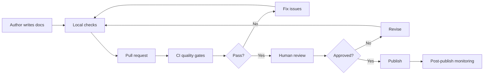
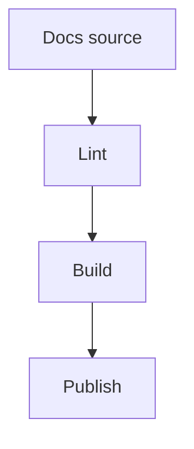
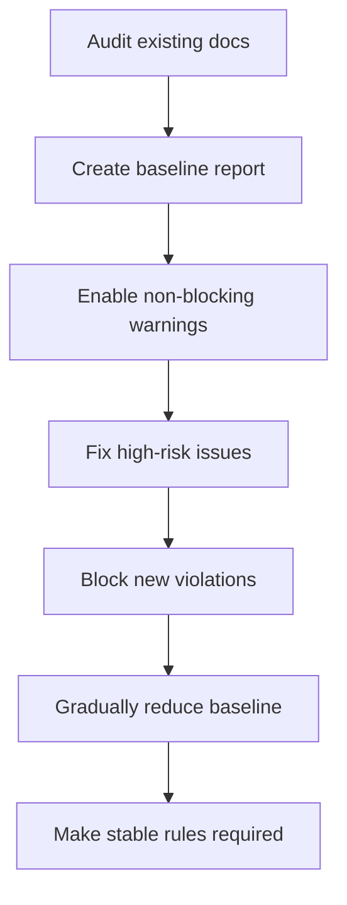
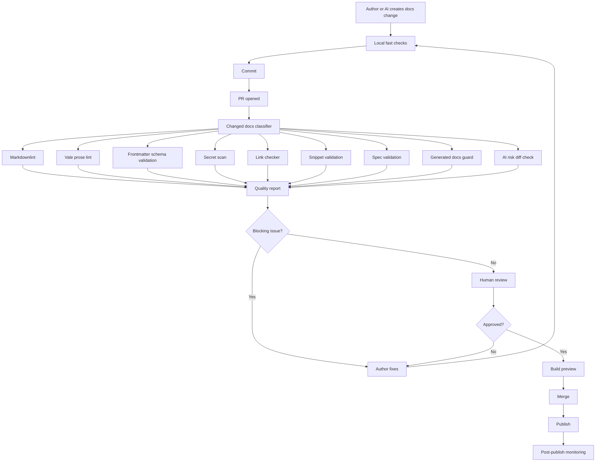

------
title: Learn AI-Driven Documentation and Technical Writing Implementation and Usage - Part 010
description: Prose linting and documentation quality gates using Vale, markdownlint, metadata validation, link checking, CI pipelines, AI-risk checks, and reviewable docs automation.
series: learn-ai-driven-documentation
seriesTitle: Learn AI-Driven Documentation and Technical Writing Implementation and Usage
order: 10
partTitle: Prose Linting and Documentation Quality Gates
tags:
- ai
- documentation
- technical-writing
- prose-linting
- vale
- markdownlint
- ci-cd
- docs-as-code
- quality-gates
date: 2026-06-30
---

# Part 010 — Prose Linting and Documentation Quality Gates

## 1. Target Pembelajaran

Part sebelumnya membahas engineering style guide. Sekarang kita mengubah style guide dari dokumen pasif menjadi **quality gate**.

Dalam engineering documentation system, kualitas tidak boleh bergantung hanya pada niat baik reviewer. Reviewer manusia penting, tetapi reviewer manusia mudah lelah, tidak konsisten, dan sering melewatkan hal-hal mekanis.

Quality gate membantu memastikan hal yang bisa dicek otomatis tidak membebani manusia.

Target part ini:

- Memahami prose linting sebagai “static analysis untuk tulisan”.
- Mendesain quality gate untuk Markdown/MDX documentation repository.
- Menggunakan Vale untuk terminology, style, dan wording rules.
- Menggunakan markdownlint untuk struktur Markdown.
- Menambahkan metadata validation, link checking, spell checking, snippet validation, dan generated-content guard.
- Mendesain CI pipeline yang tidak terlalu noisy tetapi cukup kuat untuk mencegah doc debt.
- Membuat policy untuk AI-generated docs: apa yang boleh auto-pass, apa yang wajib human review.

Prinsip utama:

```text
Do not ask humans to repeatedly catch what machines can catch reliably.
```

---

## 2. Prose Linting Bukan Grammar Checker

Grammar checker biasanya fokus pada grammar, spelling, dan readability umum.

Prose linter untuk engineering docs fokus pada hal yang lebih spesifik:

- istilah domain,
- forbidden terms,
- deprecated terms,
- style guide compliance,
- sentence length,
- heading conventions,
- warning wording,
- product naming,
- inclusive language,
- consistency,
- documentation-specific risk terms.

Perbedaan penting:

| Tool type | Fokus | Cocok untuk |
|---|---|---|
| Grammar checker | Grammar umum | Draft personal, editing ringan |
| Spell checker | Typo dan vocabulary | Semua docs |
| Markdown linter | Struktur Markdown | Docs-as-code CI |
| Prose linter | Style dan terminology | Engineering handbook |
| Link checker | Link integrity | Published docs |
| Snippet tester | Code correctness | Developer docs |
| Metadata validator | Frontmatter consistency | Search, publishing, AI retrieval |
| AI risk checker | Sensitive data dan unsafe generation | AI-assisted docs |

Prose linting tidak menggantikan technical review. Ia mengurangi noise agar reviewer manusia fokus pada correctness, judgment, dan domain risk.

---

## 3. Quality Gate Mental Model

Quality gate adalah checkpoint yang memutuskan apakah perubahan dokumentasi boleh lanjut ke tahap berikutnya.



Ada dua jenis quality gate:

1. **Pre-review gates**: menangkap masalah mekanis sebelum reviewer manusia membaca.
2. **Pre-publish gates**: memastikan dokumen yang sudah approved tetap buildable, linkable, dan valid.

Untuk AI-generated docs, tambahkan gate khusus:

```text
Generated content -> source verification -> risk check -> human review -> publish
```

---

## 4. Quality Gate Layers

Quality gate yang matang tidak hanya menjalankan satu linter. Ia punya beberapa layer.

| Layer | Check | Tooling example |
|---|---|---|
| File structure | file naming, folder placement | custom script |
| Frontmatter | required metadata, owner, lifecycle | schema validator |
| Markdown structure | headings, lists, code fences | markdownlint |
| Prose style | terminology, wording, claims | Vale |
| Spelling | domain-aware spell check | cspell |
| Links | broken links, anchors | lychee, markdown-link-check |
| Code snippets | compile/run examples | custom test, doctest |
| API specs | OpenAPI/AsyncAPI validity | spectral, parser |
| Diagrams | Mermaid syntax | mermaid CLI/build |
| AI safety | secrets, prompt artifacts, generated markers | secret scanner, custom checks |
| Publishing | static site build | docs platform build |
| Search/RAG | metadata, freshness, canonical docs | index validation |

Quality gate harus disusun dari checks yang paling murah ke paling mahal.

```text
Fast deterministic checks first.
Expensive semantic checks later.
Human review last.
```

---

## 5. Severity Model

Kesalahan umum adalah membuat semua lint issue menjadi blocker. Akibatnya CI noisy, developer frustrasi, lalu checks dimatikan.

Gunakan severity model:

| Severity | Meaning | Merge behavior |
|---|---|---|
| Error | High confidence, high impact | Block merge |
| Warning | Important but context-dependent | Requires review or justification |
| Suggestion | Style improvement | Non-blocking |
| Info | Learning signal | Non-blocking |

Contoh:

| Rule | Severity | Reason |
|---|---|---|
| Missing `owner` metadata | Error | Ownership required for lifecycle. |
| Broken internal link | Error | Published page will fail readers. |
| Forbidden term | Error | Policy violation. |
| Sentence over 35 words | Warning | Can be valid in some contexts. |
| Passive voice | Suggestion | Often okay when actor irrelevant. |
| Missing alt text | Error/Warning | Depends on accessibility policy. |
| AI-generated section without review marker | Error | Governance risk. |

Prinsip:

```text
Only block on rules with low false-positive rate and real risk.
```

---

## 6. Vale Foundation

Vale adalah prose linter yang membawa linting bergaya code ke tulisan. Ia dapat digunakan untuk mengecek konten terhadap style guide, vocabulary, dan custom rules.

### 6.1 Repository Layout

Struktur sederhana:

```text
repo/
  .vale.ini
  styles/
    Company/
      Avoid.yml
      Terms.yml
      Claims.yml
      Procedures.yml
      Headings.yml
    Vocab/
      Company/
        accept.txt
        reject.txt
  docs/
    ...
```

### 6.2 `.vale.ini`

Contoh baseline:

```ini
StylesPath = styles
MinAlertLevel = warning
Vocab = Company

[*.md]
BasedOnStyles = Company

[*.mdx]
BasedOnStyles = Company

[docs/generated/**]
BasedOnStyles = Company
MinAlertLevel = error
```

Catatan:

- `StylesPath` menunjuk folder rules.
- `BasedOnStyles` menentukan ruleset yang dipakai.
- `Vocab` menghubungkan accept/reject vocabulary.
- `MinAlertLevel` menentukan alert minimum yang ditampilkan.

### 6.3 Vocabulary

`styles/Vocab/Company/accept.txt`:

```text
AsyncAPI
OpenAPI
Docusaurus
MDX
frontmatter
idempotency
runbook
playbook
```

`styles/Vocab/Company/reject.txt`:

```text
blacklist
whitelist
sanity check
dummy
crazy
```

Vocabulary berguna untuk:

- menghindari false positives pada domain terms;
- menolak forbidden terms;
- menjaga consistency;
- mengurangi variasi istilah yang membuat AI retrieval buruk.

---

## 7. Vale Rule Patterns

Vale rules biasanya ditulis dalam YAML. Jangan mencoba membuat semua aturan sekaligus. Mulai dari rules yang paling bernilai.

### 7.1 Forbidden Terms

`styles/Company/ForbiddenTerms.yml`:

```yaml
extends: existence
message: "Avoid '%s'. Use approved terminology from the style guide."
level: error
ignorecase: true
tokens:
  - blacklist
  - whitelist
  - sanity check
```

Gunakan untuk policy-sensitive terms.

### 7.2 Deprecated Terms

```yaml
extends: substitution
message: "Use '%s' instead of '%s'."
level: warning
ignorecase: true
swap:
  micro-service: microservice
  repo: repository
  config: configuration
```

Hati-hati dengan substitution. Tidak semua sinonim aman diganti otomatis.

### 7.3 Absolute Claims

```yaml
extends: existence
message: "Avoid absolute claim '%s' unless the behavior is guaranteed and sourced."
level: warning
ignorecase: true
tokens:
  - always
  - never
  - guaranteed
  - seamless
  - instant
  - lossless
  - production-ready
  - audit-ready
```

Rule ini sebaiknya warning, bukan error, karena ada konteks valid.

### 7.4 Hype Words

```yaml
extends: existence
message: "Avoid hype word '%s'. Use precise technical language."
level: warning
ignorecase: true
tokens:
  - amazing
  - magic
  - magically
  - revolutionary
  - effortless
  - blazing fast
```

### 7.5 Weak Verbs

```yaml
extends: existence
message: "Consider replacing weak verb '%s' with a specific action."
level: suggestion
ignorecase: true
tokens:
  - handle
  - manage
  - deal with
  - take care of
```

Weak verbs tidak selalu salah, tetapi sering menyembunyikan behavior.

### 7.6 Long Sentences

```yaml
extends: occurrence
message: "Sentence is long. Consider splitting it for clarity."
level: suggestion
scope: sentence
max: 35
token: '\\b\\w+\\b'
```

Long sentence rule rawan false positive. Pakai sebagai suggestion.

---

## 8. Markdownlint Foundation

Markdownlint mengecek struktur Markdown. Ia sangat berguna untuk menjaga file tetap parseable oleh static site generator, search, dan AI chunker.

Contoh `.markdownlint.json`:

```json
{
  "default": true,
  "MD013": false,
  "MD033": false,
  "MD041": false,
  "MD024": {
    "siblings_only": true
  },
  "MD046": {
    "style": "fenced"
  }
}
```

Penjelasan contoh:

| Rule | Meaning | Reason |
|---|---|---|
| `MD013` | Line length | Sering tidak cocok untuk tables/URLs. |
| `MD033` | Inline HTML | Perlu dimatikan jika MDX/HTML digunakan. |
| `MD041` | First line heading | Frontmatter membuat ini noisy. |
| `MD024` | Duplicate headings | Batasi duplicate heading pada sibling. |
| `MD046` | Code block style | Fenced code block lebih konsisten. |

Untuk MDX, jangan memakai markdownlint secara buta. MDX punya syntax komponen yang bisa dianggap pelanggaran Markdown biasa.

---

## 9. Frontmatter Validation

Frontmatter adalah metadata contract. Tanpa metadata, documentation system sulit melakukan ownership, freshness, publishing, search, dan AI retrieval.

Contoh required fields:

```yaml
title: Configure retry policy
description: Configure retry behavior for transient failures.
owner: platform-runtime
docType: how-to
lifecycle: active
lastVerified: 2026-06-30
sourceOfTruth: runtime-config-schema
aiRetrievable: true
reviewRequired: technical
```

### 9.1 Schema

Contoh JSON Schema sederhana:

```json
{
  "$schema": "https://json-schema.org/draft/2020-12/schema",
  "type": "object",
  "required": [
    "title",
    "description",
    "owner",
    "docType",
    "lifecycle",
    "lastVerified"
  ],
  "properties": {
    "title": { "type": "string", "minLength": 8 },
    "description": { "type": "string", "minLength": 20 },
    "owner": { "type": "string", "pattern": "^[a-z0-9-]+$" },
    "docType": {
      "enum": ["tutorial", "how-to", "reference", "explanation", "runbook", "adr", "release-note"]
    },
    "lifecycle": {
      "enum": ["draft", "active", "deprecated", "archived"]
    },
    "lastVerified": { "type": "string", "format": "date" },
    "aiRetrievable": { "type": "boolean" },
    "reviewRequired": {
      "enum": ["none", "editorial", "technical", "security", "compliance"]
    }
  }
}
```

### 9.2 Metadata Validation Script

Pseudo-implementation:

```js
import fs from 'node:fs';
import matter from 'gray-matter';
import Ajv from 'ajv';
import addFormats from 'ajv-formats';

const ajv = new Ajv({ allErrors: true });
addFormats(ajv);

const schema = JSON.parse(fs.readFileSync('docs.schema.json', 'utf8'));
const validate = ajv.compile(schema);

for (const file of findMarkdownFiles('docs')) {
  const raw = fs.readFileSync(file, 'utf8');
  const parsed = matter(raw);

  if (!validate(parsed.data)) {
    console.error(file, validate.errors);
    process.exitCode = 1;
  }
}
```

Metadata validation sebaiknya error-level karena sangat deterministik.

---

## 10. Link Checking

Broken links merusak trust. Untuk internal docs, broken link juga bisa berarti source-of-truth berubah tanpa migration.

Link checks:

- internal relative links,
- heading anchors,
- image paths,
- external links,
- redirects,
- forbidden external domains,
- links to archived docs,
- links to generated docs.

### 10.1 Link Policy

| Link type | Policy |
|---|---|
| Internal docs link | Must pass. |
| Anchor link | Must pass. |
| External official source | Warn on failure; external sites can be flaky. |
| External random blog | Warn or require justification. |
| Private system link | Require access note. |
| Archived doc link | Error unless intentionally referencing historical context. |

### 10.2 Link Context

Untuk internal docs, jangan hanya tulis:

```mdx
See [here](../setup.md).
```

Tulis:

```mdx
See [Set up the local documentation environment](../setup.md).
```

Descriptive link text membantu accessibility, search, dan AI retrieval.

---

## 11. Spell Checking with Domain Vocabulary

Spell checker tanpa domain vocabulary akan noisy.

Gunakan `cspell` atau tool setara dengan dictionary domain.

Contoh `cspell.json`:

```json
{
  "version": "0.2",
  "language": "en",
  "words": [
    "AsyncAPI",
    "Docusaurus",
    "frontmatter",
    "idempotency",
    "OpenAPI",
    "runbook"
  ],
  "ignorePaths": [
    "docs/generated/**",
    "node_modules/**",
    "build/**"
  ]
}
```

Spell checking cocok sebagai warning di awal, lalu bisa naik menjadi error setelah dictionary stabil.

---

## 12. AI-Generated Content Gates

AI-generated docs butuh gate khusus karena risiko utamanya bukan hanya typo, tetapi truth.

### 12.1 Generated Content Marker

Setiap halaman yang mengandung AI-generated content harus punya metadata:

```yaml
aiAssisted: true
aiReviewStatus: pending | reviewed | rejected
aiSourceInputs:
  - docs/adr/0012-docs-platform.mdx
  - specs/openapi/public-api.yaml
reviewRequired: technical
```

### 12.2 Gate Rules

| Rule | Severity |
|---|---|
| `aiAssisted: true` but `aiReviewStatus` missing | Error |
| `aiReviewStatus: reviewed` but reviewer missing | Error |
| AI-generated runbook without technical review | Error |
| AI-generated security/compliance claims | Error until approved |
| AI-generated code example without status | Warning/Error |
| AI prompt transcript accidentally committed | Error |
| Secret-like token in AI draft | Error |

### 12.3 AI Draft Diff Heuristics

Custom checks can detect risky modifications:

- warning block removed,
- limitation section removed,
- `should` changed to `must`,
- `may` changed to `will`,
- “not supported” removed,
- new API behavior added,
- new security claim added,
- new compliance claim added,
- code block added without test status.

These checks are not perfect, but they guide reviewers to dangerous diffs.

---

## 13. Secret and Sensitive Data Scanning

Documentation often leaks:

- access tokens,
- API keys,
- internal URLs,
- customer identifiers,
- real emails,
- stack traces with sensitive paths,
- production incident details,
- credentials in screenshots,
- private prompts.

Use secret scanning in docs pipeline.

Policy:

```text
Documentation is not exempt from security scanning.
```

Examples should use placeholders:

```text
<ACCESS_TOKEN>
<PROJECT_ID>
<CUSTOMER_ID>
<REDACTED>
```

Not:

```text
eyJhbGciOiJIUzI1NiIsInR5cCI6IkpXVCJ9...
```

For AI-assisted docs, sensitive data scanning is mandatory because users may paste logs or real examples into drafts.

---

## 14. Snippet and Example Validation

Developer docs lose trust when examples fail.

Classify snippets:

| Snippet type | Validation |
|---|---|
| Shell command | Run in fixture or dry-run where possible. |
| JSON | Parse. |
| YAML | Parse. |
| OpenAPI | Validate spec. |
| AsyncAPI | Validate spec. |
| JavaScript/TypeScript | Typecheck or compile. |
| Java | Compile or test. |
| SQL | Parse or run against test DB. |
| Mermaid | Render or parse. |
| Pseudocode | Mark explicitly. |

### 14.1 Code Fence Metadata

```mdx
```json title="Example metadata" status="validated"
{
  "docType": "how-to",
  "lifecycle": "active"
}
```
```

If status is missing, CI can warn:

```text
DOCS_SNIPPET_MISSING_STATUS: Code block must declare whether it is tested, validated, illustrative, or pseudocode.
```

### 14.2 Mermaid Validation

Mermaid diagrams should be validated during build or CI because one broken diagram can break page rendering.

Example:



---

## 15. Documentation Build Gate

Static site build is a quality gate.

It catches:

- broken MDX syntax,
- invalid imports,
- missing components,
- duplicate routes,
- broken sidebar config,
- invalid frontmatter in some platforms,
- invalid Mermaid syntax depending on integration,
- broken versioning configuration.

Recommended pipeline order:

```text
format/lint -> metadata -> prose -> links -> snippets -> build -> preview -> review
```

Do not wait until publish to run build.

---

## 16. CI Pipeline Design

### 16.1 GitHub Actions Example

```yaml
name: docs-quality

on:
  pull_request:
    paths:
      - 'docs/**'
      - '.vale.ini'
      - 'styles/**'
      - '.markdownlint.json'
      - 'package.json'
      - 'docs.schema.json'

jobs:
  docs-quality:
    runs-on: ubuntu-latest

    steps:
      - name: Checkout
        uses: actions/checkout@v4

      - name: Setup Node
        uses: actions/setup-node@v4
        with:
          node-version: 22

      - name: Install dependencies
        run: npm ci

      - name: Markdown lint
        run: npm run docs:lint:markdown

      - name: Prose lint
        run: npm run docs:lint:prose

      - name: Validate metadata
        run: npm run docs:validate:metadata

      - name: Check links
        run: npm run docs:check:links

      - name: Validate snippets
        run: npm run docs:validate:snippets

      - name: Build documentation site
        run: npm run docs:build
```

### 16.2 `package.json` Scripts

```json
{
  "scripts": {
    "docs:lint:markdown": "markdownlint 'docs/**/*.{md,mdx}'",
    "docs:lint:prose": "vale docs",
    "docs:validate:metadata": "node scripts/validate-docs-metadata.js",
    "docs:check:links": "node scripts/check-links.js",
    "docs:validate:snippets": "node scripts/validate-snippets.js",
    "docs:build": "docusaurus build"
  }
}
```

Sesuaikan command dengan platform yang dipilih.

---

## 17. Local Developer Workflow

CI saja tidak cukup. Author harus bisa menjalankan checks lokal.

Recommended workflow:

```bash
npm run docs:lint:markdown
npm run docs:lint:prose
npm run docs:validate:metadata
npm run docs:build
```

Untuk ergonomics:

```bash
npm run docs:check
```

`package.json`:

```json
{
  "scripts": {
    "docs:check": "npm run docs:lint:markdown && npm run docs:lint:prose && npm run docs:validate:metadata && npm run docs:build"
  }
}
```

Tambahkan pre-commit hook hanya untuk checks cepat. Jangan jalankan build berat di pre-commit jika membuat author frustrasi.

---

## 18. PR Feedback Design

Quality gate yang baik memberi feedback yang actionable.

Bad feedback:

```text
Lint failed.
```

Good feedback:

```text
docs/runbooks/retry-worker.mdx:42
Avoid absolute claim "always" unless the behavior is guaranteed and sourced.
Suggested fix: Scope the claim by condition or version.
```

Feedback harus menjawab:

- file mana,
- line berapa,
- rule apa,
- kenapa penting,
- cara memperbaiki,
- apakah blocking.

Untuk AI-assisted docs, feedback harus membantu reviewer:

```text
AI_RISK_WARNING_REMOVED:
This PR removes a warning block from a page marked as operational runbook.
A technical reviewer must confirm that the warning is no longer needed.
```

---

## 19. Baseline Strategy for Existing Repositories

Jika repository sudah punya banyak docs lama, jangan langsung enforce semua rules sebagai error. Itu akan menghasilkan ribuan failures.

Gunakan staged rollout:



### 19.1 Baseline File

Contoh `docs-quality-baseline.json`:

```json
{
  "acceptedExistingViolations": [
    {
      "file": "docs/legacy/setup.mdx",
      "rule": "Company.AbsoluteClaims",
      "count": 3,
      "expires": "2026-09-30"
    }
  ]
}
```

Prinsip:

```text
Do not block the organization because old docs are messy.
Block new mess and burn down old mess intentionally.
```

---

## 20. Quality Gate for Generated Docs

Generated docs punya aturan berbeda dari authored docs.

Generated docs biasanya berasal dari:

- OpenAPI spec,
- AsyncAPI spec,
- code comments,
- schema files,
- CLI help output,
- Terraform/provider metadata,
- database schema,
- event catalog.

Rules:

| Rule | Reason |
|---|---|
| Generated docs must not be manually edited. | Edits akan hilang saat regeneration. |
| Generated docs must include source reference. | Traceability. |
| Generated docs must include generation timestamp/version. | Freshness. |
| Generated docs should be excluded from some prose rules. | Output generator mungkin tidak mengikuti style. |
| Generated docs must pass build/link checks. | Published output tetap harus valid. |

Metadata example:

```yaml
generated: true
generator: openapi-docgen
generatorVersion: 2.4.1
source: specs/public-api.yaml
lastGenerated: 2026-06-30
manualEditsAllowed: false
```

CI check:

```text
If generated: true and file changed manually without source spec change, fail PR.
```

---

## 21. Documentation Quality Score

Quality score membantu observability, tetapi jangan jadikan angka sebagai tujuan sempit.

Possible metrics:

| Metric | Meaning |
|---|---|
| lint error count | Mechanical quality. |
| broken link count | Navigability. |
| stale page count | Freshness. |
| pages without owner | Governance gap. |
| AI-assisted unreviewed pages | AI governance risk. |
| pages without docType | IA/search issue. |
| code snippets unvalidated | Developer trust risk. |
| pages with missing prerequisites | Task success risk. |
| search zero-result rate | Findability gap. |
| docs PR review latency | Operating model health. |

Avoid vanity metrics:

- number of pages,
- total words,
- AI-generated word count,
- style warnings without impact.

Quality score should drive maintenance decisions, not gamification.

---

## 22. Human Review Remains Necessary

Automation cannot fully verify:

- technical correctness,
- causal explanations,
- architecture trade-offs,
- operational safety,
- legal/compliance defensibility,
- product intent,
- migration risk,
- incident interpretation,
- whether the doc solves the reader’s real task.

Use automation to protect reviewer attention.

```text
Machines check consistency.
Humans check truth, judgment, and impact.
```

---

## 23. Recommended Quality Gate Policy

### 23.1 Error-Level Gates

Block merge when:

- docs site fails to build;
- required metadata missing;
- owner missing;
- internal links broken;
- forbidden terms appear;
- secrets detected;
- generated docs manually edited;
- AI-assisted high-risk docs lack review status;
- API/event spec docs fail parser validation;
- Mermaid diagrams break build;
- MDX syntax invalid.

### 23.2 Warning-Level Gates

Warn when:

- absolute claim appears;
- deprecated term appears;
- sentence too long;
- code block lacks status;
- external link fails;
- page is close to stale threshold;
- no troubleshooting section in operational doc;
- no verification section in how-to/runbook;
- AI-generated draft introduces new unverified claims.

### 23.3 Suggestion-Level Gates

Suggest when:

- passive voice appears;
- heading is generic;
- paragraph is long;
- link text is weak;
- table may be clearer than prose;
- examples can be simplified.

---

## 24. End-to-End Reference Pipeline



---

## 25. Anti-Patterns

### 25.1 Linter as Taste Enforcer

Symptom:

```text
PRs fail because of subjective style preferences.
```

Fix:

```text
Only block rules tied to correctness, consistency, policy, accessibility, security, or publishing health.
```

### 25.2 No Local Reproduction

Symptom:

```text
CI fails but authors cannot reproduce locally.
```

Fix:

```text
Every CI check must have a documented local command.
```

### 25.3 Too Many False Positives

Symptom:

```text
Teams ignore warnings or add broad disables.
```

Fix:

```text
Tune rules, lower severity, add vocabulary, or split contexts.
```

### 25.4 Treating AI Drafts as Normal Docs

Symptom:

```text
AI-generated behavior claims merge without source verification.
```

Fix:

```text
Use AI metadata, review status, diff risk checks, and source verification gates.
```

### 25.5 Generated Docs Mixed with Authored Docs

Symptom:

```text
Manual edits disappear after regeneration.
```

Fix:

```text
Separate generated docs and block manual edits unless source changes.
```

---

## 26. Practical Implementation Checklist

Use this checklist to implement quality gates in a real repository.

```mdx
## Documentation quality gate checklist

Repository setup:
- [ ] Add `.vale.ini`.
- [ ] Add company Vale styles.
- [ ] Add vocabulary accept/reject lists.
- [ ] Add `.markdownlint.json`.
- [ ] Add frontmatter schema.
- [ ] Add link checker.
- [ ] Add spell checker with domain vocabulary.
- [ ] Add docs build command.

AI governance:
- [ ] Add `aiAssisted` metadata.
- [ ] Add `aiReviewStatus` metadata.
- [ ] Add generated content markers.
- [ ] Add secret scanning.
- [ ] Add risky diff checks for warning/limitation removal.

CI:
- [ ] Run fast deterministic checks first.
- [ ] Produce actionable PR feedback.
- [ ] Block only high-confidence errors.
- [ ] Keep noisy checks as warnings.
- [ ] Document local reproduction commands.

Operating model:
- [ ] Define rule owners.
- [ ] Define exception process.
- [ ] Define baseline strategy for legacy docs.
- [ ] Track quality metrics.
```

---

## 27. Practice Plan

### Hour 1–2: Install Baseline Tools

Set up:

- markdownlint,
- Vale,
- cspell,
- docs build command.

Run against a small docs folder.

### Hour 3–5: Create Vocabulary

Create:

- 30 accepted terms,
- 10 rejected terms,
- 10 deprecated terms.

Tune false positives.

### Hour 6–8: Add Five High-Value Vale Rules

Start with:

- forbidden terms,
- deprecated terms,
- absolute claims,
- hype words,
- weak verbs.

### Hour 9–11: Add Metadata Validation

Define required frontmatter fields and validate them.

### Hour 12–14: Add Link and Build Checks

Ensure PRs fail on broken internal links and broken site build.

### Hour 15–17: Add AI-Specific Checks

Detect:

- missing AI review status,
- removed warning blocks,
- added unverified claims,
- generated docs edited manually.

### Hour 18–20: Tune Severity and Rollout

Create staged rollout:

- warnings first,
- errors for new violations,
- baseline old violations,
- measure trends.

Output:

```text
A CI-backed documentation quality gate that protects correctness, consistency, and AI governance.
```

---

## 28. Self-Assessment

You understand this part if you can:

- explain why prose linting is not the same as grammar checking;
- design a severity model that avoids noisy CI;
- configure Vale for terminology and style rules;
- configure markdownlint for Markdown/MDX structure;
- validate frontmatter metadata;
- design AI-generated content gates;
- choose which rules should block merge and which should warn;
- implement a staged rollout for legacy docs;
- explain why human review remains necessary after automation.

---

## 29. Key Takeaways

- Quality gates turn documentation standards into repeatable engineering controls.
- Vale is useful for prose, terminology, and style guide enforcement.
- Markdownlint protects structure and parseability.
- Metadata validation is essential for ownership, lifecycle, search, publishing, and AI retrieval.
- AI-generated docs need special gates because the core risk is unsupported truth, not grammar.
- CI should block high-confidence, high-impact issues and warn on judgment-heavy issues.
- Automation should protect human reviewer attention, not replace human judgment.

---

## 30. Next Part

Part berikutnya membahas **Review Workflow and Editorial Governance**.

Kita akan mendesain bagaimana documentation PR direview, siapa yang approve apa, bagaimana technical accuracy review berbeda dari editorial review, bagaimana exception dikelola, dan bagaimana documentation governance dibuat scalable tanpa membuat delivery lambat.
