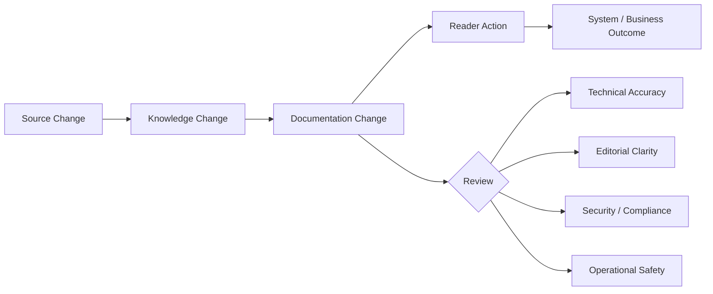
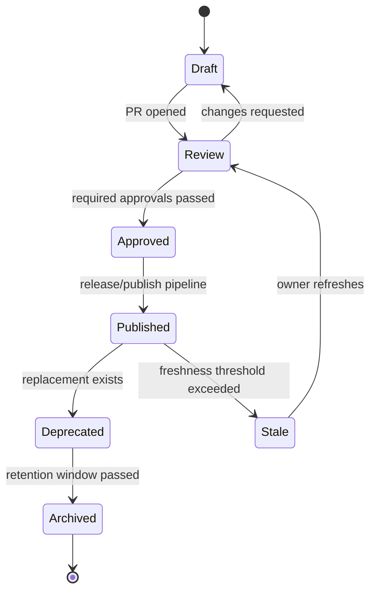
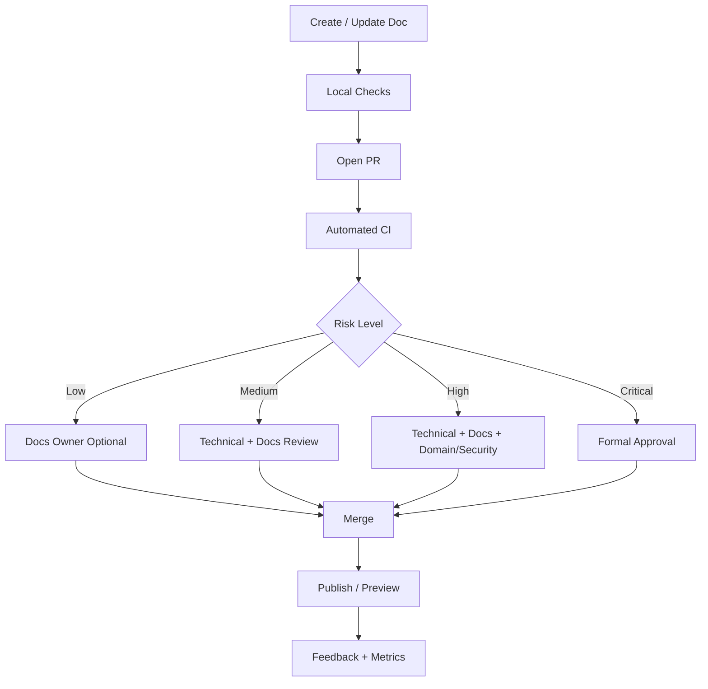

------
title: Learn AI-Driven Documentation and Technical Writing Implementation and Usage - Part 011
description: Review workflow and editorial governance for AI-assisted technical documentation, including ownership, review roles, lifecycle states, policy gates, escalation, metrics, and operating model.
series: learn-ai-driven-documentation
seriesTitle: Learn AI-Driven Documentation and Technical Writing Implementation and Usage
order: 11
partTitle: Review Workflow and Editorial Governance
tags:
- ai
- documentation
- technical-writing
- governance
- docs-as-code
- review-workflow
- editorial-review
- engineering-handbook
- quality-gates
date: 2026-06-30
---

# Part 011 — Review Workflow and Editorial Governance

## 1. Target Pembelajaran

Pada part sebelumnya kita membuat style guide dan quality gates. Sekarang kita masuk ke aspek yang sering gagal di organisasi besar: **review workflow dan governance**.

Dokumentasi yang baik bukan hanya hasil tulisan bagus. Dokumentasi yang baik adalah hasil dari sistem yang membuat perubahan dokumentasi:

- punya owner,
- punya source of truth,
- punya review path,
- punya lifecycle,
- punya audit trail,
- punya feedback loop,
- punya standar risiko,
- dan punya mekanisme perbaikan saat stale atau salah.

Target part ini:

- Mendesain workflow review dokumentasi seperti software delivery.
- Membedakan technical review, editorial review, product review, security review, dan compliance review.
- Menentukan approval model berdasarkan risiko dokumen.
- Mendesain lifecycle state untuk dokumentasi internal dan eksternal.
- Menangani AI-generated documentation secara aman.
- Membuat governance yang ringan, tidak birokratis, tetapi cukup kuat untuk enterprise-scale engineering.
- Membuat checklist dan policy yang bisa langsung diterapkan di repository docs-as-code.

Prinsip utama:

```text
Documentation quality is not produced by writing effort alone.
It is produced by ownership, review discipline, automation, and lifecycle control.
```

---

## 2. Mengapa Review Dokumentasi Berbeda dari Review Kode

Code review biasanya menilai:

- correctness,
- maintainability,
- security,
- performance,
- compatibility,
- test coverage,
- observability,
- API impact.

Documentation review menilai hal yang sebagian mirip, tetapi tidak identik:

- apakah instruksi benar,
- apakah asumsi pembaca valid,
- apakah dokumen selaras dengan source of truth,
- apakah contoh masih berjalan,
- apakah warning cukup jelas,
- apakah istilah konsisten,
- apakah scope dokumen tepat,
- apakah dokumen menyebabkan pembaca mengambil tindakan salah,
- apakah dokumen membocorkan informasi sensitif,
- apakah dokumen akan tetap benar setelah release berikutnya.

Dokumentasi punya failure mode yang unik: **ia bisa tampak benar walaupun salah**.

Contoh:

```mdx
To rotate the service token, update the TOKEN_SECRET environment variable and restart the service.
```

Kalimat ini terlihat jelas. Tetapi bisa salah jika:

- token seharusnya dirotasi lewat secret manager,
- restart manual menyebabkan downtime,
- environment variable sudah deprecated,
- ada multi-region propagation delay,
- ada approval security yang wajib dilakukan,
- service memakai cached credential,
- proses rollback tidak disebutkan.

Review dokumentasi harus mengejar **action safety**, bukan hanya readability.

---

## 3. Mental Model: Documentation Review as Risk Control

Review dokumen adalah kontrol risiko terhadap perubahan pengetahuan.



Kita tidak mereview kata demi kata karena perfeksionisme. Kita mereview karena pembaca akan menggunakan dokumen untuk mengambil keputusan.

Dalam engineering environment, pembaca bisa melakukan aksi high-impact:

- deploy service,
- migrate database,
- rotate credential,
- publish API,
- change workflow state,
- execute incident playbook,
- onboard integration partner,
- configure access control,
- interpret regulatory status,
- generate customer-facing communication.

Semakin besar dampak aksi pembaca, semakin kuat review yang dibutuhkan.

---

## 4. Lima Jenis Review Dokumentasi

### 4.1 Technical Accuracy Review

Tujuan: memastikan isi dokumen benar secara teknis.

Reviewer ideal:

- subject matter expert,
- maintainer service,
- API owner,
- platform owner,
- engineer yang baru saja mengubah sistem terkait.

Yang dicek:

- instruksi benar,
- parameter benar,
- contoh valid,
- diagram sesuai arsitektur aktual,
- error scenario benar,
- batasan tidak dihilangkan,
- versi yang disebutkan tepat,
- source of truth jelas.

Pertanyaan review:

```text
If a competent engineer follows this document exactly, will the resulting action be correct and safe?
```

### 4.2 Editorial Review

Tujuan: memastikan dokumen bisa dipahami dengan effort rendah.

Reviewer ideal:

- technical writer,
- docs maintainer,
- engineer dengan sensitivitas komunikasi tinggi,
- developer advocate,
- platform enablement engineer.

Yang dicek:

- struktur,
- heading,
- flow,
- terminology,
- procedure style,
- scannability,
- examples,
- warning placement,
- duplicate content,
- mixed-mode docs smell.

Pertanyaan review:

```text
Can the target reader find, understand, and apply this document without unnecessary cognitive load?
```

### 4.3 Product / Domain Review

Tujuan: memastikan dokumen selaras dengan behavior produk, domain model, dan user journey.

Reviewer ideal:

- product owner,
- domain analyst,
- solution architect,
- support lead,
- implementation consultant.

Yang dicek:

- terminology domain,
- user flow,
- business rules,
- entitlement,
- state transition,
- edge case,
- limitations,
- migration impact,
- support escalation.

Pertanyaan review:

```text
Does this document describe the product/domain behavior the way users actually experience it?
```

### 4.4 Security and Privacy Review

Tujuan: memastikan dokumen tidak memperbesar risiko keamanan.

Reviewer ideal:

- security engineer,
- privacy officer,
- platform security owner,
- compliance reviewer.

Yang dicek:

- secrets,
- tokens,
- credentials,
- internal URLs,
- attack paths,
- excessive permissions,
- unsafe workarounds,
- prompt injection risk,
- sensitive screenshots,
- customer data leakage,
- undocumented security boundary.

Pertanyaan review:

```text
Could this document help the wrong actor, leak protected information, or encourage unsafe operation?
```

### 4.5 Compliance / Audit Review

Tujuan: memastikan dokumen defensible dan bisa diaudit.

Reviewer ideal:

- compliance lead,
- legal/policy reviewer,
- audit owner,
- risk manager,
- regulated process owner.

Yang dicek:

- approval history,
- required disclaimers,
- evidence trail,
- responsibility boundaries,
- retention policy,
- regulated terminology,
- policy alignment,
- version history,
- formal decision records.

Pertanyaan review:

```text
If this document is inspected after an incident or audit, can we defend why it said what it said?
```

---

## 5. Risk-Based Review Model

Tidak semua dokumen butuh review yang sama. Kalau semua perubahan kecil butuh lima approval, sistem akan macet. Kalau semua perubahan bebas merge, sistem akan rusak.

Gunakan model berbasis risiko.

| Risk level | Contoh dokumen | Required review |
|---|---|---|
| Low | typo, formatting, internal glossary minor update | automated checks + docs owner optional |
| Medium | how-to internal, onboarding, setup guide | technical review + docs owner |
| High | runbook, migration guide, API behavior, security config | technical review + docs owner + domain/security as needed |
| Critical | regulated procedure, incident response, customer-facing commitment, audit evidence | technical + editorial + security/compliance + explicit approval |

Rule sederhana:

```text
Review depth should follow reader action risk, not document length.
```

Dokumen pendek bisa critical. Dokumen panjang bisa low-risk.

---

## 6. Documentation Lifecycle States

Dokumentasi enterprise perlu lifecycle. Tanpa lifecycle, repository akan penuh dokumen yang tidak jelas statusnya.

Gunakan state berikut:

| State | Meaning | Reader expectation |
|---|---|---|
| Draft | Sedang ditulis, belum siap dipakai | Jangan dipakai untuk keputusan produksi |
| Review | Menunggu validasi | Bisa dibaca, belum authoritative |
| Approved | Sudah disetujui | Aman dipakai sesuai scope |
| Published | Tersedia untuk target audience | Authoritative untuk audience tersebut |
| Deprecated | Masih ada tetapi akan diganti | Gunakan alternatif yang ditunjuk |
| Archived | Tidak lagi dipakai | Historical only |
| Stale | Melewati freshness threshold | Perlu verifikasi sebelum dipakai |

State machine:



State harus muncul di metadata, bukan hanya di pikiran maintainer.

Contoh frontmatter:

```yaml
docStatus: approved
owner: platform-docs
technicalOwner: payments-platform
reviewers:
  technical:
    - team-payments-platform
  editorial:
    - team-docs
riskLevel: high
lastReviewed: 2026-06-30
reviewCadenceDays: 90
sourceOfTruth:
  - type: openapi
    path: specs/payments/openapi.yaml
  - type: service
    repo: payments-service
```

---

## 7. Ownership Model

Dokumentasi tanpa owner akan menjadi sampah historis.

Ada beberapa ownership role yang perlu dipisahkan.

| Role | Tanggung jawab |
|---|---|
| Author | Menulis atau mengubah dokumen |
| Technical owner | Menjamin kebenaran teknis |
| Docs owner | Menjamin struktur, style, dan maintainability |
| Domain owner | Menjamin kesesuaian behavior bisnis/domain |
| Security owner | Menilai risiko security/privacy |
| Approver | Memberi approval final untuk risk level tertentu |
| Steward | Mengawasi kesehatan dokumentasi lintas repo |

Anti-pattern umum:

```text
The person who wrote the document is treated as the long-term owner forever.
```

Itu tidak scalable. Ownership harus melekat pada sistem/domain, bukan hanya individu.

Lebih baik:

```yaml
owner: team-identity-platform
steward: team-engineering-enablement
```

---

## 8. CODEOWNERS untuk Documentation Review

Dalam docs-as-code, gunakan CODEOWNERS agar review path otomatis.

Contoh:

```txt
# Global docs ownership
/docs/**                         @engineering-enablement/docs

# Platform docs
/docs/platform/identity/**        @identity-platform @engineering-enablement/docs
/docs/platform/payments/**        @payments-platform @engineering-enablement/docs

# Security-sensitive docs
/docs/security/**                 @security-engineering @engineering-enablement/docs
/docs/runbooks/secrets/**         @security-engineering @sre-platform

# API docs
/specs/openapi/**                 @api-platform @engineering-enablement/docs
/specs/asyncapi/**                @event-platform @engineering-enablement/docs

# Regulated process docs
/docs/compliance/**               @risk-compliance @domain-architecture
```

CODEOWNERS bukan governance lengkap. Ia hanya routing review. Tetap butuh policy tentang kapan approval wajib, apa yang harus dicek, dan bagaimana exception ditangani.

---

## 9. Pull Request Workflow untuk Dokumentasi

Workflow ideal:



Minimum PR checks:

- frontmatter valid,
- markdownlint pass,
- Vale pass or justified waiver,
- links valid,
- snippets valid where applicable,
- generated content marker valid,
- source-of-truth references exist,
- required review labels present,
- risk-level policy satisfied.

---

## 10. PR Template untuk Documentation Change

Gunakan template yang memaksa author menyatakan risiko dan source.

```md
## What changed?

Describe the documentation change in one or two sentences.

## Why?

Explain the problem, release, incident, product change, or feedback that triggered this update.

## Target reader

- [ ] New engineer
- [ ] Service maintainer
- [ ] SRE/on-call
- [ ] API consumer
- [ ] Product/domain user
- [ ] Auditor/compliance reviewer
- [ ] Other: ...

## Doc type

- [ ] Tutorial
- [ ] How-to
- [ ] Reference
- [ ] Explanation
- [ ] Runbook
- [ ] ADR
- [ ] Release/migration note

## Risk level

- [ ] Low
- [ ] Medium
- [ ] High
- [ ] Critical

## Source of truth

Link to code, spec, ADR, issue, incident report, or release note.

## AI usage

- [ ] No AI assistance
- [ ] AI used for outline
- [ ] AI used for rewrite/editing
- [ ] AI used to generate draft from source material
- [ ] AI used to summarize source material

If AI was used, describe what was verified manually.

## Verification

- [ ] I checked commands/examples
- [ ] I checked links
- [ ] I checked version-specific behavior
- [ ] I checked screenshots/diagrams
- [ ] I checked security-sensitive content
- [ ] Not applicable

## Reviewer notes

Call out areas that need special attention.
```

Template ini mengurangi reviewer ambiguity.

---

## 11. Review Checklist: Technical Reviewer

Technical reviewer tidak perlu mengedit gaya bahasa kecuali mengganggu correctness. Fokusnya adalah kebenaran dan risiko.

Checklist:

- Apakah instruksi menghasilkan outcome yang benar?
- Apakah precondition lengkap?
- Apakah required permission disebutkan?
- Apakah command/config/example sesuai versi saat ini?
- Apakah fallback/rollback disebutkan bila perlu?
- Apakah failure mode dijelaskan?
- Apakah limitation jelas?
- Apakah warning ditempatkan sebelum tindakan berisiko?
- Apakah dokumen tidak bertentangan dengan source of truth?
- Apakah diagram sesuai arsitektur aktual?
- Apakah AI-generated summary tidak mengubah makna?

Contoh komentar review yang buruk:

```text
This section is confusing.
```

Contoh komentar review yang baik:

```text
This step says to restart the service after updating TOKEN_SECRET. In production, the service reads secrets from Vault and reloads every 5 minutes. Please replace this with the Vault rotation flow and mention the propagation delay.
```

Komentar baik menyebut:

- bagian yang salah,
- alasan teknis,
- perubahan yang diharapkan.

---

## 12. Review Checklist: Editorial Reviewer

Editorial reviewer menjaga clarity dan usability.

Checklist:

- Apakah judul mencerminkan task atau konsep utama?
- Apakah target reader jelas?
- Apakah dokumen mulai dari konteks yang cukup?
- Apakah pembaca tahu kapan dokumen ini dipakai?
- Apakah procedure memakai imperative verbs?
- Apakah step terlalu panjang?
- Apakah warning muncul sebelum tindakan berisiko?
- Apakah istilah konsisten dengan glossary?
- Apakah ada mixed-mode smell?
- Apakah contoh membantu, bukan sekadar dekorasi?
- Apakah bagian reference tidak tercampur dengan explanation panjang?
- Apakah dokumen bisa discan dari heading saja?
- Apakah AI-generated text terdengar terlalu generic?

Editorial review bukan mempercantik tulisan. Editorial review mengurangi cognitive load.

---

## 13. Review Checklist: Security Reviewer

Security reviewer perlu mencari hal yang sering tidak terlihat oleh author.

Checklist:

- Apakah ada secret, token, API key, cookie, session ID, private URL?
- Apakah screenshot menampilkan customer data, internal hostname, email, ID sensitif?
- Apakah dokumen memberi instruksi bypass security control?
- Apakah permission yang disarankan terlalu luas?
- Apakah contoh policy terlalu permissive?
- Apakah runbook mengandung command destructive tanpa guardrail?
- Apakah dokumen expose internal architecture yang tidak perlu untuk audience eksternal?
- Apakah AI-generated content memasukkan informasi dari source yang tidak boleh dipublikasikan?
- Apakah prompt atau retrieved context bisa mengandung malicious instruction?
- Apakah redaction dilakukan sebelum publish?

Security review harus diarahkan oleh audience.

Dokumen internal boleh punya informasi operasional lebih banyak daripada dokumen publik. Tetapi internal bukan berarti bebas. Internal docs tetap perlu least privilege.

---

## 14. Review Checklist: Compliance Reviewer

Compliance reviewer menjaga defensibility.

Checklist:

- Apakah policy statement sesuai wording resmi?
- Apakah responsibility boundary jelas?
- Apakah approval history tersimpan?
- Apakah effective date dan review cadence ada?
- Apakah dokumen membedakan requirement, recommendation, dan example?
- Apakah dokumen menyebut evidence yang dibutuhkan?
- Apakah exception path jelas?
- Apakah retention requirement terpenuhi?
- Apakah istilah regulated dipakai secara konsisten?
- Apakah ada overclaim yang bisa menjadi liability?

Contoh overclaim:

```text
This process guarantees full compliance.
```

Lebih defensible:

```text
This process is designed to support the control requirements listed in the linked policy. Compliance evidence must be reviewed through the approval workflow before closure.
```

---

## 15. AI-Assisted Documentation Review Policy

AI boleh membantu dokumentasi, tetapi governance harus jelas.

Gunakan policy berikut:

| AI activity | Allowed? | Human responsibility |
|---|---:|---|
| Outline dari source material | Ya | Validate scope dan structure |
| Rewrite untuk clarity | Ya | Validate meaning preserved |
| Summarize PR/release notes | Ya | Validate factual accuracy |
| Generate examples | Terbatas | Run/test examples |
| Generate runbook steps | Terbatas | SME must verify every step |
| Generate security guidance | Terbatas | Security review required |
| Generate compliance statement | Terbatas | Compliance approval required |
| Publish without review | Tidak | N/A |
| Invent undocumented behavior | Tidak | N/A |

Policy utama:

```text
AI can assist expression, structure, extraction, and transformation.
AI cannot be the authority for truth.
```

Jika AI menghasilkan draft, PR harus menyatakan:

- model/tool yang digunakan bila policy organisasi mengharuskan,
- source material yang diberikan,
- bagian yang diverifikasi,
- bagian yang masih perlu SME review,
- apakah ada redaction,
- apakah ada content dari private source.

---

## 16. AI Review Assistant: Batas Aman

AI reviewer bisa membantu menemukan masalah, tetapi tidak boleh menjadi satu-satunya reviewer.

AI cocok untuk:

- mendeteksi struktur buruk,
- menemukan missing preconditions,
- memeriksa style guide,
- membandingkan docs dengan diff kode secara kasar,
- mencari contradictory statements,
- membuat review checklist per doc type,
- mengidentifikasi stale references,
- memberi rewrite suggestion.

AI tidak cukup untuk:

- memastikan behavior produksi benar,
- menyetujui security procedure,
- menyetujui compliance wording,
- menilai domain edge case yang tidak ada di context,
- memvalidasi command destructive,
- memastikan customer impact.

Gunakan output AI sebagai **review input**, bukan approval.

---

## 17. Review Labels dan Automation

Gunakan label agar review workflow machine-readable.

Contoh label:

```text
docs:type/tutorial
docs:type/how-to
docs:type/reference
docs:type/runbook
docs:risk/low
docs:risk/medium
docs:risk/high
docs:risk/critical
docs:ai-assisted
docs:needs-technical-review
docs:needs-editorial-review
docs:needs-security-review
docs:needs-compliance-review
docs:stale-refresh
docs:generated
```

Automation bisa melakukan:

- assign reviewer berdasarkan path,
- enforce required checks berdasarkan label,
- block merge bila `docs:risk/high` tanpa technical owner approval,
- block merge bila `docs:ai-assisted` tanpa verification checklist,
- comment bila source-of-truth metadata kosong,
- mark docs stale setelah review cadence terlewati.

---

## 18. Waiver dan Exception Policy

Quality gates harus punya mekanisme exception. Tanpa waiver, orang akan mematikan tool. Dengan waiver tanpa governance, standar menjadi palsu.

Contoh waiver format:

```yaml
waivers:
  - rule: Vale.Terms.DeprecatedTerm
    reason: "The deprecated term appears in a legacy API field name and must be documented as-is."
    approvedBy: "@api-platform"
    expiresAt: "2026-09-30"
```

Rules:

- waiver harus punya alasan,
- waiver harus punya expiry untuk high-risk rules,
- waiver harus bisa diaudit,
- waiver tidak boleh dipakai untuk secret leak atau unsafe instruction,
- waiver harus direview berkala.

---

## 19. Staleness Governance

Dokumentasi membusuk secara diam-diam.

Staleness bisa dideteksi dari:

- `lastReviewed` melewati `reviewCadenceDays`,
- linked code/spec berubah,
- owner team berubah,
- API version deprecated,
- service archived,
- support ticket meningkat,
- search query gagal,
- runbook gagal saat incident,
- broken links,
- AI retrieval menemukan conflict antar docs.

Contoh policy:

| Doc type | Review cadence |
|---|---:|
| Tutorial | 180 hari |
| Internal how-to | 120 hari |
| API reference | mengikuti spec release |
| Runbook | 90 hari |
| Security procedure | 90 hari |
| Compliance procedure | 90 hari atau sesuai control |
| ADR | tidak direview untuk update, tetapi bisa superseded |

Stale bukan berarti salah. Stale berarti perlu verifikasi sebelum dipercaya.

---

## 20. Editorial Governance Operating Model

Governance harus punya forum ringan.

Minimum operating model:

| Cadence | Activity | Output |
|---|---|---|
| Per PR | Review docs change | Approved docs change |
| Weekly | Docs quality triage | Prioritized doc debt |
| Biweekly | Style guide updates | Rule changes, glossary updates |
| Monthly | Docs health review | Metrics, stale docs, ownership gaps |
| Quarterly | Governance review | Policy updates, risk review, tooling roadmap |

Docs steward bertanggung jawab membuat sistem terlihat.

Tanpa visibility, doc debt hanya muncul saat incident atau onboarding gagal.

---

## 21. Metrics untuk Review Workflow

Gunakan metrics yang mengukur kualitas sistem, bukan sekadar volume tulisan.

Good metrics:

- PR review latency,
- stale docs count,
- docs with missing owner,
- docs with missing source of truth,
- docs updated with code changes,
- broken links count,
- AI-assisted docs awaiting verification,
- runbook verification pass rate,
- docs feedback resolution time,
- search zero-result rate,
- docs page task success.

Bad metrics jika berdiri sendiri:

- number of pages,
- number of words,
- number of AI-generated docs,
- number of published updates.

Volume bukan kualitas.

---

## 22. Documentation Change Coupling

Perubahan code sering harus diikuti perubahan docs.

Gunakan coupling rule:

```text
If the change modifies behavior, interface, operation, or user expectation, the documentation impact must be evaluated.
```

Contoh perubahan yang harus memicu docs check:

- API request/response berubah,
- error code berubah,
- config baru/deprecated,
- migration requirement,
- permission model berubah,
- state transition berubah,
- event schema berubah,
- operational command berubah,
- alert threshold berubah,
- release behavior berubah,
- user-facing workflow berubah.

Checklist PR code:

```md
## Documentation impact

- [ ] No documentation impact
- [ ] README updated
- [ ] API docs updated
- [ ] Runbook updated
- [ ] Architecture docs updated
- [ ] Migration/release notes updated
- [ ] User/admin docs updated
- [ ] Follow-up docs issue created

If no documentation impact, explain why.
```

---

## 23. Common Governance Anti-Patterns

### 23.1 “Docs Team Owns All Docs”

Masalah:

- docs team tidak tahu semua domain behavior,
- SME merasa bukan tanggung jawab mereka,
- docs menjadi bottleneck.

Lebih baik:

```text
Docs team owns documentation system quality.
Domain teams own technical truth.
```

### 23.2 “AI Will Keep Docs Updated”

Masalah:

- AI tidak tahu source of truth tanpa retrieval yang benar,
- AI bisa menghasilkan confidence palsu,
- stale context bisa terlihat authoritative.

Lebih baik:

```text
AI proposes updates. Owners approve truth.
```

### 23.3 “All Docs Need Same Review”

Masalah:

- low-risk change terlalu lambat,
- high-risk change tidak cukup diperiksa,
- reviewer fatigue.

Lebih baik:

```text
Review depth follows risk.
```

### 23.4 “Published Means Permanent”

Masalah:

- docs tidak punya expiry,
- old docs muncul di search,
- pembaca mengikuti instruksi lama.

Lebih baik:

```text
Every authoritative doc has lifecycle metadata.
```

---

## 24. Example Governance Policy

Berikut contoh policy ringkas.

```md
# Documentation Governance Policy

## Scope

This policy applies to internal and external engineering documentation stored in Git repositories and published through the documentation platform.

## Source of Truth

Documentation must reference the authoritative source for technical claims where practical. Authoritative sources include code, API specifications, architecture decision records, release notes, incident reports, and approved policies.

## Ownership

Each authoritative document must declare an owning team. Individual authors are not sufficient as long-term owners.

## Review

Review requirements are determined by risk level:

- Low: automated checks required.
- Medium: technical or docs owner review required.
- High: technical owner and docs owner review required; security/domain review when relevant.
- Critical: technical, editorial, and designated approval required.

## AI Assistance

AI-generated or AI-transformed documentation must be reviewed by a human owner before publishing. AI output must not be treated as source of truth.

## Lifecycle

Documents must declare status, owner, and review cadence where applicable. Stale documents must be refreshed, deprecated, or archived.

## Exceptions

Exceptions to linting or review rules require a documented reason. High-risk exceptions require expiry and approval.
```

---

## 25. Kaufman Practice Drill

Tujuan latihan: membangun keluwesan menilai review workflow.

### Drill 1 — Classify Risk

Ambil 10 dokumen internal. Untuk masing-masing:

- tentukan doc type,
- tentukan target reader,
- tentukan action yang dilakukan pembaca,
- tentukan risk level,
- tentukan reviewer yang dibutuhkan.

### Drill 2 — Rewrite PR Template

Ambil PR template dokumentasi yang terlalu generic. Ubah agar memaksa author menyatakan:

- source of truth,
- AI usage,
- verification,
- risk level,
- reviewer notes.

### Drill 3 — Simulate AI Review

Berikan satu dokumen runbook kepada AI reviewer. Minta AI mencari:

- missing preconditions,
- unsafe steps,
- ambiguity,
- stale references,
- missing rollback.

Lalu validasi manual mana temuan yang benar, salah, dan hanya style suggestion.

### Drill 4 — Build Approval Matrix

Buat approval matrix untuk:

- README,
- tutorial,
- API reference,
- runbook,
- security procedure,
- compliance procedure.

Pastikan matrix tidak terlalu ketat untuk low-risk docs dan tidak terlalu lemah untuk critical docs.

---

## 26. Checklist Implementasi

Gunakan checklist berikut saat mulai menerapkan governance:

- [ ] Define doc lifecycle states.
- [ ] Define risk levels.
- [ ] Define review roles.
- [ ] Add CODEOWNERS for docs paths.
- [ ] Add documentation PR template.
- [ ] Add AI usage disclosure section.
- [ ] Add frontmatter ownership metadata.
- [ ] Add source-of-truth metadata.
- [ ] Add review cadence for operational docs.
- [ ] Add waiver format.
- [ ] Add stale docs report.
- [ ] Add monthly docs health review.
- [ ] Add escalation path for disputed docs.

---

## 27. Ringkasan

Review workflow dan editorial governance membuat dokumentasi menjadi sistem yang bisa dipercaya.

Hal terpenting:

- Dokumentasi harus direview berdasarkan risiko aksi pembaca.
- Technical review memastikan kebenaran.
- Editorial review memastikan usability.
- Security review memastikan dokumen tidak memperbesar attack surface.
- Compliance review memastikan defensibility.
- AI boleh membantu draft dan review, tetapi tidak boleh menjadi authority.
- Ownership harus melekat ke domain/team, bukan hanya author.
- Lifecycle metadata mencegah dokumen lama terlihat authoritative.
- Governance yang baik ringan, otomatis, risk-based, dan visible.

Kita tidak sedang membuat birokrasi. Kita sedang membuat dokumentasi yang tetap benar ketika organisasi, sistem, dan release cadence menjadi besar.

---

## 28. Referensi

- Write the Docs — Docs as Code
- Google Developer Documentation Style Guide
- Google Engineering Practices — Code Review
- Microsoft Writing Style Guide
- Vale — Prose linting
- OWASP Top 10 for LLM Applications
