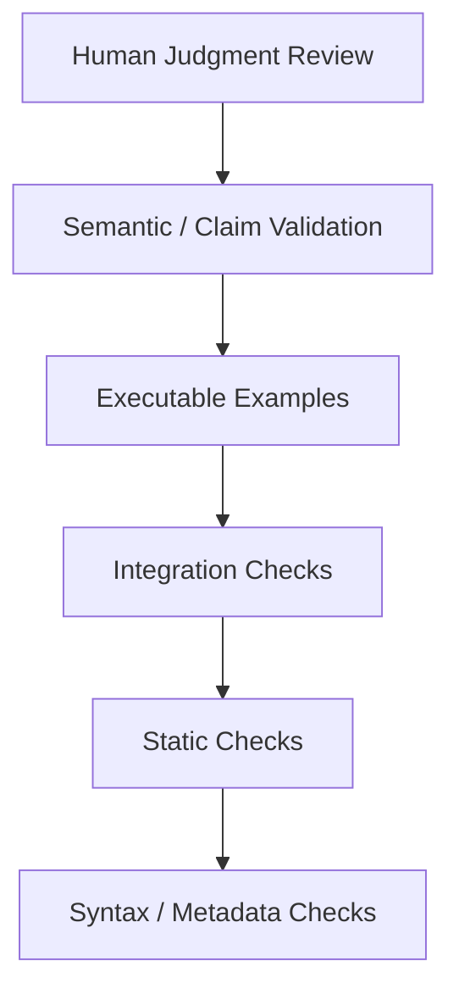
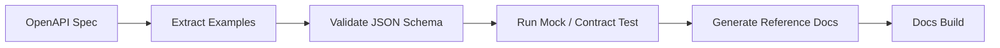
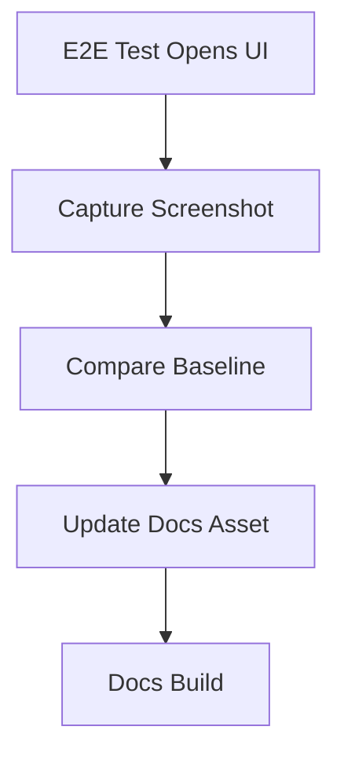
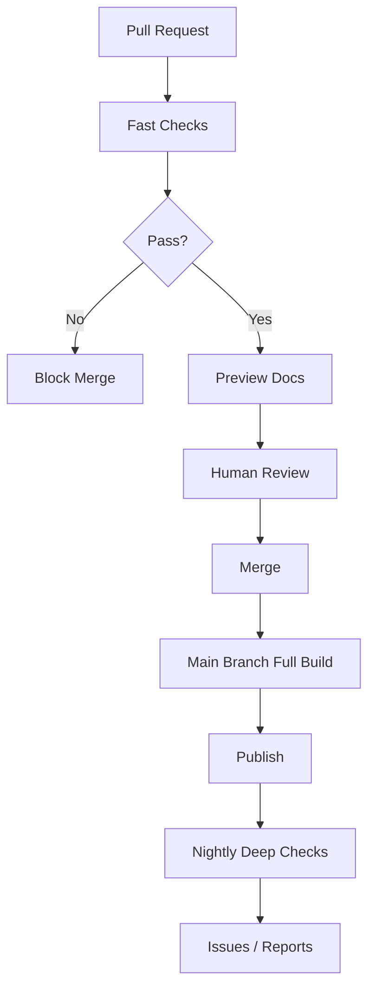

------
title: Learn AI-Driven Documentation and Technical Writing Implementation and Usage - Part 012
description: Documentation testing for docs-as-code and AI-assisted technical writing, covering linting, metadata checks, link checks, executable snippets, API examples, diagrams, screenshots, stale claims, and CI strategy.
series: learn-ai-driven-documentation
seriesTitle: Learn AI-Driven Documentation and Technical Writing Implementation and Usage
order: 12
partTitle: Documentation Testing
tags:
- ai
- documentation
- technical-writing
- documentation-testing
- docs-as-code
- ci-cd
- quality-gates
- markdown
- mdx
- executable-docs
date: 2026-06-30
---

# Part 012 — Documentation Testing

## 1. Target Pembelajaran

Part sebelumnya membahas review workflow dan governance. Sekarang kita masuk ke pertanyaan yang lebih tajam:

```text
How do we know the documentation is still true?
```

Review manusia penting, tetapi tidak cukup. Dokumentasi modern perlu diuji seperti software karena:

- links rusak,
- snippets tidak compile,
- command berubah,
- API examples stale,
- screenshots drift,
- diagrams tidak sesuai arsitektur,
- generated docs tidak sinkron,
- metadata hilang,
- AI-generated text bisa terdengar benar tetapi salah,
- source of truth berubah tanpa update dokumen.

Target part ini:

- Memahami dokumentasi sebagai artifact yang bisa diuji.
- Mendesain documentation testing pyramid.
- Mengimplementasikan linting, metadata validation, link checking, snippet testing, API sample validation, diagram validation, screenshot drift detection, dan stale claim detection.
- Mendesain CI pipeline yang efektif tanpa membuat developer frustasi.
- Menentukan mana yang bisa diuji otomatis dan mana yang tetap butuh human verification.

Prinsip utama:

```text
Every documentation claim that can be mechanically verified should eventually become a test.
```

---

## 2. Documentation Testing Pyramid

Tidak semua hal bisa diuji dengan level yang sama.



Dari bawah ke atas:

| Layer | Contoh | Otomatisasi |
|---|---|---:|
| Syntax / metadata | frontmatter, headings, Markdown structure | tinggi |
| Static checks | prose linting, spell check, link shape, secret scan | tinggi |
| Integration checks | real links, generated docs, API specs, diagrams | medium-tinggi |
| Executable examples | code snippets, commands, API requests | medium |
| Semantic / claim validation | docs vs source behavior | medium-rendah |
| Human judgment | action safety, domain correctness, compliance | rendah, tetapi wajib |

Tujuan pyramid bukan mengganti reviewer manusia. Tujuannya mengurangi pekerjaan mekanis agar manusia fokus pada judgment.

---

## 3. Apa yang Bisa Diuji?

Dokumentasi terlihat seperti tulisan, tetapi di dalamnya ada banyak struktur yang bisa dites.

| Artifact | Testable aspect |
|---|---|
| Markdown/MDX | syntax, heading order, broken references |
| Frontmatter | required fields, allowed values, owner, status |
| Links | internal anchors, external links, redirects |
| Code snippets | compile/run/test |
| Shell commands | syntax, flags, environment assumptions |
| API examples | request/response valid against OpenAPI |
| Event examples | payload valid against schema |
| Diagrams | Mermaid syntax, referenced components |
| Images/screenshots | missing file, stale screenshot, alt text |
| Generated docs | generation reproducibility, diff cleanliness |
| Glossary terms | allowed terminology |
| Claims | source citation, version compatibility, freshness |
| AI-generated docs | source coverage, hallucination risk, sensitive content |

Testing docs berarti mengubah “semoga benar” menjadi “sebagian besar hal penting dicek otomatis”.

---

## 4. Test Category 1: Markdown and MDX Syntax

Test paling dasar memastikan dokumen bisa dibuild.

Cek minimal:

- Markdown valid,
- MDX valid,
- heading tidak lompat level secara liar,
- list formatting konsisten,
- code fence ditutup,
- Mermaid fence valid,
- internal anchor valid,
- import MDX valid,
- component props valid.

Contoh command:

```bash
npx markdownlint-cli2 "docs/**/*.mdx"
npm run build:docs
```

MDX menambah risiko karena Markdown bisa berisi JSX. Maka build test sangat penting.

Bad pattern:

```text
Lint passes, but docs site fails to build because MDX component props are invalid.
```

Karena itu jangan hanya menjalankan markdownlint. Jalankan build docs platform juga.

---

## 5. Test Category 2: Frontmatter Metadata Validation

Frontmatter adalah contract antara content dan platform.

Minimal required fields:

```yaml
title: string
description: string
series: string
seriesTitle: string
order: number
partTitle: string
tags: string[]
date: yyyy-mm-dd
```

Untuk enterprise docs, tambahkan:

```yaml
docType: tutorial | how-to | reference | explanation | runbook | adr | release-note
status: draft | review | approved | published | deprecated | archived | stale
owner: string
riskLevel: low | medium | high | critical
lastReviewed: yyyy-mm-dd
reviewCadenceDays: number
sourceOfTruth: array
aiAssisted: boolean
```

Contoh schema dengan JSON Schema:

```json
{
  "type": "object",
  "required": [
    "title",
    "description",
    "series",
    "order",
    "partTitle",
    "tags",
    "date"
  ],
  "properties": {
    "title": { "type": "string", "minLength": 8 },
    "description": { "type": "string", "minLength": 20 },
    "series": { "type": "string" },
    "order": { "type": "integer", "minimum": 1 },
    "tags": {
      "type": "array",
      "items": { "type": "string" },
      "minItems": 2
    },
    "riskLevel": {
      "enum": ["low", "medium", "high", "critical"]
    }
  }
}
```

Test script sederhana:

```js
import fs from "node:fs";
import path from "node:path";
import matter from "gray-matter";
import Ajv from "ajv";

const ajv = new Ajv({ allErrors: true });
const schema = JSON.parse(fs.readFileSync("docs.schema.json", "utf8"));
const validate = ajv.compile(schema);

function walk(dir) {
  return fs.readdirSync(dir, { withFileTypes: true }).flatMap((entry) => {
    const full = path.join(dir, entry.name);
    if (entry.isDirectory()) return walk(full);
    if (entry.name.endsWith(".md") || entry.name.endsWith(".mdx")) return [full];
    return [];
  });
}

let failed = false;

for (const file of walk("docs")) {
  const parsed = matter(fs.readFileSync(file, "utf8"));
  if (!validate(parsed.data)) {
    failed = true;
    console.error(`\n${file}`);
    console.error(validate.errors);
  }
}

process.exit(failed ? 1 : 0);
```

Metadata validation penting untuk AI retrieval karena AI systems sering memakai metadata untuk ranking, filtering, dan access boundary.

---

## 6. Test Category 3: Link Checking

Link checking terlihat sederhana, tetapi di enterprise docs sering menjadi sumber noise.

Jenis link:

- internal relative links,
- internal anchors,
- docs site route links,
- repository links,
- external public links,
- private internal links,
- generated reference links.

Policy:

| Link type | CI behavior |
|---|---|
| Internal relative | fail fast |
| Internal anchor | fail fast |
| Generated route | check after build |
| External public | warn first, fail in scheduled job |
| Private internal | check only in internal network runner |
| Known flaky | allowlist with expiry |

Kenapa external links jangan selalu fail di PR?

Karena external sites bisa timeout. Jika setiap timeout memblokir PR, developer akan membenci docs CI.

Lebih baik:

- PR checks fail untuk internal links,
- scheduled nightly job untuk external links,
- report broken external links ke issue tracker,
- allowlist dengan expiry.

Contoh command:

```bash
npx markdown-link-check docs/**/*.mdx
```

Atau setelah build static site:

```bash
npx lychee --verbose "build/**/*.html"
```

---

## 7. Test Category 4: Prose and Terminology Testing

Prose testing memastikan dokumen konsisten dengan style guide.

Tools:

- Vale untuk prose linting,
- markdownlint untuk Markdown consistency,
- cspell untuk spelling,
- custom glossary checker untuk domain terms,
- secret scanner untuk accidental leakage.

Contoh Vale invocation:

```bash
vale docs
```

Contoh cspell:

```bash
npx cspell "docs/**/*.mdx"
```

Term check penting untuk organisasi besar.

Contoh forbidden terms:

```yaml
extends: substitution
message: "Use '%s' instead of '%s'."
level: error
ignorecase: true
swap:
  whitelist: allowlist
  blacklist: denylist
  sanity check: validation check
```

Untuk domain regulated, term check bisa lebih penting daripada grammar.

Contoh:

```text
"case closed" vs "case resolved" vs "case terminated"
```

Jika istilah itu punya makna status hukum/proses yang berbeda, prose linting menjadi control penting.

---

## 8. Test Category 5: Code Snippet Testing

Snippet yang tidak diuji akan membusuk.

Masalah umum:

- import hilang,
- package name berubah,
- command flag deprecated,
- environment variable salah,
- sample response tidak sesuai,
- async behavior disederhanakan berlebihan,
- security config terlalu permissive,
- contoh tidak bisa di-run.

Strategi:

1. Extract snippets dari Markdown/MDX.
2. Klasifikasikan berdasarkan language.
3. Jalankan test sesuai language.
4. Gunakan marker untuk snippets yang intentionally non-executable.
5. Fail CI hanya untuk snippets yang dinyatakan executable.

Contoh code fence metadata:

````md
```bash testable
curl -s http://localhost:8080/health | jq .status
```
````

Snippet yang tidak testable:

````md
```yaml illustrative
# Simplified example. Do not copy directly to production.
permissions:
  - "*"
```
````

Rule:

```text
Every snippet must be either executable or explicitly illustrative.
```

Jangan biarkan ambiguous snippets.

---

## 9. Test Category 6: Shell Command Testing

Shell command di docs sangat berisiko karena pembaca sering copy-paste.

Cek minimal:

- command syntax,
- required tools,
- environment variables,
- working directory,
- destructive operation,
- production safety,
- idempotency,
- dry-run option,
- rollback instruction.

Gunakan ShellCheck untuk shell scripts:

```bash
shellcheck scripts/docs/*.sh
```

Untuk inline shell snippets, extract lalu test jika memungkinkan.

Dangerous command detection:

```text
rm -rf
kubectl delete
drop database
terraform destroy
aws iam attach-user-policy --policy-arn arn:aws:iam::aws:policy/AdministratorAccess
chmod 777
curl ... | sh
```

Command berbahaya tidak selalu dilarang. Tetapi harus punya guardrail:

- warning sebelum command,
- scope jelas,
- confirmation,
- dry-run,
- rollback,
- environment restriction,
- approval requirement.

---

## 10. Test Category 7: API Example Validation

API documentation harus diuji terhadap spec.

Untuk OpenAPI:

- request examples valid terhadap request schema,
- response examples valid terhadap response schema,
- status code terdokumentasi,
- error payload sesuai schema,
- required fields tidak hilang,
- deprecated fields ditandai,
- examples tidak mengandung data sensitif.

Flow:



Contoh command umum:

```bash
npx @redocly/cli lint openapi.yaml
npx @redocly/cli build-docs openapi.yaml
```

Untuk API docs yang ditulis manual, jangan biarkan examples lepas dari spec.

Bad pattern:

```text
Manual docs say field is optional.
OpenAPI says field is required.
Production rejects missing field.
```

Prevention:

- generate reference docs dari spec,
- validate examples against spec,
- link manual guides ke spec version,
- fail CI untuk schema mismatch.

---

## 11. Test Category 8: Event Example Validation

Event docs harus menjaga payload examples tetap valid.

Untuk event-driven systems:

- event name valid,
- topic/channel valid,
- schema version valid,
- payload example valid,
- required fields ada,
- enum values benar,
- timestamp format benar,
- correlation ID semantics jelas,
- compatibility policy disebutkan,
- producer/consumer mapping benar.

Untuk AsyncAPI atau schema registry, lakukan:

```text
event example -> schema validation -> docs build -> catalog publish
```

Manual event docs harus menghindari contoh payload yang “mirip benar”. Dalam sistem event, contoh salah bisa membuat consumer mengimplementasikan parser yang salah.

---

## 12. Test Category 9: Diagram Validation

Diagram bisa membusuk seperti kode.

Jenis diagram:

- Mermaid flowchart,
- sequence diagram,
- state machine,
- C4 diagram,
- architecture map,
- dependency graph,
- lifecycle diagram.

Cek minimal:

- syntax valid,
- render berhasil,
- referenced service/component ada,
- diagram tidak bertentangan dengan service catalog,
- diagram punya caption/context,
- diagram punya scope boundary.

Mermaid syntax bisa dicek saat docs site build. Untuk diagram critical, render diagram di CI agar syntax error terlihat sebelum merge.

Contoh:

```bash
npx mmdc -i docs/architecture/payment-flow.mmd -o /tmp/payment-flow.svg
```

Anti-pattern:

```text
Diagram says Service A calls Service B directly.
Actual architecture uses Event Bus.
```

Untuk mencegahnya, hubungkan diagram dengan service catalog atau architecture metadata jika memungkinkan.

---

## 13. Test Category 10: Screenshot and UI Drift

Screenshot adalah dokumentasi yang paling cepat stale.

Risiko:

- UI berubah,
- label berubah,
- menu pindah,
- data sensitif terlihat,
- dark/light mode berbeda,
- localization berbeda,
- screenshot tidak punya alt text,
- screenshot menunjukkan environment internal.

Testing strategy:

| Level | Test |
|---|---|
| Basic | image file exists |
| Accessibility | alt text exists |
| Metadata | screenshot date/version exists |
| Privacy | no obvious sensitive data |
| Drift | compare against latest UI snapshot |
| E2E | generate screenshot from Playwright/Cypress |

Untuk UI docs yang sering berubah, lebih baik generate screenshot dari test environment.

Flow:



Tetapi jangan overuse screenshots. Banyak engineering docs lebih stabil jika memakai:

- UI path text,
- field names,
- table of settings,
- annotated diagram,
- short focused screenshots.

---

## 14. Test Category 11: Generated Documentation Diff

Generated docs harus reproducible.

Contoh generated docs:

- API reference dari OpenAPI,
- event catalog dari AsyncAPI,
- CLI reference dari command metadata,
- config reference dari schema,
- code reference dari typedoc/javadoc/godoc,
- service catalog pages,
- dependency graph.

Test penting:

```text
Run generator, then verify repository is clean.
```

Contoh:

```bash
npm run generate:docs
git diff --exit-code
```

Jika generator menghasilkan diff, berarti source dan generated docs tidak sinkron.

Policy:

- generated docs harus punya marker,
- generated docs jangan diedit manual,
- generator version harus pinned,
- generated output harus deterministic,
- manual explanation harus terpisah dari generated reference.

Contoh marker:

```md
<!-- GENERATED FILE: do not edit directly. Source: specs/payment/openapi.yaml -->
```

---

## 15. Test Category 12: Stale Claim Detection

Ini bagian paling sulit.

Tidak semua klaim bisa dites, tetapi sebagian bisa diberi “source anchor”.

Contoh klaim:

```md
The token expires after 15 minutes.
```

Pertanyaan testing:

- Klaim ini berasal dari mana?
- Apakah source masih sama?
- Apakah config default berubah?
- Apakah environment-specific?
- Apakah ada test yang membuktikan behavior?

Gunakan source anchor:

```yaml
claims:
  - text: "The token expires after 15 minutes."
    source:
      type: config
      repo: identity-service
      path: config/auth.yaml
      key: token.expiryMinutes
    expected: 15
```

Ini tidak perlu untuk semua kalimat. Gunakan untuk high-risk claims.

High-risk claims:

- timeout,
- limit,
- permission,
- retention,
- SLA/SLO,
- billing behavior,
- compliance requirement,
- migration deadline,
- destructive operation,
- default security behavior.

---

## 16. Test Category 13: AI-Generated Content Validation

AI-generated docs perlu testing tambahan.

Risiko:

- hallucinated behavior,
- source mismatch,
- overclaim,
- missing limitation,
- invented examples,
- stale context,
- leakage dari private context,
- ambiguous authority.

Validation strategy:

| Check | Purpose |
|---|---|
| Source coverage | Semua klaim penting punya source |
| Citation anchoring | AI summary tidak berdiri tanpa basis |
| Contradiction scan | Bandingkan dengan docs/spec lain |
| Sensitive data scan | Cegah leak |
| Unsupported claim detection | Flag klaim tanpa bukti |
| Human verification marker | Pastikan SME review |
| Prompt injection scan | Cek instruksi berbahaya dalam retrieved content |

Contoh metadata:

```yaml
aiAssisted: true
aiUsage:
  mode: draft-from-source
  sourceMaterial:
    - specs/payment/openapi.yaml
    - adr/2026-04-payment-tokenization.md
  verifiedBy: team-payments-platform
  verifiedAt: 2026-06-30
```

Rule:

```text
AI-generated documentation cannot be considered approved until source-backed claims and human verification are present.
```

---

## 17. CI Pipeline Strategy

Pipeline docs yang baik harus cepat untuk PR dan lengkap untuk scheduled jobs.

### PR Pipeline

Run cepat:

- frontmatter validation,
- markdownlint,
- Vale changed files,
- internal link check,
- MDX build,
- changed snippets,
- secret scan,
- required metadata policy.

### Main Branch Pipeline

Run lebih lengkap:

- full docs build,
- generated docs diff,
- full link check,
- API spec validation,
- search index build,
- publish preview,
- docs artifact upload.

### Nightly Pipeline

Run mahal/flaky:

- external link check,
- screenshot drift,
- full snippet test,
- stale docs report,
- service catalog consistency,
- AI contradiction scan,
- broken ownership report.

Pipeline diagram:



---

## 18. Example GitHub Actions Workflow

Contoh baseline:

```yaml
name: docs-ci

on:
  pull_request:
    paths:
      - "docs/**"
      - "specs/**"
      - ".github/workflows/docs-ci.yml"
  push:
    branches: [main]
    paths:
      - "docs/**"
      - "specs/**"

jobs:
  docs:
    runs-on: ubuntu-latest

    steps:
      - uses: actions/checkout@v4

      - uses: actions/setup-node@v4
        with:
          node-version: 22
          cache: npm

      - run: npm ci

      - name: Validate frontmatter
        run: npm run docs:validate-metadata

      - name: Markdown lint
        run: npx markdownlint-cli2 "docs/**/*.mdx"

      - name: Prose lint
        run: vale docs

      - name: Spell check
        run: npx cspell "docs/**/*.mdx"

      - name: Secret scan
        run: npm run docs:secret-scan

      - name: Build docs
        run: npm run docs:build

      - name: Check generated docs
        run: |
          npm run docs:generate
          git diff --exit-code
```

Untuk organisasi besar, pecah job agar feedback lebih cepat.

---

## 19. Severity Model

Tidak semua test failure harus memblokir merge.

| Severity | Example | Merge behavior |
|---|---|---|
| Error | MDX build fails, broken internal link, missing owner for high-risk doc | block |
| Warning | long sentence, external link timeout, missing optional metadata | allow but report |
| Info | style suggestion, possible duplicate content | allow |

Prinsip:

```text
Block only on failures that can cause broken publishing, wrong action, security risk, or governance loss.
```

Jika terlalu banyak style warning menjadi blocker, developer akan mencari cara menghindari docs workflow.

---

## 20. Test Data and Environment Control

Executable docs sering gagal karena environment tidak stabil.

Masalah:

- service belum running,
- local port berbeda,
- credential tidak tersedia,
- test data tidak ada,
- command butuh network,
- third-party API rate limit,
- OS berbeda,
- timezone berbeda.

Solusi:

- gunakan containerized test environment,
- gunakan mock server,
- gunakan deterministic fixtures,
- tandai snippets yang butuh manual verification,
- pisahkan unit docs test dan integration docs test,
- gunakan fake credentials,
- gunakan stable test account,
- jangan hit production.

Rule:

```text
Documentation tests must not mutate production systems.
```

---

## 21. Testing Runbooks

Runbook adalah dokumen high-risk. Testing runbook berbeda dari testing tutorial.

Runbook testable aspects:

- alert name exists,
- dashboard link valid,
- log query valid,
- command syntax valid,
- escalation contact exists,
- rollback exists,
- decision points clear,
- destructive steps guarded,
- expected outcome defined,
- last fire drill date present.

Contoh metadata:

```yaml
docType: runbook
riskLevel: high
service: payment-gateway
alert: HighPaymentAuthorizationFailureRate
lastFireDrill: 2026-05-15
reviewCadenceDays: 90
```

Runbook idealnya diuji lewat:

- game day,
- incident simulation,
- tabletop exercise,
- dry-run command,
- alert-to-runbook routing check.

AI bisa membantu menemukan missing step, tetapi tidak bisa membuktikan runbook aman tanpa simulation atau SME verification.

---

## 22. Testing Tutorials and How-To Guides

Tutorial dan how-to harus diuji berdasarkan task success.

Checks:

- prerequisites lengkap,
- setup command berhasil,
- expected output jelas,
- cleanup ada,
- environment reset bisa dilakukan,
- screenshots valid,
- reader tidak perlu pengetahuan tersembunyi.

Untuk tutorial, test bisa berupa:

```text
Can a new engineer complete the task in a clean environment using only this document?
```

Ini bisa diuji manual secara periodik dengan onboarding cohort.

Metrics:

- time to complete,
- number of blocked steps,
- support questions,
- corrections submitted,
- failed commands.

---

## 23. Testing Reference Documentation

Reference docs harus lengkap, konsisten, dan generated where possible.

Checks:

- every field has type,
- every enum value documented,
- default values documented,
- deprecated fields marked,
- examples valid,
- version visible,
- generated from source where possible.

Manual reference docs rawan drift. Untuk reference, source-generated approach lebih aman.

Rule:

```text
Explanations can be handcrafted. Reference should be source-backed.
```

---

## 24. Documentation Test Ownership

Siapa yang memperbaiki docs test failure?

Ownership model:

| Failure type | Owner |
|---|---|
| Markdown syntax | author/docs owner |
| Style lint | author/docs owner |
| Broken internal link | author/docs owner |
| API example mismatch | API owner |
| Event schema mismatch | event/platform owner |
| Runbook command failure | service owner/SRE |
| Security leak | security owner + author |
| Stale source claim | technical owner |
| Screenshot drift | product/docs owner |
| Build platform failure | docs platform owner |

Tanpa ownership, test failure menjadi noise.

---

## 25. Avoiding Flaky Documentation Tests

Flaky docs tests membunuh trust.

Penyebab:

- external links timeout,
- real third-party API calls,
- timing-dependent examples,
- screenshots berubah minor,
- generated output non-deterministic,
- network dependency,
- timezone dependency,
- random test data.

Mitigasi:

- pin dependency versions,
- mock external services,
- quarantine flaky checks ke nightly,
- add retry untuk network checks,
- separate warning vs blocking,
- make generated output deterministic,
- use stable fixtures,
- record known flaky links with expiry.

---

## 26. Documentation Test Smells

### 26.1 All Checks Are Blocking

Akibat:

- developer frustrasi,
- docs changes dihindari,
- lint disabled.

Fix:

```text
Use severity model.
```

### 26.2 No Source-of-Truth Validation

Akibat:

- docs build sukses tetapi isi salah.

Fix:

```text
Connect high-risk claims to source artifacts.
```

### 26.3 Snippets Are Decorative

Akibat:

- examples tidak bisa dipakai.

Fix:

```text
Mark snippets as executable or illustrative.
```

### 26.4 Generated Docs Are Edited Manually

Akibat:

- generator output dan manual edit konflik.

Fix:

```text
Separate generated reference from authored explanation.
```

### 26.5 AI Drafts Skip Verification

Akibat:

- hallucination masuk ke published docs.

Fix:

```text
Require source-backed verification metadata for AI-assisted docs.
```

---

## 27. Minimal Viable Documentation Testing Stack

Untuk mulai, jangan langsung membuat sistem raksasa.

Baseline stack:

```text
1. docs build
2. markdownlint
3. Vale
4. frontmatter validation
5. internal link check
6. secret scan
7. generated docs diff check
```

Lalu naikkan maturity:

```text
8. snippet tests
9. API/event example validation
10. stale docs report
11. screenshot drift checks
12. source-backed claim validation
13. AI contradiction scan
```

Urutan ini mengikuti prinsip Kaufman: hilangkan friction dan buat feedback loop cepat sebelum mengejar mastery.

---

## 28. Kaufman Practice Drill

### Drill 1 — Build a Docs Test Matrix

Ambil 10 dokumen. Untuk masing-masing, tentukan:

- doc type,
- risk level,
- checks yang wajib,
- checks yang optional,
- owner untuk failure.

### Drill 2 — Add Metadata Validation

Buat schema frontmatter sederhana. Jalankan terhadap repository docs. Catat:

- berapa dokumen tidak punya owner,
- berapa tidak punya description,
- berapa tidak punya status,
- berapa tidak punya review date.

### Drill 3 — Classify Snippets

Ambil semua code fences. Tandai:

- executable,
- illustrative,
- incomplete,
- dangerous,
- generated.

Tujuan: menghilangkan ambiguous snippets.

### Drill 4 — Test One High-Risk Runbook

Pilih satu runbook. Verifikasi:

- alert link,
- dashboard link,
- log query,
- command syntax,
- rollback,
- escalation,
- last reviewed date.

### Drill 5 — AI Validation Challenge

Ambil satu AI-generated draft. Minta AI lain mencari unsupported claims. Lalu manual verify terhadap source. Catat false positive dan false negative.

---

## 29. Checklist Implementasi

- [ ] Add docs build to CI.
- [ ] Add markdownlint.
- [ ] Add Vale.
- [ ] Add frontmatter schema.
- [ ] Add internal link checker.
- [ ] Add secret scanning.
- [ ] Add generated docs diff check.
- [ ] Add severity model.
- [ ] Add code fence classification.
- [ ] Add snippet testing for high-value examples.
- [ ] Add API/event example validation.
- [ ] Add stale docs report.
- [ ] Add AI-assisted docs verification metadata.
- [ ] Add ownership mapping for test failures.
- [ ] Move flaky external checks to scheduled jobs.

---

## 30. Ringkasan

Documentation testing mengubah dokumentasi dari artifact pasif menjadi artifact yang bisa diverifikasi.

Hal terpenting:

- Build test memastikan docs bisa dipublish.
- Metadata validation memastikan docs bisa dikelola.
- Link checks menjaga navigasi.
- Prose linting menjaga style dan terminology.
- Snippet tests menjaga examples tetap bisa dipakai.
- API/event validation menjaga docs sinkron dengan contract.
- Generated docs diff menjaga source dan output sinkron.
- Stale claim detection menjaga high-risk facts tetap benar.
- AI-generated docs perlu source-backed verification.
- Semua checks tidak harus blocking; gunakan severity model.

Dokumentasi yang tidak dites akan membusuk. Dokumentasi yang dites bisa menjadi bagian dari engineering reliability system.

---

## 31. Referensi

- Write the Docs — Docs as Code
- Vale — Prose linting
- markdownlint — Markdown static analysis
- Google Developer Documentation Style Guide
- GitLab Documentation Testing practices
- Redocly CLI — OpenAPI linting and docs generation
- OWASP Top 10 for LLM Applications
