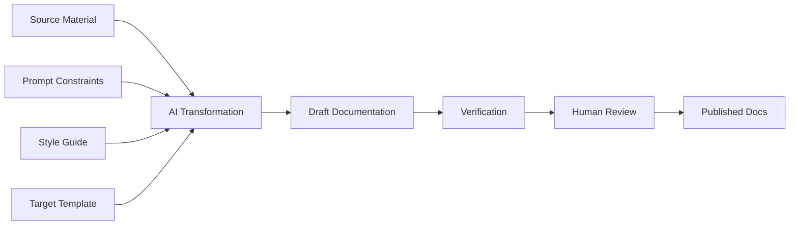
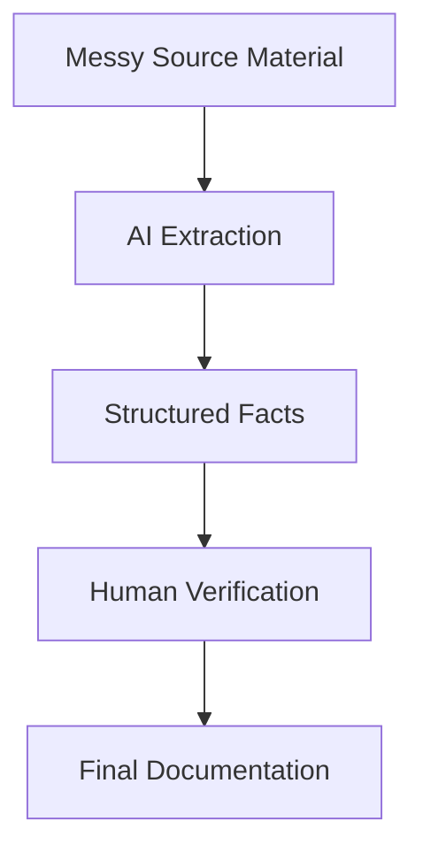
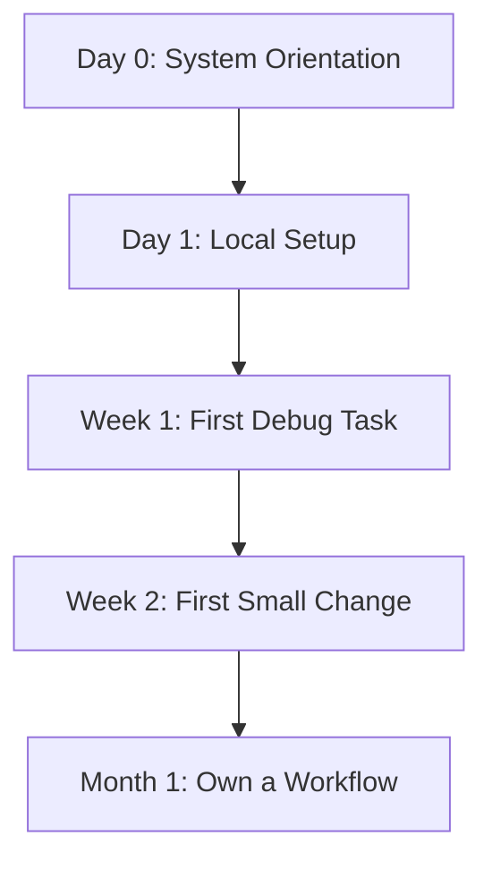
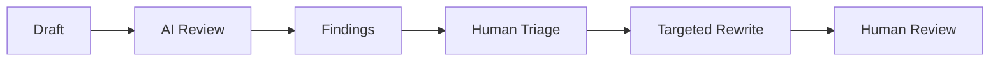
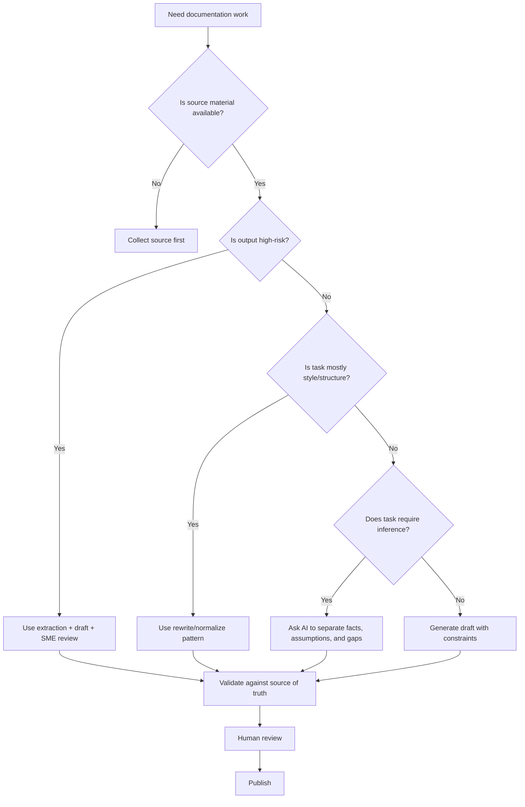

------
title: Learn AI-Driven Documentation and Technical Writing Implementation and Usage - Part 013
description: Practical usage patterns for AI writing assistants in engineering documentation workflows, including safe drafting, rewriting, summarization, extraction, release notes, troubleshooting, and review boundaries.
series: learn-ai-driven-documentation
seriesTitle: Learn AI-Driven Documentation and Technical Writing Implementation and Usage
order: 13
partTitle: AI Writing Assistant Usage Patterns
tags:
- ai
- documentation
- technical-writing
- docs-as-code
- prompt-engineering
- engineering-handbook
- series
date: 2026-06-30
---

# Part 013 — AI Writing Assistant Usage Patterns

## 1. What We Are Learning in This Part

This part focuses on **how to use AI writing assistants effectively inside engineering documentation work**.

We are not yet designing a full RAG system, documentation agent, or enterprise automation pipeline. Those come later. Here, the goal is narrower and more immediately useful:

> Use AI as a writing accelerator without letting it become the owner of truth.

A top-level engineer does not treat AI-generated documentation as automatically correct. They treat it as a **drafting, transformation, extraction, and review tool** that must be bounded by source material, engineering judgment, and explicit review gates.

By the end of this part, you should be able to:

1. Choose the right AI usage pattern for a documentation task.
2. Separate safe AI work from high-risk AI work.
3. Build repeatable documentation workflows instead of one-off chat prompts.
4. Review AI-generated documentation with engineering-level rigor.
5. Convert messy engineering context into useful documentation artifacts.
6. Avoid common AI documentation failure modes: hallucination, overclaiming, style drift, stale claims, and invented causality.

This part is intentionally practical. It gives you reusable patterns and implementation checklists that you can apply immediately in real repositories.

---

## 2. Kaufman Deconstruction: The Sub-Skills Behind AI Documentation Usage

Josh Kaufman's method starts by breaking a skill into smaller sub-skills. For AI-driven documentation usage, the mistake is thinking the skill is simply:

> "Ask AI to write docs."

That is too shallow.

The real skill decomposes into these sub-skills:

| Sub-Skill | What It Means | Failure If Missing |
|---|---|---|
| Task framing | Knowing what kind of documentation artifact is needed | AI produces a polished but wrong artifact |
| Source selection | Giving AI the right input context | Output invents or generalizes beyond facts |
| Prompt constraint design | Defining audience, scope, format, and quality rules | Output is vague, generic, or structurally inconsistent |
| Transformation control | Using AI to rewrite, compress, expand, or restructure without changing meaning | Output silently changes technical meaning |
| Extraction | Pulling decisions, actions, limitations, risks, examples, or procedures from raw material | Important knowledge remains buried |
| Verification | Checking claims against source of truth | Hallucinated docs enter the repo |
| Editorial judgment | Improving clarity, flow, and reader fit | Docs are technically correct but hard to use |
| Workflow integration | Putting AI usage inside PR, CI, and review processes | AI usage becomes ad hoc and ungoverned |

The core principle:

> AI can help produce text, but engineering documentation must preserve truth, intent, and operational safety.

---

## 3. The AI Writing Assistant Capability Map

An AI writing assistant can help with many documentation tasks, but not all tasks have the same risk.

### 3.1 Low-Risk Usage Patterns

These are usually safe if the input is already accurate and the output is reviewed lightly.

| Pattern | Example | Why It Is Lower Risk |
|---|---|---|
| Rewriting for clarity | Rewrite a paragraph to be more direct | Meaning is already present |
| Grammar cleanup | Fix grammar and punctuation | Low semantic change |
| Formatting | Convert rough notes to Markdown | Mostly structural |
| Summarizing supplied text | Summarize a meeting note | Grounded in provided material |
| Tone alignment | Make this follow our style guide | Style-focused |
| Title suggestions | Generate section headings | Easy to inspect |

### 3.2 Medium-Risk Usage Patterns

These require careful verification because they can alter meaning.

| Pattern | Example | Risk |
|---|---|---|
| Procedure generation | Create setup steps from scattered notes | May omit prerequisite or edge case |
| Troubleshooting docs | Generate error diagnosis paths | May invent causes |
| API examples | Generate sample request/response | May violate contract |
| Release notes | Summarize merged PRs | May overstate user impact |
| ADR drafting | Draft decision record from discussion | May simplify trade-offs incorrectly |
| Onboarding guide | Create learning path from repo docs | May miss domain-specific constraints |

### 3.3 High-Risk Usage Patterns

These should never be accepted without source-backed verification.

| Pattern | Example | Required Control |
|---|---|---|
| Security guidance | Explain auth flow or secret handling | Security review |
| Compliance docs | Write audit/control narrative | Compliance/legal review |
| Incident explanation | Summarize root cause | Incident owner review |
| Migration docs | Explain breaking changes | Test or code/spec verification |
| Operational runbook | Generate rollback/failover steps | Dry-run or SME review |
| Architecture truth | Describe service dependencies | Validate against source of truth |

The higher the consequence of being wrong, the more AI must be treated as a draft generator, not an authority.

---

## 4. Mental Model: AI as a Documentation Compiler

A useful way to think about AI-assisted writing is not "AI as author", but:

> AI as a lossy documentation compiler.

It transforms one representation of knowledge into another:

- code diff → release note
- PR discussion → ADR draft
- incident timeline → postmortem summary
- OpenAPI schema → endpoint explanation
- raw notes → onboarding guide
- support tickets → troubleshooting article
- scattered repo docs → structured handbook page

Like any compiler, it needs:

1. **Input** — source material.
2. **Instruction** — transformation rule.
3. **Target schema** — desired output structure.
4. **Validation** — checks against expected behavior.
5. **Review** — human judgment where automation cannot decide.



The key question is never simply:

> "Can AI write this?"

The better engineering question is:

> "What source material, constraints, and validation must surround AI so the output is safe to use?"

---

## 5. Pattern 1 — AI as a Clarity Rewriter

### 5.1 When to Use

Use this pattern when you already have technically accurate content, but the writing is difficult to read.

Common cases:

- Long paragraphs from engineers.
- README sections that grew organically.
- Meeting notes copied into docs.
- Architecture explanation with unclear sequencing.
- Support documentation with inconsistent tone.

### 5.2 Input Requirements

The input must already contain the truth. AI should not add new facts.

Good input:

```md
The reconciliation job is scheduled every 15 minutes and attempts to match settlement records against internal payment records. If the external provider returns a delayed settlement file, unmatched rows are retained and retried in the next run. Manual reconciliation is only required after 24 hours of unmatched state.
```

Bad input:

```md
Write docs about reconciliation.
```

The second input asks AI to invent context.

### 5.3 Prompt Pattern

```text
Rewrite the following documentation section for clarity.

Constraints:
- Preserve the technical meaning exactly.
- Do not add new facts.
- Do not remove constraints, timing, warnings, or exceptions.
- Use short paragraphs.
- Prefer active voice.
- Keep terminology unchanged.

Input:
<text>
```

### 5.4 Review Checklist

After AI rewrites the section, check:

- Did it preserve every constraint?
- Did it keep timing values, limits, and thresholds unchanged?
- Did it remove caveats?
- Did it turn uncertainty into certainty?
- Did it replace domain terms with more generic terms?
- Did it make the text nicer but less precise?

### 5.5 Engineering Rule

> Rewrite prompts must explicitly say "do not add facts" and "preserve technical meaning exactly".

This prevents the common failure where AI improves readability by silently changing the contract.

---

## 6. Pattern 2 — AI as a Structure Normalizer

### 6.1 When to Use

Use this when content is correct but poorly organized.

Examples:

- Convert rough notes into a how-to guide.
- Convert a messy README into sections.
- Split a long document into tutorial, how-to, reference, and explanation.
- Normalize multiple service docs into a shared template.

### 6.2 Example Target Template

```md
# <Title>

## Purpose

## Prerequisites

## Procedure

## Verification

## Rollback

## Troubleshooting

## Related Docs
```

### 6.3 Prompt Pattern

```text
Restructure the following content into the target template.

Rules:
- Use only facts present in the input.
- If a required section has no supporting information, write: "Not specified in source material."
- Do not invent commands, URLs, owners, or environment names.
- Preserve warnings and limitations.
- Keep all unresolved questions in an "Open Questions" section.

Target template:
<template>

Input:
<source>
```

### 6.4 Why This Pattern Works

AI is good at structural transformation. It can identify concepts and map them to headings.

But it is risky when asked to fill missing sections. So the safe pattern is:

> Normalize structure, but mark missing information explicitly.

This turns missing documentation into visible work instead of hidden hallucination.

---

## 7. Pattern 3 — AI as a Summarizer

### 7.1 When to Use

Use summarization when source material is long and the reader needs a compressed view.

Examples:

- Summarize a design discussion.
- Summarize a long PR thread.
- Summarize an incident timeline.
- Summarize customer feedback.
- Summarize release changes.

### 7.2 The Summarization Trap

Summarization is not neutral. A summary chooses what matters.

The same source can produce different useful summaries:

| Summary Type | Reader Need |
|---|---|
| Executive summary | Decision and business impact |
| Engineer summary | Technical change and risk |
| Reviewer summary | What to inspect |
| Operator summary | What changed operationally |
| User summary | What changed in behavior |
| Compliance summary | Evidence, control, approval |

Before summarizing, specify the reader and purpose.

### 7.3 Prompt Pattern

```text
Summarize the following source material for a software engineer who needs to understand implementation impact.

Include:
- Key change
- Reason for change
- Affected components
- Risks or limitations
- Required follow-up
- Open questions

Rules:
- Use only supplied material.
- Do not infer business impact unless explicitly stated.
- Preserve uncertainty.
- Separate facts from assumptions.

Source:
<text>
```

### 7.4 Good Summary Shape

```md
## Summary

The payment reconciliation retry behavior was changed to retain unmatched settlement rows for 24 hours before requiring manual intervention.

## Affected Components

- Settlement ingestion job
- Reconciliation worker
- Manual reconciliation dashboard

## Known Risks

- Delayed provider files may temporarily increase unmatched row count.
- Manual intervention is still required after 24 hours.

## Open Questions

- The source material does not specify alerting thresholds.
```

### 7.5 Review Checklist

- Did the summary omit a critical constraint?
- Did it change causal relationships?
- Did it hide uncertainty?
- Did it mix facts and assumptions?
- Did it summarize for the wrong audience?

---

## 8. Pattern 4 — AI as an Extractor

### 8.1 When to Use

Extraction is often more valuable than generation.

Instead of asking AI to "write docs", ask it to extract structured information from messy input.

Examples:

- Extract decisions from meeting notes.
- Extract action items from incident review.
- Extract assumptions from architecture discussion.
- Extract risks from migration planning.
- Extract user-visible changes from PR descriptions.
- Extract commands from setup documentation.

### 8.2 Why Extraction Is Powerful

Extraction reduces ambiguity by producing a structured intermediate representation.



The structured facts become easier to review than a full prose draft.

### 8.3 Prompt Pattern

```text
Extract structured facts from the source material.

Return a Markdown table with these columns:
- Category
- Extracted Fact
- Supporting Source Excerpt
- Confidence: High / Medium / Low
- Needs Human Review: Yes / No

Rules:
- Do not generate final documentation.
- Do not infer missing facts.
- Mark ambiguous items as Low confidence.
- Keep source excerpts short.

Source:
<text>
```

### 8.4 Good Extraction Categories

For engineering documentation, useful categories include:

- decision
- constraint
- assumption
- prerequisite
- command
- environment variable
- config key
- endpoint
- event name
- feature flag
- migration step
- rollback step
- risk
- limitation
- owner
- deadline
- open question

### 8.5 Engineering Rule

> For high-risk docs, extract first, draft second.

Do not jump straight from messy source to polished prose. Polished prose can hide wrong assumptions. Structured extraction makes assumptions visible.

---

## 9. Pattern 5 — AI as a Release Notes Assistant

### 9.1 When to Use

Use AI to turn merged changes into release notes, changelog entries, migration notes, and internal deployment summaries.

Typical inputs:

- PR titles.
- PR descriptions.
- Commit messages.
- Issue tickets.
- Diff summaries.
- Test notes.
- Feature flag rollout plan.

### 9.2 Release Notes Are Not Commit Logs

A commit log says what changed in code. A release note says what changed for a reader.

Different readers need different release notes:

| Reader | Needs |
|---|---|
| End user | Behavior change, new capability, visible fix |
| Support | Known issues, troubleshooting, customer impact |
| Operator | Deployment, monitoring, rollback, config changes |
| Integrator | API changes, compatibility, migration |
| Internal engineer | Implementation summary and risk |

### 9.3 Prompt Pattern

```text
Generate release notes from the supplied PR summaries.

Audience:
- Internal software engineers and support engineers.

Output sections:
- Added
- Changed
- Fixed
- Deprecated
- Removed
- Migration Notes
- Operational Notes
- Known Limitations

Rules:
- Do not include implementation details unless they affect operation or usage.
- Do not claim customer impact unless explicitly stated.
- Mark unclear items as "Needs verification".
- Preserve feature flags and rollout constraints.
- Use concise bullets.

Input:
<PR summaries>
```

### 9.4 Verification Checklist

- Does every release note map to a source PR or ticket?
- Are breaking changes clearly marked?
- Are migration steps tested?
- Are rollout limitations included?
- Are removed/deprecated features accurately described?
- Are user-facing claims approved by product/support if needed?

### 9.5 Anti-Pattern

Bad release note:

```md
Improved reconciliation performance and reliability.
```

Why it is bad:

- Vague.
- Not measurable.
- Could overclaim.
- Does not explain user or operational impact.

Better:

```md
Changed reconciliation retry behavior so unmatched settlement rows remain eligible for automatic retry for up to 24 hours before manual reconciliation is required.
```

This is specific, bounded, and verifiable.

---

## 10. Pattern 6 — AI as a Troubleshooting Draft Assistant

### 10.1 When to Use

Use AI to structure troubleshooting material from known errors, logs, support tickets, or incident notes.

### 10.2 Why This Is Risky

Troubleshooting docs often contain causal claims:

- "This error occurs when..."
- "Restarting the worker fixes..."
- "This can be ignored if..."

AI can easily invent plausible but false causes.

### 10.3 Safer Troubleshooting Template

```md
# Troubleshooting: <Problem>

## Symptom

## Confirm the Problem

## Likely Causes

## Resolution Steps

## Verification

## Escalation

## Related Logs and Metrics

## Known Non-Causes
```

### 10.4 Prompt Pattern

```text
Create a troubleshooting draft from the supplied incident notes and support tickets.

Rules:
- Do not invent root causes.
- Separate observed symptoms from suspected causes.
- Include only commands present in the source material.
- If a resolution step is not proven, label it as "Potential workaround".
- Include verification steps only if supported by source material.
- Include an escalation section for unresolved cases.

Source:
<material>
```

### 10.5 Review Checklist

- Are symptoms separated from causes?
- Are commands safe to run?
- Are destructive commands clearly marked?
- Are environment assumptions explicit?
- Are escalation paths correct?
- Are metrics/log names verified?
- Are unproven workarounds labeled as such?

---

## 11. Pattern 7 — AI as an ADR Draft Assistant

### 11.1 When to Use

Use AI to draft Architecture Decision Records from raw decision material.

Inputs may include:

- Design docs.
- Meeting notes.
- Slack discussion exports.
- PR discussion.
- RFC comments.
- Incident findings.

### 11.2 ADR Output Template

```md
# ADR: <Decision Title>

## Status

## Context

## Decision

## Consequences

## Alternatives Considered

## Trade-Offs

## Follow-Up Actions

## References
```

### 11.3 Prompt Pattern

```text
Draft an ADR from the supplied source material.

Rules:
- Use only facts from the source.
- Preserve disagreements and unresolved trade-offs.
- Do not make the decision sound more certain than the source supports.
- If alternatives are mentioned, include them even if rejected.
- If consequences are not stated, mark them as "Not specified in source material".
- Include open questions.

Source:
<material>
```

### 11.4 Critical Review Questions

- Does the decision match what was actually agreed?
- Are alternatives represented fairly?
- Are constraints visible?
- Are consequences explicit?
- Does the ADR hide dissent or unresolved risk?
- Is the status correct: proposed, accepted, superseded, deprecated?

### 11.5 Engineering Rule

> AI may draft an ADR, but it must not decide the ADR.

Architecture decisions require accountable ownership.

---

## 12. Pattern 8 — AI as an Onboarding Guide Assistant

### 12.1 When to Use

Use AI to turn scattered internal material into a coherent onboarding path.

Inputs:

- Existing README files.
- Service catalog entries.
- Architecture docs.
- Setup guides.
- Runbooks.
- Team conventions.
- Glossary.
- Common tasks.

### 12.2 Good Onboarding Docs Are Progressive

A new engineer does not need everything on day one. They need staged context.



### 12.3 Prompt Pattern

```text
Create an onboarding guide from the supplied internal docs.

Audience:
- Experienced software engineer new to this team.

Output sections:
- System Overview
- Key Concepts
- Local Setup
- First Debugging Task
- First Code Change
- Common Failure Modes
- Where to Ask for Help
- What Not to Touch Yet
- Reading Path

Rules:
- Do not invent team names, URLs, commands, or owners.
- Mark missing setup steps as gaps.
- Prefer progressive learning order.
- Include warnings for risky systems.

Source:
<docs>
```

### 12.4 Review Checklist

- Can a new engineer complete a real task using this guide?
- Are prerequisites explicit?
- Are risky areas marked?
- Are team-specific terms explained?
- Are links current?
- Are setup commands tested?
- Is the guide too broad for onboarding?

---

## 13. Pattern 9 — AI as a Code Explanation Assistant

### 13.1 When to Use

Use AI to explain code for documentation purposes when the code is available as source material.

Typical outputs:

- Module overview.
- Public API explanation.
- Domain workflow explanation.
- State transition narrative.
- Dependency summary.
- Configuration reference draft.

### 13.2 Danger: Code Is Not Full Truth

Code shows implementation. It may not show:

- Business intent.
- Product constraints.
- Regulatory rationale.
- Operational assumptions.
- Historical decision context.
- Future migration plans.

Therefore, AI-generated code explanation should be labeled as implementation-derived unless reviewed with domain context.

### 13.3 Prompt Pattern

```text
Explain the supplied code for internal engineering documentation.

Audience:
- Senior software engineers joining the project.

Rules:
- Explain observable behavior from the code only.
- Do not infer business intent unless comments or docs state it.
- Identify public entry points, dependencies, state transitions, and failure handling.
- Mark uncertain intent as "Intent not explicit in source".
- Include questions for maintainers.

Code:
<code>
```

### 13.4 Review Checklist

- Did the explanation match actual code paths?
- Did it overgeneralize from one method to whole module behavior?
- Did it miss error handling?
- Did it explain concurrency/state assumptions correctly?
- Did it separate implementation behavior from business intent?

---

## 14. Pattern 10 — AI as a Documentation Reviewer

### 14.1 When to Use

Use AI to review documentation for quality issues before human review.

It can check:

- Missing prerequisites.
- Ambiguous terms.
- Inconsistent terminology.
- Claims without evidence.
- Unclear warnings.
- Broken structure.
- Mixed Diátaxis modes.
- Reader-task mismatch.
- Style guide violations.

### 14.2 Prompt Pattern

```text
Review the following documentation draft.

Review dimensions:
- Technical clarity
- Reader task fit
- Missing prerequisites
- Ambiguous terminology
- Unsupported claims
- Safety or operational risk
- Style guide consistency
- Missing verification steps

Rules:
- Do not rewrite the document yet.
- Return findings as a table.
- Include severity: Critical / Major / Minor.
- Include exact section or sentence.
- Include recommended fix.

Draft:
<doc>
```

### 14.3 Why Review-First Often Beats Rewrite-First

If you ask AI to rewrite immediately, it may silently fix some problems and introduce others.

A review-first workflow gives you explicit findings:



This makes the process more auditable.

---

## 15. Pattern 11 — AI as a Glossary and Terminology Assistant

### 15.1 When to Use

Use AI to identify inconsistent terminology and propose glossary entries.

Inputs:

- Existing docs.
- API field names.
- UI labels.
- Domain model docs.
- Support tickets.
- ADRs.

### 15.2 Prompt Pattern

```text
Analyze the supplied documentation for terminology inconsistencies.

Return:
- Term
- Variants found
- Recommended canonical term
- Meaning inferred from source
- Confidence
- Sections where term appears
- Questions for domain owner

Rules:
- Do not invent definitions.
- Mark inferred definitions clearly.
- Prefer terms already used in public APIs or domain models.

Source:
<docs>
```

### 15.3 Review Checklist

- Does the canonical term match code/API/domain language?
- Are synonyms actually distinct concepts?
- Are business and technical terms being conflated?
- Are legacy terms still needed for migration docs?
- Are externally visible terms consistent with product/UI?

---

## 16. Pattern 12 — AI as a Migration Guide Assistant

### 16.1 When to Use

Use AI to help draft migration guides from version diffs, breaking change lists, API specs, or release plans.

### 16.2 Migration Guides Require Strong Verification

A migration guide is operationally risky because users follow it to change systems.

AI may help draft, but each step must be verified.

### 16.3 Migration Guide Template

```md
# Migration Guide: <From> to <To>

## Who Must Migrate

## What Changed

## Compatibility

## Before You Start

## Step-by-Step Migration

## Verification

## Rollback

## Known Issues

## FAQ
```

### 16.4 Prompt Pattern

```text
Draft a migration guide from the supplied breaking change list and examples.

Rules:
- Do not invent migration commands.
- Every migration step must map to source material.
- Separate required steps from optional cleanup.
- Include verification steps only if supplied or derivable from explicit tests.
- Mark missing rollback information as a gap.
- Preserve version numbers exactly.

Source:
<material>
```

### 16.5 Review Checklist

- Are version numbers correct?
- Are preconditions explicit?
- Are steps tested in a clean environment?
- Are rollback instructions safe?
- Are incompatible cases listed?
- Are config changes complete?
- Are examples consistent with current API/schema?

---

## 17. Pattern 13 — AI as a Diagram Narrator

### 17.1 When to Use

Use AI to explain diagrams or generate diagram descriptions from source material.

Examples:

- Explain architecture diagram in text.
- Generate Mermaid from a sequence description.
- Write caption for state machine diagram.
- Convert a workflow description into diagram outline.

### 17.2 Safe Prompt Pattern

```text
Create a Mermaid sequence diagram from the supplied workflow description.

Rules:
- Use only actors and interactions present in the source.
- Do not add services.
- Do not infer retries or async behavior unless explicitly stated.
- After the diagram, list any missing or ambiguous interactions.

Source:
<workflow>
```

### 17.3 Review Checklist

- Are all actors real?
- Are sync/async relationships correct?
- Are retry/error paths represented accurately?
- Does the diagram oversimplify state?
- Is the diagram consistent with text?

---

## 18. Pattern 14 — AI as a Documentation Gap Finder

### 18.1 When to Use

Use AI to compare existing docs against expected documentation coverage.

Inputs:

- Repository tree.
- Service catalog.
- Existing docs index.
- API specs.
- Runbooks.
- Incident history.
- Onboarding checklist.

### 18.2 Prompt Pattern

```text
Identify documentation gaps from the supplied repository and documentation index.

Expected coverage:
- Overview
- Local setup
- Configuration reference
- API reference
- Operational runbook
- Troubleshooting
- Ownership
- Deployment notes
- Security considerations
- Known limitations

Rules:
- Do not write missing docs.
- Return a prioritized backlog.
- Include severity and reason.
- Mark whether the gap affects onboarding, operations, compliance, or maintenance.

Input:
<repo map and docs index>
```

### 18.3 Output Example

```md
| Gap | Severity | Impact | Reason | Suggested Owner |
|---|---|---|---|---|
| Missing rollback runbook for reconciliation worker | Critical | Operations | Deployment docs mention rollback but no procedure exists | Service owner |
| No configuration reference for settlement retention period | Major | Maintenance | Env variable appears in code but is undocumented | Platform team |
```

### 18.4 Why Gap Finding Is High-Value

Many documentation failures come from absence, not bad writing.

AI can help identify missing documents, but owners must decide whether the gap is real.

---

## 19. Pattern 15 — AI as a Docs Backlog Prioritizer

### 19.1 When to Use

Use this when many documentation issues exist and the team needs a practical remediation plan.

### 19.2 Prioritization Dimensions

| Dimension | Question |
|---|---|
| User impact | Does this block users or engineers? |
| Operational risk | Could wrong/missing docs cause outage or failed recovery? |
| Compliance risk | Is this required for audit/evidence? |
| Change frequency | Does this area change often? |
| Ownership clarity | Is there a clear owner? |
| Automation potential | Can this be generated or tested? |
| Review cost | How much SME time is required? |

### 19.3 Prompt Pattern

```text
Prioritize the following documentation backlog.

Scoring dimensions:
- User impact: 1-5
- Operational risk: 1-5
- Compliance risk: 1-5
- Freshness risk: 1-5
- Effort: S / M / L
- Suggested priority: P0 / P1 / P2 / P3

Rules:
- Explain each priority in one sentence.
- Do not mark items P0 unless they create immediate operational, user, or compliance risk.
- Identify items that can be automated.

Backlog:
<items>
```

### 19.4 Review Checklist

- Are P0/P1 items truly high-risk?
- Are low-risk style issues being overprioritized?
- Are missing runbooks prioritized above aesthetic cleanup?
- Are generated docs separated from SME-heavy docs?
- Is ownership clear?

---

## 20. The AI Documentation Usage Decision Tree

Use this decision tree before involving AI.



The decision tree enforces one principle:

> AI should not be used to hide missing source material.

If facts are missing, the output must show gaps.

---

## 21. Prompt Constraints That Matter for Documentation

For documentation tasks, these constraints are usually more important than fancy prompt tricks.

### 21.1 Source Constraint

```text
Use only the supplied source material. If information is missing, say so explicitly.
```

### 21.2 Meaning Preservation Constraint

```text
Preserve technical meaning exactly. Do not change thresholds, defaults, version numbers, warnings, limitations, or exception behavior.
```

### 21.3 Uncertainty Constraint

```text
Separate facts from assumptions. Do not convert uncertainty into certainty.
```

### 21.4 Audience Constraint

```text
Write for experienced backend engineers who are new to this service.
```

### 21.5 Output Schema Constraint

```text
Return Markdown with sections: Purpose, Prerequisites, Procedure, Verification, Rollback, Troubleshooting.
```

### 21.6 Reviewability Constraint

```text
After the draft, include a table of claims that require human verification.
```

### 21.7 Safety Constraint

```text
Flag destructive commands, security-sensitive instructions, and irreversible operations.
```

---

## 22. The Verification Table Pattern

For serious documentation tasks, ask AI to include a verification table.

```md
| Claim | Source Evidence | Verification Needed | Owner |
|---|---|---|---|
| The reconciliation retry window is 24 hours | PR #482 description | Confirm config default in production | Service owner |
| Manual reconciliation is required after retry expiry | Runbook section 3 | Confirm support workflow | Ops owner |
```

This makes AI output easier to review.

Prompt addition:

```text
At the end, include a verification table listing every technical claim, the source evidence, and whether human verification is required.
```

This is especially useful for:

- runbooks
- migration guides
- release notes
- compliance docs
- architecture docs
- security docs
- API behavior docs

---

## 23. Common Failure Modes in AI-Assisted Documentation

### 23.1 Hallucinated Specificity

AI invents precise-looking details:

- fake config names
- fake endpoint paths
- fake version numbers
- fake retry intervals
- fake error codes

Prevention:

```text
Do not invent names, paths, commands, metrics, owners, or values. Mark missing details explicitly.
```

### 23.2 Polished Incorrectness

The output reads well but changes meaning.

Prevention:

- Preserve meaning constraints.
- Diff against original.
- Review thresholds and caveats.

### 23.3 Overclaiming

AI writes:

```md
This guarantees zero data loss.
```

when the source only says:

```md
The retry process reduces risk of unmatched settlement records.
```

Prevention:

```text
Do not use absolute claims such as guarantees, always, never, complete, or zero unless present in source material.
```

### 23.4 Source Blending

AI combines facts from multiple sources that apply to different versions or environments.

Prevention:

- Include version/environment metadata.
- Ask output to preserve source boundaries.
- Require citations or source mapping.

### 23.5 Hidden Assumptions

AI fills gaps with common industry assumptions.

Prevention:

```text
List assumptions separately. Do not put assumptions into the main procedure.
```

### 23.6 Reader Mismatch

AI writes for beginners when the audience is senior engineers, or writes for maintainers when the audience is external API consumers.

Prevention:

- Define reader explicitly.
- Define what the reader already knows.
- Define what the reader needs to do next.

---

## 24. AI Usage Policy for Engineering Docs

A mature team should define what AI may and may not do.

### 24.1 Allowed Without Special Approval

- Rewrite for clarity.
- Convert notes to Markdown.
- Suggest section headings.
- Summarize supplied text.
- Identify ambiguity.
- Generate first-draft glossary candidates.
- Review for style guide issues.

### 24.2 Allowed With Technical Review

- Generate setup docs.
- Draft troubleshooting docs.
- Draft release notes.
- Explain code behavior.
- Generate architecture summaries.
- Draft migration guides.

### 24.3 Requires Specialized Review

- Security documentation.
- Compliance/audit documentation.
- Incident root cause statements.
- Customer-facing claims.
- Legal or policy statements.
- Operational runbooks for critical systems.

### 24.4 Not Allowed

- Publishing AI-generated docs without review.
- Inventing missing facts.
- Using confidential data in unauthorized AI tools.
- Generating credentials, secrets, or real customer data examples.
- Creating compliance evidence without source proof.
- Claiming AI output is source of truth.

---

## 25. Implementation Pattern: AI-Assisted Docs PR

A practical docs PR can include an AI usage disclosure.

```md
## AI Assistance

AI was used for:
- Restructuring source notes into the target documentation template.
- Rewriting paragraphs for clarity.
- Generating a verification checklist.

AI was not used for:
- Inventing technical behavior.
- Approving correctness.
- Defining operational procedure.

Sources checked:
- `docs/runbooks/reconciliation.md`
- `services/reconciliation/config.yaml`
- PR #482

Human verification completed:
- [x] Version numbers checked
- [x] Config defaults checked
- [x] Rollback steps reviewed by service owner
```

This helps reviewers understand where to focus.

---

## 26. Practical Exercise: One-Hour AI Docs Workflow

Use this exercise to practice the patterns.

### 26.1 Input

Take one messy internal document, PR description, or README section.

### 26.2 Step 1 — Extract

Ask AI to extract:

- decisions
- prerequisites
- procedures
- risks
- missing facts
- open questions

### 26.3 Step 2 — Normalize

Ask AI to map the extracted facts into a target template.

### 26.4 Step 3 — Draft

Ask AI to produce a concise documentation draft using only verified extracted facts.

### 26.5 Step 4 — Review

Ask AI to review the draft and produce findings.

### 26.6 Step 5 — Human Verification

Manually check:

- commands
- version numbers
- config values
- endpoints
- risks
- warnings
- owners

### 26.7 Step 6 — Publish as PR

Create a docs PR with:

- source references
- verification checklist
- AI usage note
- reviewer assignment

---

## 27. Mastery Checklist

You are ready to move to the next part when you can:

- Choose the correct AI usage pattern for a documentation task.
- Explain why rewriting, summarizing, extracting, drafting, and reviewing are different tasks.
- Prevent AI from inventing missing information.
- Separate facts, assumptions, and gaps.
- Use AI to produce structured intermediate artifacts before final prose.
- Review AI-generated docs using technical accuracy criteria.
- Define when SME, security, compliance, or product review is required.
- Add AI usage disclosure to a docs PR.

---

## 28. Key Takeaways

1. AI is most useful when treated as a transformation tool, not a source of truth.
2. The best documentation prompts include source constraints, audience constraints, output schema, and verification requirements.
3. Extraction-first workflows are safer for high-risk documentation.
4. Review-first workflows are better than rewrite-first workflows when quality matters.
5. AI-generated documentation must be verified against code, specs, runbooks, tickets, and domain owners.
6. Missing source material should become visible gaps, not invented content.
7. The mature pattern is not "AI writes docs". It is "AI accelerates a controlled documentation workflow".

---

## 29. References

- OpenAI API Documentation — Prompt Engineering Guide: https://developers.openai.com/api/docs/guides/prompt-engineering
- OpenAI API Documentation — Prompt Guidance: https://developers.openai.com/api/docs/guides/prompt-guidance
- Google Developer Documentation Style Guide: https://developers.google.com/style
- Microsoft Writing Style Guide: https://learn.microsoft.com/en-us/style-guide/welcome/
- Microsoft Writing Style Guide — Step-by-Step Instructions: https://learn.microsoft.com/en-us/style-guide/procedures-instructions/writing-step-by-step-instructions
- Write the Docs — Docs as Code: https://www.writethedocs.org/guide/docs-as-code/
