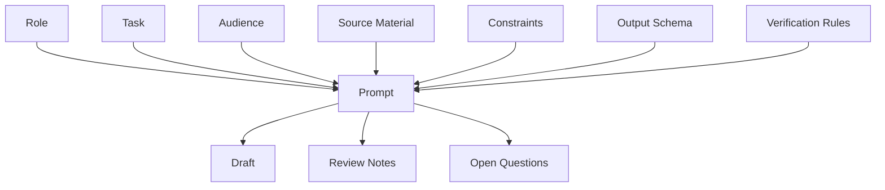
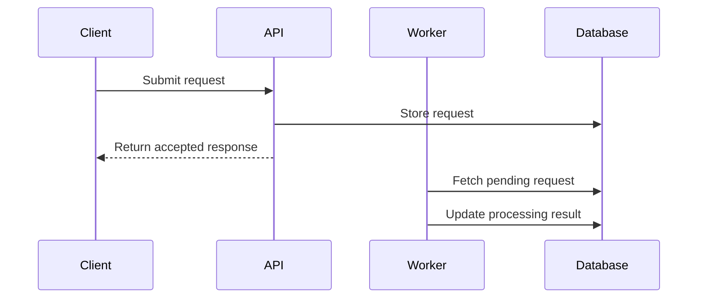
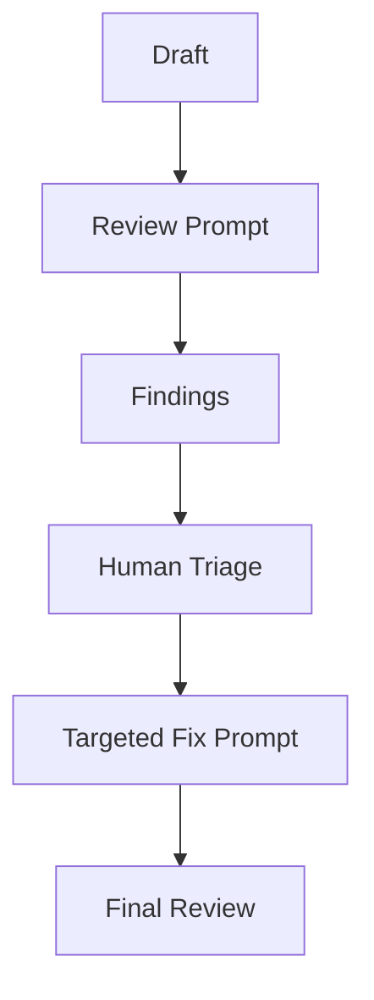
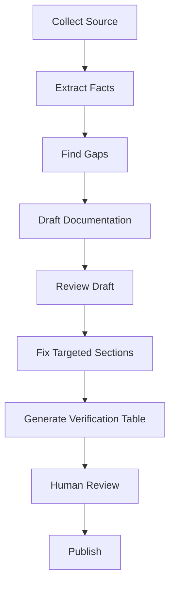
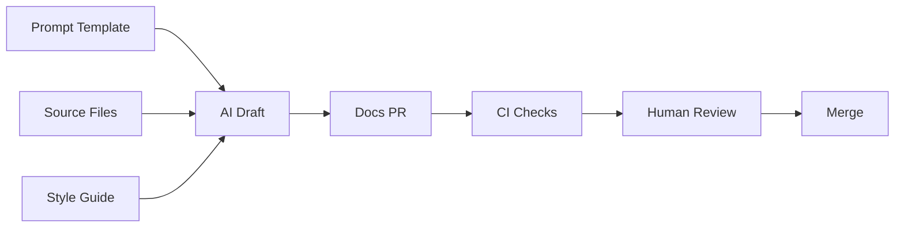
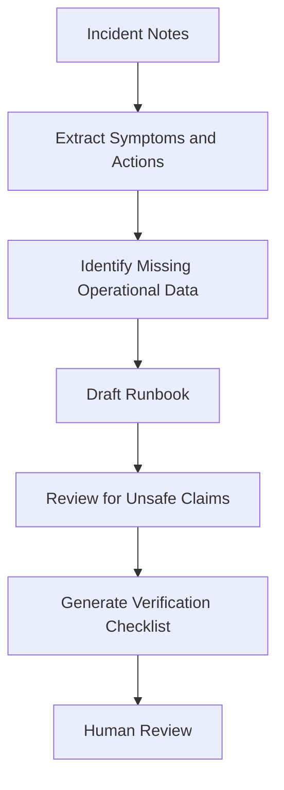

------
title: Learn AI-Driven Documentation and Technical Writing Implementation and Usage - Part 014
description: A deep practical guide to prompting for technical writing, including prompt anatomy, context design, output schemas, examples, verification, prompt versioning, evaluation, and reusable prompt templates.
series: learn-ai-driven-documentation
seriesTitle: Learn AI-Driven Documentation and Technical Writing Implementation and Usage
order: 14
partTitle: Prompting for Technical Writing
tags:
- ai
- documentation
- technical-writing
- prompt-engineering
- docs-as-code
- llm
- engineering-handbook
- series
date: 2026-06-30
---

# Part 014 — Prompting for Technical Writing

## 1. What We Are Learning in This Part

This part teaches how to design prompts for technical writing tasks in a way that is repeatable, reviewable, and safe for engineering documentation.

The objective is not to memorize prompt hacks. A top-level engineer treats prompts as **operational instructions** that must be:

- explicit
- testable
- versioned
- reusable
- source-grounded
- failure-aware
- aligned with documentation type
- aligned with reader intent

The target skill is:

> Design prompts that convert trusted source material into documentation artifacts without losing technical meaning, inventing facts, or hiding uncertainty.

By the end of this part, you should be able to:

1. Build a prompt for a specific documentation task.
2. Define audience, task, source boundary, style, and output format.
3. Use examples safely without overfitting the model to bad patterns.
4. Ask for verification tables, open questions, and source-grounded claims.
5. Version prompts like code.
6. Evaluate prompts using documentation quality criteria.
7. Create reusable prompt templates for engineering teams.

---

## 2. Kaufman Deconstruction: Prompting Is Not One Skill

Using Kaufman's method, we deconstruct prompting for technical writing into smaller sub-skills.

| Sub-Skill | Description | Why It Matters |
|---|---|---|
| Task definition | Describe the documentation job precisely | Prevents generic output |
| Audience modeling | Define reader knowledge, goal, and context | Improves relevance |
| Source boundary design | Tell the model what it can and cannot use | Prevents hallucination |
| Output schema design | Specify structure and formatting | Makes output reviewable |
| Style constraint design | Apply team writing rules | Keeps docs consistent |
| Verification design | Ask for claims, evidence, gaps, and uncertainty | Supports human review |
| Example selection | Provide good examples of desired output | Improves consistency |
| Failure handling | Tell model what to do when facts are missing | Prevents invented details |
| Prompt evaluation | Test prompt output against known cases | Prevents silent regression |
| Prompt versioning | Manage prompt changes as code | Supports production use |

A prompt is not just a request. For engineering documentation, a prompt is closer to a small specification.

---

## 3. The Prompt Anatomy for Technical Documentation

A strong technical writing prompt usually contains these components:



### 3.1 Role

The role tells the model what perspective to use.

Good:

```text
Act as a senior technical writer embedded in a platform engineering team.
```

Better:

```text
Act as a senior technical writer reviewing internal platform documentation for backend engineers who will operate the service in production.
```

Avoid vague roles:

```text
Act as an expert.
```

Expert in what? For whom? Under what constraints?

### 3.2 Task

The task should be specific.

Weak:

```text
Write documentation for this feature.
```

Stronger:

```text
Draft a task-based how-to guide that explains how an internal engineer can enable the reconciliation retry feature in a staging environment and verify that it works.
```

### 3.3 Audience

Audience determines vocabulary, depth, examples, warnings, and assumptions.

Examples:

```text
Audience: senior backend engineers who understand distributed systems but are new to this service.
```

```text
Audience: external API integrators who understand HTTP but do not know our internal architecture.
```

```text
Audience: on-call engineers who need a fast operational procedure during an incident.
```

### 3.4 Source Material

The prompt should clearly separate instructions from source material.

Example:

```text
Use only the source material inside <source> tags.
If the source does not contain a fact, mark it as missing.

<source>
...
</source>
```

### 3.5 Constraints

Constraints protect technical truth.

Examples:

```text
Do not invent commands, endpoint paths, environment names, owners, or version numbers.
```

```text
Preserve all thresholds, defaults, warning statements, and exception conditions exactly.
```

```text
Separate facts from assumptions.
```

### 3.6 Output Schema

Output schema makes the result predictable and reviewable.

Example:

```text
Return Markdown with these sections:
- Purpose
- Prerequisites
- Procedure
- Verification
- Rollback
- Troubleshooting
- Open Questions
```

### 3.7 Verification Rules

Verification rules make the model expose uncertainty.

Example:

```text
After the draft, include a table with:
- Technical claim
- Source evidence
- Confidence
- Human verification needed
```

---

## 4. The Core Prompt Template

This is the baseline template for most technical writing tasks.

```text
Act as a senior technical writer embedded in an engineering team.

Task:
<describe the exact documentation artifact>

Audience:
<describe reader role, prior knowledge, and job-to-be-done>

Source boundary:
- Use only the supplied source material.
- Do not invent missing facts.
- If a required detail is missing, write "Not specified in source material".

Writing constraints:
- Preserve technical meaning exactly.
- Preserve version numbers, thresholds, defaults, warnings, and limitations.
- Prefer short paragraphs and direct language.
- Use active voice where possible.
- Separate facts from assumptions.

Output format:
<define headings, table columns, code blocks, diagrams, or bullets>

Verification:
- Include open questions.
- Include claims that need human verification.
- Flag any destructive or security-sensitive operation.

Source material:
<source>
...
</source>
```

This template is intentionally explicit. In production documentation work, explicit beats clever.

---

## 5. The Five Prompt Design Questions

Before writing a prompt, answer these questions.

### 5.1 What Artifact Do I Need?

Do not ask for "docs". Ask for a specific artifact:

- tutorial
- how-to guide
- reference page
- explanation
- runbook
- ADR
- release note
- migration guide
- onboarding page
- troubleshooting article
- API example page
- glossary entry
- review checklist

### 5.2 Who Is the Reader?

Reader examples:

- new engineer
- service owner
- on-call engineer
- external developer
- support engineer
- auditor
- engineering manager
- product manager

### 5.3 What Is the Reader Trying to Do?

Examples:

- install something
- debug an error
- migrate versions
- understand a decision
- configure a service
- operate during an incident
- integrate with an API
- review a change

### 5.4 What Source Material Is Trusted?

Examples:

- code
- tests
- OpenAPI spec
- AsyncAPI spec
- ADR
- incident report
- PR description
- release plan
- ticket
- current docs
- architecture diagram

### 5.5 What Must the Model Not Do?

Examples:

- do not invent commands
- do not infer business intent
- do not write customer-facing claims
- do not change terminology
- do not remove warnings
- do not turn assumptions into facts

---

## 6. Prompting by Documentation Type

Different documentation types require different prompts. A generic prompt gives generic docs.

## 6.1 Tutorial Prompt

A tutorial helps a reader learn by completing a guided path.

```text
Create a tutorial from the supplied source material.

Audience:
- Experienced backend engineer new to this service.

Goal:
- Help the reader complete a safe end-to-end learning exercise.

Rules:
- The tutorial must be runnable in a non-production environment.
- Do not include destructive operations.
- Do not invent commands, URLs, or sample data.
- Explain why each major step matters.
- Keep the path linear.
- Include checkpoints after major steps.

Output sections:
- What You Will Build
- Prerequisites
- Step-by-Step Tutorial
- Checkpoints
- Common Mistakes
- Cleanup
- Next Steps
- Open Questions

Source:
<source>
```

Key constraint:

> A tutorial should optimize for learning, not exhaustive reference.

## 6.2 How-To Guide Prompt

A how-to guide helps a reader complete a specific task.

```text
Create a how-to guide from the supplied source material.

Audience:
- Internal platform engineer who already understands the system basics.

Task:
- <specific task>

Rules:
- Focus only on the task.
- Do not explain unrelated concepts.
- Include prerequisites.
- Include verification.
- Include rollback if the task changes state.
- Mark missing details explicitly.

Output sections:
- Purpose
- Prerequisites
- Procedure
- Verification
- Rollback
- Troubleshooting
- Related Docs

Source:
<source>
```

Key constraint:

> A how-to guide should be task-focused and outcome-oriented.

## 6.3 Reference Prompt

Reference documentation must be complete, consistent, and precise.

```text
Create a reference page from the supplied source material.

Audience:
- Engineers who need exact behavior, fields, defaults, and constraints.

Rules:
- Prioritize precision over explanation.
- Preserve names and values exactly.
- Use tables where possible.
- Do not infer defaults.
- If a value is not specified, mark it as "Not specified".

Output sections:
- Overview
- Parameters
- Defaults
- Constraints
- Examples
- Error Conditions
- Compatibility
- Notes

Source:
<source>
```

Key constraint:

> A reference page should be scannable and exact.

## 6.4 Explanation Prompt

Explanation documentation helps readers understand why a system works as it does.

```text
Create an explanation article from the supplied source material.

Audience:
- Senior engineers who need to understand the design rationale.

Rules:
- Explain context, trade-offs, and consequences.
- Do not include step-by-step instructions unless needed as examples.
- Preserve uncertainty and unresolved questions.
- Do not invent historical intent.
- Separate current behavior from rationale.

Output sections:
- Problem Context
- Design Overview
- Key Trade-Offs
- Consequences
- Alternatives
- Limitations
- Related Decisions

Source:
<source>
```

Key constraint:

> Explanation should clarify reasoning, not become a procedure.

---

## 7. Prompting for Reader State

Reader state matters more than many teams realize.

A reader may be:

- learning
- debugging
- migrating
- operating under incident pressure
- integrating
- reviewing
- auditing
- deciding

Each state requires different output.

| Reader State | Prompt Emphasis |
|---|---|
| Learning | guided path, explanation, safe sandbox |
| Debugging | symptoms, causes, checks, escalation |
| Migrating | compatibility, steps, verification, rollback |
| Operating | fast procedure, warnings, metrics, escalation |
| Integrating | contracts, examples, errors, limits |
| Reviewing | diff impact, risk, checklist |
| Auditing | evidence, approvals, traceability |
| Deciding | alternatives, trade-offs, consequences |

Prompt example:

```text
Write for an on-call engineer during an active incident. Prioritize fast diagnosis, safe commands, escalation criteria, and verification. Avoid long conceptual explanations.
```

This produces very different documentation than:

```text
Write for a new engineer learning the architecture. Prioritize conceptual model, terminology, and progressive examples.
```

---

## 8. Prompting for Source Grounding

Source grounding means the output must be traceable to supplied material.

### 8.1 Basic Source Grounding

```text
Use only the supplied source material. If the source is insufficient, say so.
```

### 8.2 Stronger Source Grounding

```text
For each technical claim, include the source section or excerpt that supports it.
```

### 8.3 Claim Table

```text
After the documentation draft, add a claim verification table:

| Claim | Source Evidence | Confidence | Human Verification Needed |
```

### 8.4 Gap Table

```text
Add a gap table:

| Missing Detail | Why It Matters | Suggested Owner | Blocking? |
```

### 8.5 Source Conflict Handling

```text
If sources conflict, do not choose one silently. List the conflict and explain what must be verified by a human.
```

This is essential when using:

- old docs
- PR descriptions
- design docs
- code
- incident reports
- tickets
- generated specs

---

## 9. Prompting for Style Guide Compliance

Style guide compliance should be explicit.

### 9.1 Minimal Style Constraint

```text
Use concise, direct language. Prefer active voice. Avoid marketing language. Use consistent terminology.
```

### 9.2 Engineering Style Constraint

```text
Follow these style rules:
- Use second person for instructions.
- Use imperative verbs for steps.
- Use present tense for current behavior.
- Avoid future tense unless describing planned behavior.
- Avoid vague adjectives such as robust, seamless, powerful, and easy.
- Do not use absolute claims such as always, never, guaranteed, or zero unless source material states them.
- Use code formatting for commands, filenames, environment variables, and config keys.
```

### 9.3 Terminology Constraint

```text
Use these canonical terms:
- settlement record, not settlement item
- reconciliation worker, not reconciliation service
- retry window, not retry period

If the source uses variants, preserve source excerpts but normalize final documentation to the canonical term.
```

### 9.4 Style Guide Injection Pattern

```text
Apply the following style guide rules to the output.

<style-guide>
...
</style-guide>

Do not mention the style guide in the final answer unless explaining a review finding.
```

---

## 10. Prompting with Examples

Examples are powerful because they show the model the desired output shape.

### 10.1 When to Use Examples

Use examples when:

- the team has a specific documentation style
- output format is unusual
- you need consistent release notes
- you need consistent ADRs
- the model keeps producing generic docs

### 10.2 Example Pattern

```text
Use the following example only as a style and structure reference.
Do not copy facts from the example.

<example>
# How to Rotate the API Signing Key
...
</example>

Now create a new how-to guide using only this source:
<source>
...
</source>
```

### 10.3 Example Safety Rule

Examples can contaminate output. The model may copy values, service names, warnings, or assumptions from the example.

Always say:

```text
Use the example for structure and style only. Do not reuse facts, names, commands, URLs, values, or warnings from it.
```

### 10.4 Good Example Selection

Good examples are:

- accurate
- recent
- concise
- reviewed
- close to the target artifact type
- free from secrets
- free from legacy naming

Bad examples create bad outputs.

---

## 11. Prompting for Tables

Tables are useful for reference docs, configuration docs, API docs, risk registers, and review findings.

### 11.1 Configuration Reference Prompt

```text
Create a configuration reference table from the supplied source material.

Columns:
- Name
- Type
- Default
- Required
- Description
- Allowed Values
- Environment
- Source

Rules:
- Do not infer defaults.
- If default is missing, write "Not specified".
- Preserve config names exactly.
- Do not invent allowed values.

Source:
<source>
```

### 11.2 Risk Table Prompt

```text
Extract risks from the supplied design notes.

Columns:
- Risk
- Cause
- Impact
- Mitigation
- Confidence
- Source Evidence
- Owner Needed

Rules:
- Do not invent mitigations.
- If mitigation is absent, write "No mitigation specified".
```

### 11.3 Review Findings Prompt

```text
Review the document and return findings in a table.

Columns:
- Severity
- Section
- Issue
- Why It Matters
- Recommended Fix
```

Tables force structure. Structure improves reviewability.

---

## 12. Prompting for Code Blocks and Commands

Commands are dangerous because readers may execute them.

### 12.1 Command Safety Constraint

```text
Do not generate commands unless they appear in the source material.
If a command may modify or delete data, label it as destructive and require confirmation.
```

### 12.2 Command Explanation Pattern

```text
For each command, include:
- What it does
- Where to run it
- Required permissions
- Expected output
- Failure signs
- Whether it is safe or destructive
```

### 12.3 Example Output

```md
```bash
./gradlew test
```

Use this command from the repository root to run the test suite. It does not modify persistent data.
```

### 12.4 Anti-Pattern

Bad prompt:

```text
Add useful commands to this runbook.
```

Why bad:

- AI may invent commands.
- Commands may be destructive.
- Environment assumptions may be wrong.

Better:

```text
Only include commands from the supplied source. If useful commands are missing, list them as gaps instead of inventing them.
```

---

## 13. Prompting for Mermaid Diagrams

Diagrams are useful but risky because they can imply relationships that do not exist.

### 13.1 Mermaid Prompt Template

```text
Create a Mermaid diagram from the supplied source material.

Diagram type:
- flowchart / sequenceDiagram / stateDiagram-v2 / classDiagram / journey

Rules:
- Use only entities and relationships present in the source.
- Do not infer services, queues, retries, or states.
- Preserve sync vs async behavior if specified.
- After the diagram, list any assumptions or missing details.

Source:
<source>
```

### 13.2 Sequence Diagram Example



### 13.3 Review Checklist

- Are all nodes real components?
- Are arrows directionally correct?
- Is async behavior represented correctly?
- Are missing error paths called out?
- Does the diagram match the text?

---

## 14. Prompting for Review, Not Generation

Sometimes the best prompt is not "write this" but "review this".

### 14.1 Review Prompt

```text
Review this documentation draft for engineering quality.

Check:
- technical accuracy risks
- missing prerequisites
- ambiguous terminology
- unsupported claims
- unsafe commands
- missing verification steps
- unclear rollback
- mixed documentation modes

Rules:
- Do not rewrite the document.
- Return a findings table.
- Assign severity: Critical / Major / Minor.

Draft:
<doc>
```

### 14.2 Why Review Prompts Are Powerful

Review prompts expose issues before rewriting. This keeps humans in control.



### 14.3 Targeted Fix Prompt

```text
Rewrite only the "Verification" section to address findings 2 and 3.
Do not modify other sections.
Preserve all existing command names and config values.
```

Targeted prompts are safer than broad rewrites.

---

## 15. Prompting for Uncertainty

A serious technical writing prompt must tell the model how to handle uncertainty.

### 15.1 Bad Uncertainty Handling

```text
Make the docs complete.
```

This invites invention.

### 15.2 Good Uncertainty Handling

```text
If source material is incomplete, add an "Open Questions" section.
Do not fill missing details from general knowledge.
```

### 15.3 Assumption Table

```text
Add an assumption table:

| Assumption | Why It Might Be Needed | Evidence | Verification Owner |
```

### 15.4 Conflict Table

```text
If the source material contains conflicting statements, add a conflict table:

| Topic | Source A Says | Source B Says | Required Resolution |
```

This is especially useful for enterprise docs, where multiple sources often disagree.

---

## 16. Prompting for Claim Discipline

AI often writes too confidently. Claim discipline prevents overstatement.

### 16.1 Forbidden Claims

Tell the model to avoid unsupported claims like:

- guaranteed
- always
- never
- zero downtime
- fully secure
- completely safe
- production-ready
- seamless
- automatically handles all cases

### 16.2 Claim Discipline Prompt

```text
Avoid absolute claims unless directly supported by the source material.
Replace vague adjectives with specific behavior.
If the source says a behavior reduces risk, do not rewrite it as a guarantee.
```

### 16.3 Example

Bad:

```md
The retry mechanism guarantees successful settlement reconciliation.
```

Better:

```md
The retry mechanism keeps unmatched settlement records eligible for retry until the configured retry window expires.
```

The second version describes behavior without overstating outcome.

---

## 17. Prompting for Release Notes

### 17.1 Release Notes Prompt

```text
Create release notes from the supplied PR summaries.

Audience:
- Internal engineers and support team.

Rules:
- Group changes into Added, Changed, Fixed, Deprecated, Removed, Migration Notes, Operational Notes, and Known Limitations.
- Do not include internal implementation details unless they affect usage, operation, migration, or support.
- Do not claim user impact unless explicitly stated.
- Preserve feature flags, rollout constraints, and version numbers.
- Mark unclear impact as "Needs verification".

Source:
<pr summaries>
```

### 17.2 Verification Prompt

```text
Review these release notes against the source PR summaries.
Find:
- unsupported claims
- missing breaking changes
- unclear migration impact
- missing operational notes
- vague wording
```

Release notes should be verified because they often become communication artifacts for support, operations, and customers.

---

## 18. Prompting for ADRs

### 18.1 ADR Draft Prompt

```text
Draft an Architecture Decision Record from the supplied source material.

Output sections:
- Title
- Status
- Context
- Decision
- Consequences
- Alternatives Considered
- Trade-Offs
- Follow-Up Actions
- Open Questions

Rules:
- Do not invent the decision.
- Preserve dissent and unresolved trade-offs.
- If status is not specified, write "Proposed".
- If consequences are not stated, write "Not specified in source material".
```

### 18.2 ADR Review Prompt

```text
Review this ADR for decision quality.

Check:
- Is the decision explicit?
- Is the context sufficient?
- Are alternatives fairly represented?
- Are consequences clear?
- Are trade-offs visible?
- Are open questions separated from decisions?
```

A good ADR prompt should make ambiguity visible instead of converting it into false certainty.

---

## 19. Prompting for Runbooks

### 19.1 Runbook Prompt

```text
Create an operational runbook from the supplied source material.

Audience:
- On-call engineer during an incident.

Rules:
- Prioritize safe, fast diagnosis.
- Do not invent commands, dashboards, alerts, or escalation contacts.
- Mark destructive actions clearly.
- Separate diagnosis, mitigation, rollback, and escalation.
- Include verification steps.
- If rollback is missing, mark it as a critical gap.

Output sections:
- Scope
- Symptoms
- Immediate Checks
- Diagnosis
- Mitigation
- Verification
- Rollback
- Escalation
- Known Risks
- Gaps
```

### 19.2 Runbook Safety Rule

Never ask AI to "make a runbook complete" without source material. Runbooks are operational artifacts. Incorrect steps can cause harm.

---

## 20. Prompting for API Documentation

### 20.1 API Endpoint Prompt

```text
Create API endpoint documentation from the supplied OpenAPI excerpt and notes.

Rules:
- Treat the OpenAPI excerpt as the source of truth for path, method, parameters, request body, response schema, and status codes.
- Do not invent fields or status codes.
- Preserve enum values exactly.
- Mark undocumented behavior as missing.

Output sections:
- Overview
- Endpoint
- Authentication
- Request Parameters
- Request Body
- Responses
- Errors
- Examples
- Notes
```

### 20.2 API Example Safety

```text
Generate examples only using fields present in the schema.
Use placeholder values that cannot be mistaken for real customer data.
```

### 20.3 API Review Prompt

```text
Compare this API documentation against the supplied OpenAPI spec.
Return mismatches in a table.
```

---

## 21. Prompting for Troubleshooting Docs

### 21.1 Troubleshooting Prompt

```text
Create a troubleshooting article from the supplied support tickets and incident notes.

Rules:
- Separate observed symptoms from suspected causes.
- Do not invent root causes.
- Do not include unverified fixes as confirmed fixes.
- Label workarounds as temporary if the source does not prove they are permanent.
- Include escalation criteria.

Output sections:
- Symptom
- Confirm the Problem
- Likely Causes
- Resolution Steps
- Workarounds
- Verification
- Escalation
- Related Logs and Metrics
- Open Questions
```

### 21.2 Troubleshooting Review Prompt

```text
Review this troubleshooting article for unsafe or unsupported causal claims.
```

---

## 22. Prompting for Regulated or Auditable Docs

Regulated documentation requires source traceability and review discipline.

### 22.1 Audit-Oriented Prompt

```text
Draft an auditable documentation section from the supplied source material.

Rules:
- Use precise, evidence-backed language.
- Do not make legal, compliance, or control-effectiveness claims unless present in the source.
- Include source evidence for each control statement.
- Separate implemented behavior from intended behavior.
- Include review owner and approval gaps.

Output sections:
- Control Context
- Implemented Behavior
- Evidence
- Limitations
- Review Requirements
- Open Questions
```

### 22.2 Claim Review Prompt

```text
Identify any compliance, legal, security, or audit claims that require human approval.
```

AI can help organize regulated docs, but it cannot replace accountable control ownership.

---

## 23. Prompt Anti-Patterns

### 23.1 The Generic Request

Bad:

```text
Write documentation for this service.
```

Problem:

- no audience
- no artifact type
- no source boundary
- no verification rule
- no style guide

### 23.2 The Completeness Trap

Bad:

```text
Make this runbook complete.
```

Problem:

- encourages invented commands
- hides missing source material
- creates operational risk

### 23.3 The Polishing Trap

Bad:

```text
Make this sound better.
```

Problem:

- may remove caveats
- may replace precise terms
- may overclaim

### 23.4 The Expert Trap

Bad:

```text
As an expert, explain the architecture.
```

Problem:

- invites general knowledge
- may ignore local constraints
- may sound authoritative without evidence

### 23.5 The One-Shot Giant Prompt

Bad:

```text
Read all this and create the final handbook page.
```

Problem:

- hard to review
- assumptions are hidden
- output may blend conflicting sources

Better workflow:

1. Extract facts.
2. Identify gaps.
3. Draft sections.
4. Review claims.
5. Human verifies.
6. Publish.

---

## 24. Multi-Step Prompt Workflow

For important docs, use a staged workflow.



### 24.1 Step 1 — Extract

```text
Extract facts, assumptions, risks, commands, and open questions from the source.
Do not write final documentation.
```

### 24.2 Step 2 — Gap Analysis

```text
Compare extracted facts against the target documentation template and list missing information.
```

### 24.3 Step 3 — Draft

```text
Draft the documentation using only verified extracted facts.
```

### 24.4 Step 4 — Review

```text
Review the draft for unsupported claims, missing prerequisites, unsafe commands, and unclear rollback.
```

### 24.5 Step 5 — Targeted Revision

```text
Revise only the sections with Major or Critical findings.
```

This workflow is slower than one-shot generation, but much safer.

---

## 25. Prompt Versioning

Prompts used repeatedly in an engineering organization should be versioned like code.

### 25.1 Why Version Prompts?

Prompt changes can alter output quality, style, risk, and completeness.

A changed prompt may:

- remove verification tables
- weaken source constraints
- change tone
- overproduce long docs
- omit warnings
- change section order
- generate different risk labels

### 25.2 Prompt Repository Structure

```text
/docs-ai/
  prompts/
    release-notes.prompt.md
    runbook-draft.prompt.md
    adr-draft.prompt.md
    troubleshooting-review.prompt.md
  evals/
    release-notes/
      input-001.md
      expected-001.md
      rubric.md
    runbook/
      input-001.md
      expected-001.md
      rubric.md
  style-guide/
    engineering-docs-style.md
  README.md
```

### 25.3 Prompt Frontmatter

```md
---
id: runbook-draft
version: 1.3.0
owner: platform-docs
riskLevel: high
requiredReviewers:
  - service-owner
  - sre
lastReviewed: 2026-06-30
---
```

### 25.4 Prompt Change Checklist

- What changed?
- Why was it changed?
- Which outputs are affected?
- Was it evaluated on sample inputs?
- Did it preserve source constraints?
- Did it preserve verification requirements?
- Was reviewer approval required?

---

## 26. Prompt Evaluation for Documentation

A prompt should be tested against realistic examples.

### 26.1 Evaluation Dimensions

| Dimension | Question |
|---|---|
| Grounding | Are claims supported by source? |
| Completeness | Are required sections present? |
| Precision | Are values, names, and constraints preserved? |
| Style | Does output follow the style guide? |
| Safety | Are risky operations flagged? |
| Uncertainty | Are missing facts and assumptions visible? |
| Reviewability | Is output easy to review? |
| Usefulness | Can the target reader complete the task? |

### 26.2 Simple Rubric

```md
# Prompt Evaluation Rubric

Score each category from 1 to 5.

## Grounding
5 = every technical claim maps to source material
3 = mostly grounded, minor unsupported claims
1 = many invented or unsupported claims

## Completeness
5 = all required sections present and useful
3 = required sections present but shallow
1 = missing important sections

## Safety
5 = unsafe/destructive operations clearly flagged
3 = some warnings present but incomplete
1 = risky steps unmarked
```

### 26.3 Regression Test Idea

Keep test cases where old prompts failed:

- missing rollback information
- conflicting source material
- unsupported security claim
- stale version number
- destructive command
- ambiguous owner

A good prompt should handle these cases explicitly.

---

## 27. Prompt Library for Engineering Documentation

Teams should maintain a prompt library instead of relying on ad hoc chats.

### 27.1 Library Categories

| Category | Prompt Examples |
|---|---|
| Drafting | how-to, runbook, ADR, release notes |
| Review | style review, technical risk review, claim review |
| Extraction | decisions, assumptions, risks, commands |
| Transformation | README to handbook, notes to procedure |
| Validation | spec mismatch, missing prerequisites, stale claims |
| Governance | AI usage disclosure, review checklist |

### 27.2 Prompt Library Entry

Each prompt should include:

- purpose
- expected input
- expected output
- risk level
- owner
- review requirements
- examples
- known failure modes
- evaluation cases

### 27.3 Example Library Entry

```md
# Prompt: Runbook Draft

## Purpose
Draft operational runbooks from verified source material.

## Risk Level
High

## Required Inputs
- incident notes or existing operational procedure
- known alerts or metrics
- verified commands
- escalation path

## Required Review
- service owner
- SRE/on-call owner

## Known Failure Modes
- invents commands
- overstates root cause
- omits rollback
```

---

## 28. Prompting in Docs-as-Code Workflow

Prompts become most valuable when integrated into docs-as-code.



### 28.1 Practical Workflow

1. Store approved prompts in the repo.
2. Run AI drafting locally or through an internal tool.
3. Commit generated draft as normal Markdown/MDX.
4. Run docs CI.
5. Require human review based on risk level.
6. Track AI usage in PR description.

### 28.2 PR Disclosure

```md
## AI Assistance

Prompt used:
- `docs-ai/prompts/runbook-draft.prompt.md@1.3.0`

Source material:
- `incidents/2026-06-20-reconciliation-delay.md`
- `docs/runbooks/reconciliation.md`

Human verification:
- [ ] Commands verified
- [ ] Rollback verified
- [ ] Alerts verified
- [ ] Escalation path verified
```

---

## 29. Practical Prompt Templates

### 29.1 Rewrite Without Meaning Change

```text
Rewrite the following documentation for clarity.

Rules:
- Preserve technical meaning exactly.
- Do not add facts.
- Do not remove caveats, warnings, thresholds, defaults, or limitations.
- Keep domain terminology unchanged.
- Use shorter sentences and paragraphs.

Text:
<text>
```

### 29.2 Extract Decisions

```text
Extract decisions from the source material.

Columns:
- Decision
- Status
- Rationale
- Alternatives Mentioned
- Consequences
- Source Evidence
- Open Questions

Rules:
- Do not invent decisions.
- Preserve uncertainty.

Source:
<source>
```

### 29.3 Find Documentation Gaps

```text
Compare the source material against this required documentation template.

Required sections:
- Overview
- Prerequisites
- Procedure
- Verification
- Rollback
- Troubleshooting
- Ownership

Return missing sections and why each gap matters.

Source:
<source>
```

### 29.4 Review for Unsupported Claims

```text
Review the draft for unsupported technical claims.

Return:
- Claim
- Section
- Why unsupported
- Required source evidence
- Suggested correction

Draft:
<draft>

Source:
<source>
```

### 29.5 Generate Open Questions

```text
Read the source material and draft.
List questions that must be answered before publication.
Prioritize questions that affect correctness, safety, operation, or compliance.
```

---

## 30. Advanced Pattern: Prompt Chaining for Documentation

Prompt chaining splits work into stages.

### 30.1 Example Chain for Runbook Creation



### 30.2 Why Chain?

Prompt chaining improves:

- reviewability
- control
- debuggability
- source grounding
- risk isolation

If final output is wrong, you can identify whether the error came from extraction, drafting, or review.

### 30.3 When Not to Chain

Do not over-engineer simple tasks like grammar cleanup or title suggestions.

Use chains for:

- runbooks
- migration guides
- ADRs
- release notes
- compliance docs
- incident docs
- architecture docs

---

## 31. Troubleshooting Prompt Failures

### 31.1 Output Is Too Generic

Fix by adding:

- audience
- task
- source material
- output schema
- examples
- forbidden behavior

### 31.2 Output Invents Details

Fix by adding:

```text
Use only supplied source material. Mark missing details explicitly.
```

Also ask for a claim verification table.

### 31.3 Output Is Too Long

Fix by adding:

```text
Keep each section under 150 words unless technical detail is required.
Prefer tables for reference information.
```

### 31.4 Output Ignores Style

Fix by supplying:

- style guide excerpt
- good example
- bad example
- explicit style rules

### 31.5 Output Hides Gaps

Fix by requiring:

```text
Add an Open Questions section and a Missing Source Details table.
```

### 31.6 Output Mixes Facts and Assumptions

Fix by requiring:

```text
Separate facts, assumptions, and recommendations into different sections.
```

---

## 32. The Prompt Review Checklist

Before using a prompt for engineering docs, check:

- Does it define the artifact type?
- Does it define the audience?
- Does it include trusted source material?
- Does it forbid invention?
- Does it preserve technical meaning?
- Does it specify output structure?
- Does it ask for missing information?
- Does it include verification requirements?
- Does it flag unsafe operations?
- Does it define review expectations?
- Is it reusable?
- Is it versioned if used repeatedly?

---

## 33. Practice Drill: Build a Prompt Suite

Create a prompt suite for one service.

### 33.1 Required Prompts

1. README cleanup prompt.
2. How-to guide draft prompt.
3. Runbook review prompt.
4. Release notes prompt.
5. ADR extraction prompt.
6. Documentation gap analysis prompt.

### 33.2 Evaluation Inputs

Use real or realistic source material:

- one PR description
- one existing README
- one incident note
- one config file excerpt
- one design decision note

### 33.3 Evaluation Criteria

For each prompt, score:

- grounding
- completeness
- style
- safety
- usefulness
- reviewability

### 33.4 Expected Outcome

At the end of this drill, you should have:

- reusable prompt templates
- sample inputs
- expected output examples
- known failure modes
- review checklist

This is the beginning of a real internal AI documentation system.

---

## 34. Mastery Checklist

You are ready to move to the next part when you can:

- Write prompts with role, task, audience, source boundary, constraints, output schema, and verification rules.
- Explain why artifact type changes prompt design.
- Prevent AI from inventing missing documentation facts.
- Use examples without contaminating output.
- Ask for open questions, gap tables, and claim verification tables.
- Design prompts for tutorials, how-to guides, reference docs, explanations, runbooks, ADRs, release notes, and API docs.
- Version prompts in a repository.
- Evaluate prompt quality with a rubric.
- Use prompt chaining for high-risk documentation tasks.

---

## 35. Key Takeaways

1. A technical writing prompt is a small specification, not a casual request.
2. The most important prompt fields are task, audience, source boundary, constraints, output schema, and verification rules.
3. Good prompts make missing information visible.
4. Good prompts preserve technical meaning instead of optimizing only for fluency.
5. Examples improve consistency but can contaminate facts if not bounded.
6. High-risk docs should use prompt chains: extract, gap-check, draft, review, verify.
7. Reusable prompts should be versioned, reviewed, and evaluated like code.

---

## 36. References

- OpenAI API Documentation — Prompt Engineering Guide: https://developers.openai.com/api/docs/guides/prompt-engineering
- OpenAI API Documentation — Prompt Guidance: https://developers.openai.com/api/docs/guides/prompt-guidance
- Google Developer Documentation Style Guide: https://developers.google.com/style
- Microsoft Writing Style Guide: https://learn.microsoft.com/en-us/style-guide/welcome/
- Microsoft Writing Style Guide — Writing Step-by-Step Instructions: https://learn.microsoft.com/en-us/style-guide/procedures-instructions/writing-step-by-step-instructions
- Microsoft Writing Style Guide — Formatting Text in Instructions: https://learn.microsoft.com/en-us/style-guide/procedures-instructions/formatting-text-in-instructions
- Write the Docs — Docs as Code: https://www.writethedocs.org/guide/docs-as-code/
