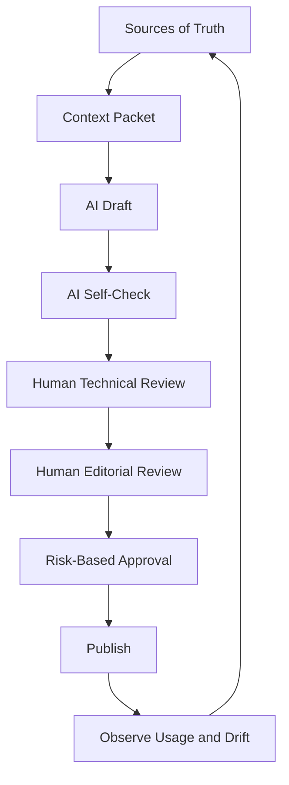
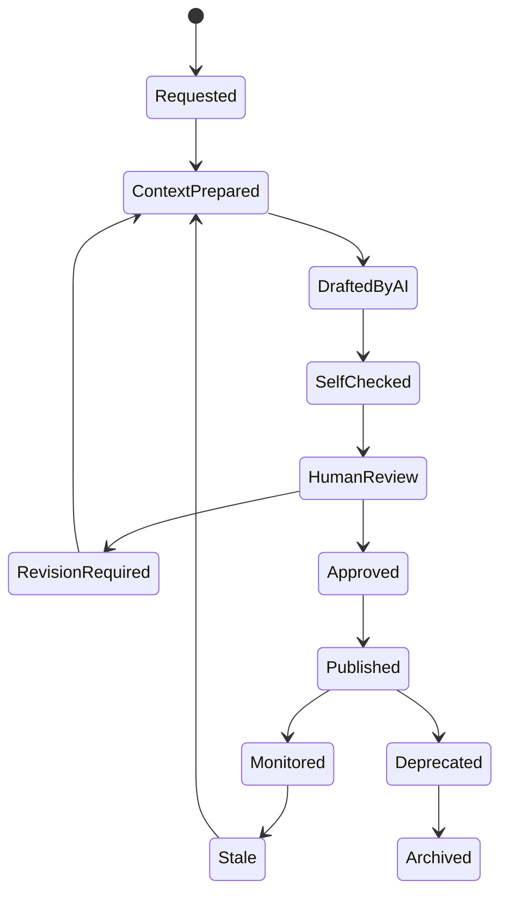
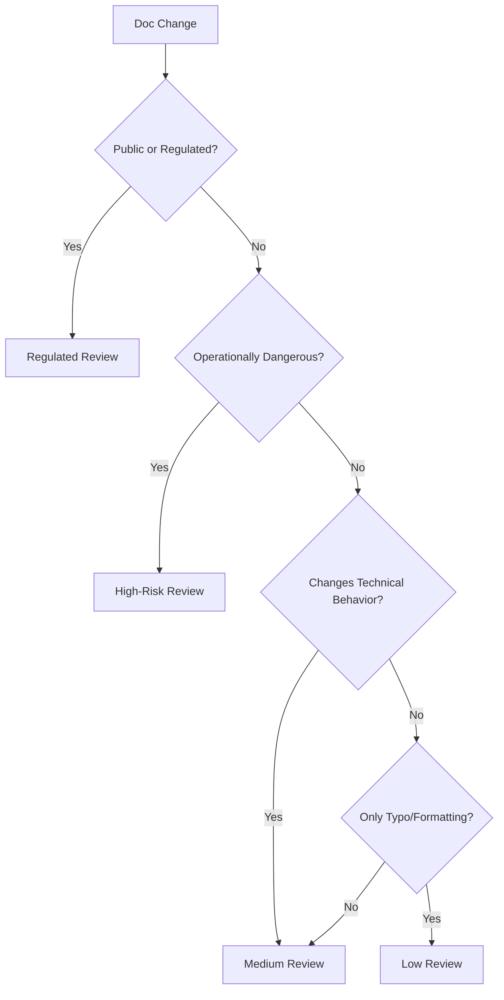
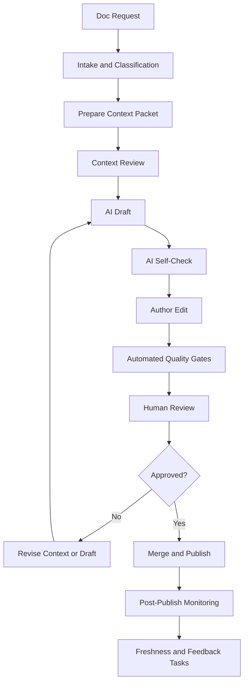

------
title: Learn AI-Driven Documentation and Technical Writing Implementation and Usage - Part 016
description: A deep practical guide to human-in-the-loop workflows for AI-assisted documentation, including lifecycle states, review roles, verification matrices, risk-based approval, PR workflows, governance, and operational failure modes.
series: learn-ai-driven-documentation
seriesTitle: Learn AI-Driven Documentation and Technical Writing Implementation and Usage
order: 16
partTitle: Human-in-the-Loop Documentation Workflow
tags:
- ai
- documentation
- technical-writing
- human-in-the-loop
- governance
- docs-as-code
- review-workflow
- engineering-handbook
- series
date: 2026-06-30
---

# Part 016 — Human-in-the-Loop Documentation Workflow

## 1. What We Are Learning in This Part

This part teaches how to design a **human-in-the-loop documentation workflow** for AI-assisted technical writing.

The core principle is simple:

> AI may draft, transform, summarize, compare, and suggest. Humans own truth, risk, approval, and publication.

In mature engineering organizations, documentation is not published because it sounds fluent. It is published because the right people verified the right claims against the right sources under the right risk model.

The target skill is:

> Build a documentation workflow where AI accelerates drafting and review, while humans retain accountability for correctness, safety, governance, and final publication.

By the end of this part, you should be able to:

1. Define lifecycle states for AI-assisted documentation.
2. Create risk-based review paths.
3. Assign reviewer roles and responsibilities.
4. Build verification matrices for generated claims.
5. Use AI to assist review without replacing ownership.
6. Design PR templates and quality gates for AI-generated docs.
7. Prevent AI-generated documentation from bypassing engineering governance.
8. Debug workflow failures like stale approvals, unclear ownership, and review fatigue.

---

## 2. Kaufman Deconstruction: Human-in-the-Loop Is Not Just “Review It”

Using Kaufman's method, we deconstruct the workflow into sub-skills.

| Sub-Skill | Description | Failure If Missing |
|---|---|---|
| Work intake | Define doc request, target audience, scope, and urgency | AI drafts the wrong artifact |
| Risk classification | Decide review depth based on impact | Low-risk and high-risk docs get same process |
| Context approval | Check whether sources are valid before generation | AI drafts from bad context |
| Draft generation | Use AI to create a structured first draft | Human starts from blank page unnecessarily |
| Claim verification | Compare generated claims against sources | Fluent errors slip through |
| Technical review | Validate correctness with domain owners | Docs drift from implementation |
| Editorial review | Improve clarity, structure, style, and usability | Correct docs remain hard to use |
| Security review | Prevent leakage and unsafe instructions | Docs expose sensitive or dangerous material |
| Compliance review | Verify regulated claims and evidence | Audit-defensible docs fail later |
| Publish gate | Enforce conditions before merge/release | Drafts become truth too early |
| Feedback loop | Learn from usage, incidents, search, and support | Docs decay silently |

A human-in-the-loop workflow is not a single approval checkbox. It is a control system.

---

## 3. The Core Mental Model: AI as Accelerator, Human as Accountable Owner

AI is useful for reducing blank-page cost and review friction. It is not a replacement for source ownership.



The model should not be framed as:

> Human vs AI.

It should be framed as:

> AI handles transformation work; humans handle accountability work.

Transformation work includes:

- summarizing source material
- restructuring messy notes
- converting PRs into release notes
- generating initial how-to steps
- producing verification tables
- finding missing sections
- normalizing terminology
- proposing diagrams

Accountability work includes:

- deciding what is true
- deciding what is safe
- approving operational actions
- approving public claims
- resolving conflicts
- signing off regulated content
- accepting residual risk

---

## 4. Documentation Lifecycle States

AI-assisted documentation should have explicit states.



Recommended lifecycle states:

| State | Meaning | Owner |
|---|---|---|
| Requested | Someone needs a doc change | Requester |
| Context Prepared | Sources, task, reader, and risk are defined | Author / doc owner |
| Drafted by AI | AI created a draft from context | Author |
| Self-Checked | AI or tooling produced verification notes | Author |
| Human Review | Human reviewers verify correctness and usability | Reviewers |
| Revision Required | Draft needs changes | Author |
| Approved | Required reviewers signed off | Owners |
| Published | Content merged/released | Maintainer |
| Monitored | Usage, freshness, and feedback are tracked | Owner |
| Stale | Freshness or source dependency is broken | Owner |
| Deprecated | Content no longer recommended | Owner |
| Archived | Retained only for history | Maintainer |

The lifecycle must be visible in metadata, PR labels, or issue tracker state—not hidden in someone's memory.

---

## 5. Risk-Based Review Model

Not every doc needs the same review depth.

A typo fix should not require architecture board approval. A runbook that includes destructive database commands should not be merged with only editorial review.

### 5.1 Risk Levels

| Risk Level | Examples | Required Review |
|---|---|---|
| Low | typo, formatting, broken link, glossary correction | author or peer review |
| Medium | internal how-to, onboarding page, service README | technical owner + optional editorial review |
| High | runbook, incident procedure, migration guide, security-sensitive setup | technical owner + operational/security review |
| Regulated | audit evidence, compliance procedure, public legal-sensitive statement | domain owner + compliance/legal/security approval |

### 5.2 Risk Classifier

A doc change should be classified using impact dimensions:

| Dimension | Questions |
|---|---|
| Operational impact | Could someone execute a damaging action? |
| Security impact | Could it expose secrets, architecture, vulnerabilities, or unsafe practices? |
| Customer impact | Could users make wrong business decisions? |
| Compliance impact | Could it affect audit, legal, or regulatory posture? |
| Financial impact | Could it cause billing, payment, or entitlement errors? |
| Availability impact | Could it affect production uptime? |
| Public visibility | Is it external or internal only? |
| Source uncertainty | Are sources conflicting, stale, or incomplete? |

### 5.3 Mermaid Decision Model



The risk model prevents two common failures:

1. Over-reviewing trivial docs until everyone ignores the process.
2. Under-reviewing dangerous docs because they look like normal Markdown.

---

## 6. Role Model and Responsibility Boundaries

A mature workflow separates roles.

| Role | Responsibility | Should Not Do Alone |
|---|---|---|
| Requester | Explains need and expected outcome | Approve technical truth unless owner |
| Author | Creates context packet and draft | Publish high-risk docs without review |
| AI assistant | Drafts, transforms, checks, suggests | Own truth or approval |
| Technical reviewer | Validates behavior, constraints, examples | Ignore usability and clarity |
| Editorial reviewer | Validates readability, structure, style | Override technical facts |
| Security reviewer | Checks leakage and unsafe guidance | Rewrite product behavior without owner |
| Compliance reviewer | Checks audit/regulatory defensibility | Approve unsupported claims |
| Docs maintainer | Enforces site structure, metadata, build | Own every domain fact |
| Service owner | Owns service-specific truth | Treat docs as someone else's problem |

### 6.1 RACI Example

| Activity | Author | AI | Tech Owner | Docs Maintainer | Security | Compliance |
|---|---|---|---|---|---|---|
| Build context packet | R | C | C | C | C | C |
| Generate draft | R | R | I | I | I | I |
| Verify technical claims | R | C | A/R | I | C | C |
| Improve style | R | C | C | A/R | I | I |
| Check sensitive content | R | C | C | I | A/R | C |
| Approve regulated claims | R | C | C | I | C | A/R |
| Publish | R | I | A | A/R | C | C |

Legend:

- R = Responsible
- A = Accountable
- C = Consulted
- I = Informed

AI can be responsible for mechanical assistance, but it is not accountable.

---

## 7. The End-to-End Workflow



### 7.1 Intake

A good request includes:

- doc type
- target reader
- target task
- target file or area
- source links
- deadline or release dependency
- risk level if known
- non-goals
- known open questions

Bad request:

> Add docs for the payment service.

Better request:

> Create an internal runbook for on-call engineers to diagnose failed payment reconciliation jobs in production. Use current production config, retry policy code, and the last two incidents. Do not include customer data or merchant IDs. Target release: 2026-07-05.

### 7.2 Context Preparation

The author creates or generates a context packet:

- task brief
- reader profile
- source hierarchy
- relevant source excerpts
- style guide rules
- risk constraints
- open questions

### 7.3 Context Review

For high-risk docs, review context before drafting.

Why?

Because if context is wrong, the draft will be wrong in a polished way.

Context review checks:

- Are the right sources included?
- Are stale sources excluded?
- Are source conflicts visible?
- Are sensitive materials redacted?
- Is the output contract clear?

### 7.4 AI Draft

The AI generates:

- draft doc
- verification table
- open questions
- conflict report
- assumptions
- missing source list

The draft is not ready for publication.

### 7.5 AI Self-Check

The AI can be asked to critique its own draft, but this is not a substitute for human review.

Useful self-check tasks:

- identify unsupported claims
- list missing prerequisites
- check step sequence
- detect mixed doc types
- compare output against style rules
- generate reviewer checklist
- propose tests for code snippets

### 7.6 Author Edit

The author fixes structure, removes overclaims, resolves obvious gaps, and prepares the PR.

### 7.7 Automated Gates

CI should run:

- markdown lint
- MDX build
- frontmatter validation
- link checks
- spell/style lint
- secret scan
- snippet tests
- OpenAPI/AsyncAPI validation when applicable
- diagram validation
- generated-content metadata check

### 7.8 Human Review

Human reviewers verify technical truth, safety, and usability.

### 7.9 Publish

Publishing should happen only after required approvals and checks.

### 7.10 Post-Publish Monitoring

Monitor:

- page views
- search zero-results
- support tickets
- incident references
- stale source dependencies
- broken links
- reader feedback
- review latency

---

## 8. AI Draft Output Contract

AI-generated drafts should include review artifacts, not just final-looking prose.

Recommended output:

```md
# Draft Documentation

<main doc content>

---

# Review Artifacts

## Verification Table
| Claim | Source | Confidence | Needs Human Review? |
|---|---|---|---|

## Assumptions
- ...

## Open Questions
- ...

## Source Conflicts
- ...

## Risk Notes
- ...

## Suggested Reviewers
- ...
```

In final published docs, some review artifacts may be removed or hidden. But during review, they are essential.

---

## 9. Verification Matrix

A verification matrix maps generated claims to evidence and reviewer responsibility.

| Claim | Claim Type | Source | Required Reviewer | Status |
|---|---|---|---|---|
| The reconciliation job retries up to 5 times | Behavioral/config | prod config | service owner | pending |
| Queue replay can duplicate settlements if provider state is unknown | Operational risk | incident report | SRE owner | pending |
| API returns `409` for duplicate idempotency key | Contractual | OpenAPI spec + test | API owner | verified |
| This procedure is safe during partial outage | Operational recommendation | missing | SRE owner | blocked |

### 9.1 Verification Statuses

| Status | Meaning |
|---|---|
| `verified` | Reviewer confirmed source and claim |
| `needs-change` | Claim is wrong or unclear |
| `blocked` | Source missing or conflict unresolved |
| `out-of-scope` | Claim should be removed |
| `assumption` | Claim is useful but not proven |
| `deferred` | Accepted temporarily with follow-up task |

A claim with `blocked` status must not become final content.

---

## 10. Reviewer Checklists

### 10.1 Technical Reviewer Checklist

```md
## Technical Review

- [ ] The documented behavior matches current implementation.
- [ ] Version and environment scope are correct.
- [ ] Examples are valid.
- [ ] Commands are safe and tested.
- [ ] Preconditions are explicit.
- [ ] Failure modes are included.
- [ ] Edge cases are not hidden.
- [ ] Deprecated behavior is labeled.
- [ ] Source conflicts are resolved or documented.
- [ ] Open questions are either answered or tracked.
```

### 10.2 Editorial Reviewer Checklist

```md
## Editorial Review

- [ ] The reader and task are clear.
- [ ] The doc type is not mixed accidentally.
- [ ] Headings are scannable.
- [ ] Steps are ordered and actionable.
- [ ] Paragraphs are short enough.
- [ ] Terms match the glossary.
- [ ] Warnings are specific.
- [ ] The doc avoids unnecessary filler.
- [ ] The intro states the outcome.
- [ ] The ending gives next steps or verification.
```

### 10.3 Security Reviewer Checklist

```md
## Security Review

- [ ] No secrets, tokens, keys, or credentials are present.
- [ ] No private customer data is exposed.
- [ ] Internal topology is not over-disclosed.
- [ ] Dangerous commands have warnings and guardrails.
- [ ] Access requirements are explicit.
- [ ] The doc does not teach unsafe bypasses.
- [ ] Prompt injection or untrusted source text did not affect output.
- [ ] Public/internal boundary is correct.
```

### 10.4 Compliance Reviewer Checklist

```md
## Compliance Review

- [ ] Claims are supported by approved sources.
- [ ] Required disclaimers are present.
- [ ] Approval history is retained.
- [ ] Evidence is traceable.
- [ ] Regulated terminology is correct.
- [ ] The document avoids unsupported guarantees.
- [ ] Retention and audit requirements are met.
```

---

## 11. PR Template for AI-Assisted Documentation

```md
## Summary

What documentation changed?

## Documentation Type

- [ ] Tutorial
- [ ] How-to
- [ ] Reference
- [ ] Explanation
- [ ] Runbook
- [ ] ADR
- [ ] Release notes
- [ ] Other:

## AI Assistance

- [ ] AI was not used.
- [ ] AI was used for drafting.
- [ ] AI was used for rewriting/editing.
- [ ] AI was used for summarization.
- [ ] AI was used for review assistance.

Prompt/context reference:

## Source of Truth

List source files, specs, code, ADRs, tickets, incidents, or configs used:

- ...

## Risk Classification

- [ ] Low
- [ ] Medium
- [ ] High
- [ ] Regulated

Reason:

## Verification

- [ ] Technical claims verified.
- [ ] Examples tested.
- [ ] Links checked.
- [ ] Sensitive content checked.
- [ ] Source conflicts resolved.
- [ ] Open questions tracked.

## Required Reviewers

- Technical owner:
- Docs/editorial:
- Security:
- Compliance:

## Reviewer Notes

Known assumptions, risks, or unresolved questions:
```

This template forces AI-generated docs into the same accountability path as other engineering artifacts.

---

## 12. CODEOWNERS and Review Routing

Use ownership metadata to route review.

Example:

```txt
# Payment service docs
/docs/services/payment/**        @team-payments @docs-platform
/specs/payment/**                @team-payments @api-governance
/docs/runbooks/payment/**        @team-payments @sre-payments @security-review

# Compliance docs
/docs/compliance/**              @compliance-team @legal-review @docs-platform

# Public docs
/docs/public/**                  @developer-experience @security-review @product-docs
```

For AI-assisted docs, review routing should consider risk, not only path.

Example:

```yaml
review_routing:
  if:
    doc_type: runbook
    risk: high
  require:
    - service_owner
    - sre_owner
    - security_reviewer

  if:
    visibility: public
  require:
    - product_docs
    - security_reviewer
```

---

## 13. AI-Assisted Review Patterns

AI can help reviewers, but it must not replace them.

### 13.1 Diff Summary

AI summarizes what changed in a docs PR:

- changed sections
- removed warnings
- new claims
- changed commands
- changed version scope
- potential reviewer focus areas

### 13.2 Claim Extraction

AI extracts claims from the draft:

```md
| Claim | Evidence Present? | Risk Level |
|---|---|---|
| ... | ... | ... |
```

### 13.3 Style Review

AI checks against style guide:

- passive voice where prohibited
- ambiguous terms
- missing prerequisites
- vague warnings
- overloaded paragraphs

### 13.4 Missing Section Detection

AI compares doc type to expected structure:

- runbook missing rollback
- API reference missing errors
- tutorial missing expected output
- ADR missing consequences

### 13.5 Reader Simulation

AI simulates a target reader:

> As an on-call engineer under incident pressure, what would be unclear or risky in this runbook?

This is useful, but the simulation does not prove correctness.

---

## 14. Human Review Must Verify, Not Merely Read

A weak review asks:

> Does this look okay?

A strong review asks:

- Is each behavioral claim supported?
- Are commands safe?
- Are preconditions complete?
- Are source conflicts resolved?
- Is version scope correct?
- Would the target reader complete the task correctly?
- Is sensitive information protected?
- Are assumptions labeled?

Review should be evidence-based, not vibe-based.

---

## 15. Handling AI Hallucination in Workflow

Hallucination is not only a model problem. It is a workflow problem.

Common causes:

| Cause | Workflow Fix |
|---|---|
| Missing sources | Require context packet |
| Weak source hierarchy | Add authority ranking |
| No evidence requirement | Add verification table |
| Reviewer fatigue | Use risk-based review |
| No tests | Add snippet/link/spec validation |
| Stale docs | Add source dependency tracking |
| Unclear doc type | Use Diátaxis classification |
| Pressure to publish | Require explicit approval state |

A mature workflow assumes AI may be wrong and makes wrongness visible early.

---

## 16. Handling Reviewer Fatigue

AI can increase documentation volume. More content means more review burden.

Symptoms of reviewer fatigue:

- reviewers approve without reading
- PRs pile up
- comments become vague
- high-risk docs wait too long
- reviewers focus on grammar instead of truth
- generated docs become too verbose

Controls:

1. Risk-based review routing.
2. Smaller PRs.
3. Verification tables.
4. AI-generated diff summaries.
5. Clear reviewer responsibility.
6. Required source links.
7. Limit AI-generated bulk changes.
8. Review SLA by risk level.
9. Post-merge sampling for low-risk docs.
10. Remove low-value generated content.

Do not use AI to create more docs than the organization can own.

---

## 17. Workflow Patterns by Documentation Type

### 17.1 Runbook Workflow

Required sources:

- alerts
- dashboards
- logs
- configs
- known incidents
- safe commands
- owner escalation path

Required review:

- service owner
- SRE/on-call owner
- security if commands or access are sensitive

AI tasks:

- structure symptoms and mitigations
- extract incident patterns
- create verification checklist
- identify dangerous steps

Human tasks:

- validate commands
- approve mitigation
- confirm escalation path

### 17.2 API Documentation Workflow

Required sources:

- OpenAPI/GraphQL/protobuf spec
- implementation
- tests
- example requests/responses
- error model

Required review:

- API owner
- developer experience/docs reviewer

AI tasks:

- explain fields
- propose examples
- detect missing error docs
- summarize breaking changes

Human tasks:

- verify schema semantics
- approve examples
- confirm compatibility notes

### 17.3 ADR Workflow

Required sources:

- design discussion
- constraints
- alternatives
- decision notes
- implementation plan

Required review:

- decision owner
- impacted teams
- architecture reviewer if needed

AI tasks:

- summarize context
- structure alternatives
- extract trade-offs
- identify missing consequences

Human tasks:

- decide truth
- approve final decision language
- own consequences

### 17.4 Release Notes Workflow

Required sources:

- merged PRs
- tickets
- changelog fragments
- migration notes
- deprecation notes

Required review:

- release owner
- product owner for public notes
- security if vulnerability-related

AI tasks:

- group changes
- rewrite for audience
- flag breaking changes
- identify missing migration steps

Human tasks:

- confirm release scope
- approve customer-facing wording

### 17.5 Onboarding Workflow

Required sources:

- setup guide
- service map
- team conventions
- common tasks
- troubleshooting issues

Required review:

- recent joiner
- team owner
- docs maintainer

AI tasks:

- convert scattered notes into learning path
- find missing prerequisites
- create exercises

Human tasks:

- test onboarding path
- remove outdated assumptions

---

## 18. Publishing Gates

Publishing gates prevent drafts from becoming official too early.

Recommended gates:

| Gate | Tool / Owner |
|---|---|
| Build passes | CI |
| Markdown/MDX valid | CI |
| Links valid | CI |
| Metadata valid | CI |
| Style lint acceptable | CI + author |
| Secrets absent | CI/security scan |
| AI usage declared | PR template |
| Sources listed | author |
| Claims verified | reviewer |
| Required approvals complete | Git host |
| Risk notes resolved | owner |

For high-risk docs, require explicit sign-off before merge.

```yaml
merge_policy:
  low:
    required_checks:
      - build
      - markdownlint
      - link-check
    approvals: 1

  medium:
    required_checks:
      - build
      - markdownlint
      - link-check
      - vale
      - metadata-validation
    approvals:
      - technical_owner

  high:
    required_checks:
      - build
      - markdownlint
      - link-check
      - vale
      - secret-scan
      - snippet-tests
    approvals:
      - technical_owner
      - operational_owner
      - security_if_sensitive

  regulated:
    required_checks:
      - all
    approvals:
      - technical_owner
      - compliance
      - legal_if_public
      - security
```

---

## 19. Audit Trail

AI-assisted documentation should preserve:

- who requested the doc
- who generated the draft
- which model/tool was used if required by policy
- which sources were used
- which source versions were used
- who reviewed technical claims
- who approved security/compliance claims
- what open questions were resolved
- when the doc was published
- when it must be reverified

This matters especially for regulated, operational, and public documentation.

### 19.1 Frontmatter Metadata Example

```yaml
docLifecycle: published
riskLevel: high
visibility: internal
aiAssisted: true
sourceRefs:
  - id: payment-recon-prod-config
    path: infra/payment-reconciliation/prod.yaml
    commit: d4e5f6g
  - id: incident-2026-04-18
    path: incidents/2026-04-18-payment-recon.md
    commit: a1b2c3d
verifiedBy:
  technical: team-payments
  operational: sre-payments
  security: security-review
lastVerified: 2026-06-30
expiresOn: 2026-08-14
```

---

## 20. Workflow Failure Modes

### 20.1 Polished Wrongness

Symptom:

- The doc reads well but contains false claims.

Causes:

- weak source context
- no verification table
- reviewers focus on style

Controls:

- source hierarchy
- claim extraction
- technical review checklist

### 20.2 Approval Laundering

Symptom:

- AI-generated text appears approved because it was merged, but no one owned the truth.

Causes:

- unclear accountability
- missing CODEOWNERS
- low-friction merge path

Controls:

- RACI
- approval by domain owner
- AI usage declaration

### 20.3 Documentation Flood

Symptom:

- AI generates many pages nobody maintains.

Causes:

- no content strategy
- no ownership requirement
- low generation cost mistaken for low maintenance cost

Controls:

- doc owner required
- doc lifecycle metadata
- stale docs policy
- review capacity limits

### 20.4 Hidden Sensitive Detail

Symptom:

- Doc includes internal URLs, tokens, customer data, or sensitive architecture.

Causes:

- raw context dump
- no secret scanning
- no security review

Controls:

- redaction pipeline
- output scanning
- visibility-specific source policy

### 20.5 Stale But Approved

Symptom:

- A doc was correct when approved but is now wrong.

Causes:

- source dependencies not tracked
- no expiry
- no drift monitoring

Controls:

- source refs
- `expiresOn`
- drift-triggered review tasks

### 20.6 Review Theater

Symptom:

- Review process exists but does not catch real issues.

Causes:

- vague checklists
- overloaded reviewers
- no evidence table
- no risk classification

Controls:

- reviewer-specific checklist
- claim verification
- sampling and audit
- review metrics

---

## 21. Metrics for Human-in-the-Loop Docs

Measure the workflow, not just page count.

| Metric | What It Reveals |
|---|---|
| Time from request to draft | AI drafting efficiency |
| Time from draft to approval | Review bottleneck |
| Review comments by type | Technical vs editorial friction |
| Unsupported claims found | Context quality |
| Post-publish corrections | Review effectiveness |
| Stale docs count | Lifecycle health |
| Broken source references | Drift risk |
| High-risk docs without owner | Governance failure |
| AI-generated docs rejected | Prompt/context quality |
| Reader task success | Actual usefulness |

Bad metric:

> Number of docs generated by AI.

Better metric:

> Percentage of critical reader tasks with verified, current, findable documentation.

---

## 22. AI Usage Policy for Documentation

A minimal policy:

```md
# AI-Assisted Documentation Policy

AI may be used to:

- draft initial documentation from approved sources
- rewrite for clarity
- summarize source material
- extract claims and open questions
- generate review checklists
- propose diagrams
- identify missing sections

AI must not be used to:

- invent unsupported technical behavior
- approve documentation
- bypass required reviewers
- generate public claims from internal-only sources
- include secrets or private data
- resolve source conflicts without human confirmation
- publish regulated content without approval

All AI-assisted documentation must:

- declare AI usage when required by team policy
- list source material
- preserve open questions
- pass automated checks
- receive risk-appropriate human review
```

The policy should be short enough that engineers actually follow it.

---

## 23. Practical Implementation in Git Workflow

### 23.1 Branch Naming

```txt
docs/ai-draft-payment-recon-runbook
docs/update-api-errors-v3
docs/release-notes-2026-07-05
```

### 23.2 Labels

```yaml
labels:
  - docs
  - ai-assisted
  - risk/high
  - needs-technical-review
  - needs-security-review
  - source-conflict
```

### 23.3 Required Checks

```yaml
checks:
  - docs-build
  - markdownlint
  - vale
  - link-check
  - secret-scan
  - frontmatter-schema
  - snippet-tests
  - source-ref-validation
```

### 23.4 Bot Comments

A documentation bot can post:

```md
## AI Docs Review Summary

Risk: High
AI assisted: Yes
Doc type: Runbook
Required reviewers: @team-payments, @sre-payments, @security-review

Potential issues:
- 2 claims have medium confidence.
- 1 source conflict detected about retry delay.
- 1 destructive command requires explicit warning.

Suggested reviewer focus:
- Verify queue replay procedure.
- Confirm escalation path.
- Confirm prod config values.
```

This reduces reviewer load without removing human accountability.

---

## 24. Human-in-the-Loop Design for Internal Docs Assistant

If your organization builds an internal docs assistant, it should include:

1. Source visibility controls.
2. Citation and source display.
3. Confidence based on source quality, not model tone.
4. “Create docs PR” button, not direct publish.
5. Reviewer routing.
6. Redaction and secret scanning.
7. Feedback capture.
8. Staleness warnings.
9. Ability to report wrong answer.
10. Audit log for generated artifacts.

Bad UX:

> The assistant answers confidently and users copy-paste into docs.

Better UX:

> The assistant generates a draft PR with source references, open questions, and required reviewers.

---

## 25. Review Comments That Improve the System

Weak comment:

> This seems wrong.

Better comment:

> The retry delay claim conflicts with `infra/payment-reconciliation/prod.yaml`, which currently sets `delaySeconds: 30`. Please update the claim and add the config as source evidence.

Weak comment:

> Make it clearer.

Better comment:

> The reader needs to know the expected output after step 3. Add a verification step showing the log event or dashboard signal that confirms replay completed.

Weak comment:

> AI hallucinated this.

Better comment:

> The draft states that replay is safe during partial provider outage, but no source supports that. Mark as blocked until SRE confirms or remove the claim.

Good review comments teach the author and improve future context packets.

---

## 26. Deliberate Practice Drills

### Drill 1 — Classify Risk

Take 10 documentation changes and classify risk.

Examples:

- typo in glossary
- new API error reference
- runbook with database command
- public migration guide
- incident postmortem summary
- onboarding setup command

Output:

- risk level
- required reviewers
- reasoning

### Drill 2 — Build a Verification Matrix

Generate or take a draft doc and extract all claims.

Output:

- claim table
- source evidence
- confidence
- reviewer role

### Drill 3 — Rewrite PR Template

Create a PR template for your team's AI-assisted docs workflow.

Output:

- AI usage declaration
- source list
- risk classification
- review checklist

### Drill 4 — Simulate Bad Workflow

Create a flawed AI-generated runbook with:

- unsupported command
- missing precondition
- stale source
- sensitive internal detail

Then review it using the checklist.

Output:

- review comments
- blocked claims
- corrected process

### Drill 5 — Design Review Routing

Create CODEOWNERS and label rules for:

- API docs
- runbooks
- ADRs
- public docs
- regulated docs

Output:

- routing table
- approval policy

---

## 27. 20-Hour Practice Plan

| Hour | Practice Focus | Output |
|---:|---|---|
| 1 | Study lifecycle states | State diagram |
| 2 | Define role boundaries | RACI table |
| 3 | Build risk classifier | Risk matrix |
| 4 | Classify sample docs | 10 classified examples |
| 5 | Create PR template | Draft template |
| 6 | Build verification matrix | Claim table |
| 7 | Review AI draft technically | Technical comments |
| 8 | Review AI draft editorially | Editorial comments |
| 9 | Review AI draft for security | Security comments |
| 10 | Design publish gates | Merge policy |
| 11 | Create CODEOWNERS rules | Ownership config |
| 12 | Add labels and routing | Workflow map |
| 13 | Simulate source conflict | Conflict resolution notes |
| 14 | Simulate stale doc | Reverification task |
| 15 | Design bot review summary | Bot comment template |
| 16 | Measure review metrics | Metrics table |
| 17 | Draft AI usage policy | Policy document |
| 18 | Run peer review | Feedback log |
| 19 | Improve workflow | Revised workflow |
| 20 | Capstone | End-to-end AI-assisted docs PR |

---

## 28. Mastery Rubric

| Level | Capability |
|---|---|
| Beginner | Uses AI to draft docs and manually reviews them |
| Intermediate | Uses context packets, PR templates, and checklists |
| Advanced | Applies risk-based review, verification matrices, and automated gates |
| Top 1% | Designs a documentation operating model where AI accelerates work without weakening truth, safety, ownership, or auditability |

The top-level skill is not “using AI to write faster.”

It is:

> Designing a system where AI makes documentation cheaper to produce, while governance makes it safer to trust.

---

## 29. Final Checklist

Before publishing AI-assisted documentation, verify:

- [ ] AI usage is disclosed according to policy.
- [ ] The documentation type is explicit.
- [ ] The target reader and task are clear.
- [ ] Source material is listed.
- [ ] Source hierarchy is clear.
- [ ] Context conflicts are resolved or tracked.
- [ ] Technical claims are verified.
- [ ] Examples and commands are tested.
- [ ] Sensitive data is absent.
- [ ] Risk level is assigned.
- [ ] Required reviewers approved.
- [ ] Open questions are not hidden.
- [ ] Lifecycle metadata is updated.
- [ ] Freshness or expiry is defined.
- [ ] Post-publish feedback path exists.

---

## 30. Key Takeaways

1. Human-in-the-loop documentation is a workflow design problem, not a vague instruction to “review AI output.”
2. AI should accelerate transformation work, while humans retain accountability for truth and risk.
3. Risk-based review prevents both process overload and unsafe under-review.
4. Verification matrices make generated claims reviewable.
5. PR templates, CODEOWNERS, labels, and CI gates turn policy into enforceable workflow.
6. AI-assisted review can reduce friction, but it must not replace domain ownership.
7. The real goal is not more generated docs; it is more verified, useful, current, findable documentation.

---

## 31. What Comes Next

Part 017 begins the implementation architecture phase.

We will design an end-to-end **AI Documentation System Architecture**, covering:

- source ingestion
- indexing
- retrieval
- generation
- validation
- review packaging
- publishing
- observability
- governance boundaries
