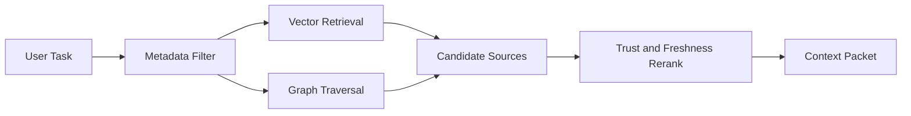
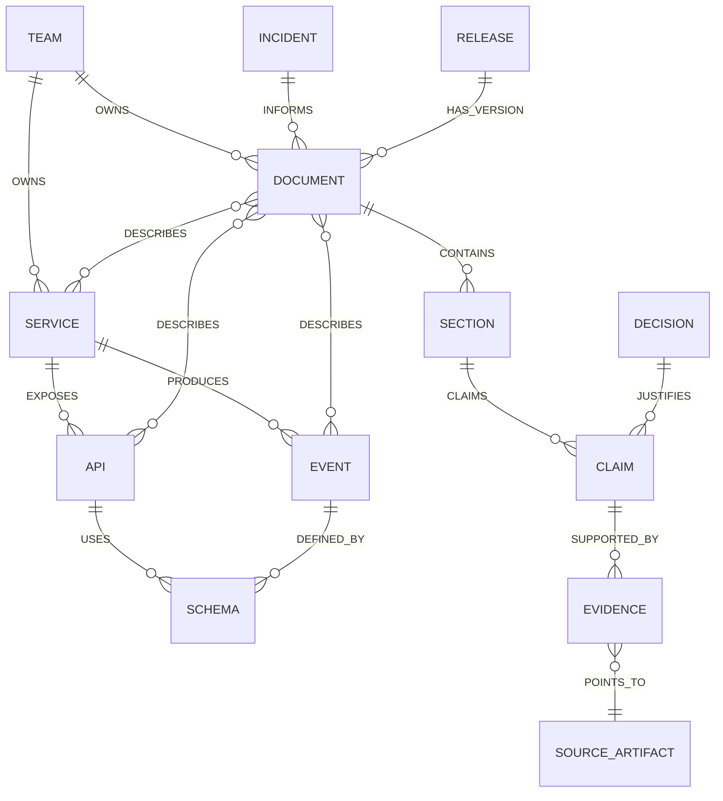
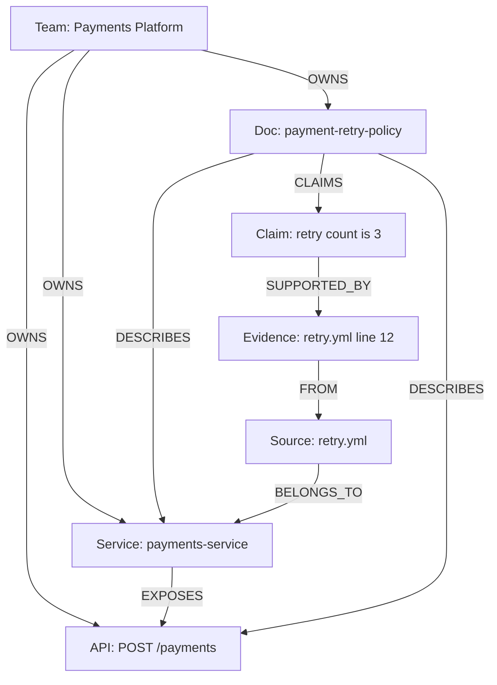
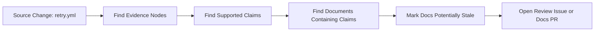
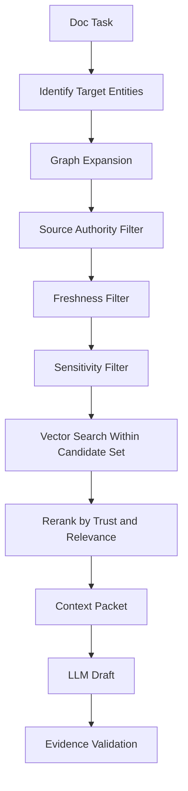
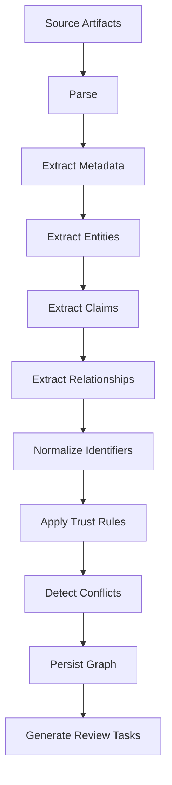
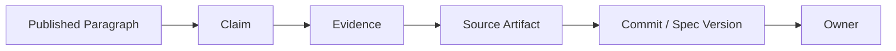

------
title: Learn AI-Driven Documentation and Technical Writing Implementation and Usage - Part 018
description: A deep practical guide to source-of-truth modeling and documentation knowledge graphs for AI-assisted technical writing, including ontology design, claims, ownership, provenance, freshness, retrieval, conflict detection, and governance.
series: learn-ai-driven-documentation
seriesTitle: Learn AI-Driven Documentation and Technical Writing Implementation and Usage
order: 18
partTitle: Source of Truth and Documentation Knowledge Graph
tags:
- ai
- documentation
- technical-writing
- knowledge-graph
- source-of-truth
- rag
- metadata
- governance
- engineering-handbook
- series
date: 2026-06-30
---

# Part 018 — Source of Truth and Documentation Knowledge Graph

## 1. What We Are Learning in This Part

This part teaches how to model documentation knowledge so AI can use it safely.

In Part 017, we designed the system architecture. We saw that the core pipeline is:

```text
sources -> ingestion -> normalization -> indexes -> context assembly -> generation -> validation -> review -> publishing
```

Now we focus on the most important internal model:

> the source-of-truth model and documentation knowledge graph.

A vector database can help retrieve similar text, but similarity is not the same as truth.

A mature AI documentation system must know relationships such as:

- this doc explains this service
- this paragraph claims this behavior
- this claim is supported by this config
- this API operation is owned by this team
- this runbook depends on this alert
- this page is stale because this source changed
- this public guide must not include this internal incident detail
- this ADR supersedes an older decision

That is graph-shaped knowledge.

The target skill is:

> Build a source-of-truth and knowledge graph model that allows AI documentation workflows to retrieve relevant context, verify claims, route review, detect stale docs, and preserve auditability.

---

## 2. Why Source of Truth Must Be Explicit

Many documentation failures come from implicit truth models.

People assume:

- code is always truth
- docs are always stale
- tickets explain intent
- ADRs are always current
- runbooks are accurate because they exist
- API docs match implementation
- the model can infer the right answer

These assumptions are dangerous.

A strong documentation system does not ask:

> Which text sounds right?

It asks:

> Which source is authoritative for this kind of claim, at this version, for this audience, under this lifecycle state?

### 2.1 Examples of Source Ambiguity

| Claim | Possible sources | Source-of-truth question |
|---|---|---|
| Endpoint accepts field `customerType` | OpenAPI, controller, tests, docs | Is the contract enforced by CI? |
| Service retries three times | config, code, runbook, ADR | Is config environment-specific? |
| Team owns service | service catalog, CODEOWNERS, README | Which ownership system is canonical? |
| Runbook escalation threshold | alert rule, runbook, SRE policy | Which one controls production response? |
| Feature is available in region X | feature flag, product docs, release notes | Which release and environment? |
| Event payload includes field Y | schema registry, consumer code, docs | Is the schema version current? |

Without explicit rules, AI will often blend these sources into fluent but unsafe text.

---

## 3. Kaufman Deconstruction

Using Kaufman's approach, we deconstruct the skill into practiceable parts.

### 3.1 Sub-Skills

| Sub-skill | Description | Practice output |
|---|---|---|
| Source inventory | List all systems containing documentation truth | Source catalog |
| Trust hierarchy | Rank source authority by claim type | Trust matrix |
| Ontology design | Define entity and relationship types | Graph schema |
| Provenance modeling | Track where facts came from | Evidence model |
| Claim extraction | Represent doc claims explicitly | Claim graph |
| Ownership mapping | Link docs and sources to teams | Review routing graph |
| Freshness modeling | Detect stale docs when sources change | Freshness rules |
| Conflict detection | Identify contradictory sources | Conflict report |
| Retrieval integration | Use graph relationships to assemble context | Graph-aware context packet |
| Governance | Maintain graph correctness | Ownership and lifecycle policy |

### 3.2 Practice Goal

By the end of this part, you should be able to design this for one service:

```text
Service -> APIs -> Events -> Docs -> Claims -> Evidence -> Owners -> Reviewers -> Freshness rules
```

This is enough to make AI-generated docs more grounded and reviewable.

---

## 4. Source-of-Truth Hierarchy

A source-of-truth hierarchy defines which sources are authoritative for each type of claim.

### 4.1 Generic Trust Levels

| Level | Name | Examples | Meaning |
|---|---|---|---|
| T0 | Executable truth | code, config, tests, schemas | What the system actually does or enforces |
| T1 | Contract truth | OpenAPI, AsyncAPI, schema registry, interface definitions | What the system promises to consumers |
| T2 | Approved decision truth | ADRs, policies, approved runbooks | Why the system behaves that way |
| T3 | Published documentation truth | handbook, guides, reference docs | What users are told |
| T4 | Operational evidence | incidents, alerts, dashboards, logs summaries | What has happened in practice |
| T5 | Informal context | tickets, chat, meeting notes, draft docs | Useful hints but not publishable proof |

This is a starting model. In real organizations, authority depends on claim type.

### 4.2 Authority by Claim Type

| Claim type | Preferred source | Secondary source | Weak source |
|---|---|---|---|
| API request/response shape | OpenAPI or contract tests | implementation code | wiki page |
| Event payload | schema registry or AsyncAPI | producer tests | consumer notes |
| Runtime behavior | code/config/tests | runbook | old incident comment |
| Operational procedure | approved runbook | SRE policy | chat thread |
| Design rationale | current ADR | architecture review notes | tribal memory |
| Ownership | service catalog | CODEOWNERS | README |
| Public feature behavior | product docs and release notes | product spec | internal roadmap note |
| Security requirement | approved security policy | ADR | team convention |
| Compliance statement | approved compliance control | audit evidence | generated summary |

### 4.3 Source Rule Example

```yaml
claim_authority:
  api_contract:
    authoritative:
      - openapi_spec
      - contract_test
    supporting:
      - implementation_code
      - generated_reference_doc
    non_authoritative:
      - ticket_comment
      - chat_message
  operational_procedure:
    authoritative:
      - approved_runbook
      - sre_policy
    supporting:
      - incident_postmortem
      - alert_rule
    non_authoritative:
      - draft_doc
      - unreviewed_ai_output
  ownership:
    authoritative:
      - service_catalog
    supporting:
      - codeowners
    non_authoritative:
      - stale_readme
```

This rule can be used by retrieval, generation, and validation.

---

## 5. Knowledge Graph Mental Model

A knowledge graph models entities and relationships.

For documentation, the graph should answer:

- What does this doc describe?
- Which source supports this claim?
- Which owners must review changes?
- Which docs are affected by this code/API/schema change?
- Which docs are stale?
- Which docs are safe to use for public generation?
- Which documents are derived from generated content?

### 5.1 Graph vs Vector Index

| Capability | Vector index | Knowledge graph |
|---|---|---|
| Find semantically similar content | Strong | Weak by itself |
| Traverse dependencies | Weak | Strong |
| Explain why a source was included | Medium | Strong |
| Detect affected docs after source change | Weak | Strong |
| Enforce ownership routing | Weak | Strong |
| Detect source conflicts | Weak | Strong |
| Support graph-aware RAG | Strong when combined | Strong when combined |

The best architecture uses both.



Vector retrieval finds likely relevant text. The graph explains and constrains relevance.

---

## 6. Core Entities

Start with a small ontology. Do not model the entire enterprise on day one.

### 6.1 Minimal Entity Types

| Entity | Description | Examples |
|---|---|---|
| Service | Deployable or logical service | `payments-service` |
| Component | Module, library, package, job, worker | `retry-engine` |
| API | API surface or operation | `POST /payments` |
| Event | Message or domain event | `PaymentAuthorized` |
| Schema | Data schema or payload contract | `payment.authorized.v3` |
| Document | Documentation page or artifact | `payment-retry-policy.mdx` |
| Section | Heading-level document section | `Retry Behavior` |
| Claim | Atomic statement in documentation | “Retries happen three times.” |
| SourceArtifact | Original source file or record | `retry.yml` |
| Evidence | Pointer from claim to source | config line, spec path |
| Team | Owning group | `payments-platform` |
| Person | Optional human actor | service owner |
| ReviewPolicy | Required review rule | `runbook-high-risk` |
| Release | Product or service release | `2026.07` |
| Incident | Operational event | `INC-2026-0618` |
| Decision | ADR or approved design decision | `ADR-042` |

### 6.2 Minimal Relationship Types

| Relationship | Meaning |
|---|---|
| OWNS | Team owns service/doc/source |
| DESCRIBES | Document describes service/API/event/component |
| CONTAINS | Document contains section or section contains claim |
| CLAIMS | Section/document makes claim |
| SUPPORTED_BY | Claim is supported by evidence/source |
| IMPLEMENTED_BY | API/event behavior implemented by code component |
| DEFINED_BY | API/event/schema defined by contract source |
| DEPENDS_ON | Service/doc depends on another entity |
| SUPERSEDES | ADR or doc replaces older one |
| AFFECTS | Source change affects doc/API/event/runbook |
| REQUIRES_REVIEW_BY | Artifact requires reviewer/team |
| PUBLISHED_AS | Source/generated draft published as doc |
| GENERATED_FROM | Draft generated from context/source packet |
| HAS_VERSION | Entity tied to release/commit/spec version |
| HAS_RISK | Doc/claim has risk classification |

### 6.3 Entity Relationship Diagram



This is not a perfect enterprise ontology. It is a useful documentation ontology.

---

## 7. Claims as First-Class Entities

The most important concept is the claim.

A claim is an atomic statement that can be checked against evidence.

Examples:

- “The payment authorization endpoint requires `merchantId`.”
- “Failed authorization requests are retried up to three times.”
- “The fraud decision event is emitted after risk scoring completes.”
- “On-call engineers should escalate to the payment gateway team after 15 minutes.”

### 7.1 Why Claims Matter

If claims are not modeled, docs are blobs of prose.

If claims are modeled, the system can ask:

- Which claims are unsupported?
- Which claims depend on changed source files?
- Which claims contradict a newer contract?
- Which claims are high-risk?
- Which claims require security review?
- Which claims were generated by AI?

### 7.2 Claim Schema

```yaml
claim:
  id: claim:payments:retry-count:001
  text: Failed authorization requests are retried up to three times.
  claim_type: runtime_behavior
  subject_refs:
    - service:payments-service
    - component:retry-engine
  evidence_refs:
    - evidence:retry-config-line-12
    - evidence:retry-test-case-3
  trust_status: supported
  risk_level: medium
  generated_by_ai: false
  lifecycle_state: approved
  last_verified_at: 2026-06-30
  stale_after_days: 90
```

### 7.3 Evidence Schema

```yaml
evidence:
  id: evidence:retry-config-line-12
  source_artifact: src:github:payments-service:abc123:config/retry.yml
  locator:
    type: line_range
    start: 12
    end: 15
  evidence_type: executable_configuration
  trust_level: T0
  extracted_value:
    max_attempts: 3
```

### 7.4 Claim Risk Levels

| Risk level | Example claim | Review requirement |
|---|---|---|
| Low | “The service exposes a health endpoint.” | normal docs review |
| Medium | “Retries happen up to three times.” | service owner review |
| High | “Run this command to rollback production.” | service owner plus SRE review |
| Critical | “This control satisfies regulatory requirement X.” | compliance/security/legal review |

AI can draft low and medium claims with evidence. High and critical claims require strict review.

---

## 8. Source Artifact Model

A source artifact is any object that can support or inform documentation.

### 8.1 Source Artifact Schema

```yaml
source_artifact:
  id: src:github:payments-service:abc123:api/openapi.yaml
  source_system: github
  artifact_type: openapi_spec
  repository: payments-service
  path: api/openapi.yaml
  version:
    branch: main
    commit_sha: abc123
  owner_refs:
    - team: payments-platform
  trust_level: T1
  lifecycle_state: approved
  classification:
    confidentiality: internal
    public_publish_allowed: true
  content_hash: sha256:...
  ingested_at: 2026-06-30T08:00:00Z
  last_verified_at: 2026-06-30T08:00:00Z
```

### 8.2 Artifact Types

| Type | Example | Common extraction |
|---|---|---|
| `markdown_doc` | handbook page | title, headings, links, claims |
| `mdx_doc` | docs site page | metadata, components, sections |
| `openapi_spec` | API contract | operations, schemas, examples |
| `asyncapi_spec` | event contract | channels, messages, schemas |
| `code_file` | source code | symbols, modules, comments |
| `config_file` | YAML/TOML/properties | runtime settings |
| `test_file` | unit/contract test | expected behavior |
| `adr` | decision record | decision, context, consequences |
| `runbook` | operational procedure | steps, alerts, escalation |
| `incident_report` | postmortem | timeline, causes, mitigations |
| `service_catalog_record` | service metadata | owner, lifecycle, dependencies |

### 8.3 Source Lifecycle State

| State | Meaning | Use in AI docs? |
|---|---|---|
| draft | not reviewed | only as weak context |
| approved | reviewed and accepted | yes |
| deprecated | superseded but preserved | only with warning |
| archived | historical record | only for history |
| stale | likely outdated | only if explicitly marked |
| rejected | not accepted | no |

This matters because stale or draft sources should not silently support strong claims.

---

## 9. Document Model

A document is a durable artifact intended for human or machine consumption.

### 9.1 Document Schema

```yaml
document:
  id: doc:payments:retry-policy
  path: docs/payments/retry-policy.mdx
  title: Payment Retry Policy
  doc_type: explanation
  audience:
    - backend_engineer
    - sre
  lifecycle_state: approved
  risk_level: medium
  owner_refs:
    - team: payments-platform
  describes:
    - service:payments-service
    - component:retry-engine
  source_refs:
    - src:github:payments-service:abc123:config/retry.yml
    - src:github:payments-service:abc123:adr/042-retry-policy.md
  generated_metadata:
    ai_assisted: true
    last_generation_id: gen-2026-06-30-001
  freshness:
    last_verified_at: 2026-06-30
    stale_after_days: 90
```

### 9.2 Document Types

Use document type to control review, structure, and retrieval.

| Type | Purpose | Typical source of truth |
|---|---|---|
| tutorial | teach first success | working example, setup script |
| how-to | solve task | verified procedure |
| reference | lookup facts | contract/spec/source |
| explanation | explain rationale | ADR, architecture notes |
| runbook | operate system | SRE-approved procedure |
| troubleshooting | diagnose and fix failures | incidents, alerts, runbooks |
| migration | guide behavior change | release notes, diffs, specs |
| onboarding | orient new team member | service catalog, handbook |
| policy | define required behavior | governance/security/compliance source |

This classification connects directly to Diátaxis and review governance.

---

## 10. Ownership Graph

Ownership is not just metadata. It is how review becomes enforceable.

### 10.1 Ownership Sources

Possible ownership sources:

- service catalog
- CODEOWNERS
- team registry
- on-call schedule
- repository maintainers
- docs frontmatter
- incident commander list
- product ownership metadata

Pick a canonical source for each ownership type.

### 10.2 Ownership Relationships



### 10.3 Review Routing from Graph

If a doc changes, reviewer selection can traverse the graph:

```text
changed document -> described service/API/event -> owning team -> review policy -> required reviewers
```

Example:

```yaml
review_routing:
  changed_doc: doc:payments:retry-policy
  graph_expansion:
    describes:
      - service:payments-service
      - component:retry-engine
    claims_supported_by:
      - src:config:retry.yml
      - src:adr:042-retry-policy.md
    owners:
      - team:payments-platform
      - team:sre-payments
  required_reviewers:
    - payments-platform
    - sre-payments
```

This is stronger than relying on a manually chosen reviewer.

---

## 11. Version and Freshness Graph

Documentation ages. A knowledge graph should make aging visible.

### 11.1 Version Model

Entities may have different version systems:

| Entity | Version source |
|---|---|
| Code | commit SHA |
| API spec | spec version or commit SHA |
| Event schema | schema version |
| Product docs | release version |
| Runbook | approved revision |
| ADR | decision date and supersession |
| Service catalog | catalog revision |

A generated doc should record which versions it used.

```yaml
document_version_context:
  document: doc:payments:retry-policy
  generated_from:
    - src:github:payments-service:abc123:config/retry.yml
    - src:github:payments-service:abc123:adr/042-retry-policy.md
  valid_for:
    service_version: payments-service@2026.07
    environment: production
```

### 11.2 Freshness Rule

A simple freshness rule:

```yaml
freshness_rules:
  - when:
      source_artifact_changed: true
      relationship: SUPPORTED_BY
    mark_claim: needs_reverification
    mark_document: potentially_stale
  - when:
      doc_type: runbook
      days_since_last_verified_greater_than: 90
    mark_document: stale
  - when:
      api_spec_changed: breaking
      relationship: DESCRIBES
    require_doc_review: true
```

### 11.3 Stale Detection Example



This is one of the biggest benefits of a graph: stale docs become detectable by dependency traversal.

---

## 12. Conflict Detection

Conflicts happen when sources disagree.

### 12.1 Conflict Types

| Conflict | Example |
|---|---|
| Contract vs docs | OpenAPI says required, docs say optional |
| Code vs runbook | config has 3 retries, runbook says 5 |
| ADR vs implementation | ADR says fail-fast, code retries |
| Old doc vs new doc | migration guide contradicts API reference |
| Ownership conflict | service catalog and docs frontmatter name different owners |
| Public/internal conflict | internal limitation leaks into public guide |

### 12.2 Conflict Record

```yaml
conflict:
  id: conflict:payments:customerType-required
  subject: api:POST:/customers:customerType
  conflict_type: contract_vs_documentation
  sources:
    - id: src:openapi:customers:abc123
      claim: customerType is required
      trust_level: T1
    - id: doc:customers:create-customer
      claim: customerType is optional
      trust_level: T3
  severity: high
  recommended_action: update_documentation
  owner: team:customers-platform
```

### 12.3 Conflict Resolution Policy

```yaml
resolution_policy:
  contract_vs_doc:
    prefer: contract_source
    action: update_doc_or_block_release
  code_vs_adr:
    prefer: none
    action: require_architecture_review
  owner_conflict:
    prefer: service_catalog
    action: update_doc_frontmatter
  public_internal_conflict:
    prefer: public_policy
    action: redact_or_rewrite
```

The graph should not always auto-resolve conflicts. It should surface them with context.

---

## 13. Graph-Aware RAG

Graph-aware RAG combines semantic retrieval with relationship traversal.

### 13.1 Naive RAG

Naive RAG flow:

```text
query -> vector search -> top chunks -> LLM answer
```

This is useful but insufficient for engineering documentation.

Problems:

- may retrieve stale docs
- may miss exact contract sources
- may ignore ownership
- may include sensitive content
- may fail to include related dependencies
- may not explain why context was selected

### 13.2 Graph-Aware RAG Flow



### 13.3 Example Task

Task:

> Generate a troubleshooting guide for payment authorization timeouts.

Graph-aware retrieval steps:

1. Identify entity: `service:payments-service`.
2. Expand to components: gateway client, retry engine, authorization controller.
3. Expand to alerts: timeout rate alert, gateway latency alert.
4. Expand to runbooks and incidents.
5. Include config and tests for timeout values.
6. Exclude sensitive incident payloads.
7. Retrieve relevant sections semantically within allowed sources.
8. Build context packet with evidence and trust levels.

The result is much better than retrieving random “payment timeout” chunks.

---

## 14. Example Graph Queries

The exact query language depends on your graph database, but the logic matters more than syntax.

### 14.1 Find Docs Affected by API Change

```cypher
MATCH (api:API {operationId: "createCustomer"})<-[:DESCRIBES]-(doc:Document)
MATCH (api)-[:DEFINED_BY]->(spec:SourceArtifact)
WHERE spec.version.commit_sha = "abc123"
RETURN doc.path, doc.owner_refs, doc.lifecycle_state
```

### 14.2 Find Unsupported Claims

```cypher
MATCH (doc:Document)-[:CLAIMS]->(claim:Claim)
WHERE NOT (claim)-[:SUPPORTED_BY]->(:Evidence)
RETURN doc.path, claim.text, claim.risk_level
```

### 14.3 Find Potentially Stale Docs

```cypher
MATCH (src:SourceArtifact {changed: true})<-[:POINTS_TO]-(e:Evidence)<-[:SUPPORTED_BY]-(claim:Claim)<-[:CLAIMS]-(doc:Document)
RETURN doc.path, claim.text, src.path
```

### 14.4 Find Reviewers

```cypher
MATCH (doc:Document {path: "docs/payments/retry-policy.mdx"})-[:DESCRIBES]->(entity)
MATCH (team:Team)-[:OWNS]->(entity)
RETURN DISTINCT team.name
```

### 14.5 Find Conflicting Claims

```cypher
MATCH (c1:Claim)-[:ABOUT]->(subject)<-[:ABOUT]-(c2:Claim)
WHERE c1.normalized_value <> c2.normalized_value
  AND c1.claim_type = c2.claim_type
RETURN subject.id, c1.text, c2.text
```

These queries illustrate why graph modeling matters: they answer structural questions that semantic search alone handles poorly.

---

## 15. Ontology Design Principles

### 15.1 Start Small

Do not start with a giant enterprise ontology.

Start with:

- Service
- API
- Event
- Document
- Section
- Claim
- Evidence
- SourceArtifact
- Team
- Release

Then expand only when real workflows require it.

### 15.2 Model Operational Questions

Good ontology design starts with questions.

Examples:

- Which docs should change when this API changes?
- Which claims are unsupported?
- Which team must review this generated doc?
- Which public docs depend on internal-only sources?
- Which runbooks are stale?
- Which docs describe deprecated features?
- Which docs were generated from AI without approval?

If an entity or relationship does not answer a useful question, delay adding it.

### 15.3 Prefer Explicit Relationships

Weak model:

```yaml
doc.tags:
  - payments
  - retry
  - runbook
```

Stronger model:

```yaml
document: doc:payment-timeout-runbook
relationships:
  DESCRIBES:
    - service:payments-service
    - alert:payment-timeout-rate-high
  CLAIMS:
    - claim:gateway-timeout-threshold
  REQUIRES_REVIEW_BY:
    - team:sre-payments
```

Tags help discovery. Relationships support automation.

### 15.4 Keep Provenance Immutable

A relationship should be traceable to where it came from.

Example:

```yaml
relationship:
  type: DESCRIBES
  from: doc:payment-timeout-runbook
  to: service:payments-service
  source:
    inferred_from: frontmatter.service
    source_artifact: src:docs:payment-timeout-runbook
    confidence: high
    created_by: docs-normalizer
```

If relationships are inferred by AI, mark them as inferred and require verification before using them for high-risk decisions.

---

## 16. Inference vs Verified Knowledge

AI can help infer relationships, but not all inferred relationships should be trusted equally.

### 16.1 Relationship Confidence

| Confidence | Meaning | Allowed use |
|---|---|---|
| verified | human or deterministic source confirms it | review routing, publishing gates |
| deterministic | extracted from structured source | most automation |
| inferred_high | AI inferred with strong evidence | candidate suggestions |
| inferred_low | weak AI inference | backlog/gap finding only |
| rejected | reviewed and rejected | do not use |

### 16.2 Example

AI sees a doc titled “Payment Gateway Timeout Troubleshooting” and infers it describes `payments-service`.

This may be correct, but the relationship should be stored as:

```yaml
relationship:
  type: DESCRIBES
  from: doc:payment-gateway-timeout-troubleshooting
  to: service:payments-service
  confidence: inferred_high
  evidence:
    - title_match
    - repeated_service_name_mentions
  allowed_use:
    - retrieval_candidate
    - human_review_suggestion
  disallowed_use:
    - required_reviewer_selection
    - compliance_evidence
```

After a human approves or frontmatter is updated, it can become verified.

---

## 17. Graph Construction Pipeline

A practical graph construction pipeline has several stages.



### 17.1 Parsing

Different artifacts need different parsers:

- Markdown/MDX parser for docs
- YAML/JSON parser for specs and config
- AST parser for code
- schema parser for OpenAPI/AsyncAPI
- frontmatter parser for metadata
- issue tracker API reader for tickets

### 17.2 Entity Extraction

Entity extraction can be deterministic or AI-assisted.

| Entity | Extraction method |
|---|---|
| API operation | deterministic from OpenAPI |
| Event message | deterministic from AsyncAPI/schema registry |
| Service ownership | deterministic from service catalog |
| Document sections | deterministic from Markdown AST |
| Claims | AI-assisted plus heuristics |
| Design rationale | AI-assisted from ADR |
| Incident lessons | AI-assisted with redaction and review |

### 17.3 Normalized IDs

Use stable IDs.

Bad:

```text
Payment service docs
```

Better:

```text
service:payments-service
doc:payments:retry-policy
api:payments:POST:/payments
event:payments:PaymentAuthorized:v3
claim:payments:retry-count:001
```

Stable IDs are essential for deduplication and graph updates.

---

## 18. Source-to-Doc Traceability

Traceability means being able to follow a chain from published text back to source evidence.

### 18.1 Trace Chain



Example:

```yaml
published_text:
  doc: docs/payments/retry-policy.mdx
  section: Retry Behavior
  paragraph_hash: sha256:...
claim:
  id: claim:payments:retry-count:001
  text: Failed authorization requests are retried up to three times.
evidence:
  - source: config/retry.yml
    commit: abc123
    locator: line 12
owner:
  team: payments-platform
```

### 18.2 Why Traceability Matters

Traceability supports:

- faster review
- stale docs detection
- audit evidence
- regulated documentation
- safer AI generation
- better incident response
- dependency impact analysis

A documentation system without traceability is a pile of prose.

---

## 19. Public vs Internal Knowledge Boundaries

A knowledge graph should understand publication boundaries.

### 19.1 Boundary Types

| Boundary | Example |
|---|---|
| public | customer docs, API reference |
| partner | partner integration docs |
| internal | engineering handbook |
| restricted | incident reports, security docs |
| confidential | customer-specific or regulated data |

### 19.2 Boundary-Aware Retrieval

For public docs generation:

```yaml
retrieval_policy:
  target_audience: public
  allowed_classification:
    - public
    - approved_for_public_reference
  excluded_artifacts:
    - incident_report
    - internal_runbook
    - security_assessment
    - customer_ticket
  require_public_publish_allowed: true
```

For internal runbook generation:

```yaml
retrieval_policy:
  target_audience: internal_sre
  allowed_classification:
    - internal
    - restricted_operational
  excluded_artifacts:
    - customer_pii
    - secrets
  require_sre_review: true
```

The same source graph can support both workflows only if classification is modeled explicitly.

---

## 20. Generated Content as a Source

AI-generated drafts can enter the graph, but they should not become authoritative by default.

### 20.1 Generated Draft Model

```yaml
generated_artifact:
  id: gen_doc:payments:timeout-runbook:draft:001
  generated_by: ai-docs-platform
  generation_id: gen-2026-06-30-001
  prompt_id: generate_runbook_v4
  context_packet_id: ctx-001
  lifecycle_state: draft
  authority: none
  may_support_claims: false
  requires_review: true
```

After human approval, the published document may become a T3 source. But the generated draft itself should not support future claims.

### 20.2 Avoid Recursive Contamination

A common failure:

```text
AI generates doc -> doc is indexed -> future AI treats generated doc as truth -> errors amplify
```

Mitigation:

```yaml
indexing_policy:
  generated_drafts:
    index_for_search: true
    index_for_truth: false
    allowed_use:
      - reviewer_context
    disallowed_use:
      - evidence_for_claims
      - public_doc_generation
  approved_ai_assisted_docs:
    index_for_search: true
    index_for_truth: true
    require_evidence_refs: true
```

Do not let unreviewed model output become training-like internal truth.

---

## 21. Graph-Aware Context Packet

A graph-aware context packet should include relationship context, not only chunks.

Example:

```yaml
context_packet:
  task: update_api_reference
  target:
    api: api:customers:POST:/customers
    doc: doc:customers:create-customer
  graph_context:
    owners:
      - team:customers-platform
    related_schemas:
      - schema:customer-create-request:v4
      - schema:customer-create-response:v4
    affected_docs:
      - docs/api/customers/create-customer.mdx
      - docs/migration/2026-07-customers-api.mdx
    authoritative_sources:
      - src:openapi:customers:abc123
      - src:contract-test:CustomerCreateContractTest:abc123
    stale_claims:
      - claim:customerType-optional
  retrieved_chunks:
    - source: docs/api/customers/create-customer.mdx
      section: Response Fields
      trust_level: T3
      freshness: stale
    - source: api/openapi.yaml
      path: $.paths./customers.post.responses.201
      trust_level: T1
      freshness: current
  instructions:
    unsupported_claim_behavior: mark_needs_review
    prefer_authoritative_source_on_conflict: true
```

This gives the model enough structure to behave more like a documentation assistant and less like a generic writer.

---

## 22. Maintenance and Governance

A knowledge graph can decay like documentation.

### 22.1 Graph Quality Metrics

| Metric | Meaning |
|---|---|
| orphan docs | docs not linked to any service/API/event |
| orphan claims | claims without evidence |
| stale claims | claims depending on changed sources |
| unknown owners | docs or services without owner |
| inferred relationship ratio | too many unverified AI-inferred edges |
| conflict count | contradictory claims/sources |
| public boundary violations | public docs linked to restricted sources |
| review routing failures | generated PRs missing required reviewers |
| graph update lag | time from source change to graph update |

### 22.2 Ownership of the Graph

The graph needs owners.

| Area | Owner |
|---|---|
| ontology | docs platform / architecture group |
| service ownership data | platform engineering |
| API contract data | API platform |
| event schema data | event platform |
| document metadata | docs owners |
| review policies | engineering governance |
| security classification | security team |
| compliance mappings | compliance team |

No single team should manually own every relationship. The goal is federated ownership with central guardrails.

### 22.3 Review Workflow for Graph Changes

When the graph changes, ask:

- Was the relationship extracted deterministically?
- Was it inferred by AI?
- Does it affect review routing?
- Does it affect public publishing?
- Does it affect compliance evidence?
- Does it mark documents stale?

High-impact graph changes need review.

---

## 23. Implementation Strategy

### 23.1 Phase 1 — Metadata First

Start with frontmatter and service catalog integration.

Required metadata:

```yaml
owner: payments-platform
doc_type: runbook
service: payments-service
lifecycle: approved
risk: high
last_verified: 2026-06-30
```

This already enables:

- ownership routing
- stale docs checks
- filtering by doc type
- review rules

### 23.2 Phase 2 — Source Relationships

Add explicit source references.

```yaml
source_refs:
  - src:github:payments-service:abc123:config/retry.yml
  - src:github:payments-service:abc123:adr/042-retry-policy.md
```

This enables traceability.

### 23.3 Phase 3 — Claim Extraction

Extract high-value claims first:

- API fields
- operational thresholds
- command instructions
- feature availability
- security/compliance claims
- migration/breaking-change claims

Do not try to extract every sentence.

### 23.4 Phase 4 — Graph-Assisted Retrieval

Use the graph to constrain RAG:

- service scope
- owner scope
- release scope
- allowed classifications
- related APIs/events
- stale docs

### 23.5 Phase 5 — Automated Impact Analysis

When a source changes:

1. find related evidence
2. find claims
3. find documents
4. classify risk
5. open issue or PR
6. route review

This is where the graph creates major leverage.

---

## 24. Practical Example: Payment Retry Documentation

### 24.1 Source Inventory

```yaml
sources:
  - id: src:config:payments:retry-yml
    type: config_file
    trust_level: T0
  - id: src:test:payments:retry-contract-test
    type: test_file
    trust_level: T0
  - id: src:adr:payments:retry-policy
    type: adr
    trust_level: T2
  - id: doc:payments:retry-policy
    type: explanation
    trust_level: T3
  - id: doc:payments:timeout-runbook
    type: runbook
    trust_level: T3
```

### 24.2 Claims

```yaml
claims:
  - id: claim:payments:retry-count
    text: Failed authorization requests are retried up to three times.
    claim_type: runtime_behavior
    evidence:
      - src:config:payments:retry-yml#line:12
      - src:test:payments:retry-contract-test#case:retry_three_times
    risk: medium
  - id: claim:payments:retry-idempotency
    text: Retry is safe only for idempotent authorization requests.
    claim_type: operational_constraint
    evidence:
      - src:adr:payments:retry-policy#decision
    risk: high
```

### 24.3 Stale Event

Config changes from three retries to two retries.

Graph traversal:

```text
retry.yml changed -> evidence node changed -> retry-count claim stale -> retry policy doc stale -> timeout runbook stale -> payments-platform review required
```

### 24.4 Generated Work Item

```markdown
## Documentation Staleness Detected

Source changed:
- `config/retry.yml`

Affected claims:
- `claim:payments:retry-count`

Affected docs:
- `docs/payments/retry-policy.mdx`
- `docs/operations/payment-timeout-runbook.mdx`

Recommended action:
- Update retry count from 3 to 2 if confirmed by tests and service owner.

Required reviewers:
- payments-platform
- sre-payments, because the runbook is affected
```

This is the value of modeling relationships.

---

## 25. Anti-Patterns

### 25.1 Treating Search Results as Truth

Semantic retrieval finds relevant text. It does not guarantee correctness.

Fix:

- attach trust levels
- prefer authoritative sources
- detect stale docs
- require evidence for claims

### 25.2 Indexing Everything Without Classification

More data can make generation worse and riskier.

Fix:

- classify sources before indexing
- enforce access control at retrieval time
- exclude secrets and sensitive records

### 25.3 Letting Generated Docs Support Future Generated Docs

This creates recursive hallucination.

Fix:

- mark generated drafts as non-authoritative
- require human approval and evidence refs before truth indexing

### 25.4 Overbuilding the Ontology

A giant graph schema slows delivery.

Fix:

- start from operational questions
- model only relationships used by workflows
- expand iteratively

### 25.5 Trusting AI-Inferred Relationships Too Much

AI can infer plausible but wrong relationships.

Fix:

- store confidence and extraction method
- use inferred edges only for suggestions until verified
- require review for edges affecting publishing or compliance

---

## 26. Design Checklist

Use this checklist before implementing a documentation knowledge graph.

### 26.1 Source Model

- Have you listed source systems?
- Have you defined trust levels?
- Have you mapped claim types to authoritative sources?
- Have you defined lifecycle states?
- Have you classified sensitive sources?

### 26.2 Graph Model

- Have you defined minimal entity types?
- Have you defined relationship types?
- Do relationships answer real operational questions?
- Are IDs stable?
- Is provenance stored for entities and edges?

### 26.3 Claim Model

- Are claims atomic?
- Are claims linked to evidence?
- Are high-risk claims classified?
- Are unsupported claims visible?
- Can claims be marked stale?

### 26.4 Retrieval Model

- Does retrieval use graph relationships?
- Does it apply source authority rules?
- Does it filter by classification?
- Does it include freshness?
- Does it produce a context packet with evidence?

### 26.5 Governance Model

- Who owns the ontology?
- Who owns service metadata?
- Who reviews AI-inferred relationships?
- Are graph changes audited?
- Are generated artifacts marked?
- Are public/internal boundaries enforced?

---

## 27. Deliberate Practice

### Exercise 1 — Build a Source Inventory

Pick one service. List at least ten source artifacts:

- code
- config
- API spec
- event schema
- README
- runbook
- ADR
- service catalog entry
- incident report
- existing docs

For each, assign:

- artifact type
- trust level
- owner
- lifecycle state
- classification

### Exercise 2 — Create a Claim Table

Pick one important doc. Extract ten claims.

For each claim, define:

- claim text
- claim type
- evidence source
- risk level
- review owner
- freshness rule

### Exercise 3 — Draw the Graph

Create a Mermaid diagram linking:

- service
- API
- event
- doc
- section
- claim
- evidence
- source artifact
- team

### Exercise 4 — Define Stale Rules

Write five rules that mark docs stale when sources change.

Example:

```yaml
- when: openapi_operation_changed
  affected_relationship: DESCRIBES
  doc_types:
    - api_reference
    - migration_guide
  action: require_review
```

### Exercise 5 — Design Graph-Aware Retrieval

For one AI docs task, define:

1. target entity
2. graph expansion rules
3. source authority rules
4. sensitivity filters
5. vector search scope
6. reranking rules
7. output context packet

---

## 28. Mental Model Recap

A source-of-truth and knowledge graph model turns documentation from text storage into an engineering knowledge system.

The main shift is:

```text
documents as files
```

into:

```text
documents as connected claims backed by evidence, ownership, version, and lifecycle state
```

The strongest ideas:

1. Similarity is not truth.
2. The LLM is not an authority.
3. Claims should be first-class entities.
4. Evidence must preserve provenance.
5. Ownership should drive review routing.
6. Freshness should be derived from source relationships.
7. Generated drafts must not recursively become truth.
8. Public/internal boundaries must be represented in the graph.
9. Graph-aware RAG is stronger than naive vector retrieval.
10. Start with useful questions, not a perfect ontology.

A top-tier engineer does not ask only:

> Which documents should we index?

They ask:

> Which sources are authoritative for which claims, how are those claims connected to docs and owners, and how will the system know when they become stale or unsafe to publish?

That is the mindset required for AI-driven documentation at enterprise scale.

---

## 29. What Comes Next

Part 019 continues into **Retrieval-Augmented Generation for Documentation**.

We will go deeper into:

- chunking strategy
- metadata-aware retrieval
- hybrid search
- reranking
- citation anchoring
- freshness ranking
- query rewriting
- context compression
- evaluation datasets
- RAG failure modes
- documentation-specific retrieval patterns

Part 018 built the graph. Part 019 will show how to retrieve from it effectively.
