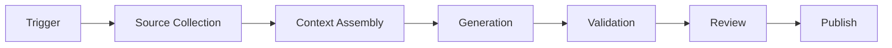
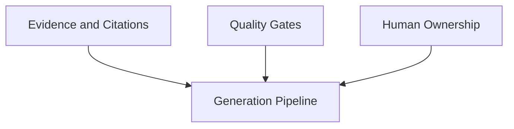
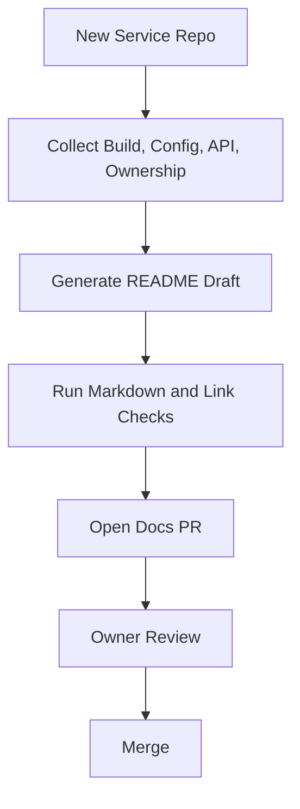
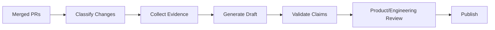
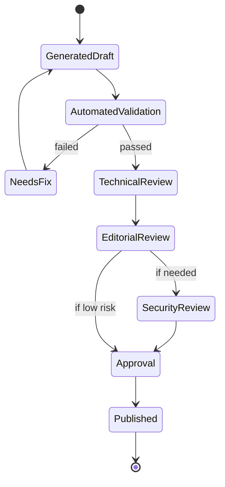
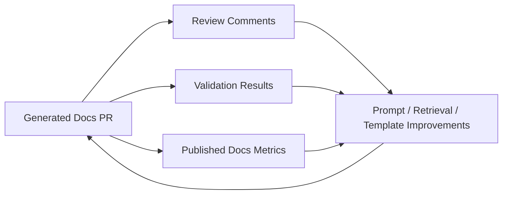

------
title: Learn AI-Driven Documentation and Technical Writing Implementation and Usage - Part 020
description: Practical implementation guide for AI documentation generation pipelines: README generation, API docs, migration guides, release notes, PR docs bots, architecture summaries, validation, review, publishing, and rollback.
series: learn-ai-driven-documentation
seriesTitle: Learn AI-Driven Documentation and Technical Writing Implementation and Usage
order: 20
partTitle: Documentation Generation Pipelines
tags:
- ai
- documentation
- technical-writing
- docs-as-code
- automation
- ci-cd
- generation-pipeline
- series
date: 2026-06-30
---

# Part 020 — Documentation Generation Pipelines

## 1. Why This Part Exists

AI-driven documentation becomes valuable when it moves from ad-hoc prompting into repeatable pipelines.

A pipeline gives the organization:

- predictable input sources,
- consistent templates,
- reviewable diffs,
- automated validation,
- human approval gates,
- audit trail,
- rollback capability,
- and measurable documentation health.

Without a pipeline, AI documentation work becomes personal productivity tooling.

With a pipeline, it becomes engineering infrastructure.

This part explains how to design and implement documentation generation pipelines for:

- README generation,
- module and service docs,
- API documentation,
- event documentation,
- changelogs,
- release notes,
- migration guides,
- architecture summaries,
- runbook drafts,
- onboarding docs,
- and PR docs bots.

The main idea:

> AI should generate drafts and evidence, not silently publish truth.

---

## 2. Kaufman Framing

Using Kaufman's approach, we break the pipeline skill into practiceable sub-skills.

### 2.1 Target Performance Level

After this part, you should be able to:

1. Choose which documentation should be generated, assisted, or manually written.
2. Design a pipeline from source change to docs PR.
3. Build generated docs with deterministic inputs and reviewable outputs.
4. Attach citations and verification tables to AI-generated drafts.
5. Validate generated docs with CI before human review.
6. Prevent generated docs from overwriting human-owned narrative incorrectly.
7. Apply risk-based publication gates.
8. Roll back bad generated documentation safely.

### 2.2 Sub-Skills

| Sub-skill | Question It Answers |
|---|---|
| Generation target selection | What should AI generate? |
| Trigger design | When should generation run? |
| Source collection | Which artifacts become input? |
| Context assembly | What evidence enters the prompt? |
| Template design | What structure must output follow? |
| Prompt versioning | Which instruction set generated this doc? |
| Diff discipline | How do reviewers inspect changes? |
| Validation | What can CI prove before review? |
| Human review | Who owns correctness? |
| Publishing | When is output allowed to go live? |
| Rollback | How do we recover from bad docs? |
| Observability | How do we know the pipeline is useful? |

---

## 3. Pipeline Mental Model

A documentation generation pipeline has seven stages:



For AI docs, add three control layers:



The pipeline is not complete until it answers:

- What triggered generation?
- Which sources were used?
- Which prompt version was used?
- Which model/tool version was used?
- Which claims were generated?
- Which sources support each claim?
- Which checks passed?
- Who approved publication?
- How can the output be reverted?

---

## 4. Generation Modes

Not all documentation should be generated the same way.

### 4.1 Full Generation

AI creates a complete draft from structured evidence.

Good for:

- release notes,
- PR summaries,
- migration guide first drafts,
- onboarding page skeletons,
- architecture summary drafts,
- troubleshooting draft from incident evidence.

Dangerous for:

- legal/compliance claims,
- externally published API behavior,
- high-risk runbooks,
- security documentation,
- regulated audit narratives.

### 4.2 Partial Generation

AI fills selected sections.

Good for:

- prerequisites,
- summary,
- examples,
- troubleshooting,
- glossary,
- comparison table,
- changelog entries.

### 4.3 Transform Generation

AI transforms existing content.

Examples:

- convert explanation into how-to,
- rewrite for public audience,
- simplify onboarding instructions,
- turn incident timeline into postmortem draft,
- normalize style across pages.

### 4.4 Review Generation

AI does not write final docs; it reviews and comments.

Examples:

- detect missing prerequisites,
- flag unsupported claims,
- detect stale links,
- compare docs to API spec,
- propose changes but not apply them.

### 4.5 Extraction Generation

AI extracts structured data from messy sources.

Examples:

- decisions from meeting notes,
- action items from postmortems,
- release highlights from PRs,
- breaking changes from diffs,
- service ownership hints from repo files.

---

## 5. Pipeline Trigger Design

Generation should not always run on every change.

Choose triggers by source and risk.

| Trigger | Suitable Output |
|---|---|
| PR opened | Docs impact analysis, missing docs comment |
| PR updated | Updated docs suggestions |
| PR merged | Changelog draft, release note candidate |
| API spec changed | API reference diff, migration warning |
| Schema changed | Event docs update, compatibility analysis |
| Release branch cut | Release notes, upgrade guide |
| Incident resolved | Postmortem draft, runbook gap analysis |
| New service created | Service README, onboarding skeleton |
| Scheduled job | Stale docs scan, docs health report |

### 5.1 Trigger Smells

| Smell | Problem |
|---|---|
| AI generation runs on every commit | Expensive and noisy |
| Generated docs are committed directly to main | No review boundary |
| Trigger ignores risk level | High-risk docs may publish unverified |
| Trigger does not capture source revision | Output cannot be audited |
| Trigger does not produce diff | Reviewers cannot reason about change |

---

## 6. Source Collection

Before generation, collect evidence deterministically.

Example source collector for a PR:

```text
Input: PR #1842
Collect:
- changed files
- diff hunks
- touched API specs
- touched schemas
- linked issues
- linked ADRs
- test changes
- migration files
- CODEOWNERS
- current related docs
- previous release notes
```

### 6.1 Source Collection Policy

For each pipeline, define:

```yaml
pipeline: migration-guide-generator
allowed_sources:
  - openapi_spec
  - asyncapi_spec
  - schema_registry
  - database_migrations
  - adr
  - release_manifest
  - reviewed_existing_docs
excluded_sources:
  - unreviewed_ai_generated_docs
  - private_slack_threads
  - secrets
  - production_logs
required_metadata:
  - service
  - version
  - owner
  - visibility
  - source_revision
```

### 6.2 Evidence Manifest

Every generated output should carry an evidence manifest.

```yaml
generated_doc:
  path: docs/payments/migration-v1-to-v2.mdx
  generated_at: 2026-06-30T10:30:00+07:00
  generator: migration-guide-generator
  prompt_version: migration-guide-v4
  model_profile: docs-draft-safe
  source_revision: 9f4a2c1
  evidence:
    - uri: specs/payments/openapi-v1.yaml
      hash: 8932ab
      role: old_contract
    - uri: specs/payments/openapi-v2.yaml
      hash: b01ac4
      role: new_contract
    - uri: adr/0048-payment-idempotency.md
      hash: 73a91e
      role: decision_context
```

This allows reviewers and auditors to reconstruct why the draft exists.

---

## 7. Context Assembly for Generation Pipelines

A generation pipeline should not pass raw repository content directly to the model.

It should build a context packet.

### 7.1 Context Packet Structure

```md
# Generation Context Packet

## Task
Generate a migration guide for Payments API v1 to v2.

## Audience
Internal backend engineers migrating service clients.

## Output Type
How-to guide with explanation and reference tables.

## Constraints
- Do not invent behavior.
- Cite every breaking change.
- Mark unknowns explicitly.
- Prefer OpenAPI specs for behavioral claims.
- Use ADRs only for rationale.

## Evidence Summary
- v1 OpenAPI spec: current published v1 contract.
- v2 OpenAPI spec: target contract.
- ADR-0048: explains idempotency behavior.
- Release manifest: confirms release version.

## Required Sections
1. Overview
2. Who is affected
3. Breaking changes
4. Step-by-step migration
5. Validation checklist
6. Rollback
7. FAQ

## Forbidden Claims
- Do not claim automatic migration is supported unless source evidence says so.
```

### 7.2 Context Compression

Long inputs must be compressed without losing evidence.

Bad compression:

```text
Summarize everything.
```

Better compression:

```text
Extract only:
- changed API paths,
- changed request fields,
- changed response fields,
- changed error responses,
- deprecations,
- compatibility notes,
- validation requirements,
- source URI for each claim.
```

Compression should preserve source references.

---

## 8. Output Contract

Generated docs should follow a strict output contract.

### 8.1 Output Schema

Example for release notes:

```yaml
release_notes:
  summary: string
  highlights:
    - title: string
      description: string
      source_refs: string[]
  breaking_changes:
    - change: string
      affected_users: string
      migration_action: string
      source_refs: string[]
  fixes:
    - description: string
      source_refs: string[]
  known_limitations:
    - limitation: string
      source_refs: string[]
  reviewer_notes:
    - string
```

### 8.2 MDX Output Contract

For generated `.mdx`, require:

```md
------
title: ...
description: ...
series: ...
order: ...
partTitle: ...
tags:
- ...
date: ...
---

# Title

<content>

## Evidence Used

| Claim Area | Source |
|---|---|
```

### 8.3 Generated Content Marker

Add machine-readable metadata:

```yaml
generated:
  assisted: true
  generator: release-notes-pipeline
  promptVersion: release-notes-v3
  evidenceManifest: .evidence/release-2026-06-30.yaml
  requiresHumanReview: true
```

Do not hide generated status.

---

## 9. Pipeline Type 1 — README Generation

README generation is useful when creating or onboarding services.

### 9.1 Input Sources

- repository name,
- package manifest,
- build files,
- Dockerfile,
- compose files,
- service config,
- API specs,
- test commands,
- deployment metadata,
- ownership metadata,
- existing docs.

### 9.2 Recommended README Sections

```md
# Service Name

## Purpose
## Ownership
## Architecture Summary
## Local Development
## Configuration
## APIs and Events
## Dependencies
## Testing
## Deployment
## Observability
## Operational Runbooks
## Troubleshooting
## Security Notes
## Related Docs
```

### 9.3 Avoid These Claims

A README generator should not invent:

- SLA/SLO,
- compliance status,
- security guarantees,
- production topology,
- ownership,
- operational procedures,
- business-critical behavior.

If evidence is missing, write:

```text
TODO: Confirm <missing item> with <owner>.
```

### 9.4 Pipeline Flow



---

## 10. Pipeline Type 2 — API Documentation Generation

API docs should be contract-backed.

### 10.1 Inputs

- OpenAPI spec,
- examples,
- error catalog,
- authentication docs,
- rate limit policy,
- idempotency policy,
- SDK usage examples,
- integration tests.

### 10.2 Generated Outputs

- API reference pages,
- endpoint summaries,
- request/response examples,
- error documentation,
- quickstart snippets,
- migration notes for changed endpoints.

### 10.3 Contract-First Rule

Behavioral claims must come from contract or tested examples.

Examples:

| Claim Type | Preferred Source |
|---|---|
| Path/method | OpenAPI |
| Required field | OpenAPI schema |
| Error response | OpenAPI + error catalog |
| Authentication | security scheme + auth docs |
| Rate limit | rate limit policy |
| Example response | tested example or contract example |
| Business rule | approved domain docs or ADR |

### 10.4 API Docs Diff

When an API spec changes, generate a diff:

```md
## Changed Endpoints

| Endpoint | Change Type | Impact | Source |
|---|---|---|---|
| POST /v2/payments | request field added | client update required | openapi-v2.yaml |
```

Do not let AI summarize API behavior without contract diff evidence.

---

## 11. Pipeline Type 3 — Event Documentation Generation

Event docs should be schema-backed and consumer-aware.

### 11.1 Inputs

- AsyncAPI spec,
- schema registry,
- event examples,
- producer service metadata,
- consumer dependency graph,
- compatibility policy,
- event versioning policy,
- event lifecycle metadata.

### 11.2 Generated Outputs

- event catalog pages,
- producer/consumer matrix,
- schema reference,
- compatibility notes,
- event lifecycle docs,
- migration guides for event changes.

### 11.3 Critical Questions

Generated event docs must answer:

- Who produces the event?
- Who consumes it?
- What guarantees exist?
- Is ordering guaranteed?
- Is delivery at-least-once, at-most-once, or effectively-once?
- How is schema compatibility handled?
- What fields are required?
- Which fields are deprecated?
- What is the replay policy?
- What is the retention policy?

Do not invent messaging guarantees.

---

## 12. Pipeline Type 4 — Release Notes

Release notes generation is one of the highest ROI AI documentation workflows.

### 12.1 Inputs

- merged PRs,
- issue links,
- commit messages,
- labels,
- release manifest,
- API diffs,
- schema diffs,
- migration files,
- feature flags,
- known issues.

### 12.2 Release Note Categories

```md
## Highlights
## New Features
## Improvements
## Bug Fixes
## Breaking Changes
## Deprecations
## Migration Required
## Known Issues
## Internal Operational Notes
```

Separate public and internal release notes.

### 12.3 Risk Rules

- Breaking changes require source citations.
- Deprecations require replacement guidance.
- Security fixes may require controlled wording.
- Known issues must be validated by owner.
- Customer-facing claims require product review.

### 12.4 Release Note Pipeline



---

## 13. Pipeline Type 5 — Migration Guides

Migration guides are high-risk because incomplete guidance causes real engineering failures.

### 13.1 Inputs

- old and new contracts,
- schema diffs,
- deprecated fields,
- compatibility policy,
- ADRs,
- release notes,
- test fixtures,
- known incompatible clients,
- rollout plan,
- rollback plan.

### 13.2 Required Sections

```md
# Migration Guide: <Old> to <New>

## Overview
## Who Should Migrate
## What Changed
## Breaking Changes
## Compatibility Window
## Step-by-Step Migration
## Validation Checklist
## Rollback Plan
## Troubleshooting
## FAQ
## Evidence Used
```

### 13.3 Migration Guide Verification

Check:

- Every breaking change has a source.
- Every required action has validation step.
- Every dangerous operation has rollback instruction.
- Version names are consistent.
- Deprecated fields have replacement guidance.
- Unsupported scenarios are explicit.

---

## 14. Pipeline Type 6 — Architecture Summaries

Architecture summaries are valuable but risky because they often overgeneralize.

### 14.1 Inputs

- ADRs,
- service catalog,
- dependency graph,
- deployment manifests,
- API/event contracts,
- sequence diagrams,
- infrastructure docs,
- ownership metadata.

### 14.2 Generated Output

```md
# Architecture Summary

## System Purpose
## Main Components
## Data Flow
## Runtime Dependencies
## Integration Boundaries
## Operational Concerns
## Security Boundaries
## Key Decisions
## Known Constraints
## Open Questions
```

### 14.3 Architecture Claim Discipline

AI must not invent:

- hidden dependencies,
- failover behavior,
- consistency guarantees,
- scaling characteristics,
- security isolation,
- data residency,
- compliance status.

Architecture generation should include an explicit “unknowns” section.

---

## 15. Pipeline Type 7 — Runbook Drafting

Runbook generation is powerful but must be conservative.

### 15.1 Inputs

- alerts,
- incident reports,
- dashboards,
- service metadata,
- deployment docs,
- rollback procedures,
- command references,
- ownership/escalation policy.

### 15.2 Required Sections

```md
# Runbook: <Alert or Failure Mode>

## When to Use This Runbook
## Symptoms
## Severity
## Preconditions
## Diagnosis
## Mitigation Steps
## Verification
## Rollback
## Escalation
## Related Incidents
## Last Verified
```

### 15.3 Safety Rule

AI-generated runbooks must not be auto-published.

At minimum, require:

- service owner approval,
- SRE/operations review,
- command validation,
- environment boundary check,
- rollback verification,
- last verified timestamp.

---

## 16. Pipeline Type 8 — PR Docs Bot

A PR docs bot should help reviewers see documentation impact.

### 16.1 Bot Responsibilities

The bot can:

- detect docs-impacting changes,
- comment on missing docs,
- propose draft changes,
- summarize behavior changes,
- link existing docs likely affected,
- flag API/schema breaking changes,
- generate release note candidates.

The bot should not:

- approve docs by itself,
- claim correctness without evidence,
- publish generated docs directly,
- override CODEOWNERS,
- expose restricted sources in public PR comments.

### 16.2 PR Comment Template

```md
## Documentation Impact Analysis

Detected docs-impacting changes:

| Area | Evidence | Suggested Action |
|---|---|---|
| API Reference | `specs/payments/openapi.yaml` changed | Update endpoint docs |
| Migration Guide | field `customerId` changed requiredness | Add breaking change note |

Suggested documentation updates:

- Update `docs/apis/payments/reference.mdx`.
- Add migration note under `docs/payments/migration-v2.mdx`.

Confidence: Medium
Human review required: Yes
```

### 16.3 Risk-Based Bot Behavior

| Risk | Bot Behavior |
|---|---|
| Low | Suggest wording changes |
| Medium | Open docs PR draft |
| High | Comment with required review checklist |
| Critical | Block auto-generation and require owner review |

---

## 17. Validation Gates

Generated docs should pass validation before review.

### 17.1 Static Checks

- Markdown/MDX syntax,
- frontmatter schema,
- broken links,
- heading order,
- lint rules,
- forbidden terminology,
- secret scanning,
- generated metadata presence.

### 17.2 Evidence Checks

- every required claim has citation,
- cited source exists,
- cited source is allowed,
- source version matches output version,
- source is not deprecated unless explicitly comparing versions,
- generated content does not cite unreviewed generated content.

### 17.3 Semantic Checks

- output matches requested doc type,
- no unsupported guarantees,
- no public/private boundary violation,
- no hidden instruction leakage,
- unknowns are marked,
- conflicts are surfaced.

### 17.4 Example CI Gate

```yaml
name: generated-docs-check

on:
  pull_request:
    paths:
      - 'docs/**'
      - '.evidence/**'

jobs:
  validate-generated-docs:
    runs-on: ubuntu-latest
    steps:
      - uses: actions/checkout@v4
      - name: Validate frontmatter
        run: npm run docs:frontmatter
      - name: Lint markdown
        run: npm run docs:lint
      - name: Check links
        run: npm run docs:links
      - name: Verify evidence manifest
        run: npm run docs:evidence
      - name: Scan secrets
        run: npm run secrets:scan
```

---

## 18. Human Review Workflow

Generated documentation should open a PR, not directly modify published docs.

### 18.1 Review Stages



### 18.2 Reviewer Responsibilities

| Reviewer | Owns |
|---|---|
| Service owner | Behavioral correctness |
| Technical writer | Structure, clarity, style |
| Security reviewer | Sensitive data and unsafe guidance |
| Product reviewer | Customer-facing wording |
| Compliance reviewer | Regulated claims and audit language |

### 18.3 Review Prompt

Use this as an internal review checklist:

```md
Review this generated documentation PR for:

1. Unsupported claims
2. Missing prerequisites
3. Wrong audience assumptions
4. Missing warnings
5. Version mismatch
6. Public/internal boundary violations
7. Broken links
8. Incorrect citations
9. Missing rollback or validation steps
10. Style guide violations
```

---

## 19. Publishing and Rollback

Publishing generated docs should preserve traceability.

### 19.1 Publish Requirements

Before publish:

- CI passed,
- evidence manifest present,
- required reviewers approved,
- generated status preserved,
- source revision recorded,
- freshness policy satisfied,
- public/private boundary checked.

### 19.2 Rollback Plan

Bad generated docs should be reversible.

Options:

- revert docs PR,
- disable generated page route,
- rollback docs site deployment,
- mark page as deprecated/under review,
- remove page from search index,
- invalidate AI retrieval index,
- open corrective PR.

### 19.3 Search Index Rollback

If bad docs were published, also fix retrieval.

```text
Bad docs published -> docs site fixed -> retrieval index must be reindexed or invalidated.
```

Otherwise AI may continue citing the bad version.

---

## 20. Observability and Metrics

Track whether pipelines improve documentation quality.

### 20.1 Pipeline Metrics

| Metric | Meaning |
|---|---|
| Generated PR count | How often pipeline produces docs |
| Merge rate | Whether generated docs are useful |
| Reviewer edit distance | How much humans rewrite |
| Validation failure rate | How often generated output violates checks |
| Unsupported claim rate | Grounding quality |
| Time to docs update | Speed from code change to docs PR |
| Stale docs reduction | Whether automation improves freshness |
| Docs-impact detection precision | Whether bot comments are relevant |
| Docs-impact detection recall | Whether bot misses important changes |

### 20.2 Quality Signals

Useful signals:

- broken links over time,
- stale pages over time,
- search zero-result rate,
- support tickets linked to docs gaps,
- onboarding task success,
- repeated incident causes due to docs gaps,
- review comments per generated PR,
- rejected generated PR reasons.

### 20.3 Feedback Loop



Do not only measure generation volume. Measure quality and adoption.

---

## 21. Prompt and Template Versioning

A generated doc is only auditable if you can reconstruct how it was created.

Track:

- prompt version,
- template version,
- retrieval policy version,
- model profile,
- source revision,
- evidence manifest,
- generator version,
- validation result.

Example:

```yaml
generation:
  generator: release-notes-generator
  generatorVersion: 2.4.1
  promptVersion: release-notes-v5
  templateVersion: release-notes-mdx-v3
  retrievalPolicyVersion: docs-rag-policy-v2
  modelProfile: internal-docs-draft
  createdBy: docs-automation
```

This is especially important in regulated or audit-heavy environments.

---

## 22. Generated Docs Repository Pattern

A practical structure:

```text
docs/
  services/
    payments/
      overview.mdx
      local-development.mdx
      runbooks/
  apis/
    payments/
      reference.mdx
      migration-v1-to-v2.mdx
  releases/
    2026-06-30.mdx
.evidence/
  generated/
    payments-migration-v1-to-v2.yaml
.generators/
  prompts/
    migration-guide-v4.md
    release-notes-v5.md
  templates/
    migration-guide.mdx.hbs
    release-notes.mdx.hbs
  policies/
    docs-rag-policy-v2.yaml
```

Generated artifacts and their evidence should live close enough to be reviewable, but separated enough to avoid confusing source truth with generated output.

---

## 23. Anti-Patterns

| Anti-Pattern | Why It Fails |
|---|---|
| Generate and publish directly | No accountability or review |
| Prompt-only pipeline | No deterministic source collection |
| No evidence manifest | Cannot audit generated claims |
| No prompt versioning | Cannot reproduce output |
| Vector-only context | Misses exact API/schema changes |
| AI rewrites generated docs recursively | Accumulates hallucination |
| No stale index invalidation | Bad docs continue influencing AI |
| Same pipeline for public and internal docs | Boundary leakage risk |
| No risk classification | Dangerous docs treated like low-risk summaries |
| Reviewers see final prose only | They cannot inspect evidence |

---

## 24. Reference Implementation Skeleton

### 24.1 Pipeline Interface

```ts
type GenerationPipeline<I, O> = {
  name: string;
  riskLevel: 'low' | 'medium' | 'high' | 'critical';
  collectSources(input: I): Promise<SourceBundle>;
  buildContext(sources: SourceBundle): Promise<ContextPacket>;
  generate(context: ContextPacket): Promise<O>;
  validate(output: O, context: ContextPacket): Promise<ValidationResult>;
  createPullRequest(output: O, evidence: EvidenceManifest): Promise<PullRequestRef>;
};
```

### 24.2 Evidence Manifest Type

```ts
type EvidenceManifest = {
  generatedAt: string;
  pipeline: string;
  promptVersion: string;
  retrievalPolicyVersion: string;
  sourceRevision: string;
  sources: Array<{
    uri: string;
    hash: string;
    sourceTier: number;
    role: string;
    visibility: string;
  }>;
  claims: Array<{
    claim: string;
    sourceUris: string[];
    confidence: 'low' | 'medium' | 'high';
  }>;
};
```

### 24.3 Validation Result

```ts
type ValidationResult = {
  passed: boolean;
  errors: Array<{
    code: string;
    message: string;
    severity: 'error' | 'warning';
  }>;
  reviewerNotes: string[];
};
```

---

## 25. Implementation Sequence

Do not start with the hardest pipeline.

Recommended rollout:

1. PR docs impact bot in comment-only mode.
2. Release notes draft generator.
3. README skeleton generator for new services.
4. API docs diff assistant.
5. Migration guide draft generator.
6. Runbook gap detector.
7. Architecture summary generator.
8. Internal handbook freshness assistant.

This order reduces risk because early pipelines are review-assistive, not authoritative.

---

## 26. Practice Tasks

### Task 1 — Design a Release Notes Pipeline

Define:

```yaml
trigger:
inputs:
outputs:
required_sections:
validation_gates:
reviewers:
publish_rules:
rollback_plan:
```

### Task 2 — Build an Evidence Manifest

For one existing document, create an evidence manifest manually.

Include:

- sources,
- source hashes,
- source roles,
- generated claims,
- reviewer notes.

### Task 3 — Write a PR Docs Bot Comment

Given a hypothetical API spec diff, write the bot's comment:

- changed area,
- suggested docs updates,
- risk level,
- human review required,
- affected pages.

### Task 4 — Create a Validation Gate List

For one pipeline, define all blocking checks and warning checks.

---

## 27. Key Takeaways

- AI documentation generation should be implemented as a pipeline, not an ad-hoc prompt.
- Generated docs need deterministic source collection, context assembly, evidence manifests, validation, and review.
- Different outputs need different generation modes: full generation, partial generation, transformation, review, or extraction.
- High-risk docs such as runbooks, security docs, migration guides, and regulated docs require stricter gates.
- Generated content should open PRs, not silently publish.
- Prompt, template, model profile, retrieval policy, and source revisions must be versioned.
- A good pipeline optimizes for reviewable truth, not just fast prose.

In the next part, we move from general generation pipelines into **code-to-docs implementation**: extracting documentation from source code, symbols, types, annotations, tests, examples, dependency graphs, and runtime metadata without creating misleading code summaries.
