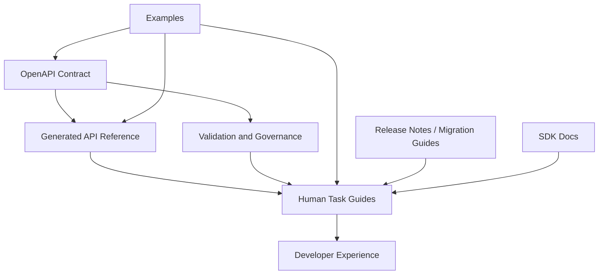
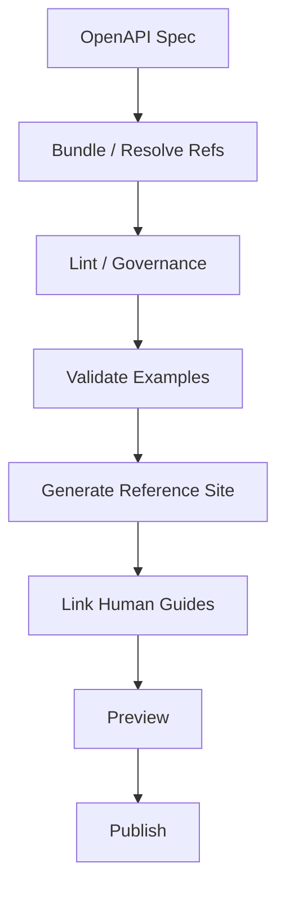
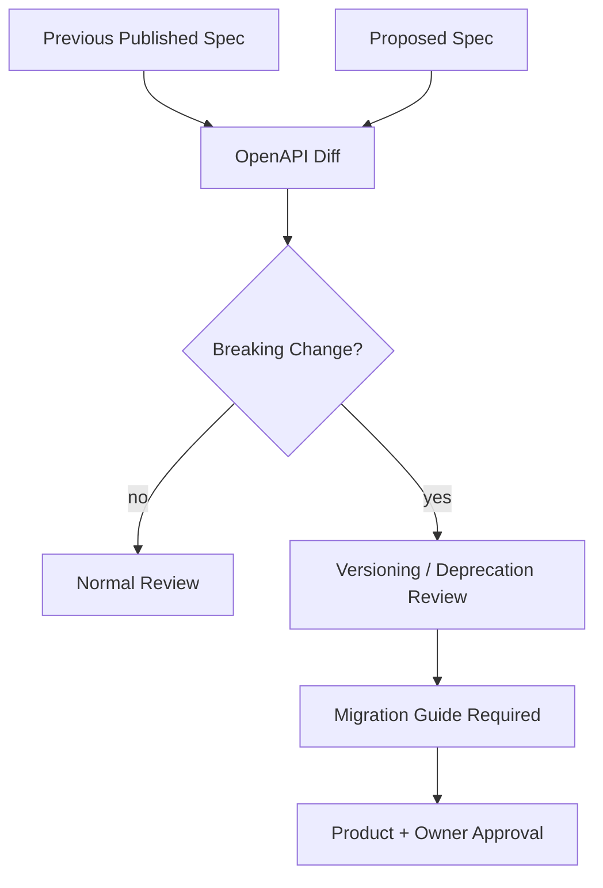
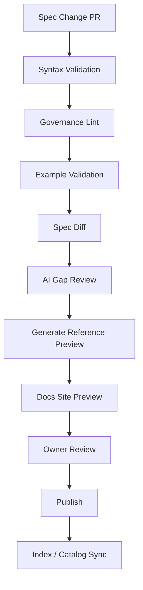
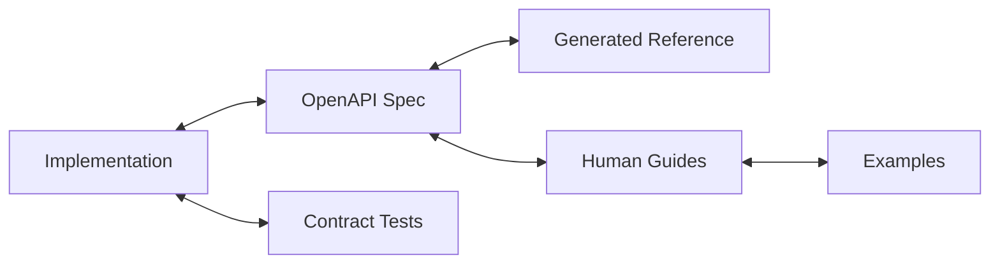
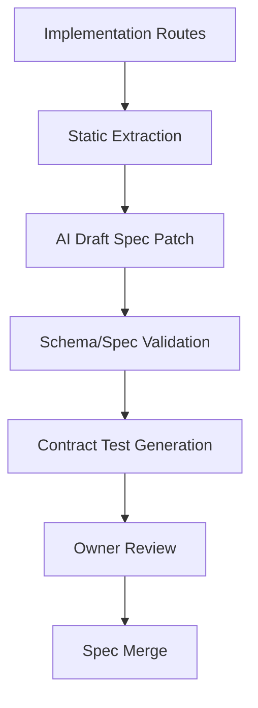

------
title: Learn AI-Driven Documentation and Technical Writing Implementation and Usage - Part 022
description: Deep implementation guide for API documentation with OpenAPI: contract-backed docs, examples, error models, governance, generated references, AI-assisted review, and API documentation delivery pipelines.
series: learn-ai-driven-documentation
seriesTitle: Learn AI-Driven Documentation and Technical Writing Implementation and Usage
order: 22
partTitle: API Documentation with OpenAPI
tags:
- ai
- documentation
- technical-writing
- openapi
- api-documentation
- contract-governance
- docs-as-code
- series
date: 2026-06-30
---

# Part 022 — API Documentation with OpenAPI

## 1. Why This Part Exists

API documentation is where documentation becomes part of the product interface.

A README can be helpful. An architecture explanation can accelerate onboarding. A runbook can reduce incident recovery time. But API documentation directly shapes whether another engineer, customer, partner, integration team, or AI agent can safely call a system.

That makes API docs different from ordinary prose.

Good API documentation must be:

- contract-backed,
- example-rich,
- version-aware,
- error-aware,
- security-aware,
- tested,
- reviewable,
- and aligned with implementation.

OpenAPI is the dominant way to describe HTTP APIs in a machine-readable form. The OpenAPI Specification defines a language-agnostic interface description for HTTP APIs so humans and computers can understand service capabilities without reading source code or inspecting traffic.

But OpenAPI alone is not enough.

A raw OpenAPI file can tell a reader that `POST /payments` exists. It does not automatically teach:

- when to call it,
- how to choose request fields,
- what state transitions occur,
- how idempotency works,
- which errors are retryable,
- how to migrate from v1 to v2,
- what operational guarantees are safe to assume,
- and what not to depend on.

This part explains how to build API documentation around OpenAPI as a contract-backed documentation system.

The core principle:

> OpenAPI should be the machine-readable contract backbone, not the entire human documentation experience.

---

## 2. Kaufman Framing

Using Kaufman's skill acquisition model, API documentation with OpenAPI can be decomposed into practiceable sub-skills.

| Sub-skill | What You Must Be Able to Do |
|---|---|
| Contract modeling | Represent endpoints, schemas, parameters, auth, responses, and errors accurately. |
| Human explanation | Explain API behavior in task-oriented language. |
| Example design | Provide realistic request/response examples that validate against the spec. |
| Error documentation | Make failure modes clear, actionable, and retry-aware. |
| Governance | Enforce naming, versioning, deprecation, and compatibility rules. |
| Automation | Generate reference docs, validate examples, diff specs, and publish docs. |
| AI assistance | Use AI to draft, review, summarize, and detect gaps without inventing contract behavior. |
| Review workflow | Route contract changes through technical, security, product, and docs review. |

### 2.1 Target Performance Level

After this part, you should be able to:

1. Treat OpenAPI as a documentation source of truth for HTTP contract shape.
2. Design an API docs architecture that combines generated reference and human-authored guides.
3. Validate OpenAPI specs in CI.
4. Generate and test examples.
5. Use AI to review specs and draft supporting docs safely.
6. Detect drift between implementation, spec, and documentation.
7. Govern breaking changes, deprecations, and versioned docs.
8. Build an enterprise-grade API documentation pipeline.

---

## 3. The Three-Layer API Documentation Model

API documentation should not be one giant generated page.

Use three layers.



### 3.1 Layer 1: Contract

The contract describes:

- paths,
- operations,
- parameters,
- request bodies,
- response bodies,
- status codes,
- headers,
- schemas,
- security schemes,
- examples,
- tags,
- deprecation markers,
- links to external docs.

This is machine-readable and should be validated.

### 3.2 Layer 2: Generated Reference

Generated reference docs render the contract for humans.

They answer:

- what endpoint exists,
- what fields are accepted,
- what responses may occur,
- what auth is required,
- what examples look like,
- what schemas are reused.

Generated reference should stay close to the spec.

### 3.3 Layer 3: Human Task Guides

Task guides explain how to solve real problems.

They answer:

- how to create a payment,
- how to handle duplicate submissions,
- how to paginate safely,
- how to retry transient failures,
- how to migrate to a new endpoint,
- how to interpret lifecycle states,
- how to test an integration.

These are usually MDX/Markdown docs that link to generated reference sections.

### 3.4 Why This Separation Matters

If everything is generated from OpenAPI, the docs become technically complete but hard to learn from.

If everything is hand-written, the docs become readable but drift-prone.

The right model is:

> Generate reference from contract. Write guides around user tasks. Validate both against the same source of truth.

---

## 4. OpenAPI as Source of Truth

OpenAPI should be the source of truth for HTTP contract shape, but not for every business claim.

### 4.1 What OpenAPI Is Good At

| Area | Good Fit? | Notes |
|---|---:|---|
| endpoint paths | Yes | primary contract shape |
| HTTP methods | Yes | explicit operation model |
| path/query/header params | Yes | use schema and examples |
| request/response schema | Yes | prefer reusable components |
| auth schemes | Yes | describe mechanism and scopes |
| status codes | Yes | include meaningful descriptions |
| examples | Yes | validate examples |
| deprecation marker | Yes | but add migration guide outside spec |
| lifecycle state semantics | Partial | use description + guide |
| retry strategy | Partial | often needs operational guide |
| business rationale | No | use explanation/ADR docs |
| compliance guarantees | No | use reviewed governance docs |

### 4.2 Source Hierarchy

For API documentation, a sane source hierarchy is:

1. OpenAPI spec for contract shape.
2. Contract tests for implementation conformance.
3. Implementation source for behavior details.
4. Product/domain docs for intent.
5. Runbooks for operational guidance.
6. Existing docs for human explanation.
7. AI-generated drafts only after review.

This prevents the common mistake of treating generated prose as contract.

---

## 5. Spec Organization

A scalable OpenAPI repository should be modular.

### 5.1 Small Service Layout

```text
services/payment/
  openapi/
    openapi.yml
    components/
      schemas.yml
      responses.yml
      parameters.yml
      examples/
        create-payment-request.json
        create-payment-response.json
  docs/
    api/
      payments-overview.mdx
      idempotency.mdx
      error-handling.mdx
```

### 5.2 Platform Layout

```text
api-catalog/
  payment-api/
    openapi.yml
    components/
    examples/
    changelog.md
    migration-guides/
  order-api/
    openapi.yml
    components/
    examples/
  shared/
    problem-details.yml
    pagination.yml
    security-schemes.yml
    common-headers.yml
  governance/
    spectral-rules.yml
    style-guide.mdx
```

### 5.3 Monorepo vs API Catalog

| Model | Pros | Cons | Use When |
|---|---|---|---|
| Spec beside service code | reduces drift, easy PR review | harder global governance | service-owned APIs |
| Central API catalog | discoverable, consistent governance | can drift from code | platform/partner APIs |
| Hybrid | best balance | more tooling | mature organizations |

A hybrid model is often best:

- canonical spec lives near service code,
- published copy is indexed in central catalog,
- governance runs in both places.

---

## 6. Anatomy of a Good Operation

A weak OpenAPI operation contains only path, method, and schema.

A good operation supports humans, tooling, tests, and AI.

```yaml
paths:
  /payments:
    post:
      operationId: createPayment
      summary: Create a payment attempt
      description: |
        Creates a payment attempt for an order that is ready for payment.
        Use an idempotency key to safely retry client-side timeouts.
      tags:
        - Payments
      security:
        - oauth2:
            - payments.write
      parameters:
        - $ref: '#/components/parameters/IdempotencyKey'
      requestBody:
        required: true
        content:
          application/json:
            schema:
              $ref: '#/components/schemas/CreatePaymentRequest'
            examples:
              cardPayment:
                $ref: '#/components/examples/CreateCardPaymentRequest'
      responses:
        '201':
          description: Payment attempt created.
          content:
            application/json:
              schema:
                $ref: '#/components/schemas/Payment'
              examples:
                created:
                  $ref: '#/components/examples/CreatePaymentResponse'
        '400':
          $ref: '#/components/responses/BadRequest'
        '409':
          $ref: '#/components/responses/InvalidOrderState'
        '422':
          $ref: '#/components/responses/BusinessValidationFailed'
        '429':
          $ref: '#/components/responses/RateLimited'
        '500':
          $ref: '#/components/responses/InternalServerError'
      x-docs:
        guide: docs/api/payments-overview.mdx
        lifecycleState: stable
        owner: payments-platform
        risk: high
```

### 6.1 Operation Quality Checklist

| Field | Why It Matters |
|---|---|
| `operationId` | stable anchor for tooling, SDKs, docs links |
| `summary` | scannability |
| `description` | context and constraints |
| `tags` | navigation grouping |
| `security` | auth expectations |
| parameters | contract clarity |
| requestBody | input contract |
| responses | success and failure contract |
| examples | developer confidence |
| extensions | governance metadata |

### 6.2 Summary vs Description

`summary` should be short.

Good:

```yaml
summary: Create a payment attempt
```

Bad:

```yaml
summary: This endpoint is used by the payment service to allow users to create a payment attempt after they have placed an order and want to pay for it using the provider integration
```

Put context in `description`, not `summary`.

---

## 7. Schema Design for Documentation

Schemas are not only validation structures. They are reader-facing models.

### 7.1 Good Schema Description

```yaml
CreatePaymentRequest:
  type: object
  required:
    - orderId
    - amount
    - currency
    - paymentMethodId
  properties:
    orderId:
      type: string
      format: uuid
      description: Order to charge. The order must be in `PAYMENT_PENDING` state.
    amount:
      type: integer
      format: int64
      minimum: 1
      description: Amount in the minor currency unit, such as cents.
    currency:
      type: string
      minLength: 3
      maxLength: 3
      example: USD
      description: ISO 4217 currency code.
    paymentMethodId:
      type: string
      description: Tokenized payment method identifier.
```

### 7.2 Description Rules

Field descriptions should explain meaning, not syntax already expressed by schema keywords.

Bad:

```yaml
description: A string field.
```

Better:

```yaml
description: Tokenized payment method identifier returned by the payment-method creation flow.
```

### 7.3 Enum Documentation

```yaml
PaymentStatus:
  type: string
  description: Current lifecycle state of a payment attempt.
  enum:
    - CREATED
    - AUTHORIZED
    - CAPTURED
    - FAILED
    - CANCELLED
  x-enumDescriptions:
    CREATED: Payment attempt was accepted but not yet authorized.
    AUTHORIZED: Provider authorized the payment but funds are not captured.
    CAPTURED: Funds were captured successfully.
    FAILED: Payment failed and will not proceed without a new attempt.
    CANCELLED: Payment was cancelled before capture.
```

OpenAPI itself has specific rules for schema and extensions. Custom `x-*` extensions are useful, but they must be governed so tooling can rely on them.

---

## 8. Error Documentation

Error documentation is often the difference between a usable API and a frustrating one.

### 8.1 Error Model

Prefer a consistent error object.

```yaml
Problem:
  type: object
  required:
    - type
    - title
    - status
    - detail
    - traceId
  properties:
    type:
      type: string
      format: uri
      description: Stable URI identifying the error category.
    title:
      type: string
      description: Short human-readable error title.
    status:
      type: integer
      description: HTTP status code.
    detail:
      type: string
      description: Specific explanation for this occurrence.
    traceId:
      type: string
      description: Correlation identifier for support and diagnostics.
    code:
      type: string
      description: Product-specific stable error code.
```

### 8.2 Error Table in Human Docs

```md
| Status | Code | Meaning | Retry? | Client Action |
|---:|---|---|---:|---|
| 400 | `INVALID_REQUEST` | Request shape is invalid | No | Fix request payload |
| 401 | `UNAUTHENTICATED` | Missing/invalid credentials | No | Refresh token or authenticate |
| 403 | `FORBIDDEN` | Token lacks required scope | No | Request correct permission |
| 409 | `INVALID_ORDER_STATE` | Order is not payable | No | Refresh order state |
| 429 | `RATE_LIMITED` | Too many requests | Yes | Back off using response headers |
| 500 | `INTERNAL_ERROR` | Unexpected server failure | Maybe | Retry with idempotency key |
```

### 8.3 Retry Guidance

Retry guidance must be reviewed carefully. It can affect production load and customer behavior.

Do not write:

```md
Retry all 500 errors until success.
```

Better:

```md
Retry transient `5xx` responses with exponential backoff only when the request includes an idempotency key. Do not retry validation or invalid-state errors.
```

This claim requires source support from API design docs, runbooks, or implementation behavior.

---

## 9. Examples as Executable Documentation

Examples are the strongest part of API docs when they are realistic and tested.

### 9.1 Example Types

| Example Type | Purpose |
|---|---|
| minimal valid request | shortest working call |
| realistic request | common production-like scenario |
| success response | expected happy path |
| validation error | how invalid input fails |
| conflict error | state conflict behavior |
| rate limit error | throttling behavior |
| pagination example | list navigation |
| webhook callback example | asynchronous flow |

### 9.2 Example File Layout

```text
openapi/examples/
  payments/
    create-payment.request.json
    create-payment.response.201.json
    create-payment.response.409.json
    list-payments.response.200.json
```

### 9.3 Example Validation

Each example should validate against the schema.

```bash
openapi-cli validate openapi/openapi.yml

# Example pseudo-command
api-docs validate-examples \
  --spec openapi/openapi.yml \
  --examples openapi/examples
```

### 9.4 AI-Assisted Example Drafting

AI can draft candidate examples, but the acceptance rule is strict:

> An AI-generated API example is not publishable until it validates against the OpenAPI schema and is reviewed for business realism.

AI often produces syntactically plausible but semantically wrong examples. Validation catches shape problems, not business correctness.

---

## 10. Generated Reference Docs

Generated reference docs should be deterministic.

### 10.1 Reference Doc Pipeline



### 10.2 Generated Reference Should Include

- endpoint list,
- authentication requirements,
- request fields,
- response fields,
- examples,
- error responses,
- schema models,
- deprecation markers,
- SDK/client snippets if supported,
- links to task guides.

### 10.3 Generated Reference Should Not Replace

- getting started guide,
- conceptual model,
- lifecycle explanation,
- migration guide,
- operational troubleshooting,
- business rules explanation,
- integration design advice.

Those belong in authored docs.

---

## 11. Human API Guides

Human guides should be task-based.

### 11.1 Guide Types

| Guide | Reader Task |
|---|---|
| Getting started | Make the first successful call |
| Authentication | Get and use credentials safely |
| Idempotency | Retry safely without duplicate side effects |
| Pagination | Traverse list endpoints correctly |
| Error handling | Respond to failure modes |
| Webhooks/callbacks | Receive asynchronous notifications |
| Migration | Move from old behavior to new behavior |
| Sandbox/testing | Test integration safely |
| Rate limits | Avoid throttling and recover from it |

### 11.2 Guide Template

```md
# Create a Payment

## When to Use This Guide

## Prerequisites

## Request Flow

## Step 1: Prepare the Order

## Step 2: Create a Payment Attempt

## Step 3: Handle the Response

## Step 4: Retry Safely

## Error Handling

## Testing in Sandbox

## Related Reference
```

Notice that this is not an OpenAPI operation dump. It is a workflow.

---

## 12. AI Usage Patterns for OpenAPI Docs

AI should assist API docs in bounded ways.

### 12.1 Safe AI Tasks

| Task | Risk | Notes |
|---|---:|---|
| summarize operation groups | Low | based on spec |
| rewrite descriptions for clarity | Low/Medium | preserve contract meaning |
| detect missing examples | Low | structural check |
| identify undocumented errors | Medium | requires implementation/test evidence |
| draft migration guide | Medium/High | must compare specs and product policy |
| generate example candidates | Medium | validate examples |
| infer behavior from code | High | requires review |
| claim retry/idempotency guarantees | High | domain/ops review |

### 12.2 Spec Review Prompt

```md
Review this OpenAPI operation for documentation quality.

Check:
- missing or vague summary,
- description that repeats the operationId,
- missing auth requirements,
- missing examples,
- incomplete error responses,
- ambiguous field descriptions,
- inconsistent naming,
- undocumented pagination/rate limit/idempotency behavior,
- breaking-change risk compared with previous spec.

Do not invent missing behavior.
Return findings as a table with severity, location, issue, recommendation, and whether human review is required.
```

### 12.3 Description Rewrite Prompt

```md
Rewrite the following OpenAPI field descriptions for clarity.

Rules:
- Do not change contract meaning.
- Do not add constraints not present in schema or evidence.
- Keep descriptions concise.
- Explain business meaning, not the JSON type.
- Mark any missing information instead of guessing.
```

### 12.4 AI Gap Detection

AI can detect likely gaps:

- operation has `429` but no rate-limit guide,
- endpoint accepts idempotency key but no idempotency guide exists,
- list endpoint has pagination fields but no pagination explanation,
- error code appears in response example but not error catalog,
- schema has enum but enum values have no meaning descriptions,
- endpoint is deprecated but no migration guide is linked.

These are great AI tasks because they are structural and reviewable.

---

## 13. Contract Linting and Governance

OpenAPI governance turns API docs into an enforceable system.

### 13.1 Governance Rules

| Rule | Why |
|---|---|
| every operation has `operationId` | stable linking and SDK generation |
| every operation has `summary` | navigation clarity |
| every non-trivial operation has `description` | reader context |
| every operation declares security or explicitly none | auth clarity |
| every request body has examples | integration confidence |
| every response has description | error understanding |
| every error response uses common error schema | consistency |
| no undocumented enum values | reader comprehension |
| no breaking changes without version/deprecation review | compatibility |
| deprecated operations link migration docs | safe migration |

### 13.2 Example Spectral-Style Rules

```yaml
rules:
  operation-operationId:
    description: Every operation must have an operationId.
    severity: error
    given: $.paths[*][*]
    then:
      field: operationId
      function: truthy

  operation-summary:
    description: Every operation must have a summary.
    severity: error
    given: $.paths[*][*]
    then:
      field: summary
      function: truthy

  response-description:
    description: Every response must have a description.
    severity: error
    given: $.paths[*][*].responses[*]
    then:
      field: description
      function: truthy
```

The exact linter is less important than the governance principle:

> Contract documentation rules should fail in CI before bad docs reach readers.

---

## 14. Spec Diff and Breaking Change Detection

API docs must be version-aware.

### 14.1 Breaking Change Examples

| Change | Breaking? | Notes |
|---|---:|---|
| remove endpoint | Yes | unless endpoint was internal/unpublished |
| remove response field | Usually | depends on contract |
| add required request field | Yes | clients must change |
| change field type | Yes | clients may break |
| remove enum value | Yes | clients may rely on it |
| add optional response field | Usually no | clients should ignore unknown fields |
| add new endpoint | No | additive |
| add optional request field | Usually no | additive |
| add new error code | Maybe | can break clients with strict handling |

### 14.2 Diff Pipeline



### 14.3 AI-Assisted Diff Summary

AI is useful after the diff tool identifies concrete changes.

Prompt:

```md
Summarize this OpenAPI diff for API consumers.

Rules:
- Use only the diff data.
- Separate breaking, non-breaking, and documentation-only changes.
- Mention required client action.
- Do not infer business intent.
- Mark missing migration guidance.
```

This produces release-note drafts and migration checklists.

---

## 15. Versioning and Deprecation Docs

Versioning is not only a URL problem.

### 15.1 Versioning Strategies

| Strategy | Example | Pros | Cons |
|---|---|---|---|
| URI version | `/v1/payments` | explicit | duplicates routes |
| Header version | `Accept: application/vnd.acme.v2+json` | flexible | harder for simple clients |
| Date version | `API-Version: 2026-06-30` | granular | governance overhead |
| Field evolution | additive changes only | stable URLs | requires discipline |

This series does not prescribe one strategy. It prescribes documentation invariants:

- version must be visible,
- compatibility rules must be documented,
- deprecations must have migration path,
- breaking changes must have explicit approval,
- old docs must remain available while old version is supported.

### 15.2 Deprecation Metadata

```yaml
paths:
  /v1/payments:
    post:
      deprecated: true
      summary: Create a payment attempt using the legacy v1 flow
      description: |
        Deprecated. Use `POST /v2/payments` for new integrations.
        v1 remains supported until 2027-06-30.
      x-deprecation:
        replacementOperationId: createPaymentV2
        sunsetDate: "2027-06-30"
        migrationGuide: docs/api/migrations/payments-v1-to-v2.mdx
```

### 15.3 Migration Guide Requirements

A migration guide should include:

- what changed,
- why it changed,
- who is affected,
- old request/response,
- new request/response,
- field mapping,
- behavior differences,
- timeline,
- test plan,
- rollback/compatibility notes,
- support contact.

AI can draft this from spec diff, but humans must verify product and compatibility claims.

---

## 16. Security Documentation

API docs must describe authentication and authorization clearly without leaking sensitive implementation details.

### 16.1 Security Scheme Example

```yaml
components:
  securitySchemes:
    oauth2:
      type: oauth2
      flows:
        clientCredentials:
          tokenUrl: https://auth.example.com/oauth/token
          scopes:
            payments.read: Read payment data.
            payments.write: Create and modify payment attempts.
```

### 16.2 Auth Guide Should Explain

- supported auth mechanism,
- how to obtain credentials,
- required scopes,
- token lifetime expectations,
- sandbox vs production differences,
- safe secret handling,
- common auth errors,
- rotation process,
- contact/escalation path.

### 16.3 Auth Guide Should Not Expose

- private signing keys,
- internal auth bypasses,
- privileged internal scopes,
- implementation-specific validation shortcuts,
- environment-specific secrets,
- exploit-oriented details.

### 16.4 Security Review Trigger

Require security review when docs change:

- auth schemes,
- scopes,
- token handling,
- webhooks/signatures,
- admin endpoints,
- internal-only endpoints,
- encryption behavior,
- rate limiting,
- error detail exposure.

---

## 17. API Docs Pipeline

A mature API docs pipeline has deterministic checks before AI and human review.



### 17.1 CI Checklist

```yaml
apiDocsCi:
  validateSpec: true
  lintGovernance: true
  validateExamples: true
  detectBreakingChanges: true
  checkOperationIdUniqueness: true
  checkLinksToGuides: true
  generateReferencePreview: true
  runProseLintOnDescriptions: true
  scanForSecrets: true
  requireMigrationGuideForDeprecatedOperations: true
```

### 17.2 Pull Request Template

```md
## API Documentation Checklist

- [ ] OpenAPI spec validates.
- [ ] Examples validate against schema.
- [ ] New operations have summary and description.
- [ ] Error responses are documented.
- [ ] Auth/scopes are documented.
- [ ] Breaking change diff reviewed.
- [ ] Deprecated operations link migration guide.
- [ ] Human task guide updated if behavior changed.
- [ ] Generated reference preview checked.
- [ ] Security review requested if auth or sensitive behavior changed.
```

---

## 18. Drift Detection

API docs can drift in three directions.



### 18.1 Drift Types

| Drift | Example | Detection |
|---|---|---|
| implementation vs spec | endpoint returns undocumented field | contract tests |
| spec vs reference | generated site stale | build fingerprint |
| spec vs guide | guide mentions old field | link/symbol checks |
| example vs schema | example invalid | schema validation |
| error guide vs responses | guide omits 409 | structural gap check |
| auth guide vs security scheme | missing scope | governance lint |
| migration guide vs diff | missing breaking change | diff-to-doc check |

### 18.2 Drift Policy

Any API docs pipeline should enforce:

1. published reference docs must match a published spec hash,
2. examples must validate against that spec hash,
3. human guides must declare the API version they target,
4. deprecated operations must link to migration docs,
5. breaking changes require explicit approval.

---

## 19. AI-Assisted OpenAPI Generation from Code

Sometimes the source of truth starts in code and OpenAPI is generated from implementation.

### 19.1 Generation Modes

| Mode | Description | Risk |
|---|---|---:|
| annotation-first | framework annotations generate spec | Medium |
| spec-first | OpenAPI drives implementation | Lower drift, higher design discipline |
| code-scan + AI | AI infers spec from routes/source | High unless verified |
| hybrid | code annotations + manual spec enrichment | Common |

### 19.2 AI Generation Rule

AI can draft missing OpenAPI sections, but it must not silently define the contract.

Safe workflow:



### 19.3 What AI Can Infer Reasonably

| Item | AI Inference Risk |
|---|---:|
| route path/method from annotation | Low if source provided |
| parameter names | Low/Medium |
| request body shape | Medium |
| response body shape | Medium/High |
| error responses | High |
| auth scopes | High |
| business semantics | Very High |
| compatibility guarantees | Very High |

AI should produce a draft plus gaps, not a final contract.

---

## 20. Documentation Metadata Extensions

OpenAPI allows specification extensions using `x-*` fields. Use them carefully.

### 20.1 Useful Extensions

```yaml
x-docs:
  owner: payments-platform
  guide: docs/api/payments-overview.mdx
  lifecycleState: stable
  risk: high
  reviewedBy:
    - api-owner
    - security-owner
  lastReviewed: "2026-06-30"
  supportChannel: "#payments-api-support"
```

### 20.2 Extension Governance

Do not let every team invent metadata keys.

Define a schema:

```yaml
x-docs:
  type: object
  required:
    - owner
    - lifecycleState
  properties:
    owner:
      type: string
    guide:
      type: string
    lifecycleState:
      enum:
        - experimental
        - beta
        - stable
        - deprecated
        - retired
    risk:
      enum:
        - low
        - medium
        - high
        - critical
```

Then lint it.

---

## 21. API Documentation Quality Rubric

Use a rubric so review does not become subjective.

| Dimension | Poor | Good | Excellent |
|---|---|---|---|
| Contract completeness | missing responses/schemas | complete success path | complete success, errors, auth, examples |
| Human usability | reference only | basic guides | task flows + troubleshooting + migration |
| Examples | absent or fake | schema-valid | realistic, tested, multiple scenarios |
| Error docs | status codes only | error schema | retry/action guidance |
| Versioning | unclear | version visible | compatibility/deprecation policy clear |
| Governance | manual review only | lint checks | automated gates + risk routing |
| AI usage | ad-hoc generation | assisted review | evidence-backed, tested, reviewable AI workflow |

### 21.1 Score Interpretation

| Score | Meaning |
|---:|---|
| 1 | API docs are risky; readers must inspect code or ask humans. |
| 2 | Basic reference exists but human workflows are weak. |
| 3 | Good internal API docs; acceptable for many teams. |
| 4 | Strong platform docs; examples and governance are reliable. |
| 5 | Enterprise-grade docs; contract, guides, examples, governance, and observability are integrated. |

---

## 22. Enterprise Reference Implementation

### 22.1 Components

```text
api-docs-platform/
  specs/
    payment/openapi.yml
    order/openapi.yml
  shared/
    components/
    governance/
  guides/
    payment/
    order/
  tools/
    validate-spec
    validate-examples
    diff-spec
    generate-reference
    ai-gap-review
    publish-catalog
  .github/workflows/api-docs.yml
```

### 22.2 Workflow

1. Developer changes API spec or implementation.
2. CI validates OpenAPI syntax.
3. Governance linter checks style and metadata.
4. Examples validate against schema.
5. Diff tool detects breaking changes.
6. AI reviewer identifies doc gaps and unclear descriptions.
7. Reference docs are generated into preview.
8. Human API owner reviews contract.
9. Docs reviewer reviews human guide quality.
10. Security reviewer reviews auth-sensitive changes.
11. Published docs are indexed in API catalog.
12. Metrics update documentation health dashboard.

### 22.3 Health Dashboard

Track:

- specs passing validation,
- operations missing examples,
- operations missing error responses,
- undocumented deprecated operations,
- breaking changes by month,
- stale guide links,
- guide coverage by operation group,
- API docs search zero-result rate,
- support tickets linked to docs gaps,
- AI review findings accepted/rejected.

---

## 23. Practical 20-Hour Drill

### Hour 1–2: Pick One API

Choose one API with 5–15 operations.

Avoid the most complex API first.

### Hour 3–5: Clean the OpenAPI Spec

Ensure:

- operation IDs exist,
- summaries are clear,
- request/response schemas are reusable,
- common errors are modeled,
- auth is declared.

### Hour 6–8: Add Examples

Add one success and one failure example for the highest-value operations.

Validate examples.

### Hour 9–11: Generate Reference Docs

Use your chosen docs platform to render the spec.

Add preview build.

### Hour 12–14: Write One Human Guide

Write a task guide:

- getting started,
- error handling,
- idempotency,
- pagination,
- or migration.

Link it from relevant operations.

### Hour 15–17: Add Governance Checks

Add lint rules for:

- operation ID,
- summary,
- response description,
- examples,
- security,
- deprecated migration guide.

### Hour 18–20: Add AI Review

Use AI to find gaps, but keep findings as review comments.

Measure:

- how many findings were real,
- how many were false positives,
- what rule should be automated next.

---

## 24. Failure Modeling

### 24.1 Failure Modes

| Failure | Cause | Mitigation |
|---|---|---|
| Spec exists but guides are unusable | over-reliance on generated reference | task guide layer |
| Beautiful docs but wrong contract | hand-written drift | spec-backed validation |
| Examples are invalid | not tested | example schema validation |
| Error docs are vague | status-only responses | shared error model + error guide |
| Breaking changes surprise clients | no diff gate | spec diff in CI |
| AI invents behavior | weak source grounding | evidence rules + owner review |
| Auth docs leak internals | uncontrolled prose | security review triggers |
| Metadata chaos | unmanaged extensions | extension schema + lint |
| Version confusion | one docs page for all versions | versioned docs and spec hashes |

### 24.2 Diagnostic Questions

When API docs fail, ask:

1. Is the OpenAPI spec actually the contract source of truth?
2. Are examples validated against the spec?
3. Are human guides linked to reference operations?
4. Are error responses documented consistently?
5. Are breaking changes detected automatically?
6. Are deprecations tied to migration docs?
7. Are AI-generated changes reviewed by API owners?
8. Are published docs tied to a spec version/hash?
9. Are readers succeeding without asking the API team?
10. Are support tickets feeding docs backlog?

---

## 25. Final Mental Model

OpenAPI documentation is not about producing a pretty endpoint page.

It is about creating an API knowledge system where:

1. the contract is machine-readable,
2. examples are executable,
3. reference docs are generated,
4. task guides are human-centered,
5. errors are actionable,
6. versioning is explicit,
7. changes are diffed,
8. governance is automated,
9. AI assists review and drafting,
10. humans own published truth.

OpenAPI gives the backbone. Docs-as-code gives the workflow. AI gives speed and gap detection. Human review gives accountability.

The top-tier engineering move is not to ask AI to "write API docs".

It is to build a system where API docs are continuously derived, validated, reviewed, and improved from the same contract that developers and clients rely on.

---

## 26. References

- OpenAPI Initiative: https://www.openapis.org/
- OpenAPI Specification v3.2.0: https://spec.openapis.org/oas/v3.2.0.html
- Swagger OpenAPI Specification rendering: https://swagger.io/specification/
- Write the Docs — Docs as Code: https://www.writethedocs.org/guide/docs-as-code/
- OWASP Top 10 for LLM Applications: https://owasp.org/www-project-top-10-for-large-language-model-applications/

---

## 27. What Comes Next

Part 023 moves from synchronous HTTP APIs to event-driven documentation with AsyncAPI.

The key shift is:

> OpenAPI documents request/response contracts. AsyncAPI documents message-driven contracts, producer/consumer relationships, channels, payloads, and asynchronous behavior.

That requires a different documentation mental model: lifecycle, ordering, replay, idempotency, schema evolution, consumer impact, and event catalog governance.
