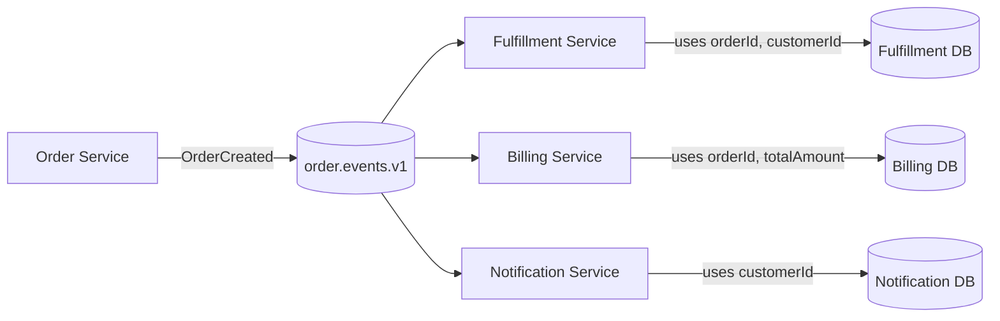
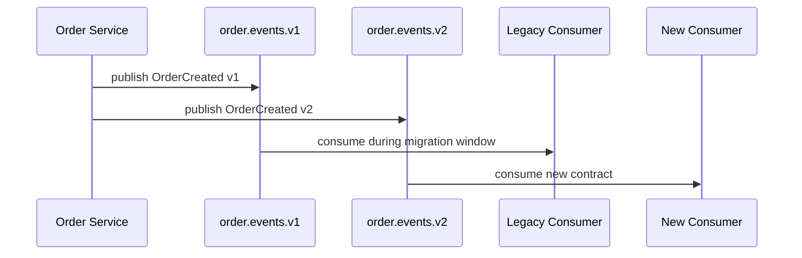
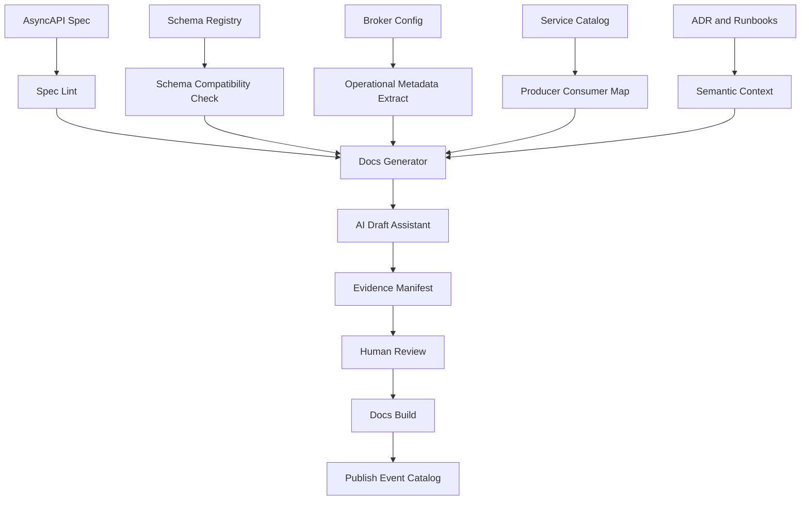
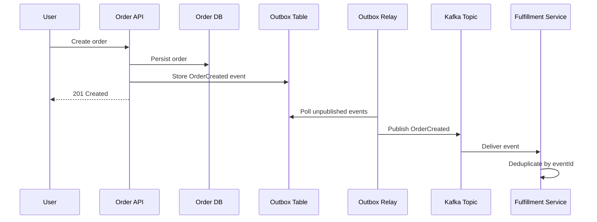
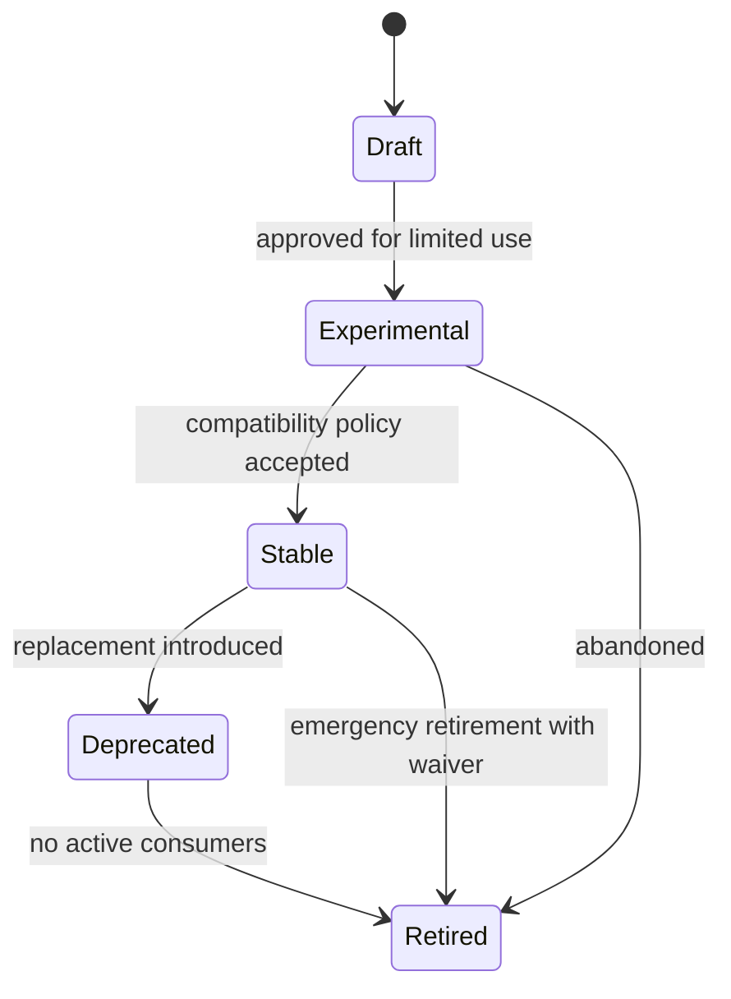

------
title: Learn AI-Driven Documentation and Technical Writing Implementation and Usage - Part 023
description: Deep implementation guide for event documentation with AsyncAPI: event cataloging, channels, messages, producer-consumer mapping, examples, lifecycle, governance, AI-assisted validation, and documentation delivery pipelines.
series: learn-ai-driven-documentation
seriesTitle: Learn AI-Driven Documentation and Technical Writing Implementation and Usage
order: 23
partTitle: Event Documentation with AsyncAPI
tags:
- ai
- documentation
- technical-writing
- asyncapi
- event-documentation
- event-driven-architecture
- docs-as-code
- series
date: 2026-06-30
---

# Part 023 — Event Documentation with AsyncAPI

## 1. Why This Part Exists

Event documentation is harder than HTTP API documentation.

An HTTP endpoint is usually requested by a known caller, returns a response synchronously, and has a visible request/response boundary. Event-driven systems are different. A producer publishes a message. One or more consumers may process it later. Some consumers may not be known to the producing team. Some processing may be retried, replayed, delayed, reordered, deduplicated, or dropped into a dead-letter queue.

That means event documentation must explain more than payload shape.

It must explain:

- what happened,
- who publishes it,
- who is expected to consume it,
- when it is emitted,
- what business state transition it represents,
- whether it is an event, command, or query-like message,
- whether it is replayable,
- whether order matters,
- whether duplicate delivery is possible,
- whether the event is public, partner-facing, internal, or private,
- how schema evolution works,
- how consumers should handle unknown fields,
- what failure and retry semantics exist,
- and how breaking change risk is controlled.

AsyncAPI gives us a contract-backed way to describe message-based and event-driven APIs. But as with OpenAPI, the machine-readable contract is not the full human documentation experience.

The core principle for this part:

> AsyncAPI should be the contract backbone for event documentation, while human docs explain behavior, timing, ownership, failure, lifecycle, and safe consumption.

This part is not a repeat of event contract engineering. We focus specifically on documentation implementation and usage: how to document event-driven systems so engineers, operators, product teams, auditors, and AI tools can understand and safely use them.

---

## 2. Kaufman Lens: What We Are Actually Learning

Josh Kaufman's method starts by deconstructing a skill into smaller sub-skills and practicing the parts that produce the highest leverage.

For event documentation, the highest-leverage sub-skills are:

1. **Event interpretation** — identifying what business or technical fact the event represents.
2. **Contract expression** — representing channels, messages, schemas, examples, and metadata in AsyncAPI.
3. **Consumer empathy** — explaining how another team should safely consume the event.
4. **Lifecycle reasoning** — documenting versioning, deprecation, replay, retention, and compatibility.
5. **Failure reasoning** — documenting duplicate delivery, ordering, retry, poison messages, and dead-letter behavior.
6. **Governance design** — making event docs reviewable, testable, discoverable, and auditable.
7. **AI-assisted documentation** — using AI to draft, normalize, compare, and review event docs without inventing semantics.

The 20-hour skill target is not:

> "I can generate an AsyncAPI file."

The useful target is:

> "I can design, review, and maintain an event documentation system where AsyncAPI, schema registry, examples, ownership metadata, lifecycle rules, and AI-assisted review work together as a reliable source of truth."

---

## 3. Event Documentation Mental Model

Think of event documentation as a map of distributed commitments.

Every event creates implicit commitments:

- the producer commits to emit a message under known conditions,
- the producer commits to a schema and compatibility policy,
- the consumer commits to interpret the message correctly,
- the platform commits to delivery semantics,
- the organization commits to lifecycle and deprecation rules.

When these commitments are undocumented, they become tribal knowledge.

The failure pattern is predictable:

1. A producer changes a field.
2. A consumer silently depends on the old behavior.
3. No one knows the dependency exists.
4. A release breaks downstream processing.
5. Incident review says: "We need better documentation."

Better event docs prevent that by making dependencies explicit before the failure.

### 3.1 Event Documentation Is Not Just Schema Documentation

A schema can say:

```json
{
  "orderId": "string",
  "status": "string",
  "occurredAt": "string"
}
```

But it does not explain:

- which status values are terminal,
- whether status transitions are monotonic,
- whether consumers may receive the same status twice,
- whether consumers may receive `SHIPPED` before `PAID`,
- whether `occurredAt` is producer time, event time, or broker time,
- whether the event is emitted before or after transaction commit,
- whether a replay may emit old status transitions again.

A top-tier event documentation system treats schema as one layer of truth, not the whole truth.

---

## 4. AsyncAPI as Documentation Backbone

AsyncAPI is a machine-readable specification for message-driven APIs. It describes the shape of an event-driven interface in JSON or YAML, including channels, messages, schemas, servers, security, and reusable components.

The practical value of AsyncAPI in documentation is that it gives us:

- a contract format,
- a validation target,
- a generation target,
- a review artifact,
- a discovery artifact,
- a source for event catalogs,
- a source for SDK or sample generation,
- and a stable input for AI-assisted documentation workflows.

### 4.1 Contract Backbone vs Human Explanation

AsyncAPI is good for:

- channel names,
- message names,
- payload schema,
- protocol information,
- examples,
- headers,
- reusable components,
- security schemes,
- producer/consumer operations,
- generated reference documentation.

Human-written docs are still required for:

- business meaning,
- lifecycle state,
- domain invariants,
- ordering expectations,
- replay policy,
- retention policy,
- operational failure modes,
- consumer implementation guidance,
- migration strategy,
- historical rationale,
- exception cases.

A strong event docs system combines both.

### 4.2 Event Docs Composition

A complete event documentation page usually needs five layers:

| Layer | Purpose | Source |
|---|---|---|
| Contract | Channel, message, schema, headers, examples | AsyncAPI, schema registry |
| Semantics | What the message means | Domain owner, ADR, product behavior |
| Operational behavior | Delivery, retry, ordering, replay, DLQ | Broker config, platform docs, runbooks |
| Usage guidance | How consumers should handle it | Consumer patterns, examples, SDKs |
| Lifecycle | Version, compatibility, deprecation, ownership | Governance metadata, changelog, ADR |

AI can help draft and merge these layers, but only if each layer has an explicit source boundary.

---

## 5. Event Types: Message, Event, Command, and Query

Before documenting event-driven systems, we need vocabulary discipline.

AsyncAPI broadly models message-based communication. In practice, teams use messages for different interaction styles.

### 5.1 Event

An event reports that something already happened.

Examples:

- `OrderCreated`
- `PaymentCaptured`
- `PolicyApproved`
- `CaseEscalated`
- `CustomerAddressChanged`

Documentation question:

> What fact has become true, and what business state transition does this represent?

### 5.2 Command

A command asks another component to do something.

Examples:

- `CreateInvoice`
- `ReserveInventory`
- `SendEmailNotification`

Documentation question:

> Who is responsible for executing this command, and what response/error/compensation path exists?

### 5.3 Query-like Message

Some systems use async request/reply or query-like messages.

Examples:

- `GetCreditDecisionRequest`
- `GetCreditDecisionResponse`

Documentation question:

> What correlation, timeout, and response routing semantics are required?

### 5.4 Notification

A notification informs consumers but may not represent a durable domain fact.

Examples:

- `ReportReadyNotification`
- `PasswordResetEmailQueued`

Documentation question:

> Can consumers treat this as source-of-truth, or is it only a notification side effect?

### 5.5 Why This Distinction Matters

If a command is documented as an event, consumers may assume it already happened.

If a notification is documented as a domain event, consumers may build critical state from weak signals.

If a domain event is documented as an implementation detail, consumers may miss a stable integration point.

A mature event catalog forces each message to declare its interaction type.

---

## 6. AsyncAPI Document Structure for Documentation

A simplified AsyncAPI document can represent:

- API metadata,
- servers,
- channels,
- operations,
- messages,
- schemas,
- examples,
- security,
- reusable components.

A documentation-oriented AsyncAPI file should optimize for readability and downstream generation.

### 6.1 Example AsyncAPI Skeleton

```yaml
asyncapi: '3.0.0'
info:
  title: Order Events API
  version: '1.4.0'
  description: Events published by the Order service for downstream fulfillment, billing, and customer notification workflows.
servers:
  production-kafka:
    host: kafka.prod.internal:9092
    protocol: kafka
    description: Production Kafka cluster for internal event distribution.
channels:
  order-events:
    address: order.events.v1
    messages:
      OrderCreated:
        $ref: '#/components/messages/OrderCreated'
operations:
  publishOrderCreated:
    action: send
    channel:
      $ref: '#/channels/order-events'
    messages:
      - $ref: '#/channels/order-events/messages/OrderCreated'
components:
  messages:
    OrderCreated:
      name: OrderCreated
      title: Order Created
      summary: Emitted after an order is accepted and persisted.
      contentType: application/json
      headers:
        type: object
        properties:
          correlationId:
            type: string
          causationId:
            type: string
          eventId:
            type: string
      payload:
        $ref: '#/components/schemas/OrderCreatedPayload'
      examples:
        - name: basic-order-created
          payload:
            eventId: evt_01J9KZ6V7RZ78ZQ
            orderId: ord_123
            customerId: cus_456
            occurredAt: '2026-06-30T08:15:30Z'
            totalAmount:
              currency: USD
              value: '120.50'
  schemas:
    OrderCreatedPayload:
      type: object
      required:
        - eventId
        - orderId
        - customerId
        - occurredAt
      properties:
        eventId:
          type: string
          description: Globally unique event identifier used for idempotency.
        orderId:
          type: string
          description: Stable identifier of the order.
        customerId:
          type: string
          description: Stable identifier of the customer.
        occurredAt:
          type: string
          format: date-time
          description: Time when the domain event occurred in the producer system.
```

The example above is contract-focused. It is useful, but incomplete. The human documentation page around it should also explain:

- emission condition,
- transaction boundary,
- duplicate delivery behavior,
- ordering behavior,
- retention and replay,
- compatibility rules,
- consumer responsibilities,
- owner and escalation path.

---

## 7. Documentation Page Template for an Event

A strong event page should be predictable.

Recommended structure:

```mdx
---
title: OrderCreated Event
service: order-service
domain: commerce
interactionType: event
lifecycle: stable
visibility: internal
owner: team-order-platform
sourceOfTruth:
  asyncapi: specs/order-events.asyncapi.yaml
  schema: schemas/order-created-v1.json
  producerCode: services/order/src/main/.../OrderCreatedPublisher.java
reviewers:
  technical: team-order-platform
  consumers:
    - team-fulfillment
    - team-billing
lastVerified: 2026-06-30
---

# OrderCreated Event

## Summary

## When It Is Emitted

## Business Meaning

## Channel and Message Contract

## Payload Fields

## Headers and Metadata

## Ordering and Delivery Semantics

## Idempotency Guidance

## Replay and Retention

## Consumer Responsibilities

## Compatibility Policy

## Examples

## Known Consumers

## Failure Modes

## Related ADRs

## Changelog
```

This structure is intentionally more verbose than a raw AsyncAPI reference. Event docs must carry behavioral and operational context.

---

## 8. Field-Level Documentation Rules

Field documentation is often where event docs become unreliable.

### 8.1 Required Field Rules

For every required field, document:

- type,
- source,
- stability,
- business meaning,
- nullable behavior,
- default behavior,
- compatibility expectations,
- example value,
- consumer usage guidance.

Bad:

```yaml
orderId:
  type: string
  description: Order ID.
```

Better:

```yaml
orderId:
  type: string
  description: Stable identifier of the order. Consumers may use this as a business key for joining order-related events. This value does not change after order creation.
```

Best, in human docs:

> `orderId` is the stable identifier of the order aggregate. Consumers may use it as the primary business key when correlating `OrderCreated`, `OrderPaid`, `OrderCancelled`, and `OrderShipped`. It is generated by the Order service before the event is published and does not change during the order lifecycle.

### 8.2 Timestamp Field Rules

Every timestamp field must explain its clock meaning.

Examples:

- `occurredAt` — when the domain fact occurred.
- `publishedAt` — when producer published the message.
- `receivedAt` — when broker/platform received the message.
- `processedAt` — when consumer processed the message.

Do not write:

> Timestamp of event.

Write:

> Time when the order was accepted in the Order service domain model, before the `OrderCreated` event was published. Consumers should not use this as broker ingestion time.

### 8.3 Enum Rules

For every enum value, document:

- meaning,
- allowed transitions,
- terminal/non-terminal status,
- whether consumers must tolerate unknown future values.

Example:

```mdx
| Value | Meaning | Terminal | Consumer Guidance |
|---|---|---:|---|
| `PENDING_PAYMENT` | Order accepted but payment not captured | No | Do not fulfill yet |
| `PAID` | Payment captured successfully | No | Fulfillment may start if inventory is available |
| `CANCELLED` | Order cancelled before fulfillment | Yes | Stop downstream fulfillment actions |
```

### 8.4 Identifier Rules

Document whether an identifier is:

- event identifier,
- aggregate identifier,
- external partner identifier,
- correlation identifier,
- causation identifier,
- request identifier,
- tenant identifier.

Confusing these identifiers causes traceability and idempotency bugs.

---

## 9. Delivery Semantics Documentation

Event consumers need to know what delivery behavior they can safely assume.

Document the effective behavior, not just the broker brand.

### 9.1 Required Delivery Semantics

Every event should document:

- at-most-once, at-least-once, or effectively-once behavior,
- duplicate possibility,
- ordering guarantee,
- partitioning key,
- retry behavior,
- dead-letter behavior,
- retention period,
- replay support,
- backfill process,
- schema compatibility policy.

Example:

```mdx
## Delivery Semantics

`OrderCreated` is delivered through Kafka with at-least-once delivery semantics. Consumers must treat duplicate messages as possible and use `eventId` as the idempotency key. Events are partitioned by `orderId`, so events for the same order are expected to preserve producer order within the same topic partition. Cross-order ordering is not guaranteed.
```

This is the kind of text AI can draft from broker configuration and conventions, but a platform owner must verify.

### 9.2 Ordering Documentation

Ordering documentation must be precise.

Bad:

> Events are ordered.

Better:

> Events are ordered per `orderId` because `orderId` is used as the Kafka partition key. There is no global order across different orders.

Best:

> Consumers may assume `OrderCreated` precedes `OrderPaid` for the same `orderId` when both events are produced by the Order service and published through the `order.events.v1` topic. Consumers must not assume ordering across different `orderId` values or across topics.

### 9.3 Replay Documentation

Replay is a documentation-critical behavior.

Document:

- whether replay is supported,
- who can trigger replay,
- which topic/channel is replayed,
- whether original event IDs are preserved,
- whether timestamps are preserved,
- whether consumers can opt out,
- whether replay uses the same channel or a dedicated replay channel,
- how duplicate effects should be prevented.

Example:

```mdx
## Replay

Replay is supported for operational recovery and consumer backfill. Replayed events preserve the original `eventId` and `occurredAt` values and include header `x-replay: true`. Consumers must use `eventId` for idempotency and must not treat replay as a new business occurrence.
```

---

## 10. Event Lifecycle Documentation

Event docs need lifecycle states.

Recommended states:

| State | Meaning |
|---|---|
| `draft` | Proposed event; not safe for consumers |
| `experimental` | May change; limited consumers only |
| `stable` | Backward-compatible changes only |
| `deprecated` | Existing consumers supported; new consumers discouraged |
| `retired` | No longer emitted |
| `internal-private` | Implementation detail; not a supported integration contract |

### 10.1 Lifecycle Metadata Example

```yaml
x-docs:
  lifecycle: stable
  owner: team-order-platform
  visibility: internal
  supportLevel: production
  since: '2025-11-10'
  deprecationDate: null
  replacement: null
  reviewCadence: quarterly
```

Vendor extensions can be useful, but they must be governed. Otherwise every team invents incompatible metadata.

### 10.2 Deprecation Documentation

Deprecation docs must answer:

- why the event is deprecated,
- what replaces it,
- who is affected,
- migration deadline,
- migration steps,
- compatibility period,
- validation method,
- escalation path.

Bad:

> This event is deprecated.

Good:

> `OrderSubmitted` is deprecated because it ambiguously mixed order creation and payment acceptance. Consumers should migrate to `OrderCreated` and `PaymentCaptured`. Existing emissions continue until 2026-12-31. New consumers must not subscribe to `OrderSubmitted`.

---

## 11. Producer Documentation

Every event must document its producer.

Minimum producer fields:

- service name,
- owning team,
- source repository,
- emission code path,
- transaction boundary,
- emission trigger,
- retry policy,
- monitoring dashboard,
- incident escalation path.

Example:

```mdx
## Producer

- Service: `order-service`
- Owner: `team-order-platform`
- Repository: `commerce/order-service`
- Emission path: `OrderApplicationService.acceptOrder()` -> `OrderEventPublisher.publishOrderCreated()`
- Transaction boundary: published after order persistence succeeds through outbox relay
- Escalation: `#team-order-platform-oncall`
```

The transaction boundary is especially important.

If an event is emitted before database commit, consumers can observe a fact that later rolls back. If an event is emitted through an outbox, consumers may see the event after transaction commit with slight delay. These differences affect downstream correctness.

---

## 12. Consumer Documentation

Event docs must help consumers make safe decisions.

A consumer section should include:

- expected use cases,
- anti-use cases,
- required idempotency behavior,
- unknown field behavior,
- unknown enum behavior,
- retry behavior,
- poison message handling,
- dependency on ordering,
- backfill and replay handling,
- sample consumer logic.

### 12.1 Consumer Guidance Example

```mdx
## Consumer Responsibilities

Consumers must:

1. Deduplicate by `eventId`.
2. Treat unknown fields as forward-compatible additions.
3. Treat unknown enum values as non-terminal unless explicitly documented otherwise.
4. Avoid assuming global ordering across orders.
5. Handle replayed events without creating duplicate side effects.
6. Alert on repeated deserialization failure and move poison messages to the configured DLQ.
```

### 12.2 Anti-Use Cases

Anti-use cases are highly valuable.

Example:

```mdx
## Do Not Use This Event For

Do not use `OrderCreated` as proof of successful payment. Use `PaymentCaptured` for payment confirmation.

Do not use `OrderCreated.occurredAt` for SLA measurement from broker ingestion time. Use broker metadata or platform telemetry for ingestion timing.
```

This prevents consumers from building incorrect systems on technically valid fields.

---

## 13. Event Catalog Design

An event catalog is the discoverability layer for event-driven systems.

It answers:

- what events exist,
- who owns them,
- what channels they use,
- what domain they belong to,
- what lifecycle state they are in,
- who consumes them,
- which events are safe for new integrations,
- which events are deprecated,
- which events are high-risk.

### 13.1 Event Catalog Metadata

Recommended catalog metadata:

```yaml
id: commerce.order.OrderCreated.v1
name: OrderCreated
summary: Emitted after an order is accepted and persisted.
domain: commerce
boundedContext: order-management
interactionType: event
owner: team-order-platform
producer: order-service
visibility: internal
lifecycle: stable
supportLevel: production
channel: order.events.v1
schema: schemas/order-created-v1.json
asyncapi: specs/order-events.asyncapi.yaml
knownConsumers:
  - fulfillment-service
  - billing-service
  - customer-notification-service
criticality: high
pii: false
replaySupported: true
lastVerified: 2026-06-30
```

### 13.2 Event Catalog Views

Different readers need different views.

| Reader | Useful View |
|---|---|
| Consumer engineer | Events by domain, lifecycle, support level |
| Producer engineer | Events by service and ownership |
| Platform engineer | Events by broker, channel, schema compatibility |
| Architect | Producer-consumer graph and dependency map |
| Security/compliance | Events by data classification and visibility |
| AI assistant | Indexed contract + semantic explanation + evidence metadata |

A good event catalog is not a flat list. It is a queryable knowledge system.

---

## 14. Producer-Consumer Mapping

Event-driven systems fail when hidden dependencies remain hidden.

Document producer-consumer relationships explicitly.



This diagram is not just explanatory. It can drive governance:

- impact analysis,
- breaking change review,
- consumer notification,
- incident blast radius,
- deprecation planning,
- ownership routing,
- AI retrieval context.

### 14.1 Known vs Inferred Consumers

Known consumers can come from:

- declared subscriptions,
- broker ACLs,
- consumer group telemetry,
- service metadata,
- code search,
- runtime traces,
- manual catalog entries.

Document the source:

```yaml
knownConsumers:
  - service: fulfillment-service
    source: broker-consumer-group
    confidence: high
  - service: analytics-pipeline
    source: runtime-telemetry
    confidence: medium
  - service: legacy-reporting
    source: manual-entry
    confidence: low
```

This matters because AI-generated impact analysis should not treat low-confidence inferred consumers as certain facts.

---

## 15. Event Examples

Examples are not decoration. They are tests of understanding.

Good event examples should cover:

- happy path,
- boundary values,
- optional fields absent,
- unknown future fields tolerated,
- enum variants,
- error/compensation events,
- replay header,
- deprecated field behavior,
- multi-tenant data,
- PII redaction.

### 15.1 Example Quality Rules

Every example should be:

- schema-valid,
- realistic,
- non-sensitive,
- copy-paste usable,
- annotated when behavior is non-obvious,
- linked to the event lifecycle version,
- tested in CI.

### 15.2 Bad Example

```json
{
  "orderId": "123",
  "status": "OK"
}
```

Problems:

- unrealistic identifiers,
- vague status,
- missing event ID,
- missing timestamp,
- no domain meaning,
- no consumer guidance.

### 15.3 Better Example

```json
{
  "eventId": "evt_01J9KZ6V7RZ78ZQ",
  "orderId": "ord_1234567890",
  "customerId": "cus_4567890123",
  "occurredAt": "2026-06-30T08:15:30Z",
  "status": "CREATED",
  "totalAmount": {
    "currency": "USD",
    "value": "120.50"
  }
}
```

A better example is still not enough. The docs should state which fields consumers may rely on and which fields are informational.

---

## 16. Compatibility and Versioning Documentation

Event compatibility is one of the highest-risk documentation areas.

### 16.1 Compatibility Policy

Document the event's compatibility rules:

| Change Type | Compatibility | Rule |
|---|---|---|
| Add optional field | Usually compatible | Consumers must ignore unknown fields |
| Add required field | Breaking | Requires new version or migration plan |
| Remove field | Breaking | Requires deprecation period |
| Rename field | Breaking | Add new field first, deprecate old field |
| Change type | Breaking | Requires new version |
| Add enum value | Potentially breaking | Consumers must document unknown enum handling |
| Narrow field meaning | Potentially breaking | Requires consumer impact analysis |
| Change emission timing | Potentially breaking | Requires ADR and consumer review |

### 16.2 Versioning Patterns

Common event versioning patterns:

1. **Topic versioning** — `order.events.v1`, `order.events.v2`.
2. **Message name versioning** — `OrderCreatedV1`, `OrderCreatedV2`.
3. **Schema versioning** — schema registry tracks compatibility versions.
4. **Envelope versioning** — event envelope contains `schemaVersion`.
5. **Semantic versioning in metadata** — `info.version` or extension metadata.

There is no universally best pattern. Documentation must clearly state the chosen convention.

### 16.3 Deprecation Bridge

For breaking changes, document the bridge strategy:



Human docs should explain:

- dual publishing duration,
- canonical version,
- migration deadline,
- validation method,
- rollback plan.

---

## 17. AI-Assisted Event Documentation Workflow

AI can help significantly with event docs, but only when it is constrained by source evidence.

### 17.1 Useful AI Tasks

AI is good at:

- converting raw AsyncAPI into human-readable summaries,
- detecting missing descriptions,
- proposing better field descriptions,
- comparing schema versions,
- generating migration notes,
- drafting consumer guidance from known platform conventions,
- producing diagrams from producer-consumer metadata,
- extracting event semantics from ADRs and PRs,
- identifying documentation gaps,
- checking consistency between event pages and AsyncAPI files.

AI is dangerous when asked to:

- infer business meaning without source evidence,
- guess delivery guarantees,
- invent known consumers,
- assume compatibility rules,
- generate production examples from real data,
- publish docs without human review.

### 17.2 AI Context Packet for Event Docs

A safe AI event-doc generation prompt should receive a context packet like:

```yaml
task: draft-event-documentation
messageName: OrderCreated
sources:
  asyncapi: specs/order-events.asyncapi.yaml
  schema: schemas/order-created-v1.json
  producerCode:
    - services/order/src/main/java/.../OrderEventPublisher.java
  brokerConfig:
    - platform/kafka/topics/order.events.v1.yaml
  adr:
    - docs/adr/0042-order-event-lifecycle.md
  consumerTelemetry:
    - service-catalog/order-created-consumers.json
constraints:
  doNotInvent:
    - delivery guarantees
    - known consumers
    - business semantics
    - retention policy
  requireEvidenceFor:
    - emission condition
    - ordering guarantee
    - replay support
    - compatibility policy
output:
  format: mdx
  includeVerificationTable: true
```

### 17.3 Verification Table

Require AI-generated docs to include a verification table:

```mdx
## Verification Table

| Claim | Source | Verified By | Risk |
|---|---|---|---|
| Event is emitted after order persistence | `OrderEventPublisher.java`, ADR-0042 | Order team reviewer | High |
| Delivery is at-least-once | Kafka platform convention | Platform reviewer | High |
| Consumers must deduplicate by `eventId` | Schema + consumer guide | Docs reviewer | Medium |
```

This table forces claims to be tied to evidence.

---

## 18. Event Documentation Pipeline

A production-grade event docs pipeline should look like this:



The pipeline should fail for:

- invalid AsyncAPI,
- invalid schema examples,
- missing owner,
- missing lifecycle state,
- missing field descriptions for public/stable events,
- undocumented breaking changes,
- stale generated docs,
- broken links,
- unreviewed AI-generated content,
- secret or PII leakage in examples.

---

## 19. AsyncAPI Linting and Governance

AsyncAPI specs should be linted like code.

Recommended lint rules:

| Rule | Severity | Reason |
|---|---|---|
| Every message must have summary | error | Discoverability |
| Every message must have owner metadata | error | Governance |
| Every stable event must have examples | error | Usability |
| Every payload field must have description | warning/error | Reader comprehension |
| Every event must declare lifecycle | error | Safety |
| Every event must declare interaction type | error | Avoid event/command confusion |
| Deprecated events must declare replacement or rationale | error | Migration safety |
| Public events must not contain undocumented PII | error | Compliance |
| New required fields require compatibility review | error | Breaking change prevention |
| Enum additions require consumer guidance | warning/error | Runtime safety |

### 19.1 Example Spectral-Style Rule Intent

Even if your implementation uses a different linter, the intent is:

```yaml
rules:
  message-summary-required:
    description: Every AsyncAPI message must include a summary.
    severity: error
    given: $.components.messages[*]
    then:
      field: summary
      function: truthy

  lifecycle-required:
    description: Every message must declare x-docs.lifecycle.
    severity: error
    given: $.components.messages[*]
    then:
      field: x-docs.lifecycle
      function: truthy
```

The exact syntax may vary by tooling, but governance principle remains the same.

---

## 20. Documentation for Failure Modes

Event docs must include failure modes because consumers operate in uncertainty.

### 20.1 Required Failure Sections

Document:

- duplicate delivery,
- missing event,
- late event,
- out-of-order event,
- poison message,
- schema incompatibility,
- dead-letter queue,
- replay duplicate side effects,
- partial rollout,
- consumer lag,
- producer outage,
- broker outage,
- cross-region failover.

### 20.2 Failure Mode Table

```mdx
| Failure Mode | Consumer Impact | Required Consumer Behavior | Escalation |
|---|---|---|---|
| Duplicate event | Duplicate side effects if not idempotent | Deduplicate by `eventId` | Consumer owner |
| Out-of-order event | State regression | Compare domain version or transition timestamp | Producer owner |
| Unknown enum value | Deserialization or business rule failure | Treat as unknown and alert | Producer + consumer |
| Poison message | Repeated retry and lag | Move to DLQ after configured attempts | Platform owner |
| Replay | Duplicate processing | Preserve idempotency and ignore replay side effects | Platform owner |
```

This table turns abstract distributed-system risk into explicit implementation guidance.

---

## 21. Event Diagrams

Event documentation benefits from diagrams because event flows are harder to infer from isolated specs.

### 21.1 Event Flow Diagram



This diagram explains transaction and publication boundary better than prose alone.

### 21.2 Event Lifecycle Diagram



Lifecycle diagrams make governance visible.

---

## 22. Documentation Smells

Common event documentation smells:

1. **Schema-only docs** — payload exists, behavior absent.
2. **No owner** — no escalation path.
3. **No lifecycle state** — consumers cannot judge stability.
4. **No compatibility policy** — changes become risky.
5. **No examples** — consumers guess usage.
6. **No known consumers** — impact analysis fails.
7. **No delivery semantics** — consumers build unsafe assumptions.
8. **No anti-use cases** — consumers misuse events.
9. **No replay documentation** — replay causes duplicate side effects.
10. **AI-generated semantics without evidence** — polished but false docs.

During review, treat these smells as reliability risks, not editorial preferences.

---

## 23. Reference Implementation: Event Docs Folder

A practical repository structure:

```txt
docs/
  events/
    index.mdx
    order-created.mdx
    payment-captured.mdx
    fulfillment-requested.mdx
specs/
  asyncapi/
    order-events.asyncapi.yaml
schemas/
  events/
    order-created-v1.schema.json
    payment-captured-v1.schema.json
catalog/
  events/
    order-created.metadata.yaml
    payment-captured.metadata.yaml
adr/
  0042-order-event-lifecycle.md
  0051-event-versioning-policy.md
```

Generated artifacts should be marked clearly:

```txt
docs/generated/events/reference/
```

Human-authored docs should not be overwritten by generation.

---

## 24. Pull Request Checklist for Event Docs

Use this checklist when reviewing event documentation:

```mdx
## Event Documentation Review Checklist

### Contract
- [ ] AsyncAPI validates.
- [ ] Payload schema validates.
- [ ] Examples validate against schema.
- [ ] Headers are documented.
- [ ] Message content type is declared.

### Semantics
- [ ] Event meaning is clear.
- [ ] Emission condition is documented.
- [ ] Business state transition is documented.
- [ ] Anti-use cases are documented.

### Operations
- [ ] Delivery semantics are documented.
- [ ] Ordering guarantees are documented.
- [ ] Retry and DLQ behavior are documented.
- [ ] Replay and retention are documented.

### Governance
- [ ] Owner is declared.
- [ ] Lifecycle state is declared.
- [ ] Compatibility policy is documented.
- [ ] Known consumers are listed or discovery method is documented.
- [ ] Deprecation/replacement is documented if applicable.

### AI Safety
- [ ] AI-generated text has evidence.
- [ ] No inferred semantics are published without owner review.
- [ ] Examples contain no real secrets or PII.
```

---

## 25. Practice: The 90-Minute Event Docs Drill

Use this drill to build fluency quickly.

### Step 1 — Pick One Event

Choose an event with at least one real consumer.

### Step 2 — Collect Sources

Collect:

- AsyncAPI or schema,
- producer code path,
- topic/channel config,
- known consumers,
- one related ADR or decision note,
- one example payload.

### Step 3 — Create Event Page

Write:

- summary,
- when emitted,
- business meaning,
- contract reference,
- delivery semantics,
- consumer responsibilities,
- examples,
- failure modes,
- lifecycle.

### Step 4 — Run Quality Gates

Validate:

- schema examples,
- links,
- frontmatter,
- owner metadata,
- AI evidence table.

### Step 5 — Review With One Consumer

Ask a consumer engineer:

> Could you safely implement a consumer from this page without asking the producer team questions?

If not, the documentation is not done.

---

## 26. Summary

Event documentation is documentation for distributed commitments.

AsyncAPI gives us a contract-backed representation of event-driven APIs. But effective event docs must also explain semantics, delivery behavior, ordering, replay, lifecycle, compatibility, producer ownership, consumer responsibilities, and failure modes.

AI can accelerate event documentation, especially for drafting, normalization, comparison, and gap detection. But it must be grounded in evidence: AsyncAPI specs, schemas, broker configuration, producer code, service catalog metadata, telemetry, ADRs, and human review.

The mature mental model is:

> Event docs are not a list of messages. They are a governed map of producer-consumer contracts, operational guarantees, lifecycle commitments, and safe usage rules.

---

## 27. References and Further Reading

- AsyncAPI Initiative — https://www.asyncapi.com/
- AsyncAPI Docs — https://www.asyncapi.com/docs
- AsyncAPI document concept — https://www.asyncapi.com/docs/tools/generator/asyncapi-document
- AsyncAPI message concept — https://www.asyncapi.com/docs/concepts/message
- Write the Docs: Docs as Code — https://www.writethedocs.org/guide/docs-as-code/
- OWASP Top 10 for LLM Applications — https://owasp.org/www-project-top-10-for-large-language-model-applications/
