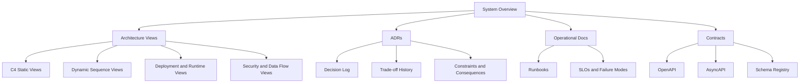
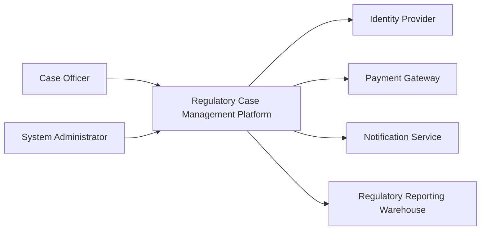
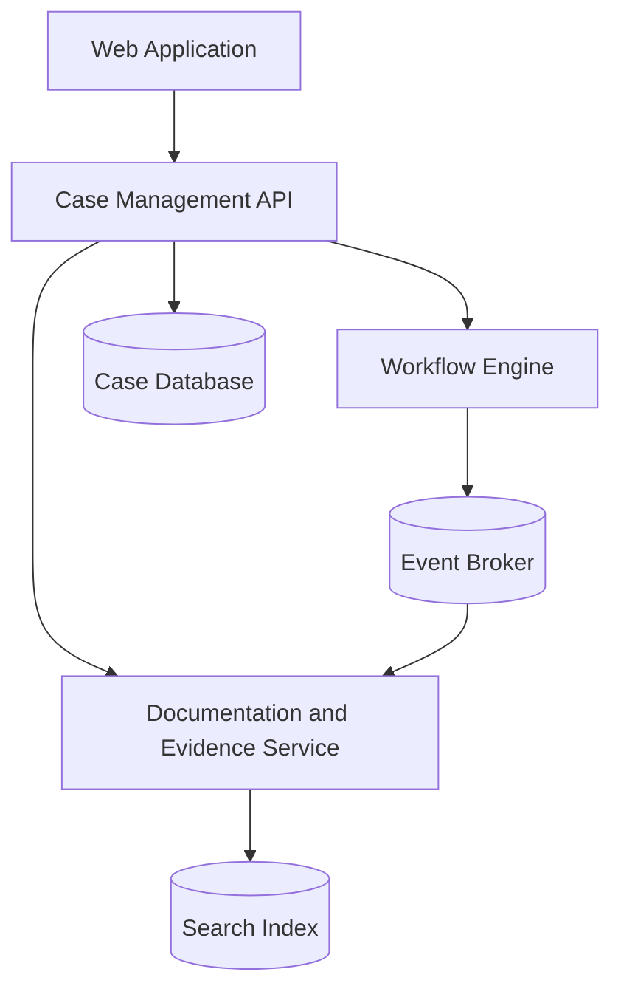
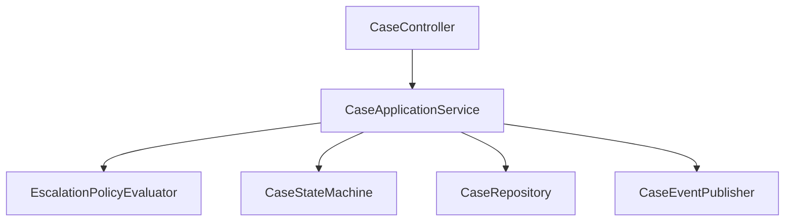
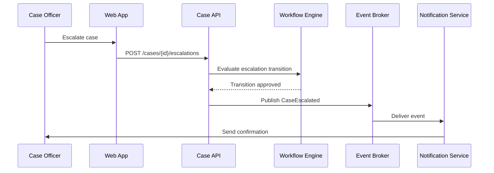
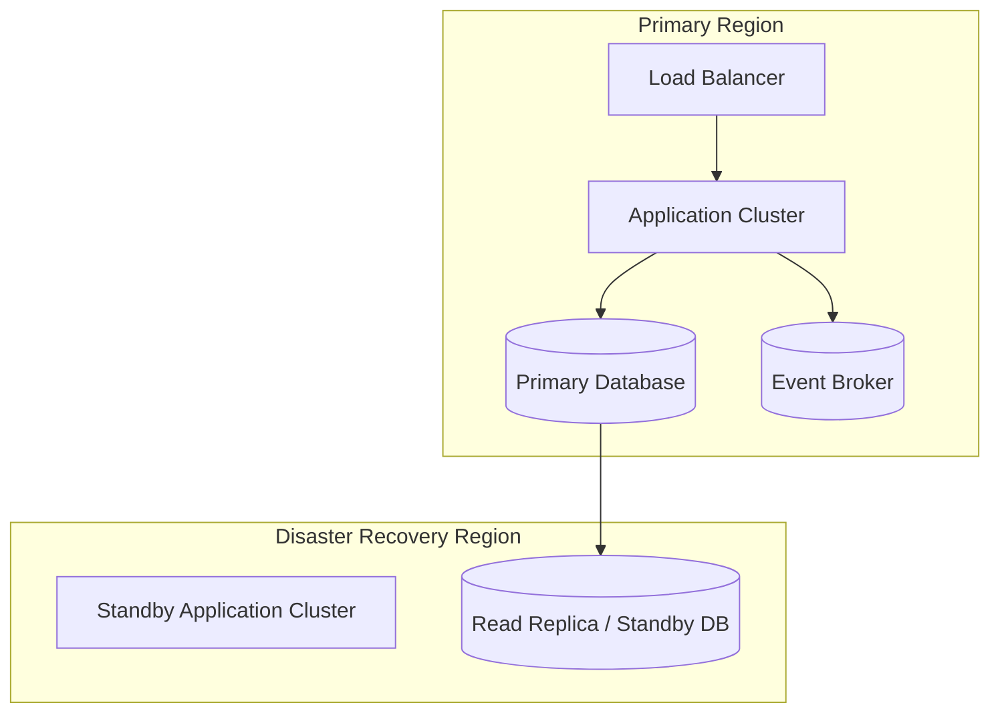
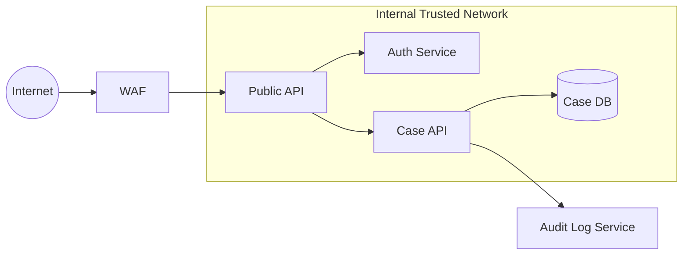
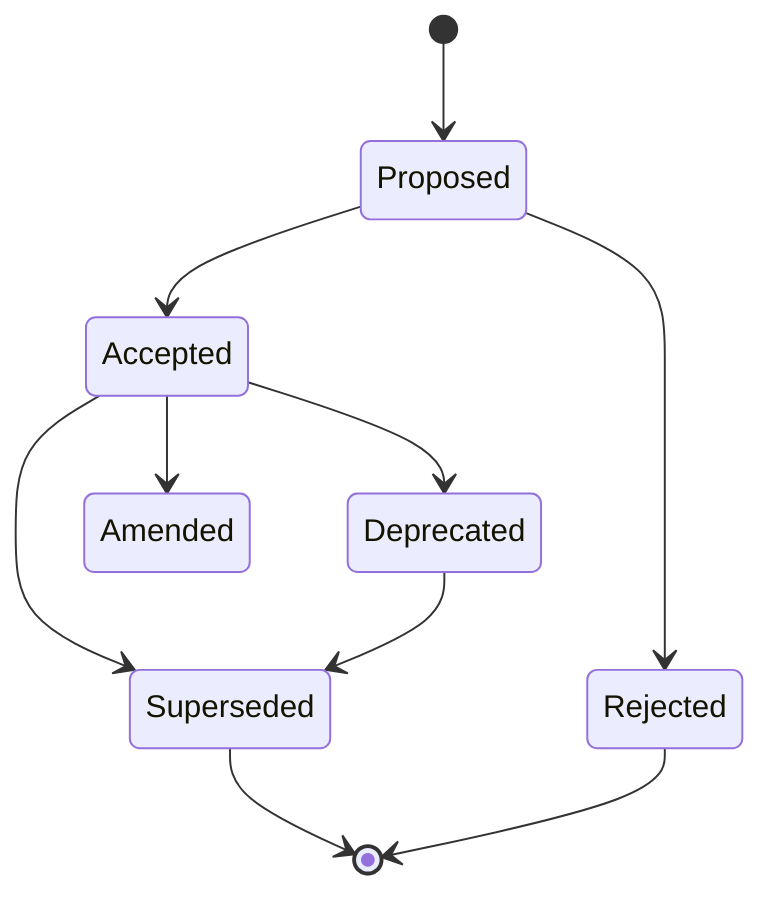
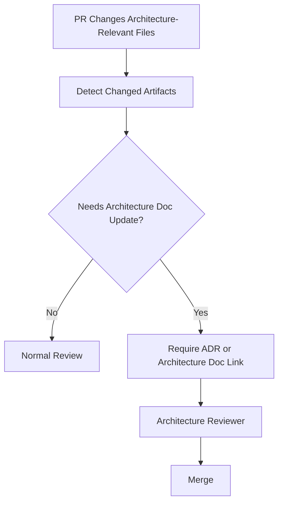
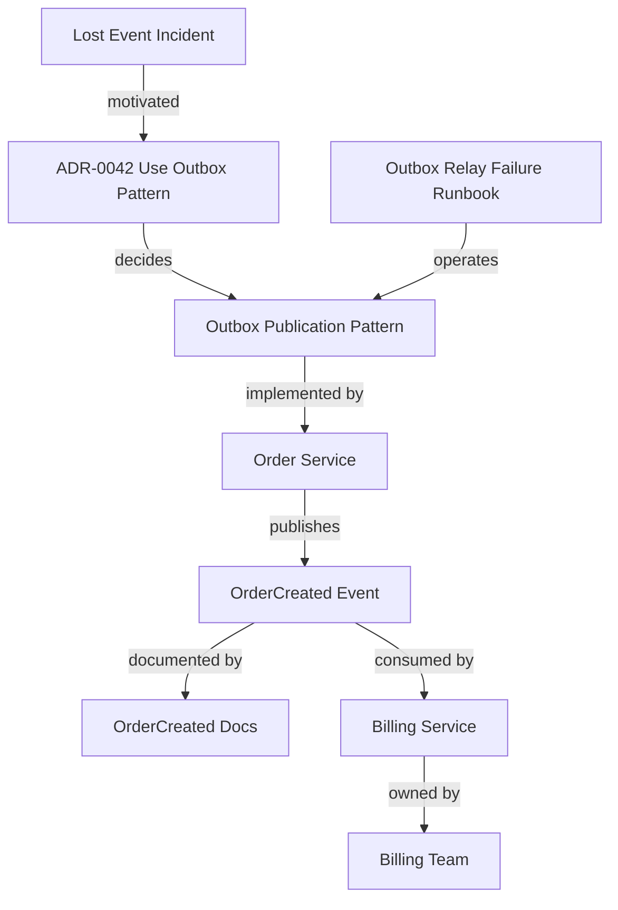

------
title: Learn AI-Driven Documentation and Technical Writing Implementation and Usage - Part 024
description: Deep implementation guide for architecture documentation and ADRs: C4 views, decision records, architecture knowledge management, diagrams-as-code, AI-assisted ADR drafting, review, governance, and drift control.
series: learn-ai-driven-documentation
seriesTitle: Learn AI-Driven Documentation and Technical Writing Implementation and Usage
order: 24
partTitle: Architecture Documentation and ADRs
tags:
- ai
- documentation
- technical-writing
- architecture-documentation
- adr
- c4-model
- diagrams-as-code
- docs-as-code
- series
date: 2026-06-30
---

# Part 024 — Architecture Documentation and ADRs

## 1. Why This Part Exists

Architecture documentation is where engineering memory becomes operational.

Code shows what exists now. Tickets show fragments of work. Pull requests show changes. Chat discussions show debate. But architecture documentation should explain:

- why the system is shaped the way it is,
- what constraints matter,
- what decisions were made,
- which alternatives were rejected,
- what trade-offs were accepted,
- what risks remain,
- how components relate,
- and what future engineers must not accidentally break.

Without architecture documentation, teams repeatedly rediscover the same decisions.

Without ADRs, decisions evaporate.

Without diagrams, readers struggle to build a spatial model of the system.

Without AI governance, generated architecture docs become polished speculation.

The goal of this part is to design architecture documentation as a living, evidence-backed, reviewable engineering artifact.

The core principle:

> Architecture docs should preserve system understanding and decision rationale, not merely decorate the codebase with diagrams.

---

## 2. Kaufman Lens: What We Are Actually Learning

To learn architecture documentation efficiently, deconstruct the skill into practical sub-skills:

1. **Architecture framing** — deciding which architecture question the doc answers.
2. **View selection** — choosing the right diagram/view for the reader.
3. **Decision capture** — writing ADRs that preserve context and consequences.
4. **Trade-off writing** — documenting why one option was chosen over alternatives.
5. **Diagram discipline** — creating diagrams that are accurate, minimal, and maintainable.
6. **Evidence linking** — tying claims to code, specs, incidents, metrics, ADRs, or requirements.
7. **Drift control** — detecting when diagrams and decisions no longer match reality.
8. **AI-assisted architecture writing** — using AI to summarize and structure, not invent system truth.

The skill target is not:

> "I can draw an architecture diagram."

The useful target is:

> "I can maintain architecture documentation and ADRs that help engineers understand structure, constraints, decisions, trade-offs, failure modes, and safe evolution paths."

---

## 3. Architecture Documentation Mental Model

Architecture documentation answers four questions:

1. **Structure** — What parts exist and how are they connected?
2. **Behavior** — How does the system behave across important scenarios?
3. **Decisions** — Why is it designed this way?
4. **Constraints** — What must remain true for the system to be safe, scalable, secure, and maintainable?

Most weak architecture docs only answer the first question.

Top-tier architecture docs connect all four.

### 3.1 Architecture Docs Are Not One Document

Architecture documentation is a documentation system, usually composed of:

- architecture overview,
- system context diagram,
- container diagram,
- component diagrams for high-risk areas,
- deployment/runtime view,
- data flow view,
- security/trust boundary view,
- sequence/dynamic diagrams,
- ADRs,
- quality attribute scenarios,
- operational assumptions,
- integration contracts,
- known limitations,
- migration and evolution notes.

Trying to put all of this into one giant document creates a document nobody reads.

The better model is a linked architecture knowledge base.

---

## 4. The Architecture Documentation Stack

Use a layered model:



This stack prevents architecture documentation from becoming a disconnected diagram gallery.

---

## 5. C4 Model for Architecture Documentation

The C4 model gives a practical way to document software architecture at different levels of zoom.

The core static views are:

1. **System Context** — who uses the system and which external systems it interacts with.
2. **Container** — major deployable/runnable units and data stores.
3. **Component** — internal components of a container.
4. **Code** — low-level code structure when useful.

The key idea is zoom.

A good architecture documentation set lets readers start broad and zoom into detail only when needed.

### 5.1 System Context Diagram

Use this when the reader needs to understand boundaries.



Context docs should answer:

- Who uses the system?
- Which external systems does it depend on?
- Which systems depend on it?
- What is inside vs outside the boundary?
- Which dependencies are critical?
- Which trust boundaries exist?

### 5.2 Container Diagram

Use this when the reader needs deployable units and runtime responsibilities.



Container docs should answer:

- What runs independently?
- What stores data?
- Which protocols connect containers?
- Which containers are owned by which teams?
- Which containers are critical path?
- Which containers are externally exposed?

### 5.3 Component Diagram

Use this only for containers where internal structure matters.



Component diagrams are useful for:

- complex business logic,
- high-risk modules,
- security-sensitive flows,
- performance-critical paths,
- reusable frameworks,
- onboarding to a difficult codebase.

They are not useful for every package in every service.

### 5.4 Code Diagram

Code diagrams are rarely needed in long-lived docs unless they clarify a complex model. Prefer generated docs or code navigation for ordinary class relationships.

Use code-level diagrams when:

- a pattern is non-obvious,
- concurrency control is subtle,
- state transitions are safety-critical,
- extension points are hard to infer,
- generated code hides runtime behavior.

---

## 6. Beyond C4: Supporting Views

C4 is excellent for static structure, but architecture documentation often needs supporting views.

### 6.1 Dynamic View

Use sequence diagrams for scenarios.



Dynamic views should explain:

- scenario trigger,
- participants,
- order of interactions,
- synchronous vs asynchronous boundaries,
- failure and compensation path,
- idempotency expectations.

### 6.2 Deployment View

Use deployment diagrams for runtime topology.



Deployment docs should answer:

- where components run,
- how traffic flows,
- which components are stateful,
- how failover works,
- which dependencies are regional/global,
- what recovery assumptions exist.

### 6.3 Security and Trust Boundary View

Architecture docs must show trust boundaries.



Security views should answer:

- where untrusted input enters,
- where authentication happens,
- where authorization is enforced,
- where sensitive data is stored,
- where encryption boundaries exist,
- where audit logs are emitted,
- where third parties integrate.

### 6.4 Data Flow View

Use data flow diagrams when privacy, compliance, analytics, ML, or auditability matters.

Document:

- data classification,
- source system,
- transformation,
- retention,
- access control,
- downstream consumers,
- deletion and correction behavior,
- audit trail.

---

## 7. Architecture Decision Records

An ADR captures an important architecture decision, its context, and its consequences.

ADRs exist because architecture decisions have longer life than the meeting where they were made.

### 7.1 What Counts as an Architecture Decision?

An architecture decision is worth recording when it affects:

- scalability,
- availability,
- security,
- compliance,
- data model,
- integration style,
- deployment topology,
- team ownership,
- operational complexity,
- long-term maintainability,
- developer workflow,
- irreversible or expensive-to-reverse choices.

Examples:

- Use Kafka for domain event distribution.
- Use outbox pattern for reliable event publication.
- Use PostgreSQL as system of record for case state.
- Split workflow engine from case API.
- Adopt OpenAPI as API contract source-of-truth.
- Store generated documentation separately from human-authored docs.
- Use tenant-level encryption keys for regulated data.

### 7.2 What Should Not Become an ADR?

Avoid ADRs for:

- small implementation details,
- temporary workarounds without broad impact,
- personal preferences,
- decisions already obvious from code,
- decisions that do not affect architecture qualities,
- purely task-level planning.

Not every choice deserves an ADR. Too many ADRs create noise.

---

## 8. ADR Template

A practical ADR template:

```mdx
---
title: ADR-0042 Use Outbox Pattern for Domain Event Publication
status: accepted
date: 2026-06-30
deciders:
  - team-order-platform
  - platform-architecture
relatedDocs:
  - ../events/order-created.mdx
  - ../runbooks/outbox-relay-failure.mdx
supersedes: null
supersededBy: null
---

# ADR-0042 — Use Outbox Pattern for Domain Event Publication

## Status

Accepted.

## Context

Describe the problem, constraints, forces, and why a decision is needed now.

## Decision

Describe the chosen option clearly.

## Alternatives Considered

### Option A — Publish directly to broker inside request flow

Pros:

- Simple to implement.
- Low initial infrastructure cost.

Cons:

- Risk of database and broker inconsistency.
- Harder retry semantics.

### Option B — Transactional outbox

Pros:

- Preserves database/event consistency.
- Supports retry through relay.

Cons:

- Adds relay component and operational monitoring.

## Consequences

### Positive

- Events are only published for committed business changes.
- Failed broker publication can be retried.

### Negative

- Publication is eventually consistent.
- Relay lag must be monitored.

## Implementation Notes

Describe implementation requirements and enforcement points.

## Validation

How will we know this decision is working?

## Review Date

2026-12-31.
```

The template should be strict enough to preserve knowledge and light enough that engineers actually use it.

---

## 9. ADR Status Model

Use explicit lifecycle states.

| Status | Meaning |
|---|---|
| `proposed` | Under discussion |
| `accepted` | Approved and active |
| `rejected` | Considered but not chosen |
| `deprecated` | Still historically relevant but no longer preferred |
| `superseded` | Replaced by another ADR |
| `amended` | Modified by a later ADR |

### 9.1 Status Diagram



Never delete old ADRs just because the decision changed. Historical decision context is the point.

---

## 10. Decision Quality: What Good ADRs Contain

A good ADR contains:

- specific decision,
- real context,
- real constraints,
- alternatives considered,
- trade-offs,
- consequences,
- links to implementation artifacts,
- validation method,
- ownership,
- date,
- status,
- supersession relationship.

A weak ADR says:

> We chose Kafka because it is scalable.

A stronger ADR says:

> We chose Kafka for domain event distribution because the platform requires durable fan-out to multiple independent consumers, replay for operational recovery, partitioned ordering by aggregate ID, and mature consumer group support. We rejected synchronous callbacks because they create producer availability coupling and make consumer failure part of the producer request path.

Architecture writing is not about sounding smart. It is about preserving the forces behind the decision.

---

## 11. Trade-off Writing

Trade-off writing is the difference between useful and decorative architecture docs.

Every meaningful architecture decision should name:

- what we gain,
- what we lose,
- what risk we accept,
- what future work becomes easier,
- what future work becomes harder,
- what assumptions must remain true.

### 11.1 Trade-off Table

```mdx
| Option | Benefits | Costs | Risks | When It Fails |
|---|---|---|---|---|
| Direct broker publish | Simple, low latency | Inconsistent DB/event state possible | Lost event after DB commit | Broker unavailable during request |
| Transactional outbox | Reliable publication after commit | More infra and relay lag | Relay backlog | Monitoring absent |
| CDC-based events | Low application code | Harder semantic control | Schema leaks into contract | DB schema changes frequently |
```

### 11.2 Assumption Discipline

Every ADR should expose assumptions.

Example:

```mdx
## Assumptions

- Order write throughput remains below relay throughput capacity.
- Event publication delay below 30 seconds is acceptable for downstream consumers.
- Consumers can tolerate eventual consistency.
- Platform team will provide monitoring for outbox lag.
```

Assumptions give future engineers a way to know when to revisit a decision.

---

## 12. Architecture Documentation Types

Architecture docs should be separated by intent.

| Doc Type | Purpose | Example |
|---|---|---|
| Overview | Give a broad map | "Case Management Platform Architecture" |
| View | Explain one perspective | "Deployment View" |
| ADR | Preserve a decision | "Use Outbox Pattern" |
| Deep dive | Explain complex subsystem | "Workflow Escalation Engine" |
| Runbook-linked architecture | Explain operational behavior | "Event Relay Failure Modes" |
| Migration architecture | Explain transition path | "Move from Monolith to Workflow Service" |
| Security architecture | Explain trust boundaries | "Tenant Data Isolation" |
| Data architecture | Explain data ownership and flow | "Case Evidence Data Flow" |

Mixing all doc types into one page is a documentation smell.

---

## 13. Architecture Overview Template

A good architecture overview should be short enough to read and rich enough to orient.

```mdx
---
title: Case Management Platform Architecture
owner: platform-architecture
lifecycle: stable
lastVerified: 2026-06-30
relatedADRs:
  - adr/0042-use-outbox-pattern.md
  - adr/0057-split-workflow-engine.md
---

# Case Management Platform Architecture

## Summary

One paragraph that explains what the system does and why it exists.

## System Context

Mermaid or linked C4 diagram.

## Core Containers

Short description of major deployable units.

## Key Data Stores

System-of-record, indexes, caches, analytical stores.

## Key Flows

Links to dynamic diagrams.

## Quality Attributes

Availability, latency, consistency, security, compliance, operability.

## Key Decisions

Links to ADRs.

## Known Constraints

What must remain true.

## Known Limitations

What is not solved yet.

## How to Change This Architecture

Review workflow and required approvals.
```

---

## 14. Diagrams-as-Code

Architecture diagrams should be maintainable.

Diagrams-as-code means diagrams are stored as text, reviewed in PRs, versioned with code, and built into docs.

Useful options include:

- Mermaid,
- PlantUML,
- Structurizr DSL,
- Graphviz,
- architecture-specific generators,
- custom diagrams generated from service catalog metadata.

For this series, Mermaid is sufficient for most examples because it is readable in MDX and useful for flowcharts, sequence diagrams, state diagrams, and dependency graphs.

### 14.1 Diagram Rules

Good diagrams:

- answer one question,
- have clear boundaries,
- avoid too many nodes,
- name systems consistently,
- show direction of dependency,
- distinguish sync vs async if relevant,
- mark trust boundaries if security matters,
- link to ADRs when choices need rationale.

Bad diagrams:

- show everything,
- mix logical and physical views,
- use vague boxes like "backend",
- omit ownership,
- omit external systems,
- become stale screenshots,
- require tribal explanation to understand.

### 14.2 Diagram Metadata

For important diagrams, store metadata:

```yaml
diagramId: case-platform-container-view
viewType: container
owner: platform-architecture
source:
  - service-catalog.yaml
  - deployment/helm-values.yaml
  - adr/0057-split-workflow-engine.md
lastVerified: 2026-06-30
riskLevel: high
```

This metadata helps AI and reviewers know what evidence supports the diagram.

---

## 15. AI-Assisted Architecture Documentation

AI is very useful for architecture documentation when used with guardrails.

### 15.1 Useful AI Tasks

AI can help with:

- summarizing existing ADRs,
- creating first drafts from source context,
- converting meeting notes into proposed ADRs,
- extracting alternatives and trade-offs from discussion threads,
- generating Mermaid diagrams from service metadata,
- checking if docs contradict existing ADRs,
- finding stale architecture claims,
- rewriting architecture docs for different audiences,
- creating onboarding-oriented explanations,
- identifying missing quality attribute sections,
- mapping docs to source evidence.

### 15.2 Dangerous AI Tasks

AI should not be trusted to:

- infer actual production topology without deployment evidence,
- invent rationale for old decisions,
- decide architecture trade-offs alone,
- mark ADRs accepted without review,
- claim security guarantees without security evidence,
- generate diagrams from outdated memory,
- summarize private incidents into public docs without redaction,
- collapse uncertainty into confident prose.

### 15.3 AI Context Packet for ADR Drafting

```yaml
task: draft-architecture-decision-record
decisionTopic: Use outbox pattern for domain event publication
sources:
  requirements:
    - docs/requirements/event-delivery-reliability.md
  incidents:
    - docs/incidents/2026-04-12-lost-event-after-db-commit.md
  alternatives:
    - notes/direct-publish.md
    - notes/cdc-events.md
  code:
    - services/order/src/main/java/.../OrderService.java
  platform:
    - platform/kafka/reliability-guidelines.md
constraints:
  doNotInvent:
    - production guarantees
    - performance numbers
    - security claims
    - team decisions
  requireEvidenceFor:
    - accepted decision
    - rejected alternatives
    - consequences
    - validation metrics
output:
  format: mdx
  includeOpenQuestions: true
  includeVerificationTable: true
```

### 15.4 Verification Table for AI-Drafted ADRs

```mdx
## Verification Table

| Claim | Evidence | Reviewer | Status |
|---|---|---|---|
| Direct broker publish caused lost event risk | Incident 2026-04-12 | Platform architect | verified |
| Outbox delay under 30 seconds is acceptable | Product requirement EVT-12 | Product owner | pending |
| Consumers tolerate eventual consistency | Consumer review notes | Consumer leads | pending |
```

This keeps AI from converting unverified assumptions into architectural history.

---

## 16. ADR Generation From Pull Requests

Many architecture decisions are hidden in PRs.

AI can help detect when a PR should create or update an ADR.

### 16.1 ADR Trigger Rules

A PR should trigger ADR review when it:

- adds a new service,
- changes database ownership,
- introduces a new broker/topic/channel,
- changes public API behavior,
- changes authentication/authorization model,
- changes deployment topology,
- introduces a new external dependency,
- changes consistency model,
- changes event publishing semantics,
- adds major caching behavior,
- changes tenant isolation,
- changes disaster recovery strategy.

### 16.2 PR Bot Comment Example

```mdx
This PR appears to introduce an architecture-significant change:

- Adds new Kafka topic: `case.events.v2`
- Changes event versioning strategy
- Adds new known consumers

Required action:

- Create or update an ADR explaining the event versioning decision.
- Link the ADR from the event documentation page.
- Add migration notes for existing consumers.
```

This is a high-value AI-assisted workflow because it catches architecture knowledge before it disappears.

---

## 17. Architecture Documentation Drift

Architecture docs decay when reality changes faster than documentation.

### 17.1 Drift Types

| Drift Type | Example |
|---|---|
| Structural drift | Diagram says service A calls service B, but telemetry shows no calls |
| Ownership drift | Docs list wrong team owner |
| Deployment drift | Docs show single region, platform now runs multi-region |
| Contract drift | Architecture docs describe API v1, system uses v2 |
| Decision drift | ADR says decision active, later work superseded it |
| Security drift | Trust boundary changed but docs did not |
| Operational drift | Runbook no longer matches alert behavior |

### 17.2 Drift Detection Signals

Sources for drift detection:

- service catalog,
- deployment manifests,
- OpenAPI specs,
- AsyncAPI specs,
- schema registry,
- runtime traces,
- dependency graph,
- ownership metadata,
- CI build outputs,
- code search,
- incident reports,
- PR labels.

### 17.3 Drift Gate

A mature docs system can gate risky changes:



The point is not bureaucracy. The point is to avoid losing system memory.

---

## 18. Architecture Knowledge Graph

Architecture docs become more powerful when linked as a graph.

Nodes:

- systems,
- services,
- databases,
- queues,
- APIs,
- events,
- teams,
- ADRs,
- incidents,
- runbooks,
- quality attributes,
- deployment environments.

Edges:

- service owns event,
- service publishes event,
- service consumes event,
- ADR decides pattern,
- runbook mitigates failure,
- incident reveals risk,
- API belongs to service,
- team owns service,
- diagram represents system.

### 18.1 Example Graph



AI systems can use this graph for retrieval, impact analysis, and stale-doc detection.

But graph edges must have provenance. An inferred edge from telemetry is not the same as an approved ownership declaration.

---

## 19. Architecture Docs Review Model

Architecture documentation needs risk-based review.

### 19.1 Review Roles

| Role | Responsibility |
|---|---|
| Author | Drafts doc and links evidence |
| System owner | Verifies implementation truth |
| Architecture reviewer | Verifies trade-offs and consistency |
| Security reviewer | Verifies trust/security claims |
| Operations reviewer | Verifies runtime and failure behavior |
| Consumer/team reviewer | Verifies impact and usage |
| Technical writer/editor | Improves clarity and structure |

Not every doc needs every reviewer. High-risk docs do.

### 19.2 Review Checklist

```mdx
## Architecture Documentation Review Checklist

### Scope
- [ ] The document states which architecture question it answers.
- [ ] The document identifies the intended audience.
- [ ] The document avoids mixing unrelated views.

### Accuracy
- [ ] Claims are backed by source evidence.
- [ ] Diagrams match current system metadata or verified implementation.
- [ ] External dependencies are named.
- [ ] Ownership is current.

### Decisions
- [ ] Relevant ADRs are linked.
- [ ] New architecture-significant choices have ADRs.
- [ ] Alternatives and trade-offs are documented.
- [ ] Consequences are explicit.

### Risk
- [ ] Security boundaries are shown if relevant.
- [ ] Failure modes are documented if relevant.
- [ ] Operational assumptions are documented.
- [ ] Known limitations are not hidden.

### AI Safety
- [ ] AI-generated sections have evidence.
- [ ] Unverified claims are marked as open questions.
- [ ] No sensitive incident or customer data is exposed.
```

---

## 20. Architecture Docs for Different Audiences

Architecture docs must adapt to reader needs.

| Audience | They Need | Avoid |
|---|---|---|
| New engineer | Orientation and mental map | Overloaded component detail |
| Senior engineer | Constraints, trade-offs, extension points | Marketing-level summaries |
| Architect | Decision rationale and systemic impact | Unverified implementation claims |
| SRE/operator | Runtime topology and failure behavior | Pure design intent without operations |
| Security reviewer | Trust boundaries and data flow | Vague "secure by design" claims |
| Product/regulatory stakeholder | Capability and risk explanation | Low-level implementation noise |
| AI assistant | Structured, evidence-linked context | Ambiguous prose without metadata |

One architecture document cannot serve all audiences equally. Use layers and links.

---

## 21. Architecture Documentation Anti-Patterns

### 21.1 Diagram Cemetery

A folder full of outdated diagrams with no owner, source, or verification date.

Fix:

- add ownership,
- add last verified date,
- move stale diagrams to archived state,
- regenerate diagrams from source where possible.

### 21.2 ADR Theater

ADRs are created after the decision, with no real alternatives or consequences.

Fix:

- require alternatives,
- require assumptions,
- require validation method,
- review before implementation for high-impact decisions.

### 21.3 Everything Diagram

One diagram includes every service, database, queue, API, and external system.

Fix:

- split by view and reader question,
- use zoom levels,
- make diagrams answer one question.

### 21.4 AI-Generated Architecture Fiction

AI produces confident architecture docs from partial source context.

Fix:

- require evidence tables,
- mark unknowns,
- require owner review,
- block publishing without verified sources.

### 21.5 Decision Without Consequence

ADR says what was chosen but not what it costs.

Fix:

- force positive and negative consequences,
- add assumptions,
- add review date,
- link operational runbooks.

---

## 22. Architecture Documentation Repository Structure

Recommended structure:

```txt
docs/
  architecture/
    index.mdx
    views/
      system-context.mdx
      container-view.mdx
      deployment-view.mdx
      security-trust-boundaries.mdx
      data-flow.mdx
    subsystems/
      workflow-engine.mdx
      evidence-service.mdx
      notification-platform.mdx
    decisions/
      adr-0001-record-architecture-decisions.mdx
      adr-0042-use-outbox-pattern.mdx
      adr-0057-split-workflow-engine.mdx
    diagrams/
      case-platform-context.mmd
      case-platform-container.mmd
      case-escalation-sequence.mmd
    governance/
      architecture-review-policy.mdx
      adr-template.mdx
```

Generated diagrams may live separately:

```txt
docs/generated/architecture/
```

Never let generated diagrams overwrite manually curated explanation unless the generation pipeline is intentionally designed for that.

---

## 23. Architecture Doc Metadata

Use frontmatter to make docs queryable.

```yaml
title: Workflow Engine Architecture
docType: architecture-deep-dive
owner: workflow-platform-team
lifecycle: stable
riskLevel: high
systems:
  - workflow-engine
  - case-api
relatedADRs:
  - adr-0057-split-workflow-engine
relatedRunbooks:
  - runbooks/workflow-stuck-transition
relatedContracts:
  - openapi/case-api.yaml
  - asyncapi/case-events.yaml
lastVerified: 2026-06-30
reviewCadence: quarterly
aiGenerated: false
```

Metadata lets CI, search, catalogs, and AI tooling treat architecture docs as structured assets.

---

## 24. Using AI to Rewrite Architecture Docs by Audience

A powerful usage pattern is audience-specific transformation.

Source architecture doc remains canonical. AI creates audience-specific views:

- onboarding summary,
- executive/risk summary,
- operator summary,
- security review summary,
- consumer integration summary,
- migration summary.

Prompt pattern:

```txt
Rewrite the architecture overview for a new backend engineer joining the team.
Preserve all technical claims.
Do not introduce new system components.
Keep links to ADRs and diagrams.
Mark any unclear area as an open question instead of guessing.
```

This is safe when AI transforms verified content. It is unsafe when AI invents missing content.

---

## 25. Practice: The 2-Hour Architecture Documentation Drill

### Step 1 — Pick a System

Choose a system with real production relevance.

### Step 2 — Create Context View

Draw a system context diagram.

Ask:

- Who uses this system?
- What external systems does it depend on?
- What depends on it?
- Where are trust boundaries?

### Step 3 — Create Container View

Draw deployable units and data stores.

Ask:

- What runs independently?
- What stores state?
- What protocols connect them?
- Who owns each container?

### Step 4 — Write One ADR

Pick one architecture-significant decision.

Write:

- context,
- decision,
- alternatives,
- consequences,
- assumptions,
- validation.

### Step 5 — Add Evidence Links

Link to:

- repository,
- service catalog,
- OpenAPI/AsyncAPI specs,
- incident/runbook if relevant,
- deployment manifest,
- related PR.

### Step 6 — Review With Another Engineer

Ask:

> Could you explain this system's structure and one major trade-off after reading this doc for 15 minutes?

If not, simplify the doc and improve the diagram.

---

## 26. Summary

Architecture documentation preserves system understanding.

C4 helps structure architecture views by zoom level: context, containers, components, and code. Supporting views such as dynamic, deployment, security, and data flow views explain behavior and operational reality.

ADRs preserve decisions, context, alternatives, consequences, assumptions, and validation. They prevent teams from repeatedly rediscovering architectural history.

AI can accelerate architecture documentation by summarizing, restructuring, drafting ADRs, generating diagrams, and detecting drift. But architecture docs are high-risk truth artifacts. AI-generated content must be evidence-linked, reviewed, and explicit about uncertainty.

The mature mental model is:

> Architecture documentation is not a diagram collection. It is a living memory system for structure, behavior, decisions, constraints, trade-offs, and safe evolution.

---

## 27. References and Further Reading

- C4 Model — https://c4model.com/
- C4 Model Diagrams — https://c4model.com/diagrams
- Architectural Decision Records — https://adr.github.io/
- Architecture Decision Record repository — https://github.com/architecture-decision-record/architecture-decision-record
- Documenting Architecture Decisions by Michael Nygard — https://cognitect.com/blog/2011/11/15/documenting-architecture-decisions
- Structurizr DSL — https://docs.structurizr.com/dsl
- Mermaid — https://mermaid.js.org/
- Write the Docs: Docs as Code — https://www.writethedocs.org/guide/docs-as-code/
