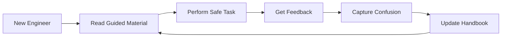
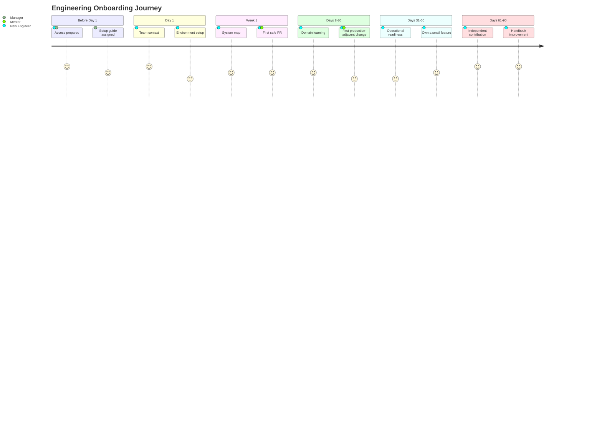
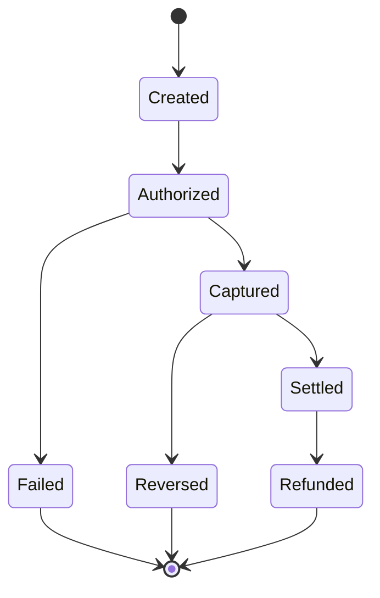
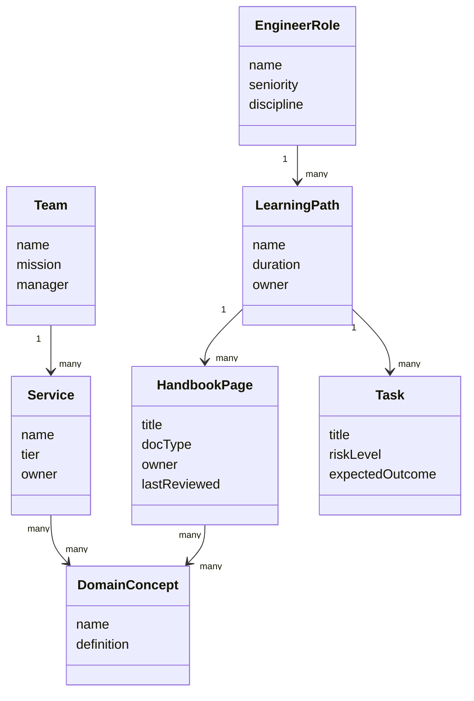
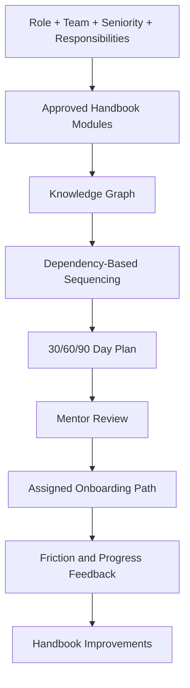

------
title: Learn AI-Driven Documentation and Technical Writing Implementation and Usage - Part 026
description: Deep implementation guide for onboarding systems, internal engineering handbooks, learning paths, knowledge maps, AI-assisted onboarding, and handbook governance.
series: learn-ai-driven-documentation
seriesTitle: Learn AI-Driven Documentation and Technical Writing Implementation and Usage
order: 26
partTitle: Onboarding and Internal Engineering Handbooks
tags:
- ai
- documentation
- technical-writing
- onboarding
- internal-handbook
- engineering-handbook
- developer-experience
- knowledge-management
- docs-as-code
- series
date: 2026-06-30
---

# Part 026 — Onboarding and Internal Engineering Handbooks

## 1. Why This Part Exists

Onboarding documentation is where an engineering organization reveals its real maturity.

A team can have excellent code and still onboard poorly.

A team can have strong architecture and still rely on tribal knowledge.

A team can have many documents and still leave new engineers confused because no document explains how the pieces fit together.

The onboarding problem is not simply:

> "Do we have enough docs?"

The real question is:

> "Can a capable engineer build an accurate mental model of the organization, system, workflow, risk boundaries, and contribution path without depending on random interruptions?"

Internal engineering handbooks solve this at scale.

AI can make handbooks more useful by generating learning paths, summarizing domains, answering questions, detecting gaps, creating glossary entries, and routing people to relevant docs. But AI can also amplify outdated assumptions if the handbook lacks ownership and source-of-truth discipline.

The goal of this part is to design onboarding and internal handbooks as an engineering enablement system.

The core principle:

> Onboarding documentation is not orientation content. It is a system for transferring operational judgment.

---

## 2. Kaufman Lens: What We Are Actually Learning

Using Josh Kaufman's skill acquisition model, this part decomposes onboarding documentation into practical sub-skills:

1. **Audience modeling** — understanding what a new engineer does not yet know.
2. **Knowledge sequencing** — deciding what must be learned first, second, and later.
3. **Domain mapping** — showing how teams, services, data, workflows, and responsibilities connect.
4. **Task-based onboarding** — turning learning into safe contribution steps.
5. **Internal handbook architecture** — organizing policies, processes, technical knowledge, and ownership.
6. **AI-assisted learning paths** — generating personalized paths grounded in role and service context.
7. **Knowledge gap detection** — identifying missing or stale onboarding content.
8. **Governance** — keeping the handbook accurate as teams, systems, and processes evolve.

The skill target is not:

> "I can write an onboarding checklist."

The useful target is:

> "I can build and maintain an AI-assisted internal engineering handbook that reduces time-to-context, time-to-first-safe-contribution, and dependency on tribal knowledge."

---

## 3. Mental Model: Onboarding as Mental Model Transfer

A new engineer needs more than instructions.

They need a map.

They need to understand:

- what the company or product does,
- what the team owns,
- how the system is shaped,
- how work flows,
- how decisions are made,
- how code is shipped,
- how incidents are handled,
- where risks live,
- what "good" looks like,
- and how to ask for help.

Onboarding fails when it gives tasks without context.

Example:

```mdx
Clone the repo, run tests, pick a ticket.
```

This is not onboarding. It is task assignment.

Better onboarding explains:

```mdx
During your first week, your goal is not speed. Your goal is to build the minimum system map needed to make safe changes.

You should understand:

1. which services the team owns,
2. how requests flow through them,
3. which data is sensitive,
4. how deployments are reviewed,
5. which tests protect critical workflows,
6. and how to escalate uncertainty.

Your first ticket is intentionally small. It is designed to exercise setup, code review, CI, deployment, and rollback awareness.
```

This transfers judgment, not just steps.

---

## 4. The Onboarding Learning Loop

A strong onboarding system creates a feedback loop.



The new engineer is not only a consumer of docs.

They are also a high-signal evaluator of docs.

Fresh confusion reveals:

- missing prerequisites,
- unclear language,
- stale setup steps,
- hidden tribal assumptions,
- broken links,
- ambiguous ownership,
- and undocumented risk.

A mature handbook turns onboarding friction into documentation improvements.

---

## 5. Internal Engineering Handbook Taxonomy

An internal handbook is not one giant wiki.

It is a structured knowledge system.

| Handbook Area | Main Question | Example Docs |
|---|---|---|
| Organization | Who owns what? | Team directory, ownership model, escalation |
| Product/domain | What problem are we solving? | Domain overview, user journeys, business glossary |
| Architecture | How is the system shaped? | C4 diagrams, ADRs, service map |
| Engineering workflow | How do we build and ship? | Branching, PR, testing, release process |
| Operations | How do we operate safely? | On-call, incidents, runbooks, observability |
| Security/compliance | What boundaries must not be crossed? | Data classification, secrets, access, audit |
| Developer environment | How do I run and debug locally? | Setup, dependencies, local workflows |
| Contribution path | What should I do first? | First issue, first PR, review checklist |
| Learning paths | What should I learn by role? | Backend, frontend, platform, SRE onboarding |
| Glossary | What do terms mean here? | Acronyms, domain terms, internal names |

The handbook should reduce the number of "who do I ask?" questions by making ownership and context discoverable.

---

## 6. Onboarding Personas

Not all new engineers need the same path.

| Persona | Need | Documentation Strategy |
|---|---|---|
| New graduate | Basic engineering workflow and system orientation | High guidance, low assumptions |
| Senior backend engineer | Domain and local architecture | Fast context, deep links |
| Platform engineer | Infrastructure, CI/CD, ownership model | Service catalog + operations docs |
| Tech lead | Decision history, risk map, team process | ADRs, roadmap, governance |
| Contractor | Narrow contribution boundary | Minimal access path and scoped docs |
| Internal transfer | New domain, existing company context | Domain delta path |
| On-call engineer | Operational readiness | Runbooks, dashboards, escalation |
| Manager | Team workflow and delivery model | Operating model, responsibilities, metrics |

AI can generate a personalized path, but only from approved handbook modules.

Bad AI onboarding:

> "Here is a complete 30-day plan based on generic engineering assumptions."

Better AI onboarding:

> "Here is a 30-day plan for a senior backend engineer joining the payments platform team, grounded in the team handbook, service catalog, ADRs, onboarding tasks, and current ownership map."

---

## 7. Onboarding Journey Architecture

Onboarding should be designed as a staged journey.



### 7.1 Phase-Based Goals

| Phase | Goal | Evidence |
|---|---|---|
| Preboarding | Remove access/setup blockers | Accounts, repo access, onboarding issue |
| Day 1 | Build social and workflow orientation | Mentor assigned, handbook entrypoint read |
| Week 1 | Run system locally and make safe change | First PR merged |
| Days 8–30 | Build domain and service understanding | Service map walkthrough, domain glossary |
| Days 31–60 | Contribute with moderate independence | Feature/task delivered |
| Days 61–90 | Operate and improve system | On-call shadowing, docs improvement PR |

Onboarding should avoid pretending everyone learns linearly. Engineers often move back and forth between setup, domain, code, workflow, and architecture.

---

## 8. Internal Handbook Information Architecture

A scalable engineering handbook has strong entry points.

```txt
handbook/
  index.mdx
  start-here/
    new-engineer.mdx
    internal-transfer.mdx
    tech-lead.mdx
  organization/
    teams.mdx
    ownership.mdx
    escalation.mdx
  product-domain/
    overview.mdx
    glossary.mdx
    user-journeys.mdx
  engineering/
    workflow.mdx
    code-review.mdx
    testing.mdx
    release.mdx
  architecture/
    system-map.mdx
    adr-index.mdx
    service-dependencies.mdx
  operations/
    on-call.mdx
    incident-process.mdx
    runbook-index.mdx
  security-compliance/
    data-classification.mdx
    secrets.mdx
    audit-evidence.mdx
  learning-paths/
    backend-engineer.mdx
    platform-engineer.mdx
    tech-lead.mdx
  teams/
    payments-platform/
      index.mdx
      onboarding.mdx
      service-map.mdx
      first-pr.mdx
```

### 8.1 Handbook Entry Page

The handbook home page should answer:

1. What is this handbook for?
2. Who should use it?
3. Where should a new engineer start?
4. Where is the service catalog?
5. Where are team docs?
6. Where are operational docs?
7. How do I propose a change?
8. How do I report stale information?

### 8.2 Team Handbook Page

Every team should have a predictable team page.

```mdx
# Team: Payments Platform

## Mission

## Ownership

## Systems and Services

## Critical User Journeys

## Team Workflow

## Local Development

## First Safe Contribution

## Review Expectations

## Operational Responsibilities

## Dashboards and Runbooks

## Domain Glossary

## Common Pitfalls

## Current Strategic Work

## How to Ask for Help

## Handbook Maintenance
```

---

## 9. The First Safe Contribution

A strong onboarding system gives new engineers a safe path to contribute.

A "first ticket" should exercise the system but limit risk.

Good first contribution properties:

- small scope,
- clear owner,
- clear expected output,
- low production risk,
- tests available,
- easy rollback,
- touches real workflow,
- includes review,
- and updates docs if needed.

Bad first contribution:

> "Pick anything from the backlog."

Better:

```mdx
## First Safe Contribution: Add a Validation Error Message

Goal:
Update one validation error message in the account settings flow.

You will practice:

- local setup,
- running tests,
- editing code,
- adding a small test,
- opening a PR,
- responding to review,
- and reading the deploy checklist.

Boundaries:

- Do not change validation logic.
- Do not change API contract.
- Do not deploy without mentor review.

Definition of done:

- unit test passes,
- PR approved by mentor,
- changelog entry added if user-visible,
- related docs updated if message is documented.
```

This makes onboarding practical without throwing the engineer into uncontrolled complexity.

---

## 10. Domain Onboarding

Domain knowledge is often the hardest part.

Code can be read.

Process can be followed.

But domain models are usually implicit.

Domain onboarding should include:

- domain glossary,
- user journey map,
- entity relationship overview,
- state machines,
- lifecycle events,
- regulatory constraints,
- business rules,
- exception cases,
- and historical decisions.

### 10.1 Domain Map Template

```mdx
# Domain Overview: Payments

## What This Domain Does

## Primary Actors

## Core Entities

| Entity | Meaning | Owner | Source of Truth |
|---|---|---|---|

## Critical User Journeys

## Lifecycle / State Model

## External Dependencies

## Regulatory or Compliance Constraints

## Common Failure Modes

## Key Decisions and ADRs

## Glossary
```

### 10.2 Domain Lifecycle Diagram



Even a simplified lifecycle diagram helps new engineers build accurate mental models.

---

## 11. AI-Assisted Onboarding

AI can improve onboarding by reducing search friction and personalizing learning paths.

But the AI must be grounded in approved internal docs.

### 11.1 Useful AI Onboarding Patterns

| Pattern | Example | Guardrail |
|---|---|---|
| Personalized learning path | "Backend engineer joining payments team" | Use only approved handbook modules |
| Glossary explanation | "What is settlement?" | Cite glossary/domain docs |
| System map explanation | "How does service A call B?" | Use service catalog and architecture docs |
| First PR assistant | "Explain this starter ticket" | Use ticket + team onboarding docs |
| Setup troubleshooting | "Why does local env fail?" | Use setup docs + known issues |
| FAQ generation | Summarize repeated onboarding questions | Human review before publish |
| Gap detection | Find missing prerequisite docs | Open docs issue, not direct publish |
| Mentor briefing | Summarize new hire progress blockers | Respect privacy boundaries |

### 11.2 AI Onboarding Anti-Patterns

| Anti-Pattern | Why It Fails |
|---|---|
| Generic 30-day plans | Ignores actual team/system context |
| Uncited answers | New engineer cannot verify truth |
| Over-personalized hidden paths | Creates inconsistent learning experience |
| AI as mentor replacement | Removes human judgment and trust-building |
| Asking AI about secrets/access | Risk of exposing sensitive process details |
| Training on stale handbook | Produces outdated guidance with confidence |

### 11.3 AI Prompt for Learning Path Generation

```mdx
You are generating an onboarding learning path for an engineer.
Use only the provided handbook modules, service catalog metadata, and team onboarding docs.
Do not invent systems, tools, policies, or owners.
Separate required, recommended, and optional material.
Order the path by dependency: company context, team context, system map, local setup, first safe contribution, operations, domain deep dive.
For every item, include why it matters and the source document.
Return a 30-day path with checkpoints and expected evidence.
```

### 11.4 AI Prompt for Handbook Gap Detection

```mdx
You are reviewing onboarding documentation for gaps.
Compare the new engineer journey against the available handbook pages.
Identify missing prerequisites, stale references, unclear ownership, broken learning sequence, and duplicated/conflicting content.
Do not rewrite the handbook.
Return a list of proposed documentation issues with severity and evidence.
```

---

## 12. Onboarding Knowledge Graph

A handbook becomes more powerful when represented as a graph.



This graph enables questions like:

- Which docs are required for backend onboarding?
- Which team docs depend on stale service pages?
- Which concepts appear in many docs but lack glossary definitions?
- Which services have no onboarding path?
- Which first tasks are too risky for new engineers?
- Which docs are frequently read during onboarding but rarely reviewed?

---

## 13. Handbook Metadata

Internal handbooks need metadata for ownership, freshness, and AI retrieval.

```yaml
title: Payments Platform Team Onboarding
docType: onboarding
owner: team-payments-platform
audience:
  - backend-engineer
  - platform-engineer
stage:
  - week-1
  - days-8-30
sourceOfTruth:
  - service-catalog/payments-platform.yaml
  - architecture/payments-system-map.mdx
  - teams/payments-platform/ownership.yaml
lastReviewed: 2026-06-20
reviewCadence: 90d
aiRetrievable: true
confidentiality: internal
prerequisites:
  - handbook/start-here/new-engineer.mdx
  - handbook/engineering/workflow.mdx
relatedServices:
  - payments-api
  - payments-worker
```

### 13.1 Metadata Quality Rules

- Every onboarding page must have an owner.
- Every role-based path must have prerequisites.
- Every team page must link owned services.
- Every service page must link runbooks and dashboards.
- Every domain page must link glossary terms.
- Every AI-retrievable page must have confidentiality metadata.
- Every stale page must be excluded or marked low-confidence in AI retrieval.

---

## 14. Handbook Governance

A handbook without governance becomes a graveyard.

Governance defines:

- who owns each page,
- who reviews changes,
- how stale docs are detected,
- how new docs are proposed,
- how duplicated content is consolidated,
- how AI-generated content is reviewed,
- and how handbook quality is measured.

### 14.1 Ownership Model

| Content Type | Owner | Reviewer |
|---|---|---|
| Company engineering workflow | Engineering enablement | Staff engineers / managers |
| Team onboarding page | Team tech lead | Team manager + senior engineer |
| Service page | Service owner | On-call owner |
| Domain glossary | Domain owner | Product/engineering pair |
| Security/compliance docs | Security/compliance team | Legal/compliance if needed |
| Learning path | Developer experience team | Target role representative |
| Generated FAQ | Page owner | Editorial reviewer |

### 14.2 Handbook Review Cadence

| Risk | Review Cadence |
|---|---|
| Low-risk process overview | 180 days |
| Team onboarding | 90 days |
| Local setup | 60 days |
| Security/access docs | 30–60 days |
| Operational onboarding | 30–60 days |
| AI-generated learning paths | Every material source change |

---

## 15. Handbook CI and Quality Gates

Internal handbooks should use the same docs-as-code quality system as other documentation.

```mermaid
flowchart LR
    PR[Handbook PR] --> Schema[Frontmatter Schema]
    Schema --> Links[Link Check]
    Links --> Owners[Owner Check]
    Owners --> Style[Style Guide]
    Style --> Duplicates[Duplicate Detection]
    Duplicates --> Sensitivity[Confidentiality Check]
    Sensitivity --> AI[AI Retrieval Metadata Check]
    AI --> Review[Human Review]
    Review --> Publish[Publish to Handbook Portal]
```



### 15.1 Quality Gates

| Gate | Purpose |
|---|---|
| Frontmatter validation | Ensures ownership and routing |
| Link checking | Prevents broken onboarding paths |
| Style linting | Keeps handbook consistent |
| Duplicate detection | Reduces conflicting truth |
| Sensitive data scanning | Prevents accidental exposure |
| Staleness policy | Flags outdated pages |
| AI metadata validation | Controls retrievability |
| CODEOWNERS review | Ensures accountable approval |

---

## 16. Measuring Onboarding Documentation Quality

Measure outcomes, not just document count.

Useful metrics:

| Metric | Meaning |
|---|---|
| Time to environment setup | Setup friction |
| Time to first PR | Contribution readiness |
| Time to first production-adjacent change | Workflow confidence |
| Number of mentor interruptions | Missing docs or unclear docs |
| Search zero-result rate | Missing discoverable content |
| Repeated onboarding questions | FAQ/gap signal |
| Broken onboarding links | Maintenance quality |
| Stale pages in required paths | Risk of outdated learning |
| New hire confidence survey | Subjective clarity |
| Docs PRs from new hires | Feedback loop health |
| First 90-day retention/productivity signals | Long-range onboarding quality |

### 16.1 Onboarding Friction Log

Each new engineer should have a lightweight friction log:

```mdx
| Date | Friction | Blocked? | Doc Link | Suggested Fix |
|---|---|---|---|---|
| 2026-06-30 | Local DB setup command failed | Yes | local-setup.mdx | Add migration prerequisite |
```

This should not be used to judge the new engineer.

It is evidence about the onboarding system.

---

## 17. Internal Handbook Search and AI Q&A

Search is part of the handbook experience.

A new engineer should be able to ask:

- "What does this acronym mean?"
- "Who owns this service?"
- "How do I run this system locally?"
- "What is the path to my first PR?"
- "Which ADR explains this design?"
- "What data is sensitive in this workflow?"
- "Where is the runbook for this alert?"

AI Q&A should return:

1. answer,
2. source links,
3. confidence,
4. freshness,
5. owner,
6. related docs,
7. and escalation path if uncertain.

Bad answer:

```mdx
You can deploy by merging to main.
```

Better answer:

```mdx
According to the current release workflow page, services owned by Payments Platform deploy through the release pipeline after PR approval and CI pass. Some services require change-window approval. See:

- Engineering Workflow > Release Process
- Team Payments Platform > Deployment Notes
- Service payments-api > Change Policy

Confidence: Medium. The service page was last reviewed 85 days ago and is due for review in 5 days.
```

---

## 18. Building a Personalized Onboarding Path

A path should be generated from role, team, seniority, previous context, and target responsibilities.



### 18.1 30-Day Path Template

```mdx
# 30-Day Onboarding Path: Backend Engineer, Payments Platform

## Week 1 — Orientation and Setup

Goals:
- Understand team mission.
- Run core services locally.
- Merge first safe PR.

Required docs:
- Engineering workflow
- Payments Platform team page
- Local setup guide
- First safe contribution guide

Evidence:
- Local tests pass.
- First PR merged.
- Friction log submitted.

## Week 2 — Domain and Architecture

Goals:
- Understand payment lifecycle.
- Read system map and key ADRs.
- Trace one request end-to-end.

## Weeks 3–4 — Contribution and Operations

Goals:
- Deliver a small feature/fix.
- Shadow on-call.
- Read key runbooks.
- Update one doc based on onboarding friction.
```

---

## 19. Handbook as an Operating Model

The handbook should not merely describe how the organization works.

It should shape how the organization works.

A strong handbook defines:

- decision rights,
- escalation paths,
- review standards,
- communication norms,
- engineering workflow,
- operational expectations,
- and quality bars.

When the handbook and reality diverge, one of them must change.

The worst state is silent divergence:

- docs say one thing,
- people do another,
- new engineers follow docs,
- senior engineers rely on tribal exceptions,
- trust collapses.

### 19.1 Handbook Change Rule

When a process changes, the handbook change should be part of the definition of done.

```mdx
A workflow/process change is not complete until:

- the handbook page is updated,
- old instructions are removed or deprecated,
- impacted teams are notified,
- AI retrieval index is refreshed,
- and related onboarding paths are checked.
```

---

## 20. Common Failure Modes

### 20.1 The Wiki Graveyard

Symptoms:

- many pages,
- no owners,
- no review dates,
- contradictory instructions,
- stale screenshots,
- unclear entrypoints.

Fix:

- define doc types,
- add ownership metadata,
- create start-here pages,
- archive stale pages,
- use search analytics,
- enforce review cadence.

### 20.2 The Checklist-Only Onboarding

Symptoms:

- tasks without context,
- setup without system map,
- first ticket without domain understanding,
- no reflection loop.

Fix:

- add learning goals,
- explain why each task matters,
- include diagrams,
- require first docs improvement.

### 20.3 The Mentor Bottleneck

Symptoms:

- new engineer asks mentor everything,
- mentor repeats same explanations,
- docs are not improved,
- onboarding quality depends on mentor availability.

Fix:

- capture repeated questions,
- create FAQ/glossary,
- add AI Q&A grounded in handbook,
- use mentor for judgment, not repetitive lookup.

### 20.4 The AI Oracle Problem

Symptoms:

- new engineers trust AI more than docs,
- AI answers lack sources,
- stale docs are retrieved,
- team-specific exceptions are hallucinated.

Fix:

- require citations,
- show freshness and owner,
- restrict to approved sources,
- mark uncertainty,
- route ambiguous questions to humans.

### 20.5 The Everything-Is-Required Path

Symptoms:

- onboarding path contains 80 documents,
- no prioritization,
- new engineer cannot tell what matters now,
- learning becomes passive reading.

Fix:

- classify required/recommended/optional,
- tie reading to tasks,
- use role-based paths,
- limit Week 1 material.

---

## 21. Practical Implementation Blueprint

### 21.1 Minimal Viable Engineering Handbook

Start with:

```txt
handbook/
  index.mdx
  start-here/new-engineer.mdx
  engineering/workflow.mdx
  engineering/code-review.mdx
  engineering/release-process.mdx
  organization/ownership.mdx
  organization/escalation.mdx
  teams/<team>/index.mdx
  teams/<team>/onboarding.mdx
  architecture/system-map.mdx
  operations/on-call.mdx
  glossary/index.mdx
```

Do not start with a huge taxonomy nobody maintains.

Start with high-leverage pages.

### 21.2 First 10 Pages to Create

1. Start Here for New Engineers
2. Engineering Workflow
3. Code Review Standard
4. Release Process
5. Ownership and Escalation
6. Local Development Baseline
7. Team Page Template
8. Service Page Template
9. Domain Glossary Template
10. First Safe Contribution Template

### 21.3 AI Integration Roadmap

| Stage | Capability | Risk Control |
|---|---|---|
| 1 | Search over handbook | Source links |
| 2 | Summaries of pages | Owner/freshness shown |
| 3 | Personalized learning paths | Mentor review |
| 4 | Gap detection | Docs issue creation only |
| 5 | FAQ generation | Human review before publish |
| 6 | Onboarding analytics | Privacy review |

---

## 22. Templates

### 22.1 Team Onboarding Template

```mdx
------
title: <Team Name> Onboarding
docType: onboarding
owner: <team-name>
audience:
  - backend-engineer
  - platform-engineer
lastReviewed: YYYY-MM-DD
reviewCadence: 90d
aiRetrievable: true
confidentiality: internal
---

# <Team Name> Onboarding

## What This Team Owns

## What You Should Understand First

## Week 1 Goals

## Local Setup

## System Map

## Domain Concepts

## First Safe Contribution

## Team Workflow

## Review Expectations

## Operational Responsibilities

## Common Pitfalls

## How to Ask for Help

## How to Improve This Page
```

### 22.2 New Engineer Friction Log Template

```mdx
# Onboarding Friction Log

This log improves the onboarding system. It is not a performance evaluation.

| Date | What I Tried | What Was Confusing | Blocked? | Related Doc | Suggested Improvement |
|---|---|---|---|---|---|
```

### 22.3 Glossary Entry Template

```mdx
## <Term>

Definition:
<Clear definition.>

Why it matters:
<Why engineers need to know this.>

Common confusion:
<What people usually misunderstand.>

Related systems:
- <service or domain>

Source of truth:
- <link>
```

---

## 23. Kaufman 20-Hour Practice Plan

### Hours 1–2: Audit Current Onboarding

Find the current onboarding entrypoint.

Score it for:

- entry clarity,
- role-specific paths,
- setup reliability,
- ownership,
- system map,
- first contribution path,
- and freshness.

### Hours 3–4: Create a Start-Here Page

Write a concise page for new engineers.

Include:

- what to read first,
- who helps,
- what not to worry about yet,
- Week 1 goals.

### Hours 5–6: Create a Team Page

Document:

- mission,
- ownership,
- services,
- workflows,
- common pitfalls.

### Hours 7–8: Create a System Map

Create one Mermaid diagram showing team-owned systems and dependencies.

### Hours 9–10: Create a First Safe Contribution

Design one low-risk task path with boundaries and definition of done.

### Hours 11–12: Create a Domain Glossary

Write 10 glossary entries for common domain terms.

### Hours 13–14: Build a 30-Day Learning Path

Create a role-based path for one persona.

### Hours 15–16: Add Metadata and Quality Gates

Add frontmatter schema and required owner/review fields.

### Hours 17–18: Add AI Assistance

Create prompts for:

- learning path generation,
- glossary explanation,
- gap detection,
- onboarding FAQ generation.

### Hours 19–20: Run a New Engineer Simulation

Ask someone unfamiliar with the team to follow the path.

Capture friction and update the handbook.

---

## 24. Master Checklist

A mature onboarding and handbook system has:

- [ ] clear start-here page,
- [ ] role-based learning paths,
- [ ] team handbook pages,
- [ ] service ownership map,
- [ ] domain glossary,
- [ ] system diagrams,
- [ ] first safe contribution paths,
- [ ] local setup docs,
- [ ] operational readiness docs,
- [ ] security and compliance boundaries,
- [ ] handbook metadata,
- [ ] review cadence,
- [ ] AI retrieval guardrails,
- [ ] onboarding friction logs,
- [ ] search analytics,
- [ ] new-hire feedback loop,
- [ ] and handbook improvement as part of onboarding.

---

## 25. Key Takeaways

Onboarding is not a checklist.

It is structured mental model transfer.

Internal handbooks are not document dumps.

They are operating systems for engineering knowledge.

AI can accelerate onboarding when it is grounded in approved handbook sources, service catalogs, ownership metadata, and reviewable learning paths.

But AI should not replace mentors, ownership, or judgment.

The strongest onboarding system creates a loop:

1. new engineer learns,
2. new engineer contributes safely,
3. new engineer records friction,
4. team improves the handbook,
5. next engineer starts with less friction.

The most important rule:

> Treat onboarding confusion as production telemetry for your knowledge system.

In the next part, we move from internal engineering handbooks to user-facing product documentation, admin guides, and task-oriented user guides.
