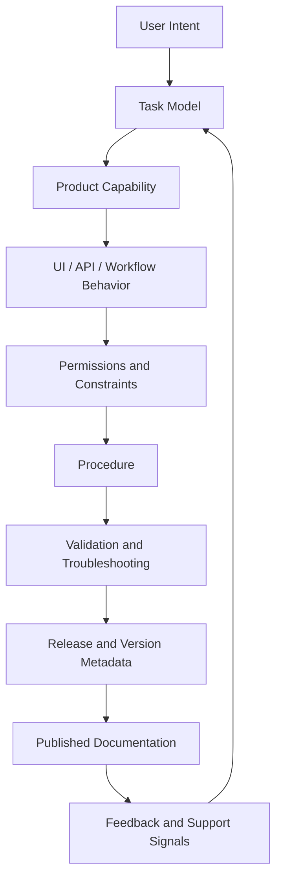
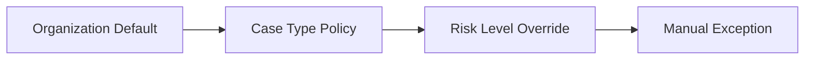
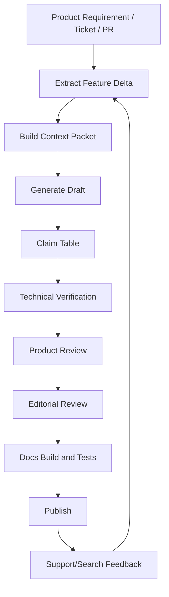

------
title: Learn AI-Driven Documentation and Technical Writing Implementation and Usage - Part 027
description: Deep implementation guide for user guides, admin guides, product documentation, AI-assisted procedural writing, release-aligned docs, screenshots, troubleshooting, and product documentation governance.
series: learn-ai-driven-documentation
seriesTitle: Learn AI-Driven Documentation and Technical Writing Implementation and Usage
order: 27
partTitle: User Guides, Admin Guides, and Product Documentation
tags:
- ai
- documentation
- technical-writing
- product-documentation
- user-guides
- admin-guides
- procedural-writing
- developer-experience
- docs-as-code
- series
date: 2026-06-30
---

# Part 027 — User Guides, Admin Guides, and Product Documentation

## 1. Why This Part Exists

Engineering documentation often explains how systems work.

Product documentation explains how people get work done with those systems.

That distinction matters.

A technically correct document can still fail users if it describes internal architecture instead of user intent. A beautiful product page can still fail enterprise admins if it hides constraints, permissions, rollback behavior, audit implications, or operational side effects.

AI makes this problem both easier and more dangerous.

It becomes easier because AI can transform product requirements, tickets, release notes, support issues, UI text, and API behavior into drafts quickly. It becomes more dangerous because AI can produce confident user-facing instructions that are subtly wrong, outdated, over-promising, or unsupported by actual product behavior.

The goal of this part is to design product documentation as a controlled implementation system:

> Product documentation is not marketing copy. It is a task-support interface between user intent and system behavior.

For a software engineer, mastering this area means being able to build documentation workflows that connect product behavior, user workflows, admin responsibilities, support feedback, release changes, and AI-assisted writing into one reliable system.

---

## 2. Kaufman Lens: What We Are Actually Learning

Using Josh Kaufman's skill acquisition model, we deconstruct user/admin/product documentation into sub-skills:

1. **Audience segmentation** — distinguishing end user, power user, admin, operator, buyer, support agent, and integrator.
2. **Task modeling** — mapping user goals into procedures, decisions, prerequisites, and recovery paths.
3. **Product behavior grounding** — tying documentation to implemented behavior, not roadmap promises.
4. **UI-to-doc translation** — converting interface flows into clear instructions without over-describing obvious UI.
5. **Admin responsibility modeling** — documenting configuration, access, policy, audit, backup, migration, and rollback.
6. **Release alignment** — keeping docs synchronized with shipped changes, feature flags, versions, and availability.
7. **Troubleshooting design** — helping users diagnose symptoms and recover without escalating unnecessarily.
8. **AI-assisted transformation** — using AI to draft, normalize, compare, and gap-check product docs.
9. **Verification** — validating docs against product behavior, screenshots, permissions, examples, and support cases.
10. **Governance** — defining ownership, review, staleness policy, publishing gates, and feedback loops.

The target skill is not:

> "I can write a user manual."

The useful target is:

> "I can design and operate an AI-assisted product documentation system that helps users complete real tasks safely, accurately, and with minimal support dependency."

---

## 3. Product Docs Are Different From Engineering Docs

Engineering docs usually answer:

- How is this built?
- Why was this designed this way?
- How do I operate or extend it?
- What are the failure modes?

Product docs usually answer:

- What can I do?
- How do I do it?
- What do I need before I start?
- What happens after I click this?
- What permissions do I need?
- What if it fails?
- What changed in this release?

Admin docs add another layer:

- Who can configure this?
- What is the security impact?
- What is inherited vs overridden?
- What is reversible?
- What is logged?
- What is visible to users?
- What happens at scale?
- What is the migration path?

A common failure is writing product docs from the builder's perspective:

> "The system supports configurable policy assignment via the Access Control module."

A user-centered version is:

> "To give a team access to a policy, assign the policy to the team's role. Users receive the new access the next time their session refreshes."

The second version has task orientation, subject clarity, and operational consequence.

---

## 4. The Product Documentation Stack

Think of product documentation as a stack with several layers.



Each layer must be traceable.

If a procedure exists but nobody can identify the capability it describes, the doc is fragile. If a screenshot exists but nobody knows which release it came from, the doc is fragile. If troubleshooting advice exists but is not tied to known errors or support tickets, the doc is fragile.

AI should not generate directly from vague product descriptions. It should generate from a context packet that includes behavior, user intent, constraints, and evidence.

---

## 5. Audience Model

Product documentation breaks when it assumes a single generic reader.

A serious system needs explicit audience metadata.

| Audience | Primary Question | Documentation Need |
|---|---|---|
| End user | How do I complete my task? | Short procedural guides, screenshots, validation results, recovery steps |
| Power user | How do I work faster or customize behavior? | Advanced workflows, shortcuts, bulk operations, limits |
| Admin | How do I configure this safely? | Permissions, policies, defaults, audit, rollback, migration |
| Operator | How do I keep this running? | Operational runbooks, health checks, monitoring, escalation |
| Integrator | How do I connect this to other systems? | API docs, webhook/event behavior, authentication, examples |
| Support agent | How do I diagnose user issues? | Troubleshooting trees, known errors, evidence collection, escalation criteria |
| Compliance reviewer | What evidence proves correct process? | Audit logs, approval history, data handling, retention, controls |

A document should not try to satisfy all of these equally.

The better pattern is:

- user guide for task execution;
- admin guide for configuration and policy;
- reference page for fields, permissions, statuses, and limits;
- troubleshooting page for symptoms and recovery;
- release note for change awareness;
- explanation page for conceptual model.

This is where Diátaxis remains useful, but product docs require stronger persona separation than internal engineering docs.

---

## 6. User Guide Design

A user guide should be organized around user tasks, not product modules.

Bad structure:

```text
Dashboard
Cases
Actions
Reports
Settings
```

Better structure:

```text
Get started
Create and manage cases
Assign work
Review decisions
Generate reports
Troubleshoot common issues
```

The second structure maps to user goals.

A strong user guide page usually has this structure:

```mdx
# Create a case

Use this procedure when you need to register a new enforcement case.

## Before you begin

- You must have the Case Creator role.
- You need at least one subject record.
- The case type must be enabled for your organization.

## Create the case

1. Open **Cases**.
2. Select **Create case**.
3. Choose a case type.
4. Enter the required subject details.
5. Select **Save draft** or **Submit**.

## Result

The system creates a case in **Draft** or **Submitted** status, depending on your action.

## What to do next

- Add evidence.
- Assign an investigator.
- Submit the case for review.

## Troubleshooting

| Problem | Cause | What to do |
|---|---|---|
| Case type is missing | You do not have permission or the type is disabled | Contact an admin |
```

Key properties:

- action-oriented title;
- clear scope;
- prerequisites;
- numbered steps;
- result statement;
- next action;
- troubleshooting;
- permissions and limitations.

Google's developer style guide treats a procedure as a sequence of numbered steps for accomplishing a task. Microsoft also emphasizes clear, easy-to-follow step-by-step instructions. Product docs should follow this discipline even when the product UI feels intuitive.

---

## 7. Admin Guide Design

Admin guides are not longer user guides.

They document responsibility.

An admin guide should explain:

- configuration options;
- defaults;
- inherited settings;
- role and permission requirements;
- visibility impact;
- audit behavior;
- rollout strategy;
- rollback behavior;
- failure impact;
- migration implications;
- data retention or deletion behavior;
- version-specific differences.

A strong admin guide page often looks like this:

```mdx
# Configure approval policy

Approval policies control who must review a case before it can move to the next lifecycle stage.

## When to use this

Configure approval policies when your organization needs different review rules by case type, risk level, or jurisdiction.

## Required role

You need the Policy Administrator role.

## Configuration model



## Configure a policy

1. Open **Admin** > **Policies**.
2. Select **Approval policies**.
3. Choose a case type.
4. Add one or more approver roles.
5. Select **Save**.

## Propagation behavior

New cases use the updated policy immediately. Existing cases keep their current approval route unless they are reassigned.

## Audit behavior

Each change records the actor, timestamp, previous policy, new policy, and reason.

## Rollback

To revert, restore the previous policy from the policy history page.
```

Notice the difference from a user guide:

- explains model, not just clicks;
- documents consequences;
- identifies reversibility;
- describes propagation;
- includes audit behavior;
- names required permissions.

Admin docs must be treated as risk-bearing documents.

---

## 8. Product Documentation Types

A mature product documentation system has distinct document types.

| Type | Purpose | Typical Owner | AI Usage |
|---|---|---|---|
| Getting started | Help new users reach first success | Product/docs | Draft flow, simplify language, find missing prerequisites |
| How-to guide | Complete a specific task | Product/docs/SME | Generate procedural draft from product evidence |
| Admin guide | Configure product safely | Engineering/product/security | Extract configuration model, flag missing risks |
| Reference | Describe fields, statuses, limits | Engineering/docs | Generate from source/specs, validate completeness |
| Troubleshooting | Diagnose symptoms | Support/engineering/docs | Cluster support cases, draft decision tree |
| Release notes | Explain shipped changes | Product/engineering/docs | Summarize PRs/issues, classify user impact |
| Migration guide | Move from old behavior to new behavior | Engineering/product/docs | Generate impact map and step sequence |
| FAQ | Answer repeated questions | Support/docs | Mine support tickets and search logs |
| Known limitations | Set expectations | Product/engineering/docs | Extract constraints and produce user-facing language |
| Conceptual explanation | Explain model | Product/architecture/docs | Convert internal model into reader-facing explanation |

Do not collapse all of these into one page.

AI can help generate all of them, but each type needs a different prompt, evidence source, verification method, and review gate.

---

## 9. Product Docs Context Packet

AI-generated product documentation should start from a structured context packet.

Example:

```yaml
doc_intent: "Help organization admins configure approval policy safely"
audience:
  primary: "Organization administrator"
  secondary:
    - "Support agent"
    - "Compliance reviewer"
doc_type: "admin-guide"
feature:
  name: "Approval policy configuration"
  release: "2026.06"
source_of_truth:
  product_requirement: "PRD-428"
  implementation_prs:
    - "platform/pull/9812"
  ui_spec: "Figma approval-policy-v6"
  api_spec: "openapi/admin-policy.yaml"
  test_cases:
    - "PolicyPropagationTest"
permissions:
  required_roles:
    - "Policy Administrator"
behavior:
  propagation: "New cases only; existing cases keep current route unless reassigned"
  rollback: "Policy history restore"
  audit: "actor, timestamp, previous policy, new policy, reason"
constraints:
  - "Cannot delete a policy used by active case type"
  - "Manual exception requires reason"
user_risks:
  - "Unexpected approval route after policy change"
  - "Incorrect approver role causing blocked workflow"
output:
  format: "mdx"
  include:
    - "before you begin"
    - "configuration model"
    - "procedure"
    - "propagation behavior"
    - "audit behavior"
    - "rollback"
    - "troubleshooting"
verification:
  require_claim_table: true
  require_open_questions: true
```

This packet prevents vague prompting.

Bad prompt:

> Write documentation for approval policies.

Better prompt:

> Using this context packet, draft an admin guide. Do not invent behavior. For every claim about propagation, audit, rollback, permission, or limitation, include an evidence reference or mark it as unverified.

---

## 10. AI Workflow for Product Docs

A reliable AI-assisted product documentation workflow looks like this:



The critical artifact is the **claim table**.

Example:

| Claim | Evidence | Status | Reviewer |
|---|---|---|---|
| Users need Policy Administrator role | RBAC matrix v12 | Verified | Security SME |
| Existing cases keep current approval route | PolicyPropagationTest | Verified | Backend engineer |
| Policy history can restore prior policy | UI spec v6 | Needs verification | Product manager |

AI should produce this table as part of the draft.

A draft without claim evidence should not be publishable for admin, compliance, security, or migration docs.

---

## 11. Release-Aligned Documentation

Product docs fail when documentation is not tied to release reality.

A release-aware documentation system tracks:

- feature availability;
- version;
- edition or plan;
- region;
- feature flag;
- rollout percentage;
- beta/GA/deprecated status;
- migration deadline;
- UI variant;
- API version;
- compatibility notes.

Frontmatter should carry this metadata.

```yaml
feature: approval-policy-configuration
product_area: case-management
release: "2026.06"
availability:
  status: ga
  editions:
    - enterprise
  regions:
    - global
feature_flags:
  - approval_policy_v2
min_version: "2026.06"
roles:
  - Policy Administrator
lifecycle: active
review:
  owner: docs-product-governance
  last_verified: 2026-06-30
  verification_sources:
    - PRD-428
    - PolicyPropagationTest
    - openapi/admin-policy.yaml
```

This metadata helps:

- site rendering;
- search filtering;
- AI retrieval;
- stale detection;
- support routing;
- release note generation;
- audit review.

---

## 12. Screenshot and UI Documentation Strategy

Screenshots are useful, but they age quickly.

Use screenshots when they clarify:

- complex layout;
- unfamiliar workflow;
- high-risk configuration;
- visual confirmation;
- error diagnosis;
- report interpretation.

Avoid screenshots when:

- UI changes frequently;
- text steps are enough;
- screenshot contains sensitive data;
- screenshot localizes poorly;
- screenshot creates maintenance burden without improving task success.

A mature system treats screenshots as versioned artifacts:

```yaml
screenshot:
  file: approval-policy-editor-2026-06.png
  product_version: "2026.06"
  page: "Admin > Policies > Approval policies"
  test_user: "docs-admin-fixture"
  contains_sensitive_data: false
  last_verified: 2026-06-30
  owner: product-docs
```

For AI-assisted docs, screenshots should not be the primary source of truth unless image analysis is explicitly validated. Prefer structured UI specs, product behavior tests, and source metadata. AI can help write alt text, identify screenshot/doc mismatch, and suggest where a screenshot improves clarity.

---

## 13. Troubleshooting Documentation

Troubleshooting docs must start from symptoms.

Bad structure:

```text
Database issues
Permission issues
Network issues
```

Better structure:

```text
I cannot create a case
The approval button is disabled
A report is missing expected data
A policy change did not affect existing cases
```

A strong troubleshooting page includes:

- symptom;
- likely causes;
- diagnostic steps;
- evidence to collect;
- recovery steps;
- escalation criteria;
- related logs or audit events;
- safe stop conditions.

Example:

```mdx
# The approval button is disabled

Use this guide when you can view a case but cannot approve it.

## Most common causes

| Cause | How to check | Resolution |
|---|---|---|
| You are not assigned as approver | Open the Approval panel | Ask the case owner to assign you |
| The case is not in Review status | Check the case status | Move the case to Review |
| Required evidence is missing | Open Evidence checklist | Add or request the missing evidence |

## Collect this information before escalation

- Case ID
- Current status
- Your role
- Approval route
- Last audit event
```

AI is very useful here because it can cluster support tickets into repeated symptoms. But the recovery path must be verified by product/support/engineering.

---

## 14. Known Limitations and Honest Documentation

High-quality product documentation does not hide limitations.

It names them clearly.

Weak language:

> Some features may not work in some cases.

Strong language:

> Bulk reassignment does not update cases that are locked for legal hold. Reassign those cases individually after the hold is removed.

Known limitations are not admissions of poor quality. They are reliability controls.

Document:

- unsupported scenarios;
- scale limits;
- permission constraints;
- region/edition limitations;
- delayed propagation;
- irreversible actions;
- eventual consistency;
- export/import limitations;
- audit or retention constraints;
- browser/client requirements;
- API/UI behavior mismatch.

AI should be instructed to surface limitations from tickets, tests, specs, and support cases. It should not invent limitations from generic patterns.

---

## 15. Product Docs Quality Gates

Product docs need quality gates beyond prose linting.

| Gate | Question |
|---|---|
| Audience gate | Is the primary reader explicit? |
| Task gate | Does the doc support a real user task? |
| Prerequisite gate | Are permissions, inputs, and setup named? |
| Result gate | Does the doc say what happens after completion? |
| Constraint gate | Are limitations and unsafe actions documented? |
| Version gate | Is availability/version/feature flag clear? |
| Evidence gate | Are behavior claims tied to source evidence? |
| Screenshot gate | Are screenshots current and non-sensitive? |
| Accessibility gate | Are images described and procedures usable without images? |
| Support gate | Does troubleshooting include evidence to collect? |
| AI gate | Are AI-generated claims verified before publish? |

These gates can be implemented with a mix of automation and review.

Automation can check metadata, broken links, frontmatter, image existence, alt text, and forbidden terms. Human review must verify behavior, task fit, and risk.

---

## 16. Implementation Pattern: Product Docs in Docs-as-Code

A practical repository layout:

```text
docs/
  product/
    user-guides/
      create-case.mdx
      assign-work.mdx
    admin-guides/
      configure-approval-policy.mdx
      manage-roles.mdx
    troubleshooting/
      approval-button-disabled.mdx
      report-data-missing.mdx
    release-notes/
      2026-06.mdx
    known-limitations/
      bulk-actions.mdx
  _partials/
    permissions-callout.mdx
    audit-log-callout.mdx
  _data/
    roles.yaml
    feature-availability.yaml
    product-glossary.yaml
  images/
    product/
      approval-policy-editor-2026-06.png
```

This layout separates user guides, admin guides, troubleshooting, and release notes while allowing shared metadata.

The AI documentation system can index these files differently:

- user guides for task answer generation;
- admin guides for configuration and policy answer generation;
- troubleshooting pages for support and incident triage;
- release notes for change awareness;
- glossary for terminology normalization.

---

## 17. AI Prompts That Work

### 17.1 User Guide Draft Prompt

```text
You are drafting a product user guide.

Audience: end user.
Doc type: how-to guide.
Goal: help the reader complete one task safely.

Use only the provided context.
Do not invent UI labels, permissions, results, limits, or troubleshooting advice.

Output structure:
1. Title as an action.
2. One-sentence purpose.
3. Before you begin.
4. Numbered steps.
5. Result.
6. What to do next.
7. Troubleshooting table.
8. Verification table listing each behavior claim and its source.
9. Open questions.

Style:
- Use direct, concise language.
- Use numbered steps for procedures.
- Use active voice.
- Prefer user-visible labels over internal implementation terms.
```

### 17.2 Admin Guide Draft Prompt

```text
You are drafting an admin guide.

Audience: organization administrator.
Doc type: admin configuration guide.

Focus on:
- required role;
- configuration model;
- defaults;
- inheritance and overrides;
- propagation behavior;
- audit logging;
- rollback;
- security and compliance implications;
- troubleshooting.

For every claim about permissions, propagation, audit, rollback, deletion, data handling, or irreversible actions, include an evidence reference.
Mark any missing evidence as OPEN QUESTION.
```

### 17.3 Troubleshooting Prompt

```text
You are drafting troubleshooting documentation from support cases.

Group issues by user-visible symptom, not by internal component.
For each symptom, produce:
- likely causes;
- how to check;
- safe resolution;
- evidence to collect before escalation;
- when to stop and escalate.

Do not recommend database changes, manual state edits, permission bypasses, or unsupported workarounds.
```

---

## 18. Anti-Patterns

### 18.1 Feature-Centric Docs

A feature-centric page describes what the product has.

A task-centric page helps the user do something.

Feature-centric docs are useful for reference, but bad for task execution.

### 18.2 Screenshot-Only Instructions

Screenshots without robust text steps are brittle, inaccessible, and hard to localize.

### 18.3 AI-Generated Overclaiming

AI often writes phrases like:

- "seamlessly";
- "automatically";
- "securely";
- "instantly";
- "all users";
- "always";
- "never".

These words require evidence. In product docs, overclaiming creates support, legal, and trust risk.

### 18.4 Missing Result Statements

A procedure without a result leaves the user unsure whether they succeeded.

Every task guide should state the expected outcome.

### 18.5 Hidden Permission Requirements

If a user cannot follow a guide because permission is missing, the doc has failed before step one.

### 18.6 Roadmap Leakage

Do not document behavior that is planned but not shipped unless the page is explicitly labeled as beta, preview, or future-facing.

---

## 19. Review Checklist

Before publishing product docs, verify:

- The document has one primary audience.
- The title is task-oriented.
- Prerequisites are explicit.
- Permissions are explicit.
- Steps use user-visible labels.
- Steps are ordered and executable.
- Expected result is documented.
- Side effects are documented.
- Troubleshooting is symptom-based.
- Version and availability are clear.
- Limitations are honest.
- Screenshots are current and safe.
- Claims are evidence-backed.
- AI-generated text has been reviewed.
- Search keywords match how users describe the task.

---

## 20. Practice Drill

Take one shipped feature and produce four docs:

1. user how-to guide;
2. admin configuration guide;
3. troubleshooting page;
4. release note entry.

For each document, produce:

- context packet;
- claim table;
- evidence references;
- open questions;
- final MDX page;
- review checklist result.

Then ask:

- Which claims were hard to verify?
- Which reader needed a different document?
- Which UI labels were ambiguous?
- Which support questions are still unanswered?
- Which metadata should be required next time?

This drill builds the real skill: turning product behavior into reliable task support.

---

## 21. Summary

Product documentation is successful when users can complete real work without needing to understand internal architecture.

Admin documentation is successful when administrators can configure the product safely, predict consequences, recover from mistakes, and prove what changed.

AI is valuable when it accelerates drafting, normalization, comparison, release summarization, troubleshooting synthesis, and gap detection. It is dangerous when it invents product behavior, hides limitations, or publishes unverified claims.

The core discipline is simple:

> Product docs must be grounded in shipped behavior, written around user tasks, verified against evidence, and governed like a product surface.

In the next part, we will move from product documentation into regulated and auditable documentation, where traceability, evidence, approval history, and defensible language become first-class engineering concerns.

---

## References

- Google Developer Documentation Style Guide — Procedures: https://developers.google.com/style/procedures
- Microsoft Writing Style Guide — Writing step-by-step instructions: https://learn.microsoft.com/en-us/style-guide/procedures-instructions/writing-step-by-step-instructions
- Google Developer Documentation Style Guide: https://developers.google.com/style
- Microsoft Writing Style Guide: https://learn.microsoft.com/en-us/style-guide/welcome/
