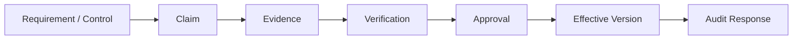
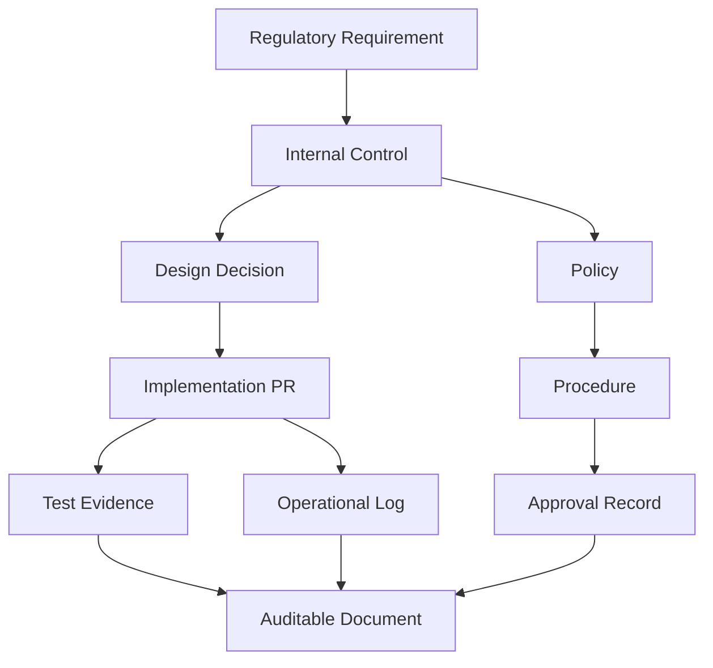
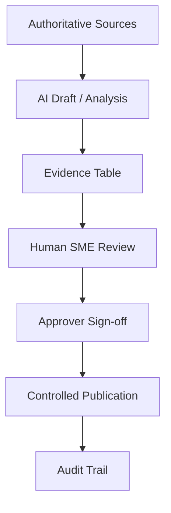
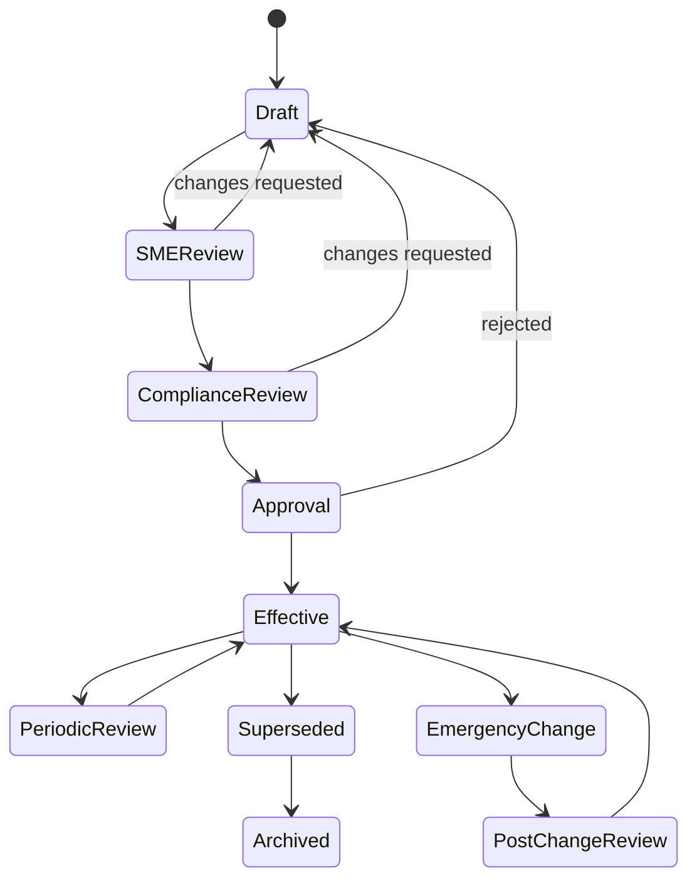
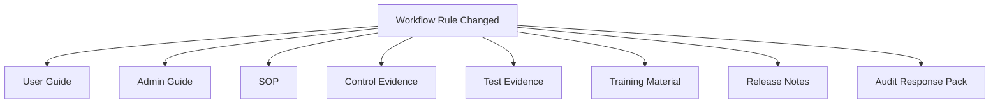

------
title: Learn AI-Driven Documentation and Technical Writing Implementation and Usage - Part 028
description: Deep implementation guide for regulated and auditable documentation, traceability, evidence, approval workflows, AI-assisted audit readiness, defensible language, and compliance-aware documentation systems.
series: learn-ai-driven-documentation
seriesTitle: Learn AI-Driven Documentation and Technical Writing Implementation and Usage
order: 28
partTitle: Regulated and Auditable Documentation
tags:
- ai
- documentation
- technical-writing
- regulated-systems
- auditability
- traceability
- compliance
- governance
- evidence
- docs-as-code
- series
date: 2026-06-30
---

# Part 028 — Regulated and Auditable Documentation

## 1. Why This Part Exists

Most documentation is written to explain.

Regulated documentation must also prove.

It must prove what was decided, who approved it, which evidence supported it, when it changed, which control it satisfies, which version was effective at a given time, and whether the organization followed its own process.

This is a very different operating model from ordinary technical writing.

In regulated environments, documentation is not just knowledge transfer. It becomes part of the evidence system.

Examples:

- financial services audit evidence;
- healthcare and life sciences quality records;
- public sector case management records;
- AI system technical documentation;
- security control evidence;
- incident and postmortem records;
- policy and procedure documentation;
- data retention and access control documentation;
- model risk management records;
- enforcement lifecycle documentation.

AI can help generate, organize, summarize, compare, and check regulated docs. But it must not weaken accountability, invent evidence, erase uncertainty, or obscure approval history.

The core principle:

> In regulated documentation, the document is not the artifact. The document plus its evidence, version, approval, and traceability chain is the artifact.

---

## 2. Kaufman Lens: What We Are Actually Learning

Using Josh Kaufman's skill acquisition model, we decompose regulated documentation into sub-skills:

1. **Regulatory intent modeling** — understanding what the rule or control is trying to protect.
2. **Evidence modeling** — mapping claims to records, tests, approvals, logs, and source systems.
3. **Traceability design** — connecting requirement, design, implementation, test, operation, and review.
4. **Defensible writing** — using precise language that avoids exaggeration, ambiguity, and unsupported claims.
5. **Approval workflow design** — ensuring right people approve right documents at right lifecycle points.
6. **Version and effective-date control** — reconstructing what was true at a specific time.
7. **Audit readiness** — producing documentation that can answer an auditor's question quickly and consistently.
8. **AI usage boundaries** — defining where AI can assist and where human accountability is mandatory.
9. **Change impact analysis** — understanding what documents/evidence must change when the system changes.
10. **Exception management** — documenting waivers, deviations, compensating controls, and remediation.

The target skill is not:

> "I can write compliance documents."

The useful target is:

> "I can design an AI-assisted documentation system that remains traceable, auditable, reviewable, defensible, and operationally useful under regulatory scrutiny."

---

## 3. Regulated Documentation Is a System of Record

In ordinary docs, the reader asks:

> "How does this work?"

In regulated docs, the auditor or reviewer asks:

> "Show me evidence that this worked, was controlled, was approved, and remained accurate for the relevant period."

A regulated documentation system must preserve:

- content;
- version history;
- effective date;
- approval status;
- approver identity;
- evidence references;
- source system links;
- change reason;
- review cycle;
- exception history;
- retention policy;
- access control;
- audit trail.

Without those, the document may be informative but not defensible.

---

## 4. Mental Model: Claim, Evidence, Control, Approval

A regulated document is made of claims.

Each claim should be traceable.



Example claim:

> "All high-risk case closure decisions require supervisor approval."

This claim needs evidence:

- policy requirement;
- workflow configuration;
- access control matrix;
- test proving bypass is blocked;
- sample audit log;
- approval record;
- operating procedure;
- exception process.

AI can draft the sentence. It cannot make the sentence true.

---

## 5. The Evidence Graph

A mature regulated documentation platform should model evidence as a graph.



This graph supports questions like:

- Which documents satisfy this control?
- Which controls depend on this service?
- Which docs must be reviewed after this code change?
- Which evidence proves this claim?
- Which approvals were active on a specific date?
- Which exceptions exist for this requirement?

This is where AI becomes useful. It can help traverse, summarize, and detect missing links. But the graph itself must be grounded in authoritative systems.

---

## 6. Source-of-Truth Hierarchy

Regulated docs need a source hierarchy.

Example:

| Rank | Source | Use |
|---:|---|---|
| 1 | Law/regulation/contract/control framework | External obligation |
| 2 | Internal policy | Organization commitment |
| 3 | Approved procedure/SOP | Required operating behavior |
| 4 | System configuration | Actual configured behavior |
| 5 | Code/spec/test evidence | Technical implementation evidence |
| 6 | Audit logs | Runtime evidence |
| 7 | Tickets/approvals/change records | Process evidence |
| 8 | Published documentation | Human-readable explanation |
| 9 | AI-generated draft | Non-authoritative assistance |

The key rule:

> AI-generated content is never the highest source of truth.

Generated text may be useful, but it must point to stronger evidence.

---

## 7. Defensible Technical Writing

Regulated documentation must be precise.

Avoid vague claims:

- "secure";
- "fully compliant";
- "always";
- "never";
- "real-time";
- "guaranteed";
- "seamless";
- "automatic";
- "tamper-proof";
- "audit-ready".

Use bounded claims:

| Weak | Stronger |
|---|---|
| The system is secure. | The system enforces role-based access checks before case approval actions. |
| Changes are fully audited. | Policy changes record actor, timestamp, previous value, new value, and reason. |
| Data is retained safely. | Case records are retained for seven years according to Policy RET-04. |
| AI summarizes decisions accurately. | AI-generated summaries are reviewed by a case officer before publication. |
| The workflow prevents unauthorized closure. | Closure requires a user with Supervisor role unless exception EX-12 is approved. |

Defensible writing is not defensive writing.

It is scoped, evidence-backed, and verifiable.

---

## 8. Document Types in Regulated Systems

| Document Type | Purpose | Evidence Requirement |
|---|---|---|
| Policy | Define organizational commitment | Approved policy owner, effective date, revision history |
| SOP / procedure | Define required operational steps | Training record, approval, version, exception process |
| Technical design | Explain implementation | Architecture review, PRs, tests, threat model |
| Risk assessment | Identify and evaluate risks | Risk register, scoring rationale, mitigations |
| Control evidence | Prove control operation | Logs, screenshots, exports, test results, approvals |
| Validation report | Prove system meets intended use | Test plan, test results, defect disposition |
| Audit response | Answer auditor request | Evidence bundle and traceability map |
| Incident/postmortem | Explain failure and remediation | Timeline, root cause, corrective actions, closure evidence |
| AI technical documentation | Explain AI system behavior, data, metrics, monitoring, risk controls | Model/data documentation, evaluation, human oversight, logs |
| Exception/waiver | Document approved deviation | Reason, approver, expiration, compensating control |

Each type needs different review gates and retention rules.

---

## 9. AI in Regulated Documentation

AI can assist with:

- summarizing lengthy regulations or policies;
- extracting obligations;
- mapping obligations to controls;
- drafting SOPs from approved process notes;
- converting tickets into audit summaries;
- generating traceability matrices;
- comparing document versions;
- detecting missing approvals;
- identifying unsupported claims;
- creating evidence bundle indexes;
- drafting plain-language explanations;
- classifying documents by lifecycle state;
- checking whether docs contain risky language.

AI should not independently:

- declare compliance;
- approve regulated documents;
- invent evidence;
- determine legal interpretation as final authority;
- modify audit records;
- redact evidence without review;
- publish regulated docs without human approval;
- bypass retention or access policies;
- summarize sensitive records without access control.

The safe model:



---

## 10. Regulated Docs Context Packet

AI-assisted regulated docs require a stricter context packet than normal docs.

```yaml
doc_intent: "Document approval-control behavior for high-risk case closure"
doc_type: "control-evidence-summary"
regulatory_context:
  jurisdiction: "internal / domain-specific"
  obligation_id: "CTRL-CASE-CLOSE-001"
  obligation_text: "High-risk closure decisions require independent approval."
control:
  id: "AC-CASE-CLOSE-APPROVAL"
  owner: "case-platform-governance"
  frequency: "continuous"
  lifecycle_state: "active"
sources:
  policy:
    - "POL-CASE-09 v4"
  procedure:
    - "SOP-CASE-CLOSE v7"
  implementation:
    - "case-service PR #8451"
    - "workflow-config approval-route.yaml"
  tests:
    - "ClosureApprovalRequiredTest"
    - "UnauthorizedClosureDeniedTest"
  runtime_evidence:
    - "audit-log-sample-2026-06.csv"
  approvals:
    - "CAB-2026-06-14"
claim_rules:
  require_evidence_for:
    - "permission"
    - "approval"
    - "audit"
    - "exception"
    - "retention"
    - "automation"
  forbidden_unless_evidenced:
    - "always"
    - "never"
    - "fully compliant"
    - "guaranteed"
output:
  include:
    - "control summary"
    - "scope"
    - "evidence table"
    - "known exceptions"
    - "open questions"
    - "review checklist"
```

This packet forces evidence alignment.

---

## 11. Traceability Matrix

A traceability matrix connects obligations to implementation and evidence.

| Requirement | Control | Design | Implementation | Test | Runtime Evidence | Doc | Status |
|---|---|---|---|---|---|---|---|
| High-risk closure requires approval | AC-CASE-CLOSE-APPROVAL | ADR-014 | PR #8451 | ClosureApprovalRequiredTest | Audit sample 2026-06 | SOP-CASE-CLOSE v7 | Verified |
| Unauthorized users cannot close cases | AC-RBAC-CLOSE | SEC-DES-08 | PR #8420 | UnauthorizedClosureDeniedTest | Access denied logs | Admin Guide | Verified |
| Exceptions require reason | AC-EXCEPTION-REASON | ADR-021 | PR #8498 | ExceptionReasonRequiredTest | Exception register | Exception SOP | Needs review |

AI can generate draft matrices, but humans must verify mappings.

A matrix is dangerous if it creates fake confidence. Each row should have status:

- verified;
- partially verified;
- missing evidence;
- conflicting evidence;
- not applicable;
- deprecated;
- under review.

---

## 12. Approval Workflow

A regulated document should have lifecycle states.



Each transition should record:

- actor;
- timestamp;
- reason;
- previous version;
- new version;
- approval result;
- comments;
- related evidence.

For high-risk documents, avoid invisible edits. Prefer controlled version changes.

---

## 13. Versioning and Effective Dating

Version history is not enough.

Auditable systems need effective dating.

Example frontmatter:

```yaml
doc_id: SOP-CASE-CLOSE
version: "7.2"
lifecycle: effective
effective_from: 2026-06-30
effective_to: null
supersedes: "SOP-CASE-CLOSE v7.1"
approval:
  status: approved
  approved_by:
    - role: "Case Operations Owner"
      name: "redacted"
      date: 2026-06-29
    - role: "Compliance Reviewer"
      name: "redacted"
      date: 2026-06-29
review_cycle:
  frequency: quarterly
  next_review_due: 2026-09-30
evidence_manifest:
  - "POL-CASE-09 v4"
  - "ClosureApprovalRequiredTest"
  - "audit-log-sample-2026-06.csv"
```

A user should be able to answer:

> What document version was effective on March 15, 2026?

This matters for audits, legal review, incident analysis, customer commitments, and regulatory reporting.

---

## 14. Electronic Records and Audit Trails

Regulated electronic records often require controls around creation, modification, maintenance, retrieval, and transmission.

For example, FDA 21 CFR Part 11 applies to electronic records that are created, modified, maintained, archived, retrieved, or transmitted under records requirements. The practical lesson for software documentation systems is not that every organization falls under Part 11. The lesson is that regulated electronic records require controlled identity, audit trails, retention, and integrity.

A docs platform intended for regulated records should consider:

- authenticated users;
- role-based access;
- immutable audit logs;
- controlled approval;
- electronic signature policy if applicable;
- record retention;
- exportable evidence bundles;
- archival of superseded versions;
- tamper-evident storage;
- time synchronization;
- disaster recovery;
- access review.

Do not casually claim Part 11 compliance unless the complete system, process, and validation evidence support that claim.

---

## 15. AI System Technical Documentation

AI systems introduce additional documentation needs:

- intended purpose;
- system boundaries;
- model and provider details;
- training/fine-tuning data, if applicable;
- retrieval sources;
- prompt templates;
- evaluation datasets;
- performance metrics;
- known limitations;
- human oversight;
- monitoring;
- incident handling;
- risk controls;
- data protection;
- logging;
- user instructions;
- change management.

The EU AI Act is a major example of a modern regulatory framework that emphasizes risk-based obligations and technical documentation for AI systems. For high-risk AI systems, technical documentation must be prepared before placing the system on the market or putting it into service and kept up to date.

Even outside the EU, this creates a useful engineering principle:

> AI documentation must describe intended use, system design, data dependencies, evaluation, limitations, monitoring, and human control boundaries.

For AI-driven documentation systems specifically, document:

- which sources are indexed;
- which sources are excluded;
- how retrieval works;
- how generated claims are verified;
- how prompt injection is mitigated;
- how secrets and sensitive data are protected;
- how outputs are reviewed;
- how hallucination risk is measured;
- how generated content is labeled;
- who approves publication.

---

## 16. Evidence Manifest

Every regulated document should have an evidence manifest.

```yaml
evidence_manifest:
  generated_at: 2026-06-30T10:00:00+07:00
  generated_by: docs-evidence-bot
  document: SOP-CASE-CLOSE v7.2
  evidence:
    - id: POL-CASE-09-v4
      type: policy
      source_system: policy-repository
      checksum: sha256:...
      effective_from: 2026-04-01
    - id: PR-8451
      type: implementation-change
      source_system: github
      merged_at: 2026-06-14
    - id: TEST-ClosureApprovalRequired
      type: automated-test
      source_system: ci
      status: passed
      run_at: 2026-06-28
    - id: AUDIT-SAMPLE-2026-06
      type: runtime-evidence
      source_system: audit-log-export
      exported_at: 2026-06-30
review:
  status: approved
  reviewers:
    - role: technical-sme
    - role: compliance-reviewer
```

This manifest helps reconstruct evidence without relying on tribal knowledge.

AI can draft the manifest from connected systems, but the manifest should be generated deterministically where possible.

---

## 17. Change Impact Analysis

In regulated systems, a change may affect many documents.

Example:



AI can assist by analyzing changed files, tickets, specs, and docs to propose impacted artifacts.

Change impact prompt:

```text
Given this change set and documentation index, identify all documents that may be impacted.
Classify impact as:
- required update;
- review only;
- no impact;
- unknown.

For each impacted document, explain the reason and list evidence.
Do not mark a document as no impact unless the change is clearly outside its scope.
```

Impact analysis should feed the release gate.

A release that changes regulated behavior should not ship without updating required controlled documents or explicitly recording an approved exception.

---

## 18. Exception and Waiver Documentation

Real systems have exceptions.

The problem is not the existence of exceptions. The problem is undocumented exceptions.

An exception record should include:

- exception ID;
- related requirement/control;
- reason;
- risk assessment;
- compensating control;
- owner;
- approver;
- expiration date;
- review date;
- remediation plan;
- evidence;
- affected systems/docs;
- current status.

Example:

```yaml
exception:
  id: EX-CASE-2026-014
  requirement: AC-CASE-CLOSE-APPROVAL
  reason: "Legacy jurisdiction workflow does not support independent approval yet"
  compensating_control: "Manual weekly review by supervisor"
  approved_by: "Compliance Committee"
  approved_on: 2026-06-10
  expires_on: 2026-09-30
  remediation: "Migrate legacy workflow to approval-route v2"
  status: active
```

AI can find references to exceptions and warn when docs omit them.

---

## 19. Audit Response Packs

An audit response pack is a curated evidence bundle.

It should include:

- scope statement;
- requirement/control mapping;
- current effective policy/procedure;
- design explanation;
- test evidence;
- runtime evidence;
- approval history;
- exceptions;
- remediation status;
- glossary;
- export manifest;
- contact/owner list.

A strong audit response pack answers the likely follow-up questions before they are asked.

AI can help create summaries and indexes, but final pack assembly should be reviewed by accountable owners.

---

## 20. Security and Access Control

Regulated documentation often contains sensitive information.

Control access by:

- document classification;
- role;
- jurisdiction;
- case or customer scope;
- data sensitivity;
- evidence sensitivity;
- retention obligation;
- export permission.

Do not give an AI system broad access to regulated repositories without retrieval controls.

AI retrieval should enforce:

- identity-aware access;
- source-level permissions;
- field-level redaction;
- prompt injection filtering;
- secret scanning;
- evidence access logging;
- output classification;
- approval before external sharing.

A generated answer must not reveal evidence the user is not allowed to access.

---

## 21. AI Review Checklist for Regulated Docs

Before accepting AI-assisted regulated documentation, ask:

- Are all claims evidence-backed?
- Are unsupported claims marked as open questions?
- Does the draft avoid overclaiming?
- Are approvals shown separately from authorship?
- Is effective date clear?
- Is lifecycle state clear?
- Are exceptions documented?
- Are limitations documented?
- Are source documents authoritative?
- Are citations stable and accessible?
- Is sensitive information redacted?
- Is generated text labeled where policy requires it?
- Has a qualified human reviewed the content?
- Is the audit trail preserved?
- Can the document be reconstructed later?

If any answer is no, the document is not ready for regulated use.

---

## 22. Implementation Pattern: Controlled Docs Repository

A possible layout:

```text
regulated-docs/
  policies/
    POL-CASE-09/
      v4.mdx
      approvals.yaml
      evidence-manifest.yaml
  procedures/
    SOP-CASE-CLOSE/
      v7.2.mdx
      approvals.yaml
      evidence-manifest.yaml
  controls/
    AC-CASE-CLOSE-APPROVAL/
      control-summary.mdx
      traceability-matrix.yaml
      evidence/
        test-results.yaml
        audit-log-samples.yaml
  exceptions/
    EX-CASE-2026-014.mdx
  audit-packs/
    2026-q2-case-closure/
      index.mdx
      manifest.yaml
  ai/
    prompts/
      regulated-summary.prompt.md
      traceability-matrix.prompt.md
    evaluations/
      hallucination-checks.yaml
```

This layout separates controlled documents, evidence, exceptions, audit packs, and AI assets.

---

## 23. CI Quality Gates for Regulated Docs

Automate what can be automated:

- required frontmatter;
- lifecycle state validity;
- effective date format;
- approval metadata existence;
- evidence manifest presence;
- forbidden phrases;
- stale review date;
- broken links;
- missing owners;
- unresolved open questions;
- missing exception expiration;
- inconsistent requirement IDs;
- secret leakage;
- unsupported AI-generated label;
- checksum mismatch for evidence artifacts.

Example gate:

```yaml
regulated_doc_gates:
  required_fields:
    - doc_id
    - version
    - lifecycle
    - owner
    - effective_from
    - approval.status
    - evidence_manifest
  forbidden_phrases:
    - "fully compliant"
    - "guaranteed"
    - "tamper-proof"
  block_publish_when:
    - lifecycle == "draft"
    - approval.status != "approved"
    - unresolved_open_questions > 0
    - evidence_manifest.missing == true
```

Automation does not replace compliance judgment, but it prevents obvious process drift.

---

## 24. Failure Modes

### 24.1 Document Exists, Evidence Missing

The doc explains the process but cannot prove it happened.

Fix: require evidence manifests.

### 24.2 Evidence Exists, Traceability Missing

Records exist, but nobody can connect them to requirements.

Fix: maintain traceability matrix.

### 24.3 AI Draft Treated as Approval

AI-generated text is accepted because it sounds authoritative.

Fix: separate drafting, review, approval, and publication states.

### 24.4 Outdated Effective Version

Teams cite a current doc for a past event.

Fix: effective dating and archival.

### 24.5 Unsupported Compliance Claim

The doc claims compliance without full control evidence.

Fix: bounded, evidence-backed language.

### 24.6 Hidden Exception

A process deviation exists but is not documented.

Fix: exception register and expiration workflow.

---

## 25. Practice Drill

Choose a high-risk workflow in your system.

Produce:

1. one controlled procedure;
2. one control summary;
3. one traceability matrix;
4. one evidence manifest;
5. one exception template;
6. one AI prompt for evidence-backed summarization;
7. one CI rule set;
8. one audit response pack outline.

Then test it by asking:

- Can an auditor understand the control without interviewing the team?
- Can an engineer trace the requirement to code and tests?
- Can a reviewer identify missing evidence?
- Can the organization reconstruct the effective version on a past date?
- Can AI assist without becoming the source of truth?

This drill builds the regulated documentation muscle.

---

## 26. Summary

Regulated and auditable documentation is fundamentally different from ordinary technical documentation.

It must explain, prove, preserve, and withstand review.

AI can be powerful in this domain, but only when constrained by source hierarchy, evidence manifests, traceability matrices, approval workflow, access control, and human accountability.

The central invariant:

> A regulated document is only as strong as its evidence chain.

In the next part, we will move into AI risk for documentation systems: hallucination, stale context, overclaiming, source contamination, hidden assumptions, and how to design controls that keep AI-assisted docs trustworthy.

---

## References

- 21 CFR Part 11 — Electronic Records; Electronic Signatures: https://www.ecfr.gov/current/title-21/chapter-I/subchapter-A/part-11
- FDA Guidance — Part 11, Electronic Records; Electronic Signatures, Scope and Application: https://www.fda.gov/regulatory-information/search-fda-guidance-documents/part-11-electronic-records-electronic-signatures-scope-and-application
- EU AI Act overview — European Commission: https://digital-strategy.ec.europa.eu/en/policies/regulatory-framework-ai
- EU AI Act Article 11 — Technical documentation: https://artificialintelligenceact.eu/article/11/
- European Commission guidelines for GPAI model providers: https://digital-strategy.ec.europa.eu/en/policies/guidelines-gpai-providers
