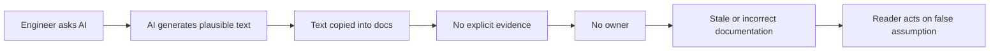
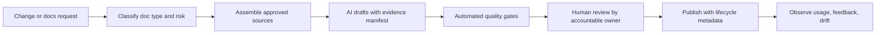
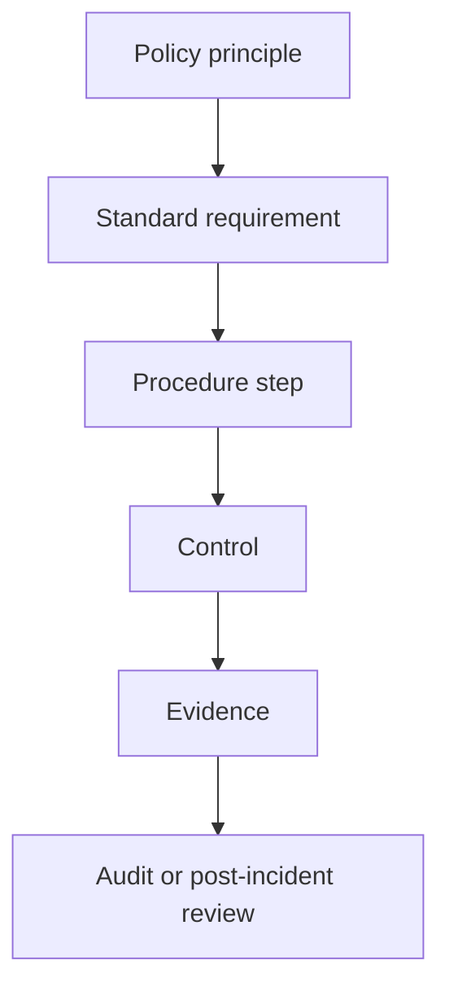
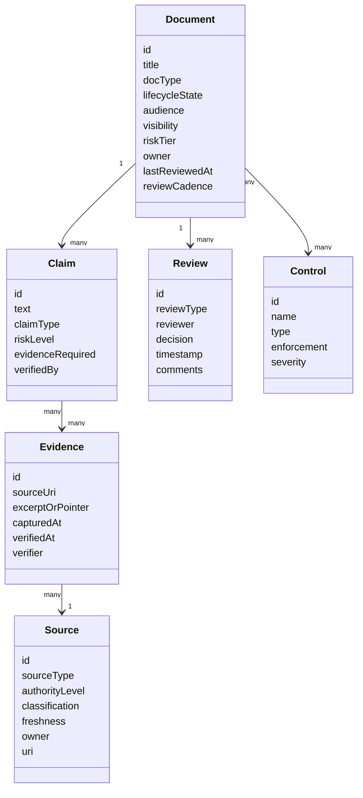
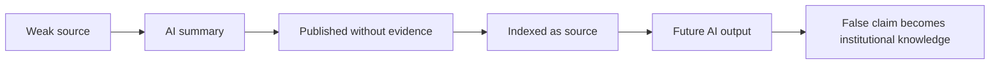
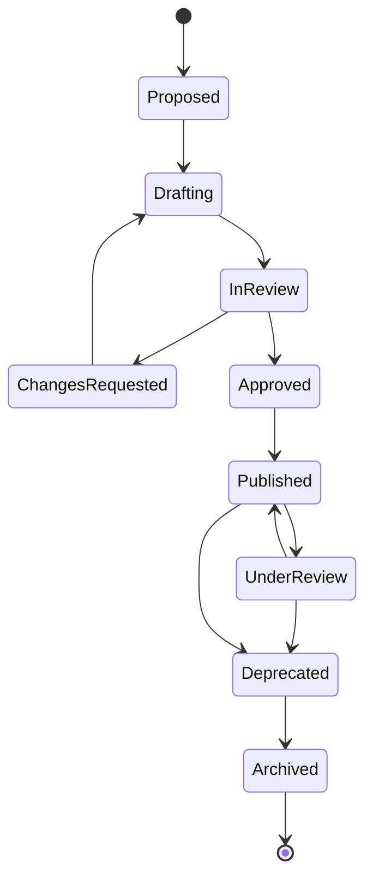
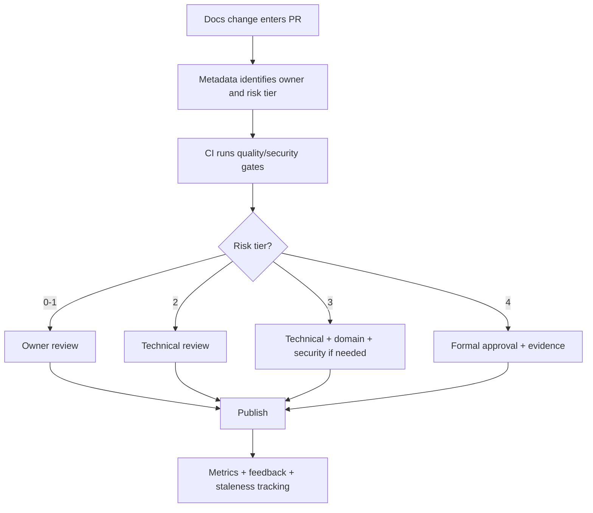
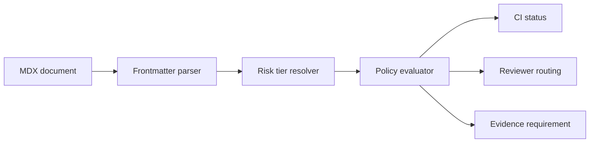

------
title: Learn AI-Driven Documentation and Technical Writing Implementation and Usage - Part 031
description: Governance policy, operating model, lifecycle, roles, controls, exceptions, and approval system for enterprise AI-driven documentation.
series: learn-ai-driven-documentation
seriesTitle: Learn AI-Driven Documentation and Technical Writing Implementation and Usage
order: 31
partTitle: Governance Policy and Operating Model
tags:
- ai
- documentation
- technical-writing
- governance
- operating-model
- policy
- docs-as-code
- risk-management
date: 2026-06-30
---

# Part 031 — Governance Policy and Operating Model

AI-driven documentation does not fail only because the model produces bad prose.

It fails because the organization has no clear answer to these questions:

- Who owns the truth?
- Which source is authoritative?
- Which documents may AI draft?
- Which documents require human approval?
- Which claims require evidence?
- Which generated outputs may be published?
- Who is accountable when generated documentation is wrong?
- How do we handle exceptions, urgent releases, incidents, and audit requests?

This part designs the governance and operating model for AI-assisted documentation.

The goal is not bureaucracy. The goal is to make documentation safe, scalable, reviewable, and continuously improvable.

A mature organization does not rely on heroic writers or random prompts. It has a system.

---

## 1. Kaufman Framing: What Skill Are We Practicing?

The skill is:

> Designing and operating a governance system that lets teams use AI for documentation safely, consistently, and efficiently without losing source-of-truth discipline, review accountability, or publication control.

This skill has five sub-skills:

1. Defining policy boundaries.
2. Designing lifecycle states.
3. Mapping roles and responsibilities.
4. Implementing controls and evidence.
5. Running the operating cadence.

The practice target is not to memorize governance terms.

The practice target is to be able to look at any documentation workflow and answer:

> “What can go wrong, who detects it, who decides, what evidence is required, and what control prevents recurrence?”

---

## 2. Why Governance Exists

Governance exists because documentation has blast radius.

Bad documentation can cause:

- failed deployments;
- misconfigured security controls;
- incorrect API usage;
- operational incidents;
- customer confusion;
- regulatory evidence gaps;
- inconsistent support answers;
- stale onboarding paths;
- wrong migration decisions;
- leakage of sensitive implementation details;
- false confidence in unsupported behavior.

AI increases both velocity and risk.

Without governance, AI documentation usually moves through this path:



With governance, the path changes:



The difference is not whether AI is used.

The difference is whether AI is inside a controlled workflow.

---

## 3. Policy, Standard, Procedure, Control, Evidence

A common governance mistake is to put everything into one document called “AI docs policy”.

That becomes vague and unenforceable.

Separate the layers.

| Layer | Purpose | Example |
|---|---|---|
| Policy | Defines mandatory principles and boundaries | “AI-generated docs must not be published without accountable human approval.” |
| Standard | Defines required implementation rules | “All generated docs must include `aiAssisted: true` and `sourcesReviewed` metadata.” |
| Procedure | Defines step-by-step workflow | “To publish an AI-generated runbook, execute quality gates, assign service owner, request SRE review.” |
| Control | Prevents or detects failure | CI blocks public docs containing internal-only classification. |
| Evidence | Proves the control operated | PR approval, CI report, evidence manifest, audit log. |

A good governance model lets you trace from principle to evidence:



If you cannot map policy to evidence, the policy is mostly theater.

---

## 4. Governance Domain Model

For AI-driven documentation, governance should model the main entities explicitly.



This model matters because AI docs governance should operate at claim level, not only document level.

A document can have safe and risky sections.

For example:

- Overview paragraph: low risk.
- Step to rotate production credential: high risk.
- Statement about regulatory retention: high risk.
- Link to public API reference: low risk.
- Example command containing deletion flag: high risk.

Governance should route review based on claims and impact.

---

## 5. Source-of-Truth Hierarchy

AI must not treat every text source equally.

A Slack discussion, stale README, current OpenAPI spec, production config, and approved ADR do not have equal authority.

Define source hierarchy.

| Authority Level | Source Type | Usage |
|---:|---|---|
| 1 | Approved policy, regulation, signed-off control document | Highest authority for compliance and risk claims |
| 2 | Current code, schemas, OpenAPI/AsyncAPI specs, infrastructure config | Highest authority for behavior and interface claims |
| 3 | ADRs, design docs, architecture diagrams with owners | Authority for design intent and trade-offs |
| 4 | Runbooks, internal handbook, onboarding docs | Operational guidance, must be freshness-checked |
| 5 | Tickets, PR descriptions, incident reports | Evidence for context and change history |
| 6 | Chat, meeting notes, comments | Useful context, not authoritative without validation |
| 7 | AI-generated summaries | Never primary source of truth |

Policy rule:

> AI-generated documentation may summarize, restructure, or propose text, but it must not become an authoritative source unless approved through the documentation lifecycle.

This prevents recursive contamination.

Recursive contamination happens when generated docs become retrieval sources for future generated docs without evidence or review.



The governance fix is metadata and retrieval filtering:

```yaml
document:
  aiAssisted: true
  sourceAuthority: derived
  mayBeUsedAsRetrievalSource: true
  mayBeUsedAsPrimaryEvidence: false
  evidenceManifestRequired: true
```

---

## 6. Documentation Lifecycle States

Governance becomes enforceable when document states are explicit.

Use lifecycle states like this:



Recommended state definitions:

| State | Meaning | Reader Trust |
|---|---|---|
| Proposed | Need identified, no content guarantee | None |
| Drafting | Human or AI draft being prepared | None |
| In Review | Content being verified | Limited |
| Approved | Approved but not yet published | High internally |
| Published | Available to target audience | High |
| Under Review | Published but flagged for verification | Medium |
| Deprecated | Replaced or no longer recommended | Low |
| Archived | Kept for historical/audit reasons | Historical only |

For AI-assisted docs, lifecycle metadata should be mandatory:

```yaml
lifecycleState: published
owner: platform-docs
technicalOwner: sre-platform
reviewCadence: quarterly
lastReviewedAt: 2026-06-30
aiAssisted: true
aiAssistanceType:
  - outline
  - rewrite
  - evidence-extraction
riskTier: high
visibility: internal
sourcesReviewed:
  - type: code
    uri: repo://platform/deployments
  - type: runbook
    uri: docs://sre/deployments/rollback
requiredApprovals:
  - service-owner
  - sre-reviewer
  - security-reviewer
```

---

## 7. Risk-Tiered Governance

Not all documentation needs the same control level.

A style guide update should not require the same review as a production database recovery runbook.

Define risk tiers.

| Tier | Document Examples | AI Usage | Review Requirement |
|---|---|---|---|
| Tier 0 | Notes, brainstorms, private drafts | Free use | No publication |
| Tier 1 | Low-risk internal explanation, glossary | AI draft allowed | Owner review |
| Tier 2 | Developer guide, onboarding, API how-to | AI draft allowed with sources | Technical review |
| Tier 3 | Runbook, migration guide, security guide | AI draft allowed with evidence manifest | Technical + domain review |
| Tier 4 | Regulated, legal, compliance, customer-impacting safety docs | AI assist only under strict workflow | Formal approval + audit trail |

Risk tier should be computed from multiple factors:

```text
riskTier = max(
  audienceRisk,
  operationalImpact,
  securityImpact,
  complianceImpact,
  reversibilityRisk,
  automationRisk,
  externalPublicationRisk
)
```

Examples:

| Claim | Risk Driver | Tier |
|---|---|---:|
| “Use `GET /orders/{id}` to retrieve order details.” | API usage | 2 |
| “Run this command to delete stale queues.” | Operational destructive action | 3 |
| “Customer data is retained for 7 years.” | Compliance/legal claim | 4 |
| “This service is eventually consistent.” | Architecture behavior | 2 |
| “Disable verification to bypass local setup issue.” | Security weakening | 3 or 4 |

A mature governance model routes by risk, not by document title.

---

## 8. AI Usage Policy

The AI usage policy should be clear enough that engineers can apply it without asking a committee for every draft.

### 8.1 Allowed Uses

AI is generally allowed for:

- outlining documentation;
- rewriting for clarity;
- converting notes into structured drafts;
- summarizing approved sources;
- extracting claims from source material;
- generating review checklists;
- proposing examples from verified specs;
- converting release notes from merged PRs;
- drafting glossary entries from approved terminology;
- finding inconsistencies across docs;
- generating Mermaid diagrams from approved architecture descriptions;
- suggesting documentation gaps.

### 8.2 Conditional Uses

AI may be used with controls for:

- runbooks;
- incident postmortems;
- security documentation;
- customer-facing documentation;
- regulated documentation;
- migration guides;
- API behavior descriptions;
- financial, legal, or policy-impacting claims;
- admin guides involving privileged actions.

Required controls may include:

- approved context packet;
- evidence manifest;
- restricted retrieval scope;
- no training or retention depending on vendor configuration;
- human technical approval;
- security/compliance review;
- CI gates;
- audit trail.

### 8.3 Prohibited Uses

AI should not be used to:

- invent undocumented behavior;
- publish docs without accountable owner approval;
- generate legal or regulatory claims from memory;
- expose secrets, credentials, tokens, or private keys;
- summarize confidential incidents into public docs without redaction;
- bypass source-of-truth hierarchy;
- use private customer data as prompt context without explicit approval;
- transform untrusted user content into instructions for docs tooling;
- make final safety, compliance, or legal decisions;
- generate public claims from internal-only sources without review.

Policy wording should be specific.

Weak policy:

> “Use AI responsibly.”

Strong policy:

> “AI-generated or AI-assisted content may not be published to external documentation unless the PR includes an evidence manifest, passes automated documentation gates, and receives approval from the document owner and relevant domain owner.”

---

## 9. Roles and Responsibilities

Governance fails when everyone is “responsible”.

Define roles.

| Role | Responsibility |
|---|---|
| Document Owner | Owns correctness, lifecycle, review cadence, and retirement |
| Technical Owner | Verifies technical behavior and examples |
| Editorial Owner | Verifies style, structure, consistency, and readability |
| Security Reviewer | Reviews secrets, access control, unsafe instructions, sensitive exposure |
| Compliance Reviewer | Reviews policy/regulatory claims and audit evidence |
| Docs Platform Owner | Owns tooling, CI, publishing, metadata, and observability |
| AI System Owner | Owns model integration, prompts, retrieval, logs, and AI controls |
| Approver | Makes publication decision for risk-tiered documents |
| Reader/User | Provides feedback, reports gaps and failures |

Use RACI for repeatable decisions.

| Activity | Document Owner | Technical Owner | Security | Compliance | Docs Platform | AI System |
|---|---|---|---|---|---|---|
| Create low-risk draft | A/R | C | - | - | C | C |
| Publish API guide | A | R | C | - | C | C |
| Publish runbook | A | R | C | - | C | C |
| Publish security guide | A | R | R | C | C | C |
| Publish regulated doc | A | R | C | R | C | C |
| Change AI retrieval policy | C | C | R | C | C | A/R |
| Change docs CI gates | C | C | C | C | A/R | C |
| Approve exception | A | C | C | C | C | C |

Legend:

- R = Responsible.
- A = Accountable.
- C = Consulted.
- I = Informed.

There must be exactly one accountable owner for publication.

---

## 10. Operating Model

A governance model needs day-to-day operation.

At minimum, define these cadences:

| Cadence | Participants | Purpose |
|---|---|---|
| Per PR | Author, owner, reviewers | Validate individual document change |
| Weekly | Docs platform owner, team representatives | Triage docs debt, broken gates, stale docs |
| Monthly | Engineering leaders, docs owner, security | Review metrics, high-risk exceptions, tooling changes |
| Quarterly | Governance board, compliance, platform | Review policy, risk posture, maturity, audit readiness |
| Post-incident | Incident owner, docs owner, SRE/security | Update runbooks and prevent recurrence |

A lightweight operating model is better than a heavy one nobody uses.

The simplest viable operating model:



---

## 11. Policy-as-Code

Governance should not live only in a PDF or wiki.

Codify the parts that can be enforced.

Examples:

```yaml
# docs-policy.yml
riskTiers:
  tier3:
    requiredFrontmatter:
      - owner
      - technicalOwner
      - lastReviewedAt
      - reviewCadence
      - sourcesReviewed
      - aiAssisted
    requiredApprovals:
      - technical-owner
    requiredChecks:
      - markdownlint
      - vale
      - link-check
      - secret-scan
      - snippet-test
      - evidence-manifest

  tier4:
    requiredFrontmatter:
      - owner
      - technicalOwner
      - complianceOwner
      - effectiveDate
      - approvedBy
      - evidenceManifest
    requiredApprovals:
      - technical-owner
      - compliance-owner
      - security-owner
    requiredChecks:
      - all-tier3-checks
      - controlled-vocabulary
      - external-claim-review
      - audit-log-present
```

Then CI can validate metadata and review requirements.



Policy-as-code does not eliminate judgment.

It removes avoidable ambiguity.

---

## 12. Document Classification

Every document should have classification metadata.

Example:

```yaml
visibility: internal
classification: confidential
audience:
  - backend-engineers
  - sre
riskTier: 3
dataSensitivity:
  - infrastructure-details
  - operational-procedure
authorizedReaders:
  - group: platform-engineering
  - group: sre
mayUseAsAIContext: true
mayPublishExternally: false
mayUseAsPrimaryEvidence: true
```

Recommended classification fields:

| Field | Purpose |
|---|---|
| `visibility` | Public, internal, restricted, confidential |
| `riskTier` | Review and control level |
| `owner` | Accountability |
| `technicalOwner` | Behavior verification |
| `classification` | Data handling |
| `audience` | Reader targeting |
| `sourceAuthority` | Primary, derived, generated, historical |
| `aiAssisted` | AI involvement disclosure |
| `mayUseAsAIContext` | Retrieval eligibility |
| `mayUseAsPrimaryEvidence` | Evidence eligibility |
| `reviewCadence` | Freshness control |
| `lastReviewedAt` | Staleness tracking |

AI systems should respect these fields during retrieval.

For example:

```text
A public documentation generation job must exclude sources where:
  visibility != public
  OR classification in [restricted, confidential]
  OR mayPublishExternally == false
```

This is not optional.

AI retrieval without authorization-aware filtering is a data leak waiting to happen.

---

## 13. Evidence Manifest

High-risk AI-assisted docs should include an evidence manifest.

An evidence manifest records the sources used to support claims.

Example:

```yaml
evidenceManifest:
  generatedAt: 2026-06-30T10:00:00+07:00
  generatedBy: docs-assistant-v3
  promptVersion: docs.runbook.v2.4.1
  sources:
    - id: svc-deploy-config
      type: repository-file
      uri: repo://platform/deployments/config.yaml
      commit: a13f91c
      authorityLevel: 2
      classification: internal
    - id: rollback-runbook
      type: documentation
      uri: docs://sre/runbooks/rollback
      version: 2026.06.15
      authorityLevel: 4
  claims:
    - claimId: C-001
      text: "Rollback must be initiated from the deployment controller."
      evidence:
        - svc-deploy-config
        - rollback-runbook
      verifiedBy: sre-platform
      verifiedAt: 2026-06-30
```

This allows reviewers to inspect claims without reconstructing the AI context manually.

---

## 14. Exception and Waiver Process

Every governance model needs a safe way to handle exceptions.

If there is no exception path, people create shadow processes.

Define:

- what can be waived;
- what cannot be waived;
- who can approve waiver;
- waiver expiry;
- compensating controls;
- retrospective review.

Example waiver metadata:

```yaml
waiver:
  id: DOC-WAIVER-2026-014
  appliesTo: link-check
  reason: External vendor status page unavailable during urgent incident docs update.
  approvedBy: sre-manager
  approvedAt: 2026-06-30T13:00:00+07:00
  expiresAt: 2026-07-07T13:00:00+07:00
  compensatingControls:
    - manual link verification after incident window
    - follow-up issue created
```

Rules:

- Waivers must expire.
- Waivers must be visible.
- Waivers must not bypass security review for secrets or sensitive leakage.
- Repeated waivers indicate broken process or tooling.

---

## 15. Governance Workflow Templates

### 15.1 AI-Assisted Documentation PR Template

```md
## Change Type

- [ ] New document
- [ ] Major rewrite
- [ ] Minor correction
- [ ] Generated reference update
- [ ] Release-aligned docs
- [ ] Incident/runbook update

## AI Assistance

- [ ] No AI used
- [ ] AI used for outline only
- [ ] AI used for rewrite/clarity
- [ ] AI used for summarization
- [ ] AI used for first draft
- [ ] AI used for review assistance

Prompt/template version: <!-- optional -->

## Risk Tier

- [ ] Tier 0
- [ ] Tier 1
- [ ] Tier 2
- [ ] Tier 3
- [ ] Tier 4

## Source Verification

List the sources used to verify technical claims:

| Claim | Source | Verified By |
|---|---|---|
| | | |

## Review Checklist

- [ ] Owner metadata is present
- [ ] Audience is clear
- [ ] Claims are evidence-backed
- [ ] Code snippets were tested or marked conceptual
- [ ] Links were checked
- [ ] No secrets or sensitive details are exposed
- [ ] Staleness/review cadence is defined
- [ ] Generated content boundary is clear
```

### 15.2 High-Risk Document Approval Checklist

```md
## High-Risk Documentation Approval

Document: <!-- link -->
Risk tier: <!-- 3 or 4 -->
Owner: <!-- owner -->

Required approvals:

- [ ] Document owner
- [ ] Technical owner
- [ ] Security reviewer
- [ ] Compliance reviewer, if applicable

Required evidence:

- [ ] Evidence manifest exists
- [ ] Source classification reviewed
- [ ] AI context sources are allowed
- [ ] External/public claims verified
- [ ] Operational commands verified
- [ ] Rollback or recovery instructions tested
- [ ] Known limitations documented
```

---

## 16. AI System Governance

The documentation policy must include the AI system itself.

Govern these objects:

| Object | Governance Need |
|---|---|
| Prompt templates | Versioning, review, evaluation, ownership |
| Retrieval configuration | Access control, source eligibility, freshness |
| Model/provider | Security review, data handling, retention, SLA |
| Generated outputs | Logging, traceability, review state |
| Evaluation datasets | Coverage, confidentiality, regression tracking |
| Redaction rules | Secret patterns, sensitive terms, false positives |
| Agent permissions | Least privilege, approval before write/publish |

Prompt templates should be treated like source code.

Example prompt metadata:

```yaml
prompt:
  id: docs.runbook.generate
  version: 2.4.1
  owner: docs-platform
  approvedFor:
    - tier1
    - tier2
    - tier3-draft-only
  prohibitedFor:
    - tier4-final-approval
  requiredInputs:
    - documentType
    - audience
    - sourcePack
    - riskTier
  requiredOutputs:
    - draft
    - assumptions
    - evidenceTable
    - unresolvedQuestions
```

Do not allow anonymous prompt evolution in production documentation systems.

---

## 17. Publication Gates

Publication gates should match risk.

Example gates:

| Gate | Tier 1 | Tier 2 | Tier 3 | Tier 4 |
|---|---:|---:|---:|---:|
| Frontmatter validation | Required | Required | Required | Required |
| Markdown/MDX build | Required | Required | Required | Required |
| Prose lint | Required | Required | Required | Required |
| Link check | Required | Required | Required | Required |
| Secret scan | Required | Required | Required | Required |
| Technical owner approval | Optional | Required | Required | Required |
| Evidence manifest | Optional | Optional | Required | Required |
| Security review | Optional | Conditional | Conditional/Required | Required |
| Compliance review | Optional | Optional | Conditional | Required |
| Audit log | Optional | Required | Required | Required |
| Effective date | Optional | Optional | Conditional | Required |

Publication should be blocked when mandatory gates fail.

Warning-only gates are useful during rollout, but dangerous for permanent high-risk docs.

---

## 18. Governance Anti-Patterns

### 18.1 The “Everything Needs Approval” Anti-Pattern

This slows documentation until teams bypass the system.

Fix with risk tiers.

### 18.2 The “AI Draft Means AI Truth” Anti-Pattern

AI output becomes accepted because it is well-written.

Fix with claim-evidence verification.

### 18.3 The “Docs Team Owns All Docs” Anti-Pattern

Docs team owns presentation but not service behavior.

Fix with technical ownership.

### 18.4 The “No Metadata” Anti-Pattern

Readers and tools cannot know whether a document is stale, internal, generated, or authoritative.

Fix with mandatory frontmatter.

### 18.5 The “Governance by Meeting” Anti-Pattern

Every decision requires synchronous discussion.

Fix with policy-as-code, CODEOWNERS, and automated gates.

### 18.6 The “Public Docs from Internal Context” Anti-Pattern

AI uses internal sources to create public docs and leaks implementation details.

Fix with retrieval classification and publication-scope filters.

---

## 19. Implementation Blueprint

A practical governance implementation can start with this repo layout:

```text
repo/
  docs/
    architecture/
    api/
    runbooks/
    onboarding/
    product/
  docs-governance/
    policies/
      ai-docs-policy.md
      source-of-truth-policy.md
      publication-policy.md
    standards/
      frontmatter-schema.yaml
      risk-tier-standard.md
      evidence-manifest-schema.yaml
      ai-context-standard.md
    procedures/
      publish-high-risk-doc.md
      request-doc-waiver.md
      review-ai-generated-doc.md
    controls/
      docs-policy.yml
      vale/
      markdownlint.json
      secret-scan-config.yml
  .github/
    CODEOWNERS
    workflows/
      docs-ci.yml
```

Minimum viable implementation:

1. Require frontmatter for all docs.
2. Add owner and risk tier.
3. Add CODEOWNERS for high-risk folders.
4. Add CI gates for build, lint, links, and secret scan.
5. Add PR template requiring AI usage disclosure.
6. Add evidence manifest requirement for Tier 3 and Tier 4 docs.
7. Track freshness and review cadence.
8. Build dashboard for stale docs and failed gates.

---

## 20. Governance Metrics

Part 032 covers metrics deeply, but governance needs a few core measures:

| Metric | Why It Matters |
|---|---|
| Documents without owner | Accountability gap |
| Documents without review cadence | Freshness gap |
| High-risk docs without evidence manifest | Auditability gap |
| Failed documentation gates | Quality/control gap |
| Waivers by control | Process/tooling gap |
| AI-assisted docs by risk tier | AI exposure profile |
| Review latency | Governance friction |
| Stale high-risk docs | Operational/compliance risk |

Governance should be measured with leading indicators, not only incidents.

---

## 21. Practice: Design a Governance System in 90 Minutes

Use this drill.

### Step 1 — Pick a Documentation Domain

Choose one:

- API docs;
- runbooks;
- onboarding handbook;
- regulated policy docs;
- internal architecture docs.

### Step 2 — Define Risk Tiers

Map 10 example documents into Tier 0–4.

### Step 3 — Define Metadata

Create frontmatter schema.

### Step 4 — Define Workflow

Draw the lifecycle state machine.

### Step 5 — Define Controls

Choose 5 mandatory gates.

### Step 6 — Define Roles

Create RACI for create, review, publish, retire.

### Step 7 — Define Evidence

Write evidence manifest schema.

### Step 8 — Test with Failure Scenarios

Run these scenarios:

- AI invents a command.
- Public docs include internal hostnames.
- Runbook is stale after architecture change.
- Compliance claim has no source.
- Owner leaves team.
- Urgent incident requires emergency update.

A good governance model has a clear answer for each.

---

## 22. Mental Checklist

Before accepting an AI documentation governance design, ask:

- Is there a source-of-truth hierarchy?
- Are generated docs prevented from becoming primary evidence by accident?
- Are risk tiers explicit?
- Is ownership mandatory?
- Are lifecycle states explicit?
- Are publication gates automated where possible?
- Are high-risk claims evidence-backed?
- Are AI prompts and retrieval configs versioned?
- Are exceptions time-bound and visible?
- Are metrics tracked?
- Is there a path for urgent changes?
- Is the process lightweight enough that teams will use it?

Governance is effective when it makes the safe path the easy path.

---

## 23. Summary

AI-driven documentation governance is not a committee around writing.

It is an operating system for documentation truth.

The key ideas:

- Separate policy, standard, procedure, control, and evidence.
- Govern claims, not only pages.
- Define source-of-truth hierarchy.
- Use lifecycle states.
- Apply risk-tiered review.
- Require metadata.
- Treat prompts, retrieval, and generated outputs as governed assets.
- Automate publication gates.
- Keep waivers explicit and expiring.
- Measure governance health.

The next part turns this governance model into a measurement system: quality metrics and observability for documentation.

---

## References

- NIST AI Risk Management Framework: https://www.nist.gov/itl/ai-risk-management-framework
- NIST AI RMF Core: https://airc.nist.gov/airmf-resources/airmf/5-sec-core/
- ISO/IEC 42001:2023 AI management systems: https://www.iso.org/standard/42001
- Write the Docs — Docs as Code: https://www.writethedocs.org/guide/docs-as-code/
- OWASP Top 10 for LLM Applications: https://owasp.org/www-project-top-10-for-large-language-model-applications/
