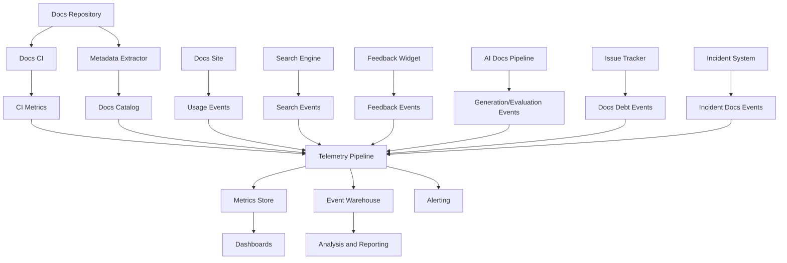
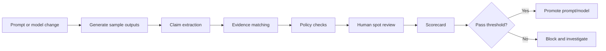
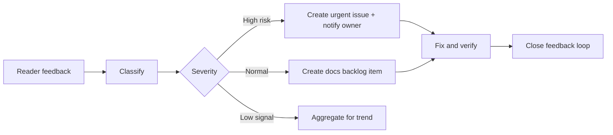
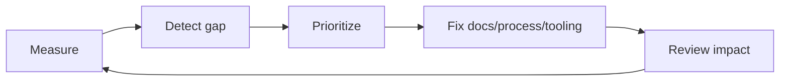

------
title: Learn AI-Driven Documentation and Technical Writing Implementation and Usage - Part 032
description: Documentation quality metrics, observability architecture, SLOs, dashboards, AI evaluation metrics, and continuous improvement system.
series: learn-ai-driven-documentation
seriesTitle: Learn AI-Driven Documentation and Technical Writing Implementation and Usage
order: 32
partTitle: Quality Metrics and Observability
tags:
- ai
- documentation
- technical-writing
- observability
- metrics
- quality
- slo
- docs-as-code
- engineering-productivity
date: 2026-06-30
---

# Part 032 — Quality Metrics and Observability

Documentation quality is often discussed emotionally:

> “The docs are bad.”

That statement is not actionable.

A mature engineering organization asks sharper questions:

- Which docs are stale?
- Which pages fail CI most often?
- Which search queries return no useful results?
- Which runbooks are used during incidents?
- Which documents have no owner?
- Which AI-generated claims lack evidence?
- Which docs create support load?
- Which docs have high traffic but low task success?
- Which teams are blocked by review latency?
- Which release changes shipped without documentation updates?

This part designs a metrics and observability system for AI-driven documentation.

The goal is not to create vanity dashboards. The goal is to close the loop between documentation production, documentation quality, reader outcomes, and operational risk.

---

## 1. Kaufman Framing: What Skill Are We Practicing?

The skill is:

> Designing measurement systems that reveal documentation health, reader success, AI quality, governance risk, and improvement opportunities without creating misleading incentives.

This skill includes:

1. Defining useful metrics.
2. Instrumenting docs pipelines and docs sites.
3. Designing SLOs for documentation.
4. Measuring AI-generated documentation quality.
5. Building dashboards that drive decisions.
6. Avoiding metrics that incentivize bad behavior.

The key mental shift:

> Documentation is an operational surface. It needs observability like any other production system.

---

## 2. Why Documentation Metrics Are Hard

Documentation quality is multi-dimensional.

A document can be:

- grammatically clean but technically wrong;
- technically correct but impossible to find;
- findable but too abstract;
- useful today but stale next month;
- excellent for experts but useless for new engineers;
- good for humans but dangerous as AI retrieval context;
- complete but overloaded with irrelevant detail;
- short and clear but missing edge cases.

Therefore one score cannot fully describe quality.

Use a layered metric model.

```mermaid
flowchart TD
    A[Documentation Health] --> B[Corpus Quality]
    A --> C[Delivery Quality]
    A --> D[Reader Success]
    A --> E[Operational Impact]
    A --> F[AI Quality]
    A --> G[Governance Risk]

    B --> B1[Freshness]
    B --> B2[Ownership]
    B --> B3[Coverage]
    B --> B4[Structure]

    C --> C1[Build Success]
    C --> C2[CI Gate Failure]
    C --> C3[Review Latency]
    C --> C4[Publish Frequency]

    D --> D1[Search Success]
    D --> D2[Task Completion]
    D --> D3[Feedback]
    D --> D4[Navigation]

    E --> E1[Support Deflection]
    E --> E2[Incident Use]
    E --> E3[Onboarding Time]
    E --> E4[Release Readiness]

    F --> F1[Grounding]
    F --> F2[Citation Coverage]
    F --> F3[Hallucination Rate]
    F --> F4[Unsafe Output]

    G --> G1[Missing Owner]
    G --> G2[Missing Evidence]
    G --> G3[Policy Waivers]
    G --> G4[Stale High-Risk Docs]
```



This avoids the false simplicity of “docs score = page views”.

---

## 3. Observability Mental Model

Observability means the ability to understand system behavior from emitted signals.

For documentation, the system includes:

- source repositories;
- docs CI;
- docs site;
- search engine;
- feedback widgets;
- AI generation pipeline;
- review workflow;
- issue tracker;
- support tickets;
- incidents;
- release pipeline;
- developer portal;
- analytics platform.

Use the same three-signal thinking common in software systems:

| Signal | Documentation Example |
|---|---|
| Logs | Page feedback, generation run logs, review events, search queries |
| Metrics | Stale doc count, search zero-result rate, build failure rate |
| Traces | Reader journey from search → page → task completion → feedback |

A docs observability system should answer:

- What happened?
- Where did it happen?
- Who was affected?
- What source/version was involved?
- Was AI involved?
- What control failed or passed?
- What should be improved?

---

## 4. Documentation Golden Signals

Google SRE popularized four golden signals for services: latency, traffic, errors, and saturation.

Adapt them for documentation.

| Service Golden Signal | Documentation Equivalent | Example Metric |
|---|---|---|
| Latency | Time to answer or publish | Search-to-click time, docs PR lead time |
| Traffic | Reader and generator usage | Page views, search queries, AI generation requests |
| Errors | Failed reader outcomes or broken docs | Broken links, failed snippets, negative feedback |
| Saturation | Capacity pressure in docs system | Review backlog, stale docs backlog, CI queue |

This model prevents a common mistake: measuring only traffic.

High traffic can mean high value, but it can also mean confusion.

A page with high traffic and high negative feedback is not successful. It may be a bottleneck.

---

## 5. DORA-Inspired Documentation Metrics

DORA metrics measure software delivery performance using speed and stability dimensions.

Documentation can borrow the same thinking.

| DORA-Like Dimension | Documentation Metric |
|---|---|
| Deployment frequency | Documentation publish frequency |
| Lead time for changes | Time from docs change request to published docs |
| Change failure rate | Percentage of docs changes that cause rollback, correction, incident, or negative feedback spike |
| Failed deployment recovery time | Time to correct bad/stale/misleading documentation |
| Reliability | Percentage of high-risk docs meeting freshness, owner, evidence, and gate requirements |

These metrics are useful because docs are part of delivery.

If code ships quickly but docs lag by two weeks, the product or platform is not truly ready.

---

## 6. Define Documentation SLIs and SLOs

An SLI is a service level indicator: a measurement.

An SLO is a service level objective: a target.

Documentation can have SLOs.

Example SLOs:

| Area | SLI | Example SLO |
|---|---|---|
| Freshness | `% high-risk docs reviewed within cadence` | 95% monthly |
| Ownership | `% docs with valid owner` | 99% |
| Findability | `% searches with useful click or answer` | 85% |
| Reliability | `% docs builds passing main branch` | 99% |
| Technical accuracy | `% tested snippets passing` | 98% |
| Review speed | `p75 docs PR review latency` | < 2 business days |
| AI grounding | `% AI-generated claims with evidence` | 95% for Tier 3+ |
| Safety | `public docs secret leakage incidents` | 0 |

Avoid impossible SLOs like “100% docs accuracy”.

Instead, set measurable controls and rapid correction objectives.

---

## 7. Metrics Taxonomy

### 7.1 Corpus Health Metrics

Corpus health asks whether the documentation set is structurally healthy.

| Metric | Definition | Why It Matters |
|---|---|---|
| Owner coverage | Docs with valid owner / total docs | Accountability |
| Freshness compliance | Docs reviewed within cadence / docs requiring review | Staleness control |
| Metadata completeness | Docs passing frontmatter schema / total docs | Tooling and governance |
| Broken link rate | Broken links / total links | Reader reliability |
| Duplicate content rate | Duplicate or near-duplicate docs / total docs | Confusion and drift |
| Orphan page count | Pages not reachable from nav/search | Findability |
| Deprecated page traffic | Views to deprecated docs / total views | Migration risk |
| High-risk doc compliance | Tier 3/4 docs passing required controls / Tier 3/4 docs | Risk posture |

### 7.2 Delivery Metrics

Delivery metrics measure docs production flow.

| Metric | Definition | Interpretation |
|---|---|---|
| Docs PR lead time | PR opened → merged/published | Workflow speed |
| Review latency | Reviewer requested → first review | Bottleneck detection |
| Change request rate | PRs requiring rework / total PRs | Quality of first draft |
| Gate failure rate | Failed docs CI runs / total runs | Tooling/content health |
| Waiver rate | Waivers / docs changes | Policy friction |
| Publish frequency | Published docs changes per period | Throughput |
| Docs rollback/correction rate | Corrective docs changes / total changes | Stability |

### 7.3 Reader Success Metrics

Reader success asks whether users can complete tasks.

| Metric | Definition |
|---|---|
| Search zero-result rate | Searches returning no results |
| Search reformulation rate | Users searching again quickly after first query |
| Search-to-click rate | Searches producing a click |
| Time to first useful click | Query → selected result |
| Task success feedback | Positive task completion feedback |
| Negative feedback rate | Negative feedback / page views |
| Rage navigation | Rapid repeated back/search/page switches |
| Exit after warning | Users leaving after error/warning docs |

Reader success metrics should be segmented by audience.

A page may work for senior backend engineers and fail for new hires.

### 7.4 Operational Impact Metrics

These metrics connect docs to engineering outcomes.

| Metric | Why It Matters |
|---|---|
| Incident docs usage | Whether runbooks are opened during incidents |
| Post-incident docs action closure | Whether postmortem docs actions are completed |
| Support ticket deflection | Whether docs reduce repeated support questions |
| Onboarding completion time | Whether handbook helps new engineers contribute |
| Release docs readiness | Whether docs are ready before release |
| Migration completion rate | Whether migration docs lead to successful adoption |
| Repeated question count | Whether docs fail to answer common questions |

### 7.5 AI Quality Metrics

AI documentation needs dedicated metrics.

| Metric | Definition |
|---|---|
| Evidence coverage | Claims with evidence / total claims |
| Citation precision | Citations that actually support claims / total citations |
| Unsupported claim rate | Claims without source support / total claims |
| Hallucination rate | False generated claims / evaluated claims |
| Stale source usage | Sources older than allowed freshness threshold / generated outputs |
| Sensitive source misuse | Restricted sources used in disallowed context |
| Unsafe instruction rate | Outputs containing prohibited operational/security instructions |
| Human correction density | Human edits per generated paragraph or claim |
| Review rejection rate | AI drafts rejected / AI drafts reviewed |
| Prompt regression rate | Evaluation failures after prompt/model change |

AI quality should be measured at claim level whenever possible.

Document-level pass/fail hides important problems.

---

## 8. The Documentation Health Score

A single health score can be useful if it is transparent and decomposable.

Avoid hidden magic.

Example:

```text
Doc Health Score =
  0.20 * Ownership Score +
  0.20 * Freshness Score +
  0.15 * Build Quality Score +
  0.15 * Reader Success Score +
  0.15 * Evidence Score +
  0.10 * Searchability Score +
  0.05 * Feedback Response Score
```

Example scoring:

| Component | Measurement |
|---|---|
| Ownership Score | Owner exists and maps to active team |
| Freshness Score | Last reviewed within cadence |
| Build Quality Score | Lint/build/link/snippet gates passing |
| Reader Success Score | Positive feedback and low reformulation |
| Evidence Score | Claims backed by valid sources |
| Searchability Score | Indexed, tagged, reachable, useful title |
| Feedback Response Score | Open feedback issues handled within SLA |

Important:

- Show the components, not only the final score.
- Weight by risk tier.
- Do not compare unrelated document types blindly.
- Do not reward verbosity.

A 70-page guide is not necessarily healthier than a 5-page guide.

---

## 9. Data Model for Docs Observability

A documentation observability system needs consistent events.

Example event schema:

```json
{
  "eventType": "doc_view",
  "timestamp": "2026-06-30T10:15:00+07:00",
  "docId": "runbooks.payment-retry",
  "docVersion": "2026.06.30",
  "path": "/runbooks/payment-retry",
  "audience": "sre",
  "riskTier": 3,
  "lifecycleState": "published",
  "owner": "payments-platform",
  "userRole": "oncall-engineer",
  "source": "search",
  "sessionId": "anon-session-id"
}
```

Other important events:

```text
doc_view
doc_search
doc_search_result_click
doc_feedback_submitted
doc_pr_opened
doc_pr_review_requested
doc_pr_merged
doc_ci_failed
doc_ci_passed
doc_generated_by_ai
doc_ai_claim_evaluated
doc_published
doc_deprecated
doc_staleness_detected
doc_waiver_created
doc_incident_linked
```

Each event should include:

- document id;
- version;
- owner;
- risk tier;
- lifecycle state;
- audience;
- source/referrer;
- AI involvement when applicable.

Without metadata, observability becomes shallow analytics.

---

## 10. Observability Architecture

A practical architecture:



This architecture separates:

- operational monitoring;
- analytical reporting;
- governance evidence;
- reader behavior;
- AI evaluation.

---

## 11. Dashboard Design

Do not build one giant dashboard.

Build dashboards by decision.

### 11.1 Executive Docs Health Dashboard

Audience: engineering leadership.

Questions:

- Are docs improving or degrading?
- Which areas are high-risk?
- Which teams need investment?
- Are release docs ready?

Widgets:

- health score by domain;
- high-risk stale docs;
- docs owner coverage;
- docs PR lead time;
- incident-related docs gaps;
- AI usage by risk tier;
- top recurring feedback themes.

### 11.2 Docs Platform Dashboard

Audience: docs platform team.

Questions:

- Is the docs pipeline healthy?
- Which gates fail most?
- Is search working?
- Are builds reliable?

Widgets:

- build success rate;
- CI failure reasons;
- link-check failures;
- snippet test failures;
- search zero-result rate;
- indexing latency;
- publish latency;
- platform errors.

### 11.3 Team Docs Ownership Dashboard

Audience: service teams.

Questions:

- Which docs do we own?
- Which are stale?
- Which feedback items are open?
- Which docs block onboarding or operations?

Widgets:

- owned docs list;
- stale docs by severity;
- feedback queue;
- open docs PRs;
- docs linked to incidents;
- docs requiring review this month.

### 11.4 AI Docs Quality Dashboard

Audience: AI/docs system owners.

Questions:

- Is generated documentation grounded?
- Are prompts regressing?
- Are unsafe outputs appearing?
- Which sources cause bad generation?

Widgets:

- evidence coverage;
- unsupported claim rate;
- citation precision;
- prompt evaluation pass rate;
- stale source usage;
- unsafe output detections;
- human correction density;
- model/prompt version comparison.

---

## 12. Alerting Strategy

Do not alert on everything.

A documentation page should alert humans only when action is urgent or high impact.

Good alerts:

- Tier 4 doc published without required approval.
- Public docs build includes detected secret.
- High-risk runbook becomes stale during active incident.
- Release candidate lacks required migration docs.
- AI generation pipeline uses restricted source for public output.
- Search outage affects internal docs portal.

Bad alerts:

- Minor typo found.
- Low-risk page has one broken external link.
- Any negative feedback comment.
- Every stale low-risk page.

Use severity levels:

| Severity | Example | Response |
|---|---|---|
| P0 | Secret published publicly | Immediate incident response |
| P1 | High-risk runbook wrong during active incident | Immediate owner action |
| P2 | Tier 3 docs stale beyond cadence | Team-level remediation |
| P3 | Low-risk broken links | Backlog |
| P4 | Style guide suggestions | Batch cleanup |

Alert fatigue applies to documentation too.

---

## 13. AI Evaluation Pipeline

AI-generated docs need continuous evaluation.

Pipeline:



Evaluation dimensions:

| Dimension | Test Question |
|---|---|
| Grounding | Are claims supported by allowed sources? |
| Completeness | Does output include required sections? |
| Accuracy | Are technical claims correct? |
| Safety | Does output expose secrets or unsafe instructions? |
| Style | Does output follow style guide? |
| Structure | Does output match doc type schema? |
| Freshness | Does output prefer current sources? |
| Uncertainty | Does output flag unresolved assumptions? |

Evaluation dataset should include:

- normal examples;
- stale source examples;
- conflicting source examples;
- prompt injection examples;
- restricted source examples;
- missing evidence examples;
- ambiguous source examples;
- high-risk operational examples.

A prompt that works only on clean examples is not production-ready.

---

## 14. Measuring Citation Quality

Citation count is not citation quality.

A bad AI output can cite many irrelevant sources.

Measure citation quality with:

| Metric | Meaning |
|---|---|
| Citation coverage | Percentage of claims with citation |
| Citation precision | Percentage of citations that support the claim |
| Citation recall | Percentage of required sources cited |
| Citation freshness | Percentage of citations within freshness threshold |
| Citation authority | Percentage of citations from approved authority levels |
| Citation locality | Whether citation points to exact section/line, not whole repo |

Example claim evaluation:

```yaml
claimEvaluation:
  claimId: C-014
  claim: "The payment retry worker uses exponential backoff with max 5 attempts."
  citedSources:
    - repo://payments/retry/RetryPolicy.java#L42-L61
    - docs://payments/retry-guide
  result:
    supported: true
    citationPrecision: high
    authorityLevel: 2
    freshness: current
    reviewer: payments-tech-owner
```

Claim-level evaluation is more expensive, but necessary for high-risk docs.

---

## 15. Search Observability

Search is often the real interface to documentation.

Metrics:

| Metric | Meaning |
|---|---|
| Zero-result rate | Search found nothing |
| No-click rate | Search results were not useful enough to click |
| Reformulation rate | User searched again quickly |
| Query abandonment | User gave up after search |
| Top failed queries | Common unmet needs |
| Result position clicked | Whether good result ranks high |
| Deprecated result click rate | Search sends users to old docs |
| Internal-only result exposure | Search leaks restricted docs to wrong audience |

Search failure analysis example:

```text
Query: "rotate payment token"
Results: no click
Follow-up query: "payment credential refresh"
Clicked: /runbooks/payment-credential-rotation
Finding: terminology mismatch
Action: add synonyms and update title/metadata
```

AI search/assistant systems should emit similar events:

```json
{
  "eventType": "ai_docs_answer",
  "query": "How do I rotate the payment token?",
  "retrievedSources": [
    "docs://runbooks/payment-credential-rotation",
    "repo://payments/config/secrets.md"
  ],
  "blockedSources": [
    "docs://security/restricted/token-internals"
  ],
  "answerGenerated": true,
  "citationsProvided": 3,
  "userFeedback": "positive"
}
```

---

## 16. Feedback System

Feedback must be structured enough to act on.

Weak feedback widget:

> “Was this helpful? Yes/No.”

Better feedback categories:

- wrong information;
- missing step;
- unclear explanation;
- broken link;
- code sample failed;
- screenshot outdated;
- search result irrelevant;
- access denied;
- too much detail;
- not enough detail;
- AI answer not grounded.

Feedback should create actionable work items.



Close the loop when possible:

- notify the reporter;
- link the fix PR;
- record time to resolution;
- update metrics.

---

## 17. Documentation Debt

Documentation debt is accumulated mismatch between what the documentation says and what the system/reader needs.

Types:

| Debt Type | Example |
|---|---|
| Staleness debt | Docs describe removed feature |
| Coverage debt | New API has no guide |
| Findability debt | Correct page exists but cannot be found |
| Consistency debt | Same concept has three names |
| Evidence debt | Claims have no source |
| Ownership debt | No team owns the page |
| Structure debt | Docs mix tutorial, reference, and policy |
| Automation debt | Snippets are manually maintained |
| AI debt | Generated docs indexed without evidence metadata |

Track debt explicitly.

```yaml
docDebtItem:
  id: DOC-DEBT-2026-1021
  type: staleness
  severity: high
  document: docs://runbooks/payment-retry
  owner: payments-platform
  detectedBy: ci-staleness-check
  detectedAt: 2026-06-30
  dueDate: 2026-07-07
  linkedChange: repo://payments/retry/policy-change
```

Do not let documentation debt become invisible backlog sludge.

---

## 18. Release Documentation Readiness

A release should not be considered ready if required documentation is missing.

Define release docs checklist:

| Release Type | Required Docs |
|---|---|
| New API | API reference, quickstart, auth/errors, examples, migration if replacing old API |
| Breaking change | Migration guide, deprecation notice, compatibility matrix, rollback notes |
| Operational change | Runbook update, alert docs, ownership update |
| Security change | Security advisory, admin guide, configuration notes |
| Platform change | Onboarding update, architecture note, troubleshooting |

Readiness metric:

```text
Release Docs Readiness = required docs completed / required docs identified
```

Better:

```text
Weighted Readiness = sum(completed_doc_weight) / sum(required_doc_weight)
```

High-risk docs get higher weight.

---

## 19. Onboarding Metrics

Onboarding docs are successful when new engineers become effective safely.

Useful metrics:

| Metric | Meaning |
|---|---|
| Time to first local setup | Setup docs effectiveness |
| Time to first safe PR | Contribution readiness |
| Onboarding blocker count | Missing or unclear docs |
| Repeated mentor questions | Handbook gaps |
| New hire search zero-result queries | Missing terminology or content |
| Setup failure rate by step | Fragile instructions |
| First incident shadow readiness | Operational understanding |

Avoid measuring only completion of reading.

Reading is not the goal. Safe contribution is the goal.

---

## 20. Runbook Metrics

Runbooks need operational metrics.

| Metric | Why It Matters |
|---|---|
| Runbook opened during incident | Usage evidence |
| Incident step success/failure | Procedure quality |
| Time from alert to relevant runbook | Findability under stress |
| Runbook correction after incident | Learning loop |
| Untested runbook count | Operational risk |
| Runbooks without owner | Accountability gap |
| Runbooks stale after service change | Drift risk |

Runbook observability can integrate with incident tools.

Example:

```json
{
  "eventType": "runbook_used_in_incident",
  "incidentId": "INC-2026-417",
  "runbookId": "runbooks.payment-retry",
  "openedAt": "2026-06-30T02:14:00+07:00",
  "openedByRole": "incident-commander",
  "stepFeedback": [
    {"step": 3, "result": "unclear"},
    {"step": 4, "result": "worked"}
  ]
}
```

This gives concrete improvement data after incidents.

---

## 21. Alert Threshold Examples

Example thresholds:

```yaml
alerts:
  publicSecretLeak:
    severity: P0
    condition: secret_scan_public_docs == failed
    notify:
      - security-oncall
      - docs-platform-oncall

  tier4MissingApproval:
    severity: P1
    condition: riskTier == 4 and published == true and requiredApprovalsMissing > 0
    notify:
      - compliance-owner
      - docs-owner

  highRiskStaleness:
    severity: P2
    condition: riskTier >= 3 and daysPastReviewCadence > 14
    notify:
      - document-owner

  searchZeroResultSpike:
    severity: P2
    condition: zeroResultRate > baseline * 1.5 for 2 hours
    notify:
      - docs-platform

  aiUnsupportedClaimSpike:
    severity: P1
    condition: unsupportedClaimRate > 0.05 for tier3plus
    notify:
      - ai-system-owner
      - docs-governance-owner
```

Thresholds should be tuned against real baseline.

---

## 22. SQL-Like Metric Examples

Owner coverage:

```sql
SELECT
  COUNT(*) FILTER (WHERE owner IS NOT NULL AND owner_active = true)::float / COUNT(*) AS owner_coverage
FROM docs_catalog
WHERE lifecycle_state = 'published';
```

Stale high-risk docs:

```sql
SELECT doc_id, title, owner, risk_tier, last_reviewed_at, review_cadence_days
FROM docs_catalog
WHERE risk_tier >= 3
  AND lifecycle_state = 'published'
  AND last_reviewed_at < CURRENT_DATE - review_cadence_days;
```

Search zero-result rate:

```sql
SELECT
  date_trunc('day', timestamp) AS day,
  COUNT(*) FILTER (WHERE result_count = 0)::float / COUNT(*) AS zero_result_rate
FROM doc_search_events
GROUP BY 1
ORDER BY 1;
```

AI unsupported claim rate:

```sql
SELECT
  prompt_version,
  COUNT(*) FILTER (WHERE supported = false)::float / COUNT(*) AS unsupported_claim_rate
FROM ai_claim_evaluations
WHERE risk_tier >= 3
GROUP BY prompt_version;
```

Docs PR lead time:

```sql
SELECT
  percentile_cont(0.5) WITHIN GROUP (ORDER BY merged_at - opened_at) AS p50_lead_time,
  percentile_cont(0.75) WITHIN GROUP (ORDER BY merged_at - opened_at) AS p75_lead_time,
  percentile_cont(0.95) WITHIN GROUP (ORDER BY merged_at - opened_at) AS p95_lead_time
FROM docs_pull_requests
WHERE merged_at IS NOT NULL;
```

---

## 23. Avoiding Bad Metrics

Metrics can damage behavior.

Bad metric examples:

| Metric | Failure Mode |
|---|---|
| Number of pages written | Rewards volume, not usefulness |
| Word count | Rewards verbosity |
| Page views only | Confuses traffic with success |
| Number of AI drafts generated | Rewards generation, not correctness |
| Lint errors only | Over-focuses style, ignores truth |
| Review comments count | May punish careful review |
| Time on page | Ambiguous: engagement or confusion? |

Better metrics combine signals.

Example:

```text
High traffic + positive feedback + low search reformulation = likely useful.
High traffic + negative feedback + repeated search = likely confusing.
Low traffic + high risk + stale = hidden risk.
Low traffic + no inbound links + important owner = findability problem.
```

Metrics need interpretation.

---

## 24. Improvement Loop

Observability should drive improvement.



For example:

1. Search zero-result rate spikes for “token rotation”.
2. Analysis shows terminology mismatch.
3. Update title, aliases, glossary, and redirect.
4. Measure query success after change.
5. Add style guide rule for credential/token terminology.

This is the difference between dashboard theater and operational learning.

---

## 25. Maturity Model

| Level | State |
|---:|---|
| 0 | No metrics. Docs quality assessed by complaints. |
| 1 | Basic analytics: page views, broken links, build status. |
| 2 | Ownership, freshness, CI gates, feedback tracked. |
| 3 | Reader success, search observability, risk-tier dashboards. |
| 4 | AI quality metrics, evidence coverage, release readiness, incident linkage. |
| 5 | Continuous improvement system with SLOs, automated routing, and governance reporting. |

Most teams should aim for Level 3 before attempting sophisticated AI evaluation.

If ownership and metadata are broken, AI metrics will be noisy.

---

## 26. Practice: Build a Docs Metrics Plan

Use this 2-hour drill.

### Step 1 — Pick a Domain

Choose one:

- runbooks;
- API docs;
- onboarding handbook;
- product docs;
- regulated docs.

### Step 2 — Define 10 Questions

Examples:

- Can readers find the right doc?
- Are docs reviewed on cadence?
- Do AI-generated claims have evidence?
- Which docs block releases?

### Step 3 — Choose Metrics

Map each question to one metric.

### Step 4 — Define Events

Write the event schema needed.

### Step 5 — Define Dashboard

Create one dashboard for one audience.

### Step 6 — Define Alerts

Pick only alerts that require timely action.

### Step 7 — Define Improvement Loop

For each alert or metric, define who acts and what action is expected.

---

## 27. Mental Checklist

Before accepting a docs observability system, ask:

- Does it measure reader success, not just page views?
- Does it measure freshness and ownership?
- Does it capture CI/build/link/snippet failures?
- Does it identify high-risk stale docs?
- Does it track AI grounding and unsupported claims?
- Does it separate public/internal/restricted docs?
- Does it connect docs to releases and incidents?
- Does it segment by audience?
- Are dashboards designed by decision type?
- Are alerts actionable?
- Are metrics resistant to gaming?
- Is there an improvement loop?

Good docs observability helps teams decide what to fix next.

---

## 28. Summary

Documentation quality must be observable.

The key ideas:

- Documentation quality is multi-dimensional.
- Use layered metrics: corpus, delivery, reader success, operational impact, AI quality, governance risk.
- Adapt golden signals to docs: latency, traffic, errors, saturation.
- Borrow DORA thinking for documentation delivery speed and stability.
- Define SLIs and SLOs for freshness, ownership, findability, reliability, and AI grounding.
- Instrument docs repositories, CI, site usage, search, feedback, AI generation, incidents, and releases.
- Measure AI-generated documentation at claim level.
- Treat search observability as critical.
- Use alerts sparingly and actionably.
- Avoid vanity metrics.
- Turn metrics into an improvement loop.

The next part moves from governance and observability into advanced automation: agentic documentation workflows.

---

## References

- DORA metrics: https://dora.dev/guides/dora-metrics/
- Google SRE — Monitoring Distributed Systems: https://sre.google/sre-book/monitoring-distributed-systems/
- NIST AI Risk Management Framework: https://www.nist.gov/itl/ai-risk-management-framework
- ISO/IEC 42001:2023 AI management systems: https://www.iso.org/standard/42001
- Write the Docs — Docs as Code: https://www.writethedocs.org/guide/docs-as-code/
