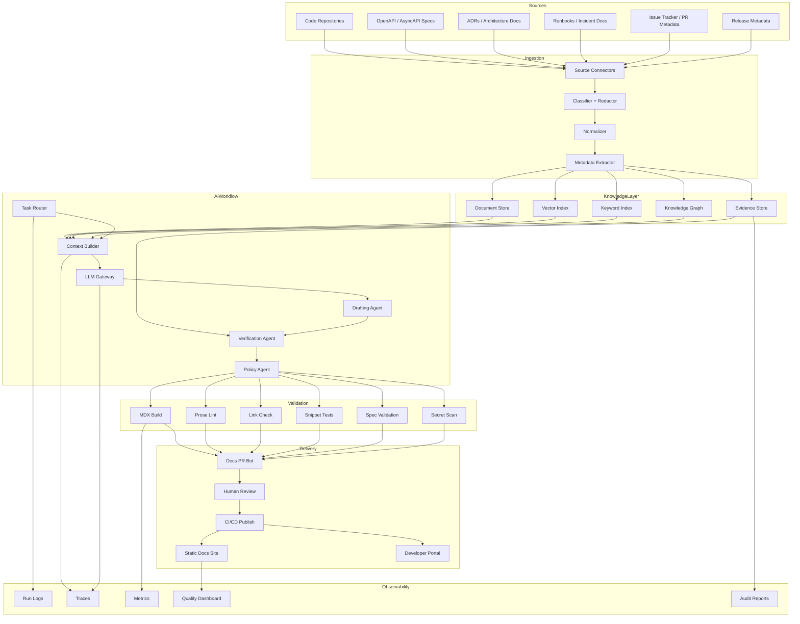
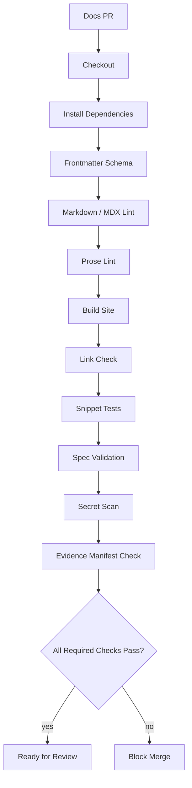
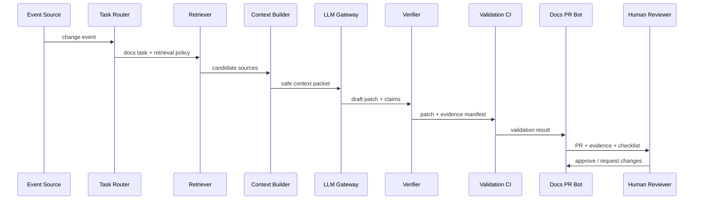
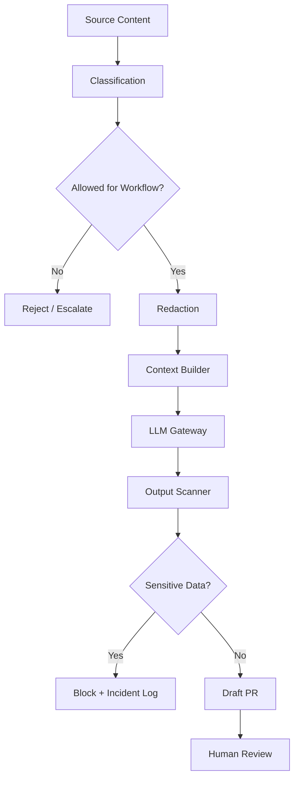
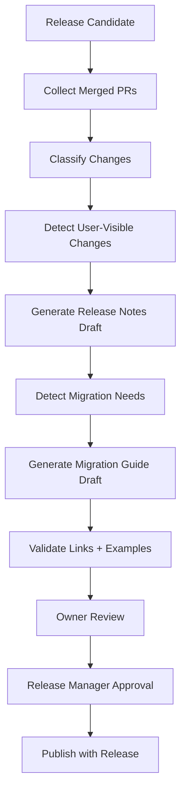
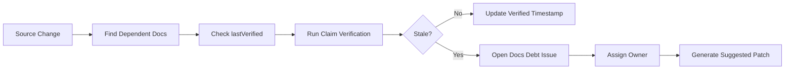

------
title: Learn AI-Driven Documentation and Technical Writing Implementation and Usage - Part 034
description: Enterprise reference implementation for AI-driven documentation, including architecture, repository layout, pipelines, schemas, CI, security controls, rollout, and operational model.
series: learn-ai-driven-documentation
seriesTitle: Learn AI-Driven Documentation and Technical Writing Implementation and Usage
order: 34
partTitle: Enterprise Reference Implementation
tags:
- ai
- documentation
- technical-writing
- reference-architecture
- enterprise
- docs-as-code
- ci-cd
- rag
- governance
- platform-engineering
date: 2026-06-30
---

# Part 034 — Enterprise Reference Implementation

This part converts the previous 33 parts into an enterprise reference implementation.

The goal is not to prescribe one vendor, one static site generator, one model provider, or one vector database.

The goal is to define a production-grade architecture that a serious engineering organization can adapt.

A mature AI-driven documentation platform should answer these questions:

- Where does documentation live?
- Which artifacts are source of truth?
- How are docs generated, reviewed, validated, published, and rolled back?
- How does AI retrieve context safely?
- How are claims tied to evidence?
- How are secrets and confidential data protected?
- How do engineers see documentation impact from code changes?
- How are stale docs detected?
- How are docs quality and AI quality measured?
- How is autonomy limited?
- How does the system fail safely?

This part is written as a reference blueprint.

Treat it like an internal engineering handbook section for building the platform.

---

## 1. System Mission

The platform mission:

> Provide trustworthy, versioned, evidence-backed, reviewable, and searchable documentation using AI-assisted workflows while preserving human accountability and source-of-truth integrity.

This mission has five hard requirements:

1. **Truthfulness** — docs must be grounded in authoritative sources.
2. **Reviewability** — every generated change must be inspectable.
3. **Safety** — sensitive data must not leak into prompts, logs, drafts, or public docs.
4. **Maintainability** — docs must follow repository, style, and lifecycle conventions.
5. **Operability** — the platform must be observable, debuggable, and reversible.

The platform is not successful because it generates many pages.

It is successful when engineers trust it enough to use it and strict enough reviewers can audit it.

---

## 2. Scope and Non-Goals

### 2.1 In Scope

The reference implementation supports:

- internal engineering handbook,
- service documentation,
- architecture docs,
- ADRs,
- runbooks,
- onboarding docs,
- API documentation,
- event documentation,
- release notes,
- migration guides,
- AI-assisted documentation PRs,
- quality gates,
- documentation search,
- evidence-backed generation,
- docs quality metrics.

### 2.2 Non-Goals

The first production version should not support:

- autonomous public publishing without review,
- uncontrolled access to all repositories,
- generation from unclassified customer data,
- compliance claims without approval workflow,
- replacing technical reviewers,
- treating generated docs as authoritative source truth,
- bypassing CI because “AI generated it.”

Non-goals are important because they prevent scope creep.

---

## 3. Reference Architecture



This architecture has one key property:

> AI generation is surrounded by classification, retrieval policy, verification, deterministic validation, human review, and observability.

The model is not the platform.

The platform is the system around the model.

---

## 4. Component Responsibilities

### 4.1 Source Connectors

Source connectors fetch input artifacts.

Examples:

- Git repositories,
- pull request metadata,
- issue tracker items,
- release metadata,
- OpenAPI specs,
- AsyncAPI specs,
- ADRs,
- runbooks,
- postmortem templates,
- service catalog entries,
- ownership files.

Connector rules:

- use least privilege,
- preserve source identity,
- capture commit hash or version,
- classify source sensitivity,
- avoid importing secrets,
- mark generated artifacts,
- store retrieval timestamp.

### 4.2 Classifier and Redactor

Before content enters AI context, classify it.

Classification levels:

| Level | Meaning | AI Usage |
|---|---|---|
| public | safe for public docs | allowed in public generation |
| internal | company internal | internal docs only |
| confidential | sensitive business/security/customer info | restricted; redaction required |
| regulated | audit/compliance controlled | special workflow and approval |
| secret | credentials or forbidden data | never send to model; block |

Redaction must happen before prompt assembly and before logging.

Do not rely on the model to ignore secrets.

### 4.3 Normalizer

The normalizer converts diverse sources into a common representation.

Example normalized document:

```yaml
id: doc-src-1842
source_type: openapi
path: specs/public-api.yaml
repository: commerce-api
branch: main
commit: 5fdc1a...
version: 2026.06
classification: public
owner: team-commerce-platform
content_hash: sha256:...
trust_level: high
is_generated: false
last_modified: 2026-06-29T10:20:00+07:00
links:
  - type: owns_endpoint
    target: endpoint:GET:/orders/{id}
  - type: documented_by
    target: docs/api/orders.md
```

Normalization makes indexing, retrieval, and auditing possible.

### 4.4 Metadata Extractor

Metadata is not decoration. It is how the platform enforces boundaries.

Important metadata:

- owner,
- source type,
- version,
- branch,
- commit hash,
- classification,
- doc type,
- lifecycle state,
- generated/manual flag,
- freshness timestamp,
- related service,
- related API/event/ADR,
- risk tier,
- review requirements.

A retrieval system without metadata will eventually retrieve the wrong thing.

### 4.5 Knowledge Layer

Use multiple retrieval structures:

| Store | Purpose |
|---|---|
| Document store | Raw normalized content and source snapshots |
| Keyword index | Exact symbol, endpoint, config key, error code search |
| Vector index | Semantic retrieval |
| Knowledge graph | Relationships between services, docs, APIs, events, owners, ADRs |
| Evidence store | Claim-to-source traceability and audit manifests |

Do not replace keyword search with vector search.

Documentation retrieval needs exact names:

- endpoint paths,
- class names,
- config keys,
- event names,
- error codes,
- table names,
- feature flags.

Hybrid retrieval is the default.

### 4.6 Task Router

The task router decides which workflow to run.

Examples:

```yaml
input_event: pull_request_updated
conditions:
  - changed_files include specs/openapi/**
workflow: api_docs_review
risk_tier: medium
```

```yaml
input_event: incident_closed
conditions:
  - severity in [sev1, sev2]
workflow: incident_docs_postmortem_draft
risk_tier: high
```

```yaml
input_event: release_candidate_created
workflow: release_notes_generation
risk_tier: medium
```

The router should be deterministic where possible.

Use LLM judgement only when deterministic rules are insufficient.

### 4.7 Context Builder

The context builder assembles safe, task-specific context.

Inputs:

- task definition,
- retrieval query,
- candidate sources,
- trust hierarchy,
- style guide excerpt,
- output schema,
- policy rules,
- token budget.

Output:

```yaml
context_packet_id: ctx-2026-06-30-1842
workflow: api_docs_review
allowed_sources:
  - high_trust_specs
  - code_tests
  - approved_adrs
excluded_sources:
  - generated_docs_without_evidence
  - confidential_incident_notes
  - customer_ticket_raw_text
output_schema: docs_patch_with_evidence_manifest
```

The context builder is one of the most important components in the platform.

Bad context creates bad output even with a strong model.

### 4.8 LLM Gateway

The LLM gateway provides a controlled interface to model providers.

Responsibilities:

- prompt versioning,
- model routing,
- token budget enforcement,
- request/response logging with redaction,
- retry policy,
- timeout policy,
- structured output validation,
- provider abstraction,
- safety settings,
- cost tracking,
- trace correlation.

Do not let every workflow call a model directly.

Centralize model access so governance and observability are consistent.

### 4.9 Drafting Agent

The drafting agent creates reviewable patches.

Rules:

- produce unified diff or explicit file output,
- include claim-evidence table,
- preserve doc type,
- avoid broad rewrites,
- flag assumptions,
- do not invent source facts,
- do not create unsupported compliance/security claims.

### 4.10 Verification Agent

The verification agent checks claims against evidence.

It should produce:

```yaml
claims:
  - claim: The endpoint now returns HTTP 409 for duplicate order IDs.
    evidence:
      - specs/public-api.yaml#/paths/~1orders/post/responses/409
      - tests/OrderConflictTest.java:41-88
    status: supported
  - claim: This avoids all duplicate orders.
    evidence: []
    status: unsupported
    recommended_action: remove
```

Verification should be strict.

A good verifier is allowed to reject a useful-sounding draft.

### 4.11 Policy Agent

The policy agent applies documentation governance rules.

Examples:

- public docs cannot reference internal service names,
- compliance docs require approval metadata,
- security docs cannot say “guaranteed secure,”
- generated docs must disclose AI assistance internally,
- regulated docs require effective date and approver,
- known limitations must not be removed without evidence.

Policy should be implemented as code where possible.

### 4.12 Validation Layer

Validation is deterministic.

Minimum checks:

- MDX/Markdown build,
- frontmatter schema validation,
- prose linting,
- broken links,
- anchors,
- snippet compilation/execution where possible,
- OpenAPI/AsyncAPI validation,
- diagram rendering,
- secret scanning,
- classification boundary checks,
- generated docs diff check,
- spelling/terminology checks.

The validation layer should fail closed.

If validation cannot run, the PR should not be marked safe.

---

## 5. Repository Structure

A reference docs-enabled monorepo:

```text
repo/
  docs/
    handbook/
      index.mdx
      engineering-principles.mdx
    services/
      order-service/
        overview.mdx
        runbook.mdx
        local-development.mdx
        operations.mdx
    api/
      orders/
        overview.mdx
        examples.mdx
        errors.mdx
    events/
      order-created.mdx
      order-cancelled.mdx
    adr/
      2026-06-15-order-idempotency.mdx
    releases/
      2026-06.mdx
    migration-guides/
      2026-06-order-api-v2.mdx
    _partials/
      auth-warning.mdx
      support-contact.mdx
    _schemas/
      frontmatter.schema.json
      evidence-manifest.schema.json
    _generated/
      openapi/
      asyncapi/
    _quality/
      docs-health-report.json
  specs/
    openapi/
      public-api.yaml
    asyncapi/
      events.yaml
  .github/
    workflows/
      docs-ci.yml
      docs-agent.yml
    CODEOWNERS
  .vale.ini
  styles/
    EngineeringStyle/
      Terms.yml
      Claims.yml
      Warnings.yml
  package.json
  mkdocs.yml or docusaurus.config.js
```

For polyrepo organizations, keep service-local docs close to service code and publish through a central portal.

A hybrid model is often best:

```text
service repo owns service docs
central docs repo owns handbook, policies, platform docs, public docs composition
portal aggregates everything
```

---

## 6. Frontmatter Contract

Every human-authored page should have structured metadata.

Example:

```yaml
title: Configure Token TTL
description: How to configure token expiration behavior for the authentication service.
docType: how-to
audience:
  - backend-engineer
  - platform-engineer
owner: team-auth-platform
reviewers:
  - team-auth-platform
lifecycle: active
riskTier: medium
classification: internal
sourceOfTruth:
  - src/main/java/com/example/auth/TokenConfig.java
  - docs/adr/2026-05-token-ttl-default.mdx
relatedServices:
  - auth-service
relatedApis: []
relatedEvents: []
lastVerified: 2026-06-30
generated: false
aiAssisted: true
```

This metadata supports:

- ownership routing,
- stale detection,
- retrieval filtering,
- AI context building,
- publication policy,
- docs health scoring.

---

## 7. Evidence Manifest Schema

Every AI-generated PR should include an evidence manifest.

Location:

```text
.docs-agent/runs/<run-id>/evidence.yaml
```

Schema:

```yaml
runId: string
workflow: string
inputEvent:
  type: string
  id: string
prompt:
  name: string
  version: string
model:
  provider: string
  name: string
  configurationRef: string
sources:
  - id: string
    type: code | spec | adr | test | issue | release | runbook | incident | existing_doc
    path: string
    repository: string
    commit: string
    lines: string
    classification: public | internal | confidential | regulated
    trustLevel: high | medium | low
    contentHash: string
claims:
  - id: string
    text: string
    evidence: string[]
    status: supported | unsupported | ambiguous
    reviewerAction: keep | remove | review
validation:
  mdxBuild: passed | failed | skipped
  proseLint: passed | failed | skipped
  linkCheck: passed | failed | skipped
  secretScan: passed | failed | skipped
  snippetTest: passed | failed | skipped
risk:
  tier: low | medium | high | regulated
  reasons: string[]
review:
  requiredReviewers: string[]
  approvalPolicy: string
```

The manifest is stored with the PR artifact so review is reproducible.

---

## 8. Pipeline 1 — Documentation CI

Documentation CI runs for every docs PR.



Example CI gate policy:

| Check | Low Risk | Medium Risk | High Risk |
|---|---|---|---|
| build | required | required | required |
| prose lint | warn | required | required |
| link check | required | required | required |
| secret scan | required | required | required |
| evidence manifest | optional | required for AI docs | required |
| owner review | optional | required | required |
| security/compliance review | optional | conditional | required |

---

## 9. Example GitHub Actions Workflow

```yaml
name: docs-ci

on:
  pull_request:
    paths:
      - "docs/**"
      - "specs/**"
      - ".vale.ini"
      - "styles/**"

jobs:
  validate-docs:
    runs-on: ubuntu-latest
    steps:
      - uses: actions/checkout@v4

      - name: Install dependencies
        run: npm ci

      - name: Validate frontmatter
        run: npm run docs:validate-frontmatter

      - name: Lint Markdown
        run: npm run docs:lint-markdown

      - name: Lint prose
        run: npm run docs:lint-prose

      - name: Build docs
        run: npm run docs:build

      - name: Check links
        run: npm run docs:check-links

      - name: Validate specs
        run: npm run specs:validate

      - name: Scan secrets
        run: npm run security:scan-docs

      - name: Validate evidence manifest
        if: contains(github.event.pull_request.labels.*.name, 'ai-assisted')
        run: npm run docs:validate-evidence
```

The exact tools can change.

The invariant is that documentation has gates before merge.

---

## 10. Pipeline 2 — AI Docs Agent Workflow

Trigger events:

- pull request opened,
- OpenAPI diff detected,
- AsyncAPI diff detected,
- release candidate created,
- incident closed,
- stale docs threshold crossed.

Workflow:



This is a proposed-change workflow, not a direct-publish workflow.

---

## 11. Agent Service API

Expose a small internal API.

### 11.1 Start Workflow

```http
POST /docs-agent/workflows
Content-Type: application/json
```

Request:

```json
{
  "workflow": "pr-doc-impact",
  "inputEvent": {
    "type": "pull_request",
    "repository": "commerce-api",
    "id": "1842",
    "baseBranch": "main",
    "headSha": "abc123"
  },
  "mode": "comment-only"
}
```

Response:

```json
{
  "runId": "docs-agent-2026-06-30-1842",
  "status": "accepted"
}
```

### 11.2 Get Workflow Result

```http
GET /docs-agent/workflows/{runId}
```

Response:

```json
{
  "runId": "docs-agent-2026-06-30-1842",
  "status": "review_requested",
  "riskTier": "medium",
  "outputs": {
    "pullRequestUrl": "...",
    "evidenceManifestPath": ".docs-agent/runs/docs-agent-2026-06-30-1842/evidence.yaml"
  },
  "validation": {
    "build": "passed",
    "linkCheck": "passed",
    "secretScan": "passed"
  }
}
```

Keep the API boring.

Agent systems fail less when the orchestration layer is simple.

---

## 12. Prompt Registry

Do not store production prompts in random tickets or chat history.

Use a prompt registry:

```text
prompts/
  docs-impact-detector/
    v1.md
    v2.md
    eval.yaml
  docs-drafter/
    v1.md
    v2.md
    eval.yaml
  evidence-verifier/
    v1.md
    eval.yaml
  policy-reviewer/
    v1.md
    eval.yaml
```

Each prompt version should define:

- purpose,
- allowed inputs,
- forbidden behavior,
- output schema,
- examples,
- evaluation cases,
- owner,
- change log.

Prompt changes should go through PR review.

A prompt is production behavior.

Treat it like code.

---

## 13. Quality Gates for AI Output

AI output must pass both semantic and mechanical gates.

### 13.1 Mechanical Gates

- valid MDX,
- build passes,
- links valid,
- no secrets,
- frontmatter valid,
- snippets compile,
- specs validate,
- diagrams render.

### 13.2 Semantic Gates

- claims have evidence,
- doc type is correct,
- audience is correct,
- unsupported claims removed,
- risk tier assigned,
- public/internal boundary respected,
- owner review requested,
- limitations preserved.

Mechanical gates can be automated heavily.

Semantic gates require a mixture of AI verification and human review.

---

## 14. Security Architecture



Security controls:

1. Dedicated service account for docs agent.
2. Read scopes limited by repository/team.
3. Write scopes limited to branches.
4. No merge permission.
5. No production publish permission.
6. Prompt logs redacted.
7. Tool calls audited.
8. Secret scanning before PR creation.
9. Public docs require classification check.
10. Incident and customer data require special workflow.
11. Generated content marked.
12. High-risk docs require owner approval.

Security posture should assume the model can be confused.

The system must limit what confusion can damage.

---

## 15. Data Retention and Logging

Log enough to debug and audit.

Do not log sensitive content unnecessarily.

Recommended logging:

| Data | Retain? | Notes |
|---|---|---|
| run ID | yes | safe |
| workflow name | yes | safe |
| prompt version | yes | safe |
| model name/config ref | yes | safe |
| source IDs | yes | safe if no sensitive content |
| source excerpts | conditional | redact/classify |
| tool calls | yes | redact arguments |
| generated patch | yes | same classification as target docs |
| evidence manifest | yes | required for audit |
| reviewer outcome | yes | useful for evaluation |
| full raw prompt | conditional | often sensitive; retain with strict controls |

Logging must serve both reliability and privacy.

---

## 16. Observability Model

Use traces, metrics, and logs.

### 16.1 Trace Spans

A single workflow run should have spans like:

```text
docs_agent.run
  router.resolve_task
  retrieval.keyword_search
  retrieval.vector_search
  retrieval.graph_expand
  context.build
  llm.generate_patch
  verifier.claim_check
  validation.mdx_build
  validation.secret_scan
  pr.create
```

### 16.2 Metrics

Track:

- workflow runs by type,
- success/failure rate,
- average latency,
- token cost,
- retrieval hit rate,
- unsupported claim rate,
- validation failure rate,
- PR acceptance rate,
- reviewer correction rate,
- stale docs detected,
- docs health score,
- security block count.

### 16.3 Logs

Logs should answer:

- why did the agent choose this doc?
- which sources were used?
- which claims were rejected?
- why did validation fail?
- who approved the PR?
- was any sensitive data blocked?

If you cannot answer those questions, the system is not production-ready.

---

## 17. Search and Developer Portal Integration

The documentation platform should expose two search experiences.

### 17.1 Human Search

Human search should support:

- exact search,
- semantic search,
- filters by service/team/doc type/version,
- stale/verified indicators,
- ownership visibility,
- related API/event/ADR/runbook links.

### 17.2 AI Search

AI retrieval should support:

- branch/version filtering,
- classification filtering,
- trust hierarchy,
- source priority,
- citation anchoring,
- generated-content avoidance,
- freshness ranking,
- graph expansion.

Human search optimizes task success.

AI search optimizes evidence-grounded generation.

They share indexes but should not share all ranking policies.

---

## 18. Release Documentation Flow



Release docs require special handling because they create external expectations.

Rules:

- breaking changes require explicit section,
- migration steps require evidence,
- known limitations must be listed,
- security fixes must follow disclosure policy,
- release manager approval required,
- version metadata required.

---

## 19. Staleness Detection Flow

Staleness is not only “old page.”

A page is stale when its claims no longer match source truth.

Signals:

- source files changed after `lastVerified`,
- linked API spec changed,
- owner changed,
- service deprecated,
- page has failing snippets,
- search users bounce quickly,
- incidents reference obsolete runbook steps,
- support tickets mention contradiction,
- AI verifier finds unsupported claims.

Staleness workflow:



Docs debt should be tracked like engineering debt.

---

## 20. Rollout Plan

### Phase 0 — Baseline

Deliverables:

- docs inventory,
- ownership map,
- frontmatter schema,
- style guide,
- basic docs CI,
- documentation site build.

Success criteria:

- every active doc has owner,
- docs build is reproducible,
- broken link check exists,
- style linting baseline exists.

### Phase 1 — AI-Assisted Drafting

Deliverables:

- prompt registry,
- context packet format,
- AI draft workflow,
- manual evidence manifest,
- reviewer checklist.

Success criteria:

- engineers can generate drafts,
- reviewers see evidence,
- generated docs are not published without review.

### Phase 2 — Docs Impact Detection

Deliverables:

- PR docs-impact bot,
- candidate docs mapping,
- docs-required labels,
- comment-only mode.

Success criteria:

- useful PR comments,
- acceptable false-positive rate,
- improved docs update awareness.

### Phase 3 — PR Generation

Deliverables:

- branch-only write access,
- patch generation,
- validation integration,
- evidence manifest validation,
- human review routing.

Success criteria:

- AI-generated docs PRs accepted with low correction rate,
- no direct publish,
- no sensitive data incidents.

### Phase 4 — Enterprise Scale

Deliverables:

- centralized knowledge layer,
- hybrid retrieval,
- graph relationships,
- dashboards,
- policy-as-code,
- security review,
- maturity reporting.

Success criteria:

- measurable docs health improvement,
- lower onboarding friction,
- fewer stale docs,
- faster release documentation,
- stable review trust.

---

## 21. Team Operating Model

### 21.1 Platform Team

Owns:

- docs platform,
- CI templates,
- search/indexing,
- AI workflow runtime,
- prompt registry infrastructure,
- observability,
- security integration.

### 21.2 Documentation Engineering

Owns:

- content architecture,
- style guide,
- quality gates,
- taxonomy,
- templates,
- editorial governance,
- docs metrics.

### 21.3 Service Teams

Own:

- service docs truth,
- runbooks,
- API/event docs accuracy,
- onboarding docs for their domain,
- review of AI-generated changes.

### 21.4 Security and Compliance

Own:

- data classification,
- sensitive content policy,
- LLM risk review,
- audit requirements,
- regulated docs approval.

### 21.5 Developer Experience

Owns:

- developer portal integration,
- search UX,
- feedback loops,
- onboarding experience,
- adoption metrics.

The operating model matters as much as the architecture.

A platform without owners becomes a toy.

---

## 22. Maturity Model

| Level | State | Characteristics |
|---:|---|---|
| 0 | Ad hoc | Docs scattered, no owners, no CI |
| 1 | Structured | Docs-as-code, basic ownership, build checks |
| 2 | Governed | Style guide, review policy, quality gates, metadata |
| 3 | AI-assisted | Context packets, AI drafts, evidence manifests, human review |
| 4 | Agentic | PR bots, impact detection, validation, metrics, safe autonomy |
| 5 | Enterprise intelligent docs | Graph/RAG, policy-as-code, observability, risk-tiered workflows, audited automation |

Do not jump from Level 0 to Level 4.

Agentic workflows amplify whatever process already exists.

If the existing process is chaotic, AI makes it faster and more chaotic.

---

## 23. Reference Implementation Checklist

### Repository and Content

- [ ] Docs repository structure exists.
- [ ] Frontmatter schema exists.
- [ ] Doc types are defined.
- [ ] Generated docs are separated.
- [ ] Ownership metadata exists.
- [ ] Lifecycle states exist.
- [ ] Public/internal classification exists.

### Quality Gates

- [ ] Build check exists.
- [ ] Markdown/MDX lint exists.
- [ ] Prose lint exists.
- [ ] Link check exists.
- [ ] Secret scan exists.
- [ ] Snippet validation exists where possible.
- [ ] OpenAPI/AsyncAPI validation exists.
- [ ] Evidence manifest validation exists for AI docs.

### AI Workflow

- [ ] Prompt registry exists.
- [ ] Context packet format exists.
- [ ] Source-of-truth hierarchy exists.
- [ ] Retrieval respects classification.
- [ ] Agent has branch-only write permission.
- [ ] Generated PRs disclose AI assistance.
- [ ] Claim-evidence table is required.
- [ ] Human review is required before publish.

### Security and Governance

- [ ] Service account uses least privilege.
- [ ] Tool calls are audited.
- [ ] Raw prompts are redacted or protected.
- [ ] Sensitive data is blocked.
- [ ] Regulated docs have approval policy.
- [ ] Exception process exists.
- [ ] Incident playbook exists for AI docs failures.

### Observability

- [ ] Workflow traces exist.
- [ ] Cost metrics exist.
- [ ] Validation failure metrics exist.
- [ ] Unsupported claim rate is tracked.
- [ ] PR acceptance/correction rate is tracked.
- [ ] Docs health dashboard exists.
- [ ] Staleness detection exists.

---

## 24. Common Implementation Mistakes

### 24.1 Starting With a Chatbot

A chatbot is not a documentation platform.

Start with source-of-truth, metadata, quality gates, and review workflow.

Then add AI.

### 24.2 No Evidence Manifest

Without evidence, reviewers cannot efficiently verify output.

Every AI-generated docs PR should show why the text exists.

### 24.3 Vector Search Only

Vector search alone fails on exact identifiers.

Use hybrid retrieval.

### 24.4 No Classification Boundary

If public, internal, confidential, and regulated docs share one index without access controls, the platform is unsafe.

### 24.5 Generated Docs Become Source Truth

Generated docs should be outputs, not authoritative inputs, unless validated and promoted.

### 24.6 No Human Ownership

AI can draft.

Teams own truth.

### 24.7 Too Much Autonomy Too Early

Start comment-only.

Then branch.

Then PR.

Do not start with publish.

---

## 25. Capstone Preparation

The final part of this series will ask you to build a capstone system.

Your reference implementation should be able to support this capstone:

> Build an AI-assisted documentation workflow for one service that detects documentation impact from pull requests, retrieves trusted sources, drafts MDX changes, creates an evidence manifest, runs docs CI, and opens a reviewable PR.

Minimum capstone artifacts:

1. docs repository structure,
2. frontmatter schema,
3. style guide rules,
4. docs CI workflow,
5. source-of-truth hierarchy,
6. context packet template,
7. prompt registry,
8. evidence manifest schema,
9. docs-impact workflow,
10. metrics dashboard draft,
11. failure-mode checklist,
12. human review checklist.

This is enough to demonstrate real skill.

Not toy prompting.

Real implementation.

---

## 26. Mental Model Summary

An enterprise AI-driven documentation platform is not a model wrapped in a UI.

It is an engineering system:

```text
sources -> classification -> normalization -> metadata -> retrieval -> context -> generation -> verification -> validation -> review -> publish -> observe
```

The most important properties are:

- source-backed claims,
- reviewable changes,
- deterministic quality gates,
- access control,
- auditability,
- measurable quality,
- safe rollback,
- human accountability.

Use AI where it reduces cognitive and maintenance load.

Do not use AI to remove responsibility from the people who own the system.

---

## 27. References and Further Reading

- OpenTelemetry documentation: `https://opentelemetry.io/docs/`
- Write the Docs — Docs as Code: `https://www.writethedocs.org/guide/docs-as-code/`
- Vale documentation: `https://vale.sh/docs/`
- Docusaurus documentation: `https://docusaurus.io/docs`
- MkDocs Material documentation: `https://squidfunk.github.io/mkdocs-material/`
- Backstage TechDocs documentation: `https://backstage.io/docs/features/techdocs/`
- OpenAPI Specification: `https://spec.openapis.org/oas/latest.html`
- AsyncAPI documentation: `https://www.asyncapi.com/docs`
- OWASP Top 10 for LLM Applications: `https://owasp.org/www-project-top-10-for-large-language-model-applications/`
- Model Context Protocol specification: `https://modelcontextprotocol.io/specification/2025-06-18`

---

## 28. Completion Status

You have completed Part 034.

The next and final part is:

> Part 035 — Capstone, Practice System, and Mastery Plan
