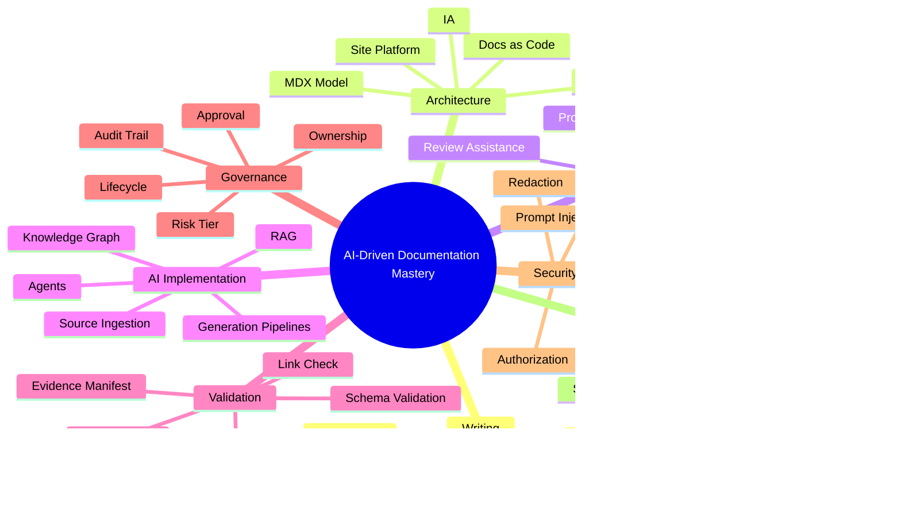
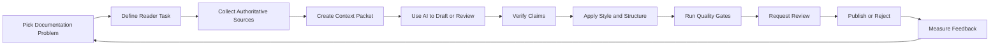
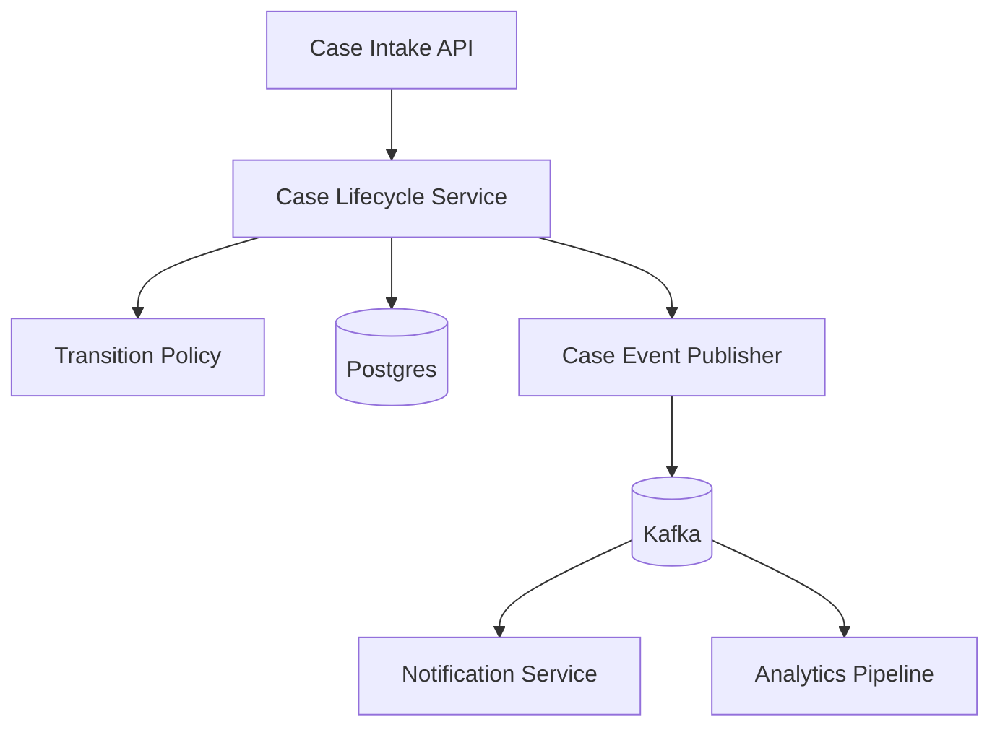
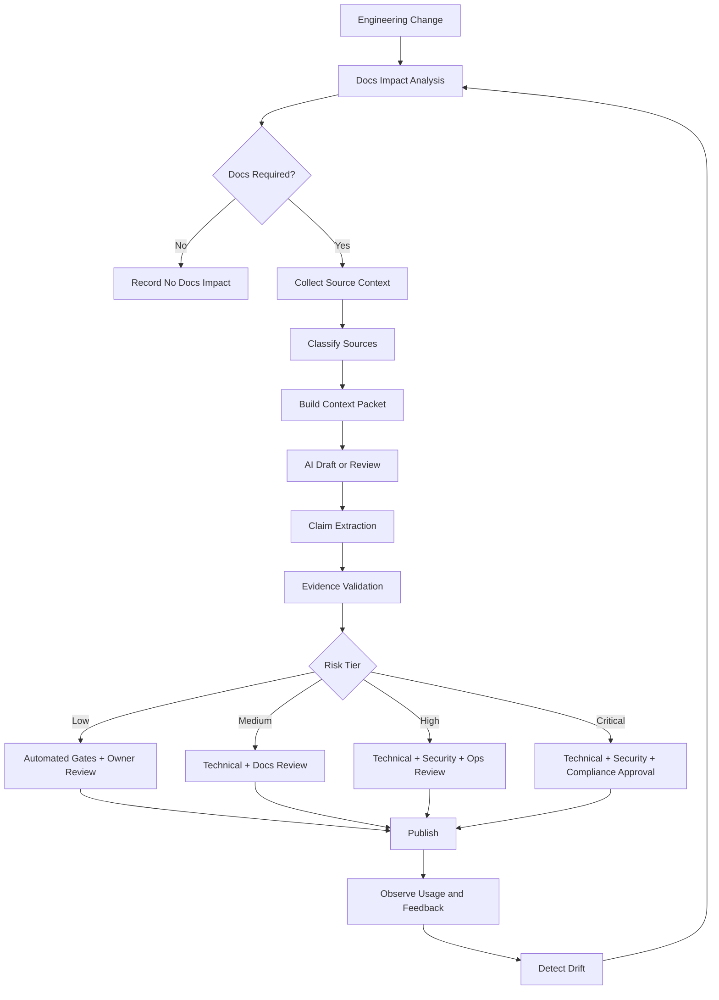

------
title: Learn AI-Driven Documentation and Technical Writing Implementation and Usage - Part 035
description: Capstone project, 20-hour Kaufman practice system, rubrics, failure injection drills, maturity model, and long-term mastery plan for AI-driven documentation engineering.
series: learn-ai-driven-documentation
seriesTitle: Learn AI-Driven Documentation and Technical Writing Implementation and Usage
order: 35
partTitle: Capstone, Practice System, and Mastery Plan
tags:
- ai
- documentation
- technical-writing
- capstone
- kaufman
- deliberate-practice
- docs-as-code
- engineering-handbook
- governance
- mastery
- software-engineering
- ai-agents
date: 2026-06-30
---

# Part 035 — Capstone, Practice System, and Mastery Plan

This is the final part of the series.

The goal of this part is to convert everything from Part 001 to Part 034 into operational skill.

Not theoretical familiarity.

Not prompt memorization.

Not a collection of templates.

Operational skill means you can design, implement, review, improve, and defend an AI-driven documentation system under real engineering constraints.

You should be able to answer:

- What documentation should exist?
- Who is the reader?
- What is the source of truth?
- What can AI safely generate?
- What must humans verify?
- What tests should run before publication?
- What can go wrong?
- How do we detect drift?
- How do we measure quality?
- How do we govern autonomy?
- How do we scale this across teams?

This part provides:

1. A capstone project.
2. A 20-hour Kaufman-style practice system.
3. A mastery rubric.
4. Failure injection drills.
5. Review checklists.
6. A documentation maturity model.
7. A long-term skill roadmap.
8. A final operating model for top-tier software engineers.

---

## 1. The Final Skill Definition

The skill we are building is not simply:

> Use AI to write documentation.

That is too shallow.

The real skill is:

> Design and operate an AI-assisted documentation system that produces trustworthy, useful, reviewable, secure, and maintainable technical documentation from authoritative engineering sources.

This definition includes writing, architecture, workflow, validation, security, and governance.

A top-tier software engineer should be able to move between these levels:

| Level | Capability |
|---|---|
| Writing | Produce clear technical content for a defined reader task. |
| Structuring | Place content in the right information architecture. |
| Source grounding | Tie claims to source-of-truth artifacts. |
| Automation | Generate, validate, and publish docs through CI. |
| AI usage | Use AI to accelerate drafting, transformation, review, and extraction. |
| AI implementation | Build RAG, pipelines, agents, and evidence models for docs. |
| Governance | Define review, approval, risk, ownership, and lifecycle controls. |
| Observability | Measure freshness, quality, usage, failures, and reader success. |
| Strategic scaling | Turn documentation into an engineering platform capability. |

The skill is interdisciplinary.

It sits between software architecture, technical writing, developer experience, platform engineering, knowledge management, security, and AI systems.

---

## 2. Kaufman Framework Recap

The learning system follows five ideas from Josh Kaufman's practical skill acquisition method:

1. **Choose a target performance level.**
2. **Deconstruct the skill into subskills.**
3. **Learn enough to self-correct.**
4. **Remove barriers to practice.**
5. **Practice deliberately for at least 20 focused hours.**

For this series, the target performance level is intentionally high.

You are not trying to become a professional technical writer only.

You are trying to become an engineer who can build documentation systems that technical writers, engineers, architects, security teams, and AI agents can all rely on.

### 2.1 The Skill Tree



### 2.2 The Core Practice Loop

Every practice session should follow this loop:



The loop is more important than any individual prompt.

Prompting without source control is fragile.

Writing without reader modeling is unfocused.

Generation without verification is unsafe.

Publishing without metrics is invisible failure.

---

## 3. Capstone Project Overview

The capstone is a full internal engineering documentation platform for one representative service.

The capstone should be small enough to finish, but realistic enough to expose the real failure modes.

### 3.1 Capstone Name

Use this name:

> **Atlas Docs Platform Capstone**

The system documents a fictional but realistic service:

> **CaseFlow Enforcement Service**

This service is chosen because it resembles complex enterprise software:

- stateful lifecycle,
- APIs,
- events,
- roles,
- case transitions,
- escalation logic,
- compliance-sensitive behavior,
- operational runbooks,
- release notes,
- onboarding needs,
- auditability concerns.

You do not need to build the actual service.

You need enough source artifacts to build the documentation system around it.

### 3.2 Capstone Goal

Build a docs-as-code and AI-assisted documentation workflow that can produce and govern:

1. Service overview.
2. Architecture page.
3. API reference page.
4. Event catalog page.
5. Runbook.
6. Onboarding guide.
7. ADR.
8. Release note.
9. Admin guide.
10. Evidence manifest.
11. CI quality gate.
12. AI prompt pack.
13. Review workflow.
14. Documentation metrics plan.

The goal is not volume.

The goal is an end-to-end system where each page has a reader, source, lifecycle state, owner, evidence, and validation path.

---

## 4. Capstone Repository Structure

A strong capstone should have this shape:

```text
atlas-docs-capstone/
├── README.md
├── package.json
├── docs.config.ts
├── .github/
│   ├── CODEOWNERS
│   ├── pull_request_template.md
│   └── workflows/
│       ├── docs-ci.yml
│       ├── ai-docs-review.yml
│       └── link-check.yml
├── docs/
│   ├── index.mdx
│   ├── services/
│   │   └── caseflow-enforcement/
│   │       ├── overview.mdx
│   │       ├── architecture.mdx
│   │       ├── api.mdx
│   │       ├── events.mdx
│   │       ├── runbook.mdx
│   │       ├── admin-guide.mdx
│   │       ├── onboarding.mdx
│   │       └── troubleshooting.mdx
│   ├── adr/
│   │   └── 0001-case-state-machine-boundary.mdx
│   └── releases/
│       └── 2026-06-caseflow-v1-4.mdx
├── specs/
│   ├── openapi/
│   │   └── caseflow-enforcement.openapi.yaml
│   └── asyncapi/
│       └── caseflow-enforcement.asyncapi.yaml
├── sources/
│   ├── code-map.json
│   ├── ownership.yaml
│   ├── service-metadata.yaml
│   ├── incident-sample.md
│   └── release-metadata.yaml
├── ai/
│   ├── context-packets/
│   │   ├── caseflow-overview.context.yaml
│   │   ├── caseflow-api.context.yaml
│   │   └── caseflow-runbook.context.yaml
│   ├── prompts/
│   │   ├── doc-draft.prompt.md
│   │   ├── doc-review.prompt.md
│   │   ├── release-notes.prompt.md
│   │   └── evidence-check.prompt.md
│   ├── evaluations/
│   │   ├── rubric.docs.yaml
│   │   └── golden-set.yaml
│   └── evidence/
│       ├── overview.evidence.yaml
│       ├── api.evidence.yaml
│       └── runbook.evidence.yaml
├── config/
│   ├── vale.ini
│   ├── styles/
│   │   └── EngineeringDocs/
│   │       ├── Clarity.yml
│   │       ├── Claims.yml
│   │       └── Terminology.yml
│   ├── markdownlint.json
│   ├── docs-frontmatter.schema.json
│   └── link-checker.config.json
├── scripts/
│   ├── validate-frontmatter.ts
│   ├── validate-evidence.ts
│   ├── validate-snippets.ts
│   ├── detect-stale-docs.ts
│   └── generate-doc-health-report.ts
└── reports/
    ├── docs-health.json
    └── ai-review-summary.md
```

This structure intentionally separates:

- authored docs,
- machine-readable specs,
- source metadata,
- AI context,
- AI prompts,
- evidence manifests,
- validation config,
- reports.

That separation prevents a common failure:

> AI-generated text becomes mixed with authoritative source data until nobody knows which claims are grounded.

---

## 5. Capstone Source Artifacts

A documentation system is only as trustworthy as its sources.

Prepare these source artifacts before generating docs.

### 5.1 Service Metadata

Create `sources/service-metadata.yaml`:

```yaml
service: caseflow-enforcement
name: CaseFlow Enforcement Service
summary: Handles enforcement case lifecycle transitions, escalations, assignments, and compliance status updates.
owners:
  engineering: platform-enforcement
  product: enforcement-operations
  security: appsec-platform
  support: enforcement-support
criticality: high
data_classification: confidential
runtime:
  language: java
  framework: spring-boot
  database: postgres
  messaging: kafka
lifecycle_states:
  - intake
  - validation
  - investigation
  - enforcement_review
  - action_pending
  - action_issued
  - appeal_window
  - closed
public_docs_allowed: false
internal_docs_allowed: true
regulated_claims_require_approval: true
```

### 5.2 Ownership Metadata

Create `sources/ownership.yaml`:

```yaml
areas:
  service-overview:
    owner: platform-enforcement
    reviewers:
      - tech-lead-enforcement
      - docs-platform
    risk_tier: medium
  api-reference:
    owner: platform-enforcement
    reviewers:
      - api-governance
      - docs-platform
    risk_tier: high
  runbook:
    owner: sre-enforcement
    reviewers:
      - incident-commander-group
      - appsec-platform
    risk_tier: high
  regulated-claims:
    owner: compliance-engineering
    reviewers:
      - legal-policy
      - audit-readiness
    risk_tier: critical
```

### 5.3 Code Map

Create `sources/code-map.json`:

```json
{
  "service": "caseflow-enforcement",
  "modules": [
    {
      "name": "case-lifecycle",
      "path": "src/main/java/com/example/caseflow/lifecycle",
      "responsibility": "Validates and executes state transitions for enforcement cases.",
      "key_symbols": [
        "CaseLifecycleService",
        "CaseStateMachine",
        "TransitionPolicy",
        "EscalationRule"
      ]
    },
    {
      "name": "assignment",
      "path": "src/main/java/com/example/caseflow/assignment",
      "responsibility": "Assigns cases to analysts, supervisors, and enforcement officers.",
      "key_symbols": [
        "AssignmentService",
        "WorkloadBalancer",
        "RoleConstraintPolicy"
      ]
    },
    {
      "name": "event-publishing",
      "path": "src/main/java/com/example/caseflow/events",
      "responsibility": "Publishes lifecycle and escalation events to downstream systems.",
      "key_symbols": [
        "CaseEventPublisher",
        "CaseStatusChangedEvent",
        "EscalationTriggeredEvent"
      ]
    }
  ]
}
```

### 5.4 Release Metadata

Create `sources/release-metadata.yaml`:

```yaml
release: 1.4.0
date: 2026-06-30
service: caseflow-enforcement
changes:
  - id: CF-2181
    type: behavior-change
    summary: Escalation rule now considers analyst workload before supervisor assignment.
    user_impact: Supervisors receive fewer low-priority escalations during peak workload.
    docs_required:
      - admin-guide
      - runbook
      - release-notes
  - id: CF-2190
    type: api-change
    summary: Added transitionReason field to case transition API response.
    user_impact: API consumers can display transition rationale without additional lookup.
    docs_required:
      - api-reference
      - migration-guide
  - id: CF-2215
    type: operational-change
    summary: Added alert when appeal_window cases remain unresolved for more than 72 hours.
    user_impact: SRE and operations teams receive earlier signal for stuck cases.
    docs_required:
      - runbook
      - alert-docs
```

### 5.5 Incident Sample

Create `sources/incident-sample.md`:

```md
# Incident Sample: Delayed Case Escalations

Date: 2026-06-18
Severity: SEV-2
Service: caseflow-enforcement

## Summary

Escalation events were delayed for approximately 47 minutes due to consumer lag in the event-publishing module.

## Impact

- 1,284 cases were not escalated within the expected SLA window.
- No case data was lost.
- Downstream notification service received delayed events.

## Timeline

- 09:12: Alert fired for Kafka consumer lag.
- 09:18: On-call acknowledged alert.
- 09:27: Team identified slow database query during transition audit logging.
- 09:43: Index added through emergency migration.
- 09:59: Consumer lag returned to normal.

## Follow-Ups

- Add runbook section for consumer lag diagnosis.
- Add dashboard link to transition audit latency.
- Document safe replay procedure.
```

These artifacts become the initial source corpus.

They are intentionally small.

A small reliable source corpus is better than a large untrusted one.

---

## 6. Capstone Documentation Deliverables

The capstone should produce the following docs.

### 6.1 Service Overview

File:

```text
docs/services/caseflow-enforcement/overview.mdx
```

Purpose:

- explain what the service does,
- explain what it does not do,
- identify owners,
- identify critical dependencies,
- define reader entry points.

Required sections:

```mdx
# CaseFlow Enforcement Service

## What This Service Does

## What This Service Does Not Do

## Primary Readers

## System Responsibilities

## Source of Truth

## Key Workflows

## Ownership

## Operational Criticality

## Related Documentation
```

Quality bar:

- no implementation dump,
- no unverified claims,
- no stale ownership,
- every responsibility maps to source metadata or code map,
- each related page has a clear reason.

### 6.2 Architecture Page

File:

```text
docs/services/caseflow-enforcement/architecture.mdx
```

Required sections:

```mdx
# CaseFlow Enforcement Architecture

## System Context

## Container View

## Component View

## Main Data Flow

## State Transition Flow

## Event Publishing Flow

## Key Design Decisions

## Failure Modes

## Operational Boundaries

## Security and Data Classification
```

Include at least one Mermaid diagram.

Example:



### 6.3 API Documentation

File:

```text
docs/services/caseflow-enforcement/api.mdx
```

Required sections:

```mdx
# CaseFlow Enforcement API

## API Overview

## Authentication and Authorization

## Case Transition Endpoint

## Request Model

## Response Model

## Error Model

## Idempotency

## Versioning

## Examples

## Migration Notes
```

The API docs should be derived from:

```text
specs/openapi/caseflow-enforcement.openapi.yaml
```

AI may improve descriptions and examples, but it must not invent fields.

### 6.4 Event Documentation

File:

```text
docs/services/caseflow-enforcement/events.mdx
```

Required sections:

```mdx
# CaseFlow Enforcement Events

## Event Catalog

## CaseStatusChanged

## EscalationTriggered

## Producer Responsibilities

## Consumer Responsibilities

## Ordering and Delivery Semantics

## Replay Behavior

## Compatibility Rules

## Failure Modes
```

The event docs should be derived from:

```text
specs/asyncapi/caseflow-enforcement.asyncapi.yaml
```

### 6.5 Runbook

File:

```text
docs/services/caseflow-enforcement/runbook.mdx
```

Required sections:

```mdx
# CaseFlow Enforcement Runbook

## When to Use This Runbook

## First Five Minutes

## Severity Assessment

## Common Alerts

## Consumer Lag Diagnosis

## Stuck State Transition Diagnosis

## Safe Replay Procedure

## Rollback Procedure

## Escalation Contacts

## Post-Incident Documentation
```

Runbooks must optimize for stressed readers.

Use direct commands, decision trees, expected outcomes, and rollback instructions.

### 6.6 Onboarding Guide

File:

```text
docs/services/caseflow-enforcement/onboarding.mdx
```

Required sections:

```mdx
# CaseFlow Enforcement Onboarding

## What to Learn First

## Local Setup

## Domain Concepts

## First Safe Contribution

## Reading Path

## Debugging Path

## Common Misunderstandings

## Mentors and Owners
```

Onboarding docs should reduce ambiguity.

They should not assume the reader already knows the domain.

### 6.7 ADR

File:

```text
docs/adr/0001-case-state-machine-boundary.mdx
```

Required sections:

```mdx
# ADR 0001: Keep Case State Transitions Inside CaseFlow Enforcement

## Status

## Context

## Decision

## Alternatives Considered

## Consequences

## Operational Impact

## Security and Compliance Impact

## Review Date
```

The ADR should not be a generic essay.

It must capture a real decision, alternatives, and consequences.

### 6.8 Release Notes

File:

```text
docs/releases/2026-06-caseflow-v1-4.mdx
```

Required sections:

```mdx
# CaseFlow Enforcement v1.4.0 Release Notes

## Summary

## User-Visible Changes

## API Changes

## Operational Changes

## Migration Notes

## Known Limitations

## Required Actions

## Related Documentation
```

Release notes should be generated from `sources/release-metadata.yaml`, then reviewed.

### 6.9 Evidence Manifests

Every generated or AI-assisted page should have an evidence manifest.

Example:

```yaml
document: docs/services/caseflow-enforcement/runbook.mdx
risk_tier: high
ai_assisted: true
source_inputs:
  - path: sources/incident-sample.md
    type: incident_report
    trust_level: high
  - path: sources/service-metadata.yaml
    type: service_metadata
    trust_level: high
  - path: sources/ownership.yaml
    type: ownership_metadata
    trust_level: high
claims:
  - id: runbook-claim-001
    text: Consumer lag can delay escalation events without data loss.
    evidence:
      - sources/incident-sample.md#summary
      - sources/incident-sample.md#impact
    verification_status: verified
  - id: runbook-claim-002
    text: Safe replay should be coordinated with SRE and service owners.
    evidence:
      - sources/ownership.yaml#areas.runbook
    verification_status: needs-human-review
review:
  technical_owner: sre-enforcement
  docs_owner: docs-platform
  security_review_required: true
  approved: false
```

Evidence manifests are critical for auditability.

They are also useful for AI evaluation.

---

## 7. Capstone AI Prompt Pack

Do not use one giant prompt.

Use a prompt pack.

A prompt pack is a versioned set of task-specific prompts with stable inputs and expected outputs.

### 7.1 Draft Prompt

File:

```text
ai/prompts/doc-draft.prompt.md
```

Suggested content:

```md
You are assisting with internal engineering documentation.

Task:
Create a draft document from the provided source context.

Rules:
- Do not invent behavior, fields, endpoints, owners, SLAs, or security controls.
- Use only the provided sources.
- Mark unknown information as "Unknown".
- Include an "Evidence Notes" section mapping important claims to sources.
- Follow the target document structure exactly.
- Use concise technical language.
- Prefer concrete operational detail over generic explanation.

Inputs:
- Target reader
- Target document type
- Source context packet
- Required sections
- Style guide constraints

Output:
- MDX document body only
- No frontmatter unless requested
- No marketing language
```

### 7.2 Review Prompt

File:

```text
ai/prompts/doc-review.prompt.md
```

Suggested content:

```md
You are reviewing an engineering documentation draft.

Review the document for:

1. Unsupported claims.
2. Ambiguous ownership.
3. Missing reader task.
4. Mixed documentation modes.
5. Security-sensitive leakage.
6. Stale or unversioned claims.
7. Inconsistent terminology.
8. Missing failure modes.
9. Missing validation or rollback steps.
10. Sections that should require human review.

Return:

- Blocking issues
- Non-blocking issues
- Suggested edits
- Missing source evidence
- Risk tier recommendation
```

### 7.3 Evidence Check Prompt

File:

```text
ai/prompts/evidence-check.prompt.md
```

Suggested content:

```md
You are validating whether documentation claims are supported by source evidence.

For each claim:

- Identify the exact source artifact supporting it.
- Classify the claim as verified, weakly supported, unsupported, contradicted, or needs human review.
- Explain the reason briefly.
- Do not rewrite the document.
- Do not assume facts not present in the sources.

Return a YAML-compatible claim verification table.
```

### 7.4 Release Notes Prompt

File:

```text
ai/prompts/release-notes.prompt.md
```

Suggested content:

```md
You are generating internal release notes from structured release metadata.

Rules:
- Preserve change IDs.
- Separate user-visible, API, operational, and migration changes.
- Do not invent impact.
- Mark unknown migration impact explicitly.
- Include required action items when available.
- Link related docs if provided.

Return MDX body only.
```

---

## 8. Capstone CI Quality Gates

The capstone must include CI.

A docs system without CI is a manual publishing process with decorative automation.

### 8.1 Minimum CI Gates

The minimum gates:

| Gate | Purpose | Blocking? |
|---|---|---|
| Frontmatter validation | Ensure metadata is complete. | Yes |
| Markdown lint | Ensure structural consistency. | Yes |
| Prose lint | Enforce style guide. | Usually yes |
| Link check | Detect broken links. | Yes |
| Secret scan | Prevent leakage. | Yes |
| Evidence validation | Ensure high-risk docs have manifests. | Yes |
| Snippet validation | Ensure commands/code examples are valid enough. | Yes for runbooks/API examples |
| Generated docs diff | Detect uncontrolled generated changes. | Yes |
| Stale docs check | Detect outdated owners/sources. | Warning or blocking based on risk |

### 8.2 Example GitHub Actions Workflow

```yaml
name: Docs CI

on:
  pull_request:
    paths:
      - "docs/**"
      - "specs/**"
      - "sources/**"
      - "ai/**"
      - "config/**"
      - ".github/workflows/docs-ci.yml"

jobs:
  validate-docs:
    runs-on: ubuntu-latest
    steps:
      - uses: actions/checkout@v4

      - name: Install dependencies
        run: npm ci

      - name: Validate frontmatter
        run: npm run docs:frontmatter

      - name: Run markdown lint
        run: npm run docs:markdownlint

      - name: Run prose lint
        run: npm run docs:vale

      - name: Check links
        run: npm run docs:links

      - name: Validate evidence manifests
        run: npm run docs:evidence

      - name: Validate snippets
        run: npm run docs:snippets

      - name: Build docs site
        run: npm run docs:build
```

### 8.3 Evidence Validation Rules

A simple evidence validator should enforce:

```yaml
rules:
  high_risk_docs_require_evidence: true
  regulated_claims_require_approval: true
  public_docs_require_security_review: true
  ai_assisted_docs_require_ai_disclosure_metadata: true
  unknown_claims_must_not_be_published_as_fact: true
  unsupported_claims_block_merge: true
```

### 8.4 Frontmatter Schema

Every doc should contain consistent metadata.

Example:

```yaml
title: CaseFlow Enforcement Runbook
description: Operational runbook for diagnosing and resolving CaseFlow Enforcement incidents.
owners:
  - sre-enforcement
  - platform-enforcement
status: draft
riskTier: high
docType: runbook
audience:
  - sre
  - on-call-engineer
sourceOfTruth:
  - sources/service-metadata.yaml
  - sources/incident-sample.md
aiAssisted: true
lastReviewed: 2026-06-30
reviewCycleDays: 90
```

The schema should reject missing owner, risk tier, status, and source-of-truth fields.

---

## 9. 20-Hour Practice Plan

The 20-hour plan is the core of Kaufman's method.

Do not stretch this over months.

Do not read endlessly before practicing.

The goal is to create a tight feedback loop.

### 9.1 Practice Rules

Use these rules:

1. Practice in focused sessions of 60–120 minutes.
2. Produce artifacts every session.
3. Validate artifacts immediately.
4. Keep a decision log.
5. Keep a failure log.
6. Use AI, but verify everything.
7. Prefer small working slices over large unfinished designs.
8. End each session with one measurable improvement.

### 9.2 Hour-by-Hour Plan

| Hour | Focus | Output |
|---:|---|---|
| 1 | Define capstone scope and reader personas | Capstone README and reader matrix |
| 2 | Create source artifacts | service metadata, ownership, code map |
| 3 | Create docs repository skeleton | repo tree, config stubs, docs index |
| 4 | Define frontmatter schema | JSON schema and example metadata |
| 5 | Define style guide and Vale rules | style rules and terminology rules |
| 6 | Draft service overview with AI | overview.mdx draft + evidence notes |
| 7 | Verify service overview manually | corrected overview + evidence manifest |
| 8 | Draft architecture page | architecture.mdx + Mermaid diagrams |
| 9 | Draft API docs from OpenAPI | api.mdx + validation checklist |
| 10 | Draft event docs from AsyncAPI | events.mdx + event catalog |
| 11 | Draft runbook from incident source | runbook.mdx + decision tree |
| 12 | Draft onboarding guide | onboarding.mdx + learning path |
| 13 | Draft ADR | ADR 0001 + alternatives/consequences |
| 14 | Generate release notes | release notes + related docs impact |
| 15 | Build AI prompt pack | draft/review/evidence/release prompts |
| 16 | Implement quality gates | lint, link, frontmatter, evidence checks |
| 17 | Run failure injection drill | seeded errors + detection report |
| 18 | Build docs health report | docs-health.json and summary |
| 19 | Perform review simulation | PR review comments and fixes |
| 20 | Final assessment and roadmap | mastery rubric, backlog, next iteration plan |

### 9.3 Practice Session Template

Use this for every session:

```md
# Practice Session

Date:
Duration:
Focus:

## Target Artifact

## Source Inputs

## AI Assistance Used

## Human Verification Performed

## Quality Gates Run

## Defects Found

## Fixes Made

## Lessons Learned

## Next Improvement
```

### 9.4 The 20-Hour Output Standard

At the end of 20 hours, you should have:

- a working docs repository,
- at least eight completed docs,
- evidence manifests for high-risk pages,
- a prompt pack,
- CI quality gates,
- a review workflow,
- a failure injection report,
- a docs health report,
- a clear backlog,
- a self-assessment rubric.

This is enough to demonstrate real skill.

It is not enough to claim enterprise maturity.

Enterprise maturity requires repeated operation over real changes, real teams, and real incidents.

---

## 10. Deliberate Practice Drills

Practice must target weaknesses.

Repeating easy writing tasks does not build mastery.

Use drills.

### 10.1 Reader Task Drill

Given a document, identify:

- primary reader,
- reader state,
- reader goal,
- reader risk,
- success condition,
- unnecessary sections.

Example:

```md
Document: runbook.mdx
Primary reader: on-call engineer
Reader state: under pressure
Reader goal: diagnose and mitigate consumer lag
Reader risk: executing unsafe replay or escalating too late
Success condition: service restored or safely escalated
Unnecessary section: long architecture explanation before first action
```

### 10.2 Claim Verification Drill

Take ten claims from a generated doc.

Classify each one:

| Claim | Evidence | Status | Action |
|---|---|---|---|
| Supported by source | exact source path | verified | keep |
| Weakly supported | indirect source | needs review | rewrite or add source |
| Unsupported | none | blocking | remove |
| Contradicted | conflicting source | blocking | resolve conflict |
| Ambiguous | unclear meaning | warning | clarify |

This drill trains you to distrust polished prose.

### 10.3 Compression Drill

Take a 1,000-word generated explanation.

Rewrite it into:

1. a 100-word overview,
2. a 7-step how-to,
3. a reference table,
4. a warning block,
5. a troubleshooting decision tree.

This trains information architecture flexibility.

### 10.4 Mode Separation Drill

Take one mixed document and split it into Diátaxis modes:

| Original content | New location |
|---|---|
| step-by-step setup | tutorial or how-to |
| field definitions | reference |
| design rationale | explanation or ADR |
| operational recovery steps | runbook |
| user task workflow | user guide |

This avoids docs that try to serve everyone and serve nobody.

### 10.5 Prompt Refinement Drill

Run the same source context through three prompts:

1. vague prompt,
2. structured prompt,
3. structured prompt with evidence requirement.

Compare outputs by:

- unsupported claims,
- missing sections,
- tone consistency,
- review effort,
- evidence traceability.

The lesson should be obvious:

> Good prompts reduce review cost, but they do not remove verification cost.

### 10.6 Stale Context Drill

Seed stale ownership or deprecated API fields into context.

Then test whether your workflow catches it.

Examples:

- owner changed from `platform-enforcement` to `case-platform`,
- API field `statusReason` renamed to `transitionReason`,
- runbook references old dashboard URL,
- ADR review date expired,
- release note links to old migration guide.

Expected detection methods:

- metadata validation,
- spec diff,
- owner registry check,
- link checker,
- stale docs report,
- human review.

### 10.7 Security Drill

Seed sensitive content:

- fake secret,
- internal customer ID,
- incident detail not allowed in public docs,
- private Slack quote,
- confidential architecture detail.

Your pipeline should:

- detect it,
- block publication,
- redact it from AI context if needed,
- record the incident in a report,
- route for security review.

### 10.8 Runbook Stress Drill

Read the runbook as if an outage is happening.

Time yourself.

Can you answer in under two minutes:

- What is the first action?
- How do I know severity?
- What dashboard do I open?
- What command is safe?
- What command is dangerous?
- When do I escalate?
- How do I rollback?

If not, the runbook is not operational.

### 10.9 API Docs Consumer Drill

Pretend you are a consumer integrating with the API.

Can you answer:

- how to authenticate,
- what endpoint to call,
- required fields,
- optional fields,
- error behavior,
- idempotency,
- versioning,
- migration impact,
- example request/response,
- contact path for breaking changes.

If the docs only mirror the OpenAPI schema, they are incomplete.

### 10.10 Governance Drill

Given a documentation change, decide review routing.

Example:

```yaml
change:
  file: docs/services/caseflow-enforcement/runbook.mdx
  riskTier: high
  aiAssisted: true
  touches:
    - rollback procedure
    - consumer replay procedure
    - customer-impact statement
```

Expected routing:

- service owner,
- SRE owner,
- security reviewer,
- docs reviewer,
- compliance reviewer if regulated claim exists.

---

## 11. Failure Injection Matrix

A serious documentation engineer tests failure modes deliberately.

Use this matrix.

| Failure | Seed Example | Expected Detection | Blocking? |
|---|---|---|---|
| Unsupported claim | "No data can ever be lost" | Evidence validator / reviewer | Yes |
| Stale API field | `statusReason` instead of `transitionReason` | OpenAPI diff | Yes |
| Broken link | old dashboard URL | Link checker | Yes |
| Missing owner | frontmatter lacks owner | Schema validation | Yes |
| Secret leakage | fake API key in sample | Secret scanner | Yes |
| Mixed doc mode | tutorial + reference + ADR in one page | AI/doc review | Warning |
| Overconfident AI wording | "guarantees compliance" | Style/prose lint + reviewer | Yes for regulated docs |
| Missing rollback | runbook has diagnosis only | Runbook checklist | Yes |
| Public/private boundary violation | confidential incident in public docs | classification gate | Yes |
| Unreviewed generated content | AI draft merged directly | governance check | Yes |
| Recursive source contamination | generated doc used as source truth | source hierarchy check | Yes |
| No evidence manifest | high-risk page lacks manifest | evidence validator | Yes |
| Outdated ADR | review date expired | stale docs checker | Warning or yes |
| Missing migration note | API change without migration docs | release impact checker | Yes |
| Conflicting source | OpenAPI differs from prose | consistency check | Yes |

A failure injection report should look like this:

```md
# Failure Injection Report

Date: 2026-06-30
Scope: CaseFlow Enforcement docs

## Seeded Failures

| ID | Failure | Location | Expected Gate | Actual Result | Status |
|---|---|---|---|---|---|
| F001 | Unsupported compliance claim | admin-guide.mdx | evidence validation | blocked | pass |
| F002 | Broken dashboard link | runbook.mdx | link checker | blocked | pass |
| F003 | Stale API field | api.mdx | OpenAPI diff | missed | fail |

## Lessons

- API docs validation must compare prose field references against OpenAPI schema.
- Runbook link checks work.
- Regulated claims require stricter evidence tagging.

## Follow-Up Actions

- Add prose-to-schema field reference scanner.
- Add required evidence category for compliance claims.
- Add reviewer checklist item for generated examples.
```

---

## 12. Mastery Rubric

Use the rubric to assess yourself.

Score each dimension from 1 to 5.

### 12.1 Scoring Scale

| Score | Meaning |
|---:|---|
| 1 | Can explain concept, cannot apply reliably. |
| 2 | Can apply with examples, misses edge cases. |
| 3 | Can produce usable docs and workflows with review. |
| 4 | Can design scalable systems and detect major failure modes. |
| 5 | Can lead organization-wide implementation and mentor others. |

### 12.2 Skill Rubric

| Dimension | 1 | 3 | 5 |
|---|---|---|---|
| Reader modeling | Names audience vaguely | Defines reader task and state | Designs docs by cognitive context and risk |
| Technical writing | Produces readable prose | Produces task-oriented docs | Creates style systems and review standards |
| Information architecture | Organizes by topic | Uses Diátaxis and doc types | Designs scalable handbook/navigation systems |
| Docs-as-code | Writes Markdown | Uses PR/CI/review workflow | Operates full docs delivery pipeline |
| AI usage | Asks AI to write docs | Uses structured prompts and verification | Designs prompt packs and evaluation loops |
| Context engineering | Pastes context manually | Builds scoped context packets | Designs retrieval/source hierarchy system |
| RAG understanding | Knows semantic search | Designs metadata-aware retrieval | Designs versioned, audited, graph-aware RAG |
| Evidence modeling | Adds references manually | Maintains evidence manifest | Enforces claim-evidence-control policy |
| Security | Avoids obvious secrets | Uses redaction and access control | Designs secure AI docs architecture |
| Governance | Has reviewers | Defines lifecycle and risk routing | Operates policy-as-code and audit-ready model |
| Testing | Runs link checks | Tests snippets and metadata | Builds comprehensive docs quality gates |
| Observability | Tracks page views | Measures health and feedback | Runs docs SLOs, dashboards, and improvement loop |
| Agentic workflows | Understands agents | Uses bounded docs bots | Designs safe multi-agent docs automation |
| Strategic impact | Improves some docs | Improves team documentation workflow | Builds platform capability across teams |

### 12.3 Target Score

After finishing this series and capstone, a strong target is:

| Dimension | Target |
|---|---:|
| Reader modeling | 4 |
| Technical writing | 4 |
| Information architecture | 4 |
| Docs-as-code | 4 |
| AI usage | 4 |
| Context engineering | 4 |
| RAG understanding | 3 |
| Evidence modeling | 4 |
| Security | 3–4 |
| Governance | 4 |
| Testing | 4 |
| Observability | 3–4 |
| Agentic workflows | 3 |
| Strategic impact | 4 |

You do not need all 5s.

A 5 means you can build systems other teams depend on.

A 4 means you can operate independently and make good design decisions.

For a software engineer aiming at top-tier capability, most dimensions should reach 4.

---

## 13. Documentation Maturity Model

Use this model to assess a team or organization.

### 13.1 Level 0 — Tribal Knowledge

Characteristics:

- knowledge lives in people's heads,
- outdated README files,
- no owners,
- no review,
- no source hierarchy,
- repeated Slack explanations,
- onboarding depends on mentorship availability.

AI impact:

- dangerous if used directly,
- likely to generate confident nonsense,
- no reliable sources to ground on.

Primary improvement:

- create source-of-truth artifacts and ownership.

### 13.2 Level 1 — Ad Hoc Documentation

Characteristics:

- some docs exist,
- quality varies by team,
- limited structure,
- no consistent metadata,
- no quality gates,
- no lifecycle.

AI impact:

- useful for rewriting and summarization,
- risky for generation,
- high review burden.

Primary improvement:

- introduce docs-as-code and templates.

### 13.3 Level 2 — Structured Docs-as-Code

Characteristics:

- docs in Git,
- PR review,
- CODEOWNERS,
- Markdown/MDX conventions,
- basic linting,
- internal site.

AI impact:

- useful for draft generation,
- context packets can be assembled manually,
- review remains mostly human.

Primary improvement:

- add evidence manifests and automated validation.

### 13.4 Level 3 — Validated Documentation System

Characteristics:

- metadata schema,
- quality gates,
- snippet validation,
- link checking,
- source hierarchy,
- evidence manifest,
- stale docs detection,
- review routing.

AI impact:

- AI can draft and review safely within defined boundaries,
- high-risk docs still require human approval,
- generated changes are auditable.

Primary improvement:

- build retrieval, metrics, and observability.

### 13.5 Level 4 — AI-Assisted Documentation Platform

Characteristics:

- source ingestion,
- RAG index,
- prompt registry,
- context assembly,
- AI review assistant,
- docs health dashboard,
- risk-tiered governance,
- secure redaction pipeline.

AI impact:

- AI accelerates maintenance,
- PR docs bots catch gaps,
- release notes and runbook drafts become routine,
- humans focus on judgment and approval.

Primary improvement:

- add bounded agentic workflows and organization-wide rollout.

### 13.6 Level 5 — Knowledge Operating System

Characteristics:

- docs, code, specs, ADRs, incidents, releases, and ownership form a knowledge graph,
- docs quality is observable,
- documentation impact is part of engineering delivery,
- agentic workflows operate safely with guardrails,
- audit-ready evidence is normal,
- docs are treated as part of product reliability.

AI impact:

- AI becomes a knowledge workflow accelerator,
- not a source of truth,
- not an unreviewed publisher,
- not a replacement for engineering judgment.

Primary improvement:

- continuous improvement, cross-org governance, and advanced evaluation.

---

## 14. Capstone Review Checklist

Use this before considering the capstone complete.

### 14.1 System Checklist

- [ ] Repository has clear structure.
- [ ] Docs are separated from specs, sources, prompts, and evidence.
- [ ] Frontmatter schema exists.
- [ ] CODEOWNERS exists.
- [ ] Pull request template exists.
- [ ] CI workflow exists.
- [ ] Evidence manifests exist for high-risk docs.
- [ ] AI prompt pack is versioned.
- [ ] Source-of-truth hierarchy is documented.
- [ ] Generated docs are not treated as authoritative sources.
- [ ] Docs can be built locally.
- [ ] Quality gates can be run locally.

### 14.2 Content Checklist

- [ ] Overview explains responsibility and non-responsibility.
- [ ] Architecture page includes diagrams and failure modes.
- [ ] API docs include examples and error model.
- [ ] Event docs include delivery semantics and compatibility rules.
- [ ] Runbook includes first five minutes and rollback.
- [ ] Onboarding guide includes first safe contribution.
- [ ] ADR includes alternatives and consequences.
- [ ] Release notes separate user, API, operational, and migration impact.
- [ ] Admin guide is task-oriented.
- [ ] Troubleshooting content has decision paths.

### 14.3 AI Checklist

- [ ] AI prompts are task-specific.
- [ ] Prompts forbid unsupported invention.
- [ ] Context packets list source inputs.
- [ ] AI outputs include evidence notes.
- [ ] Review prompt detects unsupported claims.
- [ ] Evidence check prompt classifies claims.
- [ ] AI-assisted docs are labeled in metadata.
- [ ] AI drafts require human review before publication.
- [ ] High-risk docs cannot be auto-published.
- [ ] Prompt changes are versioned.

### 14.4 Security Checklist

- [ ] Source classification exists.
- [ ] Secret scanning exists.
- [ ] Redaction process exists.
- [ ] Public/internal docs boundary is explicit.
- [ ] Prompt injection risk is considered.
- [ ] AI logs do not store sensitive context unnecessarily.
- [ ] Retrieval authorization is documented.
- [ ] Security review is required for high-risk docs.
- [ ] Sensitive incident details are not published accidentally.

### 14.5 Governance Checklist

- [ ] Lifecycle states are defined.
- [ ] Risk tiers are defined.
- [ ] Review routing is defined.
- [ ] Waiver process exists.
- [ ] Stale docs policy exists.
- [ ] Approval evidence exists.
- [ ] Ownership changes are traceable.
- [ ] Regulated claims require explicit approval.
- [ ] Documentation debt is tracked.

### 14.6 Observability Checklist

- [ ] Docs health report exists.
- [ ] Broken links are counted.
- [ ] Stale docs are counted.
- [ ] Review latency is tracked.
- [ ] Reader feedback is captured.
- [ ] Search zero-result rate is planned.
- [ ] AI review defects are tracked.
- [ ] Failure injection results are recorded.
- [ ] Improvement backlog exists.

---

## 15. Example Docs Health Report

Create `reports/docs-health.json`:

```json
{
  "generatedAt": "2026-06-30T00:00:00Z",
  "repository": "atlas-docs-capstone",
  "summary": {
    "documents": 9,
    "highRiskDocuments": 3,
    "documentsWithOwners": 9,
    "documentsWithEvidence": 4,
    "brokenLinks": 0,
    "staleDocuments": 1,
    "unsupportedClaims": 0,
    "securityFindings": 0
  },
  "quality": {
    "frontmatterCoverage": 1.0,
    "evidenceCoverageForHighRiskDocs": 1.0,
    "linkHealth": 1.0,
    "styleViolations": 3,
    "snippetFailures": 0
  },
  "review": {
    "openDocPRs": 1,
    "averageReviewLatencyHours": 14,
    "aiAssistedChangesPendingHumanReview": 1
  },
  "risk": {
    "criticalFindings": 0,
    "blockingFindings": 0,
    "warnings": 4
  }
}
```

A docs health report should not be decorative.

It should drive action.

Example actions:

| Finding | Action |
|---|---|
| high stale count | assign review campaign |
| high zero-result search rate | improve taxonomy/glossary |
| many unsupported AI claims | improve prompt/evidence gate |
| high review latency | adjust ownership or reviewer pool |
| many broken links | add stronger link validation |
| low runbook test coverage | schedule operational drills |

---

## 16. Final Capstone Assessment

At the end, run a final assessment.

### 16.1 Architecture Assessment

Ask:

- Is there a clear source-of-truth hierarchy?
- Can generated docs be traced back to sources?
- Can high-risk docs be blocked before publication?
- Can stale docs be detected?
- Can ownership be resolved?
- Can a reviewer understand why AI wrote what it wrote?
- Can the system fail safely?

### 16.2 Writing Assessment

Ask:

- Does every page have a primary reader?
- Does every page have a primary task?
- Are steps actionable?
- Are warnings specific?
- Are claims bounded?
- Are unknowns marked?
- Is the prose concise?
- Is terminology consistent?

### 16.3 AI Assessment

Ask:

- Was AI used for the right tasks?
- Did AI invent anything?
- Were unsupported claims caught?
- Were context packets scoped?
- Were prompts versioned?
- Were AI outputs reviewed?
- Is AI autonomy bounded?

### 16.4 Governance Assessment

Ask:

- Are owners clear?
- Are review paths clear?
- Are high-risk docs treated differently?
- Are exceptions recorded?
- Are approvals auditable?
- Are regulated claims controlled?
- Are docs lifecycle states meaningful?

### 16.5 Operational Assessment

Ask:

- Can an on-call engineer use the runbook under pressure?
- Can a new engineer onboard without asking ten basic questions?
- Can an API consumer integrate successfully?
- Can a platform engineer diagnose docs CI failures?
- Can a tech lead trust the release notes?
- Can an auditor trace a claim to evidence?

---

## 17. Common Capstone Failure Modes

### 17.1 Too Much Generation, Not Enough Verification

Symptom:

- many polished pages,
- weak evidence,
- no claim checking,
- no review notes.

Fix:

- reduce generated volume,
- add evidence manifests,
- review claim by claim,
- make unsupported claims blocking.

### 17.2 Docs Look Good but Cannot Be Used

Symptom:

- prose is clean,
- but readers cannot complete tasks.

Fix:

- test with reader scenarios,
- add task-based structure,
- reduce explanatory overload,
- create decision trees.

### 17.3 CI Exists but Does Not Catch Real Problems

Symptom:

- CI passes,
- docs still contain stale fields, missing rollback, or unsupported claims.

Fix:

- add domain-specific checks,
- test failure injection,
- connect docs to specs and metadata,
- require evidence for high-risk claims.

### 17.4 AI Context Is Too Broad

Symptom:

- AI output includes irrelevant details,
- cross-service contamination,
- accidental leakage,
- conflicting claims.

Fix:

- build context packets,
- classify sources,
- limit retrieval scope,
- use source hierarchy.

### 17.5 Governance Is Too Heavy

Symptom:

- every doc change needs many approvals,
- review latency rises,
- engineers bypass docs process.

Fix:

- use risk-tiered review,
- automate low-risk checks,
- reserve human approval for judgment-heavy changes,
- track review latency.

### 17.6 Governance Is Too Weak

Symptom:

- AI drafts are merged casually,
- high-risk claims lack approval,
- no one owns docs,
- stale docs persist.

Fix:

- define policy,
- enforce metadata,
- use CODEOWNERS,
- block high-risk changes without evidence.

### 17.7 Documentation Becomes a Separate Bureaucracy

Symptom:

- docs workflow is detached from engineering delivery,
- release notes happen late,
- docs are not updated with code changes.

Fix:

- integrate docs into PRs,
- require docs impact analysis,
- connect release metadata to docs generation,
- track docs debt like engineering debt.

---

## 18. Advanced Mastery Path After the Capstone

After the capstone, continue in layers.

### 18.1 Layer 1 — Real Service Adoption

Apply the system to one real internal service.

Focus:

- real owners,
- real APIs,
- real incidents,
- real release notes,
- real onboarding pain,
- real review latency.

Expected learning:

- source data is messier than examples,
- ownership is political,
- docs quality depends on incentives,
- AI needs strong boundaries.

### 18.2 Layer 2 — Multi-Service Documentation Platform

Scale to multiple services.

Focus:

- service catalog integration,
- cross-service dependencies,
- shared templates,
- common metadata schema,
- federated ownership,
- platform docs portal.

Expected learning:

- navigation becomes hard,
- taxonomy matters,
- cross-service docs drift quickly,
- governance must be lightweight.

### 18.3 Layer 3 — Knowledge Graph and RAG

Build or integrate a documentation knowledge graph.

Focus:

- service-to-owner relations,
- API-to-consumer relations,
- event producer/consumer graph,
- ADR-to-component links,
- runbook-to-alert links,
- release-to-doc impact links.

Expected learning:

- metadata quality determines retrieval quality,
- graph edges are governance assets,
- AI answers improve when retrieval is structured.

### 18.4 Layer 4 — Agentic Workflow

Introduce bounded agents.

Focus:

- PR docs impact agent,
- release note agent,
- stale docs agent,
- evidence checker agent,
- runbook reviewer agent.

Expected learning:

- autonomy requires observability,
- tools need permissions,
- agents must fail closed,
- human review remains essential.

### 18.5 Layer 5 — Organization-Wide Operating Model

Turn documentation into a platform capability.

Focus:

- policy,
- training,
- templates,
- quality gates,
- dashboards,
- support model,
- review network,
- maturity assessments.

Expected learning:

- documentation quality is a socio-technical problem,
- tooling alone does not fix incentives,
- leadership needs metrics,
- engineers need low-friction workflows.

---

## 19. What Top 1% Looks Like in This Domain

A strong engineer can write good docs.

A top-tier engineer can design a system that causes good docs to happen repeatedly.

### 19.1 Behavioral Signals

You are operating at a high level when you naturally ask:

- What reader task does this doc support?
- What claim is risky?
- What is the authoritative source?
- How will this doc drift?
- What test catches that drift?
- Who owns this after publish?
- What will AI get wrong here?
- What should not be put into context?
- What review can be automated?
- What review requires human judgment?
- How does this documentation reduce operational risk?

### 19.2 Design Signals

Your systems show:

- source hierarchy,
- evidence manifests,
- risk-tiered review,
- docs CI,
- prompt versioning,
- context packets,
- secure retrieval,
- stale docs detection,
- quality dashboards,
- feedback loops,
- bounded agentic automation.

### 19.3 Communication Signals

Your writing shows:

- direct structure,
- low ambiguity,
- concrete nouns,
- bounded claims,
- clear assumptions,
- explicit limitations,
- useful examples,
- accurate warnings,
- reader-specific paths,
- no decorative complexity.

### 19.4 Leadership Signals

You can:

- convince teams to adopt docs-as-code,
- make docs quality measurable,
- reduce onboarding cost,
- improve incident response,
- prevent AI documentation risk,
- design review policies that do not paralyze delivery,
- explain trade-offs to engineering, product, security, compliance, and leadership.

---

## 20. Final Reference Mental Model

Use this model as your default architecture for any AI documentation initiative.



This model keeps the system grounded.

The documentation lifecycle begins with engineering change and ends with feedback and drift detection.

AI is inside the loop.

AI is not the loop.

---

## 21. Final Practical Heuristics

Use these heuristics in real work.

### 21.1 Documentation Creation

- Start with the reader, not the topic.
- Start with source evidence, not prose.
- Use AI to accelerate structure, not bypass thinking.
- Make unknowns explicit.
- Never publish an unsupported operational claim.
- Prefer one useful page over five generic pages.

### 21.2 Documentation Review

- Review claims, not just grammar.
- Review examples against executable truth.
- Review runbooks under stress conditions.
- Review API docs as a consumer.
- Review release notes against actual change metadata.
- Review regulated docs as future evidence.

### 21.3 AI Usage

- Use small prompts for specific tasks.
- Provide scoped context.
- Require evidence notes.
- Ask AI to find gaps and contradictions.
- Do not let AI decide source truth.
- Do not let AI publish high-risk docs autonomously.

### 21.4 Governance

- Apply more control to higher risk.
- Automate repetitive checks.
- Keep human review for judgment.
- Make approval paths explicit.
- Track review latency.
- Treat governance as a product, not a wall.

### 21.5 Scaling

- Standardize metadata before standardizing prose.
- Build templates from successful docs.
- Measure search failures.
- Track stale docs.
- Tie docs to ownership.
- Integrate docs with release and incident workflows.

---

## 22. Final Self-Exam

Answer these without looking back.

### 22.1 Conceptual Questions

1. Why is AI-generated documentation risky without a source-of-truth hierarchy?
2. What is the difference between a tutorial, how-to guide, reference, and explanation?
3. Why should runbooks be structured differently from architecture explanations?
4. What is an evidence manifest?
5. What makes a documentation claim high risk?
6. Why is generated documentation not automatically a source of truth?
7. What is recursive source contamination?
8. What belongs in a context packet?
9. Why does docs-as-code matter for AI-assisted documentation?
10. What is the difference between prose linting and documentation testing?

### 22.2 Design Questions

1. Design an AI docs workflow for a new API endpoint.
2. Design review routing for a runbook change.
3. Design a metadata schema for service docs.
4. Design a stale docs detection process.
5. Design an evidence validation gate.
6. Design a documentation health dashboard.
7. Design an AI release note agent with safe autonomy boundaries.
8. Design a RAG system for internal engineering docs.
9. Design a policy for AI-assisted regulated documentation.
10. Design a rollout plan for 20 engineering teams.

### 22.3 Failure Questions

1. How could AI leak confidential information through documentation?
2. How could stale API docs survive CI?
3. How could a runbook pass linting but fail during an incident?
4. How could search analytics mislead a docs team?
5. How could strict governance reduce documentation quality?
6. How could generated docs corrupt future retrieval?
7. How could an agentic docs bot create unsafe changes?
8. How could a documentation platform create false trust?
9. How could ownership metadata become stale?
10. How could release notes omit a critical migration step?

If you can answer these with concrete examples, you have moved beyond template-level understanding.

---

## 23. Final Capstone Submission Format

If you submit this capstone to yourself, a mentor, or a team, package it like this:

```text
atlas-docs-capstone-final/
├── README.md
├── docs/
├── specs/
├── sources/
├── ai/
├── config/
├── scripts/
├── reports/
├── CAPSTONE_REVIEW.md
├── FAILURE_INJECTION_REPORT.md
├── MATURITY_ASSESSMENT.md
└── NEXT_ITERATION_PLAN.md
```

### 23.1 CAPSTONE_REVIEW.md

Include:

```md
# Capstone Review

## Scope

## Completed Deliverables

## Source-of-Truth Model

## AI Usage Summary

## Quality Gates

## Security Controls

## Governance Model

## Known Limitations

## Review Findings

## Final Score
```

### 23.2 MATURITY_ASSESSMENT.md

Include:

```md
# Documentation Maturity Assessment

## Current Level

## Evidence

## Strengths

## Gaps

## Risks

## Next-Level Requirements

## 30-Day Improvement Plan
```

### 23.3 NEXT_ITERATION_PLAN.md

Include:

```md
# Next Iteration Plan

## Goals

## Non-Goals

## Top 5 Improvements

## Metrics to Move

## Risks

## Owners

## Timeline
```

---

## 24. Recommended Next Learning Tracks

After this series, the best next tracks depend on your goal.

### 24.1 If You Want Stronger AI Engineering

Study:

- enterprise RAG evaluation,
- retrieval quality metrics,
- agent orchestration,
- tool permissioning,
- LLM observability,
- prompt/version evaluation,
- red teaming for LLM systems.

Best follow-up series:

> Advanced Agentic AI Engineering and Autonomous Software Engineering

### 24.2 If You Want Stronger Platform Engineering

Study:

- developer portals,
- service catalogs,
- golden paths,
- internal developer platforms,
- Backstage-style software templates,
- CI/CD governance,
- engineering productivity metrics.

Best follow-up series:

> Internal Developer Platform and Engineering Productivity Systems

### 24.3 If You Want Stronger Architecture Governance

Study:

- ADR governance,
- C4 at enterprise scale,
- architecture fitness functions,
- API/event/schema governance,
- socio-technical architecture review,
- decision traceability.

Best follow-up series:

> Architecture Decision Systems and Governance for Large-Scale Software

### 24.4 If You Want Stronger Compliance and Auditability

Study:

- evidence management,
- policy-as-code,
- control mapping,
- audit trails,
- regulated SDLC,
- AI governance,
- model risk management.

Best follow-up series:

> Compliance-Aware Software Engineering and Audit-Ready Platform Design

### 24.5 If You Want Stronger Technical Writing

Study:

- advanced information architecture,
- content design,
- developer education design,
- editorial systems,
- localization,
- UX writing,
- documentation analytics.

Best follow-up series:

> Advanced Technical Writing and Developer Education Systems

---

## 25. Final Conclusion

AI-driven documentation is not a writing shortcut.

It is an engineering discipline.

At low maturity, AI makes documentation faster but riskier.

At high maturity, AI makes documentation more maintainable, more traceable, more searchable, and more responsive to engineering change.

The difference is system design.

A weak system says:

> Ask AI to write the docs.

A strong system says:

> Use authoritative sources, scoped context, structured prompts, evidence manifests, validation gates, human review, secure publishing, and observability to continuously improve documentation quality.

That is the skill.

That is the standard.

This series is complete at Part 035.

---

# End of Series

You have completed:

**Learn AI-Driven Documentation and Technical Writing Implementation and Usage**

Total parts:

```text
35 / 35
```

Final status:

```text
SERIES COMPLETE
```
