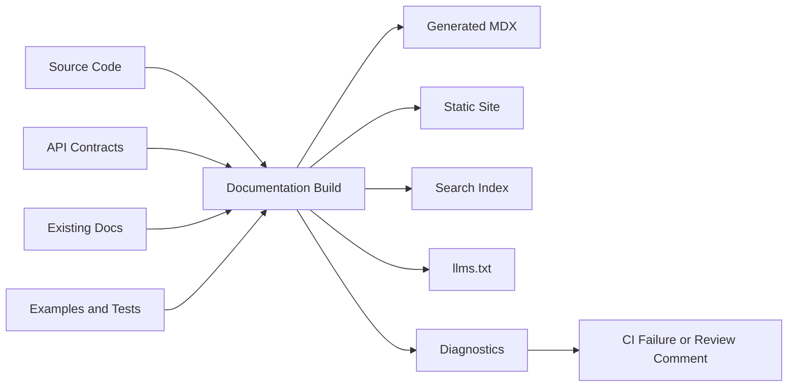
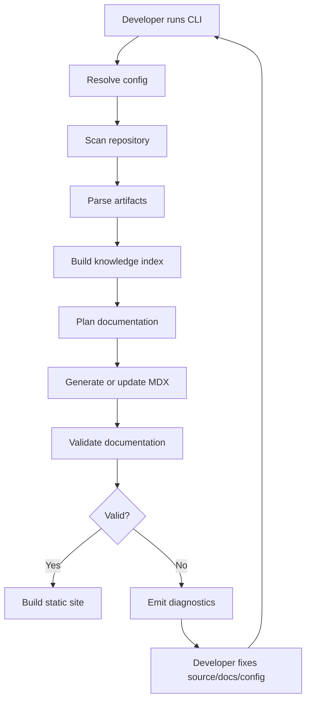
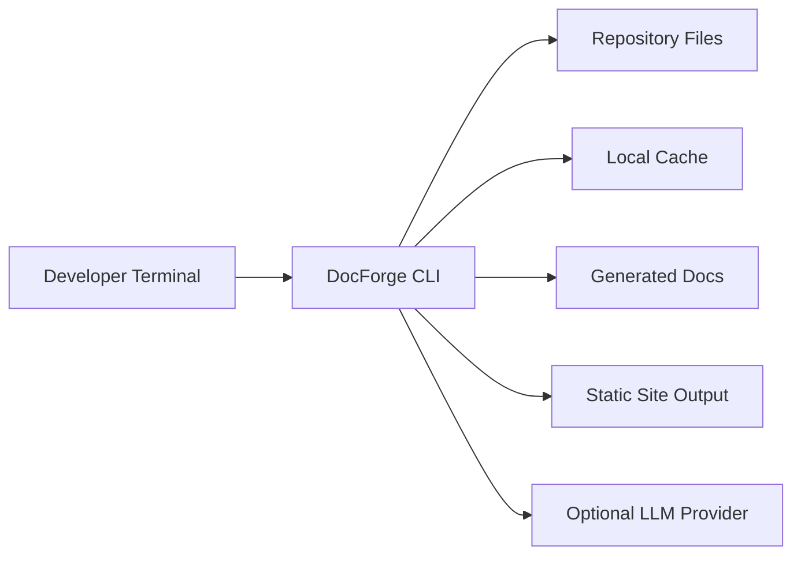

------
title: Build From Scratch: Mintlify-like AI-driven Documentation Generator CLI - Part 001
description: Product mental model, scope, constraints, and first-principles definition of the AI-driven documentation generator we will build from scratch.
series: learn-mintlify-like-ai-docs-cli
seriesTitle: Build From Scratch: Mintlify-like AI-driven Documentation Generator CLI
order: 1
partTitle: Product Mental Model and Scope
tags:
  - documentation
  - ai
  - cli
  - mdx
  - openapi
  - developer-tools
date: 2026-07-03
---

# Part 001 — Product Mental Model and Scope

Kita tidak sedang membangun “Markdown generator yang memanggil LLM”. Itu terlalu dangkal.

Kita akan membangun **developer documentation generator CLI** yang mampu membaca sebuah repository, memahami struktur project, mengekstrak knowledge dari code/spec/docs existing, lalu menghasilkan dokumentasi yang:

1. bisa dibaca manusia,
2. bisa dipakai developer untuk onboarding,
3. bisa dipakai agent/LLM sebagai knowledge source,
4. bisa diverifikasi terhadap source of truth,
5. bisa di-update ketika code berubah,
6. bisa dipublish sebagai static documentation site.

Target mental modelnya:

> Documentation is a compiled, verifiable, versioned product artifact derived from source code, API contracts, examples, and human intent.

Kalau kita hanya menganggap dokumentasi sebagai kumpulan file Markdown, kita akan membangun tool yang rapuh. Kalau kita menganggap dokumentasi sebagai **compiled artifact**, maka kita mulai berpikir seperti compiler engineer: input, parse, normalize, intermediate representation, transform, validate, emit, diagnostics.

Itulah arah seri ini.

---

## 1. Produk yang Akan Dibangun

Nama working product kita dalam seri ini: **DocForge CLI**.

Nama ini hanya placeholder. Yang penting adalah bentuk produknya.

DocForge adalah CLI untuk developer yang bekerja di dalam repository source code.

Contoh command akhirnya kira-kira seperti ini:

```bash
npx docforge init
npx docforge dev
npx docforge build
npx docforge generate
npx docforge check
npx docforge update --from-diff origin/main...HEAD
npx docforge index
npx docforge serve-mcp
```

CLI ini akan menghasilkan project dokumentasi seperti:

```txt
my-service/
├── src/
├── tests/
├── openapi.yaml
├── package.json
├── README.md
└── docs/
    ├── docs.json
    ├── index.mdx
    ├── quickstart.mdx
    ├── concepts/
    │   ├── architecture.mdx
    │   └── lifecycle.mdx
    ├── guides/
    │   ├── local-development.mdx
    │   └── deployment.mdx
    ├── api-reference/
    │   └── users/
    │       ├── list-users.mdx
    │       └── create-user.mdx
    └── generated/
        ├── llms.txt
        └── llms-full.txt
```

Namun output file bukan satu-satunya hasil. Yang lebih penting adalah **system behavior**:

- CLI bisa memahami struktur repository.
- CLI bisa membedakan source code, config, tests, docs lama, OpenAPI, examples, changelog, dan scripts.
- CLI bisa membuat knowledge index lokal.
- CLI bisa membuat plan dokumentasi sebelum menulis halaman.
- CLI bisa menghasilkan MDX yang valid.
- CLI bisa memeriksa link, frontmatter, code snippets, OpenAPI examples, dan stale pages.
- CLI bisa menyarankan update docs dari git diff.
- CLI bisa menghasilkan format yang ramah LLM seperti `llms.txt` dan `llms-full.txt`.
- CLI bisa expose search/retrieval lewat MCP server.

Produk ini mirip secara kategori dengan documentation platforms modern seperti Mintlify, tetapi seri ini bukan cloning UI atau reverse engineering produk tertentu. Kita mengambil **kelas masalahnya**: docs-as-code, MDX, API docs, AI-assisted documentation maintenance, search, and agent-ready documentation.

---

## 2. Apa Arti “Mintlify-like” dalam Seri Ini

“Mintlify-like” di sini berarti beberapa karakteristik produk:

| Karakteristik | Maksud dalam seri ini |
|---|---|
| Docs-as-code | Dokumentasi hidup di repository, versioned bersama source code. |
| MDX-first | Konten utama memakai MDX agar Markdown bisa bercampur dengan komponen interaktif. |
| Config-driven navigation | Struktur site dikendalikan oleh file config seperti `docs.json`. |
| API reference generation | OpenAPI document bisa menjadi halaman API reference. |
| Local developer workflow | Developer bisa `init`, `dev`, `build`, dan `check` secara lokal. |
| Search | Static search index dibangun dari output dokumentasi. |
| AI-assisted docs | AI membantu membuat, mengubah, dan me-review docs berdasarkan code/spec. |
| Agent-readable docs | Output seperti `llms.txt`, markdown bundle, atau MCP retrieval endpoint. |
| Quality gates | Build bisa gagal kalau docs invalid, link rusak, examples stale, atau source tidak jelas. |

Yang **bukan** target seri ini:

- membangun SaaS multi-tenant penuh,
- membangun visual editor WYSIWYG,
- membangun hosting platform sendiri dari nol,
- meniru desain visual Mintlify satu per satu,
- membuat crawler internet documentation umum,
- membuat LLM foundation model,
- mengganti technical writer dengan agent otomatis sepenuhnya.

Kita fokus pada **developer-local CLI** yang bisa tumbuh menjadi platform.

---

## 3. Masalah Sebenarnya: Documentation Drift

Masalah dokumentasi bukan “tidak ada Markdown”. Masalah sebenarnya adalah **drift**.

Drift terjadi ketika dokumentasi tidak lagi sesuai dengan realitas sistem.

Contoh drift:

- Endpoint berubah, docs masih menampilkan request lama.
- Environment variable diganti, quickstart masih gagal.
- CLI command rename, tutorial masih memakai command lama.
- Public function deprecated, docs masih merekomendasikan usage lama.
- Error response berubah, API reference tidak update.
- Architecture diagram tidak sesuai dependency sebenarnya.
- README menjanjikan behavior yang tidak lagi ada di code.

Dalam sistem besar, drift bukan exception. Drift adalah default outcome kalau tidak ada mekanisme kontrol.

Karena itu dokumentasi modern harus diperlakukan seperti software artifact:



Kalau source berubah tetapi docs tidak berubah, sistem harus bisa mendeteksi risiko drift.

---

## 4. Dokumentasi sebagai Compiler Problem

Cara paling produktif memikirkan project ini adalah sebagai compiler pipeline.

Compiler tradisional:

```txt
source code -> lexer/parser -> AST -> semantic analysis -> IR -> optimization -> target output
```

Documentation generator kita:

```txt
repo artifacts -> scanners/parsers -> knowledge graph -> content IR -> validation -> MDX/static output
```

Mapping-nya:

| Compiler | Documentation Generator |
|---|---|
| Source file | Code, OpenAPI, README, tests, examples |
| Parser | Markdown parser, OpenAPI parser, Tree-sitter parser |
| AST | Markdown AST, OpenAPI object model, code syntax tree |
| Symbol table | Repository symbol index |
| Semantic analysis | Relationship between code, docs, endpoints, examples |
| IR | Content intermediate representation |
| Optimization | Deduplication, ordering, chunking, link resolution |
| Code generation | MDX page emission, search index, `llms.txt` |
| Diagnostics | Broken links, stale examples, invalid frontmatter, missing source |

Mental model ini penting karena membuat design kita lebih stabil.

Tanpa IR, AI output akan langsung menulis MDX. Itu cepat, tetapi rapuh.

Dengan IR, AI bisa membuat **page plan** dan **content blocks** dulu. Setelah itu compiler yang deterministic mengubahnya menjadi MDX.

Contoh content IR sederhana:

```ts
type ContentDocument = {
  id: string;
  title: string;
  description?: string;
  sourceRefs: SourceRef[];
  sections: ContentSection[];
};

type ContentSection = {
  id: string;
  heading: string;
  blocks: ContentBlock[];
};

type ContentBlock =
  | { type: 'paragraph'; text: string; sourceRefs: SourceRef[] }
  | { type: 'code'; language: string; value: string; sourceRefs: SourceRef[] }
  | { type: 'callout'; severity: 'info' | 'warning' | 'danger'; text: string }
  | { type: 'apiOperation'; operationId: string; sourceRefs: SourceRef[] };

type SourceRef = {
  artifactId: string;
  path: string;
  startLine?: number;
  endLine?: number;
  kind: 'code' | 'openapi' | 'markdown' | 'config' | 'test' | 'human';
};
```

Ini bukan final implementation, tetapi arah berpikirnya jelas: **konten harus punya struktur dan provenance**.

---

## 5. Source of Truth dan Derived Artifact

Dalam project documentation generator, kesalahan arsitektur paling mahal adalah tidak membedakan:

1. **Source of truth**
2. **Human-authored documentation**
3. **Generated documentation**
4. **Derived indexes**
5. **AI suggestions**

Mari definisikan.

### 5.1 Source of truth

Source of truth adalah artifact yang dianggap paling otoritatif untuk fakta tertentu.

Contoh:

| Fakta | Source of truth paling kuat |
|---|---|
| Endpoint path | OpenAPI spec atau route declaration |
| Request schema | OpenAPI schema, JSON Schema, protobuf, DTO source |
| CLI command | CLI source code atau command registry |
| Environment variable | Config schema, deployment manifest, validation code |
| Error code | Error enum, OpenAPI responses, centralized error registry |
| Install step | Package metadata, lockfile, release artifact |
| Public API usage | Tests, examples, SDK source |

Tidak semua fakta punya source of truth tunggal. Kadang OpenAPI dan code berbeda. Dalam kondisi itu, generator tidak boleh pura-pura tahu. Generator harus menghasilkan diagnostic:

```txt
DOCF-OPENAPI-CODE-MISMATCH
Route exists in source code but is missing in openapi.yaml:
  GET /internal/users/{id}

Candidates:
  src/routes/users.ts:42
  openapi.yaml: no matching path
```

### 5.2 Human-authored docs

Human-authored docs adalah file yang ditulis manusia: conceptual guide, architecture decision, migration guide, business rationale, tutorial narrative.

AI boleh membantu, tetapi tidak semua hal bisa disimpulkan dari code.

Contoh yang sulit diekstrak dari code:

- alasan product decision,
- trade-off architecture,
- internal policy,
- migration strategy,
- known limitations,
- support promise,
- regulatory constraint.

Karena itu kita perlu mendukung `human` source ref.

### 5.3 Generated docs

Generated docs adalah output dari system: API reference pages, generated snippets, index pages, summary pages, `llms.txt`.

Generated docs harus jelas statusnya. Jangan mencampur generated block dengan human block tanpa marker.

Contoh frontmatter:

```yaml
generated: true
generatedBy: docforge
sourceHash: 7f2d9a8
lastGeneratedAt: 2026-07-03T10:20:00Z
```

### 5.4 Derived indexes

Search index, embeddings metadata, symbol graph, and build cache adalah derived indexes.

Aturannya:

> Derived indexes can be deleted and rebuilt without losing human intent.

Kalau kita kehilangan search index, tidak masalah. Kalau kita kehilangan human-written migration guide, itu masalah.

### 5.5 AI suggestions

AI output belum tentu truth. AI output adalah proposal yang harus melewati validation.

AI boleh:

- membuat draft,
- merangkum source,
- membuat page plan,
- mengusulkan diff,
- mengklasifikasi artifact,
- membuat explanation.

AI tidak boleh:

- mengklaim fakta tanpa source,
- menulis secret ke docs,
- menjalankan command arbitrary,
- overwrite human content tanpa diff/review,
- membuat API behavior yang tidak ada di spec/code.

---

## 6. Core Product Loop

Produk ini punya loop utama:



Loop ini harus terasa cepat. Kalau setiap command butuh scan full repo + LLM call mahal, developer tidak akan pakai.

Karena itu sejak awal kita butuh:

- file hashing,
- incremental cache,
- diagnostics yang presisi,
- deterministic command behavior,
- optional AI mode,
- dry-run mode,
- CI-friendly output.

---

## 7. User Jobs

Produk bagus dimulai dari user jobs, bukan dari library.

### 7.1 Developer baru di project

Job:

> Saya baru join project. Saya ingin memahami cara menjalankan, struktur modul, API utama, dan common flows tanpa membaca seluruh codebase manual.

Tool harus menghasilkan:

- Quickstart,
- architecture overview,
- local development guide,
- key modules page,
- troubleshooting guide,
- API reference kalau ada OpenAPI.

### 7.2 Maintainer yang mengubah API

Job:

> Saya mengubah endpoint. Saya ingin tahu docs mana yang terdampak sebelum PR merge.

Tool harus:

- membaca git diff,
- mendeteksi changed route/schema,
- menemukan docs yang menyebut endpoint tersebut,
- menyarankan patch,
- menjalankan quality gate.

### 7.3 Technical writer

Job:

> Saya ingin menulis docs yang baik, tetapi butuh bantuan memahami source code dan menjaga konsistensi.

Tool harus:

- memberi source-aware suggestions,
- menunjukkan provenance,
- menjaga IA/sidebar,
- menolak klaim tanpa sumber,
- membantu style consistency.

### 7.4 Platform engineering team

Job:

> Saya ingin banyak service punya docs konsisten dan bisa dipublish otomatis.

Tool harus:

- punya config schema stabil,
- support monorepo,
- support CI,
- bisa dijalankan tanpa interactive prompt,
- punya exit code jelas,
- bisa generate machine-readable reports.

### 7.5 AI coding assistant / agent

Job:

> Saya ingin mengambil informasi docs yang relevan untuk menjawab pertanyaan atau membantu coding.

Tool harus menghasilkan:

- `llms.txt`,
- `llms-full.txt`,
- markdown export,
- search index,
- optional MCP server.

---

## 8. Product Surface Area

Kita akan membangun beberapa permukaan produk.

### 8.1 CLI commands

Minimal command surface:

```txt
docforge init        Initialize docs project
docforge dev         Run local preview server
docforge build       Build static documentation site
docforge check       Validate docs, links, config, examples
docforge index       Build repository knowledge index
docforge generate    Generate docs from source artifacts
docforge update      Update docs based on repository changes
docforge export      Export agent-readable docs
docforge serve-mcp   Serve docs/search through MCP-compatible server
```

Command design principle:

> Commands should compose. No command should hide irreversible mutation behind a vague name.

Contoh:

```bash
# Safe: inspect plan only
docforge generate --plan

# Safe: show patch but do not write
docforge generate --dry-run

# Mutating: write files
docforge generate --write

# CI mode: fail on diagnostics above threshold
docforge check --strict
```

### 8.2 Config file

Kita akan memakai config seperti:

```json
{
  "$schema": "https://docforge.dev/schemas/docs.schema.json",
  "schemaVersion": 1,
  "name": "Acme Payments API",
  "theme": {
    "primaryColor": "blue",
    "logo": "./assets/logo.svg"
  },
  "navigation": [
    {
      "group": "Getting Started",
      "pages": ["index", "quickstart"]
    },
    {
      "group": "Concepts",
      "pages": ["concepts/architecture", "concepts/lifecycle"]
    },
    {
      "group": "API Reference",
      "pages": ["api-reference/users/list-users"]
    }
  ],
  "api": {
    "openapi": "../openapi.yaml"
  },
  "ai": {
    "enabled": true,
    "provider": "openai-compatible",
    "model": "gpt-5.5-thinking"
  }
}
```

Important: config is not just settings. Config defines the **contract between repository and documentation system**.

### 8.3 Content files

Primary content format: MDX.

Why MDX?

- Markdown is easy for prose.
- JSX-style components allow rich docs components.
- API references, tabs, callouts, cards, steps, and custom components can be embedded.
- It maps well to modern React-based static rendering pipelines.

Example:

```mdx
---
title: Create a User
description: Create a new user account through the Users API.
---

# Create a User

Use this endpoint when onboarding a new user.

<Endpoint method="POST" path="/users" />

<RequestExample language="curl" />

<ResponseExample status="201" />
```

But we should not let arbitrary generated MDX become an execution risk. MDX can execute imported components depending on the rendering pipeline. That means later we need a trust model for MDX compilation.

---

## 9. Documentation Types We Must Support

A serious docs generator must understand different document types. One template cannot fit all.

### 9.1 Landing page

Purpose:

- explain what the project/product is,
- route readers to the right next step,
- establish trust quickly.

Common sections:

- what this is,
- when to use it,
- quick links,
- installation,
- core concepts.

### 9.2 Quickstart

Purpose:

- shortest path from zero to first success.

Quality criteria:

- executable steps,
- minimal branching,
- clear prerequisites,
- expected output,
- troubleshooting.

### 9.3 Concept page

Purpose:

- explain mental model.

Examples:

- architecture,
- lifecycle,
- authorization model,
- data model,
- plugin system.

### 9.4 How-to guide

Purpose:

- solve a concrete task.

Examples:

- configure OAuth,
- deploy to production,
- add a custom plugin,
- migrate from v1 to v2.

### 9.5 Reference page

Purpose:

- accurate lookup.

Examples:

- CLI flags,
- config schema,
- API endpoints,
- SDK methods,
- environment variables.

### 9.6 Troubleshooting page

Purpose:

- diagnose failure.

Should include:

- symptoms,
- likely causes,
- verification commands,
- fixes,
- escalation path.

### 9.7 Release/migration page

Purpose:

- help users move safely between versions.

Should include:

- breaking changes,
- compatibility matrix,
- migration steps,
- rollback guidance.

Our generator must treat these as distinct document shapes. Otherwise AI-generated docs become generic and low-signal.

---

## 10. Trust Levels

Every input artifact has a trust level.

```txt
highest trust
  ^
  |  code that is executed in tests
  |  formal API specs
  |  config schema
  |  source code declarations
  |  existing human docs
  |  comments
  |  README claims
  |  AI-generated draft
  v
lowest trust
```

This ordering is not universal, but it is a practical default.

Example:

If README says:

```md
Set PAYMENT_TIMEOUT=30
```

but config schema says:

```ts
PAYMENT_REQUEST_TIMEOUT_SECONDS: z.number().default(60)
```

then generator should flag a conflict.

A top-tier docs generator should not silently choose whichever source it saw first.

---

## 11. Top 1% Engineering Lens

The difference between a toy generator and a serious tool is not the presence of AI. It is the engineering discipline around AI.

### 11.1 Determinism boundary

Some operations must be deterministic:

- config parsing,
- file scanning,
- hash calculation,
- MDX compilation,
- link checking,
- OpenAPI validation,
- static site generation.

Some operations may be probabilistic:

- summarization,
- page planning,
- explanation generation,
- title suggestions.

Do not mix them casually.

Bad design:

```txt
docforge build -> calls LLM -> output changes every run
```

Better design:

```txt
docforge generate -> uses AI to propose content
docforge check -> deterministic validation
docforge build -> deterministic static output
```

Build should not depend on live LLM calls unless explicitly requested.

### 11.2 Provenance-first writing

Every important generated claim should trace to one or more sources.

Bad:

> The system uses Redis for caching sessions.

Better internal representation:

```json
{
  "claim": "The system uses Redis for caching sessions.",
  "sourceRefs": [
    {
      "path": "src/session/session-store.ts",
      "startLine": 12,
      "endLine": 39,
      "kind": "code"
    },
    {
      "path": "docker-compose.yml",
      "startLine": 18,
      "endLine": 27,
      "kind": "config"
    }
  ]
}
```

Final MDX may not show every citation to the reader, but the generator should retain traceability.

### 11.3 Failure must be explicit

A serious generator says:

```txt
I cannot generate API docs because openapi.yaml is invalid at components.schemas.User.required[2].
```

A weak generator says:

```txt
Generated docs successfully.
```

while emitting broken pages.

### 11.4 Human control

AI should not silently rewrite docs.

Preferred flow:

```txt
scan -> plan -> propose diff -> validate -> human review -> write/commit
```

For local use, `--write` can be direct. For CI/PR, patch proposal is safer.

### 11.5 Designed for deletion

Generated artifacts should be safe to delete and rebuild.

This implies:

- generated files must declare source hash,
- cache should not contain unique human content,
- manual edits inside generated regions must be detected or forbidden,
- generated blocks should be clearly marked.

---

## 12. Product Requirements

### 12.1 Functional requirements

DocForge must eventually support:

| ID | Requirement |
|---|---|
| FR-001 | Initialize a docs project with config, landing page, and starter navigation. |
| FR-002 | Validate config against a versioned schema. |
| FR-003 | Scan repository files with ignore rules and safety limits. |
| FR-004 | Classify artifacts by type and relevance. |
| FR-005 | Parse MDX and report syntax/frontmatter diagnostics. |
| FR-006 | Build a static documentation site from MDX pages. |
| FR-007 | Generate navigation/sidebar from config. |
| FR-008 | Ingest OpenAPI 3.x documents. |
| FR-009 | Generate API reference pages from OpenAPI operations. |
| FR-010 | Build a local search index from static output. |
| FR-011 | Index code symbols from selected languages. |
| FR-012 | Generate docs using source-aware AI planning and writing. |
| FR-013 | Validate generated docs against source references. |
| FR-014 | Detect docs affected by git diff. |
| FR-015 | Export `llms.txt` and `llms-full.txt`. |
| FR-016 | Provide optional MCP-compatible retrieval server. |
| FR-017 | Run in CI with deterministic exit codes. |
| FR-018 | Support dry-run and patch output. |

### 12.2 Non-functional requirements

| ID | Requirement |
|---|---|
| NFR-001 | Local commands should be fast on repeated runs through caching. |
| NFR-002 | Build output should be deterministic when AI is not explicitly invoked. |
| NFR-003 | CLI should not leak secrets into generated docs. |
| NFR-004 | Tool should work in monorepos. |
| NFR-005 | Diagnostics should include file path and location when possible. |
| NFR-006 | Generated docs should preserve human-authored content unless explicitly replaced. |
| NFR-007 | Project should be testable without real LLM calls. |
| NFR-008 | LLM provider should be pluggable. |
| NFR-009 | Large files and binary files should not crash the scanner. |
| NFR-010 | Security-sensitive operations should require explicit opt-in. |

---

## 13. Initial System Boundaries

We will intentionally start with a CLI-first architecture.



No server is required for basic usage.

This keeps the first version simple:

- no accounts,
- no multi-tenant auth,
- no hosted database,
- no web dashboard,
- no background worker platform.

Later, the same architecture can grow into SaaS by moving some components server-side.

---

## 14. Repository Layout for the Learning Project

We will build a TypeScript monorepo-style tool because the ecosystem for CLI, MDX, React rendering, static build, and Node-based developer tooling is mature.

Initial layout:

```txt
docforge/
├── package.json
├── pnpm-workspace.yaml
├── tsconfig.base.json
├── packages/
│   ├── cli/
│   │   ├── src/
│   │   │   ├── main.ts
│   │   │   ├── commands/
│   │   │   └── output/
│   │   └── package.json
│   ├── core/
│   │   ├── src/
│   │   │   ├── config/
│   │   │   ├── diagnostics/
│   │   │   ├── filesystem/
│   │   │   ├── project/
│   │   │   └── types/
│   │   └── package.json
│   ├── mdx/
│   │   ├── src/
│   │   │   ├── parse.ts
│   │   │   ├── compile.ts
│   │   │   └── validate.ts
│   │   └── package.json
│   ├── renderer/
│   │   ├── src/
│   │   │   ├── build.ts
│   │   │   ├── dev-server.ts
│   │   │   └── theme/
│   │   └── package.json
│   ├── openapi/
│   │   ├── src/
│   │   │   ├── parse.ts
│   │   │   ├── normalize.ts
│   │   │   └── emit-pages.ts
│   │   └── package.json
│   ├── indexer/
│   │   ├── src/
│   │   │   ├── scan.ts
│   │   │   ├── classify.ts
│   │   │   ├── symbols.ts
│   │   │   └── store.ts
│   │   └── package.json
│   ├── ai/
│   │   ├── src/
│   │   │   ├── providers/
│   │   │   ├── prompts/
│   │   │   ├── planner.ts
│   │   │   └── writer.ts
│   │   └── package.json
│   └── testkit/
│       ├── src/
│       └── package.json
├── examples/
│   ├── basic-node-service/
│   ├── openapi-service/
│   └── monorepo/
└── docs-dev/
    └── dogfood-docs/
```

Why split packages early?

Because the architecture has clear boundaries:

- CLI shell should not know how to parse OpenAPI internals.
- MDX compiler should not know about LLM provider credentials.
- Indexer should not know about React rendering.
- AI writer should depend on content IR, not raw filesystem state.

This prevents a common failure: one giant `generateDocs.ts` script that becomes impossible to test.

---

## 15. First Vertical Slice

Before building advanced AI features, we need one complete boring path:

```txt
init -> create docs config -> create index.mdx -> build static HTML -> validate success
```

This is our first vertical slice.

### 15.1 Why vertical slice matters

A vertical slice gives us an end-to-end feedback loop.

If we build parsers, AI prompts, and code indexers first, we may spend weeks without a usable product. Instead, we want a tiny path that proves:

- command loading works,
- config can be created,
- MDX can be parsed,
- renderer can emit something,
- diagnostics can be shown,
- tests can assert output.

### 15.2 Minimal v0 behavior

```bash
npx docforge init
```

Creates:

```txt
docs/
├── docs.json
└── index.mdx
```

Then:

```bash
npx docforge build
```

Creates:

```txt
.docforge/dist/
├── index.html
└── assets/
```

Then:

```bash
npx docforge check
```

Outputs:

```txt
✓ config valid
✓ 1 MDX page parsed
✓ navigation valid
✓ no broken internal links
```

This is not flashy. It is necessary.

---

## 16. Scope Control

A product like this can explode in complexity. Scope control is survival.

### 16.1 Version 0

V0 should support:

- CLI init,
- config schema,
- MDX pages,
- navigation,
- local static build,
- basic diagnostics.

No AI yet.

### 16.2 Version 1

V1 adds:

- OpenAPI ingestion,
- API reference generation,
- search index,
- codebase scanner,
- knowledge store.

### 16.3 Version 2

V2 adds:

- AI planner,
- AI writer,
- provenance,
- diff-aware updates,
- docs quality evaluation.

### 16.4 Version 3

V3 adds:

- GitHub PR automation,
- verified code examples,
- `llms.txt`,
- MCP server,
- plugin system,
- performance hardening.

This series covers all of them, but implementation must grow in that order.

---

## 17. The Most Important Design Rule

The central design rule for the entire series:

> AI may propose. Deterministic systems must verify.

This rule affects everything.

AI-generated page:

```txt
LLM -> page plan -> structured output -> provenance validation -> MDX emitter -> MDX compiler -> link checker -> final file
```

Not:

```txt
LLM -> final file -> hope
```

This one distinction separates serious engineering from demo engineering.

---

## 18. Failure Modes We Must Design For

### 18.1 Hallucinated documentation

Symptom:

- docs mention features that do not exist.

Prevention:

- provenance requirement,
- source-aware retrieval,
- fact-check pass,
- no unsupported claims in strict mode.

### 18.2 Broken generated MDX

Symptom:

- generated file does not compile.

Prevention:

- structured output schema,
- MDX AST generation where possible,
- compile before write,
- diagnostics with line/column.

### 18.3 Secret leakage

Symptom:

- `.env`, token, private key, or credentials appear in generated docs.

Prevention:

- secret scanner,
- denylist paths,
- entropy checks,
- redaction layer,
- untrusted artifact policy.

### 18.4 Stale API reference

Symptom:

- API reference does not match OpenAPI/code.

Prevention:

- source hash in generated file,
- check command compares current hash,
- generated block markers.

### 18.5 Slow monorepo indexing

Symptom:

- every command scans 200k files.

Prevention:

- ignore rules,
- content hash cache,
- incremental index,
- language-specific parser opt-in,
- max file size.

### 18.6 Bad navigation

Symptom:

- generated docs exist but are unreachable.

Prevention:

- orphan page detection,
- nav validation,
- generated nav proposal,
- explicit hidden pages.

### 18.7 Unreviewed destructive writes

Symptom:

- AI overwrites carefully written docs.

Prevention:

- dry-run default for AI commands,
- patch preview,
- generated regions,
- conflict detection.

---

## 19. Initial Acceptance Criteria

At the end of Part 002, our system design should be clear enough that implementation can begin.

Acceptance criteria for the conceptual foundation:

- We can explain the product in one paragraph.
- We can list what it is and is not.
- We know the core commands.
- We know the primary inputs and outputs.
- We know the source-of-truth hierarchy.
- We know why IR is needed.
- We know why AI should not directly own final output.
- We know the first vertical slice.
- We know the high-level package boundaries.

---

## 20. The Product Spec, Condensed

DocForge is a local-first CLI that turns repository knowledge into human-readable, statically buildable, and agent-readable documentation.

It reads:

- source code,
- existing docs,
- OpenAPI specs,
- config files,
- tests,
- examples,
- git diffs.

It produces:

- MDX documentation pages,
- API reference pages,
- navigation config,
- static site output,
- search index,
- `llms.txt`,
- diagnostics,
- suggested patches.

It guarantees:

- deterministic build path,
- explicit diagnostics,
- safe handling of generated content,
- provenance for generated claims,
- no silent destructive rewrites.

It uses AI for:

- planning,
- summarization,
- explanation,
- update proposals,
- review assistance.

It does not trust AI as final authority.

---

## 21. What Comes Next

Part 002 turns this product definition into a concrete architecture.

We will define:

- system layers,
- package responsibilities,
- internal contracts,
- command-to-component flow,
- cache boundaries,
- error model,
- security boundaries,
- build pipeline architecture.

After that, implementation can start with `docforge init` and config schema.

---

## References

- Mintlify docs describe a `docs.json` configuration model for navigation, appearance, integrations, and site organization: [Mintlify Global Settings](https://www.mintlify.com/docs/organize/settings)
- Mintlify navigation is configured using groups, pages, dropdowns, tabs, anchors, and related structures in `docs.json`: [Mintlify Navigation](https://www.mintlify.com/docs/organize/navigation)
- MDX allows Markdown content to include JSX/components, which makes it suitable for component-rich documentation: [MDX](https://mdxjs.com/)
- OpenAPI defines a language-agnostic interface description for HTTP APIs: [OpenAPI Specification 3.1.0](https://spec.openapis.org/oas/v3.1.0.html)
- Pagefind is a static search library designed to work with generated static HTML output: [Pagefind](https://pagefind.app/)
- Mintlify has documented support for AI-oriented documentation surfaces such as `llms.txt` and `llms-full.txt`: [Mintlify llms.txt blog](https://www.mintlify.com/blog/simplifying-docs-with-llms-txt)
