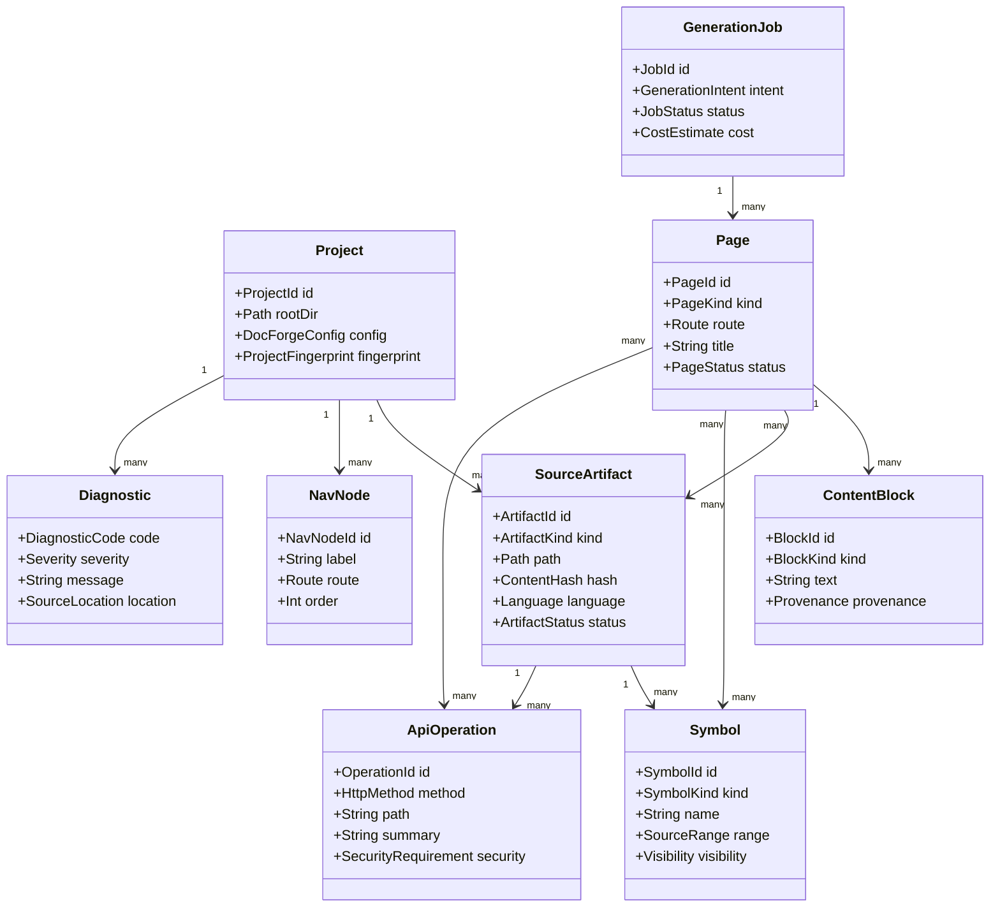
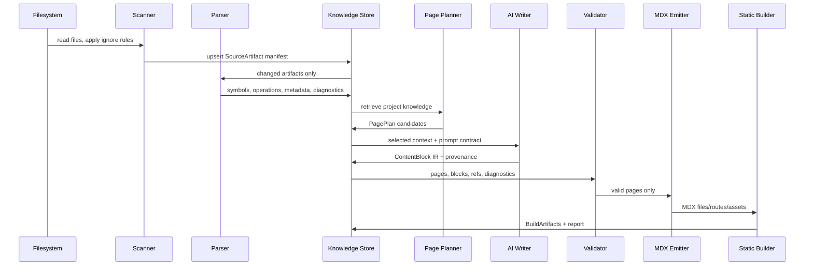
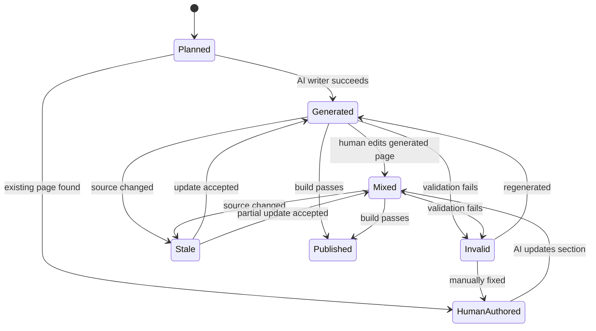
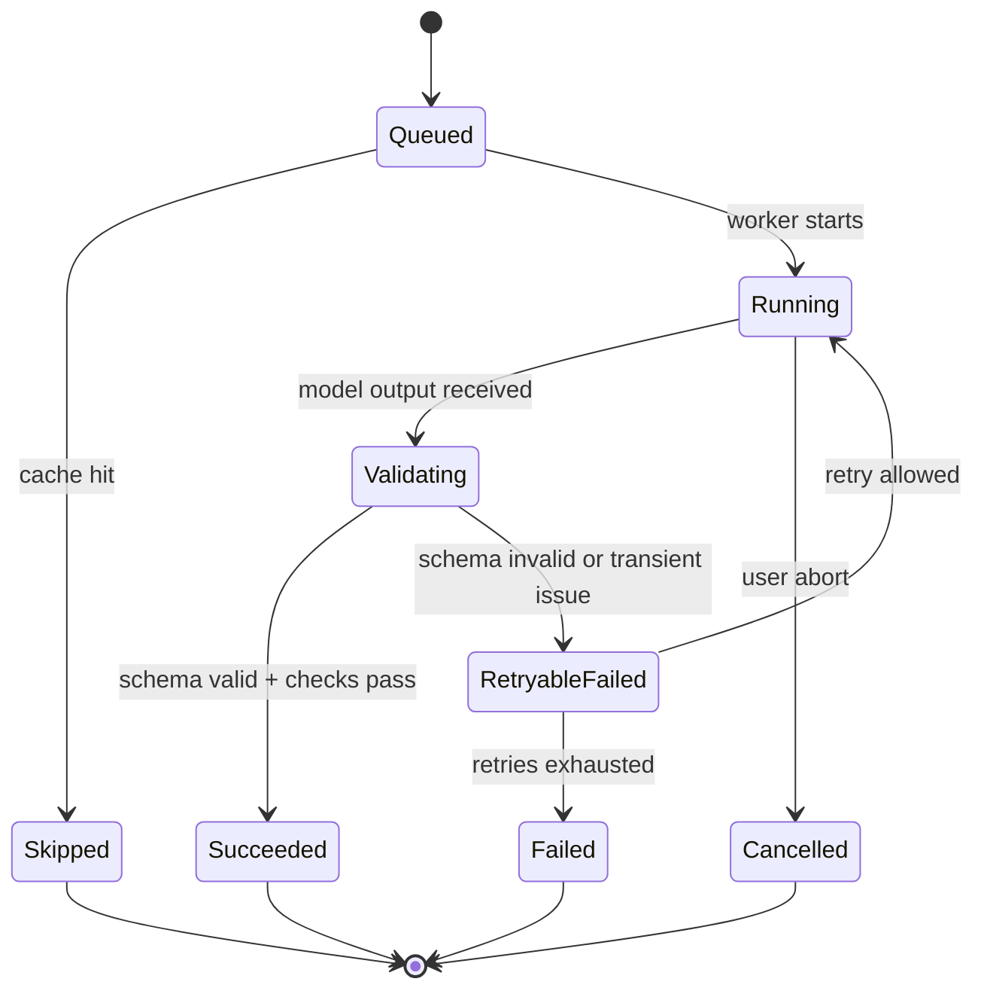
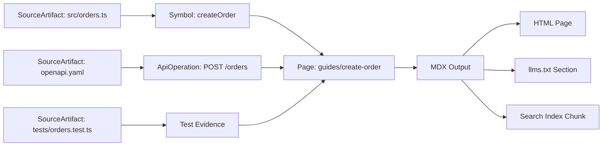

------
title: Build From Scratch: Mintlify-like AI-driven Documentation Generator CLI - Part 003
description: Domain model, lifecycle, boundaries, and core invariants for a production-grade AI-driven documentation generator CLI.
series: learn-mintlify-like-ai-docs-cli
seriesTitle: Build From Scratch: Mintlify-like AI-driven Documentation Generator CLI
order: 3
partTitle: Domain Model and Core Invariants
tags:
  - documentation
  - ai
  - cli
  - architecture
  - domain-modeling
  - invariants
date: 2026-07-03
---

# Part 003 — Domain Model and Core Invariants

Di Part 001 kita mendefinisikan produk: **DocForge CLI**, sebuah CLI documentation generator yang membaca repository, membangun knowledge model, lalu menghasilkan dokumentasi MDX/static docs yang bisa dipakai manusia dan AI agent.

Di Part 002 kita membuat arsitektur sistemnya: scanner, parser, indexer, AI layer, MDX compiler, renderer, search, export, quality gates, dan deployment adapter.

Sekarang kita masuk ke hal yang sering dilewati ketika membangun developer tool: **domain model dan invariant**.

Kenapa ini penting?

Karena documentation generator yang memakai AI akan cepat rusak kalau model domainnya kabur. Tanpa domain model yang kuat, semua hal akan berubah menjadi string processing:

- file dianggap hanya path,
- halaman dianggap hanya Markdown,
- source code dianggap hanya teks,
- API spec dianggap hanya YAML,
- hasil AI dianggap langsung benar,
- build dianggap hanya render HTML,
- error dianggap hanya exception.

Itu cara berpikir yang salah.

Untuk membangun tool kelas production, kita harus punya model yang lebih tegas:

> A documentation generator is a compiler from repository knowledge into verified documentation artifacts.

Compiler yang baik punya input model, intermediate representation, validation rules, transform phases, diagnostics, dan output model. DocForge juga harus begitu.

---

## 1. Tujuan Part Ini

Setelah part ini, kita ingin punya peta mental yang jelas tentang:

1. apa saja entity utama di dalam DocForge,
2. bagaimana entity saling berhubungan,
3. apa invariant yang tidak boleh dilanggar,
4. lifecycle sebuah artifact dari file repository sampai menjadi page,
5. bagaimana provenance dan traceability dijaga,
6. bagaimana domain model ini mendukung AI tanpa membiarkan AI menjadi sumber kebenaran tunggal.

Kita belum akan menulis implementasi penuh. Tapi model ini akan menjadi dasar untuk Part 004 dan seterusnya.

Kalau domain modelnya benar, implementasi CLI, scanner, cache, generator, evaluator, dan PR automation akan terasa natural.

Kalau domain modelnya salah, setiap part berikutnya akan dipenuhi patch, pengecualian, dan special case.

---

## 2. Prinsip Dasar Domain Model DocForge

Ada lima prinsip utama.

### Prinsip 1 — Source of Truth Tidak Sama dengan Output

Source of truth bisa berupa:

- source code,
- OpenAPI spec,
- existing README,
- inline comments,
- tests,
- examples,
- package metadata,
- changelog,
- ADR,
- human-authored docs.

Output bisa berupa:

- MDX page,
- static HTML,
- search index,
- `llms.txt`,
- API reference page,
- generated snippet,
- diagnostics report,
- PR patch.

Kita tidak boleh mencampur keduanya.

Salah satu bug desain paling berbahaya adalah menjadikan generated documentation sebagai satu-satunya sumber kebenaran. Itu akan membuat dokumentasi semakin jauh dari code dari waktu ke waktu.

DocForge harus selalu bisa menjawab:

> Klaim ini berasal dari mana?

Kalau sebuah halaman mengatakan “endpoint ini membutuhkan Bearer token”, sistem harus bisa menunjuk ke salah satu sumber:

- OpenAPI `securitySchemes`,
- middleware authentication code,
- route annotation,
- test integration,
- atau human note yang eksplisit.

Tanpa provenance, AI documentation generator hanyalah hallucination generator yang tampil rapi.

---

### Prinsip 2 — Page Bukan File Markdown

File Markdown/MDX hanyalah representasi fisik.

Secara domain, sebuah page adalah unit informasi yang punya:

- identity,
- route,
- title,
- description,
- purpose,
- audience,
- source references,
- content blocks,
- semantic type,
- diagnostics,
- generated state,
- quality status.

Contoh semantic page type:

- `landing`,
- `quickstart`,
- `concept`,
- `how_to`,
- `reference`,
- `api_operation`,
- `troubleshooting`,
- `migration`,
- `release_note`,
- `architecture_decision`.

Kenapa ini penting?

Karena quickstart dan API reference punya aturan berbeda.

Quickstart harus menjawab:

- apa prasyaratnya,
- command pertama apa,
- expected output apa,
- langkah minimal untuk berhasil apa,
- error umum apa.

API reference harus menjawab:

- method/path,
- auth,
- parameters,
- request body,
- response schema,
- status code,
- examples,
- error semantics.

Kalau semua dianggap Markdown biasa, quality gate tidak bisa cerdas.

---

### Prinsip 3 — AI Output Harus Masuk Melalui IR, Bukan Langsung Menjadi File

Jangan biarkan LLM langsung menulis file final tanpa validasi.

Pipeline yang lebih aman:

```txt
Repository Sources
      ↓
SourceArtifact
      ↓
Knowledge Extraction
      ↓
ContentPlan / PagePlan
      ↓
GeneratedBlock IR
      ↓
Validation
      ↓
MDX Emission
      ↓
Compile Check
      ↓
Build Output
```

AI boleh membantu membuat plan dan draft. Tapi output AI harus diperlakukan sebagai candidate artifact, bukan truth.

Artinya, LLM boleh menghasilkan:

- page outline,
- draft section,
- explanation,
- code example,
- troubleshooting note,
- summary,
- navigation suggestion.

Namun sistem harus tetap memvalidasi:

- apakah MDX valid,
- apakah link valid,
- apakah code block bisa dijalankan,
- apakah API endpoint benar,
- apakah claim punya provenance,
- apakah tidak ada secret yang bocor,
- apakah tidak ada path traversal,
- apakah tidak ada hallucinated command.

---

### Prinsip 4 — Semua Transformasi Harus Bisa Dijelaskan

DocForge harus bisa menghasilkan diagnostics yang manusia bisa pahami.

Bukan:

```txt
Build failed.
```

Tapi:

```txt
File: docs/guides/authentication.mdx
Problem: Endpoint /v1/tokens referenced in this page no longer exists in openapi.yaml.
Source: openapi.yaml#/paths
Suggestion: Replace with /v1/oauth/token or mark this page as legacy.
```

Ini berarti setiap transformasi harus membawa metadata:

- input file,
- line range,
- parser phase,
- generated output,
- validation result,
- severity,
- suggested fix.

Error handling yang baik dimulai dari domain model yang punya tempat untuk diagnostic, bukan dari `try/catch` acak.

---

### Prinsip 5 — Incrementality Adalah Domain Concern, Bukan Optimisasi Belakangan

Large repository tidak bisa selalu di-scan dari nol.

DocForge harus sejak awal mengenal:

- file hash,
- content fingerprint,
- parser version,
- config version,
- generated artifact version,
- dependency graph,
- invalidation rules.

Kalau `src/routes/orders.ts` berubah, idealnya sistem hanya re-index:

- file tersebut,
- symbol yang terdampak,
- endpoint yang berubah,
- docs page yang mengutip endpoint tersebut,
- search chunk terkait,
- `llms.txt` section terkait.

Bukan rebuild seluruh dunia.

---

## 3. Peta Entity Utama

Berikut entity inti yang akan kita gunakan sepanjang seri.



Kita akan bedah satu per satu.

---

## 4. Project

`Project` adalah root aggregate.

Bukan sekadar folder. Project adalah kombinasi antara:

- root repository,
- docs directory,
- config,
- detected source artifacts,
- generated output,
- cache,
- knowledge store,
- diagnostics.

Minimal shape:

```ts
export type ProjectId = string;

export interface Project {
  id: ProjectId;
  rootDir: AbsolutePath;
  docsDir: AbsolutePath;
  configPath: AbsolutePath | null;
  config: DocForgeConfig;
  fingerprint: ProjectFingerprint;
  workspace: ProjectWorkspace;
}
```

`rootDir` adalah root repository.

`docsDir` adalah direktori dokumentasi, misalnya:

```txt
docs/
```

`configPath` bisa:

```txt
docs/docs.json
```

atau:

```txt
docforge.config.ts
```

Kita akan mulai sederhana dengan `docs/docs.json`, lalu nanti buka extension point.

### ProjectFingerprint

Fingerprint adalah identitas keadaan project pada waktu tertentu.

```ts
export interface ProjectFingerprint {
  configHash: string;
  lockfileHash?: string;
  sourceManifestHash: string;
  parserVersion: string;
  generatorVersion: string;
}
```

Fingerprint menjawab:

> Apakah output lama masih valid untuk input sekarang?

Kalau config berubah, output bisa berubah.

Kalau parser berubah, symbol extraction bisa berubah.

Kalau generator prompt berubah, generated text bisa berubah.

Kalau kita tidak menyimpan fingerprint, cache akan memberi hasil palsu.

### Project Invariants

Invariant untuk `Project`:

1. `rootDir` harus absolute path.
2. `docsDir` harus berada di bawah `rootDir`, kecuali explicit external docs mode diaktifkan.
3. `config` harus sudah tervalidasi schema sebelum pipeline berjalan.
4. `fingerprint` harus berubah jika config, parser, atau generator behavior berubah.
5. Setiap output build harus bisa dikaitkan ke satu `ProjectFingerprint`.

---

## 5. SourceArtifact

`SourceArtifact` adalah setiap input yang dapat berkontribusi ke dokumentasi.

Contoh:

```txt
README.md
package.json
src/server.ts
src/routes/orders.ts
openapi.yaml
docs/quickstart.mdx
tests/orders.test.ts
examples/create-order.ts
CHANGELOG.md
```

Model:

```ts
export type ArtifactKind =
  | "source_code"
  | "test_code"
  | "example_code"
  | "markdown"
  | "mdx"
  | "openapi"
  | "package_manifest"
  | "lockfile"
  | "config"
  | "changelog"
  | "adr"
  | "unknown";

export interface SourceArtifact {
  id: ArtifactId;
  projectId: ProjectId;
  kind: ArtifactKind;
  path: RepoRelativePath;
  absolutePath: AbsolutePath;
  language: LanguageId | null;
  mediaType: string | null;
  hash: ContentHash;
  sizeBytes: number;
  status: ArtifactStatus;
  discoveredAt: IsoTimestamp;
  lastIndexedAt: IsoTimestamp | null;
}
```

`SourceArtifact` bukan AST. Ia hanya menyatakan bahwa ada artifact fisik yang ditemukan.

Parsing artifact akan menghasilkan entity lain:

- `Symbol`,
- `ApiOperation`,
- `DocPageCandidate`,
- `PackageMetadata`,
- `Dependency`,
- `Diagnostic`.

### ArtifactStatus

```ts
export type ArtifactStatus =
  | "new"
  | "unchanged"
  | "changed"
  | "deleted"
  | "ignored"
  | "too_large"
  | "binary"
  | "parse_failed";
```

Status penting untuk incremental pipeline.

File yang `too_large` tidak boleh diam-diam dilewati tanpa diagnostic. Kalau source penting terlalu besar, user harus tahu.

### SourceArtifact Invariants

1. `id` harus stable selama path + project sama, kecuali artifact deletion policy berkata lain.
2. `hash` harus berdasarkan content, bukan modification time.
3. Artifact yang `ignored` tidak boleh masuk AI context.
4. Artifact yang `binary` tidak boleh dibaca sebagai teks.
5. Artifact yang `too_large` boleh dicatat, tapi tidak boleh diproses penuh tanpa explicit override.
6. Semua generated docs harus menyimpan provenance ke `SourceArtifact`, bukan hanya string path.

---

## 6. SourceRange dan SourceLocation

Kalau kita ingin diagnostics yang serius, kita butuh lokasi source yang presisi.

```ts
export interface SourcePosition {
  line: number;    // 1-based
  column: number;  // 1-based
  offset: number;  // 0-based byte or utf16 offset, harus konsisten
}

export interface SourceRange {
  artifactId: ArtifactId;
  start: SourcePosition;
  end: SourcePosition;
}

export interface SourceLocation {
  artifactId: ArtifactId;
  range?: SourceRange;
  jsonPointer?: string;
  yamlPath?: string;
  symbolId?: SymbolId;
}
```

Untuk source code, range berbasis line/column.

Untuk OpenAPI, kadang lebih baik pakai JSON Pointer:

```txt
#/paths/~1v1~1orders/post/requestBody
```

Untuk generated MDX, line range penting agar user tahu bagian mana yang error.

### Invariant Lokasi

1. Line dan column harus 1-based agar cocok dengan editor UX.
2. Offset harus konsisten di seluruh engine.
3. `SourceRange.start` tidak boleh setelah `SourceRange.end`.
4. Diagnostic harus punya minimal satu lokasi jika problem terkait file.
5. Generated claim yang berasal dari source harus menyimpan minimal artifact id dan range/path bila tersedia.

---

## 7. Symbol

`Symbol` adalah unit code-level yang bisa dijadikan referensi dokumentasi.

Contoh symbol:

- class,
- function,
- method,
- interface,
- type alias,
- enum,
- constant,
- module,
- exported object,
- annotation/decorator-bound route handler,
- CLI command handler.

Model:

```ts
export type SymbolKind =
  | "module"
  | "class"
  | "interface"
  | "type_alias"
  | "enum"
  | "function"
  | "method"
  | "field"
  | "constant"
  | "route_handler"
  | "cli_command"
  | "config_key";

export interface Symbol {
  id: SymbolId;
  projectId: ProjectId;
  artifactId: ArtifactId;
  kind: SymbolKind;
  name: string;
  qualifiedName: string;
  language: LanguageId;
  range: SourceRange;
  signatureRange?: SourceRange;
  docCommentRange?: SourceRange;
  visibility: SymbolVisibility;
  exported: boolean;
  tags: string[];
}
```

Kenapa `qualifiedName` penting?

Karena nama `create` bisa muncul di banyak tempat:

```txt
src/orders/service.ts#create
src/users/service.ts#create
src/payments/client.ts#create
```

Untuk dokumentasi, nama lokal tidak cukup.

### SymbolIdentity

`SymbolId` harus stabil.

Jangan generate random UUID setiap scan.

Lebih baik:

```txt
symbol:<project-id>:<artifact-path>:<qualified-name>:<kind>
```

Tapi ada trade-off. Kalau file dipindah, ID berubah. Kalau hanya nama berubah, ID berubah. Itu bisa diterima di awal, tapi nanti untuk advanced refactor detection kita bisa punya alias table.

### Symbol Invariants

1. Symbol harus punya artifact source.
2. Symbol harus punya range.
3. Symbol id harus deterministic.
4. Symbol yang diekspor/public lebih penting untuk docs dibanding private helper.
5. Symbol tidak boleh dianggap user-facing hanya karena ada di source code.
6. Satu symbol boleh berkontribusi ke banyak page.
7. Satu page boleh mengutip banyak symbol.

---

## 8. ApiOperation

`ApiOperation` adalah representasi domain dari endpoint API.

Sumbernya bisa dari:

- OpenAPI spec,
- source code route annotation,
- framework router,
- tests,
- API gateway config,
- generated inference.

Tapi kita harus membedakan certainty-nya.

```ts
export type ApiOperationSourceKind =
  | "openapi"
  | "source_route"
  | "test_inference"
  | "gateway_config"
  | "manual";

export interface ApiOperation {
  id: ApiOperationId;
  projectId: ProjectId;
  sourceKind: ApiOperationSourceKind;
  sourceArtifactId: ArtifactId;
  method: HttpMethod;
  path: string;
  operationId?: string;
  summary?: string;
  description?: string;
  tags: string[];
  parameters: ApiParameter[];
  requestBody?: ApiRequestBody;
  responses: ApiResponse[];
  security: SecurityRequirement[];
  provenance: Provenance[];
}
```

### Certainty Level

Tidak semua operation punya kepastian yang sama.

Endpoint dari OpenAPI yang valid lebih reliable daripada endpoint hasil inferensi LLM.

Tambahkan:

```ts
export type Confidence = "verified" | "strong" | "weak" | "speculative";

export interface Provenance {
  sourceArtifactId: ArtifactId;
  location?: SourceLocation;
  evidenceKind:
    | "openapi_path"
    | "route_definition"
    | "test_case"
    | "doc_comment"
    | "manual_note"
    | "ai_inference";
  confidence: Confidence;
}
```

AI inference tidak boleh langsung menjadi `verified`.

### ApiOperation Invariants

1. `method` harus valid HTTP method.
2. `path` harus diawali `/`.
3. Operation dari OpenAPI harus punya JSON Pointer provenance.
4. Operation hasil inference harus diberi confidence maksimal `weak` sampai diverifikasi.
5. API reference page tidak boleh dibuat dari operation `speculative` tanpa label eksplisit.
6. Setiap response harus punya status code atau response range.
7. Security requirement tidak boleh diarang oleh AI tanpa evidence.

---

## 9. Page

`Page` adalah unit dokumentasi.

```ts
export type PageKind =
  | "landing"
  | "quickstart"
  | "concept"
  | "how_to"
  | "reference"
  | "api_operation"
  | "troubleshooting"
  | "migration"
  | "release_note"
  | "architecture";

export type PageStatus =
  | "planned"
  | "generated"
  | "human_authored"
  | "mixed"
  | "stale"
  | "invalid"
  | "published";

export interface Page {
  id: PageId;
  projectId: ProjectId;
  kind: PageKind;
  route: RoutePath;
  filePath: RepoRelativePath;
  title: string;
  description?: string;
  status: PageStatus;
  frontmatter: PageFrontmatter;
  blocks: ContentBlock[];
  sourceRefs: SourceRef[];
  diagnostics: Diagnostic[];
}
```

### PageIdentity

Route harus stable.

File path bisa berubah, tapi route adalah public contract.

Contoh:

```txt
docs/guides/authentication.mdx → /guides/authentication
```

Kalau kita rename file, external links bisa rusak.

Karena itu, page model harus bisa membedakan:

- storage path,
- route path,
- nav position,
- canonical id.

### PageKind Menentukan Quality Gate

Contoh rules:

| Page Kind | Required Elements |
|---|---|
| `quickstart` | prerequisites, steps, expected result, troubleshooting |
| `how_to` | goal, steps, verification, rollback/failure note |
| `concept` | definition, mental model, examples, non-goals |
| `api_operation` | method/path, auth, params, request, response, errors |
| `troubleshooting` | symptom, cause, diagnosis, fix, prevention |
| `migration` | from version, to version, breaking changes, steps |

Ini membuat quality check lebih pintar daripada “apakah file ada title”.

### Page Invariants

1. Page harus punya route unik dalam project.
2. Page harus punya title.
3. Page yang dipublish tidak boleh punya diagnostic severity `error`.
4. Page generated harus punya sourceRefs.
5. Page human-authored boleh tanpa sourceRefs, tapi claim penting harus bisa diberi manual provenance.
6. Page API operation harus link ke `ApiOperation`.
7. Route tidak boleh mengandung `..`, backslash, atau unsafe path segment.

---

## 10. ContentBlock

`ContentBlock` adalah unit semantic di dalam page.

Jangan langsung berpikir “paragraph string”.

Kita butuh block model karena validasi dan generation harus granular.

```ts
export type BlockKind =
  | "heading"
  | "paragraph"
  | "code"
  | "callout"
  | "steps"
  | "tabs"
  | "table"
  | "api_reference"
  | "diagram"
  | "link_card"
  | "generated_summary";

export interface ContentBlock {
  id: BlockId;
  kind: BlockKind;
  order: number;
  content: BlockContent;
  provenance: Provenance[];
  generatedBy?: GenerationTrace;
  diagnostics: Diagnostic[];
}
```

### Kenapa Block-level Provenance?

Karena satu halaman bisa punya campuran:

- section dari source code,
- section dari OpenAPI,
- section dari README,
- section dari AI summary,
- section manual dari developer.

Kalau provenance hanya di page-level, kita tidak tahu klaim mana yang berasal dari mana.

Block-level provenance memungkinkan:

- stale detection,
- diff-aware update,
- reviewer agent,
- line-level citation,
- selective regeneration.

### Example ContentBlock

```ts
const block: ContentBlock = {
  id: "block_auth_required",
  kind: "callout",
  order: 4,
  content: {
    variant: "warning",
    title: "Authentication required",
    body: "All order endpoints require a Bearer token."
  },
  provenance: [
    {
      sourceArtifactId: "artifact_openapi_yaml",
      evidenceKind: "openapi_path",
      confidence: "verified",
      location: {
        artifactId: "artifact_openapi_yaml",
        jsonPointer: "#/components/securitySchemes/BearerAuth"
      }
    }
  ],
  diagnostics: []
};
```

### ContentBlock Invariants

1. Block order harus unik dalam page.
2. Generated block harus punya `generatedBy`.
3. Claim block harus punya provenance atau ditandai sebagai explanatory/inferred.
4. Code block harus punya language jika akan diverifikasi.
5. Diagram block harus bisa di-emit menjadi valid Mermaid atau static image placeholder.
6. Block diagnostics tidak boleh hilang ketika diubah menjadi MDX.

---

## 11. NavNode

Navigation bukan dekorasi. Navigation adalah information architecture.

```ts
export interface NavNode {
  id: NavNodeId;
  projectId: ProjectId;
  label: string;
  route?: RoutePath;
  children: NavNode[];
  order: number;
  source: "config" | "generated" | "inferred";
  diagnostics: Diagnostic[];
}
```

NavNode bisa berupa group:

```txt
Guides
  Quickstart
  Authentication
  Deployment
```

Atau page:

```txt
API Reference
  Create Order
  Get Order
```

### Navigation Invariants

1. Nav tree tidak boleh cyclic.
2. Route dalam nav harus menunjuk ke existing page.
3. Page yang publishable sebaiknya reachable dari nav atau punya alasan `hidden`.
4. Label tidak boleh kosong.
5. Generated nav harus bisa di-override human config.
6. Duplicate route dalam nav harus menjadi warning/error sesuai severity.

---

## 12. Diagnostic

Diagnostic adalah first-class domain object.

Bukan string error.

```ts
export type Severity = "info" | "warning" | "error" | "fatal";

export interface Diagnostic {
  code: DiagnosticCode;
  severity: Severity;
  message: string;
  location?: SourceLocation;
  phase: PipelinePhase;
  suggestion?: FixSuggestion;
  related?: SourceLocation[];
}
```

Contoh codes:

```ts
export type DiagnosticCode =
  | "CONFIG_SCHEMA_INVALID"
  | "DOCS_ROUTE_DUPLICATE"
  | "MDX_PARSE_ERROR"
  | "OPENAPI_REF_BROKEN"
  | "SOURCE_TOO_LARGE"
  | "SYMBOL_EXTRACTION_FAILED"
  | "PAGE_HAS_STALE_SOURCE"
  | "LINK_TARGET_MISSING"
  | "AI_OUTPUT_SCHEMA_INVALID"
  | "CODE_SAMPLE_FAILED";
```

### Diagnostic Severity

| Severity | Meaning | Build Behavior |
|---|---|---|
| `info` | useful note | continue |
| `warning` | likely issue | continue, non-strict mode passes |
| `error` | invalid output or broken source | fail strict build |
| `fatal` | cannot continue pipeline | stop phase immediately |

### Diagnostic Invariants

1. Diagnostic code harus stable dan dokumentable.
2. User-facing message harus actionable.
3. Fatal diagnostic harus menghentikan phase terkait.
4. Diagnostic dari internal exception harus di-normalize.
5. Diagnostic harus bisa diserialisasi ke JSON.
6. Diagnostic harus bisa ditampilkan ringkas di CLI dan lengkap di report.

---

## 13. GenerationJob

AI generation harus dimodelkan sebagai job.

Jangan panggil LLM secara ad-hoc dari mana-mana.

```ts
export type GenerationIntent =
  | "plan_site"
  | "plan_page"
  | "write_page"
  | "rewrite_section"
  | "summarize_code"
  | "generate_api_example"
  | "review_page"
  | "update_from_diff";

export interface GenerationJob {
  id: JobId;
  projectId: ProjectId;
  intent: GenerationIntent;
  inputRefs: SourceRef[];
  promptContractId: string;
  modelProfile: ModelProfile;
  status: JobStatus;
  costEstimate?: CostEstimate;
  result?: GenerationResult;
  diagnostics: Diagnostic[];
  createdAt: IsoTimestamp;
  completedAt?: IsoTimestamp;
}
```

### Kenapa GenerationJob Penting?

Karena AI call punya banyak concern:

- prompt version,
- model version,
- input context,
- output schema,
- retry,
- timeout,
- cost,
- trace,
- deterministic replay,
- human approval.

Kalau AI call hanya fungsi:

```ts
await llm.generate(prompt)
```

maka kita kehilangan kemampuan menjawab:

- prompt apa yang dipakai,
- source apa yang diberikan,
- model apa yang menghasilkan,
- kenapa hasil berubah,
- berapa biayanya,
- apakah output valid.

### GenerationJob Invariants

1. Job harus punya explicit intent.
2. Job harus mengacu ke prompt contract version.
3. Job tidak boleh menerima unbounded context.
4. Job result harus melewati schema validation.
5. Job yang gagal harus menghasilkan diagnostic, bukan silent null.
6. Job harus bisa di-skip jika input fingerprint tidak berubah.
7. Job tidak boleh menulis file langsung; ia menghasilkan IR atau patch candidate.

---

## 14. Provenance

Provenance adalah rantai bukti.

```ts
export interface Provenance {
  sourceArtifactId: ArtifactId;
  location?: SourceLocation;
  evidenceKind: EvidenceKind;
  confidence: Confidence;
  note?: string;
}
```

Evidence kinds:

```ts
export type EvidenceKind =
  | "source_code_symbol"
  | "source_code_comment"
  | "test_case"
  | "example_file"
  | "openapi_path"
  | "openapi_schema"
  | "package_manifest"
  | "readme_section"
  | "human_authored_doc"
  | "manual_note"
  | "ai_inference";
```

### Confidence Model

```ts
export type Confidence =
  | "verified"
  | "strong"
  | "weak"
  | "speculative";
```

Interpretasi:

| Confidence | Meaning | Example |
|---|---|---|
| `verified` | formally derived or validated | OpenAPI operation, executed code sample |
| `strong` | supported by source but not executable proof | exported function with doc comment |
| `weak` | inferred from patterns | route naming convention |
| `speculative` | AI/human guess without source | “probably used for...” |

Rule penting:

> Generated docs boleh mengandung explanation, tapi klaim factual harus punya provenance.

### Provenance Invariants

1. `verified` tidak boleh berasal hanya dari AI inference.
2. `speculative` tidak boleh dipublish sebagai fact tanpa label.
3. Provenance harus survive dari IR ke MDX metadata/report.
4. Jika source artifact berubah, semua block yang bergantung padanya harus diperiksa ulang.
5. Missing provenance pada required claim harus menghasilkan warning atau error sesuai mode.

---

## 15. SourceRef

`SourceRef` adalah hubungan antara output dan input.

```ts
export interface SourceRef {
  artifactId: ArtifactId;
  symbolId?: SymbolId;
  apiOperationId?: ApiOperationId;
  range?: SourceRange;
  reason: SourceRefReason;
}

export type SourceRefReason =
  | "explains"
  | "documents"
  | "examples"
  | "validates"
  | "derives_from"
  | "updates_when_changed";
```

Contoh:

Halaman `guides/authentication.mdx` bisa punya source refs:

```txt
openapi.yaml#/components/securitySchemes/BearerAuth
src/middleware/auth.ts#requireAuth
tests/auth.test.ts#rejectsMissingToken
README.md#Authentication
```

Dengan SourceRef, diff-aware update menjadi mungkin.

Jika `src/middleware/auth.ts` berubah, sistem tahu halaman authentication kemungkinan perlu dicek.

---

## 16. BuildArtifact

Output build juga harus dimodelkan.

```ts
export type BuildArtifactKind =
  | "html"
  | "json"
  | "css"
  | "js"
  | "search_index"
  | "sitemap"
  | "llms_txt"
  | "diagnostic_report"
  | "asset";

export interface BuildArtifact {
  id: BuildArtifactId;
  projectId: ProjectId;
  kind: BuildArtifactKind;
  outputPath: RelativePath;
  sourcePageId?: PageId;
  contentHash: string;
  sizeBytes: number;
}
```

Kenapa output perlu entity?

Karena deployment, caching, and validation butuh tahu:

- file apa saja yang dihasilkan,
- dari page mana,
- apakah berubah sejak build terakhir,
- apakah bisa di-cache immutable,
- apakah size terlalu besar,
- apakah search index lengkap.

---

## 17. Lifecycle Artifact dari Repo ke Docs

Mari lihat lifecycle secara utuh.



Pipeline ini sengaja tidak menulis file final terlalu awal.

Kita tahan output dalam bentuk domain object sampai cukup tervalidasi.

---

## 18. State Machine Page

Page punya lifecycle.



### Kenapa State Machine Ini Penting?

Karena generated docs dan human docs harus diperlakukan berbeda.

Kalau user sudah mengedit halaman, AI tidak boleh sembarangan overwrite seluruh file.

Kita perlu tahu:

- mana bagian generated,
- mana bagian human-authored,
- mana bagian stale,
- mana yang aman diregenerate.

Ini akan sangat penting saat Part 034 dan Part 035 tentang diff-aware updates dan self-updating docs workflow.

---

## 19. State Machine GenerationJob



AI generation bukan magic. Ia job biasa yang bisa berhasil, gagal, retry, atau diskip.

Invariant penting:

> A failed generation must not corrupt existing documentation.

Karena itu generation result harus disimpan sebagai candidate, bukan langsung overwrite file.

---

## 20. Relationship: Page, Symbol, Operation, Artifact

Halaman dokumentasi adalah join point.



Satu page bisa berasal dari banyak source.

Satu source bisa memengaruhi banyak page.

Ini berarti graph dependency sangat penting.

---

## 21. Dependency Graph

Kita perlu model dependency minimal.

```ts
export interface DependencyEdge {
  from: EntityRef;
  to: EntityRef;
  kind: DependencyKind;
}

export type DependencyKind =
  | "contains"
  | "defines"
  | "references"
  | "documents"
  | "generated_from"
  | "renders_to"
  | "invalidates";
```

Contoh edge:

```txt
SourceArtifact(openapi.yaml) defines ApiOperation(POST /orders)
ApiOperation(POST /orders) documents Page(api/orders/create-order)
Page(api/orders/create-order) renders_to BuildArtifact(api/orders/create-order.html)
SourceArtifact(src/orders.ts) invalidates Page(guides/order-lifecycle)
```

Dependency graph memungkinkan:

- incremental build,
- impact analysis,
- stale docs detection,
- deletion propagation,
- AI context selection,
- quality report.

---

## 22. Core Invariants Global

Sekarang kita kumpulkan invariant global.

### Invariant A — No Published Broken Route

Tidak boleh ada published nav route yang menunjuk ke page yang tidak ada.

```txt
NavNode.route must resolve to Page.route
```

Jika tidak, build strict harus gagal.

---

### Invariant B — No Silent Source Loss

Jika artifact penting gagal dibaca atau diparse, sistem harus menghasilkan diagnostic.

Tidak boleh diam-diam skip.

Contoh:

```txt
openapi.yaml parse failed → fatal/error
README.md too large → warning/error depending config
src/routes/orders.ts parser unavailable → warning with degraded mode
```

---

### Invariant C — AI Cannot Upgrade Confidence Without Evidence

AI boleh mengusulkan.

AI tidak boleh memverifikasi dirinya sendiri.

```txt
ai_inference + no external check != verified
```

Untuk menjadi `verified`, butuh:

- parser evidence,
- OpenAPI evidence,
- code execution,
- test result,
- human explicit mark,
- deterministic validator.

---

### Invariant D — Generated Output Must Be Rebuildable

Jika kita punya same input fingerprint, same config, same generator version, output harus bisa direbuild.

Untuk AI, deterministic 100% sulit jika model eksternal berubah. Karena itu kita simpan:

- prompt contract id,
- model profile,
- context artifact refs,
- raw structured output,
- normalized IR,
- generator version.

Tujuannya bukan selalu byte-for-byte identical, tapi explainable dan auditable.

---

### Invariant E — Human Edits Must Be Protected

AI update tidak boleh overwrite human-authored content tanpa explicit approval.

Kita butuh:

- generated block markers,
- section ownership,
- patch mode,
- review diff,
- conflict detection.

---

### Invariant F — Source References Must Be Stable Enough for Change Detection

Page yang bergantung pada source harus bisa ditemukan saat source berubah.

Minimal:

```txt
Page.sourceRefs includes SourceArtifact id
```

Lebih baik:

```txt
Page.sourceRefs includes Artifact + Symbol/API operation + range
```

---

### Invariant G — Diagnostics Must Be Part of Output Contract

Diagnostic bukan log sementara.

Build harus bisa menghasilkan:

```txt
.docforge/report/diagnostics.json
```

Agar CI, IDE, dan PR bot bisa membaca hasilnya.

---

### Invariant H — Unsafe Content Must Not Reach Renderer

Untrusted MDX/HTML/generated content harus divalidasi.

Risiko:

- malicious JSX,
- inline script,
- path traversal import,
- secret exposure,
- prompt injection in docs,
- unsafe link.

Kita akan bahas security mendalam nanti, tapi invariant awalnya:

```txt
Content must pass safety validation before rendering/publishing.
```

---

## 23. Boundary: Domain Object vs Persistence Object

Jangan campur domain model dengan database schema.

Domain object nyaman untuk reasoning.

Persistence object nyaman untuk query dan storage.

Contoh domain:

```ts
interface Page {
  id: PageId;
  route: RoutePath;
  blocks: ContentBlock[];
  diagnostics: Diagnostic[];
}
```

Di SQLite, ini bisa jadi beberapa table:

```sql
pages(id, project_id, route, kind, status, title, file_path)
content_blocks(id, page_id, kind, order_index, content_json)
diagnostics(id, entity_id, severity, code, message, location_json)
source_refs(page_id, artifact_id, symbol_id, operation_id, reason)
```

Domain model tidak harus sama persis dengan storage model.

Rule:

> Model for behavior first, persist for query second.

---

## 24. Boundary: Domain Object vs LLM Schema

LLM schema juga tidak harus sama dengan domain object.

LLM output harus lebih sempit.

Contoh, untuk page planning:

```ts
interface PagePlanOutputSchema {
  title: string;
  kind: PageKind;
  purpose: string;
  targetAudience: string;
  sections: Array<{
    heading: string;
    intent: string;
    requiredSources: string[];
  }>;
}
```

Jangan minta LLM menghasilkan seluruh `Page` domain object.

Kenapa?

Karena domain object punya field yang harus dibuat sistem:

- ids,
- status,
- diagnostics,
- provenance normalization,
- source refs,
- timestamps,
- hashes.

LLM hanya memberi candidate content.

Sistem yang mengangkatnya menjadi domain object.

---

## 25. Boundary: Domain Object vs MDX AST

MDX AST adalah syntax tree.

Domain `ContentBlock` adalah semantic tree.

Contoh semantic block:

```ts
{
  kind: "callout",
  content: {
    variant: "warning",
    title: "Do not expose admin token",
    body: "Admin tokens must never be committed to docs examples."
  }
}
```

MDX emission:

```mdx
<Warning title="Do not expose admin token">
  Admin tokens must never be committed to docs examples.
</Warning>
```

Kalau nanti theme berubah dari `<Warning>` ke `<Callout type="warning">`, domain object tidak perlu berubah.

---

## 26. Anti-pattern Domain Model

Mari bahas desain yang harus dihindari.

### Anti-pattern 1 — Markdown as Database

Menyimpan semua metadata hanya di frontmatter dan komentar HTML.

Problem:

- sulit query,
- fragile parsing,
- susah incremental update,
- provenance hilang,
- AI overwrite raw file.

Frontmatter boleh dipakai sebagai portable representation, tapi knowledge store tetap diperlukan.

---

### Anti-pattern 2 — LLM as Source of Truth

Contoh:

```txt
Ask LLM to summarize repo and write docs.
```

Problem:

- hallucination,
- stale claims,
- no traceability,
- tidak bisa evaluasi,
- output inconsistent.

LLM harus menjadi transform engine, bukan authority.

---

### Anti-pattern 3 — One Giant Project Object

Semua data disimpan dalam object besar:

```ts
const project = {
  files: [],
  pages: [],
  symbols: [],
  operations: [],
  diagnostics: [],
  cache: {},
  output: {}
};
```

Problem:

- sulit parallel,
- memory berat,
- sulit persist,
- coupling tinggi,
- testing sulit.

Gunakan aggregate kecil dan repository interfaces.

---

### Anti-pattern 4 — Path String Everywhere

Menggunakan string path sebagai referensi semua hal.

Problem:

- path berubah,
- case sensitivity beda OS,
- symlink problem,
- route/path tercampur,
- source artifact dan output artifact ambigu.

Gunakan branded types:

```ts
type RepoRelativePath = string & { readonly brand: unique symbol };
type RoutePath = string & { readonly brand: unique symbol };
type AbsolutePath = string & { readonly brand: unique symbol };
```

---

### Anti-pattern 5 — Diagnostics as Console Logs

Jika error hanya `console.error`, CI dan UI tidak bisa memahami.

Diagnostic harus structured.

---

## 27. Minimal TypeScript Domain Skeleton

Berikut skeleton awal yang nanti akan kita realisasikan.

```ts
// src/domain/ids.ts
export type Brand<T, B extends string> = T & { readonly __brand: B };

export type ProjectId = Brand<string, "ProjectId">;
export type ArtifactId = Brand<string, "ArtifactId">;
export type SymbolId = Brand<string, "SymbolId">;
export type ApiOperationId = Brand<string, "ApiOperationId">;
export type PageId = Brand<string, "PageId">;
export type BlockId = Brand<string, "BlockId">;
export type DiagnosticCode = Brand<string, "DiagnosticCode">;

export type AbsolutePath = Brand<string, "AbsolutePath">;
export type RepoRelativePath = Brand<string, "RepoRelativePath">;
export type RoutePath = Brand<string, "RoutePath">;
```

```ts
// src/domain/project.ts
import type { AbsolutePath, ProjectId } from "./ids";

export interface Project {
  id: ProjectId;
  rootDir: AbsolutePath;
  docsDir: AbsolutePath;
  config: DocForgeConfig;
  fingerprint: ProjectFingerprint;
}

export interface ProjectFingerprint {
  configHash: string;
  sourceManifestHash: string;
  parserVersion: string;
  generatorVersion: string;
}
```

```ts
// src/domain/artifact.ts
export interface SourceArtifact {
  id: ArtifactId;
  projectId: ProjectId;
  kind: ArtifactKind;
  path: RepoRelativePath;
  hash: string;
  sizeBytes: number;
  language: string | null;
  status: ArtifactStatus;
}
```

```ts
// src/domain/diagnostic.ts
export type Severity = "info" | "warning" | "error" | "fatal";

export interface Diagnostic {
  code: string;
  severity: Severity;
  message: string;
  phase: PipelinePhase;
  location?: SourceLocation;
  suggestion?: FixSuggestion;
}
```

Jangan terlalu cepat menambahkan field.

Domain model harus cukup ekspresif, tapi tidak over-engineered.

Kita mulai dari minimum yang mendukung pipeline.

---

## 28. Example: Dari `openapi.yaml` ke API Page

Input:

```yaml
paths:
  /orders:
    post:
      operationId: createOrder
      summary: Create an order
      security:
        - BearerAuth: []
      responses:
        "201":
          description: Order created
```

Scanner membuat:

```ts
SourceArtifact {
  kind: "openapi",
  path: "openapi.yaml",
  hash: "..."
}
```

OpenAPI parser membuat:

```ts
ApiOperation {
  method: "POST",
  path: "/orders",
  operationId: "createOrder",
  summary: "Create an order",
  security: [...],
  responses: [...],
  provenance: [
    {
      sourceArtifactId: "artifact_openapi_yaml",
      evidenceKind: "openapi_path",
      confidence: "verified",
      location: {
        jsonPointer: "#/paths/~1orders/post"
      }
    }
  ]
}
```

Page planner membuat:

```ts
Page {
  kind: "api_operation",
  route: "/api/orders/create-order",
  title: "Create an order",
  sourceRefs: [ApiOperation.createOrder]
}
```

Emitter menghasilkan:

```mdx
---
title: Create an order
description: Create a new order.
---

# Create an order

<Endpoint method="POST" path="/orders" />

This endpoint creates an order.
```

Validator memastikan:

- endpoint exists,
- method/path benar,
- response code valid,
- auth information tidak diarang,
- MDX compile sukses,
- route tidak duplicate.

---

## 29. Example: Dari Source Code ke Concept Page

Input:

```ts
export class OrderLifecycleService {
  submit(order: Order): SubmittedOrder { ... }
  approve(orderId: string): ApprovedOrder { ... }
  cancel(orderId: string): CancelledOrder { ... }
}
```

Symbol extractor membuat:

```txt
Symbol(class): OrderLifecycleService
Symbol(method): OrderLifecycleService.submit
Symbol(method): OrderLifecycleService.approve
Symbol(method): OrderLifecycleService.cancel
```

AI planner bisa membuat page candidate:

```txt
Page kind: concept
Title: Order Lifecycle
Sources:
- OrderLifecycleService
- tests/order-lifecycle.test.ts
- README section "Order flow"
```

Tapi sistem tidak boleh mengatakan ada state `refunded` jika tidak ada evidence.

Kalau AI menyarankan:

```txt
Orders can be refunded after approval.
```

Reviewer agent harus mencari evidence. Jika tidak ditemukan:

```txt
Diagnostic: CLAIM_WITHOUT_PROVENANCE
Severity: warning/error
```

---

## 30. Example: Dari Existing MDX ke Knowledge Store

Input:

```mdx
---
title: Authentication
---

# Authentication

Use a Bearer token for all API requests.
```

Parser membuat:

```ts
Page {
  kind: "concept",
  route: "/authentication",
  title: "Authentication",
  status: "human_authored",
  blocks: [...]
}
```

Kemudian system mencoba link claim ke source:

```txt
Bearer token → openapi.yaml#/components/securitySchemes/BearerAuth
```

Jika ketemu, block mendapat provenance.

Jika tidak, block tetap human-authored tapi mendapat warning:

```txt
AUTH_CLAIM_WITHOUT_SOURCE
```

Ini adalah cara menjaga existing docs tetap dihormati, tapi tetap bisa diverifikasi.

---

## 31. Domain Events

Untuk pipeline yang clean, kita bisa memperkenalkan domain events.

```ts
export type DomainEvent =
  | { type: "ArtifactDiscovered"; artifactId: ArtifactId }
  | { type: "ArtifactChanged"; artifactId: ArtifactId }
  | { type: "ArtifactParsed"; artifactId: ArtifactId }
  | { type: "SymbolExtracted"; symbolId: SymbolId }
  | { type: "ApiOperationExtracted"; operationId: ApiOperationId }
  | { type: "PagePlanned"; pageId: PageId }
  | { type: "PageGenerated"; pageId: PageId }
  | { type: "DiagnosticReported"; code: string; severity: Severity };
```

Kita tidak harus membangun event sourcing penuh.

Namun event internal berguna untuk:

- debugging,
- trace output,
- progress UI,
- test assertion,
- future plugin hooks.

---

## 32. Repository Interfaces

Domain model perlu disimpan dan dicari.

Tapi domain layer jangan bergantung langsung ke SQLite implementation.

```ts
export interface ArtifactRepository {
  upsert(artifact: SourceArtifact): Promise<void>;
  findById(id: ArtifactId): Promise<SourceArtifact | null>;
  findChanged(projectId: ProjectId): Promise<SourceArtifact[]>;
}

export interface SymbolRepository {
  replaceForArtifact(artifactId: ArtifactId, symbols: Symbol[]): Promise<void>;
  findByQualifiedName(projectId: ProjectId, name: string): Promise<Symbol[]>;
  findPublicSymbols(projectId: ProjectId): Promise<Symbol[]>;
}

export interface PageRepository {
  upsert(page: Page): Promise<void>;
  findByRoute(projectId: ProjectId, route: RoutePath): Promise<Page | null>;
  findBySourceRef(ref: EntityRef): Promise<Page[]>;
}
```

Ini membuat kita bisa test domain logic tanpa database sungguhan.

---

## 33. Data Ownership dan Mutability

Penting: siapa boleh mengubah apa?

| Entity | Owner | Mutable? | Notes |
|---|---|---|---|
| `SourceArtifact` | scanner | yes per scan | hash/status berubah |
| `Symbol` | parser/indexer | replace per artifact | jangan manual edit |
| `ApiOperation` | OpenAPI/parser | replace per source | manual override possible later |
| `PagePlan` | planner | regenerated | candidate sebelum page |
| `Page` | docs engine + human | controlled | preserve human edits |
| `ContentBlock` | writer/human | controlled | ownership penting |
| `Diagnostic` | all phases | append/replace per phase | structured |
| `BuildArtifact` | builder | replace per build | derived only |

Rule:

> Derived data may be regenerated; human-authored data must be protected.

---

## 34. Minimal Viable Domain untuk Implementasi Awal

Kita tidak perlu langsung membangun semua entity penuh.

Untuk milestone awal, cukup:

1. `Project`,
2. `DocForgeConfig`,
3. `SourceArtifact`,
4. `Page`,
5. `ContentBlock`,
6. `Diagnostic`,
7. `BuildArtifact`.

Setelah scanner dan MDX build stabil, baru tambah:

8. `Symbol`,
9. `ApiOperation`,
10. `GenerationJob`,
11. `Provenance`,
12. `DependencyEdge`.

Urutan ini menjaga implementasi tetap followable.

---

## 35. Latihan Mental Model

Sebelum lanjut, coba evaluasi beberapa kasus.

### Kasus 1

File `openapi.yaml` berubah: endpoint `POST /orders` menjadi `POST /v2/orders`.

Apa yang harus invalidated?

Jawaban minimal:

- `SourceArtifact(openapi.yaml)`,
- `ApiOperation(POST /orders)`,
- API reference page terkait,
- guide yang menyebut `POST /orders`,
- search index chunks,
- `llms.txt` section,
- link checks,
- code samples.

### Kasus 2

User mengedit manual `docs/guides/authentication.mdx`.

Apa yang tidak boleh dilakukan AI?

AI tidak boleh overwrite seluruh file tanpa diff review.

Sistem harus detect page menjadi `mixed` atau tetap `human_authored`, lalu update hanya bagian yang jelas generated atau menghasilkan patch proposal.

### Kasus 3

LLM menulis command:

```bash
npm run generate-docs
```

Tapi `package.json` tidak punya script itu.

Apa diagnosisnya?

```txt
CODE_COMMAND_NOT_FOUND
```

Source evidence yang dicek:

```txt
package.json#scripts
```

Confidence command tersebut tidak boleh `verified`.

---

## 36. Checklist Domain Readiness

Sebelum masuk implementasi stack, domain model kita harus bisa menjawab:

- Apa input artifact yang diketahui sistem?
- Apa output page yang dihasilkan?
- Page ini berasal dari source mana?
- Jika source berubah, page mana terdampak?
- Apa klaim yang belum punya bukti?
- Apa error yang membuat build gagal?
- Apa warning yang masih boleh publish?
- Apa bagian yang dibuat AI?
- Apa bagian yang diedit manusia?
- Apa yang bisa diregenerate aman?
- Apa yang harus menunggu approval?

Kalau jawabannya tidak jelas, domain model belum cukup.

---

## 37. Kesimpulan

Part ini adalah fondasi desain.

Kita sudah mendefinisikan entity utama:

- `Project`,
- `SourceArtifact`,
- `SourceRange`,
- `Symbol`,
- `ApiOperation`,
- `Page`,
- `ContentBlock`,
- `NavNode`,
- `Diagnostic`,
- `GenerationJob`,
- `Provenance`,
- `SourceRef`,
- `BuildArtifact`,
- `DependencyEdge`.

Kita juga menetapkan invariant penting:

- output bukan source of truth,
- AI bukan authority,
- published route tidak boleh broken,
- diagnostics harus structured,
- human edits harus dilindungi,
- provenance harus survive,
- unsafe content tidak boleh sampai renderer,
- incremental invalidation harus didukung sejak awal.

Di part berikutnya kita akan membuat **technical stack dan repository layout**.

Kita akan memilih teknologi secara sadar: bukan karena hype, tapi karena sesuai dengan domain model yang sudah kita buat.

---

## 38. Referensi Konseptual

- MDX official documentation — Markdown with JSX/components: https://mdxjs.com/
- OpenAPI Specification — language-agnostic interface description for HTTP APIs: https://spec.openapis.org/oas/v3.2.0.html
- Tree-sitter introduction — incremental parsing and concrete syntax trees: https://tree-sitter.github.io/
- SQLite documentation — embedded SQL database engine and transactional behavior: https://sqlite.org/
