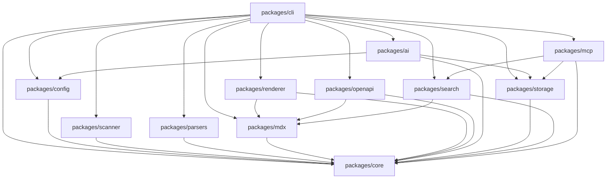
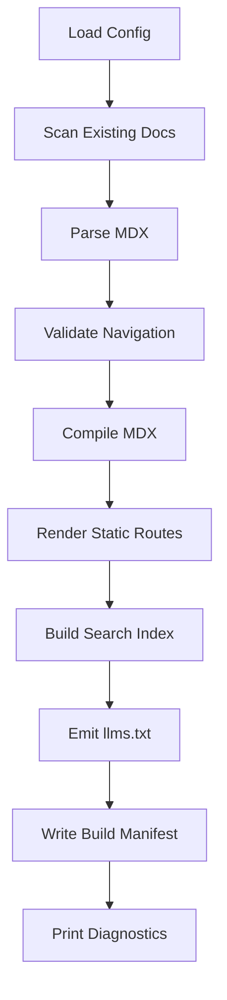
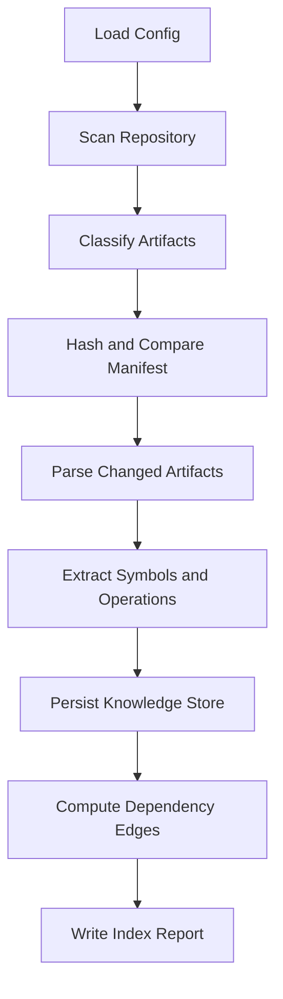
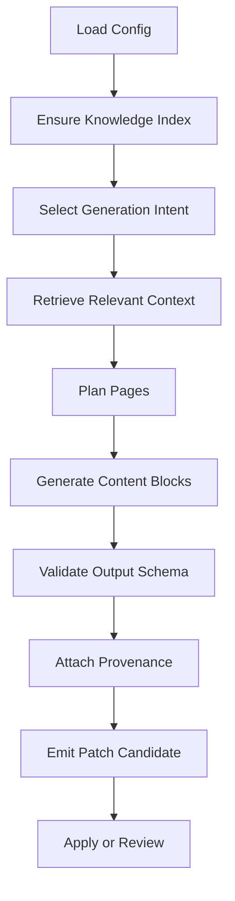
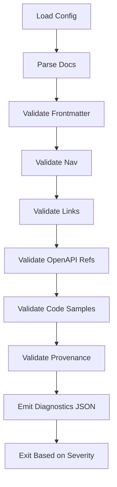

------
title: Build From Scratch: Mintlify-like AI-driven Documentation Generator CLI - Part 004
description: Technical stack selection, module boundaries, package layout, build tooling, and repository architecture for DocForge CLI.
series: learn-mintlify-like-ai-docs-cli
seriesTitle: Build From Scratch: Mintlify-like AI-driven Documentation Generator CLI
order: 4
partTitle: Technical Stack and Repository Layout
tags:
  - documentation
  - ai
  - cli
  - typescript
  - repository-layout
  - architecture
  - developer-tools
date: 2026-07-03
---

# Part 004 — Technical Stack and Repository Layout

Di Part 003 kita sudah membuat domain model dan invariant.

Sekarang kita masuk ke keputusan yang lebih konkret: **stack teknologi dan layout repository**.

Part ini penting karena banyak proyek developer tools gagal bukan karena idenya buruk, tapi karena sejak awal struktur repository-nya tidak mendukung evolusi.

Awalnya semua terlihat sederhana:

```txt
src/index.ts
src/generate.ts
src/build.ts
src/ai.ts
```

Lalu fitur bertambah:

- CLI command,
- config parser,
- MDX compiler,
- dev server,
- OpenAPI generator,
- Tree-sitter parser,
- embeddings,
- search index,
- LLM provider,
- diagnostics,
- cache,
- plugin system,
- deployment adapter,
- MCP server.

Jika layout awal terlalu flat, semua akan saling import. Akhirnya `ai.ts` tahu tentang filesystem, renderer tahu tentang OpenAPI parser, CLI command tahu tentang SQLite table, dan test menjadi sulit.

Kita akan menghindari itu.

Target part ini:

> Membuat repository architecture yang cukup sederhana untuk mulai diimplementasikan, tapi cukup kuat untuk tumbuh menjadi production-grade documentation generator.

---

## 1. Prinsip Pemilihan Stack

Kita tidak memilih teknologi berdasarkan popularitas saja.

Kita pilih berdasarkan constraint produk.

DocForge adalah CLI untuk developer. Maka stack harus memenuhi:

1. mudah didistribusikan lewat package manager,
2. nyaman untuk filesystem-heavy workload,
3. punya ecosystem MDX/React/static rendering yang kuat,
4. mampu memanggil parser native seperti Tree-sitter,
5. mudah membuat dev server,
6. mudah integrasi dengan OpenAPI tooling,
7. mendukung typed domain model,
8. bisa berjalan di CI,
9. bisa dibuat plugin-oriented,
10. bisa melakukan AI provider abstraction.

Untuk seri ini, stack utama kita:

```txt
Language        : TypeScript
Runtime         : Node.js
Package Manager : pnpm
CLI Framework   : Commander or Clipanion-style command layer
Validation      : Zod
Config Format   : JSON first, optional TS config later
Docs Content    : MDX
Renderer        : React-based static rendering
Parser          : Tree-sitter for code, unified/remark/rehype for Markdown/MDX
API Spec        : OpenAPI 3.x parser/resolver
Knowledge Store : SQLite
Search          : Static search index, Pagefind-like architecture
AI Layer        : Provider abstraction, structured output, prompt contracts
Testing         : Vitest + snapshot + fixture-based integration tests
Build Tooling   : tsup or esbuild-based package build
```

Ini bukan satu-satunya pilihan. Tapi ini pilihan yang masuk akal untuk produk seperti DocForge.

---

## 2. Kenapa TypeScript dan Node.js?

Kita bisa membangun tool ini dengan Go, Rust, Java, atau Python.

Tapi untuk Mintlify-like documentation generator, TypeScript/Node punya keuntungan praktis:

- MDX ecosystem berada sangat dekat dengan JavaScript/React ecosystem.
- Static site rendering sering memakai React/JS toolchain.
- CLI Node mudah didistribusikan via npm/pnpm.
- Developer docs project sering sudah punya Node toolchain.
- Banyak OpenAPI, Markdown, remark/rehype, syntax highlighting, and bundling tools tersedia di ecosystem ini.
- TypeScript memberi typed domain model yang cukup kuat tanpa membuat iteration speed lambat.

Kelemahannya:

- native parser dan binary dependency perlu hati-hati,
- startup time bisa lebih lambat dibanding Go/Rust single binary,
- dependency graph npm bisa besar,
- ESM/CJS boundary bisa menyulitkan,
- filesystem performance harus dirancang dengan concurrency control.

Untuk seri ini, TypeScript adalah pilihan paling efektif karena kita akan banyak bermain di MDX, React, CLI, dan docs ecosystem.

---

## 3. Kenapa Bukan Langsung Go atau Rust?

Go/Rust unggul untuk single binary, startup cepat, dan control tinggi.

Tapi kita akan banyak membutuhkan:

- MDX compilation,
- JSX/React component rendering,
- remark/rehype plugins,
- frontmatter parsing,
- OpenAPI ecosystem,
- static docs theming.

Kalau memakai Go/Rust, kita akan menghabiskan banyak energi membuat bridge ke JS ecosystem atau mengorbankan MDX fidelity.

Bukan berarti salah. Banyak tool docs bisa dibangun dengan Go/Rust. Tetapi untuk seri ini, fokus kita adalah membangun sistem end-to-end secara followable. TypeScript mengurangi friction.

Nanti, komponen tertentu seperti parser worker atau high-performance indexer bisa diganti native/binary jika perlu.

---

## 4. High-level Repository Shape

Kita akan pakai monorepo kecil.

Bukan karena trend, tapi karena DocForge punya beberapa package dengan boundary jelas:

- CLI,
- core domain,
- scanner,
- parser,
- MDX engine,
- renderer,
- AI engine,
- storage,
- search,
- MCP server,
- shared test fixtures.

Layout awal:

```txt
docforge/
├── package.json
├── pnpm-workspace.yaml
├── tsconfig.base.json
├── tsup.config.ts
├── vitest.config.ts
├── eslint.config.js
├── README.md
├── docs/
│   └── development-notes.md
├── examples/
│   ├── basic-node-service/
│   ├── openapi-service/
│   └── mixed-monorepo/
├── fixtures/
│   ├── repos/
│   ├── openapi/
│   ├── mdx/
│   └── snapshots/
├── packages/
│   ├── cli/
│   ├── core/
│   ├── config/
│   ├── scanner/
│   ├── parsers/
│   ├── mdx/
│   ├── renderer/
│   ├── openapi/
│   ├── ai/
│   ├── storage/
│   ├── search/
│   ├── mcp/
│   └── testkit/
└── scripts/
    ├── build.mjs
    ├── check.mjs
    └── release.mjs
```

Ini mungkin terlihat banyak untuk awal. Tapi tiap package kecil.

Jangan salah paham: kita tidak membuat distributed system. Kita membuat local CLI dengan modular monorepo.

---

## 5. Dependency Direction

Ini bagian paling penting.

Kita harus mencegah circular dependency dan architectural erosion.

Arah dependency:



Rule dasar:

```txt
core tidak boleh import package lain.
```

`core` berisi:

- domain types,
- value objects,
- result types,
- diagnostics model,
- phase interfaces,
- small pure utilities.

`cli` boleh mengikat semua package karena ia composition root.

Package lain tidak boleh import `cli`.

---

## 6. Packages Overview

Mari kita definisikan tanggung jawab tiap package.

### `packages/core`

Isi:

```txt
packages/core/
├── src/
│   ├── domain/
│   │   ├── ids.ts
│   │   ├── project.ts
│   │   ├── artifact.ts
│   │   ├── page.ts
│   │   ├── block.ts
│   │   ├── symbol.ts
│   │   ├── api-operation.ts
│   │   ├── provenance.ts
│   │   ├── diagnostic.ts
│   │   └── build-artifact.ts
│   ├── result.ts
│   ├── path.ts
│   ├── hash.ts
│   ├── logger.ts
│   └── index.ts
├── package.json
└── tsconfig.json
```

Tanggung jawab:

- domain model,
- branded types,
- diagnostic model,
- pipeline phase names,
- result/error helpers,
- no filesystem side effects except pure path normalization helpers.

Tidak boleh ada:

- `fs.readFile`,
- SQLite,
- HTTP call,
- LLM SDK,
- MDX compiler,
- CLI framework.

`core` harus cepat dites.

---

### `packages/config`

Isi:

```txt
packages/config/
├── src/
│   ├── schema.ts
│   ├── load-config.ts
│   ├── defaults.ts
│   ├── normalize-config.ts
│   ├── migrate-config.ts
│   └── index.ts
└── package.json
```

Tanggung jawab:

- membaca `docs/docs.json`,
- validasi schema,
- apply defaults,
- normalize paths,
- config migration,
- diagnostic jika invalid.

Config object harus final sebelum pipeline berjalan.

Contoh config awal:

```json
{
  "$schema": "https://docforge.dev/schemas/docs.schema.json",
  "name": "Acme API Docs",
  "docsDir": "docs",
  "outputDir": ".docforge/dist",
  "navigation": [
    {
      "group": "Guides",
      "pages": ["index", "quickstart", "guides/authentication"]
    }
  ],
  "openapi": [
    {
      "input": "openapi.yaml",
      "output": "api-reference"
    }
  ],
  "ai": {
    "enabled": false,
    "provider": "openai-compatible"
  }
}
```

Kita mulai JSON dulu agar deterministik dan mudah validate.

TS config bisa ditambahkan nanti.

---

### `packages/scanner`

Isi:

```txt
packages/scanner/
├── src/
│   ├── scan-project.ts
│   ├── ignore.ts
│   ├── classify-artifact.ts
│   ├── file-hash.ts
│   ├── file-manifest.ts
│   └── index.ts
└── package.json
```

Tanggung jawab:

- scan filesystem,
- apply ignore rules,
- classify artifact kind,
- compute hash,
- detect binary/too-large files,
- produce `SourceArtifact[]` dan diagnostics.

Scanner tidak boleh parse AST.

Scanner hanya menjawab:

> File apa yang ada dan layak diproses?

---

### `packages/parsers`

Isi:

```txt
packages/parsers/
├── src/
│   ├── parser-registry.ts
│   ├── parse-artifact.ts
│   ├── languages/
│   │   ├── typescript.ts
│   │   ├── javascript.ts
│   │   ├── java.ts
│   │   ├── go.ts
│   │   └── python.ts
│   ├── tree-sitter/
│   │   ├── load-parser.ts
│   │   ├── query-runner.ts
│   │   └── node-mapper.ts
│   └── index.ts
└── package.json
```

Tanggung jawab:

- parse code artifacts,
- extract symbols,
- extract comments,
- detect framework patterns,
- emit parser diagnostics.

Parser tidak boleh menulis docs.

Parser hanya menghasilkan knowledge.

---

### `packages/openapi`

Isi:

```txt
packages/openapi/
├── src/
│   ├── load-openapi.ts
│   ├── resolve-refs.ts
│   ├── normalize-operation.ts
│   ├── validate-openapi.ts
│   ├── generate-api-pages.ts
│   ├── generate-code-samples.ts
│   └── index.ts
└── package.json
```

Tanggung jawab:

- load OpenAPI JSON/YAML,
- resolve `$ref`,
- normalize operations,
- emit `ApiOperation`,
- generate API reference page IR,
- generate code sample candidates,
- diagnostics untuk broken refs/schema.

OpenAPI package boleh menghasilkan page candidate, tapi sebaiknya tetap melalui `Page`/`ContentBlock` domain model.

---

### `packages/mdx`

Isi:

```txt
packages/mdx/
├── src/
│   ├── parse-mdx.ts
│   ├── compile-mdx.ts
│   ├── emit-mdx.ts
│   ├── frontmatter.ts
│   ├── mdx-components.ts
│   ├── mdx-diagnostics.ts
│   └── index.ts
└── package.json
```

Tanggung jawab:

- parse existing MDX,
- extract frontmatter,
- compile MDX,
- emit MDX dari `Page`,
- validate allowed components,
- produce line-based diagnostics.

MDX package tidak boleh tahu tentang LLM provider.

---

### `packages/renderer`

Isi:

```txt
packages/renderer/
├── src/
│   ├── render-site.tsx
│   ├── render-page.tsx
│   ├── routes.ts
│   ├── theme/
│   │   ├── Layout.tsx
│   │   ├── components.tsx
│   │   └── tokens.ts
│   ├── assets.ts
│   └── index.ts
└── package.json
```

Tanggung jawab:

- render page HTML/static output,
- layout docs site,
- theme component mapping,
- asset emission,
- route generation.

Renderer boleh memakai MDX compiler output.

Renderer tidak boleh scan repository.

---

### `packages/storage`

Isi:

```txt
packages/storage/
├── src/
│   ├── sqlite.ts
│   ├── migrations/
│   │   ├── 001_initial.ts
│   │   ├── 002_symbols.ts
│   │   └── 003_generation_jobs.ts
│   ├── repositories/
│   │   ├── artifact-repository.ts
│   │   ├── symbol-repository.ts
│   │   ├── page-repository.ts
│   │   ├── diagnostic-repository.ts
│   │   └── build-artifact-repository.ts
│   └── index.ts
└── package.json
```

Tanggung jawab:

- SQLite connection,
- migrations,
- repository implementations,
- transactions,
- query performance,
- cache tables.

Storage package bergantung ke `core`, bukan sebaliknya.

---

### `packages/ai`

Isi:

```txt
packages/ai/
├── src/
│   ├── provider.ts
│   ├── model-profile.ts
│   ├── prompt-contract.ts
│   ├── structured-output.ts
│   ├── jobs/
│   │   ├── plan-page.ts
│   │   ├── write-page.ts
│   │   ├── review-page.ts
│   │   └── update-from-diff.ts
│   ├── context/
│   │   ├── retrieve-context.ts
│   │   ├── pack-context.ts
│   │   └── rank-context.ts
│   └── index.ts
└── package.json
```

Tanggung jawab:

- provider abstraction,
- prompt contracts,
- structured output schemas,
- context packing,
- generation job execution,
- AI diagnostics.

AI package tidak boleh langsung write docs files.

AI package menghasilkan:

- `PagePlan`,
- `ContentBlock` candidate,
- `PatchCandidate`,
- `ReviewFinding`.

---

### `packages/search`

Isi:

```txt
packages/search/
├── src/
│   ├── extract-search-docs.ts
│   ├── chunk-page.ts
│   ├── build-index.ts
│   ├── search-client.ts
│   └── index.ts
└── package.json
```

Tanggung jawab:

- extract searchable text dari pages,
- chunk by heading/semantic block,
- assign weights,
- emit static search index,
- optionally expose local query API.

Search tidak boleh bergantung pada renderer.

Ia bekerja dari `Page`/MDX-derived text.

---

### `packages/mcp`

Isi:

```txt
packages/mcp/
├── src/
│   ├── server.ts
│   ├── tools/
│   │   ├── search-docs.ts
│   │   ├── get-page.ts
│   │   ├── get-symbol.ts
│   │   └── get-api-operation.ts
│   ├── resources.ts
│   └── index.ts
└── package.json
```

Tanggung jawab:

- expose docs/search/code knowledge untuk agent,
- read-only by default,
- integrate with storage/search,
- enforce privacy/safety boundary.

MCP package tidak boleh generate docs langsung.

---

### `packages/cli`

Isi:

```txt
packages/cli/
├── src/
│   ├── main.ts
│   ├── commands/
│   │   ├── init.ts
│   │   ├── dev.ts
│   │   ├── build.ts
│   │   ├── generate.ts
│   │   ├── check.ts
│   │   ├── index.ts
│   │   ├── update.ts
│   │   └── serve-mcp.ts
│   ├── compose.ts
│   ├── output.ts
│   ├── errors.ts
│   └── index.ts
└── package.json
```

Tanggung jawab:

- parse command flags,
- compose services,
- call pipeline,
- print diagnostics,
- set exit codes,
- handle user interaction.

CLI adalah composition root.

---

### `packages/testkit`

Isi:

```txt
packages/testkit/
├── src/
│   ├── fixture-project.ts
│   ├── temp-dir.ts
│   ├── run-cli.ts
│   ├── snapshot.ts
│   ├── fake-llm-provider.ts
│   └── index.ts
└── package.json
```

Tanggung jawab:

- helper untuk integration tests,
- fake filesystem project,
- fake LLM provider,
- snapshot helpers,
- CLI runner.

Testkit mencegah test menjadi copy-paste setup panjang.

---

## 7. Root Files

### `package.json`

Root package:

```json
{
  "name": "docforge-monorepo",
  "private": true,
  "type": "module",
  "scripts": {
    "build": "pnpm -r build",
    "dev": "pnpm --filter @docforge/cli dev",
    "test": "vitest run",
    "test:watch": "vitest",
    "check": "pnpm lint && pnpm typecheck && pnpm test",
    "typecheck": "tsc -b",
    "lint": "eslint ."
  },
  "devDependencies": {
    "typescript": "latest",
    "vitest": "latest",
    "tsup": "latest",
    "eslint": "latest"
  }
}
```

Catatan: di materi implementasi nanti kita tidak akan selalu memakai `latest` secara literal. Untuk project production, lockfile harus mengunci versi.

Di sini contoh dibuat ringkas.

---

### `pnpm-workspace.yaml`

```yaml
packages:
  - "packages/*"
  - "examples/*"
```

---

### `tsconfig.base.json`

```json
{
  "compilerOptions": {
    "target": "ES2022",
    "module": "NodeNext",
    "moduleResolution": "NodeNext",
    "strict": true,
    "declaration": true,
    "declarationMap": true,
    "sourceMap": true,
    "noUncheckedIndexedAccess": true,
    "exactOptionalPropertyTypes": true,
    "forceConsistentCasingInFileNames": true,
    "skipLibCheck": true
  }
}
```

Dua option penting:

```json
"noUncheckedIndexedAccess": true,
"exactOptionalPropertyTypes": true
```

Kenapa?

Karena documentation generator banyak memproses data eksternal:

- JSON config,
- YAML spec,
- frontmatter,
- AST nodes,
- LLM output,
- package metadata.

Kita tidak boleh terlalu percaya pada field yang mungkin tidak ada.

---

### Package `tsconfig.json`

Contoh untuk `packages/core`:

```json
{
  "extends": "../../tsconfig.base.json",
  "compilerOptions": {
    "outDir": "dist",
    "rootDir": "src",
    "composite": true
  },
  "include": ["src"]
}
```

---

## 8. Package Boundary Rules

Kita perlu rule eksplisit.

### Rule 1 — `core` Harus Pure

`core` tidak boleh punya side effect.

Allowed:

```ts
export type Page = ...
export function normalizeRoute(input: string): RoutePath
export function createDiagnostic(...): Diagnostic
```

Not allowed:

```ts
import fs from "node:fs";
import Database from "better-sqlite3";
import { compile } from "@mdx-js/mdx";
```

---

### Rule 2 — Package Tidak Boleh Import dari `cli`

`cli` adalah entrypoint.

Jika package lain import CLI, architecture sudah bocor.

---

### Rule 3 — Storage Tidak Boleh Mengontrol Domain Logic

Storage menyimpan dan mengambil.

Jangan letakkan logic seperti:

```ts
if page.kind === "quickstart" then validate required sections
```

di storage layer.

Itu milik quality/validation domain.

---

### Rule 4 — AI Tidak Boleh Menulis Filesystem Output

AI package tidak boleh melakukan:

```ts
await fs.writeFile("docs/quickstart.mdx", generatedText)
```

Ia harus mengembalikan candidate:

```ts
return GeneratedPageCandidate
```

Yang menulis file adalah pipeline/emitter setelah validasi.

---

### Rule 5 — Renderer Tidak Boleh Membaca Repository Source

Renderer menerima page/render manifest.

Ia tidak boleh scan `src/`.

Kalau renderer butuh source info, berarti sebelumnya harus disediakan sebagai model.

---

## 9. Dependency Enforcement

Idealnya boundary tidak hanya dokumentasi.

Kita bisa enforce dengan:

- ESLint import rules,
- package exports,
- dependency graph check,
- TypeScript project references.

Contoh package exports:

```json
{
  "name": "@docforge/core",
  "type": "module",
  "exports": {
    ".": "./dist/index.js",
    "./domain": "./dist/domain/index.js"
  },
  "types": "./dist/index.d.ts"
}
```

Jangan expose internal file sembarangan.

Kalau semua bisa import:

```ts
import { x } from "@docforge/core/dist/internal/foo.js";
```

maka boundary runtuh.

---

## 10. CLI Command Surface

Command yang akan kita bangun bertahap:

```txt
docforge init
  create docs directory and config

docforge dev
  run local documentation dev server

docforge build
  compile and emit static site

docforge check
  run validations without emitting deploy output

docforge index
  scan repository and build knowledge index

docforge generate
  generate or update docs using source knowledge and AI

docforge update
  update docs based on git diff

docforge serve-mcp
  expose docs/search knowledge to agent via MCP
```

Setiap command harus punya:

- deterministic exit code,
- structured diagnostics,
- `--json` mode,
- `--verbose` mode,
- `--cwd` option,
- config resolution,
- non-interactive CI behavior.

Contoh exit codes:

| Exit Code | Meaning |
|---:|---|
| 0 | success |
| 1 | validation/build failed |
| 2 | invalid CLI usage |
| 3 | config error |
| 4 | external provider error |
| 130 | user cancelled |

---

## 11. Composition Root

`packages/cli/src/compose.ts` akan mengikat dependencies.

Contoh shape:

```ts
export interface AppServices {
  configLoader: ConfigLoader;
  scanner: ProjectScanner;
  parserRegistry: ParserRegistry;
  storage: KnowledgeStore;
  mdxCompiler: MdxCompiler;
  renderer: SiteRenderer;
  ai?: AiEngine;
  search: SearchIndexer;
  logger: Logger;
}

export async function composeApp(options: ComposeOptions): Promise<AppServices> {
  const logger = createLogger(options);
  const configLoader = createConfigLoader({ logger });
  const storage = await createSqliteKnowledgeStore({ rootDir: options.cwd });

  return {
    logger,
    configLoader,
    scanner: createProjectScanner({ logger }),
    parserRegistry: createParserRegistry({ logger }),
    storage,
    mdxCompiler: createMdxCompiler({ logger }),
    renderer: createSiteRenderer({ logger }),
    ai: options.aiEnabled ? createAiEngine({ logger, storage }) : undefined,
    search: createSearchIndexer({ logger })
  };
}
```

Kenapa composition root penting?

Karena package domain tidak perlu tahu implementasi konkret.

Test bisa mengganti:

- fake storage,
- fake AI provider,
- fake filesystem,
- fake renderer.

---

## 12. Pipeline Interfaces

Kita butuh interface kecil untuk pipeline.

```ts
export interface PipelineContext {
  project: Project;
  logger: Logger;
  diagnostics: DiagnosticSink;
  cancellation: AbortSignal;
}

export interface PipelinePhase<I, O> {
  name: PipelinePhaseName;
  run(input: I, context: PipelineContext): Promise<O>;
}
```

Contoh:

```ts
export const scanPhase: PipelinePhase<ScanInput, ScanOutput> = {
  name: "scan",
  async run(input, context) {
    return scanProject(input.rootDir, input.config, context);
  }
};
```

Jangan membuat pipeline terlalu abstrak di awal.

Tapi interface kecil membuat testing dan diagnostics lebih konsisten.

---

## 13. Data Flow Build Command

`docforge build` kira-kira:



`build` tidak harus scan seluruh source code pada milestone awal.

Ia cukup memproses docs existing.

Nanti ketika AI generation dan code indexing masuk, build bisa memakai knowledge store.

---

## 14. Data Flow Index Command

`docforge index`:



`index` fokus membangun knowledge, bukan menghasilkan docs.

---

## 15. Data Flow Generate Command

`docforge generate`:



Generate tidak langsung publish.

Output default harus aman:

- write to new docs if no conflict,
- otherwise patch proposal,
- human review when overwriting existing content.

---

## 16. Data Flow Check Command

`docforge check`:



`check` harus CI-friendly.

Jika `--json`, output harus machine-readable.

---

## 17. File System Layout Generated by `docforge init`

Target initial docs project:

```txt
my-repo/
└── docs/
    ├── docs.json
    ├── index.mdx
    ├── quickstart.mdx
    ├── guides/
    │   └── introduction.mdx
    └── snippets/
        └── .gitkeep
```

Generated config:

```json
{
  "$schema": "https://docforge.dev/schemas/docs.schema.json",
  "name": "My Project Docs",
  "docsDir": "docs",
  "outputDir": ".docforge/dist",
  "navigation": [
    {
      "group": "Get Started",
      "pages": ["index", "quickstart"]
    },
    {
      "group": "Guides",
      "pages": ["guides/introduction"]
    }
  ]
}
```

Generated `index.mdx`:

```mdx
---
title: Introduction
description: Learn how this project is organized and how to get started.
---

# Introduction

Welcome to your documentation.
```

---

## 18. Internal Working Directory

DocForge perlu working directory internal.

```txt
.docforge/
├── cache/
│   ├── file-manifest.json
│   ├── mdx-cache/
│   └── render-cache/
├── index/
│   └── knowledge.sqlite
├── dist/
│   ├── index.html
│   ├── assets/
│   ├── search/
│   ├── sitemap.xml
│   └── llms.txt
├── reports/
│   ├── diagnostics.json
│   ├── build-manifest.json
│   └── generation-report.json
└── tmp/
```

Rules:

1. `.docforge/dist` is disposable.
2. `.docforge/cache` is disposable.
3. `.docforge/index` is rebuildable, tapi mahal.
4. `.docforge/reports` useful untuk CI artifacts.
5. `.docforge/tmp` harus dibersihkan.

Dalam `.gitignore`, biasanya:

```gitignore
.docforge/cache/
.docforge/dist/
.docforge/tmp/
```

Untuk `.docforge/index`, tergantung workflow. Biasanya tidak perlu commit.

---

## 19. Why SQLite for Knowledge Store?

Kita butuh local persistent store untuk:

- file manifest,
- symbols,
- API operations,
- pages,
- source refs,
- dependency edges,
- generation jobs,
- diagnostics,
- cache metadata.

Pilihan:

| Store | Pros | Cons |
|---|---|---|
| JSON files | simple | slow query, fragile concurrency |
| SQLite | embedded, queryable, transactional | schema/migration needed |
| DuckDB | analytic queries strong | heavier for simple app state |
| LevelDB/RocksDB | key-value fast | harder relational queries |
| Postgres | powerful | not local-first CLI friendly |

SQLite cocok karena DocForge adalah local CLI dan butuh query relational ringan.

Contoh query:

```sql
select p.route, p.title
from pages p
join page_source_refs r on r.page_id = p.id
where r.artifact_id = ?;
```

Ini jauh lebih nyaman daripada scan JSON file manual.

---

## 20. Initial SQLite Schema

Schema awal:

```sql
create table if not exists artifacts (
  id text primary key,
  project_id text not null,
  kind text not null,
  path text not null,
  hash text not null,
  size_bytes integer not null,
  language text,
  status text not null,
  last_indexed_at text
);

create unique index if not exists idx_artifacts_project_path
on artifacts(project_id, path);

create table if not exists pages (
  id text primary key,
  project_id text not null,
  kind text not null,
  route text not null,
  file_path text not null,
  title text not null,
  description text,
  status text not null
);

create unique index if not exists idx_pages_project_route
on pages(project_id, route);

create table if not exists diagnostics (
  id text primary key,
  project_id text not null,
  entity_type text,
  entity_id text,
  phase text not null,
  code text not null,
  severity text not null,
  message text not null,
  location_json text,
  suggestion_json text,
  created_at text not null
);
```

Nanti schema berkembang.

Jangan mulai dengan 30 table jika belum dipakai. Tapi jangan juga menolak schema sampai semua ditaruh JSON.

---

## 21. Package Build Strategy

Kita ingin output package bisa dipakai oleh Node.

Setiap package punya:

```json
{
  "name": "@docforge/core",
  "version": "0.0.0",
  "type": "module",
  "main": "./dist/index.js",
  "types": "./dist/index.d.ts",
  "exports": {
    ".": {
      "types": "./dist/index.d.ts",
      "import": "./dist/index.js"
    }
  },
  "scripts": {
    "build": "tsup src/index.ts --format esm --dts",
    "typecheck": "tsc --noEmit",
    "test": "vitest run"
  }
}
```

Untuk CLI package:

```json
{
  "name": "docforge",
  "version": "0.0.0",
  "type": "module",
  "bin": {
    "docforge": "./dist/main.js"
  },
  "scripts": {
    "build": "tsup src/main.ts --format esm --dts --banner.js '#!/usr/bin/env node'"
  }
}
```

Pastikan generated CLI file executable.

---

## 22. ESM vs CJS

Kita pilih ESM.

Alasan:

- modern Node ecosystem bergerak ke ESM,
- MDX/unified ecosystem banyak ESM-first,
- package exports lebih eksplisit,
- top-level await berguna untuk CLI setup.

Konsekuensi:

- perlu hati-hati dengan `__dirname`,
- import path harus jelas,
- some old packages mungkin CJS-only,
- test runner config harus sesuai.

Utility:

```ts
import { fileURLToPath } from "node:url";
import { dirname } from "node:path";

const __filename = fileURLToPath(import.meta.url);
const __dirname = dirname(__filename);
```

---

## 23. Config Validation with Zod

Kenapa validation library penting?

Karena config adalah external input.

Jangan percaya:

```ts
const config = JSON.parse(raw) as DocForgeConfig;
```

Gunakan schema:

```ts
import { z } from "zod";

export const DocForgeConfigSchema = z.object({
  name: z.string().min(1),
  docsDir: z.string().default("docs"),
  outputDir: z.string().default(".docforge/dist"),
  navigation: z.array(
    z.object({
      group: z.string().min(1),
      pages: z.array(z.string().min(1))
    })
  ).default([]),
  openapi: z.array(
    z.object({
      input: z.string().min(1),
      output: z.string().min(1).default("api-reference")
    })
  ).default([]),
  ai: z.object({
    enabled: z.boolean().default(false),
    provider: z.string().optional()
  }).default({ enabled: false })
});

export type DocForgeConfig = z.infer<typeof DocForgeConfigSchema>;
```

Validation error harus diubah ke `Diagnostic`, bukan dilempar mentah.

---

## 24. Path Normalization Strategy

Path bug sangat umum di CLI.

Perbedaan:

- Windows backslash,
- POSIX slash,
- symlink,
- case sensitivity,
- relative path,
- absolute path,
- route path.

Kita harus punya utility.

```ts
export function toRepoRelativePath(root: AbsolutePath, file: AbsolutePath): RepoRelativePath {
  // normalize, ensure file is inside root, convert separator to '/'
}

export function toRoutePath(filePath: RepoRelativePath): RoutePath {
  // docs/guides/auth.mdx -> /guides/auth
}
```

Invariant:

```txt
filesystem path != route path
```

Jangan pernah memakai path helper sembarangan di renderer.

---

## 25. Logging and Diagnostics

Logging dan diagnostics berbeda.

Log menjawab:

> Apa yang terjadi saat program berjalan?

Diagnostic menjawab:

> Apa yang perlu diperbaiki user?

Contoh log:

```txt
[debug] scanned 482 files in 340ms
```

Contoh diagnostic:

```txt
OPENAPI_REF_BROKEN: Cannot resolve #/components/schemas/Order in openapi.yaml
```

Logger interface:

```ts
export interface Logger {
  debug(message: string, fields?: Record<string, unknown>): void;
  info(message: string, fields?: Record<string, unknown>): void;
  warn(message: string, fields?: Record<string, unknown>): void;
  error(message: string, fields?: Record<string, unknown>): void;
}
```

Diagnostic sink:

```ts
export interface DiagnosticSink {
  add(diagnostic: Diagnostic): void;
  hasErrors(): boolean;
  all(): Diagnostic[];
}
```

Jangan campur keduanya.

---

## 26. Error Handling Strategy

Kita gunakan tiga kategori:

### 1. Expected User Errors

Contoh:

- config invalid,
- file missing,
- MDX syntax error,
- duplicate route.

Representasi:

```ts
Diagnostic
```

### 2. Expected External Errors

Contoh:

- LLM provider timeout,
- network unavailable,
- git command failed,
- package install missing.

Representasi:

```ts
Diagnostic + ExternalError wrapper
```

### 3. Programmer Bugs

Contoh:

- impossible state,
- null access,
- invariant violation,
- unhandled enum.

Representasi:

```ts
throw new InvariantError(...)
```

Tapi CLI top-level tetap harus menangkap dan menampilkan pesan yang manusiawi.

---

## 27. Result Type

Untuk banyak fungsi domain, kita bisa pakai Result type.

```ts
export type Result<T, E> =
  | { ok: true; value: T }
  | { ok: false; error: E };

export function ok<T>(value: T): Result<T, never> {
  return { ok: true, value };
}

export function err<E>(error: E): Result<never, E> {
  return { ok: false, error };
}
```

Gunakan Result untuk expected failure.

Gunakan exception untuk impossible/programmer failure.

---

## 28. Testing Strategy by Package

### Core

Test pure functions:

- route normalization,
- id generation,
- diagnostic creation,
- invariant checks.

### Config

Fixture-based tests:

- valid config,
- missing optional fields,
- invalid navigation,
- migration from old version.

### Scanner

Filesystem fixture tests:

- ignore rules,
- binary detection,
- large file,
- symlink handling,
- hash stable.

### MDX

Compilation tests:

- valid MDX,
- invalid MDX line diagnostics,
- frontmatter extraction,
- component whitelist.

### OpenAPI

Spec fixture tests:

- `$ref` resolution,
- operation normalization,
- broken schema diagnostic,
- generated API page snapshot.

### AI

No real LLM in unit tests.

Use fake provider:

```ts
class FakeAiProvider implements AiProvider {
  async generateStructured() {
    return predefinedOutput;
  }
}
```

Real provider tests harus opt-in.

### CLI

End-to-end fixture tests:

```txt
fixture repo → run docforge build → assert dist + diagnostics
```

---

## 29. Fixture Layout

```txt
fixtures/
├── repos/
│   ├── empty/
│   ├── basic-docs/
│   ├── invalid-mdx/
│   ├── duplicate-route/
│   ├── openapi-basic/
│   ├── openapi-broken-ref/
│   ├── node-service/
│   └── monorepo-large/
├── openapi/
│   ├── petstore.yaml
│   ├── broken-ref.yaml
│   └── security-schemes.yaml
├── mdx/
│   ├── valid-basic.mdx
│   ├── invalid-jsx.mdx
│   └── unsafe-component.mdx
└── snapshots/
```

Fixtures adalah asset belajar paling penting.

Tanpa fixtures, kita hanya punya unit tests yang terlalu steril.

---

## 30. Development Workflow

Workflow harian:

```bash
pnpm install
pnpm build
pnpm test
pnpm --filter docforge dev
pnpm --filter docforge build --fixture fixtures/repos/basic-docs
```

Kita akan menambahkan command internal untuk fixture:

```bash
pnpm docforge --cwd fixtures/repos/basic-docs build
```

Tujuannya agar setiap part bisa diuji step-by-step.

---

## 31. Milestone Implementation Plan

Kita tidak akan membangun semua sekaligus.

### Milestone 1 — CLI + Config + Init

Output:

```bash
docforge init
```

Membuat docs directory dan config.

### Milestone 2 — MDX Parse + Build

Output:

```bash
docforge build
```

Compile existing MDX dan render static site minimal.

### Milestone 3 — Nav + Link + Diagnostics

Output:

```bash
docforge check
```

Validasi navigation, frontmatter, links.

### Milestone 4 — Scanner + Knowledge Store

Output:

```bash
docforge index
```

Scan repo dan persist artifacts.

### Milestone 5 — OpenAPI Reference

Output:

```bash
docforge generate api
```

Generate API operation pages.

### Milestone 6 — Code Parser + Symbol Graph

Output:

```bash
docforge index --symbols
```

Extract symbols dari code.

### Milestone 7 — AI Page Generation

Output:

```bash
docforge generate quickstart
```

AI-assisted docs with provenance.

### Milestone 8 — Search + llms.txt

Output:

```bash
docforge build
```

Menyertakan search index dan agent-ready export.

### Milestone 9 — Diff-aware Update

Output:

```bash
docforge update --from-diff origin/main...HEAD
```

Detect changed docs impact.

### Milestone 10 — MCP + Release

Output:

```bash
docforge serve-mcp
npm publish
```

Agent integration and package distribution.

---

## 32. Vertical Slice Pertama

Vertical slice pertama harus kecil tapi end-to-end.

Target:

```bash
docforge init
cd docs
# edit index.mdx
docforge build
```

Output:

```txt
.docforge/dist/index.html
.docforge/reports/diagnostics.json
```

Fitur minimal:

- CLI command works,
- config loaded,
- MDX page parsed,
- static HTML emitted,
- diagnostic report emitted,
- exit code correct.

Jangan mulai dari AI dulu.

AI tanpa deterministic pipeline hanya akan membuat demo yang terlihat canggih tapi fondasinya rapuh.

---

## 33. Interface First, Implementation Later

Di awal, banyak implementation bisa dummy.

Contoh:

```ts
export interface SiteRenderer {
  renderSite(input: RenderSiteInput): Promise<RenderSiteResult>;
}
```

Implementation awal:

```ts
export class MinimalHtmlRenderer implements SiteRenderer {
  async renderSite(input: RenderSiteInput): Promise<RenderSiteResult> {
    // simple HTML string rendering
  }
}
```

Nanti bisa diganti dengan React static renderer.

Pola ini menjaga progress.

---

## 34. Avoid Premature Plugin System

Plugin system menarik, tapi jangan dibuat terlalu awal.

Plugin system yang baik membutuhkan lifecycle yang stabil.

Minimal lifecycle:

```txt
config loaded
project scanned
artifact parsed
page planned
docs emitted
site rendered
```

Sebelum lifecycle stabil, plugin API akan berubah terus.

Jadi untuk awal:

- buat internal interfaces,
- jangan expose public plugin API dulu,
- tandai package internal,
- setelah Part 045 baru desain plugin public.

---

## 35. Handling Native Dependencies

Tree-sitter dan beberapa parser bisa membawa native dependency.

Strategi:

1. Jadikan parser optional per language.
2. Jika parser gagal load, emit warning, bukan crash total.
3. Pisahkan parser worker jika perlu.
4. Jangan jadikan code parsing requirement untuk `docforge build` basic.
5. Cache parser result berdasarkan file hash dan parser version.

Contoh degraded mode:

```txt
Warning: TypeScript parser unavailable. Source files will be indexed as text only.
```

Ini membuat CLI tetap usable.

---

## 36. AI Provider Abstraction

Jangan hardcode satu provider.

Model interface:

```ts
export interface AiProvider {
  id: string;
  generateText(request: GenerateTextRequest): Promise<GenerateTextResponse>;
  generateStructured<T>(request: GenerateStructuredRequest<T>): Promise<T>;
}
```

Provider-specific code berada di adapter:

```txt
packages/ai/src/providers/openai-compatible.ts
packages/ai/src/providers/anthropic.ts
packages/ai/src/providers/local.ts
```

Core AI engine bekerja dengan interface.

Config memilih provider.

---

## 37. Structured Output First

Untuk documentation generator, jangan minta model menghasilkan bebas terlalu sering.

Lebih aman:

```ts
const PagePlanSchema = z.object({
  title: z.string(),
  kind: z.enum(["quickstart", "concept", "how_to", "reference"]),
  sections: z.array(z.object({
    heading: z.string(),
    purpose: z.string(),
    sourceRefs: z.array(z.string())
  }))
});
```

AI output harus:

1. parseable,
2. valid schema,
3. convertible to domain object,
4. reviewable.

Markdown bebas boleh muncul di block content, bukan seluruh response mentah.

---

## 38. Security Defaults

Sejak layout awal, security harus dipikirkan.

Defaults:

- AI disabled by default.
- Network execution disabled for code sample verification by default.
- Secret scanning before context sent to provider.
- No arbitrary MDX imports outside docs allowed by default.
- Path traversal rejected.
- External links checked but not executed.
- Generated content requires validation.

Config:

```json
{
  "security": {
    "allowNetworkDuringExamples": false,
    "allowMdxRemoteImports": false,
    "redactSecretsBeforeAi": true,
    "maxFileSizeKb": 512
  }
}
```

Security bukan fitur Part 042 saja. Part 042 akan memperdalam threat model, tapi default aman harus ada sejak awal.

---

## 39. Observability Defaults

CLI perlu observability ringan.

Output default user-friendly:

```txt
✓ Loaded config
✓ Scanned 124 files
✓ Compiled 8 pages
⚠ 2 warnings
✓ Wrote .docforge/dist
```

Verbose mode:

```bash
docforge build --verbose
```

JSON mode:

```bash
docforge build --json
```

Trace report:

```txt
.docforge/reports/build-trace.json
```

Trace event shape:

```ts
interface TraceEvent {
  phase: string;
  startTime: string;
  endTime: string;
  durationMs: number;
  metadata?: Record<string, unknown>;
}
```

Ini membantu performance tuning nanti.

---

## 40. Naming Conventions

Naming harus konsisten.

### Package Names

```txt
@docforge/core
@docforge/config
@docforge/scanner
@docforge/parsers
@docforge/mdx
@docforge/renderer
@docforge/openapi
@docforge/storage
@docforge/ai
@docforge/search
@docforge/mcp
@docforge/testkit
```

CLI package bisa bernama:

```txt
docforge
```

### File Names

Gunakan kebab-case:

```txt
load-config.ts
scan-project.ts
generate-api-pages.ts
```

### Type Names

Gunakan PascalCase:

```ts
SourceArtifact
ApiOperation
GenerationJob
DiagnosticSink
```

### Function Names

Gunakan verb phrase:

```ts
loadConfig
scanProject
parseArtifact
emitMdx
renderSite
buildSearchIndex
```

---

## 41. Public API vs Internal API

Setiap package punya `src/index.ts` sebagai public API.

Contoh:

```ts
export type { Project, SourceArtifact, Page } from "./domain";
export { createDiagnostic } from "./diagnostic";
```

Internal modules jangan diekspor.

Ini menjaga kebebasan refactor.

---

## 42. Example Package: `@docforge/core`

`packages/core/src/index.ts`:

```ts
export * from "./domain/ids";
export * from "./domain/project";
export * from "./domain/artifact";
export * from "./domain/page";
export * from "./domain/diagnostic";
export * from "./result";
export * from "./path";
export * from "./hash";
export * from "./logger";
```

`packages/core/src/domain/page.ts`:

```ts
import type {
  PageId,
  ProjectId,
  RepoRelativePath,
  RoutePath
} from "./ids";
import type { ContentBlock } from "./block";
import type { Diagnostic } from "./diagnostic";

export type PageKind =
  | "landing"
  | "quickstart"
  | "concept"
  | "how_to"
  | "reference"
  | "api_operation"
  | "troubleshooting"
  | "migration"
  | "architecture";

export type PageStatus =
  | "planned"
  | "generated"
  | "human_authored"
  | "mixed"
  | "stale"
  | "invalid"
  | "published";

export interface Page {
  id: PageId;
  projectId: ProjectId;
  kind: PageKind;
  route: RoutePath;
  filePath: RepoRelativePath;
  title: string;
  description?: string;
  status: PageStatus;
  blocks: ContentBlock[];
  diagnostics: Diagnostic[];
}
```

Ini belum banyak behavior, tapi cukup untuk awal.

---

## 43. Example Package: `@docforge/config`

`packages/config/src/load-config.ts`:

```ts
import { readFile } from "node:fs/promises";
import { join } from "node:path";
import { DocForgeConfigSchema } from "./schema";
import type { Diagnostic } from "@docforge/core";

export interface LoadConfigResult {
  config?: DocForgeConfig;
  diagnostics: Diagnostic[];
}

export async function loadConfig(cwd: string): Promise<LoadConfigResult> {
  const configPath = join(cwd, "docs", "docs.json");

  try {
    const raw = await readFile(configPath, "utf8");
    const json = JSON.parse(raw);
    const parsed = DocForgeConfigSchema.safeParse(json);

    if (!parsed.success) {
      return {
        diagnostics: parsed.error.issues.map(issue => ({
          code: "CONFIG_SCHEMA_INVALID",
          severity: "error",
          phase: "config",
          message: issue.message
        }))
      };
    }

    return { config: parsed.data, diagnostics: [] };
  } catch (error) {
    return {
      diagnostics: [
        {
          code: "CONFIG_NOT_FOUND",
          severity: "error",
          phase: "config",
          message: `Cannot read docs/docs.json`
        }
      ]
    };
  }
}
```

Nanti kita akan perbaiki typing dan diagnostic shape lebih rapi.

---

## 44. Example Package: `@docforge/scanner`

`packages/scanner/src/scan-project.ts`:

```ts
export interface ScanProjectInput {
  rootDir: AbsolutePath;
  include: string[];
  exclude: string[];
  maxFileSizeBytes: number;
}

export interface ScanProjectOutput {
  artifacts: SourceArtifact[];
  diagnostics: Diagnostic[];
}

export async function scanProject(input: ScanProjectInput): Promise<ScanProjectOutput> {
  // 1. walk filesystem
  // 2. apply ignore rules
  // 3. classify files
  // 4. hash contents
  // 5. return SourceArtifact[]
  return { artifacts: [], diagnostics: [] };
}
```

Kita sengaja mulai dari contract.

Implementation menyusul.

---

## 45. Development Setup Commands

Ketika nanti mulai coding, command awal:

```bash
mkdir docforge
cd docforge
pnpm init
mkdir packages examples fixtures scripts
```

Workspace:

```bash
cat > pnpm-workspace.yaml <<'EOF'
packages:
  - "packages/*"
  - "examples/*"
EOF
```

Buat package:

```bash
mkdir -p packages/core/src/domain
mkdir -p packages/cli/src/commands
mkdir -p packages/config/src
```

Install dev dependencies:

```bash
pnpm add -D typescript vitest tsup eslint
```

Install runtime dependency bertahap:

```bash
pnpm add zod commander
```

MDX, OpenAPI, Tree-sitter, SQLite, AI SDK dependency akan masuk pada part terkait. Jangan install semua sebelum dipakai.

---

## 46. Why Not Install Everything Now?

Karena dependency adalah commitment.

Setiap dependency membawa:

- transitive dependencies,
- security surface,
- version conflicts,
- bundle size,
- cold start cost,
- maintenance cost.

Approach kita:

```txt
Introduce dependency at the part where its abstraction is implemented.
```

Contoh:

- `zod` saat config validation,
- MDX packages saat MDX parser,
- OpenAPI parser saat OpenAPI ingestion,
- Tree-sitter saat code parser,
- SQLite driver saat knowledge store,
- AI SDK saat provider abstraction.

Ini membuat pembelajaran lebih jelas.

---

## 47. Architecture Decision Record

Kita akan menyimpan keputusan penting dalam `docs/adr`.

Contoh:

```txt
docs/adr/
├── 0001-use-typescript-node.md
├── 0002-use-sqlite-for-knowledge-store.md
├── 0003-use-mdx-as-authoring-format.md
└── 0004-ai-output-must-pass-ir-validation.md
```

ADR singkat:

```md
# ADR 0001: Use TypeScript and Node.js

## Status
Accepted

## Context
DocForge needs deep integration with MDX, React-based rendering, CLI distribution, and JavaScript documentation tooling.

## Decision
Use TypeScript on Node.js as the primary implementation stack.

## Consequences
Positive:
- Strong MDX ecosystem fit.
- Easy npm distribution.
- Good developer velocity.

Negative:
- Native dependency management requires care.
- Single binary distribution is not immediate.
```

ADR membantu menjaga alasan desain tetap terlihat.

---

## 48. Repository Layout Final untuk Milestone Awal

Untuk beberapa part berikutnya, kita tidak perlu semua package sekaligus.

Minimum awal:

```txt
docforge/
├── package.json
├── pnpm-workspace.yaml
├── tsconfig.base.json
├── vitest.config.ts
├── packages/
│   ├── core/
│   │   ├── package.json
│   │   ├── tsconfig.json
│   │   └── src/
│   │       ├── index.ts
│   │       ├── result.ts
│   │       ├── logger.ts
│   │       └── domain/
│   │           ├── ids.ts
│   │           ├── diagnostic.ts
│   │           ├── project.ts
│   │           ├── artifact.ts
│   │           └── page.ts
│   ├── config/
│   │   ├── package.json
│   │   ├── tsconfig.json
│   │   └── src/
│   │       ├── index.ts
│   │       ├── schema.ts
│   │       └── load-config.ts
│   └── cli/
│       ├── package.json
│       ├── tsconfig.json
│       └── src/
│           ├── main.ts
│           ├── compose.ts
│           └── commands/
│               └── init.ts
└── fixtures/
    └── repos/
        └── empty/
```

Ini cukup untuk Part 005 dan Part 006.

---

## 49. Quality Bar untuk Repository Architecture

Sebelum mulai coding, kita tetapkan quality bar.

Repository dianggap sehat jika:

1. setiap package punya tanggung jawab jelas,
2. dependency direction tidak cyclic,
3. `core` pure,
4. config divalidasi sebelum dipakai,
5. CLI hanya composition root,
6. diagnostics structured,
7. tests bisa jalan tanpa real LLM,
8. generated output disposable,
9. cache invalidation dirancang,
10. security default aman.

Kalau salah satu mulai dilanggar, refactor lebih awal.

---

## 50. Kesimpulan

Di part ini kita memilih stack dan layout bukan sebagai formalitas, tapi sebagai konsekuensi domain model.

Keputusan utama:

- TypeScript/Node.js sebagai stack utama.
- MDX sebagai authoring/output content format.
- React-based rendering untuk static docs.
- Tree-sitter untuk code parsing pada fase indexing.
- OpenAPI parser untuk API reference generation.
- SQLite untuk local knowledge store.
- Zod untuk config dan structured output validation.
- Monorepo package layout untuk menjaga boundary.
- CLI sebagai composition root.
- AI sebagai provider-abstracted generation engine, bukan writer langsung ke filesystem.

Part berikutnya kita masuk ke implementasi pertama: **CLI Foundation and Command Design**.

Kita akan mulai membuat command grammar, exit code, output mode, error model, dan struktur command yang bisa tumbuh tanpa berubah menjadi spaghetti.

---

## 51. Referensi Konseptual

- MDX official documentation — Markdown with JSX/components: https://mdxjs.com/
- OpenAPI Specification — interface description for HTTP APIs: https://spec.openapis.org/oas/v3.2.0.html
- Tree-sitter official introduction — parser generator and incremental parsing library: https://tree-sitter.github.io/
- SQLite official documentation — embedded SQL database engine: https://sqlite.org/
