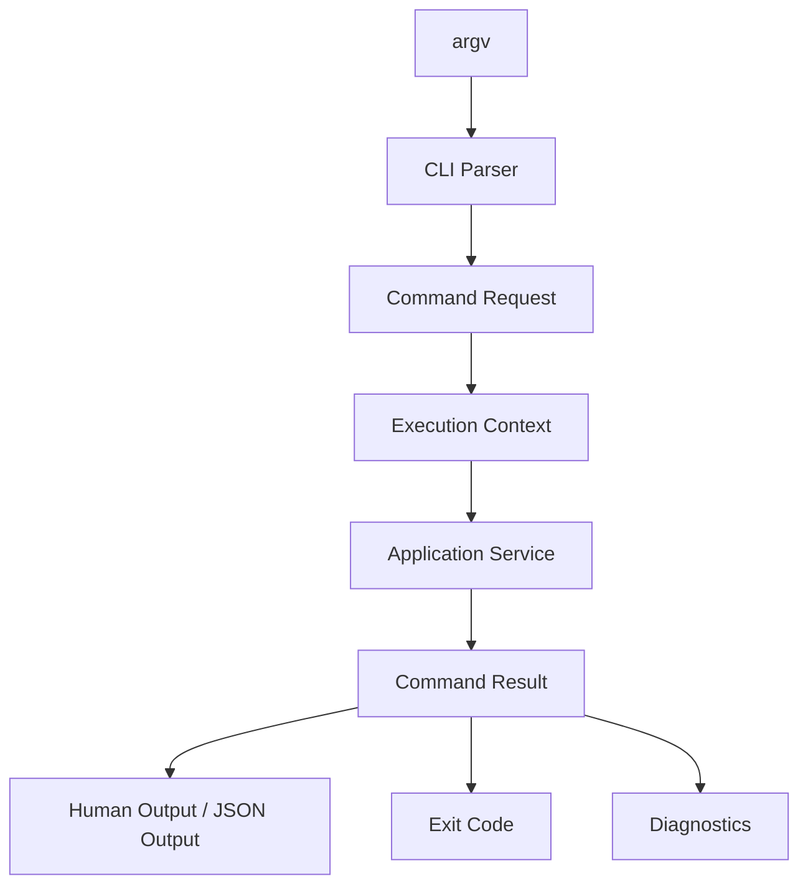
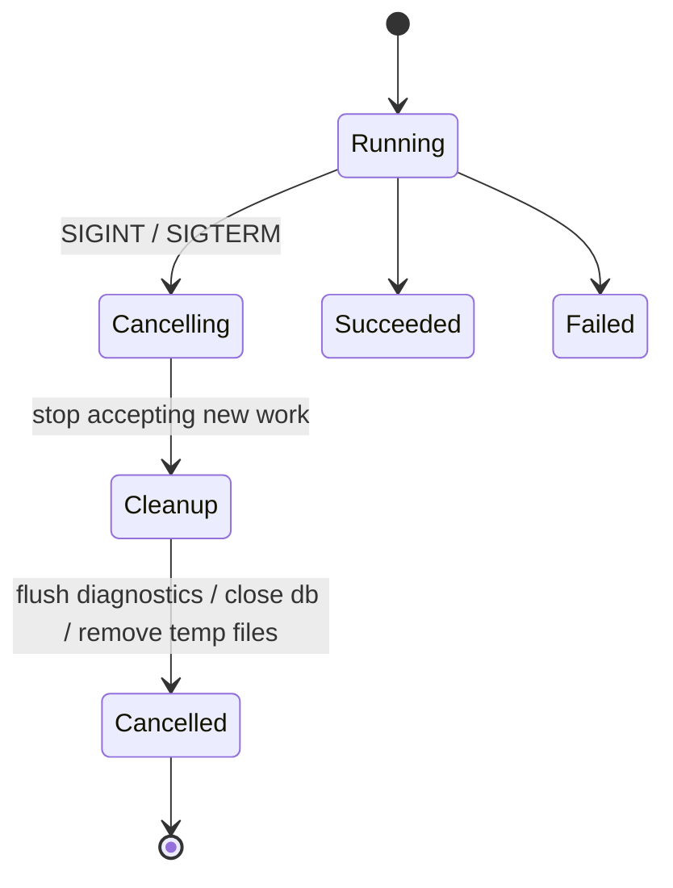
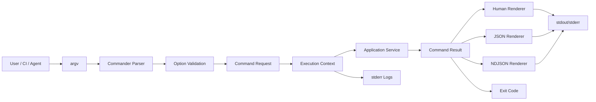

------
title: Build From Scratch: Mintlify-like AI-driven Documentation Generator CLI - Part 005
description: Designing the CLI as a stable public API: command grammar, execution context, diagnostics, exit codes, logging, output modes, cancellation, and testable command handlers.
series: learn-mintlify-like-ai-docs-cli
seriesTitle: Build From Scratch: Mintlify-like AI-driven Documentation Generator CLI
order: 5
partTitle: CLI Foundation and Command Design
tags:
  - documentation
  - ai
  - cli
  - typescript
  - developer-tools
  - architecture
  - diagnostics
  - build-from-scratch
date: 2026-07-03
---

# Part 005 — CLI Foundation and Command Design

Di part sebelumnya kita sudah memilih stack dan repository layout.

Sekarang kita mulai membangun permukaan produk yang pertama kali disentuh user: **CLI**.

Untuk proyek seperti DocForge, CLI bukan sekadar file `bin.ts` yang memanggil function. CLI adalah **public API**. Sekali command, flag, output, exit code, dan struktur error dipakai di CI, automation, GitHub Actions, shell scripts, dan developer workflow, perubahan kecil bisa menjadi breaking change.

Banyak tutorial CLI berhenti di titik ini:

```ts
program.command("build").action(() => build())
```

Itu cukup untuk demo. Tidak cukup untuk developer tool production-grade.

CLI documentation generator yang serius harus bisa menjawab pertanyaan berikut:

- Apa command surface yang stabil?
- Apa bedanya output manusia dan output machine-readable?
- Bagaimana exit code dipakai oleh CI?
- Bagaimana error dilaporkan agar actionable?
- Bagaimana command menjalankan pipeline tanpa tahu detail internal?
- Bagaimana cancellation, timeout, logging, telemetry, dan dry-run diperlakukan?
- Bagaimana memastikan command bisa dites tanpa benar-benar menyentuh filesystem besar atau memanggil LLM?

Part ini membangun fondasi tersebut.

Target akhir part ini:

> Kita memiliki desain CLI shell yang bersih, testable, dan stabil. CLI hanya bertugas mengubah argv menjadi command request, membangun execution context, memanggil application service, lalu mengubah result menjadi output dan exit code.

---

## 1. Mental Model: CLI Is a Protocol

CLI sering dianggap sebagai UI kecil.

Lebih tepatnya:

> CLI adalah protocol antara manusia, shell, CI, dan sistem internal aplikasi.

Protocol berarti ia punya kontrak.

Kontrak CLI terdiri dari:

1. **command grammar**,
2. **argument and option semantics**,
3. **configuration precedence**,
4. **stdout/stderr behavior**,
5. **exit codes**,
6. **diagnostic format**,
7. **backward compatibility policy**.

Jika CLI hanya dipakai secara manual, sedikit inkonsistensi mungkin tidak terasa. Tapi documentation generator akan dipakai dalam:

- local development,
- pre-commit hook,
- CI build,
- release pipeline,
- scheduled docs refresh,
- GitHub PR automation,
- internal platform automation,
- agent workflow.

Maka CLI harus predictable.

Contoh buruk:

```bash
docforge build
# kadang exit 0 walau ada broken link
# kadang print JSON ke stdout bercampur spinner
# kadang warning dianggap error
# kadang membaca config dari lokasi berbeda
```

Contoh baik:

```bash
docforge build --strict --format json
# stdout: JSON result only
# stderr: progress and logs only
# exit code: non-zero jika quality gate gagal
```

Inilah mental model yang akan kita pakai:



CLI parser tidak boleh langsung melakukan build. Ia hanya membentuk request yang valid.

---

## 2. Command Surface Awal

Kita belum akan mengimplementasikan semua fitur. Tapi sejak awal command surface harus memuat arah evolusi produk.

Command utama DocForge:

```bash
docforge init
docforge dev
docforge build
docforge check
docforge scan
docforge generate
docforge update
docforge search
docforge doctor
docforge mcp
docforge version
```

Untuk part ini, kita fokus ke fondasi command. Implementasi penuh command akan dibahas bertahap.

### 2.1 `docforge init`

Membuat struktur dokumentasi awal.

```bash
docforge init
```

Varian penting:

```bash
docforge init --template minimal
docforge init --template api
docforge init --yes
docforge init --dir docs
docforge init --package-manager pnpm
```

`init` harus idempotent dan aman. Ia tidak boleh menimpa file user tanpa izin.

### 2.2 `docforge dev`

Menjalankan local preview server.

```bash
docforge dev
```

Varian:

```bash
docforge dev --port 3000
docforge dev --host 0.0.0.0
docforge dev --open
docforge dev --strict
```

`dev` mengutamakan feedback cepat, bukan build paling lengkap.

### 2.3 `docforge build`

Membangun static output.

```bash
docforge build
```

Varian:

```bash
docforge build --out dist
docforge build --strict
docforge build --format json
docforge build --no-search
docforge build --profile
```

`build` harus deterministic. Input yang sama harus menghasilkan output yang sama, kecuali ada explicit nondeterministic feature seperti timestamp yang dikendalikan config.

### 2.4 `docforge check`

Menjalankan quality gates tanpa emit site final.

```bash
docforge check
```

Varian:

```bash
docforge check --links
docforge check --frontmatter
docforge check --openapi
docforge check --examples
docforge check --format json
```

Ini command yang cocok untuk CI.

### 2.5 `docforge scan`

Membaca repository dan membuat knowledge index.

```bash
docforge scan
```

Varian:

```bash
docforge scan --include "src/**/*.ts"
docforge scan --include "src/**/*.java"
docforge scan --no-cache
docforge scan --format json
```

`scan` tidak harus menulis halaman docs. Ia membangun pemahaman atas source artifact.

### 2.6 `docforge generate`

Membuat atau memperbarui halaman dokumentasi dengan AI.

```bash
docforge generate quickstart
```

Varian:

```bash
docforge generate api-reference --from openapi.yaml
docforge generate concepts --source src
docforge generate --dry-run
docforge generate --apply
```

Default aman: `dry-run` atau preview patch. Untuk perubahan destructive, butuh flag eksplisit.

### 2.7 `docforge update`

Mendeteksi perubahan repo dan menyarankan update docs.

```bash
docforge update
```

Varian:

```bash
docforge update --since main
docforge update --create-pr
docforge update --dry-run
docforge update --format json
```

Ini nantinya menjadi basis self-updating docs workflow.

### 2.8 `docforge doctor`

Mengecek environment.

```bash
docforge doctor
```

Yang dicek:

- Node version,
- package manager,
- config validity,
- MDX compiler availability,
- optional native parser,
- Git availability,
- OpenAPI parser,
- LLM provider configuration,
- output directory writability.

### 2.9 `docforge mcp`

Menjalankan MCP server untuk docs search/retrieval.

```bash
docforge mcp
```

Ini akan dibahas jauh nanti, tapi command surface-nya perlu disiapkan.

---

## 3. Command Grammar yang Konsisten

Command grammar harus terasa konsisten.

Jangan buat kombinasi seperti ini:

```bash
docforge build --output dist
docforge generate --out docs
docforge scan --target src
docforge update --directory docs
```

Lebih baik punya vocabulary seragam:

- `--dir` untuk lokasi docs project,
- `--out` untuk output build,
- `--config` untuk config file,
- `--format` untuk output format,
- `--strict` untuk memperlakukan warning tertentu sebagai error,
- `--dry-run` untuk tidak menulis perubahan,
- `--yes` untuk non-interactive confirmation,
- `--verbose` untuk log detail,
- `--quiet` untuk mengurangi output,
- `--no-color` untuk disable ANSI colors.

Konvensi ini sederhana, tapi efeknya besar. User tidak perlu mengingat grammar berbeda per command.

### 3.1 Global Options

Global options berlaku di hampir semua command:

```bash
docforge <command> \
  --config docforge.config.json \
  --dir docs \
  --cwd /repo \
  --format human \
  --verbose \
  --no-color
```

Global option tidak boleh punya makna berbeda di command berbeda.

Contoh buruk:

- di `build`, `--dir` berarti docs source,
- di `scan`, `--dir` berarti repository root,
- di `generate`, `--dir` berarti output directory.

Lebih baik:

- `--cwd`: repository root,
- `--dir`: docs source directory,
- `--out`: build output directory,
- `--source`: code/source input directory.

### 3.2 Boolean Flags

Boolean flag harus mudah dipahami.

Contoh:

```bash
--strict
--dry-run
--verbose
--quiet
--open
```

Untuk disable default feature, gunakan bentuk `--no-*`:

```bash
--no-search
--no-cache
--no-ai
--no-color
```

Jangan pakai flag ambigu:

```bash
--fast
--safe
--smart
--full
```

`fast` menurut siapa? `smart` artinya apa? `safe` dari risiko apa?

### 3.3 Output Format

Kita butuh output untuk manusia dan mesin.

```bash
--format human
--format json
--format ndjson
```

- `human`: readable, boleh ada warna, table, spinner.
- `json`: satu object valid di stdout.
- `ndjson`: streaming event per line untuk long-running command.

Rule penting:

> Jika `--format json`, stdout harus berisi JSON valid saja. Jangan campur spinner, warning text, atau progress bar ke stdout.

Logs dan progress masuk ke stderr.

---

## 4. Exit Codes sebagai Contract

CI bergantung pada exit code.

Kita definisikan exit code sejak awal.

| Code | Meaning | Contoh |
|---:|---|---|
| 0 | Success | Build berhasil tanpa error fatal |
| 1 | General failure | Error tidak terklasifikasi |
| 2 | Invalid usage | Flag salah, argumen kurang |
| 3 | Config error | Config tidak valid |
| 4 | Source error | File input tidak bisa dibaca, format invalid |
| 5 | Quality gate failed | Broken link, invalid MDX, missing metadata |
| 6 | AI generation failed | Provider error, schema mismatch, unsafe output |
| 7 | Environment error | Dependency runtime tidak tersedia |
| 8 | Cancelled | User interrupt atau signal |
| 9 | Internal bug | Invariant violation |

Kenapa tidak cukup 0 dan 1?

Karena automation perlu membedakan:

- user salah command,
- config rusak,
- docs memang gagal quality gate,
- LLM provider down,
- bug internal.

Contoh CI:

```bash
if ! docforge check --format json > result.json; then
  code=$?
  if [ "$code" = "5" ]; then
    echo "Documentation quality gate failed"
  else
    echo "Tool failed unexpectedly"
  fi
  exit "$code"
fi
```

Exit code adalah bagian dari API.

Jangan sering diubah.

---

## 5. Diagnostics: Error yang Bisa Ditindaklanjuti

CLI buruk berkata:

```txt
Error: build failed
```

CLI lebih baik berkata:

```txt
✖ Invalid frontmatter in docs/api/users.mdx:3

Missing required field: description

How to fix:
Add a description field to the frontmatter.

Example:
description: API reference for user management endpoints.
```

Diagnostic harus memiliki struktur internal yang konsisten.

```ts
export type Severity = "info" | "warning" | "error";

export type Diagnostic = {
  code: string;
  severity: Severity;
  message: string;
  file?: string;
  line?: number;
  column?: number;
  hint?: string;
  docsUrl?: string;
  details?: Record<string, unknown>;
};
```

Contoh diagnostic:

```ts
const diagnostic: Diagnostic = {
  code: "FRONTMATTER_MISSING_DESCRIPTION",
  severity: "error",
  message: "Missing required frontmatter field: description",
  file: "docs/api/users.mdx",
  line: 3,
  hint: "Add a short description used for SEO, search results, and generated navigation.",
};
```

Prinsip diagnostic:

1. punya `code` stabil,
2. menunjuk lokasi jika ada,
3. membedakan severity,
4. menyertakan hint jika memungkinkan,
5. tidak membocorkan secret,
6. bisa dirender sebagai text atau JSON,
7. bisa dipakai oleh editor/CI/agent.

### 5.1 Diagnostic Code Naming

Gunakan namespace.

```txt
CONFIG_INVALID_SCHEMA
CONFIG_UNKNOWN_FIELD
MDX_PARSE_ERROR
MDX_UNKNOWN_COMPONENT
LINK_BROKEN_INTERNAL
LINK_BROKEN_EXTERNAL
OPENAPI_INVALID_SPEC
OPENAPI_UNRESOLVED_REF
AI_OUTPUT_SCHEMA_MISMATCH
AI_UNGROUNDED_CLAIM
SCAN_FILE_TOO_LARGE
SCAN_BINARY_SKIPPED
```

Jangan gunakan message sebagai contract. Message boleh berubah. Code jangan sembarangan berubah.

### 5.2 Diagnostic Rendering

Human format:

```txt
error CONFIG_INVALID_SCHEMA
  docforge.config.json:12:5
  Field "navigation" must be an array.

hint
  Use "navigation": [{ "group": "Guides", "pages": [...] }]
```

JSON format:

```json
{
  "ok": false,
  "exitCode": 3,
  "diagnostics": [
    {
      "code": "CONFIG_INVALID_SCHEMA",
      "severity": "error",
      "message": "Field navigation must be an array.",
      "file": "docforge.config.json",
      "line": 12,
      "column": 5
    }
  ]
}
```

Satu diagnostic system bisa dipakai di semua command.

---

## 6. Application Boundary: CLI Tidak Boleh Mengandung Business Logic

Ini invariant penting:

> CLI command handler tidak boleh melakukan parsing MDX, scan repository, call LLM, atau render static site secara langsung.

CLI handler hanya boleh:

1. parse argv,
2. resolve global options,
3. membuat command request,
4. membuat execution context,
5. memanggil application service,
6. render result,
7. set exit code.

Contoh buruk:

```ts
program.command("build").action(async (options) => {
  const files = await fs.readdir(options.dir);
  const mdx = await compileMdx(files);
  await renderSite(mdx);
});
```

Contoh lebih baik:

```ts
program.command("build").action(async (options) => {
  const request = toBuildRequest(options);
  const result = await buildDocs(request, createExecutionContext(options));
  await renderCommandResult(result);
  process.exitCode = result.exitCode;
});
```

Dengan boundary ini:

- CLI mudah dites,
- service bisa dipanggil dari API lain,
- GitHub Action bisa memakai service yang sama,
- MCP/agent bisa memanggil pipeline yang sama,
- command grammar tidak tercampur dengan domain logic.

---

## 7. Command Request dan Command Result

Setiap command sebaiknya punya request dan result type.

```ts
export type OutputFormat = "human" | "json" | "ndjson";

export type CommonCommandOptions = {
  cwd: string;
  configPath?: string;
  docsDir?: string;
  format: OutputFormat;
  verbose: boolean;
  quiet: boolean;
  color: boolean;
};
```

Build request:

```ts
export type BuildRequest = CommonCommandOptions & {
  outDir: string;
  strict: boolean;
  search: boolean;
  profile: boolean;
};
```

Command result:

```ts
export type CommandResult<TData = unknown> = {
  ok: boolean;
  exitCode: number;
  diagnostics: Diagnostic[];
  data?: TData;
  metrics?: Record<string, number>;
};
```

Build data:

```ts
export type BuildResultData = {
  pagesBuilt: number;
  assetsEmitted: number;
  searchIndexBytes?: number;
  outputDirectory: string;
  durationMs: number;
};
```

Result lengkap:

```ts
export type BuildCommandResult = CommandResult<BuildResultData>;
```

Kenapa ini penting?

Karena semua command akan punya pola sama:

```ts
const result = await service(request, context);
await output.write(result);
return result.exitCode;
```

Bukan command-specific spaghetti.

---

## 8. Execution Context

Command request menjelaskan apa yang diminta user.

Execution context menjelaskan environment eksekusi.

```ts
export type ExecutionContext = {
  cwd: string;
  env: Record<string, string | undefined>;
  stdin: NodeJS.ReadStream;
  stdout: NodeJS.WriteStream;
  stderr: NodeJS.WriteStream;
  logger: Logger;
  clock: Clock;
  signal: AbortSignal;
  color: boolean;
  interactive: boolean;
};
```

Kenapa context tidak langsung pakai `process` di mana-mana?

Karena test.

Kalau service langsung membaca `process.cwd()`, `process.env`, `process.stdout`, dan `Date.now()`, test menjadi sulit dan nondeterministic.

Lebih baik semua dependency environment diinjeksi.

### 8.1 Clock

```ts
export type Clock = {
  now(): Date;
  monotonicMs(): number;
};
```

`Date.now()` bagus untuk timestamp. Tapi duration lebih baik memakai monotonic clock.

### 8.2 Logger

Logger internal tidak sama dengan output command.

```ts
export type Logger = {
  debug(message: string, fields?: Record<string, unknown>): void;
  info(message: string, fields?: Record<string, unknown>): void;
  warn(message: string, fields?: Record<string, unknown>): void;
  error(message: string, fields?: Record<string, unknown>): void;
};
```

Rules:

- human progress boleh ke stderr,
- machine output harus bersih di stdout,
- log detail controlled by verbosity,
- jangan log secret.

---

## 9. stdout vs stderr

Ini detail kecil yang sering diabaikan.

Rule yang kita pakai:

| Stream | Isi |
|---|---|
| stdout | output utama command |
| stderr | progress, warning, error, logs |

Contoh:

```bash
docforge build --format json > build-result.json
```

Jika spinner masuk stdout, file `build-result.json` rusak.

Maka:

- JSON result ke stdout,
- spinner ke stderr,
- diagnostic human ke stderr jika command gagal,
- machine diagnostic masuk JSON stdout jika `--format json`.

Untuk command seperti `docforge search`, stdout bisa berisi hasil search. Untuk `build`, stdout bisa kosong pada human mode atau berisi summary.

Yang penting: behavior konsisten.

---

## 10. Interactive vs Non-interactive Mode

CLI dipakai manusia dan CI.

Maka command harus tahu apakah ia interactive.

```ts
const interactive = process.stdin.isTTY && process.stdout.isTTY;
```

Tapi user bisa override:

```bash
docforge init --yes
CI=true docforge init
```

Rules:

- Jika non-interactive, jangan tampilkan prompt.
- Jika butuh confirmation tapi tidak bisa prompt, fail dengan diagnostic jelas.
- `--yes` berarti memakai default aman, bukan mengizinkan semua operasi berbahaya.

Contoh:

```txt
error INIT_REQUIRES_CONFIRMATION
  docs directory already exists and contains files.

hint
  Run with --yes to accept safe defaults, or pass --force to overwrite generated files only.
```

`--force` tidak boleh menimpa file arbitrary. Kita akan desain init lebih detail di Part 006.

---

## 11. Cancellation dan Signals

Long-running command harus bisa dihentikan.

Command seperti ini bisa lama:

- scan monorepo besar,
- generate AI docs,
- build static site,
- verify code examples,
- crawl external links.

User akan menekan `Ctrl+C`.

Tool yang baik tidak meninggalkan state korup.

Mental model:



Implementasi:

```ts
export function createAbortControllerFromSignals(): AbortController {
  const controller = new AbortController();

  const abort = () => {
    if (!controller.signal.aborted) {
      controller.abort(new Error("Command cancelled"));
    }
  };

  process.once("SIGINT", abort);
  process.once("SIGTERM", abort);

  return controller;
}
```

Application service harus menerima `AbortSignal`.

```ts
await scanRepository({ sourceDir }, { signal: context.signal });
```

Setiap long-running loop harus mengecek signal.

```ts
for (const file of files) {
  throwIfAborted(signal);
  await processFile(file);
}
```

Jangan tunggu semua selesai baru merespons cancellation.

---

## 12. Timeouts

Cancellation datang dari user. Timeout datang dari policy.

Contoh:

```bash
docforge check --timeout 120s
```

Timeout berguna untuk CI agar pipeline tidak menggantung.

Tapi jangan semua command default timeout pendek. Indexing monorepo bisa lama.

Desain awal:

- `dev`: no hard timeout,
- `build`: optional timeout,
- `check`: optional timeout,
- `generate`: provider-level timeout,
- `doctor`: short timeout untuk network/provider checks.

Representasi:

```ts
export type TimeoutPolicy = {
  totalTimeoutMs?: number;
  aiRequestTimeoutMs?: number;
  linkCheckTimeoutMs?: number;
};
```

---

## 13. Progress Reporting

Progress bukan sekadar kosmetik. Untuk command lama, progress memberi confidence.

Tapi progress harus didesain agar tidak merusak machine output.

Progress events:

```ts
export type ProgressEvent =
  | { type: "phase_started"; phase: string }
  | { type: "phase_completed"; phase: string; durationMs: number }
  | { type: "item_processed"; phase: string; current: number; total?: number; label?: string }
  | { type: "diagnostic"; diagnostic: Diagnostic };
```

Human renderer bisa menampilkan spinner.

NDJSON renderer bisa menulis event:

```json
{"type":"phase_started","phase":"scan"}
{"type":"item_processed","phase":"scan","current":42,"total":1200}
{"type":"phase_completed","phase":"scan","durationMs":815}
```

Ini berguna untuk integrasi agent atau UI wrapper.

---

## 14. Machine-readable Output

Jangan jadikan JSON output sebagai afterthought.

Buat schema output sejak awal.

```ts
export type JsonCommandEnvelope<T> = {
  tool: "docforge";
  version: string;
  command: string;
  ok: boolean;
  exitCode: number;
  diagnostics: Diagnostic[];
  data?: T;
  metrics?: Record<string, number>;
};
```

Contoh `build --format json`:

```json
{
  "tool": "docforge",
  "version": "0.1.0",
  "command": "build",
  "ok": true,
  "exitCode": 0,
  "diagnostics": [],
  "data": {
    "pagesBuilt": 32,
    "assetsEmitted": 14,
    "outputDirectory": "dist",
    "durationMs": 1842
  }
}
```

Jangan ubah shape JSON sembarangan. Downstream automation akan bergantung padanya.

Jika perlu perubahan besar, pakai `schemaVersion`.

---

## 15. Strict Mode

`--strict` adalah quality policy, bukan parsing mode.

Tanpa strict:

- warning tetap warning,
- build mungkin berhasil,
- diagnostics tetap ditampilkan.

Dengan strict:

- warning tertentu dipromosikan menjadi error,
- exit code bisa menjadi `5`,
- CI bisa mencegah merge.

Contoh warning:

- page missing description,
- external link timeout,
- code block tanpa language,
- OpenAPI operation tanpa summary,
- generated page tanpa provenance kuat.

Strict policy harus eksplisit.

```ts
export type StrictPolicy = {
  failOnWarnings: boolean;
  failOnBrokenExternalLinks: boolean;
  failOnMissingDescriptions: boolean;
  failOnUngroundedAiClaims: boolean;
};
```

Jangan hardcode semua warning menjadi fatal. Beberapa warning memang informational.

---

## 16. Dry-run dan Apply

AI-driven docs generator harus sangat hati-hati dengan write operations.

Rules:

- command read-only tidak butuh dry-run,
- command yang menulis file harus mendukung dry-run jika feasible,
- AI-generated changes default-nya preview, bukan overwrite,
- `--apply` berarti tulis patch,
- `--dry-run` berarti tampilkan planned changes tanpa menulis.

Contoh:

```bash
docforge generate quickstart --dry-run
```

Output:

```txt
Planned changes:
  create docs/getting-started/quickstart.mdx
  update docforge.config.json navigation

No files were written.
```

Untuk machine output:

```json
{
  "ok": true,
  "data": {
    "plannedChanges": [
      { "type": "create", "path": "docs/getting-started/quickstart.mdx" },
      { "type": "update", "path": "docforge.config.json" }
    ],
    "written": false
  }
}
```

Ini menjadi penting ketika nanti kita membuat PR automation.

---

## 17. CLI Implementation Skeleton

Kita akan pakai struktur package seperti ini:

```txt
packages/
  cli/
    src/
      bin.ts
      program.ts
      commands/
        init.command.ts
        dev.command.ts
        build.command.ts
        check.command.ts
        scan.command.ts
        generate.command.ts
        update.command.ts
        doctor.command.ts
      output/
        human-output.ts
        json-output.ts
        ndjson-output.ts
      runtime/
        context.ts
        signals.ts
        exit-codes.ts
        errors.ts
```

`bin.ts` sebaiknya tipis.

```ts
#!/usr/bin/env node
import { runCli } from "./program";

runCli(process.argv).catch((error) => {
  console.error(error instanceof Error ? error.message : String(error));
  process.exitCode = 9;
});
```

`program.ts` membangun command tree.

```ts
import { Command } from "commander";
import { registerBuildCommand } from "./commands/build.command";
import { registerInitCommand } from "./commands/init.command";

export async function runCli(argv: string[]): Promise<void> {
  const program = new Command();

  program
    .name("docforge")
    .description("AI-driven documentation generator for developer docs")
    .version("0.1.0")
    .option("--cwd <path>", "Working directory", process.cwd())
    .option("--config <path>", "Path to config file")
    .option("--dir <path>", "Documentation source directory")
    .option("--format <format>", "Output format: human, json, ndjson", "human")
    .option("--verbose", "Enable verbose logging", false)
    .option("--quiet", "Reduce output", false)
    .option("--no-color", "Disable colored output");

  registerInitCommand(program);
  registerBuildCommand(program);

  await program.parseAsync(argv);
}
```

Catatan penting: `process.exit()` sebaiknya dihindari di tengah logic command karena bisa memotong async cleanup dan menyulitkan testing. Lebih baik set `process.exitCode` di boundary paling luar.

---

## 18. Command Handler Pattern

Contoh command registration:

```ts
import { Command } from "commander";
import { createExecutionContext } from "../runtime/context";
import { renderResult } from "../output/render-result";
import { buildDocs } from "@docforge/core/build";

export function registerBuildCommand(program: Command): void {
  program
    .command("build")
    .description("Build the documentation site")
    .option("--out <path>", "Output directory", "dist")
    .option("--strict", "Fail on strict quality warnings", false)
    .option("--no-search", "Disable search index generation")
    .option("--profile", "Print performance profile", false)
    .action(async (options, command) => {
      const globals = command.parent?.optsWithGlobals() ?? {};
      const context = createExecutionContext(globals);

      const request = {
        cwd: globals.cwd,
        configPath: globals.config,
        docsDir: globals.dir,
        format: globals.format,
        verbose: globals.verbose,
        quiet: globals.quiet,
        color: globals.color,
        outDir: options.out,
        strict: Boolean(options.strict),
        search: options.search !== false,
        profile: Boolean(options.profile),
      };

      const result = await buildDocs(request, context);
      await renderResult(result, context);
      process.exitCode = result.exitCode;
    });
}
```

Nanti kita akan memperbaiki ini lagi dengan validation layer agar `format` tidak bisa sembarang string.

---

## 19. Validating Options

CLI parser biasanya hanya memastikan argumen ada. Ia tidak selalu memastikan semantic validity.

Contoh:

```bash
docforge build --format xml
```

Secara parsing mungkin valid. Secara domain invalid.

Kita butuh validation.

```ts
const OutputFormatSchema = z.enum(["human", "json", "ndjson"]);

function parseOutputFormat(value: unknown): OutputFormat {
  return OutputFormatSchema.parse(value);
}
```

Tapi jangan biarkan Zod error mentah bocor ke user.

Convert ke diagnostic:

```ts
export function invalidOptionDiagnostic(option: string, value: unknown, allowed: string[]): Diagnostic {
  return {
    code: "CLI_INVALID_OPTION_VALUE",
    severity: "error",
    message: `Invalid value for ${option}: ${String(value)}`,
    hint: `Allowed values: ${allowed.join(", ")}`,
  };
}
```

Output human:

```txt
error CLI_INVALID_OPTION_VALUE
  Invalid value for --format: xml

hint
  Allowed values: human, json, ndjson
```

---

## 20. Config Precedence

CLI harus punya aturan precedence yang jelas.

Urutan yang kita pakai:

```txt
CLI flags > environment variables > config file > defaults
```

Contoh:

```bash
DOCFORGE_DOCS_DIR=docs docforge build --dir documentation
```

`--dir documentation` menang atas environment variable.

Kenapa?

Karena flag eksplisit dalam invocation harus paling kuat.

Representasi:

```ts
export type ResolvedOption<T> = {
  value: T;
  source: "cli" | "env" | "config" | "default";
};
```

Ini membantu diagnostics.

```txt
Using docs directory: documentation
source: CLI flag --dir
```

Untuk debugging config, ini sangat berharga.

---

## 21. Error Taxonomy

Kita pisahkan error menjadi dua:

1. **expected failure**,
2. **unexpected failure**.

Expected failure:

- invalid config,
- broken link,
- missing file,
- invalid MDX,
- OpenAPI invalid,
- AI output schema mismatch.

Unexpected failure:

- invariant violation,
- null pointer equivalent,
- impossible state,
- unhandled exception.

Expected failure harus jadi diagnostic rapi.

Unexpected failure harus jadi internal bug diagnostic, dengan stack trace hanya saat verbose.

```ts
export class ExpectedFailure extends Error {
  constructor(
    message: string,
    public readonly exitCode: number,
    public readonly diagnostics: Diagnostic[],
  ) {
    super(message);
  }
}
```

Boundary:

```ts
try {
  const result = await command();
  process.exitCode = result.exitCode;
} catch (error) {
  const result = errorToCommandResult(error, context);
  await renderResult(result, context);
  process.exitCode = result.exitCode;
}
```

---

## 22. Testing the CLI

CLI harus dites di beberapa level.

### 22.1 Parser Unit Test

Pastikan argv menjadi request yang benar.

```ts
it("parses build options", async () => {
  const result = await parseCli(["node", "docforge", "build", "--out", "site", "--strict"]);

  expect(result.command).toBe("build");
  expect(result.request.outDir).toBe("site");
  expect(result.request.strict).toBe(true);
});
```

### 22.2 Output Snapshot Test

Human output perlu snapshot, tapi hati-hati agar tidak terlalu brittle.

Yang diuji:

- error code muncul,
- file path muncul,
- hint muncul,
- stack trace tidak muncul default.

### 22.3 JSON Contract Test

JSON output harus valid dan stabil.

```ts
it("prints valid json for build result", async () => {
  const output = await runCliCapture(["build", "--format", "json"]);
  const json = JSON.parse(output.stdout);

  expect(json.tool).toBe("docforge");
  expect(json.command).toBe("build");
  expect(Array.isArray(json.diagnostics)).toBe(true);
});
```

### 22.4 Exit Code Test

```ts
it("returns config error exit code for invalid config", async () => {
  const result = await runCliCapture(["build", "--config", "invalid.json"]);
  expect(result.exitCode).toBe(3);
});
```

### 22.5 Signal Test

Signal tests lebih sulit, tapi command service bisa diuji dengan `AbortController`.

```ts
it("stops scan when aborted", async () => {
  const controller = new AbortController();
  controller.abort();

  const result = await scanRepository(request, { ...context, signal: controller.signal });
  expect(result.exitCode).toBe(8);
});
```

---

## 23. Anti-patterns CLI Developer Tool

### 23.1 Calling `process.exit()` Deep Inside Code

Buruk:

```ts
function validateConfig(config: unknown) {
  if (!isValid(config)) process.exit(1);
}
```

Masalah:

- test mati,
- cleanup tidak jalan,
- caller tidak bisa recover,
- service tidak bisa dipakai dari UI/agent.

Lebih baik return diagnostic atau throw expected failure.

### 23.2 Logging JSON + Spinner ke stdout

Buruk:

```txt
⠋ Building...
{"ok":true}
```

Itu bukan JSON valid.

### 23.3 Flag Bermakna Ganda

Buruk:

```bash
--force
```

Tanpa definisi, `force` bisa berarti:

- overwrite files,
- ignore warnings,
- skip validation,
- recreate cache,
- bypass confirmation.

Lebih baik spesifik:

```bash
--overwrite-generated
--ignore-warnings
--no-cache
--yes
```

### 23.4 Silent Success

Command berhasil tapi sebenarnya melakukan terlalu sedikit.

Contoh:

```bash
docforge build
# exit 0, tapi 0 pages built karena docsDir salah
```

Harus ada diagnostic:

```txt
warning BUILD_NO_PAGES_FOUND
  No documentation pages were found in docs.
```

Dalam strict mode, bisa menjadi error.

### 23.5 Non-deterministic Output by Default

Build output jangan berubah hanya karena waktu sekarang, urutan filesystem, atau random ID.

Jika butuh timestamp, buat eksplisit.

---

## 24. Minimal Implementation Plan

Untuk menyelesaikan fondasi CLI, kita butuh urutan implementasi:

1. buat package `@docforge/cli`,
2. buat `bin.ts`,
3. buat `program.ts`,
4. define global options,
5. define exit codes,
6. define diagnostic model,
7. define command result envelope,
8. implement output renderer human/json/ndjson minimal,
9. implement `doctor` dummy command,
10. implement `build` dummy command,
11. test parser dan JSON output,
12. test exit code.

Kenapa mulai dari `doctor` dummy?

Karena `doctor` tidak butuh pipeline docs dulu, tapi bagus untuk menguji command skeleton.

Contoh result dummy:

```ts
export async function doctor(request: DoctorRequest, context: ExecutionContext): Promise<CommandResult> {
  return {
    ok: true,
    exitCode: 0,
    diagnostics: [],
    data: {
      node: process.version,
      cwd: context.cwd,
    },
  };
}
```

---

## 25. Mermaid: CLI Runtime Architecture



---

## 26. Checklist Part 005

CLI foundation dianggap benar jika:

- [ ] command grammar konsisten,
- [ ] global options punya arti tunggal,
- [ ] stdout dan stderr dipisah jelas,
- [ ] JSON output valid tanpa noise,
- [ ] exit code terdokumentasi,
- [ ] diagnostics punya code stabil,
- [ ] command handler tipis,
- [ ] business logic ada di service layer,
- [ ] `AbortSignal` tersedia untuk cancellation,
- [ ] interactive dan non-interactive mode dibedakan,
- [ ] tests bisa menjalankan command tanpa mematikan process,
- [ ] `--strict`, `--dry-run`, dan `--format` punya semantic jelas.

---

## 27. Ringkasan

Part ini membangun fondasi CLI sebagai public API.

Poin paling penting:

1. CLI adalah protocol, bukan wrapper function.
2. Command grammar harus konsisten sejak awal.
3. Exit code adalah contract untuk CI.
4. Diagnostic harus structured dan actionable.
5. stdout harus dipisahkan dari stderr.
6. JSON output tidak boleh bercampur progress.
7. Command handler harus tipis.
8. Business logic hidup di application service.
9. Cancellation dan non-interactive mode harus didesain sejak awal.
10. AI-driven write operations harus mendukung dry-run/apply semantics.

Di part berikutnya, kita akan memakai fondasi ini untuk command pertama yang benar-benar menulis file: **`docforge init` dan docs config awal**.

Kita akan mendesain struktur project, template, config schema, default pages, safety rules, dan idempotency.
